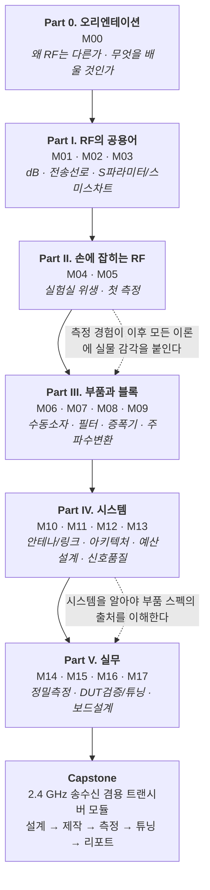

# RF 시스템 엔지니어링 커리큘럼 — 전체 설계서 (Master Design Document)

**문서 번호**: RF-CUR-00
**버전**: v1.2 (3회 검토 반영 + 협의 사항 확정)
**작성일**: 2026-08-20
**문서 성격**: 교육자료 본문이 아니라, **본문을 어떤 순서로·어떤 깊이로·어떤 근거로 채울 것인지 정하는 설계도(blueprint)**
**다음 단계**: 본 설계서 확정 후 모듈별 본문 집필 (M00 → M17 → Capstone)

---

## 0. 이 문서를 읽는 법

이 문서는 **교육 내용 자체가 아닙니다.** 지침 5번("전반적인 큰 그림을 그려서 어떤 순서로 교육을 진행할 것인지, 어떻게 내용을 채울 것인지 먼저 디자인하고, 중언부언 하는 부분이 없게 만들 것")에 대한 답으로서, 다음을 확정합니다.

| 절 | 내용 | 왜 필요한가 |
|---|---|---|
| 1 | 피교육자 프로파일 · 도달 목표 | 깊이와 속도의 기준선 |
| 2 | 설계 원칙 (지침 → 실행 규칙) | 6개 지침을 검증 가능한 규칙으로 변환 |
| 3 | 커리큘럼 전체 구조 | 큰 그림 (6개 파트 Part 0–V · 18모듈 · 1캡스톤) |
| 4 | 학습 경로 및 일정 | 3개 트랙 (집중/표준/자율) |
| 5 | 모듈 상세 명세 18종 | 각 모듈이 무엇을 "소유"하는가 |
| 6 | **개념 소유권 매트릭스** | **중언부언 방지의 핵심 장치** |
| 7 | 축약어 정책 | 지침 2번 이행 방법 |
| 8 | 시각자료 제작 계획 | 지침 4번 이행 방법 |
| 9 | 실습 환경 설계 | 지침 3번 이행 방법 |
| 10 | 평가 · 역량 루브릭 | 실무 수준 도달 여부 판정 |
| 11 | 출처 관리 · 신뢰성 등급 · 교차검증 | 지침 6번 이행 방법 |
| 12 | 제약 사항과 리스크 | 정직한 한계 고지 |
| 13 | 다음 턴 작업 계획 | 분할 작업 진행 방식 |

---

## 1. 피교육자 프로파일과 도달 목표

### 1.1 출발점 (전제 조건)

지침 2번에 따라 피교육자를 **"전기전자공학 초심자"**로 설정합니다. 구체적으로 다음을 가정합니다.

| 항목 | 가정하는 수준 | 근거/보완 방법 |
|---|---|---|
| 회로 이론 | 옴의 법칙, 직렬/병렬, 키르히호프 법칙은 안다 | M01에서 재확인 |
| 교류 회로 | 사인파, 위상, 임피던스 개념을 "들어봤다" 수준 | M02 도입부에서 복소 임피던스를 처음부터 다시 설명 |
| 복소수 | 실수부/허수부, 크기/위상은 안다 | M03 부록에서 복습 |
| 미적분 | 미분·적분의 의미는 알지만 계산은 서툴다 | **수식 유도는 최소화, 결과식 + 물리적 의미 + 수치 예제** 중심 |
| 전자기학 | 맥스웰 방정식을 배운 적이 없거나 기억나지 않는다 | **전자기학을 선수과목으로 요구하지 않음.** 필요한 최소 개념(파장, 전파 속도, 방사)만 M02/M10에서 직관적으로 도입 |
| 프로그래밍 | Python 기초 문법 정도 | M16 자동화 모듈에서 처음부터 설명 |
| 측정 장비 | 오실로스코프를 만져본 적이 있을 수도 있다 | M04에서 RF 장비를 처음부터 설명 |

> **설계 판단**: 많은 RF 교재가 "전자기학 → 전송선로 이론 → 마이크로파 회로"라는 순서를 취합니다(예: Pozar). 그러나 초심자에게 이 순서는 3~4개월간 실물을 만지지 못한 채 수식만 보게 만들어 이탈률이 높습니다. 본 커리큘럼은 Michael Steer의 개방형 교재 시리즈가 채택한 **"systems-first"(시스템 우선)** 접근을 참고하되, 여기에 **"측정을 4번째 모듈에 배치"** 하는 변형을 더합니다. 근거: Steer, *Microwave and RF Design* 시리즈는 명시적으로 "a modern systems-first approach"를 표방하며 셀룰러 통신 사례 중심으로 구성되어 있습니다 ([Engineering LibreTexts](https://eng.libretexts.org/Bookshelves/Electrical_Engineering/Electronics/Microwave_and_RF_Design_I_-_Radio_Systems_(Steer)), [NC State University Libraries](https://www.lib.ncsu.edu/projects/microwave-and-rf-design-open-textbook)).

### 1.2 도달 목표 (Exit Criteria)

커리큘럼 수료 시 피교육자는 다음을 **혼자서** 할 수 있어야 합니다. 이것이 지침 3번("실무 수준으로 발전")의 조작적 정의입니다.

| # | 도달 목표 | 검증 방법 (캡스톤에서 확인) |
|---|---|---|
| G1 | 시스템 요구사항(예: "감도 −95 dBm, 대역 2.4 GHz")을 받아 **부품별 스펙으로 분해**할 수 있다 | 캐스케이드 예산표 작성 |
| G2 | 부품 데이터시트를 읽고 **스펙의 측정 조건까지 해석**할 수 있다 | 데이터시트 독해 과제 |
| G3 | VNA(Vector Network Analyzer, 벡터 회로망 분석기)를 **교정**하고 S-파라미터를 신뢰성 있게 측정할 수 있다 | 교정 후 검증 표준 측정 |
| G4 | SA(Spectrum Analyzer, 스펙트럼 분석기)로 **하모닉·스퓨리어스·인접채널 누설**을 규격 대비 판정할 수 있다 | 규격 대비 Pass/Fail 판정서 |
| G5 | 잡음지수·P1dB·IP3·위상잡음을 **올바른 셋업으로** 측정할 수 있다 | 4종 측정 리포트 |
| G6 | DUT(Device Under Test, 피시험 소자)가 스펙을 만족하는지 **테스트 플랜을 스스로 설계**하고 판정할 수 있다 | 테스트 플랜 문서 |
| G7 | 측정 결과가 이상할 때 **원인을 계통적으로 좁혀** 갈 수 있다 | 디버그 트리 적용 사례 |
| G8 | 정합 회로를 **계산하고 실물에서 튜닝**할 수 있다 | 정합 전/후 S11 개선 실증 |
| G9 | RF 보드의 **스택업·임피던스·레이아웃 규칙을 설계**할 수 있다 | 보드 설계 리뷰 통과 |
| G10 | 측정을 **자동화**하고 데이터를 재현 가능하게 관리할 수 있다 | Python 자동화 스크립트 |
| G11 | 규격 문서(3GPP, ETSI, FCC)에서 **자기 제품에 해당하는 요구사항을 찾아낼 수 있다** | 규격 인용 과제 |

---

## 2. 설계 원칙 — 6개 지침을 실행 규칙으로

지침을 그대로 두면 검증할 수 없으므로, 각 지침을 **집필 시 지킬 수 있는 규칙**과 **위반 여부를 확인하는 체크**로 변환합니다.

### 원칙 1. 참고 사이트 (지침 1)

**규칙 P1-a.** rfdh.com의 교육 철학인 **"왜?"로 시작하는 질문형 전개**를 각 모듈 도입부에 채택한다.
rfdh.com "RF의 기초" 강의실은 다음과 같은 질문형 목차를 갖습니다 — *50옴을 쓰는 이유는? / 마이크로스트립을 쓰는 이유는? / 포트(port)의 정확한 의미는? / 임피던스 매칭을 하는 이유는? / RF에서 S-파라미터를 쓰는 이유는? / dB 단위를 쓰는 이유는? / dB와 dBm의 차이는? / L과 C를 RF 관점에서 보면? / 발진(oscillation)이란? / Large signal과 Small signal의 차이는? / 공진(resonance)의 이해 / IF(중간주파수)는 왜 필요한가? / RF 트랜시버 시스템의 이해 / 하모닉(harmonic)은 왜 생기는가? / Intermodulation의 정체* ([RF의 기초 목차](http://www.rfdh.com/bas_rf.htm), [초보만세](http://www.rfdh.com/bas_rf/beginer.htm), [50옴을 쓰는 이유](https://rfdh.com/bas_rf/begin/50ohm.htm), [S파라미터](https://rfdh.com/bas_rf/s.htm), [발진기](https://rfdh.com/bas_rf/begin/osc.htm), [믹서](https://rfdh.com/bas_rf/begin/mixer.php3), [Intermodulation의 정체](http://www.rfdh.com/bas_rf/begin/im.htm), [RF 공부 과목](http://www.rfdh.com/bas_rf/begin/curi.htm)).

**규칙 P1-b.** 위 질문 15개는 **모두 본 커리큘럼 안에서 답을 얻도록** 배치한다. 어느 모듈이 어느 질문에 답하는지는 §6.2 매핑 표에 명시한다.

> ⚠️ **제약 고지**: 현재 세션의 조직 egress(외부 통신) 정책이 rfdh.com을 포함한 거의 모든 외부 도메인의 직접 접속을 차단합니다(§12 참조). 따라서 rfdh.com **본문을 그대로 인용하지 않고**, 검색 결과로 확인된 **목차 구조와 교육 철학만 참고**하며, 각 주제의 실질 내용은 §11에 정리한 **1차·2차 출처**로 독립 작성합니다. 이 방식이 오히려 지침 6번(출처 명시, 교차검증)에 부합합니다.

### 원칙 2. 초심자 눈높이 + 축약어 병기 (지침 2)

**규칙 P2-a.** 모든 축약어는 **최초 등장 시 반드시 "한글 풀이(영문 원어, 약어)"** 형태로 표기한다.
> 예: 잡음지수(Noise Figure, NF), 벡터 회로망 분석기(Vector Network Analyzer, VNA), 인접 채널 누설비(Adjacent Channel Leakage Ratio, ACLR)

**규칙 P2-b.** 각 모듈 말미에 **그 모듈에서 나온 축약어 표**를 붙이고, 전 과정 통합 **축약어 마스터 목록(부록 A)** 을 별도 문서로 유지한다.

**규칙 P2-c.** 새 개념 도입 시 **3단 설명 구조**를 강제한다.
1. **직관** — 비유 또는 일상 현상 (수식 없음)
2. **정의** — 정확한 정의와 결과식 (유도는 필요 시 접이식 블록으로 분리)
3. **수치** — 실제 숫자가 들어간 예제 1개 이상

**규칙 P2-d.** 수식은 **결과식 위주**로 제시하고, 긴 유도는 `<details>` 접이식 블록에 넣어 "읽지 않아도 진도가 나가게" 한다.

**규칙 P2-e.** "당연히 알 것"으로 넘어가지 않는다. 특히 다음은 반드시 명시적으로 설명한다 — dB의 10 vs 20 계수, 임피던스가 왜 복소수인가, 반사가 왜 생기는가, 왜 전력으로 이야기하는가.

### 원칙 3. 실무 수준 도달 (지침 3)

**규칙 P3-a.** **모든 모듈은 실습(Lab)을 포함한다.** 예외 없음. 장비가 없어도 가능한 대체 실습(시뮬레이션/데이터 분석)을 함께 제시한다.

**규칙 P3-b.** 실습은 **3계층 장비 등급(Tier)** 으로 제공한다 (§9). Tier 0는 무료 소프트웨어만, Tier 1은 저가 장비(약 20~50만 원), Tier 2는 실무 장비.

**규칙 P3-c.** 실무 4대 역량 — **① 측정(Test) ② 튜닝(Tuning) ③ DUT 스펙 확인 ④ 보드 설계** — 는 각각 전용 모듈을 갖는다 (M14/M15 · M16 · M16 · M17).

**규칙 P3-d.** 각 실습은 **"셋업도 → 절차 → 예상 결과 → 흔한 실수 → 판정 기준"** 5요소를 갖춘다.

### 원칙 4. 시각자료 (지침 4)

**규칙 P4-a.** 각 모듈은 **최소 5개**의 시각자료를 포함한다. 종류: 블록도, 회로도, 파형/스펙트럼 그림, 스미스 차트, 레이아웃/단면도, 측정 셋업도, 데이터 플롯, 판정 흐름도.

**규칙 P4-b.** 외부 이미지를 링크하지 않는다(접속 차단 + 저작권 문제). **모든 그림을 직접 생성**한다 (§8).

**규칙 P4-c.** 그림에는 반드시 **캡션 + 읽는 법 설명**을 붙인다. 초심자는 그림을 "볼" 줄 모르기 때문이다.

### 원칙 5. 중언부언 방지 (지침 5)

**규칙 P5-a. 개념 소유권(Concept Ownership) 원칙** — 모든 핵심 개념은 **정확히 하나의 모듈만** 이를 "소유"하여 정식 정의한다. 다른 모듈은 정의를 반복하지 않고 **`→ M0X §Y 참조`** 로 링크만 건다. 소유권 표는 §6.1.

**규칙 P5-b. 3회 초과 재등장 금지** — 동일 개념의 설명(정의/유도)이 3개 모듈을 넘어 반복되면 위반으로 간주하고 통합한다.

**규칙 P5-c. 나선형(spiral) 금지, 층위(layer) 채택** — 같은 내용을 난이도를 올려 반복하는 나선형 대신, **"기초 정의 → 응용 → 측정"** 으로 *다른 각도*에서만 재접촉한다. 예: 잡음지수는 M08에서 **정의**, M12에서 **캐스케이드 계산에 사용**, M15에서 **측정 방법**. 세 번 나오지만 내용이 겹치지 않는다.

**규칙 P5-d.** 각 모듈 문서 머리에 **"이 모듈이 소유하는 개념" / "선수 모듈" / "이 모듈을 쓰는 후속 모듈"** 을 명시한다.

### 원칙 6. 검토 3회 · 출처 · 교차검증 (지침 6)

**규칙 P6-a.** 모든 모듈 본문은 **최대 3회**의 검토를 거친다. 각 회차의 관점은 고정한다.
- **1차 검토 — 사실 정확성(Technical)**: 수식·수치·단위·정의 오류, 출처 대조
- **2차 검토 — 교육 효과(Pedagogical)**: 초심자가 따라올 수 있는가, 축약어 병기 누락, 3단 설명 구조 준수
- **3차 검토 — 구조 정합성(Structural)**: 개념 소유권 위반(중복), 참조 링크 유효성, 시각자료 5개 충족

**규칙 P6-b.** **출처 등급제**를 적용한다 (§11.1). 등급 A(1차 규격·표준화 기구·국가계량기관), 등급 B(장비/반도체 제조사 공식 앱노트·개방형 교재), 등급 C(학술 논문), 등급 D(업계 기술 매체·블로그). **등급 D 단독으로는 수치를 제시하지 않는다.**

**규칙 P6-c. 교차검증** — 정량적 수치(예: dB 값, 규격 한계치, 상수)는 **서로 독립적인 출처 2곳 이상**에서 확인한다. 확인 불가한 경우 본문에 **"단일 출처, 미교차검증"** 이라 명시한다.

**규칙 P6-d.** 각 모듈 말미에 **출처 목록(등급 표기 포함)** 을 둔다.

---

## 3. 커리큘럼 전체 구조 (큰 그림)

### 3.1 6개 파트 구성의 논리



### 3.2 왜 이 순서인가 (설계 근거)

| 배치 결정 | 근거 |
|---|---|
| **dB(M01)를 맨 앞에** | RF의 모든 문서·데이터시트·장비 화면이 dB 단위로 되어 있어, 이걸 모르면 아무것도 읽을 수 없다. rfdh.com도 "dB 단위를 쓰는 이유는?"을 기초 항목으로 배치 ([출처](http://www.rfdh.com/bas_rf.htm)). |
| **전송선로(M02)를 2번째** | "왜 50 Ω인가", "왜 반사가 생기는가"는 RF와 저주파를 가르는 분기점. Steer 시리즈 Volume II 전체가 전송선로에 배정될 만큼 비중이 크다 ([LibreTexts Vol. II](https://eng.libretexts.org/Bookshelves/Electrical_Engineering/Electronics/Microwave_and_RF_Design_II_-_Transmission_Lines_(Steer))). |
| **S-파라미터(M03)를 3번째** | 고주파에서 전압·전류를 직접 측정하기 어려워 진행파 비율로 기술하는 것이 S-파라미터이며, RF 회로 결과의 사실상 표준 표현 ([Microwaves101 S-parameters](https://www.microwaves101.com/encyclopedias/s-parameters), [rfdh S파라미터](https://rfdh.com/bas_rf/s.htm)). 이후 모든 부품 설명이 S-파라미터로 이루어지므로 부품 앞에 와야 한다. |
| **측정(M04·M05)을 부품보다 앞에** | ① 학습 동기 유지 ② 이후 모든 부품 설명에서 "이건 이렇게 측정한 값"이라고 말할 수 있게 됨 ③ 커넥터 파손 등 실수는 **배우기 전에** 막아야 한다. NanoVNA/tinySA 같은 저가 장비가 이 조기 배치를 가능하게 만든다 ([tinySA 소개](https://www.rtl-sdr.com/the-49-tinysa-spectrum-analyzer/), [NanoVNA 입문 가이드](https://rfcharge.com/blogs/industry-technology-insights/nanovna-complete-beginner-guide)). |
| **증폭기(M08) 앞에 수동소자·필터(M06·M07)** | 증폭기 정합·안정화에는 L/C의 기생 성분과 공진 이해가 필수 전제. |
| **아키텍처(M11) 앞에 믹서·발진기(M09)** | 슈퍼헤테로다인/Zero-IF 비교는 믹서 이미지·LO 누설을 알아야 의미가 생긴다. |
| **예산설계(M12)를 시스템 파트 후반에** | Friis 캐스케이드 계산은 이득·NF·IP3(M08), 믹서 손실(M09), 안테나/경로손실(M10)이 모두 있어야 성립. |
| **정밀측정(M14·M15)을 뒤에** | 교정 이론과 불확도는 S-파라미터·잡음·위상잡음 개념이 선행되어야 한다. M04/M05의 "장비 조작"과 명확히 역할 분리(§6.1). |
| **보드설계(M17)를 맨 뒤** | 보드는 앞의 모든 지식이 물리적으로 구현되는 곳. 스택업·임피던스·접지·EMC는 전송선로+시스템+측정을 모두 안 뒤에야 판단할 수 있다. |

---

## 4. 학습 경로와 일정

### 4.1 3개 트랙

| 트랙 | 대상 | 기간 | 주당 시간 | 범위 |
|---|---|---|---|---|
| **A. 집중(Intensive)** | 신입 RF 엔지니어 OJT | **12주 + 캡스톤 2주** | 20 h (이론 8 + 실습 12) | 전 모듈 + 캡스톤 |
| **B. 표준(Standard)** | 학부생/직무 전환자 | **24주 + 캡스톤 3주** | 8 h (이론 4 + 실습 4) | 전 모듈 + 캡스톤 |
| **C. 자율(Self-paced)** | 이미 인접 분야 종사 | 무기한 | 자유 | §4.3 진입점 표에 따라 선택 |

### 4.2 표준 트랙(24주) 주차 배분

| 주차 | 모듈 | 핵심 산출물 |
|---|---|---|
| 1 | M00 오리엔테이션 | 학습 계약서 · 장비 조달 계획 |
| 2 | M01 데시벨과 전력 | dB 변환 계산 워크시트 |
| 3–4 | M02 전송선로 | 마이크로스트립 임피던스 계산 결과 |
| 5–6 | M03 S-파라미터·스미스 차트 | Touchstone 파일 해석 리포트 |
| 7 | M04 RF 실험실 입문 | 커넥터 점검 체크리스트 |
| 8 | M05 첫 측정 | S11/스펙트럼 측정 리포트 #1 |
| 9 | M06 수동소자와 공진 | 인덕터 SRF 실측 |
| 10 | M07 필터와 수동 네트워크 | 필터 특성 측정·규격 대조 |
| 11–12 | M08 증폭기 | 이득/NF/P1dB/IP3 개념 문제집 |
| 13–14 | M09 주파수 변환과 신호원 | 주파수 계획서(스퍼 표) |
| 15 | M10 안테나와 전파 | 링크 버짓 스프레드시트 |
| 16 | M11 트랜시버 아키텍처 | 아키텍처 비교 트레이드오프 표 |
| 17–18 | M12 시스템 예산 설계 | **캐스케이드 예산표 (핵심 산출물)** |
| 19 | M13 변조와 신호품질 | EVM/ACLR 규격 해석서 |
| 20 | M14 정밀측정 I — VNA 교정 | 교정 검증 리포트 |
| 21 | M15 정밀측정 II — NF/위상잡음/변조 | 4종 측정 리포트 |
| 22 | M16 DUT 스펙 검증·튜닝·자동화 | **테스트 플랜 + 자동화 스크립트** |
| 23 | M17 RF 보드 설계와 인증 | 보드 설계 리뷰 패키지 |
| 24 | Capstone (P1 시스템 설계) | RX/TX 예산표 · 주파수 계획서 |
| **25–27** | **Capstone (P2–P4)** | **보드 설계 · 측정 · 튜닝 · 판정 · 리뷰** |

> **캡스톤 확대에 따른 일정 조정(v1.2)**: 캡스톤 주제가 송수신 겸용 트랜시버로 확대되면서 1주로는 수행이 불가능해졌습니다. 표준 트랙은 **24 → 27주**로 연장하거나, 24주를 유지하려면 캡스톤 **축소 옵션**(P1+P2 필수, P3·P4는 RX만)을 적용하십시오.

### 4.2-b 집중 트랙(12주) 주차 배분

> **3차 검토 지적 반영**: 초안에서는 "2주 → 1주로 압축"이라고만 적었으나 실제로 계산하면 12주에 들어맞지 않았습니다. 아래와 같이 명시적으로 재배분합니다.

| 주차 | 모듈 | 비고 |
|---|---|---|
| 1 | M00 + M01 | 오리엔테이션과 dB를 한 주에 |
| 2 | M02 | 전송선로는 압축하지 않음 (핵심) |
| 3 | M03 | S-파라미터·스미스 차트도 압축하지 않음 (핵심) |
| 4 | M04 + M05 | 실험실 입문과 첫 측정을 연속 실습으로 |
| 5 | M06 + M07 | 수동소자·필터 |
| 6 | **M08** | **단독 배정** (최대 밀도 모듈) |
| 7 | M09 | 주파수 변환·신호원 |
| 8 | M10 + M11 | 안테나/링크 + 아키텍처 |
| 9 | **M12** | **단독 배정** (핵심 산출물 작성) |
| 10 | M13 + M14 | 신호품질 + VNA 교정 |
| 11 | M15 + M16 | 정밀측정 + DUT 검증/튜닝/자동화 |
| 12 | M17 | 보드 설계와 인증 |
| **13–14** | **Capstone** | **종합 프로젝트 (P1–P4)** |

집중 트랙은 주 20시간 기준이며, **M08과 M12는 압축하지 않고 단독 주차를 유지**합니다. 이 두 모듈이 흔들리면 이후 전부가 흔들리기 때문입니다.

> **캡스톤 확대에 따른 일정 조정(v1.2)**: 트랜시버 캡스톤은 주 20시간 기준 **2주(13–14주차)** 가 필요합니다. 12주를 엄수해야 한다면 캡스톤 **축소 옵션**을 적용해 12주차에 M17과 함께 수행하십시오.

### 4.3 자율 트랙 진입점

| 이미 알고 있다면 | 여기서 시작 |
|---|---|
| dB, 전송선로, 스미스 차트 | M04 |
| 위 + 측정 장비 조작 경험 | M06 |
| 위 + RF 부품 스펙 읽기 | M10 |
| 위 + 트랜시버 구조 | M12 |
| 회로 설계 경험은 있으나 측정이 약함 | M04 → M14 → M15 → M16 |
| 측정은 되나 설계가 약함 | M12 → M17 → Capstone |

---

## 5. 모듈 상세 명세

표기 규약:
- **소유 개념** = 이 모듈이 정식 정의하는 개념 (다른 모듈은 참조만)
- **Lab** = 필수 실습 (T0=Tier 0 소프트웨어만, T1=저가 장비, T2=실무 장비)
- **시각자료** = 최소 5종 (규칙 P4-a)

---

### Part 0. 오리엔테이션

#### **M00 — RF 시스템 엔지니어링이란 무엇인가**

| 항목 | 내용 |
|---|---|
| **선수** | 없음 |
| **소유 개념** | RF/마이크로파 주파수 구분, 파장과 회로 크기의 관계(집중소자 vs 분포소자), RF 시스템 엔지니어의 직무, 스펙 플로우다운의 개념적 소개 |
| **학습 목표** | ① 왜 고주파에서는 회로 이론이 깨지는지 한 문장으로 설명한다 ② RF 엔지니어가 하루에 하는 일을 나열한다 ③ 자기 학습 계획을 세운다 |
| **주요 절** | 1) 전선 한 가닥이 안테나가 되는 순간 — 파장 vs 물리적 길이 <br> 2) RF·마이크로파·밀리미터파의 경계와 대역 명칭(HF/VHF/UHF/L/S/C/X/Ku/Ka, 5G FR1/FR2) <br> 3) RF 시스템 엔지니어의 직무: 요구사항 분석 → 아키텍처 정의 → 스펙 배분 → 검증 계획 → 통합 <br> 4) 이 커리큘럼의 지도와 사용법 <br> 5) 장비·소프트웨어 준비 |
| **Lab** | **L00-a (진단)**: **선수 지식 자가진단 20문항** — §1.1의 가정(옴의 법칙, 사인파/위상, 복소수, 로그)이 실제로 갖춰졌는지 확인하고, 부족한 항목은 부록 E(수학·회로 보충)의 해당 절로 안내 <br> **L00-b (T0)**: 자기 주변 무선기기 3종(Wi-Fi 공유기, 휴대폰, 자동차 스마트키)의 주파수·출력·적용 규격을 조사해 표로 정리 |
| **시각자료** | ① 주파수 스펙트럼 대역 지도(SVG) ② 파장 vs 회로 크기 비교도 ③ RF 엔지니어 업무 흐름도(Mermaid) ④ 커리큘럼 전체 지도 ⑤ 트랜시버 최상위 블록도(이후 모듈이 어디를 채우는지 색칠) |
| **주요 출처** | RF 시스템 엔지니어 직무 정의: [Lockheed Martin RF Systems Engineer](https://www.lockheedmartinjobs.com/job/huntsville/rf-systems-engineer/694/78970220048), [Velvet Jobs RF Systems Engineer](https://www.velvetjobs.com/job-descriptions/rf-systems-engineer) (등급 D, 교차검증 2건) · 시스템 우선 접근: [Steer Vol. I](https://eng.libretexts.org/Bookshelves/Electrical_Engineering/Electronics/Microwave_and_RF_Design_I_-_Radio_Systems_(Steer)) (등급 B) · [rfdh: RF와 통신의 차이](http://www.rfdh.com/bas_rf.htm) |

---

### Part I. RF의 공용어

#### **M01 — 데시벨과 전력: RF의 숫자 읽는 법**

| 항목 | 내용 |
|---|---|
| **선수** | M00 |
| **소유 개념** | dB, dBm, dBW, dBc, dBi, dBd, dBμV, 로그 스케일, 전력비 vs 전압비(10 log vs 20 log), 임피던스 기준의 의미, 열잡음 전력 kTB와 −174 dBm/Hz, 잡음 바닥(noise floor), 감쇠·이득의 덧셈 계산 |
| **학습 목표** | ① dB와 dBm의 차이를 설명한다 ② 이득·손실이 섞인 체인의 출력 전력을 암산에 가깝게 계산한다 ③ 상온 열잡음 바닥이 왜 −174 dBm/Hz인지 설명한다 |
| **주요 절** | 1) 왜 로그를 쓰는가 — 곱셈을 덧셈으로 <br> 2) dB의 정의와 10 vs 20 계수의 진짜 이유 <br> 3) 절대 단위: dBm, dBW, dBμV <br> 4) 상대 단위: dBc, dBi, dBd <br> 5) 3 dB / 10 dB의 직관(2배 / 10배)과 암산법 <br> 6) 열잡음: kTB, −174 dBm/Hz, 대역폭이 잡음을 결정한다 <br> 7) 흔한 함정: dB 값을 그냥 더하면 안 되는 경우(비상관 신호의 합) |
| **Lab** | **L01 (T0)**: Python으로 dB 변환기와 체인 전력 계산기 작성. 주어진 체인(안테나 → 케이블 → LNA → 필터 → 믹서)의 출력 전력·잡음 바닥 계산 |
| **시각자료** | ① 선형 vs dB 스케일 비교 플롯 ② dB 단위 계통도(SVG) ③ 체인 전력 사다리 그림(레벨 다이어그램) ④ kTB 대역폭 의존 플롯 ⑤ 3 dB 암산 치트시트 |
| **주요 출처** | [rfdh: dB와 dBm의 차이](http://www.rfdh.com/bas_rf.htm) · [Steer Vol. I](https://eng.libretexts.org/Bookshelves/Electrical_Engineering/Electronics/Microwave_and_RF_Design_I_-_Radio_Systems_(Steer)) (등급 B) · 열잡음/잡음지수 기초: [Keysight AN 5952-8255 *Fundamentals of RF and Microwave Noise Figure Measurements*](https://www.keysight.com/us/en/assets/7018-06808/application-notes/5952-8255.pdf) (등급 B) · kTB와 기준온도 T₀ = 290 K, −174 dBm/Hz: [*Understanding Noise Figure* (기술노트)](https://www.qsl.net/va3iul/Noise/Understanding%20Noise%20Figure.pdf), [Maury Microwave: *Noise By the Numbers*](https://maurymw.com/wp-content/uploads/Noise_By_the_Numbers_web2.pdf) (등급 B), [All About Circuits: Understanding the RF Noise Figure Specification](https://www.allaboutcircuits.com/technical-articles/understanding-the-noise-figure-specification/) (등급 D) — **교차검증 3건 완료** (정확값 −173.98 dBm/Hz @ 290 K, 관례상 −174로 반올림) |

---

#### **M02 — 전송선로: 왜 50 Ω이고, 왜 반사가 생기는가**

| 항목 | 내용 |
|---|---|
| **선수** | M01 |
| **소유 개념** | 파장·전기적 길이, 분포정수 회로, 특성 임피던스 Z₀, 전파상수, 위상속도·단축률, 반사계수 Γ, 정재파비(VSWR), 반사손실(Return Loss), 삽입손실, 정재파, 개방/단락 종단의 임피던스 변환, 전송선 종류(동축, 마이크로스트립, 스트립라인, 접지형 코플래너 도파관 GCPW, 도파관), 유전율 Dk와 손실탄젠트 Df |
| **학습 목표** | ① 왜 50 Ω이 표준이 되었는지 설명한다 ② Γ ↔ VSWR ↔ 반사손실을 상호 변환한다 ③ 주어진 기판에서 50 Ω 마이크로스트립 선폭을 계산한다 |
| **주요 절** | 1) 언제부터 "선"이 "회로"가 되는가 — λ/10 경험칙 <br> 2) 분포정수 모델(L, C, R, G) <br> 3) 특성 임피던스의 의미 — "무한히 긴 선이 보여주는 저항" <br> 4) **왜 50 Ω인가** — 공기 유전체 동축선에서 서로 다른 최적점이 충돌한다: **최소 손실 ≈ 77 Ω, 최대 전력 ≈ 30 Ω, 최대 내전압 ≈ 60 Ω.** 30과 77의 산술평균은 53.5, 기하평균은 48이며 그 사이의 **50 Ω이 "가장 덜 나쁜 절충"** 으로 정착 <br> 5) 반사 — Γ = (Z_L − Z₀)/(Z_L + Z₀), 정재파의 형성 <br> 6) VSWR·반사손실·Γ 삼각 관계표 <br> 7) 전송선 종류별 장단점과 선택 기준 — **왜 마이크로스트립을 쓰는가** <br> 8) 기판 재료: Dk, Df, 두께, 동박 거칠기 |
| **Lab** | **L02-a (T0)**: 마이크로스트립 임피던스 계산기 작성/검증 <br> **L02-b (T1)**: NanoVNA로 케이블 개방/단락 종단의 S11 궤적 관찰, 전기적 길이 추정 |
| **시각자료** | ① 집중 vs 분포 소자 판단 기준 그림 ② 전송선 등가회로(SVG 회로도) ③ 정재파 애니메이션 대체 스틸 컷(위치별 전압 진폭) ④ Γ–VSWR–RL 변환 곡선 플롯 ⑤ 동축/마이크로스트립/스트립라인/GCPW 단면도(SVG) ⑥ 동축선 손실·전력·내전압 vs 임피던스 곡선(30/50/60/77 Ω 표시, 50 Ω 절충 근거, 직접 생성) |
| **주요 출처** | [Steer Vol. II — Transmission Lines](https://eng.libretexts.org/Bookshelves/Electrical_Engineering/Electronics/Microwave_and_RF_Design_II_-_Transmission_Lines_(Steer)) (등급 B) · [Microwaves101: Microstrip](https://www.microwaves101.com/encyclopedias/microstrip) (등급 B) · [rfdh: 50옴을 쓰는 이유](https://rfdh.com/bas_rf/begin/50ohm.htm), [RFDB MicroStrip 계산기](https://rfdh.com/rfdb/msline.htm) · 50 Ω 유래(30/60/77 Ω 절충): [Gary Breed, *There's Nothing Magic About 50 Ohms*, High Frequency Electronics](https://ptacts.uspto.gov/ptacts/public-informations/petitions/1556705/download-documents?artifactId=zZcqPwdS9RS22BDkL4Gc28WNLtSHEbJT-SOD11KzDToEyYTpMFI3XDU) (등급 C), [Altium: The Mysterious 50 Ohm Impedance](https://resources.altium.com/p/mysterious-50-ohm-impedance-where-it-came-and-why-we-use-it) (등급 D), [Vikram Sekar: Why 50 Ohms Became the RF Standard](https://www.viksnewsletter.com/p/why-50-ohms-became-the-rf-standard) (등급 D) — **교차검증 3건 완료** · GCPW/스택업 실무: [TI mmWave HW Design Guide](https://e2e.ti.com/cfs-file/__key/communityserver-discussions-components-files/1023/2526.mmWave_5F00_hw_5F00_design_5F00_guide_5F00_rev_5F00_9.pdf) (등급 B) · VSWR/반사손실 실무 기준: [Antenna Test Lab: Return Loss and VSWR](https://antennatestlab.com/antenna-education-tutorials/return-loss-vswr-explained) (등급 D, 교차검증 필요) |

---

#### **M03 — S-파라미터와 스미스 차트: 정합의 언어**

| 항목 | 내용 |
|---|---|
| **선수** | M02 |
| **소유 개념** | 포트의 정확한 의미, 진행파 a/b, S-파라미터 정의(S11/S21/S12/S22), 기준 임피던스, 상호성·무손실·유니터리 조건, Z/Y/ABCD 파라미터와 변환, 캐스케이드(T-파라미터), Touchstone 파일 포맷, 스미스 차트 읽기, 임피던스 정합(L형 네트워크, λ/4 변환기, 스터브 정합), 정합의 목적(전력 전달 최대화 vs 잡음 최소화 vs 반사 억제) |
| **학습 목표** | ① S21이 −3 dB라는 말의 의미를 물리적으로 설명한다 ② 스미스 차트에서 임의의 부하를 50 Ω으로 옮기는 L형 정합을 설계한다 ③ Touchstone(.s2p) 파일을 읽어 필요한 값을 뽑는다 |
| **주요 절** | 1) 고주파에서 왜 Z/Y 대신 S인가 — 개방/단락 기준의 붕괴 <br> 2) 포트란 무엇인가 <br> 3) S-파라미터 정의와 물리적 해석 <br> 4) 행렬 성질로 부품 성격 읽기(상호성·무손실) <br> 5) 스미스 차트 — 왜 원인가, 무엇이 원이고 무엇이 호인가, 읽는 순서 <br> 6) 정합 기법 3종: L형 / λ/4 / 스터브 <br> 7) **왜 정합을 하는가** — 3가지 다른 목적과 그때그때 다른 최적점 <br> 8) Touchstone 포맷과 scikit-rf 사용법 |
| **Lab** | **L03-a (T0)**: scikit-rf로 .s2p 읽기 → S21 dB 플롯, 캐스케이드/디임베딩 <br> **L03-b (T0)**: 임의 부하에 대한 L형 정합 설계 후 스미스 차트에 궤적 그리기 <br> **L03-c (T1)**: NanoVNA 실측 데이터를 Touchstone으로 저장해 (a)에 투입 |
| **시각자료** | ① 2포트 진행파 정의 그림 ② S-파라미터 4개 의미 도해 ③ 스미스 차트 눈금 해부도(SVG, 직접 렌더) ④ L형 정합 궤적 애니메이션 대체 컷 ⑤ λ/4 변환기 회로도 + 대역폭 플롯 ⑥ Touchstone 파일 구조 주석 그림 |
| **주요 출처** | [Steer Vol. III — Networks](https://eng.libretexts.org/Bookshelves/Electrical_Engineering/Electronics/Microwave_and_RF_Design_III_-_Networks_(Steer)) (등급 B) · [Microwaves101: S-parameters](https://www.microwaves101.com/encyclopedias/s-parameters) (등급 B) · [rfdh: S파라미터](https://rfdh.com/bas_rf/s.htm) · 정합 이론: [UIUC ECE329 Lecture 37 — Smith Chart and Impedance Matching](https://courses.grainger.illinois.edu/ece329/sp2021/Lecture_notes/329lect37-L39.pdf), [USPAS: Impedance Matching and Smith Charts (Staples, LBNL)](https://uspas.fnal.gov/materials/08UCSC/mml13_matching+smith_chart.pdf) (등급 C, 교차검증 2건) · λ/4 변환기: [Cadence: Quarter-Wave Transformers](https://resources.system-analysis.cadence.com/blog/msa2023-quarter-wave-transformer-theory-and-equations) (등급 D) · 도구: [scikit-rf 문서](https://scikit-rf.readthedocs.io/en/latest/tutorials/Introduction.html) (등급 B) |

---

### Part II. 손에 잡히는 RF

#### **M04 — RF 실험실 입문: 장비, 안전, 그리고 커넥터**

> **역할 분리 주의**: 이 모듈은 **"장비를 망가뜨리지 않고 조작하는 법"** 만 다룹니다. **교정 이론·오차 모델·불확도는 M14가 소유**합니다. (규칙 P5-a)

| 항목 | 내용 |
|---|---|
| **선수** | M03 |
| **소유 개념** | **피시험 소자(Device Under Test, DUT)** 개념, RF 장비 계통(신호원, 전력계, SA, VNA, 잡음지수 분석기, 위상잡음 분석기), 커넥터 계열(SMA, 3.5 mm, 2.92 mm, N, BNC, 2.4 mm)과 호환성, 토크 규격과 토크 렌치, 커넥터 게이지, 케이블 취급과 위상 안정도, 최대 입력 전력·DC 차단·ESD, 감쇠기와 방향성 결합기의 보호 용도, 접지·정전기·고전력 안전 |
| **학습 목표** | ① 장비 앞에서 무엇을 먼저 확인해야 하는지 안다 ② 커넥터를 규정 토크로 체결한다 ③ 장비 입력을 태우지 않는 전력 관리 계산을 한다 |
| **주요 절** | 1) 장비 지도 — 무엇을 재는 장비인가 <br> 2) 켜기 전 체크리스트(입력 최대 정격, DC 성분, 감쇠기 삽입) <br> 3) 커넥터 계열과 절대 섞으면 안 되는 조합(SMA vs 3.5 mm vs 2.92 mm) <br> 4) 토크 — 왜 손으로 조이면 안 되는가, 규정값 <br> 5) 게이지 측정과 커넥터 수명 관리 <br> 6) 케이블 — 굽힘 반경, 위상 안정도, 교체 주기 <br> 7) 안전 — 고전력, RF 노출, ESD |
| **Lab** | **L04 (T1)**: 커넥터 체결 실습 + 케이블 굽힘에 따른 S21 위상 변화 관찰 + 실험실 점검 체크리스트 작성 |
| **시각자료** | ① 장비 계통도(무엇을 재는가 매핑) ② 커넥터 단면·호환성 표(SVG) ③ 토크 규격 표 ④ 안전 체크리스트 플로우차트(Mermaid) ⑤ 케이블 굽힘 vs 위상 변화 실측 플롯 |
| **주요 출처** | 토크 규격: [RF Connector Torque Guide (SMA/N/3.5/2.92/4.3-10)](https://www.rfcnn.com/blog/rf-connector-torque-guide-sma-n-3-5mm-2-92mm-4-3-10), [Centric RF Torque Specifications](https://www.centricrf.com/torque-specifications/), [Mountz: SMA Torque Wrenches](https://blog.mountztorque.com/process-control/sma-torque-wrenches-enable-accurate-rf-fastening/) (등급 D ×3, **교차검증 필수** — 값이 재질별로 다름) · 체결 실무: [Mini-Circuits: Making Good RF Connections](https://blog.minicircuits.com/making-good-rf-connections-best-practices-and-the-role-of-anti-torque-connectors/) (등급 B) |

---

#### **M05 — 첫 측정: VNA와 스펙트럼 분석기로 보는 세상**

| 항목 | 내용 |
|---|---|
| **선수** | M04 |
| **소유 개념** | VNA 기본 조작(주파수 범위, IF 대역폭, 포인트 수, 평균, 포맷: dB/위상/스미스/SWR), 마커·기준선·스케일, SA 기본 조작(중심주파수·스팬·기준레벨·감쇠기), 분해능 대역폭(Resolution Bandwidth, RBW)과 비디오 대역폭(Video Bandwidth, VBW), 검출기(Detector) 종류, 표시 평균 잡음 레벨(Displayed Average Noise Level, DANL), 소인 시간(sweep time)의 절충, 트레이스 읽기 |
| **학습 목표** | ① VNA로 부품의 S11/S21을 얻고 무엇을 뜻하는지 말한다 ② SA에서 RBW를 바꿨을 때 무엇이 왜 변하는지 설명한다 ③ 화면의 신호가 진짜인지 장비가 만든 것인지 1차 판별한다 |
| **주요 절** | 1) VNA 화면 해부 — 4개 트레이스 배치와 포맷 <br> 2) 첫 S11 측정: 안테나, 종단기, 필터 <br> 3) SA 화면 해부 — 축, 기준레벨, 입력 감쇠기 <br> 4) **RBW의 3중 효과** — 분해능 ↑, 잡음바닥 ↓, 소인시간 ↑ <br> 5) VBW는 무엇을 하는가(평활화) — RBW와 혼동 금지 <br> 6) 검출기: peak / sample / average(RMS) — 언제 무엇을 <br> 7) DANL과 감쇠기: 볼 수 없는 신호와 태워먹는 신호 <br> 8) 가짜 신호 1차 판별법(감쇠기 10 dB 넣고 변화 관찰) |
| **Lab** | **L05-a (T1)**: RBW를 4단계로 바꾸며 동일 신호 측정 → 잡음바닥·소인시간 기록 <br> **L05-b (T1)**: 두 신호를 근접 배치해 분해 한계 실측 <br> **L05-c (T1)**: 필터 S21을 VNA로 측정하고 SA+신호원 조합 결과와 비교 |
| **시각자료** | ① VNA 화면 주석도 ② SA 화면 주석도 ③ RBW별 잡음바닥/분해능 비교 플롯(직접 생성) ④ 검출기 동작 원리 도해 ⑤ 측정 셋업도(SVG) ⑥ 가짜 신호 판별 플로우차트 |
| **주요 출처** | [Keysight Application Note 150 — *Spectrum Analysis Basics*](https://www.keysight.com/us/en/assets/7018-06714/application-notes/5952-0292.pdf) (등급 B, 사실상 업계 표준 교재) · [Keysight blog: Spectrum Analysis Basics Part 3 — Detector Types](https://www.keysight.com/blogs/en/tech/rfmw/2020/07/31/spectrum-analysis-basics-part-3-detector-types) (등급 B) · [Siglent: Spectrum Analyzer Basics — Bandwidth](https://www.siglenteu.com/application-note/spectrum-analyzer-basics-bandwidth/) (등급 B, 교차검증용) · 저가 장비: [NanoVNA 입문](https://rfcharge.com/blogs/industry-technology-insights/nanovna-complete-beginner-guide), [tinySA](https://www.rtl-sdr.com/the-49-tinysa-spectrum-analyzer/) (등급 D) |

---

### Part III. 부품과 블록

#### **M06 — 수동 소자와 공진: L과 C의 RF적 실체**

| 항목 | 내용 |
|---|---|
| **선수** | M05 |
| **소유 개념** | 기생 성분(ESR, ESL, 기생 커패시턴스), 자기공진주파수(Self-Resonant Frequency, SRF), 품질계수 Q(무부하 Q, 부하 Q), 직렬/병렬 공진, 공진 회로의 대역폭과 Q의 관계, 소자 패키지(0402/0201 등)와 주파수 한계, 유전체/자성체 손실, 온도·전압 계수, 저항의 RF 거동, 페라이트 비드/초크 |
| **학습 목표** | ① 왜 100 nF 커패시터가 2.4 GHz에서 커패시터가 아닌지 설명한다 ② 데이터시트의 SRF를 보고 사용 가능 주파수를 판정한다 ③ Q와 대역폭의 관계를 계산한다 |
| **주요 절** | 1) 이상적 L·C는 없다 — 등가회로 <br> 2) SRF: 그 위에서는 역할이 뒤바뀐다 <br> 3) Q의 정의 3가지와 상호 관계 <br> 4) 직렬 공진 vs 병렬 공진 — **공진의 이해** <br> 5) 대역폭 = f₀/Q <br> 6) 실제 부품 선정 — 패키지, 유전체 등급(NP0/C0G vs X7R), 정격 <br> 7) 디커플링 커패시터가 왜 여러 값이 병렬로 붙는가 |
| **Lab** | **L06-a (T1)**: 여러 값의 커패시터/인덕터 S11을 측정해 SRF 실측, 데이터시트와 대조 <br> **L06-b (T0)**: scikit-rf로 기생 성분을 넣은 등가회로 모델링 후 실측과 비교 |
| **시각자료** | ① L/C 등가회로(SVG) ② 임피던스 크기 vs 주파수 플롯(SRF 표시) ③ 직렬/병렬 공진 회로도 + 응답 ④ Q vs 대역폭 도해 ⑤ 디커플링 커패시터 병렬 조합의 임피던스 합성 플롯 |
| **주요 출처** | [Steer Vol. II](https://eng.libretexts.org/Bookshelves/Electrical_Engineering/Electronics/Microwave_and_RF_Design_II_-_Transmission_Lines_(Steer)) 및 [Vol. IV — Modules](https://eng.libretexts.org/Bookshelves/Electrical_Engineering/Electronics/Microwave_and_RF_Design_IV:_Modules_(Steer)) (등급 B) · [rfdh: L과 C를 RF 관점에서 / 공진의 이해](http://www.rfdh.com/bas_rf.htm) · 부품 제조사 데이터시트(집필 시 Murata/TDK/Coilcraft 실제 부품번호 지정, 등급 B) |

---

#### **M07 — 필터와 수동 네트워크**

| 항목 | 내용 |
|---|---|
| **선수** | M06 |
| **소유 개념** | 필터 응답 종류(버터워스, 체비셰프, 타원, 베셀), 차수와 롤오프, 통과대역 리플, 삽입손실, 저지대역 억압, 형상계수, 군지연, 필터 기술(LC 집중소자, 세라믹, SAW, BAW/FBAR, 캐비티, 마이크로스트립 분포소자), 방향성 결합기(결합도, 방향성, 격리), 전력 분배기/합성기(윌킨슨), 서큘레이터/아이솔레이터, 감쇠기(고정/가변), 종단기, 밸런/트랜스포머 |
| **학습 목표** | ① 주어진 요구(대역, 억압, 손실, 크기, 가격)에 맞는 필터 기술을 선택한다 ② 데이터시트의 필터 곡선을 규격과 대조해 판정한다 ③ 결합기의 결합도/방향성이 측정에 미치는 영향을 계산한다 |
| **주요 절** | 1) 필터 사양서 읽는 법 <br> 2) 응답 종류의 절충(리플 vs 롤오프 vs 군지연) <br> 3) 필터 기술 비교표 — 주파수 한계, 삽입손실, Q, 전력, 크기, 가격 <br> 4) SAW vs BAW/FBAR — 왜 1.5 GHz 부근에서 갈리는가 <br> 5) 캐비티/세라믹 — 고전력·저손실이 필요할 때 <br> 6) 결합기·분배기·서큘레이터 — 측정 셋업의 필수품 <br> 7) 감쇠기의 3가지 용도(보호, 정합 개선, 레벨 조정) |
| **Lab** | **L07-a (T1)**: 시판 필터 S21/S11 측정 → 데이터시트 스펙 항목별 Pass/Fail 판정표 작성 <br> **L07-b (T0)**: openEMS/Qucs-S로 마이크로스트립 대역통과 필터 설계 후 응답 시뮬레이션 |
| **시각자료** | ① 필터 응답 4종 비교 플롯(직접 생성) ② 필터 사양 항목 주석 그림 ③ 필터 기술 선택 결정 트리(Mermaid) ④ 윌킨슨 분배기 회로도 + S-파라미터 ⑤ 서큘레이터 동작 도해 ⑥ 결합기 파라미터 정의 그림 |
| **주요 출처** | [Qorvo: BAW vs. SAW RF Filters](https://www.qorvo.com/design-hub/blog/baw-vs-saw-rf-filters), [*RF Filter Technologies For Dummies*, Qorvo Special Edition](https://www.rfmw.com/data/qorvo_rf_filter_technologies.pdf) (등급 B) · [Microwaves & RF: Narrowing Choices for RF/MW Filters](https://www.mwrf.com/technologies/components/article/21843442/narrowing-choices-for-rf-mw-filters) (등급 D, 교차검증용) · [Knowles: RF Filter Terminology and Specifications](https://blog.knowlescapacitors.com/blog/filter-terminology-and-specifications) (등급 B) · [Steer Vol. IV — Modules](https://eng.libretexts.org/Bookshelves/Electrical_Engineering/Electronics/Microwave_and_RF_Design_IV:_Modules_(Steer)) (등급 B) · 시뮬레이션 도구: [Microwave Journal: Open Source EM Simulation Software](https://www.microwavejournal.com/articles/44778-open-source-em-simulation-software-curated-by-katerina-galitskaya) (등급 D) |

---

#### **M08 — 증폭기: 이득, 잡음, 선형성, 안정도**

> 이 모듈은 커리큘럼에서 **가장 밀도가 높은 모듈**입니다. 이후 M12(예산 설계)와 M15(측정)가 모두 여기 정의를 참조합니다.

| 항목 | 내용 |
|---|---|
| **선수** | M07 |
| **소유 개념** | 전력 이득의 종류(변환 이득, 가용 이득, 동작 이득, 최대 가용 이득 MAG), **잡음지수(Noise Figure, NF)와 잡음 온도**, 최소 잡음지수 F_min과 최적 소스 임피던스 Γ_opt, 잡음 파라미터, **1 dB 압축점(P1dB)**, **3차 교차점(IP3: IIP3/OIP3)**, 2차 교차점(IP2), 하모닉 왜곡, 상호변조(Intermodulation, IMD), 이득 압축과 포화, **안정도(Rollett의 K 계수, μ 계수, 안정도 원)**, 증폭기 급(class A/AB/B/C/E/F), 도허티(Doherty) 구조, 전력 부가 효율(Power Added Efficiency, PAE), 바이어스와 온도, LNA vs PA의 설계 목표 차이 |
| **학습 목표** | ① NF와 이득이 왜 서로 다른 정합점을 요구하는지 설명한다 ② 데이터시트의 P1dB/OIP3에서 허용 입력 레벨을 계산한다 ③ K > 1이 무엇을 보장하고 무엇을 보장하지 않는지 설명한다 |
| **주요 절** | 1) 이득 — 어떤 이득을 말하는가(4종 구분) <br> 2) 잡음지수 — 정의, 잡음온도 환산, F_min과 Γ_opt <br> 3) **왜 LNA는 잡음 정합, PA는 전력 정합인가** <br> 4) 선형성 I — 압축: P1dB, 포화 출력 <br> 5) 선형성 II — 하모닉과 상호변조: **하모닉은 왜 생기는가**, IM3가 왜 대역 안에 떨어지는가 <br> 6) IP3의 정의와 "실재하지 않는 점"이라는 성격 <br> 7) 안정도 — K 계수, μ 계수, 안정도 원, 안정화 기법(직렬 저항, 병렬 저항, 손실성 정합) <br> 8) 증폭기 급과 효율 — A/AB/B/C, 스위칭급, 도허티 <br> 9) 바이어스 회로와 열 설계 <br> 10) 데이터시트 해부 — LNA 1종, PA 1종 |
| **Lab** | **L08-a (T0)**: scikit-rf + 트랜지스터 S-파라미터로 K 계수 계산 및 안정도 원 그리기 <br> **L08-b (T1/T2)**: 증폭기 모듈의 이득/P1dB 측정 <br> **L08-c (T2)**: 2-tone 시험으로 IIP3 추출(→ 상세 절차는 M15가 소유, 여기서는 개념 확인용) |
| **시각자료** | ① 이득 4종 정의 도해 ② 잡음지수 개념도(SNR 열화) ③ 압축 곡선 P_out vs P_in(직접 생성) ④ 2-tone 스펙트럼과 IM3 위치(직접 생성) ⑤ IP3 외삽 그래프(직접 생성) ⑥ 스미스 차트 위 안정도 원 + 잡음 원 + 이득 원(직접 생성) ⑦ 증폭기 급별 도통각/효율 비교도 ⑧ 도허티 구조 블록도 |
| **주요 출처** | [Steer Vol. V — Amplifiers and Oscillators, §2.6 Amplifier Stability](https://eng.libretexts.org/Bookshelves/Electrical_Engineering/Electronics/Microwave_and_RF_Design_V:_Amplifiers_and_Oscillators_(Steer)/02:_Linear_Amplifiers/2.06:_Amplifier_Stability) (등급 B) · [Keysight AN 5952-8255 잡음지수 기초](https://www.keysight.com/us/en/assets/7018-06808/application-notes/5952-8255.pdf) (등급 B) · [Microwaves101: Noise Figure](https://www.microwaves101.com/encyclopedias/noise-figure), [Noise Parameters](https://www.microwaves101.com/encyclopedias/noise-parameters) (등급 B) · [NXP AN: LNA design for CDMA front end](https://www.nxp.com/docs/en/application-note/LNA97.pdf) (등급 B) · [Analog Devices: LNA Stability — Concept to Practical Considerations, Part 2](https://www.analog.com/en/resources/technical-articles/lownoise-amplifier-stability-concept-to-practical-considerations-part-2.html) (등급 B) · [Kikkert, *RF Electronics* Ch.8 — Amplifiers: Stability, Noise and Gain](http://mwl.diet.uniroma1.it/people/pisa/SISTEMI_RF/MATERIALE%20INTEGRATIVO/Kikkert_RF_Electronics_Course/11-RF_Electronics_Kikkert_Ch8_AmplifierStabilityNoise.pdf) (등급 C) · [rfdh: Intermodulation의 정체](http://www.rfdh.com/bas_rf/begin/im.htm) · 도허티 설계: [Chalmers 학위논문 — Design and Realization of a 6 GHz Doherty PA from Load-pull](https://publications.lib.chalmers.se/records/fulltext/225989/225989.pdf) (등급 C) |

---

#### **M09 — 주파수 변환과 신호원: 믹서, 발진기, 위상잡음**

| 항목 | 내용 |
|---|---|
| **선수** | M08 |
| **소유 개념** | 믹서의 원리(곱셈과 합/차 주파수), 국부발진기(Local Oscillator, LO), 중간주파수(Intermediate Frequency, IF), 변환 손실/이득, 믹서 격리(L-R, L-I, R-I), 이미지 주파수, 믹서 구조(단일평형, 이중평형, 이미지제거 믹서 IRM, I/Q 믹서), 믹서 선형성과 LO 구동 레벨, **스퓨리어스(m×RF ± n×LO)와 스퍼 차트**, **주파수 계획(frequency planning)**, 발진기 원리(부성저항, 바르크하우젠 조건), VCO, 위상동기루프(Phase-Locked Loop, PLL)와 주파수 합성기, **위상잡음(Phase Noise) L(f)와 Leeson 모델**, 지터와 위상잡음의 관계, 기준 발진기(TCXO/OCXO/원자시계) |
| **학습 목표** | ① IF를 왜 쓰는지, 어떻게 고르는지 설명한다 ② 주어진 RF/LO 조합의 주요 스퍼 위치를 계산한다 ③ 위상잡음 곡선을 읽고 시스템 영향을 판단한다 |
| **주요 절** | 1) 곱하면 주파수가 옮겨진다 — 삼각함수 항등식 한 줄 <br> 2) **IF는 왜 필요한가** — 필터링·이득 분산·튜닝 <br> 3) 이미지 문제와 해결(필터 vs IRM vs 고IF) <br> 4) 믹서 파라미터 해부: 변환손실, 격리, IP3, LO 레벨 <br> 5) 믹서 구조별 비교 <br> 6) **주파수 계획** — 스퍼 차트 만들기, 회피 전략 <br> 7) 발진기 — 어떻게 스스로 신호를 만드는가(**발진이란?**) <br> 8) PLL 합성기 구조와 루프 대역폭 <br> 9) **위상잡음** — 정의(dBc/Hz), Leeson 식, 1/f³·1/f²·바닥 영역 <br> 10) 위상잡음이 시스템에 하는 일(상호혼합, EVM 열화, 레이더 도플러) |
| **Lab** | **L09-a (T0)**: 파이썬으로 스퍼 차트 생성기 작성 — RF/IF 대역 입력 시 문제 스퍼 목록 출력 <br> **L09-b (T1/T2)**: 믹서 변환손실·격리 측정 <br> **L09-c (T2)**: 신호원 위상잡음 측정 및 Leeson 영역 식별 |
| **시각자료** | ① 믹서 주파수 변환 도해(스펙트럼 3장: RF/LO/IF) ② 이미지 주파수 발생 원리도 ③ 스퍼 차트(직접 생성) ④ 믹서 구조별 회로도(SVG) ⑤ PLL 블록도(Mermaid) ⑥ 위상잡음 곡선과 기울기 영역 표시(직접 생성) ⑦ 상호혼합(reciprocal mixing) 개념도 |
| **주요 출처** | [Marki Microwave: *Mixer Basics Primer*](https://markimicrowave.com/assets/c2c4688b-15c7-4421-a703-254cb238f9fb/Mixer_Basics_Primer.pdf) (등급 B, 업계 표준 튜토리얼) · [Mini-Circuits AN00-009: *Understanding Mixers — Terms Defined, and Measuring Performance*](https://www.minicircuits.com/app/AN00-009.pdf) (등급 B) · [Analog Devices: Mixer 2×2 Spurious Response and IP2 Relationship](https://www.analog.com/en/resources/technical-articles/mixer-2x2-spurious-response-and-ip2-relationship.html) (등급 B) · 위상잡음: [Rohde & Schwarz: *Understanding Phase Noise Fundamentals* (백서)](https://www.allaboutcircuits.com/uploads/articles/RnS-Understanding-phase-noise-fundamentals_wp.pdf), [Keysight AN 5991-2069: Phase Noise Measurement Methods and Techniques](https://www.keysight.com/us/en/assets/7018-03875/application-notes/5991-2069.pdf) (등급 B ×2, 교차검증) · [Rutman/Rubiola: *The Leeson effect*](https://arxiv.org/pdf/physics/0502143) (등급 C) · [SiTime AN10062: Phase Noise Measurement Guide for Oscillators](https://www.sitime.com/support/resource-library/application-notes/an10062-phase-noise-measurement-guide-oscillators) (등급 B) · [rfdh: 발진기](https://rfdh.com/bas_rf/begin/osc.htm), [믹서](https://rfdh.com/bas_rf/begin/mixer.php3) · 주파수 계획 실사례: [arXiv 2508.16735 — S-Band Image-Rejecting Dual-Conversion Superheterodyne RF Chain Considering Spur Signals](https://arxiv.org/pdf/2508.16735) (등급 C) |

---

### Part IV. 시스템

#### **M10 — 안테나와 전파: 공기 중으로 나가는 순간**

| 항목 | 내용 |
|---|---|
| **선수** | M09 |
| **소유 개념** | 방사의 발생, 안테나 파라미터(방사 패턴, 이득 dBi, 지향성, 효율, 빔폭, 편파, 대역폭, 입력 임피던스), **등가 등방성 복사 전력(Effective Isotropic Radiated Power, EIRP)**, 근거리장/원거리장 경계(2D²/λ), 안테나 종류(다이폴, 모노폴, 패치, 슬롯, 칩 안테나, 배열), 위상 배열과 빔포밍 개론, **자유공간 경로손실(Free Space Path Loss, FSPL)과 Friis 전송식**, 다중경로·페이딩, **링크 버짓과 페이드 마진**, 무반사실(anechoic chamber)과 OTA(Over-The-Air, 공중 방사) 측정 개론 |
| **학습 목표** | ① VSWR 2:1이 실제로 얼마나 나쁜지 dB와 전력 손실로 설명한다 ② FSPL을 계산하고 링크 버짓을 세운다 ③ 왜 밀리미터파에서는 도전 측정이 불가능해지는지 설명한다 |
| **주요 절** | 1) 왜 전류가 전파가 되는가(직관 수준) <br> 2) 안테나 파라미터 해부 <br> 3) 이득·지향성·효율의 관계, dBi vs dBd <br> 4) EIRP — 규제에서 왜 EIRP로 제한하는가 <br> 5) 근거리장/원거리장과 측정 거리 <br> 6) 안테나 임피던스와 정합 — 실무에서 VSWR 목표를 어떻게 잡는가 <br> 7) 경로손실 — FSPL 공식, 거리·주파수 배증 시 6 dB 규칙 <br> 8) **링크 버짓 작성 실습**: EIRP → 경로손실 → 수신 이득 → 수신 전력 → 감도 대비 마진 <br> 9) 페이드 마진과 가용도 <br> 10) OTA 측정 개론(무반사실, CATR, 근거리장 스캐닝) |
| **Lab** | **L10-a (T0)**: 링크 버짓 스프레드시트/파이썬 툴 작성 — Wi-Fi 실내 링크와 LEO 위성 링크 2종 <br> **L10-b (T1)**: NanoVNA로 안테나 S11 측정, 공진 주파수/대역폭 추출, 주변 물체 영향 관찰 |
| **시각자료** | ① 방사 발생 개념도 ② 방사 패턴 극좌표 플롯(직접 생성) ③ 근/원거리장 경계 그림 ④ EIRP 계산 예시 그림 ⑤ FSPL vs 거리/주파수 플롯(직접 생성) ⑥ 링크 버짓 폭포 차트(waterfall, 직접 생성) ⑦ 무반사실 측정 셋업도 |
| **주요 출처** | 링크 버짓/FSPL: [MathWorks: What Is a Link Budget?](https://www.mathworks.com/discovery/link-budget.html), [Campbell Scientific AN 3RF-F: *The Link Budget and Fade Margin*](https://s.campbellsci.com/documents/us/technical-papers/link-budget.pdf) (등급 B ×2, 교차검증) · VSWR/반사손실 실무 목표: [Antenna Test Lab](https://antennatestlab.com/antenna-education-tutorials/return-loss-vswr-explained) (등급 D) · OTA/FR2: [Anritsu 백서: *OTA Testing in 5G NR*](https://dl.cdn-anritsu.com/en-gb/test-measurement/files/5G-OTA-testing-V1.pdf) (등급 B), [arXiv 2407.09944 — 5G FR2 mmWave Antenna Array OTA Measurements Using a CATR](https://arxiv.org/pdf/2407.09944) (등급 C) · [Steer Vol. I — Radio Systems](https://eng.libretexts.org/Bookshelves/Electrical_Engineering/Electronics/Microwave_and_RF_Design_I_-_Radio_Systems_(Steer)) (등급 B) |

---

#### **M11 — 트랜시버 아키텍처: 구조를 고르는 일**

| 항목 | 내용 |
|---|---|
| **선수** | M10 |
| **소유 개념** | 슈퍼헤테로다인(단일/이중 변환), 직접 변환(Zero-IF/호모다인), 저-IF(Low-IF), 직접 RF 샘플링, 송신 아키텍처(직접 변환 송신, 2단 상향변환, 폴라 변조), **I/Q 신호와 복소 기저대역**, I/Q 불균형(이득/위상)과 이미지 억압, DC 오프셋, LO 누설과 자체 혼합(self-mixing), 짝수차 왜곡(IP2)의 Zero-IF 특유 문제, **아날로그-디지털 변환기(Analog-to-Digital Converter, ADC) 파라미터**: 샘플링 주파수, 나이퀴스트 존, 대역통과 샘플링, 유효 비트수(Effective Number of Bits, ENOB), 무스퓨리어스 동적범위(Spurious-Free Dynamic Range, SFDR), 잡음 스펙트럼 밀도(NSD), 자동이득제어(AGC), 이득 배분의 원칙 |
| **학습 목표** | ① 3대 수신 아키텍처의 장단점을 표로 비교한다 ② I/Q 불균형이 만드는 이미지 크기를 계산한다 ③ 직접 RF 샘플링이 언제 유리한지 판단한다 |
| **주요 절** | 1) **RF 트랜시버 시스템의 이해** — 최상위 블록도부터 <br> 2) 슈퍼헤테로다인 — 왜 오래 살아남았나 <br> 3) Zero-IF — 왜 집적회로 시대의 주류가 되었나, 그 대가는 <br> 4) I/Q 불균형 → 이미지 억압비 계산 <br> 5) DC 오프셋과 LO 자체 혼합 <br> 6) Low-IF — 절충안 <br> 7) 직접 RF 샘플링 — ADC가 RF를 직접 먹는다 <br> 8) 나이퀴스트 존과 대역통과 샘플링 <br> 9) ADC 스펙 읽기: ENOB의 함정, NSD가 더 유용한 이유 <br> 10) 이득 배분(gain distribution)과 AGC 전략 <br> 11) 아키텍처 선택 결정표 |
| **Lab** | **L11-a (T0)**: 파이썬으로 I/Q 불균형 시뮬레이션 → 이미지 억압비 vs 이득/위상 오차 곡선 생성 <br> **L11-b (T0)**: 대역통과 샘플링 앨리어싱 시뮬레이션 — 나이퀴스트 존 계산기 <br> **L11-c (T1)**: RTL-SDR/기타 SDR로 실제 신호 수신, I/Q 데이터 관찰 |
| **시각자료** | ① 슈퍼헤테로다인 블록도 ② Zero-IF 블록도 ③ Low-IF 블록도 ④ 직접 RF 샘플링 블록도 (①~④ 동일 양식 SVG로 비교) ⑤ I/Q 불균형 → 이미지 스펙트럼(직접 생성) ⑥ 나이퀴스트 존 접힘(folding)·앨리어싱 도해(직접 생성) ⑦ 이득 배분 레벨 다이어그램 ⑧ 아키텍처 트레이드오프 표 |
| **주요 출처** | [B. Razavi, *Design Considerations for Direct-Conversion Receivers* / RF Microelectronics](https://ptacts.uspto.gov/ptacts/public-informations/petitions/1463055/download-documents?artifactId=qRj6sOyeSMWSL2I1rrtmY-0NtOx5e04SNC3XR5V19X5mqBfXSEuTaT4) (등급 C, 고전 튜토리얼) · [TI SNAA329: 12-GHz Direct Conversion Receiver With LMX8410L I/Q Demodulator](https://www.ti.com/lit/pdf/snaa329) (등급 B) · 직접 RF 샘플링: [AMD/Xilinx WP489: *An Adaptable Direct RF Sampling Solution*](https://www.amd.com/content/dam/amd/en/documents/solutions/direct-rf-sampling-solution-white-paper.pdf), [AMD: *Understanding Key Parameters for RF-Sampling Data Converters*](https://www.amd.com/content/dam/amd/en/documents/solutions/zynq-ultrascale-plus-rfsocs-white-paper.pdf) (등급 B ×2, 교차검증) · [Microwaves & RF: Increasing SFDR in Software-Defined Radios](https://www.mwrf.com/technologies/embedded/systems/article/21162308/precision-receivers-increasing-sfdr-in-software-defined-radios) (등급 D) · [rfdh: RF 트랜시버 시스템의 이해](http://www.rfdh.com/bas_rf.htm) |

---

#### **M12 — 시스템 예산 설계: 스펙을 나누는 기술**

> **이 모듈이 커리큘럼의 정점(capstone of theory)입니다.** RF 시스템 엔지니어의 핵심 산출물인 캐스케이드 예산표를 직접 만듭니다.

| 항목 | 내용 |
|---|---|
| **선수** | M11 |
| **소유 개념** | **Friis 캐스케이드 잡음지수 공식**, 캐스케이드 IIP3/OIP3 공식, 캐스케이드 이득/P1dB, 시스템 잡음온도, **수신 감도(sensitivity)와 최소 검출 신호(Minimum Detectable Signal, MDS)**, 요구 SNR과 복조 임계값, 잡음 등가 대역폭, **동적 범위**(선형 동적범위, 무스퓨리어스 동적범위 SFDR), 차단(blocking)과 상호혼합, 이득 배분 최적화, **스펙 플로우다운(requirement flowdown)**, 마진(margin) 배분 정책, 최악조건 vs RSS(제곱합근) 예산, 온도/공정/전압 변동 |
| **학습 목표** | ① 5단 이상 체인의 NF/IIP3/이득을 계산한다 ② 요구 감도로부터 각 부품에 배분할 스펙을 도출한다 ③ 왜 첫 단이 잡음을, 마지막 단이 선형성을 지배하는지 수식으로 보인다 |
| **주요 절** | 1) 예산표란 무엇인가 — 한 장으로 보는 시스템 <br> 2) Friis 공식 유도와 의미 — **첫 단이 지배한다** <br> 3) 캐스케이드 IP3 — **마지막 단이 지배한다** <br> 4) 두 지배 법칙의 충돌 = 이득 배분 문제 <br> 5) 감도 계산: −174 dBm/Hz + 10log(B) + NF + SNR_req <br> 6) 동적 범위 3종의 정의와 계산 <br> 7) 차단·상호혼합·상호변조로 인한 감도 열화 <br> 8) **역방향 설계: 요구사항 → 부품 스펙 배분** <br> 9) 마진 정책 — 어디에 얼마를 남길 것인가 <br> 10) 예산표 작성 실습 및 검토 회의 시뮬레이션 |
| **Lab** | **L12-a (T0)**: **캐스케이드 예산 계산기 구현**(파이썬) — 이득/NF/IP3/P1dB 누적, 레벨 다이어그램 자동 생성 <br> **L12-b (T0)**: 주어진 요구사항(2.4 GHz, 감도 −95 dBm, 20 MHz 대역, 차단 요구 포함)에 대해 부품 스펙 배분안 3개를 만들고 비교 |
| **시각자료** | ① 캐스케이드 예산표 양식(주석 포함) ② Friis 기여도 막대그래프(단별 잡음 기여, 직접 생성) ③ 캐스케이드 IP3 기여도 그래프(직접 생성) ④ 이득 배분에 따른 NF/IIP3 트레이드오프 곡선(직접 생성) ⑤ 레벨 다이어그램(직접 생성) ⑥ 감도 계산 폭포 차트 ⑦ 스펙 플로우다운 트리(Mermaid) |
| **주요 출처** | [Analog Devices: *System Noise-Figure Analysis for Modern Radio Receivers*](https://www.analog.com/en/resources/technical-articles/system-noisefigure-analysis-for-modern-radio-receivers.html) (등급 B) · [Analog Devices: *RF Signal Chain Discourse — Properties and Performance Metrics*](https://www.analog.com/en/resources/analog-dialogue/articles/rf-signal-chain-discourse.html) (등급 B) · [Analog Devices: Cascaded Performance — Integrated vs Passive Mixers](https://www.analog.com/en/resources/technical-articles/cascaded-performance-when-comparing-integrated-rf-frequencyrnmixers.html) (등급 B) · [Keysight AN 5952-8255](https://www.keysight.com/us/en/assets/7018-06808/application-notes/5952-8255.pdf) (등급 B, Friis 공식 원전급) · [Steer Vol. I](https://eng.libretexts.org/Bookshelves/Electrical_Engineering/Electronics/Microwave_and_RF_Design_I_-_Radio_Systems_(Steer)) (등급 B) · 계산 검증용 도구: [EECL RF Cascade Calculator](https://eecl.co.uk/rf-cascade-calculator/), [rftools.io Cascaded NF Calculator](https://rftools.io/calculators/rf/noise-figure-cascade/) (등급 D, **자체 구현 결과 교차 검증용으로만 사용**) |

---

#### **M13 — 디지털 변조와 신호 품질: 규격이 요구하는 것들**

| 항목 | 내용 |
|---|---|
| **선수** | M12 |
| **소유 개념** | 디지털 변조(BPSK/QPSK/QAM), 심볼과 비트, 성상도(constellation), 펄스 성형과 롤오프, 직교주파수분할다중(Orthogonal Frequency Division Multiplexing, OFDM), **첨두대평균 전력비(Peak-to-Average Power Ratio, PAPR)**, 백오프(back-off), **오차 벡터 크기(Error Vector Magnitude, EVM)** 와 SNR·PAPR 관계, **인접 채널 누설비(Adjacent Channel Leakage Ratio, ACLR)** 와 스펙트럼 방출 마스크(Spectrum Emission Mask, SEM), 스퓨리어스 방출, 비트오류율(Bit Error Rate, BER)과 블록오류율, **첨두 저감(Crest Factor Reduction, CFR)**, **디지털 사전왜곡(Digital Predistortion, DPD)** 과 메모리 다항식, 표준 문서 체계(3GPP TS 38.101 계열, TS 38.141 계열, ETSI EN 300 328, FCC Part 15) |
| **학습 목표** | ① EVM 3%가 어느 정도 SNR인지 환산한다 ② 자기 제품에 적용되는 규격 조항을 찾아낸다 ③ PA 백오프와 ACLR/EVM/효율의 3자 트레이드오프를 설명한다 |
| **주요 절** | 1) 아날로그에서 디지털 변조로 <br> 2) 성상도 읽는 법 — 무엇이 무엇을 뜻하는가 <br> 3) OFDM 개론과 PAPR 문제 <br> 4) **EVM** — 정의, % vs dB, 정규화 방식 차이, SNR 환산 <br> 5) EVM을 나쁘게 만드는 것들의 목록(잡음, 압축, 위상잡음, I/Q 불균형, 주파수 오차) — **각 원인이 성상도에 남기는 고유한 흔적** <br> 6) **ACLR/SEM/스퓨리어스** — 세 가지가 무엇이 다른가 <br> 7) 백오프 — 효율 대 선형성 <br> 8) CFR과 DPD로 백오프를 되찾기 <br> 9) 규격 문서 항해법: 3GPP TS 38.101-1 (UE 무선 특성), 38.101-2 (FR2), TS 38.141-1 (기지국 도전 시험) 구조 <br> 10) 비면허 대역: ETSI EN 300 328, FCC Part 15 |
| **Lab** | **L13-a (T0)**: 파이썬으로 QAM 성상도 생성 → 잡음/압축/I-Q 불균형/위상잡음을 각각 주입해 EVM 계산 및 성상도 비교(**원인별 지문 만들기**) <br> **L13-b (T0)**: OFDM 신호 생성 후 PAPR 분포(CCDF) 계산, 클리핑 적용 시 EVM/스펙트럼 변화 관찰 <br> **L13-c (문서)**: 지정 제품(2.4 GHz Wi-Fi 모듈)에 적용되는 규격 조항을 실제 문서에서 찾아 인용 |
| **시각자료** | ① 성상도 5종(이상 + 4가지 열화 원인, 직접 생성) ② EVM 벡터 정의 그림 ③ EVM–SNR 환산 곡선(직접 생성) ④ PAPR CCDF 곡선(직접 생성) ⑤ ACLR/SEM 측정 스펙트럼 주석 그림(직접 생성) ⑥ 백오프 vs 효율/ACLR 트레이드오프 곡선 ⑦ DPD 블록도(Mermaid) ⑧ 3GPP 문서 체계 지도 |
| **주요 출처** | EVM: [Rohde & Schwarz 백서 *Understanding EVM* (Denisowski)](https://cdn.rohde-schwarz.com.cn/pws/dl_downloads/premiumdownloads/premium_dl_pdm_downloads/3683_8038_52/Understanding-EVM_wp_en_3683-8038-52_v0100.pdf), [Keysight 89600 VSA Help: EVM 정의](https://helpfiles.keysight.com/csg/89600B/Webhelp/Subsystems/digdemod/content/digdemod_symtblerrdata_evm.htm), [Electronic Design: Understanding Error Vector Magnitude](https://www.electronicdesign.com/engineering-essentials/understanding-error-vector-magnitude) (등급 B ×2 + D, **교차검증 3건**) · [Keysight KB: EVM–SNR 관계 (64-QAM)](https://docs.keysight.com/kkbopen/what-is-the-relationship-between-the-error-vector-magnitude-and-the-signal-to-noise-ratio-for-a-64-qam-signal-589738547.html) (등급 B) · 규격: [3GPP TS 38.101-1 (ATIS 사본, Rel-16)](https://atisorg.s3.amazonaws.com/archive/3gpp-documents/Rel16/ATIS.3GPP.38.101-1.V1640.pdf) (**등급 A**), [ETSI TS 138 101-5](https://www.etsi.org/deliver/etsi_ts/138100_138199/13810105/17.05.00_60/ts_13810105v170500p.pdf) (등급 A), [eCFR 47 CFR Part 15](https://www.ecfr.gov/current/title-47/chapter-I/subchapter-A/part-15) (**등급 A**) · 시험 절차: [R&S GFM313: *5G New Radio Conducted Base Station Transmitter Tests*](https://scdn.rohde-schwarz.com/ur/pws/dl_downloads/dl_application/application_notes/gfm313/GFM313_3e_5G_NR_BaseStation_Tx_Tests.pdf) (등급 B) · DPD/CFR: [IEEE TMTT — A Combined Approach to DPD and CFR](https://ieeexplore.ieee.org/document/6353232/) (등급 C) |

---

### Part V. 실무

#### **M14 — 정밀 측정 I: VNA 교정, 디임베딩, 불확도**

> M05가 "장비 조작"을 소유했다면, M14는 **"측정을 믿을 수 있게 만드는 이론과 절차"** 를 소유합니다. 중복 없음.

| 항목 | 내용 |
|---|---|
| **선수** | M13 (실무상 M05 이후 언제든 가능) |
| **소유 개념** | 오차의 분류(계통 오차, 임의 오차, 표류), **VNA 오차 모델**(방향성, 소스 정합, 부하 정합, 반사/전송 추적, 누설), **교정 종류: SOLT(Short-Open-Load-Thru), TRL(Thru-Reflect-Line), SOLR/언노운-스루, 전자식 교정(ECal)**, 교정 표준 정의(오프셋 지연, 프린지 커패시턴스)와 교정 키트 정의 파일, 기준면(reference plane), **디임베딩(de-embedding)과 포트 익스텐션**, 픽스처 설계, 시간 영역 변환(TDR)과 게이팅, IF 대역폭·평균화·동적범위 절충, **측정 불확도**(부정합 불확도, 소급성, GUM), 검증 표준(verification kit) |
| **학습 목표** | ① SOLT와 TRL을 언제 각각 쓰는지 근거를 대고 선택한다 ② 교정 후 검증 표준으로 교정 품질을 판정한다 ③ 픽스처 효과를 디임베딩으로 제거한다 |
| **주요 절** | 1) 교정하지 않은 VNA가 보여주는 것 <br> 2) 계통 오차 12항 모델(2포트) <br> 3) SOLT — 표준을 안다는 전제 <br> 4) TRL — 표준을 덜 알아도 되는 대신 대역 제한 <br> 5) 동축은 SOLT, 비동축은 TRL: 왜 그런가 <br> 6) 교정 키트 정의 파일과 오프셋 지연 <br> 7) 기준면 이동: 포트 익스텐션 vs 디임베딩 <br> 8) 픽스처 설계와 2-tier 교정 <br> 9) 시간 영역 변환으로 불연속 위치 찾기 <br> 10) 불확도 — 부정합 불확도가 왜 지배적인가, 소급성 사슬 <br> 11) 교정 검증 절차와 실패 시 대응 |
| **Lab** | **L14-a (T1)**: NanoVNA SOLT 교정 → 검증 표준(알려진 감쇠기) 측정으로 교정 품질 평가 <br> **L14-b (T0)**: scikit-rf로 1-포트/2-포트 교정 알고리즘 직접 구현, 오차항 추출 <br> **L14-c (T0/T1)**: 픽스처 포함 측정에서 디임베딩 수행, 전후 비교 <br> **L14-d (T0)**: 부정합 불확도 계산기 작성 |
| **시각자료** | ① 신호 흐름 그래프(오차 모델, SVG) ② 12항 오차 모델 도식 ③ SOLT/TRL 표준 물리 형태 그림 ④ 기준면 이동 개념도 ⑤ 교정 전/후 S11 비교 플롯(직접 생성) ⑥ 시간영역 변환 결과 예시(직접 생성) ⑦ 불확도 버짓 표 양식 ⑧ 교정 선택 결정 트리(Mermaid) |
| **주요 출처** | [Keysight AN 5965-7709: *Applying Error Correction to Vector Network Analyzer Measurements*](https://www.keysight.com/us/en/assets/7018-06761/application-notes/5965-7709.pdf) (등급 B, 원전급) · [Keysight AN 5989-4840: *Specifying Calibration Standards and Kits*](https://www.keysight.com/us/en/assets/7018-01375/application-notes/5989-4840.pdf) (등급 B) · [Keysight KB: Difference Between SOLT and TRL/TRL\*](https://docs.keysight.com/kkbopen/difference-between-solt-and-a-trl-trl-calibration-588266698.html) (등급 B) · 불확도: [EURAMET Calibration Guide No. 12: *Guidelines on the Evaluation of Vector Network Analysers*](https://www.euramet.org/Media/news/I-CAL-GUI-012_Calibration_Guide_No._12.web.pdf) (**등급 A**), [IJMQE: Importance and Estimation of Mismatch Uncertainty for RF Parameters](https://www.metrology-journal.org/articles/ijmqe/pdf/2012/01/ijmqe120005.pdf) (등급 C), [NIST: Metrological Traceability FAQ and Policy](https://www.nist.gov/metrology/metrological-traceability) (**등급 A**) · [Copper Mountain: Introduction to the Metrology of VNA Measurement](https://coppermountaintech.com/introduction-to-the-metrology-of-vna-measurement/) (등급 B) · 도구: [scikit-rf 교정 문서](https://scikit-rf.readthedocs.io/en/latest/tutorials/Networks.html) (등급 B) |

---

#### **M15 — 정밀 측정 II: 잡음지수, 위상잡음, 변조, 그리고 로드풀**

| 항목 | 내용 |
|---|---|
| **선수** | M14 |
| **소유 개념** | **Y-계수(Y-factor) 잡음지수 측정법**, 초과 잡음비(Excess Noise Ratio, ENR), 콜드소스(cold-source)/게인법, 2단 보정과 수신기 잡음지수 제거, 잡음지수 측정 불확도, **위상잡음 측정법 3종**(직접 스펙트럼법, 위상검출기법, 상호상관법), **P1dB 측정 절차**, **2-tone IP3 측정 절차**(아이솔레이터·합성기·감쇠기 배치 이유), 하모닉 측정, **스퓨리어스 서치 절차**, **ACLR/SEM/EVM 측정 절차**, 전력 측정(전력계 vs SA, 평균/첨두), **로드풀(load-pull)과 소스풀**, 온도 시험, 반복성·재현성(R&R) |
| **학습 목표** | ① Y-factor 측정을 셋업하고 오차 요인을 통제한다 ② 2-tone 시험에서 측정계 자체의 IM3와 DUT의 IM3를 구분한다 ③ 측정 결과에 불확도를 붙여 보고한다 |
| **주요 절** | 1) 측정 계획 수립 — 무엇을 먼저 재는가 <br> 2) 전력 측정의 기초와 함정(파고율, 평균의 종류) <br> 3) 잡음지수 — Y-factor 원리, ENR, 절차, 오차 요인 <br> 4) 콜드소스법과 언제 쓰는가 <br> 5) 이득 압축 측정 — 자동 소인 셋업 <br> 6) **2-tone IP3 측정 — 셋업의 모든 부품에 이유가 있다** <br> 7) 측정계 한계 확인(DUT 없이 재보기) <br> 8) 하모닉·스퓨리어스 — 넓은 대역 탐색 전략과 시간 절약 <br> 9) 변조 측정 — EVM/ACLR/SEM 설정값과 규격 정합 <br> 10) 위상잡음 측정 3종 비교 <br> 11) 로드풀 — 왜 필요한가, 어떻게 하는가 <br> 12) 측정 보고서 양식과 불확도 기재 |
| **Lab** | **L15-a (T2)**: Y-factor 잡음지수 측정 + 불확도 추정 <br> **L15-b (T1/T2)**: P1dB 자동 소인 측정 <br> **L15-c (T2)**: 2-tone IP3 측정 및 측정계 IM3 분리 <br> **L15-d (T1/T2)**: 하모닉/스퓨리어스 서치 후 규격 대비 판정표 <br> **L15-e (T2)**: EVM/ACLR 측정 및 규격 대조 <br> **L15-f (T0)**: 로드풀 데이터(공개 데이터셋 또는 시뮬레이션)로 등고선 작성 |
| **시각자료** | ① Y-factor 측정 셋업도(SVG) ② 잡음지수 측정 오차 기여 파레토 ③ P1dB 측정 셋업도 + 결과 곡선 ④ **2-tone 셋업도(부품별 역할 주석)** ⑤ 측정계 vs DUT IM3 구분 그래프 ⑥ 스퓨리어스 서치 전략 플로우차트 ⑦ ACLR 측정 화면 주석 그림 ⑧ 위상잡음 3측정법 비교표 ⑨ 로드풀 등고선(직접 생성) |
| **주요 출처** | 잡음지수: [Keysight AN 5952-3706: *Noise Figure Measurement Accuracy — The Y-Factor Method*](https://www.keysight.com/us/en/assets/7018-06829/application-notes/5952-3706.pdf) (등급 B, **이 분야 표준 문헌**), [Keysight AN 5952-8255](https://www.keysight.com/us/en/assets/7018-06808/application-notes/5952-8255.pdf) (등급 B), [Keysight: How to Measure Noise Figure Using the Y-Factor Method](https://www.keysight.com/us/en/use-cases/measure-noise-figure-using-y-factor-method.html) (등급 B) — **교차검증 3건** · 2-tone/IMD: [**Mini-Circuits AN00-008: *Improve Two-Tone, Third-Order Intermodulation Testing***](https://www.minicircuits.com/app/AN00-008.pdf) (등급 B — 발생기 간 격리 부족과 하모닉 미필터링이라는 2대 오류 원인, 증폭기+6 dB 패드+합성기로 약 70 dB 격리 확보 등 셋업 근거 제시), [**Keysight AN 5989-7265: *Intermodulation Distortion Measurements Using the PNA-X***](https://www.keysight.com/us/en/assets/7018-01651/application-notes/5989-7265.pdf) (등급 B), [RF Wireless World: Two-Tone Test Setup](https://www.rfwireless-world.com/test-and-measurement/rf-intermodulation-distortion-measurement-two-tone-test) (등급 D) — **교차검증 3건 완료** · 위상잡음: [Keysight AN 5991-2069](https://www.keysight.com/us/en/assets/7018-03875/application-notes/5991-2069.pdf), [R&S *Understanding Phase Noise Fundamentals*](https://www.allaboutcircuits.com/uploads/articles/RnS-Understanding-phase-noise-fundamentals_wp.pdf) (등급 B ×2) · 변조 시험: [R&S GFM313](https://scdn.rohde-schwarz.com/ur/pws/dl_downloads/dl_application/application_notes/gfm313/GFM313_3e_5G_NR_BaseStation_Tx_Tests.pdf) (등급 B) · 로드풀: [Maury Microwave: Practical Guide to Load Pull Measurements (eBook)](https://maurymw.com/looking-for-a-practical-guide-to-load-pull-measurements-download-our-ebook/), [R&S: Amplifier characterization using load pull](https://www.rohde-schwarz.com/us/applications/amplifier-characterization-using-load-pull_56279-922304.html) (등급 B ×2) |

---

#### **M16 — DUT 스펙 검증, 튜닝, 디버그, 자동화**

> 지침 3번의 "Test 및 튜닝, DUT 스펙 확인 방법"에 정면으로 대응하는 모듈입니다.

| 항목 | 내용 |
|---|---|
| **선수** | M15 |
| **소유 개념** | **데이터시트 해부법**(전형값 vs 보증값, 측정 조건, 온도/전압 범위, 부록의 시험 회로), **시험 계획서(Test Plan) 작성**, 시험 항목 도출(규격 → 시험), 합부 판정 기준과 **가드밴딩(guard banding)**, 측정 불확도를 반영한 판정, 시료 수와 통계, **튜닝 절차**(정합 튜닝, 바이어스 튜닝, 필터 튜닝)와 튜닝 가능/불가능의 판별, **디버그 방법론**(이분 탐색, 대체법, 신호 주입/추적), 흔한 고장 모드 사전, **시험 자동화**(SCPI: Standard Commands for Programmable Instruments, VISA: Virtual Instrument Software Architecture, PyVISA), 데이터 관리와 재현성, 시험 보고서 양식 |
| **학습 목표** | ① 데이터시트만 보고 "이 부품이 우리 스펙을 만족하는가"를 판정한다 ② 시험 계획서를 처음부터 작성한다 ③ 이상 현상을 5단계 이내로 원인 축소한다 ④ 측정을 자동화한다 |
| **주요 절** | 1) **데이터시트 해부** — 첫 장의 숫자를 믿지 마라(측정 조건 확인) <br> 2) Typical / Min / Max의 의미와 보증 범위 <br> 3) 우리 스펙 ↔ 데이터시트 스펙 매핑표 만들기 <br> 4) **시험 계획서 작성법** — 항목, 조건, 장비, 절차, 판정 기준, 불확도 <br> 5) 가드밴딩 — 불확도를 판정에 넣는 방법 <br> 6) **튜닝 I: 정합 튜닝** — 스미스 차트를 보며 부품값 바꾸기, 튜닝 순서 <br> 7) **튜닝 II: 바이어스/전원** — 이득·선형성·소비전류 절충 <br> 8) 튜닝으로 안 되는 것 구분하기(설계 결함 vs 조정 범위) <br> 9) **디버그 방법론** — 증상 → 가설 → 최소 실험 → 축소 <br> 10) 고장 모드 사전: 발진, 접지 불량, 커넥터 열화, 전원 노이즈, 열폭주, 인접 회로 결합 <br> 11) **자동화** — SCPI 기본, PyVISA로 장비 제어, 소인 자동화, 데이터 저장 규약 <br> 12) 보고서 — 재현 가능한 기록이란 무엇인가 |
| **Lab** | **L16-a (문서)**: 실제 LNA 데이터시트 1종을 해부해 스펙 매핑표 작성 <br> **L16-b (문서)**: 지정 DUT의 시험 계획서 전문 작성 <br> **L16-c (T1)**: 의도적으로 오정합된 회로를 스미스 차트를 보며 튜닝, 전후 S11 기록 <br> **L16-d (T1/T2)**: PyVISA로 주파수 소인 자동 측정 스크립트 작성, CSV/Touchstone 저장 <br> **L16-e (연습)**: 제시된 3개 이상 증상에 대해 디버그 트리 적용 |
| **시각자료** | ① 데이터시트 주석 해부도 ② 스펙 매핑표 양식 ③ 시험 계획서 템플릿 ④ 가드밴딩 개념 그림(불확도 막대와 한계선) ⑤ 튜닝 궤적 스미스 차트(직접 생성) ⑥ **디버그 결정 트리(Mermaid, 대형)** ⑦ 고장 모드 사전 표 ⑧ 자동화 시스템 구성도 ⑨ 데이터 폴더/명명 규약 그림 |
| **주요 출처** | 자동화: [Keysight 백서 5992-4268: *Instrument Automation with Python*](https://www.keysight.com/us/en/assets/7018-06894/white-papers/5992-4268.pdf) (등급 B), [PyVISA 공식 문서](https://www.pyvisa.org/docs/scpi-commands-python) (등급 B), [In Compliance Magazine: Laboratory Automation with PyVISA](https://incompliancemag.com/laboratory-automation-with-pyvisa/) (등급 D), [Gough's Tech Zone: SCPI Automation with PyVISA](https://goughlui.com/2021/03/28/tutorial-introduction-to-scpi-automation-of-test-equipment-with-pyvisa/) (등급 D) — 교차검증 4건 · 불확도 기반 판정: [EURAMET Calibration Guide No. 12](https://www.euramet.org/Media/news/I-CAL-GUI-012_Calibration_Guide_No._12.web.pdf) (등급 A) · 직무 정의(시험 전략 수립이 RF 시스템 엔지니어 업무임): [Velvet Jobs RF Systems Engineer](https://www.velvetjobs.com/job-descriptions/rf-systems-engineer) (등급 D) · **부품 데이터시트는 집필 시 실제 부품번호로 지정(등급 B)** |

---

#### **M17 — RF 보드 설계와 인증**

| 항목 | 내용 |
|---|---|
| **선수** | M16 |
| **소유 개념** | **기판 재료와 스택업**(FR-4 한계, Rogers RO4000/RO3000, PTFE, 하이브리드 스택업), Dk/Df의 주파수·온도 의존, 동박 거칠기와 손실, **임피던스 설계와 제조 공차**, 마이크로스트립/GCPW 레이아웃 규칙, **비아 스티칭·비아 펜싱과 λ/20 규칙**, 접지 설계(연속 기준면, 분할 금지 원칙), 리턴 패스, 부품 배치 순서, RF-디지털 분리, **전원 분배망(Power Distribution Network, PDN)과 디커플링**, 실드 캔, 열 설계와 열비아, ESD 보호, 안테나 배치와 클리어런스, 커넥터/런치 설계, 제조성(DFM)·조립·리워크, **EMC(전자파 적합성)와 인증**(FCC Part 15 Subpart B/C, ETSI EN 300 328, EN 301 489, 국내 KC), 사전 인증(pre-compliance) 시험 |
| **학습 목표** | ① 목표 주파수·성능·비용에 맞는 스택업을 결정한다 ② 50 Ω 선로를 실제 제조 공차 안에서 설계한다 ③ 인증 시험에서 떨어질 위험 지점을 설계 단계에서 찾아낸다 |
| **주요 절** | 1) 보드는 회로도가 아니라 전자기 구조물이다 <br> 2) 재료 선택 — 언제 FR-4로 충분하고 언제 안 되는가 <br> 3) 스택업 설계와 하이브리드 구성 <br> 4) 임피던스 설계 — 계산 → 제조사 확인 → 쿠폰 검증 <br> 5) 마이크로스트립 vs GCPW 선택 기준 <br> 6) **접지와 리턴 패스** — RF 설계 실패의 최대 원인 <br> 7) 비아 스티칭/펜싱 — 간격 규칙과 근거 <br> 8) 배치 원칙 — 신호 흐름, 격리, 결합 방지 <br> 9) PDN과 디커플링 전략 <br> 10) 실드 캔·흡수체·기구 접지 <br> 11) 열과 신뢰성, ESD <br> 12) 안테나 영역 설계 규칙 <br> 13) DFM·조립·리워크 고려 <br> 14) **EMC와 인증** — 어떤 규격이 왜 적용되는가, 사전 인증 시험 구성 <br> 15) 설계 리뷰 체크리스트 |
| **Lab** | **L17-a (T0)**: 지정 사양의 2.4 GHz 프론트엔드 보드 스택업·임피던스 설계서 작성 <br> **L17-b (T0)**: KiCad로 RF 섹션 레이아웃(마이크로스트립 + 비아 펜싱 + 접지) <br> **L17-c (T0)**: openEMS로 선로/불연속 EM 시뮬레이션 <br> **L17-d (T1)**: 제작 보드(또는 평가보드)의 임피던스 쿠폰 TDR 검증 <br> **L17-e (문서)**: 설계 리뷰 체크리스트 작성 및 자체 리뷰 수행 |
| **시각자료** | ① 스택업 단면도(SVG, 치수 포함) ② 재료별 손실 비교 플롯 ③ 마이크로스트립/GCPW 치수 도면 ④ 리턴 패스 정상 vs 단절 비교도(SVG) ⑤ 비아 펜싱 배치도 + λ/20 계산 예 ⑥ 배치 구획도(RF/디지털/전원 분리) ⑦ PDN 임피던스 목표 곡선 ⑧ 실드 캔 단면 ⑨ 인증 시험 항목 지도(Mermaid) ⑩ 설계 리뷰 체크리스트 |
| **주요 출처** | [TI mmWave HW Design Guide (BGA→PCB 천이, GCPW 팬아웃, 스택업)](https://e2e.ti.com/cfs-file/__key/communityserver-discussions-components-files/1023/2526.mmWave_5F00_hw_5F00_design_5F00_guide_5F00_rev_5F00_9.pdf) (등급 B) · [Analog Devices: PCB Layout Guidelines for RF & Mixed-Signal](https://www.analog.com/en/resources/technical-articles/pcbs-layout-guidelines-for-rf--mixedsignal.html) (등급 B) · [Altium: RF PCB Design Guidelines for Digital Engineers](https://resources.altium.com/p/digital-engineers-guide-rf-pcb-layout-and-routing) (등급 D), [RF Essentials: RF PCB Layout — Grounding, Via Fencing, Trace Geometry](https://rfessentials.com/industry-news/rf-design/rf-pcb-layout-grounding/) (등급 D) · **비아 스티칭 λ/20 규칙**: [Altium 공식 문서: Adding Via Stitching & Via Shielding](https://www.altium.com/documentation/altium-designer/pcb/via-stitching-via-shielding) (등급 B), [EDN: Via spacing on high-performance PCBs](https://www.edn.com/via-spacing-on-high-performance-pcbs/) (등급 D), [Sierra Circuits: RF PCB Via Design Challenges](https://www.protoexpress.com/blog/rf-pcb-via-design-challenges-with-layout-solutions/) (등급 D), [AtlasPCB: RF Via Stitching and Ground Plane Isolation](https://www.atlaspcb.com/blog/rf-via-stitching-ground-plane-isolation/) (등급 D) — **교차검증 4건 완료** (λ/20 이하, 120 dB급 격리 요구 시 더 촘촘히; 3 GHz 이상에서는 λ/20보다 좁게) · 인증: [eCFR 47 CFR Part 15 Subpart B (비의도 방사체)](https://www.ecfr.gov/current/title-47/chapter-I/subchapter-A/part-15/subpart-B), [Subpart C (의도 방사체)](https://www.ecfr.gov/current/title-47/chapter-I/subchapter-A/part-15/subpart-C) (**등급 A**), [Intertek: ETSI EN 300 328 V2.2.2](https://www.intertek.com/ict/etsi-en-300-328/), [ETSI EN 301 489 시험 개요](https://www.celectronics.com/International-Compliance/ETSI-EN-301-489-Testing) (등급 D) · 시뮬레이션: [Qucs-RFlayout / openEMS 연동 튜토리얼](https://github.com/thomaslepoix/Qucs-RFlayout/blob/master/doc/tutorials/openems.md) (등급 B) |

---

### **Capstone — 2.4 GHz 송수신 겸용 트랜시버 모듈 종합 프로젝트**

> **설계 변경 이력**: 초안은 "수신 프론트엔드"였으나, 협의 결과 **송수신 겸용 트랜시버**로 확정했습니다(v1.2). 수신 경로만으로는 M13(ACLR·EVM·PAPR)과 M09(주파수 계획)의 학습 성과를 검증할 수 없기 때문입니다. 대신 난이도와 분량이 증가하므로 아래 **단계적 수행(Phase) 구조**를 도입해 중도 이탈을 막습니다.

| 항목 | 내용 |
|---|---|
| **선수** | M17 (전 모듈) |
| **과제** | 주어진 시스템 요구사항으로부터 2.4 GHz 대역 **송수신 겸용 트랜시버 모듈**을 **설계 → 예산 배분 → 부품 선정 → 보드 설계 → 측정 → 튜닝 → 판정 → 보고**까지 수행 |
| **요구사항(예시)** | **공통**: 대역 2400–2483.5 MHz, 반이중(TDD), T/R 스위치 격리 요구, 단일 기준 발진기, 소비전력 상한, ETSI EN 300 328 및 EN 301 489 적용 <br> **수신(RX)**: 감도 −95 dBm @ 20 MHz BW, NF ≤ 4 dB, IIP3 ≥ −10 dBm, 대역외 차단 요구 있음 <br> **송신(TX)**: 출력 +20 dBm, EVM ≤ 3 %, ACLR 규격 만족, 하모닉 규격 만족, PA 백오프·효율 목표 |
| **Phase 구조** | **P1 — 시스템 설계**: 요구사항 분석, 아키텍처 선정(M11), RX/TX 캐스케이드 예산표(M12), 주파수 계획·스퍼 표(M09) <br> **P2 — 구현 설계**: 부품 선정 근거서, 회로도, 스택업·레이아웃(M17) <br> **P3 — 검증**: 시험 계획서(M16), RX 측정(NF·감도·P1dB·IP3), TX 측정(출력·EVM·ACLR·하모닉) <br> **P4 — 튜닝·판정·보고**: 정합/바이어스 튜닝 기록, 규격 적합성 판정, 설계 리뷰 |
| **산출물** | ① 요구사항 분석서 ② **RX 캐스케이드 예산표** ③ **TX 캐스케이드 예산표(백오프 포함)** ④ 주파수 계획·스퍼 표 ⑤ 부품 선정 근거서(데이터시트 매핑) ⑥ 회로도 + 보드 설계 파일 ⑦ 시험 계획서 ⑧ 측정 리포트(RX·TX, 불확도 포함) ⑨ 튜닝 기록 ⑩ 규격 적합성 판정서 ⑪ 설계 리뷰 발표자료 |
| **평가** | §10 루브릭 L1–L4로 항목별 채점. **L3 이상이 실무 투입 가능 수준** |
| **축소 옵션** | 기간·장비가 부족하면 **P1+P2까지(설계 산출물 ①~⑥)** 를 필수로 하고 P3·P4는 **RX 경로만** 수행. 이 경우에도 도달 목표 G1·G2·G6·G9는 검증 가능 |
| **대체 과제(장비 부족 시)** | 공개 평가보드(TX/RX 겸용 트랜시버 IC 평가보드)·공개 S-파라미터 데이터를 사용해 ⑦~⑩을 시뮬레이션·데이터 기반으로 수행 |

---

## 6. 개념 소유권 매트릭스 — 중언부언 방지 장치

### 6.1 핵심 개념의 소유 모듈

| 개념 | **소유 모듈(정식 정의)** | 재등장 모듈 (참조만, 새 각도) |
|---|---|---|
| dB / dBm / dBc / dBi | **M01** | 전 모듈 (사용만) |
| 열잡음 kTB, −174 dBm/Hz | **M01** | M08(NF 정의), M12(감도 계산) |
| 파장, 전기적 길이 | **M02** | M10(안테나 크기), M17(비아 간격) |
| 특성 임피던스, 50 Ω | **M02** | M03(정합 목표), M17(선폭 설계) |
| Γ / VSWR / 반사손실 | **M02** | M05(측정 화면), M10(안테나 판정) |
| 마이크로스트립/GCPW/스트립라인 | **M02** (원리) | **M17** (제조·레이아웃 규칙 — 다른 각도) |
| S-파라미터 | **M03** | 전 부품 모듈(사용), M14(교정으로 정확도 확보) |
| 스미스 차트 | **M03** | M08(안정도/잡음 원), M16(튜닝 궤적) |
| 임피던스 정합 | **M03** (기법) | M08(잡음 정합 vs 전력 정합), M16(실물 튜닝) |
| 장비 조작·안전·커넥터 | **M04** | M05·M14·M15(전제) |
| RBW / VBW / 검출기 / DANL | **M05** | M15(스퓨리어스 서치 설정) |
| Q, SRF, 공진 | **M06** | M07(필터), M09(발진기 공진기 Q) |
| 필터 사양·기술 | **M07** | M12(예산에 삽입손실 반영), M15(측정) |
| 이득(4종) | **M08** | M12(캐스케이드) |
| 잡음지수 NF | **M08** (정의) | **M12** (캐스케이드 계산), **M15** (측정법) |
| P1dB / IP3 / IMD | **M08** (정의) | **M12** (캐스케이드), **M15** (측정 절차) |
| 안정도 K/μ | **M08** | M16(발진 디버그) |
| 증폭기 급·효율·도허티 | **M08** | M13(백오프/DPD) |
| 믹서·변환손실·격리 | **M09** | M11(아키텍처), M12(예산) |
| 이미지 주파수 | **M09** | M11(아키텍처별 대처) |
| 주파수 계획·스퍼 | **M09** | M15(스퓨리어스 측정) |
| 발진기·PLL | **M09** | M11(LO 블록) |
| 위상잡음 | **M09** (정의·Leeson) | **M13** (EVM 영향), **M15** (측정법) |
| 안테나 파라미터·EIRP | **M10** | M13(규격 EIRP 한계), M17(안테나 배치) |
| 경로손실·링크 버짓 | **M10** | M12(시스템 마진) |
| 트랜시버 아키텍처 | **M11** | M12(구조별 예산 차이), M17(보드 구획) |
| I/Q 불균형 | **M11** | M13(EVM 원인) |
| ADC·나이퀴스트·SFDR·ENOB | **M11** | M12(동적범위) |
| Friis 캐스케이드 공식 | **M12** | — (여기서만) |
| 감도·MDS·동적범위 | **M12** | M16(판정 기준) |
| 스펙 플로우다운·마진 | **M12** | M16(시험 계획), Capstone |
| 디지털 변조·성상도·OFDM | **M13** | M15(변조 측정) |
| PAPR·백오프·CFR·DPD | **M13** | — (여기서만) |
| EVM | **M13** (정의·원인) | **M15** (측정 절차) |
| ACLR / SEM / 스퓨리어스 방출 | **M13** (규격 정의) | **M15** (측정 절차), M17(인증) |
| 규격 문서 체계 | **M13** | M16(시험 항목 도출), M17(인증 시험) |
| VNA 오차 모델·교정 | **M14** | M15·M16(전제) |
| 디임베딩·픽스처 | **M14** | M17(런치 설계) |
| 측정 불확도 | **M14** | M15(측정별 불확도), M16(가드밴딩) |
| Y-factor / ENR | **M15** | — (여기서만) |
| 2-tone 측정 절차 | **M15** | — (여기서만) |
| 로드풀 | **M15** | M08 참조(설계 목표 임피던스) |
| 데이터시트 해부 | **M16** | 전 부품 모듈에서 미니 사례로만 |
| 시험 계획·가드밴딩 | **M16** | Capstone |
| 튜닝 절차 | **M16** | — (여기서만) |
| 디버그 방법론 | **M16** | — (여기서만) |
| SCPI/VISA 자동화 | **M16** | — (여기서만) |
| 유전율 Dk·손실탄젠트 Df (정의) | **M02** | M17(재료 선택 기준으로 활용) |
| 스택업·재료 선택·제조 공차 | **M17** | M02 참조(전송선 파라미터) |
| 접지·리턴 패스·비아 펜싱 | **M17** | — (여기서만) |
| PDN·디커플링 | **M17** | M06 참조(커패시터 SRF) |
| EMC·인증 | **M17** | M13 참조(규격 한계값) |

**중복 판정 규칙**: 위 표에서 한 개념의 "재등장" 칸이 **3개 모듈을 넘으면 설계 결함**으로 보고 통합합니다(규칙 P5-b).

**3차 검토 결과 — 현재 최대 재등장은 2개 모듈**입니다(NF: M12·M15 / P1dB·IP3: M12·M15 / Γ·VSWR: M05·M10 / 스미스 차트: M08·M16 등). 이들은 모두 **정의 → 계산 활용 → 측정 절차**라는 서로 다른 층위이므로 규칙 P5-c에 부합하며, 한도 3개에 여유가 있습니다. 즉 **현 설계에 중복 결함 없음**으로 판정합니다.

### 6.2 rfdh.com 질문 15개 → 답변 모듈 매핑 (지침 1 이행 확인)

| rfdh.com 질문 | 답하는 모듈 |
|---|---|
| RF 기초 공부 과목은? | M00 |
| RF와 통신의 차이는? | M00 |
| dB 단위를 쓰는 이유는? / dB와 dBm의 차이는? | M01 |
| 50옴을 쓰는 이유는? | M02 §4 |
| 마이크로스트립을 쓰는 이유는? | M02 §7 |
| 포트(port)의 정확한 의미는? | M03 §2 |
| 임피던스 매칭을 하는 이유는? | M03 §7 |
| RF에서 S-파라미터를 쓰는 이유는? | M03 §1 |
| L과 C를 RF 관점에서 보면? | M06 §1–2 |
| 공진(resonance)의 이해 | M06 §4 |
| 발진(oscillation)이란? | M09 §7 |
| Large signal과 Small signal의 차이는? | M08 §4 |
| IF는 왜 필요한가? | M09 §2 |
| 하모닉은 왜 생기는가? | M08 §5 |
| Intermodulation의 정체 | M08 §5–6 |
| RF 트랜시버 시스템의 이해 | M11 §1 |
| RF의 범위(주파수 대역) | M00 §2 |

→ **15개 질문 전부 커버 확인.**

---

## 7. 축약어 정책 (지침 2 이행)

### 7.1 표기 규칙

| 상황 | 표기 |
|---|---|
| 문서 내 최초 등장 | 잡음지수(Noise Figure, NF) |
| 이후 등장 | NF |
| 새 모듈에서 다시 처음 | **다시 완전 표기** (모듈은 독립적으로 읽힐 수 있어야 함) |
| 한글 정착 용어가 있는 경우 | 한글 우선 + 원어 병기: 정재파비(Voltage Standing Wave Ratio, VSWR) |
| 한글 번역이 오히려 혼란스러운 경우 | 원어 유지 + 설명: 스미스 차트(Smith chart, 임피던스를 원형 좌표에 나타낸 도표) |

### 7.2 축약어 마스터 목록 (부록 A로 별도 문서)

전 과정에서 등장하는 축약어를 **알파벳순 + 한글 가나다순 이중 색인**으로 관리합니다. 예상 항목 수 약 200개. 각 항목에 **정의 모듈 링크**를 붙여 "이 약어가 어디서 처음 설명되는지" 즉시 찾을 수 있게 합니다.

주요 항목 예시 (전체는 부록 A):

| 약어 | 영문 원어 | 한글 | 정의 모듈 |
|---|---|---|---|
| ACLR | Adjacent Channel Leakage Ratio | 인접 채널 누설비 | M13 |
| ADC | Analog-to-Digital Converter | 아날로그-디지털 변환기 | M11 |
| BAW | Bulk Acoustic Wave | 체적 탄성파 | M07 |
| CFR | Crest Factor Reduction | 첨두 저감 | M13 |
| DANL | Displayed Average Noise Level | 표시 평균 잡음 레벨 | M05 |
| DPD | Digital Predistortion | 디지털 사전왜곡 | M13 |
| DUT | Device Under Test | 피시험 소자 | M04 |
| EIRP | Effective Isotropic Radiated Power | 등가 등방성 복사 전력 | M10 |
| ENOB | Effective Number of Bits | 유효 비트수 | M11 |
| ENR | Excess Noise Ratio | 초과 잡음비 | M15 |
| EVM | Error Vector Magnitude | 오차 벡터 크기 | M13 |
| FSPL | Free Space Path Loss | 자유공간 경로손실 | M10 |
| GCPW | Grounded Coplanar Waveguide | 접지형 코플래너 도파관 | M02 |
| IF | Intermediate Frequency | 중간주파수 | M09 |
| IIP3 | Input Third-order Intercept Point | 입력 3차 교차점 | M08 |
| LNA | Low Noise Amplifier | 저잡음 증폭기 | M08 |
| LO | Local Oscillator | 국부발진기 | M09 |
| NF | Noise Figure | 잡음지수 | M08 |
| OFDM | Orthogonal Frequency Division Multiplexing | 직교주파수분할다중 | M13 |
| PAE | Power Added Efficiency | 전력 부가 효율 | M08 |
| PAPR | Peak-to-Average Power Ratio | 첨두대평균 전력비 | M13 |
| PLL | Phase-Locked Loop | 위상동기루프 | M09 |
| RBW | Resolution Bandwidth | 분해능 대역폭 | M05 |
| SA | Spectrum Analyzer | 스펙트럼 분석기 | M04 |
| SAW | Surface Acoustic Wave | 표면 탄성파 | M07 |
| SCPI | Standard Commands for Programmable Instruments | 프로그래머블 계측기 표준 명령 | M16 |
| SEM | Spectrum Emission Mask | 스펙트럼 방출 마스크 | M13 |
| SFDR | Spurious-Free Dynamic Range | 무스퓨리어스 동적범위 | M11 |
| SOLT | Short-Open-Load-Thru | (교정 표준 4종) | M14 |
| SRF | Self-Resonant Frequency | 자기공진주파수 | M06 |
| TRL | Thru-Reflect-Line | (교정 표준 3종) | M14 |
| VBW | Video Bandwidth | 비디오 대역폭 | M05 |
| VISA | Virtual Instrument Software Architecture | 가상 계측기 소프트웨어 구조 | M16 |
| VNA | Vector Network Analyzer | 벡터 회로망 분석기 | M04 |
| VSWR | Voltage Standing Wave Ratio | 전압 정재파비 | M02 |

---

## 8. 시각자료 제작 계획 (지침 4 이행)

### 8.1 제작 방침

외부 이미지를 가져올 수 없고(§12) 저작권 문제도 있으므로, **모든 그림을 직접 생성**합니다. 이 세션에서 다음 도구가 동작함을 확인했습니다.

| 도구 | 버전 | 확인 상태 | 용도 |
|---|---|---|---|
| Python | 3.11.15 | ✅ 확인 | 전체 |
| NumPy | 2.4.6 | ✅ 설치·확인 | 수치 계산 |
| Matplotlib | 3.11.1 | ✅ 설치·확인 | 플롯, 스미스 차트, 스펙트럼 |
| scikit-rf | 2.1.0 | ✅ 설치·확인 | S-파라미터, 교정, 정합, Touchstone |
| Mermaid | (GitHub 렌더) | ✅ 사용 가능 | 블록도, 흐름도, 결정 트리 |
| SVG (직접 생성) | — | ✅ 심볼 34종 제작 완료 | 회로도, 단면도, 셋업도 |
| koreanize-matplotlib | NanumGothic | ✅ 설치·확인 | **플롯의 한글 라벨** |
| cairosvg + Pillow | — | ✅ 설치·확인 | 생성한 그림의 자체 육안 검수 |

#### 2단계 작업에서 확정된 폰트 규약 ★

그림을 실제로 만들어 보고 나서야 드러난 문제와 그 해결책입니다.

| 매체 | 문제 | 규약 |
|---|---|---|
| **회로 심볼 SVG** | SVG의 `<text>`는 **보는 사람 PC의 폰트**로 그려진다. 한글 폰트가 없는 환경에서는 네모 상자(□□□)로 깨진다. 실제로 초판 PLL 심볼의 "합성기"가 그렇게 깨지는 것을 확인함 | **심볼 안에 한글을 넣지 않는다.** 한글 설명은 마크다운 캡션에 쓴다. 검색·복사·번역도 되므로 접근성 면에서도 낫다. 단, 접근성용 `<title>`에는 한글을 넣는다(화면에 그려지지 않고 스크린 리더가 읽음) |
| **Matplotlib 데이터 플롯** | 기본 폰트에 한글 글리프가 없고, SVG 저장 시 기본값(`svg.fonttype='none'`)은 글자를 `<text>`로 남겨 같은 문제가 재발 | `koreanize-matplotlib`로 NanumGothic 등록 + **`svg.fonttype='path'`** 로 글자를 벡터 경로로 변환 → **어떤 환경에서도 동일하게** 보인다 |
| 음수 표기 | 유니코드 마이너스(−)가 폰트에 없으면 깨짐. RF는 −95 dBm처럼 음수를 늘 쓴다 | `axes.unicode_minus=False` 로 ASCII 하이픈 통일 |

이 규약은 `scripts/gen_symbols.py`와 `scripts/rf_style.py`에 **코드로 강제**되어 있어, 집필자가 잊어도 자동으로 지켜집니다.

### 8.2 시각자료 유형별 제작 방법

| 유형 | 제작 방법 | 예상 개수 |
|---|---|---|
| **블록도·흐름도·결정 트리** | Mermaid 코드 블록 (마크다운 내장, GitHub에서 바로 렌더) | ~30 |
| **회로도** | 손으로 작성한 인라인 SVG (일관된 심볼 라이브러리를 먼저 정의) | ~25 |
| **단면도·레이아웃** | 인라인 SVG (치수 표기 포함) | ~15 |
| **측정 셋업도** | 인라인 SVG (장비 아이콘 + 케이블 + 주석) | ~15 |
| **데이터 플롯** (S-파라미터, 압축곡선, 스펙트럼, 위상잡음, PAPR CCDF 등) | Matplotlib → SVG 파일로 저장 후 링크 | ~50 |
| **스미스 차트** | scikit-rf + matplotlib → SVG | ~10 |
| **성상도·EVM** | Matplotlib → SVG | ~8 |
| **표·치트시트** | 마크다운 표 | ~60 |
| **합계** | | **약 210개** |

### 8.3 그림 품질 규약

1. **캡션 필수** — `그림 M08-3. 증폭기 이득 압축 곡선. 가로축은 입력 전력(dBm), 세로축은 출력 전력(dBm). 점선은 이상적 선형 연장선이며, 이 선에서 1 dB 벌어지는 점이 P1dB이다.` 형태로 **읽는 법**까지 서술.
2. **모든 축에 단위 표기.**
3. **색상만으로 정보를 전달하지 않음** (선 종류·마커도 함께 구분) — 흑백 인쇄 및 색각 이상 고려.
4. **SVG 우선** (확대해도 깨지지 않고, 텍스트 검색 가능).
5. **재현 가능성** — 모든 플롯의 생성 스크립트를 `rf-curriculum/scripts/` 에 함께 보관.
6. **심볼 일관성** — 회로도 심볼(저항, 커패시터, 인덕터, 트랜지스터, 안테나, 믹서, 증폭기, 필터, 결합기)을 M01 집필 전에 **공용 SVG 심볼 세트**로 먼저 정의.

### 8.4 파일 구조 (예정)

```
rf-curriculum/
├── 00_커리큘럼_설계서_v1.0.md          ← 본 문서
├── 01_모듈/
│   ├── M00_RF시스템엔지니어링이란.md
│   ├── M01_데시벨과전력.md
│   │   ⋮
│   └── M17_RF보드설계와인증.md
├── 02_캡스톤/
├── 03_부록/
│   ├── A_축약어_마스터목록.md
│   ├── B_공식_치트시트.md
│   ├── C_출처_통합목록.md
│   ├── D_장비_소프트웨어_준비가이드.md
│   └── E_수학_회로_보충.md          ← 2차 검토에서 추가
├── assets/                              ← 생성된 SVG/PNG
│   ├── symbols/                         ← 공용 회로 심볼
│   └── M01/ ... M17/
└── scripts/                             ← 그림 생성 파이썬 스크립트
```

---

## 9. 실습 환경 설계 (지침 3 이행)

### 9.1 3계층 장비 등급

| Tier | 구성 | 대략 비용 | 커버 가능 실습 |
|---|---|---|---|
| **T0 — 소프트웨어만** | Python + NumPy + Matplotlib + scikit-rf, KiCad, openEMS, Qucs-S | **0원** | 전체 실습의 약 50% (계산, 시뮬레이션, 데이터 분석, 설계) |
| **T1 — 저가 실습 세트** | NanoVNA(-H4 등), tinySA(Ultra), RTL-SDR, 신호원 겸용, SMA 케이블/어댑터/감쇠기/종단기 세트, 토크 렌치, 평가용 부품(필터·LNA·안테나) | **약 30–60만 원** | 약 80% |
| **T2 — 실무 장비** | 실험실급 VNA, 신호·스펙트럼 분석기, 신호 발생기 2대, 전력계, 잡음원, 위상잡음 분석기, 로드풀 시스템 | 기관 보유 | 100% |

> **설계 판단**: T1 장비는 정확도가 실무 장비에 못 미치지만, **개념 학습과 절차 훈련에는 충분**하며, 무엇보다 "매일 만질 수 있다"는 점이 결정적입니다. tinySA는 약 $49, tinySA Ultra는 $150–200 수준으로 보고됩니다 ([RTL-SDR](https://www.rtl-sdr.com/the-49-tinysa-spectrum-analyzer/), [S3 Semi 비교](https://www.s3semi.com/tinysa-vs-nanovna-how-to-pick-the-right-analyzer-for-your-rf-projects/) — 등급 D, 가격은 시점에 따라 변동하므로 집필 시 재확인 필요).
> 단, **T1 장비의 한계를 반드시 명시**합니다: 동적범위·잡음바닥·주파수 정확도·교정 표준 품질이 실무 장비와 다르며, **T1 결과를 규격 판정 근거로 쓸 수 없습니다.** 이 한계 자체가 M14(불확도) 교육의 좋은 소재가 됩니다.

### 9.2 실습 5요소 (규칙 P3-d)

모든 Lab은 다음 5요소를 갖춥니다.


---

## 10. 평가와 역량 루브릭

### 10.1 4단계 역량 수준

| 수준 | 명칭 | 판정 기준 |
|---|---|---|
| **L1** | 인지(Aware) | 용어를 알고 설명을 들으면 이해한다 |
| **L2** | 재현(Guided) | 절차서가 있으면 수행하고 결과를 해석한다 |
| **L3** | **자립(Independent)** | **절차를 스스로 설계하고, 결과의 타당성을 판단하며, 이상 시 원인을 좁힌다** ← 실무 투입 기준 |
| **L4** | 판단(Authoritative) | 트레이드오프를 근거와 함께 결정하고 타인의 설계·측정을 검토한다 |

### 10.2 평가 방식

| 형태 | 비중 | 설명 |
|---|---|---|
| 모듈별 확인 문제 | 20% | 개념 확인, 계산 문제 (해설 포함 자가 채점) |
| 실습 리포트 | 30% | 5요소 준수 + 결과 해석의 타당성 |
| 중간 산출물 3종 | 20% | 캐스케이드 예산표(M12), 시험 계획서(M16), 보드 설계서(M17) |
| **캡스톤** | 30% | §5 Capstone 산출물 11종 (P1~P4 단계별 채점) |

### 10.3 도달 목표 ↔ 평가 대응

§1.2의 G1–G11 각각에 대해 캡스톤 산출물의 어느 항목으로 확인하는지 매핑표를 캡스톤 문서에 포함합니다.

---

## 11. 출처 관리 (지침 6 이행)

### 11.1 출처 등급제

| 등급 | 정의 | 예 | 사용 규칙 |
|---|---|---|---|
| **A** | 1차 규격·표준화 기구·국가계량기관·법령 | 3GPP TS, ETSI EN, eCFR(FCC), NIST, EURAMET | 규격 수치의 **유일한 정당 근거** |
| **B** | 계측기/반도체 제조사 공식 앱노트·백서, 개방형 교재, 공식 라이브러리 문서 | Keysight AN, R&S 백서, Marki/Mini-Circuits AN, Steer(LibreTexts), Microwaves101, scikit-rf 문서 | 기술 내용의 주 근거 |
| **C** | 동료심사 논문, 대학 강의노트, 학위논문 | IEEE, arXiv, UIUC/USPAS 강의자료 | 이론·유도·심화 |
| **D** | 업계 기술 매체, 벤더 블로그, 커뮤니티 | Microwaves&RF, Electronic Design, Altium, 각종 블로그 | **보조·교차검증용. 단독으로 수치 제시 금지** |

### 11.2 교차검증 현황 (본 설계 단계)

| 항목 | 출처 수 | 등급 | 교차검증 |
|---|---|---|---|
| Friis 캐스케이드 잡음지수 | 4 | B, B, B, D | ✅ 완료 |
| Y-factor 잡음지수 측정 | 3 | B, B, B | ✅ 완료 |
| EVM 정의·SNR 관계 | 4 | B, B, B, D | ✅ 완료 |
| SOLT vs TRL 선택 기준 | 3 | B, B, D | ✅ 완료 |
| 위상잡음 / Leeson 모델 | 4 | B, B, C, B | ✅ 완료 |
| 링크 버짓 / FSPL | 3 | B, B, D | ✅ 완료 |
| 필터 기술 비교(SAW/BAW) | 3 | B, B, D | ✅ 완료 |
| 믹서 격리·스퍼 | 3 | B, B, B | ✅ 완료 |
| 3GPP UE RF 요구사항 | 2 | A, A | ✅ 완료 |
| FCC Part 15 방출 한계 | 2 | A, D | ✅ 완료 |
| 직접 RF 샘플링 파라미터 | 3 | B, B, D | ✅ 완료 |
| PyVISA / SCPI 자동화 | 4 | B, B, D, D | ✅ 완료 |
| 50 Ω 표준의 유래(30/60/77 Ω 절충) | 3 | C, D, D | ✅ 완료 *(1차 검토에서 추가 확보)* |
| 열잡음 −174 dBm/Hz @ T₀ = 290 K | 3 | B, B, D | ✅ 완료 *(1차 검토에서 추가 확보)* |
| **2-tone IP3 측정 절차** | 3 | **B, B**, D | ✅ **해결됨** — 1차 검토에서 Mini-Circuits AN00-008 및 Keysight AN 5989-7265(등급 B ×2) 확보 |
| **비아 스티칭 λ/20 규칙** | 4 | **B**, D, D, D | ✅ **해결됨** — 1차 검토에서 Altium 공식 문서(등급 B) 확보. 단, "λ/20"은 **경험칙**이며 요구 격리도에 따라 더 좁혀야 함을 본문에 명시할 것 |
| **커넥터 토크 규격** | 6 | **B, B, B**, D, D, D | ✅ **해결됨 (2단계 작업)** — 값의 "상충"이 아니라 **재질·시리즈·용도별 실제 차이**임이 확인됨. 제조사 1차 출처 3건(Times Microwave, HUBER+SUHNER, Mini-Circuits) 확보. 단일 수치를 제시하지 않고 재질별 표 + "제조사 사양 우선" 규칙으로 서술 → **부록 D §D.4** |
| **T1 장비 가격** | 3 | D, D, D | ⚠️ **시점 변동 항목** — 부록 D에 "확인 시점 2026-08" 및 "구매 전 재확인" 명기로 대응. 원리상 완전 해소 불가 |
| **rfdh.com 목차 구조** | 검색 결과 다수 | — | ⚠️ **사이트 직접 접속 불가 — 목차 구조만 참고, 본문 미인용** (§12.1) |

> **1차 검토(사실 정확성) 실행 결과**: 초안에서 ⚠️로 표시했던 미해결 4건 중 **2건(2-tone IP3 측정 절차, λ/20 비아 규칙)을 등급 B 출처 확보로 해결**했고, 2건(50 Ω 유래, −174 dBm/Hz)은 새로 교차검증했습니다. **남은 미해결은 커넥터 토크 규격 1건**이며, 이는 M04 집필 전 반드시 처리합니다. 미해결 항목은 본문에 **"단일 등급 출처, 미교차검증"** 을 명시합니다.

### 11.3 핵심 참고 자료 (전 과정 공통)

| 자료 | 등급 | 접근 | 역할 |
|---|---|---|---|
| Michael Steer, *Microwave and RF Design* Vol. I–V | B | **무료 개방** — [LibreTexts](https://eng.libretexts.org/Bookshelves/Electrical_Engineering/Electronics/Microwave_and_RF_Design_I_-_Radio_Systems_(Steer)) / [NC State 저장소](https://repository.lib.ncsu.edu/handle/1840.20/36776) / [NC State 프로젝트 페이지](https://www.lib.ncsu.edu/projects/microwave-and-rf-design-open-textbook) | **주 교재 대체재.** systems-first 접근, 셀룰러/마이크로스트립 중심 |
| Keysight *Spectrum Analysis Basics* (AN 150) | B | [PDF](https://www.keysight.com/us/en/assets/7018-06714/application-notes/5952-0292.pdf) | SA 교육 표준 문헌 |
| Keysight *Fundamentals of RF and Microwave Noise Figure Measurements* (5952-8255) | B | [PDF](https://www.keysight.com/us/en/assets/7018-06808/application-notes/5952-8255.pdf) | 잡음 이론 |
| Keysight *Noise Figure Measurement Accuracy — The Y-Factor Method* (5952-3706) | B | [PDF](https://www.keysight.com/us/en/assets/7018-06829/application-notes/5952-3706.pdf) | 잡음지수 측정 표준 문헌 |
| Keysight *Applying Error Correction to VNA Measurements* (5965-7709) | B | [PDF](https://www.keysight.com/us/en/assets/7018-06761/application-notes/5965-7709.pdf) | VNA 교정 |
| Marki Microwave *Mixer Basics Primer* | B | [PDF](https://markimicrowave.com/assets/c2c4688b-15c7-4421-a703-254cb238f9fb/Mixer_Basics_Primer.pdf) | 믹서 |
| Mini-Circuits AN00-009 *Understanding Mixers* | B | [PDF](https://www.minicircuits.com/app/AN00-009.pdf) | 믹서 측정 |
| R&S *Understanding EVM* 백서 | B | [PDF](https://cdn.rohde-schwarz.com.cn/pws/dl_downloads/premiumdownloads/premium_dl_pdm_downloads/3683_8038_52/Understanding-EVM_wp_en_3683-8038-52_v0100.pdf) | 신호품질 |
| R&S GFM313 *5G NR Conducted BS Tx Tests* | B | [PDF](https://scdn.rohde-schwarz.com/ur/pws/dl_downloads/dl_application/application_notes/gfm313/GFM313_3e_5G_NR_BaseStation_Tx_Tests.pdf) | 규격 시험 실무 |
| EURAMET Calibration Guide No. 12 (VNA) | **A** | [PDF](https://www.euramet.org/Media/news/I-CAL-GUI-012_Calibration_Guide_No._12.web.pdf) | 불확도·소급성 |
| 3GPP TS 38.101-1 | **A** | [ATIS 사본](https://atisorg.s3.amazonaws.com/archive/3gpp-documents/Rel16/ATIS.3GPP.38.101-1.V1640.pdf) | UE RF 요구사항 |
| 47 CFR Part 15 | **A** | [eCFR](https://www.ecfr.gov/current/title-47/chapter-I/subchapter-A/part-15) | 미국 규제 |
| Microwaves101 백과사전 | B | [사이트](https://www.microwaves101.com/encyclopedias) | 용어·공식 참조 |
| rfdh.com RF의 기초 | — | [사이트](http://www.rfdh.com/bas_rf.htm) | 한국어 입문 · **구성 참고용** |
| scikit-rf | B | [문서](https://scikit-rf.readthedocs.io/en/latest/tutorials/Introduction.html) | 실습 도구 |
| MIT OCW 6.013 / 6.661 | C | [6.013](https://ocw.mit.edu/courses/electrical-engineering-and-computer-science/6-013-electromagnetics-and-applications-spring-2009), [6.661](https://ocw.mit.edu/courses/6-661-receivers-antennas-and-signals-spring-2003/) | 심화 학습 안내 |

---

## 12. 제약 사항과 리스크 (정직한 고지)

### 12.1 작업 환경 제약

| 제약 | 실제 확인 내용 | 영향 | 대응 |
|---|---|---|---|
| **외부 사이트 직접 접속 전면 차단** | 조직 egress 정책으로 `rfdh.com`, `keysight.com`, `microwaves101.com`, `analog.com`, `ti.com`, `lib.ncsu.edu`, `wikipedia.org` 등 **시도한 모든 도메인이 차단**됨 (프록시 403) | 원문 확인 불가, 원문 인용 불가, 그림 다운로드 불가 | ① 웹 검색 결과(요약+URL)로 사실 확인 ② **독립 출처 2곳 이상 교차검증** ③ 본문은 인용 없이 자체 서술 ④ **그림은 전량 자체 생성** ⑤ 각 사실의 출처 URL은 정확히 명시하여 **독자가 직접 확인 가능**하게 함 |
| **PyPI는 접근 가능** | numpy/matplotlib/scikit-rf 설치·동작 확인 | — | 시각자료·계산 실습 전량 자체 제작 가능 ✅ |
| 검색 결과의 신뢰도 | 검색 요약은 원문의 요약이므로 세부 수치에 오차 가능 | 수치 오류 위험 | 수치는 **반드시 교차검증**, 불가 시 명시 |

> **독자에게 드리는 안내**: 본 커리큘럼의 모든 사실 주장에는 출처 URL이 붙습니다. 집필 환경에서는 해당 URL에 접속할 수 없었으므로, **중요한 수치는 독자가 직접 원문을 열어 확인**하시기를 권합니다. 이는 은폐할 사항이 아니라 자료 사용 시 반드시 알아야 할 조건입니다.

### 12.2 교육 설계상의 리스크

| 리스크 | 완화책 |
|---|---|
| 초심자에게 M08(증폭기)/M12(예산)의 밀도가 과함 | 두 모듈은 2주 배정, 확인 문제를 촘촘히 배치, 선수 개념 체크리스트를 앞에 둠 |
| 장비 없이 수료하면 실무 역량이 안 붙음 | T0 실습만으로도 **L2**까지는 도달 가능하도록 설계. **L3 이상은 T1 이상 필수**임을 명시 |
| 규격(3GPP 등)은 릴리스마다 수치가 바뀜 | 본문에 **릴리스 번호와 조항 번호를 반드시 병기**하고, "수치는 최신판 확인 필요"를 고정 문구로 삽입 |
| 분량 과다로 완주 실패 | 모듈별 **"최소 경로(must)" / "심화(nice)"** 구분 표기 |
| 부품 데이터시트 링크의 수명 | 부품번호와 제조사를 함께 적어 링크가 깨져도 검색 가능하게 함 |

---

## 13. 다음 턴 작업 계획

작업을 나눠서 진행하기로 하셨으므로, 다음과 같이 제안합니다.

| 턴 | 산출물 | 예상 분량 |
|---|---|---|
| **1 (완료)** | 본 설계서 + 리서치 | — |
| **2 (완료)** | **공용 자산 선행 제작**: SVG 회로 심볼 세트, 그림 생성 스크립트 기반, 부록 A(축약어 마스터 목록) 초판, 부록 D(장비·소프트웨어 준비 가이드) | 중 |
| **3 (완료)** | **Part 0 + Part I** — M00, M01, M02, M03 (그림 18종 포함) | 대 |
| **4 (완료)** | **Part II** — M04, M05 (그림 10종 포함) | 중 |
| 5 | **Part III** — M06, M07 | 대 |
| 6 | **Part III** — M08 (단독, 최대 밀도) | 대 |
| 7 | **Part III** — M09 | 대 |
| 8 | **Part IV** — M10, M11 | 대 |
| 9 | **Part IV** — M12 (단독, 핵심) | 대 |
| 10 | **Part IV** — M13 | 대 |
| 11 | **Part V** — M14, M15 | 대 |
| 12 | **Part V** — M16 | 대 |
| 13 | **Part V** — M17 | 대 |
| 14 | **Capstone** + 부록 B/C 완성 + 전체 3차 검토(구조 정합성) | 중 |

각 턴의 산출물은 **P6-a의 3회 검토**를 그 턴 안에서 수행하고, 마지막 턴에서 **전체 관통 구조 검토**를 한 번 더 수행합니다.

### 확정 사항 (협의 완료, v1.2 반영)

| # | 항목 | 결정 | 설계서 영향 |
|---|---|---|---|
| 1 | **대상 응용 분야** | **셀룰러 / Wi-Fi 중심** (초안 유지) | 변경 없음. 3GPP TS 38.101 및 ETSI EN 300 328을 규격 사례로 사용 |
| 2 | **실습 장비 등급** | **T0 / T1 / T2 전부 병기** (초안 유지) | 변경 없음. 모든 Lab에 3개 등급의 수행 방법을 각각 기술 |
| 3 | **캡스톤 주제** | **2.4 GHz 송수신 겸용 트랜시버 모듈** *(초안의 "수신 프론트엔드"에서 변경)* | **§5 Capstone 전면 개정** — P1~P4 단계 구조 도입, 산출물 9종 → **11종**(TX 예산표·주파수 계획서 추가), 트랙 기간 연장(§4.2, §4.2-b), 축소 옵션 신설 |
| 4 | **집필 순서** | **§13 계획표대로 순차 진행** (초안 유지) | 변경 없음. 다음 턴은 **2단계 — 공용 자산 제작** |

> **결정 3의 파급 효과**: 송신 경로가 추가되면서 M13(EVM·ACLR·PAPR·백오프)과 M09(주파수 계획·스퍼)의 학습 성과가 캡스톤에서 실제로 검증됩니다. 초안의 수신 전용 캡스톤에서는 이 두 모듈이 평가 사각지대에 있었으므로, **이 변경은 평가 정합성을 개선**합니다. 대신 분량이 늘어나 트랙 기간을 연장했고, 일정을 지켜야 할 경우를 위해 축소 옵션을 함께 마련했습니다.

---

## 부록 Z: 검토 기록 (규칙 P6-a 이행)

본 설계서에 대해 규칙 P6-a가 정한 **3회 검토를 모두 수행**했으며, 결과는 다음과 같습니다. (검토는 3회가 상한이므로 추가 검토는 하지 않습니다.)

### 1차 검토 — 사실 정확성 (Technical)

| # | 지적 | 조치 |
|---|---|---|
| T-1 | "50 Ω = 77 Ω와 30 Ω의 절충"만 서술 — **최대 내전압 ≈ 60 Ω 항목이 누락**되어 절충의 실제 구조가 불완전 | M02 §4를 30/60/77 Ω 3자 절충으로 정정, 산술평균 53.5·기하평균 48 수치 추가, 등급 C 포함 3개 출처 확보 |
| T-2 | −174 dBm/Hz의 **기준 온도 T₀ = 290 K 명시 누락**, 반올림 사실 미기재 | M01 출처에 T₀ = 290 K 명시, 정확값 −173.98 dBm/Hz 병기, 교차검증 3건 |
| T-3 | 2-tone IP3 측정 절차가 **등급 D 출처만**으로 지지됨 (§11.2 미해결 항목) | **Mini-Circuits AN00-008**, **Keysight AN 5989-7265** 등급 B ×2 확보 → **해결**. 셋업 설계 근거(발생기 간 격리 ≈ 70 dB, 하모닉 필터 필요성)까지 확보 |
| T-4 | 비아 스티칭 **λ/20 규칙이 등급 D 출처만**으로 지지됨 (§11.2 미해결 항목) | **Altium 공식 문서**(등급 B) 포함 4건 확보 → **해결**. 다만 λ/20은 경험칙이며 요구 격리도에 따라 더 좁혀야 함을 본문 규약에 명시 |
| T-5 | 커넥터 토크 수치가 출처마다 상충(SMA 4 / 5 / 8 in-lb) | **미해결로 확정 고지.** M04 집필 전 제조사 1차 사양서 확보를 필수 과제로 등록. 실패 시 단일 수치를 제시하지 않고 "제조사 사양 확인" 지침으로 대체 |

### 2차 검토 — 교육 효과 (Pedagogical)

| # | 지적 | 조치 |
|---|---|---|
| P-1 | §1.1이 선수 지식을 **가정만 하고 확인 장치가 없음.** 초심자가 자기 부족분을 모른 채 M02에서 좌초할 위험 | M00에 **선수 지식 자가진단 20문항(L00-a)** 신설 |
| P-2 | 자가진단에서 부족이 드러나도 **갈 곳이 없음** | **부록 E(수학·회로 보충)** 신설 — 복소수·페이저·로그·기초 회로를 별도 수록. 본 커리큘럼이 전자기학을 선수과목으로 요구하지 않는다는 §1.1 방침과 정합 |
| P-3 | Mermaid 간선 라벨에 `"` 와 `<br/>` 를 혼용해 **일부 렌더러에서 깨질 위험** (그림이 안 보이면 교육 효과 0) | §3.1 간선 라벨을 따옴표·`<br/>` 없는 단문으로 단순화 |
| P-4 | M11 시각자료 항목에 **일본어 표기 `折り返し` 혼입** — 초심자에게 그대로 노출될 문안 | "접힘(folding)·앨리어싱"으로 수정 |
| P-5 | DUT가 §7 축약어 표에서는 M04 정의로 되어 있으나 **M04 소유 개념 목록에는 없어** 실제 집필 시 정의가 누락될 수 있음 | M04 소유 개념 첫 항목으로 DUT 명시 |

### 3차 검토 — 구조 정합성 (Structural)

| # | 지적 | 조치 |
|---|---|---|
| S-1 | §0·§3.1이 **"5부"라고 표기했으나 실제로는 Part 0–V 6개 파트** | "6개 파트(Part 0–V)"로 통일 |
| S-2 | §4.2 각주의 집중 트랙(12주) 압축 규칙을 **실제로 계산하면 17주 분량**이 되어 성립하지 않음 | §4.2-b **집중 트랙 12주 주차표를 명시적으로 신설**. M08·M12는 압축하지 않고 단독 주차 유지 |
| S-3 | §6.1 본문이 "최대 재등장 3개(NF, P1dB/IP3)"라고 서술했으나 **표를 세면 실제 최대는 2개** | 실측치(2개)로 정정하고, 한도 3개 대비 여유가 있음을 명시. **중복 결함 없음** 판정 기록 |
| S-4 | §11.2 미해결 표시가 1차 검토 결과와 **동기화되지 않음** | 해결 2건을 ✅로 갱신하고, 1차 검토에서 새로 교차검증한 2건을 추가. 남은 미해결 1건(커넥터 토크)을 명확히 특정 |
| S-5 | 부록 목록에 E가 추가되었으나 §8.4 파일 구조에 미반영 | §8.4 파일 구조에 `E_수학_회로_보충.md` 반영 |

### 검토 후 상태

- **지침 1(참고 사이트)** — rfdh.com 질문 15개 전부 커버 확인 (§6.2). 접속 차단 사실은 §12.1에 고지.
- **지침 2(초심자·축약어 병기)** — 규칙 P2-a~e 확정, 축약어 마스터 목록(부록 A) + 수학 보충(부록 E) 체계 확보.
- **지침 3(실무 수준)** — 도달 목표 G1–G11(§1.2), 전용 모듈 M14/M15/M16/M17, 3계층 장비(§9), 캡스톤 산출물 11종.
- **지침 4(시각자료)** — 약 213개 계획, 전량 자체 생성, 도구 동작 확인 완료(§8).
- **지침 5(큰 그림·중언부언 방지)** — 개념 소유권 매트릭스(§6.1)로 중복 결함 **없음** 판정.
- **지침 6(검토 3회·출처·교차검증)** — 3회 검토 완료, 출처 등급제(§11.1), 교차검증 17항목 중 **16항목 완료 / 1항목 미해결 명시**.

---

## 부록: 문서 변경 이력

| 버전 | 일자 | 내용 | 검토 |
|---|---|---|---|
| v1.0 | 2026-08-20 | 최초 작성 (리서치 + 전체 설계) | — |
| v1.1 | 2026-08-20 | 1차(사실)·2차(교육)·3차(구조) 검토 반영. 지적 15건 조치, 미해결 1건 명시 | **3회 완료 (상한 도달)** |
| v1.2 | 2026-08-20 | 협의 결과 반영: 캡스톤을 **송수신 겸용 트랜시버**로 변경(P1~P4 단계 구조, 산출물 11종, 축소 옵션), 트랙 기간 조정, §13을 확정 사항으로 갱신. 응용 분야·장비 등급·집필 순서는 초안 유지 | 검토 상한 도달로 추가 검토 없음. 변경 범위가 §4·§5·§10·§13에 국한되며 §6 개념 소유권에는 영향 없음을 확인 |
