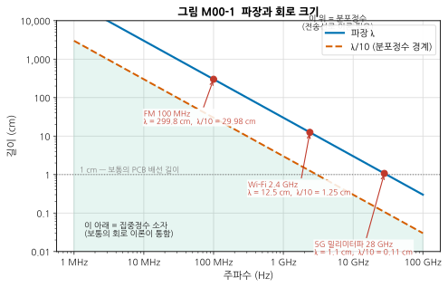
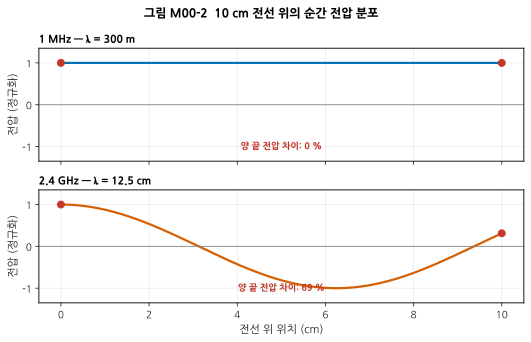
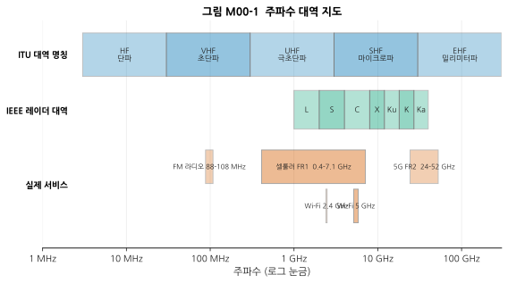
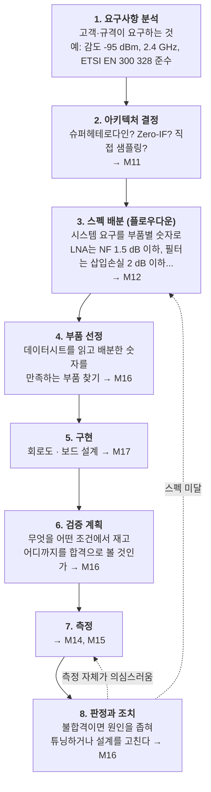
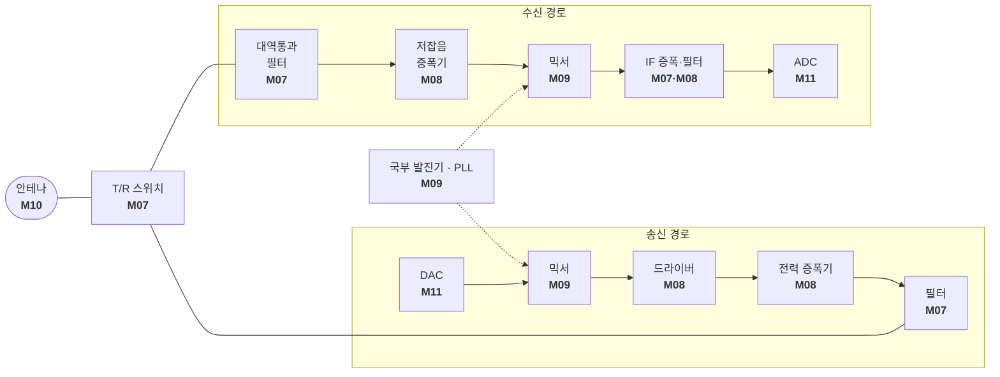

# M00 — RF 시스템 엔지니어링이란 무엇인가

**문서 번호**: RF-CUR-M00 · **버전**: v1.0 · **분량**: 이론 3 h + 실습 3 h

| | |
|---|---|
| **선수 모듈** | 없음 (여기가 시작점) |
| **이 모듈이 소유하는 개념** | RF·마이크로파의 주파수 구분과 대역 명칭, 파장과 회로 크기의 관계(집중정수 vs 분포정수), RF 시스템 엔지니어의 직무, 스펙 플로우다운의 개념적 소개 |
| **이 모듈을 쓰는 후속 모듈** | M02(전송선로 이론의 필요성), M10(안테나 크기), M12(스펙 배분의 실제), M13(규격 대역) |
| **학습 목표** | ① 왜 고주파에서는 보통의 회로 이론이 깨지는지 한 문장으로 설명한다 ② RF 시스템 엔지니어가 하루에 하는 일을 나열한다 ③ 자기 학습 계획을 세운다 |

---

## M00.0 시작하기 전에

이 모듈을 시작하기 전에 **부록 E의 자가진단 20문항**을 먼저 풀어 보십시오.

> 📋 [부록 E — 수학·회로 보충](../03_부록/E_수학_회로_보충.md)

이 커리큘럼은 전자기학을 선수 과목으로 요구하지 않습니다. 다만 옴의 법칙, 사인파와 위상, 복소수의 크기·위상, 로그의 기본 성질은 전제합니다. 자가진단에서 부족한 부분이 드러나면 부록 E의 해당 절만 보고 오면 됩니다. **전부 읽을 필요는 없습니다.**

장비와 소프트웨어 준비는 부록 D를 참고하십시오. 지금 당장 필요한 것은 **Python 환경 하나뿐**입니다.

> 🧰 [부록 D — 장비·소프트웨어 준비 가이드](../03_부록/D_장비_소프트웨어_준비가이드.md)

---

## M00.1 전선 한 가닥이 안테나가 되는 순간

### 직관 — 방 안에서 파도타기

축구장 관중석에서 파도타기 응원을 한다고 해 봅시다. 파도가 한 바퀴 도는 데 30초가 걸린다면, **당신과 옆 사람은 사실상 동시에 일어섭니다.** 두 사람 사이의 거리가 파도의 길이에 비해 아주 짧기 때문입니다.

그런데 파도가 아주 빨라져서 한 바퀴에 0.1초가 걸린다면? 이제 옆 사람은 당신이 앉을 때 일어서고 있습니다. **같은 순간에 사람마다 상태가 다릅니다.**

전선 위의 전압도 똑같습니다. 저주파에서는 전선 전체의 전압이 사실상 같습니다. 그래서 "이 노드의 전압은 5 V"라고 말할 수 있고, 키르히호프 법칙이 성립합니다. 그런데 주파수가 올라가면 **같은 전선인데 위치마다 전압이 달라집니다.** 그 순간 "노드의 전압"이라는 말 자체가 의미를 잃고, 우리가 배운 회로 이론이 깨집니다.

### 정의 — 파장과 λ/10 경험칙

**파장(wavelength, λ)** 은 파가 한 주기 동안 나아가는 거리입니다.

$$\lambda = \frac{c}{f}$$

- c = 빛의 속도 ≈ 3 × 10⁸ m/s (진공에서)
- f = 주파수 (Hz)

회로의 물리적 크기가 파장에 비해 **λ/10 이상**이 되면, 전압이 위치에 따라 달라지는 효과를 무시할 수 없습니다. 이때부터 **분포정수(distributed) 회로**로 다루어야 하고, 그 이하에서는 **집중정수(lumped) 소자**로 다루어도 됩니다.

> ⚠️ λ/10은 **경험칙(rule of thumb)** 이지 물리 법칙이 아닙니다. 요구 정밀도에 따라 λ/20이나 λ/4를 쓰기도 합니다. 중요한 것은 "정해진 경계가 있다"가 아니라 **"연속적으로 나빠지며, 어느 지점부터는 무시할 수 없다"** 는 사고방식입니다.

### 수치 — 손에 익혀야 할 감각

**빛은 1 나노초에 약 30 cm를 갑니다.** 이 하나만 외우면 나머지가 따라옵니다.

*그림 M00-2. 파장과 회로 크기. 가로축은 주파수(로그), 세로축은 길이(cm, 로그)입니다. 파란 실선이 파장 λ, 주황 파선이 λ/10 경계입니다. 회색 점선(1 cm)은 보통의 PCB 배선 길이인데, **2.4 GHz에서는 이 선이 이미 λ/10 경계(1.25 cm) 근처에 있습니다.** 즉 Wi-Fi 주파수에서 PCB 위 1 cm 배선은 이미 "긴 선"입니다.*

| 주파수 | 파장 λ | λ/10 | 감각 |
|---|---|---|---|
| 100 MHz (FM 라디오) | 3 m | 30 cm | 사람 키보다 큼 |
| 900 MHz | 33 cm | 3.3 cm | 팔 길이 |
| **2.4 GHz (Wi-Fi)** | **12.5 cm** | **1.25 cm** | **손바닥** |
| 5 GHz | 6 cm | 6 mm | 손가락 |
| 28 GHz (5G 밀리미터파) | 1.07 cm | 1.07 mm | 손톱 |

이제 왜 RF가 어려운지 알 수 있습니다. **2.4 GHz 보드에서는 부품 사이를 잇는 배선 하나하나가 회로 소자입니다.** 배선을 1 mm 길게 그리면 회로가 달라집니다.

### 눈으로 확인하기

*그림 M00-3. 10 cm 전선 위의 순간 전압 분포. 위는 1 MHz, 아래는 2.4 GHz입니다. 가로축은 전선 위의 위치(cm), 세로축은 그 순간의 전압(정규화)입니다. 빨간 점은 전선의 양 끝입니다. **1 MHz에서는 양 끝의 전압이 같지만(차이 0 %), 2.4 GHz에서는 69 %나 다릅니다.** "이 전선의 전압"이라고 말할 수 없게 된 것입니다.*

> 💡 **이것이 RF의 출발점입니다.** M02(전송선로)에서 이 현상을 정면으로 다룹니다.

---

## M00.2 RF·마이크로파·밀리미터파 — 이름들의 지도

### 왜 이름이 여러 갈래인가

주파수 대역의 이름은 **한 체계가 아니라 여러 체계가 겹쳐** 있습니다. 역사적으로 다른 분야가 각자 이름을 붙였기 때문입니다.

| 체계 | 누가 | 예 |
|---|---|---|
| **ITU 대역 명칭** | 국제전기통신연합(International Telecommunication Union, ITU) — 국제 주파수 배분 기구 | HF, VHF, UHF, SHF, EHF |
| **IEEE 레이더 대역** | 미국 전기전자학회(IEEE) — 2차 대전 레이더 개발 때의 암호명이 굳어짐 | L, S, C, X, Ku, K, Ka |
| **서비스 이름** | 각 산업 | Wi-Fi 2.4 GHz, 5G FR1/FR2 |

*그림 M00-1. 주파수 대역 지도. 가로축은 주파수(로그 눈금)입니다. 위에서부터 ITU 대역 명칭, IEEE 레이더 대역, 실제 서비스입니다. 실제 서비스는 서로 겹치므로 두 줄로 나누어 그렸습니다 — Wi-Fi 2.4 GHz는 셀룰러 FR1의 주파수 범위 안에 들어 있습니다.*

### 이 커리큘럼에서 "RF"의 범위

엄밀한 경계는 없지만, 실무에서는 대략 이렇게 씁니다.

| 용어 | 대략 범위 | 특징 |
|---|---|---|
| **RF (Radio Frequency, 무선 주파수)** | 수 MHz ~ 수 GHz | 넓게는 전파로 쓰는 모든 주파수를 가리킴 |
| **마이크로파 (Microwave)** | 약 1 ~ 30 GHz | 분포정수 효과가 지배적, 도파관·마이크로스트립 |
| **밀리미터파 (Millimeter wave, mmWave)** | 약 30 ~ 300 GHz | 파장이 mm 단위, 손실이 크고 OTA 측정 필수 |

**5G의 FR1/FR2**는 3GPP가 정한 구분으로, FR1은 약 0.4~7.1 GHz, FR2는 약 24~52 GHz 대역입니다. 밀리미터파 대역에서는 안테나가 너무 작아 케이블을 연결할 수 없기 때문에, **공중 방사(Over-The-Air, OTA) 측정**이 필수가 됩니다. (→ M10)

> **RF와 통신은 다릅니다.** 통신 공학은 "정보를 어떻게 실을 것인가"(변조, 부호화, 프로토콜)를 다루고, RF 공학은 "그 신호를 어떻게 물리적으로 만들고 옮기고 받을 것인가"(증폭, 주파수 변환, 정합, 방사)를 다룹니다. 둘은 만나지만 같지 않습니다. 이 커리큘럼은 **RF 쪽**입니다. 다만 M13에서 두 영역이 만나는 지점(EVM, ACLR 같은 신호 품질 지표)을 다룹니다.

---

## M00.3 RF 시스템 엔지니어는 무슨 일을 하는가

### 한마디로

> **"이걸 만들어 달라"는 요구를 받아, 부품 하나하나가 만족해야 할 숫자로 쪼개고, 만들어진 물건이 정말 그 숫자를 만족하는지 증명하는 사람.**

회로를 그리는 것만이 일이 아닙니다. 실제로는 **요구사항 분석 → 아키텍처 결정 → 스펙 배분 → 부품 선정 → 검증 계획 → 측정 → 판정**의 전 과정을 책임집니다.

*그림 M00-4. RF 시스템 엔지니어의 업무 흐름. 각 단계 옆의 화살표는 이 커리큘럼의 어느 모듈이 그 단계를 다루는지 가리킵니다. 아래쪽 점선은 되돌아가는 경로입니다 — **실무에서는 이 되돌아감이 대부분의 시간을 차지합니다.***

### 실제 직무 기술서에서 반복되는 표현들

실제 채용 공고와 직무 기술서를 보면 다음 표현이 반복됩니다.

- 요구사항을 분석하고 시스템 아키텍처를 정의한다
- **RF 링크와 안테나 서브시스템의 최상위 규격을 정의한다**
- 모호한 고객 요구로부터 **명세와 분석을 만들어 낸다**
- 하드웨어 요구사항과 부품 규격을 정의·문서화·전달한다
- 동작 주파수, 입출력 인터페이스, 성능 기준을 규정하고 **시험 전략으로 검증한다**
- **링크 버짓, 전송/거리 방정식, 캐스케이드 해석**을 수행한다
- 요구사항 변경이 서브시스템·부품 설계에 미치는 영향(성능·리스크·비용·검증 방법·일정)을 평가한다

출처: [Lockheed Martin — RF Systems Engineer](https://www.lockheedmartinjobs.com/job/huntsville/rf-systems-engineer/694/78970220048), [Velvet Jobs — RF Systems Engineer](https://www.velvetjobs.com/job-descriptions/rf-systems-engineer), [Velvet Jobs — RF Engineer](https://www.velvetjobs.com/job-descriptions/rf-engineer) (등급 D, 교차검증 3건)

> 📌 밑줄 그을 부분은 **"모호한 요구로부터 명세를 만들어 낸다"** 입니다. 고객은 "잘 터지게 해 주세요"라고 말합니다. 이것을 "감도 −95 dBm @ 20 MHz 대역폭, NF ≤ 4 dB"로 번역하는 것이 이 직무의 핵심입니다. 그 번역 기술이 **M12(시스템 예산 설계)** 입니다.

### 스펙 플로우다운 맛보기

지금은 개념만 봅니다. 실제 계산은 M12가 소유합니다.

| 층위 | 예 |
|---|---|
| **시스템 요구** | "2.4 GHz 대역에서 −95 dBm 신호를 받을 수 있어야 한다" |
| ↓ 분해 | 감도 = 열잡음 + 대역폭 + **잡음지수** + 요구 SNR (→ M01, M12) |
| **서브시스템 요구** | "수신 체인 전체의 잡음지수는 4 dB 이하" |
| ↓ 분해 | 캐스케이드 잡음지수 공식으로 각 단에 배분 (→ M12) |
| **부품 요구** | "LNA는 NF 1.5 dB 이하, 이득 15 dB 이상" |
| ↓ 확인 | 데이터시트에서 그 조건이 **어떤 측정 조건의 값인지** 확인 (→ M16) |
| **검증** | Y-factor 법으로 실측하고 불확도를 붙여 판정 (→ M15) |

---

## M00.4 우리가 채워 갈 그림

아래는 이 커리큘럼이 끝날 때 여러분이 스스로 설계·측정할 수 있게 될 트랜시버의 최상위 구조입니다. 지금은 **하나도 몰라도 됩니다.** 각 블록 아래의 모듈 번호가 그 블록을 다루는 곳입니다.

*그림 M00-5. 트랜시버 최상위 블록도. 위쪽이 수신(RX), 아래쪽이 송신(TX) 경로입니다. 안테나 하나를 송수신이 나눠 쓰기 위해 T/R(송수신) 스위치가 있습니다. 국부 발진기(LO)는 점선으로 두 믹서에 공급됩니다 — **같은 기준에서 나온 신호를 써야 주파수가 맞기 때문**입니다. 이 그림 전체가 캡스톤 과제의 대상입니다.*

여기에 더해 **전송선로(M02)** 는 이 블록들을 잇는 모든 선이고, **S-파라미터(M03)** 는 각 블록의 성능을 적는 언어이며, **시스템 예산(M12)** 은 각 블록에 몇 dB씩 배분할지 정하는 계산입니다.

---

## M00.5 이 커리큘럼의 사용법

### 전체 구조

| 파트 | 모듈 | 무엇을 얻는가 |
|---|---|---|
| **Part 0** | M00 | 큰 그림과 학습 계획 |
| **Part I — RF의 공용어** | M01 · M02 · M03 | 문서와 데이터시트를 읽을 수 있게 됨 |
| **Part II — 손에 잡히는 RF** | M04 · M05 | 장비를 안전하게 다루고 트레이스를 읽음 |
| **Part III — 부품과 블록** | M06 ~ M09 | 각 부품이 무엇을 하고 무엇이 한계인지 앎 |
| **Part IV — 시스템** | M10 ~ M13 | 시스템을 설계하고 스펙을 배분함 |
| **Part V — 실무** | M14 ~ M17 | 정밀 측정, DUT 검증·튜닝, 보드 설계 |
| **Capstone** | — | 2.4 GHz 송수신 겸용 트랜시버 모듈 |

### 세 가지 학습 경로

| 트랙 | 기간 | 주당 |
|---|---|---|
| 집중 | 12주 + 캡스톤 2주 | 20 h |
| 표준 | 24주 + 캡스톤 3주 | 8 h |
| 자율 | 자유 | 자유 |

상세 주차 배분은 [커리큘럼 설계서 §4](../00_커리큘럼_설계서_v1.2.md)에 있습니다.

### 각 모듈을 읽는 요령

1. **머리의 표를 먼저 봅니다.** 선수 모듈과 "이 모듈이 소유하는 개념"이 적혀 있습니다.
2. **모든 새 개념은 직관 → 정의 → 수치 순서**로 나옵니다. 직관이 이해되지 않으면 정의로 넘어가도 소용없으니, 직관에서 막히면 잠시 멈추십시오.
3. **긴 수식 유도는 접이식 블록**에 넣어 두었습니다. 읽지 않아도 진도가 나갑니다.
4. **그림에는 반드시 "읽는 법"이 붙어 있습니다.** 그림을 대충 넘기지 마십시오. RF는 그림으로 사고하는 분야입니다.
5. **실습을 건너뛰지 마십시오.** 장비가 없으면 Tier 0(소프트웨어) 버전을 하십시오.

### 축약어가 나오면

각 모듈에서 축약어는 처음 나올 때 "한글 풀이(영문 원어, 약어)" 형태로 병기됩니다. 그래도 헷갈리면 부록 A를 보십시오. 특히 **§A.4 혼동하기 쉬운 짝**은 초심자가 실제로 가장 많이 틀리는 것만 모은 것입니다.

> 📖 [부록 A — 축약어 마스터 목록](../03_부록/A_축약어_마스터목록.md)

---

## M00.L 실습

### L00-a — 선수 지식 자가진단 (Tier 0, 30분)

| 요소 | 내용 |
|---|---|
| **① 준비** | [부록 E](../03_부록/E_수학_회로_보충.md) §E.1 열기 |
| **② 절차** | 20문항에 답한 뒤 §E.7의 정답과 대조 |
| **③ 예상 결과** | 전기전자 전공 1~2학년 수준이면 12~17문항 정답 |
| **④ 흔한 실수** | 답을 보고 "아 알아"라고 넘기기. **직접 써 본 것만 아는 것입니다.** 특히 11~14번(복소수)은 RF 전체를 지배하므로 반드시 손으로 풀어 보십시오 |
| **⑤ 판정 기준** | 17문항 이상 → 바로 M01로. 그 미만 → 틀린 군이 가리키는 부록 E 절만 읽고 M01로 |

### L00-b — 내 주변의 무선기기 조사 (Tier 0, 1시간)

| 요소 | 내용 |
|---|---|
| **① 준비** | 주변의 무선기기 3종 (예: Wi-Fi 공유기, 휴대폰, 자동차 스마트키) |
| **② 절차** | 각 기기에 대해 아래 표를 채운다. 제품 뒷면 라벨, 사용설명서, 제조사 웹사이트, 국립전파연구원 적합성평가 정보를 활용 |
| **③ 예상 결과** | 스마트키는 대개 433 MHz 또는 315 MHz 대역, Wi-Fi 공유기는 2.4 GHz와 5 GHz 동시, 휴대폰은 여러 밴드를 지원 |
| **④ 흔한 실수** | "2.4 GHz"만 적고 끝내기. **대역폭과 출력, 적용 규격까지** 찾아야 이후 모듈에서 쓸 수 있는 정보가 됩니다 |
| **⑤ 판정 기준** | 3종 모두에 대해 주파수·대역폭·출력·규격 4칸을 채웠으면 통과 |

| 기기 | 주파수 대역 | 대역폭 | 최대 출력 | 파장 λ | λ/10 | 적용 규격 |
|---|---|---|---|---|---|---|
| 예: Wi-Fi 공유기 | 2400–2483.5 MHz | 20/40/80 MHz | 100 mW (20 dBm) EIRP | 12.5 cm | 1.25 cm | ETSI EN 300 328 등 |
| ① | | | | | | |
| ② | | | | | | |
| ③ | | | | | | |

> 마지막 두 칸(λ, λ/10)은 M00.1의 공식으로 직접 계산하십시오. **이 숫자가 그 기기의 보드에서 "긴 배선"의 기준**입니다.

### L00-c — 학습 계약서 작성 (Tier 0, 30분)

자신에게 쓰는 계약서입니다. 다음을 정하고 적어 두십시오.

- [ ] 선택한 트랙 (집중 / 표준 / 자율)
- [ ] 주당 확보 가능한 시간과 요일·시간대
- [ ] 목표 장비 등급 (Tier 0 / 1 / 2)과 조달 계획·예산
- [ ] 캡스톤에서 만들고 싶은 것
- [ ] 막혔을 때 물어볼 곳 (동료, 커뮤니티, 교재)

> 💡 **왜 이걸 하는가**: 이 커리큘럼은 18개 모듈로 길고, 중간에 M08(증폭기)과 M12(예산 설계)라는 밀도 높은 구간이 있습니다. 시작할 때 정해 두지 않으면 그 지점에서 흐지부지되기 쉽습니다.

---

## M00.Q 확인 문제

<b>Q1.</b> 5.8 GHz에서 λ/10은 몇 mm인가? PCB 위 8 mm 배선은 집중정수로 봐도 되는가? (클릭하면 정답)

λ = 3×10⁸ / 5.8×10⁹ = 0.0517 m = **51.7 mm**, λ/10 = **5.17 mm**.

8 mm > 5.17 mm 이므로 **집중정수로 볼 수 없습니다.** 전송선로로 다루어야 합니다.

한 가지 더: 이 계산은 **자유공간 파장**입니다. 실제 기판 위에서는 유전체 때문에 파장이 더 짧아지므로(FR-4에서 약 55 %) 경계는 더 낮아집니다 — 실제로는 약 2.8 mm부터 조심해야 합니다. (→ M02)

<b>Q2.</b> "RF 엔지니어"와 "통신 엔지니어"의 일은 어떻게 다른가?

- **통신**: 정보를 어떻게 실을 것인가 — 변조 방식, 오류 정정 부호, 프로토콜, 다중 접속
- **RF**: 그 신호를 물리적으로 어떻게 만들고 옮기고 받을 것인가 — 증폭, 주파수 변환, 정합, 필터링, 방사

두 영역은 **신호 품질 지표(EVM, ACLR 등)에서 만납니다.** 통신 쪽이 "EVM 3 % 이하여야 복조가 된다"고 요구하면, RF 쪽이 "그러려면 PA를 몇 dB 백오프해야 한다"고 답하는 식입니다. (→ M13)

<b>Q3.</b> 고객이 "통화 품질을 좋게 해 달라"고 했다. RF 시스템 엔지니어로서 첫 번째로 할 일은?

**요구를 측정 가능한 숫자로 번역하는 것**입니다. "통화 품질"은 그대로는 검증할 수 없습니다.

물어야 할 것들:
- 어느 상황에서 나쁜가? (기지국에서 멀 때 = 감도 문제, 사람 많은 곳 = 간섭·선형성 문제)
- 송신이 문제인가 수신이 문제인가?
- 정량 목표는? (통화 성공률? 데이터 전송률? 커버리지 거리?)

그다음 그것을 감도(dBm), 잡음지수(dB), 선형성(IIP3, dBm), EVM(%) 같은 **부품이 만족할 수 있는 숫자**로 분해합니다. 이것이 §M00.3의 "모호한 요구로부터 명세를 만들어 낸다"입니다.

<b>Q4.</b> 28 GHz(5G 밀리미터파)에서 왜 케이블을 연결해 측정하기 어려운가?

세 가지 이유가 겹칩니다.

1. **안테나가 칩이나 패키지 안에 통합**되어 있어 물리적으로 커넥터를 달 지점이 없습니다. λ = 1.07 cm이므로 안테나 자체가 mm 크기입니다.
2. **케이블 손실이 큽니다.** 주파수가 올라갈수록 동축 케이블 손실이 급격히 늘어납니다.
3. **커넥터를 달면 그것이 회로를 바꿉니다.** λ/10 = 1.07 mm이므로 커넥터의 물리적 크기 자체가 회로 규모입니다.

그래서 밀리미터파에서는 **공중 방사(OTA) 측정**이 표준이 됩니다. (→ M10)

---

## M00.A 이 모듈의 축약어

| 약어 | 영문 원어 | 한글 |
|---|---|---|
| RF | Radio Frequency | 무선 주파수 |
| ITU | International Telecommunication Union | 국제전기통신연합 |
| IEEE | Institute of Electrical and Electronics Engineers | 미국 전기전자학회 |
| FR1 / FR2 | Frequency Range 1 / 2 | 주파수 범위 1 / 2 (5G) |
| 3GPP | 3rd Generation Partnership Project | 3세대 파트너십 프로젝트 |
| OTA | Over-The-Air | 공중 방사 (측정) |
| LNA | Low Noise Amplifier | 저잡음 증폭기 |
| PA | Power Amplifier | 전력 증폭기 |
| LO | Local Oscillator | 국부 발진기 |
| ADC / DAC | Analog-to-Digital / Digital-to-Analog Converter | 아날로그-디지털 / 디지털-아날로그 변환기 |
| NF | Noise Figure | 잡음지수 |
| SNR | Signal-to-Noise Ratio | 신호대잡음비 |
| EVM | Error Vector Magnitude | 오차 벡터 크기 |
| EIRP | Effective Isotropic Radiated Power | 등가 등방성 복사 전력 |
| PCB | Printed Circuit Board | 인쇄 회로 기판 |

전체 목록: [부록 A](../03_부록/A_축약어_마스터목록.md)

---

## M00.S 출처

| 내용 | 출처 | 등급 | 교차검증 |
|---|---|---|---|
| 시스템 우선(systems-first) 접근, 셀룰러 중심 구성 | [Steer, *Microwave and RF Design I — Radio Systems* (LibreTexts, 무료 공개)](https://eng.libretexts.org/Bookshelves/Electrical_Engineering/Electronics/Microwave_and_RF_Design_I_-_Radio_Systems_(Steer)) · [NC State University Libraries 프로젝트 페이지](https://www.lib.ncsu.edu/projects/microwave-and-rf-design-open-textbook) | B | 2건 |
| RF 시스템 엔지니어 직무 정의 | [Lockheed Martin RF Systems Engineer](https://www.lockheedmartinjobs.com/job/huntsville/rf-systems-engineer/694/78970220048) · [Velvet Jobs RF Systems Engineer](https://www.velvetjobs.com/job-descriptions/rf-systems-engineer) · [Velvet Jobs RF Engineer](https://www.velvetjobs.com/job-descriptions/rf-engineer) | D | 3건 |
| RF 기초 학습의 질문형 구성 (교육 방식 참고) | [rfdh.com — RF의 기초](http://www.rfdh.com/bas_rf.htm) · [초보만세](http://www.rfdh.com/bas_rf/beginer.htm) | — | 목차 구조만 참고 |
| 5G FR2의 OTA 측정 필요성 | [Anritsu 백서 — OTA Testing in 5G NR](https://dl.cdn-anritsu.com/en-gb/test-measurement/files/5G-OTA-testing-V1.pdf) | B | — |
| 5G NR UE 무선 요구사항 (FR1/FR2 정의) | [3GPP TS 38.101-1 (ATIS 사본, Rel-16)](https://atisorg.s3.amazonaws.com/archive/3gpp-documents/Rel16/ATIS.3GPP.38.101-1.V1640.pdf) | **A** | — |

> ⚠️ **출처 확인 안내**: 이 커리큘럼은 외부 웹 접속이 차단된 환경에서 집필되었습니다. 모든 사실은 독립 출처 2곳 이상으로 교차검증했으나 원문을 직접 열어 보지는 못했습니다. 중요한 수치는 위 URL에서 **직접 확인**하시기를 권합니다. (설계서 §12 참조)

---

## 다음 모듈

**[M01 — 데시벨과 전력: RF의 숫자 읽는 법](./M01_데시벨과전력.md)**

RF의 모든 문서·데이터시트·장비 화면은 dB 단위로 되어 있습니다. 이걸 모르면 아무것도 읽을 수 없으므로, 여기부터 시작합니다.

---

## 변경 이력

| 버전 | 일자 | 내용 |
|---|---|---|
| v1.0 | 2026-08-20 | 최초 작성. 시각자료 5종(데이터 플롯 3 + Mermaid 2), 실습 3종, 확인 문제 4문항 |
| — | 2026-08-20 | **검토 3회 완료.** 1차(사실): 파장·λ/10 수치 7건을 코드로 재계산 검증. 2차(교육): 자가진단(L00-a)을 첫 실습으로 배치해 선수 지식 공백을 초반에 드러나게 함. 3차(구조): Mermaid 2개를 mermaid-cli 로 실제 렌더해 문법 검증, 이미지·문서 링크 전수 점검 |
