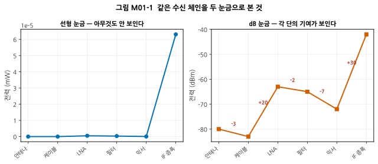
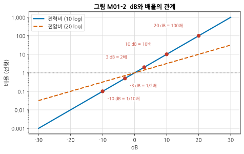
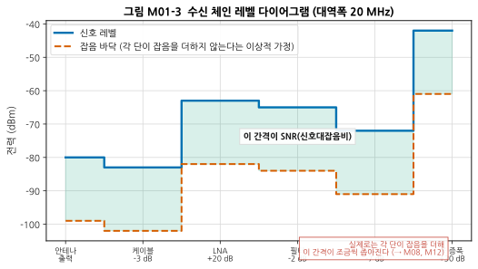
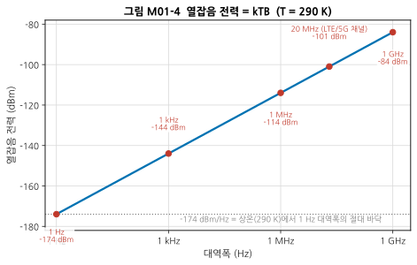
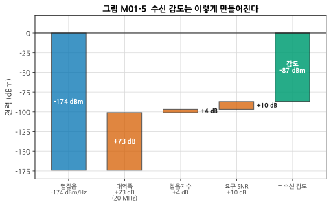

# M01 — 데시벨과 전력: RF의 숫자 읽는 법

**문서 번호**: RF-CUR-M01 · **버전**: v1.0 · **분량**: 이론 4 h + 실습 4 h

| | |
|---|---|
| **선수 모듈** | [M00](./M00_RF시스템엔지니어링이란.md) |
| **이 모듈이 소유하는 개념** | dB, dBm, dBW, dBc, dBi, dBμV, 로그 스케일, 전력비 vs 전압비(10 log vs 20 log), 임피던스 기준의 의미, 열잡음 전력 kTB와 −174 dBm/Hz, 잡음 바닥, 이득·감쇠의 덧셈 계산, 레벨 다이어그램 |
| **이 모듈을 쓰는 후속 모듈** | 전 모듈 (사용). 특히 M08(잡음지수 정의), M12(감도 계산) |
| **학습 목표** | ① dB와 dBm의 차이를 설명한다 ② 이득·손실이 섞인 체인의 출력 전력을 암산에 가깝게 계산한다 ③ 상온 열잡음 바닥이 왜 −174 dBm/Hz인지 설명한다 |

---

## M01.1 왜 로그를 쓰는가

### 직관 — 개미와 코끼리를 같은 자에 올리기

수신기 입구에 들어오는 신호는 **0.00000000001 W** 정도입니다. 송신기가 내보내는 신호는 **1 W**쯤 됩니다. 이 둘을 같은 그래프에 그리면 작은 쪽은 완전히 바닥에 붙어 아무것도 보이지 않습니다.

RF에서 다루는 전력의 범위는 **10¹² (1조 배)** 를 넘나듭니다. 이런 범위를 다루려면 자를 바꿔야 합니다. 그 자가 **로그 눈금**입니다.

이유는 하나 더 있습니다. 신호가 부품을 지날 때마다 전력은 **곱해집니다.** 이득 100배인 증폭기, 손실 1/10인 케이블, 손실 1/2인 필터를 지나면 100 × 0.1 × 0.5 = 5배입니다. 곱셈은 암산이 어렵습니다. 그런데 로그를 취하면 **곱셈이 덧셈**이 됩니다.

$$\log(A \times B) = \log A + \log B$$

20 dB + (−10 dB) + (−3 dB) = **7 dB**. 이제 암산이 됩니다.

### 눈으로 확인하기



*그림 M01-1. 같은 수신 체인을 두 눈금으로 본 것. 왼쪽은 선형(mW), 오른쪽은 dB(dBm)입니다. 가로축은 체인의 각 단, 세로축은 그 지점의 전력입니다. **왼쪽에서는 마지막 IF 증폭 단을 빼면 전부 0에 붙어 있어 아무것도 읽을 수 없습니다.** 오른쪽에서는 각 단이 몇 dB를 더하고 빼는지(빨간 숫자) 한눈에 보입니다.*

> 💡 이것이 RF 문서가 전부 dB로 되어 있는 이유입니다. **dB를 모르면 데이터시트를 한 줄도 못 읽습니다.**

---

## M01.2 dB의 정의와 10 vs 20의 진짜 이유

### 정의

**데시벨(decibel, dB)** 은 두 값의 **비율**을 로그로 나타낸 단위입니다.

$$\text{전력비}\ [\mathrm{dB}] = 10 \log_{10}\!\left(\frac{P_2}{P_1}\right)$$

$$\text{전압비}\ [\mathrm{dB}] = 20 \log_{10}\!\left(\frac{V_2}{V_1}\right)$$

### 왜 전력은 10이고 전압은 20인가

초심자가 가장 많이 혼란스러워하는 지점입니다. 답은 간단합니다.

**전력은 전압의 제곱에 비례하기 때문입니다.**

$$P = \frac{V^2}{R}$$

전압비를 전력비로 바꾸면:

$$10 \log_{10}\!\left(\frac{P_2}{P_1}\right) = 10 \log_{10}\!\left(\frac{V_2^2/R}{V_1^2/R}\right) = 10 \log_{10}\!\left(\frac{V_2}{V_1}\right)^2 = \mathbf{20} \log_{10}\!\left(\frac{V_2}{V_1}\right)$$

즉 **10 log와 20 log는 서로 다른 정의가 아니라 같은 정의입니다.** 단지 전력으로 재느냐 전압으로 재느냐의 차이입니다.

> ⚠️ **중요한 단서**: 위 유도에서 분모·분자의 R이 약분되었습니다. 즉 **두 지점의 임피던스가 같아야** 이 관계가 성립합니다. RF에서는 거의 모든 것이 50 Ω으로 통일되어 있어(→ M02) 대개 문제가 없지만, 임피던스가 다른 두 지점의 전압비를 그대로 20 log 하면 틀립니다.

### 수치 — 두 얼굴의 3 dB

| | 전력 | 전압 (같은 임피던스에서) |
|---|---|---|
| **+3 dB** | 2배 | 약 1.41배 (√2) |
| **−3 dB** | 1/2 | 약 0.707배 |
| **+6 dB** | 4배 | 2배 |
| **+10 dB** | 10배 | 약 3.16배 |
| **+20 dB** | 100배 | 10배 |



*그림 M01-2. dB와 배율의 관계. 가로축은 dB, 세로축은 배율(로그 눈금)입니다. 파란 실선은 전력비(10 log), 주황 파선은 전압비(20 log)입니다. **같은 dB 값이라도 전력이냐 전압이냐에 따라 배율이 다릅니다.** 빨간 점은 반드시 외워야 할 값들입니다.*

### 암산법 — 실무에서 매일 씁니다

log₁₀(2) ≈ 0.301 과 log₁₀(10) = 1, **이 둘만 알면 나머지는 조합으로 나옵니다.**

| 값 | 계산 | dB (전력) |
|---|---|---|
| 2 | — | **3 dB** |
| 4 = 2² | 3 + 3 | 6 dB |
| 5 = 10/2 | 10 − 3 | **7 dB** |
| 8 = 2³ | 3 + 3 + 3 | 9 dB |
| 10 | — | **10 dB** |
| 20 = 2×10 | 3 + 10 | 13 dB |
| 100 | 10 + 10 | 20 dB |
| 1000 | — | 30 dB |

> 📌 **외울 것은 딱 두 개: 3 dB = 2배, 10 dB = 10배.** 나머지는 더하고 빼면 됩니다. 이 감각이 붙으면 데이터시트를 보며 "아, 이건 대략 30배구나"가 즉시 나옵니다.

<details>
<summary>수식으로 확인하고 싶다면 (클릭)</summary>

log₁₀(2) = 0.30103 이므로 10 × 0.30103 = 3.0103 dB. 실무에서 3 dB로 반올림해 쓰지만, **정밀 계산에서는 3.0103을 씁니다.** 예를 들어 20단 체인에서 3 vs 3.0103의 차이가 0.2 dB까지 누적됩니다.

log₁₀(5) = log₁₀(10/2) = 1 − 0.30103 = 0.69897 → 6.9897 dB ≈ 7 dB.
</details>

---

## M01.3 절대 단위 — dBm, dBW, dBμV

### 문제 제기

dB는 **비율**입니다. "이 증폭기 이득은 20 dB"는 말이 되지만, "출력이 20 dB"는 말이 안 됩니다. **무엇에 비한 20 dB인지** 알 수 없기 때문입니다.

그래서 기준을 정해 붙입니다. **기준을 붙이면 절대값**이 됩니다.

### 정의

| 단위 | 기준 | 공식 | 쓰이는 곳 |
|---|---|---|---|
| **dBm** | 1 mW | $10\log_{10}(P/1\,\mathrm{mW})$ | RF에서 가장 흔함 |
| **dBW** | 1 W | $10\log_{10}(P/1\,\mathrm{W})$ | 방송·레이더 등 고전력 |
| **dBμV** | 1 μV | $20\log_{10}(V/1\,\mathrm{\mu V})$ | EMC 규격, 방송 수신 |

> **dBW ↔ dBm 변환**: 1 W = 1000 mW = +30 dBm 이므로 **dBm = dBW + 30**.

### 수치 감각 — 이 표는 외우십시오

| dBm | 전력 | 실제 예 |
|---|---|---|
| +43 dBm | 20 W | 셀룰러 기지국 한 채널 |
| +30 dBm | 1 W | 고출력 Wi-Fi / 아마추어 무전기 |
| **+20 dBm** | **100 mW** | **Wi-Fi 공유기 송신 (대략)** |
| 0 dBm | 1 mW | 계측기 기준 레벨로 흔히 씀 |
| −30 dBm | 1 μW | 가까운 곳의 Wi-Fi 수신 신호 |
| **−70 dBm** | 100 pW | 보통의 Wi-Fi 수신 신호 |
| **−95 dBm** | 약 0.3 pW | 셀룰러 수신 감도 근처 |
| −174 dBm | — | **1 Hz 대역폭의 상온 열잡음 (절대 바닥)** |

### 가장 중요한 규칙

```
dBm + dB  = dBm      ✅   (신호에 이득/손실을 적용)
dBm − dBm = dB       ✅   (두 신호의 비율)
dBm + dBm = ???      ❌   무의미
```

> ⚠️ **초심자 실수 1순위**: "출력 10 dBm 증폭기 두 대를 합치면 20 dBm"이라고 계산하는 것. 틀렸습니다. 전력을 실제로 합치려면 **선형(mW)으로 되돌려 더한 뒤 다시 dBm으로** 가야 합니다. 10 dBm + 10 dBm = 10 mW + 10 mW = 20 mW = **13 dBm**입니다.
>
> 게다가 두 신호가 **상관되어 있는지**(같은 위상인지)에 따라 결과가 또 달라집니다. 서로 무관한 잡음 두 개는 전력이 더해져 +3 dB, 위상이 완전히 같은 신호 두 개는 전압이 더해져 **+6 dB**입니다.

### 상대 단위 — dBc, dBi, dBd

| 단위 | 기준 | 쓰이는 곳 |
|---|---|---|
| **dBc** | 반송파(carrier) 전력 | 하모닉, 스퓨리어스, 위상잡음 (→ M09) |
| **dBi** | 등방성(isotropic) 안테나 | 안테나 이득 (→ M10) |
| **dBd** | 반파장 다이폴 안테나 | 안테나 이득 (구식 표기) |

> **dBi = dBd + 2.15**. 반파장 다이폴 자체가 등방성 대비 2.15 dBi의 이득을 갖기 때문입니다. 데이터시트가 어느 쪽인지 확인하지 않으면 2.15 dB를 통째로 틀립니다. (→ M10)

---

## M01.4 체인 계산과 레벨 다이어그램

### 이득과 손실은 그냥 더한다

이것이 dB를 쓰는 가장 큰 실용적 이유입니다.

$$P_{\text{출력}}\,[\mathrm{dBm}] = P_{\text{입력}}\,[\mathrm{dBm}] + G_1 + G_2 + \cdots + G_n\,[\mathrm{dB}]$$

손실은 음수 이득으로 씁니다. 케이블 손실 3 dB = 이득 −3 dB.

### 레벨 다이어그램

**레벨 다이어그램(level diagram)** 은 체인의 각 지점에서 신호가 몇 dBm인지를 그린 그림입니다. RF 엔지니어가 가장 자주 그리는 그림 중 하나입니다.



*그림 M01-3. 수신 체인 레벨 다이어그램 (대역폭 20 MHz). 가로축은 체인의 각 단, 세로축은 전력(dBm)입니다. 파란 실선이 신호 레벨, 주황 파선이 잡음 바닥입니다. 두 선 사이의 간격이 **신호대잡음비(Signal-to-Noise Ratio, SNR)** 입니다. 주의: 이 그림의 잡음 바닥은 **각 단이 잡음을 전혀 더하지 않는다는 이상적 가정**입니다. 실제로는 각 단이 잡음을 더해 간격이 조금씩 좁아지며, 그것을 정량화한 것이 잡음지수(→ M08)와 캐스케이드 해석(→ M12)입니다.*

### 수치 예제 — 직접 따라가 보십시오

안테나에 −80 dBm이 들어왔습니다.

| 단 | 이득/손실 | 누적 신호 레벨 |
|---|---|---|
| 안테나 출력 | — | −80 dBm |
| 케이블 | −3 dB | **−83 dBm** |
| LNA | +20 dB | **−63 dBm** |
| 대역통과 필터 | −2 dB | **−65 dBm** |
| 믹서 | −7 dB (변환 손실) | **−72 dBm** |
| IF 증폭 | +30 dB | **−42 dBm** |

총 이득 = −3 + 20 − 2 − 7 + 30 = **+38 dB**. 확인: −80 + 38 = −42 dBm ✅

> 💡 **여기서 이미 설계 판단이 보입니다.** 왜 LNA를 케이블 뒤가 아니라 앞에 두면 좋을까요? 그러면 −80 dBm이 바로 +20 dB 증폭되어 −60 dBm이 되고, 그다음 케이블 손실 3 dB를 받아 −63 dBm — 신호 레벨은 결국 같습니다. **그런데 잡음은 다릅니다.** 앞단의 손실이 잡음지수를 그대로 악화시키기 때문입니다. 이것이 "안테나 바로 뒤에 LNA를 붙인다"는 RF의 철칙이며, M08과 M12에서 정량적으로 다룹니다.

---

## M01.5 열잡음 — 왜 −174 dBm/Hz인가

### 직관 — 저항도 시끄럽다

아무 신호도 넣지 않은 저항의 양단을 아주 민감한 전압계로 재면, **0이 아닙니다.** 미세하게 떨리고 있습니다. 저항 안의 전자들이 온도 때문에 무작위로 움직이면서 만드는 전압입니다.

이것을 **열잡음(thermal noise)**, 또는 발견자의 이름을 따 **존슨-나이퀴스트 잡음(Johnson-Nyquist noise)** 이라고 합니다. 온도가 절대영도가 아닌 한 **반드시 있습니다.** 좋은 부품을 써도, 설계를 잘해도 없앨 수 없습니다.

**이것이 RF의 절대적인 바닥입니다.** 아무리 좋은 수신기를 만들어도 이보다 작은 신호는 받을 수 없습니다.

### 정의

가용 열잡음 전력은:

$$N = k \cdot T \cdot B$$

| 기호 | 의미 | 값 |
|---|---|---|
| k | 볼츠만 상수 | 1.380649 × 10⁻²³ J/K |
| T | 절대 온도 | K (켈빈) |
| B | 대역폭 | Hz |

> 🔍 **놀라운 점**: 이 식에 **저항값이 없습니다.** 1 mΩ이든 1 MΩ이든 가용 잡음 전력은 같습니다. 저항이 크면 잡음 전압도 크지만 그만큼 임피던스도 커서, 실제로 뽑아 쓸 수 있는 전력은 같아집니다.

### 왜 하필 290 K인가

잡음지수의 정의에는 **기준 온도 T₀ = 290 K** 가 약속되어 있습니다. 섭씨로 약 16.85 °C — "상온"이라기엔 살짝 서늘하지만, 계산이 깔끔해지도록 정해진 값입니다.

$$N_0 = k T_0 = 1.380649\times10^{-23} \times 290 = 4.0039\times10^{-21}\ \mathrm{W/Hz}$$

$$10\log_{10}\!\left(\frac{4.0039\times10^{-21}}{10^{-3}}\right) = -173.975\ \mathrm{dBm/Hz} \approx \mathbf{-174\ dBm/Hz}$$

> 📌 **−174는 반올림값**입니다. 정확한 값은 −173.975 dBm/Hz (실무 문헌에서는 −173.98로 인용되기도 합니다). 일상 계산에서는 −174를 쓰고, 정밀 예산 계산에서만 정확값을 씁니다. **어느 값을 썼는지 예산표에 적어 두는 습관**이 나중에 남의 계산과 대조할 때 시간을 아껴 줍니다.

### 대역폭이 잡음을 결정한다

$$N\,[\mathrm{dBm}] = -174 + 10\log_{10}(B\,[\mathrm{Hz}])$$



*그림 M01-4. 열잡음 전력 = kTB (T = 290 K). 가로축은 대역폭(로그), 세로축은 그 대역폭 안의 총 열잡음 전력(dBm)입니다. **대역폭이 10배가 되면 잡음이 10 dB 늘어납니다.** 회색 점선이 −174 dBm/Hz — 1 Hz 대역폭일 때의 값이며, 이보다 아래로 내려갈 수 없는 절대 바닥입니다.*

| 대역폭 | 열잡음 전력 | 계산 |
|---|---|---|
| 1 Hz | −174 dBm | 기준 |
| 1 kHz | −144 dBm | −174 + 30 |
| 1 MHz | −114 dBm | −174 + 60 |
| **20 MHz** (LTE/5G 채널) | **−101 dBm** | −174 + 73 |
| 100 MHz | −94 dBm | −174 + 80 |

> 💡 **설계 통찰**: 대역폭을 넓히면 데이터를 더 많이 보낼 수 있지만 잡음도 함께 늘어납니다. **"넓은 대역폭"과 "좋은 감도"는 근본적으로 상충합니다.** 필요한 만큼만 대역폭을 쓰는 것이 RF 설계의 기본입니다.

---

## M01.6 감도는 이렇게 만들어진다 (맛보기)

지금까지 배운 것을 하나로 묶으면, **수신 감도**의 뼈대가 나옵니다.

$$P_{\text{감도}}\,[\mathrm{dBm}] = \underbrace{-174}_{\text{열잡음}} + \underbrace{10\log_{10}B}_{\text{대역폭}} + \underbrace{NF}_{\text{잡음지수}} + \underbrace{SNR_{\text{요구}}}_{\text{복조에 필요한 여유}}$$



*그림 M01-5. 수신 감도는 이렇게 만들어진다. 왼쪽부터 열잡음 바닥에서 시작해 대역폭·잡음지수·요구 SNR을 차례로 더해 가고, 맨 오른쪽 초록 막대가 최종 감도입니다. 파란 막대는 물리가 정해 준 값(우리가 못 바꿈), 주황 막대는 설계·규격이 정하는 값입니다.*

예제: 대역폭 20 MHz, 잡음지수 4 dB, 요구 SNR 10 dB인 수신기

$$-174 + 73 + 4 + 10 = \mathbf{-87\ dBm}$$

> ⚠️ **아직 두 항을 모릅니다.** 잡음지수(NF)는 **M08**이, 요구 SNR과 정확한 감도 계산은 **M12**가 소유합니다. 지금은 "감도가 이런 구조로 만들어진다"는 뼈대만 가져가면 됩니다. 이것이 이 커리큘럼의 방식입니다 — 뼈대를 먼저 보고, 살은 해당 모듈에서 붙입니다.

---

## M01.7 한 장 요약

> 이 표는 새 설명이 아니라 **되찾아보기용 색인**입니다. 막히면 오른쪽 절 번호로 가십시오.

| 알아야 할 것 | 핵심 | 절 |
|---|---|---|
| 왜 dB인가 | 곱셈이 덧셈이 되고, 10¹² 범위를 한 그래프에 담는다 | §1 |
| 10 vs 20 log | 전력은 10, 전압은 20. **같은 정의**이며 P ∝ V² 때문 | §2 |
| 암산 두 개 | **3 dB = 2배, 10 dB = 10배**. 나머지는 조합 | §2 |
| dB vs dBm | dB는 비율, dBm은 1 mW 기준 절대값 | §3 |
| 절대 금지 | **dBm + dBm** — 선형으로 바꿔 더할 것 | §3 |
| 전력 합성 | 비상관 +3 dB, 동위상 상관 +6 dB | §3 |
| 체인 계산 | 이득·손실을 그냥 더한다 | §4 |
| 열잡음 | **−174 dBm/Hz @ 290 K**, 대역폭 10배마다 +10 dB | §5 |
| 감도의 뼈대 | −174 + 10log B + NF + 요구 SNR | §6 |

---

## M01.L 실습

### L01-a — dB 변환기와 체인 계산기 만들기 (Tier 0, 2시간)

**① 셋업**: Python 환경 ([부록 D §D.1](../03_부록/D_장비_소프트웨어_준비가이드.md))

**② 절차**

```python
import numpy as np

# ── 1. 기본 변환 ────────────────────────────────────────────
def dbm_to_mw(p_dbm):
    """dBm → mW"""
    return 10 ** (np.asarray(p_dbm, dtype=float) / 10)

def mw_to_dbm(p_mw):
    """mW → dBm"""
    return 10 * np.log10(np.asarray(p_mw, dtype=float))

# ── 2. 전력을 실제로 합치기 (dBm 끼리 더하면 안 되는 경우) ──
def add_powers_dbm(*p_dbm):
    """서로 무관한(비상관) 신호들의 전력 합. 선형으로 바꿔 더한 뒤 되돌린다."""
    return mw_to_dbm(sum(dbm_to_mw(p) for p in p_dbm))

# ── 3. 체인 계산 ────────────────────────────────────────────
def chain(p_in_dbm, stages):
    """stages = [(이름, 이득_dB), ...] → 각 단 출력 레벨 목록"""
    level, out = p_in_dbm, [("입력", p_in_dbm)]
    for name, gain in stages:
        level += gain
        out.append((name, level))
    return out

# ── 4. 열잡음 ───────────────────────────────────────────────
def thermal_noise_dbm(bw_hz, t_kelvin=290.0):
    k = 1.380649e-23
    return 10 * np.log10(k * t_kelvin * bw_hz / 1e-3)

# ── 확인 ────────────────────────────────────────────────────
print("0 dBm =", dbm_to_mw(0), "mW")            # 1.0
print("10+10 dBm =", add_powers_dbm(10, 10))     # 13.01  (20 이 아님!)
print("kTB @ 1 Hz =", thermal_noise_dbm(1))      # -173.98
print("kTB @ 20 MHz =", thermal_noise_dbm(20e6)) # -100.97

for name, lv in chain(-80, [("케이블", -3), ("LNA", +20), ("필터", -2),
                            ("믹서", -7), ("IF 증폭", +30)]):
    print(f"  {name:8s} {lv:7.1f} dBm")
```

> 💬 한글은 글자 폭이 넓어 `{name:8s}` 로는 열이 딱 맞지 않습니다. 기능에는 문제가 없으니 지금은 넘어가고, 맞추고 싶다면 `unicodedata.east_asian_width` 로 실제 표시 폭을 세어 패딩하면 됩니다.

**③ 예상 결과**

```
0 dBm = 1.0 mW
10+10 dBm = 13.010299956639813
kTB @ 1 Hz = -173.97518719422808
kTB @ 20 MHz = -100.9648872375883
  입력       -80.0 dBm
  케이블     -83.0 dBm
  LNA        -63.0 dBm
  필터       -65.0 dBm
  믹서       -72.0 dBm
  IF 증폭    -42.0 dBm
```

**④ 흔한 실수**

| 증상 | 원인 |
|---|---|
| `add_powers_dbm(10,10)` 이 20으로 나옴 | dBm끼리 그냥 더했음. 반드시 선형으로 변환 후 합산 |
| 열잡음이 −174가 아니라 −204쯤 나옴 | mW가 아니라 W 기준으로 계산함. `/1e-3` 을 빠뜨림 |
| 전압비에 10 log를 씀 | 전압은 20 log (§M01.2) |

**⑤ 판정 기준**: 위 예상 결과와 소수점 둘째 자리까지 일치하면 통과.

### L01-b — 레벨 다이어그램 그리기 (Tier 0, 1.5시간)

**① 셋업**: `scripts/rf_style.py` 를 import 할 수 있는 위치

**② 절차**: L01-a의 `chain()` 결과를 받아 레벨 다이어그램(그림 M01-3 형태)을 그리는 함수를 작성하십시오. 요구사항:

- 신호 레벨을 계단(step) 그래프로
- 열잡음 바닥을 함께 표시 (대역폭을 인자로 받음)
- 두 선 사이를 채우고 SNR을 주석으로
- 축 이름과 단위, 제목 포함

**③ 예상 결과**: 그림 M01-3과 유사한 그래프. 마지막 단에서 신호 −42 dBm.

**④ 흔한 실수**: 잡음 바닥에 이득을 적용하지 않는 것. 잡음도 증폭기를 지나면 함께 증폭됩니다.

**⑤ 판정 기준**: 그래프에서 SNR을 눈으로 읽어 계산값과 일치하면 통과.

### L01-c — 실제 데이터시트에서 dB 읽기 (Tier 0, 1시간)

**① 셋업**: 아무 RF 부품 데이터시트 1종 (LNA, 필터, 증폭기 등). 제조사 웹사이트에서 무료로 받을 수 있습니다.

**② 절차**: 데이터시트에서 dB가 붙은 값을 **모두** 찾아 아래 표를 채우십시오.

| 스펙 이름 | 값과 단위 | dB인가 dBm인가 dBc인가 | 무엇에 대한 비율/절대값인가 |
|---|---|---|---|
| 예: Gain | 18 dB | dB (비율) | 출력/입력 전력비 |
| 예: P1dB | +12 dBm | dBm (절대) | 1 mW 기준 출력 전력 |
| | | | |

**③ 예상 결과**: 보통 한 데이터시트에 6~15개의 dB 계열 스펙이 있습니다.

**④ 흔한 실수**: dBc를 dB로 착각. 하모닉이 "−40 dBc"라면 **주 신호보다 40 dB 작다**는 뜻이지, 절대 전력이 −40 dBm이라는 뜻이 아닙니다.

**⑤ 판정 기준**: 모든 항목의 세 번째·네 번째 칸을 근거를 대며 채웠으면 통과.

---

## M01.Q 확인 문제

<details>
<summary><b>Q1.</b> 어떤 증폭기의 이득이 23 dB다. 몇 배인가? (암산으로)</summary>

23 = 20 + 3 → 100배 × 2배 = **약 200배**

정확히는 10^2.3 = 199.5배. 암산으로 충분합니다.
</details>

<details>
<summary><b>Q2.</b> −30 dBm은 몇 W인가?</summary>

−30 dBm = 1 mW × 10^(−3) = 0.001 mW = **1 μW = 10⁻⁶ W**

암산법: dBm에서 30을 빼면 dBW이므로 −30 dBm = −60 dBW = 10⁻⁶ W. 같은 답입니다.
</details>

<details>
<summary><b>Q3.</b> 두 개의 서로 무관한 잡음원이 각각 −100 dBm이다. 합치면?</summary>

**−97 dBm** (약 +3 dB)

비상관 신호는 전력이 더해집니다. −100 dBm = 0.1 pW, 두 개면 0.2 pW = −96.99 dBm.

**만약 두 신호가 같은 위상으로 상관되어 있다면?** 그때는 전압이 더해져 전압이 2배 = 전력 4배 = **+6 dB**, 즉 −94 dBm이 됩니다. 상관 여부가 3 dB를 가릅니다.
</details>

<details>
<summary><b>Q4.</b> 대역폭 1 MHz, 잡음지수 3 dB, 요구 SNR 12 dB인 수신기의 감도는?</summary>

−174 + 10log(10⁶) + 3 + 12 = −174 + 60 + 3 + 12 = **−99 dBm**
</details>

<details>
<summary><b>Q5.</b> 채널 대역폭을 20 MHz에서 80 MHz로 넓히면 감도는 어떻게 되는가?</summary>

10 log(80/20) = 10 log 4 = **6 dB 나빠집니다** (감도 수치가 6 dB 올라감).

−87 dBm이었다면 −81 dBm이 됩니다. 데이터 전송률은 늘지만 도달 거리는 줄어듭니다. **이것이 Wi-Fi에서 채널 폭을 넓히면 속도는 빨라지지만 커버리지가 줄어드는 이유입니다.**
</details>

<details>
<summary><b>Q6.</b> 안테나 이득이 "5 dBd"라고 적혀 있다. dBi로는?</summary>

5 + 2.15 = **7.15 dBi**

dBd는 반파장 다이폴 기준인데, 그 다이폴 자체가 등방성 대비 2.15 dBi를 갖기 때문입니다. 규격이 EIRP(등방성 기준)로 한계를 정한다면 이 2.15 dB를 빠뜨리면 안 됩니다. (→ M10)
</details>

<details>
<summary><b>Q7.</b> "50 Ω 계에서 0 dBm은 몇 V(RMS)인가?"</summary>

0 dBm = 1 mW. P = V²/R 이므로 V = √(P·R) = √(0.001 × 50) = √0.05 = **약 0.2236 V(RMS)**

첨두값으로는 0.2236 × √2 ≈ 0.316 V. 오실로스코프로 RF를 볼 때 이 환산이 필요합니다.
</details>

---

## M01.A 이 모듈의 축약어

| 약어 | 영문 원어 | 한글 | 비고 |
|---|---|---|---|
| dB | Decibel | 데시벨 | **비율** (기준 없음) |
| dBm | Decibel-milliwatt | 데시벨밀리와트 | 1 mW 기준 **절대 전력** |
| dBW | Decibel-watt | 데시벨와트 | 1 W 기준. dBm = dBW + 30 |
| dBc | Decibel relative to carrier | 반송파 대비 데시벨 | 주 신호 대비 |
| dBi | Decibel relative to isotropic | 등방성 대비 데시벨 | 안테나 이득 |
| dBd | Decibel relative to dipole | 다이폴 대비 데시벨 | dBi = dBd + 2.15 |
| dBμV | Decibel-microvolt | 데시벨마이크로볼트 | EMC 규격 |
| SNR | Signal-to-Noise Ratio | 신호대잡음비 | |
| kTB | — | 열잡음 전력 | 볼츠만 상수 × 온도 × 대역폭 |
| T₀ | Reference Temperature | 기준 온도 | 290 K |
| RMS | Root Mean Square | 제곱평균제곱근 | 실효값 |
| LNA | Low Noise Amplifier | 저잡음 증폭기 | → M08 |
| IF | Intermediate Frequency | 중간주파수 | → M09 |
| NF | Noise Figure | 잡음지수 | → M08 |

---

## M01.S 출처

| 내용 | 출처 | 등급 | 교차검증 |
|---|---|---|---|
| dB·dBm 체계, 로그 단위의 필요성 | [Steer, *Microwave and RF Design I — Radio Systems*](https://eng.libretexts.org/Bookshelves/Electrical_Engineering/Electronics/Microwave_and_RF_Design_I_-_Radio_Systems_(Steer)) | B | — |
| dB 단위를 쓰는 이유 / dB와 dBm의 차이 (교육 구성 참고) | [rfdh.com — RF의 기초](http://www.rfdh.com/bas_rf.htm) | — | 목차 구조만 |
| 열잡음 kTB, 기준 온도 T₀ = 290 K, −174 dBm/Hz | [*Understanding Noise Figure* (기술노트)](https://www.qsl.net/va3iul/Noise/Understanding%20Noise%20Figure.pdf) · [Maury Microwave — *Noise By the Numbers*](https://maurymw.com/wp-content/uploads/Noise_By_the_Numbers_web2.pdf) · [All About Circuits — Understanding the RF Noise Figure Specification](https://www.allaboutcircuits.com/technical-articles/understanding-the-noise-figure-specification/) | B, B, D | **3건** |
| 잡음지수의 정의와 기준 온도 | [Keysight AN 5952-8255 — *Fundamentals of RF and Microwave Noise Figure Measurements*](https://www.keysight.com/us/en/assets/7018-06808/application-notes/5952-8255.pdf) | B | — |
| 볼츠만 상수 1.380649 × 10⁻²³ J/K | SI 2019 정의값 (국제단위계 개정으로 정확값) | **A** | — |

> ⚠️ 원문 직접 확인 안내는 [M00.S](./M00_RF시스템엔지니어링이란.md#m00s-출처) 참조.

---

## 다음 모듈

**[M02 — 전송선로: 왜 50 Ω이고, 왜 반사가 생기는가](./M02_전송선로.md)**

M00에서 "고주파에서는 전선 위 위치마다 전압이 다르다"는 것을 봤습니다. M02에서 그 현상을 정면으로 다룹니다.

---

## 변경 이력

| 버전 | 일자 | 내용 |
|---|---|---|
| v1.0 | 2026-08-20 | 최초 작성. 시각자료 5종, 실습 3종, 확인 문제 7문항 |
| — | 2026-08-20 | **검토 3회 완료.** 1차(사실): 실습 코드를 실제 실행해 예상 출력을 실측값으로 교체, kTB 정확값을 −173.98 → **−173.975** 로 정정, 확인 문제 7문항 전부 검산. 2차(교육): §7 한 장 요약 신설. 3차(구조): 시각자료 5종·링크 전수 점검 |
