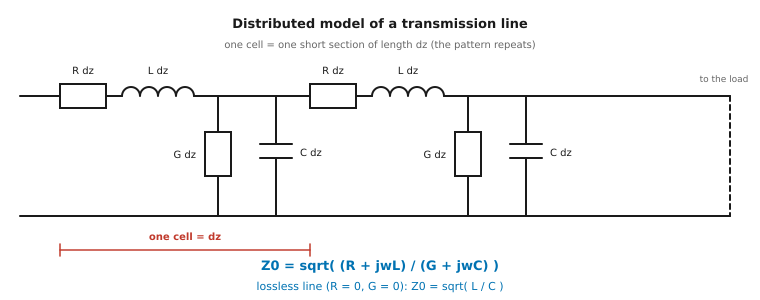
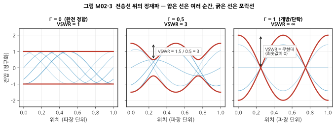
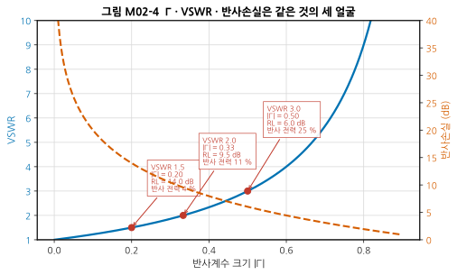
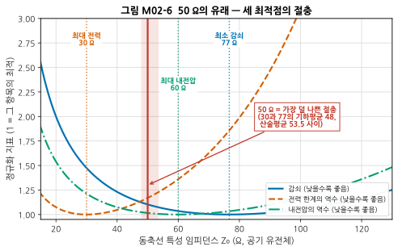
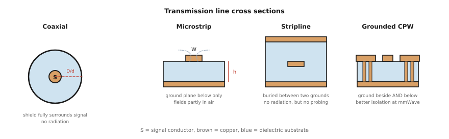
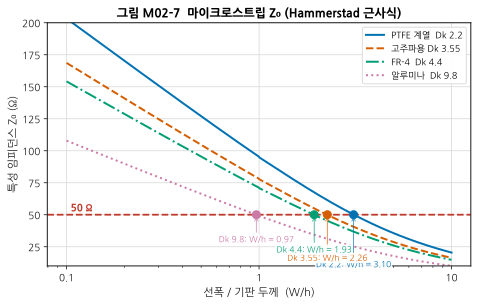

# M02 — 전송선로: 왜 50 Ω이고, 왜 반사가 생기는가

**문서 번호**: RF-CUR-M02 · **버전**: v1.0 · **분량**: 이론 6 h + 실습 6 h (표준 트랙 2주)

| | |
|---|---|
| **선수 모듈** | [M01](./M01_데시벨과전력.md) |
| **이 모듈이 소유하는 개념** | 파장·전기적 길이, 분포정수 회로, 특성 임피던스 Z₀, 전파상수, 위상속도·단축률, 반사계수 Γ, 정재파비(VSWR), 반사손실, 삽입손실, 정재파, 개방/단락 종단의 임피던스 변환, 전송선 종류(동축·마이크로스트립·스트립라인·GCPW·도파관), 유전율 Dk와 손실탄젠트 Df |
| **이 모듈을 쓰는 후속 모듈** | M03(정합의 목표), M05(측정 화면 읽기), M10(안테나 판정), M17(선폭 설계·재료 선택) |
| **학습 목표** | ① 왜 50 Ω이 표준이 되었는지 설명한다 ② Γ ↔ VSWR ↔ 반사손실을 상호 변환한다 ③ 주어진 기판에서 50 Ω 마이크로스트립 선폭을 계산한다 |

---

## M02.1 언제부터 "선"이 "회로"가 되는가

M00에서 본 것을 다시 짚습니다. 10 cm 전선의 양 끝 전압이 1 MHz에서는 같았지만 2.4 GHz에서는 69 %나 달랐습니다.

### 판단 기준

| 조건 | 다루는 법 | 부르는 이름 |
|---|---|---|
| 회로 크기 ≪ λ/10 | 노드 하나에 전압 하나. 키르히호프 법칙 성립 | **집중정수(lumped) 소자** |
| 회로 크기 ≳ λ/10 | 위치마다 전압이 다름. 파동으로 다뤄야 함 | **분포정수(distributed) 회로** |

### 전기적 길이 — RF에서 "길이"는 cm가 아니다

RF에서 길이를 말할 때는 물리적 길이(cm)보다 **전기적 길이(electrical length)** 가 더 유용합니다. 파장으로 나눈 값이거나, 그것을 각도로 바꾼 값입니다.

$$\theta = \beta \ell = \frac{2\pi}{\lambda}\ell \quad [\text{rad}] \qquad\text{또는}\qquad \theta = 360° \times \frac{\ell}{\lambda}$$

| 물리적 길이 | 2.4 GHz에서 (자유공간 λ = 12.5 cm) | 전기적 길이 |
|---|---|---|
| 3.125 cm | λ/4 | 90° |
| 6.25 cm | λ/2 | 180° |
| 12.5 cm | λ | 360° |

> 📌 **왜 이렇게 세는가**: 뒤에 나올 모든 현상 — 반사, 정재파, 임피던스 변환, 스미스 차트의 회전 — 이 **전기적 길이의 함수**이기 때문입니다. 같은 3 cm 선도 900 MHz에서와 5 GHz에서 전혀 다르게 행동합니다.

---

## M02.2 분포정수 모델

### 직관 — 사다리 타기

전송선로를 아주 짧은 토막으로 잘라, 각 토막을 작은 회로로 봅니다. 그런 토막이 무한히 이어진 **사다리**가 전송선로입니다.

각 토막에는 네 가지가 있습니다.

| 성분 | 무엇 | 왜 있는가 |
|---|---|---|
| **L** (직렬 인덕턴스) | 도체를 흐르는 전류가 만드는 자기장 | 전류가 흐르면 반드시 자기장이 생김 |
| **C** (병렬 커패시턴스) | 두 도체 사이에 쌓이는 전하 | 떨어진 두 도체 사이에는 반드시 정전용량이 있음 |
| **R** (직렬 저항) | 도체 자체의 저항 | 구리도 완전 도체가 아님 |
| **G** (병렬 컨덕턴스) | 절연체를 통해 새는 전류 | 유전체도 완전 절연체가 아님 |



*그림 M02-1. 전송선로의 분포정수 등가회로. 한 칸(cell)이 아주 짧은 길이 dz에 해당하며, 같은 패턴이 계속 반복됩니다. 위쪽 도체에 직렬로 R과 L이, 위아래 도체 사이에 병렬로 G와 C가 붙습니다. R과 G가 손실(에너지가 열로 사라짐), L과 C가 파동을 만드는 성분입니다.*

### 정의 — 특성 임피던스

$$Z_0 = \sqrt{\frac{R + j\omega L}{G + j\omega C}}$$

RF 주파수에서는 대개 ωL ≫ R, ωC ≫ G 이므로 **무손실 근사**가 잘 맞습니다.

$$\boxed{\;Z_0 \approx \sqrt{\frac{L}{C}}\;}$$

### 이 값의 의미 — "무한히 긴 선이 보여 주는 저항"

특성 임피던스는 저항이 아닙니다. 저항처럼 열을 내지 않습니다. 그런데도 Ω 단위입니다. 왜일까요?

**무한히 긴 전송선로의 입구에서 전압과 전류를 재면, 그 비율이 항상 Z₀입니다.** 파가 앞으로만 나아가고 되돌아오지 않기 때문입니다. 그래서 입구에서 보면 마치 Z₀ 값의 저항이 달린 것처럼 보입니다. 에너지는 열이 되는 대신 **선 저편으로 계속 실려 나갑니다.**

> 💡 **이것이 중요한 이유**: 유한한 길이의 선이라도 끝을 Z₀와 같은 저항으로 종단하면, 그 저항이 오는 에너지를 전부 먹어 치우므로 **선 입장에서는 무한히 긴 것과 구별할 수 없습니다.** 반사가 생기지 않습니다. 이것이 "종단(termination)"의 원리입니다.

### 위상속도와 단축률

파가 선을 따라 나아가는 속도는:

$$v_p = \frac{1}{\sqrt{LC}} = \frac{c}{\sqrt{\varepsilon_{\text{eff}}}}$$

여기서 ε_eff는 **유효 유전율(effective dielectric constant)** 입니다. 유전체가 있으면 파가 느려지고, 따라서 **같은 주파수에서 파장이 짧아집니다.**

$$\lambda_{\text{선로}} = \frac{\lambda_{\text{자유공간}}}{\sqrt{\varepsilon_{\text{eff}}}}$$

**단축률(velocity factor)** = 1/√ε_eff.

| 매질 | ε_eff (대략) | 단축률 | 2.4 GHz에서 λ |
|---|---|---|---|
| 자유공간 / 공기 | 1.0 | 1.00 | 12.5 cm |
| PTFE 마이크로스트립 (Dk 2.2) | 1.87 | 0.73 | 9.1 cm |
| 고주파 기판 (Dk 3.55) | 2.78 | 0.60 | 7.5 cm |
| FR-4 마이크로스트립 (Dk 4.4) | 3.33 | 0.55 | 6.8 cm |

> ⚠️ **마이크로스트립의 ε_eff는 기판 Dk보다 작습니다.** 전기장의 일부가 기판이 아니라 **공기 중**을 지나기 때문입니다(그림 M02-5의 점선 참조). FR-4의 Dk가 4.4여도 유효 유전율은 3.3 정도입니다. 이 값은 선폭에 따라서도 달라집니다.
>
> 📌 실무 영향: **λ/4 스터브를 설계할 때 자유공간 파장을 쓰면 길이가 거의 2배 틀립니다.** 반드시 ε_eff를 반영하십시오.

---

## M02.3 반사 — RF에서 가장 먼저 만나는 현상

### 직관 — 밧줄 끝에서 되돌아오는 파

밧줄 한쪽을 흔들면 파가 반대편으로 갑니다. 반대편 끝이 **벽에 단단히 묶여 있으면** 파가 되돌아옵니다. **손으로 잡고 밧줄과 같은 굵기·장력의 밧줄이 계속 이어져 있으면** 파는 그대로 나아가고 되돌아오지 않습니다.

전송선로도 같습니다. **선의 임피던스와 끝에 달린 것의 임피던스가 다르면 반사가 생깁니다.**

### 정의 — 반사계수 Γ

$$\boxed{\;\Gamma = \frac{Z_L - Z_0}{Z_L + Z_0}\;}$$

- Z_L = 부하 임피던스 (복소수)
- Z₀ = 선로의 특성 임피던스
- Γ = 반사계수 (복소수). 크기는 얼마나 반사되는지, 위상은 어떤 위상으로 되돌아오는지

| 부하 | Γ | 무슨 일이 일어나는가 |
|---|---|---|
| Z_L = Z₀ | **0** | 반사 없음. 전력이 전부 부하로 (정합) |
| Z_L = 0 (단락) | **−1** | 전부 반사, 위상 뒤집힘 |
| Z_L = ∞ (개방) | **+1** | 전부 반사, 위상 그대로 |
| Z_L = 100 Ω (Z₀ = 50) | +0.333 | 전력의 11 % 반사 |

> 💡 **반사된 전력은 어디로 가는가?** 되돌아가서 신호원으로 돌아옵니다. 송신기라면 이것이 PA를 손상시킬 수 있고, 측정이라면 신호원과 부하 사이를 왔다 갔다 하며 **측정 오차**를 만듭니다(→ M14 부정합 불확도). 반사는 단순히 "손해"가 아니라 **적극적으로 관리해야 할 대상**입니다.

### 정재파 — 반사가 만드는 무늬

앞으로 가는 파와 되돌아오는 파가 겹치면, 위치에 따라 **항상 강한 곳과 항상 약한 곳**이 생깁니다. 이 무늬가 **정재파(standing wave)** 입니다.



*그림 M02-2. 전송선 위의 정재파. 가로축은 위치(파장 단위), 세로축은 전압(정규화)입니다. 얇은 파란 선은 서로 다른 다섯 순간의 전압 분포, 굵은 빨간 선은 그 진폭의 **포락선(envelope)** 입니다. 왼쪽(Γ=0, 완전 정합)에서는 어디서나 진폭이 같아 포락선이 평평합니다. 가운데(Γ=0.5)에서는 최대 1.5, 최소 0.5로 굴곡이 생깁니다. 오른쪽(Γ=1, 개방/단락)에서는 최소가 0이 되어 **전압이 아예 0인 지점(마디)** 이 생깁니다.*

### 정의 — VSWR

**전압 정재파비(Voltage Standing Wave Ratio, VSWR)** 는 포락선의 최대와 최소의 비입니다.

$$\text{VSWR} = \frac{V_{\max}}{V_{\min}} = \frac{1 + |\Gamma|}{1 - |\Gamma|}$$

역으로:

$$|\Gamma| = \frac{\text{VSWR} - 1}{\text{VSWR} + 1}$$

### 정의 — 반사손실과 삽입손실

**반사손실(Return Loss, RL)**: 되돌아온 신호가 원래보다 몇 dB 작은지.

$$\text{RL}\,[\mathrm{dB}] = -20\log_{10}|\Gamma|$$

**삽입손실(Insertion Loss, IL)**: 부품을 끼웠을 때 통과한 신호가 몇 dB 줄었는지.

$$\text{IL}\,[\mathrm{dB}] = -20\log_{10}|S_{21}| \quad (\text{S-파라미터는} \to \text{M03})$$

> ⚠️ **반사손실은 클수록 좋습니다.** "손실"이라는 말이 붙어 헷갈리지만, 되돌아오는 신호가 많이 "손실"되어 안 돌아온다는 뜻입니다. RL 20 dB가 RL 10 dB보다 좋습니다.
>
> 부호 규약도 주의: 어떤 문서는 −20 dB로, 어떤 문서는 20 dB로 씁니다. **VNA 화면의 S11은 보통 음수(−20 dB)로 표시**되고, 이때 반사손실은 그 절댓값입니다.

### 세 값은 같은 것의 세 얼굴



*그림 M02-3. Γ·VSWR·반사손실은 같은 것의 세 얼굴. 가로축은 반사계수 크기 |Γ|입니다. **왼쪽 세로축(파란 실선)이 VSWR, 오른쪽 세로축(주황 파선)이 반사손실**입니다. 축이 두 개인 그래프이므로 어느 선이 어느 축을 쓰는지 색으로 확인하십시오. 빨간 점은 실무에서 자주 쓰는 세 지점입니다.*

**외워 두면 좋은 환산표**

| VSWR | \|Γ\| | 반사손실 (dB) | 반사되는 전력 | 실무 판단 |
|---|---|---|---|---|
| 1.0 | 0 | ∞ | 0 % | 이상적 (실재하지 않음) |
| 1.2 | 0.091 | 20.8 | 0.8 % | 매우 좋음 |
| **1.5** | **0.20** | **14.0** | **4 %** | **대부분의 응용에 충분** |
| **2.0** | **0.333** | **9.5** | **11 %** | **흔한 최소 요구 기준** |
| 3.0 | 0.50 | 6.0 | 25 % | 나쁨 |
| ∞ | 1.0 | 0 | 100 % | 개방 또는 단락 |

> 📌 **실무 감각**: 대부분의 상용·소비자 응용에서는 VSWR을 **2.0 이하(반사손실 약 10 dB 이상)** 로 만들면 실질적 이득이 거의 포화합니다. VSWR 1.5(RL 14 dB)면 반사 전력이 4 %뿐이므로, 1.2로 더 낮춰도 얻는 것은 3 %도 안 됩니다. **완벽한 정합을 좇느라 다른 것을 희생하지 마십시오.** (근거: [Antenna Test Lab — Return Loss and VSWR](https://antennatestlab.com/antenna-education-tutorials/return-loss-vswr-explained), 등급 D)

<details>
<summary>왜 VSWR 2가 반사손실 9.5 dB인지 계산해 보기 (클릭)</summary>

VSWR = 2 → |Γ| = (2−1)/(2+1) = 1/3 = 0.3333

RL = −20 log₁₀(0.3333) = −20 × (−0.4771) = **9.54 dB**

반사되는 **전력** 비율 = |Γ|² = (1/3)² = 0.1111 = **11.1 %**

전압은 1/3이 반사되지만 전력은 그 제곱인 1/9이 반사됩니다. 전력과 전압의 관계(→ M01 §2)를 여기서도 씁니다.
</details>

---

## M02.4 왜 하필 50 Ω인가

### 세 가지 최적점이 서로 다르다

공기를 유전체로 쓰는 동축선에서, 바깥 도체 지름 D를 고정하고 안쪽 도체 지름 d를 바꿔 가며 세 가지를 재면 **최적점이 서로 다른 곳에 있습니다.**

| 무엇을 최적화하나 | 최적 임피던스 (공기 유전체) |
|---|---|
| **손실 최소** | 약 **77 Ω** |
| **전력 처리 최대** | 약 **30 Ω** |
| **내전압 최대** | 약 **60 Ω** |



*그림 M02-4. 50 Ω의 유래 — 세 최적점의 절충. 가로축은 동축선 특성 임피던스(Ω), 세로축은 정규화 지표입니다. **세로축은 "1이 최적, 클수록 나쁨"으로 통일**했습니다(전력과 내전압은 역수를 취해 방향을 맞췄습니다). 세 곡선의 골짜기가 각각 30 / 60 / 77 Ω에 있고, **어느 하나도 만족시키는 값은 없습니다.** 빨간 세로선이 50 Ω으로, 세 요구 사이의 절충 지점입니다.*

### 그래서 50 Ω

1920~30년대, 킬로와트급 출력의 무선 송신기용 공기 충전 동축 케이블을 설계하던 시절에 이 절충이 이루어졌습니다.

- 30과 77의 **산술평균** = 53.5
- 30과 77의 **기하평균** = √(30×77) ≈ 48
- 그 사이의 깔끔한 값 = **50**

여기에 실용적 이유가 하나 더 있었습니다. **30 Ω 동축선을 만들 만한 적당한 유전체 재료가 마땅치 않았습니다.**

> 📌 **50 Ω은 물리 법칙이 아니라 공학적 합의입니다.** 다른 값을 쓰는 분야도 있습니다 — 방송·CATV는 **75 Ω**을 씁니다. 신호 전력이 아주 작아 손실 최소화가 더 중요하고, 대량 배선의 재료비가 중요하기 때문입니다.
>
> 출처: [Gary Breed, *There's Nothing Magic About 50 Ohms*, High Frequency Electronics](https://ptacts.uspto.gov/ptacts/public-informations/petitions/1556705/download-documents?artifactId=zZcqPwdS9RS22BDkL4Gc28WNLtSHEbJT-SOD11KzDToEyYTpMFI3XDU) (등급 C) · [Altium — The Mysterious 50 Ohm Impedance](https://resources.altium.com/p/mysterious-50-ohm-impedance-where-it-came-and-why-we-use-it) (등급 D) · [Vikram Sekar — Why 50 Ohms Became the RF Standard](https://www.viksnewsletter.com/p/why-50-ohms-became-the-rf-standard) (등급 D) — 교차검증 3건

### 왜 표준이 있어야 하는가

값 자체보다 **모두가 같은 값을 쓴다는 사실**이 더 중요합니다. 모든 계측기, 케이블, 커넥터, 부품이 50 Ω으로 통일되어 있으므로:

- 아무 부품이나 이어 붙여도 반사가 최소
- 데이터시트의 S-파라미터를 그대로 비교 가능 (→ M03)
- 측정 결과를 서로 대조 가능

---

## M02.5 전송선의 종류와 선택



*그림 M02-5. 전송선로 단면 비교. 갈색이 구리(도체), 하늘색이 유전체 기판입니다. S는 신호 도체입니다. **동축**은 차폐가 신호를 완전히 감싸므로 방사가 없습니다. **마이크로스트립**은 아래에만 접지가 있어 전기장의 일부가 공기 중을 지납니다(점선). **스트립라인**은 위아래가 모두 접지라 방사가 없지만, 신호선이 기판 속에 묻혀 있어 프로브를 댈 수 없습니다. **접지형 코플래너 도파관(GCPW)** 은 옆에도 접지를 두고 비아로 아래 접지와 이어 격리를 높입니다.*

| 종류 | 장점 | 단점 | 주로 쓰는 곳 |
|---|---|---|---|
| **동축(Coaxial)** | 방사 없음, 차폐 우수, 유연 | 부피 큼, 기판에 못 만듦 | 계측기 연결, 안테나 급전 |
| **마이크로스트립(Microstrip)** | 기판에 바로 만듦, 부품 실장 쉬움, 프로브 가능 | 방사·인접 결합 있음, ε_eff가 선폭에 의존 | **RF 보드 대부분** |
| **스트립라인(Stripline)** | 방사 없음, ε_eff 일정 | 프로브 불가, 부품 실장 불가, 가공 어려움 | 다층 보드의 내부 배선 |
| **접지형 코플래너 도파관(GCPW)** | 격리 우수, 밀집 배치 가능 | 설계·제조 까다로움, 비아 많이 필요 | mmWave, IC 팬아웃 |
| **도파관(Waveguide)** | 손실 극히 낮음, 고전력 | 크고 무거움, 저주파 불가 | 위성, 고출력 레이더 |

> 📌 **왜 마이크로스트립을 쓰는가**: 기판 위에 **구리 패턴만 그리면 만들어지기 때문**입니다. 별도 부품이 필요 없고, 부품을 그 위에 바로 납땜할 수 있으며, 필요하면 프로브를 대어 측정할 수도 있습니다. Wi-Fi 대역 이상에서는 부품 응용노트가 대부분 **GCPW**를 권장하는데, 옆쪽 접지가 인접 회로와의 결합을 크게 줄여 주기 때문입니다. (→ M17)

### 마이크로스트립 설계 — 50 Ω 선폭 구하기

마이크로스트립의 Z₀는 **선폭 W와 기판 두께 h의 비(W/h)**, 그리고 **기판의 유전율 Dk**로 정해집니다.



*그림 M02-6. 마이크로스트립 Z₀ (Hammerstad 근사식). 가로축은 선폭/기판두께 비 W/h(로그), 세로축은 특성 임피던스(Ω)입니다. 네 곡선은 서로 다른 기판 유전율입니다. 빨간 파선이 50 Ω이고, 각 곡선과 만나는 점이 **그 기판에서 50 Ω을 만드는 W/h**입니다.*

| 기판 | Dk | 50 Ω을 만드는 W/h | 유효 유전율 ε_eff | 단축률 |
|---|---|---|---|---|
| PTFE 계열 | 2.2 | **3.11** | 1.87 | 0.731 |
| 고주파용 | 3.55 | **2.25** | 2.78 | 0.600 |
| FR-4 | 4.4 | **1.93** | 3.33 | 0.548 |
| 알루미나 | 9.8 | **0.97** | 6.60 | 0.389 |

**수치 예제**: FR-4(Dk 4.4), 기판 두께 h = 0.8 mm 인 2층 보드에서 50 Ω 선폭은?

$$W = 1.93 \times h = 1.93 \times 0.8\ \mathrm{mm} = \mathbf{1.54\ mm}$$

<details>
<summary>Hammerstad 근사식 전문 (클릭)</summary>

u = W/h 라 할 때,

**u ≤ 1**:

$$\varepsilon_{\text{eff}} = \frac{\varepsilon_r+1}{2} + \frac{\varepsilon_r-1}{2}\left[\left(1+\frac{12}{u}\right)^{-1/2} + 0.04(1-u)^2\right]$$
$$Z_0 = \frac{60}{\sqrt{\varepsilon_{\text{eff}}}}\ln\left(\frac{8}{u} + \frac{u}{4}\right)$$

**u ≥ 1**:

$$\varepsilon_{\text{eff}} = \frac{\varepsilon_r+1}{2} + \frac{\varepsilon_r-1}{2}\left(1+\frac{12}{u}\right)^{-1/2}$$
$$Z_0 = \frac{120\pi}{\sqrt{\varepsilon_{\text{eff}}}\left[u + 1.393 + 0.667\ln(u+1.444)\right]}$$

이 식은 **도체 두께를 0으로 가정**한 근사식입니다. 실제 설계에서는 동박 두께(보통 35 μm), 표면 거칠기, 솔더마스크, 제조 공차를 반영해야 하며, 최종적으로는 **기판 제조사의 임피던스 계산 결과를 확인**해야 합니다. (→ M17)

구현 코드는 `scripts/gen_fig_part1.py` 의 `_microstrip_z0()` 를 참고하십시오.
</details>

### 기판 재료 — Dk와 Df

| 파라미터 | 정식 이름 | 무엇을 뜻하는가 | 영향 |
|---|---|---|---|
| **Dk** | 유전율 (Dielectric constant, ε_r) | 파를 얼마나 느리게 만드는가 | 선폭, 파장, 부품 크기 |
| **Df** | 손실 탄젠트 (Dissipation factor, tan δ) | 유전체가 에너지를 얼마나 먹는가 | 삽입손실 |

| 재료 | Dk (대략) | Df (대략) | 특징 |
|---|---|---|---|
| FR-4 | 4.2 ~ 4.6 | 0.02 | 싸지만 손실 크고 **Dk가 배치·주파수마다 흔들림** |
| Rogers RO4000 계열 | 3.3 ~ 3.7 | 0.003 | 고주파용 표준. FR-4 공정과 호환 |
| PTFE (테프론) 계열 | 2.1 ~ 2.6 | 0.001 | 손실 최소. 가공 어려움 |

> ⚠️ **FR-4의 진짜 문제는 손실이 아니라 산포**입니다. 같은 등급이어도 배치마다 Dk가 다르고, 유리섬유 짜임의 방향에 따라 위치별로도 다릅니다. 그래서 **정밀한 임피던스나 위상이 필요한 회로에서는 2~3 GHz 이상에서 쓰기 어렵습니다.** 단순 배선이라면 더 높은 주파수에서도 씁니다.
>
> 재료 선택과 스택업 설계는 **M17이 소유**합니다. 여기서는 "Dk와 Df가 무엇인가"까지만 다룹니다.

---

## M02.6 종단이 임피던스를 바꾼다

### 놀라운 사실

길이 ℓ인 무손실 전송선의 끝에 Z_L을 달고, **입구에서 보면** 임피던스가 이렇게 보입니다.

$$Z_{\text{in}} = Z_0\,\frac{Z_L + jZ_0\tan(\beta\ell)}{Z_0 + jZ_L\tan(\beta\ell)}$$

즉 **선을 끼우는 것만으로 임피던스가 바뀝니다.** 이것을 이용하면 부품 없이 선 길이만으로 정합을 할 수 있습니다(→ M03 스터브 정합).

### 특별한 경우들 — 이것만 기억하면 됩니다

| 선 길이 | Z_L = 0 (단락) | Z_L = ∞ (개방) | 임의의 Z_L |
|---|---|---|---|
| **λ/4** (90°) | ∞ (개방처럼 보임) | 0 (단락처럼 보임) | Z_in = Z₀²/Z_L (**반전**) |
| **λ/2** (180°) | 0 (그대로) | ∞ (그대로) | Z_in = Z_L (**그대로**) |
| **λ/8** (45°) | +jZ₀ (인덕터) | −jZ₀ (커패시터) | — |

> 💡 **λ/4가 임피던스를 반전시킨다**는 것이 이 모듈에서 가장 실용적인 사실입니다. 작은 임피던스는 커 보이고, 큰 임피던스는 작아 보입니다. 이것을 정합에 쓰는 것이 **λ/4 변환기**이고, M03에서 다룹니다.
>
> ⚠️ 단, 이 성질은 **한 주파수에서만** 정확합니다. 주파수가 달라지면 βℓ이 달라져 90°가 아니게 됩니다. 그래서 λ/4 변환기는 **좁은 대역**에서만 잘 작동합니다(→ M03 §5).

**실무 응용 하나**: 단락된 λ/4 스터브는 그 주파수에서 개방처럼 보이므로 신호에 영향을 주지 않습니다. 그런데 **직류(DC)에서는 완전한 단락**입니다. 그래서 이것을 RF 회로에 붙여 **DC 바이어스를 공급하는 통로**로 씁니다. 부품 없이 선만으로 만드는 초크입니다.

---

## M02.7 한 장 요약

| 알아야 할 것 | 한 줄 | 절 |
|---|---|---|
| 언제 전송선인가 | 회로 크기 ≳ **λ/10** | §1 |
| 전기적 길이 | 물리 길이가 아니라 λ 대비 비율(또는 각도)로 센다 | §1 |
| Z₀의 의미 | 무한히 긴 선이 입구에서 보여 주는 저항. **√(L/C)** | §2 |
| 단축률 | 기판 위 λ = 자유공간 λ / √ε_eff. **λ/4 설계에서 반드시 반영** | §2 |
| 반사 | **Γ = (Z_L − Z₀)/(Z_L + Z₀)**. 임피던스가 다르면 반드시 생김 | §3 |
| 세 얼굴 | Γ ↔ VSWR ↔ 반사손실은 같은 정보. VSWR 2 = RL 9.5 dB = 반사 11 % | §3 |
| 왜 50 Ω | 손실(77) · 전력(30) · 내전압(60)의 절충. **물리 법칙 아님** | §4 |
| 선로 선택 | 보드에서는 마이크로스트립, 고주파·고격리는 GCPW | §5 |
| 50 Ω 선폭 | FR-4에서 **W/h ≈ 1.93** (Dk 4.4) | §5 |
| λ/4의 마법 | 임피던스를 **반전**시킨다 (Z_in = Z₀²/Z_L). 단 한 주파수에서만 | §6 |
| λ/2 | 임피던스를 **그대로** 둔다 | §6 |

---

## M02.L 실습

### L02-a — 마이크로스트립 계산기 만들기 (Tier 0, 2시간)

**① 셋업**: Python + NumPy

**② 절차**

```python
import numpy as np
from scipy.optimize import brentq

C0 = 299_792_458.0

def microstrip(u, er):
    """Hammerstad 근사식. u = W/h → (Z0, eps_eff)"""
    u = float(u)
    if u <= 1:
        ee = (er+1)/2 + (er-1)/2*((1+12/u)**-0.5 + 0.04*(1-u)**2)
        z0 = 60/np.sqrt(ee)*np.log(8/u + u/4)
    else:
        ee = (er+1)/2 + (er-1)/2*(1+12/u)**-0.5
        z0 = 120*np.pi/(np.sqrt(ee)*(u + 1.393 + 0.667*np.log(u+1.444)))
    return z0, ee

def solve_w_over_h(z_target, er):
    """목표 Z0 를 주는 W/h 를 수치적으로 찾는다."""
    return brentq(lambda u: microstrip(u, er)[0] - z_target, 0.05, 20)

def guided_wavelength(f_hz, er, u):
    """기판 위에서의 파장 [m]"""
    _, ee = microstrip(u, er)
    return C0 / f_hz / np.sqrt(ee)

# 과제 1: FR-4(Dk 4.4), h = 0.8 mm 에서 50 Ω 선폭은?
u = solve_w_over_h(50, 4.4)
z0, ee = microstrip(u, 4.4)
print(f"W/h = {u:.3f} → W = {u*0.8:.3f} mm, Z0 = {z0:.2f} Ω, eps_eff = {ee:.3f}")

# 과제 2: 그 선로에서 2.4 GHz λ/4 는 몇 mm?
lam = guided_wavelength(2.4e9, 4.4, u)
print(f"기판 위 λ = {lam*1000:.2f} mm,  λ/4 = {lam*1000/4:.2f} mm")
print(f"(자유공간 λ/4 = {C0/2.4e9*1000/4:.2f} mm — 이만큼 틀린다)")
```

**③ 예상 결과**

```
W/h = 1.927 → W = 1.541 mm, Z0 = 50.00 Ω, eps_eff = 3.332
기판 위 λ = 68.43 mm,  λ/4 = 17.11 mm
(자유공간 λ/4 = 31.23 mm — 이만큼 틀린다)
```

**④ 흔한 실수**

| 증상 | 원인 |
|---|---|
| λ/4가 31 mm로 나옴 | 자유공간 파장을 씀. **반드시 ε_eff로 나눠야** 함 |
| u ≤ 1 과 u ≥ 1 경계에서 값이 튐 | 두 식의 적용 범위를 헷갈림. u=1 근처에서 두 식 결과를 비교해 보십시오 |
| Dk를 4.4 대신 3.33(ε_eff)로 넣음 | 식에 넣는 것은 **기판의 Dk**, 나오는 것이 ε_eff |

**⑤ 판정 기준**: 위 예상 결과와 소수 둘째 자리까지 일치. 추가로 Dk 2.2 / 3.55 / 9.8에 대해서도 §M02.5의 표와 일치하는지 확인.

### L02-b — Γ · VSWR · 반사손실 변환기 (Tier 0, 1시간)

세 값을 서로 변환하는 함수를 작성하고, §M02.3의 환산표를 재현하십시오.

```python
def gamma_from_z(zl, z0=50):     return (zl - z0) / (zl + z0)
def vswr_from_gamma(g):          return (1 + abs(g)) / (1 - abs(g))
def gamma_from_vswr(s):          return (s - 1) / (s + 1)
def rl_db_from_gamma(g):         return -20 * np.log10(abs(g))
def power_reflected_pct(g):      return abs(g)**2 * 100
```

**예상 결과**: VSWR 2.0 → |Γ| = 0.333, RL = 9.54 dB, 반사 전력 11.1 %

**흔한 실수**: |Γ| = 0 일 때 RL 계산에서 `log(0)` 오류. 실무에서도 완전 정합은 없으므로, 0 근처는 별도 처리하십시오.

### L02-c — NanoVNA로 케이블 관찰하기 (Tier 1, 2시간)

**① 셋업도**

```
NanoVNA  ─── CH0(포트1) ─── [SMA 케이블 약 50 cm] ─── 개방 / 단락 / 50 Ω 종단
```

**② 절차**

1. 부록 D §D.4를 지켜 커넥터를 체결합니다. **토크 렌치가 없으면 손으로 가볍게** — 절대 세게 조이지 마십시오.
2. 주파수 범위를 50 MHz ~ 900 MHz로 설정합니다.
3. 케이블 끝을 **열어 둔 채**(개방) S11을 봅니다. 포맷을 스미스 차트와 로그 크기(dB)로 각각 바꿔 보십시오.
4. 끝을 **단락**시키고(금속으로 중심핀과 외피를 이음) 같은 측정을 합니다.
5. 끝에 **50 Ω 종단기**를 달고 같은 측정을 합니다.
6. 로그 크기 화면에서 개방/단락일 때 S11이 몇 dB인지, 종단일 때 몇 dB인지 기록합니다.

**③ 예상 결과**

| 종단 | S11 크기 | 스미스 차트에서 |
|---|---|---|
| 개방 | 약 0 dB (거의 전부 반사) | 바깥 원을 따라 도는 궤적 |
| 단락 | 약 0 dB | 바깥 원, 개방과 반대쪽에서 시작 |
| 50 Ω 종단 | −20 dB 이하 (잘 되면 −30 dB 이하) | 중심 근처의 작은 점 |

**④ 흔한 실수**

| 증상 | 원인 |
|---|---|
| 종단인데 S11이 −10 dB밖에 안 나옴 | 교정을 안 함. 또는 커넥터가 헐거움. 또는 저가 종단기의 품질 한계 |
| 개방인데 0 dB보다 큼 | 정상 아님. 교정 오류 |
| 궤적이 매끄럽지 않고 튐 | 케이블을 움직이며 측정했거나 커넥터 접촉 불량 |

> 📌 이 실습에서 **교정을 하지 않고** 측정하는 것이 오히려 교육적입니다. 교정 전에 얼마나 이상한 결과가 나오는지 몸으로 느낀 뒤, M14에서 교정 이론을 배우면 그 필요성이 절실하게 다가옵니다.

**⑤ 판정 기준**: 세 종단의 스미스 차트 궤적이 명확히 구별되고, 개방과 단락의 궤적이 서로 반대쪽에서 시작하면 통과.

**Tier 0 대체 실습**: `scikit-rf`로 무손실 전송선 모델을 만들어 개방·단락·정합 종단의 S11을 시뮬레이션하고, 스미스 차트에 그리십시오.

---

## M02.Q 확인 문제

<details>
<summary><b>Q1.</b> 50 Ω 선로에 75 Ω 부하를 달았다. Γ, VSWR, 반사손실, 반사 전력 비율은?</summary>

Γ = (75−50)/(75+50) = 25/125 = **0.2**

VSWR = (1+0.2)/(1−0.2) = 1.2/0.8 = **1.5**

RL = −20 log(0.2) = **13.98 ≈ 14 dB**

반사 전력 = 0.2² = **4 %**

> 이것이 50 Ω 장비에 75 Ω 케이블(CATV용)을 잘못 연결했을 때 생기는 일입니다. 4 %면 실용상 큰 문제는 아니지만, 여러 곳에서 반복되면 누적됩니다.
</details>

<details>
<summary><b>Q2.</b> FR-4(ε_eff ≈ 3.33) 마이크로스트립에서 5.8 GHz의 λ/4 길이는?</summary>

자유공간 λ = 3×10⁸ / 5.8×10⁹ = 51.7 mm

기판 위 λ = 51.7 / √3.33 = 51.7 / 1.825 = **28.3 mm**

λ/4 = **7.08 mm**

자유공간으로 잘못 계산하면 12.9 mm — **1.8배나 틀립니다.**
</details>

<details>
<summary><b>Q3.</b> 왜 λ/4 단락 스터브를 DC 바이어스 공급에 쓰는가?</summary>

- **설계 주파수에서**: 단락된 λ/4 선은 입구에서 **개방**으로 보입니다. 즉 RF 신호 입장에서는 없는 것과 같아 신호를 빼앗아 가지 않습니다.
- **직류에서**: 주파수가 0이므로 βℓ = 0. 그냥 **단락된 선**입니다. 즉 DC는 자유롭게 통과합니다.

그래서 RF는 막고 DC는 통과시키는 **초크(choke)** 역할을 부품 없이 해냅니다. 다만 한 주파수에서만 정확하므로 광대역에서는 쓸 수 없습니다.
</details>

<details>
<summary><b>Q4.</b> 동축선의 최소 손실 임피던스가 77 Ω인데 왜 50 Ω을 쓰는가? 그리고 왜 CATV는 75 Ω인가?</summary>

**50 Ω**: 손실(77 Ω), 전력 처리(30 Ω), 내전압(60 Ω)의 최적점이 서로 달라 절충한 값입니다. 초기 무선 송신기는 kW급 전력을 다뤄야 했으므로 전력 처리를 무시할 수 없었습니다.

**75 Ω**: 방송·CATV 수신은 신호가 아주 약하고 전력 처리가 필요 없습니다. 그래서 **손실 최소화가 유일한 관심사**가 되고, 77 Ω에 가까운 75 Ω을 씁니다. 또 유전체를 적게 써도 되어 재료비가 절약됩니다.

**교훈**: "표준값"은 그 분야의 요구가 만든 것입니다. 요구가 다르면 값도 다릅니다.
</details>

<details>
<summary><b>Q5.</b> 안테나 사양서에 "VSWR ≤ 2.0 @ 2400–2483.5 MHz"라고 적혀 있다. 이것을 반사손실로 바꾸면? 그리고 이 조건이 만족되면 전력의 몇 %가 안테나로 전달되는가?</summary>

VSWR 2.0 → |Γ| = 1/3 → RL = **9.54 dB 이상**

반사 전력 = 11.1 %이므로, **전달되는 전력은 88.9 %** 입니다.

> 단, 이것은 **정합만 따진 값**입니다. 안테나가 받은 88.9 %를 전부 전파로 내보내는 것은 아닙니다. 안테나 자체의 효율(도체 손실, 유전체 손실)이 또 곱해집니다. (→ M10)
</details>

<details>
<summary><b>Q6.</b> 왜 마이크로스트립의 유효 유전율이 기판의 Dk보다 작은가?</summary>

마이크로스트립은 신호선 **위쪽이 공기**입니다. 전기력선의 일부가 기판이 아니라 공기 중을 지나므로, 파가 느껴지는 "평균적인" 유전율이 기판과 공기 사이 어딘가가 됩니다.

이 때문에 두 가지 실무 결과가 생깁니다.
1. ε_eff가 **선폭에 따라 달라집니다.** 선이 넓으면 전기장이 기판에 더 집중되어 ε_eff가 커집니다.
2. 마이크로스트립은 완전한 **TEM 모드가 아닙니다**(준-TEM). 주파수가 올라가면 ε_eff가 조금씩 변하는 분산(dispersion)이 생깁니다.

반면 **스트립라인**은 신호선이 유전체에 완전히 묻혀 있어 ε_eff = Dk이고 분산도 없습니다. 그것이 스트립라인의 장점입니다.
</details>

---

## M02.A 이 모듈의 축약어

| 약어 | 영문 원어 | 한글 |
|---|---|---|
| Z₀ | Characteristic Impedance | 특성 임피던스 |
| Γ (감마) | Reflection Coefficient | 반사계수 |
| VSWR / SWR | (Voltage) Standing Wave Ratio | (전압) 정재파비 |
| RL | Return Loss | 반사손실 |
| IL | Insertion Loss | 삽입손실 |
| Dk | Dielectric Constant (ε_r) | 유전율 |
| Df | Dissipation Factor (tan δ) | 손실 탄젠트 |
| ε_eff | Effective Dielectric Constant | 유효 유전율 |
| GCPW | Grounded Coplanar Waveguide | 접지형 코플래너 도파관 |
| PTFE | Polytetrafluoroethylene | 폴리테트라플루오로에틸렌 (테프론) |
| FR-4 | Flame Retardant 4 | (기판 재료 등급) |
| DC | Direct Current | 직류 |
| TEM | Transverse Electromagnetic | 횡전자기 (모드) |
| VNA | Vector Network Analyzer | 벡터 회로망 분석기 (→ M04) |
| CATV | Cable Television | 케이블 텔레비전 |
| IC | Integrated Circuit | 집적 회로 |
| PA | Power Amplifier | 전력 증폭기 |
| RF | Radio Frequency | 무선 주파수 |
| RO4000 | Rogers RO4000 Series | (고주파 기판 재료 이름) |

---

## M02.S 출처

| 내용 | 출처 | 등급 | 교차검증 |
|---|---|---|---|
| 전송선로 이론 전반, 분포정수 모델, 임피던스 변환 | [Steer, *Microwave and RF Design II — Transmission Lines*](https://eng.libretexts.org/Bookshelves/Electrical_Engineering/Electronics/Microwave_and_RF_Design_II_-_Transmission_Lines_(Steer)) | B | — |
| 마이크로스트립 설계 | [Microwaves101 — Microstrip](https://www.microwaves101.com/encyclopedias/microstrip) · [rfdh.com — RFDB MicroStrip](https://rfdh.com/rfdb/msline.htm) | B | 2건 |
| 50 Ω의 유래 (30/60/77 Ω 절충) | [Gary Breed — *There's Nothing Magic About 50 Ohms*](https://ptacts.uspto.gov/ptacts/public-informations/petitions/1556705/download-documents?artifactId=zZcqPwdS9RS22BDkL4Gc28WNLtSHEbJT-SOD11KzDToEyYTpMFI3XDU) · [Altium — The Mysterious 50 Ohm Impedance](https://resources.altium.com/p/mysterious-50-ohm-impedance-where-it-came-and-why-we-use-it) · [Vikram Sekar — Why 50 Ohms Became the RF Standard](https://www.viksnewsletter.com/p/why-50-ohms-became-the-rf-standard) | C, D, D | **3건** |
| 50옴을 쓰는 이유 (교육 구성 참고) | [rfdh.com — 50옴을 쓰는 이유는?](https://rfdh.com/bas_rf/begin/50ohm.htm) | — | 목차만 |
| VSWR·반사손실 실무 목표값 | [Antenna Test Lab — Return Loss and VSWR Explained](https://antennatestlab.com/antenna-education-tutorials/return-loss-vswr-explained) | D | ⚠️ 단일 등급 |
| GCPW 권장, 기판 스택업 실무 | [TI — mmWave HW Design Guide](https://e2e.ti.com/cfs-file/__key/communityserver-discussions-components-files/1023/2526.mmWave_5F00_hw_5F00_design_5F00_guide_5F00_rev_5F00_9.pdf) | B | — |
| 75 Ω(CATV) vs 50 Ω 구분 | [Electronics Notes — 50Ω vs 75Ω Coax](https://www.electronics-notes.com/articles/antennas-propagation/rf-feeders-transmission-lines/50ohm-vs-75ohm-coax-cable-reasons-advantages-disadvantages.php) | D | — |

> ⚠️ **미교차검증 항목**: "VSWR 2.0 이하면 실용상 충분"이라는 실무 판단은 등급 D 단일 출처입니다. 응용 분야마다 요구가 다르므로 **자기 분야의 규격을 확인**하십시오. 예를 들어 고출력 송신기나 정밀 계측에서는 훨씬 엄격한 값을 요구합니다.

---

## 다음 모듈

**[M03 — S-파라미터와 스미스 차트: 정합의 언어](./M03_S파라미터와스미스차트.md)**

M02에서 "반사가 생긴다"는 것을 알았습니다. M03에서는 그 반사를 **어떻게 숫자로 적고, 어떻게 없앨 것인가**를 다룹니다.

---

## 변경 이력

| 버전 | 일자 | 내용 |
|---|---|---|
| v1.0 | 2026-08-20 | 최초 작성. 시각자료 6종(데이터 플롯 4 + SVG 도해 2), 실습 3종, 확인 문제 6문항 |
| — | 2026-08-20 | **검토 3회 완료.** 1차(사실): Hammerstad 계산을 brentq 로 재풀이해 기판 위 λ(68.45→**68.43 mm**), FR-4 파장(6.9→**6.8 cm**), Dk 3.55 선폭(2.26→**2.25**) 정정. 50 Ω 유래를 등급 C 포함 3개 출처로 교차검증. 2차(교육): §7 한 장 요약 신설, VSWR 실무 목표값의 출처 등급(D)을 본문에 명시. 3차(구조): 개념 소유권상 Dk/Df 는 M02 정의·M17 재료선택으로 분리됨을 확인 |
