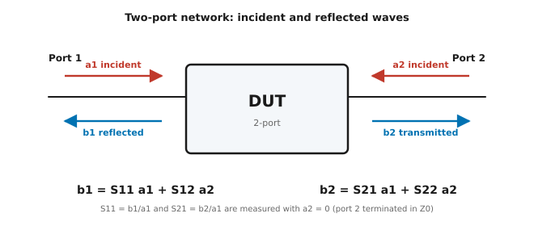
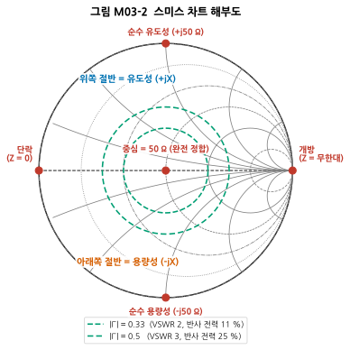
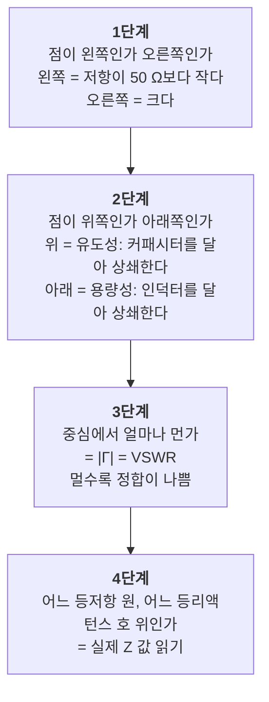
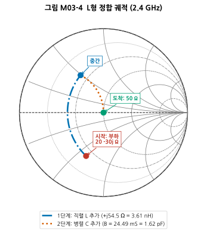
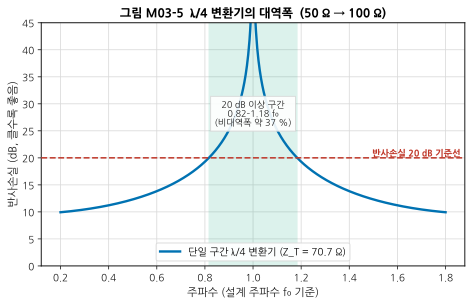
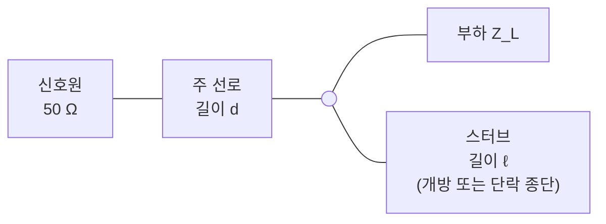

# M03 — S-파라미터와 스미스 차트: 정합의 언어

**문서 번호**: RF-CUR-M03 · **버전**: v1.0 · **분량**: 이론 6 h + 실습 6 h (표준 트랙 2주)

| | |
|---|---|
| **선수 모듈** | [M02](./M02_전송선로.md) |
| **이 모듈이 소유하는 개념** | 포트의 정확한 의미, 진행파 a/b, S-파라미터 정의, 기준 임피던스, 상호성·무손실·유니터리 조건, Z/Y/ABCD 파라미터와 변환, 캐스케이드, Touchstone 파일 포맷, 스미스 차트 읽기, 임피던스 정합(L형 네트워크·λ/4 변환기·스터브), 정합의 세 가지 목적 |
| **이 모듈을 쓰는 후속 모듈** | 전 부품 모듈(사용), M08(안정도·잡음 원), M14(교정으로 정확도 확보), M16(실물 튜닝) |
| **학습 목표** | ① S21이 −3 dB라는 말의 의미를 물리적으로 설명한다 ② 스미스 차트에서 임의의 부하를 50 Ω으로 옮기는 L형 정합을 설계한다 ③ Touchstone(.s2p) 파일을 읽어 필요한 값을 뽑는다 |

---

## M03.1 고주파에서 왜 Z나 Y 대신 S인가

### 저주파의 방법이 왜 안 되는가

저주파 회로망을 기술할 때는 Z(임피던스) 파라미터나 Y(어드미턴스) 파라미터를 씁니다. 그런데 이들의 정의에는 문제가 있습니다.

$$Z_{11} = \left.\frac{V_1}{I_1}\right|_{I_2=0} \qquad Y_{11} = \left.\frac{I_1}{V_1}\right|_{V_2=0}$$

- **Z 파라미터**는 다른 포트를 **개방(I = 0)** 시켜야 합니다.
- **Y 파라미터**는 다른 포트를 **단락(V = 0)** 시켜야 합니다.

고주파에서 이 둘이 모두 깨집니다.

| 문제 | 왜 |
|---|---|
| **완벽한 개방·단락을 만들 수 없다** | 개방하려고 커넥터를 열어 두면 그 끝이 안테나가 되어 방사합니다. 단락하려고 금속을 대면 그 금속에도 인덕턴스가 있습니다 |
| **개방·단락이 소자를 발진시킬 수 있다** | 증폭기를 개방·단락 종단으로 재려 하면 발진해 버리는 경우가 흔합니다 (→ M08 안정도) |
| **전압·전류를 직접 재기 어렵다** | 파장이 짧아 프로브를 대는 위치마다 값이 다릅니다 (→ M02) |

### S 파라미터의 해법

**측정하기 어려운 전압·전류 대신, 측정하기 쉬운 진행파의 비율로 기술하자.**

그리고 다른 포트는 개방·단락이 아니라 **Z₀(보통 50 Ω)로 종단**합니다. 50 Ω 종단은 실제로 만들 수 있고, 발진도 잘 일으키지 않습니다.

> 📌 이것이 S-파라미터가 RF의 표준이 된 이유입니다. **"측정할 수 있는 것으로 정의를 바꾼"** 것입니다.

---

## M03.2 포트란 무엇인가

**포트(port)** 는 "커넥터"가 아니라 **에너지가 회로망에 드나드는 단자쌍**입니다.

정확히 말하면 포트는 세 가지를 함께 지정해야 성립합니다.

| 구성 요소 | 의미 | 빠뜨리면 |
|---|---|---|
| **위치 (기준면, reference plane)** | 정확히 어디서부터 회로망인가 | 케이블 길이만큼 위상이 틀림 |
| **기준 임피던스 Z₀** | 무엇을 기준으로 한 비율인가 | 50 Ω 값과 75 Ω 값을 비교하게 됨 |
| **모드** | 어떤 전자기 모드인가 | 다중 모드 구조에서 혼동 |

> ⚠️ **기준면이 왜 중요한가**: S-파라미터의 **크기는 기준면을 옮겨도 (손실이 없다면) 거의 그대로지만, 위상은 완전히 달라집니다.** 2.4 GHz에서 1 cm만 옮겨도 위상이 약 29° 돕니다(자유공간 기준). 그래서 측정할 때 **교정을 통해 기준면을 정확히 정의**하는 일이 필수입니다. 이것이 M14의 주제입니다.

---

## M03.3 S-파라미터의 정의

### 진행파 a와 b

각 포트에서 **들어가는 파**를 a, **나오는 파**를 b라고 씁니다. 이들은 전력의 제곱근 차원을 갖도록 정규화되어 있어, **|a|² 가 입사 전력, |b|² 가 반사·전달 전력**이 됩니다.



*그림 M03-1. 2포트 회로망의 진행파 정의. 빨간 화살표가 회로망으로 **들어가는** 파(a), 파란 화살표가 회로망에서 **나오는** 파(b)입니다. 포트 1에서 들어간 것이 일부는 되돌아 나오고(b1) 일부는 반대편으로 빠져나갑니다(b2). 아래 두 식이 이 관계를 그대로 적은 것입니다.*

### 정의식

$$b_1 = S_{11}a_1 + S_{12}a_2$$
$$b_2 = S_{21}a_1 + S_{22}a_2$$

한 번에 하나씩 재려면 **한쪽 입사파를 0으로** 만들면 됩니다. a₂ = 0 은 **포트 2를 Z₀로 종단**하면 얻어집니다 — 종단이 들어온 파를 전부 흡수해 되돌려 보내지 않기 때문입니다.

$$S_{11} = \left.\frac{b_1}{a_1}\right|_{a_2=0} \qquad S_{21} = \left.\frac{b_2}{a_1}\right|_{a_2=0}$$
$$S_{22} = \left.\frac{b_2}{a_2}\right|_{a_1=0} \qquad S_{12} = \left.\frac{b_1}{a_2}\right|_{a_1=0}$$

### 첨자 읽는 법 — 헷갈리는 지점

**S_(나오는 포트)(들어간 포트)** 순서입니다. 즉 **S21은 "1로 들어가 2로 나온 것"** 입니다. 순서가 직관과 반대라 초심자가 자주 뒤집습니다.

| 파라미터 | 이름 | 물리적 의미 | 실무에서 부르는 이름 |
|---|---|---|---|
| **S11** | 입력 반사계수 | 포트 1로 넣었을 때 되돌아온 비율 | 입력 정합, 반사손실 |
| **S21** | 순방향 전달계수 | 포트 1 → 포트 2로 지나간 비율 | **이득** 또는 **삽입손실** |
| **S12** | 역방향 전달계수 | 포트 2 → 포트 1로 새어 온 비율 | **역방향 격리** |
| **S22** | 출력 반사계수 | 포트 2로 넣었을 때 되돌아온 비율 | 출력 정합 |

### 수치 — S21이 −3 dB라는 말

$$|S_{21}|\,[\mathrm{dB}] = 20\log_{10}|S_{21}|$$

| S21 (dB) | \|S21\| (전압비) | 전력 통과율 | 무슨 뜻인가 |
|---|---|---|---|
| 0 dB | 1.0 | 100 % | 손실 없이 그대로 통과 |
| **−3 dB** | 0.707 | **50 %** | **전력의 절반이 사라짐** |
| −20 dB | 0.1 | 1 % | 99 % 차단 (필터 저지대역) |
| **+20 dB** | 10 | 10000 % | **20 dB 이득 (증폭기)** |

> 💡 **S21이 dB로 양수면 증폭기, 음수면 수동 소자**입니다. 필터·케이블·감쇠기는 언제나 음수입니다.

### 행렬 성질로 부품의 성격 읽기

S 행렬만 보고도 그 부품이 어떤 종류인지 알 수 있습니다.

| 조건 | 수식 | 의미 | 예 |
|---|---|---|---|
| **상호성(reciprocal)** | S₁₂ = S₂₁ | 방향에 무관 | 필터, 케이블, 감쇠기 등 모든 **수동 선형** 소자 |
| **비상호적** | S₁₂ ≠ S₂₁ | 방향에 따라 다름 | 증폭기(S21 ≫ S12), 아이솔레이터·서큘레이터 |
| **무손실(lossless)** | S 행렬이 유니터리 | 에너지 보존 | 이상적 필터, 이상적 분배기 |
| **정합됨(matched)** | S₁₁ = S₂₂ = 0 | 반사 없음 | 이상적 감쇠기, 이상적 종단 |

무손실 2포트에서는 에너지 보존이 이렇게 나타납니다.

$$|S_{11}|^2 + |S_{21}|^2 = 1$$

> 📌 **실무 활용**: 무손실이어야 할 필터인데 $|S_{11}|^2 + |S_{21}|^2$ 가 0.7밖에 안 나온다면, 나머지 30 %는 **어딘가에서 열로 사라지고 있다**는 뜻입니다. 유전체 손실, 도체 손실, 또는 방사입니다. 이 계산 하나로 측정 결과가 말이 되는지 검산할 수 있습니다.

<details>
<summary>다른 파라미터(Z, Y, ABCD)와의 관계 (클릭)</summary>

S-파라미터가 측정에 유리하다면, **ABCD 파라미터**는 **직렬 연결 계산**에 유리합니다. 회로망을 차례로 이으면 ABCD 행렬을 그냥 곱하면 됩니다.

$$\begin{bmatrix}A & B\\ C & D\end{bmatrix}_{\text{전체}} = \begin{bmatrix}A & B\\ C & D\end{bmatrix}_1 \times \begin{bmatrix}A & B\\ C & D\end{bmatrix}_2 \times \cdots$$

S-파라미터로 직접 캐스케이드하려면 **T-파라미터(전달 파라미터)** 로 변환한 뒤 곱하고 되돌립니다. 다행히 `scikit-rf` 가 이 변환을 전부 처리해 줍니다 — 실습에서 `net1 ** net2` 한 줄로 끝납니다.

**실무 요령**: 손으로 계산할 일은 거의 없습니다. 중요한 것은 **"S는 측정용, ABCD/T는 계산용"** 이라는 역할 구분을 아는 것입니다.
</details>

---

## M03.4 스미스 차트

### 왜 이런 이상한 그림을 쓰는가

임피던스는 복소수입니다. 실수부(저항)는 0에서 무한대까지, 허수부(리액턴스)는 −무한대에서 +무한대까지 갑니다. **무한한 평면을 종이에 그릴 수는 없습니다.**

스미스 차트는 **임피던스 평면을 반사계수 평면으로 옮겨** 이 문제를 해결합니다. 수동 소자의 반사계수는 항상 |Γ| ≤ 1 이므로, **무한한 임피던스 평면이 반지름 1의 원 안에 전부 들어옵니다.**

$$\Gamma = \frac{Z - Z_0}{Z + Z_0} \qquad \text{역변환:}\quad Z = Z_0\,\frac{1+\Gamma}{1-\Gamma}$$

### 해부도



*그림 M03-2. 스미스 차트 해부도. 바깥 원이 |Γ| = 1 (전부 반사)입니다. **왼쪽 끝이 단락(Z=0), 오른쪽 끝이 개방(Z=무한대), 정중앙이 50 Ω(완전 정합)** 입니다. 위쪽 절반은 유도성(+jX, 인덕터 성질), 아래쪽 절반은 용량성(−jX, 커패시터 성질)입니다. 회색 곡선 중 **오른쪽 끝에서 모이는 원들이 등저항선**, **오른쪽 끝에서 뻗어 나가는 호들이 등리액턴스선**입니다. 초록 파선은 같은 |Γ|(같은 VSWR)를 잇는 원입니다.*

### 읽는 순서 — 이 4단계로 충분합니다



*그림 M03-3. 스미스 차트 읽는 순서. 초심자는 4단계(정확한 값 읽기)부터 하려다 좌절합니다. **1~3단계만으로도 실무의 대부분이 됩니다** — "정합이 좋은가 나쁜가, 유도성인가 용량성인가"를 알면 무엇을 달아야 할지 결정할 수 있기 때문입니다.*

### 차트 위에서 소자를 다는 것 = 궤적을 그리는 것

이것이 스미스 차트의 진짜 위력입니다.

| 소자를 달면 | 궤적 |
|---|---|
| **직렬 인덕터** | 등저항 원을 따라 **시계 방향**(위쪽으로) |
| **직렬 커패시터** | 등저항 원을 따라 **반시계 방향**(아래쪽으로) |
| **병렬 인덕터** | 등컨덕턴스 원을 따라 **반시계 방향** |
| **병렬 커패시터** | 등컨덕턴스 원을 따라 **시계 방향** |
| **전송선 길이 추가** | 중심을 도는 **일정 반지름 원**을 따라 시계 방향 (부하 → 신호원 방향) |

> 📌 마지막 줄이 M02와 이어집니다. **전송선을 끼우면 |Γ|는 그대로(무손실이면)이고 위상만 회전**합니다. 그래서 중심에서의 거리는 변하지 않고 각도만 돕니다. 길이 λ/2를 지나면 360°를 돌아 **제자리로 돌아옵니다** — M02 §6의 "λ/2는 임피던스를 그대로 둔다"가 그림으로 보이는 것입니다.

---

## M03.5 임피던스 정합

### 왜 정합을 하는가 — 목적이 셋이고, 최적점이 다르다

이것이 초심자가 가장 오해하는 지점입니다. "정합 = 최대 전력 전달"이라고만 배우면 LNA 설계에서 벽에 부딪힙니다.

| 목적 | 조건 | 어디서 쓰는가 |
|---|---|---|
| **① 최대 전력 전달** | Z_L = Z_S* (켤레 정합) | 송신 출력단, 전력 전달이 목적인 곳 |
| **② 잡음 최소** | Γ_S = Γ_opt (소자가 정한 최적 소스 임피던스) | **LNA 입력** (→ M08) |
| **③ 반사 억제** | Z = Z₀ (50 Ω 정합) | 계측, 필터 사이, 시스템 인터페이스 |

> ⚠️ **①과 ②는 대개 서로 다른 점입니다.** LNA에서 잡음이 최소가 되는 소스 임피던스는 전력 전달이 최대가 되는 임피던스와 다릅니다. 그래서 LNA 설계는 **"잡음을 얼마나 희생하고 이득을 얼마나 얻을 것인가"의 절충**이 됩니다. M08에서 잡음 원(noise circle)과 이득 원(gain circle)을 겹쳐 그려 이 절충을 다룹니다.
>
> 지금은 **"정합의 목적이 하나가 아니다"** 라는 사실만 가져가면 됩니다.

### 방법 ① — L형 네트워크

리액턴스 소자 두 개(L 하나 + C 하나)로 임의의 부하를 Z₀로 옮깁니다. **가장 흔하게 쓰는 방법**입니다.

**설계 예제**: 2.4 GHz에서 Z_L = 20 − j30 Ω 을 50 Ω으로 정합

부하의 저항 성분(20 Ω)이 50 Ω보다 작으므로, **직렬 리액턴스 → 병렬 서셉턴스** 순서를 씁니다.

**1단계: 필요한 Q를 구한다**

$$Q = \sqrt{\frac{Z_0}{R_L} - 1} = \sqrt{\frac{50}{20} - 1} = \sqrt{1.5} = 1.2247$$

**2단계: 직렬 리액턴스**

$$X_s = Q R_L - X_L = 1.2247 \times 20 - (-30) = 24.49 + 30 = 54.49\ \Omega$$

양수 = **인덕터**. 값은:

$$L = \frac{X_s}{2\pi f} = \frac{54.49}{2\pi \times 2.4\times10^9} = 3.614\ \mathrm{nH}$$

**3단계: 병렬 서셉턴스**

$$B_p = \frac{Q}{Z_0} = \frac{1.2247}{50} = 24.49\ \mathrm{mS}$$

양수 = **커패시터**. 값은:

$$C = \frac{B_p}{2\pi f} = \frac{0.02449}{2\pi \times 2.4\times10^9} = 1.624\ \mathrm{pF}$$

**검산**: 결과는 정확히 50.000 + j0.000 Ω. (실습 L03-b에서 직접 확인합니다)



*그림 M03-4. L형 정합 궤적 (2.4 GHz). 빨간 점(오른쪽 아래)이 시작점인 부하 20 − j30 Ω입니다. **파란 선(1단계)** 이 직렬 인덕터를 더한 궤적으로, 등저항 원을 따라 시계 방향으로 올라갑니다. **주황 점선(2단계)** 이 병렬 커패시터를 더한 궤적으로, 등컨덕턴스 원을 따라 중심으로 들어옵니다. 초록 점이 도착점인 정중앙 = 50 Ω입니다.*

> 💡 **왜 두 소자로 충분한가**: 임피던스는 복소수라 **두 개의 자유도**(실수부, 허수부)를 갖습니다. 리액턴스 소자 하나가 자유도 하나를 조절하므로, 두 개면 임의의 점을 중심으로 옮길 수 있습니다.
>
> ⚠️ **L형의 한계**: Q가 부하에 의해 자동으로 정해지므로 **대역폭을 선택할 수 없습니다.** 부하가 50 Ω에서 멀수록 Q가 커지고 대역폭이 좁아집니다. 대역폭을 조절하려면 소자를 3개 이상 쓰는 π형·T형이나 다단 정합을 씁니다.

### 방법 ② — λ/4 변환기

M02 §6에서 본 "λ/4가 임피던스를 반전시킨다"를 정합에 씁니다. **순수 저항 부하**를 정합할 때 씁니다.

$$Z_T = \sqrt{Z_0 \cdot R_L}$$

**예제**: 50 Ω 선로에 100 Ω 저항 부하 → $Z_T = \sqrt{50 \times 100} = 70.71\ \Omega$

즉 특성 임피던스 70.71 Ω인 선을 λ/4 길이만큼 끼우면 정합됩니다.



*그림 M03-5. λ/4 변환기의 대역폭 (50 Ω → 100 Ω). 가로축은 설계 주파수 f₀를 1로 놓은 상대 주파수, 세로축은 반사손실(dB, 클수록 좋음)입니다. **f₀에서는 완벽하지만(반사손실 무한대), 주파수가 벗어나면 급격히 나빠집니다.** 빨간 파선이 반사손실 20 dB 기준선이고, 초록 영역이 그 기준을 만족하는 구간입니다 — 0.82 f₀ ~ 1.18 f₀, 비대역폭 약 37 %.*

> ⚠️ **λ/4 변환기의 두 가지 한계**
> 1. **부하가 순수 저항이어야 합니다.** 리액턴스가 있으면 먼저 상쇄하거나 다른 방법을 써야 합니다.
> 2. **한 주파수에서만 정확합니다.** 넓은 대역이 필요하면 **다단(multi-section) 변환기**를 씁니다 — 여러 개의 λ/4 구간을 잇되 임피던스를 조금씩 계단식으로 올리면 대역폭이 크게 넓어집니다.

### 방법 ③ — 스터브 정합

부품을 전혀 쓰지 않고 **전송선 조각만으로** 정합합니다. 기판 위에 패턴만 그리면 되므로 고주파에서 유리합니다.



*그림 M03-6. 단일 스터브 정합의 구조. **두 개의 길이(d와 ℓ)가 두 개의 자유도**를 제공합니다. 부하에서 거리 d만큼 떨어진 지점에서 보면 임피던스가 회전해 있는데, 그 지점의 컨덕턴스가 1/Z₀가 되도록 d를 고르고, 남은 서셉턴스를 스터브가 상쇄하도록 ℓ을 고릅니다.*

| | 개방 스터브 | 단락 스터브 |
|---|---|---|
| 제작 | 선을 그냥 끝냄 (쉬움) | 비아로 접지에 연결 |
| 문제 | **끝에서 방사**할 수 있음 | 비아 인덕턴스가 오차를 만듦 |
| 마이크로스트립에서 | 주로 씀 | 비아 품질이 좋으면 씀 |

> 💡 **왜 부품 대신 선을 쓰는가**: 고주파로 갈수록 칩 인덕터·커패시터의 기생 성분이 커져 제 역할을 못 합니다(→ M06 SRF). 반면 전송선은 **주파수가 높을수록 오히려 작아져** 만들기 쉬워집니다. 대략 몇 GHz 이상에서는 분포소자 정합이 표준이 됩니다.

---

## M03.6 Touchstone 파일

### 무엇인가

**Touchstone 파일**은 S-파라미터를 저장하는 사실상의 표준 텍스트 형식입니다. 확장자는 포트 수에 따라 `.s1p`, `.s2p`, `.s3p` … 로 붙습니다.

VNA로 측정하면 이 형식으로 저장되고, 부품 제조사도 이 형식으로 모델을 배포합니다. **부품 데이터시트의 그래프보다 이 파일이 훨씬 유용합니다** — 직접 계산에 넣을 수 있기 때문입니다.

### 구조

```
! 느낌표로 시작하는 줄은 주석
! Example 2-port S-parameter file
# GHz S DB R 50
!  freq   S11(dB)  S11(deg)  S21(dB)  S21(deg)  S12(dB)  S12(deg)  S22(dB)  S22(deg)
2.30      -18.2    -145.0     -1.20     -88.0    -1.20    -88.0    -20.1    -160.0
2.40      -24.6    -178.0     -0.95     -95.0    -0.95    -95.0    -26.3     171.0
2.50      -17.4     150.0     -1.35    -102.0    -1.35   -102.0    -19.0     140.0
```

**옵션 줄(`#`)을 먼저 보십시오.** 이것을 잘못 읽으면 모든 값이 틀립니다.

| 항목 | 가능한 값 | 뜻 |
|---|---|---|
| 주파수 단위 | `Hz` `kHz` `MHz` `GHz` | 첫 열의 단위 |
| 파라미터 종류 | `S` `Y` `Z` `H` `G` | 보통 S |
| 형식 | `DB` `MA` `RI` | dB+각도 / 크기+각도 / 실수+허수 |
| 기준 임피던스 | `R 50` | **50 Ω 기준** |

> ⚠️ **2포트 파일의 열 순서 함정**: 2포트 Touchstone은 **S11, S21, S12, S22** 순서입니다. S12와 S21의 위치가 직관과 반대이므로, 손으로 파싱하면 역방향 격리와 이득을 뒤바꾸기 쉽습니다. **3포트 이상에서는 행 단위로 순서가 또 달라집니다.** 그래서 `scikit-rf` 같은 검증된 라이브러리를 쓰는 것이 안전합니다.

### scikit-rf로 다루기

```python
import skrf as rf

net = rf.Network('filter.s2p')       # 읽기
print(net)                            # 주파수 범위, 포트 수 요약
print(net.f[0], net.s[0, 1, 0])       # 첫 주파수의 S21 (복소수)

net.s21.plot_s_db()                   # S21을 dB로 플롯
cascaded = net1 ** net2               # 캐스케이드 (직렬 연결)
deembedded = net1.inv ** measured     # 디임베딩 (→ M14)
net.write_touchstone('out')           # 쓰기
```

> 📌 `**` 연산자 하나가 캐스케이드입니다. 내부적으로 T-파라미터로 변환해 곱하고 되돌립니다. `scikit-rf`는 BSD 라이선스 오픈소스이고 [문서](https://scikit-rf.readthedocs.io/en/latest/tutorials/Introduction.html)가 잘 되어 있습니다.

---

## M03.7 한 장 요약

| 알아야 할 것 | 한 줄 | 절 |
|---|---|---|
| 왜 S인가 | 고주파에서 개방·단락을 못 만들기 때문. **Z₀ 종단으로 정의를 바꿈** | §1 |
| 포트의 3요소 | 기준면 · 기준 임피던스 · 모드 | §2 |
| 첨자 순서 | **S21 = 1로 들어가 2로 나온 것** (직관과 반대) | §3 |
| 네 개의 뜻 | S11 입력정합 / S21 이득·삽입손실 / S12 역방향 격리 / S22 출력정합 | §3 |
| 무손실 검산 | **\|S11\|² + \|S21\|² = 1**. 측정이 말이 되는지 확인하는 도구 | §3 |
| 스미스 차트 | 무한한 임피던스 평면을 반지름 1 원 안에. 왼쪽=단락, 오른쪽=개방, 중앙=50 Ω | §4 |
| 읽는 순서 | 좌우(저항) → 상하(유도/용량) → 중심거리(VSWR). **여기까지가 실무의 대부분** | §4 |
| 정합의 목적 | **셋이고 최적점이 다르다** — 전력전달 / 잡음최소 / 반사억제 | §5 |
| L형 정합 | 소자 2개로 임의의 부하를 중심으로. 대역폭은 선택 불가 | §5 |
| λ/4 변환기 | Z_T = √(Z₀·R_L). 순저항 부하, 좁은 대역 | §5 |
| Touchstone | 옵션 줄(`#`)을 반드시 확인. 2포트 열 순서는 **S11 S21 S12 S22** | §6 |

---

## M03.L 실습

### L03-a — Touchstone 다루기 (Tier 0, 2시간)

**① 셋업**: `pip install scikit-rf`

**② 절차**

```python
import numpy as np
import skrf as rf

# 검증용 Touchstone 파일을 직접 만들어 본다 (이상적 감쇠기)
freq = rf.Frequency(1, 6, 101, 'ghz')
atten_db = 10.0
s21 = 10 ** (-atten_db / 20)
s = np.zeros((len(freq), 2, 2), dtype=complex)
s[:, 0, 1] = s[:, 1, 0] = s21          # 상호적, 정합됨
att = rf.Network(frequency=freq, s=s, z0=50, name='10dB_attenuator')

print("S21 =", 20*np.log10(abs(att.s[0,1,0])), "dB")   # -10.0
print("S11 =", abs(att.s[0,0,0]))                       # 0.0

# 두 개를 캐스케이드하면?
two = att ** att
print("2단 S21 =", 20*np.log10(abs(two.s[0,1,0])), "dB")  # -20.0

# 무손실 검산: |S11|^2 + |S21|^2
chk = abs(att.s[0,0,0])**2 + abs(att.s[0,1,0])**2
print(f"에너지 합 = {chk:.4f}  (1보다 작으면 손실 있음)")

att.write_touchstone('atten10')        # atten10.s2p 생성
```

**③ 예상 결과**

```
S21 = -10.0 dB
S11 = 0.0
2단 S21 = -20.0 dB
에너지 합 = 0.1000  (1보다 작으면 손실 있음)
```

**④ 흔한 실수**

| 증상 | 원인 |
|---|---|
| S21을 20 대신 10 log로 계산 | S-파라미터는 **전압비**이므로 20 log (→ M01 §2) |
| 캐스케이드에 `*` 를 씀 | `*` 는 원소별 곱셈. 캐스케이드는 `**` |
| 인덱스를 `s[0,0,1]` 로 써서 S12를 S21로 오해 | skrf 인덱스는 `s[주파수, 나오는포트-1, 들어간포트-1]`. **S21은 `s[:,1,0]`** |

**⑤ 판정 기준**: 위 출력과 일치. 특히 "에너지 합 = 0.1"이 나오는 이유를 설명할 수 있어야 합니다 — 10 dB 감쇠기는 90 %를 열로 없애므로 무손실이 아닙니다.

### L03-b — L형 정합 설계 및 스미스 차트 그리기 (Tier 0, 3시간)

**① 셋업**: NumPy + Matplotlib + `scripts/rf_style.py`

**② 절차**

```python
import numpy as np

def lmatch_series_shunt(zl, z0=50.0, f=2.4e9):
    """R_L < Z0 인 경우: 직렬 리액턴스 → 병렬 서셉턴스"""
    rl, xl = zl.real, zl.imag
    assert rl < z0, "이 형태는 R_L < Z0 일 때만 유효"
    q  = np.sqrt(z0/rl - 1)
    xs = q*rl - xl                    # 필요한 직렬 리액턴스
    bp = q/z0                         # 필요한 병렬 서셉턴스
    w  = 2*np.pi*f
    z_mid = zl + 1j*xs
    z_end = 1/(1/z_mid + 1j*bp)       # 병렬 C 의 어드미턴스는 +jB
    return dict(Q=q, Xs=xs, Bp=bp,
                L_nH=xs/w*1e9 if xs > 0 else None,
                C_pF=bp/w*1e12 if bp > 0 else None,
                z_result=z_end)

r = lmatch_series_shunt(20 - 30j)
for k, v in r.items():
    print(f"  {k:10s} {v}")
```

**③ 예상 결과**

```
  Q          1.224744871391589
  Xs         54.49489742783178
  Bp         0.02449489742783178
  L_nH       3.6138...
  C_pF       1.6244...
  z_result   (50+8.673617379884035e-15j)
```

**④ 흔한 실수**

| 증상 | 원인 |
|---|---|
| 결과가 50 Ω이 아님 | **병렬 소자의 부호**. 커패시터의 어드미턴스는 +jB입니다. `1/z_mid - 1j*bp` 로 쓰면 엉뚱한 곳에 도착합니다 (이 커리큘럼 제작 중에도 실제로 낸 실수입니다) |
| `assert` 에 걸림 | R_L > Z₀ 인 경우로, **병렬 → 직렬** 순서를 써야 합니다. 이 경우도 구현해 보십시오 |
| Q가 음수 근호 | R_L > Z₀ 인데 이 식을 쓴 것 |

**⑤ 판정 기준**: `z_result` 의 실수부가 50 ± 0.001, 허수부가 0 ± 0.001.

**추가 과제**: 스미스 차트를 직접 그리고(`scripts/gen_fig_part1.py` 의 `_smith_grid()` 참고) 두 단계 궤적을 겹쳐 그리십시오. 그림 M03-4가 목표입니다.

### L03-c — NanoVNA 실측을 Touchstone으로 (Tier 1, 2시간)

**① 셋업도**

```
NanoVNA ── CH0 ── [교정 없이] ── DUT(필터 또는 안테나) ── CH1
                    ↓
             화면 저장 / USB로 .s2p 내보내기
```

**② 절차**

1. NanoVNA를 대상 주파수 범위로 설정합니다.
2. 부록 D §D.4를 지켜 케이블을 체결합니다.
3. DUT를 연결하고 S11·S21을 관찰합니다.
4. NanoVNA-saver 등의 PC 소프트웨어로 `.s2p` 파일을 저장합니다.
5. L03-a의 코드로 그 파일을 읽어 S21을 dB로 플롯합니다.
6. **무손실 검산** $|S_{11}|^2 + |S_{21}|^2$ 을 계산해 보십시오.

**③ 예상 결과**: 대역통과 필터라면 통과대역에서 에너지 합이 0.7~0.95, 저지대역에서는 S11이 1에 가까워 합이 1 근처.

**④ 흔한 실수**

| 증상 | 원인 |
|---|---|
| 에너지 합이 1을 넘음 | **교정을 안 했기 때문**입니다. 물리적으로 불가능한 값이 나온다는 것 자체가 "교정이 필요하다"는 증거입니다 → M14 |
| S21이 통과대역에서도 −10 dB | 커넥터 접촉 불량 또는 케이블 손실 |

**⑤ 판정 기준**: 파일을 읽어 플롯이 나오고, 에너지 합이 1을 넘는 지점이 있다면 **그 이유를 "교정 부재"로 설명할 수 있으면** 통과.

**Tier 0 대체**: 부품 제조사가 공개한 `.s2p` 파일(필터, LNA 등)을 받아 같은 분석을 수행하십시오.

---

## M03.Q 확인 문제

<details>
<summary><b>Q1.</b> 어떤 필터의 S21 = −1.5 dB, S11 = −18 dB다. 통과 전력과 반사 전력은 각각 몇 %인가? 나머지는 어디로 갔는가?</summary>

- 통과: |S21|² = 10^(−1.5/10) = **70.8 %**
- 반사: |S11|² = 10^(−18/10) = **1.6 %**
- 합계 = 72.4 %

**나머지 27.6 %는 필터 내부에서 열로 사라졌거나 방사되었습니다.** 무손실이 아니라는 뜻이며, 이것이 삽입손실의 실체입니다.

주의: dB 값이 전압비의 20 log이므로 전력 비율은 10^(dB/10)입니다. 20으로 나누면 전압비가 되니 헷갈리지 마십시오.
</details>

<details>
<summary><b>Q2.</b> 증폭기의 S12가 −25 dB다. 무엇을 뜻하며 왜 중요한가?</summary>

출력 쪽에서 입력 쪽으로 새어 들어오는 신호가 **25 dB 작다**는 뜻입니다. 이것을 **역방향 격리(reverse isolation)** 라고 합니다.

**왜 중요한가**:
1. **안정도** — S12가 클수록 출력의 변화가 입력으로 되먹임되어 발진하기 쉬워집니다 (→ M08 K-factor)
2. **출력 부하의 영향** — S12가 작으면 출력에 무엇을 달든 입력 임피던스가 거의 변하지 않아 설계가 쉬워집니다
3. **LO 누설** — 믹서에서는 이 격리가 부족하면 국부발진기 신호가 안테나로 새어 나갑니다 (→ M09)
</details>

<details>
<summary><b>Q3.</b> 스미스 차트의 정중앙에 점이 있다. 부하는?</summary>

**50 Ω 순저항** (기준 임피던스가 50 Ω일 때). Γ = 0, VSWR = 1, 반사 없음.

> 단서: **기준 임피던스가 75 Ω인 차트라면 중앙은 75 Ω**입니다. 스미스 차트를 볼 때 항상 기준 임피던스를 먼저 확인하십시오.
</details>

<details>
<summary><b>Q4.</b> 50 Ω 선로에 200 Ω 순저항을 정합하려 한다. λ/4 변환기의 특성 임피던스는? 실제로 만들 수 있는가?</summary>

$Z_T = \sqrt{50 \times 200} = \sqrt{10000} = \mathbf{100\ \Omega}$

**만들 수 있습니다.** 마이크로스트립에서 100 Ω은 50 Ω보다 좁은 선입니다 — FR-4(Dk 4.4)에서 50 Ω이 W/h ≈ 1.93이었으니, 100 Ω은 대략 W/h ≈ 0.44가 됩니다(그림 M02-6 참조).

> 다만 선이 너무 좁아지면 **제조 공차의 영향이 커지고 도체 손실이 늘어납니다.** 아주 큰 변환비가 필요하면 다단 변환기로 나누는 것이 낫습니다.
</details>

<details>
<summary><b>Q5.</b> 왜 LNA의 입력 정합이 "최대 전력 전달"이 아닌가?</summary>

LNA의 목적은 **잡음지수를 최소로 하는 것**이지 전력을 많이 받는 것이 아닙니다.

트랜지스터에는 잡음이 최소가 되는 **최적 소스 반사계수 Γ_opt** 가 따로 있는데, 이것이 켤레 정합점(전력 전달 최대점)과 대개 일치하지 않습니다. 잡음을 우선하면 입력 반사손실(S11)이 나빠지고 이득도 조금 줄어듭니다.

> 실무에서는 **잡음 원과 이득 원을 스미스 차트에 겹쳐 그려** 절충점을 고릅니다. 그리고 그 절충 때문에 증폭기가 조건부 안정이 되기도 합니다. M08이 이 절충을 다룹니다.
</details>

<details>
<summary><b>Q6.</b> S-파라미터 파일에 `# MHz S MA R 75` 라고 적혀 있다. 무슨 뜻인가?</summary>

- 주파수 열의 단위는 **MHz**
- **S**-파라미터
- 형식은 **MA** = 크기(Magnitude, 선형)와 각도(Angle, 도) 쌍
- 기준 임피던스는 **75 Ω**

> ⚠️ **주의점 둘**:
> 1. 형식이 `DB`가 아니라 `MA`이므로 첫 값이 dB가 아니라 **선형 크기**입니다. 0.5를 −0.5 dB로 착각하면 안 됩니다.
> 2. 기준이 **75 Ω**이므로 50 Ω 데이터와 직접 비교할 수 없습니다. 비교하려면 임피던스 재정규화가 필요합니다(`scikit-rf` 의 `renormalize()`).
</details>

<details>
<summary><b>Q7.</b> 무손실 2포트에서 S11 = 0.6 이라면 |S21|은?</summary>

$|S_{11}|^2 + |S_{21}|^2 = 1$ 이므로

$|S_{21}| = \sqrt{1 - 0.36} = \sqrt{0.64} = \mathbf{0.8}$

dB로는 20 log(0.8) = **−1.94 dB**.

> 이 관계는 **측정 검산에 아주 유용합니다.** 필터를 측정했는데 합이 1을 크게 넘으면 교정이 잘못된 것이고, 1보다 훨씬 작으면 그만큼 손실이 있다는 뜻입니다.
</details>

---

## M03.A 이 모듈의 축약어

| 약어 | 영문 원어 | 한글 |
|---|---|---|
| S-파라미터 | Scattering Parameters | 산란 파라미터 |
| S11 / S21 / S12 / S22 | — | 입력 반사 / 순방향 전달 / 역방향 전달 / 출력 반사 |
| Z / Y / ABCD | Impedance / Admittance / Chain parameters | 임피던스 / 어드미턴스 / 전달(연쇄) 파라미터 |
| Γ (감마) | Reflection Coefficient | 반사계수 (→ M02) |
| Γ_opt | Optimum Source Reflection Coefficient | 최적 소스 반사계수 (→ M08) |
| Q | Quality Factor | 품질 계수 (→ M06) |
| VSWR | Voltage Standing Wave Ratio | 전압 정재파비 (→ M02) |
| DUT | Device Under Test | 피시험 소자 (→ M04) |
| VNA | Vector Network Analyzer | 벡터 회로망 분석기 (→ M04) |
| LNA | Low Noise Amplifier | 저잡음 증폭기 (→ M08) |
| LO | Local Oscillator | 국부 발진기 (→ M09) |
| SRF | Self-Resonant Frequency | 자기공진주파수 (→ M06) |
| TEM | Transverse Electromagnetic | 횡전자기 모드 |
| RF | Radio Frequency | 무선 주파수 |

---

## M03.S 출처

| 내용 | 출처 | 등급 | 교차검증 |
|---|---|---|---|
| S-파라미터 정의, 회로망 이론, 정합 | [Steer, *Microwave and RF Design III — Networks*](https://eng.libretexts.org/Bookshelves/Electrical_Engineering/Electronics/Microwave_and_RF_Design_III_-_Networks_(Steer)) | B | — |
| S-파라미터 개요 | [Microwaves101 — S-parameters](https://www.microwaves101.com/encyclopedias/s-parameters) | B | — |
| RF에서 S-파라미터를 쓰는 이유 (교육 구성 참고) | [rfdh.com — S파라미터](https://rfdh.com/bas_rf/s.htm) | — | 목차만 |
| 스미스 차트와 정합 이론 (L형, λ/4, 스터브) | [UIUC ECE329 Lecture 37 — Smith Chart and Impedance Matching](https://courses.grainger.illinois.edu/ece329/sp2021/Lecture_notes/329lect37-L39.pdf) · [USPAS — Impedance Matching and Smith Charts (Staples, LBNL)](https://uspas.fnal.gov/materials/08UCSC/mml13_matching+smith_chart.pdf) | C | **2건** |
| λ/4 변환기 이론 | [Cadence — Quarter-Wave Transformers: Theory and Equations](https://resources.system-analysis.cadence.com/blog/msa2023-quarter-wave-transformer-theory-and-equations) | D | — |
| Touchstone 처리, 캐스케이드, 디임베딩 | [scikit-rf 문서 — Introduction](https://scikit-rf.readthedocs.io/en/latest/tutorials/Introduction.html) · [Networks](https://scikit-rf.readthedocs.io/en/latest/tutorials/Networks.html) | B | 2건 |
| LNA 잡음 정합 vs 전력 정합의 차이 | [NXP AN — LNA design for CDMA front end](https://www.nxp.com/docs/en/application-note/LNA97.pdf) · [Kikkert, *RF Electronics* Ch.8](http://mwl.diet.uniroma1.it/people/pisa/SISTEMI_RF/MATERIALE%20INTEGRATIVO/Kikkert_RF_Electronics_Course/11-RF_Electronics_Kikkert_Ch8_AmplifierStabilityNoise.pdf) | B, C | 2건 (상세는 M08) |

> ⚠️ 원문 직접 확인 안내는 [M00.S](./M00_RF시스템엔지니어링이란.md#m00s-출처) 참조.

---

## Part I 을 마치며

여기까지가 **RF의 공용어**입니다. 이제 여러분은:

- dB로 적힌 값을 배율로 바꿔 감각적으로 이해할 수 있고 (M01)
- 왜 50 Ω인지, 반사가 왜 생기는지 설명할 수 있고 (M02)
- 데이터시트의 S-파라미터와 스미스 차트를 읽을 수 있습니다 (M03)

**아직 실물을 만지지 않았습니다.** Part II(M04·M05)에서 장비를 잡습니다. 이론이 더 쌓이기 전에 손을 쓰는 이유는, 이후 모든 부품 설명에서 "이건 이렇게 측정한 값"이라고 말할 수 있게 하기 위해서입니다.

---

## 다음 모듈

**M04 — RF 실험실 입문: 장비, 안전, 그리고 커넥터** *(집필 예정)*

장비를 켜기 전에 알아야 할 것들 — 커넥터 계열과 토크, 케이블 취급, 최대 입력 정격, ESD. 준비 사항은 미리 [부록 D](../03_부록/D_장비_소프트웨어_준비가이드.md)에서 확인할 수 있습니다.

---

## 변경 이력

| 버전 | 일자 | 내용 |
|---|---|---|
| v1.0 | 2026-08-20 | 최초 작성. 시각자료 6종(데이터 플롯 3 + SVG 도해 1 + Mermaid 2), 실습 3종, 확인 문제 7문항 |
| — | 2026-08-20 | **검토 3회 완료.** 1차(사실): scikit-rf 로 실습 출력을 실행 검증하고 L형 정합 결과가 정확히 50 Ω 임을 확인, FR-4 100 Ω 선폭을 실측값(W/h 0.44)으로 정정. 2차(교육): 스미스 차트 읽기 2단계 문구가 혼란스러워 '무엇을 달아 상쇄하는가'로 재서술, §7 한 장 요약 신설. 3차(구조): Mermaid 2개 렌더 검증, 아직 없는 M04 로의 죽은 링크 제거 |
