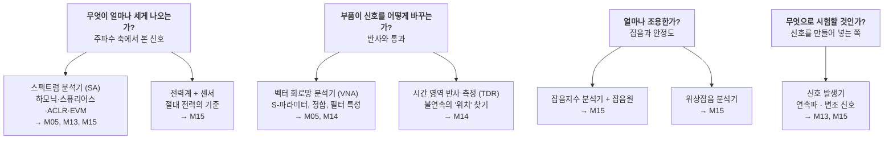
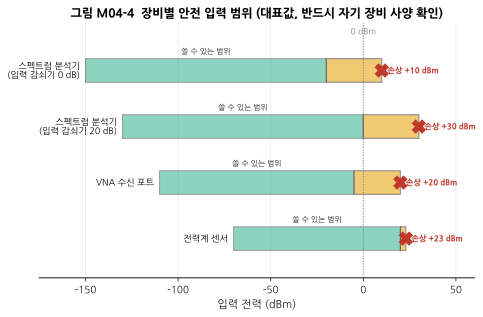
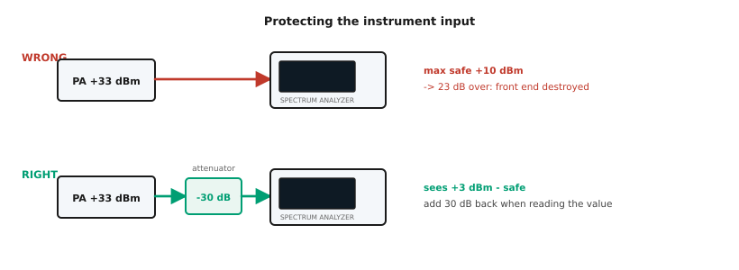
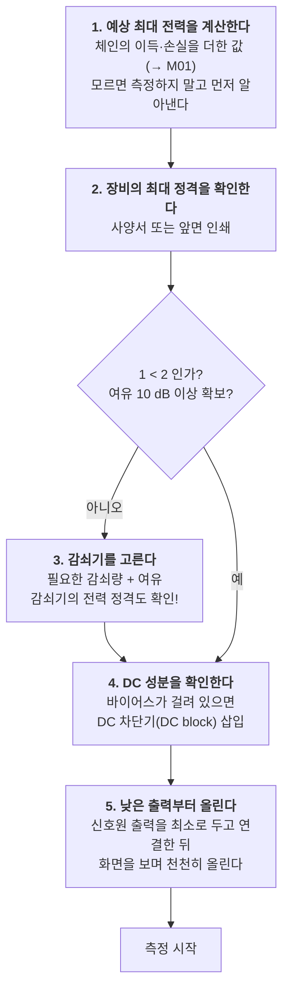
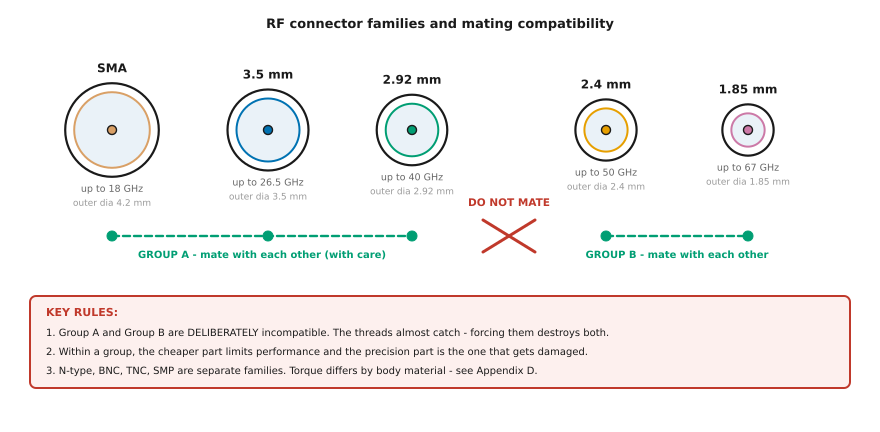
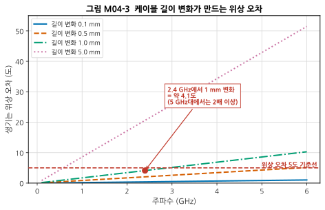

# M04 — RF 실험실 입문: 장비, 안전, 그리고 커넥터

**문서 번호**: RF-CUR-M04 · **버전**: v1.0 · **분량**: 이론 3 h + 실습 5 h

| | |
|---|---|
| **선수 모듈** | [M03](./M03_S파라미터와스미스차트.md) |
| **이 모듈이 소유하는 개념** | 피시험 소자(DUT), RF 장비 계통, 커넥터 계열과 호환성, 토크 규격과 토크 렌치, 커넥터 게이지, 케이블 취급과 위상 안정도, 최대 입력 전력·DC 차단·ESD, 감쇠기와 결합기의 보호 용도, 실험실 안전 |
| **이 모듈을 쓰는 후속 모듈** | M05·M14·M15 (전제), M16(측정 기록) |
| **학습 목표** | ① 장비 앞에서 무엇을 먼저 확인해야 하는지 안다 ② 커넥터를 규정 토크로 체결한다 ③ 장비 입력을 태우지 않는 전력 관리 계산을 한다 |

---

## M04.0 이 모듈의 범위 — 무엇을 다루고 무엇을 안 다루는가

> ⚠️ **역할 분리를 먼저 밝힙니다.** 이 모듈은 **"장비를 망가뜨리지 않고 조작하는 법"** 만 다룹니다.
>
> - **교정 이론, 오차 모델, 측정 불확도는 M14가 소유**합니다.
> - **RBW·검출기 같은 스펙트럼 분석기 설정은 M05가 소유**합니다.
>
> 이 순서에는 이유가 있습니다. **커넥터를 부러뜨리는 실수는 배우기 전에 막아야 하기 때문**입니다. 교정을 몰라도 측정은 시작할 수 있지만, 커넥터를 망가뜨리면 그 장비로는 아무것도 못 합니다.

---

## M04.1 장비 지도 — 무엇을 재는 물건인가

RF 실험실의 장비는 결국 **네 가지 질문** 중 하나에 답합니다.



*그림 M04-1. RF 장비 계통도. 장비 이름을 외우려 하지 말고 **"이건 어느 질문에 답하는 물건인가"** 로 묶어 기억하십시오. 오른쪽 화살표는 그 장비를 본격적으로 다루는 모듈입니다.*

### 두 대장 — SA와 VNA의 결정적 차이

| | 스펙트럼 분석기 (SA) | 벡터 회로망 분석기 (VNA) |
|---|---|---|
| **신호를 누가 만드나** | **DUT가 만든다** (장비는 받기만) | **장비가 만들어 넣는다** |
| **무엇을 아나** | 크기만 (위상 모름) | **크기와 위상 둘 다** |
| **주로 재는 것** | 하모닉, 스퓨리어스, 채널 전력, 변조 품질 | S11, S21, 정합, 필터 응답 |
| **교정** | 진폭 교정 (내부) | **사용자 교정 필수** (→ M14) |

> 💡 **"벡터"라는 말이 붙은 이유**가 여기 있습니다. VNA는 크기와 위상을 함께 알기 때문에 **복소수(벡터) 값인 S-파라미터를 완전히 측정**할 수 있습니다. SA는 크기만 알므로 스미스 차트를 그릴 수 없습니다.

### 피시험 소자 (DUT)

**피시험 소자(Device Under Test, DUT)** 는 지금 측정하고 있는 그 물건입니다. 부품 하나일 수도, 보드 전체일 수도, 완성된 제품일 수도 있습니다.

이 용어가 중요한 이유: **"측정 결과가 DUT의 성질인가, 아니면 케이블·커넥터·장비의 성질인가"** 를 구분하는 것이 RF 측정의 전부이기 때문입니다. 그 구분을 수학적으로 해내는 것이 교정과 디임베딩(→ M14)입니다.

---

## M04.2 켜기 전 체크리스트 — 장비를 태우지 않는 법

### 직관 — 눈에 보이지 않는 전력

RF 신호는 눈에 보이지 않고 소리도 나지 않습니다. **+33 dBm(2 W)짜리 출력을 스펙트럼 분석기에 바로 꽂아도 아무 느낌이 없습니다.** 다음 순간 장비의 앞단이 타 있을 뿐입니다.

전기 회로에서 "이 선에 220 V가 흐른다"는 것은 몸으로 알 수 있지만, RF는 그렇지 않습니다. **그래서 계산이 곧 안전 장치입니다.**

### 장비별 안전 입력 범위



*그림 M04-4. 장비별 안전 입력 범위(대표값). 가로축이 입력 전력(dBm)입니다. 초록 막대가 정상적으로 쓸 수 있는 범위, 노란 막대가 "측정은 부정확하지만 아직 안 망가지는" 구간, 빨간 X가 **손상 한계**입니다. 왼쪽 끝은 그 장비가 볼 수 있는 가장 작은 신호입니다.*

> ⚠️ **이 그림은 대표값입니다.** 장비마다 다르므로 **반드시 자기 장비의 사양서에서 "Maximum Input Level" 또는 "Damage Level"을 확인**하십시오. 보통 장비 앞면 입력 커넥터 옆에 인쇄되어 있습니다.

### 보호의 실제 — 감쇠기를 넣는다



*그림 M04-2. 장비 입력 보호. 위(WRONG)는 +33 dBm 전력 증폭기 출력을 스펙트럼 분석기에 직결한 경우로, 최대 안전 입력 +10 dBm을 **23 dB 초과**해 앞단이 파괴됩니다. 아래(RIGHT)는 30 dB 고정 감쇠기를 넣어 장비가 +3 dBm만 보게 한 것입니다. **읽은 값에 30 dB를 다시 더해야** 실제 전력이 됩니다.*

### 켜기 전 5단계



*그림 M04-5. 장비를 켜기 전 5단계. **3번의 괄호가 중요합니다** — 감쇠기 자체에도 전력 정격이 있습니다. 흔한 소형 SMA 감쇠기는 1~2 W급이라, 그보다 큰 전력에는 고전력용 감쇠기나 방향성 결합기를 써야 합니다.*

### 감쇠기·결합기의 세 가지 용도

감쇠기는 신호를 줄이는 부품이지만, 실무에서는 **세 가지 목적**으로 씁니다.

| 목적 | 설명 |
|---|---|
| **① 보호** | 장비 정격 아래로 낮춤 (그림 M04-2) |
| **② 정합 개선** | 감쇠기를 끼우면 양쪽에서 본 반사가 **감쇠량의 2배만큼** 좋아 보입니다. 반사파가 감쇠기를 왕복하기 때문입니다. 부정합이 심한 두 부품 사이의 상호작용을 줄이는 데 씁니다 (→ M14 부정합 불확도) |
| **③ 레벨 조정** | 장비의 최적 입력 범위에 맞춤 |

**방향성 결합기(directional coupler)** 는 전력을 줄이지 않고 **일부만 빼내어** 관찰합니다. 송신기 출력을 안테나로 보내면서 동시에 감시할 때 씁니다.

---

## M04.3 커넥터 — RF에서 가장 자주 망가지는 것

### 왜 이렇게 까다로운가

M03에서 배운 것을 떠올리십시오. **포트는 기준면을 포함해 정의됩니다.** 커넥터가 조금만 헐거워도, 중심핀이 조금만 들어가 있어도, 그것은 **회로가 달라진 것**입니다. 2.4 GHz에서 0.1 mm는 무시할 만하지만 28 GHz에서는 그렇지 않습니다.

### 계열과 호환성



*그림 M04-6. RF 커넥터 계열과 결합 호환성. 원의 크기가 실제 바깥지름 비율입니다. **결합 가능한 무리가 둘로 나뉩니다** — 무리 A(SMA / 3.5 mm / 2.92 mm)와 무리 B(2.4 mm / 1.85 mm). 같은 무리 안에서는 (주의해서) 결합되지만, **두 무리 사이는 의도적으로 결합되지 않게 설계**되어 있습니다. 나사가 걸릴 듯 말 듯 하므로 억지로 돌리기 쉬운데, 그러면 양쪽 다 망가집니다.*

| 계열 | 대략 상한 주파수 | 결합 무리 | 비고 |
|---|---|---|---|
| **BNC** | 약 4 GHz | 별개 | 밀어서 돌리는 방식. 저주파·오실로스코프용 |
| **N형** | 약 11~18 GHz | 별개 | 크고 튼튼. 고전력·야외 |
| **TNC** | 약 11 GHz | 별개 | N형의 나사식 소형판 |
| **SMA** | 약 18 GHz | **A** | **RF에서 가장 흔함**. 테플론 유전체 |
| **3.5 mm** | 약 26.5 GHz | **A** | 정밀 계측용. 공기 유전체 |
| **2.92 mm (K)** | 약 40 GHz | **A** | 정밀 계측용 |
| **2.4 mm** | 약 50 GHz | **B** | 정밀 계측용 |
| **1.85 mm (V)** | 약 67 GHz | **B** | 정밀 계측용 |

> ⚠️ **무리 A와 무리 B는 서로 결합되지 않습니다.** 이것은 실수가 아니라 **일부러 그렇게 설계한 것**입니다. 2.4 mm 이상의 초정밀 커넥터를 SMA 같은 저정밀 커넥터에 끼워 망가뜨리는 사고를 원천 차단하려는 것입니다.
>
> 문제는 **나사가 걸릴 듯 말 듯 한다**는 점입니다. 초심자는 "조금만 더 돌리면 들어갈 것 같다"고 느끼기 쉽고, 그 순간 양쪽 커넥터가 모두 영구 손상됩니다. **뻑뻑하면 즉시 멈추고 계열을 확인하십시오.**

> ⚠️ **무리 A 안에서도 조심해야 합니다 — SMA와 3.5 mm의 함정**: 둘은 결합되지만, SMA는 안쪽에 유전체(테플론)가 차 있고 3.5 mm는 공기입니다. 임피던스 불연속이 생겨 정확도가 떨어질 뿐 아니라, **값싼 SMA의 중심핀이 정밀한 3.5 mm의 소켓을 벌려 놓으면** 그 3.5 mm 커넥터는 이후 모든 측정에서 오차를 냅니다. 게다가 그 손상된 커넥터가 다음 커넥터를 또 망가뜨립니다.
>
> 그래서 실험실에서는 **장비 포트에 "커넥터 세이버(connector saver)"** — 값싼 어댑터 — 를 반영구적으로 물려 두고, 그것만 소모품으로 교체합니다.

### 토크 — 왜 손으로 조이면 안 되는가

| 잘못 | 결과 |
|---|---|
| **너무 세게** | 나사산 뭉개짐, 중심핀 변형, 유전체 균열, 임피던스 어긋남 |
| **너무 약하게** | 접촉 불량, 반사 증가, 진동·온도 변화에 저절로 풀림, **재현 안 되는 측정** |

**규정 토크는 재질과 시리즈에 따라 다릅니다.** 이것이 초심자가 가장 혼란스러워하는 지점인데, 자료마다 값이 다른 이유가 바로 이것입니다.

| 커넥터 | 대표적 권장 토크 | 결합 무리 |
|---|---|---|
| SMA (황동) | 약 3~5 in-lb | A |
| SMA (스테인리스강) | 약 7~10 in-lb | A |
| **3.5 mm / 2.92 mm** | **8 in-lb (약 0.9 N·m)** | A |
| N형 / TNC (표준) | 약 10~13 in-lb | 별개 |
| 7/16 DIN | 약 220~300 in-lb | 별개 |

> 📌 **자세한 내용과 출처는 [부록 D §D.4](../03_부록/D_장비_소프트웨어_준비가이드.md)** 를 보십시오. 제조사 1차 출처 3건을 포함해 교차검증해 두었습니다. **실제 작업에서는 반드시 해당 커넥터 제조사의 사양을 확인**하십시오.

### 반드시 지킬 다섯 가지

1. **너트만 돌립니다.** 커넥터 몸체나 케이블을 돌리면 중심핀이 비틀려 망가집니다.
2. **토크 렌치를 씁니다.** 브레이크오버형(정해진 토크에서 꺾이는 방식)이 편합니다.
3. **끼우기 전에 눈으로 봅니다.** 중심핀이 휘었는지, 이물질이 있는지, 나사산이 상했는지.
4. **주기적으로 게이지로 잽니다.** 커넥터 게이지는 **중심핀이 기준면에서 얼마나 나오거나 들어갔는지**를 잽니다. 튀어나온 핀 하나가 상대 커넥터를 전부 망가뜨립니다.
5. **정밀 커넥터는 장비 쪽에 직접 물리지 않습니다.** 커넥터 세이버를 씁니다.

---

## M04.4 케이블 — 조용히 측정을 망치는 것

### 굽히면 위상이 변한다

케이블을 구부리면 내부 도체와 유전체가 미세하게 늘어나거나 눌립니다. 전기적 길이가 조금 변하고, **그만큼 위상이 변합니다.**



*그림 M04-3. 케이블 길이 변화가 만드는 위상 오차. 가로축이 주파수(GHz), 세로축이 그로 인해 생기는 위상 오차(도)입니다. 네 선은 각각 0.1 / 0.5 / 1 / 5 mm의 전기적 길이 변화에 해당합니다(단축률 0.7 가정). 빨간 파선이 위상 오차 5도 기준선입니다. **2.4 GHz에서 1 mm는 약 4.1도**이고, 주파수에 비례하므로 5.8 GHz에서는 약 10도가 됩니다.*

| 주파수 | 1 mm 길이 변화 → 위상 오차 |
|---|---|
| 900 MHz | 1.5° |
| 2.4 GHz | 4.1° |
| 5.8 GHz | 9.9° |

> 💡 **크기(dB)는 괜찮은데 위상이 흔들린다** — 이것이 케이블 문제의 전형적 증상입니다. S11의 크기만 보고 있으면 못 알아채고, 스미스 차트를 보면 궤적이 회전하는 것으로 드러납니다.
>
> **실무 규칙**: 교정한 뒤에는 **케이블을 움직이지 마십시오.** 움직여야 한다면 위상 안정형(phase-stable) 케이블을 쓰고, 그래도 정밀 측정에서는 교정을 다시 합니다.

### 케이블 관리 규칙

| 항목 | 규칙 | 이유 |
|---|---|---|
| **굽힘 반경** | 제조사 최소 굽힘 반경 이상 | 그보다 심하게 굽히면 영구 변형 |
| **꺾기 금지** | 절대 접거나 밟지 않기 | 유전체가 눌리면 임피던스가 그 지점에서 달라짐 |
| **비틀기 금지** | 커넥터 체결 시 케이블을 돌리지 않기 | 중심핀 손상 |
| **교체 주기** | S21의 반복성이 나빠지면 교체 | 케이블은 **소모품**입니다 |
| **보관** | 느슨하게 감아 걸어 두기 | 눌린 채 오래 두면 자국이 남음 |

---

## M04.5 안전

### 우선순위 — 사람 먼저, 장비 다음

| 위험 | 실제 상황 | 대책 |
|---|---|---|
| **RF 노출** | 고출력 PA 출력을 열어 둔 채 작업 | 출력은 **항상 종단하거나 더미로드에 연결**. 안테나 앞에 서지 않기 |
| **감전** | 고전압 바이어스가 걸린 회로 | 전원 차단 확인, 커패시터 방전 대기 |
| **화상** | 동작 중인 PA·감쇠기 | 전력이 열이 됩니다. 만지기 전 온도 확인 |
| **ESD (정전기 방전)** | MMIC·LNA를 맨손으로 만짐 | 손목 스트랩, 접지 매트. **LNA는 특히 약합니다** |
| **장비 소손** | §M04.2 미준수 | 감쇠기, DC 차단기, 계산 |
| **커넥터 파손** | §M04.3 미준수 | 토크 렌치, 게이지, 커넥터 세이버 |

> ⚠️ **ESD가 얼마나 흔한가**: 사람이 느끼지도 못하는 수백 V의 정전기가 GaAs·GaN 소자를 죽입니다. 더 나쁜 것은 **즉사가 아니라 성능이 조금 나빠지는 잠재 손상(latent damage)** 입니다. "왜 이 LNA만 잡음지수가 0.5 dB 나쁘지?"의 원인이 몇 주 전의 정전기일 수 있습니다.

---

## M04.L 실습

### L04-a — 커넥터 체결과 육안 점검 (Tier 1, 1.5시간)

**① 셋업도**

```
[NanoVNA CH0] ── [커넥터 세이버(SMA 암-암)] ── [SMA 케이블] ── [50 Ω 종단기]
```

**② 절차**

1. 모든 커넥터를 밝은 곳에서 **눈으로 먼저 봅니다.** 확대경이 있으면 더 좋습니다.
   - 중심핀이 휘었는가? 중심에 있는가?
   - 나사산이 뭉개졌는가?
   - 먼지·금속 부스러기가 있는가?
2. 장비 포트에 **커넥터 세이버**를 먼저 물립니다. 이후 탈착은 세이버에서만 합니다.
3. 케이블을 끼울 때 **너트만** 돌립니다. 케이블 몸통은 한 손으로 고정.
4. 손으로 가볍게 끝까지 돌린 뒤, 토크 렌치로 규정 토크까지 조입니다(딸깍 소리가 나면 멈춤).
5. S11을 측정하고 화면을 기록합니다.
6. **커넥터를 풀었다가 다시 같은 방식으로 조이고** 다시 측정합니다. 이것을 5회 반복합니다.

**③ 예상 결과**

| 항목 | 좋은 상태 | 문제 있는 상태 |
|---|---|---|
| 5회 반복 측정의 S11 산포 | 1 GHz에서 ±0.5 dB 이내 | ±2 dB 이상 흔들림 |
| 50 Ω 종단기의 S11 | −20 dB 이하 | −10 dB 수준에 머무름 |

**④ 흔한 실수**

| 증상 | 원인 |
|---|---|
| 반복할 때마다 값이 크게 달라짐 | 체결 토크가 매번 다름. 또는 커넥터가 이미 손상됨 |
| 커넥터가 뻑뻑하게 돌아감 | 나사산이 상했거나 이물질. **억지로 돌리지 말고 중단** |
| 화면이 갑자기 이상해짐 | 케이블이 움직였음 (§M04.4) |

**⑤ 판정 기준**: 5회 반복의 S11 산포가 ±0.5 dB 이내면 통과. 그렇지 않으면 원인을 위 표에서 찾아 적으십시오.

> 📌 **이 실습의 진짜 목적**은 좋은 값을 얻는 것이 아니라, **"내 측정이 얼마나 반복되는가"를 몸으로 아는 것**입니다. 반복되지 않는 측정은 아무것도 증명하지 못합니다. 이 감각이 M14(불확도)의 기초가 됩니다.

### L04-b — 케이블을 움직이면 무슨 일이 생기는가 (Tier 1, 1.5시간)

**① 셋업도**

```
[NanoVNA CH0] ── [케이블 A] ── [DUT: 필터 또는 종단기] ── [케이블 B] ── [NanoVNA CH1]
```

**② 절차**

1. 케이블을 자연스럽게 펴 둔 상태에서 S21의 **크기와 위상**을 각각 기록합니다.
2. 케이블 하나를 손으로 부드럽게 구부립니다(제조사 최소 굽힘 반경 이상으로).
3. 같은 측정을 반복하고 **위상 변화량**을 읽습니다.
4. 주파수를 낮은 대역과 높은 대역에서 각각 해 봅니다.

**③ 예상 결과**

- **크기(dB)** 는 거의 변하지 않습니다 (0.1 dB 수준).
- **위상**은 눈에 띄게 변합니다. 주파수가 높을수록 크게 변합니다.
- 스미스 차트로 보면 궤적이 **중심을 축으로 회전**합니다.

**④ 흔한 실수**

| 증상 | 원인 |
|---|---|
| 크기도 크게 변함 | 커넥터 접촉 불량이지 굽힘 효과가 아님. 체결부터 다시 |
| 아무 변화 없음 | 주파수가 너무 낮거나(그림 M04-3 참조) 굽힘이 너무 작음 |

**⑤ 판정 기준**: 위상 변화를 관측하고, 그림 M04-3의 예측과 **자릿수가 맞는지** 확인. (정확히 맞을 필요는 없습니다 — 굽힘으로 인한 실제 길이 변화를 모르기 때문입니다.)

**Tier 0 대체**: `scikit-rf`로 길이가 다른 두 전송선을 만들어 위상 차이를 계산하고, 주파수에 따라 어떻게 커지는지 플롯하십시오.

### L04-c — 우리 실험실 점검 체크리스트 만들기 (문서, 1시간)

**① 준비**: [부록 D §D.6](../03_부록/D_장비_소프트웨어_준비가이드.md)의 예시 체크리스트

**② 절차**: 자기 환경에 맞게 고쳐 씁니다. 반드시 포함할 것:

- [ ] 장비 예열 시간 (정밀 측정은 30분 이상)
- [ ] 커넥터 육안 점검 항목
- [ ] **예상 최대 전력 계산란** (숫자를 적는 칸)
- [ ] 장비 최대 정격과 그 출처
- [ ] 삽입할 감쇠기 값
- [ ] DC 성분 유무
- [ ] ESD 대책
- [ ] **측정 조건 기록란**: 주파수, 전력, 온도, 장비 모델·일련번호, 교정 일자, 측정자, 날짜

**③ 예상 결과**: A4 한 장 분량. 매 측정마다 실제로 채울 수 있을 만큼 짧아야 합니다.

**④ 흔한 실수**: 너무 길게 만들어 아무도 안 쓰게 되는 것. **10개 항목을 넘기지 마십시오.**

**⑤ 판정 기준**: 동료(또는 자신)가 이 체크리스트만 보고 측정 준비를 끝낼 수 있으면 통과.

---

## M04.Q 확인 문제

<details>
<summary><b>Q1.</b> 최대 안전 입력이 +10 dBm인 스펙트럼 분석기로 +27 dBm 출력을 측정하려 한다. 감쇠기는 몇 dB가 필요한가?</summary>

여유를 10 dB 두는 것이 실무 관행입니다.

- 목표 표시 레벨: +10 − 10 = **0 dBm**
- 필요 감쇠: 27 − 0 = **27 dB**
- 실제로는 **30 dB 감쇠기**를 씁니다 (표준품이 10/20/30 dB 단위).

**그리고 반드시 확인할 것**: 30 dB 감쇠기가 +27 dBm(0.5 W)을 견디는가? 소형 SMA 감쇠기는 보통 1~2 W급이므로 이 경우는 괜찮지만, +37 dBm(5 W)이었다면 고전력용이 필요합니다.

읽은 값에는 **30 dB를 다시 더해야** 실제 전력이 됩니다.
</details>

<details>
<summary><b>Q2.</b> 왜 커넥터 몸체가 아니라 너트만 돌려야 하는가?</summary>

커넥터의 중심핀은 케이블의 중심 도체와 이어져 있습니다. 몸체를 돌리면 **케이블 전체가 함께 비틀리고**, 그 힘이 중심핀과 유전체에 그대로 걸립니다.

결과: 중심핀이 휘거나 밀려 들어가고, 유전체가 갈라지며, 그 커넥터는 **되돌릴 수 없게 손상**됩니다. 게다가 손상된 커넥터는 결합하는 상대 커넥터도 망가뜨립니다.
</details>

<details>
<summary><b>Q3.</b> 교정을 마친 뒤 케이블을 옮겼다. 다시 교정해야 하는가?</summary>

**정밀 측정이라면 예입니다.**

교정은 "이 케이블이 이 위치에 이 모양으로 있을 때"의 오차를 기억한 것입니다. 케이블이 움직이면 전기적 길이가 변해 그 기억이 어긋납니다(그림 M04-3).

판단 기준:
- **위상이 중요한 측정**(정합, 스미스 차트, 디임베딩) → 다시 교정
- **크기만 보는 대략적 확인**(필터가 대충 어디서 도는지) → 그냥 진행 가능
- **주파수가 높을수록** 더 민감 (오차가 주파수에 비례)
</details>

<details>
<summary><b>Q4.</b> SMA 커넥터를 3.5 mm 장비 포트에 끼워도 되는가? 2.4 mm 포트에는?</summary>

**3.5 mm에는 기계적으로 끼워집니다** (둘 다 무리 A). 그러나 권장되지 않습니다.

- SMA는 안쪽에 테플론 유전체, 3.5 mm는 공기 유전체입니다. **임피던스 불연속**이 생겨 측정 정확도가 떨어집니다.
- 더 큰 문제: SMA의 제조 공차가 커서, **값싼 SMA 핀이 정밀한 3.5 mm 소켓을 벌려 놓을 수 있습니다.** 한번 벌어진 소켓은 복구되지 않습니다.

실무 답: **커넥터 세이버(값싼 어댑터)를 장비 포트에 물려 두고 그것만 소모품으로 교체**합니다.

**2.4 mm 포트에는 절대 안 됩니다.** 2.4 mm는 무리 B로, SMA·3.5 mm·2.92 mm와 결합되지 않도록 **일부러 다르게 설계**되었습니다. 나사가 걸릴 듯 말 듯 하지만 억지로 돌리면 양쪽 다 영구 손상됩니다. 무리를 넘나들려면 **전용 어댑터**를 써야 합니다.
</details>

<details>
<summary><b>Q5.</b> 감쇠기를 넣으면 왜 정합이 좋아 보이는가?</summary>

부하에서 반사된 파가 **감쇠기를 두 번 지나기** 때문입니다.

10 dB 감쇠기를 끼우면:
- 입사파가 부하까지 가면서 10 dB 감쇠
- 부하에서 반사
- 되돌아오면서 다시 10 dB 감쇠

입구에서 본 반사는 **20 dB 작아집니다.** 즉 부하의 반사손실이 6 dB(VSWR 3)여도, 10 dB 감쇠기를 끼우면 26 dB로 보입니다.

> ⚠️ **주의**: 실제 부하의 정합이 좋아진 것이 **아닙니다.** 반사 자체는 그대로 있고, 다만 신호원 쪽에서 덜 느낄 뿐입니다. 그래서 이것은 **측정 상호작용을 줄이는 용도**로는 유효하지만, **부하의 정합을 개선했다고 보고하면 틀린 것**입니다.
</details>

---

## M04.A 이 모듈의 축약어

| 약어 | 영문 원어 | 한글 |
|---|---|---|
| DUT | Device Under Test | 피시험 소자 |
| SA | Spectrum Analyzer | 스펙트럼 분석기 |
| VNA | Vector Network Analyzer | 벡터 회로망 분석기 |
| TDR | Time Domain Reflectometry | 시간 영역 반사 측정 (→ M14) |
| ESD | Electrostatic Discharge | 정전기 방전 |
| SMA | SubMiniature version A | (커넥터 이름) |
| BNC | Bayonet Neill–Concelman | (커넥터 이름) |
| TNC | Threaded Neill–Concelman | (커넥터 이름) |
| DC | Direct Current | 직류 |
| in-lb | inch-pound | 인치파운드 (토크 단위) |
| MMIC | Monolithic Microwave Integrated Circuit | 단일칩 마이크로파 집적회로 (→ M08) |
| PA | Power Amplifier | 전력 증폭기 (→ M08) |
| LNA | Low Noise Amplifier | 저잡음 증폭기 (→ M08) |
| ACLR | Adjacent Channel Leakage Ratio | 인접 채널 누설비 (→ M13) |
| EVM | Error Vector Magnitude | 오차 벡터 크기 (→ M13) |

---

## M04.S 출처

| 내용 | 출처 | 등급 | 교차검증 |
|---|---|---|---|
| 커넥터 토크 규격 (재질·시리즈별) | [부록 D §D.4](../03_부록/D_장비_소프트웨어_준비가이드.md) 에 정리 — [Times Microwave](https://timesmicrowave.com/connector-torque-requirements/) · [HUBER+SUHNER SMA 카탈로그](https://pdf.directindustry.com/pdf/huber-suhner/series-sma-coaxial-connectors/30583-293489.html) · [Mini-Circuits](https://blog.minicircuits.com/applying-proper-torque-to-microwave-connectors/) 등 | B ×3 + D ×3 | **6건** |
| 커넥터 체결 실무, 게이지 관리 | [Mini-Circuits — Making Good RF Connections](https://blog.minicircuits.com/making-good-rf-connections-best-practices-and-the-role-of-anti-torque-connectors/) | B | — |
| 커넥터 치수 인터페이스 규격 | [MIL-STD-348](https://everyspec.com/MIL-STD/MIL-STD-0300-0499/download.php?spec=MIL-STD-348B_CHG-1.054027.pdf) | **A** | — |
| **결합 무리 A/B 구분** (SMA·3.5·2.92 vs 2.4·1.85가 의도적으로 비호환) | [RF Com — Mating 3.5mm, 2.92mm, SMA, 2.4mm and 1.85mm Connectors](https://rfcom.co.uk/mating-3-5mm-2-92mm-sma-2-4mm-and-1-85mm-connectors-a-comprehensive-guide/) · [Renhotec — Ultimate Guide to SMA/3.5/2.92/2.4/1.85/1 mm](https://www.renhotecrf.com/products/rf-connector-cable/the-ultimate-guide-to-sma-3-5mm-2-92mm-2-4mm-1-85mm-1mm-connectors-demystifying-differences-and-compatibility.html) · [Vinstronics 비교](https://vinstronics.com/difference-1-85mm-2-4mm-2-92mm-3-5mm-sma-connector/) | D | **3건** |
| 스펙트럼 분석기 입력 보호·감쇠기 | [Keysight Application Note 150 — *Spectrum Analysis Basics*](https://www.keysight.com/us/en/assets/7018-06714/application-notes/5952-0292.pdf) | B | — |
| VNA 측정에서 케이블·커넥터의 영향 | [Keysight AN 5965-7709 — *Applying Error Correction to VNA Measurements*](https://www.keysight.com/us/en/assets/7018-06761/application-notes/5965-7709.pdf) · [EURAMET Calibration Guide No. 12](https://www.euramet.org/Media/news/I-CAL-GUI-012_Calibration_Guide_No._12.web.pdf) | B, **A** | 2건 |

> ⚠️ 커넥터별 상한 주파수와 안전 입력 정격은 **제조사·모델에 따라 다릅니다.** 본문 표는 일반적인 대표값이며, 실제 작업에서는 **자기 부품·장비의 사양서를 확인**하십시오. 원문 직접 확인 안내는 [M00.S](./M00_RF시스템엔지니어링이란.md#m00s-출처) 참조.

---

## M04.7 한 장 요약

| 알아야 할 것 | 한 줄 | 절 |
|---|---|---|
| 장비 분류 | "어느 질문에 답하는 물건인가"로 묶어 기억 | §1 |
| SA vs VNA | SA는 크기만·DUT가 신호 생성 / VNA는 크기+위상·장비가 신호 생성 | §1 |
| 켜기 전 | **예상 전력 계산 → 정격 확인 → 감쇠기 → DC 차단 → 낮은 출력부터** | §2 |
| 감쇠기 | 보호 / 정합 개선(감쇠량의 2배) / 레벨 조정 | §2 |
| 커넥터 | **결합 무리 A(SMA/3.5/2.92)와 B(2.4/1.85)는 서로 안 끼워진다.** 너트만 돌리고, 토크 렌치를 쓰고, 세이버를 물린다 | §3 |
| 토크 | 재질·시리즈별로 다름 → 제조사 사양 확인 (부록 D §D.4) | §3 |
| 케이블 | 크기는 괜찮은데 **위상이 흔들린다** — 교정 후엔 움직이지 않기 | §4 |
| 안전 | 사람(RF 노출·감전·화상) → 소자(ESD) → 장비 순 | §5 |
| 실습의 요점 | 좋은 값이 아니라 **반복되는 값**을 얻는 것 | L04-a |

---

## 다음 모듈

**[M05 — 첫 측정: VNA와 스펙트럼 분석기로 보는 세상](./M05_첫측정.md)**

이제 장비를 안전하게 다룰 수 있으니, 화면을 읽는 법을 배웁니다.

---

## 변경 이력

| 버전 | 일자 | 내용 |
|---|---|---|
| v1.0 | 2026-08-20 | 최초 작성. 시각자료 6종(데이터 플롯 2 + SVG 도해 2 + Mermaid 2), 실습 3종, 확인 문제 5문항 |
| — | 2026-08-20 | **검토 3회 완료.** 1차(사실): 케이블 위상 오차 3건과 감쇠기 계산을 재계산 검증. **커넥터 호환성 오류를 발견·정정** — 초판은 SMA·3.5·2.92·2.4를 모두 결합 가능으로 표시했으나, 실제로는 **A무리(SMA/3.5/2.92)와 B무리(2.4/1.85)가 의도적으로 비호환**임을 3개 출처로 확인하고 그림과 본문을 전면 수정, 1.85 mm 추가. 2차(교육): 장비 계통도의 네 번째 항목을 질문 형식으로 통일. 3차(구조): Mermaid 2개 렌더 검증, 링크 전수 점검 |
