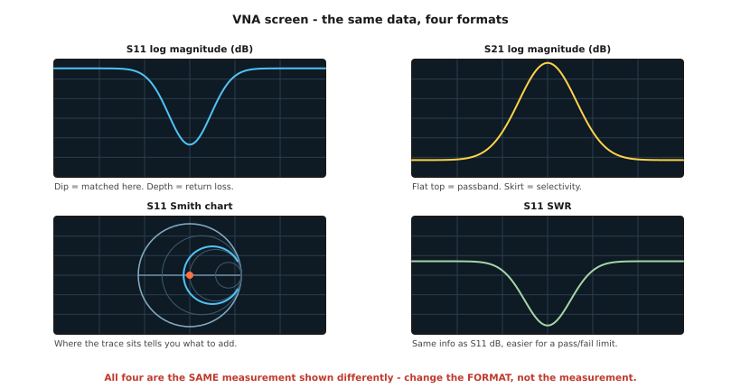
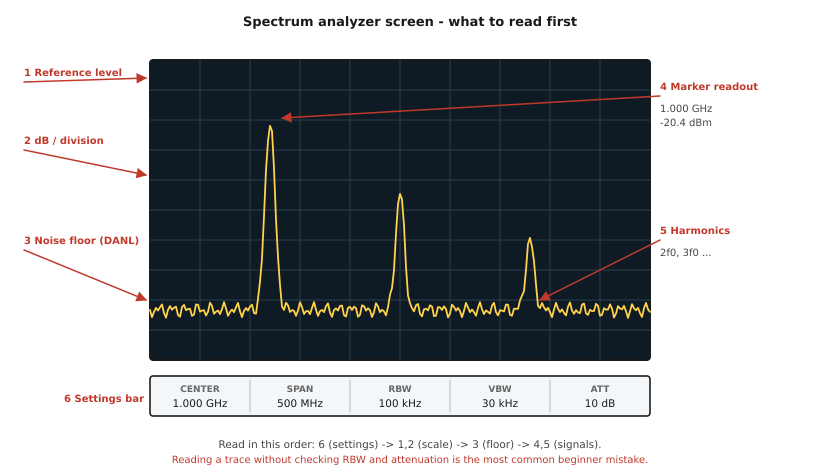
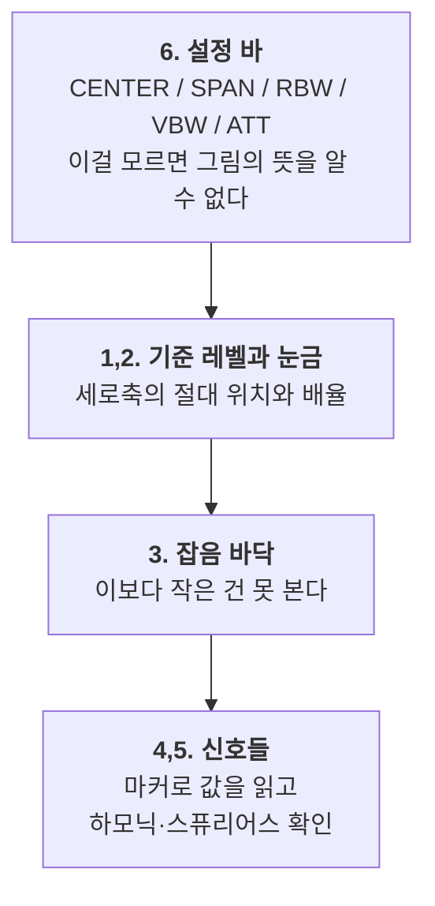
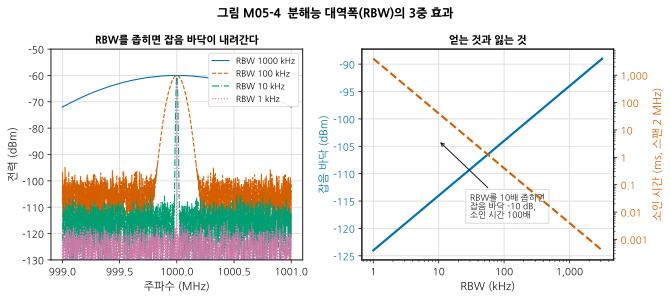
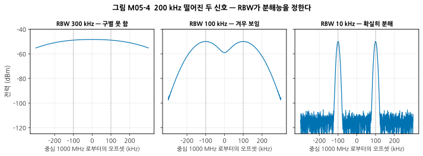
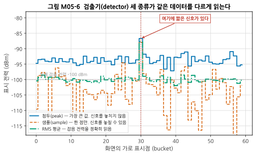
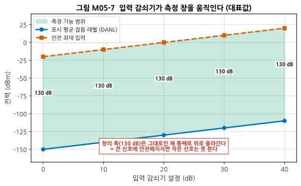
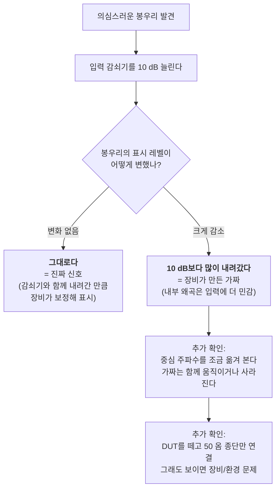

# M05 — 첫 측정: VNA와 스펙트럼 분석기로 보는 세상

**문서 번호**: RF-CUR-M05 · **버전**: v1.0 · **분량**: 이론 4 h + 실습 6 h

| | |
|---|---|
| **선수 모듈** | [M04](./M04_RF실험실입문.md) |
| **이 모듈이 소유하는 개념** | VNA 기본 조작(주파수 범위·IF 대역폭·포인트 수·평균·표시 형식), 마커·기준레벨·스케일, SA 기본 조작(중심주파수·스팬·기준레벨·입력감쇠기), 분해능 대역폭(RBW), 비디오 대역폭(VBW), 검출기 종류, 표시 평균 잡음 레벨(DANL), 소인 시간의 절충, 트레이스 읽기, 가짜 신호 1차 판별 |
| **이 모듈을 쓰는 후속 모듈** | M07(필터 측정), M15(스퓨리어스 서치 설정), M16(자동화) |
| **학습 목표** | ① VNA로 부품의 S11/S21을 얻고 무엇을 뜻하는지 말한다 ② SA에서 RBW를 바꿨을 때 무엇이 왜 변하는지 설명한다 ③ 화면의 신호가 진짜인지 장비가 만든 것인지 1차 판별한다 |

---

## M05.0 이 모듈의 범위

> ⚠️ **역할 분리**: 이 모듈은 **"화면을 읽고 설정을 고르는 법"** 입니다.
>
> - **교정 이론·오차 모델·불확도는 M14**가 소유합니다. 여기서는 **교정하지 않은 채로** 측정합니다 — 일부러 그렇게 합니다.
> - **잡음지수·위상잡음·변조 측정 절차는 M15**가 소유합니다.
>
> **왜 교정 없이 시작하는가**: 교정 전에 얼마나 이상한 값이 나오는지 몸으로 겪어야, M14에서 교정 이론을 배울 때 "왜 이 복잡한 걸 하는가"가 납득됩니다. 이 커리큘럼은 그 순서를 의도적으로 택했습니다.

---

## M05.1 VNA 화면 해부

### 네 가지 표시 형식 — 같은 데이터, 다른 얼굴

VNA로 측정한 것은 **복소수 하나**(크기와 위상)입니다. 그 하나를 화면에 어떻게 보여 줄지가 **표시 형식(format)** 입니다.



*그림 M05-1. VNA 화면 — 같은 데이터의 네 가지 표시 형식. 왼쪽 위는 S11을 dB 크기로, 오른쪽 위는 S21을 dB 크기로, 왼쪽 아래는 같은 S11을 스미스 차트로, 오른쪽 아래는 같은 S11을 SWR로 나타낸 것입니다. **네 개는 서로 다른 측정이 아니라 같은 측정의 다른 표현**입니다. 장비에서 바꾸는 것은 측정이 아니라 FORMAT 버튼입니다.*

| 형식 | 무엇을 보기 좋은가 |
|---|---|
| **로그 크기 (dB)** | 필터 통과대역·저지대역, 반사손실의 깊이. **합격/불합격 한계선을 긋기 쉬움** |
| **스미스 차트** | 임피던스가 어느 쪽으로 어긋났는지 → **무엇을 달아야 할지** (→ M03) |
| **SWR** | 안테나 사양처럼 SWR로 규격이 적힌 경우 |
| **위상 / 군지연** | 케이블 길이, 필터의 위상 왜곡 |
| **극좌표 (polar)** | 크기와 위상을 함께, 임피던스 격자 없이 |

> 💡 **초심자가 가장 많이 하는 실수**: S11을 스미스 차트로만 보다가 "정합이 얼마나 좋은지"를 숫자로 못 읽는 것, 또는 dB로만 보다가 "무엇을 달아야 할지" 모르는 것. **두 형식을 나란히 띄워 두는 것이 정답**입니다. 대부분의 VNA는 화면을 2×2로 나눌 수 있습니다.

### 반드시 설정해야 하는 것들

| 설정 | 무엇 | 잘못 두면 |
|---|---|---|
| **시작·정지 주파수** | 볼 범위 | 관심 대역 밖을 보고 있음 |
| **포인트 수 (points)** | 그 범위를 몇 점으로 나눌지 | 적으면 좁은 특징(공진 딥)을 **통째로 놓침** |
| **IF 대역폭 (IFBW)** | VNA 내부 수신기의 필터 폭 | 넓으면 잡음이 많고, 좁으면 느림 (SA의 RBW와 같은 절충) |
| **출력 전력** | DUT에 넣는 세기 | 너무 크면 DUT가 압축됨(→ M08), 너무 작으면 잡음에 묻힘 |
| **평균 (averaging)** | 여러 번 재서 평균 | 느려짐. IFBW를 줄이는 편이 대개 효율적 |

> ⚠️ **포인트 수의 함정**: 1 GHz~6 GHz를 201 포인트로 재면 점 사이 간격이 **25 MHz**입니다. 대역폭이 5 MHz인 좁은 필터는 **점과 점 사이에 숨어 아예 보이지 않습니다.** "부품이 불량인 줄 알았는데 포인트 수가 부족했다"는 일이 실제로 자주 일어납니다.

---

## M05.2 스펙트럼 분석기 화면 해부



*그림 M05-2. 스펙트럼 분석기 화면 — 무엇을 먼저 읽어야 하는가. 가로축이 주파수, 세로축이 전력(보통 10 dB/눈금)입니다. ①기준 레벨은 화면 맨 위가 몇 dBm인지, ②눈금당 dB는 세로 한 칸의 크기, ③잡음 바닥은 장비가 아무것도 없을 때 보여 주는 바닥, ④마커는 특정 지점의 정확한 값, ⑤는 기본파의 2배·3배 주파수에 나타난 하모닉입니다. ⑥아래 설정 바가 **가장 먼저 봐야 할 곳**입니다.*

### 읽는 순서 — ⑥부터 봅니다

초심자는 화면의 봉우리부터 보지만, **숙련자는 설정 바부터 봅니다.**



*그림 M05-7. 스펙트럼 분석기 화면 읽는 순서. **RBW와 입력 감쇠기를 확인하지 않고 트레이스를 읽는 것이 초심자의 가장 흔한 실수**입니다. 같은 신호도 이 두 설정에 따라 화면에서 전혀 다르게 보입니다.*

### 기본 설정 네 가지

| 설정 | 무엇 | 요령 |
|---|---|---|
| **중심 주파수 (Center)** | 화면 가운데의 주파수 | 관심 신호를 여기 둠 |
| **스팬 (Span)** | 화면의 가로 폭 | 넓게 시작해 좁혀 들어감 |
| **기준 레벨 (Reference Level)** | 화면 맨 위 = 몇 dBm | 신호 봉우리가 위에서 1~2칸 아래 오도록 |
| **입력 감쇠기 (Attenuation)** | 앞단 보호와 레벨 조정 | §M05.5 |

---

## M05.3 RBW — 분해능 대역폭

### 직관 — 창문 하나로 스펙트럼을 훑는다

스펙트럼 분석기는 **좁은 창문(필터)을 주파수 축을 따라 밀면서** 그 창문 안에 들어온 전력을 그립니다. 이 창문의 폭이 **분해능 대역폭(Resolution Bandwidth, RBW)** 입니다.

창문이 좁으면:
- 가까운 두 신호를 **구별**할 수 있다 (분해능 ↑)
- 창문 안에 들어오는 **잡음이 줄어** 바닥이 내려간다
- 그런데 좁은 창문으로 넓은 범위를 훑으려면 **오래 걸린다**

### 정의 — RBW의 3중 효과



*그림 M05-3. 분해능 대역폭(RBW)의 3중 효과. 왼쪽은 같은 −60 dBm 신호를 네 가지 RBW로 본 것으로, **신호 봉우리 높이는 그대로인데 잡음 바닥만 내려갑니다.** 오른쪽은 그 관계를 정리한 것으로, 파란 실선이 잡음 바닥(왼쪽 축), 주황 파선이 소인 시간(오른쪽 축)입니다. **RBW를 10배 좁히면 바닥은 10 dB 내려가고 소인 시간은 100배 늘어납니다.***

**잡음 바닥은 M01에서 배운 kTB 그대로입니다.**

$$\text{잡음 바닥}\,[\mathrm{dBm}] = -174 + NF_{\text{장비}} + 10\log_{10}(\text{RBW}\,[\mathrm{Hz}])$$

| RBW | 잡음 바닥 (장비 NF 20 dB 가정) |
|---|---|
| 1 MHz | −94 dBm |
| 100 kHz | −104 dBm |
| 10 kHz | −114 dBm |
| 1 kHz | −124 dBm |

**소인 시간**은 대략 이렇게 늘어납니다.

$$T_{\text{sweep}} \approx \frac{k \cdot \text{Span}}{\text{RBW}^2}$$

RBW가 분모에 **제곱**으로 들어가므로, 10배 좁히면 100배 느려집니다.

> 💡 **왜 신호 봉우리는 안 변하고 잡음 바닥만 내려가는가**: 연속파(CW) 신호는 에너지가 **한 주파수에 몰려** 있어 창문을 좁혀도 전부 들어옵니다. 반면 잡음은 **모든 주파수에 퍼져** 있어 창문이 좁아진 만큼 덜 들어옵니다.
>
> ⚠️ **단서**: 이 성질은 **좁은 신호**에만 성립합니다. 변조된 신호(Wi-Fi, 5G 등)는 에너지가 대역에 퍼져 있으므로 **RBW를 좁히면 표시 레벨도 함께 내려갑니다.** 그래서 변조 신호의 전력은 마커가 아니라 **채널 전력(Channel Power) 기능**으로 재야 합니다 (→ M13, M15).

### 분해능 — 두 신호를 구별하기



*그림 M05-4. 200 kHz 떨어진 두 신호 — RBW가 분해능을 정한다. 세 그림 모두 같은 두 신호이고 RBW만 다릅니다. 가로축은 중심 주파수로부터의 오프셋(kHz)입니다. **RBW 300 kHz에서는 하나로 뭉쳐 보이고, 100 kHz에서 겨우 갈라지며, 10 kHz에서 확실히 분해**됩니다. 회색 점선이 두 신호의 실제 위치입니다.*

**경험칙**: 두 신호를 확실히 분해하려면 **RBW ≲ 신호 간격의 1/3~1/5** 정도로 잡습니다.

---

## M05.4 VBW와 검출기 — RBW와 혼동하지 말 것

### VBW는 "다듬기"이지 "분해"가 아니다

**비디오 대역폭(Video Bandwidth, VBW)** 은 검출된 신호를 **시간 영역에서 매끄럽게 하는 저역통과 필터**입니다. 트레이스의 떨림을 줄여 줍니다.

| | RBW | VBW |
|---|---|---|
| 하는 일 | 주파수 축에서 **구별** | 트레이스를 **매끄럽게** |
| 잡음 바닥 | 좁히면 **내려감** | 좁혀도 **안 내려감** (떨림만 줄어듦) |
| 소인 시간 | 좁히면 크게 늘어남 | 좁히면 늘어남 |

> ⚠️ **가장 흔한 오해**: "잡음이 많으니 VBW를 줄이자." VBW를 줄이면 트레이스가 매끄러워져 **잡음이 준 것처럼 보이지만, 잡음 전력 자체는 그대로**입니다. 진짜로 바닥을 낮추려면 **RBW**를 좁혀야 합니다.
>
> 실무 관행: **VBW ≈ RBW** 로 두는 것이 기본이고, 잡음 아래 묻힌 신호를 보고 싶을 때 VBW를 RBW의 1/10~1/100으로 줄입니다.

### 검출기 — 같은 데이터를 다르게 읽는다

화면의 가로 픽셀은 보통 몇백 개인데, 실제 측정 샘플은 그보다 훨씬 많습니다. **한 픽셀에 해당하는 여러 샘플 중 무엇을 표시할지** 정하는 것이 **검출기(detector)** 입니다.



*그림 M05-5. 검출기 세 종류가 같은 데이터를 다르게 읽는다. 가로축이 화면의 표시점, 세로축이 표시되는 전력입니다. 30번 표시점에만 짧은 신호가 있습니다. **첨두 검출기(파랑)** 는 그것을 잡아내지만 잡음 바닥도 실제보다 높게 그립니다. **샘플 검출기(주황)** 는 값이 크게 떨리고 신호를 놓칠 수 있습니다. **RMS 평균(초록)** 은 잡음 전력을 정확히(−100 dBm) 읽지만 짧은 신호는 뭉갭니다. 회색 점선이 실제 잡음 전력입니다.*

| 검출기 | 무엇을 표시 | 언제 쓰나 |
|---|---|---|
| **첨두 (Peak / Max Peak)** | 구간 내 최댓값 | **기본값.** 신호를 놓치지 않아야 할 때, 스퓨리어스 탐색 |
| **샘플 (Sample)** | 구간 내 한 점 | 잡음 관찰(통계적으로 편향 없음), 빠른 소인 |
| **RMS / 평균 (Average)** | 구간 내 전력 평균 | **변조 신호의 전력**, 잡음 전력 정확 측정 |
| **음의 첨두 (Negative Peak)** | 구간 내 최솟값 | 잡음 속에 묻힌 것 구분, 임펄스 잡음 배제 |

> 📌 **왜 이게 중요한가**: 같은 DUT를 재면서 검출기만 바꿔도 **읽히는 값이 몇 dB 달라집니다.** 규격 시험에서는 규격 문서가 검출기를 지정합니다(예: EMC 규격의 준첨두 검출기). 측정 보고서에 **RBW·VBW·검출기를 반드시 적어야** 하는 이유입니다 (→ M16).

---

## M05.5 DANL과 입력 감쇠기 — 볼 수 있는 창

**표시 평균 잡음 레벨(Displayed Average Noise Level, DANL)** 은 입력에 아무것도 넣지 않았을 때 화면에 보이는 잡음 바닥입니다. **이보다 작은 신호는 볼 수 없습니다.**



*그림 M05-6. 입력 감쇠기가 측정 창을 움직인다(대표값). 가로축이 입력 감쇠기 설정, 세로축이 전력(dBm)입니다. 파란 선이 DANL, 주황 선이 안전 최대 입력이고 그 사이 초록 영역이 실제로 측정 가능한 범위입니다. **감쇠기를 10 dB 넣으면 두 선이 함께 10 dB 올라갑니다** — 창의 폭(여기서는 130 dB)은 그대로인 채 통째로 이동합니다.*

### 실무 규칙

| 상황 | 감쇠기 설정 |
|---|---|
| 큰 신호를 본다 | **늘린다.** 장비 보호 + 내부 왜곡(가짜 하모닉) 방지 |
| 아주 작은 신호를 본다 | **줄인다(0 dB).** 단, 큰 신호가 함께 들어오지 않는지 확인 |
| 큰 신호와 작은 신호가 함께 있다 | 절충. 또는 **큰 신호를 필터로 제거**한 뒤 감쇠기를 줄임 |

> 💡 **자동 설정을 의심하십시오.** 대부분의 SA는 기준 레벨에 따라 감쇠기를 자동으로 정합니다. 편리하지만, 스퓨리어스를 찾을 때는 **수동으로 낮춰야** 보이는 경우가 많습니다.

---

## M05.6 이 신호는 진짜인가 — 1차 판별

### 문제

스펙트럼 분석기 화면의 봉우리가 **DUT에서 나온 것이 아니라 장비 내부에서 만들어진 것**일 수 있습니다. 장비 안의 믹서가 큰 입력 신호를 받으면 스스로 하모닉과 상호변조를 만듭니다(→ M08, M09).

이것을 모르면 **있지도 않은 스퓨리어스를 잡겠다고 몇 주를 쓰게 됩니다.**

### 판별법 — 감쇠기 10 dB 시험



*그림 M05-8. 가짜 신호 1차 판별 흐름. **감쇠기 10 dB 시험이 가장 빠르고 확실한 첫 검사**입니다. 원리: 장비 내부에서 만들어진 3차 왜곡 성분은 입력이 1 dB 줄면 3 dB 줄어듭니다(→ M08). 그래서 감쇠기를 10 dB 넣으면 진짜 신호는 표시가 그대로지만 내부 가짜는 20 dB나 내려갑니다.*

### 그 밖의 흔한 "가짜"

| 증상 | 정체 |
|---|---|
| 0 Hz 근처의 큰 봉우리 | **LO 누설(zero-span feedthrough)**. 장비의 정상 동작 |
| DUT를 떼도 보이는 신호 | 공중에 떠다니는 방송·Wi-Fi 신호가 케이블에 실림 |
| 전원 주파수의 배수 간격으로 늘어선 선들 | 전원 리플. 접지·전원 문제 |
| 매번 위치가 변하는 봉우리 | 주변 간섭 또는 접촉 불량 |

---

## M05.L 실습

### L05-a — RBW를 바꿔 가며 관찰하기 (Tier 1, 2시간)

**① 셋업도**

```
[신호 발생기 또는 tinySA 내장 출력] ── [10 dB 감쇠기] ── [tinySA 입력]
                 CW, 예: 100 MHz, -20 dBm
```

**② 절차**

1. [부록 D §D.6](../03_부록/D_장비_소프트웨어_준비가이드.md)의 체크리스트를 먼저 수행합니다.
2. 중심 주파수를 신호 주파수로, 스팬을 2 MHz로 둡니다.
3. RBW를 장비가 지원하는 4단계(예: 300 / 100 / 30 / 10 kHz)로 바꾸며 각각 기록합니다.

| RBW | 신호 봉우리 (dBm) | 잡음 바닥 (dBm) | 소인 시간 | 이론 바닥 변화 |
|---|---|---|---|---|
| 300 kHz | | | | 기준 |
| 100 kHz | | | | −4.8 dB |
| 30 kHz | | | | −10.0 dB |
| 10 kHz | | | | −14.8 dB |

**③ 예상 결과**

- **신호 봉우리는 거의 변하지 않습니다** (±0.5 dB 이내).
- **잡음 바닥은 이론값만큼 내려갑니다.** 예: 300 → 30 kHz는 10 log(10) = 10 dB 하락.
- 소인 시간은 크게 늘어납니다.

**④ 흔한 실수**

| 증상 | 원인 |
|---|---|
| 신호 봉우리도 함께 내려감 | **CW가 아니라 변조된 신호**를 쓰고 있음 (§M05.3의 단서 참조) |
| 바닥이 이론만큼 안 내려감 | VBW가 RBW보다 훨씬 넓거나, 실제로는 잡음이 아니라 주변 간섭을 보고 있음 |
| 화면이 끊기고 느림 | 정상. 소인 시간이 늘어난 것 |

**⑤ 판정 기준**: 잡음 바닥의 변화량이 **이론값과 ±2 dB 이내**면 통과.

### L05-b — 두 신호 분해 한계 찾기 (Tier 1, 1.5시간)

**① 셋업도**

```
[신호원 1] ─┐
            ├─[전력 합성기]─[10 dB 감쇠기]─[SA]
[신호원 2] ─┘
```

> 신호원이 하나뿐이면: 변조된 신호(예: 근처 Wi-Fi)나 하모닉이 여러 개인 신호(구형파 발생기)를 대신 쓸 수 있습니다.

**② 절차**

1. 두 신호를 200 kHz 떨어뜨려 같은 레벨로 넣습니다.
2. RBW를 넓은 값에서 시작해 점점 좁히며, **두 봉우리가 갈라지는 순간**의 RBW를 기록합니다.
3. 간격을 100 kHz, 50 kHz로 줄이며 반복합니다.

**③ 예상 결과**: 대략 **RBW ≈ 간격의 1/3** 근처에서 갈라지기 시작합니다. (그림 M05-4)

**④ 흔한 실수**: 두 신호의 레벨이 크게 다르면 작은 쪽이 큰 쪽의 필터 자락에 묻혀 훨씬 좁은 RBW가 필요합니다. **레벨을 맞춰 시작**하십시오.

**⑤ 판정 기준**: 간격과 분해에 필요한 RBW의 관계를 표로 정리하고, 그 비율이 일정한지 확인.

### L05-c — 필터를 두 가지 방법으로 재기 (Tier 1, 2.5시간)

**① 셋업도**

```
방법 A (VNA):   [VNA CH0] ── [필터] ── [VNA CH1]

방법 B (SA):    [신호원] ── [필터] ── [10 dB 감쇠기] ── [SA]
                   (주파수를 수동으로 쓸면서 각 점의 레벨 기록)
```

**② 절차**

1. **방법 A**: 교정하지 말고 VNA로 S21을 측정해 저장합니다.
2. **방법 B**: 신호원 주파수를 통과대역과 저지대역에 걸쳐 10점 이상 바꾸며, 각 점에서 SA로 레벨을 읽습니다. 필터를 빼고 같은 측정을 반복해 **기준값**을 얻습니다.
3. 방법 B의 결과를 `삽입손실 = 기준값 − 필터 있을 때` 로 계산합니다.
4. 두 결과를 같은 그래프에 겹쳐 그립니다.

**③ 예상 결과**

- 통과대역에서는 두 방법이 **1~2 dB 이내로 일치**합니다.
- 저지대역에서는 **VNA 쪽이 훨씬 깊게** 나옵니다 (동적 범위가 넓으므로).
- **교정하지 않은 VNA는 통과대역에서 리플이 보입니다** — 케이블과 커넥터의 영향입니다.

**④ 흔한 실수**

| 증상 | 원인 |
|---|---|
| 두 결과가 통째로 몇 dB 어긋남 | 방법 B의 기준값 측정을 빠뜨렸거나 감쇠기를 계산에 넣지 않음 |
| 저지대역에서 방법 B가 바닥에 붙음 | SA의 DANL에 도달. 그 이상은 이 셋업으로 못 봄 |
| VNA 통과대역이 울퉁불퉁 | **정상.** 교정을 안 했기 때문 → M14 |

**⑤ 판정 기준**: 두 그래프를 겹쳐 그리고, 차이가 나는 구간마다 **그 이유를 위 표에서 골라 적으면** 통과.

> 📌 **이 실습에서 얻어 갈 것은 하나입니다.** "같은 것을 두 방법으로 재면 값이 다르다"는 사실, 그리고 **그 차이가 어디서 오는지 설명할 수 있다는 것** — 이것이 측정 엔지니어의 출발점입니다.

**Tier 0 대체**: 공개된 필터 `.s2p` 파일을 `scikit-rf`로 읽어, IF 대역폭·포인트 수를 바꾼 효과를 시뮬레이션(데시메이션·잡음 추가)으로 재현하십시오.

---

## M05.Q 확인 문제

<details>
<summary><b>Q1.</b> RBW를 1 MHz에서 10 kHz로 바꿨다. 잡음 바닥은 몇 dB 내려가는가? 소인 시간은?</summary>

**잡음 바닥**: 10 log(1 MHz / 10 kHz) = 10 log(100) = **20 dB 하락**

**소인 시간**: RBW가 분모에 제곱이므로 (100)² = **약 10,000배 증가**

> 그래서 실무에서는 **넓은 RBW로 빠르게 훑어 대략의 위치를 찾고, 관심 구간만 좁은 RBW로 다시 보는** 2단계 전략을 씁니다.
</details>

<details>
<summary><b>Q2.</b> 잡음 바닥을 낮추려고 VBW를 100배 줄였다. 효과가 있는가?</summary>

**바닥 자체는 내려가지 않습니다.**

VBW는 트레이스를 매끄럽게 할 뿐이고, 잡음 전력은 그대로입니다. 다만 **떨림이 줄어 평균값이 또렷해지므로**, 잡음 바닥 근처의 약한 신호를 "눈으로 알아보기"는 쉬워집니다.

진짜로 바닥을 낮추려면 **RBW**를 좁혀야 합니다.
</details>

<details>
<summary><b>Q3.</b> Wi-Fi 신호(대역폭 20 MHz)의 전력을 재려 한다. RBW 10 kHz로 마커를 찍으면 무엇이 잘못되는가?</summary>

**크게 낮은 값이 나옵니다.**

마커는 그 지점의 RBW 창문 안에 들어온 전력만 봅니다. 신호 에너지는 20 MHz에 퍼져 있는데 창문은 10 kHz뿐이므로, 전체의 극히 일부만 잡힙니다.

**올바른 방법**: **채널 전력(Channel Power)** 기능을 써서 20 MHz 대역 전체를 적분합니다. 이때 검출기는 **RMS**로 둡니다. (→ M13, M15)
</details>

<details>
<summary><b>Q4.</b> 화면에 봉우리가 하나 있다. 입력 감쇠기를 10 dB 늘렸더니 표시 레벨이 20 dB 내려갔다. 진짜 신호인가?</summary>

**가짜입니다 — 장비 내부에서 만들어진 왜곡 성분입니다.**

진짜 신호라면 감쇠기를 넣어도 장비가 그만큼 보정해 표시하므로 **표시 레벨은 그대로**입니다.

내부 3차 왜곡은 입력이 1 dB 줄면 3 dB 줄어듭니다. 감쇠기 10 dB → 왜곡 30 dB 감소, 그런데 장비가 10 dB를 되더해 표시하므로 화면에서는 **20 dB 하락**으로 보입니다. 관측된 값과 정확히 맞습니다. (3차 왜곡의 원리는 → M08)

**대책**: 감쇠기를 더 넣거나, 관심 없는 큰 신호를 필터로 제거한 뒤 다시 봅니다.
</details>

<details>
<summary><b>Q5.</b> VNA로 1~6 GHz를 201 포인트로 측정했더니 대역폭 5 MHz인 필터가 안 보인다. 왜인가?</summary>

포인트 간격 = (6 − 1) GHz / 200 = **25 MHz**

필터의 대역폭 5 MHz는 이 간격보다 **좁습니다.** 측정점이 통과대역을 한 번도 밟지 않고 지나칠 수 있습니다.

**해결**: ① 포인트 수를 늘린다(예: 1601점 → 간격 3.1 MHz) ② 주파수 범위를 관심 대역으로 좁힌다. **②가 대개 더 낫습니다** — 빠르고 분해능도 좋습니다.
</details>

<details>
<summary><b>Q6.</b> 교정하지 않은 VNA로 필터를 재면 통과대역에 울퉁불퉁한 리플이 보인다. 필터 불량인가?</summary>

**대개 아닙니다.**

케이블·커넥터·어댑터의 반사가 DUT의 반사와 서로 왔다 갔다 하며 간섭해 만드는 **리플**입니다. 주파수에 따라 왕복 위상이 변하므로 물결 모양이 됩니다.

**확인 방법**: 케이블을 다른 것으로 바꿔 보십시오. 리플의 **주기나 모양이 변하면** 측정계 문제이고, 그대로면 DUT의 특성입니다.

**해결**: 교정(→ M14). 응급 처방으로는 DUT 양쪽에 6~10 dB 감쇠기를 끼우면 반사 상호작용이 줄어 리플이 크게 작아집니다(→ M04 §2 감쇠기의 두 번째 용도).
</details>

---

## M05.A 이 모듈의 축약어

| 약어 | 영문 원어 | 한글 |
|---|---|---|
| RBW | Resolution Bandwidth | 분해능 대역폭 |
| VBW | Video Bandwidth | 비디오 대역폭 |
| DANL | Displayed Average Noise Level | 표시 평균 잡음 레벨 |
| IFBW | IF Bandwidth | 중간주파수 대역폭 (VNA 설정) |
| CW | Continuous Wave | 연속파 (변조 없는 순수 사인파) |
| SWR | Standing Wave Ratio | 정재파비 (→ M02) |
| SA | Spectrum Analyzer | 스펙트럼 분석기 (→ M04) |
| VNA | Vector Network Analyzer | 벡터 회로망 분석기 (→ M04) |
| DUT | Device Under Test | 피시험 소자 (→ M04) |
| LO | Local Oscillator | 국부 발진기 (→ M09) |
| EMC | Electromagnetic Compatibility | 전자파 적합성 (→ M17) |

---

## M05.S 출처

| 내용 | 출처 | 등급 | 교차검증 |
|---|---|---|---|
| RBW·VBW·검출기·DANL, 소인 시간 절충 | [Keysight Application Note 150 — *Spectrum Analysis Basics*](https://www.keysight.com/us/en/assets/7018-06714/application-notes/5952-0292.pdf) | B | 업계 표준 교재 |
| 검출기 종류와 선택 | [Keysight blog — Spectrum Analysis Basics Part 3: Detector Types](https://www.keysight.com/blogs/en/tech/rfmw/2020/07/31/spectrum-analysis-basics-part-3-detector-types) | B | — |
| RBW와 대역폭 설정의 실무 | [Siglent — Spectrum Analyzer Basics: Bandwidth](https://www.siglenteu.com/application-note/spectrum-analyzer-basics-bandwidth/) | B | 교차검증용 |
| 스펙트럼 분석기 조작 개요 | [Keysight — How To Use A Spectrum Analyzer](https://www.keysight.com/used/us/en/knowledge/guides/how-to-use-a-spectrum-analyzer) | B | — |
| 교정하지 않은 VNA 측정의 오차 | [Keysight AN 5965-7709 — *Applying Error Correction to VNA Measurements*](https://www.keysight.com/us/en/assets/7018-06761/application-notes/5965-7709.pdf) | B | (상세는 M14) |
| 저가 장비 입문 | [NanoVNA 입문 가이드](https://rfcharge.com/blogs/industry-technology-insights/nanovna-complete-beginner-guide) · [tinySA 소개](https://www.rtl-sdr.com/the-49-tinysa-spectrum-analyzer/) | D | 2건 |

> ⚠️ 그림 M05-3~M05-6의 수치는 **교육용 모델 계산**입니다. 실제 장비의 DANL·소인 시간·최대 입력은 모델마다 다르므로 자기 장비의 사양서를 확인하십시오. 원문 직접 확인 안내는 [M00.S](./M00_RF시스템엔지니어링이란.md#m00s-출처) 참조.

---

## M05.7 한 장 요약

| 알아야 할 것 | 한 줄 | 절 |
|---|---|---|
| VNA 표시 형식 | 네 형식은 **같은 측정의 다른 얼굴**. dB와 스미스를 나란히 | §1 |
| 포인트 수 | 간격보다 좁은 특징은 **아예 안 보인다** | §1 |
| SA 읽는 순서 | **설정 바(RBW·감쇠기)부터** → 스케일 → 바닥 → 신호 | §2 |
| RBW 3중 효과 | 분해능 ↑ · 잡음 바닥 ↓ · 소인 시간 ↑(제곱) | §3 |
| 잡음 바닥 | −174 + 장비 NF + 10 log(RBW) | §3 |
| CW vs 변조 | RBW를 좁혀도 **CW 봉우리는 그대로, 변조 신호는 함께 내려감** | §3 |
| VBW | 다듬기일 뿐. **바닥을 낮추지 못한다** | §4 |
| 검출기 | 첨두=놓치지 않기 / 샘플=잡음 관찰 / RMS=전력 정확히 | §4 |
| 감쇠기 | 창의 폭은 그대로, 통째로 위아래로 이동 | §5 |
| 가짜 판별 | **감쇠기 10 dB 시험**. 표시가 그대로면 진짜, 크게 내려가면 가짜 | §6 |
| 보고 필수 항목 | RBW · VBW · 검출기 · 감쇠기 를 안 적으면 재현 불가 | §4 |

---

## Part II 를 마치며

이제 장비를 안전하게 다루고(M04) 화면을 읽을 수 있습니다(M05). 그리고 **교정하지 않은 측정이 얼마나 흔들리는지** 직접 겪었습니다 — 그 경험이 M14에서 되살아납니다.

Part III(M06~M09)에서는 부품 하나하나를 봅니다. 이제부터 모든 부품 설명에서 **"이 값은 이렇게 측정한 것"** 이라고 말할 수 있습니다.

---

## 다음 모듈

**M06 — 수동 소자와 공진: L과 C의 RF적 실체** *(집필 예정)*

100 nF 커패시터가 2.4 GHz에서는 커패시터가 아닙니다. 왜 그런지, 그리고 그것을 어떻게 확인하는지 다룹니다.

---

## 변경 이력

| 버전 | 일자 | 내용 |
|---|---|---|
| v1.0 | 2026-08-20 | 최초 작성. 시각자료 8종(데이터 플롯 4 + SVG 도해 2 + Mermaid 2), 실습 3종, 확인 문제 6문항 |
| — | 2026-08-20 | **검토 3회 완료.** 1차(사실): RBW별 잡음 바닥 4건, 실습표의 이론 변화량 4건, 포인트 간격, 감쇠기 10 dB 시험의 20 dB 하락 근거를 모두 재계산 검증. 2차(교육): 그림 M05-4의 x축이 '+1e3' 오프셋 표기로 나와 읽기 어려워 **중심 주파수 기준 오프셋(kHz) 축으로 변경** — 실제 장비 사용법과도 맞음. RBW가 CW에는 통하고 변조 신호에는 다르게 작용한다는 단서를 §3에 명시. 3차(구조): Mermaid 2개 렌더 검증, M14/M15와의 소유권 경계를 §0에 명시 |
