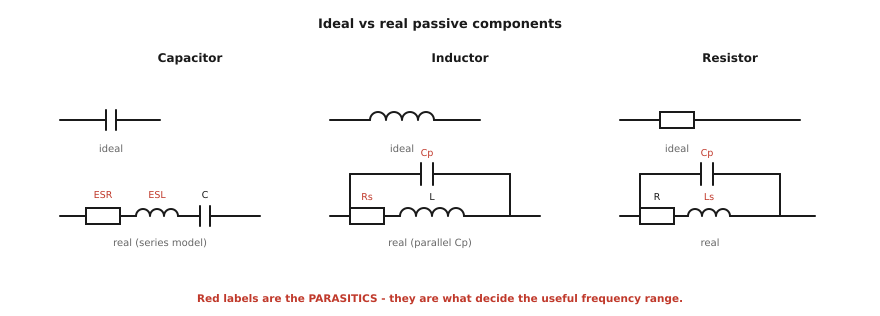
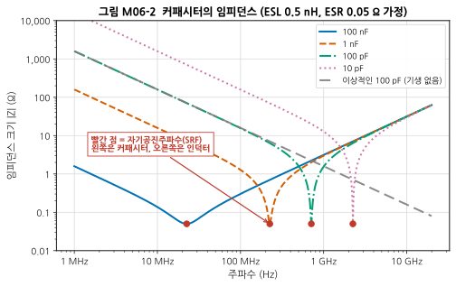
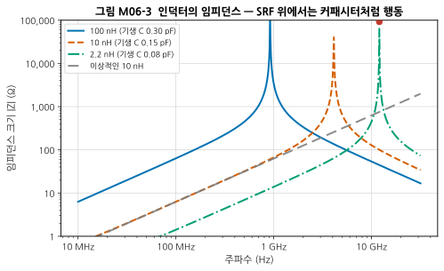
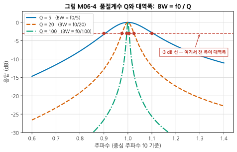
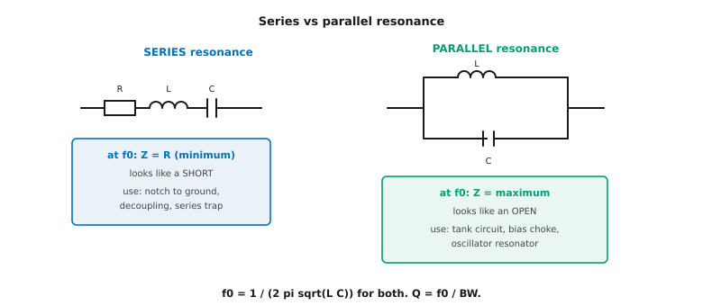
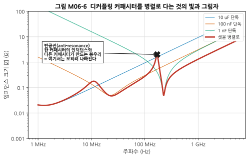

# M06 — 수동 소자와 공진: L과 C의 RF적 실체

**문서 번호**: RF-CUR-M06 · **버전**: v1.0 · **분량**: 이론 4 h + 실습 4 h

| | |
|---|---|
| **선수 모듈** | [M05](./M05_첫측정.md) |
| **이 모듈이 소유하는 개념** | 기생 성분(ESR, ESL, 기생 커패시턴스), 자기공진주파수(SRF), 품질계수 Q(무부하 Q·부하 Q), 직렬/병렬 공진, 공진 회로의 대역폭과 Q의 관계, 소자 패키지와 주파수 한계, 유전체 등급, 온도·전압 계수, 저항의 RF 거동, 페라이트 비드·초크, 디커플링과 반공진 |
| **이 모듈을 쓰는 후속 모듈** | M07(필터), M09(발진기 공진기의 Q), M17(전원 분배망의 디커플링) |
| **학습 목표** | ① 왜 100 nF 커패시터가 2.4 GHz에서 커패시터가 아닌지 설명한다 ② 데이터시트의 SRF를 보고 사용 가능 주파수를 판정한다 ③ Q와 대역폭의 관계를 계산한다 |

---

## M06.1 이상적인 L·C는 없다

### 직관 — 부품은 "부품 모양의 회로"다

회로도에서 커패시터는 선 두 개입니다. 그런데 실물은 **금속판, 유전체, 전극, 납땜 패드, 그리고 그것들을 잇는 도체**로 이루어져 있습니다.

- 도체에는 **저항**이 있습니다 → 등가 직렬 저항(ESR)
- 도체에 전류가 흐르면 **자기장**이 생깁니다 → 등가 직렬 인덕턴스(ESL)
- 떨어진 두 도체 사이에는 **정전용량**이 있습니다 → 기생 커패시턴스

**저주파에서는 이것들이 너무 작아 무시할 수 있습니다.** 그런데 주파수가 올라가면 ωL과 1/(ωC)가 변하면서, 어느 순간 **기생 성분이 주인공을 밀어냅니다.**

### 등가회로



*그림 M06-1. 이상적 소자와 실제 소자의 등가회로. 각 부품의 위쪽이 회로도에서 그리는 이상적 모델, 아래쪽이 실제 모델입니다. **빨간 글씨가 기생 성분**이고, 바로 이것들이 그 부품의 사용 가능 주파수를 결정합니다. 커패시터는 직렬 모델(ESR–ESL–C), 인덕터와 저항은 병렬 기생 커패시턴스 Cp가 붙는 모델을 씁니다.*

| 부품 | 주된 기생 | 결과 |
|---|---|---|
| **커패시터** | ESL (직렬 인덕턴스) | 높은 주파수에서 **인덕터가 됨** |
| **인덕터** | Cp (병렬 커패시턴스) | 높은 주파수에서 **커패시터가 됨** |
| **저항** | Ls, Cp | 값이 주파수에 따라 변함 |

> 💡 **패턴이 보이십니까**: 모든 실제 부품은 **어느 주파수 위에서 반대 성질로 뒤집힙니다.** 그 뒤집히는 지점이 다음 절의 주제입니다.

---

## M06.2 자기공진주파수(SRF)

### 정의

**자기공진주파수(Self-Resonant Frequency, SRF)** 는 부품 자신의 용량성과 유도성이 정확히 상쇄되는 주파수입니다.

$$f_{\text{SRF}} = \frac{1}{2\pi\sqrt{LC}}$$

- **커패시터**: L은 ESL, C는 커패시턴스
- **인덕터**: L은 인덕턴스, C는 기생 커패시턴스

### 커패시터 — SRF 위에서는 인덕터다



*그림 M06-2. 커패시터의 임피던스 (ESL 0.5 nH, ESR 0.05 Ω 가정). 가로축이 주파수, 세로축이 임피던스 크기입니다. 각 곡선은 **왼쪽에서 우하향(커패시터답게 주파수가 오르면 임피던스 감소)하다가, 빨간 점(SRF)에서 최소가 되고, 그 뒤 우상향(인덕터답게)** 합니다. **SRF 오른쪽에서는 네 곡선이 하나로 겹칩니다** — 그 영역에서는 커패시턴스 값과 무관하게 ESL만이 임피던스를 정하기 때문입니다. 회색 굵은 파선은 기생이 없는 이상적 100 pF입니다.*

| 커패시턴스 | SRF (ESL 0.5 nH 가정) |
|---|---|
| 100 nF | **22.5 MHz** |
| 10 nF | 71.2 MHz |
| 1 nF | 225 MHz |
| 100 pF | 712 MHz |
| 10 pF | **2.25 GHz** |

> ⚠️ **2.4 GHz 회로에 100 nF을 쓰면 어떻게 되는가**: SRF가 22.5 MHz이므로, 2.4 GHz에서는 SRF보다 **100배나 위**입니다. 이미 완전히 인덕터로 동작합니다. 임피던스는 대략 ωL = 2π × 2.4 GHz × 0.5 nH ≈ **7.5 Ω**. 커패시터로서 기대한 "거의 0 Ω"과는 전혀 다릅니다.
>
> **그래서 RF 회로에서는 큰 값이 능사가 아닙니다.** 2.4 GHz에서 결합용 커패시터가 필요하면 **수 pF ~ 수십 pF**을 씁니다.

### 인덕터 — SRF 위에서는 커패시터다



*그림 M06-3. 인덕터의 임피던스. 커패시터와 정확히 반대 모양입니다. **SRF에서 임피던스가 최대**가 되고(병렬 공진), 그 위에서는 우하향해 커패시터처럼 행동합니다. 값이 작은 인덕터일수록 기생 커패시턴스도 작아 SRF가 높습니다.*

| 인덕턴스 | 기생 Cp | SRF |
|---|---|---|
| 100 nH | 0.30 pF | 0.92 GHz |
| 10 nH | 0.15 pF | 4.11 GHz |
| 2.2 nH | 0.08 pF | 12.0 GHz |

> 📌 **데이터시트 읽는 법**: 부품 제조사는 SRF를 반드시 명기합니다. **사용 주파수가 SRF의 대략 1/3 이하**여야 그 부품이 의도한 성질을 유지합니다. SRF 근처에서는 값이 크게 틀어지고, SRF 위에서는 완전히 다른 부품입니다.

---

## M06.3 품질계수 Q

### 세 가지 정의, 하나의 뜻

**품질계수(Quality factor, Q)** 는 "손실이 얼마나 적은가" 또는 "공진이 얼마나 날카로운가"를 나타냅니다. 정의가 여러 개인데 **모두 같은 것을 다르게 말한 것**입니다.

| 정의 | 수식 | 어디서 쓰나 |
|---|---|---|
| **에너지 관점** | Q = 2π × (저장된 에너지) / (한 주기당 잃는 에너지) | 물리적 의미 |
| **소자 관점** | Q = ωL/R (인덕터), Q = 1/(ωCR) (커패시터) | 부품 데이터시트 |
| **공진 관점** | **Q = f₀ / BW** | **실무에서 가장 많이 씀** |

### 무부하 Q와 부하 Q — 반드시 구분할 것

| | 무부하 Q (Unloaded Q, Q_u) | 부하 Q (Loaded Q, Q_L) |
|---|---|---|
| 무엇 | 공진기 **자체**의 손실만 | 외부 회로까지 포함한 실제 Q |
| 크기 | 항상 더 큼 | 항상 더 작음 |
| 어디서 | 부품·공진기 사양 | 실제 회로의 대역폭 |

> ⚠️ **초심자 실수**: 데이터시트의 Q(무부하 Q)를 그대로 f₀/BW에 넣어 대역폭을 예측하는 것. 실제 회로에서는 신호원과 부하가 에너지를 가져가므로 **부하 Q가 훨씬 작고, 따라서 대역폭이 훨씬 넓습니다.**

### Q와 대역폭

$$\boxed{\;\text{BW}_{-3\,\mathrm{dB}} = \frac{f_0}{Q}\;}$$



*그림 M06-5. 품질계수 Q와 대역폭. 가로축은 중심 주파수 f₀를 1로 놓은 상대 주파수, 세로축은 응답(dB)입니다. **Q가 클수록 봉우리가 날카롭습니다.** 빨간 파선이 −3 dB 선이고, 각 곡선이 이 선과 만나는 두 점(빨간 점) 사이의 폭이 대역폭입니다.*

| Q | 2.4 GHz에서의 대역폭 |
|---|---|
| 5 | 480 MHz |
| 20 | 120 MHz |
| 100 | 24 MHz |

> 💡 **설계 통찰**: 좁은 대역폭이 필요하면 높은 Q가 필요하고, 높은 Q는 **손실이 적은 부품**을 뜻합니다. 그런데 손실이 적은 부품은 대개 **크고 비쌉니다**(→ M07 캐비티 필터). "좁은 필터를 작고 싸게" 만들 수 없는 근본 이유가 여기 있습니다.

---

## M06.4 직렬 공진과 병렬 공진



*그림 M06-4. 직렬 공진과 병렬 공진. 왼쪽 직렬 공진은 f₀에서 **임피던스가 최소(= R)** 가 되어 **단락처럼** 보입니다. 오른쪽 병렬 공진은 f₀에서 **임피던스가 최대**가 되어 **개방처럼** 보입니다. 공진 주파수 공식과 Q의 정의는 둘 다 같습니다.*

| | 직렬 공진 | 병렬 공진 |
|---|---|---|
| f₀에서 임피던스 | **최소** (= R) | **최대** |
| 무엇처럼 보이나 | 단락 | 개방 |
| 쓰이는 곳 | 접지로 빼는 노치, **디커플링**, 직렬 트랩 | 탱크 회로, 바이어스 초크, **발진기 공진기** |

**공통**: $f_0 = \dfrac{1}{2\pi\sqrt{LC}}$, $Q = \dfrac{f_0}{\text{BW}}$

> 📌 **M02와 이어집니다**: M02 §6에서 "단락된 λ/4 선은 개방처럼 보인다"를 배웠습니다. 그것은 **전송선로로 만든 병렬 공진**입니다. 부품으로 만들든 선로로 만들든 공진의 성질은 같습니다. 다만 주파수가 높아질수록 **부품보다 선로가 유리**해집니다(→ M06.6).

---

## M06.5 실제 부품 선정

### 패키지 크기가 주파수 한계를 정한다

| 패키지 | 크기 (mm) | 대략적 ESL | 실무 한계 |
|---|---|---|---|
| 0805 | 2.0 × 1.25 | 약 1.0 nH | ~1 GHz |
| 0603 | 1.6 × 0.8 | 약 0.8 nH | ~2 GHz |
| **0402** | 1.0 × 0.5 | **약 0.5 nH** | **~6 GHz** |
| 0201 | 0.6 × 0.3 | 약 0.3 nH | ~10 GHz |

> **작을수록 좋습니다.** 전극 사이 거리가 짧아 ESL이 작기 때문입니다. 대신 손으로 납땜하기 어렵고 전력·전압 정격이 낮아집니다. 값은 위 ESL이 **대표적 경향**이며 제조사·시리즈마다 다르므로 반드시 데이터시트를 확인하십시오.

### 유전체 등급 — 값이 변하는 커패시터

세라믹 커패시터의 유전체 등급은 **값의 안정성**을 결정합니다.

| 등급 | 온도 안정성 | 직류 전압 인가 시 | RF에서의 쓰임 |
|---|---|---|---|
| **C0G / NP0** (Class 1) | 매우 안정 (±30 ppm/°C) | 거의 안 변함 | **정합·필터·공진 회로 필수** |
| X7R (Class 2) | ±15 % | **크게 감소** | 디커플링·바이패스 |
| Y5V (Class 2) | ±22 %/−82 % | 매우 크게 감소 | RF에서 쓰지 않음 |

> ⚠️ **직류 바이어스 특성(DC bias effect)** 이 초심자를 가장 많이 속입니다. X7R 커패시터에 정격에 가까운 직류 전압을 걸면 **실제 용량이 표시값의 절반 이하로 떨어질 수 있습니다.** 정합 회로에 X7R을 쓰면 왜 계산과 다른지 영원히 모르게 됩니다.
>
> **규칙: 값이 중요한 곳(정합·필터·공진)에는 반드시 C0G/NP0.**

### 저항과 페라이트

- **저항**: RF에서는 후막(thick film)보다 박막(thin film)이 기생이 적습니다. 종단·감쇠기용 저항은 RF 전용 부품을 씁니다.
- **페라이트 비드(ferrite bead)**: 낮은 주파수에서는 인덕터, 높은 주파수에서는 **저항**으로 동작해 잡음을 열로 태워 없앱니다. 전원선의 잡음 차단에 씁니다. 다만 **직류 전류가 흐르면 성능이 크게 떨어지므로** 데이터시트의 바이어스 곡선을 확인해야 합니다.

---

## M06.6 디커플링 — 그리고 반공진이라는 함정

### 왜 여러 값을 병렬로 다는가

전원선의 잡음을 없애려면 넓은 주파수 범위에서 임피던스가 낮아야 합니다. 그런데 커패시터 하나는 SRF 근처에서만 임피던스가 낮습니다(그림 M06-2). **그래서 큰 값(낮은 주파수용)과 작은 값(높은 주파수용)을 함께 답니다.**

여기까지는 잘 알려진 이야기입니다. **그런데 문제가 있습니다.**



*그림 M06-6. 디커플링 커패시터를 병렬로 다는 것의 빛과 그림자. 얇은 선이 각 커패시터 단독, 굵은 빨간 선이 셋을 병렬로 연결한 결과입니다. 넓은 범위에서 임피던스가 낮아진 것은 맞지만, **검은 X 지점(약 170 MHz)에서 오히려 봉우리가 솟았습니다.** 이것이 반공진입니다.*

### 반공진(anti-resonance)이란

큰 커패시터가 **SRF를 지나 인덕터가 된 상태**에서, 아직 커패시터인 작은 커패시터와 만나면 **병렬 LC 공진**이 됩니다. 그리고 병렬 공진은 §M06.4에서 본 대로 **임피던스가 최대**입니다.

즉 **잡음을 없애려고 단 커패시터들이, 특정 주파수에서는 오히려 임피던스를 높입니다.**

| 대책 | 설명 |
|---|---|
| **ESR이 적당히 있는 부품을 섞는다** | 손실이 공진을 무디게 만듭니다. Q를 낮추는 것이 여기서는 이득입니다 |
| **값의 간격을 너무 벌리지 않는다** | 10배씩 띄우면 반공진이 커집니다. 종류를 줄이고 **같은 값을 여러 개** 쓰는 쪽이 나은 경우가 많습니다 |
| **배치와 비아를 줄인다** | 실제 ESL의 상당 부분은 부품이 아니라 **배선과 비아**입니다 (→ M17) |
| **시뮬레이션으로 확인한다** | 위 그림처럼 임피던스를 그려 보면 봉우리가 어디 있는지 바로 보입니다 |

> 📌 **전원 분배망(PDN) 설계는 M17이 소유**합니다. 여기서는 "왜 커패시터를 병렬로 다는가"와 "왜 그것이 항상 좋지는 않은가"까지만 다룹니다.

---

## M06.L 실습

### L06-a — 커패시터·인덕터의 SRF 실측 (Tier 1, 2시간)

**① 셋업도**

```
[NanoVNA CH0] ── [SMA 커넥터에 납땜한 시험 지그] ── DUT (칩 부품) ── 접지
                        (또는 CH0 ── DUT ── CH1 로 S21 측정)
```

> 지그가 없으면: SMA 커넥터 하나의 중심핀과 몸체 사이에 부품을 직접 납땜하면 1포트(S11) 측정이 가능합니다. 이때 **커넥터 자체의 기생이 함께 측정된다**는 점을 기억하십시오.

**② 절차**

1. [부록 D §D.6](../03_부록/D_장비_소프트웨어_준비가이드.md)의 점검을 먼저 수행합니다.
2. 주파수 범위를 1 MHz ~ 1.5 GHz(장비 상한까지)로 설정합니다.
3. 여러 값의 커패시터(100 nF, 1 nF, 100 pF, 10 pF)를 차례로 측정합니다.
4. **S11의 크기가 최소**가 되는 주파수를 기록합니다 — 그것이 SRF입니다.
5. 인덕터도 같은 방식으로 측정합니다.
6. 데이터시트의 SRF와 비교합니다.

**③ 예상 결과**

| 부품 | 계산상 SRF (ESL 0.5 nH) | 실측 예상 |
|---|---|---|
| 100 nF | 22.5 MHz | 15~30 MHz |
| 1 nF | 225 MHz | 150~250 MHz |
| 100 pF | 712 MHz | 450~700 MHz |
| 10 pF | 2.25 GHz | 장비 범위 밖일 수 있음 |

**④ 흔한 실수**

| 증상 | 원인 |
|---|---|
| SRF가 데이터시트보다 **낮게** 나옴 | **정상입니다.** 납땜 패드와 지그의 인덕턴스가 ESL에 더해집니다. 이것이 "부품의 SRF"와 "보드에 붙인 뒤의 SRF"가 다른 이유입니다 |
| 값이 매번 다름 | 납땜 상태·부품 자세가 매번 다름. 지그를 만들어 고정하십시오 |
| 아무 공진도 안 보임 | SRF가 장비 범위 밖. 더 큰 값의 부품으로 시작하십시오 |

**⑤ 판정 기준**: 커패시턴스가 10배 작아질 때 SRF가 **약 √10 ≈ 3.16배 높아지는** 경향이 관측되면 통과.

> 💡 **④의 첫 줄이 이 실습의 핵심 교훈입니다.** 데이터시트의 SRF는 **부품 자체**의 값이고, 실제 회로에서는 **패드·비아·배선의 인덕턴스가 더해져 SRF가 내려갑니다.** 그래서 고주파 보드에서는 부품 선정만큼 배치가 중요합니다(→ M17).

### L06-b — 등가회로 모델링과 실측 대조 (Tier 0, 2시간)

**① 셋업**: Python + scikit-rf

**② 절차**

```python
import numpy as np
import skrf as rf

def cap_model(f, c_f, esl_h, esr_ohm):
    """실제 커패시터의 임피던스 (직렬 R-L-C 모델)"""
    w = 2 * np.pi * f
    return esr_ohm + 1j * w * esl_h + 1 / (1j * w * c_f)

def srf(l_h, c_f):
    return 1 / (2 * np.pi * np.sqrt(l_h * c_f))

def to_s11(z, z0=50.0):
    return (z - z0) / (z + z0)

# 과제 1: 100 pF, ESL 0.5 nH 의 SRF 와 2.4 GHz 에서의 임피던스
f0 = srf(0.5e-9, 100e-12)
z24 = cap_model(2.4e9, 100e-12, 0.5e-9, 0.05)
print(f"SRF = {f0/1e6:.1f} MHz")
print(f"2.4 GHz 에서 Z = {z24:.3f}  (|Z| = {abs(z24):.2f} 옴)")

# 과제 2: 실측 SRF 로부터 실제 ESL 을 역산
f_meas = 500e6                      # 실측한 SRF 예시
esl_actual = 1 / ((2 * np.pi * f_meas) ** 2 * 100e-12)
print(f"실측 SRF {f_meas/1e6:.0f} MHz -> 실제 ESL = {esl_actual*1e9:.3f} nH")

# 과제 3: Touchstone 으로 저장해 다른 도구와 대조
freq = rf.Frequency(1, 3000, 601, 'mhz')
z = cap_model(freq.f, 100e-12, 0.5e-9, 0.05)
net = rf.Network(frequency=freq, s=to_s11(z).reshape(-1, 1, 1), z0=50,
                 name='cap100pF')
net.write_touchstone('cap100pF')
print("최소 |S11| 주파수 =", freq.f[np.argmin(abs(net.s[:, 0, 0]))] / 1e6, "MHz")
```

**③ 예상 결과**

```
SRF = 711.8 MHz
2.4 GHz 에서 Z = 0.050+6.877j  (|Z| = 6.88 옴)
실측 SRF 500 MHz -> 실제 ESL = 1.013 nH
최소 |S11| 주파수 = 710.7633333333332 MHz
```

**④ 흔한 실수**

| 증상 | 원인 |
|---|---|
| 2.4 GHz 에서 임피던스가 음의 허수부 | 커패시터로 계산한 것. SRF 위에서는 **양의 허수부(유도성)** 여야 정상 |
| ESL 역산 값이 음수/이상 | 실측 SRF와 커패시턴스 값의 짝이 안 맞음 |
| S11 최소 주파수가 SRF와 조금 다름 | 주파수 격자 해상도 때문. 포인트 수를 늘리십시오 (→ M05 §1) |

**⑤ 판정 기준**: 과제 1~3의 출력이 위와 일치하고, **L06-a의 실측 SRF로 실제 ESL을 역산**해 데이터시트 값보다 큰지 확인했으면 통과.

---

## M06.Q 확인 문제

<details>
<summary><b>Q1.</b> 2.4 GHz 회로의 결합(coupling) 커패시터로 100 nF과 10 pF 중 무엇을 써야 하는가?</summary>

**10 pF**입니다.

- 100 nF: SRF 22.5 MHz → 2.4 GHz에서는 완전히 인덕터. |Z| ≈ ωL = 7.5 Ω
- 10 pF: SRF 2.25 GHz → 2.4 GHz는 SRF 바로 위지만 임피던스가 여전히 매우 낮음

> 다만 10 pF은 SRF 근처라 값이 민감합니다. 실무에서는 SRF가 사용 주파수보다 충분히 높은 부품을 고르거나, 애초에 **결합에는 커패시터 대신 λ/4 결합선**을 쓰기도 합니다.
>
> **핵심**: "값이 크면 임피던스가 낮다"는 저주파의 직관이 RF에서는 뒤집힙니다.
</details>

<details>
<summary><b>Q2.</b> Q = 200인 공진기로 2.4 GHz에서 만들 수 있는 최소 대역폭은?</summary>

BW = f₀/Q = 2.4 GHz / 200 = **12 MHz**

> 그런데 이것은 **무부하 Q** 기준입니다. 실제 회로에 넣으면 신호원과 부하가 에너지를 가져가 부하 Q가 낮아지고, 대역폭은 이보다 넓어집니다. 정확한 예측에는 부하 Q를 써야 합니다.
</details>

<details>
<summary><b>Q3.</b> 인덕터의 SRF가 4 GHz다. 3 GHz 회로에 써도 되는가?</summary>

**권장되지 않습니다.**

실무 경험칙은 **사용 주파수 ≤ SRF의 1/3**입니다. 4 GHz SRF면 약 1.3 GHz까지가 안전합니다.

3 GHz는 SRF의 75 %로, 이 영역에서는:
- 실효 인덕턴스가 표시값보다 **크게 증가**합니다(공진에 가까워지므로)
- 온도·개체 산포에 매우 민감해집니다
- 보드에 붙이면 패드 기생이 더해져 SRF가 더 내려갑니다

**대안**: 더 작은 값의 인덕터(SRF가 높음)를 쓰거나, 분포소자(전송선)로 대체합니다.
</details>

<details>
<summary><b>Q4.</b> 디커플링 커패시터를 10 uF, 100 nF, 1 nF 세 개 병렬로 달았다. 무조건 좋은가?</summary>

**아닙니다.** 반공진(anti-resonance) 때문에 특정 주파수에서 오히려 임피던스가 **올라갑니다**(그림 M06-6).

원리: 큰 커패시터가 SRF를 지나 **인덕터**가 된 상태에서 아직 커패시터인 작은 것과 만나면 **병렬 LC 공진**이 되고, 병렬 공진은 임피던스가 최대입니다.

**대책**: ESR이 있는 부품을 섞어 Q를 낮추기, 값 간격을 과하게 벌리지 않기, 같은 값을 여러 개 쓰기, 그리고 임피던스를 실제로 그려 보기.
</details>

<details>
<summary><b>Q5.</b> 정합 회로에 X7R 커패시터를 썼더니 계산과 전혀 다른 결과가 나왔다. 왜인가?</summary>

**X7R은 Class 2 유전체로, 온도와 직류 전압에 따라 용량이 크게 변합니다.**

특히 **직류 바이어스 특성**이 문제입니다. 정격 전압에 가까운 직류를 걸면 실제 용량이 표시값의 절반 이하로 떨어질 수 있습니다. 온도로도 ±15 % 변합니다.

정합 회로는 **값이 정확해야** 동작하므로 반드시 **C0G/NP0(Class 1)** 을 써야 합니다.

> 이것이 "부품표에 커패시턴스 값만 적으면 안 되는" 이유입니다. **유전체 등급까지 지정**해야 합니다.
</details>

<details>
<summary><b>Q6.</b> 실측한 SRF가 데이터시트 값보다 낮게 나왔다. 부품 불량인가?</summary>

**대개 정상입니다.**

데이터시트의 SRF는 제조사의 표준 시험 지그에서 잰 **부품 자체**의 값입니다. 실제 보드에서는:
- 납땜 패드의 인덕턴스
- 접지까지 가는 비아의 인덕턴스
- 배선의 인덕턴스

가 ESL에 **더해집니다.** L이 커지면 SRF는 1/√L 로 내려갑니다.

> **실무 함의**: 부품을 잘 골라도 배치가 나쁘면 소용없습니다. 특히 **접지 비아를 부품 패드 바로 옆에** 두는 것이 고주파 디커플링의 핵심입니다 (→ M17).
</details>

---

## M06.7 한 장 요약

| 알아야 할 것 | 핵심 | 절 |
|---|---|---|
| 이상적 소자는 없다 | 모든 부품에 기생 성분이 있고, 그것이 사용 한계를 정한다 | §1 |
| SRF | **f = 1/(2π√(LC))**. 이 위에서는 성질이 **뒤집힌다** | §2 |
| 커패시터 | SRF 위 = 인덕터. **큰 값이 능사가 아니다** | §2 |
| 인덕터 | SRF 위 = 커패시터 | §2 |
| 실무 규칙 | **사용 주파수 ≤ SRF / 3** | §2 |
| Q | 정의 셋은 같은 말. 실무에서는 **Q = f₀/BW** | §3 |
| 무부하 vs 부하 Q | 데이터시트는 무부하 Q. 실제 대역폭은 **부하 Q**로 | §3 |
| 직렬/병렬 공진 | 직렬 = 최소 임피던스(단락) / 병렬 = 최대(개방) | §4 |
| 패키지 | 작을수록 ESL이 작아 고주파에 유리 (0402가 RF 표준) | §5 |
| 유전체 등급 | 값이 중요한 곳은 **반드시 C0G/NP0**. X7R은 직류 바이어스로 값이 반토막 | §5 |
| 디커플링 | 병렬 조합은 **반공진 봉우리**를 만든다 — 무조건 좋지 않다 | §6 |
| 실측 SRF | 데이터시트보다 **낮게** 나오는 것이 정상 (패드·비아 기생) | L06-a |

---

## M06.A 이 모듈의 축약어

| 약어 | 영문 원어 | 한글 |
|---|---|---|
| SRF | Self-Resonant Frequency | 자기공진주파수 |
| ESR | Equivalent Series Resistance | 등가 직렬 저항 |
| ESL | Equivalent Series Inductance | 등가 직렬 인덕턴스 |
| Q | Quality Factor | 품질계수 |
| Q_u / Q_L | Unloaded / Loaded Q | 무부하 Q / 부하 Q |
| BW | Bandwidth | 대역폭 |
| C0G / NP0 | (Class 1 유전체 등급 코드) | 온도·전압에 안정한 세라믹 유전체 |
| X7R / Y5V | (Class 2 유전체 등급 코드) | 용량이 크지만 값이 변하는 세라믹 유전체 |
| MLCC | Multi-Layer Ceramic Capacitor | 적층 세라믹 커패시터 |
| PDN | Power Distribution Network | 전원 분배망 (→ M17) |
| DUT | Device Under Test | 피시험 소자 (→ M04) |

---

## M06.S 출처

| 내용 | 출처 | 등급 | 교차검증 |
|---|---|---|---|
| 수동 소자의 기생·공진, 분포소자와의 관계 | [Steer, *Microwave and RF Design IV — Modules*](https://eng.libretexts.org/Bookshelves/Electrical_Engineering/Electronics/Microwave_and_RF_Design_IV:_Modules_(Steer)) · [Vol. II — Transmission Lines](https://eng.libretexts.org/Bookshelves/Electrical_Engineering/Electronics/Microwave_and_RF_Design_II_-_Transmission_Lines_(Steer)) | B | 2건 |
| L과 C의 RF적 실체, 공진의 이해 (교육 구성 참고) | [rfdh.com — RF의 기초](http://www.rfdh.com/bas_rf.htm) | — | 목차 구조만 |
| Q와 대역폭, 공진기 특성 | [Microwaves101 — 백과사전](https://www.microwaves101.com/encyclopedias) | B | — |
| 소자 기생·SRF의 시스템 영향 | [Analog Devices — PCB Layout Guidelines for RF & Mixed-Signal](https://www.analog.com/en/resources/technical-articles/pcbs-layout-guidelines-for-rf--mixedsignal.html) | B | — |

> ⚠️ **중요 — 이 모듈의 수치에 대하여**: 본문의 ESL·기생 커패시턴스·SRF 값은 **모델 계산에 쓴 대표값**이며, 특정 제조사의 실제 부품 값이 아닙니다. 패키지별 ESL과 유전체 등급의 변화율도 시리즈마다 다릅니다.
>
> **부품을 실제로 고를 때는 반드시 해당 제조사의 데이터시트에서 SRF·ESR·ESL·직류 바이어스 곡선을 확인**하십시오. 이 모듈의 목적은 특정 값을 외우는 것이 아니라 **"어떤 항목을 봐야 하는가"** 를 아는 것입니다. 원문 직접 확인 안내는 [M00.S](./M00_RF시스템엔지니어링이란.md#m00s-출처) 참조.

---

## 다음 모듈

**[M07 — 필터와 수동 네트워크](./M07_필터와수동네트워크.md)**

공진을 여러 개 엮으면 필터가 됩니다. 그리고 Q가 대역폭을 정한다는 것을 알았으니, 이제 "왜 좁은 필터는 손실이 큰가"를 이해할 수 있습니다.

---

## 변경 이력

| 버전 | 일자 | 내용 |
|---|---|---|
| v1.0 | 2026-08-20 | 최초 작성. 시각자료 6종(데이터 플롯 4 + SVG 도해 2), 실습 2종, 확인 문제 6문항 |
| — | 2026-08-20 | **검토 3회 완료.** 1차(사실): SRF 8건, Q-대역폭 3건, 실습 출력 4건을 코드로 재계산해 예상 출력을 실측값으로 교체. 2차(교육): 디커플링 절에 **반공진(anti-resonance)** 을 넣음 — '커패시터를 병렬로 달면 좋다'는 통념만 가르치면 실무에서 오히려 해로우므로, 병렬 조합이 특정 주파수에서 임피던스를 **높이는** 현상을 그림으로 보임. 3차(구조): 그림에서 강조선이 rcParams 선모양 순환 때문에 점선으로 그려지던 문제를 `rf_style.emph()` 헬퍼로 근본 차단 |
