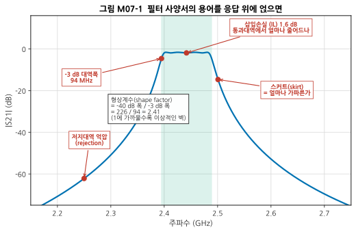
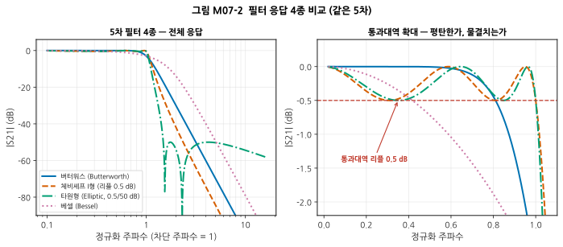
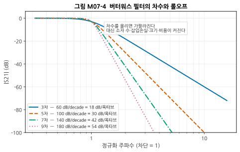
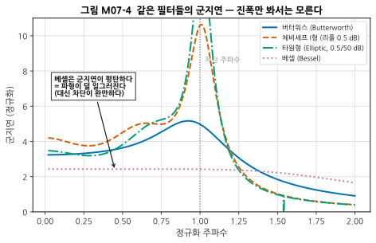
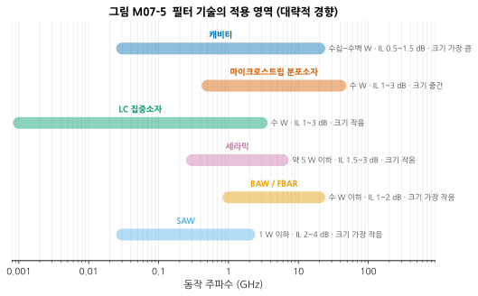
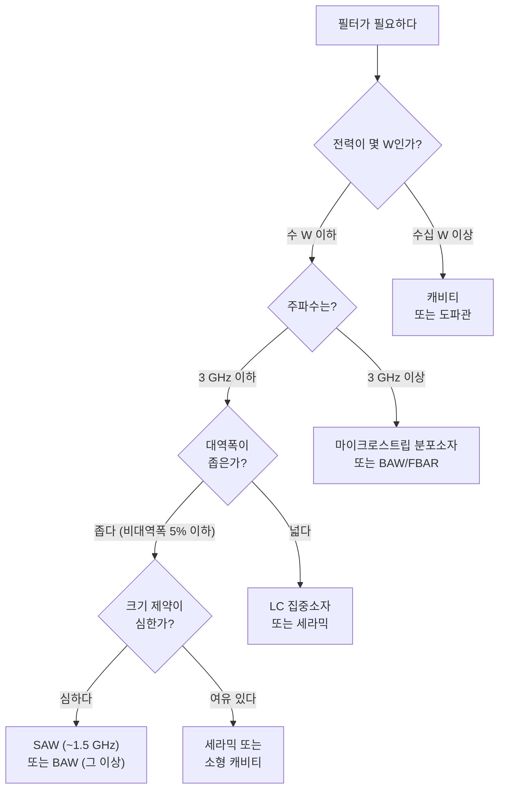
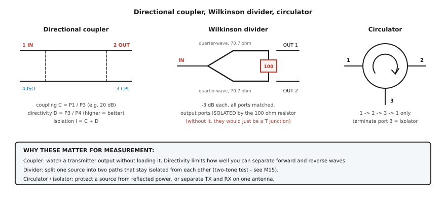

# M07 — 필터와 수동 네트워크

**문서 번호**: RF-CUR-M07 · **버전**: v1.0 · **분량**: 이론 4 h + 실습 5 h

| | |
|---|---|
| **선수 모듈** | [M06](./M06_수동소자와공진.md) |
| **이 모듈이 소유하는 개념** | 필터 응답 종류(버터워스·체비셰프·타원형·베셀), 차수와 롤오프, 통과대역 리플, 저지대역 억압, 형상계수, 군지연, 필터 기술(LC 집중소자·세라믹·SAW·BAW/FBAR·캐비티·마이크로스트립 분포소자), 방향성 결합기(결합도·방향성·격리), 전력 분배기/합성기(윌킨슨), 서큘레이터·아이솔레이터, 감쇠기와 종단기의 부품 사양, 밸런 |
| **이 모듈을 쓰는 후속 모듈** | M09(주파수 계획의 필터 요구), M11(아키텍처별 필터 배치), M12(예산에 삽입손실 반영), M15(2톤 시험의 합성기·결합기) |
| **학습 목표** | ① 주어진 요구(대역·억압·손실·크기·가격)에 맞는 필터 기술을 선택한다 ② 데이터시트의 필터 곡선을 규격과 대조해 판정한다 ③ 결합기의 결합도·방향성이 측정에 미치는 영향을 계산한다 |

---

## M07.0 이 모듈의 범위

> ⚠️ **M04와의 역할 분리**: M04는 감쇠기·결합기를 **"장비를 보호하는 도구"** 로 다루었습니다. 이 모듈은 같은 부품을 **"사양을 읽고 고르는 대상"** 으로 다룹니다. 같은 부품의 다른 층위이므로 중복이 아닙니다.
>
> - M04: "장비를 태우지 않으려면 감쇠기를 넣는다"
> - M07: "그 감쇠기의 정확도·전력정격·주파수 평탄도를 어떻게 고르는가", "결합기의 방향성이 왜 측정 한계를 정하는가"

---

## M07.1 필터란 무엇인가 — 공진을 엮은 것

M06에서 공진 회로 하나가 봉우리(또는 골짜기) 하나를 만드는 것을 봤습니다. **필터는 그런 공진기를 여러 개 엮어 원하는 모양을 만든 것**입니다.

| 필터 종류 | 통과 | 쓰이는 곳 |
|---|---|---|
| 저역 통과 (Low Pass Filter, LPF) | 차단 주파수 아래 | **하모닉 제거** (송신단 필수) |
| 고역 통과 (High Pass Filter, HPF) | 차단 주파수 위 | 저주파 간섭 제거 |
| **대역 통과 (Band Pass Filter, BPF)** | 특정 대역만 | **수신단 앞, 대역 선택** |
| 대역 저지 (Band Stop / Notch) | 특정 대역만 차단 | 강한 간섭원 제거 |

> 💡 **왜 수신단 맨 앞에 BPF가 있는가**: 안테나는 모든 주파수를 받아들입니다. 근처 방송국의 강한 신호가 그대로 들어오면 LNA가 압축되어(→ M08) 정작 원하는 약한 신호를 못 받습니다. 그래서 **원하는 대역만 남기고 나머지를 버리는** 필터가 먼저 있어야 합니다.

---

## M07.2 필터 사양서 읽기



*그림 M07-3. 필터 사양서의 용어를 응답 위에 얹으면. 가로축이 주파수(GHz), 세로축이 |S21|(dB)입니다. 초록 영역이 −3 dB 대역폭이고, 빨간 점과 설명이 각 사양 항목이 그래프의 어디를 가리키는지 보여 줍니다. 가운데 상자의 **형상계수(shape factor)** 는 필터가 얼마나 "벽에 가까운가"를 나타내는 수치로, 1에 가까울수록 이상적입니다.*

| 사양 항목 | 무엇 | 어디를 보나 |
|---|---|---|
| **중심 주파수 / 통과대역** | 통과시키는 범위 | 봉우리의 위치와 폭 |
| **삽입손실 (Insertion Loss, IL)** | 통과대역에서 얼마나 줄어드나 | 봉우리 꼭대기의 dB 값 |
| **통과대역 리플 (ripple)** | 통과대역 안에서 얼마나 물결치나 | 꼭대기의 울퉁불퉁함 |
| **저지대역 억압 (rejection)** | 막아야 할 대역에서 얼마나 막나 | 관심 주파수에서의 dB |
| **형상계수 (shape factor)** | (−40 dB 폭) / (−3 dB 폭) | 스커트의 가파름 |
| **군지연 (group delay)** | 주파수마다 지연이 다른 정도 | §M07.4 |
| **반사손실 (return loss)** | 입출력 정합 | S11 곡선 (→ M02) |
| **전력 정격** | 견딜 수 있는 전력 | 송신단에서 결정적 |

> ⚠️ **초심자가 빠뜨리는 두 가지**
>
> 1. **저지대역 억압은 "어느 주파수에서"인지가 함께 적혀야 의미가 있습니다.** "억압 40 dB"만으로는 아무 정보도 없습니다. "2.2 GHz에서 40 dB 이상"이라야 판정할 수 있습니다.
> 2. **필터에도 전력 정격이 있습니다.** 특히 SAW 필터는 약합니다. 송신 경로에 수신용 필터를 쓰면 타 버립니다.

---

## M07.3 응답 종류 — 무엇을 얻고 무엇을 잃는가

### 네 가지 고전적 응답



*그림 M07-1. 필터 응답 4종 비교 (같은 5차). 왼쪽은 전체 응답(로그 주파수), 오른쪽은 통과대역 확대입니다. **같은 차수인데 차단의 가파름과 통과대역의 평탄도가 서로 다릅니다.** 타원형이 가장 가파르지만 통과대역과 저지대역 모두 물결치고, 베셀은 가장 완만하지만 가장 평탄합니다.*

| 응답 | 통과대역 | 저지대역 | 차단의 가파름 | 군지연 | 언제 쓰나 |
|---|---|---|---|---|---|
| **버터워스** | 최대 평탄 | 단조 감소 | 보통 | 보통 | 무난한 기본 선택 |
| **체비셰프 I형** | **리플 있음** | 단조 감소 | 가파름 | 나쁨 | 억압이 중요할 때 |
| **타원형 (Elliptic)** | 리플 있음 | **리플 있음** | **가장 가파름** | 가장 나쁨 | 좁은 천이대역이 꼭 필요할 때 |
| **베셀** | 평탄 | 완만 | **가장 완만** | **가장 평탄** | 파형 보존이 중요할 때 |

> 📌 **공짜는 없습니다.** 같은 차수에서 차단을 가파르게 만들면 **반드시** 통과대역 리플이나 군지연 왜곡을 대가로 냅니다. 이것은 설계 실력의 문제가 아니라 **수학적 제약**입니다.

### 차수를 올리면



*그림 M07-4. 버터워스 필터의 차수와 롤오프. 차수 n의 점근 기울기는 **20n dB/decade = 6n dB/옥타브**입니다. 범례에 각 차수의 기울기를 적었습니다. 차수를 올리면 가팔라지지만, **소자 수·삽입손실·크기·비용이 함께 커집니다.***

| 차수 | 롤오프 | 대략적 대가 |
|---|---|---|
| 3차 | 18 dB/옥타브 | 소자 3개 |
| 5차 | 30 dB/옥타브 | 소자 5개, IL 증가 |
| 7차 | 42 dB/옥타브 | 소자 7개, IL·크기·비용 증가 |
| 9차 | 54 dB/옥타브 | 실무에서는 다른 기술을 검토할 시점 |

---

## M07.4 군지연 — 진폭만 봐서는 모른다

### 왜 신경 써야 하는가

**군지연(group delay)** 은 신호가 필터를 지나는 데 걸리는 시간이며, **주파수마다 다를 수 있습니다.**

$$\tau_g = -\frac{d\phi}{d\omega}$$

주파수마다 지연이 다르면, 여러 주파수 성분으로 이루어진 신호(= 모든 변조 신호)는 **성분마다 도착 시각이 달라져 파형이 일그러집니다.**



*그림 M07-2. 같은 필터들의 군지연 — 진폭만 봐서는 모른다. 가로축이 정규화 주파수, 세로축이 군지연입니다. **차단 주파수 근처에서 체비셰프와 타원형은 군지연이 급격히 치솟습니다.** 베셀(점선)만 거의 평탄합니다. 그림 M07-1에서 진폭만 보면 알 수 없던 차이입니다.*

> 💡 **실무 함의**: 디지털 변조 신호를 다루는 경로에서 통과대역 가장자리에 신호를 두면, 군지연 변동이 **EVM을 악화시킵니다**(→ M13). 그래서 실무에서는 **필터 통과대역을 신호 대역보다 넉넉히 잡아** 가장자리를 피합니다.

---

## M07.5 필터 기술 — 무엇으로 만들 것인가



*그림 M07-5. 필터 기술의 적용 영역(대략적 경향). 가로축이 동작 주파수(GHz, 로그)이고, 각 가로 막대가 그 기술이 주로 쓰이는 주파수 범위입니다. 오른쪽 글씨는 전력 처리 능력·전형적 삽입손실·크기 감각입니다.*

| 기술 | 대략 주파수 | 전력 | 삽입손실 | 크기 | 특징 |
|---|---|---|---|---|---|
| **LC 집중소자** | ~3 GHz | 수 W | 1~3 dB | 작음 | 값싸고 유연. **부품 SRF가 상한을 정함**(→ M06) |
| **세라믹** | 0.3~6 GHz | ~5 W | 1.5~3 dB | 작음 | 표면실장, 대량생산에 유리 |
| **SAW** | 0.03~2 GHz | ~1 W 이하 | 2~4 dB | 가장 작음 | 매우 가파름. **전력에 약함** |
| **BAW / FBAR** | 1~20 GHz | 수 W 이하 | 1~2 dB | 가장 작음 | SAW보다 고주파·저손실·고전력 |
| **마이크로스트립 분포소자** | 0.5~40 GHz | 수 W | 1~3 dB | 중간 | **패턴만 그리면 됨.** 고주파에서 유리 |
| **캐비티** | 0.03~20 GHz | 수십~수백 W | 0.5~1.5 dB | 가장 큼 | **최저 손실·최고 전력·최고 Q** |

### SAW와 BAW — 왜 갈리는가

- **SAW (표면 탄성파, Surface Acoustic Wave)**: 결정 **표면**을 타고 가는 음향파를 씁니다. 만들기 쉽고 값싸며, 대략 **1.5 GHz 정도까지** 유리합니다.
- **BAW / FBAR (체적 탄성파)**: 결정 **속**을 통과하는 음향파를 씁니다. 더 높은 주파수에서 **삽입손실이 낮고 스커트가 가파르며 전력 처리도 낫습니다.**

> 📌 **왜 음향파를 쓰는가**: 음속은 빛보다 약 10만 배 느립니다. 따라서 같은 주파수에서 **파장이 10만 배 짧아** 소자를 극단적으로 작게 만들 수 있습니다. 스마트폰에 수십 개의 필터가 들어갈 수 있는 이유가 이것입니다.

### 왜 좁은 필터는 손실이 큰가 — M06과 이어집니다

M06에서 **BW = f₀/Q** 를 배웠습니다. 좁은 대역폭 = 높은 Q = **손실이 적은 공진기**가 필요하다는 뜻입니다.

그런데 높은 Q를 얻으려면 **에너지를 담아 둘 부피가 커야** 합니다. 그래서:


*그림 M07-6. "좁고 작고 싸고 저손실인 필터"를 만들 수 없는 이유. M06의 Q–대역폭 관계에서 곧바로 따라 나오는 결론입니다.*

### 선택 결정 트리



*그림 M07-7. 필터 기술 선택 결정 트리. **전력을 가장 먼저 묻는 이유**는, 전력 정격을 넘기면 다른 어떤 장점도 의미가 없기 때문입니다. 실제 선택에서는 여기에 가격·조달성·인증 이력이 더해집니다.*

---

## M07.6 결합기·분배기·서큘레이터



*그림 M07-8. 방향성 결합기, 윌킨슨 전력 분배기, 서큘레이터. 왼쪽 결합기는 포트 1의 입력 중 일부를 포트 3으로 빼내고 포트 4로는 거의 나가지 않게 합니다. 가운데 윌킨슨 분배기는 λ/4 선 두 개와 **100 Ω 저항 하나**로 출력 두 포트를 서로 격리시킵니다. 오른쪽 서큘레이터는 신호를 1→2→3→1 한 방향으로만 돌립니다. 아래 상자는 이들이 측정에서 왜 중요한지 정리한 것입니다.*

### 방향성 결합기 — 세 파라미터

| 파라미터 | 정의 | 뜻 |
|---|---|---|
| **결합도 (Coupling, C)** | P1 / P3 | 얼마나 빼내는가 (예: 20 dB = 1 %) |
| **방향성 (Directivity, D)** | P3 / P4 | **정방향과 역방향을 얼마나 잘 구분하는가** |
| **격리 (Isolation, I)** | C + D | 결합 포트로 새어 오는 역방향 신호의 억제 |

> ⚠️ **방향성이 측정 한계를 정합니다.** 결합기로 반사파를 관찰할 때, 방향성이 20 dB면 **반사손실 20 dB보다 좋은 정합은 구분할 수 없습니다** — 결합기 자체의 누설이 그만큼 섞여 들어오기 때문입니다. VNA의 방향성 오차도 정확히 같은 원리이며, 교정이 이것을 수학적으로 제거합니다(→ M14).

### 윌킨슨 분배기 — 저항 하나의 의미

전력을 둘로 나누는 가장 단순한 방법은 T 접합입니다. 그런데 T 접합은:
- 각 출력 포트에서 본 임피던스가 25 Ω이 되어 **정합이 깨지고**
- 두 출력 포트가 **서로 연결**되어 있어, 한쪽의 변화가 다른 쪽에 영향을 줍니다.

**윌킨슨 분배기**는 λ/4 선 두 개와 출력 사이의 저항(2Z₀ = 100 Ω) 하나로 이 둘을 동시에 해결합니다.

| 성질 | 값 |
|---|---|
| 분배 손실 | 각 출력 −3 dB (전력이 절반씩) |
| 모든 포트 | 정합됨 (S11 = S22 = S33 = 0) |
| **출력끼리 격리** | 이상적으로 무한대 |

> 💡 **왜 격리가 중요한가**: M15의 **2톤 시험**에서 두 신호원을 합칠 때, 격리가 나쁘면 한 신호원이 다른 신호원으로 들어가 그 안에서 상호변조를 만듭니다. 그러면 **DUT가 아니라 신호원이 만든 왜곡**을 측정하게 됩니다. Mini-Circuits의 2톤 시험 응용노트가 "발생기 간 격리 부족"을 2대 오류 원인으로 꼽는 이유입니다.

### 서큘레이터와 아이솔레이터

**서큘레이터(circulator)** 는 페라이트와 자석을 이용해 신호를 **한 방향으로만** 돌립니다: 1 → 2 → 3 → 1.

**아이솔레이터(isolator)** 는 서큘레이터의 포트 3을 종단한 것으로, **한 방향으로만 통과**시킵니다.

| 용도 | 설명 |
|---|---|
| **PA 보호** | 안테나에서 반사된 전력이 PA로 돌아가는 것을 막음 |
| **송수신 분리** | 안테나 하나로 송신과 수신을 동시에 (레이더 등) |
| **측정계 안정화** | 신호원과 DUT의 상호작용 차단 |

> ⚠️ 서큘레이터는 **비상호적(non-reciprocal)** 소자입니다 — S12 ≠ S21. M03 §3에서 "수동 선형 소자는 모두 상호적"이라고 했는데, 서큘레이터는 자석이 대칭을 깨기 때문에 예외입니다.

### 감쇠기와 종단기 — 부품으로서의 사양

M04에서 용도를 배웠으니, 여기서는 **고를 때 봐야 할 항목**입니다.

| 항목 | 왜 중요한가 |
|---|---|
| **감쇠 정확도** | ±0.5 dB인지 ±0.1 dB인지가 측정 불확도에 직접 들어감 (→ M14) |
| **주파수 평탄도** | 대역에 걸쳐 감쇠량이 얼마나 일정한가 |
| **VSWR** | 감쇠기 자신의 정합. 나쁘면 반사를 만듦 |
| **전력 정격** | 넘기면 탑니다. 소형 SMA는 보통 1~2 W |
| **종단기의 반사손실** | 좋은 종단기는 −30 dB 이하. 교정과 측정의 기준이 됨 |

---

## M07.L 실습

### L07-a — 필터 측정과 규격 판정표 작성 (Tier 1, 2.5시간)

**① 셋업도**

```
[VNA CH0] ── [케이블 A] ── [필터 DUT] ── [케이블 B] ── [VNA CH1]
```

**② 절차**

1. 필터의 데이터시트를 먼저 구해 **판정표의 "규격" 열을 채웁니다.**
2. [부록 D §D.6](../03_부록/D_장비_소프트웨어_준비가이드.md)의 점검을 수행합니다.
3. 통과대역이 화면에 충분히 들어오도록 주파수 범위를 잡고, **포인트 수를 넉넉히** 둡니다(→ M05 §1의 함정).
4. S21과 S11을 측정하고 Touchstone으로 저장합니다.
5. 아래 판정표를 채웁니다.

| 항목 | 규격 | 측정값 | 판정 | 비고 |
|---|---|---|---|---|
| 중심 주파수 | | | | |
| −3 dB 대역폭 | | | | |
| 삽입손실 (통과대역 최악) | | | | |
| 통과대역 리플 | | | | |
| 저지대역 억압 @ ___ MHz | | | | |
| 반사손실 (통과대역 최악) | | | | |
| 형상계수 (−40/−3 dB) | | | | |

**③ 예상 결과**

- 통과대역 삽입손실은 데이터시트보다 **나쁘게** 나옵니다(교정 안 했으므로 케이블·커넥터 손실이 포함).
- 저지대역은 VNA의 동적 범위 한계에서 바닥을 칩니다.
- 형상계수는 대역통과 필터에서 보통 1.5~4 사이입니다.

**④ 흔한 실수**

| 증상 | 원인 |
|---|---|
| 삽입손실이 데이터시트보다 2~3 dB 나쁨 | **교정 미실시.** 케이블·커넥터 손실이 더해짐 → M14 |
| 통과대역이 울퉁불퉁 | 교정 미실시로 인한 반사 리플. 감쇠기를 양쪽에 끼우면 줄어듦 |
| 저지대역이 −50 dB에서 평평 | 장비의 동적 범위 한계. 그 아래는 이 셋업으로 못 봄 |
| 중심 주파수가 다름 | DUT를 잘못 골랐거나, 포인트 수 부족으로 실제 봉우리를 놓침 |

**⑤ 판정 기준**: 표의 모든 칸을 채우고, **판정이 "불합격"인 항목마다 그것이 DUT 문제인지 측정계 문제인지 근거를 대고 구분**했으면 통과.

> 📌 **이 구분이 핵심입니다.** "규격 미달"과 "내 측정이 나쁨"을 구별하지 못하면 멀쩡한 부품을 불량 처리하거나 그 반대를 하게 됩니다. M14·M16의 주제로 이어집니다.

### L07-b — 마이크로스트립 대역통과 필터 설계 (Tier 0, 2.5시간)

**① 셋업**: Python(scipy) + 선택적으로 openEMS 또는 Qucs-S ([부록 D §D.1](../03_부록/D_장비_소프트웨어_준비가이드.md))

**② 절차**

```python
import numpy as np
from scipy import signal

C0 = 299_792_458.0

def microstrip_eeff(u, er):
    """M02 의 Hammerstad 근사식에서 유효 유전율만"""
    if u <= 1:
        return (er+1)/2 + (er-1)/2*((1+12/u)**-0.5 + 0.04*(1-u)**2)
    return (er+1)/2 + (er-1)/2*(1+12/u)**-0.5

def quarter_wave_mm(f_hz, er, u=1.93):
    """기판 위 λ/4 길이 [mm]  (M02 §2 의 단축률을 반영)"""
    ee = microstrip_eeff(u, er)
    return C0 / f_hz / np.sqrt(ee) / 4 * 1000

# 과제 1: 목표 사양으로부터 필요한 차수를 정한다
#   통과대역 2.40~2.4835 GHz, 2.30 GHz 에서 30 dB 이상 억압
f0 = np.sqrt(2.400e9 * 2.4835e9)          # 기하평균 중심 주파수
bw = 2.4835e9 - 2.400e9
w_norm = abs((2.30e9/f0 - f0/2.30e9)) / (bw/f0)   # 대역통과→저역통과 사상
for n in range(2, 9):
    att = 10*np.log10(1 + w_norm**(2*n))          # 버터워스 감쇠량
    print(f"  {n}차 → 2.30 GHz 에서 {att:5.1f} dB")

# 과제 2: 그 주파수에서 λ/4 공진기의 물리적 길이
print(f"\n중심 주파수 {f0/1e9:.4f} GHz, 비대역폭 {bw/f0*100:.2f} %")
for er, name in ((4.4, 'FR-4'), (3.55, '고주파용')):
    print(f"  {name} (Dk {er}): λ/4 = {quarter_wave_mm(f0, er):.2f} mm")

# 과제 3: 필요한 공진기 Q 를 가늠한다  (M06 §3)
print(f"\n부하 Q = f0/BW = {f0/bw:.1f}")
print("  → 무부하 Q 는 이보다 훨씬 커야 한다 (보통 10배 이상 권장)")
```

**③ 예상 결과**

```
  2차 → 2.30 GHz 에서  21.7 dB
  3차 → 2.30 GHz 에서  32.6 dB      ← 요구 30 dB 를 만족하는 최소 차수
  4차 → 2.30 GHz 에서  43.4 dB
  5차 → 2.30 GHz 에서  54.3 dB
  6차 → 2.30 GHz 에서  65.2 dB
  7차 → 2.30 GHz 에서  76.0 dB
  8차 → 2.30 GHz 에서  86.9 dB

중심 주파수 2.4414 GHz, 비대역폭 3.42 %
  FR-4 (Dk 4.4): λ/4 = 16.82 mm
  고주파용 (Dk 3.55): λ/4 = 18.51 mm

부하 Q = f0/BW = 29.2
  → 무부하 Q 는 이보다 훨씬 커야 한다 (보통 10배 이상 권장)
```

> 💡 **읽는 법**: 요구가 "2.30 GHz에서 30 dB 이상"이므로 **3차면 충분**합니다. 그런데 부하 Q가 29.2이고 무부하 Q는 그 10배인 300 이상이 권장되므로, **LC 집중소자로는 어렵고**(칩 인덕터의 Q는 보통 수십) 세라믹·분포소자·음향파 기술을 검토해야 합니다. 이것이 그림 M07-7 결정 트리를 타는 실제 과정입니다.

**④ 흔한 실수**

| 증상 | 원인 |
|---|---|
| λ/4 길이가 30 mm대 | **자유공간 파장을 씀.** 반드시 ε_eff 반영 (→ M02 §2) |
| 차수를 올려도 억압이 안 늘어남 | 대역통과→저역통과 사상을 잘못함. `w_norm` 계산 확인 |
| 실제로 만들면 손실이 예상보다 큼 | **정상.** 위 계산은 무손실 가정. 좁은 대역일수록 공진기 Q 부족의 영향이 큼 |

**⑤ 판정 기준**: 요구 억압을 만족하는 최소 차수를 구하고, 그 차수의 공진기 물리 길이와 필요한 부하 Q를 계산했으면 통과.

**심화 (선택)**: openEMS나 Qucs-S로 실제 결합선 구조를 그려 S21을 시뮬레이션하고, 위 이론값과 비교하십시오. **이론보다 손실이 크고 중심 주파수가 낮게 나오는** 것이 정상이며, 그 차이가 바로 실무에서 튜닝해야 할 양입니다(→ M16).

---

## M07.Q 확인 문제

<details>
<summary><b>Q1.</b> 데이터시트에 "저지대역 억압 40 dB"라고만 적혀 있다. 이 사양으로 판정할 수 있는가?</summary>

**할 수 없습니다.**

저지대역 억압은 **"어느 주파수에서"** 가 함께 있어야 의미가 있습니다. 필터의 억압은 중심에서 멀어질수록 커지므로, 40 dB가 중심에서 10 MHz 떨어진 곳인지 500 MHz 떨어진 곳인지에 따라 **완전히 다른 필터**입니다.

**요구할 것**: "우리 시스템에서 문제가 되는 주파수(예: 하모닉이 떨어지는 4.8 GHz)에서 몇 dB인가?"
</details>

<details>
<summary><b>Q2.</b> 수신용 SAW 필터를 송신 경로에 그대로 썼다. 무슨 일이 생기는가?</summary>

**전력 정격을 넘겨 필터가 손상됩니다.**

SAW 필터는 대략 1 W 이하가 한계인 경우가 많고, 수신용은 그보다 훨씬 낮게 설계됩니다. 송신 PA 출력(수백 mW ~ 수 W)이 그대로 들어가면 압전 소자가 파괴됩니다.

**게다가 손상이 즉시 드러나지 않을 수 있습니다** — 성능이 조금씩 나빠지다가 결국 규격을 벗어납니다(→ M04의 잠재 손상과 같은 양상).

**대안**: 송신 경로에는 세라믹·LC·캐비티처럼 전력에 강한 기술을 씁니다(그림 M07-5).
</details>

<details>
<summary><b>Q3.</b> 통과대역이 평탄한데 EVM이 나쁘다. 필터를 의심해야 하는가?</summary>

**의심할 만합니다 — 군지연을 확인하십시오.**

진폭이 평탄해도 **군지연이 주파수에 따라 크게 변하면** 신호 파형이 일그러집니다(그림 M07-2). 특히 체비셰프·타원형 필터의 통과대역 **가장자리**에서 군지연이 급격히 치솟습니다.

**확인 방법**: VNA의 군지연 표시 형식으로 통과대역 전체를 봅니다.

**대책**: 신호 대역이 필터 통과대역의 가운데에 오도록 필터를 더 넓게 고르거나, 군지연이 평탄한 응답(베셀 계열)을 씁니다. (EVM은 → M13)
</details>

<details>
<summary><b>Q4.</b> 방향성이 20 dB인 결합기로 안테나의 반사손실을 재려 한다. 반사손실 25 dB인 좋은 안테나를 제대로 잴 수 있는가?</summary>

**제대로 잴 수 없습니다.**

방향성 20 dB는 "역방향 신호가 20 dB 억제된다"는 뜻입니다. 즉 결합 포트에는 **진짜 반사파(−25 dB)와 결합기의 누설(−20 dB)이 섞여** 들어옵니다. 누설이 더 크므로 측정값은 대략 −20 dB 근처에서 멈추고, 그보다 좋은 정합은 구분할 수 없습니다.

**규칙**: 재려는 반사손실보다 **방향성이 충분히 커야** 합니다(보통 10 dB 이상 여유).

> VNA도 같은 한계를 갖지만, **교정으로 방향성 오차를 수학적으로 제거**하기 때문에 훨씬 좋은 정합까지 잴 수 있습니다. 이것이 교정의 가장 큰 효용 중 하나입니다(→ M14).
</details>

<details>
<summary><b>Q5.</b> 윌킨슨 분배기에서 100 Ω 저항을 빼면 어떻게 되는가?</summary>

**두 출력 포트의 격리가 사라집니다.**

저항이 없으면 λ/4 선 두 개가 그냥 이어진 구조가 되어, 한쪽 출력의 부하 변화가 다른 쪽에 그대로 영향을 줍니다. 또 출력 포트의 정합도 나빠집니다.

**흥미로운 점**: 두 출력이 **완벽히 균형**을 이룰 때는 저항 양단의 전압이 같아 **전류가 흐르지 않습니다.** 즉 정상 동작에서는 저항이 전력을 소비하지 않습니다. 저항은 **불균형이 생겼을 때만** 그 차이를 흡수합니다.

그래서 윌킨슨은 이론적으로 **무손실 3 dB 분배**가 가능합니다(단순 저항 분배기와 달리).
</details>

<details>
<summary><b>Q6.</b> M03에서 "수동 선형 소자는 모두 상호적(S12 = S21)"이라고 배웠다. 서큘레이터는 왜 예외인가?</summary>

**자성체와 자기장이 매질의 대칭성을 깨기 때문입니다.**

상호성 정리는 매질이 특정 대칭 조건을 만족할 때 성립합니다. 서큘레이터는 페라이트에 **영구자석으로 정자기장을 걸어** 그 대칭을 의도적으로 깹니다. 그 결과 신호가 도는 방향에 따라 다르게 행동하게 됩니다.

같은 원리를 쓰는 소자가 **아이솔레이터**(서큘레이터의 한 포트를 종단한 것)입니다.

> 참고: 증폭기도 S12 ≠ S21이지만 이유가 다릅니다. 증폭기는 **능동 소자**라 애초에 상호성 정리의 적용 대상이 아닙니다(→ M08).
</details>

---

## M07.7 한 장 요약

| 알아야 할 것 | 핵심 | 절 |
|---|---|---|
| 필터의 정체 | 공진기를 여러 개 엮은 것 (→ M06) | §1 |
| 사양 읽기 | 저지대역 억압은 **"어느 주파수에서"** 가 있어야 의미 있다 | §2 |
| 전력 정격 | 필터에도 있다. **SAW를 송신단에 쓰면 탄다** | §2 |
| 응답 4종 | 버터워스(무난) / 체비셰프(가파름) / 타원형(가장 가파름) / 베셀(평탄한 군지연) | §3 |
| 공짜 없음 | 가파르게 만들면 리플이나 군지연을 대가로 낸다 | §3 |
| 차수 | n차 = **6n dB/옥타브**. 대가는 소자 수·손실·크기·비용 | §3 |
| 군지연 | 진폭만 봐서는 모른다. 통과대역 **가장자리를 피하라** | §4 |
| 기술 선택 | **전력을 먼저 묻는다** → 주파수 → 대역폭 → 크기 | §5 |
| 좁고 작고 싸게? | 불가능하다. BW = f₀/Q 에서 곧바로 따라 나온다 | §5 |
| 결합기 | **방향성이 측정 한계를 정한다** | §6 |
| 윌킨슨 | 저항 하나가 **출력 격리**를 만든다 (2톤 시험에 필수) | §6 |
| 서큘레이터 | 비상호적. PA 보호·송수신 분리 | §6 |

---

## M07.A 이 모듈의 축약어

| 약어 | 영문 원어 | 한글 |
|---|---|---|
| LPF / HPF / BPF | Low / High / Band Pass Filter | 저역 / 고역 / 대역 통과 필터 |
| IL | Insertion Loss | 삽입 손실 (→ M02) |
| SAW | Surface Acoustic Wave | 표면 탄성파 |
| BAW | Bulk Acoustic Wave | 체적 탄성파 |
| FBAR | Film Bulk Acoustic Resonator | 박막 체적 음향 공진기 |
| Q | Quality Factor | 품질계수 (→ M06) |
| VSWR | Voltage Standing Wave Ratio | 전압 정재파비 (→ M02) |
| EVM | Error Vector Magnitude | 오차 벡터 크기 (→ M13) |
| PA | Power Amplifier | 전력 증폭기 (→ M08) |
| LNA | Low Noise Amplifier | 저잡음 증폭기 (→ M08) |
| DUT | Device Under Test | 피시험 소자 (→ M04) |
| VNA | Vector Network Analyzer | 벡터 회로망 분석기 (→ M04) |

---

## M07.S 출처

| 내용 | 출처 | 등급 | 교차검증 |
|---|---|---|---|
| 필터 기술 비교, SAW vs BAW | [Qorvo — BAW vs. SAW RF Filters](https://www.qorvo.com/design-hub/blog/baw-vs-saw-rf-filters) · [*RF Filter Technologies For Dummies*, Qorvo Special Edition](https://www.rfmw.com/data/qorvo_rf_filter_technologies.pdf) | B | 2건 |
| 필터 사양 용어 | [Knowles — RF Filter Terminology and Specifications](https://blog.knowlescapacitors.com/blog/filter-terminology-and-specifications) | B | — |
| 필터 기술 선택 기준 (주파수·전력·크기) | [Microwaves & RF — Narrowing Choices For RF/MW Filters](https://www.mwrf.com/technologies/components/article/21843442/narrowing-choices-for-rf-mw-filters) · [NuWaves — Choosing the Best RF Filter](https://nuwaves.com/choose-best-rf-filter/) | D | 2건 |
| 수동 회로망(결합기·분배기·서큘레이터) | [Steer, *Microwave and RF Design IV — Modules*](https://eng.libretexts.org/Bookshelves/Electrical_Engineering/Electronics/Microwave_and_RF_Design_IV:_Modules_(Steer)) | B | — |
| 2톤 시험에서 신호원 격리의 중요성 | [Mini-Circuits AN00-008 — *Improve Two-Tone, Third-Order Intermodulation Testing*](https://www.minicircuits.com/app/AN00-008.pdf) | B | (상세는 M15) |
| 필터 시뮬레이션 도구 | [Microwave Journal — Open Source EM Simulation Software](https://www.microwavejournal.com/articles/44778-open-source-em-simulation-software-curated-by-katerina-galitskaya) · [Qucs-RFlayout / openEMS 튜토리얼](https://github.com/thomaslepoix/Qucs-RFlayout/blob/master/doc/tutorials/openems.md) | D, B | 2건 |

> ⚠️ **표의 수치에 대하여**: §M07.5의 주파수·전력·삽입손실 범위는 **기술별 대략적 경향**이며, 제조사와 제품에 따라 크게 벗어날 수 있습니다(특히 BAW의 상한과 캐비티의 소형화는 계속 발전하고 있습니다). 실제 선정에서는 **후보 부품의 데이터시트를 직접 비교**하십시오. 원문 직접 확인 안내는 [M00.S](./M00_RF시스템엔지니어링이란.md#m00s-출처) 참조.

---

## 다음 모듈

**M08 — 증폭기: 이득, 잡음, 선형성, 안정도** *(집필 예정)*

이 커리큘럼에서 밀도가 가장 높은 모듈입니다. M12(예산 설계)와 M15(측정)가 모두 M08의 정의를 참조합니다.

---

## 변경 이력

| 버전 | 일자 | 내용 |
|---|---|---|
| v1.0 | 2026-08-20 | 최초 작성. 시각자료 8종(데이터 플롯 5 + SVG 도해 1 + Mermaid 2), 실습 2종, 확인 문제 6문항 |
| — | 2026-08-20 | **검토 3회 완료.** 1차(사실): 그림 M07-3(사양 주석도)이 대역통과 응답을 아예 그리지 못한 것을 발견해 재작성(analog 설계에서 Wn·w 단위가 rad/s 임을 놓친 오류). 롤오프 4건, 형상계수, 실습 출력 10건을 재계산해 정정. 2차(교육): 실습 결과에 '3차면 요구를 만족하지만 필요한 Q 때문에 LC로는 어렵다'는 해설을 붙여 그림 M07-7 결정 트리로 이어지게 함. 3차(구조): §0에 M04와의 역할 분리를 명시(감쇠기·결합기를 '보호 도구'로 다룬 M04와 '고르는 대상'으로 다루는 M07). Mermaid 2개 렌더 검증 |
