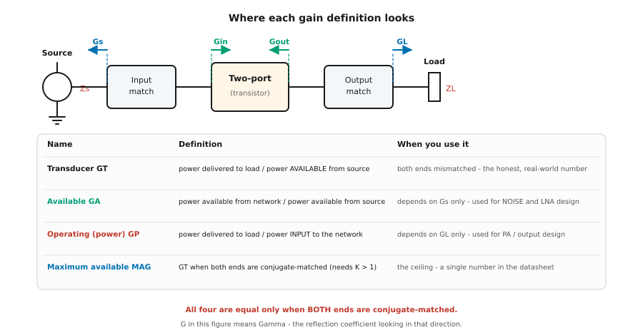
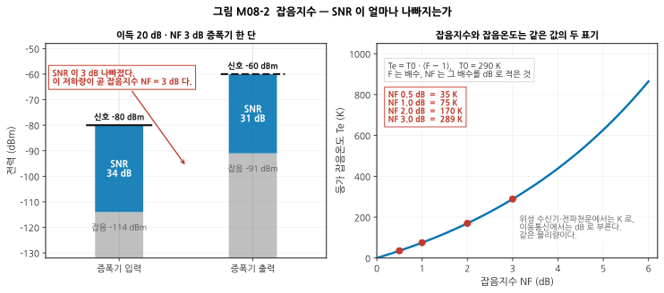
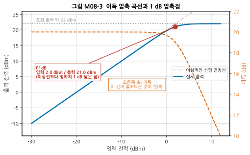
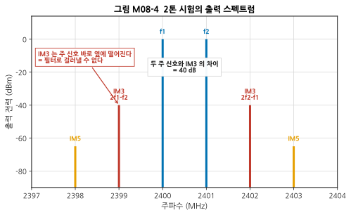
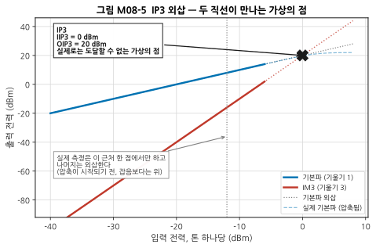
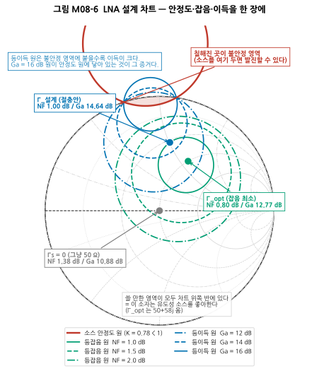
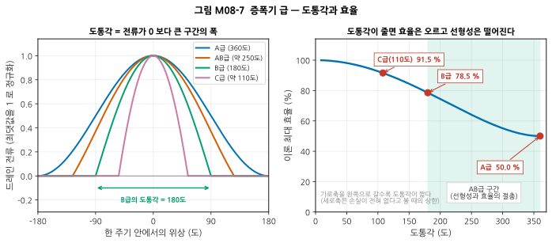
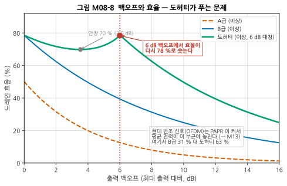
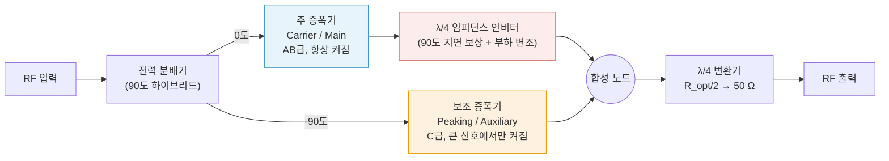
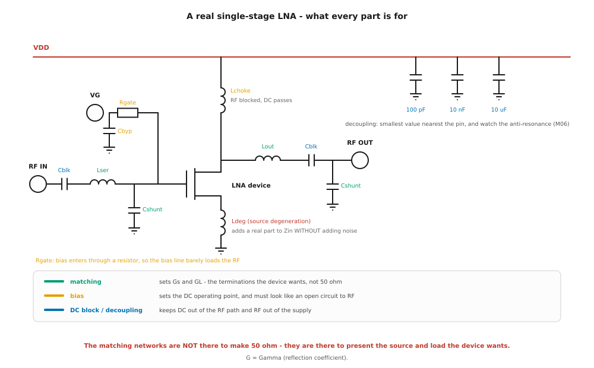

# M08 — 증폭기: 이득, 잡음, 선형성, 안정도

**문서 번호**: RF-CUR-M08 · **버전**: v1.0 · **분량**: 이론 6 h + 실습 6 h

| | |
|---|---|
| **선수 모듈** | [M07](./M07_필터와수동네트워크.md) (필터·수동 네트워크), [M03](./M03_S파라미터와스미스차트.md) (S-파라미터·스미스 차트), [M01](./M01_데시벨과전력.md) (dBm·열잡음 kTB) |
| **이 모듈이 소유하는 개념** | 전력 이득 4종(변환 이득 G_T, 가용 이득 G_A, 동작 이득 G_P, 최대 가용 이득 MAG), 잡음지수(NF)와 잡음온도(T_e), 최소 잡음지수 F_min·최적 소스 반사계수 Γ_opt·등가 잡음저항 R_n, 1 dB 압축점(P1dB)과 포화 출력, 하모닉 왜곡, 상호변조(IMD)와 IM3, 3차 교차점(IIP3/OIP3), 2차 교차점(IP2), 안정도(Rollett의 K 계수, μ 계수, 안정도 원, 안정화 기법), 증폭기 급(A/AB/B/C/E/F), 도허티 구조, 드레인 효율과 전력부가효율(PAE), 바이어스 회로와 열 설계, LNA와 PA의 설계 목표 차이 |
| **이 모듈을 쓰는 후속 모듈** | M09(믹서의 선형성 비교), M11(아키텍처별 증폭기 배치), **M12**(캐스케이드 예산 계산), **M13**(백오프·PAPR·DPD), **M15**(NF·P1dB·IP3 측정 절차), M16(발진 디버그와 튜닝) |
| **학습 목표** | ① 잡음지수와 이득이 왜 서로 다른 정합점을 요구하는지 설명하고, 둘 사이에서 설계점을 고른다 ② 데이터시트의 P1dB/OIP3에서 허용 입력 레벨과 왜곡 여유를 계산한다 ③ K > 1이 무엇을 보장하고 무엇을 보장하지 않는지 설명하고, 조건부 안정 소자를 안정화하되 그 대가를 정량화한다 |

---

## M08.0 이 모듈의 범위

이 문서는 커리큘럼에서 **가장 밀도가 높은 모듈**입니다. 뒤에 오는 세 모듈이 모두 여기의 정의를 가져다 씁니다. 그래서 이 모듈의 목표는 "증폭기를 설계하는 법"이 아니라 **"증폭기를 서술하는 언어를 정확히 갖는 것"** 입니다.

> ⚠️ **다른 모듈과의 역할 분리** — 같은 단어가 다시 나오더라도 층위가 다릅니다.
>
> | 개념 | M08 (여기) | M12 (예산) | M15 (측정) |
> |---|---|---|---|
> | 잡음지수 NF | **정의**. 한 단짜리 증폭기에서 SNR이 얼마나 나빠지는가 | 여러 단을 이었을 때의 **누적 계산**(Friis) | Y 계수법·차감법으로 **재는 법** |
> | P1dB / IP3 | **정의**와 물리적 원인 | 체인 전체의 IIP3 **합성** | 2톤 시험의 **절차와 함정** |
> | 스미스 차트 | 안정도 원·잡음 원·이득 원 **그리기** | — | M16에서 **실물 튜닝 궤적** |
>
> 또한 **로드풀(load-pull)** 은 M15가 소유합니다. 여기서는 "설계 목표 임피던스를 실측으로 찾는 방법이 따로 있다"는 사실만 언급합니다.

### 이 모듈의 흐름

밀도가 높으므로 먼저 지도를 그려 둡니다. 이 모듈은 **증폭기에 던지는 네 가지 질문**을 차례로 다룹니다.

| 질문 | 답하는 절 | 답이 되는 숫자 |
|---|---|---|
| **얼마나 키우나?** | §M08.1 이득 | G_T, G_A, G_P, MAG |
| **얼마나 더럽히나?** | §M08.2–3 잡음 | NF, T_e, F_min, Γ_opt, R_n |
| **얼마나 큰 신호까지 견디나?** | §M08.4–6 선형성 | P1dB, IP3, IM3 |
| **폭주하지는 않나?** | §M08.7 안정도 | K, μ, 안정도 원 |

그다음 **§M08.8 효율**과 **§M08.9 바이어스·열**이 "그래서 전기를 얼마나 먹고 얼마나 뜨거워지나"를 다루고, **§M08.10**에서 그 전부를 데이터시트 두 장으로 되짚습니다.

> 📖 **이 모듈이 답하는 질문** (참고 사이트 rfdh.com의 목록 중)
> - Large signal과 Small signal의 차이는? → §M08.4
> - 하모닉은 왜 생기는가? → §M08.5
> - Intermodulation의 정체 → §M08.5–6

---

## M08.1 이득 — "이득"이라고 말할 때 무엇을 말하는가

### 왜 이득이 네 가지나 되는가

직관부터 잡겠습니다. 증폭기의 이득을 재려면 **"들어간 전력"과 "나온 전력"** 을 정해야 합니다. 그런데 RF에서는 이 둘이 각각 두 가지 뜻을 가집니다.

- **들어간 전력**: 신호원이 *실제로 밀어 넣은* 전력인가, 아니면 신호원이 *줄 수 있었던 최대* 전력인가?
- **나온 전력**: 부하가 *실제로 받은* 전력인가, 아니면 증폭기가 *줄 수 있는 최대* 전력인가?

정합이 완벽하면 두 쌍이 각각 같아지므로 구별할 필요가 없습니다. 하지만 **실제 회로는 어딘가 반드시 정합이 어긋나 있습니다.** 그래서 이득이 갈라집니다.



*그림 M08-1. 네 가지 이득 정의가 각각 회로의 어디를 보는가. 위쪽 화살표 네 개는 반사계수를 보는 방향입니다(그림 안의 `G`는 Γ, 즉 반사계수를 뜻합니다). Γs는 정합회로에서 신호원 쪽을 본 것, Γ_in은 트랜지스터 입력을 본 것, Γ_out은 트랜지스터 출력을 본 것, Γ_L은 부하를 본 것입니다. 아래 표의 핵심은 **가용 이득 G_A는 Γs만으로 정해지고, 동작 이득 G_P는 Γ_L만으로 정해진다**는 점입니다. 그래서 잡음 설계(입력 쪽)에는 G_A를, 출력 설계에는 G_P를 씁니다.*

| 이득 | 정의 | 무엇에만 의존하나 | 언제 쓰나 |
|---|---|---|---|
| **변환 이득** (Transducer Gain, G_T) | 부하가 받은 전력 ÷ 신호원이 **줄 수 있었던** 전력 | Γs와 Γ_L 모두 | 실제로 측정되는 정직한 값. 벡터 회로망 분석기(Vector Network Analyzer, VNA)로 잰 \|S21\|²은 Γs = Γ_L = 0일 때의 G_T |
| **가용 이득** (Available Gain, G_A) | 증폭기가 **줄 수 있는** 전력 ÷ 신호원이 **줄 수 있었던** 전력 | **Γs만** | **잡음 설계**. 입력 쪽을 정하면 값이 정해지므로 잡음 원과 같은 평면에서 논할 수 있다 |
| **동작 이득** (Operating / Power Gain, G_P) | 부하가 받은 전력 ÷ 증폭기에 **실제로 들어간** 전력 | **Γ_L만** | **출력 설계**(PA). 부하를 정하면 값이 정해진다 |
| **최대 가용 이득** (Maximum Available Gain, MAG) | 양쪽 모두 켤레 정합했을 때의 G_T | (정합이 정해짐) | 데이터시트의 한 줄짜리 상한값. **K > 1일 때만 존재** |

> 📌 **네 값이 모두 같아지는 조건은 단 하나** — 입력과 출력이 **동시에 켤레 정합**되었을 때입니다. 그 외에는 항상 G_T ≤ G_A, G_T ≤ G_P 입니다.

### 초심자가 가장 자주 겪는 혼동

> ⚠️ **"데이터시트의 이득 18 dB인데 왜 내 보드에서는 15 dB인가?"**
>
> 데이터시트의 이득은 **50 Ω 시스템에서 잰 \|S21\|²** 입니다. 여러분의 보드에서 증폭기 앞뒤에 필터·배선·커넥터가 붙어 있으면 그것들이 Γs와 Γ_L을 50 Ω에서 밀어냅니다. 그러면 G_T가 떨어집니다. **증폭기가 고장 난 것이 아니라 이득의 정의가 바뀐 것**입니다.
>
> 확인 방법: 증폭기 입출력에서 S11·S22를 재 보십시오(→ [M05](./M05_첫측정.md)). 반사가 크면 그만큼 G_T가 깎입니다.

### 최대 가용 이득 MAG가 "존재하지 않을" 수 있다

MAG는 양쪽을 동시에 켤레 정합했다는 뜻인데, 소자가 **조건부 안정**(§M08.7)이면 그 정합점이 불안정 영역 안에 있을 수 있습니다. 그럴 때 MAG는 수학적으로 발산하고, 데이터시트는 대신 **MSG**(Maximum Stable Gain, 최대 안정 이득 = \|S21/S12\|)를 적습니다.

> 💡 **읽는 법**: 데이터시트에 MAG 대신 MSG가 적혀 있으면 **"이 소자는 그 주파수에서 조건부 안정이다"** 라는 뜻입니다. 안정도 원을 그려 볼 준비를 하십시오.

---

## M08.2 잡음지수 — 신호가 아니라 "신호 대 잡음비"의 문제

### 직관

증폭기는 신호를 키웁니다. 그런데 **들어온 잡음도 똑같이 키웁니다.** 그것만이라면 SNR(Signal-to-Noise Ratio, 신호 대 잡음비)은 변하지 않을 것입니다. 문제는 증폭기가 **자기 자신의 잡음을 새로 보탠다**는 데 있습니다. 그래서 나올 때의 SNR은 들어갈 때보다 반드시 나쁩니다.

**잡음지수(Noise Figure, NF)는 그 나빠진 양(dB)입니다.** 그게 전부입니다.



*그림 M08-2. 왼쪽: 이득 20 dB, NF 3 dB인 증폭기 한 단을 통과할 때 신호와 잡음이 각각 어떻게 되는가. 검은 가로선이 신호 레벨, 회색 막대가 잡음 바닥, 그 사이 파란 막대의 높이가 곧 SNR입니다. 신호는 20 dB 올라갔는데 잡음은 23 dB 올라갔습니다. 그 차이 3 dB가 곧 NF입니다. 잡음 바닥은 대역폭 1 MHz 기준으로 −174 dBm/Hz + 10·log₁₀(10⁶) = −114 dBm입니다(→ [M01](./M01_데시벨과전력.md)). 오른쪽: 같은 값을 켈빈(K)으로 적은 것이 잡음온도입니다. NF 3 dB는 곧 289 K입니다.*

### 정의

| 표기 | 정의 | 단위 |
|---|---|---|
| **잡음인자** (Noise Factor, F) | F = SNR_in / SNR_out (배수) | 무차원 (배수) |
| **잡음지수** (Noise Figure, NF) | NF = 10·log₁₀ F | dB |
| **등가 잡음온도** (Equivalent Noise Temperature, T_e) | T_e = T₀ · (F − 1), T₀ = 290 K | K (켈빈) |

세 가지는 **같은 물리량의 세 표기**입니다. 위성 수신기와 전파천문에서는 K를, 이동통신에서는 dB를 씁니다.

| NF (dB) | F (배수) | T_e (K) |
|---|---|---|
| 0.5 | 1.122 | 35.4 |
| 1.0 | 1.259 | 75.1 |
| 2.0 | 1.585 | 169.6 |
| 3.0 | 1.995 | 288.6 |
| 6.0 | 3.981 | 864.5 |

> ⚠️ **T₀ = 290 K는 "실온"이 아니라 약속입니다.** 290 K는 16.85 °C로, 실험실 온도(보통 23 °C ≈ 296 K)와 다릅니다. IEEE가 기준 온도로 정한 값이며, **모든 NF 사양이 이 값을 기준으로 계산**됩니다. 여러분의 장비가 25 °C에서 동작한다고 해서 NF를 고쳐 쓰면 안 됩니다.

> 💡 **왜 "NF"와 "F"를 굳이 구별하나** — 캐스케이드 계산(→ M12)에서는 **반드시 배수 F로 계산해야** 합니다. dB끼리 더하면 틀립니다. 이 둘을 섞는 것이 초심자의 1번 실수라 [부록 A §A.4](../03_부록/A_축약어_마스터목록.md)에 "혼동하기 쉬운 짝"으로 따로 정리해 두었습니다.

### 수동 소자의 잡음지수 — 손실이 곧 NF

감쇠기·필터·케이블처럼 **손실만 있는 부품의 NF는 그 손실(dB)과 같습니다.**

- 삽입손실 1.5 dB인 필터 → NF = 1.5 dB
- 3 dB 감쇠기 → NF = 3 dB

정확히 말하면 손실이 L배(예: 3 dB면 L = 2)이고 부품의 물리 온도가 T일 때

$$F = 1 + (L - 1)\frac{T}{T_0}$$

입니다. T = T₀ = 290 K이면 F = L, 즉 **NF(dB) = 손실(dB)** 이 됩니다. 실험실 온도(약 296 K)에서는 이 값이 조금 커집니다 — 3 dB 감쇠기라면 3.06 dB로, 0.05 dB 차이라 실무에서는 무시합니다. 반대로 **저온으로 식히면 손실이 있어도 NF가 낮아집니다** — 전파망원경의 수신기를 액체 헬륨으로 냉각하는 이유가 이것입니다.

> 📌 이것이 **"LNA를 안테나에 최대한 가까이 붙여라"** 는 규칙의 근거입니다. LNA 앞에 케이블 2 dB가 있으면, 그 2 dB는 시스템 NF에 거의 그대로 더해집니다. 정량적 계산은 M12에서 합니다.

### F_min과 Γ_opt — 잡음은 소스 임피던스에 따라 달라진다

여기가 이 절의 핵심이고, 초심자가 가장 놀라는 부분입니다.

> **트랜지스터의 잡음지수는 고정된 값이 아닙니다. 신호원 쪽 임피던스에 따라 달라집니다.**

왜냐하면 트랜지스터 내부의 잡음원(채널 열잡음, 게이트 유도 잡음 등)은 서로 상관관계가 있고, 그 상관을 **가장 잘 상쇄시키는 소스 임피던스가 하나 존재**하기 때문입니다. 그 지점에서 잡음지수가 최소가 됩니다.

이것을 네 개의 **잡음 파라미터**로 적습니다.

| 파라미터 | 뜻 |
|---|---|
| **F_min** | 최적 소스에서 얻는 최소 잡음지수 |
| **Γ_opt** (크기와 각도, 2개) | 그 최적 소스 반사계수 |
| **R_n** (등가 잡음저항, Ω) | Γ_opt에서 벗어났을 때 NF가 **얼마나 빨리 나빠지는가** |

$$F(\Gamma_s) = F_{min} + \frac{4 R_n / Z_0 \cdot |\Gamma_s - \Gamma_{opt}|^2}{(1 - |\Gamma_s|^2)\,|1 + \Gamma_{opt}|^2}$$

> 💡 **R_n을 읽는 법**: R_n이 크면 Γ_opt에서 조금만 벗어나도 NF가 급격히 나빠집니다(등잡음 원이 촘촘함). R_n이 작으면 여유가 있습니다. **정합 부품의 오차 허용범위를 정할 때 이 값을 봅니다.**

> ⚠️ **결정적인 사실**: 일반적으로 **Γ_opt ≠ Γ_in\*** 입니다. 즉 **잡음이 최소가 되는 소스와, 전력 전달이 최대가 되는 소스가 서로 다릅니다.** 이 충돌이 LNA 설계 전체를 지배합니다. 다음 절이 그 이야기입니다.

---

## M08.3 왜 LNA는 잡음 정합, PA는 전력 정합인가

| | **LNA** (Low Noise Amplifier, 저잡음 증폭기) | **PA** (Power Amplifier, 전력 증폭기) |
|---|---|---|
| 위치 | 수신 경로 **맨 앞** | 송신 경로 **맨 뒤** |
| 다루는 신호 | 아주 약함 (−100 dBm 수준) | 아주 강함 (+30 dBm 수준) |
| **최우선 목표** | **잡음을 적게 보태기** | **전력과 효율** |
| 입력 정합 목표 | **Γ_opt** (잡음 정합) | 이득·구동 편의 |
| 출력 정합 목표 | 이득·안정도 | **최적 부하 R_opt** (전력 정합, 켤레 정합 아님!) |
| 실패했을 때 | 감도가 나빠져 통신 거리가 줄어든다 | 출력이 안 나오거나 소자가 탄다, 스펙트럼 규제 위반 |

### LNA 쪽: 잡음과 이득의 줄다리기

앞 절에서 Γ_opt ≠ Γ_in\* 이라고 했습니다. 그러면 어느 쪽을 택해야 할까요? **둘 다 택하지 않습니다.** 실무에서는 그 사이 어딘가를 고릅니다. 그 "어딘가"를 눈으로 고르게 해 주는 도구가 §M08.7의 설계 차트입니다.

> 💡 **소스 축퇴 인덕터(source degeneration inductor)** — LNA 회로도에서 트랜지스터 소스(또는 이미터)에 작은 인덕터가 붙어 있는 것을 자주 봅니다. 이것은 **잡음을 더하지 않으면서 입력 임피던스에 실수 성분을 만들어 내는** 부품입니다. 이상적인 인덕터는 저항 성분이 없어 열잡음을 내지 않는데(→ [M01](./M01_데시벨과전력.md)의 kTB는 저항에서 나옵니다), 그 되먹임 효과로 Γ_in을 스미스 차트 위에서 회전시켜 **Γ_opt 근처로 끌고 옵니다.** 즉 **잡음 정합과 입력 정합을 동시에 만족시키는 유일한 실용적 수단**입니다. 회로도는 그림 M08-9에 있습니다.

### PA 쪽: "켤레 정합"이 답이 아닌 이유

> ⚠️ **PA 출력은 켤레 정합하지 않습니다.** 이것이 초심자에게 가장 반직관적인 사실입니다.

[M03](./M03_S파라미터와스미스차트.md)에서 배운 최대 전력 전달 정리(켤레 정합)는 **신호원이 선형이고 전압이 고정된 경우**의 이야기입니다. 그러나 PA의 트랜지스터는 **전압도 전류도 상한이 있는 소자**입니다.

- 드레인 전압은 전원 전압 V_DD를 넘어 크게 흔들릴 수 없습니다(넘으면 항복).
- 드레인 전류는 소자의 최대 전류 I_max를 넘을 수 없습니다.

따라서 최대 출력을 내려면 **전압 진폭이 상한에 닿는 동시에 전류 진폭도 상한에 닿는 부하**를 걸어야 합니다. 이것이 **최적 부하 저항** R_opt이며, 1차 근사로

$$R_{opt} \approx \frac{V_{DD} - V_{knee}}{I_{max}/2}$$

입니다(V_knee는 **니 전압(knee voltage)**, 즉 트랜지스터가 포화하기 시작하는 드레인 전압입니다). 이 값은 소자의 출력 임피던스의 켤레와 **일반적으로 다릅니다.**

> 📌 **실무 요약**: LNA 입력은 **잡음**이, PA 출력은 **전압·전류 한계**가 정합점을 정합니다. 두 경우 모두 "50 Ω으로 맞춘다"가 목표가 아닙니다. 50 Ω은 **바깥 세상과 만나는 지점의 약속**일 뿐입니다(→ [M02 §4](./M02_전송선로.md)).

> 💡 R_opt를 실측으로 찾는 방법이 **로드풀(load-pull)** 입니다. 부하 임피던스를 계통적으로 바꿔 가며 출력·효율을 기록해 등고선을 그립니다. **상세 절차는 M15가 소유**합니다.

---

## M08.4 선형성 I — 압축: 큰 신호에서 이득이 줄어든다

### Small signal과 Large signal의 차이

지금까지 쓴 S-파라미터는 모두 **소신호(small signal)** 개념입니다. "신호가 충분히 작아서 소자의 동작점이 흔들리지 않는다"는 가정이 깔려 있습니다. 그 가정 아래에서는 이득이 입력 크기와 무관한 상수입니다.

신호가 커지면 그 가정이 깨집니다. 드레인 전압이 전원 전압에 닿거나 전류가 0에 닿으면 파형의 꼭대기가 잘려 나갑니다. **그 순간부터 출력은 입력에 비례해 커지지 않습니다.** 이것이 **대신호(large signal)** 영역입니다.

| | 소신호 (small signal) | 대신호 (large signal) |
|---|---|---|
| 가정 | 동작점이 흔들리지 않음 | 동작점이 신호에 따라 움직임 |
| 서술 도구 | **S-파라미터**, 잡음 파라미터 | **P1dB, IP3, 하모닉, ACLR**(Adjacent Channel Leakage Ratio, 인접채널 누설비 → M13), 로드풀 데이터 |
| 해석 방법 | 선형 회로 해석 | 조화균형(harmonic balance) 등 비선형 해석 |
| 관심 대상 | LNA, 수신 경로 앞단 | PA, 송신 경로, 강한 간섭을 받는 수신기 |

> 📌 **경계는 소자마다 다릅니다.** 같은 −20 dBm 입력이 LNA에게는 대신호이고 PA에게는 소신호입니다. "얼마부터 대신호인가"를 알려 주는 숫자가 다음의 P1dB입니다.

### 1 dB 압축점 (P1dB)



*그림 M08-3. 이득 압축 곡선과 1 dB 압축점. 가로축은 입력 전력(dBm), 세로축은 출력 전력(dBm)입니다. 점선은 "이득이 계속 20 dB였다면"이라는 이상적 연장선이고, 파란 실선이 실제 출력입니다. 두 선의 간격이 정확히 1 dB가 되는 점이 **P1dB**로, 이 예에서는 입력 2.0 dBm / 출력 21.0 dBm입니다. 오른쪽 축의 주황 점선은 이득 자체이며, 이 값이 20 dB에서 19 dB로 떨어지는 것이 곧 "1 dB 압축"입니다.*

| 표기 | 뜻 | 주의 |
|---|---|---|
| **IP1dB** (Input P1dB) | 압축이 1 dB 일어나는 **입력** 전력 | 수신기 설계에서 "얼마나 센 신호까지 견디나" |
| **OP1dB** (Output P1dB) | 그때의 **출력** 전력 | 송신기 설계에서 "얼마나 낼 수 있나" |
| **P_sat** (포화 출력) | 입력을 아무리 올려도 더 안 올라가는 상한 | 보통 OP1dB보다 1~3 dB 위 |

> ⚠️ **OP1dB = IP1dB + 이득이 아닙니다.** 정확히는 OP1dB = IP1dB + (이득 − 1 dB)입니다. 압축점에서는 이미 이득이 1 dB 줄어 있기 때문입니다. 이 예에서 2.0 + 20 − 1 = 21.0 dBm으로 맞습니다.

> 📌 **수신기에서 압축이 왜 문제인가** — 송신기에서는 "출력이 안 나온다"로 끝나지만, 수신기에서는 더 고약합니다. 강한 간섭 신호 하나가 LNA를 압축시키면 **그 순간 원하는 약한 신호의 이득까지 함께 줄어듭니다.** 신호는 안 들리는데 잡음 바닥은 그대로여서, 결과적으로 감도가 나빠집니다. 이것을 **감도 저하(desensitization, 흔히 "desense")** 라 부릅니다. 그래서 수신기 설계에서는 IP1dB를 **"견딜 수 있는 최대 간섭 세기"** 로 읽습니다.

> 💡 **왜 하필 1 dB인가** — 물리적 의미는 없습니다. **비교 가능한 지점을 하나 정해 두자는 산업계의 약속**입니다. 3 dB 압축점을 쓰는 데이터시트도 있으므로, 값을 비교할 때는 반드시 어느 기준인지 확인하십시오.

---

## M08.5 선형성 II — 하모닉과 상호변조

### 하모닉은 왜 생기는가

증폭기의 입출력 관계를 급수로 적어 보면 답이 바로 나옵니다.

$$v_{out} = a_1 v_{in} + a_2 v_{in}^2 + a_3 v_{in}^3 + \cdots$$

완벽히 선형이면 a₂ = a₃ = ⋯ = 0 이지만, 실제 소자는 그렇지 않습니다. 이제 입력에 주파수 f 하나만 넣어 봅니다. v_in = A·cos(2πft) 라면,

- **a₂ 항**: cos²θ = (1 + cos 2θ)/2 → **직류 성분과 2f**가 생깁니다.
- **a₃ 항**: cos³θ = (3cos θ + cos 3θ)/4 → **f 자신(이득에 더해짐)과 3f**가 생깁니다.

즉 **하모닉은 소자의 비선형성이 만드는 필연**입니다. 삼각함수 항등식 그 자체입니다.

> 💡 **a₃ 항이 f 자신에도 기여한다**는 점에 주목하십시오. 그 기여의 부호가 보통 음수라서 입력이 커질수록 기본파 이득이 **줄어듭니다.** §M08.4의 압축은 여기서 나옵니다. 압축과 하모닉은 **같은 원인의 두 얼굴**입니다.

> 📌 **하모닉은 다행히 멀리 있습니다.** 2.4 GHz의 2차 하모닉은 4.8 GHz입니다. **저역 통과 필터 하나로 지울 수 있습니다**(→ [M07](./M07_필터와수동네트워크.md)). 그래서 송신단 마지막에는 거의 항상 LPF가 있습니다.

### 상호변조 — 필터로 지울 수 없는 것

이번에는 주파수가 가까운 두 신호 f₁, f₂를 동시에 넣습니다. 이때 생기는 왜곡을 **상호변조 왜곡(Intermodulation Distortion, IMD)** 이라 합니다. 실제 무선 환경에서는 늘 일어나는 일입니다.

a₃ 항 (v₁ + v₂)³을 전개하면 다음 주파수들이 나옵니다.

| 성분 | 주파수 | 어디에 떨어지나 |
|---|---|---|
| 기본파 | f₁, f₂ | 원래 자리 |
| 3차 하모닉 | 3f₁, 3f₂ | 아주 멀리 |
| **3차 상호변조 (IM3)** | **2f₁ − f₂, 2f₂ − f₁** | **f₁, f₂ 바로 옆** |
| 기타 | f₁ + 2f₂ 등 | 멀리 |



*그림 M08-4. 2톤 시험의 출력 스펙트럼. 가로축은 주파수(MHz), 세로축은 출력 전력(dBm)입니다. 2400 MHz와 2401 MHz의 두 신호를 넣으면 IM3가 2399 MHz와 2402 MHz에, 즉 **주 신호 바로 바깥쪽 1 MHz 지점**에 생깁니다. IM5는 그보다 1 MHz씩 더 바깥입니다. 이 예에서 IM3는 주 신호보다 40 dB 아래입니다.*

> ⚠️ **여기가 이 절의 요점입니다.** f₁ = 2400 MHz, f₂ = 2401 MHz라면 2f₁ − f₂ = **2399 MHz**입니다. **주 신호에서 겨우 1 MHz 떨어진 곳**입니다.
>
> 필터로 지우려면 통과대역 바로 옆 1 MHz에서 급격히 떨어지는 필터가 필요한데, [M07 §3](./M07_필터와수동네트워크.md)에서 봤듯 그런 필터는 **만들 수 없거나, 만들면 통과대역까지 망칩니다.**
>
> **결론: IM3는 필터로 해결하는 문제가 아니라, 증폭기의 선형성으로 해결하는 문제입니다.** 이것이 선형성 사양이 존재하는 이유 전부입니다.

### 3차의 마법 같은 기울기 3

IM3의 크기에는 아주 유용한 규칙이 있습니다. **입력을 1 dB 올리면 주 신호는 1 dB 올라가지만 IM3는 3 dB 올라갑니다.** (a₃ 항이 진폭의 세제곱에 비례하므로 dB로는 3배 기울기)

따라서 **주 신호와 IM3의 간격은 입력을 1 dB 올릴 때마다 2 dB씩 좁아집니다.** 이 규칙이 다음 절의 IP3를 낳습니다.

> 💡 **2차 상호변조(IM2)** 도 있습니다. f₂ − f₁, f₂ + f₁ 위치이며 기울기는 2입니다. 대역폭이 좁은 시스템에서는 멀리 떨어져 필터로 지울 수 있지만, **광대역 수신기나 직접변환(zero-IF) 수신기에서는 f₂ − f₁이 곧바로 기저대역에 떨어져 치명적**입니다(→ M11). 그래서 IP2 사양이 따로 있습니다.

---

## M08.6 IP3 — 실재하지 않는 점으로 실재하는 성능을 적는 법

### 정의

주 신호는 기울기 1로, IM3는 기울기 3으로 올라갑니다. 두 직선을 **압축이 없다고 가정하고 계속 연장하면** 언젠가 만납니다. 그 교차점이 **3차 교차점(Third-order Intercept Point, IP3)** 입니다.



*그림 M08-5. IP3는 두 직선을 외삽해서 만든 가상의 점입니다. 가로축은 톤 하나당 입력 전력(dBm), 세로축은 출력 전력(dBm)입니다. 실선 구간은 실제로 측정 가능한 영역이고, 점선은 외삽입니다. 파란 파선(실제 기본파)이 보여 주듯 **실제 증폭기는 IP3에 도달하기 훨씬 전에 압축되어 버립니다.** 그래서 IP3는 "여기까지 낼 수 있다"는 뜻이 아니라 **"저차 영역에서의 왜곡 기울기를 하나의 숫자로 요약한 것"** 입니다.*

| 표기 | 뜻 |
|---|---|
| **IIP3** (Input IP3) | 교차점을 **입력** 기준으로 적은 값 |
| **OIP3** (Output IP3) | 같은 점을 **출력** 기준으로 적은 값. OIP3 = IIP3 + 이득 |

> ⚠️ **IIP3와 OIP3를 섞으면 계산이 이득만큼 어긋납니다.** 데이터시트에 그냥 "IP3"라고만 적혀 있으면 값의 크기로 짐작하지 말고 반드시 확인하십시오. 캐스케이드 계산(M12)은 **IIP3로 합니다.**

### 실무 공식 세 줄

측정에서 바로 쓰는 관계입니다. 모두 dB/dBm 단위입니다.

| 구하려는 것 | 공식 |
|---|---|
| 2톤 측정에서 IIP3 | **IIP3 = P_in(톤 하나) + Δ/2**, Δ = (주 신호 − IM3) [dB] |
| 임의 출력에서의 IM3 절대 레벨 | **P_IM3 = 3·P_out − 2·OIP3** |
| 주 신호 대비 IM3 간격 | **Δ = 2·(OIP3 − P_out)** |

> 💡 **첫 번째 식은 왜 Δ/2인가** — §M08.5에서 본 기울기에서 곧바로 나옵니다. 입력을 1 dB 올리면 주 신호는 1 dB, IM3는 3 dB 올라가므로 **둘의 간격 Δ는 1 dB 입력당 2 dB씩 줄어듭니다.** 간격이 0이 되는 지점(= IP3)까지 가려면 입력을 Δ/2 만큼 더 올려야 합니다. 그래서 IIP3 = P_in + Δ/2 입니다. **외울 필요 없이 그림 M08-5의 두 직선을 보면 됩니다.**

**검산 예** (그림 M08-4의 값): 톤 하나당 입력 −20 dBm, 이득 20 dB → P_out = 0 dBm. OIP3 = 20 dBm이면 Δ = 2 × (20 − 0) = 40 dB, P_IM3 = 3×0 − 2×20 = −40 dBm. 그림과 일치합니다. IIP3 = −20 + 40/2 = 0 dBm이고, OIP3 − 이득 = 20 − 20 = 0 dBm으로 같습니다.

### P1dB와 IP3의 관계 — 흔한 오해

"OIP3는 OP1dB보다 약 10 dB 위"라는 어림이 널리 쓰입니다. 이 숫자는 어디서 왔을까요?

3차 항만 있는 가장 단순한 모델(v_out = a₁v + a₃v³)로 계산하면 정확히 나옵니다.

- 1 dB 압축: 기본파 이득이 10^(−1/20) = 0.8913배가 될 때 → A²_1dB · \|a₃\|/a₁ = 0.14500
- IP3: 기본파와 IM3가 같아질 때 → A²_IP3 · \|a₃\|/a₁ = 4/3 = 1.33333
- 비율 = 9.1955배 = **9.64 dB**

> ⚠️ **그러나 이것은 어림일 뿐 법칙이 아닙니다.** 실제 소자에서 이 차이는 5 dB부터 20 dB까지 벌어집니다. 이유는 (1) 5차 이상의 항이 있고, (2) 바이어스 회로가 f₂ − f₁ 성분을 어떻게 처리하느냐가 IP3에만 영향을 주기 때문입니다. **어림값은 데이터시트가 이상해 보일 때의 검산용으로만 쓰고, 설계 근거로 삼지 마십시오.**

---

## M08.7 안정도 — 증폭기가 발진기가 되지 않게

### 무엇이 문제인가

증폭기는 이득이 있는 소자입니다. 출력의 일부가 어떤 경로로든 입력으로 되돌아오고, 그 되돌아온 신호가 원래 신호와 위상이 맞으면 **입력이 없어도 스스로 신호를 만들어 냅니다.** 그것이 발진입니다.

RF에서 되먹임 경로는 회로도에 그려져 있지 않아도 존재합니다. **S12가 0이 아니라는 사실 자체**가 소자 내부에 되먹임이 있다는 뜻입니다.

### 판정 조건 — 무엇을 보장하고 무엇을 보장하지 않는가

**정의**: 어떤 **수동** 소스(\|Γs\| ≤ 1)와 어떤 **수동** 부하(\|Γ_L\| ≤ 1)를 붙여도 발진하지 않으면 **무조건 안정(unconditionally stable)**, 그렇지 않으면 **조건부 안정(conditionally stable)** 입니다.

| 판정법 | 조건 | 특징 |
|---|---|---|
| **Rollett의 K 계수** | **K > 1 이고 \|Δ\| < 1** (둘 다 필요) | 가장 널리 쓰임. **두 조건을 함께 봐야 함** |
| **μ 계수** | **μ > 1** (하나면 충분) | 필요충분조건 하나짜리. 값이 클수록 안정 여유가 큼 |

$$\Delta = S_{11}S_{22} - S_{12}S_{21}, \qquad K = \frac{1 - |S_{11}|^2 - |S_{22}|^2 + |\Delta|^2}{2\,|S_{12}S_{21}|}$$

$$\mu = \frac{1 - |S_{11}|^2}{|S_{22} - \Delta S_{11}^*| + |S_{12}S_{21}|}$$

> 💡 **μ 식을 읽는 법** — 위 식은 **모든 수동 부하**(\|Γ_L\| ≤ 1)를 훑어보는 판정입니다. S11과 S22를 서로 바꾸면 **모든 수동 소스**를 훑는 μ′가 되는데, **둘 중 하나만 1을 넘으면 무조건 안정**이므로 하나만 계산해도 충분합니다. (이 절의 예제 소자는 μ = 0.879, μ′ = 0.922로 둘 다 1 미만입니다.)

> ⚠️ **"K > 1이니까 안전하다"가 틀리는 세 가지 경우** — 이 모듈의 학습 목표 ③입니다.
>
> 1. **\|Δ\| < 1을 확인하지 않았다.** K > 1만으로는 무조건 안정이 아닙니다. 두 조건이 함께 필요합니다. μ를 쓰면 이 실수를 원천적으로 막을 수 있습니다.
> 2. **잰 주파수에서만 K > 1이다.** 안정도는 **모든 주파수에서** 확인해야 합니다. 2.4 GHz에서 안정한 소자가 300 MHz에서 불안정한 경우는 흔합니다. 저주파에서 트랜지스터의 이득이 훨씬 크기 때문입니다. **데이터시트 대역 밖에서 발진하는 사고가 실제로 가장 많습니다.**
> 3. **"수동 종단"이라는 전제가 실제로 깨진다.** K 판정은 \|Γ\| ≤ 1을 가정합니다. 그런데 앞단이 또 다른 증폭기이거나, 바이어스 회로가 특정 주파수에서 부성저항처럼 보이면 그 전제가 무너집니다.

### 안정도 원 — 조건부 안정 소자를 다루는 법

조건부 안정이라고 해서 쓸 수 없는 것은 아닙니다. **"어떤 종단이 위험한가"를 지도로 그려서 피해 가면 됩니다.** 그 지도가 안정도 원입니다.

- **소스 안정도 원**: 이 원 위의 Γs에서 \|Γ_out\| = 1 이 됩니다. 원의 한쪽이 불안정 영역입니다.
- **부하 안정도 원**: 이 원 위의 Γ_L에서 \|Γ_in\| = 1 이 됩니다.

**어느 쪽이 불안정인지 판정하는 법** — 확실한 기준점 하나를 잡고 거기서 출발합니다.

- **소스 안정도 원**(Γs 평면): Γs = 0을 넣으면 Γ_out = S22 입니다. 그러므로 **\|S22\| < 1이면 차트 중심(그냥 50 Ω)이 안전**하고, 중심이 들어 있는 쪽이 안정 영역입니다.
- **부하 안정도 원**(Γ_L 평면): Γ_L = 0을 넣으면 Γ_in = S11 입니다. 그러므로 **\|S11\| < 1이면 차트 중심이 안전**합니다.

> ⚠️ **두 조건을 바꿔 쓰면 위험 영역과 안전 영역이 뒤집힙니다.** 소스 평면은 S22를, 부하 평면은 S11을 봅니다. 헷갈리면 외우지 말고 **Γ = 0을 식에 직접 대입**하십시오. 한 줄이면 확인됩니다.

(\|S22\| > 1인 소자, 즉 아무것도 안 붙여도 이미 불안정한 소자라면 판정이 반대가 됩니다.)

### 설계 차트 — 세 가지를 한 장에 겹쳐 보기



*그림 M08-6. 하나의 예제 트랜지스터(K = 0.78, 조건부 안정)에 대해 소스 평면(Γs 평면)에 세 종류의 원을 겹쳐 그린 것입니다. **빨간 원**이 소스 안정도 원이고 칠해진 안쪽이 불안정 영역, **초록 원**들이 등잡음 원(NF = 1.0 / 1.5 / 2.0 dB), **파란 원**들이 등가용이득 원(G_A = 12 / 14 / 16 dB)입니다. 세 개의 점은 각각 (1) 그냥 50 Ω, (2) 잡음 최소점 Γ_opt, (3) 절충안입니다. **읽는 법**: 원 하나 위의 모든 점은 같은 NF(또는 같은 이득)를 줍니다. 설계란 이 원들 사이에서 한 점을 고르는 일입니다.*

이 예제 소자의 세 후보를 비교하면 다음과 같습니다.

| 소스 선택 | Γs | 소스 임피던스 | NF | G_A | 평가 |
|---|---|---|---|---|---|
| 그냥 50 Ω | 0 | 50 Ω | 1.38 dB | 10.88 dB | 둘 다 나쁘다 |
| **Γ_opt** (잡음 최소) | 0.50 ∠60° | 50 + 58j Ω | **0.80 dB** | 12.77 dB | 잡음은 최소지만 이득을 버린다 |
| **절충안** | 0.60 ∠81° | 27 + 50j Ω | 1.00 dB | **14.64 dB** | 잡음 0.20 dB를 내주고 이득 **1.87 dB**를 산다 |

> 📌 **이 표가 이 모듈의 핵심 메시지입니다.** 잡음 0.2 dB를 양보하면 이득 1.9 dB를 얻습니다. 그리고 이득이 커지면 **뒷단의 잡음 기여가 줄어들어**(→ M12의 Friis 식) 시스템 전체 NF는 오히려 좋아질 수 있습니다. **한 단만 보면 Γ_opt가 정답이지만, 시스템으로 보면 아닐 수 있습니다.**

> ⚠️ 그림에서 **G_A = 16 dB 원이 불안정 영역에 닿아 있는 것**을 보십시오. **이득을 더 짜내려 할수록 불안정 영역에 가까워집니다.** 이것은 우연이 아니라 안정도 원과 이득 원의 수학적 관계입니다. "이득 욕심"이 곧 "발진 위험"입니다.

### 안정화 기법과 그 대가

조건부 안정 소자를 무조건 안정으로 만드는 방법은 결국 하나입니다. **어딘가에서 손실을 만들어 되먹임 고리의 이득을 1 아래로 떨어뜨리는 것.** 공짜가 아닙니다.

| 기법 | 어디에 | 대가 |
|---|---|---|
| 직렬 저항 | 입력 또는 출력 신호 경로에 | 이득 감소. **입력에 넣으면 NF가 그 손실만큼 나빠진다** |
| 병렬 저항 | 신호 경로와 접지 사이에 | 이득 감소, 정합 변화 |
| 손실성 정합 회로 | 정합망 안에 저항을 섞어 | 이득 감소, 대역폭은 오히려 넓어짐 |
| RC 병렬 안정화 | 저주파에서만 손실이 생기게 | **저주파 발진 대책으로 가장 실용적** |

> 📌 **LNA의 철칙: 안정화는 출력 쪽에서 하라.** 입력 저항의 열잡음은 뒤에서 전부 증폭되어 NF에 그대로 더해집니다. 출력 저항은 이미 증폭된 신호 뒤에 있으므로 NF에 거의 영향이 없습니다. **§M08.L의 L08-a에서 이 차이를 직접 계산합니다.**

---

## M08.8 증폭기 급과 효율

### 도통각이 모든 것을 정한다

증폭기의 "급(class)"은 결국 하나의 질문에 대한 답입니다. **"신호 한 주기 중 트랜지스터가 얼마 동안 켜져 있는가?"** 이 각도를 **도통각(conduction angle)** 이라 합니다.



*그림 M08-7. 왼쪽: 급별 드레인 전류 파형. 가로축은 한 주기 안에서의 위상(도), 세로축은 최댓값을 1로 정규화한 전류입니다. A급은 360도 내내 켜져 있고, C급은 110도만 켜져 있습니다. 오른쪽: 도통각과 이론 최대 효율의 관계입니다. **도통각이 줄면 효율은 오르지만 파형이 더 심하게 잘려 선형성이 나빠집니다.** 세로축은 손실이 전혀 없다고 볼 때의 상한이므로 실제 값은 이보다 낮습니다.*

| 급 | 도통각 | 이론 최대 효율 | 선형성 | 쓰이는 곳 |
|---|---|---|---|---|
| **A** | 360° | **50.0 %** | 가장 좋음 | 소신호 증폭, 계측용, 드라이버 |
| **AB** | 180°~360° | 50~78.5 % (250°에서 63.6 %) | 좋음 | **이동통신 PA의 기본 선택** |
| **B** | 180° | **78.5 %** (π/4) | 보통 (교차 왜곡) | 푸시풀 구성 |
| **C** | < 180° | 78.5~100 % (110°에서 91.5 %) | 나쁨 | **정포락선 신호 전용** (FM, 레이더) |

> ⚠️ **C급은 대부분의 현대 통신에 쓸 수 없습니다.** LTE·5G·Wi-Fi는 진폭이 계속 변하는 신호를 쓰는데, C급은 진폭 정보를 파괴합니다. C급이 쓰이는 곳은 진폭이 일정한 신호(주파수변조(Frequency Modulation, FM) 방송, 일부 레이더)뿐입니다.

> 💡 **스위칭 급(D/E/F)** 은 발상이 다릅니다. 트랜지스터를 **증폭기가 아니라 스위치로** 씁니다. 이상적인 스위치는 켜졌을 때 전압이 0, 꺼졌을 때 전류가 0이므로 소비 전력이 0입니다. 이론 효율 100 %입니다. 대신 출력이 사각파에 가까워 하모닉 종단 회로가 반드시 필요하고, **진폭 정보를 전혀 전달하지 못합니다.** 그래서 그 자체로는 선형 통신에 못 쓰고, 포락선 추적(ET)이나 극좌표 변조와 묶어서 씁니다(→ M13).

### 효율 두 가지 — 드레인 효율과 PAE

| 이름 | 정의 | 언제 다른가 |
|---|---|---|
| **드레인 효율** (Drain Efficiency, DE) | P_out / P_DC | — |
| **전력부가효율** (Power Added Efficiency, PAE) | **(P_out − P_in) / P_DC** | 이득이 낮을수록 DE보다 많이 낮아짐 |

PAE는 "**증폭기가 실제로 보탠** 전력"만 세기 때문에 더 정직한 지표입니다.

**수치로 보면**: 출력 31 dBm(1.26 W), P_DC 3.14 W인 PA를 생각합니다. 드레인 효율은 40.0 %로 고정입니다.

- 이득이 **30 dB**이면 P_in = 1.26 mW → PAE = 40.0 % (차이 거의 없음)
- 이득이 **10 dB**뿐이면 P_in = 126 mW → PAE = **36.0 %** (4 포인트 손해)

> 📌 **밀리미터파에서 PAE와 DE의 차이가 커지는 이유**가 이것입니다. 주파수가 높아지면 소자 이득이 낮아지고, 낮은 이득은 곧 PAE 손실입니다.

### 백오프 문제와 도허티

여기가 현대 PA 설계의 중심 문제입니다.

앞의 효율 값들은 모두 **최대 출력에서**의 값입니다. 그런데 LTE·5G·Wi-Fi가 쓰는 직교 주파수 분할 다중(Orthogonal Frequency Division Multiplexing, OFDM) 신호는 **피크 대 평균 전력비(Peak-to-Average Power Ratio, PAPR)** 가 8~12 dB나 됩니다. 피크에서 압축되지 않으려면 **평균 출력을 최대치보다 8~12 dB 낮춰서** 써야 합니다. 이것이 **백오프(back-off)** 입니다.

문제는 고전적인 증폭기의 효율이 백오프에서 급격히 떨어진다는 것입니다.



*그림 M08-8. 가로축은 최대 출력 대비 백오프(dB), 세로축은 드레인 효율(%)입니다. B급(파란 실선)은 백오프에 비례해 효율이 떨어지지만, **도허티(초록 굵은 선)는 6 dB 백오프에서 효율이 다시 78 %로 솟습니다.** 그 사이 3.5 dB 부근에서 70 %까지 살짝 내려앉는 것이 도허티 곡선의 '안장'입니다. 8 dB 백오프에서 B급은 31 %, 도허티는 63 %입니다 — **전력 소모가 절반**입니다.*

**도허티(Doherty) 증폭기**는 이 문제를 부하 변조(load modulation)로 풉니다.



*그림 M08-10. 대칭 도허티 증폭기의 구조. 작은 신호에서는 보조 증폭기가 꺼져 있어 주 증폭기가 **2배 높은 부하 저항**을 보고, 그 덕분에 낮은 출력에서도 전압이 포화해 효율이 높습니다. 신호가 커지면 보조 증폭기가 켜지면서 합성 노드에 전류를 보태고, 그러면 **주 증폭기가 보는 부하가 낮아져(부하 변조)** 더 많은 전류를 낼 수 있게 됩니다. λ/4 인버터는 이 부하 변조를 만드는 부품이자, 분배기가 준 90도 위상차를 되돌리는 부품입니다.*

**효율식** (이상적 대칭 도허티, x = 정규화 출력 전압 진폭, 1이 최대 출력):

$$\eta = \begin{cases} \dfrac{\pi}{2}\,x & x \le 0.5 \ (\text{백오프} \ge 6\ \mathrm{dB}) \\[8pt] \dfrac{\pi}{2}\cdot\dfrac{x^2}{3x-1} & x \ge 0.5 \end{cases}$$

두 식은 x = 0.5에서 값이 같고(연속), x = 1과 x = 0.5에서 모두 π/4 = 78.54 %로 최대가 됩니다.

> ⚠️ **도허티는 만능이 아닙니다.** (1) 효율 피크가 6 dB 백오프에 고정되어 있어 PAPR이 10 dB를 넘는 신호에는 부족합니다(비대칭 도허티·3-way 도허티로 확장). (2) λ/4 선로가 주파수에 의존하므로 **대역폭이 좁습니다.** (3) 두 증폭기의 위상·진폭 정합이 어긋나면 성능이 급락합니다. (4) 부하 변조 때문에 **선형성이 나빠져 디지털 사전왜곡(DPD)이 거의 필수**입니다(→ M13).

---

## M08.9 바이어스 회로와 열 — 회로도에서 RF가 아닌 부분

### 회로도 읽기



*그림 M08-9. 단일 단 LNA의 실제 회로도. 초록은 정합, 주황은 바이어스, 파랑은 직류 차단·디커플링 부품입니다. **읽는 법**: 신호는 왼쪽 RF IN에서 들어와 Cblk(직류 차단)→Lser/Cshunt(입력 정합)→트랜지스터→Lout/Cshunt(출력 정합)→Cblk→RF OUT으로 갑니다. 직류는 VDD에서 Lchoke(RF 차단, 직류 통과)를 통해 드레인으로, VG에서 Rgate를 통해 게이트로 갑니다. **두 경로가 서로를 방해하지 않게 만드는 것이 바이어스 설계의 전부**입니다.*

| 부품 | 역할 | 고르는 기준 |
|---|---|---|
| **Cblk** (직류 차단) | 직류를 막고 RF는 통과 | 동작 주파수에서 임피던스가 충분히 낮을 것. **자기공진주파수(SRF)가 동작 주파수보다 위여야 함**(→ [M06](./M06_수동소자와공진.md)) |
| **Lchoke** (RF 초크) | 직류는 통과, RF는 차단 | 동작 주파수에서 임피던스가 충분히 높을 것. 실무에서는 λ/4 선로로 대신하기도 함 |
| **Rgate** | 게이트 바이어스를 공급 | 크게(수 kΩ) — RF를 거의 안 잡아먹게. **저주파 안정화에도 기여** |
| **Cbyp** (바이패스) | 바이어스 선을 RF적으로 접지 | 여러 값을 병렬로 |
| **디커플링 커패시터** | 전원의 RF 잡음 차단, 순간 전류 공급 | **작은 값을 핀에 가장 가까이.** 값이 다른 커패시터를 병렬로 놓으면 그 사이에 **반공진**이 생기므로 M06의 주의사항을 반드시 볼 것 |
| **Ldeg** (소스 축퇴) | 잡음을 더하지 않고 입력 임피던스에 실수 성분 생성 | 값이 크면 이득 감소, 작으면 효과 부족 |

> ⚠️ **초심자가 가장 자주 만드는 사고**: 디커플링 커패시터를 "많이 붙일수록 좋다"고 생각해 100 pF / 10 nF / 10 µF를 잔뜩 병렬로 놓는 것입니다. **서로 다른 값의 커패시터 사이에는 반공진(anti-resonance)이 생겨 그 주파수에서 임피던스가 오히려 치솟습니다.** 그 주파수가 증폭기의 이득이 큰 저주파 영역에 걸리면 **발진합니다.** M06에서 이미 다룬 내용이며, 여기가 그 지식이 실제로 쓰이는 자리입니다.

### 바이어스는 왜 "온도"와 함께 이야기되는가

트랜지스터의 전달 특성은 온도에 따라 움직입니다. 게이트 전압을 고정해 두면 온도가 오를 때 전류가 늘고, 전류가 늘면 발열이 늘고, 그러면 온도가 더 오릅니다. **열폭주(thermal runaway)** 입니다.

| 대책 | 원리 |
|---|---|
| **능동 바이어스 회로** | 전류를 되먹임해 일정하게 유지 |
| **소스/이미터 저항** | 전류가 늘면 소스 전압이 올라 게이트-소스 전압을 줄임 (자기 안정화) |
| **온도 보상 소자** | 다이오드·서미스터로 반대 방향 드리프트를 만듦 |

### 열 계산 — 반드시 해야 하는 세 줄

PA 설계에서 **버려지는 열은 출력보다 큰 경우가 많습니다.**

$$P_{diss} = P_{DC} + P_{in} - P_{out}$$

$$T_j = T_{case} + \theta_{JC} \cdot P_{diss}$$

**예제**: 앞의 PA(P_DC 3.14 W, P_out 1.26 W, P_in 1.3 mW)라면 P_diss = 1.89 W입니다. **출력(1.26 W)보다 열(1.89 W)이 더 많습니다.** θ_JC = 8 °C/W이고 케이스가 70 °C라면 접합 온도 T_j = 70 + 8 × 1.89 = **85 °C**입니다. 케이스가 85 °C까지 오르면 T_j = 100 °C가 됩니다.

> 📌 **이 계산은 선택이 아닙니다.** 데이터시트의 최대 접합 온도(보통 150~175 °C)를 넘으면 소자가 즉시 죽거나 수명이 급격히 짧아집니다. **보드 설계(→ M17)에서 열 비아와 구리 면적을 정하는 근거가 이 세 줄입니다.**

---

## M08.10 데이터시트 해부

아래 두 표는 **교육용으로 구성한 예시**이며 특정 실제 제품이 아닙니다. 값의 조합은 실제 부품에서 흔히 보는 범위로 맞췄습니다. 실제 부품 선정 시에는 반드시 제조사 데이터시트를 직접 확인하십시오.

### 예시 A — 2.4 GHz LNA

| 항목 | 값 | 이 값으로 무엇을 하는가 |
|---|---|---|
| 주파수 | 2.30 ~ 2.50 GHz | 동작 대역 |
| 이득 | 18 dB (typ) | 캐스케이드 계산의 입력 (→ M12) |
| **NF** | **0.8 dB** (typ) | 시스템 감도 계산의 출발점 |
| 입력 반사손실 | 12 dB (min) | 앞단 필터가 보는 부하 |
| **OP1dB** | **18 dBm** | → IP1dB = 18 − 18 = **0 dBm** |
| **OIP3** | **33 dBm** | → IIP3 = 33 − 18 = **15 dBm** |
| 안정도 | 0.1 ~ 8 GHz에서 무조건 안정 | **대역 밖까지 명시되어 있는지가 중요** |
| 전원 | 5 V, 60 mA | 소비 전력 300 mW |

**읽기 연습 1 — 얼마나 센 신호까지 견디는가**
IP1dB = 0 dBm이므로, 압축을 3 dB 여유 두고 피하려면 입력을 **−3 dBm 이하**로 유지해야 합니다.

**읽기 연습 2 — 간섭 두 개가 들어올 때 IM3는 얼마인가**
근처 기지국 신호 두 개가 각각 −30 dBm으로 들어온다면 출력은 −12 dBm씩이고,
P_IM3 = 3×(−12) − 2×33 = **−102 dBm**, 주 신호 대비 **90 dB** 아래입니다. 잡음 바닥(1 MHz 대역에서 −114 dBm + NF)보다는 위이므로 **수신기에 실제로 보입니다.** 이 값이 허용되는지는 시스템 요구가 정합니다(→ M12).

**읽기 연습 3 — 어림 규칙과 대조**
IIP3 − IP1dB = 15 − 0 = **15 dB**로, §M08.6의 어림값 9.6 dB보다 큽니다. LNA는 보통 어림보다 좋습니다. **어림이 안 맞는다고 데이터시트를 의심할 일이 아닙니다.**

### 예시 B — 2.4 GHz PA

| 항목 | 값 | 이 값으로 무엇을 하는가 |
|---|---|---|
| 이득 | 30 dB | 드라이버 요구 수준 결정 |
| **P_sat** | 33 dBm | 절대 상한 |
| **OP1dB** | **31 dBm** | 선형 동작의 실질 상한 |
| OIP3 | 42 dBm | 인접채널 누설 예측 |
| **PAE @ P1dB** | **40 %** | 전원·발열 설계 |
| 전원 | 28 V, 112 mA (@P1dB) | P_DC = 3.14 W |
| θ_JC (접합-케이스 열저항) | 8 °C/W | 열 설계 |
| 최대 접합 온도 | 150 °C | 방열 요구 |

**읽기 연습 4 — OFDM 신호를 얼마나 세게 보낼 수 있나**
PAPR 8 dB인 신호를 압축 없이 보내려면 평균 출력 ≤ 31 − 8 = **23 dBm (200 mW)** 입니다. 이때 필요한 직류 전력은

| 구조 | 8 dB 백오프에서의 효율 | 필요한 P_DC |
|---|---|---|
| B급 (이상) | 31.3 % | 0.638 W |
| 도허티 (이상) | 62.5 % | 0.319 W |

**도허티를 쓰면 직류 소모가 절반입니다.** 기지국 전기요금과 배터리 수명이 여기서 갈립니다.

> 💡 **데이터시트를 볼 때 반드시 확인할 네 가지**
> 1. **어떤 조건에서 잰 값인가** — 주파수, 전원 전압, 온도, 정합 조건이 각각 다르게 적혀 있는 경우가 많습니다.
> 2. **typ인가 min/max인가** — typ만 적힌 항목은 보증되지 않습니다. 설계 여유는 min/max로 잡으십시오.
> 3. **안정도가 동작 대역 밖까지 명시되어 있는가** — 없으면 직접 확인해야 합니다.
> 4. **입력/출력 기준이 무엇인가** — P1dB, IP3 모두 입력 기준과 출력 기준이 있습니다.

---

## M08.L 실습

### L08-a — 안정도 판정과 안정화의 대가 계산 (Tier 0, 2시간)

**목표**: 트랜지스터 S-파라미터에서 K·μ를 계산하고, 안정도 원을 그리고, 안정화 저항의 위치에 따른 대가를 정량 비교합니다.

**준비물**: Python 3, `numpy`, `matplotlib`, `scikit-rf` ([부록 D](../03_부록/D_장비_소프트웨어_준비가이드.md) §D.2 참조)

**셋업**: 컴퓨터만 있으면 됩니다. 예제 S-파라미터는 아래 코드에 들어 있습니다.

**절차**

1. 아래 스크립트를 `l08a.py`로 저장하고 실행합니다.

```python
import numpy as np
import skrf as rf

freq = rf.Frequency(2.4, 2.4, 1, "ghz")
# 예제 트랜지스터의 한 주파수에서의 S-파라미터 (크기, 각도[도])
S = np.array([[0.80 * np.exp(1j * np.deg2rad(-80)),
               0.06 * np.exp(1j * np.deg2rad(+40))],
              [2.50 * np.exp(1j * np.deg2rad(+80)),
               0.70 * np.exp(1j * np.deg2rad(-60))]])
dev = rf.Network(frequency=freq, s=S.reshape(1, 2, 2), z0=50)


def judge(net, name):
    s = net.s[0]
    d = s[0, 0] * s[1, 1] - s[0, 1] * s[1, 0]
    K = ((1 - abs(s[0, 0])**2 - abs(s[1, 1])**2 + abs(d)**2)
         / (2 * abs(s[0, 1] * s[1, 0])))
    mu = ((1 - abs(s[0, 0])**2)
          / (abs(s[1, 1] - d * np.conj(s[0, 0])) + abs(s[0, 1] * s[1, 0])))
    g = 20 * np.log10(abs(s[1, 0]))
    print(f"{name:16s} K={K:6.3f}  mu={mu:6.3f}  |S21|={g:5.2f} dB  "
          f"|delta|={abs(d):.3f}  -> {'무조건 안정' if mu > 1 else '조건부 안정'}")
    return K, mu, g


K0, mu0, g0 = judge(dev, "원본")
print("scikit-rf 의 K:", float(dev.stability[0]))

med = rf.media.DefinedGammaZ0(frequency=freq, z0=50)
judge(med.resistor(20) ** dev, "입력 직렬 20옴")
judge(dev ** med.resistor(20), "출력 직렬 20옴")
judge(dev ** med.shunt(med.resistor(150) ** med.short()), "출력 병렬 150옴")

# 안정도 원
s = dev.s[0]
d = s[0, 0] * s[1, 1] - s[0, 1] * s[1, 0]
cs = np.conj(s[0, 0] - d * np.conj(s[1, 1])) / (abs(s[0, 0])**2 - abs(d)**2)
rs = abs(s[0, 1] * s[1, 0] / (abs(s[0, 0])**2 - abs(d)**2))
print(f"소스 안정도 원: 중심 {cs:.3f} (크기 {abs(cs):.3f}), 반지름 {rs:.3f}")
print("  Γs = 0 이 원 바깥 → 원 안쪽이 불안정 영역"
      if abs(cs) > rs else "  Γs = 0 이 원 안쪽 → 원 바깥쪽이 불안정 영역")
```

2. 출력의 K와 μ가 서로 같은 판정을 주는지 확인합니다.
3. `scikit-rf`가 계산한 K와 손으로 쓴 식의 K를 비교합니다. **다르면 식을 잘못 옮긴 것입니다.**
4. 저항 값을 바꿔 가며 μ = 1.2를 만드는 최소 저항을 각 위치별로 찾습니다.

**예상 결과** (실행하면 그대로 나옵니다)

```
원본               K= 0.784  mu= 0.879  |S21|= 7.96 dB  |delta|=0.604  -> 조건부 안정
scikit-rf 의 K: 0.784242979493482
입력 직렬 20옴        K= 1.922  mu= 1.265  |S21|= 6.50 dB  |delta|=0.470  -> 무조건 안정
출력 직렬 20옴        K= 1.395  mu= 1.228  |S21|= 6.85 dB  |delta|=0.533  -> 무조건 안정
출력 병렬 150옴       K= 1.352  mu= 1.209  |S21|= 6.17 dB  |delta|=0.343  -> 무조건 안정
소스 안정도 원: 중심 -0.124+1.463j (크기 1.468), 반지름 0.546
  Γs = 0 이 원 바깥 → 원 안쪽이 불안정 영역
```

> 💡 한글이 섞이면 `f"{name:16s}"` 의 칸 맞춤이 어긋나 보입니다. 파이썬의 폭 지정은 **글자 수**를 세는데 한글은 화면에서 두 칸을 차지하기 때문입니다. 값 자체에는 문제가 없습니다.

**판정 기준**

| 항목 | 합격 |
|---|---|
| K 값 | scikit-rf와 소수 셋째 자리까지 일치 |
| K와 μ의 판정 | 서로 모순되지 않음 |
| 세 안정화 방법 비교 | 이득 손실을 dB로 정확히 계산했다 |
| 해석 | **입력 직렬 저항이 왜 LNA에 부적절한지 설명할 수 있다** |

**해석 — 이 실습의 핵심**

세 방법 모두 μ ≈ 1.2로 비슷하게 안정화합니다. 그러나 대가가 다릅니다.

| 방법 | 이득 손실 | NF에 미치는 영향 |
|---|---|---|
| 입력 직렬 20 Ω | 1.46 dB | **저항 자체의 삽입손실 1.58 dB가 NF에 거의 그대로 더해진다** |
| **출력 직렬 20 Ω** | **1.11 dB** | **거의 없음** |
| 출력 병렬 150 Ω | 1.79 dB | 거의 없음 |

**→ LNA라면 출력 직렬 20 Ω이 정답입니다.** 이득 손실이 가장 작고 NF도 지킵니다.

**흔한 실수**

| 실수 | 증상 | 바로잡기 |
|---|---|---|
| K > 1만 확인하고 \|Δ\| < 1을 안 봄 | 안정하다고 판정했는데 발진 | μ 하나만 쓰면 이 실수가 불가능해진다 |
| 한 주파수에서만 확인 | 대역 밖에서 발진 | 2포트 S-파라미터 파일(`.s2p`, Touchstone 형식 → [M03](./M03_S파라미터와스미스차트.md))의 **전 주파수**에 대해 반복 계산 |
| 안정도 원의 안/바깥을 반대로 판정 | 위험 영역을 안전하다고 오판 | Γs = 0을 대입해 판정. **소스 평면이면 Γ_out = S22**, 즉 \|S22\| < 1일 때 중심이 안전 |
| 입력에 저항을 넣어 안정화 | 안정하지만 NF가 망가짐 | 출력 쪽에서 안정화 |

---

### L08-b — 증폭기 모듈의 이득과 P1dB 측정 (Tier 1 / Tier 2, 2시간)

**목표**: 실제 증폭기 모듈, 즉 **피시험 소자(Device Under Test, DUT)** 의 이득 곡선을 재고 P1dB를 구합니다.

> ⚠️ **안전 먼저** — 증폭기 출력은 스펙트럼 분석기(Spectrum Analyzer, SA) 입력 정격(보통 +30 dBm, 그러나 안전선은 **0 dBm**)을 쉽게 넘습니다. **반드시 20~30 dB 감쇠기를 출력에 먼저 달고 시작하십시오.** [M04 §5](./M04_RF실험실입문.md)의 보호 절차를 그대로 따릅니다.

**셋업**

```
[신호발생기] --(케이블 A)--> [증폭기 DUT] --(케이블 B)--> [30 dB 감쇠기] --> [스펙트럼 분석기]
                                  ^
                            [전원공급기]  (전류계 표시 확인)
```

| 등급 | 장비 |
|---|---|
| **Tier 2** (실험실) | 신호발생기, 스펙트럼 분석기, 직류전원, 30 dB 감쇠기, 파워미터(선택) |
| **Tier 1** (저가) | RF 신호발생기 모듈 + 저가 SA(예: TinySA), USB 전원공급기 |
| **Tier 0** | 측정 불가. L08-a와 아래 "계산으로 대신하기"로 대체 |

**절차**

1. **먼저 케이블만 연결해 기준선을 잡습니다** (DUT 없이 직결 + 감쇠기). 이 값이 0 dB 기준입니다. **이 단계를 빼면 케이블 손실이 전부 이득 오차로 들어갑니다.**
2. DUT를 넣고 전원을 켭니다. **전류가 데이터시트 값과 비슷한지 먼저 확인합니다.** 크게 다르면 발진을 의심하십시오.
3. 입력을 −40 dBm부터 2 dB 간격으로 올리며 출력을 기록합니다.
4. 이득 = 출력 − 입력 − (감쇠기 값) − (기준선 보정)을 계산해 표를 만듭니다.
5. 저입력에서의 평균 이득을 소신호 이득 G₀로 잡고, 이득이 G₀ − 1 dB가 되는 입력을 찾습니다. 그것이 IP1dB입니다.

**예상 결과**

| 입력 (dBm) | 출력 (dBm) | 이득 (dB) |
|---|---|---|
| −40 | −20 | 20.0 |
| −20 | 0 | 20.0 |
| −5 | 14.9 | 19.9 |
| 0 | 19.6 | 19.6 |
| **+2** | **21.0** | **19.0 ← P1dB** |
| +6 | 21.9 | 15.9 |

**판정 기준**

| 항목 | 합격 |
|---|---|
| 기준선 보정 | 수행했고 그 값을 기록했다 |
| 소신호 이득 | 데이터시트 typ의 ±1.5 dB 안 |
| P1dB | 데이터시트의 ±1 dB 안 |
| 전류 | 데이터시트 값의 ±20 % 안 |

**흔한 실수**

| 실수 | 증상 | 바로잡기 |
|---|---|---|
| 감쇠기 없이 연결 | SA 입력단 파손 (수리비가 큼) | **연결 전에 계산부터** |
| 기준선 보정 누락 | 이득이 항상 1~3 dB 낮게 나옴 | 케이블 직결 측정을 먼저 |
| 전원을 RF보다 나중에 켬 | 소자 손상 가능 | **전원 먼저, RF 나중. 끌 때는 반대** |
| 전류를 안 봄 | 발진을 놓침 | 전류가 예상보다 크게 다르면 즉시 중단 |
| SA의 분해능 대역폭(Resolution Bandwidth, RBW)이 너무 넓음 | 잡음이 함께 들어와 출력이 실제보다 높게 보임 | RBW를 좁히고 잡음 바닥 확인 (→ [M05](./M05_첫측정.md)) |

**계산으로 대신하기 (Tier 0)**: 그림 M08-3을 만든 코드(`scripts/gen_fig_m08.py`의 `m08_compression`)에서 `g0`, `psat`를 바꿔 가며 P1dB가 어떻게 움직이는지 관찰하십시오.

---

### L08-c — 2톤 시험으로 IIP3 감 잡기 (Tier 2, 2시간)

> 📌 **이 실습은 개념 확인용입니다.** 2톤 시험의 정식 절차(신호원 격리, 합성기 선택, 측정 오차 관리)는 **M15가 소유**합니다. 여기서는 "IM3가 실제로 보인다"는 것을 눈으로 확인하는 데 목적이 있습니다.

**셋업**

```
[신호발생기 1] --> [윌킨슨 합성기] --> [증폭기 DUT] --> [감쇠기] --> [스펙트럼 분석기]
[신호발생기 2] -->      (격리 필수)
```

> ⚠️ **두 신호발생기를 그냥 T 커넥터로 합치면 안 됩니다.** 한쪽 출력이 다른 쪽 출력단으로 들어가 **신호발생기 안에서 IM3가 생깁니다.** 그러면 여러분이 재는 것은 DUT가 아니라 신호발생기입니다. **격리 20 dB 이상의 윌킨슨 합성기나 아이솔레이터를 반드시 쓰십시오**(→ [M07 §6](./M07_필터와수동네트워크.md)).

**절차**

1. **DUT 없이** 합성기 출력을 바로 SA에 넣어 IM3가 보이는지 확인합니다. 보이면 셋업 문제이므로 격리를 개선해야 합니다.
2. f₁ = 2400 MHz, f₂ = 2401 MHz, 각 −20 dBm으로 설정합니다.
3. DUT를 넣고 주 신호와 IM3의 레벨을 읽습니다.
4. IIP3 = P_in(톤 하나) + Δ/2 로 계산합니다.
5. 입력을 −25, −15 dBm으로 바꿔 **IIP3가 같은 값으로 나오는지** 확인합니다.

**예상 결과**

| 톤 입력 (dBm) | 주 신호 출력 (dBm) | IM3 (dBm) | Δ (dB) | IIP3 (dBm) |
|---|---|---|---|---|
| −25 | −5 | −55 | 50 | 0 |
| −20 | 0 | −40 | 40 | 0 |
| −15 | 5 | −25 | 30 | 0 |

**판정 기준**: 세 입력 레벨에서 계산한 IIP3가 **±1 dB 안에서 일치**해야 합니다. 일치하지 않으면 (a) 이미 압축이 시작되었거나, (b) 셋업 자체가 IM3를 만들고 있거나, (c) IM3가 SA 잡음 바닥에 묻힌 것입니다.

**흔한 실수**

| 실수 | 증상 | 바로잡기 |
|---|---|---|
| T 커넥터로 두 신호원을 합침 | 셋업 자체의 IM3를 측정 | 윌킨슨 합성기 사용, 1단계 확인 필수 |
| 입력이 너무 큼 | IIP3가 레벨마다 다르게 나옴 | 압축 시작 전 영역으로 낮춤 |
| 입력이 너무 작음 | IM3가 잡음에 묻힘 | RBW를 좁히거나 입력을 올림 |
| SA 자체가 압축됨 | IM3가 실제보다 크게 보임 | SA 입력 감쇠를 10 dB 올려 IM3가 변하는지 확인. **변하면 SA가 원인** |

---

## M08.Q 확인 문제

<details>
<summary><b>Q1.</b> 데이터시트에 "MAG"가 아니라 "MSG"가 적혀 있다. 이것에서 무엇을 알 수 있는가?</summary>

그 주파수에서 소자가 **조건부 안정**(K < 1)이라는 뜻입니다. K < 1이면 양쪽 동시 켤레 정합점이 불안정 영역 안에 있어 MAG가 수학적으로 정의되지 않으므로, 대신 최대 안정 이득 MSG = \|S21/S12\|를 적습니다.

**해야 할 일**: 안정도 원을 그려 위험 영역을 파악하고, 필요하면 안정화(가급적 출력 쪽)를 한 뒤 설계를 진행합니다.
</details>

<details>
<summary><b>Q2.</b> 이득 20 dB, NF 3 dB인 증폭기의 입력에 신호 −80 dBm, 잡음 −114 dBm이 들어왔다. 출력의 신호와 잡음은 각각 얼마인가?</summary>

- 신호: −80 + 20 = **−60 dBm**
- 잡음: −114 + 20 + 3 = **−91 dBm**

SNR은 34 dB에서 31 dB로 **3 dB 나빠졌고**, 그 값이 곧 NF입니다.

**핵심**: 신호는 이득만큼, 잡음은 **이득 + NF**만큼 올라갑니다.
</details>

<details>
<summary><b>Q3.</b> 어떤 LNA의 Γ_opt에서 NF는 0.80 dB, G_A는 12.77 dB이다. 조금 다른 소스를 쓰면 NF 1.00 dB, G_A 14.64 dB가 된다. 어느 쪽을 골라야 하는가?</summary>

**"이 LNA 뒤에 무엇이 오는가"에 달렸습니다.**

- LNA가 체인의 유일한 증폭기이거나 뒷단의 NF가 매우 낮다면 → **Γ_opt** (잡음 최소)
- 뒤에 손실이 큰 필터나 NF가 높은 믹서가 온다면 → **절충안.** 이득 1.87 dB가 뒷단의 잡음 기여를 그만큼 눌러 주므로 시스템 전체 NF가 오히려 좋아질 수 있습니다.

정확한 판단은 Friis 캐스케이드 식으로 두 경우를 계산해 비교하는 것이며, **M12에서 이 예제를 그대로 이어서 계산합니다.**

**핵심**: 한 단의 최적이 시스템의 최적이 아닙니다.
</details>

<details>
<summary><b>Q4.</b> OP1dB 18 dBm, 이득 18 dB, OIP3 33 dBm인 LNA에 −30 dBm짜리 간섭 신호 두 개가 들어왔다. IM3는 몇 dBm인가? 그리고 그 값은 주 신호보다 몇 dB 아래인가?</summary>

- 출력 톤: −30 + 18 = −12 dBm
- P_IM3 = 3 × (−12) − 2 × 33 = −36 − 66 = **−102 dBm**
- 간격 Δ = 2 × (OIP3 − P_out) = 2 × (33 − (−12)) = **90 dB**

검산: −12 − (−102) = 90 dB ✓

**추가 확인**: 입력 −30 dBm은 IP1dB(= 18 − 18 = 0 dBm)보다 30 dB 아래이므로 압축 걱정은 없습니다. 즉 이 경우 **선형성의 제약은 압축이 아니라 IM3**입니다.
</details>

<details>
<summary><b>Q5.</b> 어떤 트랜지스터가 2.4 GHz에서 K = 1.8, \|Δ\| = 0.6이다. "무조건 안정이니 안심해도 된다"는 판단은 옳은가?</summary>

**2.4 GHz에서만 옳습니다.** 전체적으로는 위험한 판단입니다.

1. **주파수 범위**: 안정도는 모든 주파수에서 확인해야 합니다. 트랜지스터는 저주파에서 이득이 훨씬 크고 S12도 달라져서, **수백 MHz 대역에서 K < 1인 경우가 매우 흔합니다.** 실제 발진 사고의 다수가 여기서 납니다.
2. **전제 조건**: K 판정은 종단이 수동(\|Γ\| ≤ 1)이라고 가정합니다. 바이어스 회로가 특정 주파수에서 부성저항처럼 보이거나 앞단이 또 다른 증폭기라면 전제가 깨집니다.
3. **여유**: K = 1.8은 안정하지만 여유가 큰 편은 아닙니다. 부품 편차와 온도를 고려하면 μ로 여유를 함께 보는 편이 낫습니다.

**해야 할 일**: `.s2p` 파일의 전 대역에서 K와 μ를 계산해 그래프로 그리고, 저주파에는 RC 병렬 안정화를 검토합니다.
</details>

<details>
<summary><b>Q6.</b> PAPR이 10 dB인 신호를 OP1dB 31 dBm인 PA로 보내려 한다. 평균 출력은 얼마여야 하며, B급과 도허티의 직류 소모는 각각 얼마인가?</summary>

- 평균 출력 ≤ 31 − 10 = **21 dBm ≈ 126 mW**
- 백오프 10 dB에서 x = 10^(−10/20) = 0.3162
  - B급: η = (π/4) × 0.3162 = **24.8 %** → P_DC = 0.1259 / 0.2484 = **0.507 W**
  - 도허티: x < 0.5이므로 η = (π/2) × 0.3162 = **49.7 %** → P_DC = 0.1259 / 0.4967 = **0.253 W**

**도허티가 절반**입니다.

**추가 통찰**: PAPR 10 dB는 도허티의 효율 피크(6 dB)를 넘어선 지점입니다. 그래서 도허티도 피크 효율(78.5 %)이 아니라 49.7 %밖에 못 냅니다. **PAPR이 더 큰 신호에는 비대칭 도허티나 3-way 도허티가 필요합니다.**
</details>

<details>
<summary><b>Q7.</b> LNA가 발진하는 것 같다. 무엇부터 확인해야 하는가?</summary>

증상 확인부터 순서대로 좁혀 갑니다.

1. **전류를 본다.** 데이터시트 값과 크게 다르면(보통 증가) 발진 가능성이 높습니다. RF 입력을 끊어도 전류가 그대로면 더 의심스럽습니다.
2. **입력을 종단하고 출력을 SA로 본다.** 입력이 없는데 출력에 신호가 있으면 발진입니다. **그 주파수를 기록하십시오.** 그것이 가장 중요한 단서입니다.
3. **주파수로 원인을 좁힌다.**
   - 동작 대역보다 훨씬 낮음(수십~수백 MHz) → **바이어스 회로**를 의심. 디커플링 커패시터 사이의 반공진, 초크의 자기공진, 저주파 이득 과다.
   - 동작 대역 근처 → **정합 회로**가 안정도 원 안으로 들어갔을 가능성.
   - 아주 높음 → 기생 결합, 접지 문제.
4. **손가락 시험**은 하지 말 것. 손을 대면 임피던스가 바뀌어 증상이 사라졌다가 다시 나타나므로, 원인을 오판하기 쉽습니다.

**대책의 우선순위**: (1) 저주파 RC 안정화 → (2) 출력 직렬 저항 → (3) 정합 재설계. **입력 저항은 마지막 수단**입니다(NF가 망가지므로).

상세한 디버깅 절차는 **M16**에서 다룹니다.
</details>

<details>
<summary><b>Q8.</b> PA의 출력을 켤레 정합하지 않는 이유를 한 문단으로 설명하라.</summary>

켤레 정합(최대 전력 전달)은 **신호원의 전압이 고정되어 있고 회로가 선형**일 때 최대 출력을 주는 조건입니다. 그러나 PA의 트랜지스터는 드레인 전압이 전원 전압 V_DD에 제한되고 전류가 I_max에 제한되는 **한계가 있는 소자**입니다. 최대 출력을 내려면 전압 진폭과 전류 진폭이 **동시에 각자의 상한에 닿아야** 하며, 그 조건을 만드는 부하는 R_opt ≈ (V_DD − V_knee)/(I_max/2)로, 일반적으로 소자 출력 임피던스의 켤레와 다릅니다. 켤레 정합을 하면 전압이나 전류 중 하나가 먼저 한계에 닿아 **가능한 출력보다 적게 나옵니다.** 실제 R_opt는 로드풀 측정으로 찾습니다(→ M15).
</details>

---

## M08.11 한 장 요약

| 무엇 | 한 줄 | 절 |
|---|---|---|
| 이득 4종 | **G_A는 Γs만, G_P는 Γ_L만**으로 정해진다. 그래서 잡음 설계는 G_A | §1 |
| MSG 표기 | 데이터시트에 MAG 대신 MSG가 있으면 **조건부 안정**이라는 뜻 | §1 |
| NF | **SNR이 나빠진 양(dB).** 그게 전부다 | §2 |
| 수동 소자 | 손실(dB) = NF(dB). LNA를 안테나에 붙이는 이유 | §2 |
| F_min·Γ_opt·R_n | 잡음은 **소스 임피던스에 따라 달라진다.** R_n은 그 민감도 | §2 |
| LNA vs PA | LNA 입력은 **잡음**이, PA 출력은 **전압·전류 한계**가 정합점을 정한다 | §3 |
| 소스 축퇴 인덕터 | 잡음 없이 Γ_in을 Γ_opt 쪽으로 옮기는 유일한 실용 수단 | §3 |
| 소신호/대신호 | 경계는 소자마다 다르다. **그 경계를 알려 주는 숫자가 P1dB** | §4 |
| OP1dB | = IP1dB + (이득 − 1 dB). **−1을 빠뜨리지 말 것** | §4 |
| 하모닉 | 비선급수 a₂·a₃ 항의 **삼각함수 항등식**. 멀리 있으니 필터로 지운다 | §5 |
| **IM3** | **주 신호 바로 옆에 떨어진다 → 필터로 못 지운다.** 선형성 사양의 존재 이유 | §5 |
| 기울기 | 주 신호 1, IM3 3. 간격은 입력 1 dB당 **2 dB씩** 좁아진다 | §5 |
| IP3 실무식 | **IIP3 = P_in + Δ/2**, **P_IM3 = 3P_out − 2·OIP3**, **Δ = 2(OIP3 − P_out)** | §6 |
| IP3 ≈ P1dB + 10 dB | 3차 모델의 이론값은 **9.64 dB**. **어림일 뿐 법칙이 아니다** | §6 |
| 안정도 판정 | K > 1 **그리고** \|Δ\| < 1. 또는 **μ > 1 하나**로 | §7 |
| K > 1의 함정 | **모든 주파수에서** 확인해야 한다. 사고는 대역 밖에서 난다 | §7 |
| 안정도 원 | **소스 평면은 \|S22\|, 부하 평면은 \|S11\|** 로 중심의 안전 여부를 판정 | §7 |
| 이득과 위험 | **이득 원이 불안정 영역에 붙을수록 이득이 크다.** 이득 욕심 = 발진 위험 | §7 |
| 안정화 위치 | **LNA는 출력 쪽에서.** 입력 저항의 잡음은 전부 증폭된다 | §7 |
| 도통각 | 줄이면 효율 ↑, 선형성 ↓. A 50 % / B 78.5 % / AB 그 사이 | §8 |
| PAE | (P_out − P_in)/P_DC. **이득이 낮을수록 DE보다 낮아진다** | §8 |
| 백오프 | OFDM은 PAPR 8~12 dB → 그만큼 낮춰 써야 하고 효율이 떨어진다 | §8 |
| 도허티 | **6 dB 백오프에서 효율이 다시 솟는다.** 대역폭이 좁고 DPD가 필요 | §8 |
| 디커플링 반공진 | 값이 다른 커패시터를 병렬로 놓으면 그 사이에서 임피던스가 치솟는다 | §9 |
| 열 계산 | **P_diss = P_DC + P_in − P_out**, T_j = T_case + θ_JC·P_diss | §9 |
| PA의 진실 | 출력(1.26 W)보다 **버리는 열(1.89 W)이 더 많다** | §9 |

---

## M08.A 이 모듈의 축약어

| 약어 | 영문 원어 | 한글 |
|---|---|---|
| LNA | Low Noise Amplifier | 저잡음 증폭기 |
| PA | Power Amplifier | 전력 증폭기 |
| NF | Noise Figure | 잡음지수 |
| F | Noise Factor | 잡음인자 (배수 표기) |
| T_e | Equivalent Noise Temperature | 등가 잡음온도 |
| SNR | Signal-to-Noise Ratio | 신호 대 잡음비 |
| G_T / G_A / G_P | Transducer / Available / Operating Power Gain | 변환 / 가용 / 동작 이득 |
| MAG | Maximum Available Gain | 최대 가용 이득 |
| MSG | Maximum Stable Gain | 최대 안정 이득 |
| P1dB | 1 dB Compression Point | 1 dB 압축점 |
| IP1dB / OP1dB | Input / Output P1dB | 입력 / 출력 기준 1 dB 압축점 |
| P_sat | Saturated Output Power | 포화 출력 전력 |
| IMD | Intermodulation Distortion | 상호변조 왜곡 |
| IM3 / IM5 | 3rd / 5th order Intermodulation product | 3차 / 5차 상호변조 성분 |
| IP3 | Third-order Intercept Point | 3차 교차점 |
| IIP3 / OIP3 | Input / Output IP3 | 입력 / 출력 기준 3차 교차점 |
| IP2 | Second-order Intercept Point | 2차 교차점 |
| K | Rollett Stability Factor | 롤렛 안정도 계수 |
| μ | Mu Stability Factor | 뮤 안정도 계수 |
| DE | Drain Efficiency | 드레인 효율 |
| PAE | Power Added Efficiency | 전력부가효율 |
| PAPR | Peak-to-Average Power Ratio | 피크 대 평균 전력비 |
| DPD | Digital Pre-Distortion | 디지털 사전왜곡 (→ M13) |
| ET | Envelope Tracking | 포락선 추적 (→ M13) |
| OFDM | Orthogonal Frequency Division Multiplexing | 직교 주파수 분할 다중 (→ M13) |
| SRF | Self-Resonant Frequency | 자기공진주파수 (→ M06) |
| θ_JC | Junction-to-Case Thermal Resistance | 접합-케이스 열저항 |
| DUT | Device Under Test | 피시험 소자 (→ M04) |
| SA | Spectrum Analyzer | 스펙트럼 분석기 (→ M04) |
| RBW | Resolution Bandwidth | 분해능 대역폭 (→ M05) |

---

## M08.S 출처

| 내용 | 출처 | 등급 | 교차검증 |
|---|---|---|---|
| 안정도 판정(K, \|Δ\|, μ), 안정도 원 | [Steer, *Microwave and RF Design V — Amplifiers and Oscillators*, §2.6 Amplifier Stability](https://eng.libretexts.org/Bookshelves/Electrical_Engineering/Electronics/Microwave_and_RF_Design_V:_Amplifiers_and_Oscillators_(Steer)/02:_Linear_Amplifiers/2.06:_Amplifier_Stability) · [All About Circuits — RF Amplifier Stability Factors and Stabilization Techniques](https://www.allaboutcircuits.com/technical-articles/rf-amplifier-stability-tests-and-stabilization-techniques/) · [HMC E157 Lecture 13: Stability](https://pages.hmc.edu/mspencer/e157/fa23/slides/13.pdf) | B, D, B | 3건 |
| μ 계수가 필요충분조건 하나짜리라는 점 | [W5LUA, *Stability & LNAs* (Microwave Update)](https://www.ntms.org/files/MUD2011/MUD_W5LUA_LNAs_Web.pdf) · [ScienceDirect — Stability Factor overview](https://www.sciencedirect.com/topics/engineering/stability-factor) | C, B | 2건 |
| 잡음지수 정의, 잡음온도 환산, T₀ = 290 K | [Keysight AN 57-1 / 5952-8255 — *Fundamentals of RF and Microwave Noise Figure Measurements*](https://www.keysight.com/us/en/assets/7018-06808/application-notes/5952-8255.pdf) · [Microwaves101 — Noise Figure](https://www.microwaves101.com/encyclopedias/noise-figure) | B, B | 2건 |
| 잡음 파라미터(F_min, Γ_opt, R_n)와 등잡음 원 | [Microwaves101 — Noise Parameters](https://www.microwaves101.com/encyclopedias/noise-parameters) · [Kikkert, *RF Electronics* Ch.8 — Amplifiers: Stability, Noise and Gain](http://mwl.diet.uniroma1.it/people/pisa/SISTEMI_RF/MATERIALE%20INTEGRATIVO/Kikkert_RF_Electronics_Course/11-RF_Electronics_Kikkert_Ch8_AmplifierStabilityNoise.pdf) | B, C | 2건 |
| 소스 축퇴 인덕터가 잡음 정합과 입력 정합을 동시에 가능하게 하는 이유 | [VA3IUL — LNA Design](https://www.qsl.net/va3iul/LNA%20Design/LNA_design.htm) · [NXP AN1997 — LNA design for CDMA front end](https://www.nxp.com/docs/en/application-note/LNA97.pdf) · [RF Essentials — Noise Matching](https://rfessentials.com/resources/rf-glossary/noise-matching/) | C, B, D | 3건 |
| LNA 안정화 실무(출력 쪽 안정화, 저주파 대책) | [Analog Devices — Low-Noise Amplifier Stability: Concept to Practical Considerations, Part 2](https://www.analog.com/en/resources/technical-articles/lownoise-amplifier-stability-concept-to-practical-considerations-part-2.html) | B | — |
| P1dB와 IP3의 관계(어림 9~10 dB, 이론 9.6 dB) | [Cross Technologies — P1dB vs. OIP3 Relationship](https://www.crosstechnologies.com/technical/P1dB%20vs%20OIP3%20Relationship.pdf) · [All About Circuits — A Guide to Calculating IM3 and IP3 for Nonlinear RF Circuits](https://www.allaboutcircuits.com/technical-articles/a-guide-to-calculating-im3-and-ip3-for-nonlinear-rf-circuits/) | D, D | 2건 + 본문 직접 유도 |
| 상호변조의 정체 | [rfdh — Intermodulation의 정체](http://www.rfdh.com/bas_rf/begin/im.htm) | D | (본문에서 급수 전개로 직접 유도) |
| PAE와 드레인 효율의 정의·차이 | [Analog Devices — Power Added Efficiency (PAE)](https://www.analog.com/en/resources/glossary/power-added-efficiency-pae.html) · [Steer, *Microwave and RF Design V*, §2.4 Amplifier Efficiency](https://eng.libretexts.org/Bookshelves/Electrical_Engineering/Electronics/Microwave_and_RF_Design_V:_Amplifiers_and_Oscillators_(Steer)/02:_Linear_Amplifiers/2.04:_Amplifier_Efficiency) | B, B | 2건 |
| 도허티 구조, 6 dB 백오프 효율 피크, 부하 변조 | [*A Review of Broadband Doherty Power Amplifier Design* (arXiv 1908.07755)](https://arxiv.org/pdf/1908.07755) · [Chalmers 학위논문 — Design and Realization of a 6 GHz Doherty PA from Load-pull](https://publications.lib.chalmers.se/records/fulltext/225989/225989.pdf) | C, C | 2건 + 본문 직접 유도 |
| 2톤 시험에서 신호원 격리의 필요성 | [Mini-Circuits AN00-008 — *Improve Two-Tone, Third-Order Intermodulation Testing*](https://www.minicircuits.com/app/AN00-008.pdf) | B | (상세 절차는 M15) |

> 📌 **본문에서 직접 유도·검산한 항목** — 아래 값들은 출처를 인용하는 대신 **이 문서의 코드가 계산하고 자체 검산한 값**입니다. 재현 방법은 `scripts/gen_fig_m08.py`를 실행하는 것입니다(실행하면 16개 검산 항목이 모두 출력됩니다).
>
> - 예제 트랜지스터의 K = 0.784, μ = 0.879, 안정도 원의 중심·반지름 → **`scikit-rf`의 `Network.stability`와 K 값이 일치함을 L08-a에서 교차 확인**
> - 등잡음 원·등가용이득 원의 중심·반지름 → 원 위의 점에서 NF·G_A를 되짚어 계산해 요구값과 일치함을 확인
> - A급 50 %, B급 π/4 = 78.54 %, AB급(250°) 63.6 %, C급(110°) 91.5 %
> - 도허티 효율식과 6 dB/3.52 dB 지점의 값(78.54 % / 69.81 %)
> - IP3와 P1dB의 이론 간격 9.64 dB
> - §M08.10의 데이터시트 읽기 연습 계산 전부

> ⚠️ **URL 확인 안내**: 이 커리큘럼을 작성한 환경에서는 조직 정책상 외부 사이트를 직접 열 수 없어, 검색 결과에 나타난 **서지 정보와 요약을 2건 이상 교차 대조**하는 방식으로 검증했습니다. 링크의 최신 유효성은 독자가 직접 확인해 주십시오. 자세한 배경은 [M00.S](./M00_RF시스템엔지니어링이란.md#m00s-출처)를 참조하십시오.

---

## 다음 모듈

**M09 — 주파수 변환과 신호원: 믹서, 발진기, 위상잡음** *(집필 예정)*

M08에서 배운 선형성 개념(P1dB, IP3)이 믹서에도 그대로 적용됩니다. 다만 믹서에는 **변환 손실**과 **스퓨리어스**라는 고유한 문제가 더해집니다. 또한 §M08.7에서 "발진은 피해야 할 사고"로 다룬 것을, M09에서는 **일부러 만들어 쓰는 회로**로 뒤집어 봅니다.

---

## 변경 이력

| 버전 | 일자 | 내용 |
|---|---|---|
| v1.0 | 2026-08-20 | 최초 작성. 시각자료 10종(데이터 플롯 7 + SVG 도해 1 + SVG 회로도 1 + Mermaid 1), 실습 3종, 확인 문제 8문항 |
| — | 2026-08-20 | **검토 3회 완료.**<br>**1차(사실)**: ① 안정도 원의 안전/위험 판정을 **소스 평면과 부하 평면에서 뒤바꿔 서술한 오류**를 발견해 정정(소스 평면은 Γs = 0에서 Γ_out = S22이므로 \|S22\|로, 부하 평면은 \|S11\|로 판정). 그림 생성기의 주석도 함께 수정. ② 가용이득 원 공식이 부하 평면의 C₂를 쓰고 있어 원 위의 점이 요구 이득을 주지 않던 오류를 C₁으로 정정하고, 세 이득 원에 대해 되짚어 검산하는 코드를 추가. ③ 도허티 효율 곡선이 6 dB 지점에서 **불연속**이던 임시 모델을 폐기하고 부하 변조로부터 직접 유도(x ≤ 0.5에서 (π/2)x, x ≥ 0.5에서 (π/2)x²/(3x−1)) — 연속성·최대점 π/4·안장 69.81 %를 모두 검산. ④ 예제 트랜지스터가 의도와 달리 K = 1.95(무조건 안정)여서 안정도 원이 차트 밖에 있던 것을 K = 0.78 소자로 교체. ⑤ L08-a 예상 출력의 \|Δ\| 한 값(0.487 → 0.470)과 Q6의 P_DC(0.508 → 0.507 W), 잡음온도 표 5행을 실행값으로 정정. ⑥ "손실 = NF"가 물리 온도 T₀에서만 성립함을 명시하고 F = 1 + (L−1)T/T₀를 추가. ⑦ 그림 M08-2의 축 라벨이 한글 네모(□)로 렌더되던 문제를 `S.setup()` 호출 순서로 해결(Figure 생성 후에 부르면 축 텍스트가 이미 기본 폰트로 굳음).<br>**2차(교육)**: 밀도가 높은 모듈이라 §0에 **"네 가지 질문" 흐름표**를 신설. 수신기에서의 압축이 **감도 저하(desense)** 로 나타난다는 설명을 §4에 추가. IIP3 = P_in + Δ/2를 외우지 않고 기울기에서 유도하는 설명을 §6에 추가. 지침 2에 따라 VNA·SA·RBW·DUT·OFDM·IMD·ACLR·FM·`.s2p`·V_knee·θ_JC의 최초 등장 표기를 모두 원어 병기로 보완. μ와 μ′의 관계를 명시.<br>**3차(구조)**: 설계서 §5의 소유 개념 15항목·주요 절 10개·Lab 3종·시각자료 8종 요구를 전부 대조해 누락 없음을 확인(시각자료는 10종으로 초과 충족). M12(캐스케이드)·M13(DPD·ACLR)·M15(2톤 절차·로드풀)·M16(발진 디버그)·M17(열 설계)로 넘길 내용이 본문에 침범하지 않았는지 확인하고, 각 지점에 명시적 이월 표시. §0에 M12·M15와의 층위 분리표를 배치. 내부 절 참조 표기를 §M08.n으로 통일. M07의 "다음 모듈" 링크와 README 상태표를 갱신. Mermaid 1개 렌더 검증, 손그림 SVG의 `<text>`에 한글이 없음을 자동 검사로 확인. |
