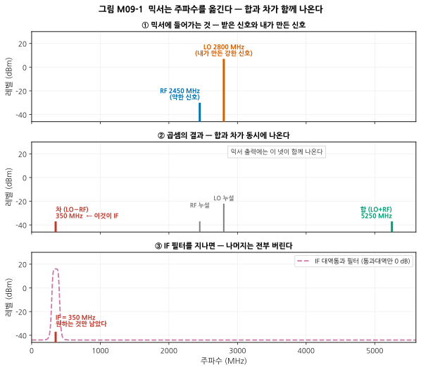
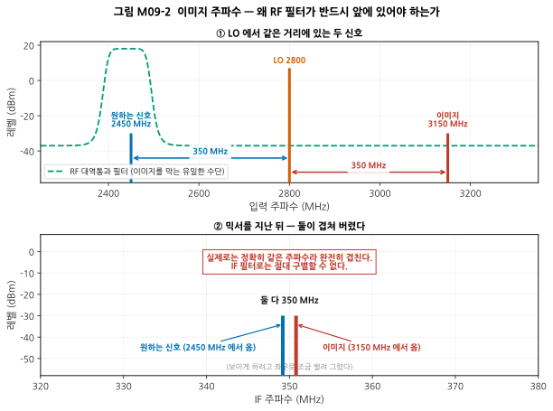
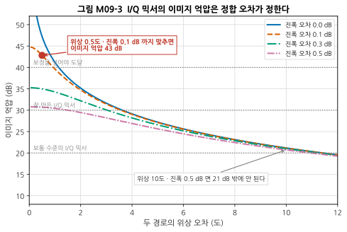
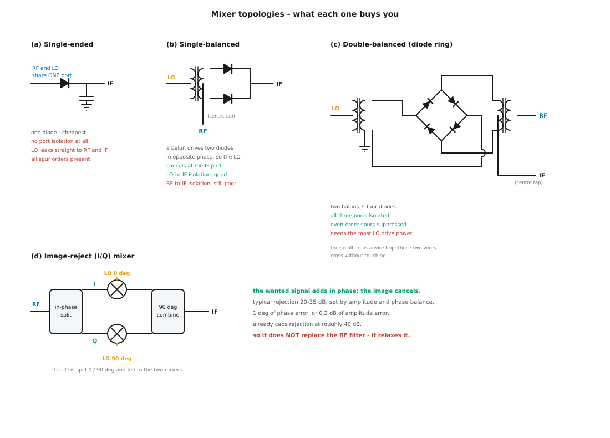
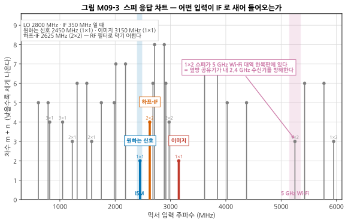
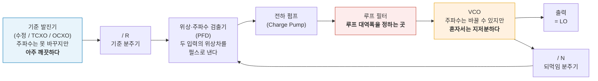
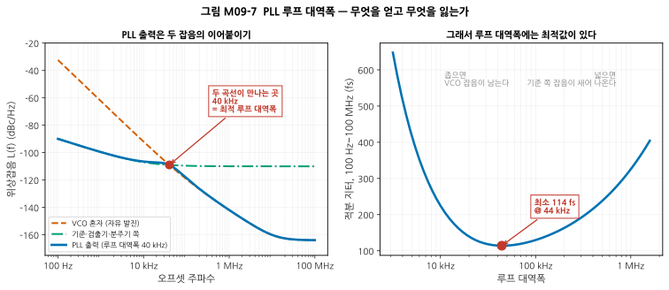
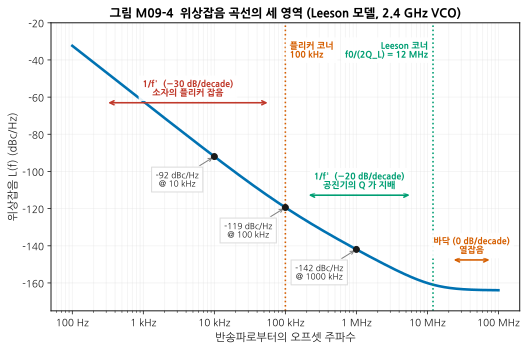
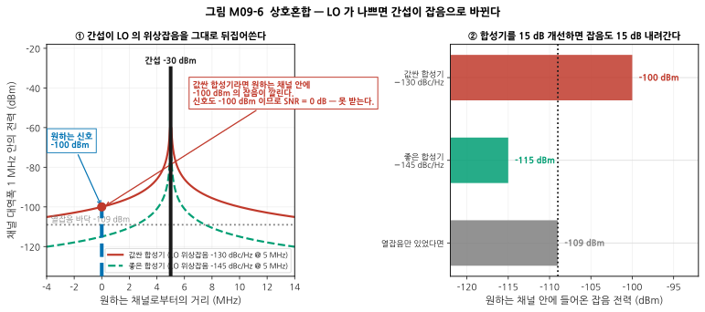

# M09 — 주파수 변환과 신호원: 믹서, 발진기, 위상잡음

**문서 번호**: RF-CUR-M09 · **버전**: v1.0 · **분량**: 이론 6 h + 실습 6 h

| | |
|---|---|
| **선수 모듈** | [M08](./M08_증폭기.md) (선형성·잡음지수), [M07](./M07_필터와수동네트워크.md) (필터·결합기), [M01](./M01_데시벨과전력.md) (dBm·열잡음) |
| **이 모듈이 소유하는 개념** | 믹서의 원리(곱셈과 합·차 주파수), 국부발진기(LO), 중간주파수(IF), 변환손실/변환이득, 믹서 포트 격리(LO-RF, LO-IF, RF-IF), **이미지 주파수**, 믹서 구조(단일소자·단일평형·이중평형·이미지제거·I/Q), 믹서 선형성과 LO 구동 레벨, **스퓨리어스(m×RF ± n×LO)와 스퍼 차트**, **주파수 계획**, 발진기 원리(부성저항, 바르크하우젠 조건), VCO, 위상동기루프(PLL)와 주파수 합성기, 루프 대역폭, **위상잡음 L(f)와 Leeson 모델**, 위상잡음과 지터의 관계, 기준 발진기(TCXO/OCXO/원자시계), **상호혼합** |
| **이 모듈을 쓰는 후속 모듈** | M10(주파수와 경로손실), **M11**(아키텍처가 곧 주파수 계획), **M12**(믹서 손실·IP3를 예산에 반영), **M13**(위상잡음이 EVM에 미치는 영향), **M14·M15**(위상잡음·변환손실 측정), M16(스퍼 디버그) |
| **학습 목표** | ① IF를 왜 쓰는지, 어떻게 고르는지 설명한다 ② 주어진 RF/LO 조합의 주요 스퍼 위치를 계산하고 문제 스퍼를 찾아낸다 ③ 위상잡음 곡선을 읽고 시스템에 미치는 영향을 수치로 판단한다 |

---

## M09.0 이 모듈의 범위

M08까지는 **주파수를 바꾸지 않는** 부품만 다뤘습니다. 증폭기는 크기를 바꾸고, 필터는 골라내지만, 둘 다 주파수는 그대로 둡니다.

이 모듈에서 처음으로 **주파수 자체를 옮깁니다.** 그리고 그 순간 두 가지 새로운 문제가 생깁니다.

1. **원하지 않는 주파수도 함께 옮겨 온다** → 이미지와 스퍼 (§1–6)
2. **옮기는 데 쓰는 "자"가 완벽하지 않다** → 발진기와 위상잡음 (§7–10)

> ⚠️ **다른 모듈과의 역할 분리**
>
> | 개념 | M09 (여기) | 다른 모듈 |
> |---|---|---|
> | 믹서의 P1dB·IP3 | 믹서에서 **어떻게 다른가** | M08이 **정의**를, M12가 **캐스케이드**를, M15가 **측정**을 소유 |
> | 위상잡음 | **정의·모델·시스템 영향** | M13이 EVM 연결을, M15가 **측정 절차**를 소유 |
> | 주파수 계획 | **스퍼 차트를 만드는 법** | M11이 **아키텍처 선택**(수퍼헤테로다인 vs 직접변환)을 소유 |
> | 필터 | 요구 조건만 도출 | M07이 필터 **사양·기술 선택**을 소유 |
>
> **로드풀·잡음지수 측정**은 M15, **DPD**는 M13이 소유합니다.

> 📖 **이 모듈이 답하는 질문** (참고 사이트 rfdh.com의 목록 중)
> - IF는 왜 필요한가? → §M09.2
> - 발진(oscillation)이란? → §M09.7

### 이 모듈이 계속 쓰는 예제

설명이 흩어지지 않도록 **하나의 수신기**를 끝까지 따라갑니다.

| 항목 | 값 |
|---|---|
| 받고 싶은 대역 | 2400 ~ 2483.5 MHz (**ISM**: Industrial, Scientific and Medical, 산업·과학·의료용 개방 대역) |
| 대표 채널 (RF) | 2450 MHz |
| 중간주파수 (IF) | 350 MHz |
| 국부발진기 (LO) | 2800 MHz (**하이사이드**: LO = RF + IF) |
| 이미지 | 3150 MHz |
| 하프-IF 스퍼 | 2625 MHz |

> 📌 §M09.6과 실습 L09-a에서 **이 IF 350 MHz가 사실 좋은 선택이 아니라는 것**을 직접 계산으로 밝혀낼 것입니다. 일부러 그렇게 골랐습니다.

---

## M09.1 곱하면 주파수가 옮겨진다

### 삼각함수 항등식 한 줄

믹서(mixer)가 하는 일은 **두 신호를 곱하는 것**입니다. 그게 전부입니다. 그리고 곱셈의 결과는 고등학교에서 배운 항등식이 그대로 말해 줍니다.

$$\cos(2\pi f_1 t)\cdot\cos(2\pi f_2 t) = \tfrac{1}{2}\Big[\cos\big(2\pi (f_1 - f_2) t\big) + \cos\big(2\pi (f_1 + f_2) t\big)\Big]$$

**두 주파수를 곱하면 차 주파수와 합 주파수가 나옵니다.** 원래 주파수 f₁, f₂는 (이상적인 곱셈기라면) 사라집니다.



*그림 M09-1. 세 장의 스펙트럼으로 본 주파수 변환. 가로축은 주파수(MHz), 세로축은 레벨(dBm)입니다. ① 안테나에서 온 약한 RF 2450 MHz와 내가 만든 강한 LO 2800 MHz가 함께 들어갑니다. ② 곱셈의 결과로 차 350 MHz와 합 5250 MHz가 나옵니다. 실제 믹서는 완벽한 곱셈기가 아니라서 **LO와 RF도 조금씩 새어 나옵니다**(회색). ③ IF 대역통과 필터가 350 MHz만 남기고 나머지를 버립니다. 점선이 필터의 응답이며, 통과대역에서만 0 dB입니다.*

| 용어 | 원어 | 뜻 |
|---|---|---|
| **믹서** | Mixer | 두 신호를 곱해 주파수를 옮기는 부품 |
| **LO** | Local Oscillator, 국부발진기 | 내가 만들어 넣는 기준 신호 |
| **IF** | Intermediate Frequency, 중간주파수 | 옮겨 간 뒤의 주파수 |
| **하향변환** | Down-conversion | 높은 RF → 낮은 IF (수신) |
| **상향변환** | Up-conversion | 낮은 IF → 높은 RF (송신) |

> ⚠️ **"믹서"라는 이름이 오해를 부릅니다.** 오디오의 믹서는 신호를 **더합니다**. RF의 믹서는 **곱합니다.** 더하기는 주파수를 바꾸지 못하고, 곱하기만이 주파수를 옮깁니다. 완전히 다른 부품입니다.

### 왜 곱셈기가 아니라 다이오드를 쓰는가

실제 믹서 안에는 곱셈 회로가 아니라 **다이오드**(또는 스위칭하는 트랜지스터)가 들어 있습니다. 이유는 [M08 §5](./M08_증폭기.md)에서 이미 봤습니다.

비선형 소자의 급수 전개 `v_out = a₁v + a₂v² + a₃v³ + ⋯` 에서 **a₂ 항이 곧 곱셈**입니다. 입력이 v = v_RF + v_LO 라면

$$a_2 (v_{RF} + v_{LO})^2 = a_2\big(v_{RF}^2 + \mathbf{2 v_{RF} v_{LO}} + v_{LO}^2\big)$$

가운데 항이 우리가 원하는 곱셈입니다. **즉 믹서는 비선형성을 일부러 이용하는 부품입니다.** 증폭기에서는 없애려 애썼던 바로 그 성질입니다.

> 📌 **그래서 대가가 따라옵니다.** a₂ 말고도 a₃, a₄, … 가 함께 있으므로 원하지 않는 조합도 잔뜩 나옵니다. 그것이 §M09.6의 스퍼입니다.

---

## M09.2 IF는 왜 필요한가

바로 이 질문에 답이 없으면 이 모듈 전체가 무의미합니다. **"2.4 GHz 신호를 그냥 2.4 GHz에서 처리하면 안 되는가?"**

### 이유 1 — 필터를 만들 수 있게 된다

[M06 §4](./M06_수동소자와공진.md)에서 본 관계가 여기서 결정적입니다.

$$\text{대역폭} = \frac{f_0}{Q}$$

2.4 GHz에서 1 MHz 폭의 채널 필터를 만들려면 품질계수(Quality Factor, Q)가 2400이나 필요합니다. 350 MHz에서 같은 1 MHz 폭을 만들려면 Q = 350이면 됩니다.

| 중심 주파수 | 1 MHz 대역폭에 필요한 Q | 현실성 |
|---|---|---|
| 2450 MHz | **2450** | 캐비티 필터급. 크고 비싸다 |
| 350 MHz | **350** | 표면탄성파(Surface Acoustic Wave, SAW)·세라믹 필터로 가능 |
| 10.7 MHz | **10.7** | 흔한 세라믹 필터로 충분 |

> 📌 **주파수를 낮추면** **같은 대역폭을 훨씬 낮은 Q로 얻습니다.** 채널을 골라내는 일(선택도)은 IF에서 하는 것이 압도적으로 유리합니다.

### 이유 2 — 튜닝을 한 군데로 모은다

여러 채널을 받아야 한다면, RF 필터를 채널마다 튜닝하는 대신 **LO 주파수만 바꾸면** 됩니다. 그러면 IF는 항상 같은 자리에 오므로 **IF 필터는 고정된 하나면 충분합니다.**

- 2400 MHz 채널 → LO 2750 MHz → IF 350 MHz
- 2450 MHz 채널 → LO 2800 MHz → IF 350 MHz
- 2480 MHz 채널 → LO 2830 MHz → IF 350 MHz

> 💡 **이것이 수퍼헤테로다인(superheterodyne) 수신기의 발명이 위대한 이유**입니다. "튜닝은 LO 하나로, 선택도는 고정 IF 필터로"라는 분업이 100년 넘게 유지되고 있습니다.

### 이유 3 — 이득을 나눠 놓을 수 있다

수신기 전체에 100 dB에 가까운 이득이 필요한데, 이걸 전부 한 주파수에서 얻으면 출력이 입력으로 되돌아와 **발진합니다**([M08 §7](./M08_증폭기.md)). 이득을 RF·IF·기저대역에 나눠 놓으면 각 주파수에서의 이득이 낮아져 되먹임 고리가 끊깁니다.

### 그래서 IF는 높아야 하나 낮아야 하나

**둘 다 요구가 있어서 충돌합니다.** 주파수 계획은 이 충돌을 다루는 일입니다.

| | IF를 **높게** | IF를 **낮게** |
|---|---|---|
| 이미지가 RF에서 멀어지는가 | **멀어진다 (좋다)** | 가까워진다 (나쁘다) |
| RF 필터 만들기 | **쉬워진다** | 어려워진다 |
| IF 채널 필터 만들기 | 어려워진다 | **쉬워진다** |
| IF단 소자의 값과 가격 | 불리 | **유리** |

이미지가 RF에서 떨어진 거리는 **정확히 2 × IF** 입니다(§M09.3). 그래서 위 표의 첫 두 줄과 뒤 두 줄이 정반대 방향을 가리킵니다.

> 📌 **실무의 해법은 두 번 변환하는 것**입니다. 첫 IF는 높게(이미지를 멀리 보내려고), 두 번째 IF는 낮게(채널 필터를 만들려고). 이것이 **이중변환(dual-conversion) 수퍼헤테로다인**입니다. 아키텍처 선택 전체는 **M11이 소유**합니다.

---

## M09.3 이미지 주파수 — 반드시 RF 필터가 앞에 있어야 하는 이유

### 문제

믹서는 **차 주파수**를 만듭니다. 그런데 차는 절댓값입니다.

- `|2800 − 2450| = 350` ← 원하는 신호
- `|2800 − 3150| = 350` ← **원하지 않는 신호도 똑같이 350**

**LO를 사이에 두고 대칭인 두 주파수는 똑같은 IF로 옮겨 옵니다.** 그중 원하지 않는 쪽을 **이미지 주파수(image frequency)** 라 부릅니다.

$$f_{image} = f_{LO} + f_{IF} = f_{RF} + 2 f_{IF} \quad (\text{하이사이드 LO})$$



*그림 M09-2. ① 입력 스펙트럼. 원하는 신호 2450 MHz와 이미지 3150 MHz가 LO 2800 MHz에서 **정확히 같은 거리(350 MHz)** 에 있습니다. 초록 점선은 RF 대역통과 필터의 응답으로, 이미지를 막을 수 있는 **유일한 수단**입니다. ② 믹서를 지난 뒤. 둘 다 350 MHz로 왔습니다. 보이게 하려고 좌우로 조금 벌려 그렸을 뿐, 실제로는 완전히 겹칩니다.*

> ⚠️ **이것이 왜 치명적인가**: IF 필터를 아무리 좋게 만들어도 소용이 없습니다. 두 신호가 **같은 주파수**에 있기 때문입니다. 한 번 겹치면 그 뒤로는 어떤 필터로도 분리할 수 없습니다. **믹서 앞에서 막지 못하면 영원히 못 막습니다.**

### 해결책 세 가지

| 방법 | 원리 | 얻는 것 | 잃는 것 |
|---|---|---|---|
| **① RF 필터** | 이미지 주파수를 물리적으로 막는다 | 확실하다 | 필터가 필요. IF가 낮으면 만들기 어렵다 |
| **② IF를 높인다** | 이미지가 2·IF 만큼 멀어져 필터가 쉬워진다 | 필터가 쉬워진다 | IF 채널 필터가 어려워진다 |
| **③ 이미지 제거 믹서** | 이미지를 **상쇄**시킨다 | RF 필터 요구가 완화된다 | 억압이 정합 오차로 제한됨 |

### ③ 이미지 제거 믹서는 만능이 아니다

I/Q 믹서 두 개의 출력을 90도 위상차로 합치면 원하는 신호는 더해지고 이미지는 상쇄됩니다. 그런데 **완벽한 상쇄는 두 경로의 진폭과 위상이 완벽히 같을 때만** 일어납니다.

$$\text{이미지 억압} = 10\log_{10}\frac{1 + 2a\cos\theta + a^2}{1 - 2a\cos\theta + a^2}, \qquad a = 10^{\Delta A / 20}$$

(ΔA는 진폭 오차 [dB], θ는 위상 오차)



*그림 M09-3. 가로축은 두 경로의 위상 오차(도), 세로축은 얻어지는 이미지 억압(dB)입니다. 곡선마다 진폭 오차가 다릅니다. **읽는 법**: 위상과 진폭 중 **나쁜 쪽이 상한을 정합니다.** 위상을 아무리 잘 맞춰도 진폭 오차가 0.5 dB면 25 dB를 넘지 못합니다.*

| 위상 오차 | 진폭 오차 | 이미지 억압 |
|---|---|---|
| 10° | 0.5 dB | **20.7 dB** |
| 2° | 0.3 dB | 32.2 dB |
| 0.5° | 0.1 dB | **42.8 dB** |

> 📌 **결론**: 이미지 제거 믹서는 RF 필터를 **없애 주는 것이 아니라 요구를 낮춰 줍니다.** 보통 20~35 dB를 얻고, 그 이상은 디지털 보정을 얹어야 합니다. 필터가 담당할 몫이 그만큼 줄어드는 것뿐입니다.

---

## M09.4 믹서 사양 해부

믹서 데이터시트에서 실제로 보는 항목들입니다.

| 항목 | 뜻 | 전형적인 값 (이중평형 다이오드 믹서) |
|---|---|---|
| **변환손실** (Conversion Loss) | RF 전력 대비 IF 전력이 얼마나 줄었나 | **6 ~ 7 dB** |
| **LO 구동 레벨** (LO Drive Level) | 정상 동작에 필요한 LO 전력 | **+7 dBm** (레벨 7), +13/+17/+23 dBm 등급도 있음 |
| **LO-RF 격리** | LO가 RF 포트로 새는 정도 | 30 ~ 45 dB |
| **LO-IF 격리** | LO가 IF 포트로 새는 정도 | 25 ~ 40 dB |
| **RF-IF 격리** | RF가 그대로 IF로 새는 정도 | 20 ~ 30 dB |
| **IIP3** (입력 3차 교차점, Input Third-order Intercept Point) | 3차 상호변조 (→ [M08 §6](./M08_증폭기.md)) | 보통 **LO 레벨 + 약 8 ~ 15 dB** |
| **P1dB** (1 dB 압축점, 1 dB Compression Point) | 압축 시작점 | 보통 **LO 레벨보다 5 ~ 6 dB 낮다** |
| **스퍼 표** (Spur Table) | m×n 조합별 억압량 | §M09.6 |

### 초심자가 놓치는 세 가지

> ⚠️ **① "변환손실"은 잡음지수와 같다** — 수동 믹서는 손실만 있는 부품이므로 [M08 §2](./M08_증폭기.md)의 규칙이 그대로 적용됩니다. **변환손실 7 dB인 믹서의 잡음지수(Noise Figure, NF)는 약 7 dB입니다.** 이 값이 뒤에 오는 IF 증폭기까지 눌러 버리므로, 믹서 앞에 반드시 LNA가 있어야 합니다(정량 계산은 M12).

> ⚠️ **② LO 레벨은 "권장"이 아니라 "요구"다** — LO가 부족하면 변환손실이 커지고 선형성이 급격히 나빠집니다. LO가 과하면 다이오드가 손상됩니다. **±1 dB 안에서 맞추십시오.** LO 경로에 감쇠기를 넣어 레벨을 맞추는 것이 실무의 기본입니다.

> ⚠️ **③ 격리는 "새는 양"이지 "막는 양"이 아니다** — LO-RF 격리 35 dB, LO 전력 +7 dBm이면 **RF 포트에서 −28 dBm의 LO가 안테나 쪽으로 나갑니다.** 이것이 안테나로 방사되면 **전파 규제 위반**입니다(→ M17). 그래서 믹서 앞의 RF 필터는 이미지를 막는 동시에 **LO 누설을 막는** 역할도 합니다.

### 수동 믹서 vs 능동 믹서

| | 수동 (다이오드·FET 링) | 능동 (길버트 셀 등) |
|---|---|---|
| 변환 | **손실** (6~7 dB) | **이득** (+10 dB 정도) |
| 선형성 | **좋다** | 나쁘다 |
| LO 전력 | 많이 필요 | 적게 필요 |
| 잡음지수 | 변환손실과 같음 | 보통 더 나쁨 |
| 직류 전력 | **불필요** | 필요 |
| 쓰이는 곳 | 계측기, 기지국, 고선형 수신기 | 집적회로 안, 저전력 기기 |

---

## M09.5 믹서 구조 — 무엇을 상쇄시키는가



*그림 M09-4. 믹서 구조 네 가지. **읽는 법**: 구조가 복잡해질수록 **상쇄되는 것이 늘어납니다.** (a)는 다이오드 한 개로 아무것도 상쇄하지 못합니다. (b)는 발룬(balun)이 두 다이오드를 반대 위상으로 구동해 LO가 IF 포트에서 상쇄됩니다. (c) 이중평형은 발룬 두 개와 다이오드 네 개로 세 포트가 모두 격리되고 짝수 차 스퍼가 억압됩니다. (d)는 이미지를 상쇄합니다. (c)의 작은 반원은 **선 점프(wire hop)** 로, 두 배선이 닿지 않고 교차한다는 뜻입니다.*

| 구조 | 상쇄되는 것 | 격리 | LO 전력 | 쓰이는 곳 |
|---|---|---|---|---|
| **단일 소자** (single-ended) | 없음 | 없음 | 적음 | 아주 값싼 기기 |
| **단일 평형** (single-balanced) | LO (IF 포트에서) | LO-IF만 좋음 | 보통 | 저가 수신기 |
| **이중 평형** (double-balanced) | LO와 RF 모두, **짝수 차 스퍼** | **세 포트 모두** | **많이 필요** | 표준적인 선택 |
| **이미지 제거 / I/Q** | **이미지** | 이중평형 + α | 많이 필요 | 광대역 수신기, 직접변환 |

> 💡 **"평형(balanced)"이라는 말의 뜻** — 신호를 크기가 같고 위상이 180도 반대인 두 갈래로 나눠 처리한 뒤 다시 합치는 것입니다. 그러면 **두 갈래에 공통으로 실린 성분은 합칠 때 사라집니다.** 발룬(balun = **bal**anced-**un**balanced transformer, 평형-불평형 변환기)이 그 나누기와 합치기를 담당합니다.

> ⚠️ **평형의 효과는 발룬의 정합 정확도만큼만 나옵니다.** 데이터시트의 격리 40 dB는 발룬이 정확히 대칭일 때의 값이며, 주파수가 대역 끝으로 갈수록 나빠집니다. 그래서 격리는 항상 **주파수의 함수**로 적혀 있습니다.

---

## M09.6 주파수 계획 — 스퍼 차트

### 스퍼는 어디에 생기는가

믹서 안의 비선형성은 a₂뿐 아니라 a₃, a₄, … 도 가지고 있습니다. 그래서 출력에는 **모든 정수 조합**이 나타납니다.

$$f_{out} = |\,m \cdot f_{RF} \pm n \cdot f_{LO}\,| \qquad (m, n = 0, 1, 2, 3, \ldots)$$

수신기 설계에서 더 유용한 것은 이 식을 뒤집은 형태입니다. **"어떤 입력 주파수가 내 IF 대역으로 떨어지는가?"**

$$f_{in} = \frac{n \cdot f_{LO} \pm f_{IF}}{m}$$

이 주파수들을 **스퍼 응답(spurious response)** 이라 하고, 전부 나열한 것이 **스퍼 차트**입니다.



*그림 M09-5. LO 2800 MHz, IF 350 MHz일 때 IF 대역으로 떨어지는 입력 주파수들. 가로축은 믹서 입력 주파수(MHz), 세로축은 차수 m+n입니다. **읽는 법**: 차수가 낮을수록 세게 나옵니다(고차 조합일수록 계수 aₙ이 작기 때문). 파란 막대가 원하는 신호(1×1), 빨간 막대가 이미지(1×1), 주황 막대가 하프-IF(2×2)입니다. 오른쪽 분홍 띠가 5 GHz Wi-Fi 대역인데, **1×2 스퍼가 그 안에 있습니다.***

### 반드시 확인해야 할 세 가지 스퍼

| 스퍼 | m×n | 위치 | 왜 위험한가 |
|---|---|---|---|
| **이미지** | 1×1 (+IF) | RF + 2·IF = 3150 MHz | 차수가 가장 낮아 가장 세다 |
| **하프-IF** | 2×2 (−IF) | RF + IF/2 = **2625 MHz** | **RF에서 겨우 175 MHz** — RF 필터로 막기 매우 어렵다 |
| **1×2** | 1×2 (−IF) | 2·LO − IF = **5250 MHz** | 이 예에서는 **5 GHz Wi-Fi 대역 한복판** |

> ⚠️ **하프-IF 스퍼가 실무에서 가장 골치 아픕니다.** 이미지는 700 MHz 떨어져 있어 필터로 막을 수 있지만, 하프-IF는 IF의 절반(175 MHz)밖에 안 떨어져 있습니다. **이 스퍼는 필터가 아니라 믹서의 2차 평형(2차 스퍼 억압)이 막아 줘야 합니다.** 이중평형 믹서를 쓰는 실무적 이유 중 하나가 이것입니다.

> ⚠️ **1×2 스퍼가 5250 MHz라는 것은 우연이 아닙니다.** 2·LO − IF = 5600 − 350 = 5250이고, 동시에 LO + RF = 2800 + 2450 = 5250입니다. **합 주파수와 같은 자리**입니다.

### 그래서 IF 350 MHz는 좋은 선택인가

**아닙니다.** 실습 L09-a에서 여러 IF 후보를 계산해 보면, 350 MHz는 5 GHz Wi-Fi와 LTE 대역 양쪽에 스퍼가 걸립니다. **이것이 주파수 계획을 "직관"이 아니라 "계산"으로 해야 하는 이유입니다.**

### 주파수 계획의 절차

1. 받아야 할 **RF 대역**과 IF 후보를 정한다.
2. 하이사이드/로우사이드 LO를 각각 계산한다.
3. **주변에 실제로 존재하는 강한 신호**(다른 통신 대역, 자기 기기의 클럭·하모닉)를 나열한다.
4. 각 IF 후보에 대해 스퍼 응답을 전부 계산하고, 3번 목록과 겹치는지 본다.
5. 낮은 차수의 스퍼가 걸리는 후보를 버린다.
6. 남은 후보 중에서 **부품 구하기 쉬운 IF**(SAW 필터가 있는 주파수)를 고른다.

> 💡 **6번을 잊지 마십시오.** 계산상 완벽한 IF라도 그 주파수의 필터를 살 수 없으면 소용없습니다. 실무에서는 흔히 쓰이는 IF(70, 140, 240, 350, 380, 480 MHz 등)부터 후보에 올립니다.

---

## M09.7 발진기 — 어떻게 스스로 신호를 만드는가

### 발진이란

[M08 §7](./M08_증폭기.md)에서 발진을 **피해야 할 사고**로 다뤘습니다. 여기서는 같은 현상을 **일부러 만듭니다.**

발진의 조건은 **바르크하우젠 조건(Barkhausen criterion, 발진 조건)** 두 가지입니다.

1. **고리 이득이 1 이상** — 한 바퀴 돌아온 신호가 줄어들지 않는다
2. **고리 위상이 360도의 정수배** — 돌아온 신호가 원래 신호와 위상이 맞는다

두 조건이 함께 성립하면, 전원을 켜는 순간의 아주 작은 잡음이 한 바퀴 돌 때마다 커져서 **어느새 큰 신호가 됩니다.**

> 💡 **그럼 무한히 커지나?** 아닙니다. 진폭이 커지면 증폭기가 압축되어([M08 §4](./M08_증폭기.md)) 고리 이득이 정확히 1로 떨어집니다. 그 지점에서 진폭이 멈춥니다. **발진기의 진폭을 정하는 것은 비선형성입니다.**

### 부성저항으로 보는 관점

마이크로파에서는 되먹임 고리를 그리기 어려워 다른 관점을 씁니다.

**공진기는 손실(양의 저항)을 가지고 있습니다.** 그대로 두면 진동이 잦아듭니다. 여기에 **음의 저항처럼 보이는 능동 소자**를 붙여 손실을 정확히 상쇄하면, 진동이 계속됩니다.

$$R_{\text{소자}} + R_{\text{공진기}} \le 0, \qquad X_{\text{소자}} + X_{\text{공진기}} = 0$$

> 📌 **두 관점은 같은 이야기입니다.** "고리 이득 ≥ 1"과 "음의 저항이 손실을 이긴다"는 서로 다른 언어로 쓴 같은 조건입니다.

### 무엇이 주파수를 정하는가 — 그리고 Q가 왜 중요한가

주파수를 정하는 것은 **공진기**입니다. 그리고 공진기의 Q가 그대로 **위상잡음**을 정합니다(§M09.9).

| 공진기 | 전형적 Q | 주파수 안정도 | 쓰이는 곳 |
|---|---|---|---|
| LC (집중소자) | 10 ~ 100 | 나쁨 | 집적회로 안의 전압제어 발진기(Voltage-Controlled Oscillator, VCO) |
| 마이크로스트립 공진기 | 100 ~ 500 | 보통 | 개별 부품 발진기 |
| 유전체 공진기 (DRO) | 수천 ~ 수만 | 좋음 | 고성능 LO |
| **수정 진동자** | **10⁴ ~ 10⁶** | **매우 좋음** | 기준 발진기 |
| 원자 (세슘·루비듐) | — | 압도적 | 기준 시계, 계측 표준 |

> ⚠️ **여기에 근본적인 충돌이 있습니다.** Q가 높은 공진기(수정)는 **주파수를 바꿀 수 없습니다.** 반대로 주파수를 바꿀 수 있는 공진기(VCO의 배랙터 LC)는 **Q가 낮아 위상잡음이 나쁩니다.**
>
> **PLL은 정확히 이 충돌을 푸는 회로입니다.**

---

## M09.8 PLL 주파수 합성기 — 두 좋은 성질을 붙이기

### 구조



*그림 M09-6. PLL(Phase-Locked Loop, 위상동기루프) 주파수 합성기의 블록도. **읽는 법**: 되먹임 고리가 VCO의 출력을 N으로 나눠 기준과 비교하고, 차이가 있으면 VCO를 밀어 줍니다. 잠기면 f_out = (N/R) × f_ref 가 됩니다. **N을 바꾸면 출력 주파수가 바뀌므로, 채널 선택이 곧 N을 바꾸는 일입니다.***

$$f_{out} = \frac{N}{R} f_{ref}$$

### 루프 대역폭이 하는 일

PLL 설계에서 가장 많이 만지는 변수입니다. 한 문장으로 요약하면:

> **루프 대역폭 안쪽에서는 기준 발진기가, 바깥쪽에서는 VCO가 위상잡음을 지배합니다.**

되먹임 고리는 느린 변화(= 낮은 오프셋 주파수)만 따라잡을 수 있기 때문입니다. 빠른 변화는 고리가 미처 못 잡아 VCO 그대로 나옵니다.



*그림 M09-7. 왼쪽: VCO 혼자일 때(주황 파선), 기준·검출기·분주기 쪽 잡음(초록 일점쇄선), 그리고 둘을 이어붙인 PLL 출력(파란 굵은 선). **두 곡선이 만나는 40 kHz가 최적 루프 대역폭**입니다. 오른쪽: 루프 대역폭을 바꿔 가며 100 Hz~100 MHz를 적분한 지터입니다. 가로축은 루프 대역폭, 세로축은 RMS 지터(fs)입니다. **44 kHz에서 114 fs로 최소**가 되고, 좁혀도 넓혀도 나빠집니다.*

| 루프 대역폭 | 적분 지터 (100 Hz~100 MHz) | 왜 |
|---|---|---|
| 10 kHz (너무 좁음) | 225 fs | VCO의 나쁜 근접 잡음이 그대로 남는다 |
| **44 kHz (최적)** | **114 fs** | 두 잡음의 교차점 |
| 1 MHz (너무 넓음) | 325 fs | 기준·검출기 쪽 잡음이 넓은 대역으로 새어 나온다 |

> 📌 **설계 규칙**: **두 잡음 곡선이 교차하는 오프셋을 루프 대역폭으로 잡습니다.** 이것이 PLL 설계의 첫 번째 근사이며, 실습 L09-c에서 직접 확인합니다.

> ⚠️ **다른 요구가 있으면 최적점을 벗어나야 합니다.** 예를 들어 주파수를 빨리 바꿔야 하면(주파수 도약, 빠른 채널 전환) 루프 대역폭을 넓혀야 합니다. **잠김 시간은 대략 루프 대역폭에 반비례**하기 때문입니다. 지터와 속도의 맞바꿈입니다.

### 기준 발진기의 등급

| 종류 | 원어 | 주파수 안정도 (전 온도 범위) | 가격대 |
|---|---|---|---|
| 수정 진동자 (XO) | Crystal Oscillator | ±20 ~ ±100 ppm | 가장 쌈 |
| **TCXO** | Temperature-Compensated XO | ±0.5 ~ ±2 ppm | 쌈 |
| **OCXO** | Oven-Controlled XO | ±0.01 ~ ±0.1 ppm | 비쌈 |
| 루비듐 | Rubidium | ±0.001 ppm 이하 | 매우 비쌈 |
| 세슘 / 수소 메이저 | Cesium / H-maser | 시간 표준 그 자체 | 연구·표준 기관 |

> 💡 **ppm(parts per million, 백만분율) 읽는 법**: 2.4 GHz에서 1 ppm은 2400 Hz입니다. TCXO(±2 ppm)를 쓰면 2.4 GHz LO가 최대 ±4.8 kHz 어긋납니다. 채널 간격이 몇 MHz라면 문제없지만, **좁은 대역 시스템이나 높은 차수의 변조에서는 이 오차가 곧바로 성능 저하**입니다(→ M13).

---

## M09.9 위상잡음 — 발진기가 얼마나 "깨끗한가"

### 정의

이상적인 발진기의 스펙트럼은 **선 하나**입니다. 실제 발진기는 그 선 좌우로 **치맛자락(skirt)** 이 퍼져 있습니다. 위상이 미세하게 떨리기 때문입니다.

**위상잡음 L(f)** 는 그 치맛자락의 높이를 이렇게 적습니다.

> **반송파에서 오프셋 f만큼 떨어진 곳에서, 1 Hz 대역 안의 잡음 전력이 반송파 전력보다 몇 dB 낮은가**

단위는 **dBc/Hz** 입니다 (dB relative to **c**arrier, per **H**ertz).

> ⚠️ **dBc/Hz는 반드시 "오프셋과 함께" 읽어야 합니다.** "위상잡음 −110 dBc/Hz"만으로는 아무 정보가 없습니다. **"−110 dBc/Hz @ 100 kHz 오프셋"** 이라야 의미가 있습니다. [M08](./M08_증폭기.md)의 "억압 40 dB"와 같은 종류의 함정입니다.

### Leeson 모델 — 곡선이 왜 그 모양인가

$$L(f) = \frac{F k T}{P_s}\left[1 + \left(\frac{f_0}{2 Q_L f}\right)^2\right]\left[1 + \frac{f_c}{f}\right]$$

| 기호 | 뜻 |
|---|---|
| F | 능동 소자의 잡음지수 (배수) |
| kT | 열잡음 (→ [M01](./M01_데시벨과전력.md)) |
| P_s | 공진기에 실린 신호 전력 |
| Q_L | **부하 Q** (→ [M06](./M06_수동소자와공진.md)) |
| f₀ | 발진 주파수 |
| f_c | 소자의 **플리커(1/f) 코너** 주파수 |



*그림 M09-8. 2.4 GHz VCO(Q_L = 100, F = 10 dB, P_s = 0 dBm, 플리커 코너 100 kHz)의 Leeson 모델. 가로축은 반송파로부터의 오프셋(로그), 세로축은 L(f)(dBc/Hz)입니다. **읽는 법**: 곡선은 세 구간의 이어붙이기입니다. 왼쪽부터 −30 dB/decade(1/f³), −20 dB/decade(1/f²), 0 dB/decade(바닥)입니다. 꺾이는 지점은 각각 플리커 코너와 **Leeson 코너 f₀/(2Q_L) = 12 MHz** 입니다.*

| 영역 | 기울기 | 원인 | 어떻게 개선하나 |
|---|---|---|---|
| **1/f³** | −30 dB/decade | 소자의 플리커 잡음이 주파수로 변환됨 | 플리커가 적은 소자 (SiGe, InGaP > CMOS) |
| **1/f²** | −20 dB/decade | 공진기의 Q가 지배 | **Q를 올린다**, 신호 전력 P_s를 올린다 |
| **바닥** | 0 dB/decade | 열잡음 | 잡음지수 F를 낮춘다, P_s를 올린다 |

> 📌 **가장 강력한 설계 손잡이는 Q입니다.** Leeson 식에서 Q_L이 제곱으로 들어가므로, **Q를 2배로 올리면 1/f² 영역이 6 dB 좋아집니다.** 이것이 §M09.7에서 "Q가 위상잡음을 정한다"고 한 말의 수식적 근거입니다.

**이 예제 VCO의 값**:

| 오프셋 | L(f) |
|---|---|
| 10 kHz | −92 dBc/Hz |
| 100 kHz | −119 dBc/Hz |
| 1 MHz | −142 dBc/Hz |
| 바닥 | −164 dBc/Hz |

### 위상잡음과 지터는 같은 것의 두 표현

- **위상잡음**: 주파수 영역에서, 오프셋별 잡음 밀도
- **지터(jitter)**: 시간 영역에서, 신호가 0을 지나는 순간이 얼마나 떨리는가

관계는 적분입니다.

$$\sigma_\phi = \sqrt{2\int_{f_1}^{f_2} L(f)\,df} \quad [\text{rad}], \qquad \sigma_t = \frac{\sigma_\phi}{2\pi f_0} \quad [\text{s}]$$

> ⚠️ **적분 구간을 밝히지 않은 지터 값은 의미가 없습니다.** "RMS 지터 114 fs"는 반드시 "100 Hz~100 MHz 적분" 같은 조건과 함께 적혀야 합니다. 구간을 넓히면 값이 커집니다.

> 💡 **어느 쪽 언어를 쓰나** — 무선 통신에서는 위상잡음(dBc/Hz)을, 고속 디지털·데이터 컨버터에서는 지터(fs)를 씁니다. 같은 발진기를 두 업계가 다르게 부르는 것뿐입니다.

---

## M09.10 위상잡음이 시스템에 하는 일

위상잡음이 왜 사양서에 오르는지, 세 가지 결과로 봅니다.

### ① 상호혼합 (Reciprocal Mixing) — 수신기 감도를 죽인다

**강한 간섭 신호가 LO의 위상잡음을 그대로 뒤집어쓰고, 그 잡음 담요가 원하는 채널을 덮습니다.**

이유는 §M09.3의 이미지와 같은 논리입니다. 믹서는 LO의 **모든 성분**과 입력을 곱합니다. LO의 치맛자락도 예외가 아닙니다.



*그림 M09-9. ① 5 MHz 옆에 −30 dBm의 강한 간섭이 있고, 원하는 신호는 −100 dBm입니다. 간섭에 얹힌 LO 위상잡음이 원하는 채널까지 뻗어 옵니다. 세로축은 채널 대역폭 1 MHz 안의 전력입니다. ② 채널 안에 들어온 잡음 전력 비교입니다.*

$$P_{\text{잡음}} = P_{\text{간섭}} + L(\Delta f) + 10\log_{10}(BW)$$

**계산 예** (간섭 −30 dBm, 오프셋 5 MHz, 채널 대역폭 1 MHz, 수신기 NF 5 dB):

| LO 위상잡음 @5 MHz | 채널 안 잡음 | 열잡음 바닥 대비 |
|---|---|---|
| −130 dBc/Hz (값싼 합성기) | **−100 dBm** | 바닥(−109 dBm)보다 **9 dB 높다** |
| −145 dBc/Hz (좋은 합성기) | −115 dBm | 바닥보다 6 dB 낮다 — 무시 가능 |

> ⚠️ **값싼 합성기를 쓰면 원하는 신호(−100 dBm)와 잡음(−100 dBm)이 같아집니다. SNR = 0 dB, 즉 못 받습니다.** 증폭기의 NF를 아무리 낮춰도 소용없습니다. **이 상황에서 감도를 정하는 것은 LNA가 아니라 LO입니다.**

> 📌 **그래서 기지국·계측기의 합성기 사양이 그렇게 까다롭습니다.** 주변에 강한 신호가 많은 환경일수록 LO의 위상잡음이 곧 수신 성능입니다.

### ② 변조 신호의 품질 저하

위상잡음은 성좌도(constellation)의 점을 **회전 방향으로 번지게** 합니다. 진폭이 아니라 위상만 흔들리므로, 성좌 점이 원호 방향으로 흐려집니다.

- 낮은 차수 변조(QPSK: Quadrature Phase Shift Keying, 4위상 편이변조)는 점 사이가 멀어 웬만해선 견딥니다.
- 높은 차수 변조(256-QAM, 1024-QAM. QAM = Quadrature Amplitude Modulation, 직교 진폭 변조)는 점 사이가 촘촘해 **위상잡음이 곧바로 오류**가 됩니다.

> 📌 **정량적 연결(오차 벡터 크기(Error Vector Magnitude, EVM) 계산)은 M13이 소유합니다.** 여기서는 "높은 차수 변조를 쓰려면 합성기를 좋게 해야 한다"는 인과만 확인하면 충분합니다.

### ③ 레이더의 도플러 분해능

레이더는 움직이는 물체가 만드는 아주 작은 주파수 변화(도플러 편이)를 봅니다. 그런데 **송신기의 위상잡음이 지면·건물 같은 큰 고정 반사체에 실려 되돌아오면**, 그 잡음이 느리게 움직이는 물체의 도플러 신호를 덮어 버립니다.

> 💡 이것 역시 상호혼합과 같은 구조입니다. **강한 신호 + 나쁜 LO = 잡음 담요.**

---

## M09.L 실습

### L09-a — 주파수 계획: 스퍼 차트를 직접 만든다 (Tier 0, 2.5시간)

**목표**: IF 후보를 계산으로 평가해, 직관으로 고른 IF가 왜 나쁜지 스스로 밝혀냅니다.

**준비물**: Python 3, `numpy` ([부록 D](../03_부록/D_장비_소프트웨어_준비가이드.md))

**셋업**: 컴퓨터만 있으면 됩니다.

**절차**

1. 아래 스크립트를 `l09a.py`로 저장하고 실행합니다.

```python
import numpy as np

RF_LO, RF_HI = 2400.0, 2483.5      # 받고 싶은 대역 [MHz]
BLOCKERS = {"5 GHz Wi-Fi": (5150.0, 5350.0),
            "LTE B7 하향": (2620.0, 2690.0),
            "GPS L1": (1574.0, 1577.0)}
MMAX = NMAX = 4


def spurs(lo, if_, fmin=100.0, fmax=8000.0):
    """f_in = (n·LO ± IF) / m  — IF 대역으로 떨어지는 입력 주파수들."""
    out = []
    for m in range(1, MMAX + 1):
        for n in range(1, NMAX + 1):
            for sgn in (+1, -1):
                f = (n * lo + sgn * if_) / m
                if fmin <= f <= fmax:
                    out.append((m, n, sgn, f))
    return sorted(out, key=lambda r: r[3])


def score(if_, side=+1):
    """IF 후보 하나를 평가한다. 점수가 낮을수록 좋다."""
    rf_mid = (RF_LO + RF_HI) / 2
    lo = rf_mid + side * if_
    bad = []
    for m, n, sgn, f in spurs(lo, if_):
        if (m, n) == (1, 1) and sgn == -side:
            continue                                   # 원하는 신호 자신
        order = m + n
        for name, (a, b) in BLOCKERS.items():
            if a <= f <= b:
                bad.append((f"{name} 안", m, n, f, order))
        if RF_LO <= f <= RF_HI:
            bad.append(("자기 대역 안", m, n, f, order))
    img = rf_mid + side * 2 * if_
    if RF_LO <= img <= RF_HI:
        bad.append(("이미지가 자기 대역", 1, 1, img, 2))
    # 차수가 낮은 스퍼일수록 무겁게 벌점을 준다
    return lo, img, bad, sum(10.0 / o for *_, o in bad)


print(f"{'IF':>6} {'LO':>8} {'이미지':>8} {'점수':>6}  문제 스퍼")
print("-" * 78)
for if_ in (70, 140, 200, 280, 350, 420, 480, 560, 720):
    lo, img, bad, sc = score(if_, +1)
    tag = ", ".join(f"{n} {m}×{nn}@{f:.0f}" for n, m, nn, f, _ in bad[:3])
    print(f"{if_:6.0f} {lo:8.1f} {img:8.1f} {sc:6.2f}  {tag if tag else '없음'}")
```

> ⚠️ **본문과 숫자가 조금 다릅니다.** 본문은 대표 채널을 2450 MHz로 잡았지만, 이 스크립트는 대역 중앙(2441.75 MHz)을 씁니다. 그래서 LO가 2800이 아니라 2791.8 MHz이고, 1×2 스퍼도 5250이 아니라 5234 MHz입니다. **스퍼 위치는 채널을 옮길 때마다 함께 움직인다**는 뜻이며, 그래서 아래 4번에서 대역의 양 끝을 각각 확인하라고 하는 것입니다.

2. 출력을 보고 **점수가 0인 IF**를 찾습니다.
3. 본문이 계속 써 온 IF 350 MHz가 왜 나쁜지 확인합니다.
4. `BLOCKERS`에 여러분의 환경에 실제로 있는 신호(예: 사내 무선, 자기 보드의 클럭 하모닉)를 추가해 다시 돌립니다.
5. `side=-1`(로우사이드 LO)로도 돌려 비교합니다.

**예상 결과**

```
    IF       LO      이미지     점수  문제 스퍼
------------------------------------------------------------------------------
    70   2511.8   2581.8   2.50  자기 대역 안 2×2@2477
   140   2581.8   2721.8   9.17  LTE B7 하향 안 3×3@2628, LTE B7 하향 안 2×2@2652, 5 GHz Wi-Fi 안 2×4@5234
   200   2641.8   2841.8   1.67  5 GHz Wi-Fi 안 2×4@5184
   280   2721.8   3001.8   7.92  LTE B7 하향 안 3×3@2628, LTE B7 하향 안 4×4@2652, 5 GHz Wi-Fi 안 1×2@5164
   350   2791.8   3141.8   5.00  LTE B7 하향 안 3×3@2675, 5 GHz Wi-Fi 안 1×2@5234
   420   2861.8   3281.8   5.83  LTE B7 하향 안 2×2@2652, 5 GHz Wi-Fi 안 1×2@5304
   480   2921.8   3401.8   2.50  LTE B7 하향 안 2×2@2682
   560   3001.8   3561.8   0.00  없음
   720   3161.8   3881.8   0.00  없음
```

**판정 기준**

| 항목 | 합격 |
|---|---|
| 스크립트 실행 | 위 표가 그대로 재현된다 |
| 해석 ① | IF 70 MHz가 왜 최악인지 설명할 수 있다 |
| 해석 ② | IF 350 MHz의 문제 스퍼 두 개를 지목할 수 있다 |
| 해석 ③ | 점수 0인 후보 중 무엇을 고를지, **부품 조달**까지 고려해 정할 수 있다 |
| 확장 | 자기 환경의 방해 신호를 넣어 다시 평가했다 |

**해석 — 이 실습에서 볼 것**

| IF | 무엇이 문제인가 |
|---|---|
| **70 MHz** | 2×2(하프-IF) 스퍼가 **2477 MHz, 즉 받으려는 대역 안**에 있다. 자기 대역 안의 다른 채널이 곧바로 방해가 된다 — **최악** |
| **350 MHz** | 1×2 스퍼가 5234 MHz(5 GHz Wi-Fi), 3×3이 2675 MHz(LTE B7)에 걸린다 |
| **560 / 720 MHz** | 나열한 방해원 중 어디에도 안 걸린다 |

> 📌 **그러나 560 MHz가 자동으로 정답은 아닙니다.** 560 MHz용 SAW 필터를 구할 수 있는지, LO 3000 MHz를 만들 수 있는지, IF 증폭기가 있는지를 확인해야 합니다. **계산은 후보를 줄여 줄 뿐, 결정은 조달과 함께 내립니다.**

**흔한 실수**

| 실수 | 증상 | 바로잡기 |
|---|---|---|
| m, n을 2까지만 본다 | 3×3, 1×2 같은 실제 문제 스퍼를 놓친다 | 최소 4까지, 가능하면 5까지 |
| 자기 기기 내부의 신호를 안 넣는다 | 실험실에서 멀쩡하다가 제품에서 터진다 | 클럭과 전원 변환기(DC-DC 컨버터)의 스위칭 주파수, 그리고 그 하모닉을 `BLOCKERS`에 넣는다 |
| 대표 채널 하나만 계산 | 대역 끝에서만 걸리는 스퍼를 놓친다 | RF 대역의 **양 끝**에서 각각 계산 |
| 하이사이드만 본다 | 더 좋은 로우사이드 안을 놓친다 | `side=-1`도 반드시 확인 |

---

### L09-b — 믹서 변환손실과 격리 측정 (Tier 1 / Tier 2, 2시간)

**목표**: 실제 믹서의 변환손실과 포트 격리를 재고, 데이터시트와 대조합니다.

> ⚠️ **안전** — 신호발생기와 스펙트럼 분석기 사이에는 항상 감쇠기를 둡니다([M04 §5](./M04_RF실험실입문.md)). LO는 +7 dBm으로 강하므로 SA 입력에 직접 넣지 마십시오.

**셋업**

```
[신호발생기 1: RF]  --> [믹서 RF]
[신호발생기 2: LO]  --> [믹서 LO]
                         [믹서 IF] --> [10 dB 감쇠기] --> [스펙트럼 분석기]
```

| 등급 | 장비 |
|---|---|
| **Tier 2** | 신호발생기 2대, SA, 이중평형 믹서(레벨 7), 감쇠기 |
| **Tier 1** | 저가 신호원 2대 + TinySA + 값싼 이중평형 믹서(Double-Balanced Mixer, DBM) 모듈 |
| **Tier 0** | 측정 불가. L09-a와 아래 계산 과제로 대체 |

**절차**

1. **먼저 LO만 넣고** IF 포트에서 LO가 얼마나 보이는지 잽니다 → **LO-IF 격리**
2. 같은 조건에서 RF 포트를 SA에 연결해 LO를 봅니다 → **LO-RF 격리**
3. LO를 +7 dBm으로, RF를 −20 dBm(2450 MHz)으로 넣고 IF(350 MHz)를 잽니다.
4. **변환손실 = (RF 입력 레벨) − (IF 출력 레벨) − (감쇠기 값)**
5. LO를 +1, +4, +7, +10 dBm으로 바꿔 가며 변환손실을 다시 잽니다.
6. RF를 −20 → −10 → −5 → 0 dBm으로 올려 가며 IF가 선형으로 따라오는지 봅니다.

**예상 결과**

| 측정 | 전형적인 값 |
|---|---|
| LO-IF 격리 | 25 ~ 40 dB |
| LO-RF 격리 | 30 ~ 45 dB |
| 변환손실 (LO = +7 dBm) | **6 ~ 7 dB** |
| 변환손실 (LO = +1 dBm) | 10 dB 이상으로 나빠짐 |
| P1dB | LO 레벨보다 약 5 ~ 6 dB 낮은 입력 |

**판정 기준**

| 항목 | 합격 |
|---|---|
| 변환손실 | 데이터시트 typ의 ±1.5 dB 안 |
| LO 레벨 의존성 | LO를 낮췄을 때 변환손실이 나빠지는 것을 관찰했다 |
| 격리 | 데이터시트 min을 만족 |
| 해석 | **변환손실이 곧 NF임**을 설명할 수 있다 |

**흔한 실수**

| 실수 | 증상 | 바로잡기 |
|---|---|---|
| 감쇠기·케이블 손실 보정 누락 | 변환손실이 2~3 dB 크게 나옴 | **DUT 없이 직결 기준선**을 먼저 측정 |
| SA를 IF 필터 없이 사용 | LO 누설이 SA를 압축시켜 IF가 낮게 보임 | IF 대역통과 필터를 넣거나 SA 입력 감쇠를 올린다 |
| LO 레벨을 확인 안 함 | 변환손실이 데이터시트와 크게 다름 | **믹서 입력단에서** LO 레벨을 실측 (케이블 손실 포함) |
| 이미지 주파수를 함께 넣음 | IF가 예상보다 큼 | 신호원 하모닉이 이미지에 해당하는지 확인 |

**계산 과제 (Tier 0)**: 변환손실 7 dB인 믹서 뒤에 NF 3 dB인 IF 증폭기가 온다면, 이 두 단만의 잡음지수는 얼마인가? (계산법은 M12에서 배우지만, "믹서 손실이 그대로 앞에 더해진다"는 직관은 지금 확인할 수 있습니다.)

---

### L09-c — 위상잡음 측정과 Leeson 영역 식별 (Tier 2, 1.5시간)

> 📌 **정식 측정 절차(교차상관법, 기준원 선택, 측정 한계)는 M15가 소유합니다.** 여기서는 곡선의 모양을 읽는 데 목적이 있습니다.

**셋업**: 위상잡음 측정 기능이 있는 SA 또는 전용 위상잡음 분석기 + 측정할 신호원

**절차**

1. 신호원을 2.4 GHz, +0 dBm으로 설정합니다.
2. SA의 위상잡음 측정 기능으로 100 Hz ~ 10 MHz 오프셋 구간을 측정합니다.
3. 곡선을 로그-로그로 보고 **기울기가 꺾이는 지점**을 찾습니다.
4. 각 구간의 기울기를 dB/decade로 읽고 −30 / −20 / 0 중 어디에 해당하는지 분류합니다.
5. Leeson 코너에서 부하 Q를 역산합니다: **Q_L = f₀ / (2 × f_corner)**
6. 값싼 신호원과 좋은 신호원을 비교합니다.

**예상 결과** (그림 M09-8의 모델 값. 실제 소자는 다릅니다)

| 오프셋 | L(f) | 구간 |
|---|---|---|
| 1 kHz | −62 dBc/Hz | 1/f³ |
| 10 kHz | −92 dBc/Hz | 1/f³ |
| 100 kHz | −119 dBc/Hz | 1/f³ → 1/f² 전이 |
| 1 MHz | −142 dBc/Hz | 1/f² |
| 10 MHz | −160 dBc/Hz | 1/f² → 바닥 전이 |

**판정 기준**

| 항목 | 합격 |
|---|---|
| 구간 분류 | 세 기울기를 모두 식별했다 |
| Q_L 역산 | 코너에서 계산한 Q가 그 공진기 종류의 상식적 범위 안 |
| 비교 | 두 신호원의 차이를 **어느 구간에서 나는지**로 설명했다 |
| 응용 | §M09.10의 식으로 상호혼합 잡음을 계산했다 |

**흔한 실수**

| 실수 | 증상 | 바로잡기 |
|---|---|---|
| 측정기 자신의 잡음이 더 나쁨 | 측정 대상이 아니라 측정기를 잼 | **입력을 끊고** 측정기 바닥을 먼저 확인 |
| 신호원이 잠기지 않은 상태 | 곡선이 계속 흔들림 | 잠김 표시 확인 후 측정 |
| 스퍼를 위상잡음으로 오해 | 곡선에 뾰족한 선이 보임 | 스퍼는 **별도 항목**. 전원 리플(50/60 Hz와 그 배수), 기준 분주 주파수를 의심 |
| 오프셋 구간을 밝히지 않고 지터 인용 | 값이 사람마다 다름 | **적분 구간을 반드시 함께 적는다** |

---

## M09.Q 확인 문제

<details>
<summary><b>Q1.</b> RF = 2450 MHz를 IF = 350 MHz로 내리려 한다. LO는 얼마여야 하며, 이미지는 어디인가? 로우사이드 LO를 쓰면 어떻게 달라지는가?</summary>

**하이사이드 LO** (LO = RF + IF):
- LO = 2450 + 350 = **2800 MHz**
- 이미지 = LO + IF = **3150 MHz** (= RF + 2·IF)

**로우사이드 LO** (LO = RF − IF):
- LO = 2450 − 350 = **2100 MHz**
- 이미지 = LO − IF = **1750 MHz** (= RF − 2·IF)

두 경우 모두 이미지는 RF에서 **2 × IF = 700 MHz** 떨어져 있습니다.

**선택 기준**: 어느 쪽 이미지 주파수에 실제로 강한 신호가 있는지, 그리고 어느 LO 주파수가 만들기 쉬운지로 정합니다. 또한 로우사이드는 IF 스펙트럼이 **뒤집히므로**(주파수 순서가 반대가 됨) 복조단에서 이를 고려해야 합니다.
</details>

<details>
<summary><b>Q2.</b> "IF 필터를 아주 좋게 만들면 이미지를 막을 수 있다"는 주장은 왜 틀렸는가?</summary>

이미지가 변환된 뒤에는 **원하는 신호와 정확히 같은 주파수**에 있기 때문입니다. 필터는 주파수로 구별하는 부품이므로, 주파수가 같으면 아무것도 할 수 없습니다.

이미지를 막을 수 있는 곳은 **믹서 앞** 뿐입니다.
1. RF 대역통과 필터로 물리적으로 막거나
2. 이미지 제거 믹서로 상쇄시키거나
3. IF를 높여 이미지를 멀리 보내 ①을 쉽게 만들거나

**한 번 겹친 신호는 영원히 분리할 수 없습니다.**
</details>

<details>
<summary><b>Q3.</b> LO = 2800 MHz, IF = 350 MHz인 수신기가 있다. 2625 MHz에 강한 신호가 있으면 무슨 일이 일어나는가?</summary>

**하프-IF 스퍼**로 들어옵니다.

2625 MHz의 **2차 하모닉** 5250 MHz와 LO의 **2차 하모닉** 5600 MHz가 만나면 차가 350 MHz입니다. 즉 m = 2, n = 2 조합입니다.

$$|2 \times 2625 - 2 \times 2800| = |5250 - 5600| = 350\ \text{MHz}$$

**왜 위험한가**: 2625 MHz는 원하는 신호(2450 MHz)에서 **175 MHz = IF/2** 밖에 떨어져 있지 않습니다. RF 대역통과 필터로 이만큼 가까운 곳을 깎아 내기는 매우 어렵습니다.

**대책**: 필터가 아니라 **믹서의 평형 정도**로 막습니다. 이중평형 믹서는 짝수 차 조합을 구조적으로 억압합니다. IF를 높이는 것도 도움이 됩니다(하프-IF가 그만큼 멀어지므로).
</details>

<details>
<summary><b>Q4.</b> 변환손실 7 dB인 수동 믹서를 수신기의 맨 앞(안테나 바로 뒤)에 두면 안 되는 이유는?</summary>

수동 믹서는 손실만 있는 부품이므로 **NF ≈ 변환손실 = 7 dB** 입니다([M08 §2](./M08_증폭기.md)).

맨 앞 단의 NF는 시스템 NF에 거의 그대로 반영되므로, 시스템 NF가 7 dB 이상이 되어 버립니다. LNA(NF 0.8 dB)를 앞에 두면 시스템 NF를 1 dB대로 낮출 수 있습니다.

**정확한 계산은 Friis 캐스케이드 식으로 하며 M12가 소유**하지만, 여기서 확인할 인과는 명확합니다: **잡음지수는 앞에 있는 것이 지배한다.**

**추가**: LNA를 앞에 두면 믹서에 들어가는 신호가 커져 믹서의 선형성(P1dB, IP3)에 부담이 갑니다. 그래서 LNA 이득을 무작정 키울 수도 없습니다 — 이것이 M12의 예산 설계입니다.
</details>

<details>
<summary><b>Q5.</b> PLL의 루프 대역폭을 넓히면 무엇이 좋아지고 무엇이 나빠지는가?</summary>

**좋아지는 것**
- VCO의 근접 위상잡음이 더 넓은 구간까지 억제된다
- **주파수 전환(잠김) 시간이 빨라진다** — 대략 루프 대역폭에 반비례
- VCO의 주파수 드리프트에 더 빨리 대응한다

**나빠지는 것**
- 기준·위상검출기·분주기에서 오는 잡음이 **더 넓은 대역으로 새어 나온다**
- 기준 주파수의 스퍼가 덜 걸러진다
- 루프 안정도 여유가 줄어든다 (과도 응답에 오버슈트)

**최적점**: 두 잡음 곡선이 교차하는 오프셋. 그림 M09-7의 예에서는 40 kHz 부근이며, 그때 적분 지터가 114 fs로 최소가 됩니다. 10 kHz로 좁히면 225 fs, 1 MHz로 넓히면 325 fs로 **양쪽 모두 나빠집니다.**

**단, 주파수 도약이 필요한 시스템에서는 지터를 조금 희생하고 대역폭을 넓힙니다.** 최적은 시스템 요구가 정합니다.
</details>

<details>
<summary><b>Q6.</b> LO 위상잡음이 −130 dBc/Hz @ 5 MHz인 수신기가 있다. 5 MHz 옆에 −30 dBm의 간섭이 있고 채널 대역폭이 1 MHz라면, 상호혼합으로 채널에 들어오는 잡음은 얼마인가? 수신기 NF가 5 dB일 때 문제가 되는가?</summary>

$$P_{\text{잡음}} = -30 + (-130) + 10\log_{10}(10^6) = -30 - 130 + 60 = \mathbf{-100\ dBm}$$

열잡음 바닥은
$$-174 + 10\log_{10}(10^6) + 5 = -174 + 60 + 5 = \mathbf{-109\ dBm}$$

**상호혼합 잡음이 열잡음보다 9 dB 높습니다.** (신호 대 잡음비(Signal-to-Noise Ratio, SNR)가 그만큼 깎입니다.) 즉 이 상황에서 수신기의 실질 잡음 바닥은 −109 dBm이 아니라 약 −99.5 dBm(둘의 합)입니다. **감도가 약 9.5 dB 나빠집니다.**

**대책**: LNA를 아무리 좋게 해도 소용없습니다. **LO 위상잡음을 개선하거나**(−145 dBc/Hz면 −115 dBm이 되어 무시 가능), **간섭을 필터로 줄여야** 합니다.
</details>

<details>
<summary><b>Q7.</b> 이미지 제거 믹서의 진폭 오차가 0.3 dB, 위상 오차가 2도다. 이미지 억압은 얼마이며, RF 필터를 없애도 되는가?</summary>

§M09.3의 식에 넣으면 **약 32 dB** 입니다.

**RF 필터를 없앨 수는 없습니다.** 이유는 두 가지입니다.

1. **32 dB로 충분한지는 이미지 주파수에 있는 신호의 세기가 정합니다.** 이미지 대역에 원하는 신호보다 50 dB 강한 신호가 있으면, 32 dB를 깎아도 여전히 18 dB 위입니다.
2. **RF 필터는 이미지 말고도 할 일이 있습니다.** LNA와 믹서를 강한 대역 밖 신호로부터 지키고(압축 방지 → [M08 §4](./M08_증폭기.md)), LO 누설이 안테나로 나가는 것을 막습니다.

**올바른 결론**: 이미지 제거 믹서는 RF 필터의 **요구 사양을 32 dB만큼 낮춰 줍니다.** 필터의 차수를 줄이거나, 삽입손실이 낮은 필터로 바꿀 수 있게 되는 것입니다.
</details>

<details>
<summary><b>Q8.</b> 어떤 VCO의 Leeson 코너가 12 MHz이고 발진 주파수가 2.4 GHz다. 부하 Q는 얼마인가? Q를 2배로 올리면 1 MHz 오프셋의 위상잡음은 얼마나 좋아지는가?</summary>

**부하 Q**:
$$Q_L = \frac{f_0}{2 f_{corner}} = \frac{2400\ \text{MHz}}{2 \times 12\ \text{MHz}} = \mathbf{100}$$

**Q를 2배(200)로 올리면**: 1 MHz는 1/f² 영역이므로 Leeson 식의 `(f₀/(2 Q_L f))²` 항이 지배합니다. Q_L이 2배가 되면 이 항은 4배 작아지므로

$$10\log_{10}(4) = \mathbf{6\ dB\ 개선}$$

−142 dBc/Hz → 약 −148 dBc/Hz가 됩니다.

**실무적 의미**: Q를 2배로 올리는 것은 쉽지 않지만(집적 인덕터의 Q는 물리적 한계가 있음), **6 dB는 매우 큰 이득**입니다. 그래서 고성능 LO에서는 크고 비싼 공진기(유전체 공진기, 캐비티)를 감수합니다.
</details>

---

## M09.11 한 장 요약

| 무엇 | 한 줄 | 절 |
|---|---|---|
| 믹서 | 오디오의 믹서는 더하고 **RF의 믹서는 곱한다** | §1 |
| 원리 | 곱하면 **합과 차**가 나온다. 삼각함수 항등식 한 줄 | §1 |
| 왜 다이오드 | 비선형성의 **a₂ 항이 곧 곱셈**. 일부러 쓰는 비선형 | §1 |
| IF를 쓰는 이유 | ① 같은 대역폭을 **낮은 Q로** ② 튜닝을 LO 하나로 ③ 이득 분산 | §2 |
| IF의 딜레마 | 높으면 이미지가 쉬워지고 채널 필터가 어려워진다. 그래서 **이중변환** | §2 |
| **이미지** | LO를 사이에 두고 **대칭인 주파수**. RF + 2·IF | §3 |
| 이미지의 무서움 | 변환 뒤에는 **같은 주파수**. IF 필터로 절대 못 막는다 | §3 |
| 이미지 제거 믹서 | 필터를 **없애는 게 아니라 요구를 낮춘다.** 보통 20~35 dB | §3 |
| 억압의 한계 | **진폭과 위상 중 나쁜 쪽**이 상한을 정한다 | §3 |
| 변환손실 | 수동 믹서에서는 **그대로 NF**. 6~7 dB | §4 |
| LO 레벨 | 권장이 아니라 **요구**. ±1 dB 안에서 맞춘다 | §4 |
| 격리 | "새는 양". LO-RF 35 dB면 안테나로 −28 dBm이 나간다 | §4 |
| 평형 | 반대 위상 두 갈래로 나눴다 합치면 **공통 성분이 사라진다** | §5 |
| 이중평형 | 세 포트 격리 + **짝수 차 스퍼 억압.** 표준적 선택 | §5 |
| 스퍼 응답 | **f_in = (n·LO ± IF) / m.** 차수가 낮을수록 세다 | §6 |
| **하프-IF** | 2×2 = RF + IF/2. **RF에서 가까워 필터로 못 막는다** | §6 |
| 주파수 계획 | 직관이 아니라 **계산으로.** 자기 기기의 클럭도 방해원이다 | §6 |
| 발진 조건 | 고리 이득 ≥ 1 **그리고** 고리 위상 = 360°의 배수 | §7 |
| 진폭을 정하는 것 | **비선형성**(압축)이 고리 이득을 1로 되돌린다 | §7 |
| 근본 충돌 | **Q 높은 공진기는 못 흔들고, 흔들 수 있는 것은 Q가 낮다** | §7 |
| PLL | 그 충돌을 푸는 회로. f_out = (N/R)·f_ref | §8 |
| 루프 대역폭 | **안쪽은 기준, 바깥쪽은 VCO**가 지배 | §8 |
| 최적 대역폭 | **두 잡음 곡선이 교차하는 오프셋** | §8 |
| 위상잡음 | dBc/Hz. **오프셋을 함께 적지 않으면 의미 없다** | §9 |
| Leeson 세 영역 | −30 (플리커) / −20 (Q) / 0 (열잡음) dB/decade | §9 |
| 가장 센 손잡이 | **Q.** 2배 올리면 1/f² 영역이 6 dB 좋아진다 | §9 |
| 지터 | 위상잡음의 **적분**. 적분 구간을 반드시 함께 적는다 | §9 |
| **상호혼합** | 강한 간섭 + 나쁜 LO = **잡음 담요.** LNA로는 못 고친다 | §10 |
| 계산식 | P_잡음 = P_간섭 + L(Δf) + 10·log₁₀(BW) | §10 |

---

## M09.A 이 모듈의 축약어

| 약어 | 영문 원어 | 한글 |
|---|---|---|
| LO | Local Oscillator | 국부발진기 |
| IF | Intermediate Frequency | 중간주파수 |
| RF | Radio Frequency | 무선주파수 |
| IRM | Image-Reject Mixer | 이미지 제거 믹서 |
| I/Q | In-phase / Quadrature | 동상 / 직교 |
| DBM | Double-Balanced Mixer | 이중평형 믹서 |
| balun | **bal**anced-**un**balanced transformer | 평형-불평형 변환기 |
| VCO | Voltage-Controlled Oscillator | 전압제어 발진기 |
| PLL | Phase-Locked Loop | 위상동기루프 |
| PFD | Phase-Frequency Detector | 위상·주파수 검출기 |
| DRO | Dielectric Resonator Oscillator | 유전체 공진기 발진기 |
| XO / TCXO / OCXO | Crystal / Temperature-Compensated / Oven-Controlled Oscillator | 수정 / 온도보상 / 항온조 발진기 |
| ppm | parts per million | 백만분율 |
| dBc/Hz | dB relative to carrier, per Hz | 반송파 대비 dB, 1 Hz당 |
| L(f) | (표기) single-sideband phase noise | 단측파대 위상잡음 |
| Q_L | Loaded Q | 부하 품질계수 (→ M06) |
| SAW | Surface Acoustic Wave | 표면 탄성파 (→ M07) |
| NF | Noise Figure | 잡음지수 (→ M08) |
| IIP3 | Input Third-order Intercept Point | 입력 3차 교차점 (→ M08) |
| P1dB | 1 dB Compression Point | 1 dB 압축점 (→ M08) |
| EVM | Error Vector Magnitude | 오차 벡터 크기 (→ M13) |
| SA | Spectrum Analyzer | 스펙트럼 분석기 (→ M04) |
| DUT | Device Under Test | 피시험 소자 (→ M04) |
| BW | Bandwidth | 대역폭 |
| CMOS | Complementary Metal-Oxide-Semiconductor | 상보형 금속 산화막 반도체 |
| DC | Direct Current | 직류 |
| DPD | Digital Predistortion | 디지털 사전왜곡 |
| FET | Field Effect Transistor | 전계효과 트랜지스터 |
| IP3 | Third-order Intercept Point | 3차 교차점 (입력 기준이면 IIP3) |
| ISM | Industrial, Scientific and Medical | 산업·과학·의료 (대역) |
| LC | Inductor-Capacitor | 인덕터-커패시터 |
| LNA | Low Noise Amplifier | 저잡음 증폭기 |
| LTE | Long Term Evolution | (4세대 이동통신 규격 이름) |
| QAM | Quadrature Amplitude Modulation | 직교 진폭 변조 |
| QPSK | Quadrature Phase Shift Keying | 4위상 편이 변조 |
| RMS | Root Mean Square | 제곱평균제곱근 |
| SNR | Signal-to-Noise Ratio | 신호대잡음비 |

---

## M09.S 출처

| 내용 | 출처 | 등급 | 교차검증 |
|---|---|---|---|
| 믹서 기본 원리, 포트 격리, 구조별 비교 | [Marki Microwave — *Mixer Basics Primer*](https://markimicrowave.com/assets/c2c4688b-15c7-4421-a703-254cb238f9fb/Mixer_Basics_Primer.pdf) · [Mini-Circuits AN00-009 — *Understanding Mixers: Terms Defined and Measuring Performance*](https://www.minicircuits.com/app/AN00-009.pdf) | B, B | 2건 |
| 이중평형 믹서의 LO 구동 레벨(+7 dBm)과 변환손실(6~7 dB) | [Mini-Circuits AN00-010 — *How to Select a Mixer*](https://www.minicircuits.com/app/AN00-010.pdf) · [Electronics Notes — Double Balanced Mixer](https://www.electronics-notes.com/articles/radio/rf-mixer/double-balanced-mixer.php) · [Ricketts Lab — Double Balanced Mixer Theory](https://rickettslab.org/bits2waves/design/mixer-discrete/double-balanced-mixer/) | B, D, C | 3건 |
| 이미지 억압과 진폭·위상 불평형의 관계 | [Watkins-Johnson Tech Note — *Image-Reject and Single-Sideband Mixers*](https://rfcafe.com/references/articles/wj-tech-notes/image-reject-ssb-mixers-v12-3.pdf) · [Analog Devices — *Understanding Image Rejection and Its Impact on Desired Signals*](https://www.analog.com/en/resources/analog-dialogue/articles/mirror-mirror-on-the-wall-understanding-image-rejection-and-its-impact-on-desired-signals.html) · [Narda-MITEQ — Q&A about Image Rejection Mixers](https://www.nardamiteq.com/docs/Q&A%20IRM%20254-257.PDF) | C, B, B | 3건 + 본문 직접 유도 |
| 2×2(하프-IF) 스퍼와 IP2의 관계 | [Analog Devices — Mixer 2×2 Spurious Response and IP2 Relationship](https://www.analog.com/en/resources/technical-articles/mixer-2x2-spurious-response-and-ip2-relationship.html) | B | — |
| 위상잡음 정의(dBc/Hz), 측정과 해석 | [Rohde & Schwarz — *Understanding Phase Noise Fundamentals* (백서)](https://www.allaboutcircuits.com/uploads/articles/RnS-Understanding-phase-noise-fundamentals_wp.pdf) · [Keysight AN 5991-2069 — Phase Noise Measurement Methods and Techniques](https://www.keysight.com/us/en/assets/7018-03875/application-notes/5991-2069.pdf) · [SiTime AN10062 — Phase Noise Measurement Guide for Oscillators](https://www.sitime.com/support/resource-library/application-notes/an10062-phase-noise-measurement-guide-oscillators) | B, B, B | 3건 |
| Leeson 모델과 세 영역의 기울기 | [Rubiola — *The Leeson effect* (arXiv physics/0502143)](https://arxiv.org/pdf/physics/0502143) | C | 위 R&S·Keysight 백서와 대조 |
| 발진기 원리, 믹서 개론 (참고 사이트) | [rfdh — 발진기](https://rfdh.com/bas_rf/begin/osc.htm) · [rfdh — 믹서](https://rfdh.com/bas_rf/begin/mixer.php3) | D | 본문은 위 B등급 자료로 재작성 |
| 주파수 계획 실사례 (스퍼를 고려한 이중변환 설계) | [arXiv 2508.16735 — *S-Band Image-Rejecting Dual-Conversion Superheterodyne RF Chain Considering Spur Signals*](https://arxiv.org/pdf/2508.16735) | C | — |

> 📌 **본문에서 직접 계산·검산한 항목** — 재현 방법은 `scripts/gen_fig_m09.py` 실행입니다(15개 검산 항목이 출력됩니다).
>
> - 예제 주파수 계획의 모든 값(LO 2800, 이미지 3150, 하프-IF 2625, 합 5250 MHz)과 스퍼 응답 28개
> - 이미지 억압 공식 — **문헌의 실측 예(진폭 0.5 dB·위상 10° → 20.7 dB)와 소수점까지 일치함을 확인**
> - Leeson 모델 세 영역의 기울기(−30 / −20 / 0 dB/decade)와 Leeson 코너 12 MHz
> - PLL 최적 루프 대역폭(두 곡선 교차 40 kHz, 지터 최소 44 kHz / 114 fs)
> - 상호혼합 계산(−100 dBm vs 열잡음 −109 dBm)
> - 실습 L09-a의 IF 후보 평가표 전체

> ⚠️ **URL 확인 안내**: 이 커리큘럼을 작성한 환경에서는 조직 정책상 외부 사이트를 직접 열 수 없어, 검색 결과의 **서지 정보와 요약을 2건 이상 교차 대조**하는 방식으로 검증했습니다. 링크의 최신 유효성은 독자가 직접 확인해 주십시오. 배경은 [M00.S](./M00_RF시스템엔지니어링이란.md#m00s-출처) 참조.

---

## 다음 모듈

**[M10 — 안테나와 전파: 공기 중으로 나가는 순간](./M10_안테나와전파.md)**

여기까지가 **회로 안**의 이야기였습니다. M10에서는 신호가 도선을 떠나 공기 중으로 나갑니다. 그 순간 임피던스, 손실, 방향이라는 개념이 모두 새로 정의됩니다.

---

## 변경 이력

| 버전 | 일자 | 내용 |
|---|---|---|
| v1.0 | 2026-08-20 | 최초 작성. 시각자료 9종(데이터 플롯 7 + SVG 회로 도해 1 + Mermaid 블록도 1), 실습 3종, 확인 문제 8문항 |
| — | 2026-08-20 | **검토 3회 완료.** **1차(사실)**: ① 그림 M09-1·M09-2의 **필터 응답 곡선이 통과대역이 아니라 노치로 뒤집혀 그려지던 오류**를 발견해 정정(분모 형태를 그대로 쓰면 부호가 반대가 된다). ② 그림 M09-4의 **다이오드 링 배선이 마주보는 꼭짓점 쌍이 아니라 한 꼭짓점에 두 선을 물려 단락 상태**로 그려져 있던 것을 발견해 전면 재작성. 평면에 교차 없이 그릴 수 없는 회로라 선 점프(hop) 하나를 명시했다. ③ 이미지 억압 공식을 문헌의 실측 예(진폭 0.5 dB·위상 10° → 20.7 dB)와 대조해 소수점까지 일치함을 확인. ④ 그림 M09-3에서 본문이 인용하는 진폭 오차 0.5 dB 곡선이 실제로는 그려져 있지 않아(1.0 dB 를 그리고 있었다) 주석의 화살표가 아무 곡선도 가리키지 않던 것을 정정. ⑤ 로그 축 눈금이 `100,000` 과 `10^6` 을 섞어 쓰던 것을 `100 kHz`·`1 MHz` 형태로 통일. ⑥ 실습 L09-a 는 대역 중앙(2441.75 MHz)을, 본문은 대표 채널(2450 MHz)을 쓰고 있어 LO 와 스퍼 값이 8 MHz 어긋난다. 실수가 아니라 **스퍼가 채널을 따라 움직인다**는 사실이므로, 지우는 대신 경고 상자로 명시했다. **2차(교육)**: §0 에 '주파수를 옮기는 순간 생기는 두 가지 문제'로 모듈 전체의 뼈대를 제시하고, 하나의 예제 수신기를 끝까지 따라가도록 표를 앞에 배치. 본문이 써 온 IF 350 MHz 가 **일부러 나쁜 선택**이며 실습에서 그것을 학습자가 직접 밝혀내게 된다는 점을 미리 예고. 지침 2 에 따라 ISM·Q·SAW·VCO·NF·IIP3·P1dB·QPSK·QAM·EVM·SNR·DBM·바르크하우젠의 최초 등장 표기를 원어 병기로 보완. **3차(구조)**: 설계서 §5 의 소유 개념 16항목·주요 절 10개·Lab 3종·시각자료 7종 요구를 대조해 누락 없음 확인(시각자료는 9종으로 초과 충족). M11(아키텍처 선택)·M12(캐스케이드)·M13(EVM)·M15(위상잡음 측정 절차)로 넘길 내용이 침범하지 않았는지 확인하고 각 지점에 이월 표시. §0 에 층위 분리표 배치. M08 의 '다음 모듈' 링크, README 상태표, 설계서 §13 진행표 갱신. Mermaid 1개 렌더 검증, 손그림 SVG 의 `<text>` 에 한글 없음을 자동 검사로 확인. |
