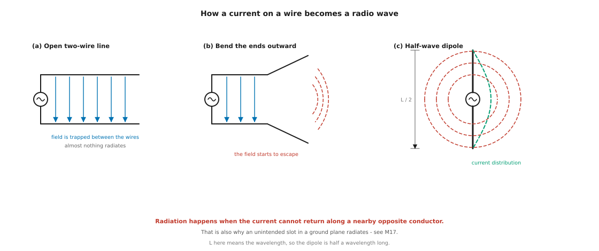
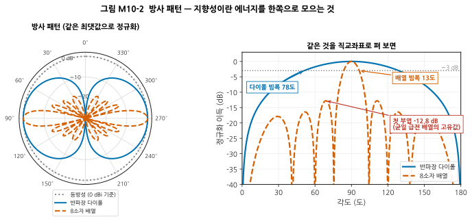
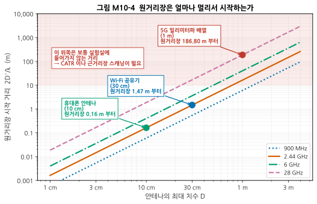
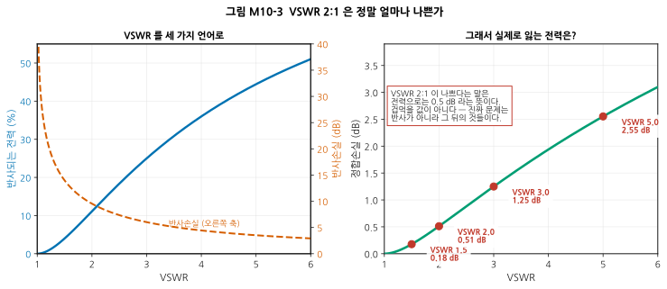
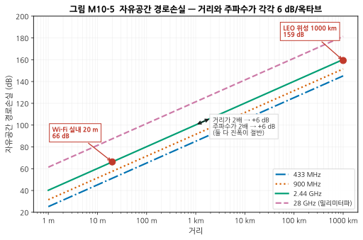
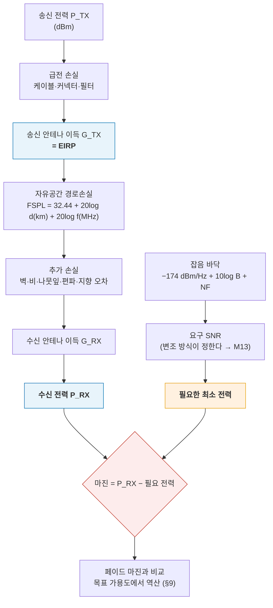
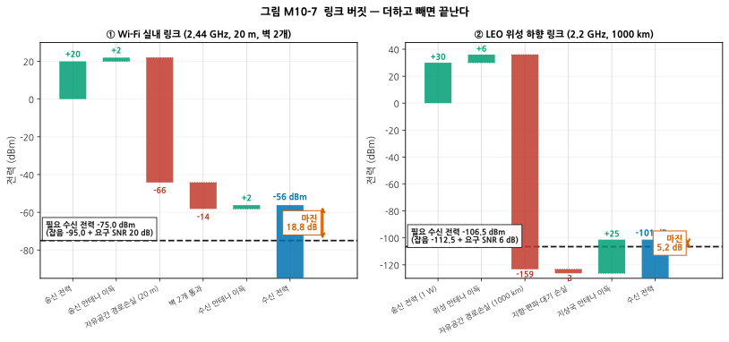
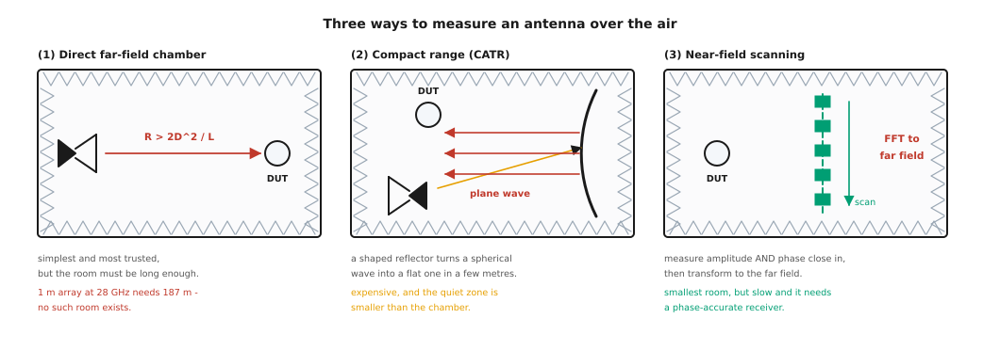

# M10 — 안테나와 전파: 공기 중으로 나가는 순간

**문서 번호**: RF-CUR-M10 · **버전**: v1.0 · **분량**: 이론 5 h + 실습 5 h

| | |
|---|---|
| **선수 모듈** | [M09](./M09_주파수변환과신호원.md), [M02](./M02_전송선로.md) (Γ·VSWR·정합), [M01](./M01_데시벨과전력.md) (dBm·열잡음) |
| **이 모듈이 소유하는 개념** | 방사의 발생, 안테나 파라미터(방사 패턴, 지향성, 이득 dBi, 효율, 빔폭, 부엽, 편파, 대역폭, 입력 임피던스), dBi와 dBd, **등가 등방성 복사 전력(EIRP)**, 근거리장/원거리장 경계(2D²/λ), 안테나 종류(다이폴·모노폴·패치·슬롯·칩·배열), 위상 배열과 빔포밍 개론, **자유공간 경로손실(FSPL)과 Friis 전송식**, 다중경로와 페이딩, **링크 버짓과 페이드 마진**, 가용도, 무반사실·CATR·근거리장 스캐닝(OTA 측정 개론) |
| **이 모듈을 쓰는 후속 모듈** | M11(안테나가 아키텍처에 거는 조건), **M12**(링크 버짓 → 감도 요구 → 부품 스펙), M13(다중경로가 신호 품질에 하는 일), M15(OTA 측정 절차), **M17**(안테나 배치·접지면·인증) |
| **학습 목표** | ① VSWR 2:1이 실제로 얼마나 나쁜지 dB와 전력 손실로 설명한다 ② FSPL을 계산하고 링크 버짓을 세워 마진을 구한다 ③ 왜 밀리미터파에서는 평범한 원거리장 측정이 불가능해지는지 설명한다 |

---

## M10.0 이 모듈의 범위

M09까지는 신호가 **도선 안에** 있었습니다. 이 모듈에서 신호는 도선을 떠납니다.

그 순간 세 가지가 새로 필요해집니다.

1. **방향** — 어느 쪽으로 얼마나 나가는가 (§1–4)
2. **거리** — 얼마나 멀리 갈 수 있는가 (§7–9)
3. **재는 법** — 도선이 없는데 어떻게 측정하는가 (§5, §10)

> ⚠️ **다른 모듈과의 역할 분리**
>
> | 개념 | M10 (여기) | 다른 모듈 |
> |---|---|---|
> | Γ·VSWR·반사손실 | **안테나에서 목표를 어떻게 잡는가** | [M02](./M02_전송선로.md)가 **정의**를, [M05](./M05_첫측정.md)가 **측정**을 소유 |
> | 잡음 바닥 −174 dBm/Hz | 링크 버짓에서 **쓴다** | [M01](./M01_데시벨과전력.md)이 정의, **M12가 감도 계산**을 소유 |
> | 링크 버짓 | **전파 구간**(EIRP → 경로손실 → 수신 전력) | **M12가 수신기 내부**(NF·IP3 배분)를 소유 |
> | OTA 측정 | **왜 어려운가, 어떤 방식이 있는가** | M15가 **절차와 불확도**를 소유 |
> | 안테나 배치·접지면 | 언급만 | **M17이 보드 설계**를 소유 |

> 📖 **이 모듈의 계산은 전부 재현 가능합니다.** 본문의 모든 수치는 `scripts/gen_fig_m10.py`가 계산하고 14개 항목을 자체 검산합니다.

---

## M10.1 왜 전류가 전파가 되는가

### 직관

[M02](./M02_전송선로.md)에서 전송선로를 다룰 때, 우리는 전자기장이 **두 도체 사이에 갇혀** 있는 상황만 봤습니다. 신호가 밖으로 새지 않는 것이 좋은 전송선로의 조건이었습니다.

**안테나는 정반대입니다. 일부러 새게 만드는 부품입니다.**



*그림 M10-1. **읽는 법**: (a) 평행 2선에서는 두 도체의 전류가 크기가 같고 방향이 반대라 멀리서 보면 서로 상쇄됩니다. 전기장(파란 화살표)이 선 사이에 갇혀 거의 방사하지 않습니다. (b) 끝을 벌리면 두 전류가 더 이상 상쇄되지 않고 전기장 일부가 빠져나가기 시작합니다(빨간 호). (c) 완전히 펴면 반파장 다이폴이 됩니다. 초록 점선이 도체 위의 전류 분포이며, 중앙에서 최대이고 양 끝에서 0입니다.*

> 📌 **한 줄 요약**: **방사는 전류가 "가까이 있는 반대 방향 도체"를 따라 되돌아가지 못할 때 일어납니다.**

> ⚠️ **이 문장이 보드 설계에서 그대로 문제가 됩니다.** 접지면에 슬릿이 나 있으면 되돌아가는 전류(리턴 커런트)가 우회하게 되고, 그 순간 그 슬릿이 **의도치 않은 안테나**가 됩니다. 전자파 적합성(EMC) 시험에서 떨어지는 흔한 원인이며, **M17**에서 다시 다룹니다.

### 전송선로에서 안테나로 — 연속적인 스펙트럼

| | 전송선로 | 안테나 |
|---|---|---|
| 목적 | 에너지를 **가두어 옮긴다** | 에너지를 **내보낸다** |
| 좋은 상태 | 방사 손실이 0 | 방사 효율이 100 % |
| 두 도체의 전류 | 크기 같고 방향 반대 → 상쇄 | 상쇄되지 않음 |
| 특성 | 특성 임피던스 Z₀ | 방사 저항 R_rad |

> 💡 **방사 저항(radiation resistance)** 이라는 말이 중요합니다. 안테나가 전력을 공간으로 내보내는 것을, 회로 쪽에서 보면 **저항이 전력을 소비하는 것과 구별할 수 없습니다.** 그래서 안테나의 입력 임피던스에는 "실제로 열이 되는 손실 저항"과 "전파가 되어 나가는 방사 저항"이 섞여 있습니다. 이 비율이 곧 §M10.3의 **효율**입니다.

---

## M10.2 안테나 파라미터 해부



*그림 M10-2. 왼쪽은 극좌표, 오른쪽은 같은 것을 직교좌표로 편 것입니다. 세 곡선 모두 **최댓값을 0 dB로 정규화**했습니다. **읽는 법**: 등방성(점선)은 모든 방향으로 똑같이 나가는 가상의 기준입니다. 반파장 다이폴(파랑)은 옆으로 퍼지고 축 방향으로는 나가지 않습니다. 8소자 배열(주황)은 좁은 주엽과 여러 개의 부엽을 가집니다. 오른쪽 그림에서 −3 dB 선과 만나는 폭이 **빔폭**, 주엽 옆의 봉우리가 **부엽**입니다.*

| 파라미터 | 뜻 | 그림에서 어디 |
|---|---|---|
| **방사 패턴** (radiation pattern) | 방향에 따라 얼마나 나가는가 | 곡선 전체 |
| **지향성** (directivity, D) | 최대 방향이 등방성보다 몇 배 센가 | 값 하나 (dBi) |
| **이득** (gain, G) | 지향성 × 효율 | 값 하나 (dBi) |
| **빔폭** (반전력 빔폭, Half-Power Beam Width, HPBW) | 최댓값에서 −3 dB 내려간 폭 | −3 dB 선과의 교차 |
| **부엽** (sidelobe) | 주엽 밖의 봉우리 | 주엽 옆의 작은 봉우리들 |
| **전후방비** (F/B ratio) | 앞과 뒤의 비 | 0°와 180°의 차 |
| **편파** (polarization) | 전기장이 어느 방향으로 흔들리는가 | 패턴만으로는 안 보임 |
| **대역폭** | 사양을 만족하는 주파수 범위 | S11 곡선(§M10.6) |

**이 예제의 계산값**:

| 안테나 | 지향성 | 빔폭 | 첫 부엽 |
|---|---|---|---|
| 등방성 (가상의 기준) | 0 dBi | — | — |
| **반파장 다이폴** | **2.15 dBi** | **78°** | 없음 |
| 8소자 균일 배열 (λ/2 간격) | 9.03 dBi | 12.8° | **−12.8 dB** |

> ⚠️ **부엽 −12.8 dB는 "설계를 못해서"가 아닙니다.** 모든 소자에 **똑같은 크기로 급전한 배열**은 반드시 이 정도의 부엽을 가집니다. 소자 수를 늘려도 −13.2 dB에 수렴할 뿐 좋아지지 않습니다.
>
> **부엽을 낮추려면 가장자리 소자의 급전을 줄여야 합니다**(테이퍼링, tapering). 대가는 **빔폭이 넓어지고 이득이 떨어지는 것**입니다. [M07](./M07_필터와수동네트워크.md)의 필터에서 본 "가파름 vs 리플"과 정확히 같은 구조의 맞바꿈입니다 — 두 경우 모두 푸리에 변환 쌍의 성질에서 나옵니다.

### 편파 — 패턴에는 안 보이지만 3 dB 이상을 좌우한다

전기장이 흔들리는 방향입니다. 송신과 수신의 편파가 맞지 않으면 그만큼 손실입니다.

| 송신 / 수신 | 편파 불일치 손실 |
|---|---|
| 수직 / 수직 | 0 dB |
| 수직 / 45° 기울어짐 | **3 dB** |
| 수직 / 수평 | 이론상 무한대 (실제로는 20~30 dB) |
| 원형 / 선형 | **3 dB** (항상) |

> 💡 **위성 통신이 원형 편파를 쓰는 이유**가 여기 있습니다. 위성은 자세가 계속 바뀌고 전파는 대기를 지나며 회전(패러데이 회전)합니다. 선형 편파라면 어긋날 때 완전히 끊기지만, **원형 편파는 어떻게 놓든 항상 3 dB만 손해**입니다. 최악을 피하려고 평균을 나쁘게 하는 선택입니다.

---

## M10.3 지향성·이득·효율 — 그리고 dBi vs dBd

### 세 값의 관계

$$G = \eta \cdot D$$

- **지향성 D**: 순수하게 "모양"만의 문제. 에너지를 얼마나 한쪽으로 모으는가.
- **효율 η**: 입력한 전력 중 얼마가 실제로 방사되는가. 나머지는 열이 되거나 반사됩니다.
- **이득 G**: 실제로 쓸 수 있는 값. 데이터시트에 적히는 것.

$$\eta = \frac{R_{rad}}{R_{rad} + R_{loss}}$$

**수치 예**: 지향성 5 dBi인 안테나의 효율이 50 %(−3 dB)라면 이득은 **2 dBi** 입니다.

> ⚠️ **작은 안테나는 효율이 나쁩니다.** 파장에 비해 안테나가 작아지면 방사 저항 R_rad이 급격히 작아지고, 상대적으로 손실 저항이 커집니다. **휴대기기의 칩 안테나 효율이 30~60 %인 것은 설계 실패가 아니라 물리적 제약**입니다(Chu-Harrington 한계). 이 손실은 링크 버짓에 반드시 반영해야 합니다.

### dBi와 dBd

| 단위 | 기준 | 변환 |
|---|---|---|
| **dBi** | 등방성 안테나 (isotropic) | — |
| **dBd** | 반파장 다이폴 (dipole) | **dBi = dBd + 2.15** |

> ⚠️ **광고에서 흔한 함정**: 같은 안테나를 "9 dBd"라고 쓰면 "11.15 dBi"보다 작아 보입니다. 두 안테나를 비교할 때는 **반드시 단위를 통일**하십시오. 단위가 안 적혀 있으면 보통 dBi입니다만, 확인하는 편이 안전합니다.

### 안테나 종류 개관

| 종류 | 전형적 이득 | 크기 | 특징 |
|---|---|---|---|
| 반파장 다이폴 | 2.15 dBi | λ/2 | 기준이 되는 안테나 |
| 모노폴 (접지면 위 λ/4) | 5.15 dBi (이상적 접지면) | λ/4 | **접지면이 안테나의 일부** |
| 패치 (마이크로스트립) | 6 ~ 9 dBi | λ/2 × λ/2 | 평면, 양산 쉬움, 대역폭 좁음 |
| 슬롯 | 다이폴과 비슷 | λ/2 | 금속면에 구멍을 낸 형태 |
| 칩 안테나 | −2 ~ +2 dBi | 매우 작음 | 효율이 낮고 **주변 부품에 민감** |
| 혼 (horn) | 10 ~ 25 dBi | 큼 | 대역폭 넓음, 측정 기준용 |
| 파라볼라 | 25 ~ 60 dBi | 매우 큼 | 위성·전파천문 |
| **위상 배열** | 소자 수에 비례 | 소자 수 × λ/2 | **빔을 전자적으로 돌린다** |

> 💡 **모노폴의 함정**: 모노폴 안테나는 **접지면이 안테나의 절반**입니다. 데이터시트의 이득은 보통 "충분히 큰 접지면 위에서" 잰 값입니다. 작은 보드에 그대로 붙이면 패턴도 이득도 완전히 달라집니다. **접지면 크기를 반드시 확인하십시오**(→ M17).

> 💡 **위상 배열과 빔포밍**: 여러 소자에 **위상을 조금씩 다르게** 급전하면 주엽이 기울어집니다. 소자 사이의 위상차를 Δφ, 간격을 d라 하면 빔이 향하는 각도는 sin θ = Δφ·λ/(2πd) 입니다. 기계적으로 돌리지 않고 **전자적으로 순식간에** 방향을 바꿀 수 있어 5G 밀리미터파와 레이더가 이 방식을 씁니다. 대가는 소자마다 위상천이기와 증폭기가 필요하다는 것입니다.

---

## M10.4 EIRP — 규제는 왜 EIRP로 제한하는가

$$\text{EIRP [dBm]} = P_{TX} + G_{TX} - L_{\text{케이블 등}}$$

**등가 등방성 복사 전력(Effective Isotropic Radiated Power, EIRP)** 은 "등방성 안테나로 같은 세기를 내려면 얼마의 전력이 필요한가"입니다.

**수치 예**: 송신 20 dBm, 케이블 손실 1 dB, 안테나 이득 6 dBi → **EIRP = 25 dBm**

| 관련 단위 | 기준 | 변환 |
|---|---|---|
| **EIRP** | 등방성 | — |
| **ERP** (Effective Radiated Power) | 반파장 다이폴 | **EIRP = ERP + 2.15 dB** |

> 📌 **왜 송신 전력이 아니라 EIRP를 규제하는가** — 규제의 목적은 **다른 사람에게 가는 간섭을 제한하는 것**입니다. 간섭의 크기를 정하는 것은 송신기 출력이 아니라 **실제로 그 방향으로 나간 전력**입니다.
>
> 송신 30 dBm + 0 dBi 안테나와, 송신 10 dBm + 20 dBi 안테나는 **주엽 방향으로는 똑같이 간섭**합니다. 그래서 둘을 같은 값(EIRP 30 dBm)으로 셉니다.

> ⚠️ **규제 값은 나라·대역·용도마다 다르고 개정됩니다.** 이 문서는 계산 방법만 다룹니다. **실제 한도는 반드시 해당 국가의 최신 규정(한국은 과학기술정보통신부 고시)을 직접 확인**하십시오. 인증 절차는 **M17**에서 다룹니다.

---

## M10.5 근거리장과 원거리장 — "얼마나 떨어져서 재야 하는가"

### 세 영역

| 영역 | 범위 | 무슨 일이 일어나나 |
|---|---|---|
| **반응성 근거리장** | R < 0.62·√(D³/λ) | 에너지가 저장되었다 돌아온다. 손을 대면 임피던스가 바뀐다 |
| **방사성 근거리장** (프레넬) | 그 위 ~ 2D²/λ | 방사는 하지만 **패턴이 거리에 따라 변한다** |
| **원거리장** (프라운호퍼) | **R > 2D²/λ** | 패턴이 더 이상 변하지 않는다. 전력이 1/R²로 준다 |

(D는 안테나의 최대 치수, λ는 파장)



*그림 M10-3. 가로축은 안테나의 최대 치수 D, 세로축은 원거리장이 시작되는 거리 2D²/λ입니다(둘 다 로그). **읽는 법**: **D가 2배가 되면 거리는 4배**가 됩니다(제곱이므로). 주파수를 올리면 λ가 작아져 거리가 더 멀어집니다. 분홍 영역은 보통의 실험실에 들어가지 않는 거리입니다.*

| 안테나 | 주파수 | 원거리장 시작 |
|---|---|---|
| 휴대폰 안테나 (10 cm) | 2.44 GHz | **0.16 m** |
| Wi-Fi 공유기 (30 cm) | 2.44 GHz | 1.47 m |
| **5G 밀리미터파 배열 (1 m)** | **28 GHz** | **186.8 m** |

> ⚠️ **이것이 학습 목표 ③의 답입니다.** 1 m짜리 밀리미터파 배열의 원거리장은 **187 m 부터** 시작합니다. 그런 무반사실은 존재하지 않습니다. 그래서 밀리미터파에서는 §M10.10의 **컴팩트 안테나 시험장(Compact Antenna Test Range, CATR)이나 근거리장 스캐닝**을 써야 합니다.

> 💡 **밀리미터파에서 도전(conducted) 측정도 어려워집니다.** 안테나가 칩과 한 패키지에 들어가(AiP, Antenna-in-Package) 커넥터를 꽂을 자리가 아예 없기 때문입니다. **측정이 전부 OTA가 되는 것**이 밀리미터파 검증의 근본적 어려움입니다.

---

## M10.6 안테나 임피던스와 정합 — VSWR 목표를 어떻게 잡는가

### VSWR 2:1은 정말 얼마나 나쁜가

[M02](./M02_전송선로.md)에서 정재파비(Voltage Standing Wave Ratio, VSWR)를 정의했습니다. 안테나 사양에서 가장 자주 보는 숫자이므로, **실제 손해가 얼마인지** 확인하고 갑니다.



*그림 M10-4. 왼쪽: 같은 VSWR을 반사 전력(%)과 반사손실(dB)로 바꾼 것. 오른쪽: 실제로 잃는 전력, 즉 정합손실(mismatch loss)입니다. **읽는 법**: VSWR 2:1에서 반사되는 전력은 11 %이지만, dB로는 **0.51 dB**에 불과합니다.*

| VSWR | \|Γ\| | 반사손실 | 반사되는 전력 | **정합손실** |
|---|---|---|---|---|
| 1.2 | 0.091 | 20.8 dB | 0.8 % | **0.04 dB** |
| 1.5 | 0.200 | 14.0 dB | 4.0 % | **0.18 dB** |
| **2.0** | 0.333 | **9.5 dB** | 11.1 % | **0.51 dB** |
| 3.0 | 0.500 | 6.0 dB | 25.0 % | 1.25 dB |
| 5.0 | 0.667 | 3.5 dB | 44.4 % | 2.55 dB |

> 📌 **학습 목표 ①의 답**: VSWR 2:1은 전력으로는 **0.51 dB** 손해입니다. 링크 버짓에서 0.5 dB는 대개 무시할 수 있는 양입니다. **VSWR 2:1을 "나쁘다"고 부르는 것은 전력 손실 때문이 아닙니다.**

### 그러면 왜 VSWR을 신경 쓰는가

진짜 이유는 **반사된 전력이 뒤로 돌아가서 하는 짓** 입니다.

| 진짜 이유 | 무슨 일이 일어나나 |
|---|---|
| **PA 보호** | 반사파가 전력 증폭기로 되돌아가 부하 임피던스를 바꾸고, 심하면 파괴한다 (→ [M08](./M08_증폭기.md)) |
| **PA 성능 변화** | 부하가 바뀌면 출력·효율·선형성이 전부 달라진다 |
| **송수신 스위치의 격리** | 반사파가 수신단으로 새어 든다 |
| **주파수 응답의 리플** | 케이블 양 끝의 반사가 왕복하며 이득에 물결을 만든다 |
| **진단의 단서** | VSWR이 갑자기 나빠졌다면 **안테나가 부러졌거나 물이 들어간 것**이다 |

> 💡 **그래서 실무의 목표값은 용도가 정합니다.**
>
> | 용도 | 흔한 목표 |
> |---|---|
> | 소비자 기기 안테나 | VSWR < 2 ~ 3 (반사손실 6~10 dB) |
> | 기지국 송신 경로 | VSWR < 1.5 (**PA 보호가 목적**) |
> | 계측기 포트 | VSWR < 1.2 |
> | 안테나 고장 감시 | 평소 값 대비 **변화**를 본다 |

> ⚠️ **안테나의 S11은 주변 환경에 크게 흔들립니다.** 손, 케이스, 금속, 사람의 몸이 모두 임피던스를 바꿉니다. **정합은 실제 사용 조건에 가깝게 두고 맞춰야** 하며, 실습 L10-b에서 이것을 직접 해 봅니다.

---

## M10.7 경로손실 — 왜 멀어지면 약해지는가

### 자유공간 경로손실

$$\text{FSPL [dB]} = 20\log_{10}\left(\frac{4\pi d f}{c}\right)$$

거리 d를 km, 주파수 f를 MHz로 넣으면 흔히 쓰는 형태가 됩니다.

$$\text{FSPL [dB]} = 32.44 + 20\log_{10}(d_{km}) + 20\log_{10}(f_{MHz})$$



*그림 M10-5. 가로축은 거리(로그), 세로축은 자유공간 경로손실(dB)입니다. **읽는 법**: 모든 선의 기울기가 같습니다. **거리가 2배가 되면 +6 dB, 주파수가 2배가 되어도 +6 dB** 입니다. 두 경우 모두 전계 진폭이 절반이 되기 때문입니다.*

> ⚠️ **"높은 주파수는 더 많이 감쇠한다"는 흔한 오해** — 자유공간 자체는 주파수와 무관하게 에너지를 흡수하지 않습니다. FSPL 식에 f가 들어 있는 이유는 **수신 안테나의 유효 면적이 λ²에 비례**하기 때문입니다. 같은 이득(dBi)의 안테나라도 주파수가 높으면 물리적으로 작아지고, 작으면 전력을 덜 주워 담습니다.
>
> **결론**: 주파수를 올리면서 안테나 **크기를 그대로** 두면(= 이득이 올라감) 그 6 dB를 되찾을 수 있습니다. 밀리미터파에서 배열 안테나가 필수인 이유입니다.

### Friis 전송식

$$P_{RX} = P_{TX} + G_{TX} + G_{RX} - \text{FSPL} - L_{\text{기타}}$$

전부 dB 단위이므로 **더하고 빼면 끝입니다.** 링크 버짓의 뼈대가 이 한 줄입니다.

### 실제 환경은 자유공간이 아니다

| 추가 손실 | 전형적 크기 | 언제 |
|---|---|---|
| 벽 (석고보드) | 3 ~ 5 dB | 실내 |
| 벽 (콘크리트) | 10 ~ 20 dB | 실내 |
| 유리 (저방사 코팅) | 20 ~ 30 dB | 실내→실외 |
| 사람 몸 | 3 ~ 20 dB | 휴대기기 |
| 비 (밀리미터파) | 수 ~ 수십 dB/km | 28 GHz 이상 |
| 나뭇잎 | 대역·밀도에 따라 큼 | 실외 |

> 💡 **실내 전파는 거리의 2제곱이 아니라 3~4제곱으로 줄어드는 것처럼 보입니다.** 벽과 바닥에서 반사·투과가 반복되기 때문입니다. 실측 기반의 경로손실 모델(경로손실 지수 n = 2~4)을 쓰는 이유입니다.

### 다중경로와 페이딩

여러 경로로 온 파가 겹치면, 위상에 따라 **더해지기도 하고 상쇄되기도 합니다.**

- **상쇄되는 지점**: 신호가 갑자기 20~30 dB 떨어집니다 (딥, deep fade)
- 그 간격은 **약 반 파장** — 2.4 GHz에서 **6 cm**

> 📌 **"휴대폰을 조금 움직이면 잘 터진다"는 경험이 바로 이것입니다.** 딥에서 벗어난 것뿐입니다.

> 💡 **대책**: 안테나를 두 개 두고 좋은 쪽을 고르거나(다이버시티), 여러 안테나를 동시에 쓰거나(다중 입출력, Multiple-Input Multiple-Output, MIMO), 넓은 대역에 퍼뜨려 일부만 잃게 합니다(직교 주파수 분할 다중, Orthogonal Frequency Division Multiplexing, OFDM). **정량적 연결은 M13이 소유**합니다.

---

## M10.8 링크 버짓 — 더하고 빼면 끝난다

### 만드는 순서

1. **송신 쪽**: 송신 전력 → 케이블·필터 손실 → 안테나 이득 → **EIRP**
2. **전파 구간**: 자유공간 경로손실 → 추가 손실(벽·비·편파·지향 오차)
3. **수신 쪽**: 안테나 이득 → **수신 전력 P_RX**
4. **필요한 값**: 잡음 바닥 = −174 dBm/Hz + 10·log₁₀(B) + 잡음지수(Noise Figure, NF), 여기에 **요구 신호 대 잡음비(Signal-to-Noise Ratio, SNR)** 를 더한 것
5. **마진** = P_RX − 필요한 값



*그림 M10-6. 링크 버짓을 만드는 순서. **읽는 법**: 왼쪽 줄기는 "실제로 얼마가 도착하는가", 오른쪽 줄기는 "얼마가 필요한가"입니다. 둘의 차이가 마진이고, 그 마진이 목표 가용도를 만족하는지를 §M10.9로 확인합니다. **수신기 내부의 NF를 어떻게 만들 것인가는 M12가 소유**합니다.*



*그림 M10-7. 두 링크의 폭포 차트(waterfall chart)입니다. **읽는 법**: 초록 막대는 더하는 것(이득), 빨간 막대는 빼는 것(손실)입니다. 파란 막대가 최종 수신 전력, 검은 파선이 필요한 최소 전력, 그 사이가 **마진**입니다. 두 링크 모두 필요한 최소 전력을 **잡음 바닥 + 요구 SNR**으로 계산했습니다 — 데이터시트의 "감도" 값을 그대로 쓰면 그 값에 이미 포함된 여유 때문에 아래 표와 어긋납니다.*

**① Wi-Fi 실내 링크** (2.44 GHz, 20 m, 벽 2개)

| 항목 | 값 |
|---|---|
| 송신 전력 | +20 dBm |
| 송신 안테나 이득 | +2 dBi → EIRP +22 dBm |
| 자유공간 경로손실 (20 m) | −66.2 dB |
| 벽 2개 (7 dB씩) | −14 dB |
| 수신 안테나 이득 | +2 dBi |
| **수신 전력** | **−56.2 dBm** |
| 잡음 (NF 6 dB, 20 MHz) | −95.0 dBm |
| 실제 SNR | 38.8 dB |
| 요구 SNR (예: 64-QAM 직교 진폭 변조 → M13) | 20 dB |
| **마진** | **+18.8 dB** |

**② LEO 위성 하향 링크** (2.2 GHz, 1000 km)

| 항목 | 값 |
|---|---|
| 송신 전력 (1 W) | +30 dBm |
| 위성 안테나 이득 | +6 dBi → EIRP +36 dBm |
| 자유공간 경로손실 (1000 km) | **−159.3 dB** |
| 지향·편파·대기 손실 | −3 dB |
| 지상국 안테나 이득 | +25 dBi |
| **수신 전력** | **−101.3 dBm** |
| 잡음 (NF 1.5 dB, 1 MHz) | −112.5 dBm |
| 실제 SNR | 11.2 dB |
| 요구 SNR | 6 dB |
| **마진** | **+5.2 dB** |

> 📌 **두 링크를 나란히 놓으면 배울 것이 많습니다.**
> - 경로손실이 **93 dB나 차이**나는데도 링크가 성립합니다. 안테나 이득(25 dBi)과 좁은 대역폭(1 MHz), 낮은 요구 SNR(6 dB)이 그것을 메웁니다.
> - **대역폭을 좁히면 잡음이 줄어듭니다.** 20 MHz에서 1 MHz로 줄이면 13 dB를 법니다. 대신 데이터 속도가 줄어듭니다.
> - **요구 SNR은 변조 방식이 정합니다.** 낮은 차수 변조를 쓰면 SNR 요구가 낮아지지만 속도가 느려집니다(→ M13).

> ⚠️ **링크 버짓은 "된다/안 된다"가 아니라 "얼마나 여유가 있나"를 봅니다.** 마진 0 dB는 성공이 아니라 실패입니다. 다음 절이 그 이유입니다.

---

## M10.9 페이드 마진과 가용도

전파는 시간에 따라 흔들립니다. **평균적으로 마진이 있어도 순간적으로 부족할 수 있습니다.**

다중경로가 심한 환경(직시 경로가 없는 실내·도심)에서는 신호 진폭이 **레일리 분포**를 따르는 것으로 근사합니다. 그러면 마진 M(dB)이 모자랄 확률은

$$P_{\text{끊김}} = 1 - \exp\left(-10^{-M/10}\right)$$

| 페이드 마진 | 끊길 확률 | 가용도 |
|---|---|---|
| 0 dB | 63.2 % | 36.8 % |
| 10 dB | 9.5 % | 90.5 % |
| **13 dB** | **4.9 %** | **95.1 %** |
| **20 dB** | **1.0 %** | **99.0 %** |
| 30 dB | 0.1 % | 99.9 % |

> ⚠️ **마진 0 dB는 "절반쯤 되는" 링크가 아니라 "63 %의 시간 동안 끊기는" 링크입니다.** 가용도를 한 자릿수 올릴 때마다 마진이 10 dB씩 더 필요합니다.

> 📌 **그래서 위 Wi-Fi 링크의 마진 18.8 dB는 넉넉한 것이 아니라 적정한 것**이고, LEO 링크의 5.2 dB는 **직시 경로가 확보된 위성 링크이기에** 성립하는 값입니다. 같은 5.2 dB를 실내 Wi-Fi에 적용하면 30 %가 끊깁니다.

> 💡 **직시(Line of Sight, LOS) 링크에는 레일리가 아니라 라이시안(Rician) 분포를 씁니다.** 강한 직접파가 있으면 페이딩이 훨씬 얕아져 필요한 마진이 줄어듭니다. 자세한 모델은 이 커리큘럼의 범위를 넘습니다 — 여기서는 **"환경이 마진 요구를 정한다"** 는 원칙만 가져가면 충분합니다.

---

## M10.10 OTA 측정 개론 — 도선이 없는데 어떻게 재는가



*그림 M10-8. **읽는 법**: (1) 원거리장 무반사실은 가장 단순하고 신뢰도가 높지만 방이 충분히 길어야 합니다. (2) CATR은 곡면 반사판으로 구면파를 평면파로 바꿔 짧은 거리에서 원거리장 조건을 만듭니다. (3) 근거리장 스캐닝은 가까이서 **진폭과 위상을 모두** 재고 수학적으로(푸리에 변환) 원거리장을 계산합니다.*

| 방식 | 필요한 방 크기 | 장점 | 단점 |
|---|---|---|---|
| **직접 원거리장** | 2D²/λ 이상 | 단순, 신뢰도 높음 | 밀리미터파·대형 안테나에는 불가능 |
| **CATR** (Compact Antenna Test Range) | 몇 미터 | 짧은 거리에서 평면파 | 비쌈, **정숙 영역(quiet zone)이 방보다 작음** |
| **근거리장 스캐닝** | 가장 작음 | 방이 작아도 됨 | 느림, **위상까지 정확히 재는 수신기 필요** |

> ⚠️ **무반사실의 흡수체는 주파수에 한계가 있습니다.** 낮은 주파수일수록 흡수체가 길어야 하므로, 방마다 "이 주파수 이상에서만 유효"라는 조건이 붙습니다. 무반사실을 빌릴 때 반드시 확인하십시오.

> 📌 **측정 절차·불확도 예산·표준(예: CTIA OTA, 3GPP TR 38.810)은 M15가 소유합니다.** 여기서는 "왜 세 가지 방식이 존재하는가"만 이해하면 충분합니다.

---

## M10.L 실습

### L10-a — 링크 버짓 계산기 만들기 (Tier 0, 2.5시간)

**목표**: 두 종류의 링크(실내 Wi-Fi, LEO 위성)를 계산하는 도구를 만들고, 파라미터를 바꿔 가며 무엇이 지배적인지 감을 잡습니다.

**준비물**: Python 3, `numpy`

**절차**

1. 아래 스크립트를 `l10a.py`로 저장하고 실행합니다.

```python
import numpy as np

C = 299792458.0


def fspl_db(d_m, f_hz):
    return 20 * np.log10(4 * np.pi * d_m * f_hz / C)


def link(name, f_hz, d_m, pt_dbm, gt_dbi, gr_dbi, extra_db,
         nf_db, bw_hz, snr_req_db):
    """한 링크의 수신 전력과 마진을 계산한다."""
    fspl = fspl_db(d_m, f_hz)
    pr = pt_dbm + gt_dbi + gr_dbi - fspl - extra_db
    noise = -174.0 + 10 * np.log10(bw_hz) + nf_db
    need = noise + snr_req_db
    print(f"\n=== {name} ===")
    print(f"  주파수 {f_hz/1e9:.3f} GHz, 거리 {d_m:,.0f} m")
    print(f"  송신 전력          {pt_dbm:+8.1f} dBm")
    print(f"  송신 안테나 이득    {gt_dbi:+8.1f} dBi   -> EIRP "
          f"{pt_dbm+gt_dbi:+.1f} dBm")
    print(f"  자유공간 경로손실   {-fspl:+8.1f} dB")
    print(f"  기타 손실          {-extra_db:+8.1f} dB")
    print(f"  수신 안테나 이득    {gr_dbi:+8.1f} dBi")
    print(f"  ---------------------------------")
    print(f"  수신 전력          {pr:+8.1f} dBm")
    print(f"  잡음 전력          {noise:+8.1f} dBm  (NF {nf_db} dB, "
          f"BW {bw_hz/1e6:g} MHz)")
    print(f"  실제 SNR           {pr-noise:+8.1f} dB   (요구 {snr_req_db} dB)")
    print(f"  링크 마진          {pr-need:+8.1f} dB")
    return pr - need


def rayleigh_outage(margin_db):
    """레일리 페이딩에서 마진이 모자랄 확률."""
    return 1.0 - np.exp(-10 ** (-margin_db / 10))


link("Wi-Fi 실내 (벽 2개)", 2.44e9, 20.0, 20.0, 2.0, 2.0, 14.0,
     6.0, 20e6, 20.0)
link("LEO 위성 하향", 2.2e9, 1_000_000.0, 30.0, 6.0, 25.0, 3.0,
     1.5, 1e6, 6.0)

print("\n=== 페이딩 마진과 가용도 (레일리) ===")
print(f"{'마진(dB)':>9} {'끊길 확률':>12} {'가용도':>10}")
for m in (0, 5, 10, 13, 20, 30):
    p = rayleigh_outage(m)
    print(f"{m:9.0f} {p*100:11.3f} % {100*(1-p):9.3f} %")
```

2. 다음 질문에 **계산으로** 답합니다.
   - Wi-Fi 링크의 거리를 40 m로 늘리면 마진은 몇 dB 줄어드는가? (예측한 뒤 실행해 확인)
   - LEO 링크에서 지상국 안테나를 25 dBi에서 19 dBi로 줄이면 어떻게 되는가?
   - 대역폭을 20 MHz → 5 MHz로 줄이면 마진은?
3. 여러분이 관심 있는 링크(드론 조종, LoRa, 차량 키)를 하나 골라 값을 넣고 계산합니다.

**예상 결과** (일부)

```
=== Wi-Fi 실내 (벽 2개) ===
  수신 전력             -56.2 dBm
  잡음 전력             -95.0 dBm  (NF 6.0 dB, BW 20 MHz)
  실제 SNR              +38.8 dB   (요구 20.0 dB)
  링크 마진             +18.8 dB

=== LEO 위성 하향 ===
  수신 전력            -101.3 dBm
  잡음 전력            -112.5 dBm  (NF 1.5 dB, BW 1 MHz)
  실제 SNR              +11.2 dB   (요구 6.0 dB)
  링크 마진              +5.2 dB
```

**판정 기준**

| 항목 | 합격 |
|---|---|
| 재현 | 위 값이 그대로 나온다 |
| 예측 ① | 거리 2배 → 마진 **6 dB** 감소를 미리 맞혔다 |
| 예측 ② | 안테나 6 dB 감소 → 마진 6 dB 감소를 미리 맞혔다 |
| 예측 ③ | 대역폭 1/4 → 잡음 6 dB 감소 → 마진 **6 dB 증가**를 미리 맞혔다 |
| 해석 | 마진 5.2 dB가 실내 링크에서는 왜 부족한지 §M10.9로 설명할 수 있다 |

**흔한 실수**

| 실수 | 증상 | 바로잡기 |
|---|---|---|
| dB와 배수를 섞음 | 값이 터무니없다 | **전부 dB로** 계산하고 마지막에만 배수로 바꾼다 |
| 케이블·커넥터 손실 누락 | 실측이 예측보다 2~4 dB 낮다 | 송수신 양쪽의 급전 손실을 항목으로 넣는다 |
| 안테나 효율 무시 | 칩 안테나에서 3~5 dB 어긋난다 | 데이터시트의 **이득(dBi)** 을 쓴다 (지향성이 아니라) |
| 편파 손실 누락 | 3 dB가 사라진다 | 원형↔선형이면 **항상 3 dB** |
| 페이드 마진 미반영 | 평균은 맞는데 자주 끊긴다 | §M10.9의 표로 목표 가용도에서 역산 |

---

### L10-b — NanoVNA로 안테나 S11 재기 (Tier 1, 2.5시간)

**목표**: 실제 안테나의 반사 특성을 재고, **주변 환경이 얼마나 크게 영향을 주는지** 직접 확인합니다.

> ⚠️ **안전** — 측정 전에 안테나가 어떤 송신기에도 연결되어 있지 않은지 확인하십시오. VNA 포트에 송신 전력이 들어가면 즉시 고장납니다([M04 §5](./M04_RF실험실입문.md)).

**셋업**

```
[NanoVNA 포트 1] --(짧은 동축)-- [안테나]
```

| 등급 | 장비 |
|---|---|
| **Tier 1** | NanoVNA(수만 원대) + 2.4 GHz 안테나 2~3종 + 교정 키트 |
| **Tier 2** | 실험실 VNA + 무반사실 (있으면) |
| **Tier 0** | 측정 불가. L10-a와 아래 계산 과제로 대체 |

**절차**

1. **먼저 교정합니다** (Open-Short-Load). 케이블 끝까지 기준면을 옮깁니다(→ [M05](./M05_첫측정.md)).
2. 안테나를 연결하고 S11을 **로그 크기**로 봅니다. 최저점(공진 주파수)과 −10 dB 대역폭을 기록합니다.
3. 같은 것을 **스미스 차트**로도 봅니다(→ [M03](./M03_S파라미터와스미스차트.md)). 궤적이 차트 중심 근처를 지나는지 확인합니다.
4. **환경 실험** — 아래 조건을 각각 바꿔 가며 공진 주파수와 −10 dB 대역폭을 다시 기록합니다.
   - 안테나를 손으로 잡았을 때
   - 금속판 위 5 cm에 두었을 때
   - 플라스틱 케이스에 넣었을 때
   - 케이블을 다르게 감았을 때
5. 표를 만들어 **변화량(MHz, dB)** 을 정리합니다.

**예상 결과**

| 조건 | 공진 주파수 | −10 dB 대역폭 | 최저 S11 |
|---|---|---|---|
| 자유 공간 | 기준값 | 기준값 | 기준값 |
| 손으로 잡음 | **수십 MHz 내려감** | 넓어짐(손실 때문) | 좋아 보일 수 있음 |
| 금속판 근처 | 크게 이동 | 크게 변함 | 나빠짐 |
| 케이스 안 | 내려감 (유전율 때문) | 조금 변함 | — |

> 📌 **"손으로 잡으면 S11이 좋아지는" 현상에 속지 마십시오.** 손이 전력을 **흡수**해서 반사가 줄어든 것입니다. 반사는 줄었지만 **방사 효율은 오히려 나빠졌습니다.** S11은 "얼마나 반사되는가"만 알려 줄 뿐, **"얼마나 방사되는가"는 알려 주지 않습니다.**

**판정 기준**

| 항목 | 합격 |
|---|---|
| 교정 | 수행했고 기준면 위치를 설명할 수 있다 |
| 공진 주파수 | 사양의 ±5 % 안 |
| 환경 실험 | 네 조건을 모두 기록하고 변화량을 정리했다 |
| **해석** | **S11만으로는 효율을 알 수 없다**는 것을 설명할 수 있다 |

**흔한 실수**

| 실수 | 증상 | 바로잡기 |
|---|---|---|
| 교정 안 함 | 케이블 위상 때문에 스미스 차트가 빙빙 돈다 | 반드시 OSL 교정 |
| 측정 중 손으로 케이블을 잡음 | 값이 계속 변한다 | 안테나와 손을 떼고, 케이블을 고정 |
| 금속 책상 위에서 측정 | 사양과 전혀 다른 값 | 나무 책상, 주변 30 cm 이상 비우기 |
| S11이 좋으니 안테나가 좋다고 판단 | 실제 통달 거리가 안 나온다 | **효율은 OTA로만 알 수 있다** |

**계산 과제 (Tier 0)**: 반사손실 6 dB(VSWR 3:1)인 안테나와 반사손실 14 dB(VSWR 1.5:1)인 안테나는 링크 버짓에서 몇 dB 차이인가? 그 차이가 §M10.8의 마진에서 의미가 있는가?

---

## M10.Q 확인 문제

<details>
<summary><b>Q1.</b> 안테나 사양에 "VSWR < 2:1"이라고 적혀 있다. 이때 전력은 몇 % 반사되고, dB로는 얼마를 잃는가? 이 값이 링크에서 의미가 있는가?</summary>

- \|Γ\| = (2−1)/(2+1) = **0.333**
- 반사되는 전력 = Γ² = **11.1 %**
- 반사손실 = −20·log₁₀(0.333) = **9.5 dB**
- **정합손실 = −10·log₁₀(1 − 0.111) = 0.51 dB**

**링크에서의 의미**: 0.5 dB는 §M10.8의 마진(18.8 dB, 5.2 dB) 어느 쪽에서도 결정적이지 않습니다.

**그런데도 VSWR을 관리하는 이유**는 전력 손실이 아니라 (1) PA 보호, (2) PA의 부하 변화, (3) 송수신 격리, (4) **고장 진단의 단서**이기 때문입니다. VSWR이 평소 1.3에서 갑자기 3으로 올랐다면 안테나나 케이블에 물리적 문제가 생긴 것입니다.
</details>

<details>
<summary><b>Q2.</b> 2.44 GHz에서 30 m 떨어진 두 지점의 자유공간 경로손실은? 주파수를 5.5 GHz로 바꾸면 얼마나 늘어나는가?</summary>

$$\text{FSPL} = 32.44 + 20\log_{10}(0.03) + 20\log_{10}(2440) = 32.44 - 30.46 + 67.75 = \mathbf{69.7\ dB}$$

5.5 GHz로 바꾸면 주파수 비가 5500/2440 = 2.25배이므로

$$20\log_{10}(2.25) = \mathbf{+7.0\ dB}$$

즉 **76.8 dB**가 됩니다.

**해석**: 5 GHz Wi-Fi가 2.4 GHz보다 통달 거리가 짧은 이유의 절반이 이것입니다(나머지 절반은 벽 투과 손실이 더 크다는 점). 다만 §M10.7에서 봤듯 **같은 크기의 안테나를 쓰면** 이득이 7 dB 올라가 상쇄할 수 있습니다.
</details>

<details>
<summary><b>Q3.</b> 지향성 8 dBi, 효율 40 %인 안테나의 이득은? 이 안테나에 20 dBm을 넣으면 EIRP는?</summary>

- 효율 40 % = 10·log₁₀(0.4) = **−3.98 dB**
- 이득 G = 8 − 3.98 = **4.0 dBi**
- EIRP = 20 + 4.0 = **24.0 dBm**

**주의**: 지향성 8 dBi를 그대로 쓰면 EIRP를 28 dBm으로 4 dB 과대평가하게 됩니다. **데이터시트가 지향성을 적었는지 이득을 적었는지 반드시 확인**하십시오. 링크 버짓에는 항상 **이득**을 씁니다.
</details>

<details>
<summary><b>Q4.</b> 1 m 크기의 배열 안테나를 28 GHz에서 측정하려 한다. 원거리장은 얼마나 떨어져서 시작하는가? 실험실에서 측정할 수 있는가?</summary>

λ = c/f = 3×10⁸ / 28×10⁹ = **10.7 mm**

$$R_{far} = \frac{2 D^2}{\lambda} = \frac{2 \times 1^2}{0.0107} = \mathbf{187\ m}$$

**측정할 수 없습니다.** 187 m짜리 무반사실은 존재하지 않습니다.

**대안**
1. **CATR** — 곡면 반사판으로 몇 미터 안에서 평면파를 만든다
2. **근거리장 스캐닝** — 가까이서 진폭·위상을 재고 푸리에 변환으로 원거리장을 계산한다
3. **소자 단위 측정 + 배열 계수 계산** — 전체를 재는 대신 조합으로 예측한다

**추가로**: 밀리미터파에서는 안테나가 칩과 한 패키지(AiP)에 들어가 **커넥터를 꽂을 자리조차 없는 경우가 많습니다.** 도전 측정도, 원거리장 측정도 어려운 것이 밀리미터파 검증의 근본 문제입니다.
</details>

<details>
<summary><b>Q5.</b> 실내 Wi-Fi 링크에서 계산한 마진이 5 dB다. 이 링크의 가용도는 대략 얼마인가?</summary>

레일리 페이딩 근사로

$$P_{\text{끊김}} = 1 - \exp(-10^{-5/10}) = 1 - \exp(-0.316) = \mathbf{27.1\ \%}$$

**가용도는 약 72.9 %** 입니다. 즉 **네 번 중 한 번 이상 끊깁니다.**

**목표를 99 %로 하려면** 마진 20 dB가 필요합니다. 15 dB를 더 확보해야 하며, 방법은 (1) 송신 전력 증가(규제 한도 안에서), (2) 안테나 이득 증가, (3) 거리 단축, (4) 대역폭 축소, (5) 낮은 차수 변조로 요구 SNR 낮추기 — 그리고 실제로 가장 많이 쓰이는 (6) **다이버시티나 다중 입출력(MIMO)으로 페이딩 자체를 줄이기** 입니다.

**주의**: 직시 경로가 확보된 링크는 레일리보다 페이딩이 얕으므로(라이시안), 이 표는 **보수적인 추정**입니다.
</details>

<details>
<summary><b>Q6.</b> 어떤 안테나 광고에 "이득 9 dBd"라고 적혀 있고, 다른 제품은 "이득 10 dBi"라고 적혀 있다. 어느 쪽이 더 센가?</summary>

**9 dBd = 9 + 2.15 = 11.15 dBi** 이므로 **첫 번째가 1.15 dB 더 셉니다.**

dBd는 반파장 다이폴(2.15 dBi)을 기준으로 하므로, 같은 안테나라도 dBd로 적으면 숫자가 2.15만큼 작아 보입니다.

**실무 지침**: 단위가 명시되지 않은 이득 값은 신뢰하지 마십시오. 또한 그 값이 **지향성인지 이득인지**(효율 포함 여부), **어떤 접지면 조건에서 잰 것인지**도 함께 확인해야 합니다.
</details>

<details>
<summary><b>Q7.</b> 8소자 균일 배열의 첫 부엽이 −12.8 dB다. 이것을 −25 dB로 낮추려면 무엇을 해야 하며 무엇을 잃는가?</summary>

**해야 할 일**: 소자마다 급전 크기를 다르게 합니다(진폭 테이퍼링). 가장자리 소자를 약하게, 가운데를 세게 급전합니다. 체비셰프 분포, 테일러 분포 등이 쓰입니다.

**잃는 것**
1. **빔폭이 넓어집니다** — 가장자리 소자를 덜 쓰므로 실효 개구가 작아집니다.
2. **이득이 떨어집니다** — 같은 이유로 개구 효율이 낮아집니다.
3. 급전망이 복잡해집니다.

**같은 구조를 이미 봤습니다**: [M07 §3](./M07_필터와수동네트워크.md)의 필터에서 "차단을 가파르게 하면 리플이나 군지연을 대가로 낸다"고 한 것과 **수학적으로 같은 맞바꿈**입니다. 둘 다 푸리에 변환 쌍의 성질(시간/공간 창을 좁히면 주파수/각도 응답이 퍼진다)에서 나옵니다.
</details>

<details>
<summary><b>Q8.</b> 원형 편파 위성 안테나와 선형 편파 지상 안테나를 쓰면 몇 dB를 잃는가? 왜 그런 조합을 쓰는가?</summary>

**항상 3 dB** 를 잃습니다. 원형 편파는 두 직교 성분에 전력을 절반씩 나눠 싣기 때문에, 선형 안테나는 언제나 절반만 받습니다.

**그런데도 쓰는 이유**: 선형-선형 조합은 정렬이 맞으면 0 dB지만 **어긋나면 20~30 dB를 잃습니다.** 위성은 자세가 계속 바뀌고 전파는 전리층에서 회전(패러데이 회전)합니다.

**즉, 최악의 경우를 없애기 위해 평균을 3 dB 나쁘게 만든 것**입니다. 링크 버짓에서 예측 가능한 3 dB는 예측 불가능한 30 dB보다 훨씬 낫습니다.
</details>

---

## M10.11 한 장 요약

| 무엇 | 한 줄 | 절 |
|---|---|---|
| 방사의 조건 | 전류가 **가까운 반대 도체로 되돌아가지 못할 때** 방사한다 | §1 |
| 접지면 슬릿 | 같은 이유로 **의도치 않은 안테나**가 된다 (→ M17) | §1 |
| 방사 저항 | 회로에서 보면 방사도 "저항이 전력을 먹는 것"과 구별되지 않는다 | §1 |
| 지향성 vs 이득 | **G = η · D.** 데이터시트에 어느 쪽인지 반드시 확인 | §3 |
| dBi vs dBd | **dBi = dBd + 2.15** | §3 |
| 작은 안테나 | 효율이 나쁜 것은 설계 실패가 아니라 **물리적 한계** | §3 |
| 모노폴 | **접지면이 안테나의 절반**이다 | §3 |
| 부엽 −13 dB | 균일 급전 배열의 **고유값**. 낮추려면 빔폭과 이득을 내줘야 한다 | §2 |
| 편파 | 원형↔선형은 **항상 3 dB**, 선형끼리 어긋나면 20~30 dB | §2 |
| EIRP | 규제가 EIRP를 제한하는 것은 **간섭이 그것으로 정해지기 때문** | §4 |
| 원거리장 | **R > 2D²/λ.** D가 2배면 거리는 4배 | §5 |
| 밀리미터파 문제 | 1 m 배열 @28 GHz → **187 m.** 그래서 CATR·근거리장 스캐닝 | §5, §10 |
| VSWR 2:1 | 전력으로는 **0.51 dB.** 겁먹을 값이 아니다 | §6 |
| 그럼 왜 관리하나 | PA 보호·부하 변화·격리·**고장 진단** | §6 |
| S11의 한계 | **반사는 알려 주지만 효율은 알려 주지 않는다** | §6, L10-b |
| FSPL | **거리 2배 = +6 dB, 주파수 2배 = +6 dB** | §7 |
| 주파수와 손실 | 공간이 흡수하는 게 아니라 **안테나가 작아지는** 것 | §7 |
| Friis | P_RX = P_TX + G_TX + G_RX − FSPL − 기타. **더하고 빼면 끝** | §7 |
| 다중경로 딥 | 간격이 **약 반 파장** (2.4 GHz에서 6 cm) | §7 |
| 링크 버짓 | 되냐 안 되냐가 아니라 **얼마나 여유가 있나** | §8 |
| 대역폭 | 1/4로 줄이면 잡음이 **6 dB** 준다 (속도를 내주고) | §8 |
| 페이드 마진 | **마진 0 dB = 63 %의 시간 동안 끊김.** 99 %는 20 dB | §9 |
| OTA 세 방식 | 직접 원거리장 / CATR / 근거리장 스캐닝 | §10 |

---

## M10.A 이 모듈의 축약어

| 약어 | 영문 원어 | 한글 |
|---|---|---|
| dBi | dB relative to isotropic | 등방성 대비 dB |
| dBd | dB relative to dipole | 반파장 다이폴 대비 dB |
| EIRP | Effective (Equivalent) Isotropic Radiated Power | 등가 등방성 복사 전력 |
| ERP | Effective Radiated Power | 실효 복사 전력 |
| FSPL | Free Space Path Loss | 자유공간 경로손실 |
| HPBW | Half-Power Beam Width | 반전력 빔폭 (−3 dB 빔폭) |
| F/B | Front-to-Back ratio | 전후방비 |
| LOS | Line of Sight | 직시 (가시선) |
| MIMO | Multiple-Input Multiple-Output | 다중 입출력 |
| OTA | Over-The-Air | 공중 방사 (무선 상태) 측정 |
| CATR | Compact Antenna Test Range | 컴팩트 안테나 시험장 |
| AiP | Antenna-in-Package | 패키지 내장 안테나 |
| EMC | Electromagnetic Compatibility | 전자파 적합성 (→ M17) |
| VSWR | Voltage Standing Wave Ratio | 전압 정재파비 (→ M02) |
| Γ | (기호) reflection coefficient | 반사계수 (→ M02) |
| NF | Noise Figure | 잡음지수 (→ M08) |
| SNR | Signal-to-Noise Ratio | 신호 대 잡음비 |
| LEO | Low Earth Orbit | 저궤도 (지구 저궤도) |
| VNA | Vector Network Analyzer | 벡터 회로망 분석기 (→ M04) |
| OSL | Open-Short-Load | 개방-단락-부하 (교정 기준) (→ M05) |
| OFDM | Orthogonal Frequency Division Multiplexing | 직교 주파수 분할 다중 (→ M13) |
| CTIA | Cellular Telecommunications and Internet Association | (미국 이동통신 산업 협회) |
| IP3 | Third-order Intercept Point | 3차 교차점 (입력 기준이면 IIP3) |
| PA | Power Amplifier | 전력 증폭기 |
| QAM | Quadrature Amplitude Modulation | 직교 진폭 변조 |
| RF | Radio Frequency | 무선 주파수 |
| RX / TX | Receive / Transmit | 수신 / 송신 |

---

## M10.S 출처

| 내용 | 출처 | 등급 | 교차검증 |
|---|---|---|---|
| 링크 버짓 구성, FSPL, 페이드 마진 | [MathWorks — What Is a Link Budget?](https://www.mathworks.com/discovery/link-budget.html) · [Campbell Scientific AN 3RF-F — *The Link Budget and Fade Margin*](https://s.campbellsci.com/documents/us/technical-papers/link-budget.pdf) | B, B | 2건 |
| 안테나 파라미터, 방사 원리, 원거리장 경계 | [Steer, *Microwave and RF Design I — Radio Systems*](https://eng.libretexts.org/Bookshelves/Electrical_Engineering/Electronics/Microwave_and_RF_Design_I_-_Radio_Systems_(Steer)) | B | — |
| VSWR·반사손실의 실무적 의미 | [Antenna Test Lab — Return Loss and VSWR Explained](https://antennatestlab.com/antenna-education-tutorials/return-loss-vswr-explained) | D | 본문 수치는 직접 계산 |
| OTA 측정(무반사실·CATR·근거리장), 밀리미터파의 어려움 | [Anritsu 백서 — *OTA Testing in 5G NR*](https://dl.cdn-anritsu.com/en-gb/test-measurement/files/5G-OTA-testing-V1.pdf) · [arXiv 2407.09944 — *5G FR2 mmWave Antenna Array OTA Measurements Using a CATR*](https://arxiv.org/pdf/2407.09944) | B, C | 2건 |

> 📌 **본문에서 직접 계산·검산한 항목** — 재현 방법은 `scripts/gen_fig_m10.py` 실행입니다(14개 검산 항목이 출력됩니다).
>
> - 반파장 다이폴의 지향성 2.15 dBi와 빔폭 78° — **패턴 적분으로 직접 계산해 교과서 값과 일치 확인**
> - 8소자 균일 배열의 빔폭 12.8°와 첫 부엽 −12.8 dB (흔히 인용되는 −13.2 dB는 소자 수 무한대의 극한값)
> - FSPL 상수 32.44 dB, 거리·주파수 2배당 +6.02 dB
> - VSWR ↔ 반사손실 ↔ 반사 전력 ↔ 정합손실 환산표 전체
> - 원거리장 시작 거리 세 사례 (0.16 m / 1.47 m / 186.8 m)
> - 링크 버짓 두 건의 모든 항목과 마진
> - 레일리 페이딩의 마진-가용도 표

> ⚠️ **규제 수치에 대하여**: 이 모듈은 EIRP의 **계산 방법**만 다룹니다. 대역별·용도별 한도는 국가와 시기에 따라 다르므로 반드시 최신 규정을 직접 확인하십시오. 인증 실무는 M17에서 다룹니다.

> ⚠️ **URL 확인 안내**: 작성 환경의 조직 정책상 외부 사이트를 직접 열 수 없어, 검색 결과의 서지 정보와 요약을 교차 대조하는 방식으로 검증했습니다. 링크의 최신 유효성은 독자가 확인해 주십시오. 배경은 [M00.S](./M00_RF시스템엔지니어링이란.md#m00s-출처) 참조.

---

## 다음 모듈

**[M11 — 트랜시버 아키텍처: 구조를 고르는 일](./M11_트랜시버아키텍처.md)**

M09에서 "주파수를 옮기는 법"을, M10에서 "공중으로 내보내는 법"을 배웠습니다. M11에서는 그 조각들을 **어떤 구조로 조립할 것인가**를 정합니다.

---

## 변경 이력

| 버전 | 일자 | 내용 |
|---|---|---|
| v1.0 | 2026-08-20 | 최초 작성. 시각자료 8종(데이터 플롯 5 + SVG 도해 2 + Mermaid 절차도 1), 실습 2종, 확인 문제 8문항 |
| — | 2026-08-20 | **검토 3회 완료.** **1차(사실)**: ① 부엽 레벨을 '주엽에서 일정 각도 떨어진 곳의 최댓값' 으로 찾다가 **주엽의 치맛자락(−8.4 dB)을 부엽으로 잘못 집던 오류**를 발견해 국소 최대 탐색으로 교체. 덧붙여 8소자 배열의 첫 부엽은 −12.8 dB 이며 흔히 인용되는 **−13.2 dB 는 소자 수 무한대의 극한값**임을 확인해 본문을 그에 맞게 고쳤다. ② 그림 M10-7 이 Wi-Fi 링크의 바닥값으로 데이터시트 감도(−70 dBm)를 쓰고 본문 표는 잡음+요구 SNR(−75 dBm)을 써서 **같은 링크의 마진이 13.8 dB 와 18.8 dB 로 어긋나 있던 것**을 발견, 그림을 본문·실습과 같은 계산으로 통일. ③ 다이폴 지향성 2.15 dBi·빔폭 78°를 패턴 적분으로 직접 계산해 교과서 값과 일치함을 확인. ④ Q2 의 반올림(76.7 → 76.8 dB) 정정. ⑤ 로그 축 눈금을 `10^6` 대신 `1000 km`·`10 cm` 처럼 사람이 읽는 단위로 교체. **2차(교육)**: §0 에 '도선을 떠나면 무엇이 새로 필요한가'로 모듈을 세 덩어리로 제시. 학습 목표 ①(VSWR 2:1 이 얼마나 나쁜가)에 대해 **0.51 dB 라는 답과 함께 '그럼 왜 관리하는가'** 를 별도 표로 붙여, 숫자만 외우고 끝나지 않게 했다. 부엽-빔폭 맞바꿈이 M07 의 필터 맞바꿈과 **같은 수학**에서 나온다는 연결을 §2 와 Q7 에 명시. 지침 2 에 따라 MIMO·OFDM·CATR·LOS·HPBW·NF·SNR·QAM 의 최초 등장 표기를 원어 병기로 보완. **3차(구조)**: 설계서 §5 의 소유 개념 12항목·주요 절 10개·Lab 2종·시각자료 7종 요구를 대조해 누락 없음 확인(시각자료 8종으로 초과 충족). M02(Γ·VSWR 정의)·M12(수신기 내부 예산)·M13(변조와 다중경로)·M15(OTA 절차)·M17(보드 배치·인증)으로 넘길 내용이 침범하지 않았는지 확인하고 각 지점에 이월 표시. §0 에 층위 분리표 배치. M09 의 '다음 모듈' 링크와 README·설계서 진행표 갱신. Mermaid 1개 렌더 검증, 손그림 SVG 의 `<text>` 에 한글 없음을 자동 검사로 확인. |
