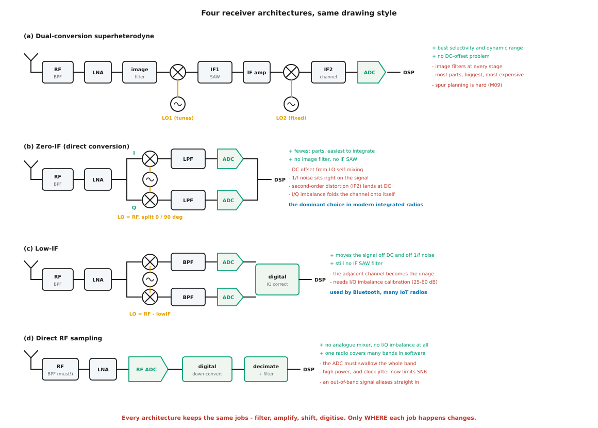
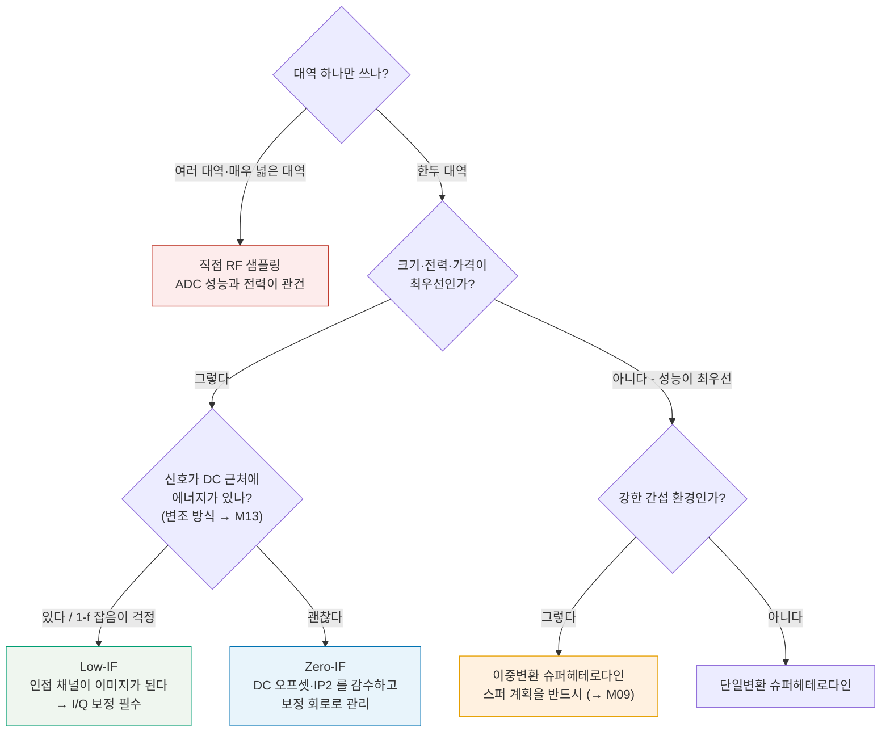
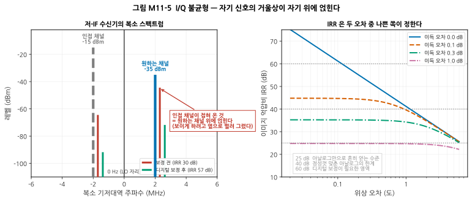
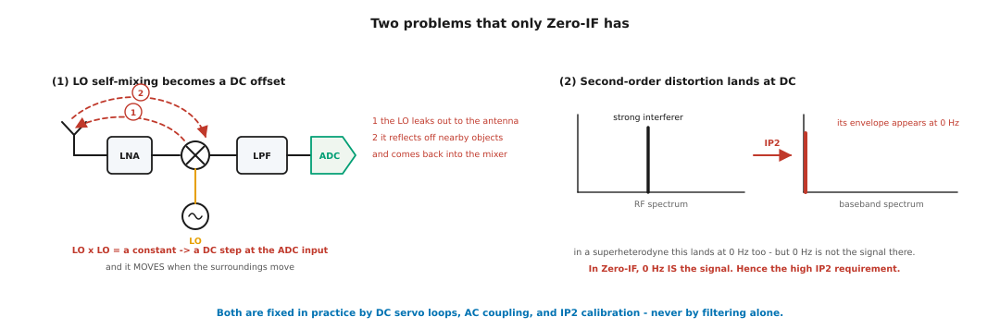
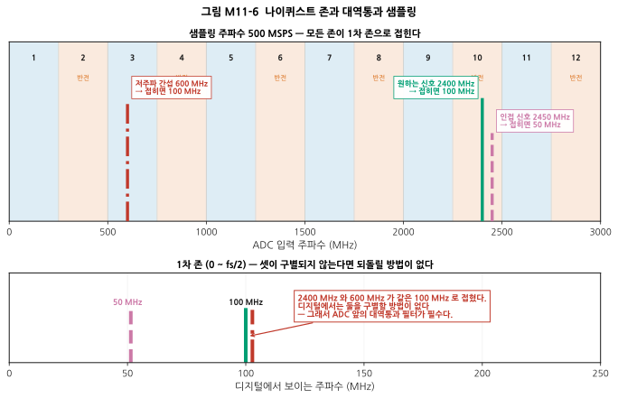
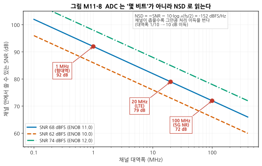
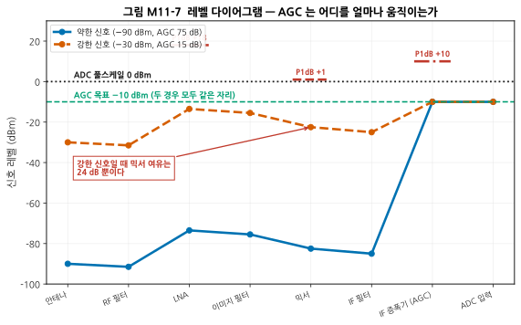

# M11 — 트랜시버 아키텍처: 구조를 고르는 일

**문서 번호**: RF-CUR-M11 · **버전**: v1.0 · **분량**: 이론 5 h + 실습 6 h

| | |
|---|---|
| **선수 모듈** | [M10](./M10_안테나와전파.md), [M09](./M09_주파수변환과신호원.md) (믹서·이미지·주파수 계획), [M08](./M08_증폭기.md) (P1dB·IP3) |
| **이 모듈이 소유하는 개념** | 슈퍼헤테로다인(단일/이중 변환), 직접 변환(Zero-IF/호모다인), 저-IF(Low-IF), 직접 RF 샘플링, 송신 아키텍처, **I/Q 신호와 복소 기저대역**, I/Q 불균형(이득/위상)과 이미지 억압비, DC 오프셋, LO 누설과 자체 혼합, Zero-IF 특유의 IP2 문제, **ADC 파라미터**(샘플링 주파수, 나이퀴스트 존, 대역통과 샘플링, ENOB, SFDR, 잡음 스펙트럼 밀도 NSD), 자동이득제어(AGC), **이득 배분의 원칙과 레벨 다이어그램** |
| **이 모듈을 쓰는 후속 모듈** | **M12**(선택한 구조 위에서 예산을 나눈다), M13(I/Q 불균형이 EVM에 미치는 영향), M14·M15(구조별 측정 포인트), M16(디버그), M17(보드 분할과 차폐) |
| **학습 목표** | ① 3대 수신 아키텍처의 장단점을 표로 비교하고 상황에 맞게 고른다 ② I/Q 불균형이 만드는 이미지 크기를 계산한다 ③ 직접 RF 샘플링이 언제 유리한지 판단하고, 샘플링 주파수를 고른다 |

---

## M11.0 이 모듈의 범위

M06~M10에서 **부품**을 하나씩 봤습니다. 이 모듈에서 처음으로 그것들을 **조립**합니다.

핵심 질문은 하나입니다.

> **필터·증폭·주파수 이동·디지털화 — 이 네 가지 일을 각각 어디서 할 것인가?**

아키텍처란 그 배치를 정하는 일입니다. **어떤 구조도 일을 없애 주지 않습니다. 어디서 할지만 바꿉니다.**

> ⚠️ **다른 모듈과의 역할 분리**
>
> | 개념 | M11 (여기) | 다른 모듈 |
> |---|---|---|
> | 이미지 | **구조가 이미지 문제를 어떻게 다루는가** | [M09](./M09_주파수변환과신호원.md)가 **이미지 자체와 IRM 믹서**를 소유 |
> | 이득 배분 | **레벨 다이어그램과 AGC** (어디가 포화하나) | **M12가 NF·IIP3 최적화**를 소유 |
> | 주파수 계획 | 구조 선택의 근거로 **인용** | M09가 **스퍼 차트 작성**을 소유 |
> | I/Q 불균형 | **구조 문제로서의 정의와 계산** | M13이 **EVM 기여**, M15가 **측정·보정**을 소유 |
> | 잡음지수 | 언급만 | M08 정의, **M12 캐스케이드** |

> 📖 **이 모듈이 답하는 질문** (참고 사이트 rfdh.com의 목록 중)
> - RF 트랜시버 시스템의 이해 → §M11.1

---

## M11.1 최상위 블록도 — 트랜시버가 하는 일

무전기든 휴대폰이든 기지국이든, 하는 일은 같습니다.

| 방향 | 일 |
|---|---|
| **수신** | 안테나 → **원하는 대역만 남기고** → **키우고** → **주파수를 내리고** → **디지털로** |
| **송신** | 디지털 → **아날로그로** → **주파수를 올리고** → **키우고** → **원하지 않는 것을 버리고** → 안테나 |

아키텍처의 차이는 **순서와 횟수**뿐입니다.

- 주파수를 **몇 번** 옮기는가 (2번 / 1번 / 0번)
- **어느 주파수에서** 채널을 골라내는가 (IF / 기저대역 / 디지털)
- **어디서** 디지털이 되는가 (기저대역 / IF / RF)

---

## M11.2 네 가지 수신 아키텍처



*그림 M11-1. 네 구조를 같은 그림 양식으로 나란히 그린 것입니다. **읽는 법**: 왼쪽 끝이 안테나, 오른쪽 끝이 디지털 신호 처리(DSP)입니다. 위에서 아래로 갈수록 **아날로그 부품이 줄고 디지털이 늘어납니다.** 오른쪽의 초록 줄은 장점, 빨간 줄은 대가입니다.*

### (a) 이중변환 슈퍼헤테로다인

주파수를 **두 번** 내립니다. 첫 IF는 높게(이미지를 멀리 보내려고), 둘째 IF는 낮게(채널 필터를 만들려고) — [M09 §2](./M09_주파수변환과신호원.md)에서 본 IF의 딜레마를 **두 번으로 나눠 푸는** 방식입니다.

| | |
|---|---|
| **장점** | 선택도와 동적 범위가 가장 좋다. DC 오프셋 문제가 없다. 각 단의 이득이 낮아 안정하다 |
| **대가** | 부품이 가장 많고 크고 비싸다. 이미지 필터가 단마다 필요하다. **스퍼 계획이 어렵다**(→ M09) |
| **쓰이는 곳** | 계측기, 기지국, 군용·위성 수신기 |

### (b) Zero-IF (직접 변환, 호모다인)

**LO를 RF와 같은 주파수로** 놓아 신호를 곧바로 0 Hz로 내립니다. IF가 아예 없습니다.

$$f_{LO} = f_{RF} \quad \Rightarrow \quad f_{IF} = 0$$

> 💡 **이미지는 어디로 갔나?** 이미지 주파수 = LO + IF = LO 이므로, **이미지가 원하는 신호 자신**입니다. 별도의 이미지 대역이 존재하지 않으므로 **이미지 필터가 필요 없습니다.** 이것이 Zero-IF의 가장 큰 매력입니다.
>
> 대신 **채널의 위쪽 절반과 아래쪽 절반이 서로의 이미지**가 됩니다. 그 둘을 구별하려면 I와 Q 두 갈래가 반드시 필요하고, 두 갈래의 균형이 어긋나면 §M11.4의 문제가 생깁니다.

| | |
|---|---|
| **장점** | 부품이 가장 적고 집적하기 쉽다. **중간주파수용 표면탄성파(Surface Acoustic Wave, SAW) 필터가 없다** — 비싸고 큰 부품이다 |
| **대가** | DC 오프셋, 1/f 잡음, IP2, I/Q 불균형 — §M11.4~5 |
| **쓰이는 곳** | 휴대폰, Wi-Fi, 대부분의 집적 무선 칩 |

### (c) Low-IF

신호를 0 Hz가 아니라 **채널 폭의 1~2배쯤 되는 낮은 IF**(수백 kHz ~ 수 MHz)로 내립니다.

| | |
|---|---|
| **장점** | 신호가 DC와 1/f 잡음을 피한다. 여전히 IF SAW가 필요 없다 |
| **대가** | **인접 채널이 이미지가 된다.** I/Q 불균형 보정이 필수 |
| **쓰이는 곳** | 블루투스, 여러 사물인터넷 무선기 |

### (d) 직접 RF 샘플링

아날로그 믹서 없이 **아날로그-디지털 변환기(Analog-to-Digital Converter, ADC)가 RF를 그대로 받습니다.** 주파수 이동은 디지털에서 합니다.

| | |
|---|---|
| **장점** | 아날로그 믹서·LO가 없으니 **I/Q 불균형이 원천적으로 없다.** 소프트웨어로 여러 대역을 처리 |
| **대가** | ADC가 대역 전체를 삼켜야 한다. 전력 소모가 크다. **클럭 지터가 SNR을 제한한다**(→ M09 §9). 대역 밖 신호가 그대로 접혀 들어온다 |
| **쓰이는 곳** | 5G 기지국, 위상 배열 레이더, 계측기, 소프트웨어 정의 무선 |

### 선택 결정표

| 조건 | 유리한 구조 |
|---|---|
| 최고의 선택도·동적 범위가 필요 | **슈퍼헤테로다인** |
| 크기·가격·소비전력이 최우선 | **Zero-IF** |
| 좁은 대역, 저전력, DC 문제 회피 | **Low-IF** |
| 여러 대역을 한 하드웨어로, 대역폭이 매우 넓음 | **직접 RF 샘플링** |
| 강한 간섭 환경 | 슈퍼헤테로다인 또는 아주 좋은 Zero-IF |
| 밀리미터파 | Zero-IF 계열 (부품 수가 지배적) |



*그림 M11-2. 아키텍처 결정 트리. **읽는 법**: 위에서부터 질문에 답해 내려갑니다. **이 트리에 "정답"은 없습니다.** 같은 제품도 세대가 바뀌면 답이 바뀝니다 — ADC가 좋아지면 오른쪽으로, 집적도가 중요해지면 Zero-IF 쪽으로 이동합니다.*

---

## M11.3 I/Q 신호와 복소 기저대역 — 왜 두 갈래가 필요한가

### 직관

실수 신호 하나만으로는 **양의 주파수와 음의 주파수를 구별할 수 없습니다.**

$$\cos(2\pi f t) = \cos(-2\pi f t)$$

즉 "LO보다 10 kHz 위"와 "LO보다 10 kHz 아래"가 똑같아 보입니다. 슈퍼헤테로다인에서는 IF가 충분히 높아서 둘 다 양의 주파수에 있으므로 문제가 없었습니다. **그러나 0 Hz(또는 아주 낮은 IF)로 내리면 둘이 겹칩니다.**

**해결책**: 90도 차이 나는 두 LO로 두 갈래를 만듭니다.

- **I** (In-phase, 동상): cos으로 곱한 것
- **Q** (Quadrature, 직교): sin으로 곱한 것

이 둘을 **하나의 복소수** `I + jQ`로 보면 양·음 주파수가 구별됩니다.

> 📌 **한 줄 요약**: **I/Q는 편의가 아니라 필수입니다.** 0 Hz 근처로 신호를 내리는 모든 구조는 반드시 두 갈래를 가져야 합니다.

> 💡 **송신 쪽도 같습니다.** 디지털에서 만든 복소 기저대역 신호를 I/Q 변조기로 올리면 원하는 쪽 측파대만 남길 수 있습니다. 한 갈래만 쓰면 위아래가 대칭으로 나가 전력의 절반을 버리고 스펙트럼을 두 배로 씁니다.

---

## M11.4 I/Q 불균형 → 이미지 억압비

### 문제

두 갈래의 **이득이 다르거나 위상이 정확히 90도가 아니면**, 상쇄되어야 할 거울상이 남습니다.



*그림 M11-3. 왼쪽: 저-IF 수신기의 복소 스펙트럼입니다. 가로축이 0 Hz를 중심으로 한 복소 기저대역 주파수라, 음의 주파수가 실제로 존재합니다. 원하는 채널(+2 MHz, −35 dBm)과 인접 채널(−2 MHz, −15 dBm)이 있고, **각각의 거울상이 반대편에 나타납니다.** 인접 채널이 20 dB 세므로, 그 거울상이 원하는 채널 위에 얹힙니다. 오른쪽: 이득 오차와 위상 오차에 따른 이미지 억압비(IRR)입니다.*

$$\text{IRR} = 10\log_{10}\frac{1 + 2a\cos\theta + a^2}{1 - 2a\cos\theta + a^2}, \qquad a = 10^{\Delta G/20}$$

(ΔG는 두 갈래의 이득 오차 [dB], θ는 위상 오차에서 90도를 뺀 값)

| 이득 오차 | 위상 오차 | IRR |
|---|---|---|
| 1.0 dB | 5.0° | **22.8 dB** |
| 0.5 dB | 2.0° | 29.5 dB |
| 0.2 dB | 1.0° | 36.8 dB |
| 0.05 dB | 0.2° | 49.5 dB |
| 0.02 dB | 0.1° | **56.8 dB** |

> ⚠️ **M09의 이미지와는 다른 문제입니다.** 이름과 공식이 같아 헷갈리기 쉬우므로 정리합니다.
>
> | | M09의 이미지 | M11의 I/Q 이미지 |
> |---|---|---|
> | 무엇이 겹치나 | **다른 주파수의 다른 신호** (RF + 2·IF) | **같은 대역 안의 반대쪽 절반** |
> | 어디서 생기나 | 믹서의 물리적 성질 | **두 갈래의 불균형** |
> | 막는 법 | **RF 필터** (변환 전에) | **디지털 보정** (변환 후에도 가능) |
> | 왜 보정이 되나 | 불가능 — 이미 겹쳤다 | 불균형이 **느리게 변하는 고정 오차**라서 |

> 📌 **디지털 보정이 가능한 이유가 결정적입니다.** I/Q 불균형은 부품의 정합 오차이므로 **온도와 주파수에 따라 천천히 변할 뿐 신호에 따라 변하지 않습니다.** 따라서 한 번 측정해 역보정을 걸면 됩니다. 현대 무선 칩은 부팅 시 또는 주기적으로 이 교정을 수행해 **아날로그 30 dB → 보정 후 55~60 dB**를 얻습니다.

### 얼마나 필요한가

**필요한 IRR은 "옆에 얼마나 센 신호가 있는가"가 정합니다.**

인접 채널이 원하는 채널보다 D dB 세고, 그 거울상이 원하는 신호보다 M dB 아래에 있어야 한다면

$$\text{IRR} \ge D + M$$

**예**: 인접 채널이 30 dB 세고, 그 거울상을 신호보다 15 dB 아래로 눌러야 한다면 **IRR ≥ 45 dB** 가 필요합니다. 아날로그만으로는 어려우므로 **디지털 보정이 필수**가 됩니다.

---

## M11.5 Zero-IF만의 문제 — DC 오프셋과 IP2



*그림 M11-4. **읽는 법**: (1) LO가 안테나 쪽으로 새어 나갔다가(①) 주변 물체에 반사되어 되돌아오면(②), 믹서에서 **자기 자신과 곱해집니다.** LO × LO는 직류 성분을 만들고, 그것이 곧 DC 오프셋입니다. (2) 강한 간섭의 2차 왜곡(IP2)이 만드는 포락선 성분이 0 Hz에 떨어집니다.*

| 문제 | 왜 Zero-IF에서만 심각한가 | 실무의 대책 |
|---|---|---|
| **DC 오프셋** | 0 Hz가 곧 신호 자리이므로 신호와 구별되지 않는다. **주변 물체가 움직이면 값이 변한다** | DC 서보 루프, AC 결합(대신 신호의 DC 성분도 잃음), 디지털에서 추정·제거 |
| **1/f 잡음** | 트랜지스터의 저주파 잡음이 신호 대역 한복판에 있다 | 큰 소자, 초핑(chopping), 낮은 IF로 이동(→ Low-IF) |
| **IP2** (2차 교차점, Second-order Intercept Point → [M08 §5](./M08_증폭기.md)) | 2차 왜곡의 포락선 성분이 0 Hz에 떨어진다 | 높은 IP2 요구(+50 dBm 이상), **IP2 교정 회로** |
| **I/Q 불균형** | §M11.4 | 디지털 보정 |

> 💡 **슈퍼헤테로다인에서는 이 넷이 전부 문제가 아닙니다.** DC 오프셋과 IP2 산물도 0 Hz에 생기지만, 그곳에 신호가 없으므로 그냥 버리면 됩니다. **"어디에 신호를 두느냐"가 어떤 문제가 치명적인지를 정합니다.** 이것이 아키텍처 선택의 본질입니다.

> ⚠️ **LO 누설은 규제 문제이기도 합니다.** Zero-IF에서 LO는 RF와 같은 주파수이므로, 안테나로 새어 나가면 **자기 수신 대역 안으로 방사하는 것**이 됩니다(→ [M09 §4](./M09_주파수변환과신호원.md)의 격리, M17의 인증).

---

## M11.6 직접 RF 샘플링과 나이퀴스트 존

### 대역통과 샘플링 — 나이퀴스트가 말한 것과 말하지 않은 것

흔한 오해: "샘플링 주파수는 신호 주파수의 2배 이상이어야 한다."

**정확히는**: 샘플링 주파수는 **신호의 대역폭**의 2배 이상이면 됩니다. 신호가 어느 주파수에 있는지는 상관없습니다. 다만 **어느 나이퀴스트 존에 통째로 들어가야** 합니다.

$$\text{존 번호} = \left\lfloor \frac{f}{f_s/2} \right\rfloor + 1, \qquad f_{alias} = \left| f - f_s \cdot \text{round}\!\left(\frac{f}{f_s}\right) \right|$$



*그림 M11-5. 위: 샘플링 주파수 500 MSPS일 때의 나이퀴스트 존입니다. 파란 띠가 홀수 존(스펙트럼이 그대로), 주황 띠가 짝수 존(**스펙트럼이 좌우 반전**)입니다. 아래: 모든 존이 1차 존(0 ~ fs/2)으로 접힙니다. **읽는 법**: 2400 MHz와 600 MHz가 **둘 다 100 MHz로 접혔습니다.** 디지털에서는 구별할 방법이 없습니다.*

| 입력 | 존 | 스펙트럼 | 접힌 주파수 |
|---|---|---|---|
| 2400 MHz | 10 | **반전** | 100 MHz |
| 2450 MHz | 10 | 반전 | 50 MHz |
| 600 MHz | 3 | 정상 | **100 MHz** |

> ⚠️ **이것이 직접 RF 샘플링의 가장 큰 위험입니다.** 대역 밖의 신호가 **아무 경고 없이** 원하는 신호 위로 접혀 들어옵니다. 그래서 **ADC 앞의 대역통과 필터는 선택이 아니라 필수**입니다. 슈퍼헤테로다인에서는 IF 필터가 여러 겹으로 막아 주던 일을, 여기서는 필터 하나가 전부 감당해야 합니다.

> 💡 **짝수 존의 스펙트럼 반전**도 실무에서 자주 놓칩니다. 디지털에서 주파수 순서가 뒤집혀 있으므로 복조 전에 되돌려야 합니다. 잊으면 **복조가 전혀 안 되는데 원인을 찾기 매우 어렵습니다.**

### 클럭 지터가 새로운 한계가 된다

직접 RF 샘플링에서는 [M09 §9](./M09_주파수변환과신호원.md)의 지터가 곧바로 SNR 한계가 됩니다.

$$\text{SNR}_{jitter} = -20\log_{10}(2\pi f_{in} \sigma_t)$$

**예**: 입력 2.4 GHz, 클럭 지터 100 fs라면

$$\text{SNR} = -20\log_{10}(2\pi \times 2.4\times10^9 \times 100\times10^{-15}) = 56.4\ \text{dB}$$

> 📌 **주파수가 높을수록 지터 요구가 가혹해집니다.** 같은 100 fs 클럭이라도 입력이 100 MHz면 SNR 84 dB인데, 2.4 GHz에서는 56 dB로 떨어집니다. **직접 RF 샘플링이 고주파에서 어려운 근본 이유**이며, 여기서 M09의 위상잡음 설계가 그대로 되살아납니다.

---

## M11.7 ADC 사양 읽기 — ENOB의 함정, NSD가 더 쓸모 있는 이유

| 사양 | 정의 | 함정 |
|---|---|---|
| **분해능** (비트 수) | 양자화 단계 수 | **실제 성능과 거의 관계없다.** 14비트 ADC의 ENOB이 10비트인 경우가 흔하다 |
| **SNR** | 나이퀴스트 대역 전체의 신호 대 잡음비 | **어느 대역폭 기준인지** 반드시 확인 |
| **ENOB** (유효 비트수, Effective Number of Bits) | (SNDR − 1.76)/6.02. SNDR 은 잡음과 왜곡을 함께 센 신호 대 잡음·왜곡비 | 한 숫자로 뭉뚱그려 **대역폭 정보를 잃는다** |
| **SFDR** (무스퓨리어스 동적범위, Spurious-Free Dynamic Range) | 가장 큰 스퍼까지의 거리 | 잡음이 아니라 **스퍼** 기준. 간섭 환경에서 중요 |
| **NSD** (잡음 스펙트럼 밀도, Noise Spectral Density) | 1 Hz 당 잡음 전력. 단위는 dBFS/Hz (dB relative to Full Scale, 풀스케일 대비 dB) | **가장 쓸모 있다.** 대역폭을 곱하면 바로 채널 잡음이 나온다 |

$$\text{이상적인 } N \text{비트 ADC의 SNR} = 6.02N + 1.76\ \text{dB}$$

| 비트 수 | 이상적 SNR |
|---|---|
| 12 | 74.00 dB |
| 14 | 86.04 dB |
| 16 | 98.08 dB |

$$\text{NSD [dBFS/Hz]} = -\text{SNR} - 10\log_{10}(f_s/2)$$



*그림 M11-6. 가로축은 채널 대역폭, 세로축은 그 채널 안에서 실제로 쓸 수 있는 SNR입니다. **읽는 법**: 잡음은 대역폭에 비례하므로, **채널이 좁을수록 그만큼 이득을 법니다.** 이것을 처리 이득(processing gain)이라 합니다.*

**계산 예** (샘플링 주파수 fs = 500 MSPS(Mega-Samples Per Second, 초당 백만 샘플), SNR 68 dBFS인 ADC):

- ENOB = (68 − 1.76)/6.02 = **11.00 비트** (14비트 부품이라도!)
- NSD = −68 − 10·log₁₀(250 MHz) = **−152.0 dBFS/Hz**

| 채널 대역폭 | 채널 안 SNR | 처리 이득 |
|---|---|---|
| 1 MHz | **92.0 dB** | 24.0 dB |
| 20 MHz (LTE) | 79.0 dB | **11.0 dB** |
| 100 MHz (5G NR) | 72.0 dB | 4.0 dB |

> 📌 **"14비트니까 86 dB"는 틀렸고, "ENOB 11비트니까 68 dB"도 반쪽입니다.** 실제로 쓸 수 있는 것은 **채널 대역폭 안의 SNR**이며, 20 MHz 채널이라면 79 dB입니다. **NSD로 적혀 있으면 이 계산이 한 줄에 끝납니다.**

> ⚠️ **SFDR은 별개의 사양입니다.** 잡음은 넓게 퍼져 있지만 스퍼는 한 곳에 뭉쳐 있어, 대역폭을 좁혀도 줄지 않습니다. 강한 간섭이 있는 환경에서는 **SNR보다 SFDR이 먼저 한계가 됩니다.** (동적 범위 전반은 M12가 소유합니다.)

---

## M11.8 이득 배분과 AGC

자동 이득 제어(Automatic Gain Control, AGC)는 입력 세기가 변해도 뒷단이 늘 같은 레벨을 보도록 이득을 조절하는 회로입니다.

### 레벨 다이어그램 — 신호가 어디서 얼마나 큰가



*그림 M11-7. 가로축이 체인의 각 단, 세로축이 그 지점의 신호 레벨(dBm)입니다. 빨간 짧은 선이 각 단의 P1dB이고, 검은 점선이 ADC 풀스케일입니다. **읽는 법**: 두 곡선은 같은 수신기에 약한 신호(−90 dBm)와 강한 신호(−30 dBm)가 들어온 경우입니다. **AGC가 두 경우 모두 ADC 입력을 −10 dBm이라는 같은 자리에 놓습니다** — 그것이 AGC의 일입니다.*

| 입력 | AGC 이득 | ADC 입력 | 믹서 출력과 P1dB의 여유 |
|---|---|---|---|
| −90 dBm (약함) | 75 dB | −10 dBm | 84 dB |
| −30 dBm (강함) | 15 dB | −10 dBm | **24 dB** |

**AGC 범위 = 60 dB**

### 이득 배분의 두 원칙

> **① 잡음은 앞에서 정해지므로, 이득은 되도록 앞에 둔다.**
> **② 선형성은 뒤에서 깨지므로, 이득을 앞에 너무 많이 두면 뒷단이 포화한다.**

이 둘이 정면으로 충돌합니다. **그 충돌을 수식으로 풀어 최적점을 찾는 것이 M12의 주제**입니다. 여기서는 구조적 결론만 확인합니다.

| 규칙 | 이유 |
|---|---|
| 이득은 **필터 뒤에** 둔다 | 걸러낸 다음 키워야 강한 간섭을 함께 키우지 않는다 |
| **가변 이득은 뒤쪽에** 둔다 | 앞쪽 이득을 줄이면 NF가 곧바로 나빠진다 |
| 한 단의 이득이 너무 크면 안 된다 | 되먹임으로 발진 위험(→ [M08 §7](./M08_증폭기.md)) |
| **LNA 바이패스**를 둔다 | 아주 강한 신호에서는 LNA 자체가 포화하므로 건너뛴다 |

> ⚠️ **AGC 설계에서 가장 흔한 실패**: 이득을 줄이는 순서를 잘못 잡는 것입니다. **뒤에서부터 줄여야** 합니다. 앞단(LNA) 이득을 먼저 줄이면 잡음지수가 즉시 나빠져, 강한 간섭 옆의 약한 신호를 놓칩니다.

---

## M11.9 송신 아키텍처

수신의 거울상이지만 강조점이 다릅니다. 수신은 **약한 신호를 살리는 일**, 송신은 **강한 신호를 깨끗하게 내보내는 일**입니다.

| 구조 | 방식 | 특징 |
|---|---|---|
| **직접 변환 송신** | 기저대역 I/Q → 곧바로 RF | 부품 최소. **LO 끌림(pulling)** 위험 — PA의 강한 출력이 같은 주파수의 LO를 흔든다 |
| **2단 상향변환** | 기저대역 → IF → RF | LO 끌림을 피한다. 부품이 늘어난다 |
| **폴라(polar) 변조** | 진폭과 위상을 따로 처리 | 효율이 높다(→ [M08 §8](./M08_증폭기.md)의 스위칭급과 결합). 대역폭 요구가 커진다 |

**송신에서 반드시 관리해야 하는 것**

| 항목 | 왜 |
|---|---|
| **반송파 누설** (LO leakage) | I/Q 변조기의 DC 오프셋이 반송파를 그대로 내보낸다 |
| **측파대 억압** | I/Q 불균형이 반대쪽 측파대를 남긴다 (§M11.4와 같은 원리) |
| **하모닉** | 저역 통과 필터로 제거(→ [M07](./M07_필터와수동네트워크.md)) |
| **인접채널 누설** | PA의 비선형성 (→ M08, 정량은 M13) |
| **LO 끌림** | PA 출력과 LO 주파수가 같으면 발생. **차폐와 주파수 계획으로 회피** |

> 📌 **송신 신호 품질(EVM, ACLR, 스펙트럼 마스크)의 정의와 계산은 M13이 소유합니다.** 여기서는 "아키텍처가 어떤 결함을 만드는가"까지만 봅니다.

---

## M11.L 실습

### L11-a — I/Q 불균형 시뮬레이션 (Tier 0, 2시간)

**목표**: I/Q 불균형을 실제 신호로 만들어 이미지를 관찰하고, 공식과 대조합니다.

**준비물**: Python 3, `numpy`

**절차**

1. 아래 스크립트를 `l11a.py`로 저장하고 실행합니다.

```python
import numpy as np

FS = 10e6          # 기저대역 샘플링 [Hz]
N = 1 << 16
F_SIG = 2.0e6      # 저-IF 로 내려온 원하는 채널 [Hz]


def demod(gain_err_db, phase_err_deg, f_sig=F_SIG):
    """이득·위상 오차가 있는 I/Q 복조기를 흉내 낸다."""
    t = np.arange(N) / FS
    g = 10 ** (gain_err_db / 20)
    ph = np.deg2rad(phase_err_deg)
    i = np.cos(2 * np.pi * f_sig * t)
    q = g * np.sin(2 * np.pi * f_sig * t + ph)
    return i + 1j * q


def irr_measured(gain_err_db, phase_err_deg):
    """스펙트럼에서 원하는 성분과 거울상의 비를 직접 잰다."""
    x = demod(gain_err_db, phase_err_deg)
    w = np.hanning(N)
    X = np.fft.fftshift(np.fft.fft(x * w))
    f = np.fft.fftshift(np.fft.fftfreq(N, 1 / FS))
    k_sig = int(np.argmin(np.abs(f - F_SIG)))
    k_img = int(np.argmin(np.abs(f + F_SIG)))
    return 20 * np.log10(abs(X[k_sig]) / abs(X[k_img]))


def irr_formula(gain_err_db, phase_err_deg):
    a = 10 ** (gain_err_db / 20)
    t = np.deg2rad(phase_err_deg)
    return 10 * np.log10((1 + 2 * a * np.cos(t) + a ** 2)
                         / (1 - 2 * a * np.cos(t) + a ** 2))


print(f"{'이득오차':>8} {'위상오차':>8} {'측정 IRR':>10} {'공식 IRR':>10} {'차이':>7}")
print("-" * 50)
for g, p in ((0.0, 1.0), (0.1, 0.5), (0.2, 1.0), (0.5, 2.0),
             (1.0, 5.0), (0.05, 0.2)):
    m, f_ = irr_measured(g, p), irr_formula(g, p)
    print(f"{g:8.2f} {p:8.2f} {m:9.2f} dB {f_:9.2f} dB {m-f_:6.2f}")
```

2. 측정값과 공식이 일치하는지 확인합니다.
3. **역보정을 구현합니다.** 측정한 이득·위상 오차를 알고 있다고 가정하고, `q`에 보정을 걸어 IRR이 얼마나 올라가는지 봅니다.
4. 오차를 추정하는 방법을 생각해 봅니다(힌트: 알려진 톤 하나를 넣고 이미지 크기를 재면 됩니다).

**예상 결과**

```
    이득오차     위상오차     측정 IRR     공식 IRR      차이
--------------------------------------------------
    0.00     1.00     41.18 dB     41.18 dB  -0.00
    0.10     0.50     42.83 dB     42.83 dB   0.00
    0.20     1.00     36.80 dB     36.80 dB  -0.00
    0.50     2.00     29.46 dB     29.46 dB   0.00
    1.00     5.00     22.83 dB     22.83 dB  -0.00
    0.05     0.20     49.46 dB     49.46 dB  -0.00
```

**판정 기준**

| 항목 | 합격 |
|---|---|
| 재현 | 측정과 공식이 **0.1 dB 안에서 일치** |
| 해석 ① | 이득 오차 0에서도 IRR이 유한한 이유를 설명할 수 있다 |
| 해석 ② | 두 오차 중 어느 쪽이 지배적인지 판별할 수 있다 |
| 확장 | 역보정을 구현해 IRR을 20 dB 이상 개선했다 |

**흔한 실수**

| 실수 | 증상 | 바로잡기 |
|---|---|---|
| 창 함수 없이 FFT | 스펙트럼 누설로 이미지가 실제보다 크게 보인다 | 해닝 창 등을 적용 |
| 신호 주파수가 FFT 격자에 안 맞음 | 값이 불안정하다 | `F_SIG`를 `FS/N`의 정수배로 |
| 실수 신호로 시험 | 이미지 개념 자체가 성립하지 않는다 | 반드시 **복소** 신호 `I + jQ` |
| dB와 배수를 섞음 | 값이 2배 어긋난다 | 전압비는 20·log, 전력비는 10·log |

---

### L11-b — 나이퀴스트 존 계산기 (Tier 0, 2시간)

**목표**: 직접 RF 샘플링에서 샘플링 주파수를 고르는 도구를 만듭니다.

**절차**

1. 아래 스크립트를 `l11b.py`로 저장하고 실행합니다.

```python
import numpy as np

LO, HI = 2400.0, 2483.5                       # 받고 싶은 대역 [MHz]
BLK = [600.0, 900.0, 1800.0, 2600.0, 5250.0]  # 주변의 강한 신호들
GUARD = 15.0                                  # 가장자리 여유 [MHz]


def zone(f, fs):
    return int(np.floor(f / (fs / 2))) + 1


def alias(f, fs):
    return abs(f - fs * round(f / fs))


def inverted(f, fs):
    return zone(f, fs) % 2 == 0


def check(fs, name=""):
    print(f"\n=== {name}  fs = {fs:g} MSPS ===")
    for f in (LO, HI):
        print(f"    {f:8.1f} MHz -> 존 {zone(f, fs):2d}, "
              f"{'반전' if inverted(f, fs) else '정상'}, "
              f"앨리어스 {alias(f, fs):7.2f} MHz")
    if zone(LO, fs) != zone(HI, fs):
        print("    !! 대역이 두 존에 걸쳐 있다 — 접히면 스스로 겹친다. 사용 불가")
    a_lo, a_hi = sorted((alias(LO, fs), alias(HI, fs)))
    for bf in BLK:
        ab = alias(bf, fs)
        flag = "  <-- 원하는 대역 위로 떨어진다!" if a_lo <= ab <= a_hi else ""
        print(f"    방해파 {bf:8.1f} MHz -> 앨리어스 {ab:7.2f} MHz{flag}")


check(500.0, "후보 A")
check(600.0, "후보 B")
check(983.0, "후보 C")

# 조건을 만족하는 fs 를 직접 찾아본다
print("\n=== 조건을 만족하는 fs 탐색 ===")
found = []
for fs in np.arange(400.0, 1200.0, 1.0):
    if zone(LO, fs) != zone(HI, fs):
        continue
    a = sorted((alias(LO, fs), alias(HI, fs)))
    if a[0] < GUARD or a[1] > fs / 2 - GUARD:
        continue
    if any(a[0] - GUARD <= alias(b, fs) <= a[1] + GUARD for b in BLK):
        continue
    found.append((fs, a[0], a[1], zone(LO, fs)))
print(f"  {len(found)} 개 발견. 앞의 다섯 개:")
for fs, a0, a1, z in found[:5]:
    print(f"    fs {fs:7.1f} MSPS -> 존 {z:2d}, "
          f"앨리어스 대역 {a0:6.1f}~{a1:6.1f} MHz")
```

2. 세 후보가 각각 **왜 나쁜지** 정리합니다.
3. 탐색 결과에서 하나를 고르고, 그 선택의 근거를 씁니다(부품 조달, 클럭 발생 난이도 포함).

**예상 결과** (일부)

```
=== 후보 A  fs = 500 MSPS ===
      2400.0 MHz -> 존 10, 반전, 앨리어스  100.00 MHz
      2483.5 MHz -> 존 10, 반전, 앨리어스   16.50 MHz
    방해파    600.0 MHz -> 앨리어스  100.00 MHz  <-- 원하는 대역 위로 떨어진다!
    ...
=== 후보 C  fs = 983 MSPS ===
    !! 대역이 두 존에 걸쳐 있다 — 접히면 스스로 겹친다. 사용 불가

=== 조건을 만족하는 fs 탐색 ===
  147 개 발견. 앞의 다섯 개:
    fs   574.0 MSPS -> 존  9, 앨리어스 대역  104.0~ 187.5 MHz
    fs   575.0 MSPS -> 존  9, 앨리어스 대역  100.0~ 183.5 MHz
    fs   576.0 MSPS -> 존  9, 앨리어스 대역   96.0~ 179.5 MHz
```

**판정 기준**

| 항목 | 합격 |
|---|---|
| 재현 | 위 결과가 그대로 나온다 |
| 해석 ① | 후보 A의 문제(방해파 3개가 대역 위로) |
| 해석 ② | 후보 B의 문제(대역이 0 Hz에서 시작 — DC 근처는 쓸 수 없다) |
| 해석 ③ | 후보 C의 문제(대역이 두 존에 걸침) |
| 선택 | 탐색 결과 중 하나를 고르고 근거를 댔다 |

**흔한 실수**

| 실수 | 증상 | 바로잡기 |
|---|---|---|
| 대역 가장자리를 안 봄 | 중심은 괜찮은데 끝이 존을 넘어간다 | **양 끝을 각각** 확인 |
| 여유(guard)를 0으로 | 필터가 완벽하다는 가정 | 실제 필터의 천이대역만큼 여유를 둔다 |
| 스펙트럼 반전을 잊음 | 복조가 전혀 안 되는데 원인 불명 | 짝수 존이면 디지털에서 되돌린다 |
| ADC 앞 필터를 생략 | 대역 밖 신호가 그대로 접혀 들어온다 | **대역통과 필터는 필수** |

---

### L11-c — SDR로 실제 I/Q 데이터 보기 (Tier 1, 2시간)

**목표**: 실제 수신기의 I/Q 데이터를 받아, 이 모듈에서 배운 결함들을 눈으로 확인합니다.

**준비물**: RTL-SDR 등 저가 소프트웨어 정의 무선(Software-Defined Radio, SDR) 동글, `pyrtlsdr` 또는 SDR 소프트웨어

> ⚠️ **수신만 하십시오.** 송신 기능이 있는 장비를 허가 없이 송신에 쓰면 안 됩니다. 안테나 입력에 강한 신호를 넣지 마십시오(→ [M04](./M04_RF실험실입문.md)).

**절차**

1. 주파수변조(Frequency Modulation, FM) 방송처럼 확실히 존재하는 신호로 맞추고 I/Q 데이터를 받습니다.
2. 복소 FFT를 그립니다. **0 Hz에 뾰족한 선이 보이는지** 확인합니다 → **DC 오프셋** (§M11.5)
3. 신호가 없는 조용한 주파수로 옮겨도 0 Hz 선이 남는지 봅니다.
4. 알려진 톤을 넣을 수 있다면(신호발생기 또는 다른 SDR의 송신), **거울 위치에 작은 상**이 있는지 봅니다 → **I/Q 불균형** (§M11.4)
5. 이득을 올려 가며 **하모닉과 상호변조**가 나타나는 지점을 찾습니다 → [M08](./M08_증폭기.md)

**예상 결과**

| 관찰 | 무엇을 확인한 것 |
|---|---|
| 0 Hz의 뾰족한 선 | DC 오프셋 (신호와 무관하게 존재) |
| 톤의 거울 위치에 20~40 dB 아래의 상 | I/Q 불균형 |
| 이득을 올렸을 때 새로 생기는 선들 | 압축과 상호변조 |

**판정 기준**: 세 가지 중 최소 두 가지를 관찰하고, 각각이 이 모듈의 어느 절에 해당하는지 설명할 수 있으면 합격입니다.

> 📌 **저가 SDR은 대부분 Zero-IF 또는 Low-IF 구조**입니다. 그래서 이 모듈에서 배운 결함이 **교과서보다 뚜렷하게** 보입니다. 비싼 장비로는 오히려 관찰하기 어렵습니다.

---

## M11.Q 확인 문제

<details>
<summary><b>Q1.</b> Zero-IF 수신기에는 왜 이미지 제거 필터가 필요 없는가? 그 대신 무엇을 감수하는가?</summary>

**이미지가 필요 없는 이유**: 이미지 주파수 = LO + IF 인데 Zero-IF에서는 IF = 0이므로 **이미지 = LO = 원하는 신호 자신**입니다. 별도의 이미지 대역이 존재하지 않습니다.

**대신 감수하는 것 네 가지**
1. **DC 오프셋** — LO가 새어 나갔다 반사되어 돌아와 자기 자신과 곱해지면 직류가 생기고, 그것이 신호 자리에 앉습니다. 게다가 **주변이 움직이면 값이 변합니다.**
2. **1/f 잡음** — 소자의 저주파 잡음이 신호 대역 한복판에 있습니다.
3. **IP2** — 2차 왜곡의 포락선이 0 Hz에 떨어집니다.
4. **I/Q 불균형** — 채널의 위쪽 절반과 아래쪽 절반이 서로 섞입니다.

**핵심**: 문제가 사라진 것이 아니라 **다른 문제로 바뀐 것**입니다.
</details>

<details>
<summary><b>Q2.</b> I/Q 경로의 이득 오차가 0.5 dB, 위상 오차가 2도다. 이미지 억압비는 얼마인가? 인접 채널이 30 dB 세다면 문제가 되는가?</summary>

$$\text{IRR} = 10\log_{10}\frac{1 + 2a\cos\theta + a^2}{1 - 2a\cos\theta + a^2}, \quad a = 10^{0.5/20} = 1.0593,\ \theta = 2° $$

계산하면 **약 29.5 dB** 입니다.

**인접 채널이 30 dB 셀 때**: 그 거울상은 원하는 신호보다 30 − 29.5 = **0.5 dB 위**에 있습니다. 즉 **간섭이 신호보다 큽니다. 복조 불가능합니다.**

**필요한 IRR**: 거울상을 신호보다 15 dB 아래로 눌러야 한다면 IRR ≥ 30 + 15 = **45 dB** 가 필요합니다. 아날로그만으로는 어려우므로 **디지털 보정이 필수**입니다.
</details>

<details>
<summary><b>Q3.</b> M09의 "이미지"와 M11의 "I/Q 이미지"는 무엇이 다른가?</summary>

| | M09의 이미지 | M11의 I/Q 이미지 |
|---|---|---|
| 정체 | **RF + 2·IF에 있는 다른 신호** | **같은 대역 안, 0 Hz 기준 반대쪽** |
| 원인 | 믹서가 합·차를 모두 만드는 물리적 성질 | **두 갈래(I/Q)의 이득·위상 불균형** |
| 크기를 정하는 것 | 그 주파수에 실제로 있는 신호의 세기 | 불균형의 크기 (IRR) |
| 막는 법 | **믹서 앞의 RF 필터** — 변환 뒤에는 불가능 | **디지털 보정** — 변환 뒤에도 가능 |
| 왜 보정이 되나 | 안 됨. 이미 같은 주파수에 겹쳤다 | 불균형이 **느리게 변하는 고정 오차**라서 |

**핵심 차이**: M09의 이미지는 **정보가 파괴**되지만, I/Q 이미지는 **정보가 섞였을 뿐**이라 역행렬로 되돌릴 수 있습니다.
</details>

<details>
<summary><b>Q4.</b> 2400 MHz 신호를 500 MSPS로 샘플링하면 디지털에서 몇 MHz로 보이는가? 스펙트럼은 뒤집히는가?</summary>

**존 번호** = ⌊2400 / 250⌋ + 1 = 9 + 1 = **10번 존**

**접힌 주파수** = |2400 − 500 × round(2400/500)| = |2400 − 500 × 5| = |2400 − 2500| = **100 MHz**

**짝수 존이므로 스펙트럼이 좌우 반전됩니다.** 디지털에서 주파수 순서가 뒤집혀 있으므로 복조 전에 켤레를 취하거나 주파수 축을 되돌려야 합니다.

**추가 위험**: 600 MHz 신호도 |600 − 500| = 100 MHz로 접힙니다. **둘이 같은 자리에 겹치며, 디지털에서는 구별할 방법이 없습니다.** 그래서 ADC 앞의 대역통과 필터가 반드시 필요합니다.
</details>

<details>
<summary><b>Q5.</b> fs = 500 MSPS, SNR 68 dBFS인 ADC가 있다. ENOB은? 20 MHz 채널에서 실제로 쓸 수 있는 SNR은?</summary>

**ENOB** = (68 − 1.76) / 6.02 = **11.00 비트**

**NSD** = −68 − 10·log₁₀(250 × 10⁶) = −68 − 83.98 = **−152.0 dBFS/Hz**

**20 MHz 채널 안의 잡음** = −152.0 + 10·log₁₀(20 × 10⁶) = −152.0 + 73.0 = −79.0 dBFS

**따라서 채널 SNR = 79.0 dB** 입니다.

**처리 이득** = 10·log₁₀(250/20) = **11.0 dB**

**해석**: "68 dB짜리 ADC"라고만 알면 20 MHz 채널에서 79 dB를 쓸 수 있다는 사실을 놓칩니다. **NSD로 생각하면 이 계산이 한 줄**입니다.
</details>

<details>
<summary><b>Q6.</b> AGC가 이득을 줄여야 할 때, 앞단부터 줄이는 것과 뒷단부터 줄이는 것 중 무엇이 옳은가?</summary>

**뒷단부터 줄여야 합니다.**

**이유**: 잡음지수는 앞단이 지배합니다(→ M08, 정량은 M12). 앞단(LNA)의 이득을 줄이면 뒷단의 잡음 기여가 상대적으로 커져 **시스템 잡음지수가 즉시 나빠집니다.** 그러면 강한 간섭 옆에 있는 약한 신호를 놓칩니다.

뒷단의 이득을 줄이는 것은 잡음지수에 거의 영향이 없습니다. 이미 신호가 충분히 커진 뒤이기 때문입니다.

**예외**: 신호가 **아주** 강해서 LNA 자체가 압축될 지경이면 어쩔 수 없이 앞단을 건드려야 합니다. 그래서 실무에서는 **LNA 바이패스 경로**를 따로 둡니다 — 이득을 조금 줄이는 것이 아니라 아예 건너뛰는 것입니다.
</details>

<details>
<summary><b>Q7.</b> 직접 RF 샘플링 수신기에서 클럭 지터가 100 fs다. 2.4 GHz 신호를 받을 때 지터가 제한하는 SNR은? 이 수신기를 900 MHz에 쓰면 어떻게 달라지는가?</summary>

$$\text{SNR}_{jitter} = -20\log_{10}(2\pi f_{in} \sigma_t)$$

**2.4 GHz**: −20·log₁₀(2π × 2.4×10⁹ × 100×10⁻¹⁵) = −20·log₁₀(1.508×10⁻³) = **56.4 dB**

**900 MHz**: −20·log₁₀(2π × 900×10⁶ × 100×10⁻¹⁵) = −20·log₁₀(5.65×10⁻⁴) = **65.0 dB**

**약 8.5 dB 좋아집니다** (주파수 비 2.667 의 20·log₁₀ 값).

**해석**: 지터가 만드는 SNR 한계는 **입력 주파수에 반비례**합니다. 그래서 직접 RF 샘플링은 주파수가 올라갈수록 클럭 요구가 가혹해지고, 어느 지점부터는 아날로그 하향변환이 다시 유리해집니다. **M09에서 배운 위상잡음 설계가 여기서 그대로 되살아납니다.**
</details>

<details>
<summary><b>Q8.</b> 좁은 대역 저전력 사물인터넷 무선기를 설계한다. Zero-IF와 Low-IF 중 어느 쪽을 고르겠는가?</summary>

**Low-IF가 유리한 경우가 많습니다.**

**이유**
1. **좁은 대역**이므로 IF를 채널 폭의 1~2배만 띄워도 DC와 1/f 잡음을 피할 수 있습니다. 낮은 IF라서 디지털 처리 부담도 작습니다.
2. **저전력** 설계에서는 소자가 작아 1/f 잡음이 크고, DC 오프셋 보정 회로도 전력을 씁니다. 그것을 피할 수 있습니다.
3. IF가 낮으므로 ADC 요구가 크지 않습니다.

**대가**: 인접 채널이 이미지가 되므로 **I/Q 불균형 보정이 필요**합니다. 다만 좁은 대역에서는 보정이 상대적으로 쉽습니다(주파수에 따른 불균형 변화가 작음).

**실제로** 블루투스와 여러 사물인터넷 무선기가 Low-IF를 씁니다.

**Zero-IF가 나은 경우**: 대역폭이 매우 넓어(예: Wi-Fi 80/160 MHz) Low-IF의 IF조차 높아져 ADC 부담이 커질 때입니다.
</details>

---

## M11.10 한 장 요약

| 무엇 | 한 줄 | 절 |
|---|---|---|
| 아키텍처의 본질 | 일을 없애는 게 아니라 **어디서 할지**를 정하는 것 | §0, §2 |
| 슈퍼헤테로다인 | 선택도·동적범위 최고, 부품 최다, **스퍼 계획이 어렵다** | §2 |
| Zero-IF | 이미지 필터가 없다. 대신 **DC·1/f·IP2·I/Q** 넷을 감수 | §2, §5 |
| Low-IF | DC와 1/f 을 피한다. **인접 채널이 이미지**가 된다 | §2 |
| 직접 RF 샘플링 | I/Q 불균형 원천 제거. **지터와 앨리어싱**이 새 한계 | §2, §6 |
| 왜 I/Q인가 | 실수 신호로는 **양·음 주파수를 구별 못 한다** | §3 |
| IRR 공식 | M09 의 이미지 억압 공식과 **같은 형태** | §4 |
| 필요한 IRR | **IRR ≥ (인접 채널의 세기 차) + (요구 여유)** | §4 |
| M09 vs M11 이미지 | 하나는 **정보 파괴**, 하나는 **정보 혼합**(보정 가능) | §4, Q3 |
| DC 오프셋 | LO 누설이 반사되어 자기와 곱해진 것. **주변이 움직이면 값이 변한다** | §5 |
| IP2 | 슈퍼헤테로다인에서도 0 Hz에 생기지만 **거기 신호가 없어서** 무해 | §5 |
| 대역통과 샘플링 | **신호 주파수가 아니라 대역폭**의 2배면 된다 | §6 |
| 짝수 존 | **스펙트럼이 반전**된다. 잊으면 복조가 안 된다 | §6 |
| 앨리어싱 위험 | 대역 밖 신호가 **경고 없이** 접혀 온다 → ADC 앞 필터 필수 | §6 |
| 지터 한계 | SNR = −20·log₁₀(2π f_in σ_t). **주파수에 반비례** | §6 |
| ENOB의 함정 | 대역폭 정보를 잃는다. **NSD가 더 쓸모 있다** | §7 |
| 처리 이득 | 채널이 좁을수록 번다. 20 MHz면 11 dB | §7 |
| SFDR | 잡음이 아니라 **스퍼** 기준. 대역폭을 좁혀도 안 준다 | §7 |
| AGC의 일 | 어떤 입력에서도 **ADC 입력을 같은 자리에** 놓는 것 | §8 |
| 이득 배분 충돌 | 앞에 두면 잡음에 유리, 뒤가 포화. **최적화는 M12** | §8 |
| AGC 순서 | **뒤에서부터 줄인다.** 앞단을 줄이면 NF가 즉시 나빠진다 | §8 |
| 송신의 강조점 | 약한 신호 살리기가 아니라 **강한 신호를 깨끗하게** | §9 |
| LO 끌림 | 직접 변환 송신에서 PA 출력이 같은 주파수의 LO를 흔든다 | §9 |

---

## M11.A 이 모듈의 축약어

| 약어 | 영문 원어 | 한글 |
|---|---|---|
| I / Q | In-phase / Quadrature | 동상 / 직교 |
| IRR | Image Rejection Ratio | 이미지 억압비 |
| Zero-IF | Zero Intermediate Frequency (Homodyne) | 영 중간주파수 (직접 변환, 호모다인) |
| Low-IF | Low Intermediate Frequency | 저 중간주파수 |
| ADC | Analog-to-Digital Converter | 아날로그-디지털 변환기 |
| DAC | Digital-to-Analog Converter | 디지털-아날로그 변환기 |
| ENOB | Effective Number of Bits | 유효 비트수 |
| SNDR | Signal-to-Noise-and-Distortion Ratio | 신호 대 잡음·왜곡비 |
| SFDR | Spurious-Free Dynamic Range | 무스퓨리어스 동적범위 |
| NSD | Noise Spectral Density | 잡음 스펙트럼 밀도 |
| dBFS | dB relative to Full Scale | 풀스케일 대비 dB |
| MSPS | Mega-Samples Per Second | 초당 백만 샘플 |
| AGC | Automatic Gain Control | 자동 이득 제어 |
| DSP | Digital Signal Processing | 디지털 신호 처리 |
| SDR | Software-Defined Radio | 소프트웨어 정의 무선 |
| IP2 | Second-order Intercept Point | 2차 교차점 (→ M08) |
| LO | Local Oscillator | 국부발진기 (→ M09) |
| SAW | Surface Acoustic Wave | 표면 탄성파 (→ M07) |
| NF | Noise Figure | 잡음지수 (→ M08) |
| EVM | Error Vector Magnitude | 오차 벡터 크기 (→ M13) |
| ACLR | Adjacent Channel Leakage Ratio | 인접채널 누설비 (→ M13) |
| PA | Power Amplifier | 전력 증폭기 (→ M08) |

---

## M11.S 출처

| 내용 | 출처 | 등급 | 교차검증 |
|---|---|---|---|
| 직접 변환(Zero-IF)의 고유 문제 — DC 오프셋, 1/f, IP2, I/Q 불균형 | [B. Razavi, *Design Considerations for Direct-Conversion Receivers*](https://ptacts.uspto.gov/ptacts/public-informations/petitions/1463055/download-documents?artifactId=qRj6sOyeSMWSL2I1rrtmY-0NtOx5e04SNC3XR5V19X5mqBfXSEuTaT4) · [TI SNAA329 — 12-GHz Direct Conversion Receiver With LMX8410L I/Q Demodulator](https://www.ti.com/lit/pdf/snaa329) | C, B | 2건 |
| 직접 RF 샘플링의 장단점, 나이퀴스트 존, 클럭 지터 한계 | [AMD/Xilinx WP489 — *An Adaptable Direct RF Sampling Solution*](https://www.amd.com/content/dam/amd/en/documents/solutions/direct-rf-sampling-solution-white-paper.pdf) · [AMD — *Understanding Key Parameters for RF-Sampling Data Converters*](https://www.amd.com/content/dam/amd/en/documents/solutions/zynq-ultrascale-plus-rfsocs-white-paper.pdf) | B, B | 2건 |
| SFDR과 소프트웨어 정의 무선의 동적범위 | [Microwaves & RF — Increasing SFDR in Software-Defined Radios](https://www.mwrf.com/technologies/embedded/systems/article/21162308/precision-receivers-increasing-sfdr-in-software-defined-radios) | D | — |
| 트랜시버 시스템 개관 (참고 사이트) | [rfdh — RF 트랜시버 시스템의 이해](http://www.rfdh.com/bas_rf.htm) | D | 본문은 위 B등급 자료로 재작성 |

> 📌 **본문에서 직접 계산·검산한 항목** — 재현 방법은 `scripts/gen_fig_m11.py` 실행입니다(13개 검산 항목이 출력됩니다).
>
> - I/Q 불균형 → IRR 환산표 전체. **실습 L11-a에서 신호를 직접 합성해 FFT로 잰 값과 공식이 0.01 dB 안에서 일치함을 확인** (독립적인 두 방법의 교차검증)
> - 나이퀴스트 존·앨리어스 주파수·스펙트럼 반전 여부
> - 이상적 N비트 SNR(6.02N + 1.76), ENOB, NSD, 처리 이득
> - 레벨 다이어그램의 모든 레벨과 AGC 범위 60 dB
> - 클럭 지터가 제한하는 SNR

> ⚠️ **URL 확인 안내**: 작성 환경의 조직 정책상 외부 사이트를 직접 열 수 없어, 검색 결과의 서지 정보와 요약을 교차 대조하는 방식으로 검증했습니다. 링크의 최신 유효성은 독자가 확인해 주십시오. 배경은 [M00.S](./M00_RF시스템엔지니어링이란.md#m00s-출처) 참조.

---

## 다음 모듈

**M12 — 시스템 예산 설계: 스펙을 나누는 기술** *(집필 예정)*

**이 커리큘럼 이론의 정점**입니다. M08~M11에서 부품과 구조를 모두 봤으니, 이제 **요구사항을 부품 스펙으로 나누는** 일을 합니다. §M11.8에서 미뤄 둔 이득 배분 최적화가 거기서 풀립니다.

---

## 변경 이력

| 버전 | 일자 | 내용 |
|---|---|---|
| v1.0 | 2026-08-20 | 최초 작성. 시각자료 7종(데이터 플롯 4 + SVG 도해 2 + Mermaid 결정트리 1), 실습 3종, 확인 문제 8문항 |
| — | 2026-08-20 | **검토 3회 완료.** **1차(사실)**: ① 그림 생성기에서 줄바꿈을 `\\n` 으로 써서 **라벨이 실제로 `₩n` 으로 렌더되던 오류**를 발견해 8곳을 정정하고, 나머지 생성기 13개도 같은 문제가 없는지 전수 검사했다. ② 레벨 다이어그램의 AGC 모델이 약한 신호와 강한 신호의 ADC 입력을 서로 다른 자리에 놓고 있어(−45 dBm 대 −10 dBm) **AGC 의 정의와 맞지 않던 것**을 발견, 두 경우 모두 −10 dBm 에 오도록 AGC 범위를 15~75 dB(60 dB)로 다시 잡았다. ③ I/Q 불균형 공식을 **신호를 직접 합성해 FFT 로 잰 값과 대조**(실습 L11-a)해 0.01 dB 안에서 일치함을 확인 — 서로 독립적인 두 방법의 교차검증이다. ④ 그림 번호가 3번을 건너뛰고 있어 문서 등장 순서대로 1~7 로 다시 매겼다. ⑤ Q7 의 반올림 표기 정정(8.6 → 약 8.5 dB). **2차(교육)**: §0 을 '네 가지 일을 각각 어디서 할 것인가' 라는 한 문장으로 압축해 아키텍처의 정의를 먼저 못박았다. **M09 의 이미지와 M11 의 I/Q 이미지가 이름은 같지만 다른 문제**라는 점이 초심자에게 가장 혼동되는 지점이라 판단해, §4 에 비교표를 넣고 Q3 을 통째로 그 구분에 배정했다(정보 파괴 대 정보 혼합). 지침 2 에 따라 SAW·ADC·ENOB·SNDR·SFDR·NSD·dBFS·MSPS·AGC·SDR·IP2·FM 의 최초 등장 표기를 원어 병기로 보완. **3차(구조)**: 설계서 §5 의 소유 개념 13항목·주요 절 11개·Lab 3종을 대조해 누락 없음 확인(절은 내용상 9개로 통합했고 모든 항목이 대응된다). 시각자료 요구 8종 중 ①~④ 는 설계서가 '동일 양식 SVG 로 비교' 라고 지정했으므로 한 장으로 만들었고, ⑧ 트레이드오프는 표로 두어 최종 7종이다. M09(이미지·스퍼)·M12(이득 배분 최적화·동적범위)·M13(EVM·ACLR)·M15(측정·보정)·M17(보드 분할)으로 넘길 내용이 침범하지 않았는지 확인하고 각 지점에 이월 표시. §0 에 층위 분리표 배치. M10 의 '다음 모듈' 링크와 README·설계서 진행표 갱신. Mermaid 1개 렌더 검증, 실습 코드 2개를 본문 그대로 실행해 예상 결과와 일치함을 확인. |
