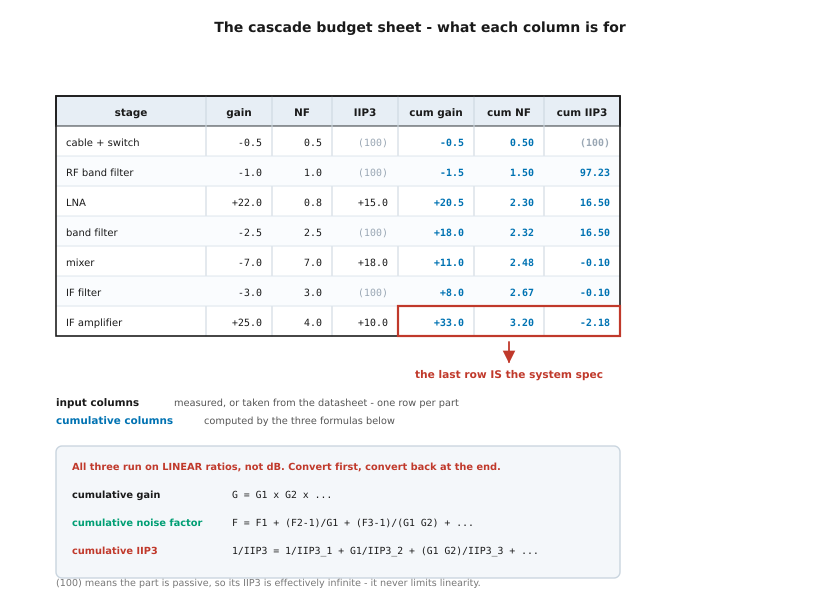
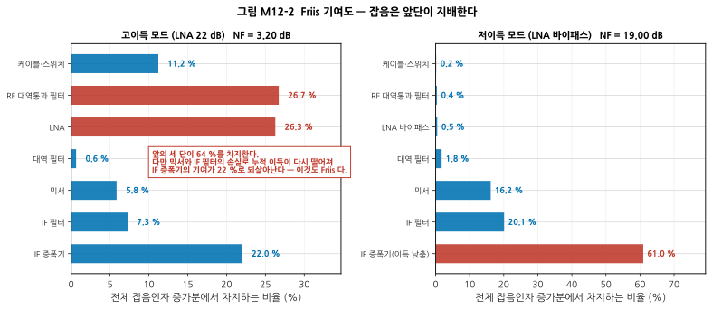
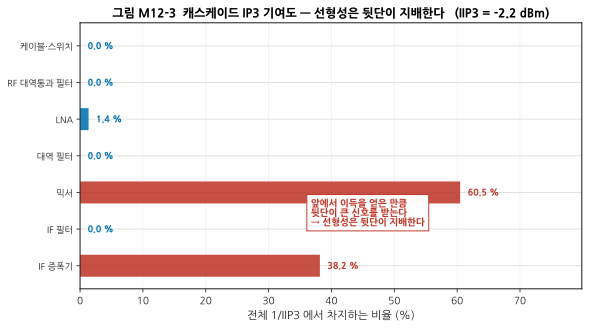
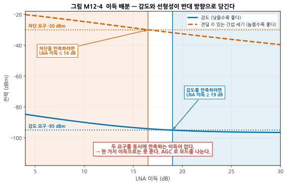
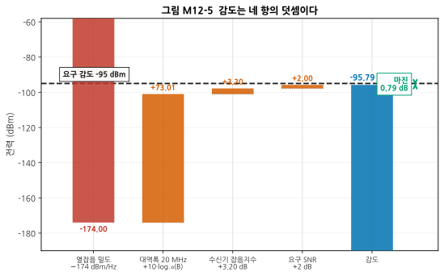
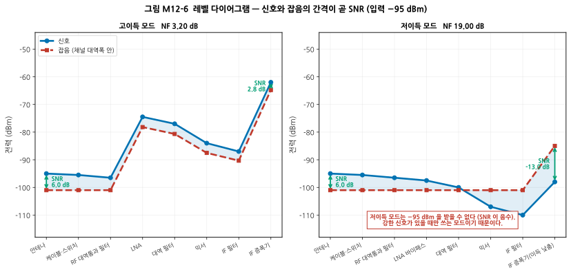
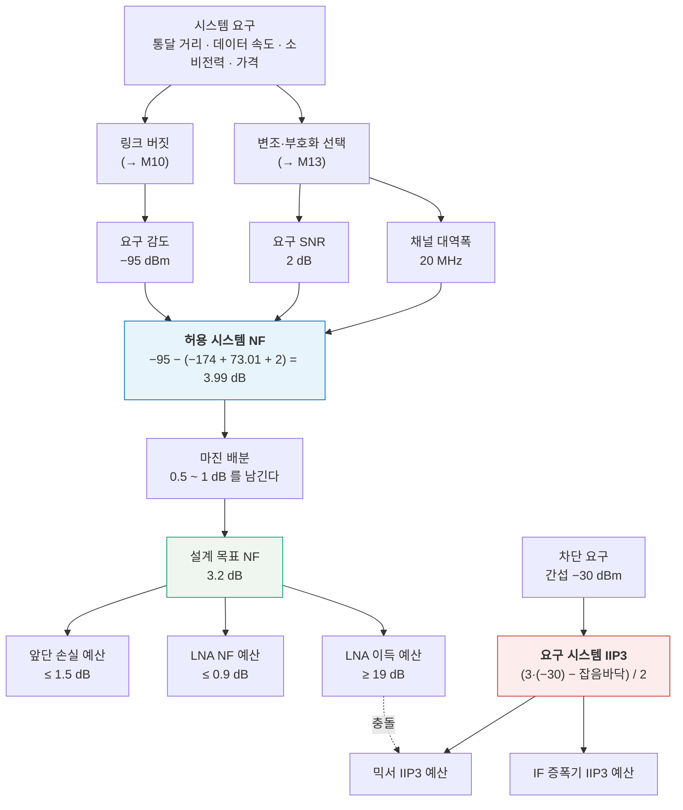

# M12 — 시스템 예산 설계: 스펙을 나누는 기술

**문서 번호**: RF-CUR-M12 · **버전**: v1.0 · **분량**: 이론 6 h + 실습 8 h

> **이 모듈이 커리큘럼 이론의 정점입니다.** RF 시스템 엔지니어의 핵심 산출물인 **캐스케이드 예산표**를 직접 만듭니다. M06~M11에서 배운 모든 숫자가 여기서 한 장의 표로 모입니다.

| | |
|---|---|
| **선수 모듈** | [M11](./M11_트랜시버아키텍처.md), [M08](./M08_증폭기.md) (NF·P1dB·IP3 정의), [M10](./M10_안테나와전파.md) (링크 버짓), [M01](./M01_데시벨과전력.md) (dB·kTB) |
| **이 모듈이 소유하는 개념** | **Friis 캐스케이드 잡음지수 공식**, 캐스케이드 IIP3/OIP3, 캐스케이드 이득·P1dB, 시스템 잡음온도, **수신 감도와 최소 검출 신호(MDS)**, 요구 SNR과 복조 임계값, 잡음 등가 대역폭, **동적 범위**(선형 동적범위, 무스퓨리어스 동적범위 SFDR), 차단(blocking)과 감도 저하, **이득 배분 최적화**, **스펙 플로우다운**, 마진 배분 정책, 최악조건 예산 vs RSS 예산, 온도·공정·전압 변동 |
| **이 모듈을 쓰는 후속 모듈** | M13(요구 SNR의 근거), **M14·M15**(예산표의 각 항목을 어떻게 재는가), M16(예산과 실측이 어긋날 때), M17(구현이 예산을 지키는가), **캡스톤**(예산표가 설계의 출발점) |
| **학습 목표** | ① 5단 이상 체인의 NF/IIP3/이득을 계산한다 ② 요구 감도로부터 각 부품에 배분할 스펙을 도출한다 ③ 왜 첫 단이 잡음을, 마지막 단이 선형성을 지배하는지 수식으로 보인다 |

---

## M12.0 이 모듈의 범위

지금까지는 **부품 하나하나의 사양**을 읽는 법을 배웠습니다. 이 모듈은 반대 방향입니다.

> **"이 무전기가 −95 dBm을 받아야 한다"는 요구가 있을 때, 저잡음 증폭기(Low Noise Amplifier, LNA)의 잡음지수(Noise Figure, NF)는 몇 dB여야 하는가?**

이 질문에 답하는 것이 시스템 엔지니어의 일입니다. 그리고 답하는 도구가 **예산표**입니다.

> ⚠️ **다른 모듈과의 역할 분리**
>
> | 개념 | M12 (여기) | 다른 모듈 |
> |---|---|---|
> | NF, P1dB, IP3 | **여러 단을 이었을 때의 누적 계산** | [M08](./M08_증폭기.md)이 **한 단의 정의**를 소유 |
> | 이득 배분 | **수식으로 최적점을 찾는다** | [M11 §8](./M11_트랜시버아키텍처.md)이 **AGC와 레벨 다이어그램의 원칙**을 소유 |
> | 링크 버짓 | 수신기 **내부** 예산 | [M10 §8](./M10_안테나와전파.md)이 **전파 구간**을 소유 |
> | 요구 SNR | 예산의 **입력값으로 사용** | M13이 **변조 방식에서 어떻게 나오는지** 소유 |
> | 측정 | 언급만 | M14·M15가 **각 항목의 측정 절차**를 소유 |

### 이 모듈이 푸는 문제

하나의 요구사항을 끝까지 따라갑니다.

| 요구 항목 | 값 |
|---|---|
| 주파수 | 2.4 GHz |
| 채널 대역폭 | 20 MHz |
| 복조에 필요한 신호 대 잡음비(Signal-to-Noise Ratio, SNR) | 2 dB |
| **감도** | **−95 dBm 이하** |
| **차단(blocking)** | 각 **−30 dBm**인 간섭 두 개가 있어도 3차 상호변조 성분(IM3 → [M08 §5](./M08_증폭기.md))이 잡음 바닥 아래 |
| 마진 정책 | 감도에 0.5 dB 이상 |

> 📌 **결론을 미리 말하면, 이 두 요구는 하나의 이득 설정으로 동시에 만족할 수 없습니다.** 왜 그런지, 그리고 실무가 그것을 어떻게 푸는지가 이 모듈의 이야기입니다.

---

## M12.1 예산표란 무엇인가



*그림 M12-1. 캐스케이드 예산표의 양식. **읽는 법**: 왼쪽 네 열은 **입력**입니다 — 부품 하나당 한 줄씩, 데이터시트나 실측에서 가져옵니다. 오른쪽 세 열은 **계산 결과**로, 그 단까지의 누적값입니다. 표의 **맨 아랫줄이 곧 시스템 사양**입니다. `(100)`은 수동 부품이라 IIP3가 사실상 무한대라는 뜻입니다.*

**예산표가 하는 일은 세 가지입니다.**

1. **현재 설계가 요구를 만족하는지 판정한다** (위에서 아래로)
2. **요구를 만족하려면 어느 부품을 얼마나 고쳐야 하는지 찾는다** (아래에서 위로)
3. **설계 변경의 영향을 즉시 확인한다** (한 칸을 바꾸면 아랫줄이 전부 바뀐다)

> ⚠️ **세 공식 모두 dB가 아니라 배수로 계산합니다.** dB끼리 더하면 되는 것은 이득뿐입니다. 잡음인자와 IIP3는 **반드시 배수로 바꿔 계산한 뒤 마지막에 dB로 되돌려야** 합니다. 이것이 예산표에서 가장 흔한 실수입니다.

---

## M12.2 Friis 공식 — 왜 첫 단이 지배하는가

### 식

$$F_{total} = F_1 + \frac{F_2 - 1}{G_1} + \frac{F_3 - 1}{G_1 G_2} + \frac{F_4 - 1}{G_1 G_2 G_3} + \cdots$$

(F는 잡음인자, G는 이득. **둘 다 배수**입니다.)

### 유도의 직관

$n$번째 단이 새로 만든 잡음은 그 단의 입력에서 볼 때 $(F_n - 1) \times kTB$ 만큼입니다. 그런데 그 잡음이 **시스템 입력에서 얼마짜리로 보이는가**를 물으면, 앞단의 이득으로 나눠 줘야 합니다.

$$\text{입력 환산 기여} = \frac{F_n - 1}{G_1 G_2 \cdots G_{n-1}}$$

**즉, 앞단의 이득이 클수록 뒷단의 잡음은 작아 보입니다.** 그게 전부입니다.



*그림 M12-2. 각 단이 전체 잡음인자 증가분에서 차지하는 비율입니다. **읽는 법**: 왼쪽(고이득 모드)에서 앞의 세 단이 64 %를 차지합니다. 다만 믹서와 IF 필터의 손실 때문에 누적 이득이 다시 떨어지면 **IF 증폭기의 기여가 22 %로 되살아납니다** — 이것도 Friis 식이 말해 주는 내용입니다. 오른쪽(저이득 모드)에서는 LNA가 없으므로 **뒷단이 전체를 지배**해 NF가 19 dB까지 올라갑니다.*

> 📌 **"첫 단이 지배한다"는 정확히는 "누적 이득이 큰 지점 이후는 기여가 작아진다"입니다.** 그래서 체인 중간에 큰 손실(믹서, 필터)이 있으면 그 뒤가 다시 중요해집니다. **예산표를 보면 어디를 고쳐야 하는지가 한눈에 보입니다.**

### 세 가지 즉시 확인 가능한 성질

| 성질 | 확인 |
|---|---|
| 수동 소자만의 체인은 **NF = 총 손실** | 1 + 2 + 3 dB 손실 → NF 정확히 6.00 dB |
| 한 단짜리 체인의 NF는 **그 단의 값** | 당연하지만 구현 검증에 유용 |
| 앞단 이득이 아주 크면 **뒷단 잡음이 사라진다** | 60 dB 이득 뒤에 NF 30 dB → 전체 NF 1.00 dB |

> 💡 **잡음온도로 쓰면 뺄셈이 사라집니다.** $T_e = T_0(F-1)$ 로 바꾸면 Friis 식은 $T_{total} = T_1 + T_2/G_1 + \cdots$ 가 되어 "−1"이 없어집니다. 위성·전파천문에서 잡음온도를 쓰는 실무적 이유 중 하나입니다. **이 문서의 계산기는 두 경로를 각각 구현해 결과가 같은지 검산합니다.**

---

## M12.3 캐스케이드 IP3 — 왜 마지막 단이 지배하는가

### 식

$$\frac{1}{IIP3_{total}} = \frac{1}{IIP3_1} + \frac{G_1}{IIP3_2} + \frac{G_1 G_2}{IIP3_3} + \cdots$$

(IIP3는 **전력 배수**, G는 이득 배수입니다. IIP3는 입력 3차 교차점(Input Third-order Intercept Point)이며, 출력 기준이 필요하면 **OIP3 = IIP3 + 전체 이득**으로 바꿉니다. **캐스케이드 P1dB도 같은 형태의 식**을 씁니다.)

### 직관

Friis와 정확히 반대입니다. **앞에서 이득을 얻은 만큼, 뒷단은 더 큰 신호를 받습니다.** 큰 신호를 받는 단이 먼저 왜곡을 만듭니다.



*그림 M12-3. 각 단이 전체 1/IIP3에서 차지하는 비율입니다. **읽는 법**: 믹서가 60.5 %, IF 증폭기가 38.2 %로 **뒤의 두 능동 소자가 거의 전부**입니다. LNA는 1.4 %뿐입니다. 수동 부품(0.0 %)은 사실상 선형이라 기여하지 않습니다.*

| | 잡음 (Friis) | 선형성 (IP3) |
|---|---|---|
| 나누는 값 | 앞단의 **이득** | — |
| 곱하는 값 | — | 앞단의 **이득** |
| 지배하는 곳 | **앞단** | **뒷단** |
| 앞단 이득을 키우면 | **좋아진다** | **나빠진다** |

> 📌 **이 표의 마지막 줄이 이 모듈 전체의 핵심입니다.** 같은 손잡이(앞단 이득)가 두 성능을 반대 방향으로 움직입니다.

---

## M12.4 두 지배 법칙의 충돌 = 이득 배분 문제



*그림 M12-4. LNA 이득만 바꿔 가며 계산한 결과입니다. 가로축이 LNA 이득, 세로축이 전력(dBm)입니다. **읽는 법**: 파란 실선은 감도로, **낮을수록 좋습니다.** 주황 파선은 견딜 수 있는 간섭 세기로, **높을수록 좋습니다.** 두 요구선(점선)을 만족하는 구간이 각각 파란 영역과 주황 영역인데, **겹치지 않습니다.***

| LNA 이득 | 시스템 NF | 시스템 IIP3 | 감도 | 견딜 수 있는 간섭 |
|---|---|---|---|---|
| 10 dB | 8.96 dB | +9.02 dBm | −90.03 dBm | −24.66 dBm |
| 14 dB | 6.18 dB | +5.51 dBm | −92.81 dBm | −27.93 dBm |
| 18 dB | 4.27 dB | +1.73 dBm | −94.72 dBm | −31.09 dBm |
| **22 dB** | **3.20 dB** | **−2.18 dBm** | **−95.79 dBm** | **−34.05 dBm** |
| 26 dB | 2.68 dB | −6.15 dBm | −96.31 dBm | −36.87 dBm |

**요구 판정**

- 감도 −95 dBm을 만족하려면 **LNA 이득 ≥ 19 dB**
- 차단 −30 dBm을 만족하려면 **LNA 이득 ≤ 16 dB**

> ⚠️ **겹치는 구간이 없습니다. 하나의 이득으로는 두 요구를 만족할 수 없습니다.**

### 실무는 이것을 어떻게 푸는가

**요구를 동시에 만족해야 하는지 다시 확인하는 것**이 첫걸음입니다. 규격서를 읽어 보면 대개 **감도 시험과 차단 시험은 조건이 다릅니다.**

| 시험 | 원하는 신호 | 간섭 |
|---|---|---|
| **감도 시험** | 감도 근처 (−95 dBm) | **없음** |
| **차단 시험** | 감도보다 3~30 dB 위 | −30 dBm |

**즉 강한 간섭이 있을 때는 원하는 신호도 강합니다.** 그러면 이득을 낮춰도 됩니다.

| 모드 | 이득 | NF | IIP3 | 감도 | 견딜 간섭 |
|---|---|---|---|---|---|
| **고이득** (LNA 22 dB) | 33.0 dB | 3.20 dB | −2.18 dBm | **−95.79 dBm** ✅ | −34.05 dBm ❌ |
| **저이득** (LNA 바이패스) | −3.0 dB | 19.00 dB | +20.88 dBm | −79.99 dBm ❌ | **−13.41 dBm** ✅ |

**차단 시험 조건**(원하는 신호 −65 dBm, 간섭 −30 dBm 두 개)에서 저이득 모드를 보면

- 잡음 바닥 −81.99 dBm → SNR = −65 − (−81.99) = **17.0 dB** ≥ 요구 2 dB ✅
- IM3 = 3×(−30) − 2×20.88 = **−131.8 dBm**, 잡음 바닥보다 **49.8 dB 아래** ✅

**두 시험 모두 통과합니다.**

> 📌 **이것이 예산 설계의 진짜 결론입니다.** "부품을 더 좋은 것으로"가 아니라 **"요구를 다시 읽고, 시험 조건이 다르면 동작점도 다르게 하라"** 는 것입니다. **자동 이득 제어(Automatic Gain Control, AGC)** 는 편의 기능이 아니라 **예산이 요구하는 구조**입니다.

---

## M12.5 감도 계산

$$\boxed{\ \text{감도 [dBm]} = -174 + 10\log_{10}(B) + NF + SNR_{req}\ }$$



*그림 M12-5. 감도는 네 항의 덧셈입니다. **읽는 법**: 왼쪽부터 열잡음 밀도, 대역폭, 수신기 잡음지수, 요구 SNR을 차례로 더하면 감도가 나옵니다. 파란 막대가 결과이고, 검은 파선이 요구값, 그 사이가 마진입니다.*

| 항 | 값 | 어디서 오나 |
|---|---|---|
| 열잡음 밀도 | −174.00 dBm/Hz | 물리 상수 ([M01](./M01_데시벨과전력.md)) |
| 대역폭 20 MHz | +73.01 dB | **시스템 설계자가 정한다** |
| 수신기 잡음지수 | +3.20 dB | **예산표의 결과** |
| 요구 SNR | +2.00 dB | **변조 방식이 정한다** (→ M13) |
| **감도** | **−95.79 dBm** | 요구 −95 dBm 대비 **마진 0.79 dB** |

> 💡 **네 항 중 설계자가 실제로 움직일 수 있는 것은 둘뿐**입니다. 열잡음은 물리이고, 요구 SNR은 규격이 정합니다. 남는 것은 **대역폭**과 **잡음지수**입니다.
>
> - **대역폭을 1/4로 줄이면 감도가 6.02 dB 좋아집니다.** 대신 데이터 속도가 줄어듭니다.
> - **잡음지수는 부품과 이득 배분으로 줄입니다.** §M12.2~4의 이야기입니다.

### MDS와 감도의 차이

| 용어 | 정의 |
|---|---|
| **MDS** (Minimum Detectable Signal, 최소 검출 신호) | SNR = 0 dB가 되는 입력. **곧 잡음 바닥** |
| **감도** (sensitivity) | 요구 SNR을 만족하는 입력. MDS + SNR_req |

이 예에서 MDS = −97.79 dBm, 감도 = −95.79 dBm입니다.

> ⚠️ **데이터시트에서 "감도"라고 적혀 있으면 반드시 조건을 확인하십시오.** 어떤 대역폭에서, 어떤 변조·부호화로, 어떤 오류율(비트 오류율 BER 또는 패킷 오류율 PER → M13) 기준인지에 따라 값이 10 dB 이상 달라집니다.

> 💡 **잡음 등가 대역폭(Noise Equivalent Bandwidth)**: 위 식의 B는 −3 dB 대역폭이 아니라 **"같은 잡음 전력을 통과시키는 이상적 사각 필터의 폭"** 입니다. 실제 필터는 스커트가 완만해 잡음 등가 대역폭이 −3 dB 대역폭보다 조금 넓습니다(1차 RC는 π/2 = 1.571배). 정밀한 예산에서는 이 차이를 반영해야 합니다.

---

## M12.6 레벨 다이어그램 — 신호와 잡음을 함께 본다



*그림 M12-6. 입력 −95 dBm일 때 체인을 따라가며 신호(파랑)와 잡음(빨강)의 절대 레벨을 그린 것입니다. **읽는 법**: **두 선의 간격이 곧 SNR**입니다. 고이득 모드에서 SNR이 6.0 dB에서 2.8 dB로 3.2 dB 줄었고, 그 3.2 dB가 곧 시스템 잡음지수입니다. 저이득 모드에서는 SNR이 −13.0 dB로 음수가 되어 이 신호를 받을 수 없습니다.*

> 📌 **레벨 다이어그램은 예산표와 같은 정보를 다른 방식으로 보여 줍니다.** 표는 숫자로, 그림은 **어디서 SNR이 나빠지는지**를 눈으로 보여 줍니다. 검토 회의에서는 그림이 훨씬 빠르게 읽힙니다.

> 💡 [M11 §8](./M11_트랜시버아키텍처.md)의 레벨 다이어그램과 축이 다릅니다. **M11은 "어디가 포화하는가"(P1dB 대비 여유)를, M12는 "어디서 SNR을 잃는가"(잡음 대비 간격)를** 봅니다. 실무에서는 둘 다 그립니다.

---

## M12.7 동적 범위 — 위와 아래 사이

수신기는 **아주 약한 신호와 아주 강한 신호를 동시에 다뤄야** 합니다. 그 폭이 동적 범위입니다.

| 이름 | 정의 | 이 예의 값 |
|---|---|---|
| **선형 동적 범위** | (입력 P1dB) − (감도) | −11.8 − (−95.8) = **84.0 dB** |
| **무스퓨리어스 동적 범위 (SFDR)** | (2/3)·(IIP3 − 잡음 바닥) | (2/3)(−2.18 + 97.79) = **63.7 dB** |
| 순간 동적 범위 | 아날로그-디지털 변환기(ADC)가 한 번에 담는 범위 | → [M11 §7](./M11_트랜시버아키텍처.md) |

> 💡 **입력 P1dB는 어디서 왔나**: 캐스케이드 P1dB 공식이 IP3와 같은 형태이므로 같은 방식으로 계산합니다. 여기서는 [M08 §6](./M08_증폭기.md)의 어림 "입력 P1dB ≈ IIP3 − 9.6 dB"를 써서 −11.8 dBm으로 잡았습니다. **어림이므로 실측으로 확인해야 합니다.**


### SFDR의 2/3은 어디서 오나

**정의**: 3차 왜곡 산물이 **잡음 바닥과 같아지는 지점까지**의 입력 범위입니다.

IM3(입력 환산) = 3·P_in − 2·IIP3 이므로, 이것이 잡음 바닥 N과 같아지는 P_in을 구하면

$$3 P_{in} - 2\,IIP3 = N \ \Rightarrow\ P_{in} = \frac{N + 2\,IIP3}{3}$$

그 지점과 잡음 바닥 사이의 거리가 SFDR입니다.

$$SFDR = P_{in} - N = \frac{N + 2\,IIP3}{3} - N = \frac{2}{3}(IIP3 - N)$$

> 📌 **§M12.4의 "견딜 수 있는 간섭 세기"가 바로 이 $P_{in}$입니다.** 같은 계산을 다른 이름으로 부른 것뿐입니다.

> 💡 **차단을 일으키는 원인은 IM3만이 아닙니다.** 강한 간섭이 국부발진기(LO)의 위상잡음을 타고 채널로 들어오는 **상호혼합**도 감도를 떨어뜨립니다([M09 §10](./M09_주파수변환과신호원.md)). 예산표에는 두 기여를 각각 계산해 **전력으로 더해** 반영합니다.

> ⚠️ **동적 범위는 AGC로 넓힙니다.** 위 값들은 **한 가지 이득 설정에서의** 범위입니다. AGC로 이득을 60 dB 움직이면 시스템 전체의 동적 범위는 훨씬 넓어집니다. **다만 어느 순간에도 위 값 이상은 못 봅니다.**

---

## M12.8 역방향 설계 — 요구에서 부품 스펙으로

지금까지는 부품에서 시스템으로 올라갔습니다(**상향, bottom-up**). 실무의 진짜 일은 반대 방향입니다(**하향, top-down**).



*그림 M12-7. 스펙 플로우다운. **읽는 법**: 위에서 아래로 갈수록 구체적인 부품 사양이 됩니다. 왼쪽 줄기는 감도에서 잡음지수 예산으로, 오른쪽 줄기는 차단에서 선형성 예산으로 내려옵니다. **점선이 §M12.4의 충돌**이며, 그 충돌이 AGC 구조를 강제합니다.*

### 절차

1. **요구 감도에서 허용 NF를 뺀다.**
   $$NF_{허용} = \text{감도} - \big(-174 + 10\log_{10}B + SNR_{req}\big) = -95 - (-98.99) = 3.99\ \text{dB}$$
2. **마진을 뗀다.** 0.5~1 dB를 남기면 설계 목표는 **3.0~3.5 dB**.
3. **앞단 손실부터 정한다.** 앞단 손실은 NF에 **거의 그대로 더해지므로** 가장 먼저 깎아야 합니다. 여기서는 1.5 dB로 잡았습니다.
4. **남은 예산으로 LNA를 고른다.** 앞단 1.5 dB를 빼면 LNA 이후에 쓸 수 있는 몫은 약 1.7 dB입니다. LNA NF 0.8 dB와 이득 22 dB면 뒷단 기여가 0.9 dB로 들어옵니다.
5. **차단 요구에서 IIP3 예산을 구한다.**
   $$IIP3_{요구} = \frac{3 P_{간섭} - N}{2} = \frac{3(-30) + 97.79}{2} = \mathbf{+3.9\ dBm}$$
6. **충돌을 확인하고 구조로 푼다** (§M12.4).

> 📌 **5번의 결과가 중요합니다.** 고이득 모드의 실제 IIP3는 −2.18 dBm이므로 요구 +3.9 dBm에 **6.1 dB 모자랍니다.** 이 숫자가 "이득을 얼마나 낮춰야 하는가"를 정합니다.

---

## M12.9 마진 정책 — 어디에 얼마를 남기는가

### 왜 마진이 필요한가

예산표의 숫자는 **typ 값**입니다. 실제 제품은

| 변동 요인 | 전형적 크기 |
|---|---|
| 부품 편차 (lot 간) | 각 항목 ±0.3 ~ ±1 dB |
| **온도** | 이득은 −0.02 dB/°C 수준. 3단이면 **60 °C 변화에 −3.6 dB** |
| 전원 전압 변동 | 이득·선형성 모두 영향 |
| 기판 편차 | 정합·손실 변동 |
| 조립 편차 | 커넥터·납땜 |
| 측정 불확도 | → M14 |

### 최악조건 예산 vs RSS 예산

| 방식 | 계산 | 5개 항목이 각 ±0.5 dB일 때 |
|---|---|---|
| **최악조건** (worst case) | 전부 더한다 | **2.5 dB** |
| **RSS** (Root-Sum-Square, 제곱합근) | √(합의 제곱) | **1.12 dB** |

$$\text{RSS} = \sqrt{\sum_i \sigma_i^2}$$

| 항목 수 | 최악조건 | RSS | 비 |
|---|---|---|---|
| 3 | 1.50 dB | 0.87 dB | 1.73배 |
| 5 | 2.50 dB | 1.12 dB | 2.24배 |
| 10 | 5.00 dB | 1.58 dB | 3.16배 |

> ⚠️ **어느 쪽을 쓸지는 "그 변동들이 독립인가"가 정합니다.**
>
> - **독립이면 RSS.** 서로 다른 공급사의 부품 편차, 서로 다른 원인의 잡음 등.
> - **함께 움직이면 최악조건.** 온도는 모든 단을 **같은 방향으로** 움직입니다. 전원 전압도 마찬가지입니다. **이런 항목을 RSS로 처리하면 실제 제품이 규격을 벗어납니다.**
>
> **실무의 절충**: 온도·전압처럼 상관된 항목은 최악조건으로, 부품 편차처럼 독립인 항목은 RSS로 계산해 **둘을 더합니다.**

> 📌 **마진을 어디에 두는가도 정책입니다.**
>
> | 방식 | 장점 | 단점 |
> |---|---|---|
> | 각 부품에 조금씩 | 공급사 교체가 쉽다 | 전체 마진이 과도해져 비싸진다 |
> | **시스템 끝에 한 번에** | 부품 선택이 자유롭다 | 어느 부품이 위험한지 안 보인다 |
> | **위험한 항목에 집중** | 효율적이다 | 위험 판단이 틀리면 실패 |
>
> 대부분의 실무는 세 번째를 씁니다. **"어느 항목이 실제로 변동이 큰가"를 알아야 하며, 그것을 알려 주는 것이 M14의 측정 불확도 분석**입니다.

---

## M12.10 예산표 검토 회의 — 무엇을 묻는가

예산표는 혼자 만드는 문서가 아니라 **팀이 함께 검토하는 문서**입니다. 검토에서 반드시 나오는 질문들입니다.

| 질문 | 왜 묻는가 |
|---|---|
| "이 값은 typ인가 max인가?" | typ으로만 만든 예산은 절반이 실패한다 |
| "어느 온도에서의 값인가?" | 상온 데이터로 −40 °C를 보장할 수 없다 |
| "이 부품을 못 구하면 대안은?" | 단일 공급사 부품은 그 자체가 위험이다 |
| "마진이 어디에 얼마나 있는가?" | 마진 0 dB인 항목은 반드시 실패한다 |
| "가장 민감한 항목은?" | 한 부품이 전체를 좌우하면 설계가 취약하다 |
| "시험 조건이 규격과 같은가?" | §M12.4의 교훈 |
| "측정으로 확인할 수 있는가?" | 잴 수 없는 예산은 관리할 수 없다 (→ M14·M15) |

> 💡 **민감도 분석**을 함께 제출하는 것이 좋은 습관입니다. 각 항목을 ±1 dB 흔들었을 때 시스템 값이 얼마나 움직이는지 표로 만들면, **어디에 마진과 관심을 둘지가 자동으로 드러납니다.** 실습 L12-b에서 만듭니다.

---

## M12.L 실습

### L12-a — 캐스케이드 예산 계산기 만들기 (Tier 0, 4시간)

**목표**: 예산표를 계산하는 도구를 직접 만들고, 여러 방법으로 검증합니다.

**준비물**: Python 3, `numpy`

**절차**

1. 아래 스크립트를 `l12a.py`로 저장하고 실행합니다.

```python
import numpy as np

T0 = 290.0
BW = 20e6          # 채널 대역폭 [Hz]
SNR_REQ = 2.0      # 복조에 필요한 SNR [dB]


def db(x):
    return 10 * np.log10(x)


def un(x):
    return 10 ** (np.asarray(x, dtype=float) / 10)


def budget(chain, title=""):
    """이름, 이득 dB, NF dB, IIP3 dBm 의 목록을 받아 예산표를 찍는다."""
    F, G, inv = 1.0, 1.0, 0.0
    print(f"\n=== {title} ===")
    print(f"{'단':22s} {'이득':>7} {'NF':>6} {'IIP3':>7} | "
          f"{'누적이득':>8} {'누적NF':>7} {'누적IIP3':>9}")
    print("-" * 78)
    for name, g_db, nf_db, iip3 in chain:
        F += (un(nf_db) - 1.0) / G
        inv += G / un(iip3)
        G *= un(g_db)
        print(f"{name:22s} {g_db:+7.1f} {nf_db:6.1f} {iip3:7.1f} | "
              f"{db(G):+8.2f} {db(F):7.2f} {-db(inv):9.2f}")
    return db(G), db(F), -db(inv)


def report(chain, title, sens_req=-95.0, block_req=-30.0):
    g, nf, iip3 = budget(chain, title)
    floor = -174.0 + db(BW) + nf
    sens = floor + SNR_REQ
    im3 = 3 * block_req - 2 * iip3
    p_max = (floor + 2 * iip3) / 3.0
    print(f"  잡음 바닥      {floor:8.2f} dBm")
    print(f"  감도          {sens:8.2f} dBm  (요구 {sens_req:.0f} -> "
          f"마진 {sens_req - sens:+.2f} dB) "
          f"{'합격' if sens <= sens_req else '불합격'}")
    print(f"  간섭 {block_req:.0f} dBm 두 개의 IM3 {im3:8.2f} dBm  "
          f"(잡음 바닥 대비 {im3 - floor:+.1f} dB) "
          f"{'합격' if im3 < floor else '불합격'}")
    print(f"  견딜 수 있는 간섭 세기 {p_max:6.2f} dBm")
    return dict(g=g, nf=nf, iip3=iip3, sens=sens, p_max=p_max)


HIGH = [("케이블·스위치", -0.5, 0.5, 100.0),
        ("RF 대역통과 필터", -1.0, 1.0, 100.0),
        ("LNA", 22.0, 0.8, 15.0),
        ("대역 필터", -2.5, 2.5, 100.0),
        ("믹서", -7.0, 7.0, 18.0),
        ("IF 필터", -3.0, 3.0, 100.0),
        ("IF 증폭기", 25.0, 4.0, 10.0)]

LOW = [list(c) for c in HIGH]
LOW[2] = ["LNA 바이패스", -1.0, 1.0, 100.0]
LOW[6] = ["IF 증폭기(이득 낮춤)", 12.0, 4.0, 10.0]

report(HIGH, "고이득 모드")
report(LOW, "저이득 모드")

print("\n=== LNA 이득 스윕 ===")
print(f"{'LNA 이득':>9} {'NF':>7} {'IIP3':>8} {'감도':>9} {'견딜 간섭':>10}")
for g in range(10, 29, 2):
    ch = [list(c) for c in HIGH]
    ch[2][1] = float(g)
    F, G, inv = 1.0, 1.0, 0.0
    for _, gd, nfd, ip in ch:
        F += (un(nfd) - 1.0) / G
        inv += G / un(ip)
        G *= un(gd)
    nf, iip3 = db(F), -db(inv)
    floor = -174.0 + db(BW) + nf
    print(f"{g:9d} {nf:7.2f} {iip3:8.2f} {floor+SNR_REQ:9.2f} "
          f"{(floor+2*iip3)/3:10.2f}")
```

2. **네 가지 검증을 직접 해 봅니다.**
   - 수동 소자만 있는 체인(−1, −2, −3 dB)의 NF가 정확히 6.00 dB인가?
   - 한 단짜리 체인의 NF·IIP3가 그 단의 값과 같은가?
   - 이득 60 dB 뒤에 NF 30 dB인 단을 붙여도 전체 NF가 거의 안 변하는가?
   - **잡음온도로 다시 계산**해도 같은 답이 나오는가? ($T_e = T_0(F-1)$, $T_{tot} = T_1 + T_2/G_1 + \cdots$)
3. 부품을 바꿔 가며 요구를 만족시키는 조합을 찾습니다.

**예상 결과** (일부)

```
=== 고이득 모드 ===
단                           이득     NF    IIP3 |     누적이득    누적NF    누적IIP3
------------------------------------------------------------------------------
케이블·스위치                   -0.5    0.5   100.0 |    -0.50    0.50    100.00
RF 대역통과 필터                -1.0    1.0   100.0 |    -1.50    1.50     97.23
LNA                      +22.0    0.8    15.0 |   +20.50    2.30     16.50
대역 필터                     -2.5    2.5   100.0 |   +18.00    2.32     16.50
믹서                        -7.0    7.0    18.0 |   +11.00    2.48     -0.10
IF 필터                     -3.0    3.0   100.0 |    +8.00    2.67     -0.10
IF 증폭기                   +25.0    4.0    10.0 |   +33.00    3.20     -2.18
  잡음 바닥        -97.79 dBm
  감도            -95.79 dBm  (요구 -95 -> 마진 +0.79 dB) 합격
  간섭 -30 dBm 두 개의 IM3   -85.63 dBm  (잡음 바닥 대비 +12.2 dB) 불합격
  견딜 수 있는 간섭 세기 -34.05 dBm
```

**판정 기준**

| 항목 | 합격 |
|---|---|
| 재현 | 위 표가 그대로 나온다 |
| 검증 ① | 수동 체인 NF가 **정확히** 6.00 dB |
| 검증 ② | 잡음온도 경로가 **같은 값**을 준다 |
| 해석 | 누적 IIP3가 믹서에서 크게 나빠지는 이유를 설명할 수 있다 |
| 해석 | 누적 NF가 LNA 이후 거의 안 변하다가 IF 증폭기에서 다시 오르는 이유를 설명할 수 있다 |

**흔한 실수**

| 실수 | 증상 | 바로잡기 |
|---|---|---|
| dB를 그대로 Friis 식에 넣음 | NF가 터무니없이 크거나 작다 | `un()`으로 **먼저 배수로** |
| IIP3를 dBm 그대로 역수 | 결과가 무의미 | 전력 배수로 변환 후 역수 |
| 수동 부품의 NF를 0으로 | NF가 낙관적으로 나온다 | **손실 = NF** (→ [M08 §2](./M08_증폭기.md)) |
| 누적 이득을 다음 단 계산 **후에** 갱신 | 한 단씩 밀린다 | 기여를 먼저 더하고 **그다음** 이득을 곱한다 |
| 이득이 음수인 단을 건너뜀 | 손실이 반영 안 됨 | 필터·케이블도 반드시 한 줄 |

---

### L12-b — 요구사항에서 스펙 배분안 만들기 (Tier 0, 4시간)

**목표**: §M12.0의 요구사항에 대해 **서로 다른 배분안 세 개**를 만들고 비교해, 설계 결정을 문서로 방어합니다.

**절차**

1. L12-a의 계산기를 가져와 아래 세 안을 각각 계산합니다.

| 안 | 전략 |
|---|---|
| **A. 부품 개선** | 앞단 손실을 줄이고 더 좋은 LNA를 쓴다 (비싸진다) |
| **B. 이득 재배분** | 부품은 그대로 두고 이득만 옮긴다 (공짜지만 한계가 있다) |
| **C. 구조 변경** | AGC 두 모드로 나눈다 (§M12.4의 해법) |

2. 각 안에 대해 다음을 표로 만듭니다.
   - 시스템 NF, IIP3, 감도, 견딜 수 있는 간섭
   - 요구 대비 마진
   - **대략적인 부품 비용 순위**(정확한 값이 아니라 상대 비교면 충분)
3. **민감도 분석**을 추가합니다. 각 부품의 NF와 이득을 ±1 dB씩 흔들어 시스템 값이 얼마나 움직이는지 계산합니다.
4. 한 장짜리 결정 문서를 씁니다: **무엇을 골랐고, 왜이며, 어떤 위험을 감수하는가.**

**판정 기준**

| 항목 | 합격 |
|---|---|
| 세 안 계산 | 각각 숫자로 완성되었다 |
| 민감도 | 가장 민감한 항목 두 개를 지목했다 |
| 결정 문서 | 근거가 숫자로 제시되었다 |
| **위험 서술** | 고른 안이 실패할 수 있는 조건을 명시했다 |
| 재현성 | 다른 사람이 같은 계산을 재현할 수 있다 |

**예상되는 결론** (스스로 도달해야 합니다)

- **A안**: 앞단 손실을 1.5 → 0.8 dB로 줄이면 NF가 약 0.7 dB 좋아지지만, **차단 문제는 전혀 해결되지 않습니다.** 비용만 오릅니다.
- **B안**: 이득을 아무리 옮겨도 §M12.4의 두 요구선 사이 간격을 메울 수 없습니다. **이득 배분만으로는 못 푸는 문제**입니다.
- **C안**: 시험 조건이 다르다는 사실을 이용해 **구조로 풉니다.** 추가 비용은 스위치 하나입니다.

> 📌 **이 실습의 진짜 목표는 계산이 아니라 판단입니다.** "부품을 더 좋은 것으로"라는 답은 언제나 가능하지만 거의 언제나 최선이 아닙니다. **요구를 다시 읽는 것이 첫 번째 설계 도구입니다.**

**흔한 실수**

| 실수 | 증상 | 바로잡기 |
|---|---|---|
| typ 값만으로 예산 | 시제품의 절반이 규격 미달 | min/max와 온도 범위를 반영 |
| 마진 0 dB로 설계 | 양산에서 수율이 나온다 | §M12.9의 정책 |
| 상관된 변동을 RSS로 | 온도 끝에서 실패 | 온도·전압은 **최악조건**으로 |
| 시험 조건을 확인 안 함 | 없는 문제를 풀려고 부품을 낭비 | **규격서를 먼저 읽는다** |
| 측정 불가능한 예산 | 검증 단계에서 막힌다 | 각 항목의 측정 방법을 함께 적는다 (→ M14) |

---

## M12.Q 확인 문제

<details>
<summary><b>Q1.</b> 손실 1 dB, 2 dB, 3 dB인 수동 부품 세 개를 이었다. 전체 잡음지수는?</summary>

**정확히 6.00 dB** 입니다.

**계산**: 수동 소자의 NF = 손실이므로 F₁ = 1.259, F₂ = 1.585, F₃ = 1.995이고 G₁ = 0.794, G₂ = 0.631입니다.

$$F = 1.259 + \frac{1.585-1}{0.794} + \frac{1.995-1}{0.794 \times 0.631} = 1.259 + 0.737 + 1.986 = 3.981$$

$$NF = 10\log_{10}(3.981) = \mathbf{6.00\ dB}$$

**이것이 계산기 검증의 첫 시험**입니다. 6.00이 안 나오면 구현이 틀린 것입니다.

**직관**: 수동 소자는 신호도 잡음도 똑같이 줄이므로 SNR을 손실만큼 정확히 깎습니다.
</details>

<details>
<summary><b>Q2.</b> 이득 60 dB, NF 1 dB인 증폭기 뒤에 NF 30 dB인 단이 온다. 전체 NF는?</summary>

$$F = 1.259 + \frac{1000 - 1}{10^6} = 1.259 + 0.000999 = 1.260$$

$$NF = 10\log_{10}(1.260) = \mathbf{1.00\ dB}$$

**뒷단의 끔찍한 잡음지수가 사실상 사라졌습니다.** 앞단 이득 60 dB(= 100만 배)로 나뉘었기 때문입니다.

**실무적 의미**: 이것이 "LNA를 안테나에 최대한 가까이"라는 규칙의 근거입니다. 반대로 **LNA 앞에 케이블이 2 dB 있으면 그 2 dB는 나눌 앞단 이득이 없어 시스템 NF에 그대로 더해집니다.**
</details>

<details>
<summary><b>Q3.</b> 요구 감도가 −95 dBm, 채널 대역폭이 20 MHz, 요구 SNR이 2 dB다. 허용되는 시스템 잡음지수는?</summary>

$$NF_{허용} = \text{감도} - \big(-174 + 10\log_{10}(20\times10^6) + SNR_{req}\big)$$

$$= -95 - (-174 + 73.01 + 2) = -95 - (-98.99) = \mathbf{3.99\ dB}$$

**마진을 고려하면** 0.5~1 dB를 떼어 설계 목표는 **3.0~3.5 dB**로 잡습니다.

**추가 통찰**: 만약 대역폭이 20 MHz가 아니라 5 MHz라면 10·log₁₀(5/20) = −6.02 dB이므로 허용 NF가 **10.01 dB**로 크게 늘어납니다. **대역폭을 줄이는 것이 잡음지수를 개선하는 것보다 훨씬 쉬울 때가 많습니다.**
</details>

<details>
<summary><b>Q4.</b> 시스템 IIP3가 −2.18 dBm, 잡음 바닥이 −97.79 dBm이다. SFDR은 얼마이며, 견딜 수 있는 간섭 세기는?</summary>

**SFDR**
$$SFDR = \frac{2}{3}(IIP3 - N) = \frac{2}{3}(-2.18 + 97.79) = \frac{2}{3}(95.61) = \mathbf{63.7\ dB}$$

**견딜 수 있는 간섭 세기** (IM3가 잡음 바닥과 같아지는 지점)
$$P_{in} = \frac{N + 2\,IIP3}{3} = \frac{-97.79 + 2(-2.18)}{3} = \mathbf{-34.05\ dBm}$$

**검산**: 잡음 바닥에 SFDR을 더하면 그 지점이 나와야 합니다. −97.79 + 63.74 = **−34.05 dBm** ✓

**해석**: 요구가 −30 dBm이므로 **4 dB 모자랍니다.** IIP3를 6 dB 올리거나(3·ΔP = 2·ΔIIP3 이므로), 이득을 낮춰야 합니다.
</details>

<details>
<summary><b>Q5.</b> 감도 요구와 차단 요구를 하나의 이득 설정으로 만족할 수 없다는 것을 알았다. 무엇을 해야 하는가?</summary>

**순서대로 확인합니다.**

1. **요구를 다시 읽는다.** 감도 시험과 차단 시험의 **조건이 같은가?** 대개 다릅니다 — 차단 시험에서는 원하는 신호가 감도보다 훨씬 강합니다. 그렇다면 **두 시험에서 다른 이득을 써도 됩니다.**
2. **AGC로 모드를 나눈다.** 이 예에서는 고이득 모드(LNA 22 dB)와 저이득 모드(LNA 바이패스) 두 가지로 두 시험을 모두 통과했습니다.
3. **그래도 안 되면 부품을 바꾼다.** IIP3가 더 높은 믹서, NF가 더 낮은 LNA. 비용이 오릅니다.
4. **그래도 안 되면 요구를 협상한다.** 대역폭을 줄이거나, 변조 차수를 낮추거나(요구 SNR ↓), 차단 요구를 완화합니다.

> **1번을 건너뛰고 3번으로 가는 것이 초심자의 가장 비싼 실수입니다.**
</details>

<details>
<summary><b>Q6.</b> 예산에 다섯 개의 불확실 항목이 있고 각각 ±0.5 dB다. 최악조건과 RSS로 각각 계산하면? 어느 쪽을 써야 하는가?</summary>

- **최악조건**: 0.5 × 5 = **2.5 dB**
- **RSS**: 0.5 × √5 = **1.12 dB**

**어느 쪽을 쓸지는 항목들이 독립인가가 정합니다.**

- **독립이면 RSS.** 다섯 개가 동시에 최악이 될 확률은 매우 낮습니다.
- **함께 움직이면 최악조건.** 온도는 모든 단의 이득을 **같은 방향으로** 밉니다. 이런 항목을 RSS로 처리하면 **온도 끝에서 제품이 규격을 벗어납니다.**

**실무의 절충**: 상관된 항목(온도, 전원 전압)은 최악조건으로 합산하고, 독립인 항목(부품 편차)은 RSS로 합산한 뒤 **둘을 더합니다.**
</details>

<details>
<summary><b>Q7.</b> 예산표에서 누적 NF가 LNA 이후 거의 변하지 않다가 IF 증폭기에서 다시 오른다. 왜인가?</summary>

**누적 이득의 변화 때문입니다.**

LNA 직후 누적 이득은 +20.5 dB(약 112배)입니다. 그래서 그 뒤 단들의 잡음 기여가 112로 나뉘어 거의 안 보입니다.

그런데 대역 필터(−2.5 dB), 믹서(−7 dB), IF 필터(−3 dB)를 지나면서 누적 이득이 **+8 dB(약 6.3배)까지 떨어집니다.** 이제 IF 증폭기의 잡음은 6.3으로만 나뉘므로 다시 눈에 띄게 됩니다.

**실제 기여도**: IF 증폭기가 전체 잡음인자 증가분의 **22 %** 를 차지합니다(그림 M12-2).

**실무적 결론**: **"첫 단만 좋으면 된다"는 틀렸습니다.** 정확한 규칙은 **"누적 이득이 낮은 지점의 부품이 중요하다"** 입니다. 손실이 큰 부품 바로 뒤를 항상 확인하십시오.
</details>

<details>
<summary><b>Q8.</b> 어떤 부품의 데이터시트에 NF가 typ 값으로만 적혀 있다. 예산에 어떻게 반영해야 하는가?</summary>

**typ 값을 그대로 쓰면 안 됩니다.** typ은 "평균적으로 이렇다"일 뿐 보증되지 않습니다.

**할 수 있는 일**

1. **제조사에 max 값을 요청한다.** 양산 물량이 있으면 대개 알려 줍니다.
2. **여러 개를 실측해 분포를 본다.** 표본이 적더라도 편차의 크기를 짐작할 수 있습니다.
3. **비슷한 부품군의 경험치를 쓴다.** LNA의 NF는 보통 typ + 0.3~0.5 dB가 max입니다.
4. **그 항목에 마진을 집중한다.** 불확실한 항목에 마진을 몰아 주는 것이 §M12.9의 세 번째 정책입니다.
5. **온도 범위를 확인한다.** typ이 25 °C 값이면 −40 °C와 +85 °C에서의 변화를 별도로 반영해야 합니다.

**절대 하면 안 되는 것**: typ 값으로 마진 0 dB 설계. **양산의 절반이 규격 미달이 됩니다.**
</details>

---

## M12.11 한 장 요약

| 무엇 | 한 줄 | 절 |
|---|---|---|
| 예산표 | 시스템의 **한 장짜리 진실.** 맨 아랫줄이 곧 시스템 사양 | §1 |
| 계산 단위 | 이득만 dB로 더한다. **NF와 IIP3는 반드시 배수로** | §1 |
| Friis | F = F₁ + (F₂−1)/G₁ + (F₃−1)/(G₁G₂) + ⋯ | §2 |
| 왜 앞단인가 | 뒷단 잡음이 **앞단 이득으로 나뉘기** 때문 | §2 |
| 정확한 규칙 | "첫 단"이 아니라 **"누적 이득이 낮은 지점"** 이 중요하다 | §2, Q7 |
| 검증 세 가지 | 수동 체인 = 총 손실 / 한 단 = 그 값 / 큰 이득 뒤는 무시 | §2, L12-a |
| 캐스케이드 IP3 | 1/IIP3 = 1/IIP3₁ + G₁/IIP3₂ + ⋯ | §3 |
| 왜 뒷단인가 | 앞에서 얻은 이득만큼 **뒷단이 큰 신호를 받기** 때문 | §3 |
| **핵심 충돌** | 같은 손잡이(앞단 이득)가 **잡음과 선형성을 반대로** 움직인다 | §4 |
| 충돌의 해법 | 부품 교체가 아니라 **요구를 다시 읽고 AGC로 모드를 나눈다** | §4, Q5 |
| 감도 | **−174 + 10·log₁₀(B) + NF + SNR_req** | §5 |
| 움직일 수 있는 것 | 네 항 중 **대역폭과 잡음지수** 둘뿐 | §5 |
| MDS vs 감도 | MDS는 SNR = 0 (잡음 바닥), 감도는 거기에 요구 SNR을 더한 것 | §5 |
| 잡음 등가 대역폭 | −3 dB 대역폭이 아니다. 1차 RC 는 1.571배 | §5 |
| 레벨 다이어그램 | **신호와 잡음의 간격이 곧 SNR** | §6 |
| SFDR | (2/3)(IIP3 − 잡음바닥). 2/3은 **기울기 3에서 나온다** | §7 |
| 역방향 설계 | 요구 → 허용 NF → 마진 → 앞단 손실 → LNA → 확인 | §8 |
| 마진이 필요한 이유 | 부품 편차·**온도**·전압·기판·조립·측정 불확도 | §9 |
| 최악조건 vs RSS | **상관되면 최악조건, 독립이면 RSS.** 섞어 쓰지 말 것 | §9, Q6 |
| typ 값 | 보증되지 않는다. **typ + 마진 0 = 양산 절반 실패** | Q8 |
| 검토 회의 | 잴 수 없는 예산은 관리할 수 없다 (→ M14·M15) | §10 |

---

## M12.A 이 모듈의 축약어

| 약어 | 영문 원어 | 한글 |
|---|---|---|
| NF | Noise Figure | 잡음지수 (→ M08) |
| F | Noise Factor | 잡음인자 (배수 표기) |
| T_e | Equivalent Noise Temperature | 등가 잡음온도 |
| IIP3 / OIP3 | Input / Output Third-order Intercept Point | 입력 / 출력 3차 교차점 (→ M08) |
| P1dB | 1 dB Compression Point | 1 dB 압축점 (→ M08) |
| IM3 | Third-order Intermodulation product | 3차 상호변조 성분 (→ M08) |
| SNR | Signal-to-Noise Ratio | 신호 대 잡음비 |
| MDS | Minimum Detectable Signal | 최소 검출 신호 |
| SFDR | Spurious-Free Dynamic Range | 무스퓨리어스 동적범위 |
| RSS | Root-Sum-Square | 제곱합근 |
| AGC | Automatic Gain Control | 자동 이득 제어 (→ M11) |
| LNA | Low Noise Amplifier | 저잡음 증폭기 (→ M08) |
| BER / PER | Bit / Packet Error Rate | 비트 / 패킷 오류율 (→ M13) |
| ADC | Analog-to-Digital Converter | 아날로그-디지털 변환기 (→ M11) |
| kTB | (기호) 열잡음 전력 | → M01 |

---

## M12.S 출처

| 내용 | 출처 | 등급 | 교차검증 |
|---|---|---|---|
| Friis 캐스케이드 잡음지수 공식과 시스템 잡음지수 해석 | [Keysight AN 57-1 / 5952-8255 — *Fundamentals of RF and Microwave Noise Figure Measurements*](https://www.keysight.com/us/en/assets/7018-06808/application-notes/5952-8255.pdf) · [Analog Devices — *System Noise-Figure Analysis for Modern Radio Receivers*](https://www.analog.com/en/resources/technical-articles/system-noisefigure-analysis-for-modern-radio-receivers.html) | B, B | 2건 |
| 캐스케이드 IP3, 신호 체인 성능 지표 | [Analog Devices — *RF Signal Chain Discourse: Properties and Performance Metrics*](https://www.analog.com/en/resources/analog-dialogue/articles/rf-signal-chain-discourse.html) · [Analog Devices — Cascaded Performance: Integrated vs Passive Mixers](https://www.analog.com/en/resources/technical-articles/cascaded-performance-when-comparing-integrated-rf-frequencyrnmixers.html) | B, B | 2건 |
| 수신 시스템 전반, 감도와 동적 범위 | [Steer, *Microwave and RF Design I — Radio Systems*](https://eng.libretexts.org/Bookshelves/Electrical_Engineering/Electronics/Microwave_and_RF_Design_I_-_Radio_Systems_(Steer)) | B | — |
| 계산 결과 대조용 도구 | [EECL RF Cascade Calculator](https://eecl.co.uk/rf-cascade-calculator/) · [rftools.io Cascaded NF Calculator](https://rftools.io/calculators/rf/noise-figure-cascade/) | D, D | **자체 구현 결과를 대조하는 용도로만 사용** |

> 📌 **본문에서 직접 계산·검산한 항목** — 재현 방법은 `scripts/gen_fig_m12.py` 실행입니다(13개 검산 항목이 출력됩니다).
>
> - 예제 체인의 모든 누적값(이득 33.00 dB, NF 3.20 dB, IIP3 −2.18 dBm)과 저이득 모드의 값
> - **캐스케이드 NF를 잡음인자 경로와 잡음온도 경로로 각각 구현해 완전히 일치함을 확인** (서로 독립적인 두 구현의 교차검증)
> - 경계 조건 검증: 수동 체인 = 총 손실 6.000 dB, 한 단 체인 = 그 단의 값, 60 dB 이득 뒤의 NF 30 dB 단이 전체 NF를 1.00 dB로 유지
> - "SNR 저하량 = 시스템 NF"가 레벨 다이어그램에서 성립함
> - 감도 폭포 차트의 네 항 합이 감도와 일치
> - 이득 스윕에서 감도 요구선과 차단 요구선이 교차하지 않음(LNA 19 dB vs 16 dB)
> - SFDR = (2/3)(IIP3 − 잡음바닥) 의 유도와 값

> ⚠️ **URL 확인 안내**: 작성 환경의 조직 정책상 외부 사이트를 직접 열 수 없어, 검색 결과의 서지 정보와 요약을 교차 대조하는 방식으로 검증했습니다. 링크의 최신 유효성은 독자가 확인해 주십시오. 배경은 [M00.S](./M00_RF시스템엔지니어링이란.md#m00s-출처) 참조.

---

## 다음 모듈

**M13 — 디지털 변조와 신호 품질: 규격이 요구하는 것들** *(집필 예정)*

이 모듈에서 **요구 SNR 2 dB**를 입력값으로 받아 썼습니다. M13에서 그 숫자가 **어디서 나오는지** 밝힙니다. 변조 차수, 부호화, 그리고 EVM·ACLR 같은 신호 품질 지표가 주제입니다.

---

## 변경 이력

| 버전 | 일자 | 내용 |
|---|---|---|
| v1.0 | 2026-08-20 | 최초 작성. 시각자료 7종(데이터 플롯 5 + SVG 예산표 양식 1 + Mermaid 플로우다운 1), 실습 2종, 확인 문제 8문항 |
| — | 2026-08-20 | **검토 3회 완료.** **1차(사실)**: ① 그림 M12-1(예산표 양식 SVG)의 누적 NF·IIP3 네 칸을 **손으로 적었다가 계산기 결과와 어긋나 있던 것**을 발견해 정정하고, 이후 어긋나지 않도록 **SVG 의 값과 계산기 결과를 자동 대조하는 검사**를 검토 절차에 추가했다. ② 캐스케이드 잡음지수를 **잡음인자 경로와 잡음온도 경로로 각각 독립 구현해** 완전히 일치함을 확인했다(경계 조건 3종도 함께 검증: 수동 체인 = 총 손실, 한 단 = 그 값, 큰 이득 뒤는 무시). ③ Q4 의 검산 문장이 반올림을 얼버무리고 있어 잡음바닥 + SFDR = 견딜 수 있는 간섭 세기 라는 정확한 항등식으로 고쳤다. ④ 선형 동적범위에 쓴 입력 P1dB(−11.8 dBm)의 근거가 본문에 없어 M08 의 어림값에서 왔음을 명시했다. ⑤ 그림 번호가 문서 등장 순서와 어긋나(감도가 6번, 레벨이 5번) 서로 바꿨다. **2차(교육)**: 이 모듈의 결론이 '부품을 더 좋은 것으로' 가 아니라 **'요구를 다시 읽어라'** 라는 점이 초심자에게 가장 전달되기 어렵다고 판단해, §0 에서 결론을 미리 예고하고 §4 에서 시험 조건 표로 보인 뒤 Q5 와 실습 L12-b 의 예상 결론까지 세 번 서로 다른 각도로 반복 배치했다. 또 'Friis 는 첫 단이 지배한다' 는 통설이 이 예제에서 **IF 증폭기 22 %** 때문에 반쯤만 맞다는 점을 발견해, 정확한 규칙을 '누적 이득이 낮은 지점이 중요하다' 로 고쳐 쓰고 Q7 을 그 설명에 배정했다. 지침 2 에 따라 LNA·NF·SNR·IM3·IIP3·OIP3·AGC·ADC·BER/PER 의 최초 등장 표기를 원어 병기로 보완. **3차(구조)**: 설계서 §5 의 소유 개념 14항목·주요 절 10개·Lab 2종·시각자료 7종 요구를 대조해 누락 없음 확인. 누락 직전이던 '캐스케이드 P1dB', 'OIP3 환산', '상호혼합에 의한 차단' 세 항목을 §3·§7 에 보강했다. M08(단일 단 정의)·M10(전파 구간 링크 버짓)·M11(AGC 원칙과 레벨 다이어그램)·M13(요구 SNR 의 근거)·M14/M15(측정)로 넘길 내용이 침범하지 않았는지 확인하고 각 지점에 이월 표시. §6 에 M11 의 레벨 다이어그램과 축이 다르다는 점(포화 여유 대 SNR)을 명시. M11 의 '다음 모듈' 링크와 README·설계서 진행표 갱신. Mermaid 1개 렌더 검증, 실습 코드를 본문 그대로 실행해 예상 결과와 일치함을 확인. |
