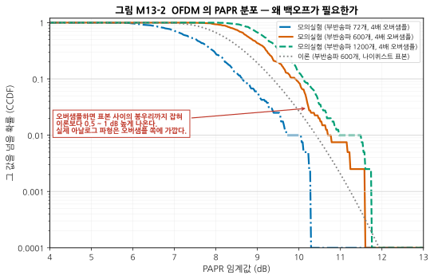
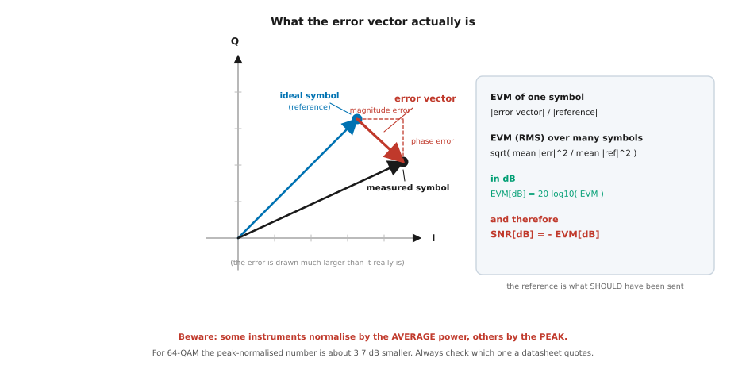
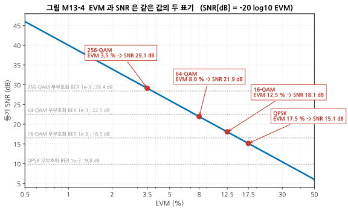
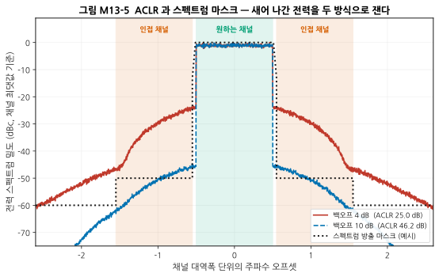
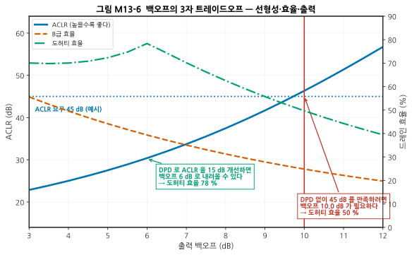
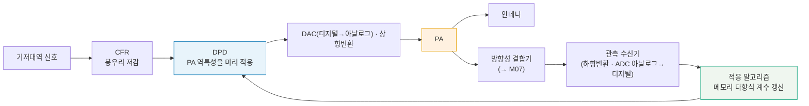
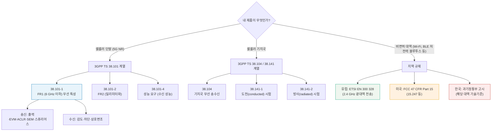

# M13 — 디지털 변조와 신호 품질: 규격이 요구하는 것들

**문서 번호**: RF-CUR-M13 · **버전**: v1.0 · **분량**: 이론 5 h + 실습 7 h

| | |
|---|---|
| **선수 모듈** | [M12](./M12_시스템예산설계.md), [M08](./M08_증폭기.md) (압축·IMD·백오프), [M11](./M11_트랜시버아키텍처.md) (I/Q 불균형) |
| **이 모듈이 소유하는 개념** | 디지털 변조(BPSK/QPSK/QAM), 심볼과 비트, 성상도, 펄스 성형과 롤오프, 직교 주파수 분할 다중(OFDM), **첨두대평균 전력비(PAPR)**, 백오프, **오차 벡터 크기(EVM)** 와 SNR·PAPR 관계, **인접 채널 누설비(ACLR)** 와 스펙트럼 방출 마스크(SEM), 스퓨리어스 방출, 비트오류율(BER)과 블록오류율, **첨두 저감(CFR)**, **디지털 사전왜곡(DPD)**, 표준 문서 체계(3GPP TS 38.101/38.141 계열, ETSI EN 300 328, FCC Part 15) |
| **이 모듈을 쓰는 후속 모듈** | **M15**(EVM·ACLR 측정 절차), M16(신호 품질이 나쁠 때의 디버그), **M17**(인증 시험과 규격 준수), **캡스톤**(무엇을 만족해야 하는가) |
| **학습 목표** | ① EVM 3 %가 어느 정도 SNR인지 환산한다 ② 자기 제품에 적용되는 규격 조항을 찾아낸다 ③ PA 백오프와 ACLR·EVM·효율의 3자 트레이드오프를 설명한다 |

---

## M13.0 이 모듈의 범위

[M12](./M12_시스템예산설계.md)에서 **요구 SNR(Signal-to-Noise Ratio, 신호 대 잡음비) 2 dB**를 입력값으로 받아 썼습니다. 그 숫자가 어디서 오는지가 이 모듈의 출발점입니다.

그리고 더 중요한 질문이 있습니다.

> **"내 송신기가 규격을 만족하는가"를 어떤 숫자로 판정하는가?**

RF 하드웨어는 잘 만들었는데 **규격 시험에서 떨어지는** 일이 흔합니다. 이 모듈은 그 시험이 무엇을 보는지 다룹니다.

> ⚠️ **다른 모듈과의 역할 분리**
>
> | 개념 | M13 (여기) | 다른 모듈 |
> |---|---|---|
> | 압축·IMD | **변조 신호에서 어떻게 나타나는가**(EVM·ACLR) | [M08](./M08_증폭기.md)이 **단일 톤 기준 정의**를 소유 |
> | 백오프와 효율 | **ACLR 요구가 백오프를 정한다** | M08이 **급·도허티·효율 곡선**을 소유 |
> | I/Q 불균형 | **성상도에 남기는 흔적** | [M11 §4](./M11_트랜시버아키텍처.md)가 **정의와 IRR(Image Rejection Ratio, 영상 제거비) 계산**을 소유 |
> | 위상잡음 | 성상도에 남기는 흔적 | [M09 §9](./M09_주파수변환과신호원.md)가 **정의와 Leeson 모델**을 소유 |
> | 요구 SNR | **어디서 나오는가** | M12가 **예산에서 쓰는 법**을 소유 |
> | 측정 절차 | 무엇을 재는지까지 | **M15**가 **어떻게 재는지**를 소유 |

---

## M13.1 아날로그에서 디지털 변조로

### 심볼과 비트

디지털 변조는 **정해진 몇 개의 점 중 하나를 골라 보내는 것**입니다. 그 점 하나를 **심볼(symbol)** 이라 하고, 점이 M개면 한 심볼이 log₂M 비트를 나릅니다.

| 변조 | 점의 수 | 심볼당 비트 |
|---|---|---|
| BPSK | 2 | 1 |
| QPSK | 4 | 2 |
| 16-QAM | 16 | 4 |
| 64-QAM | 64 | 6 |
| 256-QAM | 256 | 8 |

**점을 늘리면 속도가 빨라집니다. 대신 점 사이가 촘촘해져 잡음에 약해집니다.** 이것이 이 모듈 전체를 관통하는 맞바꿈입니다.

| 변조 | 무부호화 BER 10⁻³에 필요한 SNR |
|---|---|
| BPSK | **6.79 dB** |
| QPSK | 9.80 dB |
| 16-QAM | 16.54 dB |
| 64-QAM | 22.55 dB |
| 256-QAM | **28.41 dB** |

> 📌 **속도를 8배로(1비트 → 8비트) 올리려면 SNR이 21.6 dB 더 필요합니다.** 링크 버짓([M10](./M10_안테나와전파.md))으로 보면 거리를 12배 줄이는 것과 같습니다. **높은 차수 변조는 가까울 때만 쓸 수 있습니다.**

> 💡 **부호화(coding)가 이 표를 바꿉니다.** 오류정정부호를 쓰면 같은 BER을 훨씬 낮은 SNR에서 얻습니다. [M12](./M12_시스템예산설계.md)에서 쓴 **요구 SNR 2 dB**는 낮은 차수 변조 + 강한 부호화의 조합입니다. 위 표는 **부호화가 없을 때의 하한**이며, 실제 시스템의 요구 SNR은 규격의 성능 요구에서 읽습니다.

### 펄스 성형 — 왜 사각파를 보내지 않는가

심볼을 사각파로 보내면 스펙트럼이 **sinc 함수 모양으로 무한히 퍼져** 인접 채널을 침범합니다. 그래서 시간 파형의 모서리를 둥글게 만듭니다.

- **상승 코사인(raised cosine)** 계열이 표준입니다.
- **롤오프 계수 α**(0 ~ 1)가 점유 대역폭을 정합니다. 심볼률을 R이라 할 때 **점유 대역폭 = (1 + α) × R** 입니다.

| α | 점유 대역폭 | 시간 파형의 봉우리 |
|---|---|---|
| **작다** (예: 0.1) | **좁다** (1.1 R) | 꼬리가 길게 울려 **커진다** |
| **크다** (예: 0.5) | 넓다 (1.5 R) | 꼬리가 빨리 죽어 **작아진다** |

> 📌 **롤오프는 대역폭과 PAPR의 맞바꿈**입니다. 좁은 대역을 원하면 α를 줄여야 하는데, 그러면 파형의 봉우리가 커져 PA(Power Amplifier, 전력 증폭기)에 부담이 갑니다(§M13.3). **대역에서 아낀 것을 PA에서 갚습니다.**

---

## M13.2 성상도 읽는 법 — 원인마다 다른 지문

**성상도(constellation)** 는 수신한 심볼을 복소 평면에 찍은 것입니다. 이상적이면 점 M개만 있어야 하는데, 실제로는 흩어집니다.

**그 흩어지는 모양이 원인마다 다릅니다.** 이것이 성상도의 진짜 가치입니다.


*그림 M13-1. 같은 64-QAM 신호에 **네 가지 열화를 각각 EVM 8 %로 똑같이 맞춰** 넣은 것입니다. 빨간 십자가 이상적인 점의 위치입니다. **읽는 법**: EVM 값은 모두 같지만 **모양이 전혀 다릅니다.** 잡음은 모든 점에 똑같은 크기의 구름을 만들고, 압축은 바깥 점만 안으로 끌어당기며, I/Q 불균형은 격자를 기울이거나 늘이고, 위상잡음은 점을 원호 방향으로 번지게 합니다.*

| 원인 | 성상도의 지문 | 왜 그런가 |
|---|---|---|
| **잡음**(AWGN, Additive White Gaussian Noise — 가산 백색 가우스 잡음) | 모든 점에 **같은 크기**의 둥근 구름 | 잡음은 신호 크기와 무관하다 |
| **압축**(AM/AM, 진폭이 진폭을 왜곡한다는 뜻) | **바깥 점만** 안쪽으로 끌려온다 | 큰 진폭에서만 압축이 일어난다 |
| **I/Q 불균형** | 격자가 **기울거나 한쪽으로 늘어난다** | I와 Q의 축척·직교성이 어긋난다 |
| **위상잡음** | 점이 **원호 방향으로** 번진다 | 진폭은 그대로, 위상만 흔들린다 |
| **주파수 오차** | 성상도 전체가 **회전한다** | 위상이 시간에 비례해 누적된다 |

> 💡 **정량적으로 구별하는 법** — 눈으로만 보지 않고 숫자로 판정할 수 있습니다. **안쪽 심볼과 바깥쪽 심볼의 평균 오차 크기 비**를 보면 됩니다.
>
> | 원인 | 안쪽 심볼 | 바깥쪽 심볼 | 비 |
> |---|---|---|---|
> | 잡음 | 0.0710 | 0.0706 | **0.99** |
> | 압축 | 0.0520 | 0.1222 | 2.35 |
> | I/Q 불균형 | 0.0367 | 0.1111 | 3.03 |
> | 위상잡음 | 0.0292 | 0.0873 | 2.99 |
>
> **비가 1에 가까우면 잡음**, 크면 진폭에 의존하는 열화입니다. 실습 L13-a에서 직접 계산합니다.

> ⚠️ **성상도만으로는 압축과 위상잡음을 구별하기 어려울 때가 있습니다.** 그럴 때는 **오차의 방향**을 봅니다. 압축은 오차가 **반지름 방향(안쪽)**, 위상잡음은 **접선 방향**입니다.

---

## M13.3 OFDM과 PAPR

### OFDM 한 줄 요약

**직교 주파수 분할 다중(Orthogonal Frequency Division Multiplexing, OFDM)** 은 넓은 대역을 **수백~수천 개의 좁은 부반송파**로 쪼개고, 각 부반송파에 낮은 속도의 심볼을 실어 동시에 보내는 방식입니다.

| 얻는 것 | 왜 |
|---|---|
| **다중경로에 강하다** | 각 부반송파의 대역이 좁아 채널이 그 안에서 평평하다 ([M10 §7](./M10_안테나와전파.md)) |
| **채널마다 다른 변조 가능** | 좋은 부반송파는 높은 차수, 나쁜 곳은 낮은 차수 |
| **구현이 간단하다** | 고속 푸리에 변환(Fast Fourier Transform, FFT) 한 번으로 수천 개를 동시에 |

### 대가: PAPR

수백 개의 부반송파가 **우연히 위상이 맞는 순간** 진폭이 크게 치솟습니다. 그 정도를 나타내는 값이 **첨두대평균 전력비(Peak-to-Average Power Ratio, PAPR)** 입니다.

PAPR은 심볼마다 달라지므로 **분포로** 나타냅니다. 그 분포를 그릴 때 쓰는 것이 **상보 누적분포함수(Complementary Cumulative Distribution Function, CCDF)** 로, "PAPR이 이 값을 **넘을** 확률"을 세로축에 그린 곡선입니다.



*그림 M13-2. OFDM 심볼의 PAPR 분포입니다. 가로축이 PAPR 임계값, 세로축이 **그 값을 넘을 확률**(CCDF)입니다. **읽는 법**: 부반송파가 많을수록 곡선이 오른쪽으로 밀립니다. 회색 점선은 나이퀴스트 표본 기준 이론값인데, **실제 아날로그 파형은 표본 사이에도 봉우리가 있어 0.5~1 dB 더 높습니다.***

| 백분위 | PAPR |
|---|---|
| 중앙값 (50 %) | 8.90 dB |
| 상위 10 % | 9.88 dB |
| 상위 1 % | 10.88 dB |
| 상위 0.1 % | **11.71 dB** |

> ⚠️ **PAPR은 "값 하나"가 아니라 분포입니다.** "PAPR 10 dB"라고 말할 때는 반드시 **어느 확률에서인가**를 함께 말해야 합니다. 보통 CCDF 10⁻³ ~ 10⁻⁴ 지점을 씁니다.

> 📌 **PAPR이 곧 백오프 요구입니다.** 봉우리에서 PA가 압축되지 않으려면 평균 출력을 PAPR만큼 낮춰야 합니다. [M08 §8](./M08_증폭기.md)에서 본 효율 손실이 여기서 시작됩니다.

---

## M13.4 EVM — 정의와 SNR 환산



*그림 M13-3. **오차 벡터(error vector)** 는 "보내야 했던 점"에서 "실제로 받은 점"으로 가는 벡터입니다. 그 길이를 기준 신호 크기로 나눈 것이 EVM입니다. 그림에서는 보이게 하려고 오차를 크게 그렸습니다.*

$$\text{EVM}_{RMS} = \sqrt{\frac{\overline{|\,\text{오차 벡터}\,|^2}}{\overline{|\,\text{기준 신호}\,|^2}}}$$

(아래 첨자 RMS는 **제곱평균제곱근(Root Mean Square)** 이라는 뜻으로, 심볼 하나가 아니라 **많은 심볼에 걸쳐 평균한 값**임을 나타냅니다. 윗줄의 가로선이 그 평균입니다.)

### % 와 dB

$$\text{EVM [dB]} = 20\log_{10}(\text{EVM})$$

### SNR 환산 — 이 모듈의 학습 목표 ①

**잡음만이 원인이라면 EVM과 SNR은 정확히 같은 값의 두 표기입니다.**

$$\boxed{\ \text{SNR [dB]} = -\text{EVM [dB]} = -20\log_{10}(\text{EVM})\ }$$



*그림 M13-4. 가로축 EVM(%), 세로축 등가 SNR(dB)입니다. **읽는 법**: 로그-로그에서 직선입니다. 빨간 점이 3GPP가 정한 변조별 EVM 한도이고, 회색 점선이 각 변조의 무부호화 BER 10⁻³ 요구 SNR입니다.*

| EVM | 등가 SNR |
|---|---|
| 1 % | 40.0 dB |
| 2 % | 34.0 dB |
| **3 %** | **30.5 dB** |
| 8 % | 21.9 dB |
| 17.5 % | 15.1 dB |

> 💡 **EVM은 변조 차수와 무관합니다.** 평균 전력으로 정규화하면 QPSK든 256-QAM이든 같은 SNR에서 같은 EVM이 나옵니다. **"몇 %면 되는가"가 변조마다 다를 뿐**입니다.

### 3GPP가 정한 한도

**3세대 파트너십 프로젝트(3rd Generation Partnership Project, 3GPP)** 는 셀룰러 이동통신 규격을 만드는 국제 표준화 단체입니다. 그 규격이 정한 **송신기 EVM 한도**가 아래 표입니다.

| 변조 | EVM 한도 | 등가 SNR | 무부호화 BER 10⁻³ 요구 |
|---|---|---|---|
| QPSK | 17.5 % | 15.1 dB | 9.8 dB |
| 16-QAM | 12.5 % | 18.1 dB | 16.5 dB |
| 64-QAM | 8.0 % | 21.9 dB | 22.5 dB |
| 256-QAM | 3.5 % | 29.1 dB | 28.4 dB |

> 📌 **한도가 BER 요구와 비슷한 수준이라는 점에 주목하십시오.** EVM 한도는 "이 정도면 통신이 된다"가 아니라 **"송신기가 만드는 열화가 링크 버짓의 다른 항목을 압도하지 않는다"** 는 조건입니다. 수신기 쪽 잡음까지 더해지므로, 실제 설계는 한도보다 훨씬 좋게 만듭니다.

> ⚠️ **정규화 방식을 반드시 확인하십시오.** 같은 신호라도 **평균 전력 정규화**와 **첨두 전력 정규화** 중 무엇을 쓰느냐에 따라 값이 달라집니다. 64-QAM의 첨두/평균 비는 3.68 dB이므로, 첨두 정규화 값은 평균 정규화 값보다 **3.68 dB 작게** 나옵니다. 데이터시트끼리 비교할 때 이것을 놓치면 없는 성능 차이를 만들어 냅니다.

---

## M13.5 EVM을 나쁘게 만드는 것들

| 원인 | 어디서 오나 | 성상도 지문 | 대책 |
|---|---|---|---|
| 열잡음 | 수신기 NF(Noise Figure, 잡음지수), 송신기 잡음 바닥 | 균일한 구름 | [M12](./M12_시스템예산설계.md)의 예산 |
| **압축** | PA (→ [M08 §4](./M08_증폭기.md)) | 바깥 점이 안으로 | 백오프, DPD |
| **위상잡음** | LO(Local Oscillator, 국부발진기) (→ [M09 §9](./M09_주파수변환과신호원.md)) | 원호 방향 번짐 | 좋은 합성기, 좁은 루프 대역폭 |
| **I/Q 불균형** | 변조기·복조기 (→ [M11 §4](./M11_트랜시버아키텍처.md)) | 격자가 기울거나 늘어남 | 디지털 보정 |
| DC 오프셋 | Zero-IF (→ [M11 §5](./M11_트랜시버아키텍처.md)) | 성상도 전체가 **평행 이동** | DC 서보 |
| 주파수 오차 | 기준 발진기 (→ [M09 §8](./M09_주파수변환과신호원.md)) | 전체가 회전 | 주파수 추적 |
| 샘플링 타이밍 오차 | 클럭 | 심볼 간 간섭 형태 | 타이밍 복구 |

**여러 원인이 겹치면 전력으로 더해집니다.**

$$\text{EVM}_{total}^2 \approx \text{EVM}_1^2 + \text{EVM}_2^2 + \cdots$$

(각 원인이 서로 독립일 때)

> 💡 **이 식이 실무에서 매우 유용합니다.** 목표 EVM이 3 %일 때 각 원인에 얼마씩 배분할지를 이 식으로 나눕니다. [M12 §9](./M12_시스템예산설계.md)의 **RSS 예산과 정확히 같은 구조**입니다.
>
> **예**: 목표 3 %를 네 원인에 균등 배분하면 각각 3/√4 = **1.5 %** 씩입니다.

---

## M13.6 ACLR, SEM, 스퓨리어스 — 세 가지가 무엇이 다른가

셋 다 "원하지 않는 곳으로 새어 나간 전력"을 재지만, **보는 방식이 다릅니다.**

| 항목 | 무엇을 재나 | 단위 | 판정 방식 |
|---|---|---|---|
| **ACLR** (인접 채널 누설비) | 인접 **채널 전체**의 전력 / 자기 채널 전력 | dB (또는 dBc) | 값 하나로 |
| **SEM** (스펙트럼 방출 마스크) | 주파수마다의 전력 밀도 | dBm/Hz 또는 dBc | **곡선이 마스크 아래인가** |
| **스퓨리어스 방출** | 아주 넓은 범위의 개별 신호 | dBm | 각 스퍼가 한도 아래인가 |



*그림 M13-5. 같은 OFDM 신호를 서로 다른 백오프로 PA에 통과시킨 결과입니다. **읽는 법**: 초록 띠가 자기 채널, 주황 띠가 인접 채널입니다. **ACLR은 주황 띠 안의 전력을 전부 합쳐 초록 띠와 비교한 값**이고, **SEM은 검은 점선(마스크)을 곡선이 넘는지**를 봅니다. 백오프 4 dB에서는 마스크를 크게 넘지만, 10 dB에서는 여유 있게 통과합니다.*

> ⚠️ **ACLR을 만족해도 SEM에서 떨어질 수 있습니다.** ACLR은 채널 전체를 평균 내므로, **좁은 구간에 뾰족하게 튀어나온 성분**을 놓칠 수 있습니다. 두 시험은 서로를 대체하지 않습니다.

> 📌 **스퓨리어스 방출은 범위가 훨씬 넓습니다.** 보통 9 kHz부터 동작 주파수의 수 배까지 훑으며, 하모닉([M08 §5](./M08_증폭기.md))과 LO 누설([M09 §4](./M09_주파수변환과신호원.md))이 주된 원인입니다. **RF 설계가 아니라 보드 설계와 차폐가 좌우하는 경우가 많습니다**(→ M17).

---

## M13.7 백오프 — 3자 트레이드오프

이 모듈의 학습 목표 ③입니다.



*그림 M13-6. 가로축이 출력 백오프, 왼쪽 축이 ACLR, 오른쪽 축이 드레인 효율입니다. **읽는 법**: 백오프를 키우면 ACLR(파란 실선)은 계속 좋아집니다. 효율은 두 곡선이 다릅니다 — B급(주황 파선)은 단조롭게 떨어지지만, **도허티(초록 일점쇄선)는 6 dB 부근에서 한 번 봉우리를 만들었다가 떨어집니다.** 예시 요구 45 dB를 만족하려면 백오프 10 dB가 필요하고, 그때 도허티 효율은 50 %입니다.*

**계산 결과**

| 백오프 | EVM | ACLR | B급 효율 | 도허티 효율 |
|---|---|---|---|---|
| 4 dB | 10.5 % | 25.0 dB | 49.6 % | 70.0 % |
| 6 dB | 5.6 % | 30.3 dB | 39.4 % | **78.4 %** |
| 8 dB | 2.4 % | 37.3 dB | 31.3 % | 62.5 % |
| **10 dB** | 0.9 % | **46.2 dB** | 24.8 % | **49.7 %** |

> ⚠️ **도허티 효율이 단조롭지 않은 것에 주목하십시오.** 4 dB에서 70.0 %였다가 6 dB에서 **78.4 %로 올라간 뒤** 다시 떨어집니다. 도허티는 [M08 §8](./M08_증폭기.md)에서 본 대로 **백오프 6 dB 지점에 두 번째 효율 정점이 오도록 설계된 구조**이기 때문입니다. 반면 B급은 백오프에 대해 계속 떨어집니다.
>
> 이것이 다음 절을 읽는 열쇠입니다. **DPD가 목표로 삼는 백오프가 하필 6 dB인 것은 우연이 아닙니다** — 아무 데나 내려오는 것이 아니라 **도허티의 봉우리 위에 내려앉히는 것**입니다.

> 📌 **세 가지가 동시에 좋아질 수 없습니다.**
> - 백오프 ↑ → **선형성 좋아짐**, 효율 나빠짐(도허티는 6 dB 봉우리를 지난 뒤부터), 같은 소자로 낼 수 있는 출력 줄어듦
> - 백오프 ↓ → 효율·출력 좋아짐, **ACLR·EVM 나빠짐**
>
> **이 그림 한 장이 PA 설계 전체의 지도**입니다.

---

## M13.8 CFR과 DPD — 백오프를 되찾는 두 가지 방법

### CFR — 봉우리를 미리 깎는다

**첨두 저감(Crest Factor Reduction, CFR)** 은 송신 신호의 봉우리를 **디지털에서 미리 잘라** PAPR을 줄이는 기법입니다. PAPR이 줄면 그만큼 백오프를 줄일 수 있습니다.

**공짜가 아닙니다.**

| 클리핑 임계 | 남은 PAPR | EVM | ACLR |
|---|---|---|---|
| 9 dB | 8.84 dB | 0.26 % | 54.0 dB |
| 8 dB | 7.99 dB | 0.95 % | 43.8 dB |
| **7 dB** | 7.02 dB | **2.19 %** | 37.2 dB |
| 6 dB | 6.07 dB | 4.09 % | 32.2 dB |
| 5 dB | 5.18 dB | 6.67 % | 28.3 dB |

> ⚠️ **클리핑은 EVM과 ACLR을 모두 나쁘게 합니다.** 자르는 행위 자체가 비선형이기 때문입니다. 그래서 실무의 CFR은 단순히 자르지 않고 **자른 뒤 필터링을 반복**해 대역 밖 성분을 억제합니다(그 대신 봉우리가 조금 되살아나므로 여러 번 반복합니다).

> 📌 **CFR은 EVM 예산을 쓰는 일입니다.** 목표 EVM이 3 %인데 CFR에 2.19 %를 쓰면, 나머지 원인에는 √(3² − 2.19²) = **2.05 %** 밖에 남지 않습니다.

### DPD — PA의 왜곡을 미리 반대로 넣는다

**디지털 사전왜곡(Digital Predistortion, DPD)** 은 PA가 만들 왜곡의 **역함수**를 신호에 미리 걸어 두는 기법입니다.



*그림 M13-7. DPD의 구조. **읽는 법**: 핵심은 **되먹임 고리**입니다. 결합기로 PA 출력의 일부를 떼어 내려받고, 그것을 원래 신호와 비교해 사전왜곡 계수를 갱신합니다. **PA의 특성은 온도와 노화에 따라 변하므로, 한 번 맞추고 끝나는 것이 아니라 계속 따라가야 합니다.***

| 항목 | 내용 |
|---|---|
| **얻는 것** | ACLR을 **15~25 dB** 개선. 그만큼 백오프를 줄여 효율을 되찾는다 |
| **메모리 효과** | PA의 출력이 **현재 입력만이 아니라 과거 입력에도** 의존한다(열·바이어스 회로 때문). 그래서 단순 다항식이 아니라 **메모리 다항식**을 쓴다 |
| **필요한 것** | 관측 수신기(신호 대역폭의 **3~5배**를 봐야 한다), 상당한 디지털 연산량 |
| **한계** | PA가 **완전히 포화**하면 역함수가 존재하지 않아 DPD로도 못 고친다 |

> 📌 **CFR과 DPD를 합치면 그림 M13-6의 지도가 바뀝니다.** 이 예에서 DPD로 ACLR을 15 dB 개선하면 백오프를 10 dB → 6 dB로 줄일 수 있고, **도허티 효율이 50 % → 78 %로 올라갑니다.** 기지국의 전기요금이 여기서 갈립니다.
>
> 이 개선폭이 유난히 큰 이유가 §M13.7의 그 봉우리입니다. **6 dB는 도허티의 두 번째 효율 정점**이므로, 백오프를 10 dB에서 6 dB로 내리는 것은 단순히 4 dB만큼 이동하는 것이 아니라 **효율 곡선의 골짜기에서 봉우리로 옮겨 앉는 것**입니다. 도허티가 아닌 B급이었다면 같은 4 dB 이동으로 24.8 % → 39.4 % 밖에 못 갑니다.

---

## M13.9 규격 문서 항해법

이 모듈의 학습 목표 ②입니다. **규격 문서는 읽는 것이 아니라 찾아 들어가는 것**입니다.



*그림 M13-8. 규격 문서 지도. **읽는 법**: 제품 종류가 문서 계열을 정하고, 그 안에서 **송신 항목과 수신 항목이 나뉩니다.** 이 모듈이 다룬 EVM·ACLR·SEM은 전부 송신 쪽이고, [M12](./M12_시스템예산설계.md)가 다룬 감도·차단은 수신 쪽입니다.*

> 📖 **그림에 나온 기관과 문서 이름을 먼저 풀어 둡니다.**
>
> | 약어 | 원어 | 무엇인가 |
> |---|---|---|
> | **3GPP** | 3rd Generation Partnership Project | 셀룰러 규격을 만드는 국제 표준화 단체 |
> | **ETSI** | European Telecommunications Standards Institute | 유럽 전기통신 표준화 기구 |
> | **FCC** | Federal Communications Commission | 미국 연방통신위원회 — **규제 기관** |
> | **TS** | Technical Specification | 3GPP 문서의 종류(기술규격) |
> | **EN** | European Norm | 유럽 표준 문서의 종류 |
> | **CFR** | Code of Federal Regulations | 미국 연방규정집 — **법전** |
> | **FR1 / FR2** | Frequency Range 1 / 2 | 6 GHz 이하 / 밀리미터파 대역 |

> ⚠️ **CFR이라는 같은 글자가 이 모듈에서 두 가지 뜻으로 쓰입니다.** §M13.8의 **CFR은 첨두 저감(Crest Factor Reduction)** 이고, 여기 "47 CFR Part 15"의 **CFR은 미국 연방규정집(Code of Federal Regulations)** 입니다. **전혀 다른 것**이며, 앞뒤 맥락으로 구별합니다 — 신호 처리 이야기면 첨두 저감, 미국 규제 이야기면 법전입니다.

### 문서를 찾는 순서

1. **제품 종류를 정한다** — 단말인가 기지국인가, 면허 대역인가 비면허인가
2. **적용 지역을 정한다** — 판매할 나라마다 규제가 다릅니다
3. **해당 문서의 "송신기 특성" 장을 연다** — 대부분의 규격이 같은 순서로 되어 있습니다
4. **자기 대역·대역폭·전력 등급에 해당하는 표를 찾는다** — 값은 조건마다 다릅니다
5. **시험 조건까지 읽는다** — 어떤 신호로, 어떤 대역폭으로, 어떤 온도에서 재는지

> ⚠️ **규격 값만 보고 시험 조건을 안 읽으면 반드시 틀립니다.** [M12 §4](./M12_시스템예산설계.md)에서 본 것과 같은 함정입니다. 예를 들어 "ACLR 45 dB"는 **어떤 측정 대역폭으로 어느 오프셋에서** 재는지에 따라 전혀 다른 요구가 됩니다.

> 📌 **버전을 확인하십시오.** 3GPP 규격은 릴리스마다 바뀝니다. 자기 제품이 목표로 하는 릴리스의 문서를 봐야 하며, **인증 기관이 어느 버전을 적용하는지**도 확인해야 합니다.

> ⚠️ **이 문서는 규격의 구조와 찾는 법만 다룹니다. 구체적인 한도값은 반드시 최신 원문에서 확인하십시오.** 인증 실무 전반은 M17이 소유합니다.

---

## M13.L 실습

### L13-a — 성상도 지문 만들기 (Tier 0, 2.5시간)

**목표**: 네 가지 열화를 **같은 EVM**으로 맞춰 넣고, 성상도의 모양과 숫자로 원인을 구별합니다.

**준비물**: Python 3, `numpy`, `scipy`, `matplotlib`

**절차**

1. 아래 스크립트를 `l13a.py`로 저장하고 실행합니다.

```python
import numpy as np
from scipy.optimize import brentq

rng = np.random.default_rng(1)
N = 20000


def qam(m, n, rng):
    k = int(round(np.sqrt(m)))
    lv = np.arange(k) * 2 - (k - 1)
    s = rng.choice(lv, n) + 1j * rng.choice(lv, n)
    return s / np.sqrt(np.mean(np.abs(s) ** 2))


def evm(rx, ref):
    """이득·위상은 수신기가 보정하므로 그것을 뺀 뒤 잰다."""
    g = np.vdot(ref, rx) / np.vdot(ref, ref)
    return np.sqrt(np.mean(np.abs(rx / g - ref) ** 2)
                   / np.mean(np.abs(ref) ** 2))


ref = qam(64, N, rng)


def add_awgn(x, snr_db, seed=7):
    r = np.random.default_rng(seed)
    n = (r.normal(size=len(x)) + 1j * r.normal(size=len(x))) / np.sqrt(2)
    return x + n * 10 ** (-snr_db / 20)


def compress(x, vsat, p=3.0):
    return x / (1 + (np.abs(x) / vsat) ** (2 * p)) ** (1 / (2 * p))


def iq_imbalance(x, gain_db, phase_deg):
    g = 10 ** (gain_db / 20)
    t = np.deg2rad(phase_deg)
    return x.real + 1j * g * (x.imag * np.cos(t) + x.real * np.sin(t))


def add_phase_noise(x, rms_deg, seed=8):
    r = np.random.default_rng(seed)
    return x * np.exp(1j * np.deg2rad(rms_deg) * r.normal(size=len(x)))


TARGET = 0.08          # 네 열화를 같은 EVM 으로 맞춘다


def solve(fn, lo, hi):
    return brentq(lambda v: fn(v) - TARGET, lo, hi, xtol=1e-9)


snr = solve(lambda v: evm(add_awgn(ref, v), ref), 10.0, 40.0)
vsat = solve(lambda v: evm(compress(ref, v), ref), 0.9, 4.0)
ph = solve(lambda v: evm(iq_imbalance(ref, v * 0.25, v), ref), 0.1, 20.0)
pnd = solve(lambda v: evm(add_phase_noise(ref, v), ref), 0.1, 20.0)

print(f"EVM {TARGET*100:.0f} % 를 만드는 조건")
print(f"  잡음(AWGN)   : SNR {snr:.2f} dB")
print(f"  압축(AM/AM)  : 포화 전압 {vsat:.3f} (평균 진폭 1 기준)")
print(f"  I/Q 불균형   : 이득 오차 {ph*0.25:.3f} dB, 위상 오차 {ph:.3f} 도")
print(f"  위상잡음     : RMS 위상 {pnd:.3f} 도")

print("\n각 열화가 심볼 반지름에 따라 어떻게 다른가 (평균 오차 크기)")
cases = {"잡음": add_awgn(ref, snr), "압축": compress(ref, vsat),
         "I/Q 불균형": iq_imbalance(ref, ph * 0.25, ph),
         "위상잡음": add_phase_noise(ref, pnd)}
r = np.abs(ref)
inner, outer = r < np.percentile(r, 25), r > np.percentile(r, 75)
print(f"{'원인':>12} {'안쪽 심볼':>10} {'바깥쪽 심볼':>12} {'비':>7}")
for name, rx in cases.items():
    g = np.vdot(ref, rx) / np.vdot(ref, ref)
    e = np.abs(rx / g - ref)
    print(f"{name:>12} {e[inner].mean():10.4f} {e[outer].mean():12.4f} "
          f"{e[outer].mean()/e[inner].mean():7.2f}")
```

2. **성상도를 그립니다.** 네 경우를 `matplotlib`의 `plot(x.real, x.imag, ".")`로 나란히 그려 그림 M13-1과 비교합니다.
3. **주파수 오차**를 추가로 구현합니다. `x * exp(1j*2*pi*df*n)` 형태로 넣고 성상도가 회전하는지 확인합니다.
4. 두 원인을 **동시에** 넣고, 합쳐진 EVM이 √(EVM₁² + EVM₂²)와 맞는지 확인합니다.

**예상 결과**

```
EVM 8 % 를 만드는 조건
  잡음(AWGN)   : SNR 21.90 dB
  압축(AM/AM)  : 포화 전압 1.210 (평균 진폭 1 기준)
  I/Q 불균형   : 이득 오차 1.189 dB, 위상 오차 4.756 도
  위상잡음     : RMS 위상 4.612 도

각 열화가 심볼 반지름에 따라 어떻게 다른가 (평균 오차 크기)
          원인      안쪽 심볼       바깥쪽 심볼       비
          잡음     0.0710       0.0706    0.99
          압축     0.0520       0.1222    2.35
     I/Q 불균형     0.0367       0.1111    3.03
        위상잡음     0.0292       0.0873    2.99
```

**판정 기준**

| 항목 | 합격 |
|---|---|
| 재현 | 위 값이 그대로 나온다 |
| 성상도 | 네 모양의 차이를 말로 설명할 수 있다 |
| 숫자 판정 | **안/바깥 비가 1에 가까운 것이 잡음**임을 이해했다 |
| 합성 | 두 원인의 EVM이 제곱합으로 더해짐을 확인했다 |
| 응용 | 실측 성상도를 보고 지배적 원인을 추정할 수 있다 |

**흔한 실수**

| 실수 | 증상 | 바로잡기 |
|---|---|---|
| 이득·위상 보정 없이 EVM 계산 | I/Q 이득 오차가 실제보다 크게 나온다 | 수신기는 공통 이득·위상을 보정하므로 **빼고 잰다** |
| 실수 신호로 시험 | I/Q 불균형이 표현되지 않는다 | 반드시 복소 신호 |
| 정규화를 빠뜨림 | 변조를 바꾸면 EVM이 달라진다 | 평균 전력 1로 정규화 |
| 표본 수가 적음 | 값이 실행마다 크게 변한다 | 최소 수천 심볼 |

---

### L13-b — OFDM PAPR과 클리핑 (Tier 0, 2.5시간)

**목표**: OFDM 신호를 만들어 PAPR 분포를 구하고, 클리핑이 무엇을 얻고 무엇을 잃는지 확인합니다.

**절차**

1. 아래 스크립트를 `l13b.py`로 저장하고 실행합니다.

```python
import numpy as np

NFFT, OSR, NSC, NSYM = 1024, 4, 600, 200
rng = np.random.default_rng(11)


def make_ofdm(nsym=NSYM):
    used = np.arange(-NSC // 2, NSC // 2)
    out = []
    for _ in range(nsym):
        X = np.zeros(NFFT * OSR, complex)
        d = (rng.choice([-3, -1, 1, 3], NSC)
             + 1j * rng.choice([-3, -1, 1, 3], NSC)) / np.sqrt(10)
        X[used % (NFFT * OSR)] = d
        out.append(np.fft.ifft(X) * np.sqrt(NFFT * OSR))
    y = np.concatenate(out)
    return y / np.sqrt(np.mean(np.abs(y) ** 2))


def papr_db(x, per=NFFT * OSR):
    n = len(x) // per * per
    b = x[:n].reshape(-1, per)
    return 10 * np.log10(np.max(np.abs(b) ** 2, axis=1)
                         / np.mean(np.abs(b) ** 2, axis=1))


def clip(x, papr_target_db):
    """평균 대비 papr_target_db 에서 진폭을 자른다 (하드 클리핑)."""
    th = 10 ** (papr_target_db / 20)
    a = np.abs(x)
    return np.where(a > th, x / a * th, x)


NF = 4096
FB = np.fft.fftshift(np.fft.fftfreq(NF)) * NF
INB = np.abs(FB) <= NSC / 2
ADJ = (np.abs(FB) >= NSC / 2 + 30) & (np.abs(FB) <= NSC * 1.5 + 30)


def aclr_db(x):
    n = len(x) // NF * NF
    xx = x[:n].reshape(-1, NF) * np.hanning(NF)
    p = np.mean(np.abs(np.fft.fftshift(np.fft.fft(xx, axis=1), axes=1)) ** 2,
                axis=0)
    return 10 * np.log10(p[INB].sum() / p[ADJ].sum())


def evm(rx, ref):
    g = np.vdot(ref, rx) / np.vdot(ref, ref)
    return np.sqrt(np.mean(np.abs(rx / g - ref) ** 2)
                   / np.mean(np.abs(ref) ** 2))


x = make_ofdm()
p = papr_db(x)
print("클리핑 전 PAPR: 중앙값 %.2f dB, 99%% %.2f dB, 최대 %.2f dB"
      % (np.median(p), np.percentile(p, 99), p.max()))
print(f"클리핑 전 ACLR: {aclr_db(x):.1f} dB (시뮬레이션 바닥)\n")

print(f"{'클리핑 임계(dB)':>14} {'남은 PAPR':>10} {'EVM(%)':>9} {'ACLR(dB)':>10}")
for th in (9.0, 8.0, 7.0, 6.0, 5.0, 4.0):
    y = clip(x, th)
    print(f"{th:14.1f} {np.median(papr_db(y)):10.2f} "
          f"{evm(y, x)*100:9.2f} {aclr_db(y):10.1f}")
```

2. **CCDF 곡선을 그립니다.** 부반송파 수를 72 / 600 / 1200으로 바꿔 비교합니다.
3. **스펙트럼을 그립니다.** 클리핑 전후의 전력 스펙트럼 밀도(Power Spectral Density, PSD)를 겹쳐 그려 **대역 밖이 어떻게 되살아나는지** 봅니다.
4. **필터링을 추가합니다.** 클리핑 후 대역 밖을 잘라 내고 다시 PAPR을 재 봅니다. 봉우리가 얼마나 되살아나는지 확인하고, 이 과정을 3회 반복해 보십시오.

**예상 결과**

```
클리핑 전 PAPR: 중앙값 8.88 dB, 99% 10.01 dB, 최대 10.20 dB
클리핑 전 ACLR: 136.1 dB (시뮬레이션 바닥)

    클리핑 임계(dB)    남은 PAPR    EVM(%)   ACLR(dB)
           9.0       8.84      0.26       54.0
           8.0       7.99      0.95       43.8
           7.0       7.02      2.19       37.2
           6.0       6.07      4.09       32.2
           5.0       5.18      6.67       28.3
           4.0       4.36      9.83       25.2
```

**판정 기준**

| 항목 | 합격 |
|---|---|
| 재현 | 위 표가 그대로 나온다 |
| 해석 ① | 클리핑이 EVM과 ACLR **둘 다** 나쁘게 함을 확인했다 |
| 해석 ② | 필터링 후 PAPR이 일부 되살아남을 확인했다 |
| 응용 | 목표 EVM 3 %일 때 CFR에 쓸 수 있는 몫을 계산했다 |

**흔한 실수**

| 실수 | 증상 | 바로잡기 |
|---|---|---|
| 오버샘플링을 안 함 | PAPR이 실제보다 0.5~1 dB 낮게 나온다 | 최소 4배 오버샘플 |
| 심볼 단위가 아닌 전체에서 PAPR 계산 | 값이 하나만 나와 분포를 못 본다 | **심볼마다** 계산 |
| ACLR 대역을 잘못 잡음 | 값이 터무니없다 | 채널 폭과 오프셋을 규격에 맞춰 |
| 클리핑 후 정규화를 다시 함 | EVM이 실제보다 작게 나온다 | 기준 신호를 바꾸지 말 것 |

---

### L13-c — 규격 조항 찾기 (문서 실습, 2시간)

**목표**: 지정된 제품에 적용되는 규격 조항을 **실제 문서에서** 찾아 인용합니다.

**대상 제품**: 2.4 GHz 대역 Wi-Fi 모듈 (최대 EIRP(등가 등방성 복사 전력, → [M10 §4](./M10_안테나와전파.md)) 20 dBm, 20 MHz 채널)

**절차**

1. **적용 규격을 나열합니다.** 판매 지역을 유럽·미국·한국 세 곳으로 가정하고, 각각 어떤 문서가 적용되는지 찾습니다.
2. **다음 항목의 한도값과 시험 조건을 각각 인용합니다.**
   - 최대 출력 전력 (또는 EIRP, 전력 밀도)
   - 대역 밖 방출 / 스퓨리어스 방출
   - 점유 대역폭
   - (해당하는 경우) 적응성 또는 매체 접근 요구
3. **각 인용에 문서 번호·버전·절 번호를 반드시 적습니다.**
4. **모르는 용어를 목록으로 만듭니다.** 규격 문서는 자체 용어 정의를 앞부분에 두므로 거기서 찾습니다.
5. **시험소에 물어볼 질문 세 개**를 만듭니다.

**판정 기준**

| 항목 | 합격 |
|---|---|
| 문서 식별 | 세 지역의 문서를 정확히 지목했다 |
| 인용 | 문서 번호·버전·절 번호가 모두 있다 |
| 시험 조건 | 한도값만이 아니라 **어떻게 재는지**까지 적었다 |
| 용어 | 모르는 용어를 문서 안에서 찾아 정리했다 |
| 질문 | 문서만으로 판단할 수 없는 지점을 식별했다 |

> ⚠️ **이 실습의 결과물은 이 커리큘럼이 검증해 줄 수 없습니다.** 규격은 개정되고, 지역마다 다르며, 제품 분류에 따라 적용 조항이 달라집니다. **반드시 최신 원문과 인증 시험소의 확인을 받으십시오.** 이 실습의 목적은 **찾아 들어가는 방법을 익히는 것**입니다.

> 💡 **시험소에 일찍 연락하는 것이 실무의 정석입니다.** 설계가 끝난 뒤에 물으면 고칠 수 없는 것이 이미 굳어 있습니다. **설계 초기에 한 번, 시제품에서 한 번** 사전 시험을 받는 것이 결국 가장 빠릅니다(→ M17).

---

## M13.Q 확인 문제

<details>
<summary><b>Q1.</b> EVM이 3 %다. 등가 SNR은 얼마인가? 이 신호로 64-QAM을 복조할 수 있는가?</summary>

$$\text{SNR} = -20\log_{10}(0.03) = \mathbf{30.5\ dB}$$

**64-QAM 복조**: 무부호화로 BER 10⁻³을 얻으려면 22.55 dB가 필요하므로 **여유가 8 dB 있습니다.** 256-QAM(28.41 dB)도 간신히 가능합니다.

**주의할 점**: EVM 3 %는 **송신기만의** 열화입니다. 실제 링크에는 경로손실 후의 수신 SNR이 더해지므로, 전체 SNR은 두 기여를 합친 값입니다.

$$\frac{1}{\text{SNR}_{total}} = \frac{1}{\text{SNR}_{TX}} + \frac{1}{\text{SNR}_{RX}}$$

즉 송신기 EVM이 3 %면 **수신 SNR이 아무리 좋아도 전체는 30.5 dB를 넘지 못합니다.**
</details>

<details>
<summary><b>Q2.</b> 성상도를 봤더니 바깥쪽 점들만 안쪽으로 끌려 있다. 원인은 무엇이며 어떻게 고치는가?</summary>

**압축(AM/AM 왜곡)** 입니다. PA(또는 그 앞의 어떤 증폭기)가 큰 진폭에서 포화하고 있습니다.

**왜 바깥 점만인가**: 안쪽 점은 진폭이 작아 선형 영역에 있고, 바깥 점만 압축 영역에 들어가기 때문입니다.

**고치는 법 (순서대로)**
1. **백오프를 늘린다** — 가장 확실하지만 효율과 출력을 잃습니다
2. **CFR로 봉우리를 줄인다** — EVM 예산을 조금 쓰고 백오프를 조금 되찾습니다
3. **DPD를 적용한다** — 가장 효과적이지만 관측 수신기와 연산이 필요합니다
4. **더 큰 PA로 바꾼다** — 비용과 소비전력이 오릅니다

**확인 방법**: 출력 전력을 3 dB 낮췄을 때 EVM이 크게 좋아지면 압축이 맞습니다. 잡음이 원인이면 오히려 나빠집니다.
</details>

<details>
<summary><b>Q3.</b> OFDM 신호의 PAPR이 "10 dB"라고 한다. 이 말이 부정확한 이유는?</summary>

**PAPR은 값 하나가 아니라 분포이기 때문입니다.**

같은 신호라도

| 기준 | PAPR |
|---|---|
| 중앙값 | 8.90 dB |
| 상위 1 % | 10.88 dB |
| 상위 0.1 % | 11.71 dB |

**"어느 확률에서인가"를 함께 말해야** 의미가 있습니다. 보통 CCDF 10⁻³ 또는 10⁻⁴ 지점을 인용합니다.

**추가로 확인할 것**: **오버샘플링을 했는지**도 물어야 합니다. 나이퀴스트 표본만으로 계산하면 표본 사이의 봉우리를 놓쳐 0.5~1 dB 낮게 나옵니다. **PA가 보는 것은 아날로그 파형**이므로 오버샘플 값이 맞습니다.
</details>

<details>
<summary><b>Q4.</b> ACLR은 규격을 만족하는데 SEM 시험에서 떨어졌다. 어떻게 가능한가?</summary>

**두 시험이 다른 것을 보기 때문입니다.**

- **ACLR**은 인접 채널 **전체의 전력을 합쳐** 자기 채널과 비교합니다. 평균이므로 좁은 구간의 뾰족한 성분이 희석됩니다.
- **SEM**은 **주파수마다** 전력 밀도가 마스크 아래인지를 봅니다. 한 지점이라도 넘으면 불합격입니다.

**전형적인 원인**
- LO 누설이나 기준 클럭의 하모닉 같은 **좁은 스퍼**
- 전원 리플이 만드는 변조 측파대
- 인접 채널 안이 아니라 **바로 채널 가장자리**의 급격한 성분

**대책**: 스퍼는 필터가 아니라 **원인을 찾아 없애야** 합니다. 어느 주파수인지를 먼저 기록하고 그 주파수가 시스템 안 어디서 오는지 역추적합니다(→ [M09 §6](./M09_주파수변환과신호원.md)의 스퍼 차트, M16의 디버그).
</details>

<details>
<summary><b>Q5.</b> 목표 EVM이 3 %다. CFR이 2.19 %를 쓴다면 나머지 원인에 얼마가 남는가?</summary>

EVM은 독립적인 원인끼리 **전력으로 더해지므로**

$$\text{EVM}_{나머지} = \sqrt{3.0^2 - 2.19^2} = \sqrt{9.0 - 4.80} = \sqrt{4.20} = \mathbf{2.05\ \%}$$

**해석**: CFR에 2.19 %를 쓰면 잡음·위상잡음·I/Q 불균형·압축 잔여분을 **전부 합쳐 2.05 % 안에** 넣어야 합니다.

**설계적 판단**: 2.19 %는 목표의 73 %를 쓰는 것이므로 **너무 공격적입니다.** 클리핑 임계를 8 dB로 완화하면 CFR이 0.95 %만 쓰고 나머지에 2.84 %가 남습니다. 대신 백오프를 1 dB 더 줘야 합니다.

**이 계산이 곧 EVM 예산 배분**이며, [M12 §9](./M12_시스템예산설계.md)의 RSS 예산과 같은 구조입니다.
</details>

<details>
<summary><b>Q6.</b> DPD로 ACLR을 15 dB 개선했다. 이것이 효율에 어떤 의미인가?</summary>

**백오프를 줄일 수 있고, 그만큼 효율이 올라갑니다.**

그림 M13-6에서 ACLR 요구 45 dB를 만족하려면

- **DPD 없이**: 백오프 10 dB → 도허티 효율 **50 %**
- **DPD로 15 dB 개선**: 백오프 6 dB에서 ACLR 30.3 + 15 = 45.3 dB → 도허티 효율 **78 %**

**효율이 1.57배가 됩니다.** 같은 출력을 내는 데 필요한 직류 전력이 그만큼 줄어듭니다.

**대가**
- 관측 수신기 (신호 대역폭의 3~5배를 봐야 함)
- 상당한 디지털 연산량과 전력
- 계수를 계속 갱신해야 함 (PA 특성이 온도·노화로 변하므로)

**한계**: PA가 완전히 포화하면 역함수가 존재하지 않아 DPD로도 못 고칩니다. **DPD는 압축을 되돌리는 것이지 물리적 한계를 없애는 것이 아닙니다.**
</details>

<details>
<summary><b>Q7.</b> 데이터시트 A는 EVM 1.5 %, 데이터시트 B는 EVM 1.0 %라고 적혀 있다. B가 더 좋은가?</summary>

**단정할 수 없습니다.** 최소한 다음을 확인해야 합니다.

1. **정규화 방식** — 평균 전력 정규화인가 첨두 전력 정규화인가. 64-QAM에서 첨두 정규화는 **3.68 dB(약 1.5배) 작게** 나옵니다. B가 첨두 정규화라면 평균 기준으로는 약 1.5 %로, A와 같습니다.
2. **출력 전력** — EVM은 출력이 커질수록 나빠집니다. 어느 출력에서 잰 값인지 확인해야 합니다.
3. **변조와 대역폭** — 신호가 다르면 비교할 수 없습니다.
4. **온도** — 상온 값인지 전 온도 범위 보장인지.
5. **잔여 EVM 제거 여부** — 측정 장비 자신의 EVM을 빼고 적었는지.

**실무 지침**: EVM은 **조건 없이 비교하면 안 되는 값**의 대표입니다. 조건이 다르면 실측으로 비교하십시오(→ M15).
</details>

<details>
<summary><b>Q8.</b> 2.4 GHz Wi-Fi 모듈을 유럽·미국·한국에 팔려고 한다. 어떤 문서를 봐야 하는가?</summary>

**비면허 대역이므로 각 지역의 전파 규제 문서를 봅니다.**

| 지역 | 문서 |
|---|---|
| 유럽 | **ETSI EN 300 328** (2.4 GHz 광대역 전송 시스템) |
| 미국 | **FCC(연방통신위원회) 47 CFR(연방규정집) Part 15**, 특히 §15.247 (확산 스펙트럼·디지털 변조) |
| 한국 | **과학기술정보통신부 고시** 중 해당 대역의 기술기준 |

**공통으로 확인할 항목**
- 최대 출력 전력 / EIRP / 전력 밀도
- 점유 대역폭
- 대역 밖 방출과 스퓨리어스 방출
- (유럽) 적응성(adaptivity), 매체 접근 요구

> ⚠️ **한도값을 이 표에서 인용하지 마십시오.** 규격은 개정되고 제품 분류에 따라 적용 조항이 달라집니다. **반드시 최신 원문과 인증 시험소의 확인**을 받아야 합니다. 이 문제의 목적은 **어느 문서를 열어야 하는지**를 아는 것입니다.
</details>

---

## M13.10 한 장 요약

| 무엇 | 한 줄 | 절 |
|---|---|---|
| 변조 차수 | 점을 늘리면 빨라지고 잡음에 약해진다 | §1 |
| 대가의 크기 | 1비트 → 8비트에 **SNR 21.6 dB** 더 필요 | §1 |
| 펄스 성형 | 점유 대역폭 = **(1+α)×심볼률**. α를 줄이면 대역은 좁아지고 **봉우리가 커진다** | §1 |
| 성상도 | EVM 값이 같아도 **모양이 원인을 말해 준다** | §2 |
| 지문 판정 | 안/바깥 오차 비가 **1이면 잡음**, 크면 진폭 의존 | §2 |
| 압축 vs 위상잡음 | 오차가 **반지름 방향**이면 압축, **접선 방향**이면 위상잡음 | §2 |
| OFDM | 다중경로에 강한 대신 **PAPR을 얻는다** | §3 |
| PAPR | 값 하나가 아니라 **분포**. 확률을 함께 말할 것 | §3 |
| 오버샘플 | 안 하면 0.5~1 dB 낮게 나온다. **PA는 아날로그를 본다** | §3 |
| EVM 정의 | 오차 벡터의 크기 / 기준 신호의 크기 | §4 |
| **EVM ↔ SNR** | **SNR[dB] = −EVM[dB].** EVM 3 % = SNR 30.5 dB | §4 |
| 변조 무관 | 평균 정규화하면 EVM은 변조 차수와 무관 | §4 |
| 정규화 함정 | 첨두 정규화는 64-QAM에서 **3.68 dB 작게** 나온다 | §4, Q7 |
| EVM 합성 | 독립 원인끼리 **제곱합**. RSS 예산과 같은 구조 | §5 |
| ACLR vs SEM | 하나는 **채널 전체 평균**, 하나는 **주파수마다의 곡선** | §6 |
| 왜 둘 다 | ACLR 통과해도 **좁은 스퍼**가 SEM을 넘을 수 있다 | §6, Q4 |
| 스퓨리어스 | 범위가 훨씬 넓다. **보드 설계와 차폐**가 좌우 | §6 |
| 백오프 3자 | 선형성 ↔ 효율 ↔ 출력. **동시에 좋아질 수 없다** | §7 |
| 도허티의 봉우리 | 도허티 효율은 단조롭지 않다. **6 dB에 두 번째 정점** — DPD가 노리는 지점 | §7, §8 |
| CFR | PAPR을 줄이지만 **EVM과 ACLR을 대가로** 낸다 | §8 |
| DPD | ACLR 15~25 dB 개선 → 백오프를 되찾아 **효율 1.5배** | §8 |
| DPD의 한계 | 완전 포화는 역함수가 없어 **못 고친다** | §8, Q6 |
| 규격 항해 | 제품 종류 → 지역 → 송신/수신 장 → 표 → **시험 조건** | §9 |
| 규격의 함정 | **한도값만 보고 시험 조건을 안 읽으면 틀린다** | §9 |

---

## M13.A 이 모듈의 축약어

| 약어 | 영문 원어 | 한글 |
|---|---|---|
| BPSK / QPSK | Binary / Quadrature Phase Shift Keying | 2위상 / 4위상 편이변조 |
| QAM | Quadrature Amplitude Modulation | 직교 진폭 변조 |
| OFDM | Orthogonal Frequency Division Multiplexing | 직교 주파수 분할 다중 |
| PAPR | Peak-to-Average Power Ratio | 첨두대평균 전력비 |
| CCDF | Complementary Cumulative Distribution Function | 상보 누적분포함수 |
| EVM | Error Vector Magnitude | 오차 벡터 크기 |
| ACLR | Adjacent Channel Leakage Ratio | 인접 채널 누설비 |
| SEM | Spectrum Emission Mask | 스펙트럼 방출 마스크 |
| BER / BLER | Bit / Block Error Rate | 비트 / 블록 오류율 |
| CFR | Crest Factor Reduction | 첨두 저감 |
| DPD | Digital Predistortion | 디지털 사전왜곡 |
| AM/AM | Amplitude-to-Amplitude (distortion) | 진폭-진폭 왜곡 |
| AWGN | Additive White Gaussian Noise | 가산 백색 가우스 잡음 |
| SNR | Signal-to-Noise Ratio | 신호 대 잡음비 |
| EIRP | Effective Isotropic Radiated Power | 등가 등방성 복사 전력 (→ M10) |
| PA | Power Amplifier | 전력 증폭기 (→ M08) |
| LO | Local Oscillator | 국부발진기 (→ M09) |
| I/Q | In-phase / Quadrature | 동상 / 직교 (→ M11) |
| 3GPP | 3rd Generation Partnership Project | 3세대 파트너십 프로젝트 |
| ETSI | European Telecommunications Standards Institute | 유럽 전기통신 표준화 기구 |
| FCC | Federal Communications Commission | (미국) 연방통신위원회 |
| FR1 / FR2 | Frequency Range 1 / 2 | 주파수 범위 1(6 GHz 이하) / 2(밀리미터파) |
| TS / EN | Technical Specification / European Norm | 기술규격 / 유럽 표준 (문서 종류) |
| **CFR**(규제 문맥) | Code of Federal Regulations | 미국 연방규정집 — §M13.8의 첨두 저감 CFR과 **다른 것** |
| FFT | Fast Fourier Transform | 고속 푸리에 변환 |
| PSD | Power Spectral Density | 전력 스펙트럼 밀도 |
| RMS | Root Mean Square | 제곱평균제곱근 |
| RSS | Root Sum Square | 제곱합의 제곱근 (→ M12) |
| IRR | Image Rejection Ratio | 영상 제거비 (→ M11) |
| DAC / ADC | Digital-to-Analog / Analog-to-Digital Converter | 디지털-아날로그 / 아날로그-디지털 변환기 (→ M11) |
| NF | Noise Figure | 잡음지수 (→ M08 · M12) |

---

## M13.S 출처

| 내용 | 출처 | 등급 | 교차검증 |
|---|---|---|---|
| EVM 정의, 정규화 방식, 원인별 성상도 | [Rohde & Schwarz 백서 — *Understanding EVM* (Denisowski)](https://cdn.rohde-schwarz.com.cn/pws/dl_downloads/premiumdownloads/premium_dl_pdm_downloads/3683_8038_52/Understanding-EVM_wp_en_3683-8038-52_v0100.pdf) · [Keysight 89600 VSA Help — EVM 정의](https://helpfiles.keysight.com/csg/89600B/Webhelp/Subsystems/digdemod/content/digdemod_symtblerrdata_evm.htm) · [Electronic Design — Understanding Error Vector Magnitude](https://www.electronicdesign.com/engineering-essentials/understanding-error-vector-magnitude) | B, B, D | **3건** |
| EVM–SNR 관계 | [Keysight KB — EVM 과 SNR 의 관계 (64-QAM)](https://docs.keysight.com/kkbopen/what-is-the-relationship-between-the-error-vector-magnitude-and-the-signal-to-noise-ratio-for-a-64-qam-signal-589738547.html) | B | 본문에서 모의실험으로 직접 확인 |
| 단말 무선 특성(EVM 한도 포함) | [3GPP TS 38.101-1 (ATIS 사본, Rel-16)](https://atisorg.s3.amazonaws.com/archive/3gpp-documents/Rel16/ATIS.3GPP.38.101-1.V1640.pdf) · [ETSI TS 138 101-5](https://www.etsi.org/deliver/etsi_ts/138100_138199/13810105/17.05.00_60/ts_13810105v170500p.pdf) | **A**, **A** | 2건 |
| 비면허 대역 규제 | [eCFR 47 CFR Part 15](https://www.ecfr.gov/current/title-47/chapter-I/subchapter-A/part-15) | **A** | — |
| 기지국 송신기 시험 절차(ACLR·SEM 포함) | [R&S GFM313 — *5G New Radio Conducted Base Station Transmitter Tests*](https://scdn.rohde-schwarz.com/ur/pws/dl_downloads/dl_application/application_notes/gfm313/GFM313_3e_5G_NR_BaseStation_Tx_Tests.pdf) | B | — |
| CFR 과 DPD 의 결합 | [IEEE TMTT — A Combined Approach to DPD and CFR](https://ieeexplore.ieee.org/document/6353232/) | C | — |

> 📌 **본문에서 직접 계산·검산한 항목** — 재현 방법은 `scripts/gen_fig_m13.py` 실행입니다(13개 검산 항목이 출력됩니다).
>
> - **EVM = 1/√SNR 관계를 신호 합성 시뮬레이션으로 확인**했고, QPSK부터 256-QAM까지 **변조 차수와 무관함**도 함께 확인했습니다(공식과 시뮬레이션의 교차검증)
> - 변조별 무부호화 BER 10⁻³·10⁻⁶ 요구 SNR
> - 3GPP EVM 한도의 등가 SNR 환산
> - OFDM PAPR 분포(중앙값 8.90 dB, 0.1 % 지점 11.71 dB)와 오버샘플링의 영향
> - 백오프별 EVM·ACLR (PA 를 Rapp 모델로 통과시켜 스펙트럼에서 직접 측정)
> - 클리핑(CFR) 임계별 PAPR·EVM·ACLR
> - 64-QAM 의 첨두/평균 비 3.68 dB
> - 성상도 지문의 정량 판정(안/바깥 오차 비)

> ⚠️ **규격 값에 대하여**: 이 모듈은 규격의 **구조와 찾는 방법**을 다룹니다. 본문에 인용한 EVM 한도 등은 설명을 위한 것이며, **한도값·시험 조건·적용 릴리스는 반드시 최신 원문과 인증 시험소의 확인**을 받으십시오. 규격은 개정되고 지역·제품 분류에 따라 달라집니다.

> ⚠️ **URL 확인 안내**: 작성 환경의 조직 정책상 외부 사이트를 직접 열 수 없어, 검색 결과의 서지 정보와 요약을 교차 대조하는 방식으로 검증했습니다. 링크의 최신 유효성은 독자가 확인해 주십시오. 배경은 [M00.S](./M00_RF시스템엔지니어링이란.md#m00s-출처) 참조.

---

## 다음 모듈

**M14 — 정밀 측정 I: 무엇을 믿을 것인가** *(집필 예정)*

여기까지가 **설계**의 이야기였습니다. Part V부터는 **측정**입니다. M14는 "이 숫자를 얼마나 믿을 수 있는가" — 교정, 불확도, 추적성을 다룹니다.

---

## 변경 이력

| 버전 | 일자 | 내용 |
|---|---|---|
| v1.0 | 2026-08-20 | 최초 작성. 시각자료 8종(데이터 플롯 5 + SVG 정의도 1 + Mermaid 2), 실습 3종, 확인 문제 8문항 |
| — | 2026-08-20 | **검토 3회 완료.** **1차(사실)**: ① §1의 **롤오프 계수 α의 방향이 뒤집혀 있던 것**을 발견해 정정했다. "α가 클수록 스펙트럼이 좁아지고 첨두가 커진다"고 적혀 있었으나 실제로는 **점유 대역폭 = (1+α)×심볼률**이므로 α가 크면 대역이 **넓어지고** 꼬리가 빨리 죽어 첨두는 **작아진다**. 바로 다음 문단이 옳은 방향을 적고 있어 **문서가 스스로 모순되던 자리**였다. 표로 두 방향을 나란히 세워 다시 썼다. ② 그림 M13-6 캡션이 "백오프를 키우면 효율은 떨어진다"고 단정했으나, **같은 쪽의 그림과 표는 도허티 효율이 4 dB 70.0 % → 6 dB 78.4 %로 올라갔다가 떨어지는 것**을 보여 주고 있었다. [M08 §8](./M08_증폭기.md)의 **도허티 두 번째 효율 정점**을 캡션·요약·📌 상자에 반영하고, 나아가 **§8의 DPD가 하필 백오프 6 dB를 노리는 이유**로 연결했다(골짜기에서 봉우리로 옮겨 앉는 것이며, B급이었다면 같은 4 dB 이동으로 24.8 % → 39.4 %에 그친다). ③ 본문·그림·실습의 수치를 전부 대조했다 — EVM↔SNR 환산표, 3GPP 한도의 등가 SNR, 무부호화 BER 요구 SNR, PAPR 백분위, 백오프별 ACLR·효율, 클리핑 임계별 표가 모두 `gen_fig_m13.py`·`l13a`·`l13b`의 출력과 일치함을 **문서에서 코드 블록을 추출해 실행하고 '예상 결과' 블록과 문자열 단위로 대조**하는 방식으로 확인했다. ④ 첨두 정규화가 평균 정규화보다 3.68 dB 작게 나온다는 서술과 Q7의 "약 1.5배"가 서로 맞는지(3.68 dB → 전압비 1.53) 검산했다. **2차(교육)**: ① **지침 2(축약어 병기)가 M11·M12보다 후퇴해 있던 것**을 발견해 CCDF·AWGN·AM/AM·FFT·RMS·PSD·SNR·PA·LO·NF·EIRP·IRR·3GPP·DAC·ADC·BLE의 최초 등장 지점을 모두 원어+한글 병기로 보완하고 축약어 표에도 10항목을 추가했다. ② 그 과정에서 **CFR이라는 같은 글자가 이 모듈 안에서 두 가지 뜻으로 쓰이고 있음**(§8의 첨두 저감 Crest Factor Reduction vs §9의 미국 연방규정집 Code of Federal Regulations)을 발견해, 초심자가 반드시 걸릴 자리로 보고 §9에 **경고 상자로 명시**했다. ③ §9의 규격 문서 지도에 나오는 기관·문서 종류(3GPP·ETSI·FCC·TS·EN·CFR·FR1/FR2)를 그림 바로 뒤에서 표로 한꺼번에 풀어 주어, 규격을 처음 여는 사람이 이름 앞에서 막히지 않게 했다. ④ 시각자료 6종을 PNG로 렌더해 눈으로 검수했다. 그림 M13-4에서 **64-QAM 주석 상자가 256-QAM 데이터 점을 덮고 있던 것**과 그림 M13-2의 **최하단 눈금만 `10^-4`로 튀던 것**을 고쳤다. **3차(구조)**: ① **그림 안에 박힌 번호가 문서의 번호와 어긋나 있던 것**을 발견했다 — PAPR 그림이 문서에서는 M13-2인데 그림 제목은 "M13-4", EVM–SNR 그림은 문서 M13-4인데 제목은 "M13-3"이었다. 생성 순서를 문서 등장 순서로 맞추고, **SVG 안의 번호와 문서의 캡션 번호를 자동 대조하는 검사**를 검토 절차에 추가했다(M11에서 겪은 결함의 재발이다). ② 설계서 §5의 소유 개념 14항목·Lab 3종·시각자료 8종·확인 문제를 대조해 누락 없음을 확인했다. 주요 절은 설계서가 10개를 열거하나 **⑨ 3GPP 문서 구조와 ⑩ 비면허 대역을 §M13.9 한 절로 합쳤다** — 둘 다 "문서를 찾아 들어가는 법"이라는 같은 기술이어서 절을 나누면 지침 5가 금지한 중언부언이 되기 때문이며, 비면허 대역은 규격 문서 지도·문서를 찾는 순서·L13-c·Q8에 모두 살아 있다. ③ 타 모듈 참조 12곳([M08 §4·§5·§8], [M09 §4·§6·§8·§9], [M10 §7], [M11 §4·§5], [M12 §4·§9])의 절 번호와 주제가 실제 문서와 맞는지 한 건씩 열어 확인했다(전부 일치). ④ 링크 12개 해석, Mermaid 2종 렌더, 손그림 SVG의 `<text>`에 한글이 없음을 자동 검사로 확인. M12의 '다음 모듈' 링크와 README·설계서 진행표 갱신. |
