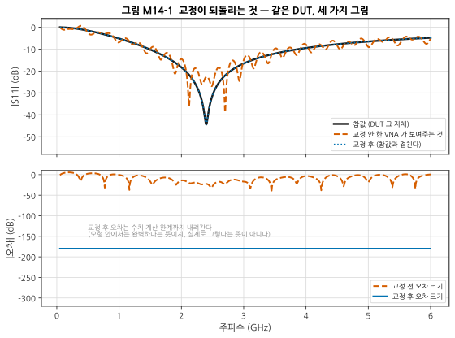
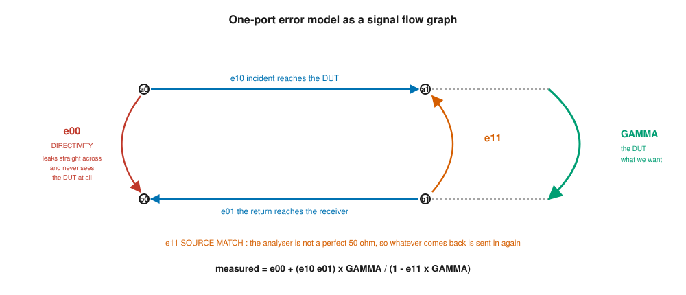
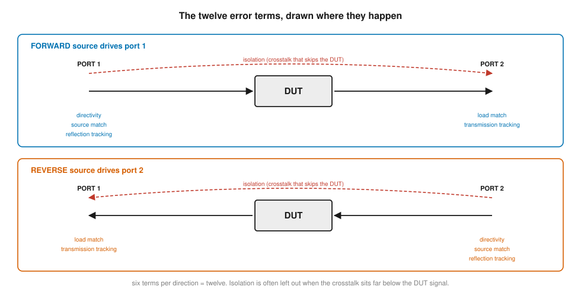
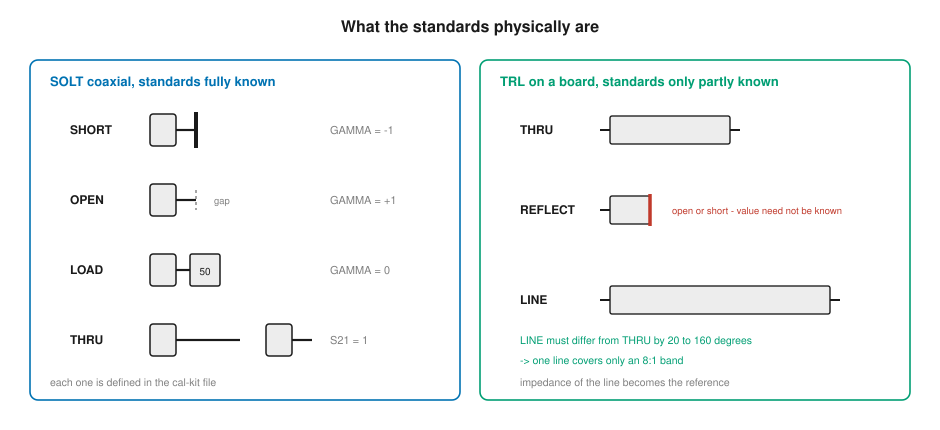
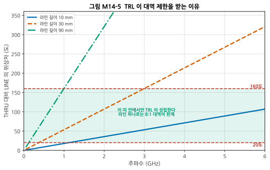
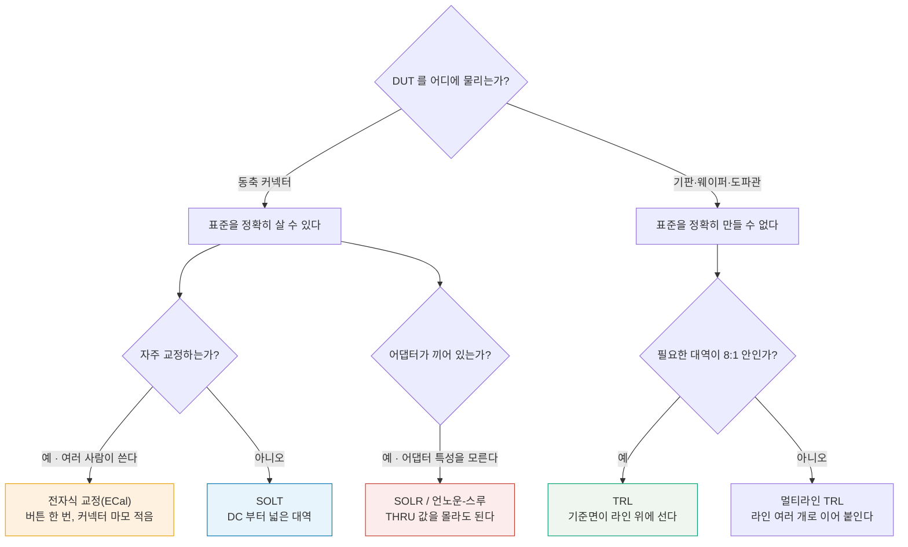
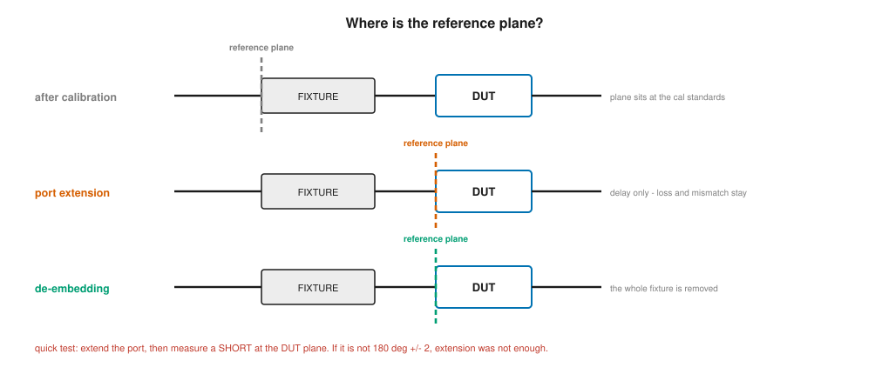
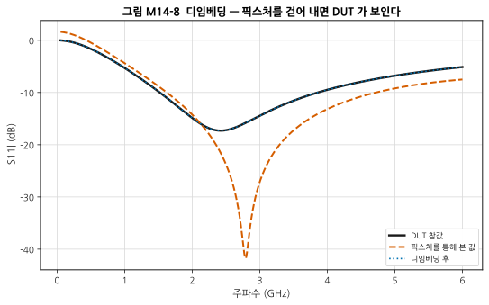
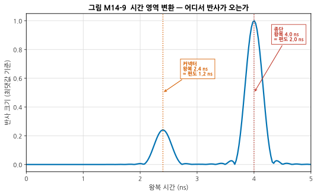
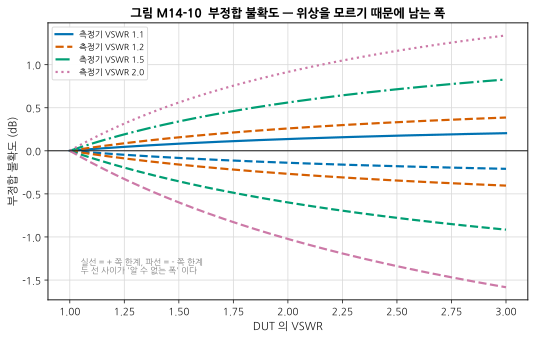

# M14 — 정밀 측정 I: 이 숫자를 믿어도 되는가

**문서 번호**: RF-CUR-M14 · **버전**: v1.0 · **분량**: 이론 5 h + 실습 8 h

| | |
|---|---|
| **선수 모듈** | [M05](./M05_첫측정.md) (VNA 화면 읽기), [M03](./M03_S파라미터와스미스차트.md) (S-파라미터·Γ), [M02](./M02_전송선로.md) (반사) |
| **이 모듈이 소유하는 개념** | 오차의 분류(계통·임의·표류), **VNA 오차 모델**(방향성, 소스 정합, 부하 정합, 반사/전송 추적, 누설), **교정 종류**: SOLT · TRL · SOLR · 전자식 교정(ECal), 교정 표준 정의(오프셋 지연, 프린지 커패시턴스)와 교정 키트 정의 파일, 기준면(reference plane), **디임베딩과 포트 익스텐션**, 픽스처 설계와 2단(2-tier) 교정, 시간 영역 변환과 게이팅, IF 대역폭·평균화·동적범위 절충, **측정 불확도**(부정합 불확도, 소급성, 합성·확장 불확도), 검증 표준 |
| **이 모듈을 쓰는 후속 모듈** | **M15**(잡음지수·위상잡음·변조 측정), M16(DUT 검증과 디버그), M17(인증 시험), **캡스톤**(내 측정을 믿을 수 있는가) |
| **학습 목표** | ① SOLT와 TRL을 언제 각각 쓰는지 근거를 대고 고른다 ② 교정 후 검증 표준으로 교정 품질을 판정한다 ③ 픽스처 효과를 디임베딩으로 제거한다 ④ 측정값에 불확도를 붙여 보고한다 |

---

## M14.0 이 모듈의 범위

[M05](./M05_첫측정.md)에서 **VNA**(Vector Network Analyzer, 벡터 네트워크 분석기)로 **일부러 교정하지 않고** 측정했습니다. 필터 통과대역이 울퉁불퉁했고, "이건 정상이며 이유는 M14에서"라고 미뤄 두었습니다.

그 빚을 여기서 갚습니다.

> **교정하지 않은 VNA가 화면에 그리는 곡선은 DUT**(Device Under Test, 피시험 소자)**의 곡선이 아닙니다.**

이 모듈은 그 곡선이 왜 DUT의 것이 아닌지, 무엇을 하면 DUT의 것이 되는지, 그리고 **교정을 하고 나서도 남는 것**이 얼마인지를 다룹니다.

> ⚠️ **다른 모듈과의 역할 분리**
>
> | 개념 | M14 (여기) | 다른 모듈 |
> |---|---|---|
> | VNA 조작 | **왜 그 버튼을 누르는가** | [M05](./M05_첫측정.md)가 **화면 읽기와 기본 조작**을 소유 |
> | 반사계수 Γ·VSWR | 측정 대상으로 쓴다 | [M02 §3](./M02_전송선로.md)이 **정의**를 소유 |
> | S-파라미터 | 측정 대상으로 쓴다 | [M03](./M03_S파라미터와스미스차트.md)이 **정의와 성질**을 소유 |
> | 잡음지수·위상잡음 측정 | — | **M15**가 소유 |
> | 규격 판정 | — | M16·M17이 소유 |
>
> 한 줄로: **M05는 "어떻게 조작하는가", M14는 "그 숫자를 믿어도 되는가"** 입니다.

---

## M14.1 교정하지 않은 VNA가 보여주는 것

계산으로 보이겠습니다. **오차항을 넣은 가짜 VNA**를 만들어, 같은 DUT를 세 가지 방식으로 그려 봅니다.



*그림 M14-1. 2.4 GHz에서 잘 정합된 부품 하나를 세 가지로 그린 것입니다. **읽는 법**: 검은 실선이 DUT의 참값, 주황 파선이 교정하지 않은 VNA가 그리는 곡선, 파란 점선이 교정 후입니다. 파란 점선은 검은 실선과 **완전히 겹쳐** 보이지 않습니다. 아래 칸은 참값과의 차이를 dB로 그린 것입니다.*

**주황 파선이 무엇을 잘못 말하는지 보십시오.**

| | 주파수 | 깊이 |
|---|---|---|
| **DUT의 진짜 노치** | 2.40 GHz | **−44.4 dB** |
| 같은 주파수에서 교정 전에 읽히는 값 | 2.40 GHz | −22.6 dB (**21.7 dB 얕게**) |
| 교정 전 곡선에서 가장 깊은 자리 | **2.70 GHz** | −38.9 dB |

> ⚠️ **교정하지 않은 곡선은 "부정확"한 정도가 아니라 엉뚱한 답을 줍니다.** 이 곡선만 보고 "우리 부품은 2.70 GHz에서 가장 잘 정합된다"고 보고하면, 실제로는 아무 일도 일어나지 않는 주파수를 가리킨 것입니다. **없는 노치가 보이고, 있는 노치는 안 보입니다.**

**왜 이렇게 되는가** — 세 가지가 겹칩니다.

| 원인 | 하는 일 | 이 예에서의 크기 |
|---|---|---|
| **방향성** | DUT를 거치지 않은 신호가 수신기로 곧장 샌다 | 0.060 ~ 0.080 (약 −24 ~ −22 dB) |
| **소스 정합** | VNA가 완벽한 50 Ω이 아니라, 돌아온 파를 다시 밀어낸다 | 0.150 ~ 0.210 (약 −16.5 ~ −13.6 dB) |
| **추적** | 케이블·커넥터의 주파수 응답이 크기와 위상을 바꾼다 | 위상은 케이블 지연만큼 돈다 |

> 📌 **방향성이 측정의 신뢰 바닥을 만듭니다.** 화면의 값은 DUT의 반사에 방향성 누설이 **벡터로 더해진** 것입니다. 방향성이 0.06(−24 dB)이면, 읽은 값은 참값에서 **최대 ±0.06만큼** 어긋날 수 있습니다. 그래서 **−24 dB보다 좋은 반사는 교정 전에 믿을 수 없습니다.**
>
> ⚠️ **"믿을 수 없다"이지 "그보다 깊게 안 나온다"가 아닙니다.** 위 표에서 교정 전 곡선의 최저점은 −38.9 dB로 바닥보다 깊었습니다. 두 벡터가 **마주 빼져** 우연히 상쇄된 자리이기 때문입니다. 상쇄는 특정 주파수에서만 일어나므로 그 자리는 **가짜 노치**입니다. 바닥보다 깊은 값이 나왔다고 좋아할 일이 아니라, **그 값 자체가 근거 없다**는 신호입니다.

---

## M14.2 계통 오차 — 12항 모델

오차는 성질에 따라 셋으로 나뉩니다. **이 구분이 대응 방법을 정합니다.**

| 종류 | 뜻 | 대응 |
|---|---|---|
| **계통 오차**(systematic) | 같은 조건이면 **매번 같게** 나온다 | **측정해서 빼낼 수 있다 = 교정** |
| **임의 오차**(random) | 잴 때마다 다르다 (잡음, 커넥터를 조이는 손맛) | 평균·반복으로 줄인다. 빼낼 수는 없다 |
| **표류**(drift) | 시간·온도에 따라 천천히 변한다 | 재교정 주기, 온도 안정화 |

> 📌 **교정이 지우는 것은 계통 오차뿐입니다.** 교정을 열 번 해도 잡음과 커넥터 반복성은 남습니다. 이것이 §10에서 불확도를 따로 계산해야 하는 이유입니다.

### 1-포트: 오차 3항



*그림 M14-2. 1-포트 오차 모델을 **신호 흐름 그래프**로 그린 것입니다. **읽는 법**: 동그라미가 파(wave)이고 화살표가 "얼마를 곱해서 어디로 가는가"입니다. 빨간 e00은 DUT를 아예 거치지 않고 건너뛰는 길, 주황 e11은 되돌아온 파를 다시 밀어내는 길, 초록 Γ가 우리가 알고 싶은 DUT입니다.*

$$\Gamma_{측정} = e_{00} + \frac{e_{10}e_{01}\,\Gamma}{1 - e_{11}\Gamma}$$

미지수가 **세 개**(e00, e11, e10e01)이므로, **참값을 아는 표준 세 개**를 재면 풀 수 있습니다. 이것이 SOL 교정입니다.

> 💡 **e10과 e01은 따로 구할 수 없고 곱으로만 나옵니다.** 반사 측정에서는 두 경로를 항상 함께 지나기 때문입니다. 그래서 이 곱을 하나의 항으로 보고 **반사 추적(reflection tracking)** 이라 부릅니다.

### 2-포트: 오차 12항



*그림 M14-3. 2-포트에서는 신호원을 포트 1에 걸었을 때와 포트 2에 걸었을 때가 **다른 오차**를 겪습니다. **읽는 법**: 한 방향마다 여섯 항 — 구동하는 쪽에 방향성·소스 정합·반사 추적, 받는 쪽에 부하 정합·전송 추적, 그리고 DUT를 건너뛰는 누설(빨간 파선)입니다. 방향이 둘이므로 6 × 2 = 12항입니다.*

| 항 | 무엇인가 | 어디서 오는가 |
|---|---|---|
| **방향성** | DUT를 안 거친 신호가 반사 수신기로 샌다 | 브리지·커플러의 불완전함 |
| **소스 정합** | 돌아온 파를 신호원 쪽이 다시 반사한다 | 케이블·커넥터·VNA 출력단 |
| **반사 추적** | 반사 경로의 크기·위상 주파수 응답 | 케이블 손실과 지연 |
| **부하 정합** | 받는 쪽이 완벽한 50 Ω이 아니라 되반사한다 | 반대편 케이블·수신기 |
| **전송 추적** | 전송 경로의 크기·위상 주파수 응답 | 양쪽 케이블 |
| **누설(격리)** | DUT를 통하지 않고 포트 사이로 새는 신호 | VNA 내부 결합, 픽스처 결합 |

> ⚠️ **누설 항을 굳이 교정하지 않는 경우가 많습니다.** 누설은 보통 −100 dB 부근인데, 이것을 재려면 양쪽에 부하를 달고 오래 평균해야 합니다. **DUT의 S21이 누설보다 훨씬 크면** 굳이 잴 이유가 없고, 오히려 잡음이 섞인 누설항을 빼다가 결과가 나빠집니다. 아주 큰 감쇠나 격리를 잴 때만 켭니다.

> 📌 **8항 모델이라는 말도 봅니다.** 누설 둘을 빼고, 나머지를 수학적으로 다시 묶으면 8항이 됩니다. TRL 계열은 8항 모델 위에서 돌아갑니다. **12항과 8항은 다른 물리가 아니라 같은 물리를 다르게 센 것**입니다.

---

## M14.3 SOLT — 표준을 안다는 전제

**SOLT**(Short-Open-Load-Thru, 단락-개방-부하-관통)는 **참값을 정확히 아는 표준 네 개**를 재서 오차항을 푸는 방법입니다.



*그림 M14-4. 왼쪽이 SOLT, 오른쪽이 TRL의 표준입니다. **읽는 법**: SOLT의 네 표준은 값이 **완전히 정해져** 있어야 합니다. TRL의 표준은 REFLECT의 값을 몰라도 되는 대신, LINE의 길이가 대역을 제한합니다.*

| 표준 | 이상적인 값 | 실제로는 |
|---|---|---|
| **SHORT** | Γ = −1 | 짧은 선로만큼 위상이 더 돈다 (오프셋 지연) |
| **OPEN** | Γ = +1 | **끝에서 전기력선이 새어** 축전 성분이 생긴다 |
| **LOAD** | Γ = 0 | 완벽한 50 Ω은 없다. 이 표준의 품질이 방향성의 한계를 정한다 |
| **THRU** | S21 = 1, S11 = 0 | 길이가 있으면 그만큼 지연이 있다 |

> ⚠️ **개방 표준은 Γ = +1이 아닙니다.** 도체 끝에서 전기력선이 바깥으로 새면서 **프린지 커패시턴스**(fringing capacitance)로 나타납니다. 이 커리큘럼의 예제에서 50 fF를 넣고 계산하면 위상이 이렇게 돕니다.
>
> | 주파수 | 개방 표준의 위상 |
> |---|---|
> | 50 MHz | −0.09° |
> | 6 GHz | **−10.77°** |
>
> 6 GHz에서 10.77°는 작아 보이지만, 이것을 무시하고 "개방은 +1"로 놓고 교정하면 **그 오차가 이후 모든 측정에 그대로 실립니다.** 교정 키트 정의 파일이 이 값을 다항식으로 적어 두는 이유입니다(→ §6).

---

## M14.4 TRL — 표준을 덜 알아도 되는 대신 대역이 좁다

동축이 아닌 곳 — 기판 위의 마이크로스트립, 웨이퍼, 도파관 — 에서는 **SHORT·OPEN·LOAD를 정확히 만들 수 없습니다.** 기판 위의 "개방"이 정확히 얼마인지 아무도 모릅니다.

**TRL**(Thru-Reflect-Line, 관통-반사-선로)은 이 문제를 다르게 풉니다.

| 표준 | 무엇을 알아야 하는가 |
|---|---|
| **THRU** | 두 포트를 곧장 이은 것 (길이를 0으로 두거나, 알고 있으면 됨) |
| **REFLECT** | **값을 몰라도 됩니다.** 두 포트에 **같은 것**을 달고, 대략 개방인지 단락인지만 알면 됩니다 |
| **LINE** | THRU와 **길이만 다른** 같은 선로. 그 길이(위상)를 알아야 합니다 |

> 📌 **TRL의 영리한 점은 "모르는 것을 미지수로 남겨 두고 푼다"는 데 있습니다.** REFLECT의 실제 값은 방정식을 푸는 과정에서 함께 결정됩니다. 그래서 **만들기 어려운 표준을 정확히 만들 필요가 없습니다.**
>
> 대신 **LINE의 임피던스가 기준이 됩니다.** 라인이 50 Ω이 아니라 48 Ω이면, 그 교정으로 잰 모든 값은 48 Ω 기준입니다. 기판 위에서 TRL을 쓸 때 선로 폭을 정밀하게 만들어야 하는 이유입니다.

### 대역 제한

TRL은 **THRU와 LINE의 위상차**로 오차항을 분리합니다. 그 차이가 0°나 180°에 가까우면 두 표준이 사실상 같아져 방정식이 풀리지 않습니다. 그래서 실무 기준은 **20° ~ 160°** 입니다.



*그림 M14-5. 유효 유전율 2.2인 기판에서 라인 길이에 따른 위상차입니다. **읽는 법**: 초록 띠(20°~160°) 안에 들어오는 구간에서만 TRL이 성립합니다. 선이 가파를수록(라인이 길수록) 띠를 빨리 지나쳐 버립니다.*

| 라인 길이 | 쓸 수 있는 대역 | 비율 |
|---|---|---|
| 10 mm | 1.12 ~ 6.00 GHz | (그림의 위쪽 끝에서 잘림) |
| **30 mm** | 0.38 ~ 2.99 GHz | **8.0 : 1** |
| 90 mm | 0.12 ~ 1.00 GHz | **8.0 : 1** |

> 📌 **라인 하나로는 8 : 1 대역이 한계입니다.** 160/20 = 8이기 때문이고, 이것은 길이와 무관합니다. 길이는 그 8:1 창을 **어느 주파수로 옮길지**만 정합니다.
>
> 더 넓은 대역이 필요하면 **라인을 여러 개** 만들어 구간마다 바꿔 씁니다(멀티라인 TRL). 그리고 **저주파는 라인이 길어져** 현실적이지 않습니다 — 위 표에서 0.12 GHz를 덮으려고 90 mm를 썼는데, 100 MHz 아래로 가려면 미터 단위가 됩니다.

---

## M14.5 무엇을 쓸 것인가



*그림 M14-6. 교정 방법 결정 트리. **읽는 법**: 갈림길은 딱 두 개입니다 — **표준을 정확히 살 수 있는가**, 그리고 **필요한 대역이 얼마나 넓은가**. 나머지는 편의의 문제입니다.*

| 방법 | 강점 | 약점 |
|---|---|---|
| **SOLT** | DC부터 넓은 대역, 표준을 사서 씀 | 표준 정의가 틀리면 그대로 오차. 동축 밖에서는 쓰기 어렵다 |
| **TRL** | 표준을 덜 알아도 됨, 비동축에서 최고 정확도 | **8:1 대역 제한**, 라인 임피던스가 기준이 됨 |
| **SOLR**(언노운-스루) | THRU가 **상호적**이기만 하면 값을 몰라도 됨 | 반사 표준 셋은 여전히 알아야 함 |
| **ECal**(전자식 교정) | 빠르고 커넥터 마모가 적음 | 모듈 자체를 주기적으로 교정 보내야 함 |

> 💡 **SOLR은 어댑터 문제의 답입니다.** 포트 1은 SMA, 포트 2는 N형인데 둘을 잇는 어댑터의 특성을 모를 때, THRU 대신 그 어댑터를 끼우고 "값은 모르지만 상호적이다"만 가정하면 풀립니다. 실무에서 아주 자주 씁니다.

---

## M14.6 교정 키트 정의 파일 — 교정의 진짜 입력값

교정 소프트웨어는 표준의 **참값**을 알아야 합니다. 그 값은 측정하는 것이 아니라 **파일에서 읽습니다.**

| 정의 항목 | 뜻 |
|---|---|
| **오프셋 지연** | 커넥터 기준면에서 실제 단락/개방 면까지의 편도 지연 (ps) |
| **오프셋 손실** | 그 구간의 손실 (GΩ/s 단위로 적는 관례) |
| **오프셋 Z0** | 그 구간의 특성 임피던스 |
| **C0 ~ C3** | 개방의 프린지 커패시턴스를 주파수 다항식으로 |
| **L0 ~ L3** | 단락의 잔류 인덕턴스를 주파수 다항식으로 |

> ⚠️ **가장 흔하고 가장 조용한 실수: 교정 키트를 바꿔 놓고 정의 파일을 안 바꾸는 것.** 화면에는 아무 경고도 안 뜹니다. 교정은 "성공"하고, 모든 측정이 조금씩 틀립니다. **교정 전에 키트 모델 번호와 소프트웨어에 선택된 정의가 같은지 눈으로 확인**하는 것이 절차의 첫 줄이어야 합니다.

> 💡 **왜 다항식인가**: 프린지 커패시턴스는 주파수에 따라 조금씩 변합니다. 제조사가 여러 주파수에서 정밀 측정한 뒤 3차 다항식으로 맞춰 파일에 적어 둡니다. 그래서 키트마다, 심지어 **같은 모델의 개체마다** 값이 조금씩 다릅니다.

---

## M14.7 기준면 — 어디까지가 "내 측정"인가

교정이 끝나면 **기준면**이 정해집니다. 기준면이란 **"여기서부터가 DUT다"라고 VNA가 믿는 자리**입니다.



*그림 M14-7. 기준면을 옮기는 두 가지 방법입니다. **읽는 법**: 교정 직후 기준면은 **교정 표준을 달았던 자리**에 섭니다. 픽스처를 끼우면 DUT는 그보다 안쪽에 있으므로 기준면을 옮겨야 합니다.*

| 방법 | 무엇을 지우는가 | 무엇을 못 지우는가 |
|---|---|---|
| **포트 익스텐션** | **지연(위상)** — 그리고 장비에 따라 약간의 손실 | **반사와 부정합**. 픽스처가 50 Ω이 아니면 그대로 남는다 |
| **디임베딩** | 픽스처의 **S-파라미터 전체** — 손실·반사·주파수 응답 | 픽스처 S-파라미터를 모르면 아무것도 |

> 📌 **둘 중 무엇이 필요한지 판정하는 방법이 있습니다.**
>
> 1. 포트 익스텐션으로 지연을 맞춘다
> 2. DUT 자리에 **단락**을 달고 측정한다
> 3. **|S11|이 0 dB에서 0.1 dB 이상 내려가거나, 위상이 180° ± 2°를 벗어나면** → 픽스처에 손실이나 부정합이 있다는 뜻 → **디임베딩이 필요**
>
> 손실이 0.2 dB를 넘으면 포트 익스텐션으로는 감당이 안 된다고 보는 것이 실무 기준입니다.

---

## M14.8 픽스처와 디임베딩

기판 위의 부품을 재려면 **픽스처**(커넥터 → 기판 → DUT 자리)가 필요합니다. 그런데 픽스처는 DUT를 **가리는 동시에 왜곡**합니다.



*그림 M14-8. **읽는 법**: 검은 실선이 DUT 참값, 주황 파선이 픽스처를 통해 본 값, 파란 점선이 디임베딩 후입니다. 파란 점선은 검은 실선과 겹쳐 있습니다.*

**픽스처가 DUT를 실제보다 좋아 보이게 만드는 것에 주목하십시오.**

| | 노치 주파수 | 노치 깊이 |
|---|---|---|
| **DUT 참값** | 2.42 GHz | −17.3 dB |
| 픽스처 너머로 보이는 값 | **2.79 GHz** | **−41.8 dB** |

> ⚠️ **주파수가 0.37 GHz 옮겨 갔고, 깊이는 24.5 dB나 좋아 보입니다.** 픽스처 자신의 반사가 DUT의 반사와 **벡터로 상쇄**되어 생긴 착시입니다. 이 상태로 "정합이 훌륭하다"고 판정하면, 픽스처 없이 실제 보드에 올렸을 때 전혀 다른 결과를 받습니다.
>
> **좋아 보이는 결과일수록 의심해야 합니다.** 나쁘게 나오면 사람들이 원인을 찾지만, 좋게 나오면 아무도 안 찾습니다.

### 2단(2-tier) 교정

픽스처의 S-파라미터를 어떻게 아는가 — 이것이 실무의 진짜 문제입니다.

| 방법 | 어떻게 | 언제 |
|---|---|---|
| **직접 측정** | 픽스처만 따로 2-포트로 잰다 | 픽스처를 분리할 수 있을 때 |
| **2단 교정** | ① 동축 기준면까지 SOLT로 교정 ② 픽스처 위에 만든 TRL 표준으로 다시 교정 | 기판에 교정 패턴을 같이 넣을 수 있을 때 |
| **모의실험** | 전자기 해석으로 픽스처를 계산 | 급할 때. **검증 없이 믿으면 안 된다** |
| **대칭 가정** | 관통 픽스처를 재서 반씩 나눈다 | 양쪽이 정말 대칭일 때만 |

> 📌 **교정 패턴을 기판에 함께 올리는 것이 정석입니다.** DUT 보드를 만들 때 옆자리에 THRU·REFLECT·LINE 패턴을 같이 찍어 두면, 같은 공정·같은 기판의 표준을 얻습니다. **보드 설계 단계에서 결정해야 하는 일**이라 나중에 후회해도 늦습니다(→ M17).

---

## M14.9 시간 영역 변환 — 어디서 반사가 오는가

주파수 영역의 S11을 역푸리에 변환하면, **반사가 어느 거리에서 오는지**가 보입니다.



*그림 M14-9. 케이블 중간의 커넥터 하나와 끝의 부정합 종단을 시간 영역으로 본 것입니다. **읽는 법**: 가로축은 **왕복** 시간입니다. 봉우리의 위치가 곧 불연속의 거리이고, 높이가 반사의 크기입니다.*

| 봉우리 | 왕복 시간 | 편도 | 무엇 |
|---|---|---|---|
| 첫째 | 2.39 ns | 1.20 ns | 커넥터 (작은 반사) |
| 둘째 | 4.00 ns | 2.00 ns | 종단 (큰 반사) |

**거리로 바꾸려면** 편도 시간에 그 매질의 전파 속도를 곱합니다. 동축(단축률 0.66)이라면 1.20 ns × 0.66 × 3×10⁸ m/s ≈ **24 cm**입니다.

> 📌 **이것이 디버그에서 가장 강력한 도구입니다.** "어딘가에서 반사가 온다"와 "커넥터에서 24 cm 지점에서 반사가 온다"는 전혀 다른 정보입니다. 후자는 손으로 짚을 수 있습니다.

> ⚠️ **분해능은 대역폭이 정합니다.** 시간 분해능은 대략 1/대역폭입니다. 6 GHz를 쓸면 약 167 ps입니다.
>
> 거리로 바꿀 때 **한 번 더 반으로 나눠야** 합니다. 167 ps는 **왕복** 시간의 차이이므로, 동축(약 2×10⁸ m/s)에서 왕복 3.3 cm, 즉 **실제 거리로는 약 1.7 cm**입니다. **그보다 가까운 두 불연속은 하나로 뭉쳐 보입니다.** 좁은 대역만 쓰고 "불연속이 하나뿐"이라고 결론 내리면 틀립니다.

> 💡 **창(window)을 왜 거는가**: 유한한 주파수 구간을 그대로 변환하면 **옆가지(sidelobe)** 가 생겨 없는 반사가 있는 것처럼 보입니다. 창을 걸면 옆가지가 줄지만 봉우리가 넓어집니다 — [M05 §3](./M05_첫측정.md)의 RBW 절충과 **같은 맞바꿈**입니다. (RBW = Resolution Bandwidth, 분해능 대역폭)

### 게이팅

시간 영역에서 원하는 구간만 남기고 나머지를 지운 뒤 주파수 영역으로 되돌리는 것을 **게이팅**이라 합니다. "커넥터 반사를 빼고 DUT만 보고 싶다"에 씁니다.

> ⚠️ **게이팅은 디버그 도구이지 교정이 아닙니다.** 게이트 가장자리에서 생기는 왜곡 때문에 대역 끝의 값이 믿을 수 없게 됩니다. **게이팅한 결과를 규격 판정에 쓰지 마십시오.**

---

## M14.10 불확도 — 교정하고도 남는 것

교정을 완벽하게 해도 측정값은 참값이 아닙니다. 얼마나 다를 수 있는지를 숫자로 붙이는 것이 **불확도**입니다.

### 부정합 불확도가 왜 지배적인가

두 부품을 이으면 전달되는 전력이 두 반사계수의 **곱과 위상**에 따라 달라집니다.

$$\text{전달비} \propto \frac{1}{\left|1 - \Gamma_s \Gamma_l\right|^2}$$

여기서 Γs·Γl 은 마주 보는 두 쪽의 반사계수이고, VSWR(Voltage Standing Wave Ratio, 전압 정재파비)로 적힌 값을 Γ로 바꿔 씁니다. 크기는 재서 알지만 **위상은 대개 모릅니다.** 그러면 분모가 (1 − |Γs||Γl|)²와 (1 + |Γs||Γl|)² 사이 어디든 될 수 있습니다.

$$\text{부정합 불확도 [dB]} = 20\log_{10}\left(1 \pm \left|\Gamma_s\right|\left|\Gamma_l\right|\right)$$



*그림 M14-10. **읽는 법**: 실선이 + 쪽 한계, 파선이 − 쪽 한계이고 **그 사이가 "알 수 없는 폭"** 입니다. 측정기 자신의 VSWR이 좋을수록 폭이 좁아집니다.*

| 측정기 VSWR | DUT VSWR | 불확도 |
|---|---|---|
| 1.2 | 2.0 | **+0.259 / −0.267 dB** |
| **1.05** | 2.0 | +0.070 / −0.071 dB |
| 1.2 | 1.2 | +0.071 / −0.072 dB |

> 📌 **불확도는 두 쪽의 곱으로 정해집니다.** DUT가 나쁘면 어쩔 수 없지만, **측정기 쪽은 내가 고를 수 있습니다.** 위 표에서 측정기를 1.2 → 1.05로 바꾸면 불확도가 1/3 아래로 떨어집니다. 좋은 감쇠기 하나를 다는 것도 같은 효과입니다([M04 §2](./M04_RF실험실입문.md)의 "감쇠기의 두 번째 용도").

### 불확도 예산

여러 원인을 합칠 때는 **제곱합의 제곱근(RSS)** 을 씁니다 — [M12 §9](./M12_시스템예산설계.md)·[M13 §5](./M13_변조와신호품질.md)와 **같은 구조**입니다.

| 기여 항목 | 표준불확도 |
|---|---|
| **부정합** (측정기 1.2 / DUT 1.5) | **0.159 dB** |
| 교정 표준 자체의 불확도 | 0.030 dB |
| 반복성 (커넥터를 다시 조임) | 0.020 dB |
| 잡음·표류 | 0.010 dB |
| 선형성 | 0.020 dB |
| **합성 표준불확도 (RSS)** | **0.165 dB** |
| **확장불확도 (k = 2, 약 95 %)** | **0.330 dB** |

> 📌 **부정합 하나가 전체 분산의 93 %입니다.** 나머지를 아무리 개선해도 소용없고, **측정기 VSWR을 1.2 → 1.05로 바꾸면 합성 불확도가 0.165 → 0.060 dB (64 % 감소)** 입니다. 불확도 예산의 쓸모가 바로 이것입니다 — **어디에 노력을 넣을지 알려 줍니다.**

> 💡 **단순히 다 더하면 0.239 dB**입니다. RSS가 1.45배 작습니다. 모든 오차가 동시에 최악으로 몰릴 확률은 낮기 때문입니다. **최악조건이 필요한 자리와 RSS가 맞는 자리를 구분**하는 것은 [M12 §9](./M12_시스템예산설계.md)에서 다뤘습니다.

### 소급성

내 측정이 왜 믿을 만한지를 **거슬러 올라가 증명할 수 있는 사슬**이 소급성입니다.

> 내 VNA ← 교정 키트 ← 제조사 교정 ← 국가 표준기관(한국은 **KRISS**, 한국표준과학연구원) ← **국제단위계(SI)**

> ⚠️ **"교정했다"와 "소급성이 있다"는 다릅니다.** 교정 키트의 교정 유효기간이 지났다면, 교정은 했지만 그 값이 무엇에 근거하는지 말할 수 없습니다. **인증·납품 시험에서는 교정 성적서의 유효기간을 봅니다.**

---

## M14.11 교정 검증 — 했다고 믿지 말고 확인한다

**교정은 성공했다고 표시되어도 틀릴 수 있습니다.** 정의 파일이 틀렸거나, 표준을 잘못 순서로 달았거나, 케이블이 중간에 움직였을 수 있습니다.

### 검증 절차

| 순서 | 하는 일 | 합격 기준 |
|---|---|---|
| 1 | 교정에 **쓰지 않은** 표준을 잰다 (예: 다른 키트의 부하) | 반사가 그 표준의 사양 안 |
| 2 | **검증 표준**(값을 아는 감쇠기 등)을 잰다 | 성적서 값 ± 불확도 안 |
| 3 | **THRU를 다시 잰다** | S21 ≈ 0 dB, S11 ≈ 잡음 바닥 |
| 4 | **케이블을 구부려 본다** | 값이 크게 흔들리면 케이블 교체 |
| 5 | 몇 분 뒤 다시 잰다 | 표류가 불확도 예산 안 |

> 📌 **가장 빠른 검사는 "SHORT를 다시 재는 것"입니다.** 교정에 썼던 단락을 그대로 다시 달아 |S11| = 0 dB, 위상 = 180°가 나오는지 봅니다. **이건 교정이 스스로를 확인하는 것이라 최소 조건**이고, 이것마저 안 맞으면 교정이 깨진 것입니다.

### 실패했을 때

| 증상 | 흔한 원인 | 대응 |
|---|---|---|
| 통과대역에 리플 | 교정이 안 됐거나 케이블이 움직임 | 재교정. DUT 양쪽에 6~10 dB 감쇠기 |
| \|S11\|이 0 dB를 **넘음** | 교정 표준을 잘못 지정 | 정의 파일과 키트 대조 |
| 값이 계속 흘러감 | 온도 안정화 전 | 예열 후 재교정 |
| 잴 때마다 다름 | 커넥터 반복성 | 토크 렌치 사용, 커넥터 점검(→ [M04 §3](./M04_RF실험실입문.md)) |
| 저주파에서만 이상 | TRL 대역 밖 | 라인 추가 또는 SOLT 병용 |

### IF 대역폭·평균화 — 시간과 잡음의 맞바꿈

| 손잡이 | 낮추면/늘리면 | 대가 |
|---|---|---|
| **IF 대역폭**(Intermediate Frequency, 중간주파수) | 낮추면 잡음 바닥이 내려간다 (10배 낮추면 10 dB) | 소인 시간이 그만큼 길어진다 |
| **평균화** | 횟수를 늘리면 임의 잡음이 줄어든다 | 시간. **계통 오차는 안 줄어든다** |
| **소인 점 수** | 늘리면 주파수 분해능이 좋아진다 | 시간 |

> ⚠️ **평균화는 표류를 못 잡습니다.** 오래 평균하는 동안 온도가 변하면, 잡음은 줄었는데 값 자체가 흘러가 있습니다. **긴 평균이 항상 좋은 것은 아닙니다.**

---

## M14.L 실습

### L14-a — NanoVNA로 교정하고 검증하기 (Tier 1, 3시간)

**목표**: 실제 장비로 SOLT 교정을 하고, **교정에 쓰지 않은 표준**으로 품질을 판정합니다.

**준비물**: NanoVNA(또는 상위 VNA), 교정 키트(SHORT/OPEN/LOAD), 값을 아는 감쇠기(3 dB·10 dB 등), 케이블, 토크 렌치가 있으면 더 좋음

**절차**

1. **교정 전에 먼저 잽니다.** 케이블 끝을 열어 둔 채(개방) S11을 저장합니다. 0 dB 근처의 매끈한 선이 나와야 할 것 같지만, 실제로는 물결칩니다. **이 물결이 오차항입니다.**
2. **SOLT 교정**을 합니다. 각 표준을 달 때마다 같은 토크로 조입니다.
3. **곧바로 검증**: 교정에 쓴 SHORT를 다시 답니다. |S11| = 0 dB ± 0.1, 위상 = 180° ± 2°인지 확인합니다.
4. **진짜 검증**: 값을 아는 **감쇠기**를 답니다. S21이 표시값과 얼마나 다른지 적습니다.
5. **케이블을 구부려** 봅니다. S11이 얼마나 흔들리는지 기록합니다.
6. **10분 뒤 다시** 재서 표류를 봅니다.

**기록표**

| 항목 | 값 | 판정 |
|---|---|---|
| 교정 전 개방의 \|S11\| 물결 폭 | ___ dB | — |
| 교정 후 SHORT의 \|S11\| | ___ dB | 0 ± 0.1 |
| 교정 후 SHORT의 위상 | ___ ° | 180 ± 2 |
| 감쇠기 표시값 대비 차이 | ___ dB | 사양 안? |
| 케이블 구부릴 때 흔들림 | ___ dB | 작을수록 좋음 |
| 10분 후 표류 | ___ dB | 불확도 예산 안? |

**판정 기준**

| 항목 | 합격 |
|---|---|
| 절차 | 교정 전/후를 모두 기록했다 |
| 검증 | **교정에 쓰지 않은 표준**으로 확인했다 |
| 해석 | 교정 전 물결의 원인을 오차항으로 설명할 수 있다 |
| 한계 | 케이블 흔들림과 표류가 왜 교정으로 안 지워지는지 안다 |

**흔한 실수**

| 실수 | 증상 | 바로잡기 |
|---|---|---|
| 교정 키트 정의를 안 맞춤 | 조용히 다 틀림 | 키트 모델과 소프트웨어 설정 대조 |
| 교정 후 케이블을 움직임 | 교정이 깨짐 | 케이블 고정, 움직였으면 재교정 |
| 조이는 힘이 매번 다름 | 반복성 나쁨 | 토크 렌치 |
| 교정에 쓴 표준으로만 검증 | 항상 합격 | **다른 표준**으로 검증 |

---

### L14-b — 1-포트 교정 알고리즘 직접 구현 (Tier 0, 3시간)

**목표**: 교정이 "블랙박스"가 아님을 확인합니다. 오차 3항을 손으로 풀고, **scikit-rf와 대조**합니다.

**준비물**: Python 3, `numpy`, `scikit-rf`

**절차**

1. 아래 스크립트를 `l14b.py`로 저장하고 실행합니다.

```python
import numpy as np
import skrf as rf

F = np.linspace(0.05, 6.0, 1191)                 # GHz
FREQ = rf.Frequency.from_f(F, unit="ghz")
Z0 = 50.0


def error_terms():
    """교정 전 VNA 의 오차 3항. 실제 장비에서 볼 법한 크기로 잡는다."""
    w = 2 * np.pi * F
    e00 = (0.060 + 0.020 * F / 6.0) * np.exp(1j * (0.8 + 1.7 * w))
    e11 = (0.150 + 0.060 * F / 6.0) * np.exp(1j * (-0.4 - 2.3 * w))
    tr = (1.0 - 0.03 * F / 6.0) * np.exp(-1j * 2.6 * w)
    return e00, e11, tr


def through_errors(g):
    """참값 g 를 오차항에 통과시켜 'VNA 가 표시하는 값' 을 만든다."""
    e00, e11, tr = error_terms()
    return e00 + tr * g / (1.0 - e11 * g)


def solve(meas, std):
    """표준 3개로 오차 3항을 푼다.

    Γm = e00 + (e11·Γm - Δ)·Γs   (Δ = e00·e11 - tr)  -> 주파수마다 3x3
    """
    e00 = np.empty_like(F, dtype=complex)
    e11 = np.empty_like(F, dtype=complex)
    tr = np.empty_like(F, dtype=complex)
    for k in range(len(F)):
        A = np.array([[1.0, meas[i][k] * std[i][k], -std[i][k]] for i in range(3)])
        x = np.linalg.solve(A, np.array([meas[i][k] for i in range(3)]))
        e00[k], e11[k] = x[0], x[1]
        tr[k] = e00[k] * e11[k] - x[2]
    return e00, e11, tr


def apply_cal(gm, e00, e11, tr):
    d = gm - e00
    return d / (tr + e11 * d)


# ── 교정 표준 (개방은 프린지 커패시턴스 50 fF 를 넣는다)
short = -np.ones_like(F, dtype=complex)
y = 1j * 2 * np.pi * F * 1e9 * 50e-15 * Z0
open_ = (1 - y) / (1 + y)
load = np.zeros_like(F, dtype=complex)
std = [short, open_, load]
meas = [through_errors(s) for s in std]

e00, e11, tr = solve(meas, std)
t00, t11, ttr = error_terms()

print("오차항 복원 (넣은 값과의 최대차)")
print(f"  방향성   e00 : {np.abs(e00 - t00).max():.3e}")
print(f"  소스정합 e11 : {np.abs(e11 - t11).max():.3e}")
print(f"  반사추적 tr  : {np.abs(tr - ttr).max():.3e}")

# ── scikit-rf 로 같은 문제를 푼다 (교차검증)
def net(g):
    return rf.Network(frequency=FREQ, s=g.reshape(-1, 1, 1), z0=Z0)


cal = rf.calibration.OnePort(measured=[net(m) for m in meas],
                             ideals=[net(s) for s in std])
cal.run()
c = cal.coefs
d = max(np.abs(c["directivity"] - e00).max(),
        np.abs(c["source match"] - e11).max(),
        np.abs(c["reflection tracking"] - tr).max())
print(f"\nscikit-rf 와의 최대차 : {d:.3e}")

# ── 교정을 실제 DUT 에 적용
w = 2 * np.pi * F * 1e9
z = 49.4 + 1j * (w * 2.2e-9 - 1.0 / (w * 2.0e-12))
g_true = (z - Z0) / (z + Z0)
g_raw = through_errors(g_true)
g_cal = apply_cal(g_raw, e00, e11, tr)

db = lambda x: 20 * np.log10(np.abs(x))
k = int(np.argmin(np.abs(g_true)))
kr = int(np.argmin(np.abs(g_raw)))
print("\n노치를 어디서 찾는가")
print(f"  참값      : {F[k]:.2f} GHz 에서 {db(g_true)[k]:6.1f} dB")
print(f"  교정 전   : {F[kr]:.2f} GHz 에서 {db(g_raw)[kr]:6.1f} dB  <- 주파수도 깊이도 틀렸다")
print(f"  교정 후   : {F[int(np.argmin(np.abs(g_cal)))]:.2f} GHz 에서 "
      f"{db(g_cal).min():6.1f} dB")
print(f"\n교정 후 참값과의 최대차 : {np.abs(g_cal - g_true).max():.3e}")
```

2. **표준을 일부러 틀리게 정의해 봅니다.** 개방의 커패시턴스를 50 fF → 0으로 두고(이상적 개방) 다시 돌려, 교정 후 오차가 얼마나 커지는지 봅니다. **이것이 교정 키트 정의를 안 맞췄을 때 벌어지는 일입니다.**
3. **부하를 완벽하지 않게** 만들어 봅니다(예: Γ = 0.01). 방향성이 얼마나 나빠지는지 확인합니다.

**예상 결과**

```
오차항 복원 (넣은 값과의 최대차)
  방향성   e00 : 5.624e-16
  소스정합 e11 : 7.243e-16
  반사추적 tr  : 5.553e-16

scikit-rf 와의 최대차 : 1.038e-14

노치를 어디서 찾는가
  참값      : 2.40 GHz 에서  -44.4 dB
  교정 전   : 2.70 GHz 에서  -38.9 dB  <- 주파수도 깊이도 틀렸다
  교정 후   : 2.40 GHz 에서  -44.4 dB

교정 후 참값과의 최대차 : 9.092e-16
```

**판정 기준**

| 항목 | 합격 |
|---|---|
| 재현 | 위 값이 그대로 나온다 |
| 이해 | 왜 미지수가 3개이고 표준이 3개인지 설명할 수 있다 |
| 교차검증 | 손으로 푼 것과 scikit-rf가 일치함을 확인했다 |
| 응용 ① | 개방 정의를 틀리게 했을 때의 오차를 측정했다 |
| 응용 ② | 부하가 나쁘면 방향성이 나빠짐을 확인했다 |

**흔한 실수**

| 실수 | 증상 | 바로잡기 |
|---|---|---|
| 표준 셋이 너무 비슷함 | 행렬이 특이해져 값이 튄다 | SHORT·OPEN·LOAD는 스미스 차트에서 **멀리 떨어져** 있어야 한다 |
| 실수로 계산 | 위상 정보가 사라진다 | 반드시 복소수 |
| 교정식의 부호를 헷갈림 | 결과가 참값의 역수처럼 나온다 | Δ = e00·e11 − tr 정의를 확인 |

---

### L14-c — 픽스처 디임베딩 (Tier 0/1, 2시간)

**목표**: 픽스처가 DUT를 어떻게 왜곡하는지 보고, 걷어 냅니다.

**절차 (Tier 0)**

1. `scikit-rf`로 픽스처 하나(짧은 손실 선로 + 약간의 부정합)와 DUT를 만듭니다.
2. `fixture ** dut ** fixture.flipped()`로 "픽스처를 통해 본 측정"을 만듭니다.
3. `fixture.inv ** measured ** fixture.flipped().inv`로 되돌립니다.
4. **세 곡선을 겹쳐 그립니다.** 노치의 주파수와 깊이가 어떻게 옮겨 갔는지 표로 적습니다.

**절차 (Tier 1)**

5. 실제 기판에 SMA 커넥터 두 개와 그 사이 선로만 있는 **관통 픽스처**를 만듭니다.
6. 그것을 2-포트로 재고, 절반씩 나눠 각 포트의 픽스처로 씁니다.
7. 같은 기판의 DUT를 재고 디임베딩합니다.

**예상 결과 (Tier 0)**

| | 노치 주파수 | 노치 깊이 |
|---|---|---|
| DUT 참값 | 2.42 GHz | −17.3 dB |
| 픽스처를 통해 본 값 | 2.79 GHz | −41.8 dB |
| 디임베딩 후 | 2.42 GHz | −17.3 dB |

**판정 기준**

| 항목 | 합격 |
|---|---|
| 재현 | 디임베딩 후 참값과 일치함을 확인했다 |
| 해석 ① | 픽스처가 노치를 **옮기고 깊게** 만들었음을 설명할 수 있다 |
| 해석 ② | "좋아 보이는 결과"가 왜 위험한지 말할 수 있다 |
| 응용 | 대칭 가정이 언제 깨지는지 안다 |

---

### L14-d — 불확도 계산기 (Tier 0, 2시간)

**목표**: 측정값에 붙일 불확도를 스스로 계산하고, **어디를 고쳐야 할지** 판단합니다.

**절차**

1. 아래 스크립트를 `l14d.py`로 저장하고 실행합니다.

```python
import numpy as np


def gamma(vswr):
    return (vswr - 1.0) / (vswr + 1.0)


def mismatch_limits_db(vswr_a, vswr_b):
    """두 부품을 이었을 때 위상을 몰라서 남는 폭.

    전달되는 전력의 분모가 |1 - Ga·Gb|^2 인데 위상을 모르므로
    (1 ± |Ga||Gb|)^2 사이 어디든 될 수 있다.
    """
    p = gamma(vswr_a) * gamma(vswr_b)
    return 20 * np.log10(1 + p), 20 * np.log10(1 - p)


def rss(*terms):
    """서로 독립인 불확도는 제곱합의 제곱근으로 합친다."""
    return float(np.sqrt(sum(t * t for t in terms)))


print("부정합 불확도 표  (측정기 VSWR x DUT VSWR)")
print(f"{'DUT VSWR':>10}" + "".join(f"{v:>14}" for v in ("측정기 1.05", "1.1", "1.2", "1.5")))
for vd in (1.1, 1.5, 2.0, 3.0):
    row = f"{vd:>10.2f}"
    for vs in (1.05, 1.1, 1.2, 1.5):
        hi, lo = mismatch_limits_db(vs, vd)
        row += f"{'±%.3f' % max(abs(hi), abs(lo)):>14}"
    print(row)

print("\n예: 감쇠기 하나의 삽입손실 측정 불확도 예산")
terms = {
    "부정합 (측정기 1.2 / DUT 1.5)": max(map(abs, mismatch_limits_db(1.2, 1.5))),
    "교정 표준 자체의 불확도": 0.03,
    "반복성 (커넥터를 다시 조임)": 0.02,
    "잡음·표류": 0.01,
    "선형성": 0.02,
}
for k, v in terms.items():
    print(f"  {k:<28} {v:6.3f} dB")
u = rss(*terms.values())
print(f"  {'합성 표준불확도 (RSS)':<28} {u:6.3f} dB")
print(f"  {'확장불확도 k=2 (약 95%)':<28} {2*u:6.3f} dB")

worst = sum(terms.values())
print(f"\n  단순히 다 더하면          {worst:6.3f} dB")
print(f"  -> RSS 가 {worst/u:.2f} 배 작다. 모든 오차가 동시에 최악으로"
      f" 몰릴 확률은 낮기 때문이다.")

print("\n가장 크게 기여하는 항")
big = max(terms.items(), key=lambda kv: kv[1])
print(f"  {big[0]} — 전체 분산의 {100*big[1]**2/u**2:.0f} %")
print("  측정기 VSWR 을 1.2 -> 1.05 로 낮추면")
better = dict(terms)
better["부정합 (측정기 1.2 / DUT 1.5)"] = max(map(abs, mismatch_limits_db(1.05, 1.5)))
u2 = rss(*better.values())
print(f"  합성 표준불확도 {u:.3f} -> {u2:.3f} dB ({100*(1-u2/u):.0f} % 감소)")
```

2. **자기 장비의 값으로 바꿔** 다시 돌립니다. 데이터시트에서 VSWR을 찾아 넣습니다.
3. **감쇠기를 끼웠을 때**를 계산합니다. DUT 앞에 6 dB 감쇠기를 넣으면 보이는 VSWR이 좋아집니다 — 얼마나 좋아지는지 계산해 넣어 보십시오.
4. 결과를 **측정 보고서 양식**으로 정리합니다: 값 ± 확장불확도(k = 2).

**예상 결과**

```
부정합 불확도 표  (측정기 VSWR x DUT VSWR)
  DUT VSWR      측정기 1.05           1.1           1.2           1.5
      1.10        ±0.010        ±0.020        ±0.038        ±0.083
      1.50        ±0.042        ±0.083        ±0.159        ±0.355
      2.00        ±0.071        ±0.139        ±0.267        ±0.599
      3.00        ±0.107        ±0.209        ±0.404        ±0.915

예: 감쇠기 하나의 삽입손실 측정 불확도 예산
  부정합 (측정기 1.2 / DUT 1.5)       0.159 dB
  교정 표준 자체의 불확도                 0.030 dB
  반복성 (커넥터를 다시 조임)              0.020 dB
  잡음·표류                         0.010 dB
  선형성                           0.020 dB
  합성 표준불확도 (RSS)                0.165 dB
  확장불확도 k=2 (약 95%)             0.330 dB

  단순히 다 더하면           0.239 dB
  -> RSS 가 1.45 배 작다. 모든 오차가 동시에 최악으로 몰릴 확률은 낮기 때문이다.

가장 크게 기여하는 항
  부정합 (측정기 1.2 / DUT 1.5) — 전체 분산의 93 %
  측정기 VSWR 을 1.2 -> 1.05 로 낮추면
  합성 표준불확도 0.165 -> 0.060 dB (64 % 감소)
```

**판정 기준**

| 항목 | 합격 |
|---|---|
| 재현 | 위 표가 그대로 나온다 |
| 해석 | **부정합이 지배적**임을 확인하고 그 이유를 말할 수 있다 |
| 판단 | 어디를 고쳐야 불확도가 줄어드는지 정할 수 있다 |
| 보고 | 값 ± 확장불확도(k=2) 형식으로 적었다 |

---

## M14.Q 확인 문제

<details>
<summary><b>Q1.</b> 교정하지 않은 VNA로 잰 |S11| 곡선의 최저점이 −38 dB였다. "이 부품은 −38 dB로 정합된다"고 보고해도 되는가?</summary>

**안 됩니다. 두 가지가 동시에 틀릴 수 있습니다.**

1. **깊이**: 방향성 누설이 항상 더해지므로, 교정 전에는 방향성보다 좋은 반사를 볼 수 없습니다. 방향성이 −24 dB라면 −38 dB는 **원리적으로 불가능한 값**입니다.
2. **주파수**: 그렇다면 그 −38 dB는 무엇인가 — 방향성 누설과 DUT 반사가 **벡터로 상쇄된 자리**입니다. 즉 **가짜 노치**이고, 진짜 노치는 다른 주파수에 있습니다.

본문 §1의 예에서는 진짜 노치가 2.40 GHz / −44.4 dB인데, 교정 전 곡선의 최저점은 **2.70 GHz / −38.9 dB**였습니다. 주파수도 깊이도 틀렸습니다.

**교정 전 곡선은 "덜 정확한 답"이 아니라 "다른 질문에 대한 답"입니다.**
</details>

<details>
<summary><b>Q2.</b> 1-포트 교정에 표준이 왜 하필 세 개인가? 두 개나 네 개면 안 되는가?</summary>

**미지수가 세 개이기 때문입니다.**

$$\Gamma_{측정} = e_{00} + \frac{e_{10}e_{01}\Gamma}{1 - e_{11}\Gamma}$$

미지수는 e00(방향성), e11(소스 정합), e10e01(반사 추적)로 셋입니다. 표준 하나마다 식이 하나 나오므로 **세 개면 정확히 풀립니다.**

- **두 개**: 미지수가 하나 남아 못 풉니다.
- **네 개 이상**: 풀리기는 하지만 식이 남습니다. 남는 식을 **최소제곱으로 맞추면 잡음에 강해집니다.** 실제로 정밀 교정에서는 표준을 더 씁니다.

**중요한 조건**: 세 표준이 **스미스 차트에서 충분히 떨어져** 있어야 합니다. SHORT(−1)·OPEN(+1)·LOAD(0)가 그렇게 고른 것입니다. 비슷한 셋을 쓰면 행렬이 거의 특이해져 잡음이 크게 증폭됩니다.
</details>

<details>
<summary><b>Q3.</b> 기판 위 마이크로스트립 부품을 재려 한다. SOLT와 TRL 중 무엇을 쓰고, 왜인가?</summary>

**TRL입니다.**

**이유**: SOLT는 **표준의 참값을 정확히 알아야** 성립합니다. 동축에서는 정밀 가공된 표준을 살 수 있지만, **기판 위에 만든 "개방"이 정확히 얼마인지는 아무도 모릅니다.** 기판 두께·유전율·에칭 정밀도가 다 변수입니다.

TRL은 REFLECT의 값을 **몰라도** 됩니다. 두 포트에 같은 것을 달기만 하면 방정식이 그 값을 함께 풀어 줍니다.

**대가**:
- **8 : 1 대역 제한** — THRU와 LINE의 위상차가 20°~160°여야 합니다
- **라인의 임피던스가 기준**이 됩니다. 라인이 48 Ω이면 결과도 48 Ω 기준입니다
- 저주파는 라인이 길어져 현실적이지 않습니다

**실무**: 넓은 대역이 필요하면 **라인을 여러 개** 만들거나(멀티라인 TRL), 저주파는 SOLT로 덮고 고주파를 TRL로 하는 식으로 나눕니다.
</details>

<details>
<summary><b>Q4.</b> 포트 익스텐션으로 기준면을 옮겼다. 디임베딩까지 해야 하는지 어떻게 판단하는가?</summary>

**단락을 달아 보면 됩니다.**

1. 포트 익스텐션으로 지연을 맞춘다
2. DUT 자리에 **SHORT**를 단다
3. 확인:
   - **|S11| = 0 dB ± 0.1** 인가
   - **위상 = 180° ± 2°** 인가

**둘 다 만족하면** 픽스처는 순수한 지연에 가깝고, 포트 익스텐션으로 충분합니다.

**|S11|이 0 dB보다 내려가 있으면** 픽스처에 **손실**이 있다는 뜻입니다. 포트 익스텐션은 위상만 옮기지 손실은 못 지웁니다.

**위상이 180°에서 벗어나면** 픽스처가 50 Ω이 아니라는 뜻입니다 — **부정합**이 있고, 이것도 못 지웁니다.

**실무 기준**: 픽스처 손실이 **0.2 dB를 넘으면** 디임베딩을 씁니다.
</details>

<details>
<summary><b>Q5.</b> 픽스처를 통해 잰 부품의 반사가 −42 dB로 훌륭했다. 좋아해도 되는가?</summary>

**아닙니다. 오히려 가장 의심해야 할 결과입니다.**

본문 §8의 예에서, 참값이 **−17.3 dB**인 DUT가 픽스처를 통해서는 **−41.8 dB**로 보였습니다. **24.5 dB나 좋아 보였고, 노치 주파수도 2.42 → 2.79 GHz로 0.37 GHz 옮겨 갔습니다.**

**왜 그런가**: 픽스처 자신의 반사와 DUT의 반사가 **벡터로 마주 빼지면** 합이 작아집니다. 두 개의 나쁜 것이 우연히 상쇄되어 좋아 보이는 것입니다.

**왜 위험한가**: 그 상쇄는 **그 픽스처에서만** 일어납니다. 실제 보드에 올리면 상쇄해 주던 픽스처가 없으므로 −17 dB가 그대로 나옵니다.

**교훈**: **나쁘게 나오면 사람들이 원인을 찾지만, 좋게 나오면 아무도 안 찾습니다.** 예상보다 훨씬 좋은 결과는 검증 대상입니다.
</details>

<details>
<summary><b>Q6.</b> 시간 영역에서 봉우리가 4.0 ns에 있다. 불연속은 얼마나 떨어져 있는가?</summary>

**가로축이 왕복 시간이므로 먼저 반으로 나눕니다.**

$$4.0\ \text{ns} \div 2 = 2.0\ \text{ns (편도)}$$

**거리는 매질의 전파 속도를 곱합니다.**

| 매질 | 속도 | 거리 |
|---|---|---|
| 공기·진공 | 3×10⁸ m/s | 60 cm |
| 동축 (단축률 0.66) | 약 2×10⁸ m/s | **약 40 cm** |
| FR-4 마이크로스트립 (ε_eff ≈ 3) | 약 1.7×10⁸ m/s | 약 35 cm |

**주의할 것**: 봉우리 하나가 불연속 하나라고 단정할 수 없습니다. **시간 분해능은 대략 1/대역폭**이라, 6 GHz를 쓸었다면 약 170 ps(동축에서 3.4 cm)입니다. 그보다 가까운 두 불연속은 **하나로 뭉쳐** 보입니다.
</details>

<details>
<summary><b>Q7.</b> 삽입손실 측정의 불확도를 줄이려 한다. 어디부터 손대야 하는가?</summary>

**불확도 예산을 만들어 가장 큰 항부터 봅니다.** 본문 §10의 예에서는 이랬습니다.

| 항목 | 표준불확도 | 분산 기여 |
|---|---|---|
| **부정합** | 0.159 dB | **93 %** |
| 교정 표준 | 0.030 dB | 3 % |
| 반복성 | 0.020 dB | 1 % |
| 선형성 | 0.020 dB | 1 % |
| 잡음·표류 | 0.010 dB | 0.4 % |

**부정합 하나가 93 %입니다.** 나머지를 아무리 줄여도 전체는 거의 안 변합니다.

**부정합을 줄이는 방법**은 두 가지입니다.
1. **측정기 쪽 VSWR을 좋게** — 1.2 → 1.05로 바꾸면 합성 불확도가 0.165 → **0.060 dB (64 % 감소)**
2. **감쇠기를 끼운다** — DUT 앞에 6 dB 감쇠기를 넣으면 보이는 반사가 12 dB 줄어듭니다. 대신 신호도 줄어 잡음 항이 커지므로, **둘의 균형**을 봐야 합니다

**실무 지침**: 예산표 없이 개선하면 대개 **기여가 1 %인 항을 열심히 고칩니다.** 예산표의 쓸모가 정확히 이것입니다.
</details>

<details>
<summary><b>Q8.</b> 교정이 "성공"으로 표시되었다. 믿어도 되는가? 무엇으로 확인하는가?</summary>

**믿으면 안 됩니다.** 교정 소프트웨어는 "표준 세 개를 다 쟀는가"만 확인합니다. **그 표준이 정말 그 표준이었는지는 확인하지 않습니다.**

조용히 틀리는 경우:
- 교정 키트를 바꿨는데 **정의 파일을 안 바꿈**
- 표준을 **순서를 바꿔** 달았음 (OPEN 자리에 SHORT)
- 교정 중에 **케이블이 움직임**
- 예열 전이라 값이 **흘러가는 중**

**확인 순서**

| 순서 | 하는 일 | 합격 |
|---|---|---|
| 1 | 교정에 쓴 SHORT를 다시 잰다 | 0 dB ± 0.1, 180° ± 2° — **최소 조건** |
| 2 | **교정에 안 쓴** 표준을 잰다 | 그 표준의 사양 안 |
| 3 | 값을 아는 **감쇠기**를 잰다 | 성적서 값 ± 불확도 |
| 4 | 케이블을 구부린다 | 흔들림이 작아야 |
| 5 | 몇 분 뒤 다시 잰다 | 표류가 예산 안 |

**1번만으로는 부족합니다.** 교정에 쓴 표준은 정의가 틀려도 "정의대로" 나옵니다 — 자기가 자기를 검증하는 셈입니다. **반드시 교정에 쓰지 않은 것으로 확인**해야 합니다.
</details>

---

## M14.12 한 장 요약

| 무엇 | 한 줄 | 절 |
|---|---|---|
| 교정 전 곡선 | 덜 정확한 게 아니라 **엉뚱한 답**. 없는 노치가 보인다 | §1 |
| 방향성 | **신뢰 바닥**을 만든다. 그보다 좋은 반사는 **믿을 수 없다** | §1 |
| 오차의 종류 | 계통은 지울 수 있고, **임의와 표류는 못 지운다** | §2 |
| 1-포트 | 미지수 3개 → **표준 3개**. 서로 멀리 떨어져 있어야 | §2 |
| 2-포트 | 방향마다 6항, 합쳐 **12항**. 8항 모델은 같은 물리의 다른 셈법 | §2 |
| SOLT | 표준을 **정확히 안다**는 전제. 동축에서 강하다 | §3 |
| 개방 표준 | Γ = +1이 아니다. **프린지 커패시턴스**로 위상이 돈다 | §3 |
| TRL | REFLECT 값을 **몰라도 된다**. 대신 **8:1 대역 제한** | §4 |
| TRL의 기준 | **라인의 임피던스**가 기준이 된다 | §4 |
| 고르는 법 | 표준을 살 수 있으면 SOLT, 만들어야 하면 TRL | §5 |
| 교정 키트 정의 | 안 맞추면 **조용히 다 틀린다**. 경고가 안 뜬다 | §6 |
| 포트 익스텐션 | **지연만** 옮긴다. 손실·부정합은 남는다 | §7 |
| 판정법 | 단락을 달아 **0 dB · 180°** 인지 본다 | §7, Q4 |
| 디임베딩 | 픽스처 **S-파라미터 전체**를 걷어 낸다 | §8 |
| 픽스처의 착시 | DUT를 **실제보다 좋아 보이게** 만들 수 있다 | §8, Q5 |
| 시간 영역 | 봉우리 위치 = 거리. **왕복이므로 반으로 나눈다** | §9 |
| 시간 분해능 | 약 **1/대역폭**, 거리로 바꿀 때 **왕복을 한 번 더 반으로** | §9, Q6 |
| 게이팅 | 디버그 도구. **규격 판정에 쓰지 말 것** | §9 |
| 부정합 불확도 | 위상을 모르므로 **20log(1 ± \|Γs\|\|Γl\|)** 만큼 남는다 | §10 |
| 불확도 예산 | RSS로 합친다. **어디를 고칠지** 알려 준다 | §10, Q7 |
| 소급성 | 교정했다 ≠ 소급성이 있다. **유효기간**을 본다 | §10 |
| 검증 | **교정에 쓰지 않은 표준**으로 해야 의미가 있다 | §11, Q8 |
| IF 대역폭 | 10배 낮추면 잡음 10 dB. 대가는 **시간** | §11 |

---

## M14.A 이 모듈의 축약어

| 약어 | 영문 원어 | 한글 |
|---|---|---|
| VNA | Vector Network Analyzer | 벡터 네트워크 분석기 (→ M05) |
| DUT | Device Under Test | 피시험 소자 |
| SOLT | Short-Open-Load-Thru | 단락-개방-부하-관통 (교정법) |
| SOLR | Short-Open-Load-Reciprocal | 단락-개방-부하-상호 (언노운-스루) |
| TRL | Thru-Reflect-Line | 관통-반사-선로 (교정법) |
| ECal | Electronic Calibration | 전자식 교정 |
| TDR | Time Domain Reflectometry | 시간 영역 반사 측정 |
| RSS | Root Sum Square | 제곱합의 제곱근 (→ M12) |
| GUM | Guide to the expression of Uncertainty in Measurement | 측정 불확도 표현 지침 |
| KRISS | Korea Research Institute of Standards and Science | 한국표준과학연구원 |
| SI | Système International d'unités | 국제단위계 |
| IF | Intermediate Frequency | 중간주파수 (→ M09) |
| VSWR | Voltage Standing Wave Ratio | 전압 정재파비 (→ M02) |
| RBW | Resolution Bandwidth | 분해능 대역폭 (→ M05) |

---

## M14.S 출처

| 내용 | 출처 | 등급 | 교차검증 |
|---|---|---|---|
| 12항 오차 모델, 각 항의 물리적 의미 | [Copper Mountain — *What is the 12-Term VNA Calibration Model?*](https://www.mwrf.com/technologies/test-measurement/article/21277729/copper-mountain-technologies-what-is-the-12-term-vna-calibration-model) · [All About Circuits — *Understanding the 12-Term Error Model and SOLT*](https://www.allaboutcircuits.com/technical-articles/understanding-the-12-term-error-model-and-solt-calibration-method-for-vna-measurements/) · [Copper Mountain — *VNA Error Terms and Calibration Kits* (webinar)](https://coppermountaintech.com/wp-content/uploads/2023/07/VNA-Calibration-Kits-Error-Terms-and-Calculation-CMT-Webinar-Slides.pdf) | B, D, B | **3건** |
| 오차 보정 일반 | [Keysight AN 5965-7709 — *Applying Error Correction to VNA Measurements*](https://www.keysight.com/us/en/assets/7018-06761/application-notes/5965-7709.pdf) | B | 원전급 |
| TRL의 20°~160° 조건과 8:1 대역 | [Keysight — *TRL and LRM Calibration*](https://helpfiles.keysight.com/csg/N1930xB/VNACalAndMeas/TRL_and_LRM_Calibration.htm) · [Copper Mountain — *TRL Calibration*](https://coppermountaintech.com/trl-calibration/) · [RF Essentials — *TRL vs SOLT*](https://rfessentials.com/rf-knowledge-base/what-is-the-difference-between-a-trl-calibration-and-a-solt-calibration-and-when/) | B, B, D | **3건** |
| 교정 표준·키트 정의 파일 | [Keysight AN 5989-4840 — *Specifying Calibration Standards and Kits*](https://www.keysight.com/us/en/assets/7018-01375/application-notes/5989-4840.pdf) | B | — |
| 포트 익스텐션 vs 디임베딩, 단락 판정법 | [Copper Mountain — *Eliminating Fixture Effects from Embedded Measurements*](https://coppermountaintech.com/eliminating-fixture-effects-from-embedded-measurements/) · [Keysight/IEEE EMC — *Fixture De-embedding Techniques and Tools using VNA*](https://www.emcsociety.org/wp-content/uploads/2023/03/20230316-IEEE-EMC_-VNA-De-embeding_Keysight.pdf) · [RF Essentials — *Port Extension*](https://rfessentials.com/rf-knowledge-base/what-is-the-port-extension-feature-on-a-vna-and-when-should-i-use-it/) | B, B, D | **3건** |
| 부정합 불확도 | [IJMQE — *Importance and Estimation of Mismatch Uncertainty for RF Parameters*](https://www.metrology-journal.org/articles/ijmqe/pdf/2012/01/ijmqe120005.pdf) · [Microwave Journal — *Calculating Mismatch Uncertainty*](https://www.microwavejournal.com/articles/6166-calculating-mismatch-uncertainty) | C, B | 2건 |
| VNA 불확도 평가 전반 | [EURAMET Calibration Guide No. 12 — *Guidelines on the Evaluation of Vector Network Analysers*](https://www.euramet.org/Media/news/I-CAL-GUI-012_Calibration_Guide_No._12.web.pdf) | **A** | — |
| 소급성 | [NIST — *Metrological Traceability*](https://www.nist.gov/metrology/metrological-traceability) | **A** | — |
| 교정 알고리즘 구현 | [scikit-rf 문서](https://scikit-rf.readthedocs.io/en/latest/tutorials/Networks.html) | B | 본문에서 직접 대조 |

> 📌 **본문에서 직접 계산·검산한 항목** — 재현 방법은 `scripts/gen_fig_m14.py` 실행입니다(16개 검산 항목이 출력됩니다).
>
> - **1-포트 교정 알고리즘을 손으로 한 번, scikit-rf 로 한 번 독립 구현해 대조**했고 최대차 1.8×10⁻¹⁴ 로 일치했습니다
> - 오차항을 넣은 가짜 VNA에서 교정 전/후의 노치 주파수와 깊이
> - 개방 표준의 프린지 커패시턴스가 만드는 위상 회전
> - TRL 라인 길이별 사용 가능 대역이 정확히 8:1임을 확인
> - 시간 영역 변환의 봉우리 위치가 왕복 지연과 일치함을 확인
> - 부정합 불확도를 손계산과 대조 (VSWR 1.2 / 2.0 → +0.2594 / −0.2673 dB)
> - 디임베딩 전후의 노치 이동과 깊이 변화

> ⚠️ **URL 확인 안내**: 작성 환경의 조직 정책상 외부 사이트를 직접 열 수 없어, 검색 결과의 서지 정보와 요약을 교차 대조하는 방식으로 검증했습니다. 링크의 최신 유효성은 독자가 확인해 주십시오. 배경은 [M00.S](./M00_RF시스템엔지니어링이란.md#m00s-출처) 참조.

---

## 다음 모듈

**M15 — 정밀 측정 II: 잡음지수, 위상잡음, 변조, 로드풀** *(집필 예정)*

M14가 "이 숫자를 믿어도 되는가"를 다뤘다면, M15는 **각 항목을 실제로 어떻게 재는가**입니다. 잡음지수의 Y-계수법, 2-tone IP3 셋업의 부품마다의 이유, 위상잡음 측정 3종, 그리고 로드풀을 다룹니다.

---

## 변경 이력

| 버전 | 일자 | 내용 |
|---|---|---|
| v1.0 | 2026-08-20 | 최초 작성. 시각자료 10종(데이터 플롯 5 + SVG 정의도 4 + Mermaid 1), 실습 4종, 확인 문제 8문항 |
| — | 2026-08-20 | **검토 3회 완료.** **1차(사실)**: ① §9에서 **시간 분해능을 거리로 바꿀 때 왕복을 한 번 더 반으로 나누지 않아** 3.4 cm 라고 적었던 것을 발견해 정정했다. 167 ps 는 **왕복** 시간차이므로 실제로 분리할 수 있는 거리는 그 절반인 **약 1.7 cm** 다. Q6 에서는 같은 나눗셈을 제대로 하고 있어 **문서가 스스로 모순되던 자리**였다. ② §1의 "방향성보다 좋은 반사는 **원리적으로** 나올 수 없다" 는 서술이 **두 줄 뒤에 제시한 자기 데이터(-38.9 dB)와 어긋나** 있었다. 정확히는 방향성 누설이 벡터로 더해지므로 **±0.06 만큼 어긋날 수 있다**는 뜻이고, 상쇄가 일어나면 바닥보다 깊은 값도 나온다. "그보다 깊게 안 나온다" 가 아니라 **"그보다 좋은 값은 믿을 수 없다"** 로 고쳐 쓰고, 바닥보다 깊은 값이 오히려 근거 없음의 신호라는 점을 명시했다. ③ 본문의 모든 수치를 생성 스크립트 출력과 대조했다 — 교정 전후 노치(2.40 GHz/-44.4 dB 대 2.70 GHz/-38.9 dB), 개방 표준의 위상 회전(-0.09도 -> -10.77도), TRL 대역비 8:1, 시간영역 봉우리(2.39·4.00 ns), 부정합 불확도(+0.2594/-0.2673 dB), 디임베딩 전후(2.42 GHz/-17.3 dB -> 2.79 GHz/-41.8 dB). ④ 거리 환산을 손으로 재검산했다(1.20 ns 편도 · 단축률 0.66 -> 23.8 cm, Q6 의 2.0 ns -> 39.6 cm, FR-4 -> 34.6 cm). **2차(교육)**: ① 그림 M14-1 의 초안은 오차가 **위상에만** 실려 크기 그림에서는 교정 전후가 똑같아 보였다. 교정의 필요성을 보이려는 그림이 정반대를 말하고 있어, **교정 전(raw) 의 실제 오차항 크기**(방향성 0.06, 소스정합 0.15)로 바꾸고 DUT 를 깊은 노치로 다시 잡았다. 그 결과 **"진짜 노치를 21.7 dB 얕게 읽고, 없는 노치를 다른 주파수에서 보여 준다"** 는 장면이 만들어졌다 — 이 모듈이 가장 먼저 심어야 할 인상이다. ② 같은 이유로 §8 에 **픽스처가 DUT 를 실제보다 24.5 dB 좋아 보이게 만드는** 예를 넣고, "나쁘게 나오면 원인을 찾지만 좋게 나오면 아무도 안 찾는다" 를 Q5 로 한 번 더 짚었다. ③ 지침 2 에 따라 VNA·DUT·VSWR·IF·RBW·KRISS·SI 의 최초 등장 표기를 원어와 우리말 병기로 보완했다. ④ 시각자료 9종을 PNG 로 렌더해 눈으로 검수하고 겹침 6곳(신호흐름도의 e11 설명이 DUT 곡선을 덮음, 12항 모델의 항 이름이 자리와 무관하게 떠 있음, 표준 그림의 THRU 글자 겹침, 기준면 그림의 제목 충돌과 오른쪽 잘림, 부정합 그림의 설명글이 곡선 위에 놓임)을 고쳤다. **3차(구조)**: ① 설계서 §5의 소유 개념 30항목·주요 절 11개·Lab 4종·시각자료 8종을 대조해 누락 없음을 확인했다(시각자료는 10종으로 초과 충족). ② M05 가 "교정은 M14 가 소유한다" 며 **일부러 교정 없이 측정하게 해 둔 빚**을 §0 에서 명시적으로 받아 갚았다. ③ 타 모듈 참조 6곳([M02 §3], [M03], [M04 §2·§3], [M05 §3], [M12 §9], [M13 §5])의 절 번호와 주제가 실제 문서와 맞는지 한 건씩 열어 확인했다(전부 일치). ④ 표 칸 안의 `|S11|` 이 마크다운 표를 깨뜨리는 것을 발견해 3곳을 이스케이프했다. ⑤ 링크 해석, Mermaid 렌더, 그림 번호와 SVG 안 번호의 자동 대조, 본문 코드 블록을 그대로 실행해 예상 결과와 문자열 단위로 일치함을 확인. M13 의 '다음 모듈' 링크와 README·설계서 진행표 갱신. |
