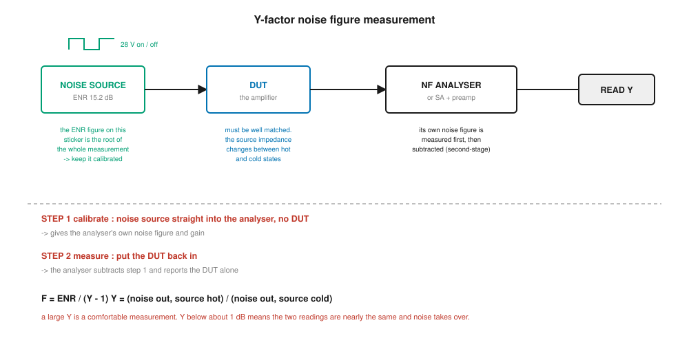
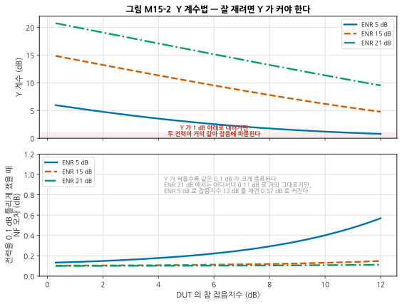
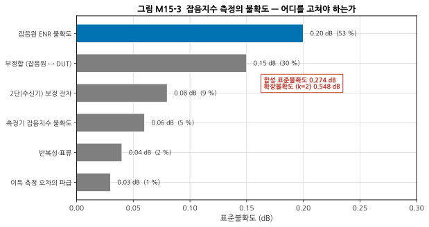
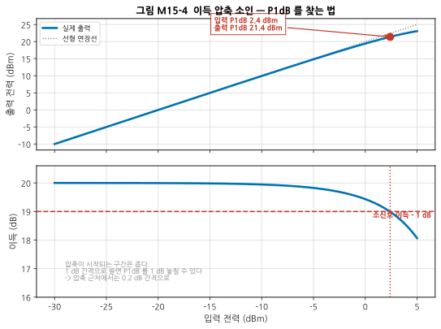
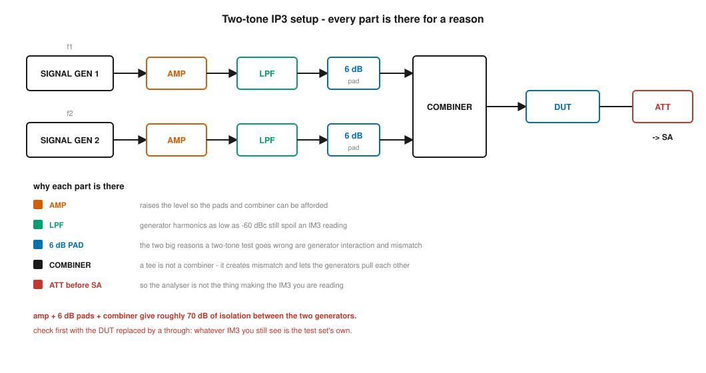
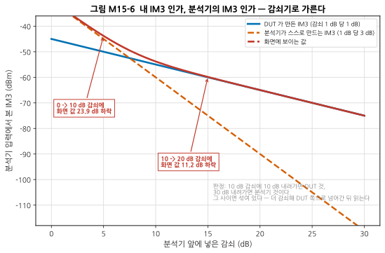
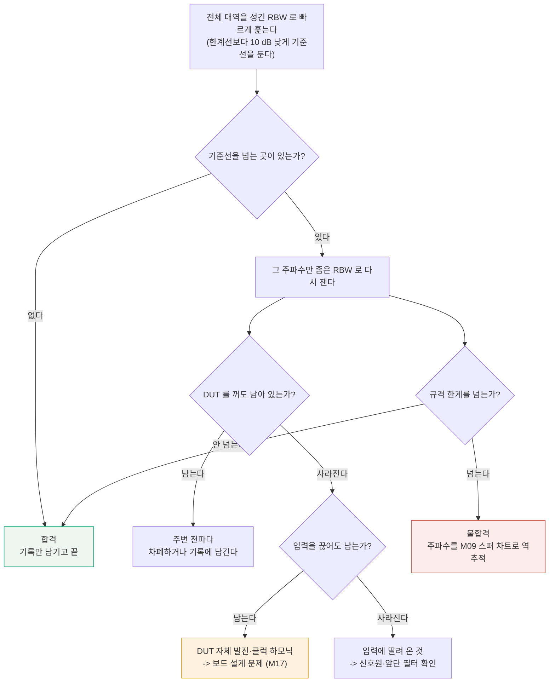
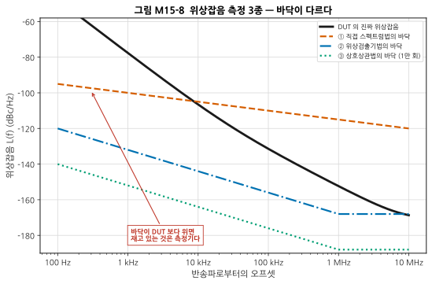
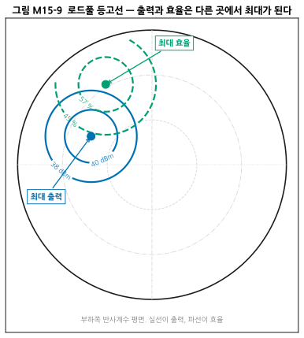

# M15 — 정밀 측정 II: 잡음지수, 선형성, 위상잡음, 로드풀

**문서 번호**: RF-CUR-M15 · **버전**: v1.0 · **분량**: 이론 5 h + 실습 9 h

| | |
|---|---|
| **선수 모듈** | [M14](./M14_정밀측정1_교정과불확도.md) (교정·불확도), [M08](./M08_증폭기.md) (NF·P1dB·IP3 정의), [M09](./M09_주파수변환과신호원.md) (위상잡음 정의), [M13](./M13_변조와신호품질.md) (EVM·ACLR 정의) |
| **이 모듈이 소유하는 개념** | **Y-계수 잡음지수 측정법**, 초과 잡음비(ENR), 콜드소스법, **2단 보정**, 잡음지수 측정 불확도, **위상잡음 측정 3종**(직접 스펙트럼·위상검출기·상호상관), **P1dB 측정 절차**, **2-tone IP3 측정 절차**(부품별 배치 이유), 측정계 한계 확인, 하모닉 측정, **스퓨리어스 서치 전략**, ACLR·SEM·EVM 측정 절차, 전력 측정(전력계 vs 스펙트럼 분석기, 평균의 종류), **로드풀과 소스풀**, 온도 시험, 반복성·재현성 |
| **이 모듈을 쓰는 후속 모듈** | M16(스펙 검증과 디버그), M17(인증 시험), **캡스톤**(내가 만든 것을 내가 잰다) |
| **학습 목표** | ① Y-계수 측정을 셋업하고 오차 요인을 통제한다 ② 2-tone 시험에서 **측정계 자신의 IM3와 DUT의 IM3를 구분**한다 ③ 측정 결과에 불확도를 붙여 보고한다 |

---

## M15.0 이 모듈의 범위

[M14](./M14_정밀측정1_교정과불확도.md)가 **"이 숫자를 믿어도 되는가"** 였다면, M15는 **"그 숫자를 어떻게 얻는가"** 입니다. 여기서 DUT(Device Under Test, 피시험 소자)는 잴 대상, VNA(Vector Network Analyzer, 벡터 네트워크 분석기)와 SA(Spectrum Analyzer, 스펙트럼 분석기)는 재는 도구입니다.

정의는 이미 다른 모듈이 소유하고 있습니다. 여기서 새로 배우는 것은 **절차**와 **함정**입니다.

> ⚠️ **다른 모듈과의 역할 분리**
>
> | 개념 | M15 (여기) | 정의를 소유하는 모듈 |
> |---|---|---|
> | 잡음지수 | **어떻게 재는가**(Y-계수·콜드소스) | [M08 §3](./M08_증폭기.md) |
> | P1dB·IP3 | **어떻게 재는가**(소인 간격·셋업) | [M08 §4·§5](./M08_증폭기.md) |
> | 위상잡음 | **어떻게 재는가**(3종 비교) | [M09 §9](./M09_주파수변환과신호원.md) |
> | EVM·ACLR·SEM | **어떻게 재는가**(설정값) | [M13 §4·§6](./M13_변조와신호품질.md) |
> | 교정·불확도 | 여기서 **쓴다** | [M14](./M14_정밀측정1_교정과불확도.md) |
> | 규격 판정·디버그 | — | M16·M17 |

---

## M15.1 측정 계획 — 무엇을 먼저 재는가

순서를 잘못 잡으면 같은 일을 두 번 합니다.

| 순서 | 재는 것 | 왜 이 순서인가 |
|---|---|---|
| 1 | **S-파라미터** (이득·정합, VNA로) | 뒤의 모든 측정이 이득을 입력으로 쓴다 |
| 2 | **잡음지수** | 작은 신호에서 재므로 DUT를 상하게 하지 않는다 |
| 3 | **P1dB** | 여기서부터 큰 신호. 압축 지점을 알아야 다음 단계의 레벨을 정한다 |
| 4 | **IP3**(3차 상호변조 절점) | P1dB(1 dB 압축점)보다 낮은 레벨에서 잰다 |
| 5 | **하모닉·스퓨리어스** | 큰 신호를 넣은 김에 함께 |
| 6 | **변조 측정** (EVM·ACLR) | 위의 값들이 다 맞아야 해석이 된다 |
| 7 | **온도 시험** | 상온에서 다 끝난 뒤 반복 |

> 📌 **작은 신호 → 큰 신호 순서가 원칙입니다.** 큰 신호를 먼저 넣으면 DUT가 손상되거나 특성이 변할 수 있고, 그러면 앞의 측정이 무효가 됩니다.

> ⚠️ **매 측정마다 "측정계 자신은 얼마인가"를 먼저 확인하십시오.** DUT를 빼고 관통으로 이어서 재는 것입니다. 이 습관 하나가 이 모듈 전체를 관통합니다(→ §7).

---

## M15.2 전력 측정 — "평균"이 무슨 뜻인지부터

| 도구 | 재는 것 | 강점 | 약점 |
|---|---|---|---|
| **열전대형 전력계** | 진짜 평균 전력 (열) | 파형과 무관하게 정확 | 느리다. 주파수 선택이 없다 |
| **다이오드형 전력계** | 저레벨은 평균, 고레벨은 첨두 쪽 | 빠르고 민감 | **파고율에 따라 틀린다** |
| **스펙트럼 분석기** | 주파수별 전력 | 무엇이 어디 있는지 보인다 | 검출기·평균 설정에 따라 값이 달라진다 |

> ⚠️ **가장 흔한 사고: 변조 신호를 다이오드 전력계로 재고 "평균 전력"이라 적는 것.** [M13 §3](./M13_변조와신호품질.md)에서 본 대로 OFDM은 첨두가 평균보다 10 dB 이상 높습니다. 다이오드 전력계는 그 첨두에 끌려가 **실제보다 큰 값**을 보고합니다.

> 📌 **스펙트럼 분석기의 "평균"은 세 가지가 있습니다.**
>
> | 무엇의 평균 | 결과 |
> |---|---|
> | **로그(dB) 평균** | 잡음을 **2.5 dB 낮게** 본다 (기본값인 장비가 많다) |
> | **전력(선형) 평균** | 잡음의 참값 |
> | **전압 평균** | 또 다른 값 |
>
> 잡음이나 잡음 같은 변조 신호를 잴 때는 반드시 **전력 평균(RMS = Root Mean Square, 제곱평균제곱근 검출기)** 으로 두어야 합니다. 이것 하나로 2.5 dB가 갈립니다.

---

## M15.3 잡음지수 — Y 계수법

### 원리

잡음원을 **켰다 껐다** 하면서 DUT 출력의 잡음 전력을 잽니다. 두 전력의 비가 **Y 계수**입니다.

$$Y = \frac{P_{출력}(잡음원 켬)}{P_{출력}(잡음원 끔)} \qquad F = \frac{\text{ENR}}{Y-1}$$

**ENR**(Excess Noise Ratio, 초과 잡음비)은 잡음원이 켜졌을 때 상온보다 얼마나 더 시끄러운지를 적은 값이고, **잡음원에 붙은 성적서에 적혀 있습니다.**

> ⚠️ **이 간단한 식에는 숨은 전제가 있습니다** — **잡음원을 껐을 때의 온도가 290 K(상온)** 라는 것입니다. 실제로 잡음원의 찬 상태는 주변 온도이므로, 실험실이 290 K에서 많이 벗어나면 보정이 필요합니다. 정확한 형태는 잡음온도로 씁니다.
>
> $$T_e = \frac{T_{hot} - Y\,T_{cold}}{Y-1}, \qquad F = 1 + \frac{T_e}{T_0}$$
>
> 실습 L15-a는 **두 경로로 각각 계산해 대조**합니다. 식을 잘못 옮겨 적지 않았는지 확인하는 가장 싼 방법입니다.



*그림 M15-1. Y 계수법 셋업. **읽는 법**: 부품마다 아래에 "왜 거기 있는가"를 적었습니다. 핵심은 **2단계 절차**입니다 — 먼저 DUT 없이 재서 측정기 자신의 잡음지수를 구하고(STEP 1), 그다음 DUT를 넣습니다(STEP 2). 측정기가 그 차이를 계산해 DUT만의 값을 냅니다.*

### Y가 커야 하는 이유



*그림 M15-2. **읽는 법**: 위 칸은 ENR과 DUT 잡음지수에 따라 Y가 얼마가 되는지, 아래 칸은 **출력 전력을 0.1 dB 틀리게 쟀을 때** 잡음지수가 얼마나 틀리는지입니다.*

| ENR | 참 NF | Y | 전력 0.1 dB 오차 → NF 오차 |
|---|---|---|---|
| 21 dB | 6 dB | 15.14 dB | 0.103 dB |
| 21 dB | 12 dB | 9.51 dB | 0.112 dB |
| 15 dB | 12 dB | 4.76 dB | 0.149 dB |
| **5 dB** | **12 dB** | **0.79 dB** | **0.569 dB** |

> 📌 **Y가 작으면 두 전력이 거의 같아집니다.** 거의 같은 두 수의 차이를 쓰는 계산이므로, 작은 측정 오차가 크게 증폭됩니다. **Y가 1 dB 아래로 내려가면 그 측정은 믿기 어렵습니다.**

> 💡 **그러면 ENR이 클수록 좋은가** — 꼭 그렇지는 않습니다. ENR이 크면 잡음원을 켰을 때 DUT가 압축될 수 있고, 켤 때와 끌 때 **잡음원의 임피던스 변화**도 커집니다. 잡음지수가 낮은 LNA에는 ENR 5~6 dB의 저ENR 잡음원을 쓰는 것이 오히려 정확합니다. **DUT의 잡음지수에 맞춰 고릅니다.**

### 2단 보정

측정기도 자기 잡음을 냅니다. Friis에 따라 **DUT 이득이 낮으면 측정기 몫이 크게 실립니다.**

$$F_{측정} = F_{DUT} + \frac{F_{측정기}-1}{G_{DUT}}$$

| DUT 이득 | 잰 값 | 보정 후 | 보정량 |
|---|---|---|---|
| 30 dB | 3.00 dB | 2.99 dB | 0.01 dB |
| 20 dB | 3.00 dB | 2.88 dB | 0.12 dB |
| 15 dB | 3.00 dB | 2.62 dB | 0.38 dB |
| 10 dB | 3.00 dB | **1.66 dB** | **1.34 dB** |
| 6 dB | 3.00 dB | **−1.79 dB** | 4.79 dB |

> ⚠️ **맨 아랫줄을 보십시오. 잡음지수가 음수입니다.** 수동·능동을 막론하고 잡음지수가 0 dB보다 작을 수는 없습니다. **이 값은 "DUT가 훌륭하다"가 아니라 "측정이 틀렸다"는 신호입니다.**
>
> 이득 6 dB짜리 DUT에 잡음지수 8 dB인 측정기를 붙이면, 잰 값의 대부분이 측정기 몫입니다. 남는 것이 거의 없어 보정이 뺄셈의 자릿수를 다 먹어 버립니다. **대책은 DUT 뒤에 저잡음 증폭기(Low Noise Amplifier, LNA)를 프리앰프로 다는 것**입니다 — 측정기의 실효 잡음지수를 낮춰 보정량을 줄입니다.

### 무엇이 불확도를 지배하는가



*그림 M15-3. **읽는 법**: 막대가 각 항목의 표준불확도이고, 괄호 안이 **전체 분산에서 차지하는 몫**입니다. 파란 막대가 가장 큰 항입니다.*

| 항목 | 표준불확도 | 분산 기여 |
|---|---|---|
| **잡음원 ENR 불확도** | 0.20 dB | **53 %** |
| **부정합** (잡음원 ↔ DUT) | 0.15 dB | 30 % |
| 2단 보정 잔차 | 0.08 dB | 9 % |
| 측정기 잡음지수 불확도 | 0.06 dB | 5 % |
| 반복성·표류 | 0.04 dB | 2 % |
| 이득 측정 오차의 파급 | 0.03 dB | 1 % |
| **합성 표준불확도** | **0.274 dB** | |
| **확장불확도 (k = 2)** | **0.548 dB** | |

> 📌 **잡음원의 성적서가 이 측정의 뿌리입니다.** ENR 하나가 분산의 절반을 넘습니다. 잡음원을 교정 보내 ENR 불확도를 0.20 → 0.10 dB로 줄이면 합성 불확도가 **0.274 → 0.212 dB**가 됩니다.

---

## M15.4 콜드소스법 — 잡음원 없이

**콜드소스법**(cold-source, 게인법이라고도 함)은 잡음원을 켜지 않고, **상온 종단만 달고** DUT의 이득과 출력 잡음을 재서 잡음지수를 구합니다.

$$F = \frac{N_{출력}}{k T_0 B \cdot G}$$

| | Y 계수법 | 콜드소스법 |
|---|---|---|
| 필요한 것 | 교정된 잡음원 | **정확한 이득 측정**(VNA) |
| 강점 | 절차가 단순, 장비가 다 해 준다 | 잡음원 불확도가 없다. **VNA와 같은 셋업**에서 가능 |
| 약점 | ENR 불확도가 지배 | **이득 오차가 그대로 잡음지수 오차** |
| 잘 맞는 곳 | 일반적인 부품 | 온-웨이퍼, 잡음지수가 아주 낮은 소자 |

> 💡 **잡음원을 켜고 끌 때 임피던스가 변하는 문제**가 Y 계수법의 숨은 오차입니다. 콜드소스법은 종단이 하나로 고정되므로 이 문제가 없습니다. 대신 이득을 잘못 재면 그대로 틀립니다 — **[M14](./M14_정밀측정1_교정과불확도.md)의 교정이 여기서 값을 합니다.**

---

## M15.5 이득 압축 측정 — 얼마나 촘촘히 쓸어야 하는가



*그림 M15-4. **읽는 법**: 위 칸은 입출력 특성과 선형 연장선, 아래 칸은 이득입니다. 이득이 소신호 값보다 1 dB 떨어지는 지점이 P1dB입니다.*

이 예의 결과입니다.

| 항목 | 값 |
|---|---|
| 소신호 이득 | 20.0 dB |
| **입력 P1dB** | **2.4 dBm** |
| **출력 P1dB** | **21.4 dBm** |
| IIP3와의 차이 | 9.60 dB (3차 다항식 이론값 9.64 dB) |

> 📌 **P1dB는 IIP3보다 약 9.6 dB 아래입니다.** 3차 비선형만 있는 이상적인 모형에서 나오는 값이고, 실제 소자는 5~15 dB로 흩어집니다. **이 관계를 외워 쓰지 말고, 대략의 위치를 잡는 데만 쓰십시오**([M08 §5](./M08_증폭기.md)).

> ⚠️ **소인 간격이 결과를 바꿉니다.** 이 예에서 1 dB 간격으로 쓸면 P1dB를 **0.4 dB** 놓칩니다. 압축은 좁은 구간에서 급히 일어나므로, **압축 근처에서만 0.2 dB 간격으로 촘촘하게** 하는 것이 실무의 방법입니다.

**자동 소인 절차**

1. 소신호(예상 P1dB보다 20 dB 아래)에서 이득을 재 **소신호 이득**을 확정
2. 1 dB 간격으로 올리며 이득이 0.5 dB 떨어지는 지점을 찾음
3. 그 부근만 **0.2 dB 간격**으로 다시 소인
4. **매 점마다 정착 시간**을 준다 — 열이 안정될 시간
5. 올릴 때와 내릴 때를 모두 재서 **이력(hysteresis)** 확인

> ⚠️ **위로만 쓸고 끝내지 마십시오.** 열이 쌓이면 내려올 때 값이 다릅니다. 차이가 크면 열 설계 문제입니다(→ [M08 §9](./M08_증폭기.md)).

---

## M15.6 2-tone IP3 — 셋업의 모든 부품에 이유가 있다



*그림 M15-5. **읽는 법**: 아래쪽 목록이 이 그림의 핵심입니다. 부품 하나하나가 **특정 실패를 막기 위해** 있습니다.*

| 부품 | 없으면 무슨 일이 | 
|---|---|
| **증폭기** | 뒤의 패드와 합성기 손실을 감당할 레벨이 안 나온다 |
| **저역통과 필터** | 신호발생기의 하모닉이 −60 dBc만 되어도 IM3 측정을 망친다 |
| **6 dB 패드** | 두 발생기가 서로를 끌어당기고, 부정합이 생긴다 |
| **합성기** | **T 커넥터로 합치면 안 됩니다.** 부정합이 생기고 발생기끼리 간섭한다 |
| **분석기 앞 감쇠기** | 분석기가 스스로 만든 IM3를 DUT 것으로 읽는다 |
| **아이솔레이터** | DUT가 되반사한 신호가 합성기·발생기로 돌아가 거기서 또 IM3를 만든다 |

> 💡 **아이솔레이터를 어디에 두는가**: 합성기와 DUT 사이입니다. 한 방향으로만 통과시키므로, DUT 입력의 부정합 때문에 되돌아 나온 신호가 **발생기 쪽으로 못 갑니다.** DUT의 입력 정합이 나쁠수록 효과가 큽니다.
>
> 다만 아이솔레이터는 **대역이 좁고 비쌉니다.** 대역이 넓은 시험에서는 아이솔레이터 대신 **감쇠기를 더 넣는 것**으로 대신하기도 합니다 — 감쇠기 6 dB는 되돌아가는 신호를 12 dB 줄입니다([M04 §2](./M04_RF실험실입문.md)).

> 📌 **증폭기 + 6 dB 패드 + 합성기를 합치면 두 발생기 사이에 약 70 dB의 격리가 생깁니다.** 이것이 2-tone 측정이 성립하는 최소 조건입니다.

> ⚠️ **2-tone 시험이 틀어지는 두 가지 큰 이유**는 ① 발생기 간 격리 부족 ② 발생기 하모닉을 안 걸러낸 것입니다. 둘 다 위 셋업이 막습니다.

**측정 절차**

1. 두 톤의 간격을 정한다 (보통 채널 대역폭의 1/10 ~ 1/2)
2. **DUT를 빼고 관통으로 이어** 측정계 자신의 IM3를 먼저 잰다 (→ §7)
3. DUT를 넣고, P1dB보다 **10 dB 이상 아래** 레벨에서 잰다
4. 레벨을 5 dB 올려 **IM3가 15 dB 오르는지**(기울기 3) 확인한다
5. 기울기가 3이 아니면 압축이 섞였거나 측정계 IM3가 섞인 것이다

---

## M15.7 측정계 한계 확인 — 내 IM3인가, 분석기의 IM3인가

**이것이 이 모듈에서 가장 중요한 절입니다.**

분석기도 비선형 소자입니다. 큰 신호가 들어가면 **스스로 IM3(3차 상호변조 성분)를 만듭니다.** 화면에 보이는 IM3가 DUT 것인지 분석기 것인지 구분해야 합니다.

> ⚠️ **전력을 바꿔서는 구분되지 않습니다.** 둘 다 톤 전력에 대해 기울기 3이라 **평행선**입니다 — 서로 만나지 않습니다.

**구분하는 방법은 분석기 앞의 감쇠기를 옮기는 것입니다.**

| | 감쇠 1 dB를 더 넣으면 |
|---|---|
| **DUT가 만든 IM3** | 이미 만들어진 신호라 **1 dB** 내려간다 |
| **분석기가 만드는 IM3** | 입력이 줄어 세제곱으로 **3 dB** 내려간다 |



*그림 M15-6. **읽는 법**: 가로축이 분석기 앞에 넣은 감쇠, 세로축이 분석기 입력에서 본 IM3입니다. 파란 선(DUT)은 기울기 1, 주황 파선(분석기)은 기울기 3이고, 빨간 선이 화면에 보이는 합입니다.*

이 예에서 벌어지는 일입니다.

| 감쇠 구간 | 화면 값의 변화 | 뜻 |
|---|---|---|
| 0 → 10 dB | **23.9 dB 하락** | 아직 분석기 몫이 크다 |
| 10 → 20 dB | **11.2 dB 하락** | 거의 DUT 몫만 남았다 |

> 📌 **판정 규칙**
> - 10 dB 감쇠에 **10 dB 내려가면** → DUT의 IM3입니다. 읽어도 됩니다
> - 10 dB 감쇠에 **30 dB 내려가면** → 분석기의 IM3입니다. 그 값은 의미가 없습니다
> - **그 사이면 섞여 있습니다** → 더 감쇠해서 DUT 쪽으로 넘어간 뒤 읽습니다
>
> 이 예에서는 감쇠 **13 dB**를 넣으면 분석기 몫이 DUT 몫보다 10 dB 아래로 내려갑니다.

> 💡 **같은 논리가 모든 측정에 적용됩니다.** "DUT를 빼고 재 보기"는 잡음지수(측정기 잡음), 위상잡음(측정기 바닥), 스퓨리어스(측정계 스퍼)에서 똑같이 씁니다. **측정계 자신을 먼저 재는 것이 정밀 측정의 첫 동작입니다.**

---

## M15.8 하모닉과 스퓨리어스 — 넓은 대역을 어떻게 훑는가

스퓨리어스 서치는 **9 kHz부터 동작 주파수의 수 배까지** 훑어야 합니다. 그냥 하면 며칠이 걸립니다.



*그림 M15-7. 스퓨리어스 서치 전략. **읽는 법**: 요령은 **두 단계로 나누는 것**입니다 — 빠르고 성기게 훑어 후보만 고르고, 후보만 정밀하게 다시 잽니다. 그리고 후보가 나오면 **끄고 재 보는 것**으로 출처를 가릅니다.*

| 요령 | 왜 |
|---|---|
| **한계선보다 10 dB 낮게** 기준선을 둔다 | 성긴 측정은 값이 낮게 나오므로 여유가 필요 |
| 성긴 소인은 **RBW(Resolution Bandwidth, 분해능 대역폭)를 넓게** | 소인 시간이 RBW의 제곱에 반비례한다([M05 §3](./M05_첫측정.md)) |
| 후보만 **좁은 RBW**로 재측정 | 규격 판정은 규격이 지정한 RBW로 |
| **DUT를 끄고** 한 번 훑는다 | 주변 전파와 측정계 스퍼를 미리 걸러 낸다 |
| 하모닉은 **계산해서 찾아간다** | 2f, 3f… 자리는 미리 안다 |

> 📌 **스퍼가 나오면 주파수를 먼저 적으십시오.** [M09 §6](./M09_주파수변환과신호원.md)의 스퍼 차트로 역추적하면 어느 조합(m·RF ± n·LO)에서 왔는지 대개 밝혀집니다. **원인을 모른 채 필터로 덮으면 다른 대역에서 다시 나옵니다.**

> ⚠️ **하모닉 측정에는 앞에 저역통과 필터를 두지 마십시오.** 당연해 보이지만 습관적으로 끼웠다가 "하모닉이 없다"고 보고하는 일이 실제로 일어납니다. 반대로 **기본파가 너무 커서 분석기가 스스로 하모닉을 만드는 것**도 조심해야 합니다 — 기본파만 죽이는 노치 필터를 쓰면 둘 다 해결됩니다.

---

## M15.9 변조 측정 — 설정값이 규격과 같아야 한다

[M13](./M13_변조와신호품질.md)에서 EVM(Error Vector Magnitude, 오차 벡터 크기)·ACLR(인접 채널 누설비)·SEM(Spectrum Emission Mask, 스펙트럼 방출 마스크)이 **무엇인지** 배웠습니다. 여기서는 **어떤 설정으로 재는가**입니다.

| 설정 | 왜 중요한가 |
|---|---|
| **측정 대역폭** | ACLR은 인접 채널 폭 전체를 적분한다. 폭이 다르면 값이 다르다 |
| **채널 간격(오프셋)** | 규격이 정한 오프셋에서 재야 한다 |
| **검출기·평균** | 반드시 **RMS(전력) 평균**. 로그 평균이면 2.5 dB 어긋난다 |
| **필터 모양** | RRC(Root Raised Cosine, 제곱근 상승 코사인) 필터의 롤오프 계수가 규격과 같아야 한다 |
| **동기·평준화** | EVM은 기준 신호와 맞춘 뒤 재는 값이다 |
| **잔여 EVM 보정** | 측정기 자신의 EVM을 뺐는지 |

> 📌 **규격 문서에는 한계값만이 아니라 "어떻게 재는가"가 함께 적혀 있습니다.** [M13 §9](./M13_변조와신호품질.md)에서 다룬 대로, **시험 조건을 안 읽고 한계값만 보면 틀립니다.**

> ⚠️ **측정기 자신의 EVM을 확인하십시오.** 신호발생기 출력을 분석기에 곧장 넣어 잰 EVM이 **잔여 EVM**입니다. DUT의 EVM이 이 값에 가까우면 측정기를 재고 있는 것입니다. 규칙: **DUT EVM이 잔여 EVM보다 3배(약 10 dB) 이상 커야** 편하게 읽을 수 있습니다.

---

## M15.10 위상잡음 측정 3종



*그림 M15-8. **읽는 법**: 검은 선이 DUT의 진짜 위상잡음이고, 나머지 세 선은 각 방법의 **바닥**입니다. **바닥이 DUT보다 위에 있으면 그 구간에서는 측정기를 재고 있는 것**입니다.*

| 방법 | 원리 | 강점 | 약점 |
|---|---|---|---|
| **① 직접 스펙트럼법** | 스펙트럼 분석기로 반송파 옆을 그냥 본다 | 가장 간단, 장비 하나 | **분석기 자신의 위상잡음이 바닥.** 가까운 오프셋에서 특히 나쁘다 |
| **② 위상검출기법** | 기준 신호와 90°로 섞어 위상 흔들림을 전압으로 | 훨씬 민감 | **기준 신호가 DUT보다 조용해야** 한다 |
| **③ 상호상관법** | 독립된 두 경로로 재고 곱해서 평균 | 측정기 자신의 잡음이 평균으로 지워진다 | 시간이 오래 걸린다 |

### 상호상관이 얼마나 내려가는가

$$\text{개선량 [dB]} = 5\log_{10}(N) \qquad (N = \text{상관 횟수})$$

| N | 개선량 |
|---|---|
| 10 | 5 dB |
| 100 | 10 dB |
| 10,000 | **20 dB** |

> ⚠️ **10배마다 5 dB뿐입니다.** 20 dB를 얻으려면 1만 번을 평균해야 하고, 그만큼 **시간이 걸립니다.** 30 dB를 원하면 100만 번입니다. 상호상관은 공짜가 아니라 **시간으로 사는 성능**입니다.

> 📌 **어떤 방법을 쓸지는 DUT가 정합니다.** DUT의 위상잡음이 분석기 바닥보다 충분히 높으면 ① 로 충분합니다. 좋은 발진기를 재려 할수록 ② → ③ 으로 올라갑니다. **먼저 ① 로 재 보고, 바닥에 닿으면 올라가는 것**이 순서입니다.

---

## M15.11 로드풀 — 데이터시트가 답을 안 주는 곳

전력 증폭기는 **어떤 부하를 물리느냐에 따라 출력과 효율이 크게 달라집니다.** 그런데 그 최적 부하는 S-파라미터에서 나오지 않습니다 — **큰 신호에서의 성질**이기 때문입니다.

**로드풀**은 부하 임피던스를 바꿔 가며 매번 출력과 전력 부가 효율(Power Added Efficiency, PAE)을 재서 지도를 그리는 측정입니다.



*그림 M15-9. **읽는 법**: 부하쪽 반사계수 평면 위에 실선이 출력 등고선, 파선이 효율 등고선입니다. **두 최적점이 서로 다른 자리에 있습니다.***

| | 최적 부하 Γ | 출력 | 효율 |
|---|---|---|---|
| **최대 출력점** | 0.450 ∠ 155° | **41.00 dBm** | 42.5 % |
| **최대 효율점** | 0.621 ∠ 120° | 36.81 dBm | **62.0 %** |

> 📌 **한쪽을 고르면 다른 쪽을 잃습니다.**
> - 효율점을 고르면 출력을 **4.19 dB** 잃습니다
> - 출력점을 고르면 효율을 **19.5 %p** 잃습니다
>
> **실무는 대개 타협점을 고릅니다.** 출력 1 dB와 효율 10 %p를 같은 값으로 놓고 최적화하면 Γ = 0.482 ∠ 141°가 나오고, 출력 **0.42 dB만 손해 보고** 효율은 **52.9 %** 를 얻습니다.

> 💡 **등고선의 촘촘함이 정합 회로의 정밀도 요구를 알려 줍니다.** 이 예에서 부하가 최적점에서 |ΔΓ| = 0.10 벗어나면 출력을 0.32 dB, 0.20 벗어나면 **1.28 dB** 잃습니다. 등고선이 넓은 방향으로 여유를 두고 정합 회로를 설계하는 것이 요령입니다.

> ⚠️ **소스풀도 함께 봐야 할 때가 있습니다.** 입력쪽 임피던스는 이득과 잡음지수를 좌우합니다([M08 §3](./M08_증폭기.md)의 Γ_opt). 로드풀로 부하를 정한 뒤 소스풀을 하고, 다시 로드풀을 하는 **반복**이 정석입니다.

---

## M15.12 측정 보고서 — 숫자 하나만 적지 않는다

> ⚠️ **불확도 없는 측정값은 반쪽입니다.** "잡음지수 3.0 dB"는 3.0인지 2.5인지 3.5인지 말해 주지 않습니다.

**보고서에 반드시 들어갈 것**

| 항목 | 예 |
|---|---|
| **측정값과 확장불확도** | 잡음지수 = 3.00 ± 0.55 dB (k = 2, 약 95 %) |
| 측정 조건 | 주파수, 온도, 전원 전압, 입력 레벨 |
| 사용 장비와 교정 상태 | 모델·일련번호·교정 유효기간 |
| 셋업 | 블록도와 케이블·감쇠기 구성 |
| **측정계 자신의 값** | 잔여 EVM, 측정계 IM3, 분석기 바닥 |
| 불확도 예산표 | 각 기여 항목과 합성 방법 |
| 반복성 | 몇 번 재서 얼마나 흩어졌는가 |

### 반복성과 재현성

| 용어 | 뜻 | 무엇이 드러나는가 |
|---|---|---|
| **반복성**(repeatability) | 같은 사람·장비·날에 다시 재기 | 잡음, 커넥터 조임 |
| **재현성**(reproducibility) | 다른 사람·장비·날에 다시 재기 | 절차의 모호함, 장비 차이 |

> 📌 **재현성이 나쁘면 절차서가 부실한 것입니다.** 두 사람이 다른 답을 얻는다면 절차서에 적히지 않은 판단이 남아 있다는 뜻입니다. **"어떻게 재는지"를 적는 것이 이 모듈의 진짜 결과물입니다.**

### 온도 시험

> ⚠️ **상온에서만 재고 "합격"이라 적지 마십시오.** 이득·잡음지수·출력·주파수가 모두 온도에 따라 변합니다. 규격이 −40 ~ +85 °C를 요구하면 **최소한 세 점(저온·상온·고온)** 은 재야 합니다. 각 온도에서 **충분히 담가 둔 뒤**(soak) 재는 것이 핵심입니다.

---

## M15.L 실습

### L15-a — Y 계수 잡음지수 측정과 불확도 (Tier 2 + Tier 0, 3시간)

**목표**: 잡음지수를 재고, 값에 불확도를 붙여 보고합니다.

**준비물 (Tier 2)**: 잡음지수 분석기(또는 SA + 잡음원), 교정된 잡음원, LNA, 감쇠기

**절차 (Tier 2)**

1. **STEP 1 — 교정**: 잡음원을 분석기에 곧장 물려 측정기 자신의 잡음지수와 이득을 잰다
2. **STEP 2 — 측정**: DUT를 넣고 잰다
3. 잡음원 양쪽에 **6 dB 감쇠기**를 넣고 다시 잰다. 값이 얼마나 바뀌는가 (부정합 확인)
4. DUT 뒤에 **저잡음 프리앰프**를 달고 다시 잰다. 2단 보정량이 얼마나 줄었는가
5. 5회 반복해 **흩어짐**을 기록한다

**절차 (Tier 0 — 계산 부분)**

6. 아래 스크립트를 `l15a.py`로 저장하고 실행합니다.

```python
import numpy as np

T0 = 290.0
db = lambda x: 10 * np.log10(x)
un = lambda x: 10 ** (x / 10)


def nf_from_y(y_db, enr_db):
    """F = ENR / (Y - 1)   (전부 진수)"""
    return db(un(enr_db) / (un(y_db) - 1.0))


def nf_via_temperature(y_db, enr_db, t_cold=T0):
    """같은 값을 잡음온도로 — 식을 잘못 옮겨 적지 않았는지 확인용."""
    y = un(y_db)
    t_hot = T0 * (un(enr_db) + 1.0)
    te = (t_hot - y * t_cold) / (y - 1.0)
    return db(1.0 + te / T0)


def second_stage(nf_meas_db, nf_rx_db, gain_db):
    """잰 값에서 수신기 몫을 덜어 낸다 (Friis 의 역)."""
    return db(un(nf_meas_db) - (un(nf_rx_db) - 1.0) / un(gain_db))


# ── 1) 두 경로가 같은 답을 주는지
print("Y 계수 -> 잡음지수  (두 방법 대조)")
print(f"{'ENR':>6}{'Y':>7}{'F (인자)':>12}{'F (온도)':>12}{'차이':>10}")
for enr, y in ((15.2, 10.0), (15.2, 6.0), (15.2, 3.0), (5.5, 2.0)):
    a, b = nf_from_y(y, enr), nf_via_temperature(y, enr)
    print(f"{enr:6.1f}{y:7.1f}{a:12.4f}{b:12.4f}{abs(a-b):10.2e}")

# ── 2) 2단 보정이 얼마나 중요한가
print("\n2단 보정 — DUT 이득이 낮으면 보정 없이는 못 쓴다")
print(f"{'DUT 이득':>10}{'잰 값':>10}{'보정 후':>10}{'차이':>10}")
for g in (30.0, 20.0, 15.0, 10.0, 6.0):
    meas, rx = 3.0, 8.0
    c = second_stage(meas, rx, g)
    print(f"{g:10.0f}{meas:10.2f}{c:10.2f}{meas-c:10.2f}")

# ── 3) 불확도 예산
print("\n불확도 예산 (LNA 하나, 잡음지수 약 3 dB)")
terms = {
    "잡음원 ENR 불확도": 0.20,
    "부정합 (잡음원 <-> DUT)": 0.15,
    "2단 보정 잔차": 0.08,
    "측정기 잡음지수 불확도": 0.06,
    "반복성·표류": 0.04,
    "이득 측정 오차의 파급": 0.03,
}
var = {k: v * v for k, v in terms.items()}
tot = float(np.sqrt(sum(var.values())))
for k, v in terms.items():
    print(f"  {k:<26}{v:6.3f} dB   분산의 {100*var[k]/sum(var.values()):5.1f} %")
print(f"  {'합성 표준불확도':<26}{tot:6.3f} dB")
print(f"  {'확장불확도 (k=2)':<26}{2*tot:6.3f} dB")
print(f"\n  보고 형식:  잡음지수 = 3.00 +- {2*tot:.2f} dB  (k=2, 약 95 %)")

# ── 4) 무엇을 고쳐야 하는가
print("\n개선 시나리오")
base = tot
for name, k, v in (("ENR 불확도 0.20 -> 0.10 (교정 보낸 잡음원)",
                    "잡음원 ENR 불확도", 0.10),
                   ("부정합 0.15 -> 0.05 (양쪽에 감쇠기)",
                    "부정합 (잡음원 <-> DUT)", 0.05)):
    t2 = dict(terms); t2[k] = v
    u2 = float(np.sqrt(sum(x * x for x in t2.values())))
    print(f"  {name:<44}{base:.3f} -> {u2:.3f} dB")
```

**예상 결과**

```
Y 계수 -> 잡음지수  (두 방법 대조)
   ENR      Y      F (인자)      F (온도)        차이
  15.2   10.0      5.6576      5.6576  0.00e+00
  15.2    6.0     10.4563     10.4563  0.00e+00
  15.2    3.0     15.2206     15.2206  0.00e+00
   5.5    2.0      7.8292      7.8292  0.00e+00

2단 보정 — DUT 이득이 낮으면 보정 없이는 못 쓴다
    DUT 이득       잰 값      보정 후        차이
        30      3.00      2.99      0.01
        20      3.00      2.88      0.12
        15      3.00      2.62      0.38
        10      3.00      1.66      1.34
         6      3.00     -1.79      4.79

불확도 예산 (LNA 하나, 잡음지수 약 3 dB)
  잡음원 ENR 불확도                0.200 dB   분산의  53.3 %
  부정합 (잡음원 <-> DUT)          0.150 dB   분산의  30.0 %
  2단 보정 잔차                   0.080 dB   분산의   8.5 %
  측정기 잡음지수 불확도               0.060 dB   분산의   4.8 %
  반복성·표류                     0.040 dB   분산의   2.1 %
  이득 측정 오차의 파급               0.030 dB   분산의   1.2 %
  합성 표준불확도                   0.274 dB
  확장불확도 (k=2)                0.548 dB

  보고 형식:  잡음지수 = 3.00 +- 0.55 dB  (k=2, 약 95 %)

개선 시나리오
  ENR 불확도 0.20 -> 0.10 (교정 보낸 잡음원)            0.274 -> 0.212 dB
  부정합 0.15 -> 0.05 (양쪽에 감쇠기)                  0.274 -> 0.235 dB
```

**판정 기준**

| 항목 | 합격 |
|---|---|
| 재현 | 위 값이 그대로 나온다 |
| 해석 ① | **이득 6 dB 줄의 −1.79 dB가 왜 "측정이 틀렸다"는 신호인지** 설명할 수 있다 |
| 해석 ② | ENR이 왜 불확도를 지배하는지 말할 수 있다 |
| 실측 | 감쇠기를 넣기 전후 값의 차이를 기록했다 |
| 보고 | 값 ± 확장불확도(k=2) 형식으로 적었다 |

**흔한 실수**

| 실수 | 증상 | 바로잡기 |
|---|---|---|
| STEP 1(교정)을 건너뜀 | 잡음지수가 실제보다 크게 나온다 | 반드시 2단계로 |
| ENR 표를 안 넣음 | 주파수마다 틀린다 | ENR은 주파수의 함수 |
| Y가 1 dB 아래인데 그냥 읽음 | 값이 크게 흔들린다 | ENR이 더 큰 잡음원으로 |
| 이득 낮은 DUT를 그냥 잼 | 보정이 값을 다 먹는다 | 뒤에 프리앰프 |

---

### L15-b — P1dB 자동 소인 (Tier 1/2, 2시간)

**목표**: 소인 간격이 결과를 바꾸는 것을 직접 확인합니다.

**절차**

1. 소신호 이득을 먼저 확정한다 (예상 P1dB보다 20 dB 아래에서)
2. **1 dB 간격**으로 −30 dBm부터 +5 dBm까지 쓸어 P1dB를 찾는다
3. 같은 구간을 **0.2 dB 간격**으로 다시 쓸어 P1dB를 찾는다
4. **두 값의 차이를 기록한다**
5. 내려오면서 다시 쓸어 **이력**을 본다
6. 각 점의 정착 시간을 2배로 늘려 다시 해 본다 (열의 영향)

**판정 기준**

| 항목 | 합격 |
|---|---|
| 간격 | 성긴 소인과 촘촘한 소인의 차이를 수치로 적었다 |
| 이력 | 올라갈 때와 내려올 때의 차이를 기록했다 |
| 열 | 정착 시간을 바꿨을 때의 변화를 확인했다 |
| 안전 | DUT의 절대최대정격을 넘지 않았다 |

---

### L15-c — 2-tone IP3와 측정계 IM3 분리 (Tier 2, 3시간)

**목표**: 화면의 IM3가 누구 것인지 **증명**합니다.

**절차**

1. §6의 셋업을 만든다 (증폭기 · 저역통과 필터 · 6 dB 패드 · 합성기)
2. **DUT 자리에 관통을 넣고** 측정계 자신의 IM3를 잰다. 이 값을 적어 둔다
3. DUT를 넣고 IM3를 잰다
4. **분석기 앞 감쇠기를 10 dB 늘린다.** 화면 값이 얼마나 내려가는가
5. 판정한다 — 10 dB면 DUT, 30 dB면 분석기, 그 사이면 섞임
6. 섞여 있으면 감쇠를 더 넣어 DUT 쪽으로 넘어간 뒤 읽는다
7. 톤 레벨을 5 dB 올려 IM3가 15 dB 오르는지(기울기 3) 확인한다

**기록표**

| 감쇠 | 화면 IM3 | 직전 대비 하락 | 판정 |
|---|---|---|---|
| 0 dB | ___ dBm | — | — |
| 10 dB | ___ dBm | ___ dB | 10/30/사이 |
| 20 dB | ___ dBm | ___ dB | 10/30/사이 |

**판정 기준**

| 항목 | 합격 |
|---|---|
| 셋업 | 부품마다 왜 있는지 설명할 수 있다 |
| 한계 확인 | DUT 없이 잰 값을 먼저 기록했다 |
| 분리 | 감쇠기 시험으로 DUT 것임을 **증명**했다 |
| 기울기 | 기울기 3을 확인했다 |

---

### L15-d — 하모닉·스퓨리어스 서치 (Tier 1/2, 2시간)

**목표**: 넓은 대역을 **효율적으로** 훑고 판정표를 만듭니다.

**절차**

1. **DUT를 끄고** 전체 대역을 한 번 훑는다 (주변 전파·측정계 스퍼 목록)
2. DUT를 켜고 성긴 RBW로 훑는다. 한계선보다 10 dB 낮은 기준선을 넘는 곳만 표시
3. 후보 주파수만 **규격이 지정한 RBW**로 다시 잰다
4. 각 후보에 대해 §8의 결정 트리를 따라 출처를 가른다
5. 판정표를 만든다

**판정표 양식**

| 주파수 | 레벨 | 한계 | 여유 | 출처(하모닉 n차 / 스퍼 m·n / 외부) | 판정 |
|---|---|---|---|---|---|
| ___ | ___ dBm | ___ dBm | ___ dB | ___ | 합격/불합격 |

---

### L15-e — EVM·ACLR 측정과 규격 대조 (Tier 2, 2시간)

**목표**: 설정값이 규격과 같은지 확인하며 잽니다.

**절차**

1. **잔여 EVM을 먼저 잰다** — 발생기를 분석기에 곧장 물려서
2. DUT를 넣고 EVM을 잰다. **잔여 EVM보다 10 dB 이상 큰가?**
3. ACLR을 잰다. 측정 대역폭·오프셋·검출기가 규격과 같은지 확인
4. 검출기를 로그 평균으로 바꿔 다시 재 본다. **몇 dB 달라지는가**
5. 백오프를 2 dB씩 바꾸며 ACLR과 EVM을 함께 기록한다([M13 §7](./M13_변조와신호품질.md)의 곡선과 비교)

**판정 기준**

| 항목 | 합격 |
|---|---|
| 잔여 | 측정기 자신의 EVM을 먼저 기록했다 |
| 설정 | 대역폭·오프셋·검출기를 규격과 대조했다 |
| 검출기 | 로그 평균과 RMS 평균의 차이를 확인했다 |
| 연결 | M13의 백오프 곡선과 모양이 맞는지 확인했다 |

---

### L15-f — 로드풀 등고선 (Tier 0, 2시간)

**목표**: 최적 부하가 **하나가 아님**을 확인하고, 타협점을 스스로 정합니다.

**절차**

1. 아래 스크립트를 `l15f.py`로 저장하고 실행합니다.

```python
import numpy as np

# 로드풀 측정 결과를 흉내 낸 데이터.
# 실제 실습에서는 이 자리에 측정한 (Gamma_load, Pout, PAE) 표를 넣는다.
G_PMAX = 0.45 * np.exp(1j * np.deg2rad(155.0))     # 출력이 최대가 되는 부하
G_EMAX = 0.62 * np.exp(1j * np.deg2rad(120.0))     # 효율이 최대가 되는 부하


def pout_dbm(g):
    return 41.0 - 32.0 * np.abs(g - G_PMAX) ** 2


def pae_pct(g):
    return 62.0 - 150.0 * np.abs(g - G_EMAX) ** 2


# 부하 평면을 훑는다
n = 601
ax = np.linspace(-0.85, 0.85, n)
GR, GI = np.meshgrid(ax, ax)
G = GR + 1j * GI
ok = np.abs(G) <= 0.85
P = np.where(ok, pout_dbm(G), -np.inf)
E = np.where(ok, pae_pct(G), -np.inf)

kp = np.unravel_index(np.argmax(P), P.shape)
ke = np.unravel_index(np.argmax(E), E.shape)
gp, ge = G[kp], G[ke]

print("최적점 두 개는 같은 자리가 아니다")
print(f"  최대 출력  : Gamma = {abs(gp):.3f} / {np.angle(gp, deg=True):6.1f} 도"
      f"   Pout {P[kp]:.2f} dBm   PAE {E[kp]:.1f} %")
print(f"  최대 효율  : Gamma = {abs(ge):.3f} / {np.angle(ge, deg=True):6.1f} 도"
      f"   Pout {P[ke]:.2f} dBm   PAE {E[ke]:.1f} %")
print(f"  두 점 사이 거리 |dGamma| = {abs(gp - ge):.3f}")

print("\n한쪽을 고르면 다른 쪽을 잃는다")
print(f"  효율점을 고르면 출력을 {P[kp] - P[ke]:.2f} dB 잃는다")
print(f"  출력점을 고르면 효율을 {E[ke] - E[kp]:.1f} %p 잃는다")

# 타협점: 두 값을 정규화해 함께 좋은 자리를 찾는다
score = (P - P[kp]) / 1.0 + (E - E[ke]) / 10.0      # 출력 1 dB = 효율 10 %p
ks = np.unravel_index(np.argmax(score), score.shape)
gs = G[ks]
print("\n타협점 (출력 1 dB 와 효율 10 %p 를 같은 값으로 볼 때)")
print(f"  Gamma = {abs(gs):.3f} / {np.angle(gs, deg=True):6.1f} 도")
print(f"  Pout {P[ks]:.2f} dBm ({P[kp] - P[ks]:.2f} dB 손해)"
      f"   PAE {E[ks]:.1f} % ({E[ke] - E[ks]:.1f} %p 손해)")

# 등고선이 얼마나 촘촘한가 = 부하가 조금 틀어졌을 때 얼마나 손해인가
print("\n부하가 틀어지면 얼마나 손해인가 (최대 출력점 기준)")
for d in (0.05, 0.10, 0.20):
    worst = pout_dbm(gp + d)          # 가장 나쁜 방향으로 d 만큼
    print(f"  |dGamma| = {d:.2f} 이면 출력 {P[kp] - worst:.2f} dB 손해")

print("\n판정")
print("  등고선이 촘촘한 축 방향으로는 정합 회로의 오차가 그대로 손해가 된다.")
print("  -> 등고선이 넓은 쪽으로 여유를 두고 설계한다.")
```

2. **가중치를 바꿔** 봅니다. 배터리 기기라면 효율이 더 중요하니 `/ 10.0`을 `/ 4.0`으로 바꿔 보십시오. 타협점이 어디로 옮겨 가는가?
3. **등고선을 그립니다.** `matplotlib`의 `contour`로 출력과 효율을 겹쳐 그려 그림 M15-9와 비교합니다.

**예상 결과**

```
최적점 두 개는 같은 자리가 아니다
  최대 출력  : Gamma = 0.450 /  155.0 도   Pout 41.00 dBm   PAE 42.5 %
  최대 효율  : Gamma = 0.621 /  119.8 도   Pout 36.81 dBm   PAE 62.0 %
  두 점 사이 거리 |dGamma| = 0.362

한쪽을 고르면 다른 쪽을 잃는다
  효율점을 고르면 출력을 4.19 dB 잃는다
  출력점을 고르면 효율을 19.5 %p 잃는다

타협점 (출력 1 dB 와 효율 10 %p 를 같은 값으로 볼 때)
  Gamma = 0.482 /  141.4 도
  Pout 40.58 dBm (0.42 dB 손해)   PAE 52.9 % (9.1 %p 손해)

부하가 틀어지면 얼마나 손해인가 (최대 출력점 기준)
  |dGamma| = 0.05 이면 출력 0.08 dB 손해
  |dGamma| = 0.10 이면 출력 0.32 dB 손해
  |dGamma| = 0.20 이면 출력 1.28 dB 손해

판정
  등고선이 촘촘한 축 방향으로는 정합 회로의 오차가 그대로 손해가 된다.
  -> 등고선이 넓은 쪽으로 여유를 두고 설계한다.
```

**판정 기준**

| 항목 | 합격 |
|---|---|
| 재현 | 위 값이 그대로 나온다 |
| 해석 | 두 최적점이 다른 이유를 설명할 수 있다 |
| 판단 | 자기 제품의 가중치로 타협점을 정할 수 있다 |
| 설계 연결 | 등고선의 촘촘함이 정합 회로 정밀도 요구가 됨을 안다 |

---

## M15.Q 확인 문제

<details>
<summary><b>Q1.</b> 잡음지수를 쟀더니 Y 계수가 0.8 dB였다. 이 측정을 믿어도 되는가?</summary>

**믿기 어렵습니다.**

Y = 0.8 dB는 잡음원을 켰을 때와 껐을 때의 출력이 **20 %밖에 차이 나지 않는다**는 뜻입니다. F = ENR/(Y−1)에서 분모가 아주 작아지므로, 작은 측정 오차가 크게 증폭됩니다.

본문 §3의 표에서, ENR 5 dB로 잡음지수 12 dB인 DUT를 재면 Y = 0.79 dB가 되고 **전력을 0.1 dB만 틀리게 재도 잡음지수가 0.57 dB 틀립니다.** 같은 0.1 dB가 ENR 21 dB에서는 0.11 dB밖에 안 됩니다.

**대책**
1. **ENR이 더 큰 잡음원**을 쓴다 (5 dB → 15 dB 또는 21 dB)
2. 그래도 Y가 작다면 DUT의 잡음지수가 정말 큰 것이다 — 그때는 **콜드소스법**을 고려한다

**반대 방향의 주의**: ENR이 너무 크면 DUT가 압축되거나 임피던스 변화가 커집니다. **DUT의 잡음지수에 맞춰 고르는 것**이 원칙입니다.
</details>

<details>
<summary><b>Q2.</b> 2단 보정을 했더니 잡음지수가 −1.8 dB로 나왔다. 훌륭한 소자인가?</summary>

**아닙니다. 측정이 틀렸다는 신호입니다.**

잡음지수는 **0 dB보다 작을 수 없습니다.** 잡음지수는 "입력 SNR / 출력 SNR"이고, 어떤 소자도 SNR을 좋게 만들 수는 없기 때문입니다.

**무슨 일이 벌어졌는가**: 본문 §3의 표에서 이 값은 **DUT 이득이 6 dB밖에 안 될 때** 나왔습니다.

$$F_{DUT} = F_{측정} - \frac{F_{측정기}-1}{G_{DUT}}$$

이득이 작으면 빼는 항이 커집니다. 이득 6 dB에 측정기 잡음지수 8 dB이면 빼는 항이 잰 값의 대부분을 차지해, 남는 것이 1보다 작아집니다(= 음의 dB).

**대책**
1. **DUT 뒤에 저잡음 프리앰프**를 단다 — 측정기의 실효 잡음지수를 낮춰 빼는 항을 줄인다
2. 측정기 자신의 잡음지수를 다시 확인한다 (STEP 1을 제대로 했는가)
3. 이득 측정이 맞는지 확인한다

**교훈**: **물리적으로 불가능한 값이 나오면 그것이 가장 친절한 오류 메시지입니다.** 애매하게 그럴듯한 값이 나오는 쪽이 훨씬 위험합니다.
</details>

<details>
<summary><b>Q3.</b> 2-tone 시험에서 IM3가 −65 dBc로 보인다. 이것이 DUT의 값인지 어떻게 확인하는가?</summary>

**분석기 앞의 감쇠기를 10 dB 늘려 보면 됩니다.**

| 화면 값이 | 뜻 |
|---|---|
| **10 dB 내려감** | DUT가 만든 IM3다. 읽어도 된다 |
| **30 dB 내려감** | 분석기가 만든 IM3다. 그 값은 의미 없다 |
| 그 사이 | 섞여 있다. 더 감쇠해서 갈라야 한다 |

**왜 이렇게 갈리는가**: DUT가 만든 IM3는 **이미 만들어진 신호**라 감쇠량만큼 그대로 내려갑니다(1:1). 분석기가 만드는 IM3는 **분석기 입력이 줄면 세제곱으로** 줄어듭니다(3:1).

**전력을 바꾸는 것으로는 구분되지 않습니다.** 둘 다 톤 전력에 대해 기울기 3이라 평행선이고, 서로 만나지 않습니다.

**함께 해야 할 것**: DUT를 빼고 **관통으로 이어** 측정계 자신의 IM3를 먼저 재 두는 것입니다. 그 값보다 DUT의 IM3가 충분히 크지 않으면 애초에 잴 수 없습니다.
</details>

<details>
<summary><b>Q4.</b> 두 신호발생기를 T 커넥터로 합쳐 2-tone 시험을 했다. 무엇이 문제인가?</summary>

**두 가지가 동시에 잘못됩니다.**

1. **부정합**: T 커넥터는 50 Ω 분배기가 아닙니다. 세 갈래가 만나 임피던스가 어긋나고, 반사가 생깁니다.
2. **발생기 간 간섭**: 한 발생기의 출력이 다른 발생기의 출력단으로 들어갑니다. 발생기 출력단도 비선형이라 **거기서 IM3가 만들어집니다.** 그러면 DUT를 재기 전에 이미 IM3가 섞여 들어옵니다.

**제대로 된 셋업**은 각 경로에 **증폭기 → 저역통과 필터 → 6 dB 패드** 를 두고 **합성기**로 합칩니다. 이 조합이 두 발생기 사이에 약 **70 dB의 격리**를 만듭니다.

- **증폭기**: 뒤의 손실을 감당할 레벨 확보
- **저역통과 필터**: 발생기 하모닉 제거 (−60 dBc만 되어도 IM3 측정을 망친다)
- **6 dB 패드**: 부정합과 상호 간섭 억제

**확인 방법**: DUT 자리에 관통을 넣고 재서, 측정계 자신의 IM3가 충분히 낮은지 봅니다.
</details>

<details>
<summary><b>Q5.</b> 상호상관 위상잡음 측정에서 바닥을 30 dB 낮추려면 몇 번을 평균해야 하는가?</summary>

$$\text{개선량 [dB]} = 5\log_{10}(N)$$

30 dB를 얻으려면

$$30 = 5\log_{10}(N) \;\Rightarrow\; \log_{10}(N) = 6 \;\Rightarrow\; N = 10^6$$

**100만 번**입니다.

| N | 개선량 |
|---|---|
| 10 | 5 dB |
| 100 | 10 dB |
| 10,000 | 20 dB |
| 1,000,000 | 30 dB |

**10배마다 5 dB뿐**이라는 것이 핵심입니다. 20 dB까지는 현실적이지만(1만 번), 30 dB는 측정 시간이 100배가 됩니다.

**실무적 판단**: 상호상관은 **시간으로 사는 성능**입니다. 먼저 직접 스펙트럼법으로 재 보고, 바닥에 닿으면 위상검출기법으로, 그래도 부족하면 상호상관으로 올라가는 것이 순서입니다. **처음부터 가장 비싼 방법을 쓰지 않습니다.**
</details>

<details>
<summary><b>Q6.</b> 로드풀 결과에서 최대 출력점과 최대 효율점이 다르다. 어느 쪽을 고르는가?</summary>

**제품이 정합니다. 그리고 대개는 둘 다 고르지 않습니다.**

본문 §11의 예에서

| | Γ | 출력 | 효율 |
|---|---|---|---|
| 최대 출력점 | 0.450 ∠ 155° | 41.00 dBm | 42.5 % |
| 최대 효율점 | 0.621 ∠ 120° | 36.81 dBm | 62.0 % |

한쪽을 고르면 **출력 4.19 dB** 또는 **효율 19.5 %p** 를 잃습니다. 둘 다 큰 손해입니다.

**타협점**: 출력 1 dB와 효율 10 %p를 같은 값으로 놓고 최적화하면 Γ = 0.482 ∠ 141°에서 **출력 0.42 dB만 잃고 효율 52.9 %** 를 얻습니다. 즉 **출력을 0.42 dB 내주고 효율을 10.4 %p 되찾는** 거래입니다.

**가중치는 제품이 정합니다.**
- **배터리 기기**: 효율에 무게 (통화 시간)
- **기지국**: 효율에 무게 (전기요금·냉각)
- **레이더·거리 한계 링크**: 출력에 무게

**추가로 봐야 할 것**: 등고선의 촘촘함입니다. 이 예에서 부하가 |ΔΓ| = 0.20 틀어지면 출력을 1.28 dB 잃습니다. **등고선이 넓은 방향으로 여유를 두고** 정합 회로를 설계합니다.
</details>

<details>
<summary><b>Q7.</b> 변조 신호의 평균 전력을 다이오드형 전력계로 쟀다. 무엇이 문제인가?</summary>

**다이오드형 전력계는 레벨에 따라 다른 것을 잽니다.**

- 저레벨에서는 제곱 검출 영역이라 **평균 전력**을 잰다
- 고레벨에서는 첨두 검출 쪽으로 넘어간다

OFDM처럼 **첨두가 평균보다 10 dB 이상 높은** 신호([M13 §3](./M13_변조와신호품질.md))에서는, 첨두에 끌려가 **실제 평균보다 큰 값**을 보고합니다.

**대책**

| 방법 | 비고 |
|---|---|
| **열전대형 전력계** | 열로 재므로 파형과 무관하게 진짜 평균 |
| **변조 대응 다이오드 전력계** | 파고율 보정이 들어 있는 모델을 쓴다 |
| **스펙트럼 분석기 채널 전력** | 반드시 **RMS(전력) 검출기**로 |

**한 가지 더**: 스펙트럼 분석기의 기본값이 **로그 평균**인 장비가 많습니다. 잡음이나 잡음 같은 변조 신호를 로그 평균하면 **2.5 dB 낮게** 나옵니다. 이것만으로 규격 판정이 뒤집힐 수 있습니다.
</details>

<details>
<summary><b>Q8.</b> 스퓨리어스 서치에서 후보 주파수가 하나 나왔다. 출처를 어떻게 가르는가?</summary>

**끄면서 좁혀 갑니다.**

| 순서 | 확인 | 남아 있으면 | 사라지면 |
|---|---|---|---|
| 1 | **DUT를 끈다** | 주변 전파. 차폐하거나 기록 | DUT에서 나온 것 |
| 2 | **입력을 끊는다** | DUT 자체 발진 또는 클럭 하모닉 → 보드 문제 | 입력에 딸려 온 것 |
| 3 | **주파수를 계산해 본다** | — | — |

3번이 핵심입니다. [M09 §6](./M09_주파수변환과신호원.md)의 스퍼 차트로 **m·RF ± n·LO** 조합을 맞춰 보면, 그 스퍼가 어느 믹싱에서 왔는지 대개 밝혀집니다. 하모닉이면 2f·3f 자리에 정확히 섭니다.

> **원인을 모른 채 필터로 덮으면 안 됩니다.** 그 스퍼가 주파수 계획에서 나온 것이라면, 채널을 바꿨을 때 **다른 자리에서 다시 나타납니다.**

**효율적인 서치 요령**: 전체를 정밀하게 훑지 않습니다. 성긴 RBW로 빠르게 훑어 **한계선보다 10 dB 낮은 기준선**을 넘는 후보만 고르고, 그 후보만 규격이 지정한 RBW로 다시 잽니다.
</details>

---

## M15.13 한 장 요약

| 무엇 | 한 줄 | 절 |
|---|---|---|
| 측정 순서 | **작은 신호 → 큰 신호.** S-파라미터가 먼저 | §1 |
| 첫 동작 | **측정계 자신을 먼저 잰다.** 모든 항목에 적용 | §1, §7 |
| 전력계 | 변조 신호는 **열전대형** 또는 RMS 검출기 | §2 |
| 평균의 종류 | 로그 평균은 잡음을 **2.5 dB 낮게** 본다 | §2, Q7 |
| Y 계수법 | **F = ENR / (Y − 1)** | §3 |
| Y가 작으면 | 거의 같은 두 수의 차이라 오차가 증폭. **1 dB 아래면 위험** | §3, Q1 |
| ENR 고르기 | 클수록 좋은 게 아니라 **DUT에 맞춰서** | §3 |
| 2단 보정 | 이득이 낮으면 보정이 값을 다 먹는다 | §3 |
| 음의 잡음지수 | 훌륭한 게 아니라 **측정이 틀렸다는 신호** | §3, Q2 |
| NF 불확도 | **ENR이 분산의 53 %.** 잡음원 성적서가 뿌리 | §3 |
| 콜드소스법 | 잡음원 대신 **정확한 이득**이 필요 | §4 |
| P1dB 소인 | 압축 근처는 **0.2 dB 간격**. 1 dB면 놓친다 | §5 |
| 2-tone 셋업 | 증폭기·LPF·6 dB 패드·합성기 = **약 70 dB 격리** | §6 |
| 아이솔레이터 | DUT 반사가 발생기로 돌아가 IM3 를 만드는 것을 막는다 | §6 |
| T 커넥터 | 합성기가 아니다. 부정합 + 발생기 간섭 | §6, Q4 |
| IM3 판별 | 감쇠 10 dB에 **10 dB면 DUT, 30 dB면 분석기** | §7, Q3 |
| 왜 갈리나 | 이미 만들어진 신호는 1:1, 새로 만드는 것은 3:1 | §7 |
| 스퓨리어스 | 성기게 훑어 후보만, 후보만 정밀하게 | §8 |
| 출처 가르기 | DUT 끄기 → 입력 끊기 → 스퍼 차트 | §8, Q8 |
| 변조 측정 | **잔여 EVM보다 10 dB 이상 커야** 읽을 수 있다 | §9 |
| 위상잡음 3종 | 바닥이 다르다. **바닥이 DUT 위면 측정기를 재는 것** | §10 |
| 상호상관 | **5·log₁₀(N).** 10배마다 5 dB — 시간으로 사는 성능 | §10, Q5 |
| 로드풀 | 최대 출력점과 최대 효율점은 **다른 자리** | §11 |
| 타협점 | 출력 0.42 dB 내주고 효율 10.4 %p 되찾는 거래 | §11, Q6 |
| 등고선의 촘촘함 | 곧 **정합 회로의 정밀도 요구** | §11 |
| 보고서 | 값 ± 확장불확도(k=2) + 조건 + 측정계 자신의 값 | §12 |
| 재현성 | 나쁘면 **절차서가 부실한 것** | §12 |

---

## M15.A 이 모듈의 축약어

| 약어 | 영문 원어 | 한글 |
|---|---|---|
| ENR | Excess Noise Ratio | 초과 잡음비 |
| NF | Noise Figure | 잡음지수 (→ M08) |
| DUT | Device Under Test | 피시험 소자 (→ M14) |
| P1dB | 1 dB Compression Point | 1 dB 압축점 (→ M08) |
| IP3 / IIP3 / OIP3 | Third-order Intercept Point | 3차 상호변조 절점 (→ M08) |
| IM3 | Third-order Intermodulation | 3차 상호변조 성분 (→ M08) |
| PAE | Power Added Efficiency | 전력 부가 효율 (→ M08) |
| EVM | Error Vector Magnitude | 오차 벡터 크기 (→ M13) |
| ACLR | Adjacent Channel Leakage Ratio | 인접 채널 누설비 (→ M13) |
| SEM | Spectrum Emission Mask | 스펙트럼 방출 마스크 (→ M13) |
| SA | Spectrum Analyzer | 스펙트럼 분석기 (→ M05) |
| VNA | Vector Network Analyzer | 벡터 네트워크 분석기 (→ M05·M14) |
| RBW | Resolution Bandwidth | 분해능 대역폭 (→ M05) |
| RMS | Root Mean Square | 제곱평균제곱근 |
| RRC | Root Raised Cosine | 제곱근 상승 코사인 (→ M13) |
| LNA | Low Noise Amplifier | 저잡음 증폭기 (→ M08) |
| R&R | Repeatability and Reproducibility | 반복성과 재현성 |

---

## M15.S 출처

| 내용 | 출처 | 등급 | 교차검증 |
|---|---|---|---|
| Y 계수법 원리, ENR, 2단 보정 | [Keysight AN 5952-3706 — *Noise Figure Measurement Accuracy: The Y-Factor Method*](https://www.keysight.com/us/en/assets/7018-06829/application-notes/5952-3706.pdf) · [Rohde & Schwarz 1MA178 — *The Y Factor Technique for Noise Figure Measurements*](https://scdn.rohde-schwarz.com/ur/pws/dl_downloads/dl_application/application_notes/1ma178/1MA178_5e_NoiseFigure.pdf) · [Tektronix — *Noise Figure: Overview of Noise Measurement Methods*](https://www.tek.com/en/documents/whitepaper/noise-figure-overview-noise-measurement-methods) | **B**, B, B | **3건** |
| 2-tone 셋업의 부품별 이유, 약 70 dB 격리 | [**Mini-Circuits AN00-008** — *Improve Two-Tone, Third-Order Intermodulation Testing*](https://www.minicircuits.com/app/AN00-008.pdf) · [Mini-Circuits 블로그 — 같은 내용](https://blog.minicircuits.com/improve-two-tone-third-order-intermodulation-testing/) · [RF Essentials — Two-Tone IP3 Measurement Setup](https://rfessentials.com/rf-knowledge-base/what-is-the-correct-setup-for-measuring-two-tone-intermodulation-distortion-and-/) | **B**, B, D | **3건** |
| 위상잡음 측정 3종의 원리와 한계 | [Rohde & Schwarz / Microwaves & RF — *Understanding Phase-Noise Measurement Techniques*](https://www.mwrf.com/technologies/test-measurement/article/21268395/rohde-schwarz-understanding-phase-noise-measurement-techniques) · [Keysight — *How to Perform Cross-Correlation Phase Noise Measurements*](https://www.keysight.com/us/en/use-cases/perform-cross-correlation-phase-noise-measurements.html) · [Signal Hound — *Phase Noise Measurement: A Complete Guide*](https://signalhound.com/rf-measurement-fundamentals/phase-noise-measurement/) | B, B, C | **3건** |
| 상호상관의 5·log₁₀(N) 개선 | [Microwave Journal — *Cross Correlation in Phase Noise Analysis*](https://www.microwavejournal.com/articles/10616-cross-correlation-in-phase-noise-analysis) · [Keysight (위와 같음)](https://www.keysight.com/us/en/use-cases/perform-cross-correlation-phase-noise-measurements.html) | B, B | 2건 |
| 로드풀 | [Maury Microwave — *Practical Guide to Load Pull Measurements*](https://maurymw.com/looking-for-a-practical-guide-to-load-pull-measurements-download-our-ebook/) · [Rohde & Schwarz — *Amplifier characterization using load pull*](https://www.rohde-schwarz.com/us/applications/amplifier-characterization-using-load-pull_56279-922304.html) | B, B | 2건 |
| 변조 시험 절차 | [R&S GFM313 — *5G NR Conducted Base Station Transmitter Tests*](https://scdn.rohde-schwarz.com/ur/pws/dl_downloads/dl_application/application_notes/gfm313/GFM313_3e_5G_NR_BaseStation_Tx_Tests.pdf) | B | — |

> 📌 **본문에서 직접 계산·검산한 항목** — 재현 방법은 `scripts/gen_fig_m15.py` 실행입니다(21개 검산 항목이 출력됩니다).
>
> - **Y 계수 → 잡음지수를 잡음인자 경로와 잡음온도 경로로 각각 독립 계산해 대조**했고 완전히 일치했습니다
> - 손계산 대조: ENR 15 dB · Y 10 dB → NF 5.4576 dB
> - 2단 보정을 Friis로 되돌려 원래 측정값이 복원됨을 확인
> - 전력 0.1 dB 오차가 ENR·Y에 따라 NF 오차로 얼마나 증폭되는지
> - P1dB가 IIP3보다 9.60 dB 아래 (3차 다항식 이론값 9.64 dB와 일치)
> - IM3가 감쇠에 대해 DUT는 1:1, 분석기는 3:1로 내려감을 확인
> - 상호상관 5·log₁₀(N) 값 (10회 5 dB, 1만회 20 dB)
> - 로드풀에서 최대 출력점과 최대 효율점의 분리와 타협점

> ⚠️ **URL 확인 안내**: 작성 환경의 조직 정책상 외부 사이트를 직접 열 수 없어, 검색 결과의 서지 정보와 요약을 교차 대조하는 방식으로 검증했습니다. 링크의 최신 유효성은 독자가 확인해 주십시오. 배경은 [M00.S](./M00_RF시스템엔지니어링이란.md#m00s-출처) 참조.

---

## 다음 모듈

**M16 — DUT 스펙 검증, 튜닝, 디버그, 자동화** *(집필 예정)*

M14·M15로 **믿을 수 있는 측정**을 갖췄습니다. M16은 그 측정으로 **제품이 스펙을 만족하는지 판정하고, 안 되면 고치는** 이야기입니다.

---

## 변경 이력

| 버전 | 일자 | 내용 |
|---|---|---|
| v1.0 | 2026-08-20 | 최초 작성. 시각자료 9종(데이터 플롯 6 + SVG 셋업도 2 + Mermaid 1), 실습 6종, 확인 문제 8문항 |
| — | 2026-08-20 | **검토 3회 완료.** **1차(사실)**: ① 그림 M15-6 의 초안이 **물리적으로 틀려 있었다.** DUT 의 IM3 와 분석기의 IM3 를 톤 전력에 대해 그려 놓고 "여기서 뒤바뀐다" 는 교차점을 표시했는데, **둘 다 기울기 3 이라 평행선이어서 애초에 만나지 않는다.** (교차점은 만나지 않는 두 선의 최소차를 찾은 것이라 아무 뜻이 없었다.) 실제 판별법인 **분석기 앞 감쇠기를 옮기는 것**으로 그림을 다시 설계했다 — DUT 몫은 1:1, 분석기 몫은 3:1 로 내려간다는 것이 그림의 주장이 되었고, 검산도 그에 맞게 바꿨다. ② 그림 M15-2 의 아래 칸이 **세 곡선 모두 0.2 dB 에 겹쳐 아무것도 말하지 않고 있었다**(ENR 오차는 정의상 1:1 로 전달되므로 당연한 결과였다). 정말 보여야 할 것은 **Y 가 작을 때 전력 측정 오차가 증폭되는 것**이라 판단해, 전력 0.1 dB 오차가 NF 오차로 얼마나 커지는지로 바꿨다(ENR 21 dB 에서 0.11 dB, ENR 5 dB · NF 12 dB 에서 0.57 dB). ③ 그 과정에서 주석에 적었던 "0.5 dB 를 넘는다" 가 실제 계산값(0.40 dB)과 어긋나 있어 실제 값으로 고쳤다. ④ **F = ENR/(Y−1) 에 '찬 상태가 290 K' 라는 숨은 전제**가 있음을 본문에 명시하고 잡음온도 형태를 함께 실었다. ⑤ 본문 수치를 전부 생성 스크립트·실습 출력과 대조했다 — Y 계수 환산, 2단 보정표, 불확도 예산(ENR 53 %), P1dB(입력 2.4 dBm, IIP3 보다 9.60 dB 아래), 감쇠 구간별 하락(23.9 / 11.2 dB), 상호상관 5·log10(N), 로드풀 두 최적점과 타협점. **2차(교육)**: ① 2단 보정표의 마지막 줄이 **잡음지수 −1.79 dB** 라는 물리적으로 불가능한 값을 낸다는 점을 발견하고, 그것을 숨기지 않고 **"이 값은 훌륭한 소자가 아니라 측정이 틀렸다는 신호"** 로 전면에 세웠다(Q2). 애매하게 그럴듯한 값보다 불가능한 값이 더 친절한 오류 메시지라는 점을 함께 적었다. ② §7 을 "이 모듈에서 가장 중요한 절" 로 명시하고, **측정계 자신을 먼저 재는 습관**이 잡음지수·위상잡음·스퓨리어스·EVM 에 똑같이 적용됨을 §1 과 한 장 요약에서 세 번 반복 배치했다. ③ 지침 2 에 따라 DUT·IP3·IM3·PAE·EVM·SEM·VNA·RBW·RMS·RRC·LNA 의 최초 등장 표기를 원어와 우리말 병기로 보완했다. ④ 시각자료 8종을 PNG 로 렌더해 검수하고 겹침·잘림 5곳(불확도 상자가 막대값과 충돌, 위상잡음 축 눈금이 10^6 으로 튐, 로드풀 등고선 라벨 뭉침과 캡션 잘림, IM3 주석 상자 잘림)을 고쳤다. **3차(구조)**: ① 설계서 §5 의 소유 개념을 한 항목씩 대조하다 **아이솔레이터가 빠져 있는 것**을 발견해 §6 에 배치 이유와 함께 넣고(대역이 좁고 비싸 감쇠기로 대신하기도 한다는 실무 판단 포함) 한 장 요약에도 반영했다. ② 주요 절 12개·Lab 6종·시각자료 9종·확인 문제 8문항을 대조해 누락 없음 확인. ③ 타 모듈 참조 12곳([M08 §3·§4·§5·§9], [M09 §6·§9], [M13 §3·§4·§6·§7·§9], [M05 §3])의 절 번호와 주제를 한 건씩 열어 확인했다(전부 일치). ④ M13·M14 가 소유한 정의를 다시 정의하지 않고 **절차만** 다루는지 §0 의 역할 분리표로 못 박았다. ⑤ 링크 해석, Mermaid 렌더, 그림 번호와 SVG 안 번호의 자동 대조, 본문 코드 블록을 그대로 실행해 예상 결과와 문자열 단위로 일치함을 확인. M14 의 '다음 모듈' 링크와 README·설계서 진행표 갱신. |
