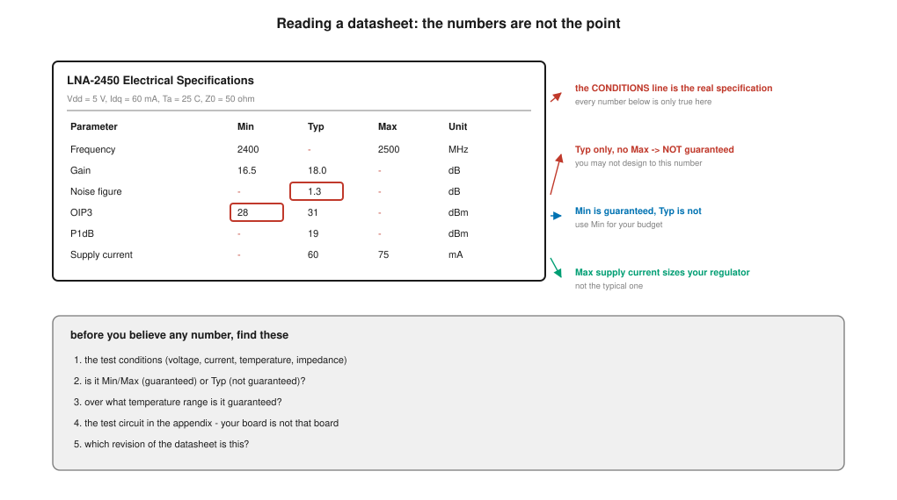
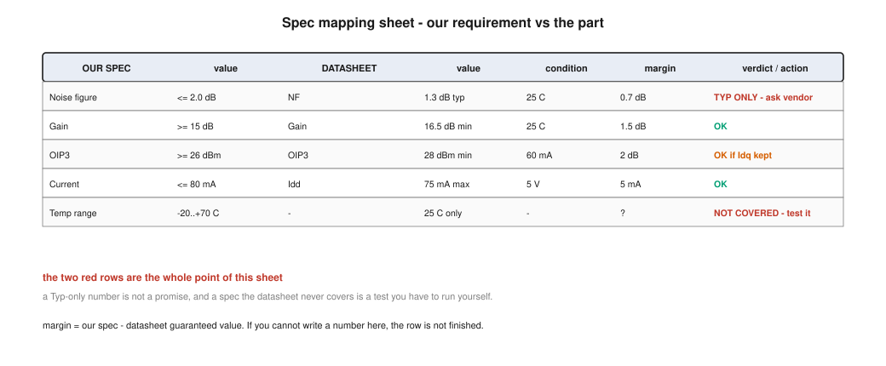
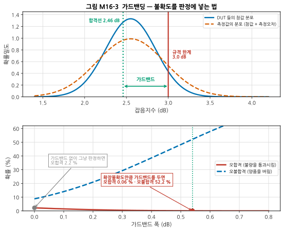
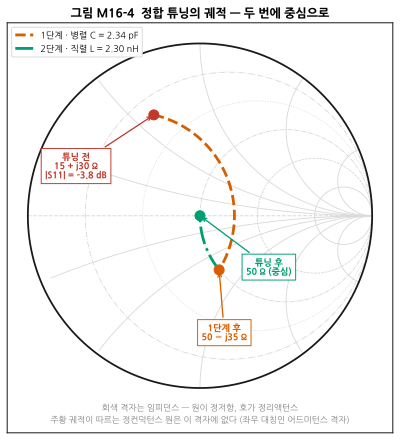
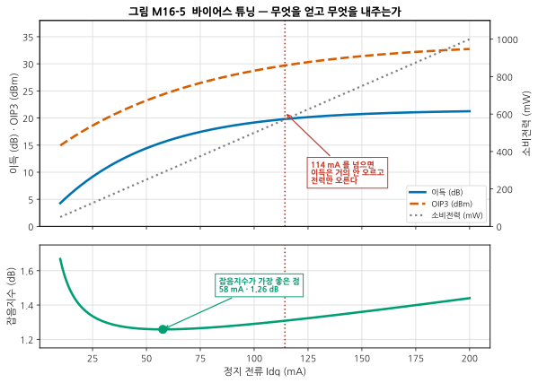
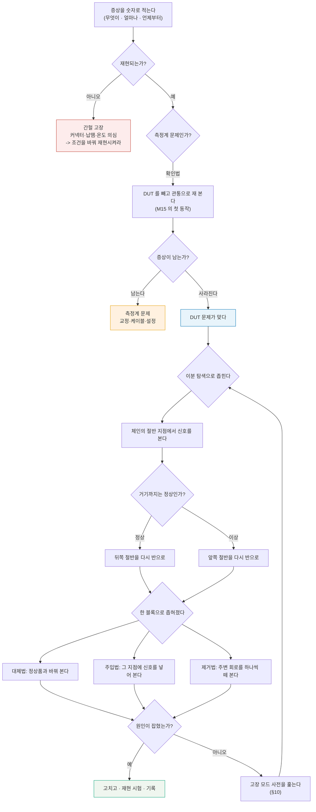
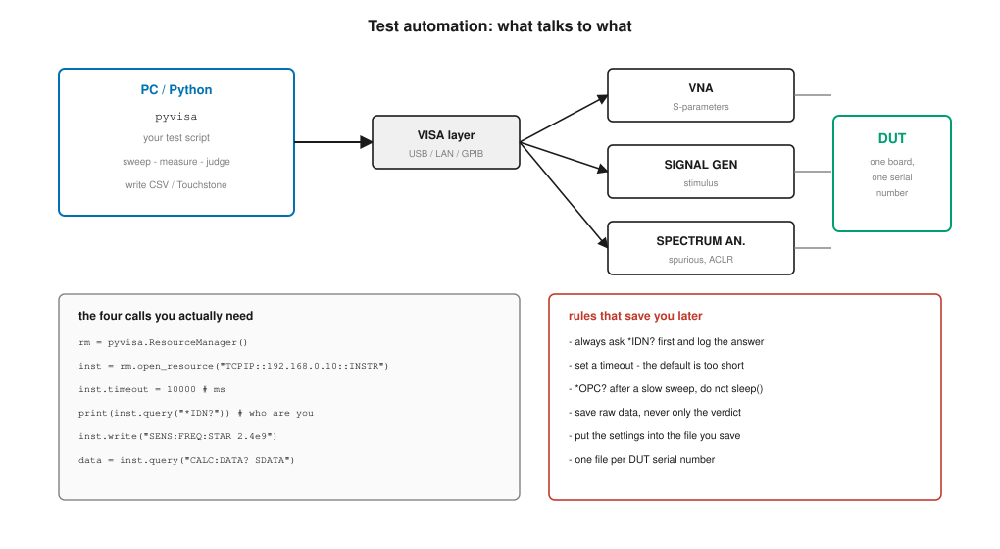

# M16 — DUT 스펙 검증, 튜닝, 디버그, 자동화

**문서 번호**: RF-CUR-M16 · **버전**: v1.1 · **분량**: 이론 5 h + 실습 9 h (아래 5종 실습 전체는 12 h이며, 그중 골라 씁니다 — [§M16.L](#m16l-실습) 참조)

| | |
|---|---|
| **선수 모듈** | [M14](./M14_정밀측정1_교정과불확도.md)·[M15](./M15_정밀측정2_잡음선형성위상잡음.md) (믿을 수 있는 측정), [M12](./M12_시스템예산설계.md) (스펙 플로우다운), [M03](./M03_S파라미터와스미스차트.md) (스미스 차트) |
| **이 모듈이 소유하는 개념** | **데이터시트 해부법**(전형값 vs 보증값, 측정 조건, 온도·전압 범위, 부록의 시험 회로), **시험 계획서 작성**, 시험 항목 도출, 합부 판정 기준과 **가드밴딩**, 측정 불확도를 반영한 판정, 시료 수와 통계, **튜닝 절차**(정합·바이어스·필터)와 튜닝 가능/불가능의 판별, **디버그 방법론**(이분 탐색, 대체법, 신호 주입·추적), 흔한 고장 모드 사전, **시험 자동화**(SCPI, VISA, PyVISA), 데이터 관리와 재현성, 시험 보고서 양식 |
| **이 모듈을 쓰는 후속 모듈** | M17(인증 시험), **캡스톤**(내가 만든 것을 내가 검증하고 고친다) |
| **학습 목표** | ① 데이터시트만 보고 "이 부품이 우리 스펙을 만족하는가"를 판정한다 ② 시험 계획서를 처음부터 작성한다 ③ 이상 현상을 다섯 단계 이내로 원인 축소한다 ④ 측정을 자동화한다 |

---

## M16.0 이 모듈의 범위

[M14](./M14_정밀측정1_교정과불확도.md)·[M15](./M15_정밀측정2_잡음선형성위상잡음.md)로 **믿을 수 있는 숫자**를 얻는 법을 갖췄습니다. 이제 그 숫자로 **판정하고, 안 되면 고칩니다.**

> **이 모듈의 질문은 세 개입니다.**
> 1. 이 부품이 우리 스펙을 만족하는가? (§1 ~ §5)
> 2. 안 되면 고칠 수 있는가? (§6 ~ §8)
> 3. 왜 안 되는지 어떻게 찾는가? (§9 ~ §10)
>
> 그리고 이 모든 것을 **다시 할 수 있게** 만드는 것이 §11 ~ §12입니다.

> ⚠️ **다른 모듈과의 역할 분리**
>
> | 개념 | M16 (여기) | 다른 모듈 |
> |---|---|---|
> | 측정 절차 | 여기서 **쓴다** | [M15](./M15_정밀측정2_잡음선형성위상잡음.md)가 소유 |
> | 불확도 | **판정에 넣는 법**(가드밴딩) | [M14 §10](./M14_정밀측정1_교정과불확도.md)이 계산법을 소유 |
> | 스펙 플로우다운 | 여기서 **부품에 매핑한다** | [M12 §8](./M12_시스템예산설계.md)이 소유 |
> | 정합 이론 | **튜닝 절차**로 쓴다 | [M03](./M03_S파라미터와스미스차트.md)·[M07](./M07_필터와수동네트워크.md)이 소유 |
> | 인증·규격 시험 | — | M17이 소유 |

---

## M16.1 데이터시트 해부 — 첫 장의 숫자를 믿지 마라



*그림 M16-1. **읽는 법**: 표의 숫자가 아니라 **조건 줄과 열 이름**이 진짜 정보입니다. 오른쪽 주석이 각 자리에서 무엇을 확인해야 하는지를 가리킵니다. 아래 상자는 어떤 데이터시트에서도 먼저 찾아야 할 다섯 가지입니다.*

> 📌 **조건 줄이 진짜 스펙입니다.** "Vdd = 5 V, Idq = 60 mA, Ta = 25 °C" 라고 적힌 한 줄 아래의 모든 숫자는 **그 조건에서만** 참입니다. 우리 보드가 3.3 V로 돌리거나 −20 °C에서 쓴다면, 그 표는 우리 얘기가 아닙니다.

**꼭 찾아야 할 다섯 가지**

| | 확인할 것 | 왜 |
|---|---|---|
| 1 | **시험 조건** (전압·전류·온도·임피던스) | 조건이 다르면 숫자도 다르다 |
| 2 | **Min/Max인가 Typ인가** | Typ은 약속이 아니다 |
| 3 | **보증 온도 범위** | 25 °C만 보증한 값이 흔하다 |
| 4 | **부록의 시험 회로** | 우리 보드는 그 보드가 아니다 |
| 5 | **문서 개정 번호** | 스펙이 조용히 바뀐다 |

---

## M16.2 Typical / Min / Max — 무엇이 약속인가

| 표기 | 뜻 | 설계에 쓸 수 있는가 |
|---|---|---|
| **Min / Max** | 제조사가 **보증**한다. 시험해서 벗어나면 불량품 | **쓸 수 있다** |
| **Typ** | 전형적인 값. 흔히 평균이거나 대표 개체의 값 | **못 쓴다** |
| Typ만 있고 Min/Max가 없음 | **보증이 없다** | 예산에 쓰면 안 된다 |

> ⚠️ **가장 흔한 사고: 잡음지수 Typ 값으로 링크 버짓을 짜는 것.** 잡음지수는 Typ만 적힌 경우가 매우 많습니다. [M12](./M12_시스템예산설계.md)의 예산에 Typ을 넣으면, **절반의 부품이 예산을 벗어납니다.**

> 📌 **Typ만 있을 때 실무의 세 가지 대응**
> 1. **제조사에 보증값을 요청한다** — 물량이 있으면 답을 준다
> 2. **직접 재서 분포를 만든다** — 여러 개체를 재 평균과 산포를 얻는다(§5)
> 3. **Typ에 여유를 얹는다** — 보통 Typ + 0.5 ~ 1 dB를 가정하고 근거를 기록한다
>
> **어느 쪽이든 "그래서 얼마로 가정했고 왜인가"를 적어야 합니다.** 적지 않으면 나중에 아무도 모릅니다.

---

## M16.3 스펙 매핑표 — 우리 스펙 ↔ 데이터시트



*그림 M16-2. 스펙 매핑표 양식. **읽는 법**: 왼쪽이 **우리가 필요한 것**, 가운데가 **데이터시트가 약속한 것**, 오른쪽이 **판정과 할 일**입니다. 빨간 두 줄이 이 표를 만드는 이유입니다 — Typ만 있는 항목과, 데이터시트가 아예 다루지 않는 항목입니다.*

| 열 | 적는 것 |
|---|---|
| 우리 스펙 | [M12](./M12_시스템예산설계.md)의 플로우다운에서 내려온 요구 |
| 데이터시트 값 | **보증값**을 적는다. Typ이면 그렇게 표시 |
| 조건 | 그 값이 성립하는 조건 |
| 마진 | 우리 스펙 − 데이터시트 보증값 |
| 판정·조치 | OK / 확인 필요 / 직접 시험 |

> 📌 **마진 칸에 숫자를 못 적으면 그 줄은 끝나지 않은 것입니다.** "아마 괜찮을 것"은 마진이 아닙니다.

> ⚠️ **데이터시트가 다루지 않는 항목이 가장 위험합니다.** 위 예의 마지막 줄처럼 온도 범위가 안 나와 있으면, 그건 "괜찮다"가 아니라 **"우리가 직접 시험해야 한다"** 는 뜻입니다. 시험 계획서에 항목으로 올라가야 합니다.

---

## M16.4 시험 계획서 — 무엇을 어떻게 잴 것인가

**시험 계획서**는 "무엇을, 어떤 조건에서, 어떤 장비로, 어떤 절차로 재서, 무엇을 기준으로 판정하는가"를 적은 문서입니다.

### 템플릿

| 항목 | 내용 | 예 |
|---|---|---|
| **시험 번호** | 추적용 고유 번호 | TP-LNA-003 |
| **대상** | 무엇을 재는가 | 잡음지수 |
| **근거** | 어느 요구에서 왔는가 | 시스템 요구 SR-12 (감도 −95 dBm) |
| **조건** | 주파수·온도·전압·레벨 | 2400~2500 MHz, 25 °C, 5.0 V |
| **장비** | 모델·교정 유효기간 | NF 분석기 XX (교정 2027-03까지) |
| **절차** | 단계별로. **누가 해도 같게** | ① 분석기 예열 30분 ② 잡음원 연결·교정 ③ DUT 연결 ④ … |
| **판정 기준** | 한계값과 **가드밴드** | NF ≤ 2.0 dB, 가드밴드 0.5 dB |
| **불확도** | 확장불확도와 근거 | ±0.55 dB (k = 2), 예산표 참조 |
| **시료 수** | 몇 개를 재는가 | 초도 5개, 양산 로트당 3개 |
| **기록** | 무엇을 남기는가 | 원본 데이터 + 설정 + 사진 |

> 📌 **절차 칸이 가장 중요합니다.** [M15 §12](./M15_정밀측정2_잡음선형성위상잡음.md)에서 본 대로, **재현성이 나쁘면 절차서가 부실한 것**입니다. "적당히 조인다"가 아니라 "토크 렌치로 0.9 N·m"라고 적어야 합니다.

### 시험 항목은 어디서 오는가

| 출처 | 예 |
|---|---|
| **시스템 요구** ([M12](./M12_시스템예산설계.md)의 플로우다운) | 감도, 차단, 출력 |
| **규격** (→ M17) | ACLR, 스퓨리어스, EIRP |
| **데이터시트가 안 다룬 것** (§3) | 온도 특성 |
| **과거의 실패** | 지난 프로젝트에서 문제 됐던 것 |
| **인터페이스** | 다른 팀과 만나는 지점 |

---

## M16.5 가드밴딩 — 불확도를 판정에 넣는 법

측정값이 한계값에 아슬아슬하면, **측정 불확도 때문에 판정이 뒤집힐 수 있습니다.**



*그림 M16-3. **읽는 법**: 위 칸에서 파란 곡선이 DUT들의 참값 분포, 주황 파선이 **측정값**의 분포입니다(참값에 측정오차가 더해져 더 넓습니다). 합격선을 한계에서 안쪽으로 당긴 폭이 **가드밴드**입니다. 아래 칸은 가드밴드를 넓힐 때 두 위험이 어떻게 움직이는지입니다.*

| 위험 | 뜻 | 누가 손해인가 |
|---|---|---|
| **오합격**(false accept) | 참값은 한계를 넘는데 합격 처리 | **고객** |
| **오불합격**(false reject) | 참값은 괜찮은데 불합격 처리 | **우리** |

이 예(한계 3.0 dB, DUT 평균 2.55 dB, 산포 0.30 dB, 측정 표준불확도 0.27 dB)의 결과입니다.

| 가드밴드 | 오합격 | 오불합격 |
|---|---|---|
| 없음 (측정값 그대로 판정) | **2.21 %** | 8.77 % |
| 0.27 dB (표준불확도 1배) | 0.56 % | 26.66 % |
| **0.54 dB (확장불확도, k = 2)** | **0.06 %** | **52.21 %** |

> ⚠️ **확장불확도만큼 가드밴드를 두면 오합격은 0.06 %로 떨어지지만, 양품의 절반을 버리게 됩니다.** 이것은 계산 실수가 아니라 이 예의 진짜 결과입니다 — **DUT 평균(2.55)이 한계(3.0)에 너무 가깝기 때문**입니다.
>
> **진짜 해법은 가드밴드를 조정하는 것이 아니라 설계 마진을 늘리는 것입니다.** 평균이 2.0 dB였다면 같은 가드밴드로도 버리는 것이 거의 없습니다. 가드밴딩은 **얇은 마진을 안전하게 만들어 주지 않습니다. 얇다는 사실을 드러낼 뿐입니다.**

> 📌 **판정 규칙(decision rule)은 계약 사항입니다.** 어떤 가드밴드를 쓸지, 아니면 안 쓸지는 **고객과 미리 합의**해야 합니다.
>
> | 방식 | 뜻 |
> |---|---|
> | **단순 수용**(위험 공유) | 측정값이 한계 안이면 합격. 불확도는 양쪽이 나눠 진다 |
> | **엄격 수용**(가드밴드) | 합격선을 안쪽으로 당긴다. 오합격을 줄인다 |
> | **엄격 거부** | 합격선을 바깥으로 민다. 오불합격을 줄인다 |
>
> 시험 성적서에는 **어떤 규칙을 썼는지 반드시 적습니다.**

---

## M16.6 튜닝 I — 정합



*그림 M16-4. 15 + j30 Ω인 부하를 두 소자로 50 Ω에 붙이는 궤적입니다. **읽는 법**: 주황이 **병렬 커패시터**로 어드미턴스를 따라 움직인 구간, 초록이 **직렬 인덕터**로 임피던스를 따라 중심으로 들어온 구간입니다.*

| 단계 | 소자 | 어디로 움직이나 |
|---|---|---|
| 1 | **병렬 C = 2.34 pF** | 정컨덕턴스 원을 따라, 15 + j30 Ω → **50 − j35 Ω** (실수부가 50 Ω) |
| 2 | **직렬 L = 2.30 nH** | 정저항 원을 따라, 남은 −j35 Ω을 상쇄해 **50 + j0 Ω**(중심)으로 |

> ⚠️ **그림에서 주황 궤적이 아무 회색 선도 따라가지 않는 것처럼 보입니다.** 회색 격자는 **임피던스** 격자(정저항 원 · 정리액턴스 호)인데, 병렬 소자가 따라 움직이는 것은 **어드미턴스** 격자의 정컨덕턴스 원이기 때문입니다. 어드미턴스 격자는 임피던스 격자를 중심에 대해 **좌우로 뒤집은** 모양이며, 이 그림에는 그리지 않았습니다(선이 두 배가 되면 궤적이 안 보입니다). 실물 튜닝에서는 VNA의 **이머턴스 차트**(immittance chart — impedance + admittance를 합친 말로, 두 격자를 겹쳐 그린 것) 표시를 켜면 두 격자가 함께 나옵니다. 스미스 차트 자체의 읽는 법은 [M03 §4](./M03_S파라미터와스미스차트.md)가 소유합니다.

입력 반사는 **|S11| −3.8 dB → −240 dB**(계산상 완전 정합)가 됩니다.

> 📌 **부호 규약을 섞지 마십시오.** 여기서는 VNA 화면과 같은 **|S11| (dB, 음수)** 로 씁니다. [M02 §3](./M02_전송선로.md)의 **반사손실(RL)** 은 같은 값의 **절댓값(양수)** 입니다 — 위 결과를 반사손실로 말하면 "3.8 dB → 240 dB"가 됩니다. 성적서에는 **어느 쪽 표기인지 반드시 밝혀야** 합니다.

> 📌 **튜닝의 순서에는 규칙이 있습니다.**
> 1. **먼저 실수부를 맞춘다** (병렬 소자로 정컨덕턴스 원 위를 이동)
> 2. **그다음 허수부를 없앤다** (직렬 소자로 정저항 원 위를 이동)
>
> 순서를 바꾸면 한 번에 안 되고 왔다 갔다 하게 됩니다.

> ⚠️ **근이 둘인데 하나는 존재하지 않는 부품입니다.** 실수부를 50 Ω으로 만드는 병렬 소자 값은 **두 개**가 나옵니다. 그중 하나를 고르면 다음 단계의 직렬 소자가 **음의 인덕턴스**가 됩니다 — 그런 부품은 없습니다. **다음 단계까지 계산해 보고 골라야 합니다.**
>
> (이 커리큘럼을 만들 때 실제로 이 실수를 해서 −2.30 nH가 나왔습니다. 계산은 맞았고 부품이 없었습니다.)

> 💡 **실물 튜닝의 요령**
> - **한 번에 하나만** 바꾸고 매번 기록한다
> - 부품값은 **E12 계열**로 살 수 있는 값만 시도한다
> - 스미스 차트에서 **어느 방향으로 움직이는지** 보며 다음 값을 고른다
> - 기생 성분 때문에 계산값과 다르다 — **계산은 출발점일 뿐**이다

---

## M16.7 튜닝 II — 바이어스



*그림 M16-5. **읽는 법**: 위 칸은 이득·OIP3(왼쪽 축)와 소비전력(오른쪽 축), 아래 칸은 잡음지수입니다. 잡음지수는 축이 달라 따로 그렸습니다.*

| 정지 전류 | 이득 | OIP3 | 잡음지수 | 소비전력 |
|---|---|---|---|---|
| 20 mA | 7.7 dB | 17.5 dBm | 1.39 dB | 100 mW |
| **60 mA** | 15.8 dB | 24.7 dBm | **1.26 dB** | 300 mW |
| 100 mA | 19.2 dB | 28.7 dBm | 1.29 dB | 500 mW |
| 160 mA | 20.9 dB | 31.8 dBm | 1.38 dB | 800 mW |

> 📌 **세 가지가 서로 다른 곳에서 최적입니다.**
> - **잡음지수**는 58 mA에서 가장 좋고(1.26 dB), 그보다 낮아도 높아도 나빠집니다
> - **이득**은 114 mA를 넘으면 거의 안 오릅니다 — 그 위로는 **전력만 씁니다**
> - **OIP3**는 계속 오릅니다 — 선형성이 필요하면 전력을 더 씁니다
>
> **"최적 바이어스"는 없습니다. 무엇을 중요하게 볼지 정해야 정해집니다.** [M15 §11](./M15_정밀측정2_잡음선형성위상잡음.md)의 로드풀과 같은 구조의 결정입니다.

> ⚠️ **바이어스를 바꾸면 데이터시트가 무효가 됩니다.** 데이터시트의 모든 값은 그 조건 줄에 적힌 전류에서 잰 것입니다(§1). 전류를 바꿨다면 **직접 다시 재야 합니다.**

### 세 번째 종류 — 필터 튜닝

정합·바이어스 다음으로 자주 만지는 것이 **필터**입니다. 원리는 [M07](./M07_필터와수동네트워크.md)이 소유하고, 여기서는 **손으로 무엇을 어떻게 돌리는가**만 정리합니다.

| 필터 종류 | 만지는 것 | 무엇이 움직이나 |
|---|---|---|
| **공동(cavity)·헬리컬 필터** | 공진기마다 있는 **튜닝 나사** | 나사를 조이면(안으로) 그 공진기의 **주파수가 내려간다** |
| | 공진기 **사이**의 결합 나사 | **대역폭**이 움직인다 |
| **집중소자(LC) 필터** | 칩 C·L 값 교체 | C를 키우면 주파수가 내려간다 |
| **마이크로스트립 필터** | 공진기 끝의 **튜닝 패드**를 인두로 잇거나 끊음 | 잇면 전기적 길이가 늘어 주파수가 내려간다 |

> 📌 **필터 튜닝의 순서**
> 1. **양 끝(입출력) 공진기부터** 맞춥니다 — 반사가 가장 크게 반응합니다
> 2. **가운데로 들어가며** 하나씩. 한 번에 하나만
> 3. 한 바퀴 돌면 **처음 것이 다시 어긋나 있습니다** — 공진기끼리 결합돼 있기 때문입니다. **두세 바퀴 반복**이 정상입니다
> 4. **주파수를 먼저, 대역폭을 나중에** 맞춥니다

> ⚠️ **필터 튜닝은 되돌릴 수 있게 하십시오.** 나사를 몇 바퀴 돌렸는지 적지 않고 헤매면 **원래 상태로 못 돌아갑니다.** 시작 전에 S11·S21을 저장하고, 매 조작마다 "3번 공진기 나사 ½바퀴 조임"처럼 적으십시오.

> 💡 **대역폭 자체가 모자라면 튜닝으로는 안 됩니다**(§8). 단수를 늘리거나 구조를 바꿔야 합니다.

---

## M16.8 튜닝으로 안 되는 것

> **가장 비싼 실수는 고칠 수 없는 것을 며칠씩 튜닝하는 것입니다.**

| 증상 | 튜닝으로 되나 | 판별법 |
|---|---|---|
| 정합이 조금 어긋남 | **된다** | 스미스 차트에서 목표까지 거리가 가깝다 |
| 이득이 1~2 dB 모자람 | 대개 **된다** | 바이어스·정합으로 회복되는지 본다 |
| 이득이 10 dB 모자람 | **안 된다** | 소자 선택이나 회로 구조의 문제 |
| 대역이 좁음 | **안 된다** | 정합 회로의 단수를 늘려야 한다(→ [M07](./M07_필터와수동네트워크.md)) |
| 발진 | **안 된다** | 안정도 문제. 회로를 고쳐야 한다(→ [M08 §7](./M08_증폭기.md)) |
| 잡음지수가 크게 나쁨 | **안 된다** | 앞단 손실이나 소자 자체. 배치 문제일 수 있다 |

> 📌 **판별의 기준은 "물리적으로 그 방향으로 갈 수 있는가"입니다.** 스미스 차트에서 목표가 손이 닿는 곳에 있으면 튜닝, 아니면 설계 변경입니다.

> ⚠️ **"조금만 더 만지면 될 것 같다"가 가장 위험한 신호입니다.** 두세 번 시도해서 방향이 안 잡히면, **왜 안 되는지를 먼저 이해**해야 합니다. §9의 디버그로 넘어갈 때입니다.

---

## M16.9 디버그 방법론 — 증상에서 원인으로



*그림 M16-6. 디버그 결정 트리. **읽는 법**: 세 가지 큰 갈림길이 있습니다 — **재현되는가**, **측정계 문제인가**, 그리고 **이분 탐색으로 어디까지 좁혔는가**. 이 순서를 지키면 대개 다섯 단계 안에 블록 하나로 좁혀집니다.*

| 방법 | 하는 일 | 언제 |
|---|---|---|
| **이분 탐색** | 체인의 절반 지점에서 신호를 본다 | 단이 여럿일 때. **가장 빠르다** |
| **대체법** | 정상품과 바꿔 본다 | 같은 물건이 두 개 있을 때 |
| **주입법** | 중간 지점에 신호를 직접 넣는다 | 앞단이 죽어 뒤를 못 볼 때 |
| **제거법** | 주변 회로를 하나씩 떼 본다 | 결합·간섭이 의심될 때 |

> 📌 **이분 탐색이 압도적으로 빠릅니다.** 8단짜리 체인이면 앞에서부터 하나씩 볼 때 **평균 4.5번**(고장 단이 어디든 똑같이 있을 확률이라면 (1+2+⋯+8)/8 = 4.5), 이분 탐색이면 **항상 3번**이면 끝납니다. 단이 많아질수록 차이가 커집니다 — 16단이면 **8.5번 대 4번**입니다.
>
> 하나씩 보는 방법은 단수에 **비례**해 늘고(n/2), 이분 탐색은 **로그**로 늘기(log₂n) 때문입니다.

> ⚠️ **한 번에 하나만 바꾸십시오.** 두 가지를 동시에 바꾸고 좋아지면, 무엇이 효과였는지 영원히 모릅니다. 그리고 **되돌릴 수 있게** 기록하십시오.

---

## M16.10 고장 모드 사전

증상을 원인으로 바꾸는 표입니다. **먼저 여기를 훑고 나서 파고드십시오.**

| 증상 | 흔한 원인 | 확인법 |
|---|---|---|
| **이득이 음수, 출력에 큰 잡음** | **발진** | 입력을 종단하고 스펙트럼을 본다. 신호가 있으면 발진 (→ [M08 §7](./M08_증폭기.md)) |
| 이득이 주파수에 따라 물결침 | 부정합에 의한 다중 반사 | 양쪽에 6 dB 감쇠기. 물결이 줄면 확진 |
| 잡음지수가 데이터시트보다 크게 나쁨 | 앞단 손실, 접지 불량 | 입력까지의 삽입손실을 따로 잰다 |
| 출력이 시간이 지나며 줄어듦 | **열** | 방열 상태 확인, 온도 측정 (→ [M08 §9](./M08_증폭기.md)) |
| 값이 만질 때마다 변함 | 커넥터·납땜 불량 | 토크 렌치 사용, 재납땜, 커넥터 점검 (→ [M04 §3](./M04_RF실험실입문.md)) |
| 전원 리플 주파수의 측파대 | 전원 잡음 | 전원에 LDO/필터 추가, 리플을 직접 잰다 |
| 특정 주파수에서만 스퍼 | 클럭 하모닉, 결합 | 클럭을 끄고 본다 (→ [M15 §8](./M15_정밀측정2_잡음선형성위상잡음.md)) |
| 보드마다 값이 크게 다름 | 부품 산포, 조립 편차 | 여러 개를 재 분포를 본다 |
| 저온에서만 불량 | 바이어스 표류 | 온도 시험. 바이어스 회로 온도 보상 확인 |
| 케이블을 움직이면 변함 | 케이블 열화, 커넥터 | 케이블 교체 (→ [M14 §11](./M14_정밀측정1_교정과불확도.md)) |

> 📌 **발진은 가장 먼저 배제하십시오.** 발진 중인 증폭기는 다른 모든 측정을 무의미하게 만듭니다. **입력을 50 Ω으로 종단하고 출력 스펙트럼을 보는 것**이 30초짜리 검사입니다.

---

## M16.11 자동화 — SCPI와 PyVISA



*그림 M16-7. **읽는 법**: 왼쪽이 파이썬 스크립트, 가운데가 VISA 계층, 오른쪽이 장비들입니다. 아래 왼쪽은 **스크립트를 시작하는 네 줄**(자원 관리자 → 장비 열기 → 타임아웃 → `*IDN?`), 아래 오른쪽은 **나중에 자기를 구해 주는 규칙들**입니다. 이 네 줄은 연결을 만드는 과정이고, 아래 표의 세 가지(`write`·`read`·`query`)는 연결이 생긴 뒤 주고받는 동작입니다.*

| 용어 | 원어 | 뜻 |
|---|---|---|
| **SCPI** | Standard Commands for Programmable Instruments | 장비에 보내는 **표준 명령어** 체계 |
| **VISA** | Virtual Instrument Software Architecture | USB·LAN·GPIB를 **같은 방식으로** 다루게 해 주는 계층 |
| **PyVISA** | — | VISA를 파이썬에서 쓰는 라이브러리 |

**세 가지 동작만 알면 됩니다.**

| 호출 | 하는 일 |
|---|---|
| `write(cmd)` | 명령을 보낸다. 답을 안 기다린다 |
| `read()` | 답을 기다려 읽는다 |
| `query(cmd)` | `write` 뒤에 `read`. **물음표로 끝나는 명령**에 쓴다 |

> 📌 **나중에 자기를 구해 주는 규칙들**
>
> | 규칙 | 왜 |
> |---|---|
> | **`*IDN?`를 먼저 묻고 기록한다** | 어느 장비로 쟀는지가 데이터의 일부다 |
> | **타임아웃을 늘린다** | 기본값이 짧아 긴 소인에서 그냥 실패한다 |
> | **`*OPC?`로 기다린다** | `sleep()`으로 어림잡으면 언젠가 깨진다 |
> | **원본을 저장한다** | 판정만 남기면 나중에 다시 볼 수 없다 |
> | **설정을 파일 안에 적는다** | 소인 범위·점수·IF 대역폭이 없으면 재현이 안 된다 |
> | **DUT 일련번호로 파일을 나눈다** | 어느 개체의 데이터인지 |

### 데이터 저장 규약

```
측정데이터/
  2026-08-20_LNA2450_초도/
    TP-LNA-003_잡음지수/
      DUT-SN0001_NF.csv        <- 원본
      DUT-SN0001_NF.s1p        <- S-파라미터는 Touchstone
      DUT-SN0001_설정.json      <- 장비 설정 그대로
      _시험계획서.md             <- 어떤 계획으로 쟀는가
      _장비목록.md               <- 모델·일련번호·교정 유효기간
    요약.csv                    <- 전체 판정표
```

> ⚠️ **판정만 남기지 마십시오.** "합격"이라는 글자는 6개월 뒤에 아무것도 말해 주지 않습니다. **원본과 설정이 함께 있어야** 다시 볼 수 있습니다.

---

## M16.12 보고서 — 재현 가능한 기록

> **재현 가능하다 = 다른 사람이 이 문서만 보고 같은 숫자를 얻을 수 있다.**

| 넣을 것 | 빠지면 생기는 일 |
|---|---|
| 측정값 **± 확장불확도** | 값이 얼마나 믿을 만한지 알 수 없다 |
| 판정 규칙(가드밴드 여부) | 합격의 의미가 사람마다 다르다 |
| 조건 (주파수·온도·전압·레벨) | 다른 조건에서 재고 다르다고 한다 |
| 장비 모델·일련번호·교정 유효기간 | 소급성이 끊긴다 (→ [M14 §10](./M14_정밀측정1_교정과불확도.md)) |
| 셋업 블록도와 사진 | 케이블 하나가 달라 재현이 안 된다 |
| **측정계 자신의 값** | DUT를 잰 건지 장비를 잰 건지 모른다 |
| 원본 데이터 위치 | 다시 볼 수 없다 |
| 시료 수와 개체별 값 | 한 개만 좋았던 건지 알 수 없다 |

### 시료 수

> 📌 **한 개를 재고 "합격"이라 적지 마십시오.** 부품에는 산포가 있습니다(§5의 파란 곡선). 개체 하나가 좋았다는 것은 **다음 개체도 좋다는 뜻이 아닙니다.**
>
> | 단계 | 권장 시료 수 |
> |---|---|
> | 초도 검증 | 최소 3~5개, 가능하면 서로 다른 로트 |
> | 설계 확정 | 온도·전압 꼭짓점 포함 |
> | 양산 | 로트당 표본 + 전수 항목 구분 |

---

## M16.L 실습

다섯 종을 다 하면 **12시간**입니다. 표준 배정(9시간)에서는 **아래 조합 중 하나를 고르십시오.**

| 목적 | 고를 실습 | 시간 |
|---|---|---|
| **장비가 없다** (Tier 0) | L16-a · L16-b · L16-d · L16-e | 9.5 h |
| **장비가 있다** (Tier 1/2) | L16-a · L16-c · L16-d · L16-e | 9.5 h |
| **최소 경로** | L16-a · L16-d · L16-e | 7 h |

> 📌 **L16-a와 L16-d는 어느 경로에서도 빠지지 않습니다.** 데이터시트를 못 읽으면 시험 항목이 안 나오고, 자동화를 못 하면 반복 측정이 사람 손에 묶입니다.

### L16-a — 데이터시트 해부와 스펙 매핑 (문서 실습, 2.5시간)

**목표**: 실제 부품 데이터시트 하나를 골라 우리 스펙과 대조합니다.

**대상**: 2.4 GHz 대역 LNA 아무거나 (제조사 웹사이트에서 PDF를 내려받습니다)

**절차**

1. **조건 줄을 먼저 찾아 적습니다.** 전압·전류·온도·임피던스
2. 각 파라미터가 **Min/Max인지 Typ인지** 표시합니다
3. **보증 온도 범위**를 찾습니다. 없으면 "없음"이라고 적습니다
4. **부록의 시험 회로**를 봅니다. 우리 보드와 무엇이 다른가?
5. §3의 매핑표를 채웁니다. 우리 스펙은 [M12](./M12_시스템예산설계.md)의 예산에서 가져옵니다
6. **마진을 못 적는 줄**을 표시하고, 각각에 대해 조치를 정합니다

**판정 기준**

| 항목 | 합격 |
|---|---|
| 조건 | 조건 줄을 정확히 인용했다 |
| 구분 | 보증값과 전형값을 구분해 표시했다 |
| 마진 | 모든 줄에 숫자 또는 "확인 필요"가 있다 |
| 조치 | Typ만 있는 항목의 대응을 정했다 |
| 누락 | 데이터시트가 안 다룬 항목을 시험 항목으로 올렸다 |

---

### L16-b — 시험 계획서 작성 (문서 실습, 2.5시간)

**목표**: 남이 그대로 따라 할 수 있는 시험 계획서를 씁니다.

**대상**: L16-a에서 고른 LNA

**절차**

1. §4의 템플릿으로 **최소 5개 항목**의 시험 계획을 씁니다
2. 각 항목의 **근거**(어느 요구에서 왔는가)를 적습니다
3. **절차를 단계별로** 씁니다. 옆 사람에게 주고 애매한 곳을 표시받으십시오
4. **불확도**를 [M15](./M15_정밀측정2_잡음선형성위상잡음.md)의 예산표로 계산해 넣습니다
5. **가드밴드**를 정하고 근거를 적습니다
6. 시료 수와 판정 방식을 정합니다

**판정 기준**

| 항목 | 합격 |
|---|---|
| 추적성 | 모든 시험 항목이 어느 요구에서 왔는지 적혀 있다 |
| 절차 | 옆 사람이 읽고 애매하다고 한 곳이 없다 |
| 불확도 | 숫자와 근거가 함께 있다 |
| 판정 | 가드밴드 여부와 이유가 적혀 있다 |
| 완결성 | 데이터시트가 안 다룬 항목이 포함돼 있다 |

---

### L16-c — 정합 튜닝 (Tier 1, 2.5시간)

**목표**: 일부러 어긋난 회로를 스미스 차트를 보며 맞춥니다.

**준비물**: NanoVNA, 평가 보드 또는 브레드보드, 칩 C·L 몇 종(E12 계열), 인두

**절차**

1. **일부러 어긋나게** 만듭니다 — 예: 종단에 15 Ω 저항 + 짧은 선로
2. 교정하고([M14](./M14_정밀측정1_교정과불확도.md)) S11을 스미스 차트로 봅니다. **위치를 기록**합니다
3. §6의 순서대로: **먼저 실수부**, **그다음 허수부**
4. 계산으로 값을 정하고, **E12에서 가장 가까운 값**으로 붙입니다
5. 매번 재고 **궤적을 그려** 나갑니다
6. 목표에 못 미치면 **왜 계산과 다른지** 생각합니다 (기생 성분·패드·배선)

**기록표**

| 시도 | 붙인 부품 | S11 (dB) | 스미스 위치 | 다음에 할 것 |
|---|---|---|---|---|
| 0 | (없음) | ___ | ___ | ___ |
| 1 | ___ | ___ | ___ | ___ |

**판정 기준**

| 항목 | 합격 |
|---|---|
| 순서 | 실수부 → 허수부 순서를 지켰다 |
| 기록 | 매 시도의 궤적이 남아 있다 |
| 개선 | S11이 목표까지 개선됐다 |
| 이해 | 계산값과 실제값의 차이를 설명할 수 있다 |

---

### L16-d — PyVISA 자동 측정 (Tier 0 → Tier 1/2, 3시간)

**목표**: 자동 측정 스크립트의 뼈대를 **장비 없이 먼저 완성**하고, 그다음 실제 장비에 붙입니다.

**절차 (Tier 0 — 장비 없이)**

1. 아래 스크립트를 `l16d.py`로 저장하고 실행합니다. **가짜 장비**가 들어 있어 하드웨어 없이 돌아갑니다.

```python
"""장비 없이도 돌려 볼 수 있는 자동 측정 스크립트.

진짜 장비는 pyvisa 로 붙지만, 여기서는 **가짜 장비**를 만들어 같은 SCPI 를
주고받는다. 스크립트의 뼈대와 저장 규약을 하드웨어 없이 먼저 완성해 두면,
장비 앞에 앉는 시간을 아낄 수 있다.

실제로 쓸 때는 MockVNA() 를 아래 두 줄로 바꾸기만 하면 된다.

    rm = pyvisa.ResourceManager()
    inst = rm.open_resource("TCPIP::192.168.0.10::INSTR")
"""
import csv
import math
import pathlib


class MockVNA:
    """SCPI 를 흉내 내는 가짜 VNA. 2.45 GHz 에 노치가 있는 DUT 를 물고 있다."""

    def __init__(self):
        self.start, self.stop, self.points = 2.0e9, 3.0e9, 11
        self.timeout = 10000
        self._log = []

    # ── pyvisa 와 같은 이름의 세 가지만 있으면 된다
    def write(self, cmd):
        self._log.append(cmd)
        if cmd.startswith("SENS:FREQ:STAR"):
            self.start = float(cmd.split()[-1])
        elif cmd.startswith("SENS:FREQ:STOP"):
            self.stop = float(cmd.split()[-1])
        elif cmd.startswith("SENS:SWE:POIN"):
            self.points = int(cmd.split()[-1])

    def query(self, cmd):
        self._log.append(cmd)
        if cmd == "*IDN?":
            return "MOCK,VNA-9000,SN12345,1.4.2"
        if cmd == "*OPC?":
            return "1"
        if cmd == "CALC:DATA? SDATA":
            return ",".join(f"{re:.6e},{im:.6e}" for re, im in self._sweep())
        raise ValueError(f"모르는 명령: {cmd}")

    def _sweep(self):
        """직렬 RLC 종단의 S11. 2.45 GHz 부근에서 정합된다."""
        out = []
        for i in range(self.points):
            f = self.start + (self.stop - self.start) * i / (self.points - 1)
            w = 2 * math.pi * f
            z = complex(45.0, w * 2.2e-9 - 1.0 / (w * 1.92e-12))
            g = (z - 50.0) / (z + 50.0)
            out.append((g.real, g.imag))
        return out


def sweep(inst, start_hz, stop_hz, points):
    """소인 한 번. 설정 -> 대기 -> 읽기 순서를 지킨다."""
    inst.write(f"SENS:FREQ:STAR {start_hz:.6e}")
    inst.write(f"SENS:FREQ:STOP {stop_hz:.6e}")
    inst.write(f"SENS:SWE:POIN {points}")
    # 소인이 끝날 때까지 기다린다. sleep() 로 어림잡지 않는다.
    assert inst.query("*OPC?").strip() == "1"
    raw = [float(x) for x in inst.query("CALC:DATA? SDATA").split(",")]
    freqs = [start_hz + (stop_hz - start_hz) * i / (points - 1)
             for i in range(points)]
    s11 = [complex(raw[2 * i], raw[2 * i + 1]) for i in range(points)]
    return freqs, s11


def save_touchstone(path, freqs, s11, comment):
    """Touchstone(.s1p) 로 저장한다. 설정을 주석으로 함께 남긴다."""
    with open(path, "w") as f:
        f.write(f"! {comment}\n")
        f.write("# HZ S RI R 50\n")
        for fr, s in zip(freqs, s11):
            f.write(f"{fr:.6e} {s.real:.6e} {s.imag:.6e}\n")


def save_csv(path, freqs, s11):
    with open(path, "w", newline="") as f:
        w = csv.writer(f)
        w.writerow(["freq_hz", "s11_db", "s11_deg"])
        for fr, s in zip(freqs, s11):
            w.writerow([f"{fr:.6e}",
                        f"{20*math.log10(abs(s)):.4f}",
                        f"{math.degrees(math.atan2(s.imag, s.real)):.3f}"])


def main():
    inst = MockVNA()

    # 규칙 1: 무엇과 이야기하고 있는지 먼저 확인하고 기록한다
    idn = inst.query("*IDN?")
    print(f"장비: {idn}")
    maker, model, serial, fw = idn.split(",")

    # 1단계: 성기게 훑어 노치가 대충 어디인지 본다
    freqs, s11 = sweep(inst, 2.0e9, 3.0e9, 11)
    db = lambda s: 20 * math.log10(abs(s))
    k = min(range(len(s11)), key=lambda i: abs(s11[i]))
    print(f"\n성긴 소인 (11점, 100 MHz 간격)")
    print(f"  가장 깊은 점: {freqs[k]/1e9:.3f} GHz 에서 {db(s11[k]):.2f} dB")

    # 2단계: 그 부근만 촘촘히 다시. 성긴 소인은 노치를 놓친다.
    span = (freqs[1] - freqs[0]) * 1.5
    freqs2, s11_2 = sweep(inst, freqs[k] - span, freqs[k] + span, 121)
    k2 = min(range(len(s11_2)), key=lambda i: abs(s11_2[i]))
    print(f"\n촘촘한 소인 (121점, {(freqs2[1]-freqs2[0])/1e6:.2f} MHz 간격)")
    print(f"  가장 깊은 점: {freqs2[k2]/1e9:.4f} GHz 에서 {db(s11_2[k2]):.2f} dB")
    print(f"  -> 성긴 소인은 노치를 {db(s11[k]) - db(s11_2[k2]):.2f} dB 얕게,"
          f" {abs(freqs[k]-freqs2[k2])/1e6:.0f} MHz 옆에서 봤다")

    freqs, s11 = freqs2, s11_2

    # 규칙 2: 판정만 남기지 말고 원본을 저장한다
    out = pathlib.Path(".")
    stem = f"DUT-{serial}_S11"
    # 주석은 **실제로 저장하는 데이터의 설정**을 적어야 한다.
    # 앞 단계의 설정을 그대로 베껴 적으면 나중에 아무도 재현하지 못한다.
    save_touchstone(out / f"{stem}.s1p", freqs, s11,
                    f"{model} fw {fw} | {freqs[0]/1e9:.3f}-{freqs[-1]/1e9:.3f} GHz"
                    f" | {len(freqs)} pts | IFBW 1 kHz")
    save_csv(out / f"{stem}.csv", freqs, s11)
    print(f"\n저장: {stem}.s1p · {stem}.csv")

    # 규칙 3: 판정은 가드밴드를 넣어서
    limit_db, guard_db = -10.0, 1.2
    worst = max(db(s) for s in s11)
    verdict = "합격" if worst <= limit_db - guard_db else (
        "판정보류" if worst <= limit_db else "불합격")
    print(f"\n판정: 최악 |S11| {worst:.2f} dB · 한계 {limit_db:.1f} dB · "
          f"가드밴드 {guard_db:.1f} dB -> {verdict}")

    print(f"\n주고받은 SCPI {len(inst._log)}줄:")
    for c in inst._log:
        print(f"  {c[:46]}")


if __name__ == "__main__":
    main()
```

2. **저장된 `.s1p` 파일을 열어** 주석 줄이 실제 소인 설정과 맞는지 확인합니다
3. **온도 시험 반복**을 추가합니다 — 온도마다 파일 이름을 다르게
4. **판정 기준을 바꿔** 보십시오. 가드밴드를 0으로 하면 판정이 달라지는가?

**절차 (Tier 1/2 — 실제 장비)**

5. `MockVNA()` 를 `pyvisa` 두 줄로 바꿉니다
6. **`*IDN?` 부터** 확인합니다. 응답이 없으면 주소·터미네이터·타임아웃을 봅니다
7. 실제 SCPI 명령어는 **장비 프로그래밍 매뉴얼**에서 확인합니다 (제조사마다 다릅니다)

**예상 결과 (Tier 0)**

```
장비: MOCK,VNA-9000,SN12345,1.4.2

성긴 소인 (11점, 100 MHz 간격)
  가장 깊은 점: 2.400 GHz 에서 -25.26 dB

촘촘한 소인 (121점, 2.50 MHz 간격)
  가장 깊은 점: 2.4500 GHz 에서 -25.57 dB
  -> 성긴 소인은 노치를 0.31 dB 얕게, 50 MHz 옆에서 봤다

저장: DUT-SN12345_S11.s1p · DUT-SN12345_S11.csv

판정: 최악 |S11| -21.94 dB · 한계 -10.0 dB · 가드밴드 1.2 dB -> 합격

주고받은 SCPI 11줄:
  *IDN?
  SENS:FREQ:STAR 2.000000e+09
  SENS:FREQ:STOP 3.000000e+09
  SENS:SWE:POIN 11
  *OPC?
  CALC:DATA? SDATA
  SENS:FREQ:STAR 2.250000e+09
  SENS:FREQ:STOP 2.550000e+09
  SENS:SWE:POIN 121
  *OPC?
  CALC:DATA? SDATA
```

**판정 기준**

| 항목 | 합격 |
|---|---|
| 재현 | 위 출력이 그대로 나온다 |
| 2단계 소인 | 성긴 소인이 노치를 놓치는 것을 확인했다 |
| 저장 | `.s1p` 주석이 **실제 저장한 데이터의 설정**과 맞는다 |
| 규칙 | `*IDN?`·타임아웃·`*OPC?`를 왜 쓰는지 설명할 수 있다 |
| 이식 | 실제 장비로 바꾸는 데 무엇이 필요한지 안다 |

**흔한 실수**

| 실수 | 증상 | 바로잡기 |
|---|---|---|
| `sleep()` 으로 소인을 기다림 | 가끔 이전 데이터를 읽는다 | `*OPC?` 를 쓴다 |
| 타임아웃 기본값 | 긴 소인에서 실패 | 넉넉히 늘린다 |
| 판정만 저장 | 나중에 다시 못 본다 | 원본을 저장 |
| 설정을 안 적음 | 재현 불가 | 파일 안에 함께 적는다 |

---

### L16-e — 디버그 트리 적용 (연습, 1.5시간)

**목표**: §9의 트리를 실제 증상 세 가지에 적용합니다.

**증상 A**: 증폭기의 이득이 데이터시트보다 8 dB 낮고, 출력 스펙트럼에 넓은 잡음이 보인다.

**증상 B**: 필터의 통과대역이 울퉁불퉁하고, 케이블을 만지면 모양이 바뀐다.

**증상 C**: 상온에서는 합격인데 −20 °C에서 이득이 3 dB 떨어진다. 상온으로 돌아오면 회복된다.

**각 증상에 대해 적으십시오**

1. 첫 번째로 할 **한 가지** 확인은 무엇인가?
2. 그 결과가 A면 다음은? B면 다음은?
3. 다섯 단계 안에 원인 후보를 **하나로** 좁혀 보십시오
4. §10의 사전에서 후보를 찾아 대조하십시오

**판정 기준**

| 항목 | 합격 |
|---|---|
| 순서 | 재현성 → 측정계 → 이분 탐색 순서를 지켰다 |
| 최소성 | 각 단계가 **한 가지만** 확인한다 |
| 수렴 | 다섯 단계 안에 좁혀졌다 |
| 근거 | 각 분기의 이유를 말할 수 있다 |

---

## M16.Q 확인 문제

<details>
<summary><b>Q1.</b> 데이터시트에 잡음지수가 "1.3 dB (typ)"으로만 적혀 있다. 링크 버짓에 1.3을 넣어도 되는가?</summary>

**안 됩니다.**

**Typ은 보증이 아닙니다.** 대개 평균이거나 대표 개체의 값이므로, **개체의 절반은 그보다 나쁩니다.** 이 값으로 예산을 짜면 생산품의 절반이 예산을 벗어납니다.

**세 가지 대응**

1. **제조사에 보증값을 요청** — 물량이 있으면 Min/Max를 받을 수 있습니다
2. **직접 재서 분포를 만든다** — 여러 개체(가능하면 여러 로트)를 재 평균과 산포를 구합니다
3. **Typ에 여유를 얹는다** — Typ + 0.5 ~ 1 dB를 가정하고 **근거를 기록**합니다

**어느 쪽이든 기록을 남겨야 합니다.** "1.8 dB로 가정 (Typ 1.3 + 0.5, 보증값 없음, 2026-08-20)"처럼 적어 두면 나중에 판단을 되짚을 수 있습니다.
</details>

<details>
<summary><b>Q2.</b> 측정값이 2.9 dB, 규격 한계가 3.0 dB, 확장불확도가 0.55 dB다. 합격인가?</summary>

**판정 규칙을 먼저 정해야 답할 수 있습니다.**

| 규칙 | 판정 | 뜻 |
|---|---|---|
| **단순 수용** | 합격 | 2.9 ≤ 3.0. 불확도 위험은 양쪽이 나눠 진다 |
| **엄격 수용** (가드밴드 0.55) | **불합격** | 합격선이 2.45 dB인데 2.9는 넘는다 |
| **엄격 거부** | 합격 | 3.55까지 합격 |

**참값이 3.0을 넘을 확률**은 대략 (2.9 → 3.0이 확장불확도의 0.18배이므로) 상당합니다 — 30 %대입니다. 즉 **"합격"이라고 적으면 세 번에 한 번은 틀립니다.**

**실무의 답**: 이 상황은 **판정을 보류하고 다시 재는** 자리입니다. 그리고 근본적으로는 **설계 마진이 얇다**는 신호입니다(§5).

**중요**: 어떤 규칙을 쓸지는 **고객과 미리 합의**하고 성적서에 적어야 합니다.
</details>

<details>
<summary><b>Q3.</b> 확장불확도만큼 가드밴드를 뒀더니 양품의 절반이 불합격으로 나온다. 가드밴드를 줄여야 하는가?</summary>

**가드밴드를 줄이는 것은 증상을 가리는 것입니다.**

본문 §5의 예에서 확장불확도(0.54 dB)만큼 가드밴드를 두면 오합격은 2.21 % → **0.06 %** 로 떨어지지만 오불합격이 **52 %** 가 됩니다.

**왜 이렇게 되는가**: DUT 평균(2.55 dB)이 한계(3.0 dB)에 **너무 가깝기** 때문입니다. 마진이 0.45 dB밖에 없는데 가드밴드를 0.54 dB 두면 당연히 대부분이 걸립니다.

**진짜 해법은 셋 중 하나입니다.**

1. **설계 마진을 늘린다** — 평균이 2.0 dB면 같은 가드밴드로도 거의 안 버립니다. **가장 옳은 답**
2. **측정 불확도를 줄인다** — [M15 §3](./M15_정밀측정2_잡음선형성위상잡음.md)처럼 ENR 불확도와 부정합을 줄이면 가드밴드도 좁아집니다
3. **부품 산포를 줄인다** — 선별하거나 더 좋은 공급처로

**가드밴딩은 얇은 마진을 안전하게 만들어 주지 않습니다. 얇다는 사실을 드러낼 뿐입니다.**
</details>

<details>
<summary><b>Q4.</b> 정합 튜닝에서 병렬 소자 값이 두 개 나왔다. 아무거나 골라도 되는가?</summary>

**안 됩니다. 하나는 존재하지 않는 부품으로 이어집니다.**

실수부를 50 Ω으로 만드는 병렬 서셉턴스는 ±로 두 값이 나옵니다. 한쪽을 고르면 남는 리액턴스가 **양(+)** 이 되어 직렬 소자로 **음의 인덕턴스**가 필요해집니다 — 그런 부품은 없습니다.

**본문 §6의 예**: 15 + j30 Ω 부하에서
- 병렬 C = 1.12 pF를 고르면 → 직렬 L = **−2.30 nH** (불가능)
- 병렬 C = **2.34 pF**를 고르면 → 직렬 L = **+2.30 nH** (가능) ✓

**규칙**: **다음 단계까지 계산해 보고 고릅니다.** 두 소자가 모두 양수로 나오는 조합만 실현 가능합니다.

**덧붙여**: 직렬 소자를 커패시터로 쓰는 구성(병렬 L → 직렬 C)도 있습니다. 어느 구성을 쓸지는 **대역폭과 직류 차단 필요 여부**로 정합니다(→ [M07](./M07_필터와수동네트워크.md)).
</details>

<details>
<summary><b>Q5.</b> LNA의 정지 전류를 얼마로 정할 것인가?</summary>

**무엇을 중요하게 볼지 정해야 정해집니다. "최적 바이어스"는 없습니다.**

본문 §7의 예에서 세 가지가 서로 다른 곳에서 최적입니다.

| 목표 | 고를 전류 | 이유 |
|---|---|---|
| **잡음지수 최우선** (수신 앞단) | **58 mA** | 1.26 dB로 가장 좋다 |
| **선형성 최우선** (강한 간섭 환경) | 높게 | OIP3는 계속 오른다 |
| **전력 최우선** (배터리) | 낮게 | 20 mA면 100 mW |
| **균형** | 60 ~ 100 mA | 이득 16~19 dB, 전력 300~500 mW |

**꼭 알아야 할 두 가지**

1. **114 mA를 넘으면 이득은 거의 안 오르고 전력만 씁니다.** 그 위로 올릴 이유는 OIP3뿐입니다
2. **잡음지수는 58 mA에서 최소이고 양쪽으로 나빠집니다.** 전류를 무작정 올리면 오히려 나빠집니다

**그리고**: 데이터시트의 모든 값은 그 조건 줄의 전류에서 잰 것입니다. **전류를 바꿨으면 직접 다시 재야 합니다.**
</details>

<details>
<summary><b>Q6.</b> 8단짜리 수신 체인에서 신호가 안 나온다. 어떻게 찾는가?</summary>

**이분 탐색입니다.**

1. **4단과 5단 사이**에서 신호를 봅니다
2. 신호가 있으면 → 문제는 뒤쪽 4단. 없으면 → 앞쪽 4단
3. 그 절반의 가운데를 다시 봅니다
4. 3번 만에 한 단으로 좁혀집니다

| 방법 | 8단에서 평균 횟수 | 16단에서 | 늘어나는 방식 |
|---|---|---|---|
| 앞에서부터 하나씩 | 4.5번 | 8.5번 | 단수에 비례 (n/2) |
| **이분 탐색** | **3번** | **4번** | 로그 (log₂n) |

*(고장 단이 어느 자리에나 똑같이 있을 확률이라고 볼 때. 8단이면 (1+2+⋯+8)/8 = 4.5번입니다.)*

**그 전에 할 것이 있습니다.**

1. **재현되는가?** — 간헐이면 커넥터·납땜·온도를 먼저 의심
2. **측정계 문제인가?** — DUT를 빼고 관통으로 재 본다 ([M15 §7](./M15_정밀측정2_잡음선형성위상잡음.md)의 첫 동작)

이 둘을 건너뛰고 이분 탐색부터 하면, 없는 고장을 몇 시간씩 찾게 됩니다.

**한 단으로 좁힌 뒤**에는 대체법(정상품과 교체) · 주입법(그 지점에 신호 주입) · 제거법(주변 회로 제거)으로 확정합니다.
</details>

<details>
<summary><b>Q7.</b> 증폭기의 이득이 음수로 나오고 출력에 넓은 잡음이 보인다. 무엇을 먼저 의심하는가?</summary>

**발진입니다. 그리고 30초 만에 확인할 수 있습니다.**

**확인법**: 입력을 **50 Ω으로 종단**하고 출력 스펙트럼을 봅니다. 입력이 없는데 어떤 주파수에 신호가 서 있으면 **발진 중**입니다.

**왜 먼저 확인하는가**: 발진 중인 증폭기는 **다른 모든 측정을 무의미하게 만듭니다.** 이득도 잡음지수도 선형성도 전부 엉뚱한 값이 나옵니다. 그 값들로 몇 시간을 분석해 봐야 헛수고입니다.

**발진의 흔한 원인**

| 원인 | 대응 |
|---|---|
| 안정도 부족 | 저항을 넣어 안정화 (→ [M08 §7](./M08_증폭기.md)) |
| 출력에서 입력으로 결합 | 차폐, 배치 변경 |
| 전원 임피던스 | 디커플링 보강 |
| 접지 불량 | 접지 비아·접지면 확인 |

**튜닝으로는 안 됩니다**(§8). 발진은 **회로를 고쳐야** 하는 문제입니다.
</details>

<details>
<summary><b>Q8.</b> 자동 측정 스크립트에서 가끔 이전 소인의 데이터가 읽힌다. 왜인가?</summary>

**소인이 끝나기 전에 데이터를 읽고 있습니다.**

`write()` 로 소인을 시작해도 **명령이 돌아온 것과 소인이 끝난 것은 다릅니다.** 장비는 명령을 받자마자 응답하고, 소인은 그 뒤에 진행됩니다.

**틀린 방법**

```python
inst.write("INIT")
time.sleep(2)                 # 2초면 되겠지
data = inst.query("CALC:DATA? SDATA")
```

`sleep()` 은 어림짐작입니다. 점수를 늘리거나 IF 대역폭을 낮추면 소인이 길어져 **언젠가 깨집니다.**

**옳은 방법**

```python
inst.write("INIT")
inst.query("*OPC?")           # 끝날 때까지 여기서 기다린다
data = inst.query("CALC:DATA? SDATA")
```

`*OPC?` 는 **앞의 동작이 모두 끝날 때까지 응답하지 않습니다.** 소인이 얼마나 걸리든 정확히 기다립니다.

**함께 볼 것**: `*OPC?` 가 오래 걸리므로 **타임아웃을 넉넉히** 잡아야 합니다. 기본값은 대개 너무 짧습니다.
</details>

---

## M16.13 한 장 요약

| 무엇 | 한 줄 | 절 |
|---|---|---|
| 데이터시트 | **조건 줄이 진짜 스펙**. 숫자는 그 조건에서만 참 | §1 |
| 다섯 가지 | 조건·보증여부·온도범위·시험회로·개정번호 | §1 |
| Typ | **약속이 아니다.** 예산에 넣으면 절반이 벗어난다 | §2, Q1 |
| Typ 대응 | 보증값 요청 · 직접 측정 · 여유 얹기 — **근거를 기록** | §2 |
| 스펙 매핑표 | **마진 칸에 숫자를 못 적으면 끝나지 않은 것** | §3 |
| 가장 위험한 줄 | 데이터시트가 **안 다룬** 항목 → 직접 시험 | §3 |
| 시험 계획서 | 항목·조건·장비·절차·판정·불확도·시료 수 | §4 |
| 절차 칸 | 재현성이 나쁘면 **절차서가 부실한 것** | §4 |
| 가드밴딩 | 오합격을 줄이면 **오불합격이 는다** | §5 |
| 이 예 | 확장불확도만큼 두면 오합격 0.06 %, 오불합격 52 % | §5 |
| 진짜 해법 | 가드밴드가 아니라 **설계 마진** | §5, Q3 |
| 판정 규칙 | **계약 사항.** 성적서에 반드시 적는다 | §5, Q2 |
| 정합 튜닝 순서 | **실수부 먼저, 허수부 나중** | §6 |
| 근이 둘 | 하나는 **음의 인덕턴스**로 이어진다. 다음 단계까지 보고 고른다 | §6, Q4 |
| 바이어스 | 잡음지수·이득·OIP3·전력이 **다른 곳에서 최적** | §7, Q5 |
| 이득 무릎 | 넘으면 이득은 안 오르고 **전력만 쓴다** | §7 |
| 바꿨으면 | 데이터시트가 무효. **다시 재야 한다** | §7 |
| 필터 튜닝 | **양 끝부터 가운데로**, 주파수 먼저 대역폭 나중, **두세 바퀴 반복** | §7 |
| 튜닝 불가 | 발진·큰 이득 부족·대역 부족은 **설계 문제** | §8 |
| 디버그 순서 | 재현성 → **측정계** → 이분 탐색 | §9, Q6 |
| 이분 탐색 | 8단이면 3번(하나씩은 평균 4.5번), 16단이면 4번 대 8.5번 | §9, Q6 |
| 한 번에 하나 | 두 개를 동시에 바꾸면 무엇이 효과인지 모른다 | §9 |
| 발진 | **가장 먼저 배제.** 입력 종단하고 스펙트럼 보기 30초 | §10, Q7 |
| SCPI 3동작 | `write` · `read` · `query` | §11 |
| 자동화 규칙 | `*IDN?` · 타임아웃 · **`*OPC?`** · 원본 저장 · 설정 기록 | §11, Q8 |
| `sleep()` | 어림짐작이라 언젠가 깨진다. `*OPC?` 를 쓴다 | §11, Q8 |
| 보고서 | 값 ± 불확도 + 조건 + 장비 + **측정계 자신의 값** | §12 |
| 시료 수 | 한 개를 재고 합격이라 적지 않는다 | §12 |

---

## M16.A 이 모듈의 축약어

| 약어 | 영문 원어 | 한글 |
|---|---|---|
| SCPI | Standard Commands for Programmable Instruments | 프로그램 가능 계측기 표준 명령어 |
| VISA | Virtual Instrument Software Architecture | 가상 계측기 소프트웨어 구조 |
| DUT | Device Under Test | 피시험 소자 (→ M14) |
| LNA | Low Noise Amplifier | 저잡음 증폭기 (→ M08) |
| NF | Noise Figure | 잡음지수 (→ M08) |
| OIP3 | Output Third-order Intercept Point | 출력 3차 절점 (→ M08) |
| P1dB | 1 dB Compression Point | 1 dB 압축점 (→ M08) |
| VNA | Vector Network Analyzer | 벡터 네트워크 분석기 (→ M05·M14) |
| CSV | Comma-Separated Values | 쉼표로 나눈 값 (파일 형식) |
| GPIB | General Purpose Interface Bus | 범용 계측기 인터페이스 버스 |
| USB | Universal Serial Bus | 범용 직렬 버스 (장비 연결 수단) |
| LAN | Local Area Network | 근거리 통신망 (장비 연결 수단) |
| LDO | Low Dropout regulator | 저전압강하 레귤레이터 |
| E12 | — | 부품값 표준 계열 (10 % 간격, 한 자릿수당 12종) |
| Typ | Typical | 전형값. **보증이 아니다** (§2) |
| Min / Max | Minimum / Maximum | 최솟값 / 최댓값. 제조사가 **보증**하는 값 (§2) |
| RL | Return Loss | 반사손실. \|S11\|의 **절댓값**(양수) (→ M02) |
| IF | Intermediate Frequency | 중간주파수. 여기서는 "IF 대역폭"= 수신 필터 폭 (→ M05·M09) |
| ENR | Excess Noise Ratio | 초과잡음비. 잡음원의 세기 (→ M15) |
| ACLR | Adjacent Channel Leakage Ratio | 인접채널 누설비 (→ M13) |
| EIRP | Equivalent Isotropically Radiated Power | 등가등방복사전력 (→ M10·M12) |
| ISO/IEC | International Organization for Standardization / International Electrotechnical Commission | 국제표준화기구 / 국제전기기술위원회 |
| LC | Inductor-Capacitor | 인덕터-커패시터 |
| RF | Radio Frequency | 무선 주파수 |

---

## M16.S 출처

| 내용 | 출처 | 등급 | 교차검증 |
|---|---|---|---|
| 가드밴딩, 판정 규칙, 오합격·오불합격 | [ISOBudgets — *Guard Banding: How to Take Uncertainty Into Account*](https://www.isobudgets.com/guard-banding-how-to-take-uncertainty-into-account/) · [ISOBudgets — *Statements of Conformity and Decision Rules for ISO 17025*](https://www.isobudgets.com/statements-of-conformity-and-decision-rules/) · [Tektronix — *Decision Rule Guide*](https://www.tek.com/en/documents/service/tektronix-decision-rule-guide) · [SATRA — *Uncertainty, ISO/IEC 17025:2017 and decisions made on conformity*](https://www.satra.com/spotlight/article.php?id=546) | C, C, B, C | **4건** |
| 불확도 기반 판정 (계측 표준) | [EURAMET Calibration Guide No. 12](https://www.euramet.org/Media/news/I-CAL-GUI-012_Calibration_Guide_No._12.web.pdf) | **A** | — |
| PyVISA 기본 (write/read/query, 타임아웃) | [PyVISA — *Communicating with your instrument*](https://pyvisa.readthedocs.io/en/latest/introduction/communication.html) · [PyVISA — *SCPI Commands*](https://www.pyvisa.org/docs/scpi-commands-python) · [Gough's Tech Zone — *SCPI Automation with PyVISA*](https://goughlui.com/2021/03/28/tutorial-introduction-to-scpi-automation-of-test-equipment-with-pyvisa/) | B, B, D | **3건** |
| 파이썬 계측 자동화 | [Keysight 백서 5992-4268 — *Instrument Automation with Python*](https://www.keysight.com/us/en/assets/7018-06894/white-papers/5992-4268.pdf) · [Keysight KB — *Automate Keysight Instruments Using Python*](https://docs.keysight.com/kkbopen/getting-started-automate-keysight-instruments-using-python-3-9-845872587.html) | B, B | 2건 |
| 시험 전략 수립이 RF 시스템 엔지니어의 업무임 | [Velvet Jobs — RF Systems Engineer](https://www.velvetjobs.com/job-descriptions/rf-systems-engineer) | D | (M00과 동일 출처) |

> 📌 **본문에서 직접 계산·검산한 항목** — 재현 방법은 `scripts/gen_fig_m16.py` 실행입니다(16개 검산 항목이 출력됩니다).
>
> - **가드밴딩의 오합격·오불합격 확률을 해석식(이변량 정규분포)과 몬테카를로 400만 회로 각각 계산해 대조**했고 0.05 %p 안에서 일치했습니다
> - 모집단을 한계선 위아래로 옮기면 두 위험의 대소가 뒤집히는 것을 확인
> - **정합 튜닝의 최종 반사계수를 손으로 쓴 변환식과 scikit-rf 조립으로 각각 계산해 대조**했습니다(차이 2.6×10⁻¹⁶ — 배정밀도 부동소수점의 한계 수준)
> - 병렬 소자의 두 근 중 하나가 음의 인덕턴스로 이어지는 것을 확인
> - 바이어스에 따른 이득·OIP3·잡음지수·소비전력의 서로 다른 최적점

> ⚠️ **URL 확인 안내**: 작성 환경의 조직 정책상 외부 사이트를 직접 열 수 없어, 검색 결과의 서지 정보와 요약을 교차 대조하는 방식으로 검증했습니다. 링크의 최신 유효성은 독자가 확인해 주십시오. 배경은 [M00.S](./M00_RF시스템엔지니어링이란.md#m00s-출처) 참조.

> ⚠️ **판정 규칙에 대하여**: ISO/IEC 17025는 판정 규칙을 정하고 **기록할 것**을 요구하지만, 어떤 수식이나 위험 모형을 쓰라고 지정하지는 않습니다. 본문의 계산은 **불확도가 판정을 어떻게 흔드는지 보이기 위한 예**이며, 실제 적용은 고객·시험소와의 합의와 해당 분야의 관행을 따라야 합니다.

---

## 다음 모듈

**[M17 — RF 보드 설계와 인증](./M17_보드설계와인증.md)**

M16까지로 **재고 판정하고 고치는** 일을 갖췄습니다. M17은 그 앞 단계 — **처음부터 잘 만드는 법**(보드 배치, 접지, 차폐)과 마지막 단계 — **인증 시험**을 다룹니다.

---

## 변경 이력

| 버전 | 일자 | 내용 |
|---|---|---|
| v1.0 | 2026-08-20 | 최초 작성. 시각자료 10종(데이터 플롯 3 + SVG 3 + Mermaid 1 + 표 양식 3), 실습 5종, 확인 문제 8문항 |
| v1.1 | 2026-08-21 | **검토 3회 반영.** ① *사실*: 순차 탐색 평균 횟수를 4번·8번 → **4.5번·8.5번**으로 바로잡고 근거식 추가 · 반사손실 부호 규약이 [M02 §3](./M02_전송선로.md)과 어긋나 **\|S11\|(음수) 표기로 통일**하고 두 표기의 관계를 명시 · scikit-rf 대조값 2.8 → **2.6×10⁻¹⁶** · 시험 절차 예시의 "STEP1"을 실제 절차로 교체 · "토크 렌케" → **토크 렌치** ② *교육*: 설계서 §5가 요구한 **필터 튜닝**이 빠져 있어 §7에 신설 · 그림 M16-4에서 주황 궤적이 회색 격자를 따르지 않는 이유(임피던스 격자 vs 어드미턴스 격자)를 그림과 본문 양쪽에 설명 · 축약어 **13개 추가**(Typ·Min/Max·RL·IF·ENR·ACLR·EIRP·USB·LAN·ISO/IEC 등) ③ *구조*: 실습 5종 합계가 12 h인데 머리말은 9 h여서 **경로별 선택표** 신설 · 그림 캡션 번호와 그림 안 번호 대조 · 상호참조 12건 전부 대상 절 존재 확인 · 본문 코드 블록을 실행해 **예상 결과와 문자 단위 일치** 확인 · 그림 M16-3의 두 라벨과 M16-4의 설명 상자가 곡선·제목을 덮던 것을 수정 |
