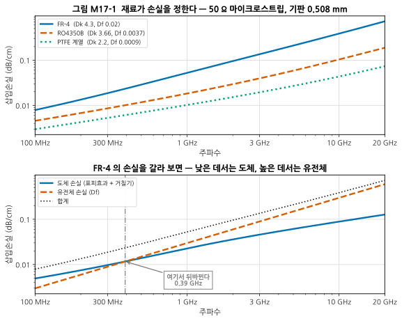
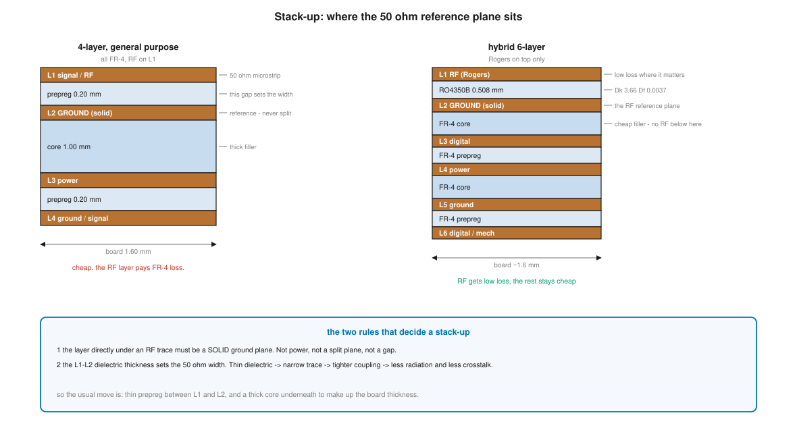
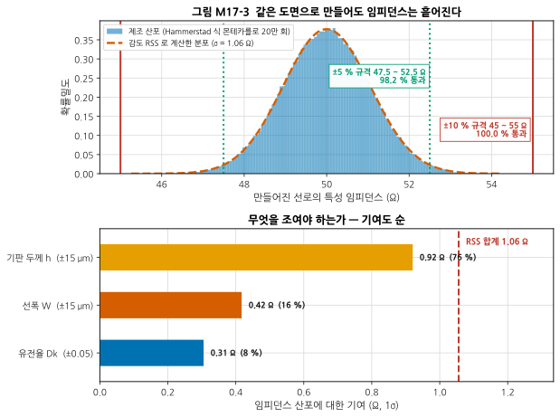
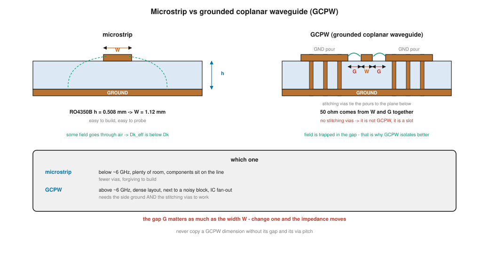
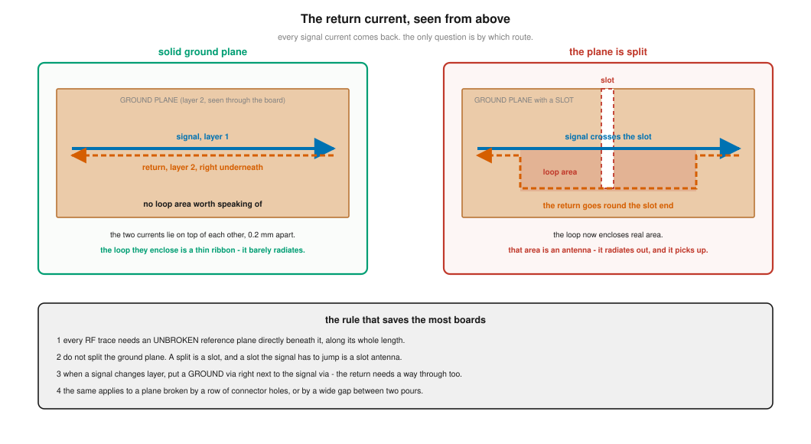
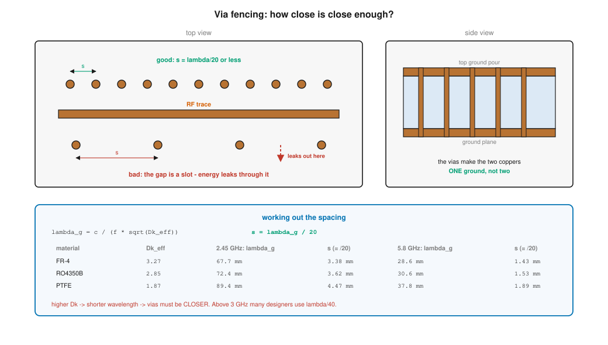
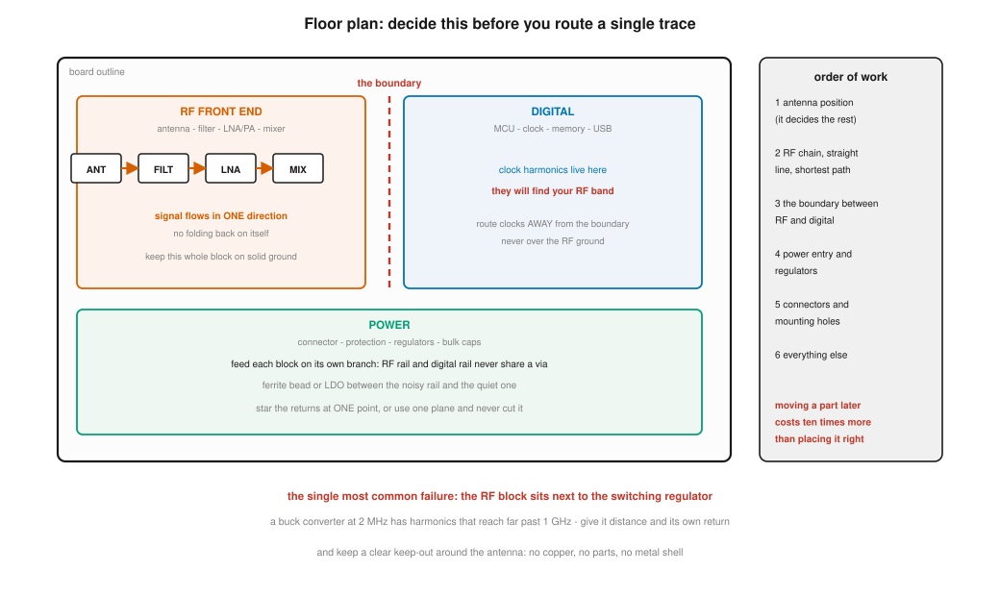
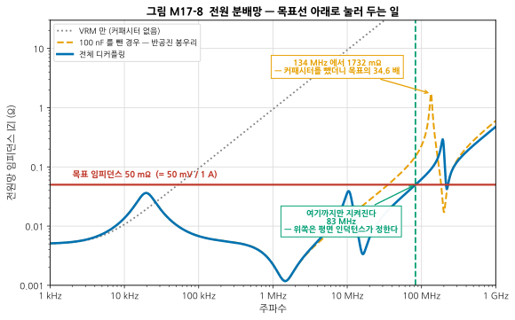
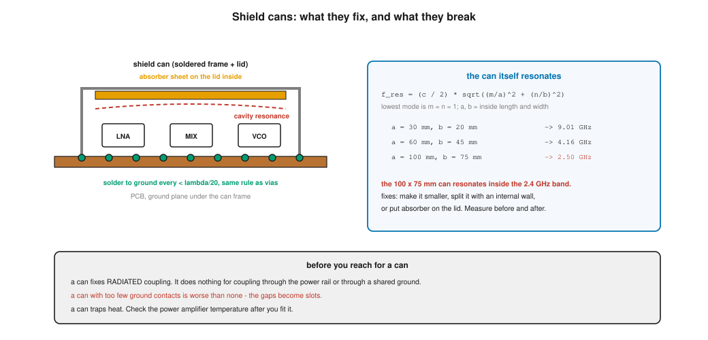
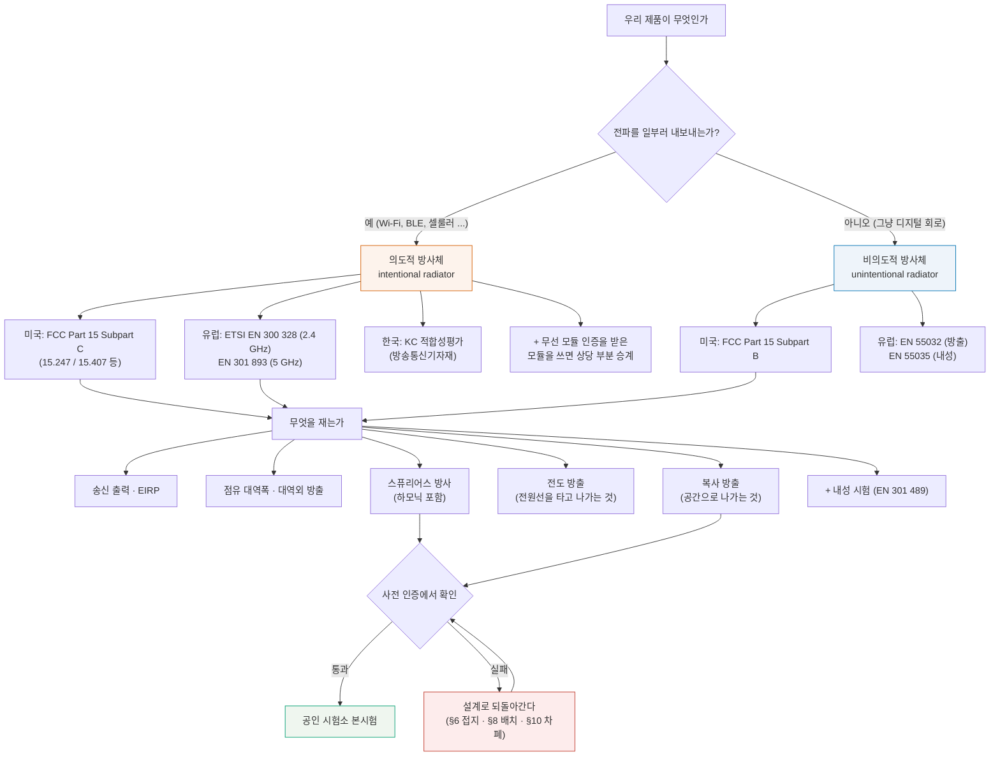

# M17 — RF 보드 설계와 인증

**문서 번호**: RF-CUR-M17 · **버전**: v1.1 · **분량**: 이론 6 h + 실습 10 h (아래 5종 실습 전체는 14 h이며, 그중 골라 씁니다 — [§M17.L](#m17l-실습) 참조)

| | |
|---|---|
| **선수 모듈** | [M02](./M02_전송선로.md) (전송선로·Dk/Df), [M06](./M06_수동소자와공진.md) (커패시터의 SRF), [M12](./M12_시스템예산설계.md) (스펙 플로우다운), [M13](./M13_변조와신호품질.md) (규격 문서 체계), [M16](./M16_DUT검증과튜닝과자동화.md) (시험 계획) |
| **이 모듈이 소유하는 개념** | **기판 재료와 스택업**(FR-4의 한계, Rogers 계열, PTFE, 하이브리드 스택업), Dk/Df의 주파수·온도 의존, 동박 거칠기와 손실, **임피던스 설계와 제조 공차**, 마이크로스트립/GCPW 레이아웃 규칙, **비아 스티칭·펜싱과 λ/20 규칙**, 접지 설계(연속 기준면, 분할 금지)와 **리턴 패스**, 부품 배치 순서, RF-디지털 분리, **전원 분배망(PDN)과 디커플링**, 실드 캔, 열 설계와 열비아, ESD 보호, 안테나 배치와 클리어런스, 커넥터·런치 설계, 제조성(DFM)·조립·리워크, **EMC와 인증**, 사전 인증 시험 |
| **이 모듈을 쓰는 후속 모듈** | **캡스톤**(설계 → 제작 → 측정 → 튜닝의 전 과정) |
| **학습 목표** | ① 목표 주파수·성능·비용에 맞는 스택업을 결정한다 ② 50 Ω 선로를 실제 제조 공차 안에서 설계한다 ③ 인증 시험에서 떨어질 위험 지점을 설계 단계에서 찾아낸다 |

---

## M17.0 이 모듈의 범위

여기까지 **재고 판정하고 고치는** 일을 익혔습니다. 이제 **처음부터 잘 만드는** 쪽으로 갑니다.

> **왜 보드 설계가 커리큘럼의 마지막인가.**
>
> 보드는 앞의 모든 지식이 **물리적으로 구현되는 곳**입니다. 스택업은 전송선로([M02](./M02_전송선로.md))를, 디커플링은 커패시터의 자기공진([M06](./M06_수동소자와공진.md))을, 배치는 시스템 예산([M12](./M12_시스템예산설계.md))을, 인증은 규격 문서 체계([M13](./M13_변조와신호품질.md))를 각각 필요로 합니다. 그중 하나라도 모르면 보드에서 내리는 결정이 그냥 **관행 베끼기**가 됩니다.

> ⚠️ **다른 모듈과의 역할 분리**
>
> | 개념 | M17 (여기) | 다른 모듈 |
> |---|---|---|
> | 마이크로스트립 Z₀ 공식 | **제조 공차와 재료 판단**에 쓴다 | [M02 §5](./M02_전송선로.md)가 식을 소유 |
> | Dk·Df의 정의 | **재료를 고르는 기준**으로 쓴다 | [M02 §5](./M02_전송선로.md)가 정의를 소유 |
> | 커패시터의 SRF·반공진 | **PDN 설계**에 쓴다 | [M06 §2·§6](./M06_수동소자와공진.md)이 원리를 소유 |
> | 안정도·발진 | 배치·접지로 **예방**한다 | [M08 §7](./M08_증폭기.md)이 소유 |
> | ACLR·스퓨리어스의 정의 | **인증 항목**으로 쓴다 | [M13](./M13_변조와신호품질.md)이 소유 |
> | 측정 절차·불확도 | 사전 인증에서 **쓴다** | [M14](./M14_정밀측정1_교정과불확도.md)·[M15](./M15_정밀측정2_잡음선형성위상잡음.md)가 소유 |
> | 시험 계획·가드밴딩 | 인증 시험도 **같은 방법**으로 계획한다 | [M16](./M16_DUT검증과튜닝과자동화.md)이 소유 |

---

## M17.1 보드는 회로도가 아니라 전자기 구조물이다

회로도에서 두 점을 잇는 선은 **저항이 0인 이상적인 연결**입니다. 보드 위에서 그 선은 **전송선로**이고, 그 아래 구리는 **기준면**이며, 둘 사이 공간은 **전기장이 사는 곳**입니다.

| 회로도에서는 | 보드에서는 |
|---|---|
| 선은 연결일 뿐 | 선은 **특성 임피던스를 가진 전송선** (→ [M02](./M02_전송선로.md)) |
| 접지는 한 점(GND 기호) | 접지는 **넓은 도체면**이고, 전류가 그 위를 흐른다 |
| 부품은 이상적 | 부품에는 **기생 성분**이 있다 (→ [M06](./M06_수동소자와공진.md)) |
| 배치는 정보가 아님 | **배치가 성능을 정한다** |
| 빈 공간은 없는 것 | 빈 공간은 **결합 경로** |

> 📌 **이 모듈 전체를 관통하는 한 문장**: **전류는 반드시 되돌아옵니다.** 되돌아오는 길을 설계자가 정해 주지 않으면, 전류가 스스로 길을 찾고, 그 길은 대개 우리가 원하지 않는 곳입니다(§6).

> ⚠️ **보드는 고치기 가장 비싼 곳입니다.** 부품은 바꿔 끼우면 되고 펌웨어는 다시 구우면 되지만, 스택업이나 접지 구조가 잘못되면 **보드를 다시 만들어야** 합니다. 시제품 한 바퀴는 보통 2~6주이고, 그 사이 프로젝트 전체가 멈춥니다. 그래서 이 모듈의 모든 내용은 **만들기 전에 계산으로 결정하는** 것들입니다.

---

## M17.2 재료 선택 — 언제 FR-4로 충분하고 언제 안 되는가



*그림 M17-1. 세 재료로 만든 50 Ω 마이크로스트립의 손실(기판 두께 0.508 mm, 동박 35 μm). **읽는 법**: 위 칸은 재료별 총 손실, 아래 칸은 FR-4의 손실을 도체와 유전체로 갈라 본 것입니다. 두 축 모두 로그입니다. 아래 칸에서 두 선이 만나는 곳(0.39 GHz)부터는 **유전체가 더 많이 먹습니다** — 그 위에서는 동박을 두껍게 해도 소용이 없고, 재료를 바꿔야 합니다.*

| 재료 | Dk | Df | 50 Ω 선폭 | **5.8 GHz 손실** | 10 cm 배선이면 |
|---|---|---|---|---|---|
| **FR-4** | 4.30 | 0.0200 | 0.996 mm | **0.238 dB/cm** | 2.38 dB |
| **RO4350B** | 3.66 | 0.0037 | 1.121 mm | **0.066 dB/cm** | 0.66 dB |
| **PTFE 계열** | 2.20 | 0.0009 | 1.578 mm | **0.030 dB/cm** | 0.30 dB |

> 📌 **5.8 GHz에서 FR-4는 RO4350B보다 3.6배 손실이 큽니다.** 10 cm 배선이면 2.38 dB 대 0.66 dB로 **1.7 dB 차이**입니다. 그 배선이 수신 앞단에 있으면 잡음지수가 **1.7 dB 그대로 나빠집니다**([M12](./M12_시스템예산설계.md)의 캐스케이드 예산에서 앞단 손실은 1:1로 들어옵니다).
>
> 링크로 환산하면: 자유공간에서 **1.7 dB를 잃으면 도달 거리가 18 % 줄어듭니다**(2 dB면 21 %). 배선 재료 하나로 그만큼이 왔다 갔다 합니다.

### 손실은 두 갈래로 들어온다

| 손실 | 무엇이 먹는가 | 주파수 의존 | 줄이려면 |
|---|---|---|---|
| **도체 손실** | 구리의 저항. 표피효과로 얇은 껍질만 쓴다 | **√f 에 비례** | 선폭을 넓게, 동박을 **매끄럽게** |
| **유전체 손실** | 유전체가 전기장을 흔들며 열로 바꾼다 | **f 에 비례** | **Df 낮은 재료로** |

주파수가 오르면 유전체 손실이 **더 빨리** 자랍니다(f 대 √f). 그래서 어느 주파수부터는 재료가 지배합니다 — FR-4에서 그 지점이 **0.39 GHz**입니다.

> 💡 **동박 거칠기**는 조용한 손실원입니다. 구리를 기판에 붙이려면 표면을 거칠게 해야 하는데, 표피 깊이가 그 거칠기보다 얇아지면 전류가 **울퉁불퉁한 길**을 돌아가게 됩니다. 위 계산의 FR-4는 5.8 GHz에서 거칠기 때문에 도체 손실이 **1.91배**가 됐습니다. 같은 조건에서 RO4350B의 저거칠기 동박은 1.18배입니다.
>
> 그래서 재료 데이터시트에는 **"어떤 동박을 썼는가"**(HVLP, VLP, RTF 등)가 반드시 적혀 있고, 이것이 Df 만큼이나 중요합니다.

### FR-4의 진짜 문제

> ⚠️ **FR-4는 재료 이름이 아니라 등급 이름입니다.** "FR-4"는 난연 등급(Flame Retardant class 4)일 뿐, Dk나 Df를 보증하지 않습니다. 제조사마다, 배치마다, 같은 판 안에서도 **유리섬유 짜임의 위치**에 따라 Dk가 다릅니다.
>
> | 문제 | 결과 |
> |---|---|
> | Dk 산포 (4.2 ~ 4.6) | 임피던스와 **위상**이 보드마다 다르다 |
> | 유리섬유 짜임 효과 | 같은 보드 안에서도 위치에 따라 다르다 |
> | Dk의 **주파수 의존** | 1 GHz에서 잰 값을 6 GHz에 쓰면 틀린다 |
> | Df 큼 | 손실 |
>
> **손실은 예산에 넣어 대처할 수 있지만 산포는 그럴 수 없습니다.** 그래서 정밀한 임피던스나 위상이 필요한 회로(정합 회로, 분배기, 결합기, 위상 배열)에서는 2~3 GHz 위로 FR-4를 쓰기 어렵습니다.

| 이럴 때는 FR-4로 충분 | 이럴 때는 안 된다 |
|---|---|
| 2.4 GHz, 짧은 배선(수 cm), 여유 있는 예산 | 5~6 GHz 이상 |
| 디지털·전원·기구 층 | 손실 예산이 빠듯한 수신 앞단 |
| 시제품 1차 (비용 우선) | 위상·진폭 정합이 필요한 회로 |
| 모듈을 얹기만 하는 캐리어 보드 | 대량 생산에서 **보드 간 편차**가 문제 되는 경우 |

---

## M17.3 스택업 설계 — 무엇을 어디에 둘 것인가



*그림 M17-2. **읽는 법**: 왼쪽이 전 층 FR-4인 표준 4층, 오른쪽이 맨 위만 Rogers를 쓴 하이브리드 6층입니다. 갈색이 구리, 파란색이 유전체입니다. 각 층 오른쪽 회색 글자가 그 층의 역할입니다. 아래 파란 상자의 두 규칙이 스택업의 전부입니다.*

| 층 구성 | 언제 |
|---|---|
| **2층** | 아주 단순한 회로, 저주파. RF에는 권하지 않는다 — 기판이 두꺼워 선폭이 지나치게 넓어진다 |
| **4층 (신호–접지–전원–신호)** | **RF 보드의 기본형.** L1에 RF, L2에 통짜 접지 |
| **6층 이상** | 디지털이 많을 때, 또는 RF 층을 따로 격리하고 싶을 때 |
| **하이브리드** | 맨 위 유전체만 Rogers, 나머지는 FR-4. **비용과 성능의 절충** |

> 📌 **스택업을 정하는 두 가지 규칙**
>
> 1. **RF 선로 바로 아래 층은 통짜 접지면이어야 합니다.** 전원면도 안 되고, 갈라진 접지도 안 되고, 빈 곳이 있어도 안 됩니다(§6).
> 2. **L1–L2 사이 유전체 두께가 50 Ω 선폭을 정합니다.** 얇으면 선이 좁아지고, 좁은 선은 전기장을 더 꽉 붙들어 **덜 방사하고 덜 결합합니다.**
>
> 그래서 흔한 구성이 **"L1–L2 사이는 얇은 프리프레그, 그 아래는 두꺼운 코어"** 입니다. 보드 총 두께(대개 1.6 mm)는 아래쪽 코어로 맞춥니다.

### 유전체 두께를 얼마로 할 것인가

| h (L1–L2) | RO4350B 50 Ω 선폭 | 평가 |
|---|---|---|
| 0.254 mm (10 mil) | 0.56 mm | 좁다. 손실이 늘고 에칭 공차에 민감 |
| **0.508 mm (20 mil)** | **1.12 mm** | **가장 흔한 절충점** |
| 0.762 mm (30 mil) | 1.68 mm | 넓다. 부품 패드보다 선이 굵어져 불연속이 생김 |

> 💡 **선폭이 부품 패드 폭과 비슷해지면 좋은 신호입니다.** 0402 부품의 패드가 약 0.5 mm, 0603이 약 0.8 mm입니다. 선폭이 이보다 훨씬 넓으면 패드에서 임피던스가 튀고, 훨씬 좁으면 손실이 큽니다.

> ⚠️ **하이브리드 스택업은 제조사와 먼저 이야기하십시오.** Rogers와 FR-4는 열팽창률과 프레스 조건이 달라, 아무 조합이나 눌러 주지는 않습니다. **제조사가 이미 검증해 둔 하이브리드 조합**을 받아서 그 안에서 고르는 것이 실무입니다.

---

## M17.4 임피던스 설계 — 계산 → 제조사 확인 → 쿠폰 검증



*그림 M17-3. RO4350B 0.508 mm에서 50 Ω으로 설계한 선로를 20만 번 만들어 본 결과입니다. **읽는 법**: 위 칸의 파란 막대가 실제 분포, 주황 파선이 감도를 RSS로 합쳐 예측한 분포입니다(두 방법이 겹칩니다). 세로선이 ±5 %와 ±10 % 규격입니다. 아래 칸은 **무엇이 산포를 만드는가**를 기여도 순으로 나눈 것입니다.*

| 변동 원인 | 1σ 공차 | 임피던스 기여 | 몫 |
|---|---|---|---|
| **기판 두께 h** | ±15 μm | **0.92 Ω** | **76 %** |
| 선폭 W (에칭) | ±15 μm | 0.42 Ω | 16 % |
| 유전율 Dk | ±0.05 | 0.31 Ω | 8 % |
| **합계 (RSS)** | | **1.06 Ω** | |

| 규격 | 통과율 |
|---|---|
| ±10 % (45 ~ 55 Ω) | **100.0 %** |
| ±5 % (47.5 ~ 52.5 Ω) | **98.2 %** |

> 📌 **범인은 기판 두께입니다.** 산포의 76 %가 프리프레그 두께에서 옵니다. 에칭 공차를 아무리 조여도 이 몫은 줄지 않습니다. **임피던스가 중요하면 제조사에 "임피던스 제어(controlled impedance)"를 주문**해야 하고, 그러면 제조사가 두께와 선폭을 **함께** 관리합니다.

> ⚠️ **±10 %는 관대해 보이지만 그렇지 않습니다.** 50 Ω ± 10 %는 |S11| −26 dB에 해당합니다. 선로 하나라면 충분하지만, **선로가 여러 개 이어지면 반사가 누적**되고, 필터·정합회로처럼 임피던스에 민감한 회로에서는 특성이 눈에 띄게 흔들립니다.

### 세 단계 절차

| 단계 | 무엇을 | 왜 |
|---|---|---|
| **1. 계산** | 공식이나 계산기로 초기값 | 출발점을 만든다 |
| **2. 제조사 확인** | 스택업을 주고 **제조사의 계산 결과**를 받는다 | 실제 프리프레그 두께·동박 두께·솔더마스크가 반영된다 |
| **3. 쿠폰 검증** | 보드 가장자리에 **임피던스 쿠폰**을 넣고 TDR로 잰다 | 만든 것이 계산과 같은지 확인한다 (L17-d) |

> ⚠️ **1단계에서 멈추지 마십시오.** 공식은 **도체 두께 0, 솔더마스크 없음, 매끈한 동박**을 가정합니다. 실제 보드는 다릅니다.
>
> 이 모듈을 만들면서 널리 쓰이는 두 가지 손실 모형(직접 쓴 Hammerstad 계열 근사와 `scikit-rf`의 마이크로스트립 모형)으로 같은 선로를 계산해 봤더니 **손실이 9 ~ 27 % 달랐습니다.** 두 모형 다 틀리지 않았고, 도체 안의 전류 분포를 다르게 다뤘을 뿐입니다.
>
> **닫힌 식은 20 % 안팎을 넘는 정밀도를 주지 않습니다.** 그 이상이 필요하면 EM 시뮬레이션(L17-c)이나 실측이어야 합니다.

> 💡 **솔더마스크는 임피던스를 낮춥니다.** 선 위에 Dk 3.5쯤 되는 막이 덮이면 유효 유전율이 올라가 Z₀가 **1~2 Ω** 내려갑니다. 제조사 계산에는 이것이 들어 있고, 손으로 쓴 공식에는 없습니다.

---

## M17.5 마이크로스트립 vs GCPW — 무엇을 언제



*그림 M17-4. **읽는 법**: 왼쪽이 마이크로스트립, 오른쪽이 접지형 코플래너 도파관(GCPW)입니다. 갈색이 구리, 파란색이 유전체, 초록 점선이 전기력선입니다. GCPW는 **옆쪽 접지(G만큼 떨어진)** 와 그것을 아래 접지면에 잇는 **스티칭 비아**가 함께 있어야 성립합니다.*

| | 마이크로스트립 | GCPW |
|---|---|---|
| **50 Ω을 정하는 것** | W와 h | **W와 G가 함께** |
| **전기장** | 일부가 공기 중을 지남 | 대부분 옆 접지와의 틈에 갇힘 |
| **인접 결합** | 있음 | **훨씬 적음** |
| **비아** | 필요 없음 | **λ/20 이하로 촘촘히 필수** |
| **주로 쓰는 곳** | 6 GHz 아래, 여유 있는 배치 | 6 GHz 위, 밀집 배치, IC 팬아웃 |

> ⚠️ **GCPW에서 틈 G는 선폭 W만큼 중요합니다.** 응용노트의 GCPW 치수를 베낄 때 **W만 보고 G와 비아 간격을 빼먹으면 그것은 GCPW가 아니라 그냥 좁은 마이크로스트립 옆에 접지가 놓인 것**입니다. 임피던스도 틀리고 격리도 안 됩니다.

> 💡 **부품 응용노트가 GCPW를 권하면 그대로 따르는 편이 낫습니다.** 특히 IC의 볼/패드에서 선로로 나오는 구간(팬아웃)은 제조사가 EM 시뮬레이션으로 잡아 둔 것이라, 임의로 바꾸면 그 IC의 데이터시트 성능이 안 나옵니다(→ [M16 §1](./M16_DUT검증과튜닝과자동화.md)의 "부록의 시험 회로").

---

## M17.6 접지와 리턴 패스 — RF 설계 실패의 최대 원인



*그림 M17-5. 위에서 내려다본 그림입니다. **읽는 법**: 파란 실선이 신호(위층), 주황 파선이 되돌아오는 전류(접지면)입니다. 왼쪽은 통짜 접지면이라 되돌아오는 전류가 신호 바로 밑으로 흐릅니다. 오른쪽은 접지면에 슬롯이 있어, 되돌아오는 전류가 **슬롯 끝을 돌아서** 옵니다. 붉게 칠한 면적이 그 결과로 생긴 **루프**입니다.*

> **모든 전류는 되돌아옵니다.** 회로도에는 안 그려져 있을 뿐입니다.

고주파에서 되돌아오는 전류는 **저항이 가장 낮은 길**이 아니라 **인덕턴스가 가장 낮은 길**, 즉 **신호선 바로 아래**를 따라옵니다. 루프 면적이 가장 작은 길이기 때문입니다.

| 루프 면적이 크면 | 왜 |
|---|---|
| **방사한다** | 루프는 자기 다이폴 안테나다. 인증에서 걸린다(§14) |
| **주워 담는다** | 같은 루프가 외부 잡음을 받는다 |
| **인덕턴스가 는다** | 신호가 느려지고 링잉이 생긴다 |
| **다른 회로와 결합한다** | 옆 회로의 루프와 자기적으로 엮인다 |

> ⚠️ **접지면을 나누지 마십시오.** "아날로그 접지와 디지털 접지를 나누라"는 조언을 흔히 듣지만, **RF 보드에서는 거의 항상 틀린 조언**입니다. 나눈 접지 사이를 신호가 건너가는 순간 되돌아오는 전류가 갈 길이 없어집니다.
>
> **옳은 방법**: 접지면은 **하나로 통짜**로 두고, 대신 **배치로 분리**합니다(§8). 어느 회로의 전류가 어디로 되돌아가는지를 배치 단계에서 정해 두는 것입니다.

> 📌 **층을 바꾸는 신호 옆에는 접지 비아를 붙이십시오.** 신호가 L1에서 L3으로 내려가면, 되돌아오는 전류도 L2에서 L4로 옮겨 가야 합니다. 그 길이 없으면 전류는 가장 가까운 접지 비아를 찾아 **멀리 돌아갑니다.**
>
> | 상황 | 필요한 것 |
> |---|---|
> | 신호 비아 1개 | 바로 옆에 **접지 비아 1개 이상** (1 mm 이내) |
> | 기준면이 바뀜(L2 → L4) | 두 접지면을 잇는 **접지 비아** |
> | 기준면이 접지 → 전원으로 바뀜 | 두 면 사이에 **디커플링 커패시터** (교류에서는 이것이 연결) |

> 💡 **커넥터 구멍 줄, 큰 부품 아래의 빈 구리, 넓은 열비아 배열**도 슬롯이 될 수 있습니다. "일부러 나눈 것"만 위험한 것이 아닙니다. **완성된 접지면을 한 층씩 눈으로 훑어보는 것**이 설계 리뷰의 필수 항목입니다(§15).

---

## M17.7 비아 스티칭과 펜싱 — λ/20 규칙



*그림 M17-6. **읽는 법**: 왼쪽 위가 촘촘한 펜스(좋음), 왼쪽 아래가 성긴 펜스(나쁨)입니다. 오른쪽은 같은 것을 옆에서 본 것으로, 비아가 위 구리와 아래 접지면을 **하나의 접지**로 묶어 줍니다. 아래 표는 재료와 주파수별 λ/20 값입니다.*

| 용어 | 무엇 |
|---|---|
| **비아 스티칭(via stitching)** | 넓은 접지 구리를 아래 접지면에 여러 점에서 이어 **하나로 만드는 것** |
| **비아 펜싱(via fencing)** | 선로나 블록 **옆에 줄지어 박아** 벽을 만드는 것 |

### 얼마나 촘촘히?

$$\lambda_g = \frac{c}{f\sqrt{\varepsilon_{\text{eff}}}}, \qquad s \le \frac{\lambda_g}{20}$$

| 재료 | ε_eff | 2.45 GHz λ_g | **s = λ/20** | 5.8 GHz λ_g | **s = λ/20** |
|---|---|---|---|---|---|
| FR-4 | 3.27 | 67.7 mm | **3.38 mm** | 28.6 mm | **1.43 mm** |
| RO4350B | 2.85 | 72.4 mm | **3.62 mm** | 30.6 mm | **1.53 mm** |
| PTFE 계열 | 1.87 | 89.4 mm | **4.47 mm** | 37.8 mm | **1.89 mm** |

> 📌 **왜 λ/20인가**: 비아 사이의 틈은 **슬롯**입니다. 슬롯의 길이가 파장에 비해 짧으면 방사하지 못하고, 길어지면 방사합니다. λ/20은 "충분히 짧다"고 널리 합의된 선입니다. **규칙이 아니라 관행**이고, 조건에 따라 조여야 합니다.

| 상황 | 간격 |
|---|---|
| 일반적인 접지 스티칭 | λ/20 |
| **3 GHz 이상**, 또는 격리가 중요한 곳 | **λ/40** (더 촘촘히) |
| 실드 캔 프레임의 납땜점 | λ/20 이하 (§10) |
| 안테나 급전 근처 | 데이터시트/응용노트를 따른다 |

> ⚠️ **Dk가 높을수록 더 촘촘해야 합니다.** 파장이 짧아지기 때문입니다. 같은 2.45 GHz에서 **FR-4(Dk 4.3)는 3.38 mm**, **PTFE(Dk 2.2)는 4.47 mm**입니다 — 재료만 바뀌어도 3할 넘게 달라집니다. **"3 mm 간격"처럼 절대 수치를 외우지 말고 매번 계산하십시오.**

> 💡 **비아는 공짜가 아닙니다.** 개수가 늘면 드릴 시간이 늘어 단가가 오르고, 접지면에 구멍이 많아지면 오히려 리턴 패스가 방해받을 수 있습니다. **필요한 곳에 필요한 만큼**입니다 — RF 선로 주변과 실드 경계는 촘촘히, 넓은 빈 구리는 성기게.

---

## M17.8 배치 — 라우팅보다 먼저



*그림 M17-7. **읽는 법**: 왼쪽 주황이 RF 구역, 파랑이 디지털 구역, 초록이 전원 구역입니다. 빨간 파선이 **경계**입니다. 오른쪽 상자는 배치를 정하는 순서입니다.*

> **배치는 라우팅보다 먼저이고, 배치를 잘못하면 라우팅으로 못 고칩니다.**

| 순서 | 정할 것 | 왜 이 순서인가 |
|---|---|---|
| 1 | **안테나 위치** | 클리어런스가 가장 크고, 기구와 얽혀 있어 나중에 못 옮긴다 |
| 2 | **RF 체인** — 한 방향 직선 | 되돌아 접히면 입출력이 가까워져 발진한다 |
| 3 | **RF ↔ 디지털 경계** | 이 선이 정해져야 나머지가 정해진다 |
| 4 | **전원 입력과 레귤레이터** | 굵은 전류가 흐르는 길 |
| 5 | 커넥터·나사 구멍 | 기구 제약 |
| 6 | 나머지 | |

> 📌 **RF 체인은 한 방향으로 흐르게** 두십시오. 안테나 → 필터 → LNA → 믹서가 직선이면 입력과 출력이 멀리 떨어집니다. U자로 접으면 증폭기의 출력이 입력 바로 옆에 오고, 그것이 **되먹임 경로**가 됩니다(→ [M08 §7](./M08_증폭기.md)의 안정도).

> ⚠️ **가장 흔한 실패: RF 블록 옆의 스위칭 레귤레이터.** 2 MHz로 스위칭하는 벅 컨버터의 하모닉은 **1 GHz를 훌쩍 넘어서까지** 뻗습니다. 그 잡음이 RF 앞단에 들어가면 잡음지수가 통째로 무너집니다.
>
> | 대응 | 방법 |
> |---|---|
> | 거리 | RF 블록에서 최대한 멀리 |
> | 루프 | 스위칭 루프(입력 커패시터–스위치–출력 인덕터)를 **최소 면적**으로 |
> | 되돌아옴 | 그 전류가 RF 접지를 지나지 않게 배치로 분리 |
> | 필터 | RF 레일에 페라이트 비드 또는 별도 LDO |
> | 주파수 | 가능하면 **스위칭 주파수를 RF 대역의 하모닉이 아닌 값으로** (→ [M09](./M09_주파수변환과신호원.md)의 주파수 계획) |

> 💡 **클럭도 마찬가지입니다.** 26 MHz 클럭의 94번째 하모닉이 2.444 GHz입니다. 클럭 배선은 경계에서 멀리, 짧게, 가능하면 안쪽 층으로 보내십시오.

### 안테나 영역

| 규칙 | 이유 |
|---|---|
| **클리어런스(keep-out)** 안에는 구리·부품·금속이 없어야 한다 | 안테나 근처의 도체는 방사 패턴과 임피던스를 바꾼다 |
| 크기는 **안테나 데이터시트가 정한다** | 칩 안테나마다 다르다. 흔히 자기 크기의 여러 배 |
| 보드 **가장자리**에 두고, 기구물에서 떨어뜨린다 | 금속 케이스·배터리·화면이 안테나를 죽인다 |
| 급전선은 **짧고 임피던스 제어되게** | 손실과 반사 |
| **최종 튜닝은 기구 조립 상태에서** | 케이스를 씌우면 정합이 달라진다 (→ [M10](./M10_안테나와전파.md)) |

---

## M17.9 전원 분배망(PDN)과 디커플링



*그림 M17-8. **읽는 법**: 가로세로 모두 로그입니다. 빨간 가로선이 **목표 임피던스**, 파란 선이 전체 디커플링을 넣었을 때, 주황 파선이 **100 nF를 뺐을 때**입니다. 회색 점선은 커패시터가 하나도 없을 때입니다. 초록 파선(83 MHz)이 목표선을 지키는 한계입니다.*

### 목표 임피던스

$$Z_{\text{target}} = \frac{\Delta V_{\text{허용}}}{\Delta I_{\text{과도}}}$$

이 예에서는 리플 허용 50 mV, 과도 전류 1 A이므로 **50 mΩ**입니다.

> 📌 **이 한 줄이 PDN 설계의 전부입니다.** "커패시터를 많이 붙인다"가 아니라, **넓은 주파수 범위에서 임피던스를 목표선 아래로 눌러 둔다**는 문제입니다.

| 주파수대 | 누가 낮춰 주는가 |
|---|---|
| ~ 수십 kHz | **레귤레이터(VRM)** 의 제어 루프 |
| 수십 kHz ~ 수 MHz | **벌크 커패시터** (100 μF급) |
| 수 MHz ~ 수십 MHz | **중간 커패시터** (10 μF, 100 nF) |
| 수십 MHz ~ | **작은 커패시터**와 **평면 자체** |
| 그 위 | **평면의 확산 인덕턴스가 한계를 정한다** |

### 반공진 — 커패시터를 빼면 생기는 일

> ⚠️ **100 nF를 빼자 134 MHz에서 임피던스가 1732 mΩ, 목표의 34.6배가 됐습니다.**
>
> 커패시터를 뺀 자리가 그냥 "덜 좋아지는" 것이 아닙니다. 남은 큰 커패시터의 **ESL(등가직렬인덕턴스)** 과 작은 커패시터의 **용량**이 만나 **병렬 공진(반공진)** 을 일으키고, 그 지점에서 임피던스가 **치솟습니다.** 원리는 [M06 §6](./M06_수동소자와공진.md)이 소유합니다.
>
> **커패시터 값의 계단을 띄엄띄엄 두지 마십시오.** 100 μF → 10 μF → 100 nF → 1 nF처럼 촘촘히 이어야 골짜기가 메워집니다.

> 📌 **83 MHz 위로는 커패시터로 안 됩니다.** 이 예에서 목표선을 지키는 상한이 83 MHz인데, 그 주파수에서 **평면의 확산 인덕턴스 0.05 nH만으로 26 mΩ**(목표의 52 %)이 나옵니다. 커패시터를 아무리 더 붙여도 이 몫은 안 줄어듭니다.
>
> 그 위를 낮추는 방법은 **부품이 아니라 기하학**입니다:
>
> | 방법 | 무엇 |
> |---|---|
> | 커패시터를 **IC 핀 가까이** | 연결 인덕턴스를 줄인다 |
> | 비아를 **패드에 바로**, 짧고 굵게 | 비아 하나가 0.3~1 nH |
> | 비아를 **여러 개** 병렬로 | 인덕턴스가 나뉜다 |
> | 전원면과 접지면을 **가깝게** | 평면 커패시턴스가 늘고 확산 인덕턴스가 준다 |

> 💡 **배치가 부품값보다 중요합니다.** 100 nF를 IC 핀에서 5 mm 떨어뜨려 놓으면, 연결 인덕턴스 때문에 그 커패시터는 100 MHz에서 이미 인덕터입니다. **"어떤 값을 쓸까"보다 "어디에 둘까"가 먼저입니다.**

---

## M17.10 실드 캔·흡수체·기구 접지



*그림 M17-9. **읽는 법**: 왼쪽이 캔 단면입니다. 초록 점이 접지 납땜점, 노란 띠가 뚜껑 안쪽 흡수체, 빨간 파선이 캔 안에서 일어나는 **공동 공진**입니다. 오른쪽 상자가 캔 크기에 따른 최저 공진 주파수입니다.*

| 실드 캔이 고치는 것 | 고치지 못하는 것 |
|---|---|
| **공간을 통한 방사 결합** | 전원 레일을 타고 오는 잡음 |
| 외부에서 들어오는 방사 | 공통 접지를 타고 오는 잡음 |
| | 케이블을 타고 나가는 방사 |

> ⚠️ **캔 자체가 공진합니다.** 캔은 뚜껑 덮인 금속 상자, 즉 **공동(cavity)** 입니다.
>
> $$f_{\text{res}} = \frac{c}{2}\sqrt{\left(\frac{m}{a}\right)^2 + \left(\frac{n}{b}\right)^2}$$
>
> | 캔 내부 크기 | 최저 공진 (m = n = 1) |
> |---|---|
> | 30 × 20 mm | 9.01 GHz |
> | 60 × 45 mm | 4.16 GHz |
> | **100 × 75 mm** | **2.50 GHz** ← 2.4 GHz 대역 안 |
>
> 큰 캔을 씌우면 그 공진이 **우리 대역 안에 떨어질 수 있습니다.** 그러면 캔 안에서 증폭기의 출력이 입력으로 되돌아와 **발진**하거나, 이득 곡선에 골짜기가 생깁니다.
>
> **대응**: 캔을 작게 나누거나, 내부 칸막이를 세우거나, 뚜껑 안쪽에 **흡수체 시트**를 붙입니다. 어느 쪽이든 **붙이기 전후를 재서** 확인해야 합니다.

> 📌 **접지 접점이 성기면 캔은 오히려 해롭습니다.** 프레임의 납땜점 간격도 비아와 같은 **λ/20 규칙**을 따릅니다. 간격이 넓으면 그 틈이 슬롯이 되어, 차폐가 아니라 **안테나**가 됩니다.

> 💡 **캔은 열을 가둡니다.** 전력증폭기 위에 캔을 씌운 뒤에는 반드시 온도를 다시 재십시오(→ [M08 §9](./M08_증폭기.md)).

> 💡 **캔은 마지막 수단입니다.** 배치와 접지로 안 되는 것을 캔으로 덮으려 하면 대개 실패합니다. 캔은 **잘 만든 보드의 마지막 5 dB**를 얻는 도구입니다.

---

## M17.11 열, 신뢰성, ESD

### 열

| 무엇 | 값 | 대응 |
|---|---|---|
| **열비아(thermal via)** | 0.3 mm 비아 하나가 **137~227 K/W** (아래 계산) | **여러 개를 배열**로 |
| 구리 면적 | 넓을수록 좋다 | 노출 패드를 넓은 구리에 잇는다 |
| 두꺼운 동박 | 2 oz 이상 | 전력증폭기 층 |
| 캔·케이스 | 열을 가둔다 | 조립 상태에서 측정 |

**열비아 하나의 저항은 계산할 수 있습니다.** 비아는 구멍에 구리를 도금한 **관**이므로, 열이 지나는 단면은 그 관의 두께뿐입니다.

$$R_{\text{th}} = \frac{L}{k_{\text{Cu}} \cdot A}, \qquad A = \pi\left(r_{\text{out}}^2 - r_{\text{in}}^2\right)$$

| 구멍 0.3 mm, 보드 1.6 mm | 도금 두께 | 단면적 | **R_th** |
|---|---|---|---|
| | 20 μm | 0.0176 mm² | **227 K/W** |
| | 25 μm | 0.0216 mm² | **185 K/W** |
| | 35 μm | 0.0292 mm² | **137 K/W** |

> 📌 **비아 하나로는 아무것도 못 합니다.** 185 K/W짜리 하나에 1 W를 흘리면 185 °C가 오릅니다. **20개를 병렬**로 놓아야 9 K/W가 되고, 그제야 쓸 만해집니다. 그래서 노출 패드 아래에는 열비아를 **배열로** 깝니다.
>
> (구리의 열전도율 400 W/m·K로 계산했습니다. 비아가 솔더로 채워지면 더 좋아지고, 열이 반대편 구리로 퍼지는 몫까지 넣으면 실제로는 이보다 낫습니다. **이 값은 상한이 아니라 출발점**입니다.)

> 📌 **전력증폭기의 효율이 40 %라면 나머지 60 %는 열입니다.** 1 W 출력이면 1.5 W가 열로 나옵니다. 이 열이 빠져나가지 못하면 이득이 떨어지고, 바이어스가 흐르고, 끝내는 부품이 죽습니다(→ [M16 §10](./M16_DUT검증과튜닝과자동화.md)의 "출력이 시간이 지나며 줄어듦").

### ESD (정전기 방전)

| 어디에 | 무엇을 |
|---|---|
| 안테나 급전 | 션트 인덕터(직류 경로) 또는 **ESD 다이오드** |
| 외부 커넥터 | ESD 보호 소자 |
| USB·버튼 등 사람이 닿는 곳 | ESD 보호 소자 |

> ⚠️ **ESD 보호 소자에는 용량이 있습니다.** RF 선로에 1 pF짜리를 달면 2.4 GHz에서 −j66 Ω의 션트가 붙는 셈이라 정합이 무너집니다. **RF 경로에는 0.1~0.3 pF급의 RF용 소자**를 쓰고, 그 용량을 정합 회로에 **포함시켜 설계**하십시오.

> 💡 **안테나 급전의 션트 인덕터**는 ESD를 접지로 빼면서 RF에는 거의 영향이 없어(고임피던스) 널리 쓰입니다. 다만 인덕터의 자기공진(→ [M06 §2](./M06_수동소자와공진.md))이 대역 안에 있으면 안 됩니다.

---

## M17.12 제조성(DFM)·조립·리워크

| 항목 | 확인할 것 |
|---|---|
| **최소 선폭/간격** | 제조사의 표준 능력 안인가 (보통 0.1 mm) |
| **최소 비아 크기** | 드릴 지름과 애뉼러 링 |
| **부품 간격** | 조립기와 인두가 들어가는가 |
| **패널화** | 보드가 판에 어떻게 배열되는가 |
| **기준점(fiducial)** | 조립기가 위치를 잡는 표식 |
| **실크스크린** | 부품 번호가 부품에 가리지 않는가 |
| **테스트 포인트** | §14의 사전 인증과 [M16 §9](./M16_DUT검증과튜닝과자동화.md)의 디버그에 필요 |

> 📌 **RF 보드에는 반드시 테스트 포인트를 넣으십시오.** [M16 §9](./M16_DUT검증과튜닝과자동화.md)의 이분 탐색은 **중간 지점에 프로브를 댈 수 있어야** 성립합니다. 댈 곳이 없으면 디버그가 통째로 불가능해집니다.
>
> | 넣을 곳 | 형태 |
> |---|---|
> | RF 체인의 각 단 사이 | 결합기 패드 또는 **0 Ω 저항 자리**(떼면 분리됨) |
> | 각 전원 레일 | 접지와 짝을 이룬 패드 |
> | 클럭·제어 신호 | 작은 패드 |

> 💡 **0 Ω 저항 자리는 값이 쌉니다.** 부품 하나 자리를 비워 두면 그 지점에서 체인을 끊고 프로브를 댈 수 있습니다. 튜닝 자리로도 쓸 수 있습니다(→ [M16 §6](./M16_DUT검증과튜닝과자동화.md)).

> ⚠️ **리워크를 생각해 두십시오.** 시제품에서는 부품을 몇 번씩 바꿔 답니다. 부품이 서로 붙어 있거나 큰 접지 구리에 직접 물려 있으면 인두 열이 다 빠져나가 **떼어 내기가 매우 어렵습니다.** 접지 패드에는 **열 릴리프(thermal relief)** 를 쓰십시오.

---

## M17.13 커넥터와 런치

**런치(launch)**: 커넥터에서 보드 위 선로로 넘어가는 **천이 구간**입니다.

| 문제 | 왜 |
|---|---|
| 커넥터 중심핀이 선로보다 굵다 | 임피던스가 낮아진다 |
| 커넥터 접지가 선로 접지면과 만나는 방식 | 불연속 |
| 납땜 형상 | 재현되지 않는다 |

> 📌 **런치는 임피던스 불연속이 가장 크게 생기는 지점입니다.** 그래서 커넥터 제조사가 **권장 패드 배치도(footprint)** 를 줍니다. 그대로 쓰십시오.
>
> | 관행 | 왜 |
> |---|---|
> | 중심핀 패드 아래 접지면을 **비워 낸다** | 패드 용량을 줄여 임피던스를 되올린다 |
> | 접지 비아를 커넥터 몸통 둘레에 **촘촘히** | 접지를 하나로 |
> | 선폭을 패드에서 선로로 **테이퍼**로 | 급격한 폭 변화를 피한다 |

> 💡 **런치의 영향은 디임베딩으로 걷어낼 수 있습니다**(→ [M14 §7](./M14_정밀측정1_교정과불확도.md)). 하지만 **걷어내는 것과 좋게 만드는 것은 다릅니다.** 최종 제품에서는 런치도 성능의 일부입니다.

---

## M17.14 EMC와 인증 — 어떤 규격이 왜 적용되는가



*그림 M17-10. 인증 시험 항목 지도. **읽는 법**: 첫 갈림길은 **전파를 일부러 내보내는가**입니다. 일부러 내보내면 규제가 훨씬 무겁습니다. 아래쪽 상자들이 실제로 재는 항목이고, 빨간 상자가 **떨어졌을 때 돌아가야 하는 곳**입니다.*

| 구분 | 뜻 | 예 |
|---|---|---|
| **의도적 방사체** | 전파를 내보내는 것이 목적 | Wi-Fi, 블루투스, 셀룰러 모듈 |
| **비의도적 방사체** | 전파를 안 내보내려는데 새어 나감 | 마이크로컨트롤러 보드, 전원공급기 |

| 항목 | 무엇을 재는가 | 어느 모듈이 소유 |
|---|---|---|
| 송신 출력·EIRP | 얼마나 세게 내보내는가 | [M10](./M10_안테나와전파.md)·[M12](./M12_시스템예산설계.md) |
| 점유 대역폭·대역외 방출 | 우리 채널 밖으로 얼마나 새는가 | [M13](./M13_변조와신호품질.md) |
| **스퓨리어스 방사** | 하모닉과 잡음이 얼마나 나가는가 | [M13](./M13_변조와신호품질.md)·[M15 §8](./M15_정밀측정2_잡음선형성위상잡음.md) |
| **전도 방출** | **전원선을 타고** 나가는 잡음 | 여기(§9 PDN) |
| **복사 방출** | **공간으로** 나가는 잡음 | 여기(§6 리턴 패스, §10 차폐) |
| 내성(immunity) | 외부 잡음을 맞고도 동작하는가 | 여기 + [M12](./M12_시스템예산설계.md) |

> 📌 **보드 설계가 직접 책임지는 것은 방출 두 가지입니다.** 전도 방출은 §9의 PDN이, 복사 방출은 §6의 리턴 패스와 §10의 차폐가 정합니다. 나머지는 회로와 소프트웨어의 몫입니다.

### 사전 인증(pre-compliance)

> ⚠️ **공인 시험소에 처음 가서 떨어지면, 시험비를 버리고 보드를 다시 만들게 됩니다.** 시험 한 번이 수백만 원이고, 일정은 몇 주씩 밀립니다.

**사전 인증**은 우리 실험실에서 **비슷하게 흉내 내 미리 걸러 내는** 것입니다.

| 무엇 | Tier 0/1로 할 수 있는 것 | 한계 |
|---|---|---|
| **전도 방출** | LISN + 스펙트럼 분석기 | 규격 셋업과 다름 |
| **복사 방출** | 근접장 프로브로 **어디서 나오는지** 찾기 | 절대값은 못 잰다 |
| **하모닉** | 출력에 감쇠기 + 스펙트럼 분석기 | 안테나에서 나가는 몫은 별도 |
| **스퓨리어스** | 넓은 대역 소인 (→ [M15 §8](./M15_정밀측정2_잡음선형성위상잡음.md)) | |

> 📌 **사전 인증의 목적은 합격 판정이 아니라 "어디가 문제인가"를 찾는 것입니다.** 절대값이 규격과 다르더라도, **A 보드보다 B 보드가 10 dB 낮다**는 **상대 비교**는 우리 실험실에서도 유효합니다. 대책을 하나씩 넣으면서 그 차이를 재면 됩니다.

> 💡 **근접장 프로브 한 세트는 값이 쌉니다.** 보드 위를 훑으면 잡음이 나오는 지점이 바로 보입니다. 스위칭 레귤레이터, 클럭 배선, 갈라진 접지면, 케이블이 나오는 곳 — 대개 §6·§8에서 경고한 자리입니다.

> ⚠️ **모듈 인증을 승계하더라도 보드 설계는 남습니다.** 인증받은 무선 모듈을 쓰면 무선 부분의 시험 상당수를 승계할 수 있지만, **비의도적 방사(Subpart B, EN 55032)는 우리 보드가 그대로 받습니다.** 그리고 승계 조건에는 대개 **안테나 종류와 배치 제약**이 붙습니다. 조건을 벗어나면 승계가 깨집니다 — **모듈 인증서의 조건 절을 반드시 읽으십시오.**

---

## M17.15 설계 리뷰 체크리스트

> **리뷰는 "잘 그렸나 보자"가 아니라, 위에서 다룬 항목을 하나씩 대조하는 일입니다.**

### 스택업·재료

| | 확인 |
|---|---|
| ☐ | RF 선로 바로 아래가 **통짜 접지면**인가 (§3) |
| ☐ | 목표 주파수에서 재료의 손실이 예산 안인가 (§2) |
| ☐ | 제조사에서 **임피던스 계산 결과**를 받았는가 (§4) |
| ☐ | 임피던스 **쿠폰**이 보드에 있는가 (§4) |

### 접지·리턴 패스

| | 확인 |
|---|---|
| ☐ | 접지면을 **한 층씩 눈으로 훑었는가** — 슬롯·틈·구멍 줄 (§6) |
| ☐ | 층을 바꾸는 신호 옆에 **접지 비아**가 있는가 (§6) |
| ☐ | 기준면이 바뀌는 지점에 **디커플링 커패시터**가 있는가 (§6) |
| ☐ | 비아 스티칭 간격이 **λ/20 이하**인가 — 계산해서 (§7) |

### 배치

| | 확인 |
|---|---|
| ☐ | RF 체인이 **한 방향 직선**인가 (§8) |
| ☐ | 스위칭 레귤레이터가 RF 블록에서 **떨어져** 있는가 (§8) |
| ☐ | 스위칭 루프 면적이 최소인가 (§8) |
| ☐ | 클럭 배선이 경계에서 멀고 짧은가 (§8) |
| ☐ | 안테나 **클리어런스**가 데이터시트대로인가 (§8) |

### 전원

| | 확인 |
|---|---|
| ☐ | **목표 임피던스**를 계산했는가 (§9) |
| ☐ | 커패시터 값의 **계단이 촘촘한가** — 반공진 (§9) |
| ☐ | 디커플링이 **IC 핀 가까이**, 비아가 짧은가 (§9) |
| ☐ | RF 레일과 디지털 레일이 분리돼 있는가 (§8·§9) |

### 열·보호·제조

| | 확인 |
|---|---|
| ☐ | 전력 부품 아래 **열비아 배열**이 있는가 (§11) |
| ☐ | 외부에 노출되는 모든 곳에 **ESD 보호**가 있는가 (§11) |
| ☐ | RF 경로의 ESD 소자 용량이 정합에 **포함**돼 있는가 (§11) |
| ☐ | **테스트 포인트**가 각 단 사이와 각 레일에 있는가 (§12) |
| ☐ | 커넥터 **런치가 제조사 권장 배치**인가 (§13) |
| ☐ | 접지 패드에 **열 릴리프**가 있는가 — 리워크 (§12) |

### 인증

| | 확인 |
|---|---|
| ☐ | 우리 제품이 **의도적/비의도적** 어느 쪽인가 (§14) |
| ☐ | 적용 규격을 **문서로** 확인했는가 (§14) |
| ☐ | 모듈 인증을 승계한다면 **조건 절**을 읽었는가 (§14) |
| ☐ | **사전 인증** 계획이 있는가 (§14) |

> 📌 **리뷰는 혼자 하지 마십시오.** 자기가 그린 보드에서는 자기가 낸 실수가 안 보입니다. 다른 사람에게 **이 표를 주고** 훑게 하는 것이 훨씬 효과적입니다.

> ⚠️ **"나중에 고치면 되지"가 통하지 않는 항목**: 스택업, 접지 구조, RF 체인 배치, 안테나 위치. 이 넷은 **보드를 다시 만들어야** 바뀝니다. 리뷰에서 이 넷에 가장 많은 시간을 쓰십시오.

---

## M17.L 실습

다섯 종을 다 하면 **14시간**입니다. 표준 배정(10시간)에서는 **아래 조합 중 하나를 고르십시오.**

| 목적 | 고를 실습 | 시간 |
|---|---|---|
| **설계 중심** (장비 없음) | L17-a · L17-b · L17-e | 8 h |
| **시뮬레이션 중심** (장비 없음) | L17-a · L17-c · L17-e | 8 h |
| **장비가 있다** (표준 배정) | L17-a · L17-b · L17-d · L17-e | **10 h** |
| 전부 | L17-a ~ L17-e | 14 h |

> 📌 **L17-a와 L17-e는 어느 경로에서도 빠지지 않습니다.** 스택업을 못 정하면 나머지가 시작되지 않고, 리뷰를 안 하면 설계가 끝나지 않습니다.

---

### L17-a — 스택업과 임피던스 설계서 (Tier 0, 3시간)

**목표**: 2.4 GHz 프론트엔드 보드의 스택업을 결정하고 근거를 문서로 남깁니다.

**주어진 사양**

| 항목 | 값 |
|---|---|
| 대역 | 2400 ~ 2483.5 MHz |
| 구성 | 안테나 → 필터 → LNA → 믹서, RF 배선 총 약 6 cm |
| RF 배선 손실 예산 | **0.5 dB 이하** |
| 디지털 | MCU + 26 MHz 클럭 + USB |
| 수량 | 초도 20장, 양산 5000장 |
| 보드 두께 | 1.6 mm (기구 제약) |

**절차**

1. **재료를 고릅니다.** §2의 표로 6 cm에서의 손실을 계산해 예산과 대조합니다
2. **층 수를 정합니다.** 디지털과 전원을 어디에 둘지 §3으로 정합니다
3. **L1–L2 유전체 두께를 정하고** 50 Ω 선폭을 계산합니다
4. 아래 스크립트로 **선폭·손실·λ/20 비아 간격**을 구합니다

```python
"""M17 설계 계산기 — 재료를 정하고 그 결과를 숫자로 확인한다."""
import math

C0 = 299_792_458.0
MU0 = 4e-7 * math.pi
RHO_CU = 1.72e-8


def microstrip(w, h, er):
    """Hammerstad 근사식 (→ M02 §5). Z0 와 유효 유전율."""
    u = w / h
    if u <= 1.0:
        e_eff = (er + 1) / 2 + (er - 1) / 2 * (
            (1 + 12 / u) ** -0.5 + 0.04 * (1 - u) ** 2)
        z0 = 60 / math.sqrt(e_eff) * math.log(8 / u + u / 4)
    else:
        e_eff = (er + 1) / 2 + (er - 1) / 2 * (1 + 12 / u) ** -0.5
        z0 = 120 * math.pi / (math.sqrt(e_eff)
                              * (u + 1.393 + 0.667 * math.log(u + 1.444)))
    return z0, e_eff


def width_for(h, er, z_target=50.0):
    """이분법. 선폭이 좁을수록 임피던스가 높다는 사실만 쓰면 된다."""
    lo, hi = 0.02 * h, 20.0 * h
    for _ in range(200):
        mid = 0.5 * (lo + hi)
        if microstrip(mid, h, er)[0] > z_target:
            lo = mid
        else:
            hi = mid
    return 0.5 * (lo + hi)


def roughness(f, rq):
    """표피깊이보다 거친 표면은 도체손실을 최대 2배까지 키운다."""
    delta = math.sqrt(RHO_CU / (math.pi * f * MU0))
    return 1.0 + (2.0 / math.pi) * math.atan(1.4 * (rq / delta) ** 2)


def loss_db_per_cm(f, w, h, er, tand, rq):
    """도체손실과 유전체손실을 따로 돌려준다. 어느 쪽이 큰지가 재료 판단이다."""
    z0, e_eff = microstrip(w, h, er)
    a_d = (math.pi * f / C0) * (er * (e_eff - 1)) / (
        math.sqrt(e_eff) * (er - 1)) * tand
    rs = math.sqrt(math.pi * f * MU0 * RHO_CU)
    a_c = roughness(f, rq) * rs / (z0 * w)
    return a_c * 8.6859 / 100, a_d * 8.6859 / 100


MATERIALS = [
    # 이름,        Dk,   Df,     거칠기 Rq
    ("FR-4",      4.30, 0.0200, 2.0e-6),
    ("RO4350B",   3.66, 0.0037, 0.4e-6),
    ("PTFE",      2.20, 0.0009, 0.3e-6),
]

F = 2.45e9
H = 0.508e-3          # 20 mil
LEN_CM = 6.0          # RF 배선 총 길이
BUDGET_DB = 0.5

print(f"{'재료':10s} {'선폭':>8s} {'도체':>9s} {'유전체':>9s}"
      f" {'합계':>9s} {'6 cm':>8s}  판정   λ/20")
for name, er, tand, rq in MATERIALS:
    w = width_for(H, er)
    ac, ad = loss_db_per_cm(F, w, H, er, tand, rq)
    total = (ac + ad) * LEN_CM
    _, e_eff = microstrip(w, H, er)
    lam = C0 / (F * math.sqrt(e_eff))
    ok = "합격" if total <= BUDGET_DB else "초과"
    print(f"{name:10s} {w*1e3:7.3f}mm {ac:8.4f} {ad:8.4f} {ac+ad:8.4f}"
          f" {total:7.3f}dB  {ok}  {lam/20*1e3:5.2f} mm")

# 제조 공차: 무엇을 조여야 하는가
print("\n[제조 공차] RO4350B 기준, 각 변수의 1σ 공차가 만드는 임피던스 산포")
er0, w0 = 3.66, width_for(H, 3.66)
tol = {"선폭 W (±15 μm)": ("w", 15e-6), "기판 h (±15 μm)": ("h", 15e-6),
       "유전율 Dk (±0.05)": ("er", 0.05)}
parts = {}
for label, (var, t) in tol.items():
    d = t * 1e-3 if var != "er" else t * 1e-3
    if var == "w":
        g = (microstrip(w0 + d, H, er0)[0] - microstrip(w0 - d, H, er0)[0])
    elif var == "h":
        g = (microstrip(w0, H + d, er0)[0] - microstrip(w0, H - d, er0)[0])
    else:
        g = (microstrip(w0, H, er0 + d)[0] - microstrip(w0, H, er0 - d)[0])
    parts[label] = abs(g / (2 * d)) * t
rss = math.sqrt(sum(v ** 2 for v in parts.values()))
for label, v in sorted(parts.items(), key=lambda kv: -kv[1]):
    print(f"  {label:20s} {v:5.3f} Ω  ({v**2/rss**2*100:4.1f} %)")
print(f"  {'RSS 합계':20s} {rss:5.3f} Ω  -> 50 ± {2*rss:.2f} Ω (2σ)")
```

**예상 결과**

```
재료               선폭        도체       유전체        합계     6 cm  판정   λ/20
FR-4         0.996mm   0.0406   0.0729   0.1135   0.681dB  초과   3.38 mm
RO4350B      1.121mm   0.0216   0.0125   0.0340   0.204dB  합격   3.62 mm
PTFE         1.578mm   0.0148   0.0023   0.0172   0.103dB  합격   4.47 mm

[제조 공차] RO4350B 기준, 각 변수의 1σ 공차가 만드는 임피던스 산포
  기판 h (±15 μm)        0.920 Ω  (76.0 %)
  선폭 W (±15 μm)        0.417 Ω  (15.6 %)
  유전율 Dk (±0.05)       0.305 Ω  ( 8.4 %)
  RSS 합계               1.056 Ω  -> 50 ± 2.11 Ω (2σ)
```

5. **결과를 해석해 설계서에 씁니다**:
   - FR-4는 6 cm에서 **0.681 dB**로 예산 0.5 dB를 넘습니다 → 탈락
   - RO4350B는 0.204 dB로 통과하며, **하이브리드로 쓰면 비용도 감당**됩니다
   - PTFE는 더 좋지만 가공이 어렵고 비쌉니다 → 이 사양에는 과합니다
6. **비아 스티칭 간격**을 RO4350B의 3.62 mm 이하로 정합니다
7. **제조 공차**를 근거로 임피던스 제어 주문 여부를 결정합니다

**판정 기준**

| 항목 | 합격 |
|---|---|
| 근거 | 재료 선택에 **계산된 숫자**가 붙어 있다 |
| 예산 | 손실 예산과 대조해 판정했다 |
| 공차 | 무엇이 산포를 지배하는지 안다 |
| 비아 | λ/20을 계산해서 정했다 (외운 값이 아니라) |
| 비용 | 하이브리드 여부를 근거와 함께 정했다 |

**흔한 실수**

| 실수 | 증상 | 바로잡기 |
|---|---|---|
| Dk만 보고 재료 선택 | 손실이 예산 초과 | **Df와 거칠기**가 손실을 정한다 |
| 손실을 dB/cm로만 봄 | 실제 배선 길이를 잊음 | **길이를 곱해** 예산과 비교 |
| 비아 간격을 관행으로 | 재료가 바뀌면 틀림 | 매번 **λ/20 계산** |
| 공차를 무시 | 양산에서 편차 | 지배 요인을 알고 **제조사와 협의** |

---

### L17-b — KiCad로 RF 섹션 레이아웃 (Tier 0, 4시간)

**목표**: L17-a의 스택업으로 RF 구간을 실제로 그립니다.

**준비물**: [KiCad](https://www.kicad.org/) (무료, → [부록 D](../03_부록/D_장비_소프트웨어_준비가이드.md))

**절차**

1. **보드 설정 → 스택업**에 L17-a의 층 구성과 유전체 두께를 넣습니다
2. **디자인 룰**에 최소 선폭/간격/비아 크기를 넣습니다
3. **배치를 먼저** 합니다 — §8의 순서대로. 라우팅은 아직 하지 않습니다
4. RF 선로를 **계산한 선폭**으로 그립니다. KiCad의 계산기(도구 → 계산기 → 전송선)로 대조합니다
5. **접지 비아를 λ/20 간격**으로 스티칭합니다
6. L2를 통짜 접지로 채우고, **한 층씩 눈으로 훑어** 슬롯이 없는지 봅니다
7. 디커플링 커패시터를 IC 핀 가까이 놓고 **비아를 패드에 바로** 붙입니다
8. **3D 뷰어**로 부품 간섭과 커넥터 위치를 확인합니다

> 💡 **KiCad에는 임피던스 제어 기능이 없습니다.** 스택업에 유전체 값을 넣어도 선폭이 자동으로 정해지지는 않습니다. 계산은 따로 하고(L17-a), 그 값을 **네트 클래스의 선폭**으로 넣어야 합니다.

**판정 기준**

| 항목 | 합격 |
|---|---|
| 순서 | 배치를 마친 뒤 라우팅했다 |
| 스택업 | 설정에 실제 층 구성이 들어 있다 |
| 선폭 | 계산값과 KiCad 계산기가 일치한다 |
| 접지 | 한 층씩 훑어 슬롯이 없음을 확인했다 |
| 비아 | 스티칭 간격이 계산한 λ/20 이하다 |
| 디커플링 | 비아가 패드에 직결돼 있다 |

---

### L17-c — openEMS로 선로 EM 시뮬레이션 (Tier 0, 4시간)

**목표**: 닫힌 식이 답을 안 주는 곳을 EM 시뮬레이션으로 확인합니다.

**준비물**: [openEMS](https://www.openems.de/) (무료, 오픈소스 FDTD)

**절차**

1. L17-a의 직선 50 Ω 선로를 모형으로 만들고 **S-파라미터를 구합니다**
2. **닫힌 식과 대조**합니다 — 얼마나 다른가?
3. **불연속을 넣어 봅니다**:
   - 90° 직각 코너 (그리고 45° 두 번으로 나눈 것)
   - 선폭이 갑자기 바뀌는 지점
   - 비아 하나
4. 각 불연속의 |S11|을 재고, **어느 것이 가장 나쁜지** 순위를 매깁니다
5. **접지면에 슬롯을 내고** 그 위를 지나는 선로의 S-파라미터를 봅니다 (§6)

> 📌 **여기서 §6의 주장을 직접 확인하게 됩니다.** 접지면에 슬롯이 있으면 |S21|이 떨어지고 |S11|이 오릅니다. 얼마나 나빠지는지를 **자기 손으로 수치로 보는 것**이 이 실습의 목적입니다.

> ⚠️ **FDTD 시뮬레이션은 격자가 결과를 좌우합니다.** 격자가 성기면 답이 틀리고, 촘촘하면 며칠이 걸립니다. **격자를 두 배 촘촘히 해도 답이 안 변하는지** 확인하는 것(수렴 시험)이 필수입니다. 이것을 안 하면 "시뮬레이션 결과"가 아니라 "격자 잡음"을 보고 있는 것입니다.

**판정 기준**

| 항목 | 합격 |
|---|---|
| 수렴 | 격자를 조여도 결과가 안 변하는 것을 확인했다 |
| 대조 | 닫힌 식과의 차이를 숫자로 안다 |
| 순위 | 불연속들의 나쁨 순서를 매겼다 |
| 슬롯 | 접지 슬롯의 영향을 수치로 봤다 |
| 판단 | 어떤 불연속은 무시해도 되는지 말할 수 있다 |

---

### L17-d — 임피던스 쿠폰 TDR 검증 (Tier 1, 2시간)

**목표**: 만든 것이 계산과 같은지 확인합니다.

**준비물**: 제작 보드 또는 평가보드, TDR 기능이 있는 장비(또는 VNA + 시간영역 변환 → [M14 §9](./M14_정밀측정1_교정과불확도.md))

**절차**

1. **교정합니다** (→ [M14](./M14_정밀측정1_교정과불확도.md))
2. 쿠폰의 한쪽 끝에 프로브를 대고 **시간영역**으로 봅니다
3. 커넥터/프로브 구간과 **선로 구간을 구분**합니다 — 선로 구간의 평탄한 부분이 우리가 원하는 값입니다
4. 그 값을 **계산값·제조사 계산값과 대조**합니다
5. **여러 보드**를 재서 산포를 봅니다 (→ [M16 §12](./M16_DUT검증과튜닝과자동화.md)의 시료 수)
6. 산포를 L17-a에서 계산한 **RSS 예측과 비교**합니다

**판정 기준**

| 항목 | 합격 |
|---|---|
| 구분 | 프로브 구간과 선로 구간을 구분해 읽었다 |
| 대조 | 계산값·제조사값·실측값 셋을 나란히 적었다 |
| 산포 | 여러 개를 재서 분포를 얻었다 |
| 예측 | 실측 산포가 §4의 예측과 맞는지 판단했다 |
| 조치 | 안 맞으면 무엇을 의심할지 정했다 |

---

### L17-e — 설계 리뷰 체크리스트 적용 (문서, 1시간)

**목표**: §15의 표로 L17-b의 레이아웃을 실제로 리뷰합니다.

**절차**

1. §15의 표를 **자기 프로젝트에 맞게 다듬습니다** — 없는 항목은 빼고, 필요한 항목은 더합니다
2. **L17-b의 보드를 이 표로 한 줄씩** 봅니다
3. 걸리는 항목마다 **"고칠 것 / 근거를 들어 넘어갈 것"** 을 판정합니다
4. **다른 사람에게 같은 표를 주고** 리뷰를 받습니다
5. 두 리뷰 결과를 비교합니다 — **자기가 못 본 것이 무엇인가?**

**판정 기준**

| 항목 | 합격 |
|---|---|
| 완결 | 모든 줄에 판정이 있다 |
| 근거 | 넘어간 항목에 이유가 적혀 있다 |
| 교차 | 남의 리뷰를 받았다 |
| 발견 | 자기가 못 본 항목이 있었음을 인정했다 |
| 개선 | 체크리스트 자체를 고쳤다 |

---

## M17.Q 확인 문제

<details>
<summary><b>Q1.</b> 2.4 GHz에서 RF 배선이 3 cm다. FR-4로 충분한가?</summary>

**손실만 보면 대개 충분하고, 산포를 보면 회로에 따라 다릅니다.**

**손실**: §2의 계산을 2.45 GHz로 다시 하면 FR-4가 **0.114 dB/cm**이므로 3 cm면 **약 0.34 dB**입니다. 수신 앞단이라면 잡음지수에 0.35 dB가 그대로 더해지지만, 대개는 감당할 수 있는 값입니다.

**진짜 문제는 산포입니다**(§2):

| 회로 | FR-4로 되는가 |
|---|---|
| 단순 배선 (A에서 B로) | **된다** |
| 정합 회로 | 위험 — Dk가 흔들리면 정합점이 옮겨 간다 |
| 분배기·결합기 | 위험 — 위상 균형이 깨진다 |
| 필터 (분포정수형) | **안 된다** — 통과대역이 옮겨 간다 |
| 안테나 급전 | 길이에 따라 다름 |

**판단 기준**: **위상이나 임피던스에 민감한 회로인가?** 민감하면 재료를 올리거나, 그 부분만 하이브리드로 씁니다.

**그리고**: 5 GHz 대역까지 쓸 계획이라면 지금 결정이 달라집니다. 5.8 GHz에서 FR-4는 0.238 dB/cm로 **두 배가 넘습니다.**
</details>

<details>
<summary><b>Q2.</b> 임피던스 산포를 줄이려고 에칭 공차를 절반으로 조였다. 얼마나 좋아지는가?</summary>

**거의 안 좋아집니다. 산포의 76 %는 기판 두께에서 옵니다.**

§4의 결과입니다.

| 원인 | 기여 | 몫 |
|---|---|---|
| 기판 두께 h | 0.92 Ω | **76 %** |
| 선폭 W | 0.42 Ω | 16 % |
| 유전율 Dk | 0.31 Ω | 8 % |
| RSS | **1.06 Ω** | |

선폭 공차를 반으로 줄이면 그 기여가 0.42 → 0.21 Ω이 되고, RSS는

√(0.92² + 0.21² + 0.31²) = **0.99 Ω**

즉 1.06 → 0.99 Ω로 **6 %만** 좋아집니다.

**옳은 대응**:

1. **제조사에 임피던스 제어를 주문한다** — 제조사가 두께와 선폭을 **함께** 조정해 목표 임피던스를 맞춥니다. 두께가 두꺼우면 선폭을 넓혀 보상하는 식입니다
2. **두께 공차가 좋은 재료를 고른다**
3. **더 두꺼운 유전체를 쓴다** — 같은 ±15 μm라도 상대 오차가 작아집니다

**이것은 [M14 §10](./M14_정밀측정1_교정과불확도.md)의 불확도 예산과 정확히 같은 사고방식입니다.** 지배 항을 먼저 찾고, 거기를 손봅니다. 작은 항을 아무리 조여도 RSS는 안 움직입니다.
</details>

<details>
<summary><b>Q3.</b> "아날로그 접지와 디지털 접지를 나누고 한 점에서 연결하라"는 조언을 들었다. RF 보드에서도 맞는가?</summary>

**RF 보드에서는 거의 항상 틀립니다.**

**저주파(오디오, 정밀 DC)에서는 맞는 조언입니다.** 그 대역에서는 되돌아오는 전류가 **저항이 가장 낮은 길**을 따라가므로, 접지를 나눠 전류의 길을 강제할 수 있습니다.

**RF에서는 다릅니다.** 되돌아오는 전류는 **인덕턴스가 가장 낮은 길**, 즉 신호선 바로 아래를 따라옵니다(§6). 접지를 나누면:

| 나눈 결과 | |
|---|---|
| 신호가 경계를 넘는 순간 | 되돌아올 길이 없다 |
| 전류가 우회한다 | **루프 면적이 커진다** |
| 그 틈은 슬롯이다 | **슬롯 안테나가 된다** |
| 인증에서 | 복사 방출로 걸린다(§14) |

**옳은 방법**: 접지면은 **통짜 하나**로 두고, **배치로 분리**합니다(§8).

1. RF 블록과 디지털 블록을 **공간적으로** 떨어뜨린다
2. 각 블록의 전류가 자기 영역 안에서 되돌아가도록 **부품과 커패시터를 배치**한다
3. 경계를 넘는 신호는 최소로 하고, 넘는 곳에는 **접지 비아**를 붙인다

**한 점 접지가 RF에서 특히 나쁜 이유**: 그 "한 점"이 λ/4에 가까워지면 **고임피던스**가 되어, 두 접지의 전위가 크게 벌어집니다. 2.4 GHz에서 λ/4는 FR-4 위에서 **17 mm**밖에 안 됩니다.
</details>

<details>
<summary><b>Q4.</b> 디커플링 커패시터를 값별로 하나씩 넣었더니 어떤 주파수에서 전원 임피던스가 오히려 치솟았다. 왜인가?</summary>

**반공진입니다.**

§9에서 100 nF를 뺐더니 **134 MHz에서 1732 mΩ, 목표(50 mΩ)의 34.6배**가 나왔습니다.

**원리**(→ [M06 §6](./M06_수동소자와공진.md)): 큰 커패시터는 자기공진주파수(SRF) 위에서 **인덕터**로 동작합니다. 그 인덕턴스와 작은 커패시터의 **용량**이 병렬 공진(반공진)을 이루면, 그 주파수에서 임피던스가 **치솟습니다.**

| | 큰 C | 작은 C |
|---|---|---|
| SRF 아래 | 용량성 | 용량성 |
| **두 SRF 사이** | **유도성** | 용량성 → **여기서 병렬 공진** |
| 둘 다 위 | 유도성 | 유도성 |

**대책**

1. **값의 계단을 촘촘히** — 100 μF → 10 μF → 100 nF → 1 nF. 10배씩이 관행입니다
2. **같은 값을 여러 개** — 봉우리가 낮아지고 넓어집니다
3. **ESR이 적당히 있는 부품** — 공진의 Q를 낮춥니다. ESR이 너무 낮은 것만 쓰면 봉우리가 날카로워집니다
4. **계산해 보기** — §9의 방법으로 |Z| 곡선을 그려 보면 봉우리가 어디에 있는지 바로 보입니다

> 그래서 "커패시터는 많을수록 좋다"가 아닙니다. **어떤 값을 몇 개, 어디에** 두느냐의 문제입니다.
</details>

<details>
<summary><b>Q5.</b> 5.8 GHz 보드에서 비아 스티칭 간격을 3 mm로 했다. 괜찮은가?</summary>

**안 됩니다. 계산하면 1.43 ~ 1.89 mm입니다.**

§7의 표입니다.

| 재료 | 5.8 GHz λ_g | **λ/20** |
|---|---|---|
| FR-4 | 28.6 mm | **1.43 mm** |
| RO4350B | 30.6 mm | **1.53 mm** |
| PTFE | 37.8 mm | **1.89 mm** |

3 mm는 FR-4 기준으로 **λ/9.5**입니다 — 규칙의 두 배가 넘습니다.

**왜 3 mm라고 생각했을까**: 아마 2.4 GHz 보드에서 쓰던 값입니다. 2.45 GHz FR-4의 λ/20이 3.38 mm이므로 그때는 맞았습니다. **주파수가 2.4배 올라가면 간격도 2.4배 좁아져야 합니다.**

**게다가 3 GHz 이상에서는 λ/20보다 더 촘촘히**(λ/40) 두는 것이 관행입니다. 그러면 FR-4에서 **0.71 mm**입니다.

**교훈**: **절대 수치를 외우지 마십시오.** λ/20은 규칙이고, 밀리미터는 그 규칙을 특정 조건에 대입한 결과일 뿐입니다. 재료가 바뀌거나 주파수가 바뀌면 다시 계산해야 합니다.
</details>

<details>
<summary><b>Q6.</b> 완성된 보드에서 2.44 GHz에 정체불명의 스퍼가 보인다. 어디부터 볼 것인가?</summary>

**클럭 하모닉부터입니다. 그리고 계산으로 30초 만에 확인할 수 있습니다.**

**1단계 — 계산**: 보드 위 모든 클럭·스위칭 주파수를 적고, **2.44 GHz를 그 주파수로 나눠 정수에 가까운지** 봅니다.

| 원천 | 2.44 GHz ÷ f | 정수인가 |
|---|---|---|
| 26 MHz 기준 클럭 | 93.8 | 94번째가 2.444 GHz — **의심** |
| 40 MHz MCU 클럭 | 61.0 | 61번째가 2.440 GHz — **강한 의심** |
| 2 MHz 벅 컨버터 | 1220 | 원리적으로 가능하나 이렇게 높은 차수는 대개 약하다 |
| USB 480 MHz | 5.08 | 아니다 |

**2단계 — 확인**([M16 §9](./M16_DUT검증과튜닝과자동화.md)의 방법):

1. **그 클럭을 끄고** 스퍼가 사라지는지 봅니다 — 가장 확실합니다
2. 못 끄면 **주파수를 조금 바꿔** 봅니다. 스퍼가 같은 비율로 움직이면 확진입니다
3. **근접장 프로브**로 보드 위를 훑어 어디서 나오는지 찾습니다(§14)

**3단계 — 대책**(§8):

| 경로 | 대책 |
|---|---|
| 공간 결합 | 클럭 배선을 RF에서 멀리, 안쪽 층으로, 짧게 |
| 접지 결합 | 리턴 패스 확인 — 클럭의 되돌아오는 전류가 RF 접지를 지나는가?(§6) |
| 전원 결합 | RF 레일 분리, 디커플링 보강(§9) |
| 근본 | **클럭 주파수를 바꾼다** — 하모닉이 대역에 안 떨어지게 (→ [M09](./M09_주파수변환과신호원.md)) |

> 📌 **주파수 계획 단계에서 이 표를 미리 만들어야 합니다.** 보드를 만든 뒤에 알면 클럭을 바꾸기 어렵습니다.
</details>

<details>
<summary><b>Q7.</b> LNA 주변에 실드 캔을 씌웠더니 이득 곡선에 골짜기가 생겼다. 무엇을 의심하는가?</summary>

**캔의 공동 공진입니다.**

§10의 계산입니다. 캔 내부 치수가 a × b일 때 최저 공진은

$$f_{\text{res}} = \frac{c}{2}\sqrt{\left(\frac{1}{a}\right)^2 + \left(\frac{1}{b}\right)^2}$$

| 캔 내부 | 최저 공진 |
|---|---|
| 30 × 20 mm | 9.01 GHz |
| 60 × 45 mm | 4.16 GHz |
| **100 × 75 mm** | **2.50 GHz** |

**확인법**: 캔을 떼고 다시 재 봅니다. 골짜기가 사라지면 확진입니다. 그리고 **골짜기의 주파수를 위 식으로 계산한 값과 대조**합니다.

**대책** (효과 순):

1. **캔을 작게 나눈다** — 내부 칸막이를 세우면 a가 줄어 공진이 위로 올라갑니다
2. **뚜껑 안쪽에 흡수체** — 공진의 Q를 낮춰 골짜기를 얕게 만듭니다
3. **접지 납땜점을 촘촘히** — 이미 λ/20이 아니라면 이것부터

**함께 의심할 것**: 캔이 **발진**을 유발했을 수도 있습니다. 캔이 출력에서 입력으로 되돌아오는 경로를 만들면 안정도가 깨집니다(→ [M08 §7](./M08_증폭기.md)). **입력을 종단하고 스펙트럼을 보는 30초 검사**를 먼저 하십시오(→ [M16 §10](./M16_DUT검증과튜닝과자동화.md)).
</details>

<details>
<summary><b>Q8.</b> 인증받은 Wi-Fi 모듈을 썼으니 인증 시험은 안 받아도 되는가?</summary>

**아닙니다. 상당 부분을 승계할 뿐이고, 우리 보드가 받는 시험이 남습니다.**

| 시험 | 승계되는가 |
|---|---|
| 송신 출력·대역폭·대역외 방출 | 조건을 지키면 **대체로 승계** |
| 무선 부분의 스퓨리어스 | 조건을 지키면 **대체로 승계** |
| **비의도적 방사** (FCC Part 15 Subpart B, EN 55032) | **승계 안 됨 — 우리 보드가 받는다** |
| 전도 방출 | **우리 보드가 받는다** |
| 내성 (EN 301 489) | 대체로 **우리 제품이 받는다** |

**승계에는 조건이 붙습니다.** 모듈 인증서에는 대개 이런 조건이 적혀 있습니다:

| 조건 | 예 |
|---|---|
| **안테나** | 인증받은 종류·이득만. 다른 안테나를 달면 승계가 깨진다 |
| **배치** | 모듈 주변 클리어런스, 접지 구성 |
| **전원** | 지정된 전압·필터링 |
| **표시** | 모듈의 인증 번호를 제품에 표시 |
| **최종 제품** | 나라에 따라 최종 제품 등록·신고가 별도로 필요 |

> ⚠️ **가장 자주 깨지는 조건이 안테나입니다.** "칩 안테나를 우리 것으로 바꿨다"는 순간 모듈 인증의 상당 부분이 무효가 됩니다.

**그리고 나라마다 다릅니다.** 미국(FCC)의 모듈 승계 규정과 유럽(RED), 한국(KC)의 규정이 서로 다릅니다. **팔 나라를 정하고 그 나라 규정을 확인**해야 합니다.

> 📌 **실무의 답**: 모듈을 쓰면 **비용과 일정이 크게 줄지만 0이 되지는 않습니다.** 그리고 조건을 지키는 것이 곧 §8의 배치 규칙을 지키는 일입니다.
</details>

---

## M17.16 한 장 요약

| 무엇 | 한 줄 | 절 |
|---|---|---|
| 보드란 | 회로도가 아니라 **전자기 구조물** | §1 |
| 관통 문장 | **전류는 반드시 되돌아온다** | §1, §6 |
| 재료 | Dk는 선폭을, **Df와 거칠기는 손실을** 정한다 | §2 |
| FR-4 | 손실보다 **산포**가 문제. 정밀 회로는 2~3 GHz까지 | §2, Q1 |
| 손실 갈래 | 도체 √f, 유전체 f. FR-4는 **0.39 GHz**부터 유전체가 지배 | §2 |
| 스택업 규칙 | ① RF 아래는 **통짜 접지** ② L1–L2 두께가 선폭을 정한다 | §3 |
| 임피던스 | 계산 → **제조사 확인** → 쿠폰 검증 | §4 |
| 공차 지배 | **기판 두께 76 %**. 에칭을 조여도 소용없다 | §4, Q2 |
| 닫힌 식의 한계 | 모형끼리 **9~27 %** 다르다. 그 이상은 EM 시뮬레이션 | §4 |
| GCPW | **W와 G가 함께** 50 Ω을 정한다. 비아 없으면 GCPW가 아니다 | §5 |
| 리턴 패스 | 되돌아오는 전류는 **신호선 바로 아래**로 온다 | §6 |
| 접지 분할 | **하지 마라.** 나누는 대신 **배치로 분리** | §6, Q3 |
| 층 바꿈 | 신호 비아 옆에 **접지 비아** | §6 |
| 비아 간격 | **λ/20**, 3 GHz 위는 λ/40. 매번 계산 | §7, Q5 |
| 배치 순서 | 안테나 → RF 체인 → 경계 → 전원 → 나머지 | §8 |
| 최악의 배치 | RF 옆의 **스위칭 레귤레이터** | §8 |
| PDN | **Z_target = ΔV / ΔI**. 넓은 대역에서 그 아래로 | §9 |
| 반공진 | 값의 계단이 띄면 **34배**까지 치솟는다 | §9, Q4 |
| PDN 상한 | 어느 주파수 위는 **부품이 아니라 기하학** | §9 |
| 실드 캔 | **캔 자체가 공진한다.** 100 × 75 mm면 2.50 GHz | §10, Q7 |
| 캔의 한계 | 방사 결합만 고친다. 전원·접지 결합은 못 고친다 | §10 |
| ESD | RF 경로의 보호 소자 **용량을 정합에 포함** | §11 |
| 테스트 포인트 | **없으면 디버그가 불가능**하다 | §12 |
| 런치 | 제조사 권장 배치를 그대로 | §13 |
| 인증 | 첫 갈림길은 **의도적 방사체인가** | §14 |
| 보드의 몫 | **전도 방출(PDN)** 과 **복사 방출(리턴 패스·차폐)** | §14 |
| 사전 인증 | 합격 판정이 아니라 **어디가 문제인지** 찾기 | §14 |
| 모듈 승계 | 무선은 승계, **비의도적 방사는 우리 몫**. 조건 절을 읽어라 | §14, Q8 |
| 리뷰 | 못 고치는 넷: **스택업·접지·RF 배치·안테나 위치** | §15 |

---

## M17.A 이 모듈의 축약어

| 약어 | 영문 원어 | 한글 |
|---|---|---|
| PCB | Printed Circuit Board | 인쇄회로기판 |
| FR-4 | Flame Retardant class 4 | 난연 등급 4. **재료 이름이 아니라 등급 이름** (§2) |
| PTFE | Polytetrafluoroethylene | 폴리테트라플루오로에틸렌(테프론) |
| Dk | Dielectric constant (ε_r) | 유전율 (→ M02) |
| Df | Dissipation factor (tan δ) | 손실 탄젠트 (→ M02) |
| ε_eff | effective permittivity | 유효 유전율. 전기장 일부가 공기를 지나 Dk보다 낮다 |
| GCPW | Grounded CoPlanar Waveguide | 접지형 코플래너 도파관 (→ M02) |
| PDN | Power Distribution Network | 전원 분배망 |
| VRM | Voltage Regulator Module | 전압 레귤레이터 |
| ESR | Equivalent Series Resistance | 등가직렬저항 (→ M06) |
| ESL | Equivalent Series Inductance | 등가직렬인덕턴스 (→ M06) |
| SRF | Self-Resonant Frequency | 자기공진주파수 (→ M06) |
| ESD | ElectroStatic Discharge | 정전기 방전 |
| EMC | ElectroMagnetic Compatibility | 전자파 적합성 |
| EMI | ElectroMagnetic Interference | 전자파 간섭 |
| DFM | Design For Manufacturing | 제조성 설계 |
| TDR | Time Domain Reflectometry | 시간영역 반사측정 (→ M14) |
| LISN | Line Impedance Stabilization Network | 선로 임피던스 안정화망 (전도 방출 시험용) |
| FCC | Federal Communications Commission | (미국) 연방통신위원회 |
| CFR | Code of Federal Regulations | (미국) 연방규정집 |
| ETSI | European Telecommunications Standards Institute | 유럽 전기통신 표준화 기구 |
| EN | European Norm | 유럽 규격 |
| RED | Radio Equipment Directive | (유럽) 무선기기 지침 |
| KC | Korea Certification | 국가통합인증 |
| RSS | Root Sum Square | 제곱합의 제곱근 (불확도 합성, → M14) |
| FDTD | Finite-Difference Time-Domain | 시간영역 유한차분법 (EM 해석 기법) |
| LDO | Low DropOut regulator | 저전압강하 레귤레이터 (→ M16) |
| VLP / HVLP | (Hyper) Very Low Profile (copper) | 저거칠기 동박 등급 |
| RTF | Reverse Treated Foil | 뒤집어 처리한 동박 |
| oz | ounce (동박 두께 단위) | 1 oz ≈ 35 μm |
| mil | milli-inch | 1 mil = 0.0254 mm |
| EM | ElectroMagnetic | 전자기. "EM 시뮬레이션"= 맥스웰 방정식을 직접 푸는 해석 |
| IC | Integrated Circuit | 집적회로 |
| MCU | Micro Controller Unit | 마이크로컨트롤러 |
| GND | Ground | 접지 (회로도 기호) |
| DC | Direct Current | 직류 (→ M01) |
| USB | Universal Serial Bus | 범용 직렬 버스 |
| BLE | Bluetooth Low Energy | 저전력 블루투스 |
| LNA | Low Noise Amplifier | 저잡음 증폭기 (→ M08) |
| VNA | Vector Network Analyzer | 벡터 네트워크 분석기 (→ M05·M14) |
| ACLR | Adjacent Channel Leakage Ratio | 인접채널 누설비 (→ M13) |
| EIRP | Equivalent Isotropically Radiated Power | 등가등방복사전력 (→ M10·M12) |

---

## M17.S 출처

| 내용 | 출처 | 등급 | 교차검증 |
|---|---|---|---|
| RF 레이아웃 일반(접지, 리턴 패스, 선로 기하) | [Analog Devices — *PCB Layout Guidelines for RF and Mixed-Signal*](https://www.analog.com/en/resources/technical-articles/pcbs-layout-guidelines-for-rf--mixedsignal.html) · [Altium — *RF PCB Design Guidelines for Digital Engineers*](https://resources.altium.com/p/digital-engineers-guide-rf-pcb-layout-and-routing) · [RF Essentials — *RF PCB Layout: Grounding, Via Fencing, Trace Geometry*](https://rfessentials.com/industry-news/rf-design/rf-pcb-layout-grounding/) | B, D, D | **3건** |
| 고주파 스택업·GCPW 팬아웃·런치 | [TI — *mmWave Hardware Design Guide*](https://e2e.ti.com/cfs-file/__key/communityserver-discussions-components-files/1023/2526.mmWave_5F00_hw_5F00_design_5F00_guide_5F00_rev_5F00_9.pdf) | **B** | — |
| **비아 스티칭 λ/20 규칙** | [Altium 문서 — *Adding Via Stitching and Via Shielding*](https://www.altium.com/documentation/altium-designer/pcb/via-stitching-via-shielding) · [EDN — *Via spacing on high-performance PCBs*](https://www.edn.com/via-spacing-on-high-performance-pcbs/) · [Sierra Circuits — *RF PCB Via Design Challenges*](https://www.protoexpress.com/blog/rf-pcb-via-design-challenges-with-layout-solutions/) · [AtlasPCB — *RF Via Stitching and Ground Plane Isolation*](https://www.atlaspcb.com/blog/rf-via-stitching-ground-plane-isolation/) | B, D, D, D | **4건** |
| 인증 — 의도적/비의도적 방사체 구분 | [eCFR — 47 CFR Part 15 Subpart B (비의도적 방사체)](https://www.ecfr.gov/current/title-47/chapter-I/subchapter-A/part-15/subpart-B) · [eCFR — 47 CFR Part 15 Subpart C (의도적 방사체)](https://www.ecfr.gov/current/title-47/chapter-I/subchapter-A/part-15/subpart-C) | **A, A** | 2건 |
| 유럽 무선 규격 | [Intertek — *ETSI EN 300 328 V2.2.2*](https://www.intertek.com/ict/etsi-en-300-328/) · [C&E — *ETSI EN 301 489 시험 개요*](https://www.celectronics.com/International-Compliance/ETSI-EN-301-489-Testing) | D, D | 2건 |
| EM 시뮬레이션 (L17-c) | [openEMS 공식 사이트](https://www.openems.de/) · [Qucs-RFlayout — openEMS 연동 튜토리얼](https://github.com/thomaslepoix/Qucs-RFlayout/blob/master/doc/tutorials/openems.md) | B, B | 2건 |
| 레이아웃 도구 (L17-b) | [KiCad 공식 사이트](https://www.kicad.org/) | B | — |

> 📌 **본문에서 직접 계산·검산한 항목** — 재현 방법은 `scripts/gen_fig_m17.py` 실행입니다(24개 검산 항목이 출력됩니다).
>
> - **마이크로스트립 손실을 직접 쓴 근사식과 `scikit-rf`의 `MLine` 모형으로 각각 계산해 대조**했습니다. 두 모형은 9~27 % 달랐고, **그 차이 자체를 §4의 교훈으로 실었습니다**
> - **임피던스 제조 공차를 편미분 감도의 RSS와 몬테카를로 20만 회로 각각 계산해 대조**했고 0.1 % 안에서 일치했습니다(σ = 1.056 vs 1.056 Ω)
> - **전원 분배망 임피던스를 손으로 쓴 병렬 합성과 `scikit-rf` 회로 조립으로 각각 계산해 대조**했습니다(상대차 1.7×10⁻¹¹)
> - λ/20 비아 간격을 재료·주파수별로 계산했고, Dk가 높을수록 촘촘해져야 함을 확인했습니다
> - 실드 캔의 공동 공진 주파수는 **처음에 손으로 적었다가 세 값 중 두 개가 틀려**, 그림 생성기에서 계산하도록 고쳤습니다

> ⚠️ **URL 확인 안내**: 작성 환경의 조직 정책상 외부 사이트를 직접 열 수 없어, 검색 결과의 서지 정보와 요약을 교차 대조하는 방식으로 검증했습니다. 링크의 최신 유효성은 독자가 확인해 주십시오. 배경은 [M00.S](./M00_RF시스템엔지니어링이란.md#m00s-출처) 참조.

> ⚠️ **인증 규격에 대하여**: 규격의 조항 번호와 한계값은 **개정됩니다.** 본문은 규격의 **구조와 사고방식**을 설명하며, 실제 적용 시에는 **해당 시점의 원문**과 공인 시험소·인증 대행사의 확인을 받아야 합니다. 특히 나라별 모듈 승계 규정은 서로 다르고 자주 바뀝니다.

> ⚠️ **재료 물성값에 대하여**: 본문의 Dk·Df·거칠기 값은 각 재료 계열의 **대표적인 값**이며, 실제 설계에는 **쓰려는 제품의 데이터시트 값**을 써야 합니다. FR-4는 특히 제조사·배치마다 다릅니다(§2).

---

## 다음 모듈

**[캡스톤 — 2.4 GHz 송수신 겸용 트랜시버 모듈](../02_캡스톤/00_과제정의서.md)**

M17로 **본문 18개 모듈이 모두 끝났습니다.** 캡스톤은 이 모든 것을 한 번에 씁니다 — 요구 분석과 아키텍처 선정(M11), 캐스케이드 예산(M12), 주파수 계획(M09), 부품 선정(M16), 보드 설계(M17), 제작, 측정(M14·M15), 튜닝(M16), 그리고 설계 리뷰.

---

## 변경 이력

| 버전 | 일자 | 내용 |
|---|---|---|
| v1.0 | 2026-08-21 | 최초 작성. 시각자료 11종(데이터 플롯 3 + SVG 6 + Mermaid 1 + 체크리스트 표 1), 실습 5종, 확인 문제 8문항 |
| v1.1 | 2026-08-21 | **검토 3회 반영.** ① *사실*: 재료 손실 차이를 "2.4 dB를 더 잃는다"로 잘못 적었던 것을 **1.7 dB 차이**로 바로잡고 거리 환산(18 %)을 붙임 · 열비아 저항을 관행값 "약 100 K/W"로 적었으나 계산하면 **137~227 K/W**여서 계산식과 표로 교체하고 "20개를 병렬로"라는 결론을 명시 · Q2의 개선율 7 → **6 %** · 유전체 두께별 선폭을 어림값에서 **계산값**으로(0.762 mm → 1.68 mm) · EN 55035는 방출이 아니라 **내성** 규격이라 그림에서 구분 · 실드 캔 공진 주파수는 **처음 손으로 적은 세 값 중 두 개가 틀려** 생성기에서 계산하도록 고침 ② *교육*: L17-a의 **예상 결과를 실제 실행 출력으로 교체**(손으로 적은 값과 0.02~0.07 dB 달랐음)하고 본문 해석 문장의 숫자도 맞춤 · 축약어 **13개 추가**(EM·IC·MCU·GND·DC·USB·BLE·LNA·VNA·ACLR·EIRP 등) · 그림 M17-2·4·5·6·9의 라벨 겹침을 렌더링해 확인하고 수정(리턴 패스 그림은 **단면도에서 평면도로 다시 그림** — 단면으로는 리턴 전류의 우회가 안 보임) ③ *구조*: 그림 캡션 번호가 **2부터 시작**해 문서 등장 순서대로 1~10으로 다시 매기고 그림 안 번호와 대조 · 실습 선택표의 시간 합계가 실제 합과 달라(10/10/12 → **8/8/10/14**) 바로잡음 · 상호참조 14건 전부 대상 절 존재 확인 · 본문 코드 블록 실행 결과가 **문자 단위로 일치**함을 확인 · 설계서 §5의 "안테나 영역 설계 규칙"은 독립 절 대신 **§8 배치 안에** 두었음을 명시(배치 순서의 1번 항목이라 떼어 놓으면 맥락이 끊김) |
