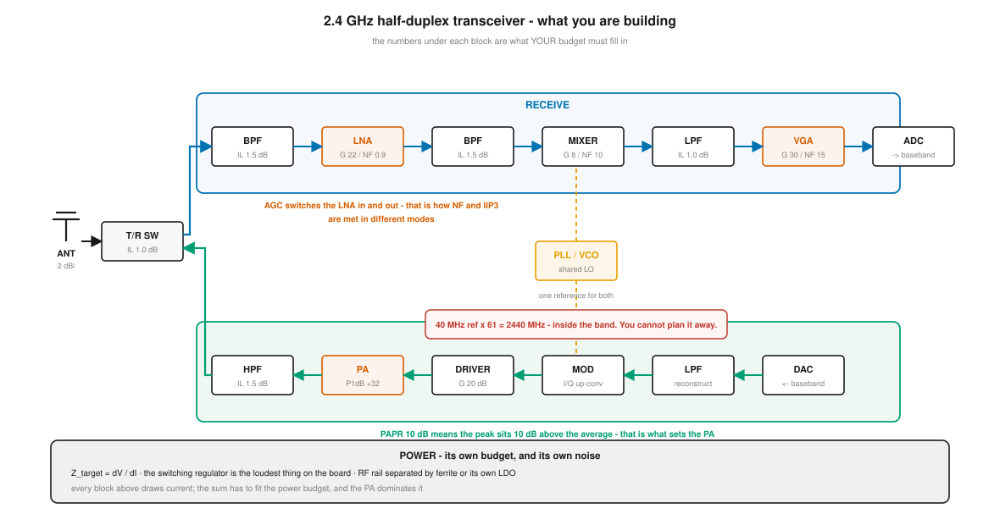
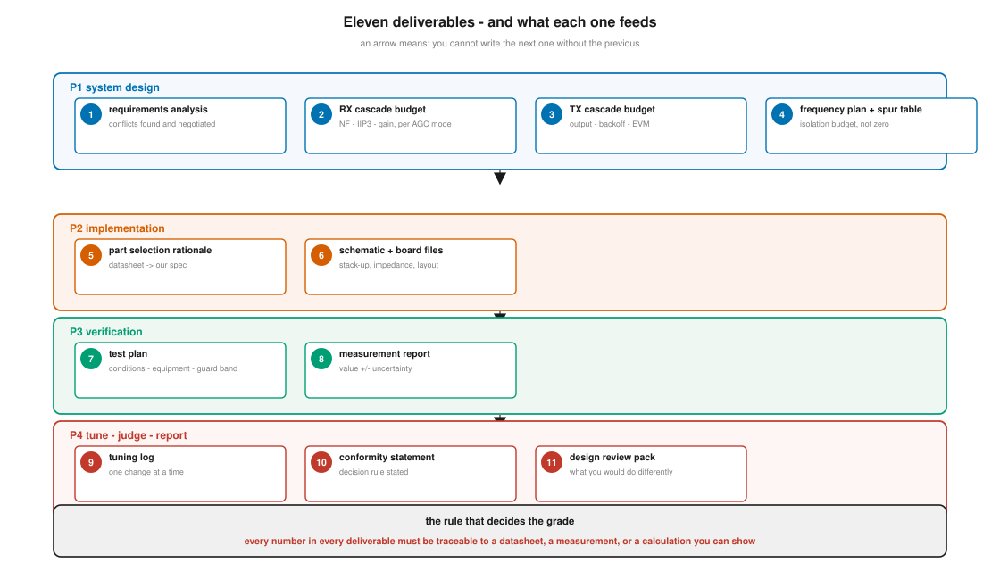

# 캡스톤 — 2.4 GHz 송수신 겸용 트랜시버 모듈

**문서 번호**: RF-CUR-CAP-00 · **버전**: v1.0 · **분량**: 2~3주 (주 20시간 기준)

| | |
|---|---|
| **선수** | 본문 [M00–M17](../01_모듈/) 전편 |
| **과제** | 주어진 시스템 요구사항으로부터 2.4 GHz 대역 **송수신 겸용 트랜시버 모듈**을 설계 → 예산 배분 → 부품 선정 → 보드 설계 → 측정 → 튜닝 → 판정 → 보고까지 수행한다 |
| **산출물** | 11종 (§4) |
| **평가** | 역량 루브릭 L1–L4. **L3 이상이 실무 투입 수준** (§6) |

---

## CAP.0 이 과제가 무엇을 확인하는가

모듈 열여덟 편을 다 읽어도, **혼자 처음부터 끝까지 해 본 적이 없으면 할 수 있는 게 아닙니다.** 캡스톤은 그것을 확인합니다.

> **이 과제의 진짜 시험은 계산이 아니라 판단입니다.**
>
> 계산은 도구가 해 줍니다([§5](#cap5-자체-검산-도구)). 시험받는 것은 **어떤 요구를 왜 그렇게 풀었는가**, 그리고 **그 근거를 남에게 보일 수 있는가**입니다.



*그림 CAP-1. 만들 것의 전체 모습. **읽는 법**: 위 파란 띠가 수신, 아래 초록 띠가 송신, 왼쪽이 안테나와 T/R(송수신 전환) 스위치, 가운데 노란 블록이 **두 경로가 함께 쓰는 합성기**입니다. 각 블록 아래 회색 숫자는 예시일 뿐, **여러분의 예산표가 채워 넣을 자리**입니다. 빨간 상자는 §CAP.2에서 다룰 함정 하나를 미리 보여 줍니다.*

---

## CAP.1 요구사항 (주어진 것)

**공통**

| 항목 | 값 |
|---|---|
| 대역 | 2400 ~ 2483.5 MHz |
| 방식 | 반이중(TDD) — 송신과 수신이 시간을 나눠 씀 |
| 기준 발진기 | **단일** 기준으로 송수신 모두 (40 MHz 가정) |
| 채널 대역폭 | 20 MHz |
| 소비전력 상한 | 송신 시 1.5 W |
| 적용 규격 | ETSI EN 300 328, EN 301 489 |

**수신(RX)**

| 항목 | 값 |
|---|---|
| 감도 | **−95 dBm** @ 20 MHz 대역폭 |
| 잡음지수 | **≤ 4 dB** |
| 입력 3차 절점(IIP3) | **≥ −10 dBm** |
| 대역외 차단 | 대역 밖 −30 dBm 간섭에서 동작 |

**송신(TX)**

| 항목 | 값 |
|---|---|
| 출력 | **+20 dBm** (안테나 단자) |
| EVM | **≤ 3 %** |
| 안테나 이득 | 2 dBi |
| ACLR·하모닉 | EN 300 328 만족 |

> ⚠️ **이 요구사항에는 모순이 들어 있습니다.** 몇 개인지, 어디인지는 말해 주지 않습니다. **찾아내는 것이 P1의 첫 과제**입니다([§CAP.2](#cap2-단계-구조)).
>
> 이것은 함정이 아니라 **실무의 기본값**입니다. 현장에서 받는 요구사항은 대개 여러 사람이 각자 써서 모은 것이라, 서로 안 맞는 항목이 섞여 있습니다. **그것을 찾아 협의하는 것이 시스템 엔지니어의 첫 번째 일**입니다.

---

## CAP.2 단계 구조



*그림 CAP-2. 산출물 11종과 의존 관계. **읽는 법**: 위에서 아래로 P1→P4이고, 화살표는 **앞 것 없이는 뒤 것을 쓸 수 없다**는 뜻입니다. 맨 아래 빨간 줄이 채점의 기준입니다.*

한 번에 다 하려 들면 중도에 무너집니다. **네 단계로 끊고, 각 단계 끝에서 산출물을 완성한 뒤 다음으로 갑니다.**

| 단계 | 하는 일 | 산출물 | 쓰는 모듈 |
|---|---|---|---|
| **P1 — 시스템 설계** | 요구 분석, 아키텍처 선정, 예산 배분, 주파수 계획 | ①②③④ | M09·M11·M12·M13 |
| **P2 — 구현 설계** | 부품 선정, 회로도, 보드 설계 | ⑤⑥ | M06·M07·M08·M16·M17 |
| **P3 — 검증** | 시험 계획, RX·TX 측정 | ⑦⑧ | M14·M15·M16 |
| **P4 — 튜닝·판정·보고** | 튜닝, 적합성 판정, 설계 리뷰 | ⑨⑩⑪ | M16·M17 |

각 단계는 별도 문서에 있습니다.

| | |
|---|---|
| **[P1 — 시스템 설계](./P1_시스템설계.md)** | 요구 모순을 찾고, 예산으로 부품 스펙을 내린다 |
| **[P2 — 구현 설계](./P2_구현설계.md)** | 스펙을 실제 부품과 보드로 바꾼다 |
| **[P3 — 검증](./P3_검증.md)** | 만든 것이 스펙대로인지 잰다 |
| **[P4 — 튜닝·판정·보고](./P4_튜닝판정보고.md)** | 고치고, 판정하고, 남긴다 |

---

## CAP.3 축소 옵션 — 기간이나 장비가 부족할 때

| 옵션 | 범위 | 검증되는 도달 목표 |
|---|---|---|
| **전체** | P1 ~ P4, 산출물 ①~⑪ | G1 ~ G11 전부 |
| **설계 중심** | P1 + P2 (산출물 ①~⑥) | G1 · G2 · G9 · G11 |
| **RX 한정** | P1~P4를 **수신 경로만** | G1 ~ G10 (TX 항목 제외) |
| **데이터 기반** | 공개 평가보드와 공개 S-파라미터로 ⑦~⑩ 수행 | G1 ~ G8 · G11 |

> 📌 **어느 옵션이든 P1과 ⑩(적합성 판정서)은 뺄 수 없습니다.** 요구를 분해하지 못하면 시작이 안 되고, 판정을 못 하면 끝이 안 납니다.

> 💡 **장비가 전혀 없어도 P1·P2는 온전히 할 수 있습니다.** 실제로 실무에서도 설계 기간의 대부분은 장비 없이 문서와 계산으로 흘러갑니다.

---

## CAP.4 산출물 11종

| # | 산출물 | 반드시 들어갈 것 | 단계 |
|---|---|---|---|
| ① | **요구사항 분석서** | 모순 목록과 **협의 결과**, 각 요구의 출처 | P1 |
| ② | **RX 캐스케이드 예산표** | 단별 이득·NF·IIP3, **AGC 모드별로** | P1 |
| ③ | **TX 캐스케이드 예산표** | 출력·백오프·EVM 기여, PA 선정 근거 | P1 |
| ④ | **주파수 계획·스퍼 표** | 클럭 하모닉 표와 **격리 요구 dB** | P1 |
| ⑤ | **부품 선정 근거서** | 데이터시트 값 ↔ 우리 스펙 매핑, **조건 줄 인용** | P2 |
| ⑥ | **회로도 + 보드 파일** | 스택업, 임피던스 계산, 배치 근거 | P2 |
| ⑦ | **시험 계획서** | 조건·장비·절차·판정 기준·**가드밴드** | P3 |
| ⑧ | **측정 리포트** | 값 **± 확장불확도**, 셋업 사진, 원본 데이터 위치 | P3 |
| ⑨ | **튜닝 기록** | 한 번에 하나씩, 전후 값, 되돌릴 수 있게 | P4 |
| ⑩ | **적합성 판정서** | 항목별 합·부와 **판정 규칙** 명시 | P4 |
| ⑪ | **설계 리뷰 자료** | 무엇을 다시 하겠는가 | P4 |

> ⚠️ **채점의 기준은 하나입니다: 모든 숫자가 추적 가능한가.**
>
> 어떤 숫자든 **데이터시트·측정·계산 중 하나로 되짚어 갈 수 있어야** 합니다. "대충 이 정도"는 0점입니다. 근거를 못 대는 숫자는 **안 적은 것보다 나쁩니다** — 뒷사람이 그것을 믿고 설계하기 때문입니다.

---

## CAP.5 자체 검산 도구

계산 실수로 시간을 버리지 않도록, 예산을 넣으면 요구별 합·부를 찍어 주는 도구를 함께 둡니다.

```bash
python3 scripts/capstone_check.py          # 기준 설계로 돌려 본다
python3 scripts/capstone_check.py --self   # 도구 자체의 검산 26항목
```

| 도구가 해 주는 것 | 도구가 해 주지 않는 것 |
|---|---|
| 캐스케이드 NF·IIP3·이득 계산 | **부품을 고르는 일** |
| 감도 환산 | 요구를 어떻게 **협의할지** 정하는 일 |
| 요구 모순 찾기 | 보드를 그리는 일 |
| 백오프·EIRP 확인 | 측정하는 일 |
| 클럭 하모닉과 **격리 요구** 계산 | **판단** |

> 📌 **도구를 먼저 읽으십시오.** `scripts/capstone_check.py` 안의 `REQ`·`RX_MODES`·`TX_LOSS`·`PLAN` 을 **자기 설계로 바꾸는 것**이 P1의 실질적인 작업입니다. 파일 안의 기준 설계는 답안이 아니라 **양식**입니다.

> ⚠️ **도구가 "합격"이라고 해도 설계가 맞다는 뜻이 아닙니다.** 도구는 여러분이 넣은 숫자로만 계산합니다. **그 숫자가 실제 부품의 보증값인지**는 ⑤ 부품 선정 근거서가 답할 일입니다(→ [M16 §2](../01_모듈/M16_DUT검증과튜닝과자동화.md)).

---

## CAP.6 평가 루브릭

### 역량 수준

| 수준 | 판정 기준 |
|---|---|
| **L1** 인지 | 용어를 알고, 설명을 들으면 이해한다 |
| **L2** 재현 | 절차서가 있으면 수행하고 결과를 해석한다 |
| **L3** **자립** | **절차를 스스로 설계하고, 결과의 타당성을 판단하며, 이상 시 원인을 좁힌다** ← 실무 투입 기준 |
| **L4** 판단 | 트레이드오프를 근거와 함께 결정하고, 남의 설계·측정을 검토한다 |

### 산출물별 채점

| 산출물 | L2 | L3 (실무 기준) | L4 |
|---|---|---|---|
| ① 요구 분석 | 요구를 표로 정리했다 | **모순을 찾아 협의안을 냈다** | 협의안의 사업적 영향까지 따졌다 |
| ② RX 예산 | 표를 채웠다 | **AGC 모드를 나눈 근거를 댔다** | 다른 배분과 비교해 골랐다 |
| ③ TX 예산 | 표를 채웠다 | **백오프와 효율의 절충을 근거로 정했다** | CFR/DPD 도입 여부를 판단했다 |
| ④ 주파수 계획 | 스퍼 표를 만들었다 | **못 없애는 하모닉의 격리 요구를 냈다** | 채널 배치까지 제안했다 |
| ⑤ 부품 선정 | 부품을 골랐다 | **조건 줄까지 읽고 Typ/Min을 구분했다** | 2차 공급처와 단종 위험을 봤다 |
| ⑥ 보드 설계 | 그렸다 | **스택업·임피던스·접지를 근거로 정했다** | 제조성과 원가까지 반영했다 |
| ⑦ 시험 계획 | 항목을 나열했다 | **가드밴드와 불확도를 넣었다** | 시료 수를 통계로 정했다 |
| ⑧ 측정 리포트 | 값을 적었다 | **불확도와 셋업을 함께 적어 재현 가능하다** | 측정계 자신을 먼저 쟀다 |
| ⑨ 튜닝 기록 | 고쳤다 | **한 번에 하나씩, 전후를 기록했다** | 튜닝 불가를 판별해 설계로 돌렸다 |
| ⑩ 판정서 | 합·부를 적었다 | **판정 규칙을 명시했다** | 위험을 정량화해 제시했다 |
| ⑪ 리뷰 | 발표했다 | **무엇을 다시 하겠는지 구체적으로 말했다** | 남의 설계도 같은 기준으로 봤다 |

> 📌 **L2와 L3의 차이는 "했다"와 "왜 그렇게 했는지 말할 수 있다"입니다.** 표를 채우는 것은 L2입니다. 그 칸에 왜 그 숫자가 들어갔는지 설명할 수 있어야 L3입니다.

### 도달 목표 ↔ 산출물 매핑

설계서 §1.2의 G1–G11이 캡스톤의 어디에서 확인되는지입니다.

| # | 도달 목표 | 확인하는 산출물 |
|---|---|---|
| G1 | 요구를 **부품별 스펙으로 분해** | ① ② ③ |
| G2 | 데이터시트를 **측정 조건까지** 해석 | ⑤ |
| G3 | VNA **교정**하고 S-파라미터 측정 | ⑧ (⑥의 쿠폰 포함) |
| G4 | 하모닉·스퓨리어스·ACLR을 **규격 대비 판정** | ⑧ ⑩ |
| G5 | 잡음지수·P1dB·IP3·위상잡음을 **올바른 셋업으로** 측정 | ⑧ |
| G6 | **테스트 플랜을 스스로 설계**하고 판정 | ⑦ ⑩ |
| G7 | 이상 시 **원인을 계통적으로 축소** | ⑨ |
| G8 | 정합 회로를 **계산하고 실물에서 튜닝** | ⑨ |
| G9 | **스택업·임피던스·레이아웃 규칙 설계** | ⑥ |
| G10 | 측정 **자동화**와 재현 가능한 데이터 관리 | ⑦ ⑧ |
| G11 | 규격 문서에서 **자기 제품의 요구를 찾아냄** | ① ④ ⑩ |

> ⚠️ **G3·G5·G7·G8은 장비 없이는 확인되지 않습니다.** 축소 옵션 중 "설계 중심"을 택하면 이 넷은 미검증으로 남습니다. **그 사실을 리뷰 자료에 적으십시오** — 못 한 것을 안 적는 것도 감점입니다.

---

## CAP.7 진행 요령

> 💡 **문서를 마지막에 쓰지 마십시오.** 하면서 씁니다. 나중에 쓰려면 왜 그렇게 했는지 이미 잊었습니다(→ [M16 §12](../01_모듈/M16_DUT검증과튜닝과자동화.md)).

| 요령 | 왜 |
|---|---|
| **각 단계 끝에서 멈추고 산출물을 완성** | 뒤로 갈수록 앞을 고치기 어렵다 |
| **가정은 즉시 적는다** | "왜 2 dB를 얹었지?"가 2주 뒤에 온다 |
| **막히면 요구로 돌아간다** | 대부분의 막힘은 요구가 애매해서다 |
| **남에게 설명해 본다** | 설명이 막히는 곳이 이해가 빈 곳이다 |
| **못 한 것을 적는다** | 못 한 것을 아는 것도 역량이다 |

> ⚠️ **가장 흔한 실패는 P2에서 시간을 다 쓰는 것입니다.** 보드를 예쁘게 그리는 데 몰두하다 P3·P4를 못 합니다. **P1과 P4가 가장 많이 배우는 단계**이고, 실무에서 가장 자주 요구되는 것도 이 둘입니다.

---

## CAP.A 이 문서의 축약어

| 약어 | 영문 원어 | 한글 |
|---|---|---|
| TDD | Time Division Duplex | 시분할 이중통신 (송수신이 시간을 나눠 씀) |
| T/R | Transmit / Receive | 송신 / 수신 |
| RX / TX | Receive / Transmit | 수신 / 송신 |
| NF | Noise Figure | 잡음지수 (→ M08) |
| IIP3 | Input Third-order Intercept Point | 입력 3차 절점 (→ M08) |
| EVM | Error Vector Magnitude | 오차 벡터 크기 (→ M13) |
| ACLR | Adjacent Channel Leakage Ratio | 인접채널 누설비 (→ M13) |
| EIRP | Equivalent Isotropically Radiated Power | 등가등방복사전력 (→ M10) |
| AGC | Automatic Gain Control | 자동 이득 제어 (→ M11·M12) |
| PA | Power Amplifier | 전력증폭기 (→ M08) |
| LNA | Low Noise Amplifier | 저잡음 증폭기 (→ M08) |
| PAPR | Peak-to-Average Power Ratio | 첨두대평균 전력비 (→ M13) |
| CFR | Crest Factor Reduction | 첨두율 저감 (→ M13) |
| DPD | Digital Pre-Distortion | 디지털 사전왜곡 (→ M13) |
| PLL / VCO | Phase-Locked Loop / Voltage-Controlled Oscillator | 위상고정루프 / 전압제어발진기 (→ M09) |
| VNA | Vector Network Analyzer | 벡터 네트워크 분석기 (→ M05·M14) |
| ETSI | European Telecommunications Standards Institute | 유럽 전기통신 표준화 기구 (→ M17) |
| EN | European Norm | 유럽 규격 (→ M17) |

---

## CAP.S 출처

| 내용 | 출처 | 등급 |
|---|---|---|
| 2.4 GHz 광대역 전송 규격 (EIRP 상한 등) | [Intertek — *ETSI EN 300 328 V2.2.2*](https://www.intertek.com/ict/etsi-en-300-328/) | D |
| 무선기기 EMC 규격 | [C&E — *ETSI EN 301 489 시험 개요*](https://www.celectronics.com/International-Compliance/ETSI-EN-301-489-Testing) | D |
| 역량 루브릭 L1–L4, 도달 목표 G1–G11 | [커리큘럼 설계서 §1.2·§10](../00_커리큘럼_설계서_v1.2.md) | — |

> 📌 **본문에서 직접 계산·검산한 항목** — 재현은 `python3 scripts/capstone_check.py --self` (26항목 출력).
>
> - 주어진 요구사항에 **모순 3건**이 있음을 계산으로 확인했습니다(§CAP.1)
> - 캐스케이드 잡음지수·IIP3를 **손계산과 대조**했습니다
> - **2.4 GHz 대역에서는 83.5 MHz 미만의 어떤 클럭도 대역 내 하모닉을 피할 수 없음**을 확인했습니다 — 주파수 계획이 아니라 격리로 풀어야 하는 이유입니다

> ⚠️ **규격 값에 대하여**: 본문의 EIRP 상한 등은 **설명을 위한 값**입니다. 규격은 개정되고 지역·제품 분류에 따라 달라지므로, 실제 판정은 최신 원문과 공인 시험소의 확인을 받아야 합니다(→ [M17 §14](../01_모듈/M17_보드설계와인증.md)).

> ⚠️ **URL 확인 안내**: 작성 환경의 조직 정책상 외부 사이트를 직접 열 수 없어, 검색 결과의 서지 정보를 교차 대조하는 방식으로 검증했습니다. 배경은 [M00.S](../01_모듈/M00_RF시스템엔지니어링이란.md#m00s-출처) 참조.

---

## 변경 이력

| 버전 | 일자 | 내용 |
|---|---|---|
| v1.0 | 2026-08-21 | 최초 작성. 과제 정의, 요구사항, 4단계 구조, 산출물 11종, 루브릭, G1–G11 매핑, 자체 검산 도구 |
