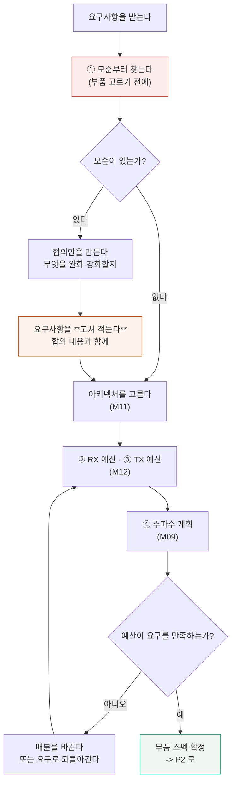

# P1 — 시스템 설계

**문서 번호**: RF-CUR-CAP-P1 · **버전**: v1.0 · **분량**: 약 5일 (주 20시간 기준)

| | |
|---|---|
| **들어가기 전** | [과제정의서](./00_과제정의서.md)를 읽고 요구사항을 파악한다 |
| **산출물** | ① 요구사항 분석서 ② RX 캐스케이드 예산표 ③ TX 캐스케이드 예산표 ④ 주파수 계획·스퍼 표 |
| **쓰는 모듈** | [M09](../01_모듈/M09_주파수변환과신호원.md) · [M11](../01_모듈/M11_트랜시버아키텍처.md) · [M12](../01_모듈/M12_시스템예산설계.md) · [M13](../01_모듈/M13_변조와신호품질.md) |
| **도구** | `python3 scripts/capstone_check.py` |

---

## P1.0 이 단계에서 하는 일

> **부품은 아직 고르지 않습니다.** P1이 끝나면 "어떤 부품이 필요한가"의 **스펙**이 나옵니다. 그 스펙으로 부품을 찾는 것은 P2입니다.

순서가 중요합니다.



*그림 P1-1. P1의 작업 순서. **읽는 법**: 빨간 상자가 가장 자주 건너뛰는 단계이고, 건너뛰면 오른쪽 아래 되돌이 화살표를 여러 번 돌게 됩니다. 주황 상자는 **요구사항 문서 자체를 고치는 일**입니다 — 협의만 하고 문서를 안 고치면 나중에 아무도 모릅니다.*

---

## P1.1 산출물 ① — 요구사항 분석서

### 먼저 할 일: 모순 찾기

각 요구를 따로 보면 다 그럴듯합니다. **서로 곱해 봐야** 모순이 보입니다.

**확인할 조합 (최소한 이 넷)**

| 조합 | 계산 | 어느 모듈 |
|---|---|---|
| 감도 ↔ 잡음지수 ↔ 대역폭 | 감도 = −174 + 10log₁₀(BW) + NF + SNR | [M12 §5](../01_모듈/M12_시스템예산설계.md) |
| 잡음지수 ↔ 선형성 | 한 이득 배분으로 둘 다 되는가 | [M12 §4](../01_모듈/M12_시스템예산설계.md) |
| 출력 ↔ 안테나 이득 ↔ 규제 | EIRP = 출력 + 안테나 이득 ≤ 상한 | [M10](../01_모듈/M10_안테나와전파.md) · [M17 §14](../01_모듈/M17_보드설계와인증.md) |
| EVM ↔ 백오프 ↔ 효율 | PAPR만큼 백오프하면 효율이 얼마나 남는가 | [M13 §7](../01_모듈/M13_변조와신호품질.md) |

**도구로 확인**

```bash
python3 scripts/capstone_check.py
```

첫 절에 요구 정합성 결과가 나옵니다. 주어진 요구사항으로 돌리면 이렇게 나옵니다(폭에 맞춰 줄을 접었습니다).

```
[1] 요구사항 정합성 — 부품을 고르기 전에
  [모순] 감도 ↔ 잡음지수 ↔ 대역폭
         NF 4.0 dB 이면 잡음바닥 -97.0 dBm. 감도 -95 dBm 이려면 SNR 2.0 dB 로
         충분해야 하는데, 이 파형은 5.0 dB 를 요구한다
         → 3.0 dB 모자란다
  [모순] 송신 출력 ↔ 안테나 이득 ↔ EIRP 규제
         출력 +20 dBm + 안테나 2 dBi = EIRP 22 dBm, 규제 상한 20 dBm
         → 2.0 dB 모자란다
  [모순] 잡음지수 ↔ 선형성 (한 모드로 동시에?)
         고이득 모드 NF 3.86 dB / IIP3 -22.27 dBm ·
         저이득 모드 NF 18.08 dB / IIP3 +1.86 dBm
```

> 📌 **모순 세 건은 성격이 다릅니다.** 대응도 달라야 합니다.
>
> | 모순 | 성격 | 대응 |
> |---|---|---|
> | 감도 ↔ NF ↔ BW | **요구끼리 안 맞는다** | 고객·기획과 협의해 **하나를 완화** |
> | 출력 ↔ EIRP | **법을 어긴다** | 협의 대상이 아니다. **출력이나 안테나를 낮춘다** |
> | NF ↔ 선형성 | **설계로 풀 수 있다** | AGC로 모드를 나누고, **요구서에 모드를 명시** |

### 협의안 만들기

> ⚠️ **딱 맞추면 안 됩니다.** 감도 모순은 3 dB가 모자랍니다. 그렇다고 감도를 정확히 3 dB 완화해 −92 dBm으로 하면 **마진이 0**입니다.
>
> 실제로 계산하면 성립 한계는 **−91.99 dBm**이라, **−92 dBm은 0.01 dB 모자랍니다.** 마진 0은 설계가 아닙니다. **−91 dBm이면 1.0 dB 마진**이 남습니다.

**감도 모순의 선택지**

| 안 | 무엇을 바꾸나 | 잃는 것 | 얻는 것 |
|---|---|---|---|
| A | 감도 −95 → **−91 dBm** | 통신 거리 (자유공간 기준 약 37 %) | 부품 선택 폭이 크게 넓어짐 |
| B | 기준 대역폭 20 → **10 MHz** | 데이터 속도 절반 | 잡음바닥 3 dB 개선 |
| C | 잡음지수 4 → **1 dB** | 사실상 불가능 (T/R 스위치만 1 dB) | — |

> 📌 **C를 왜 쓸 수 없는지 계산으로 보이십시오.** T/R 스위치 1.0 dB + 대역통과 필터 1.5 dB만으로 이미 **2.5 dB**입니다. LNA가 아무리 좋아도 그 앞 손실은 잡음지수에 **그대로 더해집니다**(→ [M12 §2](../01_모듈/M12_시스템예산설계.md)). "안 되는 이유를 계산으로 보이는 것"도 산출물입니다.

**EIRP 모순의 선택지**

| 안 | 결과 |
|---|---|
| 출력 +20 → **+17 dBm**, 안테나 2 dBi | EIRP 19 dBm, **1 dB 마진** |
| 출력 +20 dBm, 안테나 **0 dBi** | EIRP 20 dBm, 마진 0 |

> ⚠️ **규제 한계에 딱 맞추지 마십시오.** 시험소의 측정 불확도가 있습니다. EIRP 20 dBm 규제에 정확히 20 dBm으로 내면, 시험소에서 20.5 dBm으로 나오는 순간 **불합격**입니다.
>
> 이것이 [M16 §5](../01_모듈/M16_DUT검증과튜닝과자동화.md)의 **가드밴딩**을 규제 판정에 적용하는 자리입니다. 인증에서는 **우리가 가드밴드를 져야** 합니다.

### 요구사항 분석서 양식

| 열 | 적는 것 |
|---|---|
| 요구 번호 | SR-01 형태의 고유 번호 |
| 요구 내용 | 원문 그대로 |
| 출처 | 누가·어느 문서에서 |
| 검토 결과 | 성립 / **모순** / 조건부 |
| 모순이라면 | 무엇과 어떻게 부딪히는지, **계산과 함께** |
| 협의안 | 무엇을 어떻게 바꾸자고 제안했는가 |
| **합의 결과** | 최종적으로 무엇으로 정했는가, 누구와 언제 |
| 마진 | 합의된 값 기준으로 몇 dB 남는가 |

> 📌 **"합의 결과" 칸이 이 문서의 존재 이유입니다.** 모순을 찾는 것만으로는 절반입니다. **무엇으로 정했는지가 적혀 있어야** 나중에 사람이 바뀌어도 설계가 흔들리지 않습니다.

---

## P1.2 아키텍처 선정

[M11](../01_모듈/M11_트랜시버아키텍처.md)의 네 가지 수신 구조 중 하나를 **근거와 함께** 고릅니다.

| 후보 | 장점 | 이 과제에서의 문제 |
|---|---|---|
| **슈퍼헤테로다인** | 성능 최고, 이미지 제거 확실 | 부품 수·크기·비용. IF 필터가 비싸다 |
| **Zero-IF** | 부품 최소, 집적 쉬움 | **DC 오프셋**과 **IP2** (→ M11 §5) |
| **Low-IF** | Zero-IF의 DC 문제를 피함 | 이미지 제거가 필요 (IRR) |
| **직접 샘플링** | 유연 | 2.4 GHz에서 ADC 요구가 과함 |

**골랐으면 그 선택의 대가를 계산으로 적으십시오.**

| 고른 구조 | 반드시 함께 적을 것 |
|---|---|
| Zero-IF | DC 오프셋 제거 방식, IIP2 요구값 |
| Low-IF | IF 주파수, 필요한 **이미지 제거비(IRR)** dB |
| 슈퍼헤테로다인 | IF 선택 근거, 이미지 주파수와 그 대역의 간섭 |

> 💡 **[M09의 L09-a 실습 도구](../01_모듈/M09_주파수변환과신호원.md)를 그대로 쓸 수 있습니다.** IF 후보를 넣으면 스퍼가 어디 떨어지는지 계산해 줍니다.

---

## P1.3 산출물 ② — RX 캐스케이드 예산표

### 표의 모양

| 단 | 부품 종류 | 이득 (dB) | NF (dB) | IIP3 (dBm) | 누적 이득 | 누적 NF | 누적 IIP3 |
|---|---|---|---|---|---|---|---|
| 1 | T/R 스위치 | −1.0 | 1.0 | +40 | −1.0 | 1.00 | +40.00 |
| 2 | 대역통과 필터 | −1.5 | 1.5 | +50 | −2.5 | 2.50 | +39.67 |
| 3 | **LNA** | +22.0 | 0.9 | −10 | +19.5 | 3.40 | −7.50 |
| … | | | | | | | |

> 📌 **누적 열을 손으로 채우지 마십시오.** `capstone_check.py`의 `RX_MODES`를 자기 값으로 바꾸고 돌리면 그대로 나옵니다. **손으로 채우면 반드시 틀립니다** — dB와 선형을 섞기 때문입니다.

### 반드시 마주칠 벽

두 법칙이 **반대 방향으로** 당깁니다(→ [M12 §4](../01_모듈/M12_시스템예산설계.md)).

| 앞단 이득을 키우면 | |
|---|---|
| 잡음지수 | **좋아진다** — 뒷단 잡음이 앞단 이득으로 나뉘므로 |
| 선형성(IIP3) | **나빠진다** — 뒷단이 더 센 신호를 받으므로 |

기준 설계로 계산하면 이렇습니다.

| 모드 | 총 이득 | NF | IIP3 | 감도 |
|---|---|---|---|---|
| **고이득** (LNA 켬) | +55.0 dB | **3.86 dB** ✅ | −22.27 dBm ❌ | −92.1 dBm |
| **저이득** (LNA 우회) | +55.0 dB | 18.08 dB ❌ | **+1.86 dBm** ✅ | −77.9 dBm |

> ⚠️ **한 모드로는 두 요구를 동시에 만족할 수 없습니다.** 이것은 여러분 설계의 결함이 아니라 **수신기라면 어디서나 생기는 일**입니다.
>
> **답은 AGC입니다.** 약한 신호일 때는 고이득 모드(감도 확보), 강한 간섭이 있을 때는 저이득 모드(선형성 확보)로 전환합니다(→ [M12 §4](../01_모듈/M12_시스템예산설계.md) · [M11 §8](../01_모듈/M11_트랜시버아키텍처.md)).
>
> **그리고 요구사항 문서를 고쳐야 합니다**: "NF ≤ 4 dB **(고이득 모드)**, IIP3 ≥ −10 dBm **(저이득 모드)**". 모드를 안 적은 요구는 만족할 수 없는 요구입니다.

### 이 표에 함께 적을 것

| 항목 | 왜 |
|---|---|
| **모드 전환 문턱** | 입력 몇 dBm에서 바꾸는가. 두 모드의 감도·IIP3가 겹치는 구간이 있어야 한다 |
| 각 값의 **출처** | 데이터시트 Typ인가 Min인가 (→ [M16 §2](../01_모듈/M16_DUT검증과튜닝과자동화.md)) |
| **온도·전압 범위** | 상온 25 °C 값만 쓰면 저온에서 무너진다 |
| 마진 | 요구 대비 몇 dB 남는가 |

---

## P1.4 산출물 ③ — TX 캐스케이드 예산표

수신과 달리 송신은 **뒤에서 앞으로** 계산합니다. 안테나 단자에서 필요한 출력이 정해져 있고, 그 앞의 손실을 거슬러 올라갑니다.

| 항목 | 계산 | 기준 설계 |
|---|---|---|
| 안테나 단자 출력 | 요구 | +20 dBm |
| PA 뒤 손실 | 하모닉 필터 + T/R 스위치 | 2.5 dB |
| **PA가 내야 할 출력** | 위 둘의 합 | **+22.5 dBm** |
| PAPR | 파형이 정함 | 10 dB |
| **첨두 전력** | 평균 + PAPR | **+32.5 dBm** |
| PA의 P1dB | 부품 스펙 | +32.0 dBm |
| **첨두 여유** | P1dB − 첨두 | **−0.5 dB** ❌ |

> ⚠️ **첨두가 P1dB를 넘습니다.** 이대로 만들면 첨두가 압축되어 EVM과 ACLR이 무너집니다.
>
> **선택지 세 가지** (→ [M13 §7·§8](../01_모듈/M13_변조와신호품질.md))
>
> | 안 | 효과 | 대가 |
> |---|---|---|
> | **더 큰 PA** (P1dB +35 dBm) | 여유 2.5 dB | 전력·비용·크기 |
> | **CFR** 로 PAPR 10 → 7 dB | 여유 2.5 dB | EVM이 조금 나빠짐 |
> | **출력을 낮춘다** (+17 dBm) | 여유 2.5 dB | 통신 거리 — 그런데 EIRP 모순 때문에 **어차피 낮춰야 한다** |
>
> **세 번째 안이 EIRP 모순과 함께 풀린다는 것을 알아채는 것**이 이 절에서 할 일입니다. 두 문제를 하나로 푸는 것이 좋은 설계입니다.

### 함께 적을 것

| 항목 | 왜 |
|---|---|
| **효율과 소비전력** | 백오프하면 효율이 떨어진다. 1.5 W 상한에 드는가 (→ [M08 §8](../01_모듈/M08_증폭기.md)) |
| **EVM 배분** | 변조기·PA·위상잡음이 각각 얼마씩 (→ [M13 §5](../01_모듈/M13_변조와신호품질.md)) |
| 하모닉 예상값 | 2차·3차가 규격 아래인가 |
| **열** | PA 손실 전력이 몇 W인가 (→ [M17 §11](../01_모듈/M17_보드설계와인증.md)) |

---

## P1.5 산출물 ④ — 주파수 계획과 스퍼 표

### 클럭 하모닉

```
[4] 클럭 하모닉 (100차까지) — 운용 채널 2437 MHz ± 10 MHz
  기준 클럭        40.0 MHz ×  61 =  2440.000 MHz   수신 주파수에서  +3.000 MHz ← 채널 안
  MCU 클럭       26.0 MHz ×  94 =  2444.000 MHz   수신 주파수에서  +7.000 MHz ← 채널 안
```

> ⚠️ **주파수 계획으로는 못 없앱니다.** 하모닉 간격이 곧 클럭 주파수입니다. 그 간격이 대역폭(83.5 MHz)보다 좁으면 **어느 하나는 반드시 대역 안에 들어옵니다.**
>
> | 클럭 | 대역 내 하모닉 | 뺄 수 있나 |
> |---|---|---|
> | 26 MHz | 3개 | **못 뺀다** |
> | 40 MHz | 3개 | **못 뺀다** |
> | 52 MHz | 1개 | **못 뺀다** |
> | 100 MHz | 1개 | 원리적으로 가능 (대역폭보다 높으므로) |
>
> 이것을 모르면 "클럭을 바꿔서 피하자"에 며칠을 씁니다. **못 피합니다.**

### 그러면 무엇을 하는가 — 격리 예산

없앨 수 없으면 **얼마나 약하게 만들지**를 정합니다. 그것이 설계 요구가 됩니다.

| 항목 | 값 | 근거 |
|---|---|---|
| 수신 잡음바닥 | −97.1 dBm | −174 + 10log₁₀(20 MHz) + NF 3.86 |
| 허용 스퍼 세기 | −107.1 dBm | 잡음바닥보다 10 dB 아래 |
| 클럭 배선의 하모닉 세기 | −30 dBm (가정) | 측정하거나 근접장 프로브로 확인 |
| **필요한 격리** | **77 dB** | 위 둘의 차이 |

> 📌 **77 dB는 보드가 만들어야 할 숫자입니다.** 배치 거리, 접지 연속성, 클럭 배선 층, 차폐가 합쳐서 이만큼을 내야 합니다(→ [M17 §6·§8·§10](../01_모듈/M17_보드설계와인증.md)).
>
> P2의 보드 설계는 **이 숫자를 목표로** 하게 됩니다. "잘 배치하자"가 아니라 "77 dB를 만들자"입니다.

### 함께 볼 것

| 항목 | 어느 모듈 |
|---|---|
| LO 하모닉과 믹서 스퍼 (m×f_LO ± n×f_RF) | [M09 §6](../01_모듈/M09_주파수변환과신호원.md) |
| 이미지 주파수와 그 대역에 무엇이 있는가 | [M09 §3](../01_모듈/M09_주파수변환과신호원.md) |
| 위상잡음과 상호혼합 | [M09 §10](../01_모듈/M09_주파수변환과신호원.md) |
| 채널별로 어느 하모닉을 만나는가 | 여기 |

---

## P1.6 P1 완료 판정

**다음이 모두 참이어야 P2로 갑니다.**

| | 확인 |
|---|---|
| ☐ | 요구 모순을 **전부 찾았고**, 각각 협의안과 합의 결과가 적혀 있다 |
| ☐ | 합의된 요구로 다시 계산했을 때 **마진이 0보다 크다** |
| ☐ | 아키텍처를 골랐고, **그 선택의 대가**를 숫자로 적었다 |
| ☐ | RX 예산표가 **AGC 모드별로** 있고, 모드 전환 문턱이 정해져 있다 |
| ☐ | TX 예산표에 백오프·효율·EVM 배분이 있다 |
| ☐ | 스퍼 표가 있고, **못 없애는 하모닉의 격리 요구 dB**가 나와 있다 |
| ☐ | 모든 부품값에 **"어떤 스펙이 필요한가"** 가 적혀 있다 (아직 부품명은 없어도 된다) |
| ☐ | `capstone_check.py` 가 자기 숫자로 돌아가고, 판정이 전부 합격이다 |

> ⚠️ **마지막 줄을 넘기지 마십시오.** 도구가 합격을 찍을 때까지 P1은 안 끝났습니다. 안 끝난 채로 P2에 가면, 부품을 다 고른 뒤에 예산이 안 맞는 것을 알게 됩니다.

---

## P1.Q 확인 문제

<details>
<summary><b>Q1.</b> 감도 요구를 3 dB 완화해 −92 dBm으로 하자고 제안했다. 충분한가?</summary>

**아닙니다. 0.01 dB 모자랍니다. 그리고 설령 맞아도 마진이 0입니다.**

정확히 계산하면 잡음바닥은 −174 + 10log₁₀(2×10⁷) + 4 = **−96.9897 dBm**입니다. 여기에 SNR 5 dB를 더하면 성립 한계가 **−91.9897 dBm**입니다.

−92.0 dBm은 그보다 0.0103 dB 낮으므로 **아슬아슬하게 안 됩니다.**

**하지만 진짜 문제는 그게 아닙니다.** 딱 맞춘 값에는 다음이 하나도 안 들어 있습니다.

| 빠진 것 | 크기 |
|---|---|
| 부품 산포 (Typ vs Min) | 0.5 ~ 1 dB |
| 온도 변화 | 0.3 ~ 1 dB |
| 보드 손실 (계산에 없던 배선) | 0.2 ~ 0.5 dB |
| 측정 불확도 | 0.3 ~ 0.5 dB |

**−91 dBm으로 제안하면 1.0 dB 마진**이 남고, 위 항목들을 감당할 수 있습니다.

**교훈**: 모순을 푸는 것과 **마진을 남기는 것**은 다른 일입니다. 협의할 때 한 번에 같이 받아 내십시오. 나중에 "1 dB만 더"는 훨씬 어렵습니다.
</details>

<details>
<summary><b>Q2.</b> LNA 이득을 22 dB에서 30 dB로 올리면 잡음지수가 좋아진다. 그렇게 하면 안 되는가?</summary>

**잡음지수는 좋아지지만 선형성이 그만큼 나빠집니다. 그리고 이미 잡음지수는 요구를 만족합니다.**

기준 설계에서 고이득 모드의 NF는 **3.86 dB**로 요구 4 dB를 이미 만족합니다. 마진 0.14 dB로 빠듯하긴 합니다.

이득을 8 dB 올리면:

| | NF | IIP3 |
|---|---|---|
| LNA +22 dB | 3.86 dB | −22.3 dBm |
| LNA +30 dB | 더 좋아짐 (약 3.5 dB) | **8 dB 더 나빠짐** (약 −30 dBm) |

**얻는 것은 0.3 dB, 잃는 것은 8 dB입니다.** 나쁜 거래입니다.

**그리고 다른 문제가 생깁니다.**

1. **뒷단이 포화**합니다 — 총 이득 63 dB면 −40 dBm 입력에서 이미 +23 dBm이 되어 VGA가 죽습니다
2. **안정도**가 나빠집니다 — 이득이 높은 증폭기는 발진하기 쉽습니다 (→ [M08 §7](../01_모듈/M08_증폭기.md))
3. **AGC 범위**를 더 넓게 잡아야 합니다

**옳은 방향**: 잡음지수 마진이 부족하면 이득을 올리는 게 아니라 **앞단 손실을 줄입니다.** T/R 스위치 1.0 dB와 필터 1.5 dB가 잡음지수에 그대로 더해지고 있습니다. 여기서 0.5 dB를 줄이는 것이 LNA 이득을 8 dB 올리는 것보다 낫습니다.
</details>

<details>
<summary><b>Q3.</b> 기준 클럭을 40 MHz에서 38.4 MHz로 바꾸면 2440 MHz 스퍼가 사라진다. 해결됐는가?</summary>

**그 하모닉은 사라지지만 다른 하모닉이 들어옵니다. 근본적으로 못 피합니다.**

38.4 MHz로 바꾸면 대역 안에 **63배(2419.2 MHz)와 64배(2457.6 MHz)** 가 들어옵니다.

**왜 못 피하는가**: 하모닉 사이 간격이 곧 클럭 주파수입니다. 2.4 GHz 대역은 83.5 MHz 폭이므로, 클럭이 83.5 MHz보다 낮으면 **하모닉 간격이 대역보다 좁아** 적어도 하나는 반드시 들어옵니다.

| 클럭 | 대역 내 하모닉 |
|---|---|
| 26 MHz | 2418 · 2444 · 2470 MHz |
| 38.4 MHz | 2419.2 · 2457.6 MHz |
| 40 MHz | 2400 · 2440 · 2480 MHz |
| 100 MHz | 2400 MHz (대역 가장자리) |

**옮겨서 얻을 수 있는 것**: 하모닉을 **운용 채널 밖으로** 밀어내는 것은 가능합니다. 대역 안에는 있되 우리가 쓰는 20 MHz 채널에는 안 들어오게 하는 것입니다. 다만 채널을 여러 개 쓴다면 어느 채널에선가는 만납니다.

**진짜 대응은 격리입니다**(§P1.5). 77 dB를 배치·접지·차폐로 만들어야 합니다(→ [M17 §6·§8](../01_모듈/M17_보드설계와인증.md)). 그리고 그 값을 **P2의 설계 목표로 적어 두는 것**이 이 절의 산출물입니다.
</details>

<details>
<summary><b>Q4.</b> 요구사항의 모순을 찾았다. 바로 설계를 시작해도 되는가?</summary>

**안 됩니다. 협의하고, 그 결과로 요구사항 문서를 고쳐야 합니다.**

흔한 실패는 이렇습니다: 모순을 발견하고 → 혼자 판단해서 → 자기 예산표에만 반영하고 → 요구사항 문서는 그대로 둡니다.

**그러면 이런 일이 생깁니다.**

| 언제 | 무슨 일 |
|---|---|
| 3개월 뒤 | 시험 담당자가 **원래 요구서**로 시험 계획을 짠다 → 감도 −95 dBm으로 판정 → 불합격 |
| 6개월 뒤 | 사람이 바뀐다 → 새 담당자가 "왜 −91 dBm이지?" → 아무도 모른다 |
| 인증 시 | 시험소에 **원래 요구서**를 낸다 → 스펙 미달 |

**해야 할 일**

1. 모순을 **계산과 함께** 정리한다 (주장이 아니라 증거로)
2. **선택지를 여러 개** 만든다 — 각각의 대가와 함께
3. 결정권자와 협의한다 — 우리가 정하는 게 아니다
4. **요구사항 문서를 고친다** — 합의 내용·날짜·합의한 사람과 함께
5. 고쳐진 요구서를 기준으로 설계한다

> **시스템 엔지니어의 산출물은 설계가 아니라 합의입니다.** 계산은 그 합의를 끌어내는 근거입니다.
</details>

---

## P1.7 한 장 요약

| 무엇 | 한 줄 |
|---|---|
| 첫 번째 일 | **부품 고르기 전에 요구 모순부터 찾는다** |
| 모순 세 가지 | 요구끼리 안 맞음 · 법을 어김 · 설계로 풀 수 있음 — **대응이 다르다** |
| 협의의 원칙 | 딱 맞추지 마라. **마진 0은 설계가 아니다** |
| 협의의 산출물 | 계산이 아니라 **합의**. 요구사항 문서를 고쳐라 |
| 두 법칙의 충돌 | NF와 IIP3는 반대로 당긴다 → **AGC로 모드를 나눈다** |
| 요구서에 적을 것 | "NF ≤ 4 dB **(고이득 모드)**" — 모드 없는 요구는 만족 불가 |
| TX 예산 | **뒤에서 앞으로**. 첨두가 P1dB를 넘는지 본다 |
| 두 문제 한 번에 | 출력을 낮추면 EIRP 모순과 백오프 문제가 **함께** 풀린다 |
| 스퍼 | 2.4 GHz에서 83.5 MHz 미만 클럭은 **하모닉을 못 피한다** |
| 그래서 | 주파수 계획이 아니라 **격리 예산 77 dB** 가 답 |
| P1의 끝 | 도구가 **자기 숫자로** 전부 합격을 찍을 때 |

---

## 변경 이력

| 버전 | 일자 | 내용 |
|---|---|---|
| v1.0 | 2026-08-21 | 최초 작성. 요구 모순 3건의 발견과 협의, AGC 모드 분리, 격리 예산, 확인 문제 4문항 |
