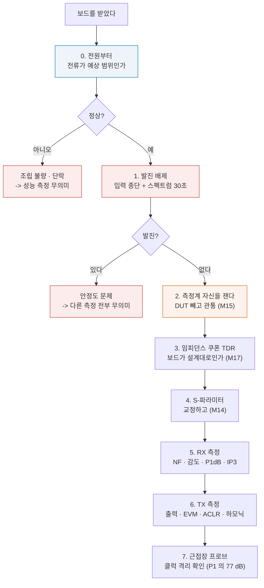

# P3 — 검증

**문서 번호**: RF-CUR-CAP-P3 · **버전**: v1.0 · **분량**: 약 5일 (주 20시간 기준)

| | |
|---|---|
| **들어가기 전** | [P2](./P2_구현설계.md)의 완료 판정을 통과하고 보드를 받았을 것 |
| **산출물** | ⑦ 시험 계획서 ⑧ 측정 리포트 |
| **쓰는 모듈** | [M14](../01_모듈/M14_정밀측정1_교정과불확도.md) · [M15](../01_모듈/M15_정밀측정2_잡음선형성위상잡음.md) · [M16](../01_모듈/M16_DUT검증과튜닝과자동화.md) |
| **장비 없으면** | [대체 경로](#p35-장비가-없을-때) 참조 |

---

## P3.0 순서 — 무엇부터 재는가

> ⚠️ **보드에 전원을 넣고 바로 성능을 재지 마십시오.** 순서가 있습니다.

*그림 P3-1. 측정 순서. **읽는 법**: 파란·주황·빨간 상자가 **성능을 재기 전에 반드시 통과해야 하는 관문**입니다. 이 셋을 건너뛰고 얻은 숫자는 전부 버리게 됩니다.*

| 단계 | 왜 이 순서인가 |
|---|---|
| **0. 전원** | 소비 전류가 예상과 크게 다르면 조립 불량이다. 성능을 재 봐야 의미 없다 |
| **1. 발진** | 발진 중인 증폭기는 **다른 모든 측정을 무의미하게** 만든다 (→ [M16 §10](../01_모듈/M16_DUT검증과튜닝과자동화.md)) |
| **2. 측정계** | 화면의 숫자가 DUT 것인지 장비 것인지 먼저 갈라야 한다 (→ [M15 §7](../01_모듈/M15_정밀측정2_잡음선형성위상잡음.md)) |
| **3. 쿠폰** | 보드가 설계대로 만들어졌는지. 아니면 이후 결과를 해석할 수 없다 |

---

## P3.1 산출물 ⑦ — 시험 계획서

[M16 §4](../01_모듈/M16_DUT검증과튜닝과자동화.md)의 템플릿을 그대로 씁니다. 항목마다 한 장입니다.

| 항목 | 이 과제의 예 |
|---|---|
| **시험 번호** | TP-RX-001 |
| **대상** | 수신 잡음지수 (고이득 모드) |
| **근거** | 요구 SR-03 (합의 후 값), P1 ② 예산표 |
| **조건** | 2437 MHz, 25 °C, 3.3 V, 고이득 모드 |
| **장비** | 잡음지수 분석기 + 잡음원 (ENR 15.2 dB, 교정 유효기간) |
| **절차** | ① 예열 30분 ② 잡음원 연결·교정 ③ DUT 연결 ④ … |
| **판정 기준** | NF ≤ 4.0 dB, **가드밴드 0.5 dB** → 합격선 3.5 dB |
| **불확도** | ±0.55 dB (k = 2), 예산표 첨부 |
| **시료 수** | 3개 이상 |
| **기록** | 원본 + 설정 + 셋업 사진 |

### 최소 시험 항목

| # | 항목 | 어떻게 | 모듈 |
|---|---|---|---|
| TP-RX-001 | 잡음지수 (모드별) | Y 계수법 또는 콜드소스 | [M15 §3·§4](../01_모듈/M15_정밀측정2_잡음선형성위상잡음.md) |
| TP-RX-002 | 이득 (모드별) | VNA S21 | [M14](../01_모듈/M14_정밀측정1_교정과불확도.md) |
| TP-RX-003 | 입력 반사 \|S11\| | VNA S11 | [M14](../01_모듈/M14_정밀측정1_교정과불확도.md) |
| TP-RX-004 | P1dB | 전력 소인 | [M15 §5](../01_모듈/M15_정밀측정2_잡음선형성위상잡음.md) |
| TP-RX-005 | IIP3 | 2-tone | [M15 §6·§7](../01_모듈/M15_정밀측정2_잡음선형성위상잡음.md) |
| TP-RX-006 | 감도 | 신호 주입 후 복조 성공률 | [M12 §5](../01_모듈/M12_시스템예산설계.md) |
| TP-TX-001 | 출력 | 전력계 (전도) | [M15 §2](../01_모듈/M15_정밀측정2_잡음선형성위상잡음.md) |
| TP-TX-002 | EVM | 벡터 신호 분석기 | [M15 §9](../01_모듈/M15_정밀측정2_잡음선형성위상잡음.md) |
| TP-TX-003 | ACLR | 스펙트럼 분석기 | [M13 §6](../01_모듈/M13_변조와신호품질.md) |
| TP-TX-004 | 하모닉 | 넓은 대역 소인 | [M15 §8](../01_모듈/M15_정밀측정2_잡음선형성위상잡음.md) |
| TP-SY-001 | 위상잡음 | 3종 중 가능한 방법 | [M15 §10](../01_모듈/M15_정밀측정2_잡음선형성위상잡음.md) |
| TP-SY-002 | 소비전력 | 모드별·상태별 | — |
| TP-BD-001 | 임피던스 쿠폰 | TDR 또는 VNA 시간영역 | [M17 §4](../01_모듈/M17_보드설계와인증.md) |
| TP-BD-002 | **클럭 격리** | 근접장 프로브 + 수신 입력 측정 | [M17 §14](../01_모듈/M17_보드설계와인증.md) |

> 📌 **TP-BD-002가 이 과제 고유의 항목입니다.** P1이 "77 dB 격리가 필요하다"고 정했고, P2가 그것을 목표로 설계했습니다. **여기서 실제로 얼마가 나왔는지 재야** 그 설계가 맞았는지 알 수 있습니다.

### 가드밴드 정하기

[M16 §5](../01_모듈/M16_DUT검증과튜닝과자동화.md)의 방법입니다.

| 항목 | 이 과제 |
|---|---|
| 확장불확도 | 측정마다 다르다. 예산표에서 |
| 판정 규칙 | **단순 수용 / 엄격 수용 / 엄격 거부 중 무엇** |
| 규제 항목 (EIRP·ACLR·하모닉) | **반드시 엄격 수용.** 우리가 가드밴드를 진다 |
| 내부 스펙 | 단순 수용도 가능. 근거를 적을 것 |

> ⚠️ **규제 항목과 내부 스펙의 판정 규칙이 달라야 합니다.** 규제는 넘으면 팔 수 없습니다. 내부 스펙은 협의할 수 있습니다.

---

## P3.2 산출물 ⑧ — 측정 리포트

### 반드시 들어갈 것

[M15 §12](../01_모듈/M15_정밀측정2_잡음선형성위상잡음.md)와 [M16 §12](../01_모듈/M16_DUT검증과튜닝과자동화.md)의 요구를 그대로 씁니다.

| 넣을 것 | 빠지면 |
|---|---|
| 측정값 **± 확장불확도** | 얼마나 믿을 만한지 모른다 |
| **판정 규칙** (가드밴드 여부) | 합격의 의미가 사람마다 다르다 |
| 조건 (주파수·온도·전압·모드) | 다른 조건에서 재고 다르다고 한다 |
| 장비 모델·일련번호·교정 유효기간 | 소급성이 끊긴다 |
| **셋업 블록도와 사진** | 케이블 하나가 달라 재현이 안 된다 |
| **측정계 자신의 값** | DUT를 잰 건지 장비를 잰 건지 모른다 |
| 원본 데이터 위치 | 다시 볼 수 없다 |
| **시료 수와 개체별 값** | 한 개만 좋았던 건지 알 수 없다 |

### 예산과 실측의 대조표

**이 표가 P3에서 가장 많이 쓰이는 산출물입니다.**

| 항목 | P1 예산 | 실측 (평균 ± U) | 차이 | 원인 추정 |
|---|---|---|---|---|
| RX NF (고이득) | 3.86 dB | | | |
| RX 이득 (고이득) | +55.0 dB | | | |
| RX IIP3 (저이득) | +1.86 dBm | | | |
| TX 출력 | +20.0 dBm | | | |
| TX EVM | ≤ 3 % | | | |
| 소비전력 (송신) | | | | |
| 클럭 격리 | 77 dB 필요 | | | |

> 📌 **차이가 있으면 원인을 적어야 합니다.** "예산보다 1.2 dB 나쁨"으로 끝내면 안 됩니다. 어느 단에서 왔는지 좁혀야 합니다 — 그것이 [M16 §9](../01_모듈/M16_DUT검증과튜닝과자동화.md)의 이분 탐색입니다.

> ⚠️ **예산과 정확히 같으면 오히려 의심하십시오.** 실측이 계산과 소수점까지 맞는 일은 없습니다. 맞았다면 (a) 측정이 잘못됐거나 (b) 예산의 값을 실측에서 베꼈거나 (c) 우연입니다.

---

## P3.3 자동화

[M16 §11](../01_모듈/M16_DUT검증과튜닝과자동화.md)의 방법으로 반복 측정을 자동화합니다. **도달 목표 G10이 여기서 확인됩니다.**

| 자동화할 것 | 왜 |
|---|---|
| 주파수 소인 (채널마다) | 채널이 13개다. 손으로 하면 하루가 간다 |
| 온도 시험 | 온도마다 전 항목 반복 |
| 시료 반복 | 3~5개 × 전 항목 |
| **데이터 저장** | 파일명·폴더 규약을 코드로 강제 |

> 📌 **`*IDN?` · 타임아웃 · `*OPC?` · 원본 저장 · 설정 기록** — [M16 §11](../01_모듈/M16_DUT검증과튜닝과자동화.md)의 다섯 규칙을 지키십시오. 특히 **저장하는 데이터의 설정을 그 파일 안에 적는 것**을 잊기 쉽습니다.

---

## P3.4 사전 인증

[M17 §14](../01_모듈/M17_보드설계와인증.md)의 방법입니다. **공인 시험소에 가기 전에** 우리 실험실에서 걸러 냅니다.

| 항목 | 우리가 할 수 있는 것 | 한계 |
|---|---|---|
| 하모닉 | 전도 측정 + 스펙트럼 분석기 | 안테나에서 나가는 몫은 별도 |
| ACLR·대역외 방출 | 전도 측정 | 규격 셋업과 다름 |
| **복사 방출** | 근접장 프로브로 **어디서 나오는지** | 절대값은 못 잰다 |
| 전도 방출 | LISN이 있으면 | 셋업 차이 |
| EIRP | 출력 + 안테나 이득으로 계산 | 실측은 챔버 필요 |

> 📌 **사전 인증의 목적은 합격 판정이 아니라 "어디가 문제인가"를 찾는 것입니다.** 절대값이 규격과 달라도 **A와 B의 상대 비교**는 유효합니다. 대책을 하나씩 넣으며 그 차이를 재십시오.

---

## P3.5 장비가 없을 때

| 항목 | 대체 방법 |
|---|---|
| S-파라미터 | NanoVNA (Tier 1) — 교정만 제대로 하면 쓸 만하다 |
| 이득·S11 | 위와 같음 |
| 출력·하모닉 | 저가 스펙트럼 분석기 + 감쇠기 |
| 잡음지수 | **콜드소스법**을 저가 장비로 근사 (→ [M15 §4](../01_모듈/M15_정밀측정2_잡음선형성위상잡음.md)) |
| EVM·ACLR | **SDR + 오픈소스 소프트웨어** (Tier 0/1) |
| 전부 불가 | **공개 평가보드의 공개 데이터**로 ⑦~⑩을 수행 |

> 📌 **장비가 없어도 ⑦ 시험 계획서는 온전히 쓸 수 있고, 그것이 도달 목표 G6의 확인 수단입니다.** 계획을 세우는 능력과 재는 능력은 별개이고, **실무에서 더 자주 요구되는 것은 앞쪽**입니다.

> ⚠️ **대체 방법으로 얻은 값에는 그렇게 적으십시오.** "NanoVNA로 측정, 확장불확도 미평가" 처럼 **한계를 명시**하는 것이 값을 부풀리는 것보다 훨씬 낫습니다.

---

## P3.6 P3 완료 판정

| | 확인 |
|---|---|
| ☐ | 순서를 지켰다 — 전원 → 발진 → 측정계 → 쿠폰 → 성능 |
| ☐ | 시험 계획서가 항목마다 있고, **가드밴드와 불확도**가 들어 있다 |
| ☐ | 규제 항목의 판정 규칙이 **엄격 수용**이다 |
| ☐ | 모든 측정값에 **± 확장불확도**가 붙어 있다 |
| ☐ | **셋업 사진과 블록도**가 있다 |
| ☐ | 시료를 **여러 개** 쟀다 |
| ☐ | **예산 ↔ 실측 대조표**가 있고, 차이의 원인을 적었다 |
| ☐ | 클럭 격리(TP-BD-002)를 실제로 쟀다 |
| ☐ | 반복 측정을 자동화했고, 원본과 설정이 함께 저장돼 있다 |
| ☐ | 못 잰 항목이 있다면 **무엇을 왜 못 쟀는지** 적혀 있다 |

---

## P3.Q 확인 문제

<b>Q1.</b> 보드에 전원을 넣고 바로 잡음지수를 쟀더니 12 dB가 나왔다. 예산은 3.86 dB다. 무엇부터 볼 것인가?

**잡음지수를 파고들기 전에 §P3.0의 관문 세 개부터입니다.**

**0. 전원**: 소비 전류가 예상 범위인가? 크게 다르면 조립 불량이나 단락입니다. LNA에 바이어스가 안 들어가고 있으면 잡음지수는 당연히 나쁩니다.

**1. 발진**: 입력을 50 Ω으로 종단하고 출력 스펙트럼을 봅니다. 30초짜리 검사입니다. **발진 중이면 잡음지수 측정값은 아무 의미가 없습니다**(→ [M16 §10](../01_모듈/M16_DUT검증과튜닝과자동화.md)).

**2. 측정계**: DUT를 빼고 관통(through)으로 재 봅니다. 12 dB가 그대로 나오면 **DUT가 아니라 측정계 문제**입니다 — 케이블 손실, 잘못된 ENR 값, 교정 안 됨 (→ [M15 §7](../01_모듈/M15_정밀측정2_잡음선형성위상잡음.md)).

**여기까지 다 정상이면** 그때 DUT를 좁힙니다.

| 확인 | 방법 |
|---|---|
| 모드가 맞는가 | 고이득 모드인가? 저이득 모드면 18 dB가 정상이다 |
| 앞단 손실 | T/R 스위치·필터의 실제 삽입손실을 따로 잰다 |
| LNA 바이어스 | 전류가 데이터시트 값인가 |
| 정합 | S11이 나쁘면 잡음지수도 나쁘다 |

> **12 dB와 18 dB의 차이를 눈여겨보십시오.** 저이득 모드의 예산값이 18.08 dB입니다. 12는 그 중간이므로 **모드 전환이 어중간하게 걸려 있을** 가능성이 있습니다.

<b>Q2.</b> 측정값이 예산과 정확히 일치했다. 좋은 일인가?

**의심할 일입니다.**

실측이 계산과 소수점까지 맞는 일은 실제로 거의 없습니다. 예산은 **데이터시트 값의 합**이고, 실물에는 배선 손실·정합 오차·부품 산포·온도가 더 있습니다.

**의심할 세 가지**

1. **측정이 잘못됐다** — 예를 들어 DUT가 아니라 관통 경로를 재고 있다
2. **예산의 값을 실측에서 베꼈다** — "이 값이 나와야 하니까"로 예산을 고친 경우
3. **우연** — 여러 오차가 상쇄됐다. 다른 조건에서는 안 맞을 것이다

**확인 방법**

| 방법 | 무엇을 본다 |
|---|---|
| **다른 주파수에서** 재 본다 | 대역 전체에서 맞는가 |
| **다른 개체**를 재 본다 | 산포가 있는가 |
| **온도를 바꿔** 본다 | 예산에 온도가 안 들어 있다면 여기서 갈린다 |
| 중간 지점을 잰다 | 단별로도 맞는가 |

> **좋은 결과는 "예산과 실측이 불확도 안에서 겹치고, 차이의 방향이 설명되는 것"입니다.** 정확히 같은 것이 아닙니다.

<b>Q3.</b> 근접장 프로브로 클럭 격리를 재려는데, 절대값을 못 잰다. 그럼 무의미한가?

**아닙니다. 이 항목에서 필요한 것은 절대값이 아니라 대조입니다.**

**할 수 있는 것**

| 방법 | 무엇을 안다 |
|---|---|
| **클럭을 끄고 켜며** 수신 입력의 잡음바닥을 잰다 | 클럭이 실제로 수신을 들어 올리는가 — **이것이 진짜 답** |
| 근접장 프로브로 보드 위를 훑는다 | 어디서 나오는가 |
| 대책 전후를 비교한다 | 그 대책이 몇 dB를 냈는가 |
| 다른 채널에서 잰다 | 하모닉이 채널 안일 때와 밖일 때의 차이 |

**첫 번째가 결정적입니다.** 클럭을 끈 상태와 켠 상태의 수신 잡음바닥 차이가 격리가 충분한지를 직접 말해 줍니다.

| 관측 | 판정 |
|---|---|
| 차이 없음 (< 0.5 dB) | **격리 충분.** P2의 설계가 통했다 |
| 1~3 dB 올라감 | 부족. 대책 필요 |
| 눈에 띄는 스퍼가 보임 | 많이 부족 |

> 📌 **P1이 계산한 77 dB는 "이만큼 필요하다"였습니다.** 실제로 몇 dB가 나왔는지는 이렇게 확인합니다. 숫자로 못 나와도 **"충분/부족"은 판정할 수 있고, 그것이 설계 판단에 필요한 전부**입니다.

---

## 변경 이력

| 버전 | 일자 | 내용 |
|---|---|---|
| v1.0 | 2026-08-21 | 최초 작성. 측정 순서의 세 관문, 시험 항목 14종, 예산↔실측 대조표, 장비 없을 때의 대체 경로, 확인 문제 3문항 |
