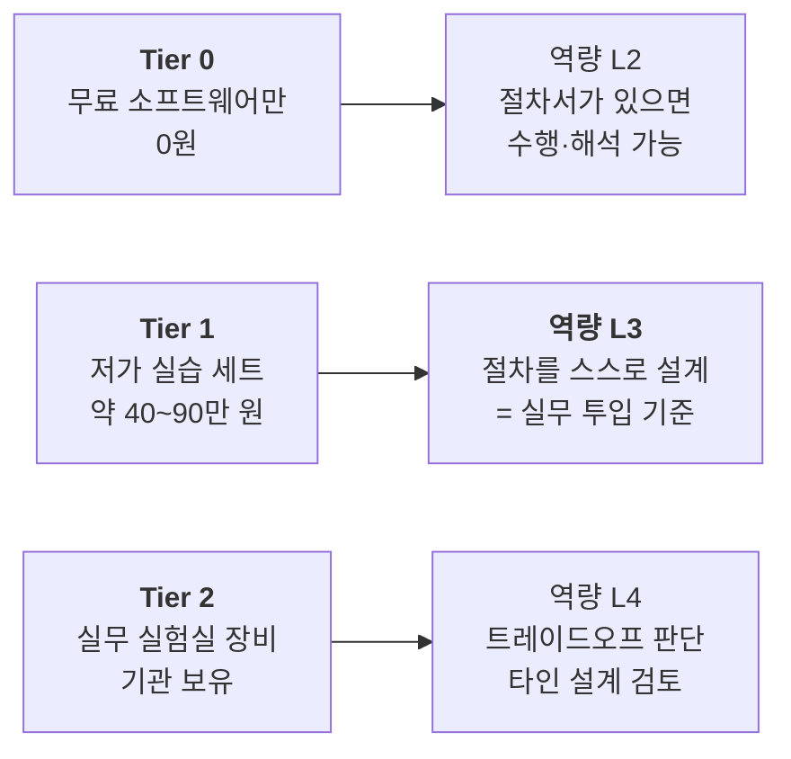

# 부록 D — 장비·소프트웨어 준비 가이드

**문서 번호**: RF-CUR-APX-D
**버전**: v1.0
**대응 규칙**: 설계서 §9 (규칙 P3-a, P3-b)
**확인 시점**: 2026년 8월 (가격·모델명은 변동하므로 구매 전 재확인 필요)

---

## D.0 시작하기 전에

이 커리큘럼은 **장비가 없어도 시작할 수 있게** 설계했습니다. 다만 도달할 수 있는 역량 수준이 달라집니다.



> **실무 기준인 L3에 도달하려면 최소 Tier 1이 필요**합니다. 손으로 커넥터를 조여 보고, 케이블을 구부렸을 때 위상이 흔들리는 걸 직접 봐야 붙는 감각이 있기 때문입니다. 반대로 Tier 1만으로도 L3까지는 갑니다 — 비싼 장비가 없어서 못 배우는 것은 아닙니다.

---

## D.1 Tier 0 — 무료 소프트웨어 (전원 필수)

장비 유무와 무관하게 **모두가 설치**합니다. 전체 실습의 약 50 %가 여기서 이루어집니다.

### D.1.1 설치

```bash
# Python 3.10 이상 필요
python3 -m venv rf-env && source rf-env/bin/activate

pip install numpy scipy matplotlib          # 수치 계산·플롯
pip install scikit-rf                        # S-파라미터, 교정, Touchstone
pip install koreanize-matplotlib             # 그림에 한글이 깨지지 않게
pip install pyvisa pyvisa-py                 # 계측기 자동화 (M16)
pip install jupyterlab                       # 실습 노트북
```

설치 확인:

```bash
python3 -c "import numpy, scipy, matplotlib, skrf, pyvisa; print('OK')"
```

### D.1.2 소프트웨어 목록

| 도구 | 용도 | 사용 모듈 | 비고 |
|---|---|---|---|
| **Python + NumPy/SciPy** | 모든 계산 실습 | 전 모듈 | 이 커리큘럼의 계산기는 전부 직접 만듭니다 |
| **Matplotlib** | 그림·데이터 플롯 | 전 모듈 | 공통 스타일은 `scripts/rf_style.py` 사용 |
| **scikit-rf** | S-파라미터, 캐스케이드, 디임베딩, 교정 | M03, M06, M08, M14 | BSD 라이선스 오픈소스 |
| **KiCad** | 회로도·PCB 레이아웃 | M17 | 무료. RF 레이아웃 실습용 |
| **openEMS** | 3차원 전자기 시뮬레이션 (FDTD) | M07, M17 | 상용 도구의 무료 대안 |
| **Qucs-S / QucsStudio** | RF 회로 시뮬레이션 | M07, M08 | openEMS와 연동 가능 |
| **PyVISA** | 계측기 원격 제어 | M16 | Tier 1/2 장비가 있을 때 함께 사용 |

> **상용 도구(ADS, AWR, HFSS, CST)에 대하여**: 실무에서는 널리 쓰이지만 개인이 사기 어렵습니다. 이 커리큘럼은 **상용 도구를 전제하지 않습니다.** 다만 M07·M17에서 개념과 화면 구성은 설명하여, 나중에 회사에서 접했을 때 헤매지 않도록 합니다. 학생용 무료 라이선스가 제공되는 경우가 있으니 해당되면 확인해 보십시오.

---

## D.2 Tier 1 — 저가 실습 세트 (권장)

### D.2.1 구성과 예산

| 품목 | 권장 사양 | 대략 가격 | 필수도 |
|---|---|---|---|
| **벡터 회로망 분석기** | NanoVNA-H4 (4인치 화면, 10 kHz–1.5 GHz급) | 약 15만 원 | ★★★ 필수 |
| **스펙트럼 분석기** | tinySA Ultra / Ultra+ (100 kHz–5.4 GHz급) | 약 20~30만 원 | ★★★ 필수 |
| **SDR 수신기** | RTL-SDR V4 등 | 약 4만 원 | ★★☆ 권장 |
| **동축 케이블** | SMA 수-수, 위상 안정형, 30~60 cm, 2~3개 | 약 5만 원 | ★★★ 필수 |
| **어댑터 세트** | SMA 암-암, 수-수, N-SMA 변환 | 약 3만 원 | ★★★ 필수 |
| **고정 감쇠기** | 3 dB / 6 dB / 10 dB / 20 dB, SMA | 약 6만 원 | ★★★ 필수 |
| **50 Ω 종단기** | SMA, 2개 | 약 2만 원 | ★★★ 필수 |
| **토크 렌치** | 8 in-lb 브레이크오버형 (SMA/3.5 mm용) | 약 5~10만 원 | ★★☆ 권장 |
| **실습용 부품** | 평가용 BPF, LNA 모듈, 칩 안테나, 0402 L/C 세트 | 약 10만 원 | ★★☆ 권장 |
| **ESD 대책** | 손목 스트랩, 접지 매트 | 약 3만 원 | ★★☆ 권장 |
| **합계** | | **약 70~90만 원** | |

최소 구성(★★★만)이면 **약 45만 원**입니다.

> **가격 주의**: 위 금액은 2026년 8월 기준의 대략치이며 환율·유통에 따라 크게 변합니다. 예를 들어 NanoVNA-H4는 한 미국 소매점에서 $109.95로 표시되어 있었습니다 ([R&L Electronics](https://www.randl.com/index.php?main_page=product_info&products_id=75145)). tinySA는 초기 모델이 약 $49로 소개되었고 ([RTL-SDR](https://www.rtl-sdr.com/the-49-tinysa-spectrum-analyzer/)), Ultra 계열은 그보다 높습니다 ([S3 Semi 비교](https://www.s3semi.com/tinysa-vs-nanovna-how-to-pick-the-right-analyzer-for-your-rf-projects/)). **구매 전 반드시 현재 가격을 직접 확인**하십시오.

### D.2.2 Tier 1 장비의 한계 — 반드시 알고 쓸 것

저가 장비는 개념 학습과 절차 훈련에 충분하지만, **실무 판정 근거로 쓸 수 없습니다.** 이 한계를 모른 채 결과를 믿는 것이 초심자의 가장 위험한 실수입니다.

| 항목 | Tier 1 (NanoVNA/tinySA) | Tier 2 (실무 장비) | 무엇이 문제인가 |
|---|---|---|---|
| 동적 범위 | 40~70 dB 수준 | 100 dB 이상 | 깊은 저지대역 억압을 못 잰다 |
| 잡음 바닥 | 높음 | 매우 낮음 | 작은 스퓨리어스를 못 본다 |
| 주파수 정확도 | 보통 | 기준 발진기 기반 고정밀 | 좁은 필터의 대역 판정이 흔들린다 |
| 교정 표준 품질 | 저가 표준기 | 소급성 있는 교정 키트 | 교정 자체에 오차가 실린다 |
| 측정 불확도 | **정량화되어 있지 않음** | 제조사가 규격으로 보증 | **합부 판정 불가** |
| 전력 정확도 | ±수 dB | ±수 십분의 1 dB | 절대 전력을 믿을 수 없다 |

> **이 한계는 결함이 아니라 교재입니다.** M14(측정 불확도)에서 "왜 같은 DUT를 두 장비로 재면 값이 다른가"를 직접 체험하는 소재로 씁니다. 값이 다르다는 사실 자체가 불확도를 몸으로 배우는 가장 좋은 방법입니다.

**규칙**: Tier 1 결과를 보고할 때는 **반드시 "Tier 1 장비 측정, 불확도 미정량"** 을 명기합니다.

---

## D.3 Tier 2 — 실무 실험실 장비 (기관 보유 시)

| 장비 | 용도 | 사용 모듈 |
|---|---|---|
| 실험실급 VNA (2포트 이상) | S-파라미터 정밀 측정, 교정, 디임베딩 | M14 |
| 신호·스펙트럼 분석기 | 스퓨리어스, 하모닉, ACLR, EVM | M05, M13, M15 |
| 벡터 신호 발생기 | 변조 신호 생성 | M13, M15 |
| 신호 발생기 2대 + 합성기 | 2톤 시험 (IP3) | M15 |
| 전력계 + 파워 센서 | 절대 전력 기준 측정 | M15 |
| 잡음원 (ENR 교정품) | Y-factor 잡음지수 측정 | M15 |
| 위상잡음 분석기 | 발진기 특성화 | M15 |
| 로드풀 시스템 | PA 최적 부하 탐색 | M15 |
| 항온조 | 온도 특성 시험 | M16 |
| 무반사실 / CATR | 안테나·OTA 측정 | M10 |
| 교정 키트 + 검증 키트 | 교정 및 교정 품질 검증 | M14 |
| 커넥터 게이지 | 커넥터 수명 관리 | M04 |

---

## D.4 커넥터 토크 규격 ★

> **이 절은 설계서 §11.2에서 "미해결"로 등록되었던 항목입니다.** 조사 결과, 출처마다 값이 달랐던 것은 **자료가 틀려서가 아니라 재질·시리즈·용도에 따라 실제로 값이 다르기 때문**임이 확인되었습니다. 아래에 그 구조를 정리합니다.

### D.4.1 왜 값이 제각각인가

같은 "SMA"라도 다음에 따라 규정 토크가 달라집니다.

1. **몸체 재질** — 황동(brass)은 무르고, 스테인리스강은 단단합니다.
2. **시리즈** — 일반 SMA인지, 3.5 mm/2.92 mm 같은 정밀 계측용인지.
3. **용도 단계** — 시험 중 임시 체결인지, 최종 설치인지.

### D.4.2 참고 값 (구매처 사양이 항상 우선)

| 커넥터 | 대표적 권장 토크 | 비고 |
|---|---|---|
| SMA (황동) | 약 3~5 in-lb | 무르므로 과조임 시 나사산이 상함 |
| SMA (스테인리스강) | 약 7~10 in-lb | 재질이 단단해 더 높은 토크 허용 |
| **3.5 mm / 2.92 mm** | **8 in-lb (약 0.9 N·m)** | 정밀 계측용. 반드시 토크 렌치 사용 |
| N형 / TNC (표준) | 약 10~13 in-lb | |
| N형 / TNC (정밀 스테인리스) | 약 20~26 in-lb | |
| 7/16 DIN | 약 220~300 in-lb | 자릿수가 다름에 주의 |

**교차검증 출처**: [Times Microwave Systems — Connector Torque Requirements](https://timesmicrowave.com/connector-torque-requirements/) (제조사, 등급 B) · [Microwave Journal — Connector Torque Requirements](https://www.microwavejournal.com/articles/1064-connector-torque-requirements) (등급 D) · [HUBER+SUHNER SMA 카탈로그: 권장 0.45 N·m ≈ 4.0 in-lb](https://pdf.directindustry.com/pdf/huber-suhner/series-sma-coaxial-connectors/30583-293489.html) (제조사, 등급 B) · [Mini-Circuits — Applying Proper Torque to Microwave Connectors](https://blog.minicircuits.com/applying-proper-torque-to-microwave-connectors/) 및 [TRQ 시리즈 4/8 in-lb 렌치](https://www.minicircuits.com/WebStore/Wrenches.html) (제조사, 등급 B) · [Centric RF Torque Specifications](https://www.centricrf.com/torque-specifications/), [Data Alliance — SMA/RP-SMA 토크 등급](https://www.data-alliance.net/blog/torque-ratings-of-sma-and-rpsma-antenna-cable-connectors-adapters), [LenoRF 토크 가이드](https://www.rfcnn.com/blog/rf-connector-torque-guide-sma-n-3-5mm-2-92mm-4-3-10) (등급 D) · 치수 인터페이스 규격: [MIL-STD-348](https://everyspec.com/MIL-STD/MIL-STD-0300-0499/download.php?spec=MIL-STD-348B_CHG-1.054027.pdf) (등급 A)

> ⚠️ **규칙**: 위 표는 **참고용**입니다. 실제 작업에서는 **해당 커넥터 제조사의 사양서를 확인**하십시오. 특히 황동 SMA에 스테인리스강 기준 토크(8~10 in-lb)를 적용하면 커넥터가 상합니다. 한 자료는 "연결부 구조와 시험 단계에 따라 SMA에 4, 5, 8 in-lb가 각각 지정된다"고 명시하고 있어, **단일 정답이 존재하지 않음**을 확인해 줍니다.

### D.4.3 실무 요령

| 하지 말 것 | 이유 |
|---|---|
| 일반 렌치나 펜치로 조이기 | 과조임으로 나사산·중심핀·유전체가 영구 손상 |
| 손가락 힘만으로 체결 | 헐거우면 반사가 늘고, 진동·온도 변화에 풀림 |
| 다른 계열 강제 결합 | SMA와 3.5 mm는 결합되지만 정밀 커넥터 쪽이 상함 |
| 커넥터 몸체를 돌리기 | **너트만 돌립니다.** 몸체를 돌리면 케이블과 중심핀이 비틀림 |
| 게이지 점검 생략 | 중심핀이 튀어나온 커넥터 하나가 상대 커넥터를 전부 망침 |

---

## D.5 안전 수칙

| 위험 | 대책 |
|---|---|
| **장비 입력 소손** | 연결 전 반드시 ① 예상 전력 계산 ② 감쇠기 삽입 ③ 장비 최대 정격 확인 |
| **직류(DC) 유입** | 바이어스가 걸린 회로를 잴 때는 DC 차단기(DC block) 사용 |
| **ESD (정전기)** | 손목 스트랩·접지 매트. MMIC와 LNA는 특히 취약 |
| **고전력 RF 노출** | PA 출력을 열린 케이블로 두지 않기. 항상 종단하거나 더미로드 연결 |
| **커넥터 파손** | D.4 준수 |

---

## D.6 실습 환경 점검 체크리스트

실습 시작 전 매번 확인합니다. (M04에서 이 목록을 직접 만들어 보는 것이 실습 과제입니다.)

- [ ] 장비 예열 완료 (정밀 측정은 30분 이상 권장)
- [ ] 커넥터 육안 점검 (중심핀 휘어짐, 이물질, 나사산 손상)
- [ ] 케이블 육안 점검 (꺾임, 피복 손상)
- [ ] 입력 최대 정격 확인, 필요한 감쇠기 준비
- [ ] DC 성분 유무 확인
- [ ] ESD 대책 착용
- [ ] 측정 조건 기록 준비 (주파수, 전력, 온도, 장비 모델·일련번호, 교정 일자)

> 마지막 항목이 중요합니다. **기록하지 않은 측정은 재현할 수 없고, 재현할 수 없는 측정은 근거가 되지 못합니다.** (→ M16)

---

## 변경 이력

| 버전 | 일자 | 내용 |
|---|---|---|
| v1.0 | 2026-08-20 | 최초 작성. 설계서 §11.2의 미해결 항목이던 **커넥터 토크 규격을 §D.4에서 해소** (충돌이 아니라 재질·시리즈별 차이임을 확인, 제조사 1차 출처 3건 확보) |
| — | 2026-08-20 | **검토 3회 완료.** 1차(사실): 토크 값을 제조사 1차 출처(Times Microwave, HUBER+SUHNER, Mini-Circuits) 3건 + 업계 출처 3건으로 교차검증, 단일 정답이 없음을 확인. 2차(교육): §D.2.2 "Tier 1 장비의 한계"를 결함이 아닌 **학습 소재**로 재서술 — 값이 다르다는 사실 자체가 불확도를 배우는 방법임을 명시. 3차(구조): 가격의 시점 의존성을 §D.0·§D.2.1에 명기하고 설계서 §11.2와 동기화 |
