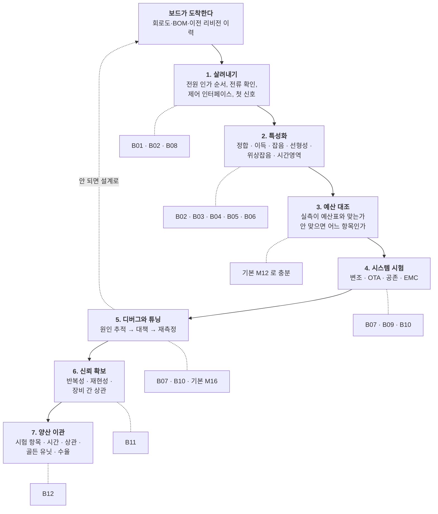

# 심화 과정 설계서 — 벤치 엔지니어

**문서 번호**: RF-CUR-ADV-000 · **버전**: v1.0 · **대상 과정**: 심화(Advanced Bench Track)
**선수 과정**: 본 커리큘럼 M00–M17 전편 + 캡스톤

---

## 0. 한 장 요약

| | |
|---|---|
| **누구를 위한 것인가** | 완성된 RF 보드·모듈을 받아 **살려내고, 재고, 판정하고, 고쳐서, 양산으로 넘기는** 사람 |
| **무엇이 달라지는가** | 기본 과정이 "이 값을 어떻게 재는가"였다면, 심화는 **"이 값을 믿어도 되는가, 아니면 무엇을 더 해야 하는가"** |
| **범위** | 커넥터·보드·모듈·시스템 수준. **집적회로(Integrated Circuit, IC) 내부는 다루지 않습니다** |
| **모듈** | B01–B12 (12편) + 심화 캡스톤 |
| **분량** | 이론 62 h + 실습 94 h = **156 h** · 캡스톤 40 h |
| **장비 등급** | T0(무료 소프트웨어) / T1(저가 장비) / T2(실무 장비) 병기. 심화는 T2 비중이 높으므로 **T2 없이 할 수 있는 대체 실습을 모든 모듈에 함께 둡니다** |

---

## 1. 왜 심화 과정이 따로 필요한가

M14–M16까지 오면 학습자는 이런 상태입니다.

- 잡음지수(Noise Figure, NF)를 Y 계수법으로 잴 수 있다 ([M15 §3](../01_모듈/M15_정밀측정2_잡음선형성위상잡음.md))
- 벡터 회로망 분석기(Vector Network Analyzer, VNA)를 교정하고 픽스처를 뺄 수 있다 ([M14 §8](../01_모듈/M14_정밀측정1_교정과불확도.md))
- 데이터시트와 우리 스펙을 대조해 합·부를 판정할 수 있다 ([M16 §3](../01_모듈/M16_DUT검증과튜닝과자동화.md))

그런데 실제 벤치에서는 여기서부터 질문이 시작됩니다.

| 벤치에서 실제로 나오는 말 | 기본 과정이 답하지 못하는 이유 |
|---|---|
| "이 저잡음 증폭기(Low Noise Amplifier, LNA), 데이터시트는 NF 0.8 dB인데 우리 보드에서는 1.6이 나옵니다" | NF는 **소스 임피던스에 따라 달라집니다.** 그 관계를 다루는 것이 네 개의 잡음 파라미터인데 기본 과정에는 없습니다 → **B05** |
| "50 Ω 부하로는 규격을 통과하는데 실제 변조 파형을 넣으면 인접 채널 누설비(Adjacent Channel Leakage Ratio, ACLR)가 3 dB 나쁩니다" | 2-tone 시험은 **메모리 효과**를 보여주지 않습니다 → **B04** |
| "사전 시험에서 240 MHz가 6 dB 넘습니다. 어디서 나오는지 모르겠습니다" | 규격을 아는 것과 **방사원을 찾아내는 것**은 다른 기술입니다 → **B07** |
| "Wi-Fi를 켜면 셀룰러 감도가 4 dB 떨어집니다" | 예산표에는 **자기간섭** 항목이 없습니다 → **B10** |
| "제가 재면 통과, 옆자리가 재면 탈락입니다" | 불확도는 한 번의 측정에 대한 것이고, 이건 **측정 시스템 자체의 문제**입니다 → **B11** |
| "벤치에서는 되는데 양산 시험기에서 3 %가 떨어집니다" | 벤치와 자동시험장비(Automatic Test Equipment, ATE)는 **다른 것을 잽니다** → **B12** |

**심화 과정은 이 여섯 종류의 질문에 답하는 과정입니다.**

---

## 2. 범위 — 하는 것과 하지 않는 것

### 2.1 다루는 것

| 층 | 다루는 범위 |
|---|---|
| **부품** | 패키지된 부품, 모듈, 커넥터화된 소자 |
| **보드** | 인쇄회로기판(Printed Circuit Board, PCB) 조립품의 살려내기·특성화·디버그 |
| **시스템** | 무선 여러 개가 한 기구에 들어간 상태의 간섭·공존 |
| **공정** | 벤치에서 양산 시험으로 넘기는 구간 |

### 2.2 다루지 않는 것 — 그리고 그 이유

| 제외 항목 | 이유 |
|---|---|
| **IC 내부 설계** (트랜지스터 크기, 레이아웃, 공정) | 벤치 엔지니어의 손이 닿지 않습니다. 칩은 **사양서와 측정 대상**으로만 나옵니다 |
| **온웨이퍼 프로빙**, 다이 수준 디임베딩 | IC 특성화 영역입니다. 같은 이름의 기법(디임베딩)이라도 **대상이 다릅니다** — 이 과정은 보드 픽스처만 다룹니다 |
| **X-파라미터·비선형 모델 추출** | 부품 모델을 만드는 일이며, 벤치 엔지니어는 **모델을 쓰는 쪽**입니다 |
| **반도체 신뢰성 물리** (전자이동, 핫캐리어 열화 등) | 위와 같습니다. 다만 **보드·모듈 수준 신뢰성 시험**은 B08·B12에서 다룹니다 |
| **안테나 설계** | [M10](../01_모듈/M10_안테나와전파.md)이 원리를, B09가 **측정**을 다룹니다. 설계 자체는 별도 영역입니다 |

> 📌 **경계를 한 줄로**: 손에 인두와 프로브를 들고 할 수 있는 일까지가 이 과정입니다. 마스크를 새로 떠야 하는 일은 아닙니다.

---

## 3. 기존 커리큘럼과의 경계 — 개념 소유권

지침 5(중언부언 금지)에 따라, **심화 모듈은 기본 모듈이 이미 소유한 개념을 다시 정의하지 않습니다.** 아래 표가 그 경계입니다.

| 주제 | 기본 과정이 소유하는 것 | 심화가 소유하는 것 |
|---|---|---|
| 잡음 | NF의 정의와 Friis 누적 ([M08 §2](../01_모듈/M08_증폭기.md), [M12 §2](../01_모듈/M12_시스템예산설계.md)), Y 계수·콜드소스 측정 ([M15 §3](../01_모듈/M15_정밀측정2_잡음선형성위상잡음.md)) | **소스 임피던스 의존성**과 네 개의 잡음 파라미터 (B05) |
| 선형성 | P1dB·IP3의 정의 ([M08 §4](../01_모듈/M08_증폭기.md)), 2-tone 셋업 ([M15 §6](../01_모듈/M15_정밀측정2_잡음선형성위상잡음.md)) | **변조 파형·펄스·메모리 효과** (B04) |
| 위상잡음 | Leeson 모델과 시스템 영향 ([M09 §9](../01_모듈/M09_주파수변환과신호원.md)), 측정 3종 ([M15 §10](../01_모듈/M15_정밀측정2_잡음선형성위상잡음.md)) | **상관 방식의 함정, 잔류 위상잡음, 시간영역 안정도** (B06) |
| 교정·디임베딩 | 12항 오차 모델, SOLT/TRL, 픽스처 기초 ([M14 §2](../01_모듈/M14_정밀측정1_교정과불확도.md), [M14 §8](../01_모듈/M14_정밀측정1_교정과불확도.md)) | **다포트·차동, 표준화된 자동 픽스처 제거, S-파라미터 파일 품질** (B03) |
| 불확도 | 한 번의 측정에 붙는 불확도 ([M14 §10](../01_모듈/M14_정밀측정1_교정과불확도.md)), 가드밴딩 ([M16 §5](../01_모듈/M16_DUT검증과튜닝과자동화.md)) | **여러 번·여러 사람·여러 장비**의 변동 (B11) |
| EMC | 어떤 규격이 왜 적용되는가 ([M17 §14](../01_모듈/M17_보드설계와인증.md)) | **방사원을 찾아 고치는 절차** (B07) |
| 전원·열 | PDN 설계 ([M17 §9](../01_모듈/M17_보드설계와인증.md)), 열 비아 ([M17 §11](../01_모듈/M17_보드설계와인증.md)) | **벤치에서 재는 법과 판정** (B08) |
| OTA | 왜 도선 없이 재야 하는가 ([M10 §10](../01_모듈/M10_안테나와전파.md)) | **챔버 선택, TRP/TIS, 불확도** (B09) |
| 주파수 계획 | 스퍼 차트 ([M09 §6](../01_모듈/M09_주파수변환과신호원.md)) | **살아 있는 시스템에서 간섭원 추적** (B10) |
| 자동화 | SCPI·PyVISA 기초 ([M16 §11](../01_모듈/M16_DUT검증과튜닝과자동화.md)) | **통계 처리와 회귀 시험** (B11), **양산 이관** (B12) |
| 시간 영역 | — (없음) | **오실로스코프·프로브·지터** (B02) — 새 영역 |

> ⚠️ **새로 생기는 영역은 두 개뿐입니다.** B02(시간 영역)와 B12(양산 이관). 나머지 열 편은 기본 과정이 놓은 층 위에 **한 층을 더 얹는 것**이므로, 각 모듈은 "M-- 가 여기까지 했고 나는 여기서 시작한다"를 §0에 반드시 적습니다.

---

## 4. 벤치 엔지니어의 일 — 모듈 목록의 근거

모듈을 먼저 정하고 이유를 붙이면 빠지는 것이 생깁니다. 그래서 **일을 먼저 쪼갠 다음** 각 조각에 모듈을 붙였습니다.

*그림 ADV-1. 벤치 엔지니어의 작업 흐름과 모듈 배치. 점선 상자가 그 단계를 다루는 모듈입니다. **4단계(예산 대조)에만 심화 모듈이 붙지 않는데**, 그 일은 [M12](../01_모듈/M12_시스템예산설계.md)가 이미 충분히 다루기 때문입니다. 왼쪽으로 되돌아가는 점선이 실제로 시간을 가장 많이 쓰는 경로입니다.*

---

## 5. 모듈 구성

| 번호 | 제목 | 이론 | 실습 | 주된 장비 등급 |
|---|---|---|---|---|
| **B01** | 벤치 방법론 — 실험을 설계하고 기록하는 법 | 4 h | 6 h | T0 |
| **B02** | 시간 영역 — 오실로스코프, 프로브, 지터 | 6 h | 10 h | T1·T2 |
| **B03** | 다포트·차동 S-파라미터와 픽스처 제거 | 6 h | 8 h | T2 |
| **B04** | 대신호 — 변조 파형, 펄스, 메모리 효과 | 6 h | 10 h | T2 |
| **B05** | 잡음의 심화 — 네 개의 잡음 파라미터 | 5 h | 7 h | T2 |
| **B06** | 위상잡음과 지터 — 상관 방식과 그 함정 | 6 h | 8 h | T2 |
| **B07** | EMC 벤치 디버그 — 방사원을 찾아내는 법 | 5 h | 9 h | T1 |
| **B08** | 전원·바이어스·열 — 벤치에서 재는 법 | 5 h | 7 h | T1 |
| **B09** | 안테나와 OTA — 챔버 안에서 | 5 h | 7 h | T2 |
| **B10** | 시스템 디버그 — 디센스와 공존 | 6 h | 8 h | T1·T2 |
| **B11** | 측정 시스템 분석 — 반복성·재현성·상관 | 4 h | 8 h | T0 |
| **B12** | 양산 이관 — 벤치에서 시험기로 | 4 h | 6 h | T0 |
| | **합계** | **62 h** | **94 h** | |

### 5.1 순서를 이렇게 정한 이유

세 덩어리로 묶입니다.

| 덩어리 | 모듈 | 왜 여기인가 |
|---|---|---|
| **재는 법을 더 깊게** | B02–B06 | 특성화 단계의 도구들입니다. **B02를 먼저** 두는 이유는 시간 영역이 새 영역이라 다른 것과 엮이지 않고, 살려내기 단계에서 바로 쓰이기 때문입니다 |
| **시스템에서 벌어지는 일** | B07–B10 | 부품 하나가 아니라 **완성품에서만 나타나는 문제**들입니다. 특성화를 할 줄 알아야 원인을 좁힐 수 있으므로 뒤에 둡니다 |
| **숫자를 믿게 만들기** | B11–B12 | 앞의 모든 측정에 적용되는 층입니다. **마지막에 두는 이유**는, 무엇을 재는지 알아야 그 측정의 반복성을 논할 수 있기 때문입니다 |

B01은 어디에도 속하지 않고 맨 앞에 둡니다. 나머지 열한 편이 모두 **"실험을 설계하고 기록한다"**는 습관 위에서 돌아가기 때문입니다.

---

## 6. 모듈 상세

### B01 — 벤치 방법론: 실험을 설계하고 기록하는 법

| | |
|---|---|
| **소유 개념** | 가설–측정–판정 루프, **한 번에 하나만 바꾸기**와 그것이 깨지는 경우, 재현성 확인 절차(같은 것을 다시 재기), 랩노트 규약과 원시 데이터 보존, 벤치 물리 배치(전원·접지·케이블 관리), 측정 순서가 결과를 바꾸는 경우(열·드리프트), 고전력 취급과 보호, 시간 예산 |
| **경계** | [M15 §1](../01_모듈/M15_정밀측정2_잡음선형성위상잡음.md)이 "무엇을 먼저 재는가"를 소유합니다. 여기서는 **하나의 실험을 어떻게 설계하고 기록하는가**를 다룹니다 |
| **주요 절** | 1) 벤치에서 나오는 두 가지 실패 — 잘못 재기와 기억 못 하기   2) 하나의 실험 = 가설 + 측정 + 판정 기준   3) 변수를 하나만 바꾼다 — 그리고 못 바꾸는 경우   4) 다시 재기: 같은 조건, 다시 연결, 다른 날   5) 원시 데이터를 버리지 않는다   6) 벤치 배치 — 전원·접지·케이블·열   7) 고전력과 보호 — 무엇이 먼저 타는가   8) 시간 예산 — 4주짜리 특성화를 어떻게 쪼개는가 |
| **Lab** | **L-B01-a (T0)** 가짜 드리프트 데이터로 "고쳤다"는 착각 재현   **L-B01-b (T1)** 같은 DUT를 재연결 10회 → 반복성 분포   **L-B01-c (T0)** 랩노트 서식을 만들고 이전 모듈 측정 하나를 옮겨 적기 |
| **시각자료** | ① 실험 설계 루프 ② 벤치 배치 도면(전원/접지/케이블) ③ 재연결 반복성 히스토그램(생성) ④ 드리프트가 만드는 가짜 개선(생성) ⑤ 보호 회로 계통도 |

### B02 — 시간 영역: 오실로스코프, 프로브, 지터

| | |
|---|---|
| **소유 개념** | 실시간 vs 등가시간 샘플링, 대역폭·상승시간·샘플링 속도의 관계, **프로브 부하와 접지 인덕턴스**, 능동/차동/전류 프로브, 트리거링 전략, 아이 다이어그램, **지터 분해**(무작위 RJ, 결정성 DJ, 주기성 PJ, 데이터 의존 DDJ), 이중 디랙(dual-Dirac) 모델과 배스터브 곡선, 스코프로 RF를 볼 때의 한계 |
| **경계** | 새 영역입니다. [M05](../01_모듈/M05_첫측정.md)는 VNA와 스펙트럼 분석기(Spectrum Analyzer, SA)를 소유합니다 |
| **주요 절** | 1) 왜 RF 엔지니어가 스코프를 드는가   2) 대역폭·상승시간·샘플링 — 세 숫자의 관계   3) 실시간 vs 등가시간   4) **프로브가 회로를 바꾼다** — 부하와 접지 인덕턴스   5) 프로브 종류와 선택   6) 트리거 — 보고 싶은 것만 잡는 법   7) 아이 다이어그램 읽기   8) 지터 분해 — RJ는 안 끝나고 DJ는 끝난다   9) 이중 디랙과 배스터브 — 낮은 오류율을 어떻게 외삽하는가   10) 스코프로 RF를 볼 때의 한계 |
| **Lab** | **L-B02-a (T0)** 상승시간·대역폭 관계를 계산·시뮬레이션으로 확인   **L-B02-b (T1)** 접지 리드 길이를 바꾸며 링잉 관측   **L-B02-c (T2)** 아이 다이어그램과 지터 분해, 배스터브 외삽   **L-B02-d (T0)** 합성 지터 데이터로 RJ/DJ 분리 직접 구현 |
| **시각자료** | ① 대역폭·상승시간 곡선(생성) ② 프로브 등가회로 ③ 접지 리드 길이별 응답(생성) ④ 아이 다이어그램 해부 ⑤ 지터 계통도(RJ/DJ/PJ/DDJ) ⑥ 이중 디랙 모델(생성) ⑦ 배스터브 곡선(생성) |

### B03 — 다포트·차동 S-파라미터와 픽스처 제거

| | |
|---|---|
| **소유 개념** | 4포트 이상 측정, **혼합모드 S-파라미터**(Sdd·Scc·Sdc·Scd), 2x-Thru 기반 자동 픽스처 제거(Automatic Fixture Removal, AFR)와 IEEE 370, 픽스처 등급 판정, S-파라미터 파일 품질 검사(수동성·상호성·인과성), 커넥터 재체결 반복성 |
| **경계** | [M14 §8](../01_모듈/M14_정밀측정1_교정과불확도.md)이 픽스처와 디임베딩의 기초를 소유합니다. 여기서는 **표준화된 방법과 다포트·차동**을 다룹니다 |
| **주요 절** | 1) 포트가 넷이면 무엇이 달라지는가   2) 차동 신호를 S-파라미터로 적기 — 혼합모드   3) 모드 변환(Sdc)이 말해 주는 것   4) 2x-Thru — 픽스처를 대칭으로 만들어 반으로 가른다   5) IEEE 370 — 무엇을 표준화했는가   6) 픽스처 등급 — 내 픽스처는 쓸 만한가   7) 자기 디임베딩으로 검증하기   8) S-파라미터 파일 품질 — 수동성·상호성·인과성   9) 재체결 반복성 — 커넥터가 만드는 산포 |
| **Lab** | **L-B03-a (T0)** `scikit-rf`로 혼합모드 변환을 손으로 구현하고 내장 함수와 대조   **L-B03-b (T0)** 공개 S-파라미터 파일의 수동성·인과성 검사기 작성   **L-B03-c (T2)** 2x-Thru 쿠폰으로 픽스처 제거 후 자기 디임베딩 검증   **L-B03-d (T1)** 커넥터 20회 재체결 반복성 측정 |
| **시각자료** | ① 4포트 ↔ 혼합모드 변환도 ② 2x-Thru 구조와 절단면 ③ 픽스처 제거 전후 비교(생성) ④ 수동성 위반 예시(생성) ⑤ 재체결 산포(생성) |

### B04 — 대신호: 변조 파형, 펄스, 메모리 효과

| | |
|---|---|
| **소유 개념** | AM-AM/AM-PM 특성 측정, **메모리 효과**(열·바이어스·대역폭 기인), 펄스 RF 측정과 자기가열 분리, 잡음 전력비(Noise Power Ratio, NPR), 다중톤 시험, 능동 로드풀 vs 수동 로드풀, 디지털 사전왜곡(Digital Predistortion, DPD) 루프의 벤치 구현, 파고율 관리 |
| **경계** | [M08 §4](../01_모듈/M08_증폭기.md)가 압축의 정의를, [M15 §6](../01_모듈/M15_정밀측정2_잡음선형성위상잡음.md)이 2-tone 셋업을, [M15 §11](../01_모듈/M15_정밀측정2_잡음선형성위상잡음.md)이 로드풀 개론을 소유합니다 |
| **주요 절** | 1) 2-tone이 못 보여주는 것   2) AM-AM과 AM-PM — 진폭이 위상을 흔든다   3) 메모리 효과 — 왜 "지금 입력"만으로 출력이 안 정해지는가   4) 세 가지 메모리원: 열, 바이어스망, 정합 대역폭   5) 펄스 측정 — 자기가열을 떼어 내는 법   6) NPR — 노치를 파고 얼마나 메워지는지 본다   7) 다중톤 — 몇 개를, 어떤 위상으로   8) 능동 로드풀은 무엇을 더 할 수 있는가   9) 벤치에서 DPD 루프 돌리기   10) 무엇을 보고할 것인가 |
| **Lab** | **L-B04-a (T0)** 메모리 없는 모델 vs 메모리 다항식 모델의 ACLR 차이 시뮬레이션   **L-B04-b (T2)** AM-AM/AM-PM 측정과 히스테리시스 관측   **L-B04-c (T2)** NPR 측정 셋업 구성과 노치 깊이 확인   **L-B04-d (T0)** 간이 DPD(메모리 다항식) 구현 후 ACLR 개선량 계산 |
| **시각자료** | ① AM-AM/AM-PM 곡선(생성) ② 메모리 효과의 히스테리시스(생성) ③ 펄스 측정 타이밍도 ④ NPR 스펙트럼(생성) ⑤ DPD 루프 블록도 ⑥ 능동/수동 로드풀 비교도 |

### B05 — 잡음의 심화: 네 개의 잡음 파라미터

| | |
|---|---|
| **소유 개념** | **F_min · \|Γ_opt\| · ∠Γ_opt · Rn** 네 개의 잡음 파라미터, 소스 반사계수에 따른 NF 변화식, 임피던스 튜너를 쓴 소스풀, 저 NF 측정에서 오차를 지배하는 항, 잡음 온도와 NF의 재론, 수신 감도의 실측(오류율 기반) |
| **경계** | [M08 §2](../01_모듈/M08_증폭기.md)가 NF의 정의를, [M08 §3](../01_모듈/M08_증폭기.md)이 "왜 LNA는 잡음 정합인가"를, [M15 §3](../01_모듈/M15_정밀측정2_잡음선형성위상잡음.md)·[M15 §4](../01_모듈/M15_정밀측정2_잡음선형성위상잡음.md)가 측정법을 소유합니다 |
| **주요 절** | 1) 데이터시트의 NF는 어느 임피던스에서인가   2) 네 개의 파라미터와 그 식   3) Γ_opt는 왜 정합점과 다른가 (M08 §3의 답을 수식으로)   4) Rn — NF가 얼마나 빨리 나빠지는가   5) 소스풀 — 튜너로 임피던스를 옮겨 가며 잰다   6) 몇 점을 어디에 찍을 것인가   7) 저 NF 측정의 오차 — 무엇이 지배하는가   8) 보드 위 LNA의 NF가 데이터시트와 다른 이유를 끝까지 따라가기   9) 감도 실측 — 오류율로 확인하기 |
| **Lab** | **L-B05-a (T0)** 네 파라미터로 NF 등고선을 그리고 정합점과 비교   **L-B05-b (T0)** 공개 잡음 파라미터 데이터로 최적 정합망 설계   **L-B05-c (T2)** 튜너 소스풀로 F_min·Γ_opt 추출   **L-B05-d (T1)** 정합망을 바꿔 가며 NF 변화 실측 |
| **시각자료** | ① 스미스 차트 위 NF 등고선(생성) ② Γ_opt vs Γ_ms 비교(생성) ③ Rn이 다른 두 소자의 등고선(생성) ④ 소스풀 셋업도 ⑤ 오차 기여도 막대(생성) |

### B06 — 위상잡음과 지터: 상관 방식과 그 함정

| | |
|---|---|
| **소유 개념** | 교차상관(cross-correlation) 방식의 원리와 이득, **교차 스펙트럼 붕괴**(collapse)와 과대·과소 보정, AM 잡음과 PM 잡음의 분리, 잔류(부가) 위상잡음 측정, 스퍼와 잡음의 구별, 앨런 편차(Allan deviation), 위상잡음 ↔ 지터 환산, 클럭 분배망의 잡음 |
| **경계** | [M09 §9](../01_모듈/M09_주파수변환과신호원.md)가 Leeson 모델을, [M09 §10](../01_모듈/M09_주파수변환과신호원.md)이 시스템 영향을, [M15 §10](../01_모듈/M15_정밀측정2_잡음선형성위상잡음.md)이 측정 3종을 소유합니다 |
| **주요 절** | 1) 교차상관은 왜 바닥을 낮추는가 — √N 이야기   2) 평균 횟수와 측정 시간의 절충   3) **붕괴** — 상관 방식이 거짓말을 하는 조건   4) 전력 분배기의 반상관 열잡음   5) AM 잡음이 섞여 들어올 때   6) 잔류 위상잡음 — 부품 하나가 더하는 몫   7) 스퍼인가 잡음인가 — 판별 절차   8) 시간 영역으로 — 앨런 편차   9) 위상잡음을 지터로 환산하기 (B02와 만나는 곳)   10) 클럭 분배망 — 좋은 기준을 망치는 법 |
| **Lab** | **L-B06-a (T0)** 상관 평균 횟수에 따른 바닥 하강을 시뮬레이션   **L-B06-b (T0)** 반상관 잡음을 넣어 붕괴 재현   **L-B06-c (T2)** 같은 발진기를 상관 방식과 단일 채널로 각각 측정해 비교   **L-B06-d (T0)** 위상잡음 곡선 → RMS 지터 적분기 작성 |
| **시각자료** | ① 교차상관 측정계 블록도 ② 평균 횟수별 바닥(생성) ③ 붕괴 현상(생성) ④ AM/PM 분리도 ⑤ 앨런 편차 곡선(생성) ⑥ 위상잡음→지터 적분(생성) |

### B07 — EMC 벤치 디버그: 방사원을 찾아내는 법

| | |
|---|---|
| **소유 개념** | 근접장 프로브(자기장형·전기장형)의 원리와 한계, 전류 프로브, 사전 시험 셋업(선로 임피던스 안정화 회로망 LISN, 안테나, 대체 환경), **방사원 추적 순서**, 대책 라이브러리(페라이트·필터·차폐·접지)와 효과 검증, 재시험 판정, 정식 시험소 결과와의 상관 |
| **경계** | [M17 §14](../01_모듈/M17_보드설계와인증.md)가 어떤 규격이 왜 적용되는지를 소유합니다. 여기서는 **찾아내고 고치는 절차**를 다룹니다 |
| **주요 절** | 1) 사전 시험은 정식 시험을 대신하지 못한다 — 그럼 왜 하는가   2) 원거리장 결과로는 원인을 못 찾는다   3) 근접장 프로브 — 무엇을 재는 물건인가   4) 프로브 크기와 분해능의 절충   5) 전류 프로브 — 케이블이 안테나가 될 때   6) 추적 순서: 스펙트럼 → 후보 클럭 → 보드 위 위치 → 결합 경로   7) 대책과 그 효과 — 무엇이 몇 dB인가   8) 대책이 다른 것을 망치지 않았는지 확인   9) 시험소 결과와 벤치 결과의 상관 |
| **Lab** | **L-B07-a (T0)** 클럭 주파수에서 하모닉 목록을 만들고 규격 한도와 대조   **L-B07-b (T1)** 근접장 프로브로 보드 위 방사 지도 작성   **L-B07-c (T1)** 페라이트·차폐를 하나씩 적용하며 개선량 기록   **L-B07-d (T0)** 사전 시험 ↔ 시험소 결과 상관 데이터 분석 |
| **시각자료** | ① 근접장 프로브 원리 ② 프로브 크기와 분해능(생성) ③ 방사 지도 예시 ④ 추적 순서 결정 트리 ⑤ 대책별 개선량 표 ⑥ 사전 시험 셋업도 |

### B08 — 전원·바이어스·열: 벤치에서 재는 법

| | |
|---|---|
| **소유 개념** | 바이어스 인가 순서와 돌입 전류, 전류 측정(션트·홀·전류 프로브)의 선택, 전원 임피던스 실측, **실제 전원을 포함한 전력부가효율(Power Added Efficiency, PAE) 실측**, 열화상과 접합온도 추정, 디레이팅과 안전 동작 영역(Safe Operating Area, SOA), 온도 안정화 대기 시간 |
| **경계** | [M08 §9](../01_모듈/M08_증폭기.md)가 바이어스 회로를, [M17 §9](../01_모듈/M17_보드설계와인증.md)가 PDN 설계를, [M17 §11](../01_모듈/M17_보드설계와인증.md)이 열 설계를 소유합니다 |
| **주요 절** | 1) 켜는 순서가 부품을 죽인다   2) 전류를 어떻게 잴 것인가 — 세 가지 방법   3) 전원 임피던스를 벤치에서 재기   4) PAE — 무엇을 분모에 넣는가   5) 열화상 — 무엇이 보이고 무엇이 안 보이는가   6) 접합온도 추정 — 열저항 사슬   7) 자기가열을 피하는 측정   8) 안정화 대기 — 몇 분을 기다려야 하는가   9) 디레이팅과 SOA — 시험 조건을 정하는 법 |
| **Lab** | **L-B08-a (T0)** 열저항 사슬로 접합온도 계산, M17의 열 비아 결과와 대조   **L-B08-b (T1)** 바이어스 순서를 바꿔 가며 돌입 전류 관측   **L-B08-c (T1)** 안정화 곡선 측정 — 언제부터 값이 안 움직이는가   **L-B08-d (T2)** PAE 측정과 손실 항목 분해 |
| **시각자료** | ① 바이어스 시퀀싱 타이밍도 ② 전류 측정 3종 비교 ③ 안정화 곡선(생성) ④ 열저항 사슬도 ⑤ PAE 손실 분해(생성) ⑥ SOA 그래프(생성) |

### B09 — 안테나와 OTA: 챔버 안에서

| | |
|---|---|
| **소유 개념** | 챔버 종류(무반향실·반향실·CATR)와 선택 기준, **총방사전력(Total Radiated Power, TRP)**과 **총등방감도(Total Isotropic Sensitivity, TIS)**, 근접장 스캐닝 개요, 케이블·지그가 결과에 미치는 영향, 자유공간 vs 실사용 조건, 인체·기구 근접 영향, 챔버 간 상관과 불확도 |
| **경계** | [M10 §10](../01_모듈/M10_안테나와전파.md)이 "도선 없이 어떻게 재는가"를 소유합니다. 여기서는 **실제 측정과 그 불확도**를 다룹니다 |
| **주요 절** | 1) 왜 도체 케이블 하나가 결과를 바꾸는가   2) 챔버 세 종류 — 무엇을 얻고 무엇을 잃는가   3) TRP — 구면을 어떻게 적분하는가   4) 표본 각도 간격과 오차   5) TIS — 감도를 방향마다 재는 일의 비용   6) 시험 시간 예산 — 왜 TIS가 그렇게 오래 걸리는가   7) 지그·케이블·인체의 영향   8) 챔버 간 상관 — 같은 물건, 다른 값   9) 언제 챔버가 필요하고 언제 벤치로 충분한가 |
| **Lab** | **L-B09-a (T0)** 패턴 데이터로 TRP 적분, 표본 간격을 바꿔 오차 확인   **L-B09-b (T0)** TIS 시험 시간 계산기 작성   **L-B09-c (T1)** 케이블 위치를 바꿔 가며 패턴 변화 관측   **L-B09-d (T2)** 챔버에서 TRP 측정, 불확도 예산 작성 |
| **시각자료** | ① 챔버 3종 비교도 ② 구면 표본화 격자 ③ 표본 간격별 TRP 오차(생성) ④ 케이블 영향 패턴(생성) ⑤ TIS 시간 예산(생성) ⑥ OTA 불확도 항목표 |

### B10 — 시스템 디버그: 디센스와 공존

| | |
|---|---|
| **소유 개념** | 플랫폼 자기간섭(디센스)의 세 갈래 경로(방사·전도·기판), **추적 3단계**(끄기/켜기 → 스펙트럼 대조 → 결합 경로 확인), 무선 간 공존 시험, 상호변조 사냥, 클럭 하모닉과 스프레드 스펙트럼 클럭, 대책과 그 부작용, 사례 모음 |
| **경계** | [M09 §6](../01_모듈/M09_주파수변환과신호원.md)이 주파수 계획을, [M12 §7](../01_모듈/M12_시스템예산설계.md)이 동적 범위를, [M17 §10](../01_모듈/M17_보드설계와인증.md)이 차폐를 소유합니다. 여기서는 **살아 있는 시스템에서 범인을 찾는 절차**를 다룹니다 |
| **주요 절** | 1) 디센스란 무엇인가 — 감도가 몇 dB 떨어졌다는 말   2) 재는 법 — 기준 감도를 먼저 확보한다   3) 3단계 추적: 무엇을 끄면 돌아오는가   4) 클럭 하모닉 표 만들기 (캡스톤의 26 MHz 문제 재론)   5) 결합 경로 — 방사인가 전도인가 기판인가   6) 무선 간 공존 — 송신이 옆 수신을 막을 때   7) 상호변조 사냥 — 두 개가 만나 세 번째를 만든다   8) 대책과 부작용 — 스프레드 스펙트럼이 공짜가 아닌 이유   9) 사례 다섯 개와 각각의 결정적 단서 |
| **Lab** | **L-B10-a (T0)** 클럭 여러 개의 하모닉이 수신 대역에 떨어지는지 계산하는 도구   **L-B10-b (T1)** 서브시스템을 하나씩 켜며 감도 변화 기록   **L-B10-c (T1)** 근접장 프로브로 결합 경로 확인 (B07과 연계)   **L-B10-d (T2)** 공존 시험 — 옆 무선을 켠 상태의 오류율 |
| **시각자료** | ① 디센스 경로 3종 ② 추적 결정 트리 ③ 클럭 하모닉 표(생성) ④ 켜기/끄기 감도 막대(생성) ⑤ 상호변조 사냥 스펙트럼(생성) ⑥ 스프레드 스펙트럼 전후 비교(생성) |

### B11 — 측정 시스템 분석: 반복성·재현성·상관

| | |
|---|---|
| **소유 개념** | 측정 시스템 분석(Measurement System Analysis, MSA), **게이지 반복성·재현성(Gage R&R)**, %GRR과 구별 범주 수(number of distinct categories, ndc), 판정 기준, 공정 능력(Cp·Cpk), 장비 간·사이트 간 상관, 이상치 처리, 측정 데이터 파이프라인, 측정 회귀 시험 |
| **경계** | [M14 §10](../01_모듈/M14_정밀측정1_교정과불확도.md)이 한 번의 측정에 붙는 불확도를, [M16 §5](../01_모듈/M16_DUT검증과튜닝과자동화.md)가 가드밴딩을 소유합니다. 여기서는 **여러 번·여러 사람·여러 장비**를 다룹니다 |
| **주요 절** | 1) 불확도와 Gage R&R은 무엇이 다른가   2) 반복성과 재현성 — 두 낱말을 정확히   3) 연구 설계: 몇 개, 몇 명, 몇 회   4) %GRR 계산과 판정 기준   5) ndc — 이 측정기가 등급을 몇 개로 나눌 수 있는가   6) 공차 대비 vs 산포 대비 — 어느 쪽으로 볼 것인가   7) Cp·Cpk와 수율의 관계   8) 장비를 바꿨을 때 — 상관 검증   9) 측정 회귀 시험 — 어제와 오늘이 같은가   10) 이상치를 버릴 때와 버리면 안 될 때 |
| **Lab** | **L-B11-a (T0)** Gage R&R 계산기를 직접 구현하고 공개 예제와 대조   **L-B11-b (T1)** 실제 DUT 10개 × 3인 × 3회 측정 후 판정   **L-B11-c (T0)** Cpk와 수율 관계를 몬테카를로로 확인   **L-B11-d (T0)** 장비 두 대의 상관 데이터로 보정식 도출 |
| **시각자료** | ① 반복성 vs 재현성 개념도 ② Gage R&R 분산 분해(생성) ③ %GRR 판정 구간표 ④ ndc 시각화(생성) ⑤ Cpk와 수율(생성) ⑥ 장비 간 상관 산점도(생성) |

### B12 — 양산 이관: 벤치에서 시험기로

| | |
|---|---|
| **소유 개념** | 벤치와 ATE가 무엇이 다른가, **시험 시간 예산**, 시험 항목 선정(커버리지 vs 시간 vs 비용), 벤치–ATE 상관 검증, 골든 유닛과 드리프트 감시, 수율 분석과 파레토, 실패 분석(Failure Analysis, FA) 흐름, 시험 사양서 체계 |
| **경계** | [M16 §4](../01_모듈/M16_DUT검증과튜닝과자동화.md)가 시험 계획서를, [M16 §12](../01_모듈/M16_DUT검증과튜닝과자동화.md)가 보고서를 소유합니다. 여기서는 **양산 규모로 옮기는 일**을 다룹니다 |
| **주요 절** | 1) 벤치는 이해하려고 재고, 양산은 걸러내려고 잰다   2) 시험 시간이 곧 돈이다 — 초 단위 예산   3) 무엇을 뺄 것인가 — 상관이 높은 항목 찾기   4) 벤치–ATE 상관 검증 절차   5) 골든 유닛 — 무엇을 얼마나 자주   6) 판정 한계와 가드밴드의 재론 (M16 §5를 양산 규모로)   7) 수율 분석 — 파레토와 재시험 정책   8) 실패 분석 흐름 — 어디까지 파고 언제 멈추는가   9) 넘길 문서 한 벌 |
| **Lab** | **L-B12-a (T0)** 시험 항목 상관 분석으로 뺄 항목 고르기   **L-B12-b (T0)** 시험 시간 예산표 작성과 최적화   **L-B12-c (T0)** 가상 수율 데이터로 파레토·재시험 정책 판정   **L-B12-d (T0)** 시험 사양서 한 벌 작성 |
| **시각자료** | ① 벤치 vs ATE 비교표 ② 시험 시간 예산(생성) ③ 항목 상관 행렬(생성) ④ 벤치–ATE 산점도(생성) ⑤ 수율 파레토(생성) ⑥ FA 결정 트리 |

---

## 7. 장비 등급과 대체 경로

심화 과정은 T2 장비를 요구하는 주제가 많습니다. **장비가 없다고 배울 수 없으면 커리큘럼이 아닙니다.** 그래서 각 모듈에 T0 대체 실습을 두되, **대체가 무엇을 못 주는지도 함께 적습니다.**

| 모듈 | T2가 필요한 이유 | T0/T1 대체 | 대체로는 못 얻는 것 |
|---|---|---|---|
| B02 | 고대역 스코프·차동 프로브 | 합성 파형으로 지터 분해 구현 | 프로브 부하의 실제 영향 |
| B03 | 4포트 VNA·픽스처 쿠폰 | 공개 S-파라미터 파일 처리 | 재체결 산포의 체감 |
| B04 | 벡터 신호 발생·분석, 로드풀 | 메모리 다항식 시뮬레이션 | 열 메모리의 실제 시상수 |
| B05 | 임피던스 튜너·잡음 분석기 | 공개 잡음 파라미터로 등고선 | 튜너 교정의 어려움 |
| B06 | 상관형 위상잡음 분석기 | 상관·붕괴 시뮬레이션 | 실제 붕괴를 만났을 때의 판단 |
| B07 | 사전 시험 챔버 | 근접장 프로브(T1)로 상대 비교 | 절대 한도 판정 |
| B09 | 무반향실 | 패턴 데이터로 TRP 적분 | 지그·케이블 영향의 실측 |

> 📌 **T0 실습은 "장비가 없을 때의 위안"이 아니라 계산을 손에 익히는 과정입니다.** 장비가 있는 사람도 B03·B05·B06의 T0 실습은 하십시오 — 장비가 내부에서 무엇을 하고 있는지 알게 됩니다.

---

## 8. 심화 캡스톤 — 받은 보드를 양산으로 넘긴다

기본 과정의 캡스톤이 **설계에서 판정까지**였다면, 심화 캡스톤은 **완성된 보드를 받아 출하 가능 상태로 만드는 것**입니다.

| 단계 | 산출물 | 관련 모듈 |
|---|---|---|
| **P1. 살려내기** | 인가 순서 기록, 초기 전류·온도 기록, 첫 신호 확인서 | B01 · B08 |
| **P2. 특성화** | 정합·이득·NF·선형성·위상잡음·시간영역 특성표 | B02 · B03 · B04 · B05 · B06 |
| **P3. 시스템 시험** | OTA 결과, EMC 사전 시험 보고, 공존 시험 결과 | B07 · B09 · B10 |
| **P4. 디버그** | 디센스 추적 기록과 대책, 대책 전후 비교 | B07 · B10 |
| **P5. 신뢰 확보** | Gage R&R 보고서, 장비 간 상관 | B11 |
| **P6. 이관** | 양산 시험 사양서, 시간 예산, 골든 유닛 계획 | B12 |

### 8.1 캡스톤에 심을 문제

기본 캡스톤이 **요구사항 모순 세 건**을 일부러 심었듯, 심화 캡스톤에도 미리 심어 둘 것입니다. 후보는 아래이며 집필 시점에 계산으로 확정합니다.

| 심을 문제 | 학습자가 겪을 일 | 답 |
|---|---|---|
| 데이터시트 NF와 보드 NF가 0.8 dB 다름 | 측정 오류로 의심하며 시간을 씀 | 정합망이 Γ_opt가 아닌 Γ_ms에 맞춰져 있음 (B05) |
| 50 Ω에서는 ACLR 합격, 실제 안테나에서 불합격 | 부하 임피던스 변화 | 로드풀 영역과 메모리 효과 (B04) |
| 사전 시험 통과, 시험소 탈락 | 셋업 차이 | 케이블 배치·접지·측정 거리 (B07) |
| 작업자 A는 합격, B는 불합격 | 서로를 의심 | 재현성 문제, Gage R&R로 판정 (B11) |
| 양산 수율 96 %, 원인 불명 | 항목별 파레토가 없음 | 시험 항목이 뭉뚱그려져 있음 (B12) |

---

## 9. 트랙과 일정

| 트랙 | 대상 | 기간 | 주당 | 범위 |
|---|---|---|---|---|
| **A. 집중** | 신입 벤치 엔지니어 OJT 2년차 | 10주 + 캡스톤 2주 | 20 h | 전 모듈 |
| **B. 표준** | 재직자 병행 | 20주 + 캡스톤 4주 | 8 h | 전 모듈 |
| **C. 선택** | 특정 문제 해결이 목적 | — | — | §9.1 진입점 표 |

> **분량과 주차의 셈**: 모듈 12편의 합계는 **156 h**입니다. 표준 트랙 20주 × 8 h = 160 h 로 **6 h 여유**가 있습니다. 기본 과정 설계서 §4.2에서 17 h가 모자랐던 것과 달리 여기서는 맞습니다 — 모듈 수를 먼저 정하지 않고 **분량을 먼저 잡고 나눴기 때문**입니다.

### 9.1 선택 트랙 진입점

지금 겪고 있는 문제로 들어오는 사람을 위한 표입니다.

| 지금 겪는 문제 | 먼저 볼 모듈 | 선수 |
|---|---|---|
| 보드 NF가 데이터시트와 다르다 | **B05** | M08 · M15 |
| 변조를 넣으면 규격을 못 맞춘다 | **B04** | M13 · M15 |
| 사전 시험에서 방사가 넘는다 | **B07** | M17 |
| 다른 무선을 켜면 감도가 떨어진다 | **B10** | M09 · M12 |
| 사람마다 측정값이 다르다 | **B11** | M14 · M16 |
| 양산 수율이 안 나온다 | **B12** → **B11** | M16 |
| 차동 선로·고속 신호를 봐야 한다 | **B02** → **B03** | M02 · M14 |

---

## 10. 집필 규칙

기본 과정의 여섯 지침을 그대로 잇되, 심화 특유의 규칙 네 개를 더합니다.

| | 규칙 |
|---|---|
| 계승 1 | 축약어는 모듈마다 처음 나올 때 원어와 우리말을 병기 |
| 계승 2 | 개념 소유권 — §3 표를 어기지 않는다 |
| 계승 3 | 모든 수치는 생성 스크립트가 계산하고 자체 검산을 출력 |
| 계승 4 | 검토는 최대 3회 (사실 → 교육 → 구조) |
| 계승 5 | 출처는 등급을 매기고 독립 두 곳 이상 |
| 계승 6 | 강조는 볼드로. 상투적 강조 표현을 쓰지 않는다 |
| **심화 1** | **각 모듈 §0에 "기본 과정이 여기까지 했다"를 명시**하고 해당 절을 링크한다 |
| **심화 2** | **T2 실습에는 반드시 T0 대체와 "대체로 못 얻는 것"을 함께 적는다** (§7) |
| **심화 3** | **측정 기법마다 그것이 거짓말을 하는 조건을 적는다.** 상관 붕괴(B06), 2x-Thru의 비대칭 픽스처(B03), 사전 시험의 한계(B07)처럼 — 기법의 실패 조건을 모르면 벤치에서 속는다 |
| **심화 4** | **모든 디버그 절차는 결정 트리로 그린다.** 산문으로 적은 절차는 벤치에서 안 쓰인다 |

---

## 11. 출처 정책

기본 과정과 같은 등급제(A/B/C/D)를 씁니다. 심화는 **표준 문서(A등급) 비중이 높아야** 합니다 — IEEE 370, AIAG MSA, CTIA 시험 계획서 같은 것들이 실제 판정 기준이기 때문입니다.

> ⚠️ **집필 환경의 제약은 그대로입니다.** 외부 웹 직접 접속이 막혀 있어 원문을 열어 보지 못합니다. 모든 사실은 검색 결과를 독립 두 곳 이상으로 교차검증하고, **원문 확인 권고를 각 모듈 출처 절에 반복해 적습니다.**

### 11.1 설계 단계에서 확인한 근거

| 사실 | 확인한 것 | 등급 | 출처 |
|---|---|---|---|
| IEEE Std 370-2020이 2x-Thru 디임베딩과 픽스처 설계 요건을 표준화. 자기 디임베딩으로 검증할 것을 권고 | 표준 문서와 독립 해설 2건 | A | [IEEE Std 370-2020](https://www.elecenghub.com/NewSamples/IEEE/149366437/IEEE-370-2020-2.pdf) · [MathWorks IEEE P370 해설](https://www.mathworks.com/help/rf/ug/applications-of-ieee-370.html) · [R&S 응용노트](https://cdn.rohde-schwarz.com.cn/pws/dl_downloads/dl_application/application_notes/1sl367/1SL367_0e_Test_Fixture_Characterization_and_De-embedding.pdf) |
| AFR과 SFD가 2x-Thru 계열의 대표 구현이며 오차 한계 분석이 존재 | 학술 2건 | B | [IEEE Xplore 오차 한계 분석](https://ieeexplore.ieee.org/document/8077927/) · [2× Thru 디임베딩의 난점](https://ojs.wiserpub.com/index.php/JEEE/article/download/6598/3214) |
| 교차상관 위상잡음에서 **붕괴**가 실재하며, 전력 분배기의 반상관 열잡음이 원인 중 하나 | 계측 학술 3건 | B | [Metrologia — 교차 스펙트럼의 인공물과 오차](https://iopscience.iop.org/article/10.1088/1681-7575/ab8d7b) · [위상 반전과 교차 스펙트럼 붕괴](https://arxiv.org/pdf/1307.6605) · [열잡음 한계 발진기의 교차 스펙트럼 측정](https://arxiv.org/pdf/1512.06160) |
| 잡음 파라미터는 네 개(F_min, \|Γ_opt\|, ∠Γ_opt, rn)이며 F = F_min + 4·rn·\|Γ_opt−Γ_s\|²/(\|1+Γ_opt\|²(1−\|Γ_s\|²)) | 제조사 응용노트 + 업계지 | B | [Mini-Circuits AN-60-040](https://www.minicircuits.com/app/AN60-040.pdf) · [Microwave Journal — 잡음 파라미터 측정의 이해](https://www.microwavejournal.com/articles/7506-understanding-noise-parameter-measurement) |
| AIAG MSA의 %GRR 판정: 10 % 미만 양호, 10~30 % 조건부, 30 % 초과 불가. ndc는 5 이상. 표준 설계는 10부품 × 3인 × 3회 | 독립 해설 3건 | B | [CalibrationOS — Gage R&R 절차와 판정](https://calibrationos.com/learn/gage-rr-study-procedure) · [Quality Magazine — MSA](https://www.qualitymag.com/articles/97565-measurement-systems-analysis) · [Six Sigma Study Guide](https://sixsigmastudyguide.com/gage-repeatability-and-reproducibility-rr/) |
| CTIA가 OTA 시험 계획서를 발행하며 TRP·TIS를 무반향실 기준으로 정의. 반향실도 대안으로 인정 | CTIA 문서 2건 | A | [CTIA 01.20 무반향실 SISO](https://ctiacertification.org/wp-content/uploads/2021/02/CTIA-01.20-Test-Methodology-SISO-Anechoic-Chamber-V4.0.0.pdf) · [CTIA 01.21 반향실 SISO](https://ctiacertification.org/wp-content/uploads/2021/02/CTIA-01.21-Test-Methodology-SISO-Reverberation-Chamber-V4.0.0.pdf) |
| 지터는 RJ(무한정)와 DJ(유한)로 나뉘고, 이중 디랙 모델로 낮은 오류율까지 외삽. DJ는 PJ·DDJ·DCD로 세분 | 제조사 백서 2건 | B | [Keysight — 이중 디랙 모델, RJ/DJ, Q-scale](https://www.keysight.com/us/en/assets/7018-01309/white-papers/5989-3206.pdf) · [Teledyne LeCroy — 지터 계산 방법](https://cdn.teledynelecroy.com/files/whitepapers/understanding_sdaiii_jitter_calculation_methods.pdf) |
| NPR은 노치를 판 광대역 신호를 넣고 노치가 얼마나 메워지는지 보는 시험. 노치 폭은 대역의 1 % 내외, 깊이 50 dB 이상 | 제조사 자료 2건 | B | [Keysight — NPR 시험](https://www.keysight.com/blogs/en/tech/rfmw/2020/07/17/verify-wideband-high-power-amplifiers-with-noise-power-ratio-npr-test) · [Keysight E5080B NPR 측정](https://helpfiles.keysight.com/csg/e5080b/Tutorials/Noise_Power_Ratio_(NPR)_Measurement.htm) |
| 근접장 프로브는 원거리장 결과로 못 찾는 방사원의 위치를 좁히는 데 쓰며, 프로브를 작게 바꿔 분해능을 올린다 | 계측사 백서 + 업계지 | B | [Keysight — 근접장 프로브의 필요성](https://www.keysight.com/us/en/assets/7018-03403/white-papers/5991-0144.pdf) · [In Compliance — 근접장 프로브로 방사 해석](https://incompliancemag.com/emc-bench-notes-interpreting-emissions-using-a-near-field-probe/) |
| 디지털 클럭·고속 버스·DC-DC 변환기의 하모닉이 셀룰러 대역에 떨어져 디센스를 만들며, 서브시스템을 하나씩 꺼서 범인을 찾는다 | 업계지 2건 | B | [Signal Integrity Journal — 자기 발생 간섭 3단계 특성화](https://www.signalintegrityjournal.com/blogs/17-practical-emc/post/3281-a-three-step-process-for-characterizing-self-generated-interference-for-wireless-or-iot-products) · [Interference Technology — 플랫폼 간섭](https://interferencetechnology.com/platform-interference-measurement-mitigation/) |

---

## 12. 집필 계획표

| 단계 | 내용 | 밀도 | 상태 |
|---|---|---|---|
| 1 | **이 설계서** + 부록 A에 심화 축약어 반영 | 중 | ✅ 완료 |
| 2 | [B01](./B01_벤치방법론.md) · [B02](./B02_시간영역.md) (방법론과 시간 영역) | 높음 | ✅ 완료 |
| 3 | [B03](./B03_다포트차동과픽스처.md) (다포트·픽스처) | 높음 | ✅ 완료 |
| 4 | [B04](./B04_대신호.md) (대신호) | 높음 | ✅ 완료 |
| 5 | B05 · B06 (잡음·위상잡음 심화) | 높음 | ⬜ 예정 |
| 6 | B07 · B08 (EMC 디버그·전원열) | 중 | ⬜ 예정 |
| 7 | B09 · B10 (OTA·시스템 디버그) | 중 | ⬜ 예정 |
| 8 | B11 · B12 (측정 시스템·양산 이관) | 중 | ⬜ 예정 |
| 9 | 심화 캡스톤 | 높음 | ⬜ 예정 |
| 10 | 심화 구조 정합성 검토 + 교재 재빌드(2권 구성) | 중 | ⬜ 예정 |

> 10단계에서 **교재를 상·하 2권으로 나눕니다.** 기본 과정만으로 이미 A4 556쪽이고 심화가 비슷한 분량이 되므로, 한 권으로는 제본이 불가능합니다 ([인쇄 발주서](../04_인쇄/인쇄_발주서.md) §6 참조).

---

## 13. 결정이 필요한 사항

집필을 시작하기 전에 확정해야 유리한 것들입니다. **답이 없으면 괄호 안의 기본값으로 진행합니다.**

| # | 물음 | 기본값 |
|---|---|---|
| 1 | 응용 분야를 기본 과정과 같이 셀룰러/Wi-Fi로 유지할 것인가 | **유지** |
| 2 | B02(시간 영역)의 깊이 — 고속 직렬 링크까지 갈 것인가, RF 보드 디버그 수준에서 멈출 것인가 | **RF 보드 디버그 + 아이/지터 기초**. 직렬 링크 규격별 준수 시험은 제외 |
| 3 | B12의 ATE를 어느 수준까지 — 장비 구조까지 볼 것인가, 이관 절차만 볼 것인가 | **이관 절차 중심.** 장비 내부 구조는 개론만 |
| 4 | 심화 캡스톤의 대상 보드 — 기본 캡스톤의 2.4 GHz 트랜시버를 이어받을 것인가 | **이어받는다.** 같은 보드를 양산으로 넘기는 이야기가 되면 두 과정이 하나로 이어짐 |
| 5 | 신뢰성(온도 챔버·HALT) 을 B08에 넣을 것인가 별도 모듈로 뺄 것인가 | **B08에 포함.** 별도 모듈로 뺄 만큼 벤치 엔지니어의 일상 업무는 아님 |

---

## 14. 이 설계서의 축약어

| 약어 | 영문 원어 | 한글 |
|---|---|---|
| AFR | Automatic Fixture Removal | 자동 픽스처 제거 |
| ATE | Automatic Test Equipment | 자동 시험 장비 |
| CATR | Compact Antenna Test Range | 컴팩트 안테나 시험장 |
| DDJ | Data-Dependent Jitter | 데이터 의존 지터 |
| DJ | Deterministic Jitter | 결정성 지터 |
| FA | Failure Analysis | 실패 분석 |
| Gage R&R | Gage Repeatability and Reproducibility | 게이지 반복성·재현성 |
| MSA | Measurement System Analysis | 측정 시스템 분석 |
| ndc | number of distinct categories | 구별 범주 수 |
| NPR | Noise Power Ratio | 잡음 전력비 |
| PJ | Periodic Jitter | 주기성 지터 |
| RJ | Random Jitter | 무작위 지터 |
| SOA | Safe Operating Area | 안전 동작 영역 |
| TIS | Total Isotropic Sensitivity | 총등방감도 |
| TRP | Total Radiated Power | 총방사전력 |
| F_min | Minimum Noise Figure | 최소 잡음지수 |
| Γ_opt | Optimum Source Reflection Coefficient | 최적 소스 반사계수 |
| Rn | Equivalent Noise Resistance | 등가 잡음저항 |

기본 과정에서 이미 정의한 축약어(NF·VNA·SA·PCB·LNA·PAE·ACLR·EVM 등)는 [부록 A](../03_부록/A_축약어_마스터목록.md)에 있습니다.

---

## 변경 이력

| 버전 | 일자 | 내용 | 검토 |
|---|---|---|---|
| v1.2 | 2026-08-22 | 3단계(B03) 집필 완료. `scikit-rf` 에 IEEE 370 구현(NZC·ZC·혼합모드·품질 지표)이 들어 있는 것을 확인해 그림과 실습이 표준 구현을 그대로 쓴다 | — |
| v1.1 | 2026-08-22 | 2단계(B01·B02) 집필 완료. 계획표에 상태 열 추가. 검사기 두 개가 심화 모듈의 상호 참조·그림 번호·분량·축약어를 함께 보도록 넓혔다 | — |
| v1.0 | 2026-08-22 | 최초 작성. 대상·범위·개념 소유권 경계·모듈 12편·캡스톤·트랙·집필 계획 확정. 설계 단계 근거 10건을 독립 출처 2곳 이상으로 확인 | 0/3 — 집필 시작 전 1차(사실) 검토 예정 |
