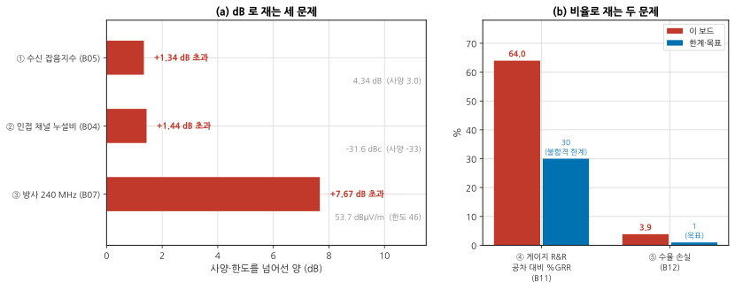
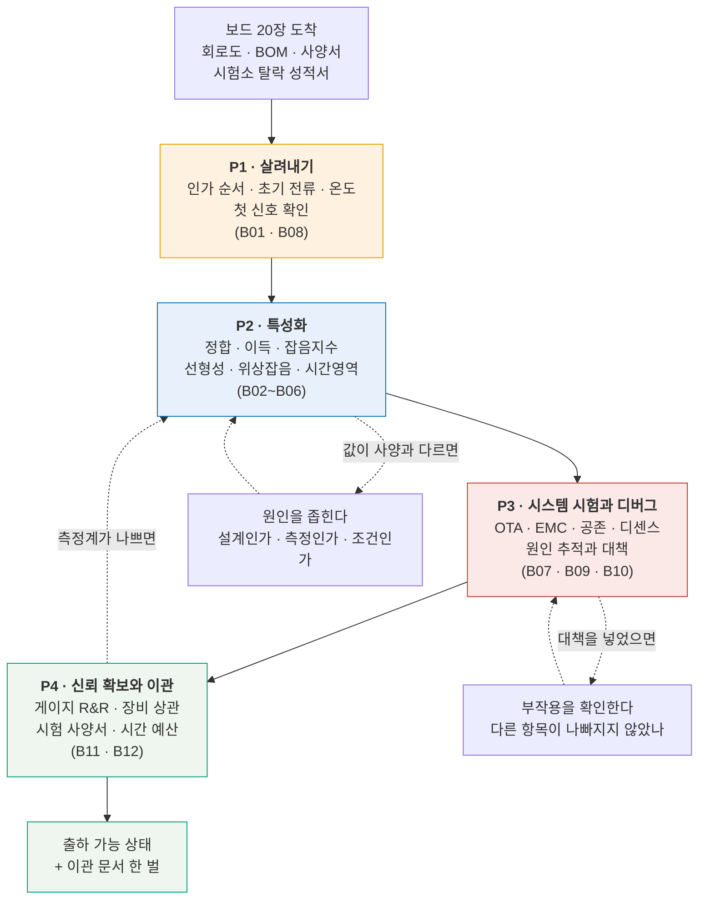

# 심화 캡스톤 — 받은 보드를 양산으로 넘긴다

**문서 번호**: RF-CUR-ADVCAP-00 · **버전**: v1.0 · **분량**: 40 h (2주 · 주 20시간 기준)

| | |
|---|---|
| **선수** | 심화 [B01–B12](./00_심화과정_설계서.md) 전편 · 기본 캡스톤 [P1–P4](../02_캡스톤/00_과제정의서.md) |
| **과제** | **이미 만들어져 있는** 2.4 GHz 트랜시버 모듈 20장을 받아, 살려내고 → 특성화하고 → 시스템에서 시험하고 → 원인을 좁혀 고치고 → 양산 시험기로 넘긴다 |
| **산출물** | 12종 ([§4](#advcap4-산출물-12종)) |
| **평가** | 역량 루브릭 L1–L4. **L3 이상이 실무 투입 수준** ([§6](#advcap6-평가-루브릭)) |

---

## ADVCAP.0 이 과제가 무엇을 확인하는가

기본 캡스톤이 **"내가 설계한 것이 요구를 만족하는가"** 였다면, 심화 캡스톤은 **"남이 설계한 것이 왜 사양과 다른가"** 입니다.

> **이 과제의 시험은 설계가 아니라 원인 추적입니다.**
>
> 보드는 이미 있습니다. 값도 이미 나와 있습니다. 시험받는 것은 **그 값이 왜 그런지 좁혀 들어가는 절차**와, **어디까지 파고 언제 멈출지 정하는 판단**입니다.

받은 보드에는 **다섯 개의 문제가 심어져 있습니다.** 몇 개인지도, 어디인지도 말해 주지 않습니다 — 다만 아래 그림이 그 크기를 미리 보여 줍니다. 여러분이 할 일은 **각각의 원인을 짚고, 고칠 수 있는 것과 없는 것을 가르는** 것입니다.



*그림 ACAP-1. 받은 보드는 다섯 곳에서 사양을 넘는다. **읽는 법**: 왼쪽은 dB 로 재는 세 문제의 **초과량**입니다 — 회색 글씨가 측정값과 사양입니다. 인접 채널 누설비는 작아질수록 나쁘고 나머지 둘은 커질수록 나쁘므로, 방향을 통일하려고 "얼마나 넘었나" 하나로 그렸습니다. 오른쪽은 비율로 재는 두 문제입니다. **가장 큰 것이 게이지 R&R 인데, 이것은 보드가 아니라 측정계 문제입니다.***

> ⚠️ **다섯 중 보드를 고쳐야 하는 것은 하나도 없습니다.** 이것이 이 과제의 첫 번째 발견이고, 대개 가장 늦게 도착하는 발견입니다.
>
> | 문제 | 진짜 원인 | 어디를 고치나 |
> |---|---|---|
> | ① 잡음지수 | 정합망이 **잡음 최소점이 아닌 이득 최대점**에 맞춰져 있다 | 정합망 (설계 선택의 결과) |
> | ② 인접 채널 누설비 | **부하가 50 Ω 이 아니다** | 안테나 정합 또는 백오프 |
> | ③ 방사 | **케이블 배치가 시험소와 다르다** | 셋업과 대책 |
> | ④ 게이지 R&R | **측정계가 나쁘다** | 측정 시스템 |
> | ⑤ 수율 | **가드밴드와 빈 정의** | 판정 규칙 |

---

## ADVCAP.1 받은 것

기본 캡스톤이 만든 2.4 GHz 트랜시버 모듈의 **3차 시제품 20장**입니다. 함께 오는 것.

| 받는 것 | 상태 |
|---|---|
| 보드 20장 | 조립 완료, 동작 확인 안 됨 |
| 회로도·BOM·거버 | 있음 |
| 설계 사양서 | 있음 (아래 표) |
| 이전 리비전 측정 기록 | **없음** — 그것이 문제의 일부입니다 |
| 사내 EMC 사전 시험 성적서 | 있음 (240 MHz 여유 +3.0 dB) |
| 시험소 성적서 | 있음 (**240 MHz 7.7 dB 초과, 탈락**) |

### 설계 사양서에 적힌 값

| 항목 | 값 | 어디서 확인하나 |
|---|---|---|
| 대역 | 2400 ~ 2483.5 MHz | — |
| 수신 잡음지수 | **≤ 3.0 dB** | P2 |
| 감도 | −93 dBm @ 20 MHz, SNR 5 dB | P2 |
| 송신 출력 | +20 dBm (안테나 단자) | P2 |
| 인접 채널 누설비 | **≤ −33 dBc** | P2 · P3 |
| 방사 (240 MHz, 3 m) | **≤ 46 dBµV/m** | P3 |
| 수신 이득 | 12.0 ± 1.0 dB | P4 |
| 양산 수율 목표 | ≥ 99 % | P4 |

> 📌 **사양서의 숫자는 서로 맞물려 있습니다.** 감도 −93 dBm 은 잡음지수 3.0 dB · 대역폭 20 MHz · 필요 SNR 5 dB 에서 나온 값입니다. 하나를 바꾸면 나머지가 따라옵니다 — 이 관계를 P1 에서 먼저 확인하십시오.

---

## ADVCAP.2 단계 구조



*그림 ACAP-2. 네 단계와 되돌아가는 길. **읽는 법**: 굵은 화살표가 정방향이고, 점선이 실제로 시간을 가장 많이 쓰는 경로입니다. 특히 **P4 에서 P2 로 돌아가는 점선**을 보십시오 — 측정계가 나쁘면 특성화 결과를 다시 믿을 수 없어 처음부터 다시 재야 합니다. 그래서 게이지 R&R 을 되도록 **일찍** 하는 것이 실무의 요령입니다.*

| 단계 | 하는 일 | 산출물 | 쓰는 모듈 |
|---|---|---|---|
| **[P1 — 살려내기](./AC1_살려내기.md)** | 죽이지 않고 켜고, 첫 신호를 본다 | ①②③ | B01 · B08 |
| **[P2 — 특성화](./AC2_특성화.md)** | 재고, 사양과 대조하고, 다른 이유를 좁힌다 | ④⑤⑥ | B02 · B03 · B04 · B05 · B06 |
| **[P3 — 시스템 시험과 디버그](./AC3_시스템시험과디버그.md)** | 완성품에서만 나오는 문제를 잡는다 | ⑦⑧⑨ | B07 · B09 · B10 |
| **[P4 — 신뢰 확보와 이관](./AC4_신뢰확보와이관.md)** | 숫자를 믿게 만들고 넘긴다 | ⑩⑪⑫ | B11 · B12 |

---

## ADVCAP.3 축소 옵션 — 기간이나 장비가 부족할 때

| 옵션 | 범위 | 검증되는 것 |
|---|---|---|
| **전체** | P1 ~ P4, 산출물 ①~⑫ | 전부 |
| **책상 위에서** (T0) | 주어진 측정 데이터로 P2 §추적 · P4 전부 | 원인 추적·통계·이관 판단 |
| **디버그 중심** | P3 + P4 | 시스템 문제와 신뢰 확보 |
| **이관 중심** | P4 만 | 게이지 R&R · 상관 · 사양서 |

> 📌 **어느 옵션이든 뺄 수 없는 것이 둘입니다** — **원인 추적 기록(④)** 과 **이관 리뷰(⑫)**. 원인을 못 좁히면 시작이 안 되고, 무엇을 못 했는지 못 적으면 끝이 안 납니다.

> 💡 **장비가 없어도 다섯 문제 중 넷은 계산으로 확인됩니다.** `scripts/adv_capstone_check.py` 가 그 계산을 전부 담고 있습니다 — 도구를 읽는 것 자체가 실습입니다.

---

## ADVCAP.4 산출물 12종

```mermaid
flowchart LR
    subgraph S1["P1 살려내기"]
        A1["① 인수 점검 기록"] --> A2["② 인가 순서·초기 전류 기록"]
        A2 --> A3["③ 첫 신호 확인서"]
    end
    subgraph S2["P2 특성화"]
        B1["④ 특성표"] --> B2["⑤ 이상 항목 추적 기록"]
        B2 --> B3["⑥ 사양 대조표"]
    end
    subgraph S3["P3 시스템 시험·디버그"]
        C1["⑦ OTA·EMC 시험 보고"] --> C2["⑧ 디센스·공존 추적 기록"]
        C2 --> C3["⑨ 대책과 부작용 확인서"]
    end
    subgraph S4["P4 신뢰 확보·이관"]
        D1["⑩ 게이지 R&R·상관 보고서"] --> D2["⑪ 양산 시험 사양서<br/>+ 시간 예산 + 골든 유닛"]
        D2 --> D3["⑫ 이관 리뷰 자료"]
    end

    A3 --> B1
    B3 --> C1
    C3 --> D1
    D1 -.->|"측정계가 나쁘면<br/>④ 를 못 믿는다"| B1

    style A1 fill:#FFF1E0,stroke:#E69F00
    style B2 fill:#E8F1FB,stroke:#0072B2
    style C2 fill:#FBE9E7,stroke:#C0392B
    style D3 fill:#EFF6EF,stroke:#009E73
```



*그림 ACAP-3. 산출물 12종과 의존 관계. **읽는 법**: 왼쪽에서 오른쪽으로 흐르고, 각 단계 안에서는 위에서 아래로 쌓입니다. **⑩ 에서 ④ 로 되돌아가는 점선**이 이 과제의 함정입니다 — 측정계가 나쁘다는 것을 마지막에 알면 특성표를 통째로 다시 만들어야 합니다.*

| # | 산출물 | 반드시 들어갈 것 | 단계 |
|---|---|---|---|
| ① | **인수 점검 기록** | 외관·저항·단락 확인, 사양서와 BOM 대조, **없는 정보 목록** | P1 |
| ② | **인가 순서·초기 전류 기록** | 순서, 각 노드 전압, 돌입 파형, 정상 전류, 온도 | P1 |
| ③ | **첫 신호 확인서** | 무엇을 켜고 무엇이 보였나, 안 보였다면 어디까지 확인했나 | P1 |
| ④ | **특성표** | 정합·이득·잡음지수·선형성·위상잡음, **값 ± 불확도** | P2 |
| ⑤ | **이상 항목 추적 기록** | 사양과 다른 항목마다 **가설 → 측정 → 판정**의 사슬 | P2 |
| ⑥ | **사양 대조표** | 항목별 합·부와 **차이의 원인 분류** (설계/측정/조건) | P2 |
| ⑦ | **OTA·EMC 시험 보고** | TRP·TIS, 방사 결과, **셋업 사진과 케이블 배치** | P3 |
| ⑧ | **디센스·공존 추적 기록** | 끄기/켜기 표, 스펙트럼 대조, 결합 경로 판정 | P3 |
| ⑨ | **대책과 부작용 확인서** | 대책 전후 값, **다른 항목이 나빠지지 않았는지** | P3 |
| ⑩ | **게이지 R&R·상관 보고서** | 분산 분해, %GRR 두 기준, ndc, 벤치–ATE 차이 그림 | P4 |
| ⑪ | **양산 시험 사양서** | 항목·조건·**규격 한계와 시험 한계**·빈 정의·시간 예산·골든 유닛·재시험 정책 | P4 |
| ⑫ | **이관 리뷰 자료** | 무엇을 고쳤고 무엇을 못 고쳤나, **다시 한다면 무엇부터** | P4 |

> ⚠️ **채점의 기준은 하나입니다: 판단마다 근거가 붙어 있는가.**
>
> 기본 캡스톤의 기준이 "모든 숫자가 추적 가능한가" 였다면, 여기서는 한 걸음 더 갑니다 — **왜 그것이 원인이라고 결론지었는가**, 그리고 **무엇을 배제했는가**. 원인을 맞히는 것보다 **배제 과정을 적는 것**이 더 높은 점수입니다. 맞히는 것은 운일 수 있지만 배제는 운이 아닙니다.

---

## ADVCAP.5 자체 검산 도구

```bash
python3 scripts/adv_capstone_check.py          # 받은 보드로 돌려 본다
python3 scripts/adv_capstone_check.py --self   # 도구 자체의 검산 34항목
```

| 도구가 해 주는 것 | 도구가 해 주지 않는 것 |
|---|---|
| 다섯 문제의 **크기를 계산**해 준다 | 그것이 원인이라는 **증거를 모으는 일** |
| 사슬 잡음지수·감도 환산 | 정합망을 다시 그리는 일 |
| 부하 변화가 ACLR 에 미치는 영향 | 안테나를 고치는 일 |
| 케이블 길이가 만드는 방사 차이 | 대책을 고르고 부작용을 확인하는 일 |
| 게이지 R&R 판정과 **불일치율** | 측정 절차를 다시 쓰는 일 |
| 가드밴드·빠뜨림·수율 분해 | **판단** |

> 📌 **도구는 심화 모듈의 계산기를 그대로 불러 씁니다.** `gen_fig_b04/b05/b07/b11/b12` 의 함수를 import 해서 쓰므로, 캡스톤에서 나오는 숫자는 본문 그림의 숫자와 **반드시 같습니다.** 도구를 읽으면 어느 모듈의 어느 절로 돌아가야 하는지가 보입니다.

> ⚠️ **도구가 원인을 알려 주는 것이 아닙니다.** 도구는 "정합망이 Γms 에 맞춰져 있다면 잡음지수가 4.34 dB 다" 를 계산할 뿐입니다. **실제로 그렇게 맞춰져 있는지**는 여러분이 회로도를 읽고 정합망을 재서 확인해야 합니다.

---

## ADVCAP.6 평가 루브릭

### 역량 수준

| 수준 | 판정 기준 |
|---|---|
| **L1** 인지 | 증상을 설명할 수 있다 |
| **L2** 재현 | 절차서대로 재고 사양과 대조한다 |
| **L3** **자립** | **원인을 좁히는 절차를 스스로 설계하고, 배제 근거를 남긴다** ← 실무 투입 기준 |
| **L4** 판단 | 고칠 것과 안 고칠 것을 근거와 함께 정하고, 남의 추적 기록을 검토한다 |

### 산출물별 채점

| 산출물 | L2 | L3 (실무 기준) | L4 |
|---|---|---|---|
| ①~③ 살려내기 | 켜고 기록했다 | **순서와 근거를 적고, 안 된 것도 적었다** | 다음 사람이 그대로 따라 할 수 있게 썼다 |
| ④ 특성표 | 값을 채웠다 | **불확도와 조건을 함께 적었다** | 측정계 자신을 먼저 확인했다 |
| ⑤ 추적 기록 | 원인을 찾았다 | **배제한 가설과 그 근거를 적었다** | 한 번에 하나씩 바꿨음을 기록으로 증명했다 |
| ⑥ 대조표 | 합·부를 적었다 | **차이를 설계/측정/조건으로 분류했다** | 분류의 근거를 실험으로 보였다 |
| ⑦ 시험 보고 | 결과를 적었다 | **셋업을 사진과 치수로 재현 가능하게 적었다** | 시험소와의 차이를 미리 짚었다 |
| ⑧ 디센스 기록 | 끄기/켜기를 했다 | **결합 경로를 실험으로 판정했다** | 누적 효과를 dB 합이 아니라 전력 합으로 셈했다 |
| ⑨ 대책 확인서 | 고쳤다 | **부작용을 확인했다** | 대책의 비용까지 셈했다 |
| ⑩ 게이지 보고서 | %GRR 을 냈다 | **두 기준과 ndc 를 함께 적고 판정했다** | 측정계 개선 전후를 비교했다 |
| ⑪ 시험 사양서 | 항목을 나열했다 | **규격 한계와 시험 한계를 둘 다 적었다** | 시간 예산과 빠뜨림을 함께 최적화했다 |
| ⑫ 리뷰 | 발표했다 | **못 고친 것과 그 이유를 적었다** | 다음 리비전의 우선순위를 근거와 함께 제시했다 |

> 📌 **L2 와 L3 의 차이는 "찾았다" 와 "다른 것들을 배제했다" 입니다.** 원인을 맞혀도 배제 과정이 없으면 L2 입니다. 다음에 다른 증상이 나왔을 때 재현할 수 있는 것은 절차뿐이기 때문입니다.

### 심어 둔 다섯 문제와 확인 지점

| 문제 | 증상 | 어느 산출물에서 드러나야 하나 |
|---|---|---|
| ① 잡음지수 | 사양 3.0 dB 인데 4.34 dB | ⑤ ⑥ |
| ② 인접 채널 누설비 | 50 Ω 합격, 안테나 불합격 | ⑤ ⑦ |
| ③ 방사 | 사전 시험 통과, 시험소 탈락 | ⑦ ⑨ |
| ④ 게이지 R&R | 작업자마다 판정이 다름 | ⑩ |
| ⑤ 수율 | 96 %, 원인 불명 | ⑪ ⑫ |

---

## ADVCAP.7 진행 요령

> 💡 **게이지 R&R 을 P4 까지 미루지 마십시오.** 그림 ACAP-2 의 되돌아가는 점선이 그 이야기입니다. P2 를 시작하기 전에 **짧은 반복성 점검**(한 사람 × 5회)만이라도 해 두면, 특성표를 통째로 다시 만드는 일을 피할 수 있습니다.

> 💡 **셋업 사진을 찍으십시오.** 케이블이 어디로 지나가는지가 값을 바꿉니다(문제 ③). 사진이 없으면 며칠 뒤에 같은 값을 다시 낼 수 없습니다.

> 💡 **"고쳤다"는 판정은 두 번 재고 내리십시오.** 한 번은 대책 직후, 한 번은 다시 조립한 뒤. 재조립으로 사라지는 개선은 개선이 아닙니다 ([B01 §4](./B01_벤치방법론.md)).

> ⚠️ **못 고친 것을 안 적는 것이 가장 큰 감점입니다.** 이 과제의 다섯 문제 중 일부는 **이 리비전에서 못 고칩니다** — 정합망은 보드를 다시 떠야 하고, 안테나는 기구 설계의 몫입니다. 그것을 "못 고침, 이유는 이러함, 다음 리비전에 이렇게" 로 적는 것이 정답입니다.

---

## ADVCAP.A 이 문서의 축약어

| 약어 | 영문 원어 | 한글 |
|---|---|---|
| ATE | Automatic Test Equipment | 자동 시험 장비 (→ B12) |
| ACLR | Adjacent Channel Leakage Ratio | 인접 채널 누설비 (→ M13) |
| BOM | Bill of Materials | 자재 명세서 (→ M17) |
| EMC | Electromagnetic Compatibility | 전자파 적합성 (→ M17) |
| GRR / Gage R&R | Gage Repeatability and Reproducibility | 게이지 반복성·재현성 (→ B11) |
| ndc | number of distinct categories | 구별 범주 수 (→ B11) |
| NF | Noise Figure | 잡음지수 (→ M01) |
| OTA | Over-The-Air | 무선 방식 측정 (→ B09) |
| SNR | Signal-to-Noise Ratio | 신호 대 잡음비 (→ M01) |
| TRP | Total Radiated Power | 총방사전력 (→ B09) |
| TIS | Total Isotropic Sensitivity | 총등방감도 (→ B09) |
| RF | Radio Frequency | 무선 주파수 (→ M01) |

---

## ADVCAP.S 출처

이 문서는 **새 기술 주장을 하지 않습니다.** 모든 계산은 심화 모듈 B01–B12 의 식과 값을 그대로 쓰며, 각 모듈의 §S 에 출처가 있습니다.

**받은 보드의 값은 전부 합성한 것입니다.** `python3 scripts/adv_capstone_check.py` 를 실행하면 다섯 문제의 크기가 계산으로 나오고, `--self` 로 자체 검산 34항목이 함께 돕니다. 교차검증은 다섯 갈래입니다.

1. **사슬 잡음지수** — 한 단·두 단·손실 앞단의 세 경우를 손계산과 대조
2. **로드풀** — 포화 전력 비가 최적점 대칭이고 어디서도 1을 넘지 않음을 확인. |Γ| 0.30 이 2.69 dB 를 깎는 것을 닫힌 식으로 확인
3. **공통모드 방사** — 길이 비가 20log₁₀ 로 그대로 옮겨 오는지, 한도에 닿는 전류가 역산과 맞는지 확인
4. **불일치율** — 규격선 둘레를 촘촘히 깐 수치적분과 400만 회 몬테카를로 대조 (2.936 % vs 2.934 %)
5. **감사 함수** — 받은 보드 값으로는 전부 불합격, 고친 값으로는 전부 합격이 나오는지 확인 (한쪽으로 치우친 판정기가 아닌지)

---

## 변경 이력

| 버전 | 일자 | 내용 |
|---|---|---|
| v1.0 | 2026-08-27 | 최초 작성. 그림 3종(생성 1 + Mermaid 2), 산출물 12종, 단계 4개. 설계서 §8.1 이 "집필 시점에 계산으로 확정한다"고 남겨 둔 다섯 문제를 실제로 계산해 크기를 정했다 — ① NF 초과 1.34 dB, ② ACLR 초과 1.44 dB, ③ 방사 초과 7.67 dB, ④ %GRR 64.0 %, ⑤ 수율 96.1 %. 설계서의 후보 표는 ① 을 "0.8 dB 다름" 으로 적어 두었으나, B05 의 소자로 Γms 정합을 계산하니 사슬 기준 1.34 dB 가 나와 그 값으로 확정했다. 그림 ACAP-1 은 처음에 dB 와 % 를 한 축에 섞어 34 %p 짜리 막대가 1.3 dB 짜리를 안 보이게 만들었고, 단위별로 칸을 갈라 고쳤다 |
