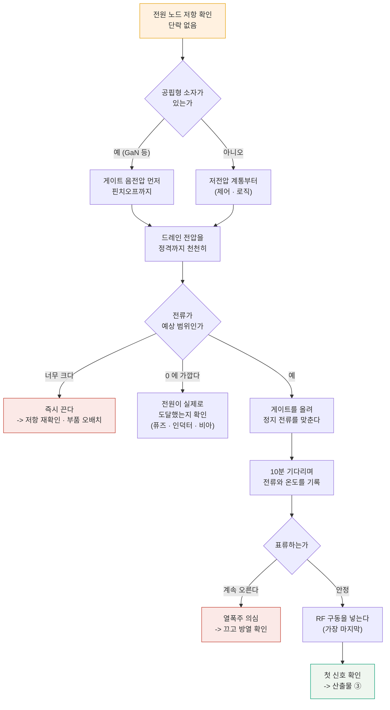

# P1 — 살려내기: 죽이지 않고 켠다

**문서 번호**: RF-CUR-ADVCAP-P1 · **버전**: v1.0 · **분량**: 8 h

> 받은 보드에 처음 전원을 넣는 순간이 이 과제에서 **되돌릴 수 없는 유일한 순간**입니다. 순서를 틀리면 20장 중 한 장이 사라지고, 그 한 장이 나중에 필요한 개체일 수 있습니다.

| | |
|---|---|
| **쓰는 모듈** | [B01](./B01_벤치방법론.md)(실험 설계·기록), [B08](./B08_전원바이어스열.md)(인가 순서·돌입·열) |
| **산출물** | ① 인수 점검 기록 · ② 인가 순서·초기 전류 기록 · ③ 첫 신호 확인서 |
| **끝나는 조건** | 보드 20장 중 **최소 15장**이 정상 전류를 끌고, 그중 3장에서 첫 신호를 확인했다 |

---

## P1.1 전원을 넣기 전에 하는 일

**전원을 넣는 것은 실험이 아니라 사건입니다.** 실패하면 되돌릴 수 없으므로, 그 앞에 확인할 것을 다 확인합니다.

| 순서 | 확인 | 무엇을 찾나 |
|---|---|---|
| 1 | **육안** — 조립 불량, 이물, 납땜 상태 | 보이는 것부터. 확대경으로 커넥터 주변을 본다 |
| 2 | **전원 노드 저항** (전원 ↔ 접지) | 단락이면 여기서 끝. 켜지 않는다 |
| 3 | **회로도 대조** — 바이어스 경로, 보호 소자 유무 | 순서를 어떻게 지킬지 여기서 정한다 |
| 4 | **BOM 대조** — 실제 부품과 명세가 같은가 | 3차 시제품이면 대체 부품이 들어가 있을 수 있다 |
| 5 | **전원 설정** — 전류 제한을 **정상값의 1.5배**로 | 소프트 스타트가 없으면 이것이 유일한 보호다 |
| 6 | **없는 정보 목록 작성** | 이전 리비전 기록이 없다는 것 자체를 적는다 |

> ⚠️ **6번을 빠뜨리지 마십시오.** "이전 측정 기록 없음", "안테나 임피던스 데이터 없음", "정합망 설계 근거 문서 없음" — 이 목록이 P2 에서 원인을 좁힐 때 **어디를 의심할지** 알려 줍니다. 실제로 이 과제의 문제 ① 은 "정합망을 왜 그렇게 맞췄는지 적힌 곳이 없다"에서 출발합니다.

---

## P1.2 인가 순서

*그림 ACAP-4. 인가 결정 트리. **읽는 법**: 위에서 아래로 내려가되 **빨간 상자로 빠지면 즉시 멈춥니다.** 가운데 "0 에 가깝다" 갈래를 눈여겨보십시오 — 전류가 안 흐르는 것을 "안전하다"로 읽으면 안 됩니다. 전원이 도달하지 못한 것일 수 있고, 그 상태에서 더 올리면 나중에 한꺼번에 터집니다. 끄는 순서는 **정확히 거꾸로**입니다.*

### 기록할 것

| 항목 | 왜 |
|---|---|
| 각 단계의 **시각** | 나중에 온도 표류와 대조한다 |
| 각 노드의 전압 (설정값 아닌 **실측값**) | 케이블·커넥터 강하가 여기서 보인다 |
| 정상 전류와 **그때의 주위 온도** | 다른 날 다른 값이 나올 때의 기준 |
| 돌입 파형 (스코프로 잡았다면) | [B08 §1](./B08_전원바이어스열.md) 의 계산과 대조 |
| 10분 뒤 전류·온도 | 안정화 판정 ([B08 §8](./B08_전원바이어스열.md)) |

> 📌 **20장을 다 켜지 마십시오.** 처음에는 **한 장**만 켭니다. 그 한 장의 절차가 굳은 뒤에 나머지를 켭니다. 이 과제에서 보드는 소모품이 아닙니다 — 20장이 전부입니다.

---

## P1.3 첫 신호

전원이 안정되면 순서대로 확인합니다. **뒤에서 앞으로** 가는 것이 요령입니다.

| 순서 | 확인 | 못 보이면 |
|---|---|---|
| 1 | **기준 발진기**가 뜨는가 | 여기서 막히면 나머지는 볼 것도 없다 |
| 2 | **합성기가 잠기는가** (잠금 표시 또는 튜닝 전압) | 기준 레벨·루프 필터·분주비 설정 |
| 3 | 국부발진 출력이 **주파수 계수기에 잡히는가** | 합성기와 버퍼 사이 |
| 4 | 송신 경로: 낮은 전력으로 넣고 **출력이 나오는가** | 단별로 잘라 본다 |
| 5 | 수신 경로: 신호를 넣고 **기저대역에서 보이는가** | 같은 방법 |

> ⚠️ **첫 신호에서 값을 판정하지 마십시오.** P1 의 목표는 "동작한다"까지입니다. 이득이 몇 dB 인지, 잡음지수가 얼마인지는 P2 의 일이고, 그 전에 **측정계가 믿을 만한지** 확인해야 합니다([P4](./AC4_신뢰확보와이관.md) 를 먼저 읽어 두십시오).

**안 보였을 때 어디까지 확인했는지를 적는 것**이 산출물 ③ 의 절반입니다. "합성기 잠김 안 됨" 만 적으면 다음 사람이 처음부터 다시 합니다. "잠김 안 됨 / 기준 40 MHz 는 −2 dBm 으로 확인됨 / 튜닝 전압이 0 V 에 붙어 있음 / 루프 필터 커패시터 실장 확인함" 까지 적어야 이어받을 수 있습니다.

---

## P1.4 이 단계에서 미리 잡아 둘 것

P2 로 넘어가기 전에 두 가지를 해 두면 나중에 며칠을 법니다.

| 미리 하는 것 | 왜 |
|---|---|
| **짧은 반복성 점검** — 한 사람이 한 장을 5회 재연결하며 이득 측정 | 측정계가 나쁘면 P2 특성표를 통째로 못 믿는다 (→ [P4 §1](./AC4_신뢰확보와이관.md)) |
| **개체 번호 부여와 보관 규칙** | 20장을 섞으면 "그때 그 보드"를 다시 못 찾는다 |

> 📌 **개체 번호는 지워지지 않게 붙이십시오.** 그리고 어느 장을 어떤 실험에 썼는지 표로 관리합니다. 문제 ④(작업자마다 판정이 다름)를 조사할 때 **같은 장을 다시 재는 것**이 첫 단계인데, 번호가 없으면 그것이 안 됩니다.

---

## P1.L 실습

### L-P1-a (T1) — 인가 절차서 작성과 첫 실행

1. §1 의 6단계를 우리 보드에 맞게 구체화한 **절차서**를 쓴다.
2. 절차서를 옆 사람에게 읽히고 **모호한 문장을 찾아 달라고** 한다.
3. 한 장에 대해 절차서대로 실행하고 기록한다.
4. 실행 중 절차서와 달라진 곳을 **그 자리에서** 절차서에 반영한다.

**보고**: 절차서 최종본, 실행 기록, 절차서가 바뀐 곳과 이유.

### L-P1-b (T1) — 돌입 전류 관측

1. 저항 부하로 바꾼 상태에서 벌크 커패시터 돌입을 관측한다.
2. [B08 §1](./B08_전원바이어스열.md) 의 직렬 RLC 식과 대조한다.
3. 전류 제한을 걸었을 때와 안 걸었을 때를 비교한다.
4. 돌입 중 **다른 전원 노드의 전압**이 흔들리는지 함께 본다.

**보고**: 파형, 계산값과의 차이, 전류 제한 설정 권고값.

### L-P1-c (T0) — 없는 정보 목록

1. 받은 문서에서 **없는 것**을 목록으로 만든다.
2. 각각에 대해 "없으면 무엇을 못 하나"를 적는다.
3. 그중 **대체할 수 있는 것**(직접 재서 얻을 수 있는 것)을 표시한다.
4. 대체 불가능한 것은 **누구에게 물어야 하는지** 적는다.

**보고**: 목록 표. 이 표가 P2 의 작업 순서를 정합니다.

### L-P1-d (T1) — 짧은 반복성 점검

1. 한 장을 골라 이득을 5회 재연결하며 잰다.
2. 표준편차를 낸다.
3. 사양 공차 ±1.0 dB 와 비교한다 — **σ 가 공차의 1/10 을 넘으면 경고**다.
4. 넘으면 P2 로 가기 전에 [P4 §1](./AC4_신뢰확보와이관.md) 을 먼저 한다.

**보고**: 5개 값, σ, 판정, 다음 단계 결정.

---

## P1.Q 확인 문제

<b>Q1.</b> 전원을 넣었는데 전류가 0 입니다. 안전한 것 아닙니까?

**아닙니다. 전원이 도달하지 못한 상태일 수 있습니다.**

전류가 0 인 경우는 셋으로 갈립니다.

| 경우 | 확인 방법 |
|---|---|
| **전원이 안 갔다** — 퓨즈·인덕터·비아 단선, 커넥터 미접촉 | 보드 위 노드에서 **직접** 전압을 잰다. 전원 계기 표시를 믿지 않는다 |
| **소자가 닫혀 있다** — 게이트가 너무 음전압 | 정상이다. 다음 단계(게이트 올리기)로 간다 |
| **인에이블이 안 걸렸다** | 제어 신호 확인 |

**첫 번째가 위험합니다.** 전원이 도중에 막혀 있는데 전압을 더 올리면, 막힌 지점이 뚫리는 순간 전체 전압이 한꺼번에 걸립니다.

**순서**: 전원 계기가 아니라 **보드 위 실측 전압**을 봅니다. 정격이 걸려 있는데도 전류가 0 이면 그때 두 번째·세 번째를 의심합니다.

<b>Q2.</b> 20장 중 3장이 다른 전류를 끕니다. 불량입니까?

**아직 모릅니다. 세 가지를 확인한 뒤에 판정합니다.**

1. **같은 조건이었나** — 온도, 전원 설정, 켠 순서, 워밍업 시간. [B01 §3](./B01_벤치방법론.md) 의 "한 번에 하나만 바꾸기" 가 여기서도 적용됩니다.
2. **다시 재면 같은가** — 껐다 켜고 다시 잽니다. 값이 바뀌면 그것은 개체 차이가 아니라 **측정 산포**입니다.
3. **얼마나 다른가** — 산포의 몇 σ 인가. 20장의 분포를 먼저 그려 보십시오. 3장이 꼬리에 있는 것과 완전히 떨어져 있는 것은 다른 이야기입니다.

**그리고 버리지 마십시오.** 다른 값을 내는 개체는 P2 에서 가장 쓸모 있는 시료입니다 — 원인을 좁힐 때 **정상 개체와 비교할 대상**이 되기 때문입니다. 번호를 적어 따로 보관하십시오.

<b>Q3.</b> 절차서를 쓰는 데 반나절이 걸립니다. 그냥 켜면 안 됩니까?

**20장이 전부이고 되살릴 수 없다면, 반나절이 쌉니다.**

계산해 보십시오. 절차 실수로 한 장을 잃으면 5 % 의 시료가 사라집니다. 그리고 그 손실은 여기서 끝나지 않습니다.

| 잃는 것 | 왜 |
|---|---|
| 시료 한 장 | 직접 손실 |
| **그 장이 특이 개체였을 가능성** | P2 의 비교 대상이 사라진다 |
| 게이지 R&R 의 표본 | 부품 10개가 필요한데 여유가 준다 (→ [B11 §3](./B11_측정시스템분석.md)) |
| **신뢰** | 다음에 절차를 지켜도 의심받는다 |

그리고 절차서는 **한 번 쓰면 남습니다.** 이 과제가 끝난 뒤 양산 라인의 초기 셋업 절차가 되고([P4](./AC4_신뢰확보와이관.md) 산출물 ⑪), 다음 리비전에서 그대로 쓰입니다.

> 다만 **완벽한 절차서를 먼저 쓰려 하지는 마십시오.** 초안을 쓰고, 한 장을 켜면서 고치고, 그 상태로 나머지에 적용하는 것이 실제 순서입니다.

---

## 변경 이력

| 버전 | 일자 | 내용 |
|---|---|---|
| v1.0 | 2026-08-27 | 최초 작성. 그림 1종(Mermaid), 실습 4종, 확인 문제 3문항 |
