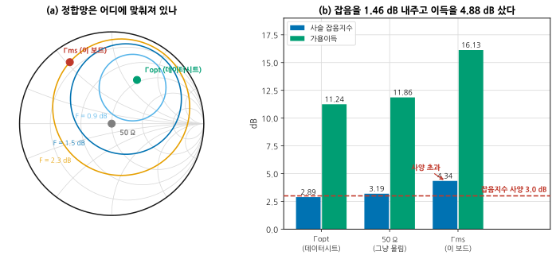
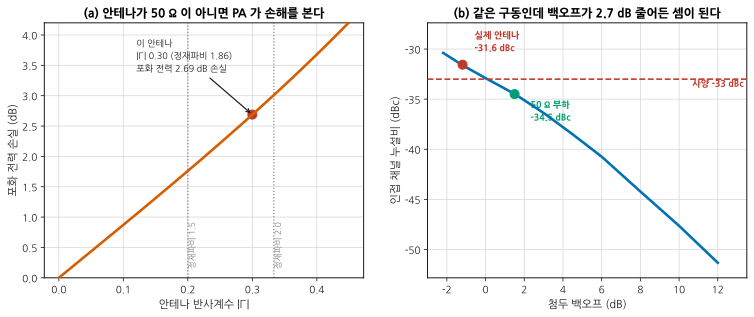

# P2 — 특성화: 다른 이유를 좁힌다

**문서 번호**: RF-CUR-ADVCAP-P2 · **버전**: v1.0 · **분량**: 12 h

> 값이 사양과 다를 때 물어야 할 것은 "얼마나 다른가"가 아니라 **"왜 다른가"** 입니다. 그리고 그 답은 대개 셋 중 하나입니다 — 설계가 그렇게 되어 있거나, 재는 방법이 틀렸거나, 조건이 다르거나.

| | |
|---|---|
| **쓰는 모듈** | [B02](./B02_시간영역.md)(시간 영역), [B03](./B03_다포트차동과픽스처.md)(픽스처 제거), [B04](./B04_대신호.md)(대신호), [B05](./B05_잡음파라미터.md)(잡음 파라미터), [B06](./B06_위상잡음심화.md)(위상잡음) |
| **산출물** | ④ 특성표 · ⑤ 이상 항목 추적 기록 · ⑥ 사양 대조표 |
| **끝나는 조건** | 사양과 다른 항목마다 **원인이 세 갈래 중 어디인지** 판정되었고, 배제한 가설이 기록에 남았다 |

---

## P2.1 재는 순서

**싼 것부터, 그리고 뒤에 영향을 주지 않는 것부터** 잽니다.

| 순서 | 항목 | 왜 여기인가 |
|---|---|---|
| 1 | **정합** (S11 · S22) | 나머지 전부의 전제. 픽스처를 뺀 값으로 ([B03](./B03_다포트차동과픽스처.md)) |
| 2 | **이득** (소신호) | 가장 빠르고 다른 것의 기준이 된다 |
| 3 | **잡음지수** | 이득이 정해져야 프리스 누적을 검산할 수 있다 |
| 4 | **선형성** (P1dB · IP3) | 여기서부터 소자가 더워진다 |
| 5 | **대신호** (변조 파형 ACLR·EVM) | 부하 조건을 명시하고 잰다 ([B04](./B04_대신호.md)) |
| 6 | **위상잡음** | 오래 걸린다. 다른 것이 정리된 뒤에 |
| 7 | **시간 영역** (제어 타이밍·전환 과도) | 필요할 때만 |

> ⚠️ **4번 이후로는 워밍업이 값을 바꿉니다.** [B08 §8](./B08_전원바이어스열.md) 의 안정화 시간을 지키십시오 — 이 보드에서 ±0.05 dB 안에서 판정하려면 10분 이상입니다. 특성표에는 **잰 시각과 워밍업 시간**을 함께 적습니다.

---

## P2.2 이상 항목 하나를 따라가기 — 잡음지수

받은 보드의 수신 잡음지수는 **4.34 dB** 입니다. 사양은 3.0 dB 입니다. LNA 데이터시트는 0.65 dB 라고 적혀 있습니다.

*그림 ACAP-5. 정합망이 어디에 맞춰져 있는가. **읽는 법**: 왼쪽은 잡음 등고선입니다. 잡음지수는 소스 임피던스의 함수라 **원을 그리며 나빠집니다.** 세 점을 보십시오 — 데이터시트가 말하는 Γopt, 아무 생각 없이 물린 50 Ω, 그리고 이 보드의 정합망이 실제로 만들어 주는 Γms. 오른쪽은 그 세 경우의 사슬 잡음지수와 가용이득입니다. **이 보드는 잡음을 1.46 dB 내주고 이득을 4.88 dB 샀습니다** — 설계자가 그렇게 고른 것이지, 고장이 아닙니다.*

### 배제해 나가는 순서

| 가설 | 확인 방법 | 이 보드에서 |
|---|---|---|
| 측정이 틀렸다 | 표준 감쇠기로 계기 확인, Y 계수 대신 콜드소스로 재확인 | 배제됨 (두 방법이 0.1 dB 안) |
| 앞단 손실이 예상보다 크다 | 스위치·필터 삽입 손실을 **직접** 잰다 | 배제됨 (합쳐 1.6 dB, 설계값과 같음) |
| LNA 개체 불량 | 다른 개체 3장에서 같은 값이 나오는가 | 배제됨 (셋 다 4.3±0.1 dB) |
| **정합망이 다른 곳에 맞춰져 있다** | 정합망 입력 임피던스를 재서 Γs 를 구하고, 데이터시트의 잡음 파라미터로 F(Γs) 를 계산 | **확인됨 — Γms 근처** |

> 📌 **마지막 줄이 이 단계의 핵심 기술입니다.** 정합망을 떼고 그 입력 임피던스를 재면 LNA 가 보는 Γs 를 알 수 있습니다. 그 값을 [B05 §2](./B05_잡음파라미터.md) 의 식에 넣으면 **잡음지수가 얼마여야 하는지**가 나오고, 그것이 측정값과 맞으면 원인이 확정됩니다.
>
> $$F(\Gamma_s) = F_{\min} + \frac{4 r_n |\Gamma_s - \Gamma_{opt}|^2}{(1 - |\Gamma_s|^2)\,|1 + \Gamma_{opt}|^2}$$

### 그래서 고칠 것인가

| | 고친다 (Γopt 로 옮긴다) | 그대로 둔다 |
|---|---|---|
| 잡음지수 | 4.34 → **2.89 dB** (사양 통과) | 4.34 dB (사양 초과) |
| 가용이득 | 16.13 → **11.24 dB** (4.88 dB 손해) | 16.13 dB |
| 필요한 일 | **보드를 다시 뜬다** | 없음 |
| 감도 | −91.6 → −93.1 dBm | −91.6 dBm |

**이 리비전에서는 못 고칩니다.** 정합망은 보드 위 패턴이라 부품 교체로는 안 됩니다. 그러면 산출물 ⑥ 에 이렇게 적습니다 — "원인: 정합망이 Γms 에 맞춰짐. 분류: **설계 선택**. 이 리비전 조치: 없음. 다음 리비전: Γopt 와 Γms 사이의 절충점으로 재설계, 예상 잡음지수 3.0 dB · 이득 손실 2.5 dB."

> ⚠️ **"불량"으로 적지 마십시오.** 설계자가 이득을 우선했을 수 있습니다. 이득이 필요했던 이유(예: 뒷단 믹서의 잡음지수가 10 dB)를 확인하지 않고 "틀렸다"고 적으면, 다음 리비전에서 이득이 모자라 감도가 더 나빠집니다.

---

## P2.3 조건이 달라서 다른 경우 — 부하 임피던스

50 Ω 부하로 재면 인접 채널 누설비가 −34.5 dBc 로 사양을 통과합니다. 실제 안테나를 달면 **−31.6 dBc** 로 떨어집니다.

*그림 ACAP-6. 부하가 바뀌면 백오프가 바뀐다. **읽는 법**: 왼쪽은 안테나 반사계수가 깎는 포화 전력입니다 — |Γ| 0.30(정재파비 1.86)이면 **2.69 dB** 를 잃습니다. 오른쪽은 그 손실이 그대로 백오프 감소로 옮겨 오는 모습입니다. 구동은 하나도 안 바꿨는데 **동작점이 곡선을 따라 왼쪽으로 밀려** 사양선을 넘습니다.*

### 이 문제의 성격

**측정도 설계도 틀리지 않았습니다. 조건이 달랐을 뿐입니다.** 50 Ω 측정이 잘못된 것이 아니라, 그 조건이 실사용 조건이 아니었던 것입니다.

| 분류 | 조치 |
|---|---|
| 설계 문제인가 | 아니다 — PA 는 사양대로 동작한다 |
| 측정 문제인가 | 아니다 — 두 측정 모두 정확하다 |
| **조건 문제인가** | **그렇다** — 시험 조건에 부하 임피던스가 안 적혀 있었다 |

**고칠 수 있는 길이 셋입니다.**

| 방법 | 얻는 것 | 잃는 것 |
|---|---|---|
| 안테나 정합을 개선 (|Γ| 0.30 → 0.15) | 포화 손실 2.69 → 1.28 dB | 기구 설계 변경, 일정 |
| **백오프를 2.7 dB 늘린다** | 즉시 사양 통과 | 출력 2.7 dB 감소 — 링크 예산 재검토 |
| 아이솔레이터를 넣는다 | PA 가 50 Ω 을 본다 | 손실·크기·비용 |

> 📌 **어느 쪽이든 시험 사양서에 부하 조건을 적는 것이 함께 가야 합니다.** 조건이 안 적힌 시험은 다음에도 같은 일을 만듭니다 — 이것이 [P4](./AC4_신뢰확보와이관.md) 산출물 ⑪ 로 이어집니다.

---

## P2.4 차이를 세 갈래로 분류한다

산출물 ⑥ 의 핵심은 판정이 아니라 **분류**입니다.

| 분류 | 뜻 | 이 보드의 예 | 누가 고치나 |
|---|---|---|---|
| **설계** | 회로가 그렇게 되어 있다 | ① 정합점 | 다음 리비전 |
| **측정** | 재는 방법·계측기·지그 | ④ 게이지 R&R | 지금, 우리가 |
| **조건** | 시험 조건이 실사용과 다르다 | ② 부하 · ③ 케이블 배치 | 시험 사양서 |

> ⚠️ **분류를 먼저 하고 대책을 정하십시오.** 순서가 바뀌면 "고치기 쉬운 쪽"으로 분류하게 됩니다. 부하 문제를 "PA 불량"으로 적고 PA 를 바꾸면, 새 PA 에서도 같은 일이 일어납니다.

**분류의 근거를 실험으로 보이는 것이 L4 입니다.** 예를 들어 ② 를 "조건" 으로 분류했다면, **50 Ω 으로 되돌리면 값이 돌아오는지** 확인해 보이십시오. 돌아오면 조건이 맞고, 안 돌아오면 다른 것이 섞여 있습니다.

---

## P2.L 실습

### L-P2-a (T2) — 정합망 뒤의 Γs 를 재고 잡음지수를 예측한다

1. LNA 데이터시트에서 네 개의 잡음 파라미터(Fmin, Γopt, rn)를 찾는다.
2. 정합망 출력(LNA 입력 쪽)에서 본 임피던스를 VNA 로 잰다. 픽스처를 뺀다 ([B03](./B03_다포트차동과픽스처.md)).
3. 그 Γs 로 F(Γs) 를 계산한다.
4. 실제 잡음지수 측정값과 대조한다. **1 dB 안에서 맞으면 원인 확정**이다.
5. Γopt 로 옮겼을 때의 이득 손실을 계산해 절충안을 낸다.

**보고**: Γ 평면 그림(세 점), 계산값 대 측정값, 절충안과 그 근거.

**막히면**: 3번에서 `scripts/adv_capstone_check.py` 의 `problem_1()` 이 같은 계산을 합니다. 먼저 스스로 해 보고 대조하십시오.

### L-P2-b (T2) — 부하 임피던스를 바꿔 가며 ACLR

1. 50 Ω 에서 ACLR 을 잰다. **백오프를 명시**한다.
2. 정합 부하(|Γ| 0.2 · 0.3)를 여러 위상으로 걸고 다시 잰다.
3. 최악 위상을 찾는다. [B04 §7](./B04_대신호.md) 의 로드풀 개념과 대조한다.
4. 백오프를 늘려 사양을 통과하는 지점을 찾는다.
5. 그때의 출력 감소를 링크 예산에 넣어 감도 여유를 다시 계산한다.

**보고**: 부하별 ACLR 표, 최악 위상, 백오프 권고값과 그 대가.

**막히면**: 튜너가 없으면 감쇠기 + 오정합 종단으로 |Γ| 를 만들 수 있습니다. 위상은 케이블 길이를 바꿔 돌립니다.

### L-P2-c (T0) — 특성표에 불확도 붙이기

1. P2 에서 잰 항목마다 불확도 예산을 만든다 ([M14 §10](../01_모듈/M14_정밀측정1_교정과불확도.md)).
2. 그중 게이지 R&R 로만 잡히는 항목을 표시한다 ([B11 §1](./B11_측정시스템분석.md)).
3. 사양 여유가 **불확도보다 작은 항목**을 찾는다.
4. 그 항목은 "판정 불가"로 표시하고, 무엇을 개선해야 판정되는지 적는다.

**보고**: 불확도가 붙은 특성표, 판정 불가 항목 목록과 개선 방향.

### L-P2-d (T0) — 배제 기록 쓰기

1. 사양과 다른 항목 하나를 고른다.
2. 가능한 원인을 **다섯 개 이상** 나열한다.
3. 각각에 대해 "어떤 측정을 하면 배제되는가"를 적는다.
4. 비용이 싼 순서로 정렬한다.
5. 실제로 실행하고 결과를 적는다 — **배제된 것도 전부 적는다.**

**보고**: 가설 표, 실행 순서와 근거, 최종 판정.

**막히면**: 가설이 다섯 개가 안 나오면 §2 의 표를 참고하십시오. "측정 / 부품 / 조건 / 설계 / 개체" 다섯 축으로 생각하면 대개 채워집니다.

---

## P2.Q 확인 문제

<b>Q1.</b> 잡음지수가 데이터시트보다 1.65 dB 높습니다. LNA 를 바꿔 봐야 합니까?

**바꾸기 전에 정합망을 재십시오.** 부품 교체는 되돌리기 어렵고, 대개 원인이 아닙니다.

이 보드에서 실제로 확인된 것은 이렇습니다.

| 확인 | 결과 |
|---|---|
| 개체 3장에서 같은 값 | **개체 불량이 아니다** |
| 앞단 손실 실측 = 설계값 | **손실 문제가 아니다** |
| 두 측정법이 일치 | **측정 문제가 아니다** |
| 정합망 뒤 Γs ≈ Γms | **원인 확정** |

**LNA 를 바꿔도 같은 값이 나옵니다.** 잡음지수는 소자만의 성질이 아니라 **소자 + 소스 임피던스**의 성질이기 때문입니다([B05 §2](./B05_잡음파라미터.md)).

> 그리고 부품을 바꿔 값이 좋아졌더라도 원인을 안 것은 아닙니다. 새 부품의 Γopt 가 우연히 이 정합망에 더 맞았을 수 있습니다. **다음 로트에서 되돌아옵니다.**

<b>Q2.</b> 50 Ω 에서 통과했으니 사양은 만족한 것 아닙니까?

**사양서에 부하 조건이 적혀 있다면 그렇습니다. 그런데 대개 안 적혀 있습니다.**

이것이 이 문제의 진짜 교훈입니다 — **시험 조건이 실사용 조건이 아니면 통과가 통과가 아닙니다.**

물어볼 것.

| 질문 | 이 보드 |
|---|---|
| 사양서에 부하 조건이 있는가 | 없다 |
| 실사용 부하는 얼마인가 | 안테나 |Γ| 0.30 (정재파비 1.86) |
| 그 조건에서 재면 통과하는가 | **아니다 (−31.6 dBc)** |
| 규제 시험은 어느 조건인가 | **안테나를 단 상태** — 이쪽이 결정적이다 |

**규제 시험이 안테나 단자 기준이면 50 Ω 결과는 참고치입니다.** 그러니 사양서를 고쳐야 합니다 — "부하 |Γ| ≤ 0.30, 최악 위상에서" 처럼.

> 📌 이 판단이 P4 의 시험 사양서로 이어집니다. 양산에서 안테나를 달고 잴 수는 없으니, **50 Ω 에서 재되 가드밴드로 그 차이를 흡수**하는 것이 실무의 답입니다. 그 가드밴드가 2.9 dB 라는 것을 여기서 알아냈습니다.

<b>Q3.</b> 이상 항목이 다섯 개인데 어느 것부터 봐야 합니까?

**"싸고, 뒤에 영향을 안 주고, 배제 효과가 큰" 순서입니다.**

| 기준 | 왜 |
|---|---|
| **측정계 확인이 언제나 첫 번째** | 측정이 틀렸으면 나머지 다섯 개의 값이 다 틀린 값이다 |
| 그다음 **여러 항목에 걸친 원인** | 정합·바이어스·온도는 한 번에 여러 항목을 움직인다 |
| 그다음 **싼 확인** | 부품 하나 떼기 vs 보드 다시 뜨기 |
| 마지막에 **되돌릴 수 없는 것** | 부품 교체·패턴 수정 |

이 보드에서는 순서가 이렇게 됩니다.

1. **게이지 R&R** — 이득 측정이 σ 0.135 dB 로 흔들린다면 다른 값들도 의심된다
2. **정합** — ①(잡음지수)과 ②(ACLR)에 모두 걸린다
3. **부하 조건** — 케이블만 바꿔 끼우면 확인된다
4. **케이블 배치** — 셋업만 바꾸면 확인된다
5. 부품 교체 — 여기까지 와서도 안 풀리면

> ⚠️ **다섯 개를 동시에 건드리지 마십시오.** 한 번에 하나씩 바꾸고 그때마다 전부 다시 재는 것이 느려 보이지만, 섞어 놓으면 **어느 것이 효과였는지 영영 모릅니다**([B01 §3](./B01_벤치방법론.md)).

---

## 변경 이력

| 버전 | 일자 | 내용 |
|---|---|---|
| v1.0 | 2026-08-27 | 최초 작성. 그림 2종(생성), 실습 4종, 확인 문제 3문항 |
