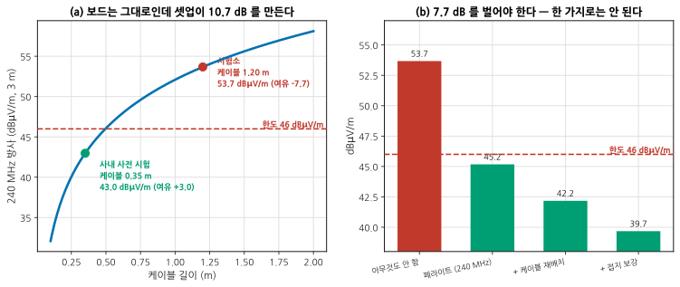

# P3 — 시스템 시험과 디버그: 완성품에서만 나오는 것

**문서 번호**: RF-CUR-ADVCAP-P3 · **버전**: v1.0 · **분량**: 12 h

> 부품 하나하나는 사양대로인데 다 모아 놓으면 안 되는 일이 있습니다. 이 단계는 그것들 — 도선을 떼면 달라지는 값, 셋업이 만드는 값, 옆 무선이 만드는 값 — 을 다룹니다.

| | |
|---|---|
| **쓰는 모듈** | [B07](./B07_EMC벤치디버그.md)(EMC 디버그), [B09](./B09_안테나와OTA.md)(OTA), [B10](./B10_시스템디버그.md)(디센스·공존) |
| **산출물** | ⑦ OTA·EMC 시험 보고 · ⑧ 디센스·공존 추적 기록 · ⑨ 대책과 부작용 확인서 |
| **끝나는 조건** | 시험소 탈락 항목의 **원인이 재현**되었고, 대책 전후 값과 **부작용 확인**이 기록되었다 |

---

## P3.1 시험소 성적서부터 읽는다

받은 서류에 시험소 성적서가 있습니다 — **240 MHz 에서 7.7 dB 초과, 탈락.** 그리고 사내 사전 시험 성적서도 있습니다 — **같은 주파수에서 여유 +3.0 dB, 통과.**

**두 성적서가 다르다는 것이 첫 번째 정보입니다.** 보드는 같습니다.

| 확인할 것 | 왜 |
|---|---|
| 두 시험의 **케이블 길이와 배치** | 공통모드 방사는 길이에 비례한다 |
| **접지 방식** — 시험대 접지, 보드 접지 | 귀환 경로가 바뀐다 |
| **측정 거리** (3 m / 10 m) | 환산 규칙이 다르다 |
| 부하·동작 모드 | 송신 중인가, 대기인가 |
| **검파 방식** (첨두/준첨두/평균) | 같은 신호가 다른 값으로 읽힌다 |

> 📌 **성적서에 사진이 없으면 요청하십시오.** 시험소는 대개 셋업 사진을 남깁니다. 그 사진 한 장이 며칠을 법니다.

---

## P3.2 케이블이 만드는 10.7 dB

*그림 ACAP-7. 셋업이 만드는 차이. **읽는 법**: 왼쪽 곡선은 같은 공통모드 전류(4 µA)가 케이블 길이에 따라 만드는 방사입니다. 두 점이 사내 시험(0.35 m)과 시험소(1.20 m)입니다 — **보드는 그대로인데 10.7 dB** 가 벌어집니다. 20log₁₀(1.20/0.35) 그대로입니다. 오른쪽은 대책별 개선량인데, **한 가지로는 7.7 dB 를 못 법니다.***

### 왜 이런 일이 생기나

공통모드 방사는 [B07 §5](./B07_EMC벤치디버그.md) 의 식을 따릅니다.

$$E = 1.257 \times 10^{-6} \cdot \frac{f \cdot I_{cm} \cdot L}{d}$$

**전류 × 길이**의 곱이 그대로 전계가 됩니다. 사내 시험에서 짧은 케이블을 쓴 것은 잘못이 아니라 **편의**였습니다 — 벤치가 좁으니까. 그런데 그 편의가 10.7 dB 를 숨겼습니다.

> ⚠️ **문제를 만드는 전류가 4 µA 라는 점을 보십시오.** 신호 전류의 백만분의 몇입니다. 이만한 전류는 **회로도에 안 나타납니다** — 의도한 경로가 아니라 기생 경로로 흐르기 때문입니다. 그래서 계산으로 예측하기 어렵고, 재서 찾아야 합니다([B07 §3](./B07_EMC벤치디버그.md) 근접장 프로브).

### 대책과 그 한계

| 대책 | 개선 | 왜 그만큼인가 |
|---|---|---|
| 페라이트 (240 MHz 용) | 8.5 dB | 공진 근처라 임피던스가 높다. 다른 주파수에서는 훨씬 적다 |
| 케이블 재배치 | 3.0 dB | 접지면에서 띄우지 않고 붙여 배선 |
| 접지 보강 | 2.5 dB | 귀환 경로를 짧게 |
| **합계** | 14.0 dB | 필요한 7.7 dB 를 넘는다 |

> 📌 **대책을 하나씩 넣고 그때마다 재십시오.** 세 개를 한꺼번에 넣으면 14 dB 가 나와도 **어느 것이 얼마였는지** 모릅니다. 양산에서 원가를 깎을 때 무엇을 뺄 수 있는지 판단할 근거가 사라집니다.

---

## P3.3 부작용 확인 — 산출물 ⑨ 의 핵심

**대책은 다른 것을 나쁘게 만듭니다.** 이 확인이 없으면 대책이 아니라 문제 이동입니다.

| 대책 | 확인할 부작용 |
|---|---|
| 페라이트 | 전원 임피던스 상승 → 과도 응답, 전압 강하 |
| 케이블 재배치 | 다른 주파수에서 나빠지지 않았나. **다른 대역의 감도** |
| 접지 보강 | 접지 루프가 새로 생기지 않았나 |
| 차폐 추가 | 방열 악화 ([B08 §6](./B08_전원바이어스열.md)) |
| 스프레드 스펙트럼 클럭 | **첨두만 내려가고 총전력은 그대로** ([B10 §8](./B10_시스템디버그.md)) |

> ⚠️ **마지막 줄을 특히 조심하십시오.** SSC 는 계기의 눈금을 낮추지만 수신기가 받는 에너지는 그대로입니다. EMC 시험은 통과하고 **디센스는 그대로**인 상황이 만들어집니다 — 그리고 그 사실은 EMC 성적서에 안 나타납니다.

**부작용 확인의 최소 묶음**: 대책 전후로 ① 수신 감도 ② 송신 ACLR ③ 소비 전류 ④ 접합 온도. 이 넷이 안 나빠졌으면 대부분의 부작용은 걸립니다.

---

## P3.4 OTA — 도선을 떼면 달라진다

케이블을 빼고 재면 값이 또 달라집니다. [B09](./B09_안테나와OTA.md) 가 그 이야기입니다.

| 볼 것 | 왜 이 과제에서 중요한가 |
|---|---|
| **TRP** (총방사전력) | 도전 측정의 +20 dBm 과 얼마나 다른가 — 안테나 효율이 여기서 드러난다 |
| 표본 간격 | 30° 격자로 충분한가. 지향성이 있으면 크게 놓친다 ([B09 §2](./B09_안테나와OTA.md)) |
| **측정 케이블 위치** | 케이블이 안테나의 일부가 되어 TRP 가 3.11 dB 폭으로 움직인다 |
| TIS (총등방감도) | 시간이 TRP 의 32배다. 격자를 성기게 할 근거를 적는다 |

> 📌 **OTA 결과와 도전 측정을 함께 적으십시오.** 둘의 차이가 안테나 효율 + 지그 영향이고, 그 값이 다음 리비전의 기구 설계 입력이 됩니다.

**그리고 케이블 위치를 사진으로 남기십시오.** 문제 ③ 과 같은 이유입니다 — 케이블이 값을 만듭니다.

---

## P3.5 디센스 — 옆 무선을 켜면

이 보드는 트랜시버 하나지만, 실제 제품에서는 옆에 다른 것이 붙습니다. [B10](./B10_시스템디버그.md) 의 3단계 추적을 그대로 적용합니다.

| 단계 | 하는 일 | 기록할 것 |
|---|---|---|
| 0 | **기준 감도 확보** — 전부 끄고 3회 반복 | 산포. 이것보다 작은 변화는 못 본다 |
| 1 | **하나씩 켠다** | 각각이 몇 dB 를 먹는가 |
| 2 | **스펙트럼 대조** — 켜기/끄기를 뺀다 | 이산 선인가 넓은 융기인가 |
| 3 | **결합 경로 확인** — 방사·전도·기판 | 차폐/필터/배치 실험으로 판정 |

> ⚠️ **누적은 dB 로 더하지 마십시오.** 각각 1 dB 씩인 다섯 부시스템은 5 dB 가 아니라 **5.04 dB** 입니다 — 간섭 전력을 더하고 나서 로그를 취해야 합니다([B10 §2](./B10_시스템디버그.md)).

**클럭 하모닉 표를 먼저 만드십시오.** 보드 위 클럭들의 하모닉이 수신 대역에 떨어지는지는 **켜 보기 전에 계산으로** 알 수 있습니다. 그 표가 있으면 어디를 볼지가 정해집니다.

---

## P3.L 실습

### L-P3-a (T1) — 두 셋업의 차이를 재현한다

1. 사내 사전 시험 셋업(짧은 케이블)으로 방사를 잰다.
2. 케이블을 시험소 규격 길이로 바꾸고 다시 잰다.
3. 차이가 20log₁₀(길이 비)와 맞는지 확인한다.
4. 케이블에 흐르는 공통모드 전류를 **전류 프로브로 직접** 잰다.
5. 잰 전류로 [B07 §5](./B07_EMC벤치디버그.md) 의 식을 써서 방사를 예측하고 측정값과 대조한다.

**보고**: 두 셋업 사진, 두 값, 계산 대조, 전류 실측값.

**막히면**: 전류 프로브가 없으면 근접장 자기 프로브로 상대 비교만 해도 됩니다. 절대값은 못 얻지만 **길이 비 관계**는 확인됩니다.

### L-P3-b (T1) — 대책을 하나씩 넣으며 개선량 기록

1. §2 의 세 대책을 **하나씩** 적용하며 매번 잰다.
2. 각 대책의 개선량을 표로 만든다.
3. 합계가 각각의 합과 같은지 확인한다 — **대개 다르다.** 왜 그런지 적는다.
4. 각 대책마다 §3 의 부작용 넷을 확인한다.
5. 원가와 개선량으로 **어느 것을 양산에 넣을지** 정한다.

**보고**: 대책별 개선량과 부작용, 조합 결과, 채택안과 근거.

### L-P3-c (T2) — OTA 로 TRP 를 재고 도전 측정과 대조

1. 30° 격자로 TRP 를 잰다.
2. 15° 로 다시 재고 차이를 본다.
3. 측정 케이블 위치를 세 가지로 바꿔 가며 재고 산포를 낸다.
4. 도전 측정의 +20 dBm 과 비교해 **안테나 효율**을 낸다.
5. 불확도 예산을 만든다 ([B09 §6](./B09_안테나와OTA.md)).

**보고**: TRP 값, 격자별 차이, 케이블 산포, 효율, 불확도.

**막히면**: 챔버가 없으면 [B09 §L](./B09_안테나와OTA.md) 의 T0 대체를 쓰십시오 — 공개 패턴 데이터로 적분해도 격자 효과는 그대로 배웁니다.

### L-P3-d (T1) — 디센스 추적

1. 기준 감도를 3회 재고 산포를 낸다.
2. 클럭 하모닉 충돌 표를 만든다 (계산).
3. 부시스템을 하나씩 켜며 감도 변화를 기록한다.
4. 표에서 예측한 것과 실제로 나타난 것을 대조한다.
5. 하나를 골라 결합 경로를 판정한다 (차폐/필터/배치 실험).

**보고**: 충돌 표, 켜기/끄기 표, 경로 판정과 그 근거.

---

## P3.Q 확인 문제

<b>Q1.</b> 사내 시험은 통과인데 시험소는 탈락입니다. 시험소가 틀린 것 아닙니까?

**둘 다 맞습니다. 다른 것을 쟀을 뿐입니다.**

이 보드에서 확인된 것은 케이블 길이 차이가 만드는 **10.7 dB** 입니다. 20log₁₀(1.20/0.35) = 10.70 dB — 계산과 정확히 맞습니다.

**그러면 어느 쪽이 옳은 값인가.** 규격이 정하는 셋업이 옳은 값입니다. CISPR 계열 규격은 케이블 길이와 배치를 지정합니다 — 그것이 **실사용을 대표한다고 합의한 조건**이기 때문입니다.

**사내 사전 시험의 값어치는 절대 판정이 아니라 상대 비교입니다.**

| 사전 시험이 할 수 있는 것 | 할 수 없는 것 |
|---|---|
| 대책 전후 비교 | **한도 대비 절대 판정** |
| 발생원 찾기 | 시험소 결과 예측 |
| 대책 후보 고르기 | 인증 |

> 📌 **사전 시험 셋업을 규격에 최대한 맞추십시오.** 케이블 길이만 맞춰도 예측력이 크게 오릅니다. 맞출 수 없다면 **그 차이를 여유로 잡아 두십시오** — 이 경우 10.7 dB 입니다.

<b>Q2.</b> 페라이트를 넣었더니 방사가 8.5 dB 줄었습니다. 이걸로 끝입니까?

**아직 셋이 남았습니다.**

1. **필요량을 채웠는가.** 7.7 dB 를 벌어야 하니 8.5 dB 면 여유 0.8 dB 입니다. **시험소 불확도가 그보다 큽니다.** 여유를 더 확보해야 합니다.
2. **다른 주파수는 어떤가.** 페라이트 임피던스는 주파수를 탑니다 — 240 MHz 공진에서 8.5 dB 를 주지만 1 GHz 에서는 훨씬 적습니다([B07 §6](./B07_EMC벤치디버그.md)). **전 대역을 다시 훑으십시오.**
3. **부작용은.** 페라이트는 그 선의 임피던스를 올립니다. 전원선이면 과도 응답이 나빠지고, 신호선이면 파형이 둔해집니다.

| 확인 | 어디서 |
|---|---|
| 전원 과도 응답 | [B08 §3](./B08_전원바이어스열.md) |
| 신호 무결성 | [B02](./B02_시간영역.md) |
| 전 대역 재확인 | [B07 §1](./B07_EMC벤치디버그.md) |

> ⚠️ **"통과했다"와 "여유가 생겼다"는 다릅니다.** 시험소는 다른 챔버, 다른 날, 다른 케이블로 잽니다. 0.8 dB 여유로는 다음에 또 떨어집니다.

<b>Q3.</b> 스프레드 스펙트럼 클럭을 켜니 방사가 6 dB 줄었습니다. 좋은 대책 아닙니까?

**계기 눈금만 내려갔을 수 있습니다.** 두 가지를 확인하십시오.

**첫째, 저감량이 분해능 대역폭(RBW)에 따라 달라집니다.** [B10 §8](./B10_시스템디버그.md) 에서 확인한 대로, 같은 SSC 가 488 kHz RBW 에서 6.0 dB, 1.9 kHz 에서 17.7 dB 로 읽힙니다. **EMC 규격이 정한 RBW 로 재야** 의미가 있습니다.

**둘째, 대역 총전력은 변하지 않습니다.** 파세발 정리로 확인하면 **0.000 dB** 입니다. 그래서 이런 일이 생깁니다.

| | EMC 시험 | 우리 수신기 |
|---|---|---|
| 보는 것 | 규격 RBW 에서의 **첨두** | 채널 대역 안의 **총전력** |
| SSC 효과 | 6 dB 개선 | **0 dB** |
| 결과 | 통과 | 디센스 그대로 |

**그리고 SSC 는 낮은 차수 하모닉에서는 듣지 않습니다.** 변조 지수가 작아 스펙트럼이 안 퍼지기 때문입니다 — 이 경우 4 MHz 근처에서는 효과가 거의 없고 수백 MHz 하모닉에서만 납니다.

> 📌 **SSC 를 쓰더라도 대책 목록에서 빼지 마십시오.** 페라이트·배치·접지처럼 **에너지를 실제로 줄이는** 대책과 함께 써야 합니다. SSC 하나로 통과한 제품은 필드에서 디센스로 돌아옵니다.

---

## 변경 이력

| 버전 | 일자 | 내용 |
|---|---|---|
| v1.0 | 2026-08-27 | 최초 작성. 그림 1종(생성), 실습 4종, 확인 문제 3문항 |
