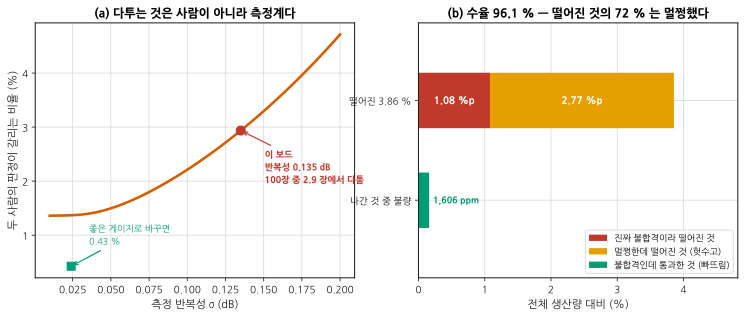

# P4 — 신뢰 확보와 이관: 숫자를 믿게 만들고 넘긴다

**문서 번호**: RF-CUR-ADVCAP-P4 · **버전**: v1.0 · **분량**: 8 h

> 앞의 세 단계에서 얻은 값이 전부 맞다고 해도, **다른 사람이 다른 날 다른 장비로 재서 같은 값이 나오지 않으면** 넘길 수 없습니다. 이 단계는 그것을 숫자로 만드는 일입니다.

| | |
|---|---|
| **쓰는 모듈** | [B11](./B11_측정시스템분석.md)(측정 시스템 분석), [B12](./B12_양산이관.md)(양산 이관) |
| **산출물** | ⑩ 게이지 R&R·상관 보고서 · ⑪ 양산 시험 사양서 · ⑫ 이관 리뷰 자료 |
| **끝나는 조건** | 측정계가 판정을 통과했고, 시험 사양서 한 벌이 **다른 사람이 읽고 실행할 수 있는 상태**로 완성되었다 |

---

## P4.1 다투는 이유

현장에서 이런 말이 나옵니다 — **"제가 재면 합격, 옆자리가 재면 불합격입니다."** 서로를 의심하기 전에 게이지 R&R 을 돌립니다.

*그림 ACAP-8. 두 개의 숨은 손실. **읽는 법**: 왼쪽은 측정 반복성이 나빠질수록 두 사람의 판정이 갈리는 비율입니다. 이 보드는 σ 0.135 dB 라 **100장 중 2.9 장에서 다툽니다.** 게이지만 좋은 것으로 바꾸면 0.43 % 로 떨어집니다 — 부품 산포는 그대로 두고 잰 값입니다. 오른쪽은 양산에서 떨어지는 3.86 % 의 정체인데, **72 % 가 멀쩡한 물건**입니다.*

### 계산해 보면 놀라운 것

| 확인 | 값 |
|---|---|
| %GRR (산포 대비) | 41.3 % — 불합격 |
| %GRR (공차 대비 ±1.0 dB) | **64.0 %** — 불합격 |
| ndc (구별 범주 수) | **3** — 5 미만이라 불합격 |
| 두 사람의 판정이 갈리는 비율 | 2.94 % |
| **그중 반복성만으로 생기는 몫** | **89 %** |

> ⚠️ **다툼의 89 % 는 사람 탓이 아닙니다.** 측정자 치우침을 0 으로 둬도 2.62 % 가 남습니다 — 한 사람이 같은 물건을 두 번 재도 같은 일이 벌어진다는 뜻입니다. **사람을 통일해도 안 낫습니다.** 고칠 곳은 지그·재체결·절차입니다([B11 §2](./B11_측정시스템분석.md)).

**그리고 이 결과가 P2 를 되돌립니다.** ndc 3 인 측정계로 만든 특성표는 등급을 3개로밖에 못 가릅니다. 측정계를 고친 뒤 P2 의 핵심 항목을 다시 재야 합니다 — 그림 [ACAP-2](./AC00_심화캡스톤_과제정의서.md) 의 되돌아가는 점선이 이것입니다.

---

## P4.2 장비를 맞댈 때

벤치와 양산 시험기(ATE)를 맞대는 절차는 [B12 §4](./B12_양산이관.md) 에 있습니다. 여기서는 **하지 말아야 할 것** 하나만 다시 짚습니다.

> ⚠️ **최소제곱으로 기울기를 내지 마십시오.** 가로축도 측정기라 기울기가 참값 1.000 을 **0.870 으로 깎습니다.** 그 값으로 보정식을 세우면 값의 범위 밖에서 크게 틀어집니다.
>
> **한 줄 확인법**: 축을 바꿔 다시 회귀해 보십시오. 답이 달라지면 둘 다 틀린 것입니다 ([B11 §8](./B11_측정시스템분석.md)).

**실무의 답은 대개 오프셋 하나입니다.** 차이 그림에서 읽은 평균 차를 ATE 쪽에 더하면 끝입니다. 기울기 보정은 근거가 확실할 때만 하십시오.

| 읽는 것 | 이 보드 | 무엇을 뜻하나 |
|---|---|---|
| 평균 차 (ATE − 벤치) | +0.102 dB | 오프셋으로 없앤다 |
| 차이의 표준편차 | 0.171 dB | **가드밴드의 근거** |
| 두 계 반복성의 제곱합 | 0.171 dB | 흩어짐이 설명된다 — 다른 원인 없음 |

---

## P4.3 가드밴드와 수율

차이의 표준편차 0.171 을 안고 판정하려면 한계를 안쪽으로 당겨야 합니다. 그런데 당길수록 멀쩡한 물건을 버립니다.

| 가드밴드 | 빠뜨림 | 헛수고 | 수율 |
|---|---|---|---|
| 없음 | 3,378 ppm | 1.10 % | 97.7 % |
| **0.10** | **1,606 ppm** | **2.77 %** | **96.1 %** |
| 0.20 | 597 ppm | 5.35 % | 93.4 % |

**받은 라인은 0.10 을 쓰고 있고 수율이 96.1 % 입니다.** 그런데 진짜 불합격은 **1.24 %** 뿐입니다 — 떨어지는 3.86 % 중 **2.77 %p(72 %)가 멀쩡한 물건**입니다.

> 📌 **"수율 96 %, 원인 불명" 의 답이 이것입니다.** 빈이 'RF 불합격' 하나뿐이면 이 분해가 안 보입니다. 빈을 쪼개면 상위 3개가 83 % 를 차지해 고칠 곳이 드러납니다([B12 §7](./B12_양산이관.md)).

### 무엇을 할 것인가

| 선택 | 효과 | 대가 |
|---|---|---|
| 가드밴드를 줄인다 | 헛수고 감소 | **빠뜨림이 2배** — 고객이 받는다 |
| **측정계를 개선한다** | 차이의 σ 가 줄어 **둘 다** 좋아진다 | 지그·절차 개선 비용 |
| 공정 산포를 줄인다 | 진짜 불합격이 준다 | 설계·공정 변경 |
| 빈을 쪼갠다 | 어디를 고칠지 보인다 | 시험 프로그램 수정 |

**두 번째가 답입니다.** 가드밴드는 측정 흩어짐을 돈으로 덮는 것이라, 흩어짐을 줄이면 그 돈이 통째로 돌아옵니다. 그리고 §1 에서 이미 알고 있습니다 — 이 측정계는 %GRR 64 % 입니다.

---

## P4.4 시험 사양서 — 산출물 ⑪

[B12 §9](./B12_양산이관.md) 의 목록을 이 보드에 채웁니다. 최소한 아래가 있어야 넘어갑니다.

| 넣을 것 | 이 보드에서 |
|---|---|
| 항목별 **규격 한계와 시험 한계** | 이득 12.0 ± 1.0 → 시험 한계 12.0 ± 0.90 |
| **부하 조건** | 50 Ω, 그리고 안테나 조건 차이를 흡수하는 가드밴드 2.9 dB ([P2 §3](./AC2_특성화.md)) |
| 빈 정의 | 'RF 불합격' 하나를 **항목별로 쪼갠다** |
| 판정 논리 | 어느 항목부터 재고, 떨어지면 나머지를 재는가 |
| 시험 시간 예산 | 21.0 초 · 4 사이트 · 419 UPH · 개당 287 원 |
| 골든 유닛 | **2개 이상** (중앙 하나, 경계 하나) |
| 재시험 정책 | 접촉 점검 실패에 한해 1회. **기록 필수** |
| 데이터 형식 | 필드·단위·시각(UTC)·사이트 번호 |

> ⚠️ **재시험 정책을 안 적으면 현장은 붙을 때까지 잽니다.** 이 보드의 측정 흩어짐이면 재시험 2회에 빠뜨림이 **6,138 → 12,904 ppm** 으로 2.1배가 됩니다. 반대로 "3회 재서 중앙값" 으로 정하면 **4,029 ppm** 으로 줍니다 — 같은 3회 측정입니다([B12 §7](./B12_양산이관.md)).

---

## P4.5 리뷰 — 산출물 ⑫

**못 고친 것을 적는 문서입니다.** 고친 것은 값이 증명합니다.

| 문제 | 이 리비전 조치 | 다음 리비전 |
|---|---|---|
| ① 잡음지수 (정합점) | **못 고침** — 보드 패턴 | Γopt·Γms 절충점으로 재설계 |
| ② ACLR (부하) | 백오프 2.7 dB 또는 안테나 정합 | 안테나 정합 개선이 근본 |
| ③ 방사 (셋업) | 페라이트 + 배치 + 접지 | 기판에서 공통모드 전류를 줄인다 |
| ④ 게이지 R&R | 지그·절차 개선 후 재판정 | 자동화 검토 |
| ⑤ 수율 | 빈 쪼개기 + 가드밴드 재산정 | 측정계 개선으로 가드밴드 축소 |

**그리고 되돌아갈 길을 남깁니다** — 초기 물량 시료 몇 개를 벤치에서 다시 재고 값을 보관합니다. 몇 달 뒤 "처음에는 이랬다"는 기준점이 됩니다.

> 📌 **리뷰에 "무엇을 다시 한다면"을 적으십시오.** 이 과제에서 가장 흔한 답은 **"게이지 R&R 을 P1 에서 했을 것"** 입니다. ndc 3 인 측정계로 P2 의 특성표를 만들고 나서야 그것을 알았기 때문입니다.

---

## P4.L 실습

### L-P4-a (T1) — 게이지 R&R 을 실제로 돌린다

1. 보드 10장 × 측정자 3명 × 반복 3회로 이득을 잰다 ([B11 §3](./B11_측정시스템분석.md)).
2. 순서를 무작위로 하고 앞사람 값을 못 보게 한다.
3. 분산분석으로 성분을 가른다.
4. %GRR 두 기준과 ndc 를 낸다.
5. **반복성과 재현성 중 큰 쪽**에 대책 하나를 적용하고 다시 잰다.

**보고**: 원 데이터, 분산 분해, 판정, 개선 전후.

**막히면**: 3명을 못 모으면 2명 × 4회로 하되 재현성 자유도가 1 뿐임을 적으십시오.

### L-P4-b (T0) — 다툼 확률을 계산한다

1. §1 의 분산 성분으로 두 사람의 판정이 갈리는 확률을 계산한다.
2. 몬테카를로로 확인한다.
3. 측정자 치우침을 0 으로 두고 다시 계산해 **반복성 몫**을 구한다.
4. 게이지를 개선했을 때의 값을 계산해 개선 목표를 정한다.

**보고**: 두 방법 대조, 반복성 몫, 개선 목표와 근거.

**막히면**: `scripts/adv_capstone_check.py` 의 `disagree_rate` 와 `disagree_mc` 가 같은 계산을 합니다. 먼저 스스로 세워 보고 대조하십시오.

### L-P4-c (T0) — 수율을 분해한다

1. 라인 데이터(또는 합성 데이터)로 불합격률을 낸다.
2. 가드밴드가 만드는 헛수고를 계산해 뗀다.
3. 남은 것이 진짜 불합격이다. 항목별로 쪼개 파레토를 그린다.
4. 가드밴드를 0.05 씩 바꿔 가며 **빠뜨림과 헛수고의 절충 곡선**을 그린다.
5. 회수 비용을 가정해 비용 최소점을 찾는다.

**보고**: 수율 분해 그림, 파레토, 절충 곡선, 권고 가드밴드와 근거.

### L-P4-d (T0) — 시험 사양서 한 벌

1. §4 의 표를 실제 문서로 채운다.
2. 판정 논리를 순서도로 그린다.
3. 동료에게 읽히고 **모호한 문장을 찾아 달라고** 한다.
4. 찾아낸 모호함을 고치고, **왜 모호했는지** 함께 적는다.

**보고**: 사양서 초안, 지적된 모호함 목록과 수정.

---

## P4.Q 확인 문제

<b>Q1.</b> 게이지 R&R 이 불합격입니다. 측정자 교육부터 하면 됩니까?

**이 보드에서는 효과가 거의 없습니다.** 다툼의 **89 %** 가 반복성 몫이기 때문입니다.

| 성분 | 대책 | 이 보드에서의 효과 |
|---|---|---|
| 반복성 (같은 사람이 두 번) | 지그·재체결·워밍업·평균 횟수 | **여기가 크다** |
| 재현성 주효과 (사람마다) | 교육·작업 표준서·자동화 | 작다 |
| 재현성 교호작용 | 대개 지그 | 작다 |

**분산 분해를 먼저 하는 이유가 이것입니다.** 무엇이 큰지 모르고 교육부터 하면 시간을 쓰고 값은 그대로입니다.

**반복성을 줄이는 순서**: ① 재체결을 없앤다(고정 지그) → ② 워밍업을 지킨다 → ③ 평균 횟수를 늘린다 → ④ 계측기를 바꾼다. 앞의 둘이 대개 가장 크고 가장 쌉니다.

> 📌 **평균 횟수 늘리기는 마지막입니다.** 반복성 성분만 √n 으로 줄고 재현성은 그대로인데, 시험 시간은 그대로 n 배가 됩니다 — 양산에서는 그 시간이 곧 돈입니다([B12 §2](./B12_양산이관.md)).

<b>Q2.</b> 수율이 96 % 인데 진짜 불량은 1.24 % 라면, 가드밴드를 없애면 되는 것 아닙니까?

**없애면 빠뜨림이 2배가 됩니다.** 1,606 → 3,378 ppm 입니다.

가드밴드는 **측정 흩어짐을 돈으로 덮는 장치**입니다. 흩어짐이 그대로인데 덮개만 걷으면 그 흩어짐이 고객에게 갑니다.

| 선택 | 헛수고 | 빠뜨림 |
|---|---|---|
| 가드밴드 0.10 (현재) | 2.77 % | 1,606 ppm |
| 가드밴드 없음 | 1.10 % | **3,378 ppm** |

**둘 다 좋아지게 하는 길은 하나뿐입니다 — 흩어짐을 줄이는 것.** 차이의 표준편차 0.171 dB 는 벤치 0.06 과 ATE 0.16 의 제곱합인데, ATE 쪽이 지배적입니다. ATE 지그를 개선하면 두 손실이 함께 줍니다.

> ⚠️ **가드밴드를 정할 때 "얼마를 버릴 각오인가"를 먼저 정하십시오.** 회수 비용이 개당 원가의 100배면 빠뜨림을 극단적으로 낮춰야 하고, 10배면 절충점이 달라집니다. **숫자 없이 정한 가드밴드는 근거 없이 돈을 쓰는 것**입니다.

<b>Q3.</b> 다섯 문제 중 셋은 이 리비전에서 못 고칩니다. 이관해도 됩니까?

**못 고친다는 것과 넘길 수 없다는 것은 다릅니다.** 조건이 붙습니다.

| 문제 | 넘길 수 있는가 | 조건 |
|---|---|---|
| ① 잡음지수 | **조건부** | 사양을 현실에 맞게 고치고 협의 기록을 남긴다. 링크 예산에서 1.34 dB 를 어디서 벌지 정한다 |
| ② ACLR | **가능** | 백오프를 사양서에 못박고, 출력 감소를 링크 예산에 반영 |
| ③ 방사 | **필수 해결** | 규제다. 여유 없이는 못 넘긴다 |
| ④ 게이지 R&R | **필수 해결** | 판정을 못 하는 라인은 라인이 아니다 |
| ⑤ 수율 | **가능** | 빈을 쪼개 원인을 보이게 하고, 개선 계획을 붙인다 |

**규제와 판정 능력은 타협 대상이 아닙니다.** ③ 과 ④ 는 고쳐야 합니다. 나머지 셋은 **협의와 기록**으로 넘어갑니다 — 다만 "협의했다"는 말이 아니라 **누구와 언제 무엇을 합의했는지** 문서에 있어야 합니다.

> 📌 이관 리뷰에서 가장 자주 나오는 실수는 **못 고친 것을 안 적는 것**입니다. 몇 달 뒤 필드에서 문제가 터졌을 때, 알고 넘겼는지 모르고 넘겼는지가 완전히 다른 이야기가 됩니다.

---

## 변경 이력

| 버전 | 일자 | 내용 |
|---|---|---|
| v1.0 | 2026-08-27 | 최초 작성. 그림 1종(생성), 실습 4종, 확인 문제 3문항 |
