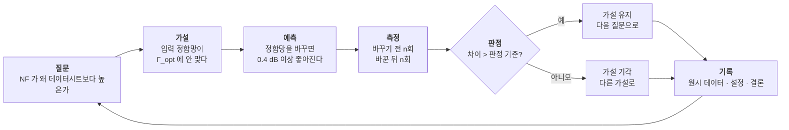
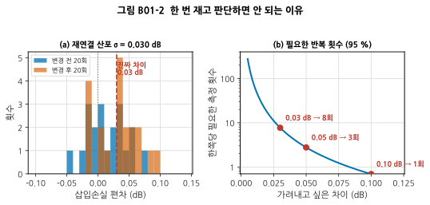
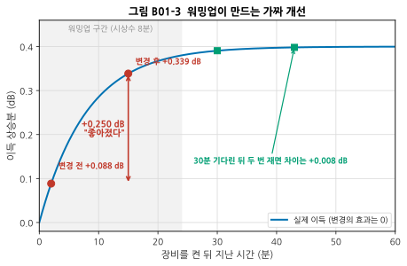
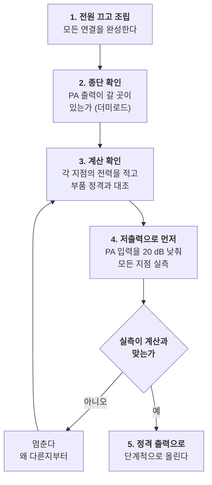

# B01 — 벤치 방법론: 실험을 설계하고 기록하는 법

**문서 번호**: RF-CUR-B01 · **버전**: v1.0 · **분량**: 이론 4 h + 실습 6 h

> 심화 과정의 첫 모듈입니다. 새 장비도, 새 공식도 나오지 않습니다. 대신 **나머지 열한 편이 모두 그 위에서 돌아가는 습관**을 만듭니다. 벤치에서 잃어버리는 시간의 대부분은 어려운 계산이 아니라 **잘못 잰 것을 믿었거나, 무엇을 했는지 기억하지 못해서** 생깁니다.

| | |
|---|---|
| **선수 모듈** | [M04](../01_모듈/M04_RF실험실입문.md)(장비·안전), [M05](../01_모듈/M05_첫측정.md)(첫 측정), [M15](../01_모듈/M15_정밀측정2_잡음선형성위상잡음.md)(측정 계획), [M16](../01_모듈/M16_DUT검증과튜닝과자동화.md)(디버그 방법론) |
| **이 모듈이 소유하는 개념** | **가설–측정–판정 루프**, 판정 기준을 먼저 적는 규칙, **한 번에 하나만 바꾸기**와 그것이 깨지는 경우, 2수준 요인 설계 입문, **반복성의 세 층**(반복·재연결·재현), 원시 데이터 보존 규약, 랩노트 서식, 벤치 물리 배치, 워밍업과 드리프트, **고전력 셋업의 순서**, 특성화 시간 예산 |
| **이 모듈을 쓰는 후속 모듈** | **전부**. 특히 B07·B10(디버그 절차), **B11**(반복성의 세 층이 Gage R&R 로 자란다), 심화 캡스톤 P1 |
| **학습 목표** | ① 하나의 실험을 가설·측정·판정 기준으로 적을 수 있다 ② 관측한 변화가 진짜인지 산포인지 계산으로 가른다 ③ 6개월 뒤의 자신이 재현할 수 있는 기록을 남긴다 |

---

## B01.0 이 모듈의 범위

기본 과정은 여기까지 왔습니다.

| 이미 배운 것 | 어디서 |
|---|---|
| 무엇을 먼저 재는가 (측정 계획) | [M15 §1](../01_모듈/M15_정밀측정2_잡음선형성위상잡음.md) |
| 증상에서 원인으로 좁히는 결정 트리 | [M16 §9](../01_모듈/M16_DUT검증과튜닝과자동화.md) |
| 재현 가능한 보고서 | [M16 §12](../01_모듈/M16_DUT검증과튜닝과자동화.md) |
| 장비를 태우지 않는 법 | [M04 §2](../01_모듈/M04_RF실험실입문.md) |

**이 모듈은 그 사이에 빠져 있는 것을 채웁니다** — 계획과 보고서 사이, 즉 **실험 하나를 어떻게 설계하고 무엇을 기록하는가**입니다.

> ⚠️ **다른 모듈과의 역할 분리**
>
> | 개념 | B01 (여기) | 다른 모듈 |
> |---|---|---|
> | 측정 계획 | **실험 하나의 설계** | [M15 §1](../01_모듈/M15_정밀측정2_잡음선형성위상잡음.md)이 **측정 순서 전체**를 소유 |
> | 디버그 | 기록과 되짚기 | [M16 §9](../01_모듈/M16_DUT검증과튜닝과자동화.md)가 **증상→원인 트리**를 소유 |
> | 장비 보호 | **셋업을 만드는 순서** | [M04 §2](../01_모듈/M04_RF실험실입문.md)가 **정격과 계산**을 소유 |
> | 산포 | 한 사람이 다시 재는 수준 | **B11**이 여러 사람·여러 장비를 소유 |
> | 불확도 | 언급만 | [M14 §10](../01_모듈/M14_정밀측정1_교정과불확도.md)이 소유 |

---

## B01.1 벤치에서 잃는 시간은 어디로 가는가

실패는 두 종류뿐입니다.

| 종류 | 증상 | 이 모듈의 대응 |
|---|---|---|
| **잘못 쟀다** | 측정계가 답을 만들어 냈는데 DUT 탓을 한다 | §2–§4 |
| **기억하지 못한다** | 3주 전 그 설정이 뭐였는지 모른다. 다시 한다 | §5 |

두 번째가 더 비쌉니다. 잘못 잰 것은 언젠가 드러나지만, 기록이 없으면 **같은 실험을 두 번 합니다.**



*그림 B01-1. 실험 하나의 루프. **예측과 판정 기준을 측정 앞에 둔 것**이 이 그림의 요점입니다. 데이터를 보고 나서 기준을 정하면 무엇을 봐도 "설명"이 됩니다. 오른쪽 끝의 기록이 다음 질문의 입력이 되므로 고리가 닫힙니다.*

---

## B01.2 하나의 실험 = 가설 + 예측 + 판정 기준

**측정 버튼을 누르기 전에 종이에 적어야 하는 것은 네 줄입니다.**

| 줄 | 내용 | 나쁜 예 | 좋은 예 |
|---|---|---|---|
| 가설 | 무엇이 원인이라고 보는가 | "정합이 이상한 것 같다" | "입력 정합망이 Γ_opt 가 아니라 Γ_ms 에 맞춰져 있다" |
| 예측 | 가설이 맞으면 **숫자로** 무슨 일이 일어나는가 | "좋아질 것이다" | "Γ_opt 로 다시 맞추면 NF 가 0.4 dB 이상 내려간다" |
| 측정 | 어떻게 잴 것인가 (조건 포함) | "NF 잰다" | "콜드소스법, 2.40~2.50 GHz, RBW 1 MHz, 재연결 8회" |
| 판정 | 어느 값이면 가설을 버리는가 | — | "차이가 0.15 dB 미만이면 기각" |

> 📌 **판정 기준을 먼저 적는 이유는 자신을 속이지 않기 위해서입니다.** 데이터를 본 뒤에 기준을 정하면, 0.05 dB 도 "경향이 보인다"가 되고 0.4 dB 도 "산포 범위"가 됩니다.

**판정 기준은 감이 아니라 산포에서 나옵니다.** §4에서 그 계산을 합니다.

---

## B01.3 변수를 하나만 바꾼다 — 그리고 못 바꾸는 경우

한 번에 하나만 바꾸는 것은 좋은 기본값입니다. 그런데 RF 에서는 자주 깨집니다.

| 바꾸려는 것 | 함께 움직이는 것 |
|---|---|
| 입력 정합망 | 이득, NF, 입력 반사, 안정도 ([M08 §3](../01_모듈/M08_증폭기.md)) |
| 바이어스 전류 | 이득, NF, P1dB, 소비 전력, 온도 |
| 케이블 교체 | 손실, 위상, 접지 임피던스 |

**셋을 각각 두 수준으로 보고 싶다면 여덟 번을 재는 것이 더 빠릅니다.**

| 방법 | 횟수 | 알 수 있는 것 | 못 보는 것 |
|---|---|---|---|
| 한 번에 하나씩 | 1 + 3 = 4회 | 각 요인의 효과 | **요인끼리의 상호작용** |
| 2수준 완전 요인 (2³) | 8회 | 각 요인의 효과 + 모든 상호작용 | — |

바이어스를 올리면 이득이 오르는데, **정합망을 바꾼 상태에서는 오히려 내려간다**면 그것이 상호작용입니다. 한 번에 하나씩 바꾸는 방식으로는 이 관계가 보이지 않습니다. 요인이 셋 이하이고 한 번 재는 데 몇 분이면, **처음부터 8회를 다 재는 편이 결국 빠릅니다.**

> 💡 **요인이 넷 이상이면** 완전 요인은 16회, 32회로 늘어납니다. 그때는 부분 요인 설계로 줄이지만, 이 커리큘럼은 거기까지 가지 않습니다. 벤치에서 실제로 부딪히는 것은 대부분 요인 두세 개입니다.

---

## B01.4 다시 재기 — 반복성의 세 층

"다시 쟀다"는 말은 세 가지 중 하나입니다. **어느 것인지 구분하지 않으면 산포를 과소평가합니다.**

| 층 | 무엇을 다시 하는가 | 무엇이 섞이는가 | 보통 더 큰 쪽 |
|---|---|---|---|
| **반복(repeat)** | 버튼만 다시 누른다 | 장비 잡음, 평균화 | 가장 작다 |
| **재연결(reconnect)** | 커넥터를 풀고 다시 조인다 | 접촉 상태, 토크, 케이블 자세 | **보통 여기가 지배한다** |
| **재현(reproduce)** | 다른 날, 다른 사람, 다른 장비 | 온도, 교정 드리프트, 조작 습관 | 가장 크다 |

**RF 에서 재연결 산포가 반복 산포보다 훨씬 큰 것이 보통입니다.** 그래서 버튼만 열 번 눌러 얻은 표준편차로 판정 기준을 세우면, 실제로는 통과할 수 없는 기준을 만들게 됩니다.

### 그래서 몇 번 재야 하는가

재연결 산포의 표준편차를 σ 라고 하면, 양쪽을 각 n 회 재서 얻은 두 평균의 차이는 표준오차 $\sigma\sqrt{2/n}$ 를 가집니다. 차이 Δ 를 95 % 신뢰로 가려내려면

$$\Delta > 1.96\,\sigma\sqrt{\frac{2}{n}} \quad\Longrightarrow\quad n > 2\left(\frac{1.96\,\sigma}{\Delta}\right)^{2}$$



*그림 B01-2. **읽는 법**: 왼쪽(a)은 σ = 0.030 dB 인 재연결 산포에서 실제로 0.03 dB 좋아진 경우입니다. 두 분포가 거의 겹칩니다 — **한 번씩만 재서는 구분할 수 없습니다.** 오른쪽(b)의 세로축은 로그이며, **가려내려는 차이가 절반이 되면 필요한 횟수는 네 배**가 됩니다(제곱 관계). 빨간 점이 실무에서 자주 만나는 세 지점입니다.*

σ = 0.030 dB 일 때 필요한 횟수는 이렇습니다.

| 가려내려는 차이 | 한쪽당 필요한 측정 |
|---|---|
| 0.02 dB | **18회** |
| 0.03 dB | **8회** |
| 0.05 dB | 3회 |
| 0.10 dB | 1회 |

> ⚠️ **0.02 dB 개선을 주장하려면 36번을 재야 합니다.** 그럴 값어치가 있는지 먼저 물어야 합니다 — 그 시간에 다른 항목에서 0.3 dB 를 얻을 수 있을지도 모릅니다.

---

## B01.5 워밍업 — 아무것도 안 고치고 좋아지는 방법

**측정 순서가 결과를 바꾸는 가장 흔한 원인은 온도입니다.**

증폭기를 켜면 이득이 서서히 올라갑니다. 여기서는 최종 상승분 0.40 dB, 시상수 8분인 소자를 예로 듭니다(값은 소자마다 다르지만 **모양은 같습니다**).



*그림 B01-3. **읽는 법**: 파란 곡선이 실제 이득이며, 중간에 한 변경은 **효과가 0** 입니다. 빨간 점 두 개는 켠 지 2분에 "변경 전"을, 15분에 "변경 후"를 잰 경우입니다 — **아무것도 고치지 않았는데 0.250 dB 좋아진 것으로 나옵니다.** 초록 네모는 30분을 기다린 뒤 같은 간격으로 잰 경우이고, 차이는 0.008 dB 로 사라집니다.*

| 언제 쟀는가 | 관측된 "개선" |
|---|---|
| 켠 뒤 2분 → 15분 | **+0.250 dB** (전부 워밍업) |
| 켠 뒤 30분 → 43분 | +0.008 dB |

**33배 차이입니다.** 그리고 §4에서 본 σ = 0.030 dB 기준으로 보면, 0.250 dB 는 "명백한 개선"이고 0.008 dB 는 "차이 없음"입니다. 같은 소자, 같은 변경, 정반대의 결론입니다.

### 안정화 규칙

| 규칙 | 내용 |
|---|---|
| **3τ 이상 기다린다** | 시상수의 3배면 최종값의 95 %에 옵니다. 위 예에서는 24분 |
| **얼마나 기다려야 하는지 한 번은 실측한다** | 소자마다 다릅니다. B08 에서 안정화 곡선을 잽니다 |
| **비교하는 두 측정은 같은 온도 상태에서** | 시각이 아니라 **켠 뒤 경과 시간**을 기록합니다 |
| **장비도 마찬가지** | 벡터 회로망 분석기(Vector Network Analyzer, VNA)와 스펙트럼 분석기(Spectrum Analyzer, SA)의 워밍업 요구 시간은 사양서에 있습니다 |

> 📌 **랩노트에 "10:32 측정"이 아니라 "전원 인가 후 41분, 케이스 43 °C"라고 적으십시오.** 시각은 재현에 쓸모가 없습니다.

---

## B01.6 벤치 배치 — 물리적으로 지켜야 하는 것

측정을 망치는 물리적 원인은 대부분 정해져 있습니다.

| 자리 | 흔한 실수 | 대책 |
|---|---|---|
| 전원 | DUT 전원과 장비 전원을 같은 멀티탭에 | 분리하고, 전원 잡음이 문제되면 저전압강하 레귤레이터(Low-Dropout Regulator, LDO)를 DUT 쪽에 |
| 접지 | 장비 여러 대의 접지가 고리를 만든다 | 접지는 한 점으로. 고리가 의심되면 절연 변압기나 광절연 |
| 케이블 | 잴 때마다 케이블 자세가 바뀐다 | 케이블을 **묶어서 고정**한다. 위상 안정도는 [M04 §4](../01_모듈/M04_RF실험실입문.md) |
| 열 | 전원공급기 배기가 DUT 를 데운다 | 배기 방향 확인. 온도계를 DUT 근처에 |
| 진동·사람 | 옆을 지나가면 값이 흔들린다 | 케이블 고정으로 대부분 해결. 그래도 흔들리면 그 자체가 문제 신호 |

**"오늘은 값이 이상하다"의 절반은 이 표 안에 있습니다.**

---

## B01.7 고전력 셋업 — 무엇이 먼저 타는가

전력 증폭기(Power Amplifier, PA)를 벤치에 올리는 순간 실수 한 번의 값이 올라갑니다.

### 계산부터: 감쇠기로는 안 됩니다

+40 dBm(10 W) 출력을 20 dB 감쇠기로 줄여 SA 에 넣는다고 해 봅시다.

$$P_{\text{버려야 할 열}} = 10\,\text{W} \times \left(1 - 10^{-20/10}\right) = 10 \times 0.99 = 9.9\,\text{W}$$

**일반적인 SMA 감쇠기의 평균 전력 정격은 2 W 안팎입니다.** 넣는 순간 탑니다. 그리고 타면서 임피던스가 변하므로 앞단의 PA 도 위험해집니다.

### 그래서 방향성 결합기를 씁니다

| 부품 | 하는 일 | 이 예에서 |
|---|---|---|
| 방향성 결합기 (30 dB) | 주 경로는 그대로 두고 **일부만 뽑아낸다** | 주 경로 +40 dBm 유지, 결합 포트 +10 dBm |
| 더미로드 / 전력계 | 주 경로의 10 W 를 받아 준다 | 정격 20 W 이상 |
| 감쇠기 (20 dB) | 결합 포트를 SA 안전 범위로 | +10 → −10 dBm, 버릴 열은 0.09 W |
| SA | 본다 | −10 dBm 은 안전 |

**주 경로의 전력은 결합기가 아니라 더미로드가 감당합니다.** 결합기의 결합 포트에는 처음부터 작은 전력만 나옵니다.

### 셋업을 만드는 순서



*그림 B01-4. 고전력 셋업 순서. **4번(저출력 예행)이 이 절차의 값어치입니다** — 20 dB 낮춰서 재면 계산이 틀렸을 때도 아무것도 타지 않습니다. 계산과 실측이 안 맞으면 5번으로 가지 않습니다.*

> ⚠️ **PA 출력을 열어 둔 채 켜지 마십시오.** 개방 종단은 전량 반사이며([M02 §3](../01_모듈/M02_전송선로.md)), 되돌아온 전력이 출력단을 파괴합니다. 격리기(isolator)를 상시 물려 두는 것이 안전합니다.

---

## B01.8 원시 데이터를 버리지 않는다

**화면 사진 한 장은 기록이 아닙니다.**

| 남겨야 할 것 | 왜 |
|---|---|
| 원시 데이터 파일 (`.s2p`, `.csv`, 트레이스) | 나중에 다른 방식으로 다시 볼 수 있다 |
| 장비 설정 전체 (상태 저장 파일) | "RBW 가 뭐였지"를 없앤다 |
| 교정 정보 (언제, 어떤 키트로) | 값을 믿을 수 있는지의 근거 |
| 환경 (온도, 전원 인가 후 경과 시간) | §5의 함정을 피한다 |
| DUT 식별 (일련번호, 리비전, 개조 이력) | 어느 물건의 값인지 |
| 실행한 스크립트와 그 버전 | 그림까지 다시 만들 수 있다 |

### 파일 이름 규약

```
2026-08-22_DUT-SN0007_rev-B_NF_coldsource_2.4-2.5GHz_run03.csv
└─ 날짜 ─┘└─ 물건 ──┘└리비전┘└항목┘└─ 방법 ─┘└─ 조건 ─┘└회차┘
```

날짜를 앞에 두면 정렬이 곧 시간순이 됩니다. **회차 번호를 붙이면 "덮어썼다"가 사라집니다.**

### 랩노트 한 장의 서식

| 칸 | 예 |
|---|---|
| 날짜·작업자 | 2026-08-22 · 홍 |
| DUT | SN0007, rev B, C12 를 1.0 pF 로 교체함 |
| 질문 | 입력 정합이 Γ_opt 에서 벗어나 NF 가 높은가 |
| 예측 | 정합망 교체 시 NF 0.4 dB 이상 개선 |
| 방법 | 콜드소스, 2.40–2.50 GHz, 재연결 8회, 전원 인가 후 30분 이상 |
| 판정 기준 | 평균 차이 0.15 dB 이상이면 가설 유지 |
| 원시 데이터 | `data/2026-08-22/nf_run01..08.csv` |
| 결과 | 평균 −0.38 dB (σ 0.031, n=8) |
| 결론 | 가설 유지. 다음: Γ_opt 를 실측해 확인 (B05) |
| 남은 의문 | 2.48 GHz 근처에서만 개선이 작다 |

**"남은 의문" 칸이 다음 실험의 씨앗입니다.** 비워 두지 마십시오.

---

## B01.9 시간 예산 — 4주짜리 특성화를 쪼개는 법

특성화는 끝이 없습니다. **끝을 정하는 것이 설계입니다.**

| 주 | 하는 일 | 산출물 | 못 끝내면 |
|---|---|---|---|
| 1 | 살려내기, 기본 확인 (전류·정합·이득) | 살아 있음 확인서 | 보드 문제. 설계로 돌려보낸다 |
| 2 | 예산표 항목 실측 (NF·선형성·위상잡음) | 예산 대조표 | 항목을 줄인다. 무엇을 뺐는지 적는다 |
| 3 | 시스템 시험 (변조·OTA·공존) | 시스템 보고 | 3주차를 우선하고 4주차를 줄인다 |
| 4 | 디버그와 재측정 | 대책 목록 | **여기가 줄어드는 것이 정상** |

> 💡 **4주차가 가장 먼저 줄어드는데, 실제로는 가장 많이 필요한 주입니다.** 그래서 1–2주차에 자동화([M16 §11](../01_모듈/M16_DUT검증과튜닝과자동화.md))를 해 두면 4주차에 재측정이 싸집니다. **자동화는 첫 주의 투자입니다.**

---

## B01.10 한 장 요약

| 알아야 할 것 | 한 줄 | 절 |
|---|---|---|
| 실험의 네 줄 | 가설·예측·측정·판정 기준을 **재기 전에** 적는다 | §2 |
| 한 번에 하나 | 좋은 기본값이지만 RF 에서는 자주 깨진다. 요인 셋이면 8회 | §3 |
| 반복성 세 층 | 반복 < 재연결 < 재현. **재연결이 보통 지배한다** | §4 |
| 몇 번 재는가 | n > 2(1.96σ/Δ)². 차이가 절반이면 횟수는 4배 | §4 |
| 워밍업 | 3τ 이상. 안 기다리면 0.25 dB 가 공짜로 생긴다 | §5 |
| 고전력 | 감쇠기가 아니라 결합기. 저출력 예행이 부품을 살린다 | §7 |
| 기록 | 원시 데이터·설정·교정·환경·DUT·스크립트 여섯 가지 | §8 |
| 시간 | 4주차(디버그)가 먼저 줄어든다. 자동화는 첫 주에 | §9 |

---

## B01.L 실습

| 목적 | 고를 실습 | 시간 |
|---|---|---|
| **최소 경로** (장비 없음) | L-B01-a · L-B01-c | 3 h |
| 장비가 있다 (표준 배정) | L-B01-a · L-B01-b · L-B01-c | 6 h |
| 전부 | L-B01-a ~ L-B01-d | 8 h |

### L-B01-a (T0) — 드리프트가 만드는 가짜 개선을 직접 만들어 본다

**준비물**: Python 3, numpy, matplotlib

**절차**

1. `scripts/gen_fig_b01.py` 의 `gain()` 을 그대로 옮겨 적습니다.
2. 시상수를 3분 / 8분 / 20분으로 바꿔 가며, "2분에 재고 15분에 다시 재기"의 가짜 개선량을 계산합니다.
3. 각 경우에 **가짜 개선을 0.01 dB 이하로 만들려면 몇 분을 기다려야 하는지** 구합니다.

**예상 결과**: 시상수가 길수록 기다려야 하는 시간이 비례해 늘어납니다. 3τ 대기가 왜 규칙이 되었는지 숫자로 확인됩니다.

**판정**: 시상수 8분에서 30분 대기 시 차이가 0.008 dB 로 나오면 맞습니다.

### L-B01-b (T1) — 재연결 산포를 실측한다

**준비물**: VNA, 케이블 1개, 종단기 또는 감쇠기 1개, 토크 렌치

**절차**

1. VNA 를 교정하고 30분 워밍업합니다.
2. DUT 를 연결한 채 **버튼만** 20회 눌러 S21 을 기록합니다 → σ_반복
3. **풀고 다시 조이기**를 20회 반복하며 매번 S21 을 기록합니다 → σ_재연결
4. 토크 렌치를 쓴 경우와 손으로 조인 경우를 나눠 3을 반복합니다.

**예상 결과**: σ_재연결 이 σ_반복 보다 몇 배 큽니다. 토크 렌치를 쓰면 σ_재연결 이 줄어듭니다.

**판정**: 두 σ 를 §4의 식에 넣어 "우리 벤치에서 0.05 dB 를 주장하려면 몇 번 재야 하는가"를 답으로 냅니다. **그 숫자가 이 실습의 산출물입니다.**

### L-B01-c (T0) — 랩노트 서식을 만들고 과거 측정을 옮겨 적는다

**준비물**: 없음

**절차**

1. §8의 서식을 자기 상황에 맞게 고칩니다.
2. 기본 과정에서 했던 실습 하나(예: [M16](../01_모듈/M16_DUT검증과튜닝과자동화.md) 의 튜닝 실습)를 골라 그 서식에 옮겨 적습니다.
3. **옮겨 적을 수 없는 칸**을 표시합니다.

**예상 결과**: "판정 기준"과 "환경" 칸이 대개 비어 있습니다. 그때 기록하지 않았기 때문입니다.

**판정**: 비어 있는 칸이 곧 앞으로 기록해야 할 항목입니다.

### L-B01-d (T1) — 고전력 셋업을 저출력으로 예행한다

**준비물**: 신호원, 방향성 결합기, 감쇠기, 더미로드, 전력계 또는 SA

**절차**

1. §7의 구성을 종이에 그리고 **각 지점의 전력을 계산해 적습니다.**
2. 신호원을 정격보다 20 dB 낮춰 넣고 각 지점을 실측합니다.
3. 계산과 실측을 대조합니다. 1 dB 이상 어긋나면 원인을 찾고 진행하지 않습니다.
4. 5 dB 씩 올리며 3을 반복합니다.

**예상 결과**: 결합기의 실제 결합량이 사양과 0.5 dB 정도 다르고, 주파수에 따라 변합니다.

**판정**: 모든 지점에서 계산과 실측이 1 dB 이내로 맞으면 정격 출력으로 올려도 좋습니다.

---

## B01.Q 확인 문제

<details>
<summary><b>Q1.</b> 변경 전후를 한 번씩 재서 0.08 dB 개선을 얻었습니다. 재연결 σ 는 0.03 dB 입니다. 이 개선을 보고해도 됩니까?</summary>

두 측정의 차이가 갖는 표준오차는 $\sigma\sqrt{2}=0.042$ dB 입니다. 0.08 dB 는 그 1.9배로 95 % 기준(1.96배)에 **아슬아슬하게 못 미칩니다.**

보고하려면 각 쪽을 최소 2회씩 더 재야 합니다. n=2 면 표준오차가 0.030 dB 로 줄어 0.08 dB 는 2.7배가 됩니다.

**더 중요한 것**: 이 계산을 하기 전에 σ 를 알고 있어야 합니다. L-B01-b 가 그 값을 구하는 실습입니다.
</details>

<details>
<summary><b>Q2.</b> 이득이 오전에는 20.1 dB, 오후에는 20.4 dB 나옵니다. 무엇을 먼저 의심합니까?</summary>

**온도**입니다. 오전 첫 측정은 워밍업이 덜 됐을 가능성이 큽니다.

확인 방법: 오후에 장비를 껐다가 다시 켜고 2분 뒤에 재 봅니다. 20.1 dB 가 나오면 원인이 확정됩니다.

이것이 §5의 그림이 말하는 것입니다. **시각이 아니라 전원 인가 후 경과 시간을 기록해야** 이 질문에 몇 초 만에 답할 수 있습니다.
</details>

<details>
<summary><b>Q3.</b> 0.02 dB 의 개선을 증명하려면 재연결 σ = 0.03 dB 에서 몇 번을 재야 합니까? 그럴 값어치가 있습니까?</summary>

$n > 2(1.96 \times 0.03 / 0.02)^2 = 17.3$ → **한쪽당 18회, 합쳐서 36회**입니다.

한 번 재는 데 3분이면 약 2시간입니다. 그리고 이것은 **최소한**이며, 그 사이에 온도가 변하지 않아야 합니다.

값어치 판단: 0.02 dB 는 캐스케이드 예산([M12](../01_모듈/M12_시스템예산설계.md))에서 거의 보이지 않는 양입니다. 같은 2시간에 다른 항목에서 0.3 dB 를 찾는 편이 낫습니다. **재는 것 자체가 비용이라는 감각이 벤치 엔지니어의 능력입니다.**
</details>

<details>
<summary><b>Q4.</b> 요인이 셋인데 8회를 다 재기 싫습니다. 한 번에 하나씩 4회만 재면 무엇을 놓칩니까?</summary>

**상호작용**입니다. 각 요인을 따로 보면 A 도 좋고 B 도 좋은데, A 와 B 를 함께 적용하면 나빠지는 경우를 볼 수 없습니다.

RF 에서 흔한 예: 바이어스를 올리면 이득이 오르고, 정합망을 바꿔도 이득이 오릅니다. 그런데 둘을 같이 하면 안정도 계수가 1 아래로 내려가 발진합니다([M08 §7](../01_모듈/M08_증폭기.md)). 4회 실험으로는 이 조합을 한 번도 만들어 보지 못합니다.
</details>

<details>
<summary><b>Q5.</b> +40 dBm PA 출력을 SA 로 보려고 합니다. 20 dB 감쇠기 두 개를 직렬로 쓰면 됩니까?</summary>

**안 됩니다.** 첫 감쇠기가 10 W 중 9.9 W 를 감당해야 합니다. 두 번째를 붙여도 첫 번째의 부담은 그대로입니다.

직렬로 붙이는 것은 **전력이 아니라 감쇠량을 늘리는 방법**입니다. 전력을 다루려면 경로 자체를 바꿔야 합니다 — 방향성 결합기로 일부만 뽑고, 나머지 10 W 는 더미로드가 받습니다.
</details>

<details>
<summary><b>Q6.</b> 측정을 끝내고 보니 판정 기준을 안 적었습니다. 지금 적으면 됩니까?</summary>

적을 수는 있지만 **그 실험의 결론에는 쓸 수 없습니다.**

데이터를 본 뒤에 정한 기준은 데이터에 맞춰집니다. 스스로는 공정했다고 믿어도 그렇습니다. 지금 할 수 있는 것은 둘입니다.

1. 기준을 적고 **같은 실험을 다시 한다** (권장)
2. "기준을 사후에 정했음"을 명시하고 잠정 결론으로 남긴다

2번은 정직하지만 약합니다. 그래서 §2가 "재기 전에 적는다"를 규칙으로 두는 것입니다.
</details>

---

## B01.A 이 모듈의 축약어

| 약어 | 영문 원어 | 한글 |
|---|---|---|
| DUT | Device Under Test | 피시험 소자 (→ M04) |
| VNA | Vector Network Analyzer | 벡터 회로망 분석기 (→ M04) |
| SA | Spectrum Analyzer | 스펙트럼 분석기 (→ M04) |
| NF | Noise Figure | 잡음지수 (→ M08) |
| PA | Power Amplifier | 전력 증폭기 (→ M08) |
| LDO | Low-Dropout Regulator | 저전압강하 레귤레이터 |
| RBW | Resolution Bandwidth | 분해능 대역폭 (→ M05) |
| SMA | SubMiniature version A | (커넥터 이름) (→ M04) |
| Γ_opt | Optimum Source Reflection Coefficient | 최적 소스 반사계수 (→ B05) |
| Γ_ms | Maximum-power Source Match | 최대전력 정합점 (→ M08) |
| Gage R&R | Gage Repeatability and Reproducibility | 게이지 반복성·재현성 (→ B11) |

---

## B01.S 출처

> ⚠️ **원문 확인 권고**: 이 교재는 외부 웹 직접 접속이 막힌 환경에서 집필되었습니다. 아래 주소는 검색 결과로 교차확인한 것이며 원문을 직접 열어 보지는 못했습니다. 중요한 수치는 원문에서 확인하십시오.

| 주장 | 등급 | 출처 |
|---|---|---|
| 측정 시스템의 산포를 반복성과 재현성으로 나누어 다루며, 표준 연구 설계는 10부품 × 3인 × 3회 | B | [CalibrationOS — Gage R&R 절차](https://calibrationos.com/learn/gage-rr-study-procedure) · [Quality Magazine — 측정 시스템 분석](https://www.qualitymag.com/articles/97565-measurement-systems-analysis) |
| 두 평균 차이의 검정에서 필요한 표본 수는 (효과 크기)⁻² 에 비례 | — | 표준적인 통계 결과. 본문의 식을 `scripts/gen_fig_b01.py` 가 몬테카를로 4만 회로 대조 확인 |

**이 모듈의 숫자는 전부 계산입니다.** `python3 scripts/gen_fig_b01.py` 를 실행하면 본문에 인용한 값이 그대로 출력되고, 자체 검산 9항목이 함께 돌아갑니다. 워밍업 모형의 시상수·상승분과 재연결 σ 는 **가정한 값**이며, 실제 값은 L-B01-b 로 각자의 벤치에서 구합니다.

---

## 변경 이력

| 버전 | 일자 | 내용 |
|---|---|---|
| v1.0 | 2026-08-22 | 최초 작성. 그림 4종(생성 2 + Mermaid 2), 실습 4종, 확인 문제 6문항. 그림 생성기 자체 검산 9항목 통과 |
