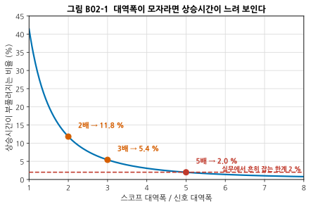
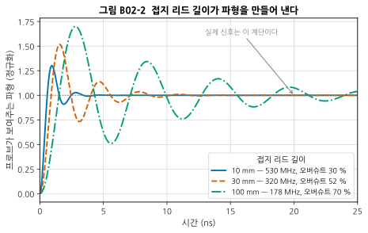
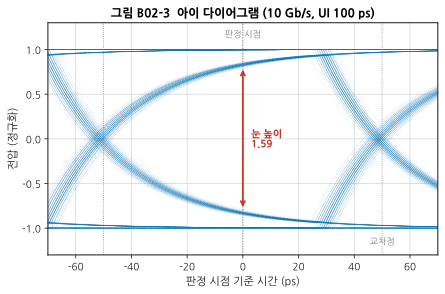
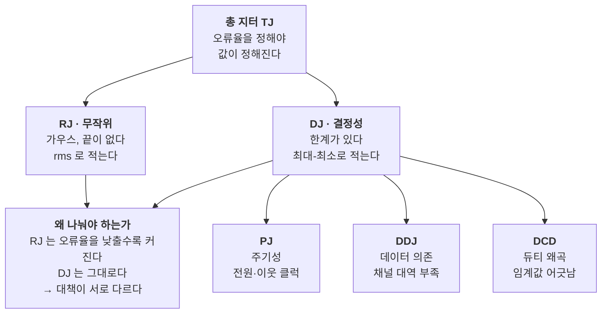
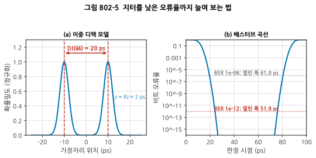

# B02 — 시간 영역: 오실로스코프, 프로브, 지터

**문서 번호**: RF-CUR-B02 · **버전**: v1.0 · **분량**: 이론 6 h + 실습 10 h

> 심화 과정에서 **완전히 새로 생기는 영역** 두 개 중 하나입니다. 기본 과정은 주파수 영역만 다뤘습니다 — [M05](../01_모듈/M05_첫측정.md)의 VNA 와 스펙트럼 분석기가 전부였습니다. 그런데 보드를 살려내는 첫날 손에 드는 물건은 오실로스코프입니다. 전원이 제대로 올라왔는지, 제어 신호가 나가는지, 클럭이 살아 있는지를 보는 물건입니다.

| | |
|---|---|
| **선수 모듈** | [M02](../01_모듈/M02_전송선로.md)(전송선로·반사), [M05](../01_모듈/M05_첫측정.md)(장비 화면 읽기), [M06](../01_모듈/M06_수동소자와공진.md)(공진·Q), [B01](./B01_벤치방법론.md) |
| **이 모듈이 소유하는 개념** | 실시간 vs 등가시간 샘플링, **대역폭·상승시간·샘플링 속도의 관계**, **프로브 부하와 접지 리드 인덕턴스**, 능동/차동/전류 프로브, 트리거 전략, 아이 다이어그램, **지터 분해**(RJ·DJ·PJ·DDJ), **이중 디랙 모델과 배스터브 곡선**, 스코프의 동적 범위 한계 |
| **이 모듈을 쓰는 후속 모듈** | **B06**(위상잡음을 지터로 환산), **B07**(클럭 하모닉의 시간영역 대응), **B08**(전원 인가 파형·돌입 전류), **B10**(간섭원의 시간 구조), 심화 캡스톤 P1·P2 |
| **학습 목표** | ① 신호에 맞는 스코프 대역폭을 계산으로 고른다 ② 프로브가 회로를 얼마나 바꾸는지 수치로 안다 ③ 지터를 RJ·DJ 로 나누고 낮은 오류율까지 외삽한다 |

---

## B02.0 이 모듈의 범위

**기본 과정에는 시간 영역이 없습니다.** 그래서 이 모듈은 다른 심화 모듈과 달리 "한 층 더 얹는 것"이 아니라 처음부터 시작합니다. 다만 물리는 이미 배운 것을 씁니다.

| 이 모듈이 기대는 것 | 어디서 |
|---|---|
| 반사와 종단 — 프로브도 부하다 | [M02 §3](../01_모듈/M02_전송선로.md) |
| 공진과 Q — 접지 리드가 공진기를 만든다 | [M06 §3](../01_모듈/M06_수동소자와공진.md) |
| 잡음 바닥과 분해능 대역폭 | [M05 §3](../01_모듈/M05_첫측정.md) |
| 요구 SNR 과 오류율 | [M13 §4](../01_모듈/M13_변조와신호품질.md) |

> ⚠️ **다른 모듈과의 역할 분리**
>
> | 개념 | B02 (여기) | 다른 모듈 |
> |---|---|---|
> | 스펙트럼 보기 | **왜 스코프로는 안 되는가**(§10) | [M05](../01_모듈/M05_첫측정.md)가 SA 조작을 소유 |
> | 위상잡음 | **지터로 환산하는 쪽** | [M09 §9](../01_모듈/M09_주파수변환과신호원.md)가 정의를, **B06**이 측정을 소유 |
> | 반사·정합 | 프로브 부하로서만 | [M02](../01_모듈/M02_전송선로.md)·[M03](../01_모듈/M03_S파라미터와스미스차트.md)이 소유 |
> | 고속 직렬 링크 규격 | **다루지 않습니다** | 규격별 준수 시험은 이 커리큘럼 범위 밖 |
> | 시간 영역 반사(TDR) | 언급만 | [M14 §9](../01_모듈/M14_정밀측정1_교정과불확도.md)가 소유 |

---

## B02.1 왜 RF 엔지니어가 스코프를 드는가

스펙트럼 분석기는 "무슨 주파수가 얼마나 있는가"에 답합니다. 벤치의 첫날 질문은 다릅니다.

| 첫날의 질문 | 답하는 장비 |
|---|---|
| 전원이 순서대로 올라왔는가 | 스코프 (여러 채널 동시) |
| 돌입 전류가 얼마였는가 | 스코프 + 전류 프로브 |
| SPI 로 쓴 레지스터 값이 실제로 나갔는가 | 스코프 (로직 디코드) |
| 클럭이 살아 있고 진폭이 맞는가 | 스코프 |
| 이 스퍼가 언제 나타나는가 (송신할 때만?) | **스코프로 시간 구조를, SA 로 주파수를** |

마지막 줄이 이 모듈이 B10 으로 이어지는 지점입니다. **간섭은 주파수뿐 아니라 시간 구조를 가집니다** — 주기적으로 튀는지, 송신할 때만 나오는지, 화면 갱신에 맞춰 나오는지.

---

## B02.2 대역폭·상승시간·샘플링 — 세 숫자의 관계

### 상승시간과 대역폭

단극(1차) 응답에서 10 %–90 % 상승시간과 −3 dB 대역폭의 곱은 상수입니다.

$$t_r \times BW \approx 0.35$$

**스코프도 상승시간을 가집니다.** 그래서 화면에 보이는 상승시간은 신호의 것이 아니라 둘이 합쳐진 것입니다.

$$t_{\text{화면}} = \sqrt{t_{\text{신호}}^{2} + t_{\text{스코프}}^{2}}$$

두 식을 합치면 **신호의 상승시간이 얼마든 상관없이 대역폭의 비만으로** 오차가 정해집니다.

$$\frac{t_{\text{화면}}}{t_{\text{신호}}} = \sqrt{1 + \frac{1}{r^{2}}}, \qquad r = \frac{BW_{\text{스코프}}}{BW_{\text{신호}}}$$

*그림 B02-1. **읽는 법**: 가로축은 스코프 대역폭이 신호 대역폭의 몇 배인가, 세로축은 상승시간이 부풀려지는 비율입니다. **신호가 얼마나 빠른지는 이 그래프에 들어가지 않습니다** — 비율만 정하면 오차가 정해집니다. 빨간 파선이 실무에서 흔히 잡는 2 % 한계이고, 그 지점이 5배입니다.*

| 대역폭 비 | 상승시간 오차 |
|---|---|
| 1배 | **41.4 %** |
| 2배 | 11.8 % |
| 3배 | 5.4 % |
| 4배 | 3.1 % |
| **5배** | **2.0 %** |

> 📌 **"신호 대역폭의 5배"** 라는 규칙은 여기서 나옵니다. 2 % 오차를 목표로 하면 정확히 4.98배입니다. 3 % 로 느슨하게 잡으면 4.05배입니다.

### 신호 대역폭을 어떻게 아는가

신호의 상승시간을 먼저 재고 $BW_{\text{신호}} = 0.35 / t_r$ 로 환산합니다. **이때 잰 상승시간 자체가 부풀려져 있으므로**, 한 번 재고 위 식으로 되돌려 참값을 추정한 뒤 다시 판단합니다.

> ⚠️ **0.35 는 단극 응답의 값입니다.** 대역폭이 넓은 스코프는 평탄 응답에 가까워 계수가 0.4~0.45 로 올라갑니다. 사양서에 계수가 적혀 있으면 그것을 쓰십시오. 계수를 0.35 로 가정하면 고성능 스코프의 상승시간을 실제보다 빠르게 계산하게 됩니다.

### 샘플링 속도

대역폭과 샘플링 속도는 다른 사양입니다.

| 항목 | 기준 |
|---|---|
| 나이퀴스트 최소 | 대역폭의 2배 |
| 실무 권장 | **대역폭의 4~5배** — 보간(sin x/x)이 정점을 제대로 복원하려면 |
| 사양서 확인 | 채널을 다 켜면 샘플링 속도가 반으로 떨어지는 모델이 많습니다 |

**4채널을 다 쓰면 2.5 GS/s 가 되는 5 GS/s 스코프**는 흔합니다. 사양서의 "최대"는 보통 1채널 기준입니다.

---

## B02.3 실시간 vs 등가시간

| | 실시간 샘플링 | 등가시간 샘플링 |
|---|---|---|
| 방식 | 한 번의 사건을 한 번에 다 담는다 | 반복되는 신호를 조금씩 다른 시점에 찍어 모은다 |
| 필요 조건 | 없음 | **신호가 반복되어야 하고 트리거가 안정해야 한다** |
| 실효 시간 분해능 | 샘플링 속도가 한계 | 훨씬 높다 (수 TS/s 상당) |
| 못 보는 것 | — | **한 번만 일어나는 사건, 사건마다 다른 지터** |
| 벤치에서 | 전원 인가, 돌입 전류, 이상 동작 | 아이 다이어그램, 반복 파형의 정밀 측정 |

> ⚠️ **등가시간으로는 "가끔 일어나는 이상"을 절대 못 봅니다.** 만 번에 한 번 나오는 글리치를 찾고 있다면 실시간이어야 합니다. 이것이 §10의 한계와 함께 스코프 선택을 가르는 지점입니다.

---

## B02.4 프로브가 회로를 바꾼다

**프로브를 대는 순간 회로가 달라집니다.** 이것은 오차가 아니라 물리입니다.

### 팁 용량이 하는 일

프로브 팁의 용량 C 는 주파수가 올라가면 임피던스가 내려갑니다. 50 Ω 노드에 대면 분압이 일어납니다.

| 팁 용량 | 100 MHz | 500 MHz | 1 GHz | 5 GHz |
|---|---|---|---|---|
| **10 pF** (보통의 수동 프로브) | 159 Ω / −0.41 dB | 32 Ω / −5.40 dB | **16 Ω / −10.36 dB** | 3 Ω / −23.94 dB |
| **0.8 pF** (능동 프로브) | 1989 Ω / −0.00 dB | 398 Ω / −0.07 dB | 199 Ω / −0.27 dB | 40 Ω / −4.11 dB |

**1 GHz 에서 10 pF 수동 프로브는 신호를 10 dB 깎아 먹습니다.** 화면의 진폭이 작다고 회로를 의심하기 전에 프로브를 의심해야 합니다. 그리고 깎인 만큼 **회로 자체의 동작도 달라져 있습니다** — 발진하던 것이 프로브를 대면 멎는 현상이 여기서 나옵니다.

### 접지 리드가 하는 일 — 더 나쁜 쪽

팁 용량은 신호를 줄이기만 하지만, **접지 리드는 없던 파형을 만들어 냅니다.**

접지 리드는 인덕턴스를 가집니다. 계측사 자료는 **인치당 20 nH** 정도로 봅니다(≈ 0.79 nH/mm). 이 인덕턴스와 팁 용량이 직렬 공진기를 이룹니다.

$$f_{0} = \frac{1}{2\pi\sqrt{L_{\text{리드}} C_{\text{팁}}}}$$

*그림 B02-2. **읽는 법**: 실제 신호는 회색 점선의 깨끗한 계단인데, 프로브가 보여주는 것은 세 곡선입니다. **차이는 접지 리드 길이뿐입니다.** 10 pF 팁, 20 Ω 구동원을 가정했습니다. 리드가 길수록 공진이 낮아지고(느린 링잉) 감쇠가 약해집니다(큰 오버슈트).*

| 접지 리드 | 인덕턴스 | 공진 | 오버슈트 |
|---|---|---|---|
| 10 mm | 7.9 nH | **530 MHz** | 30 % |
| 30 mm | 23.6 nH | 321 MHz | 52 % |
| 100 mm (악어클립) | 78.7 nH | **178 MHz** | **70 %** |

> 📌 **10 mm 와 100 mm 의 공진 주파수 비는 약 3배입니다** — 길이가 10배인데 3배인 이유는 공진이 $1/\sqrt{L}$ 이기 때문입니다. **길이를 반으로 줄이면 공진은 1.41배밖에 안 올라갑니다.** 그래서 "조금 줄이기"로는 부족하고, 접지 스프링처럼 **한 자리 수 mm** 로 내려가야 합니다.

이 모형은 계측사가 드는 사례와 맞습니다 — 1.5 pF 능동 프로브에 3~6인치 리드를 달면 공진이 350~550 MHz 라는 설명이, 위 식으로 계산하면 531 MHz / 375 MHz 로 나옵니다.

---

## B02.5 프로브를 고르는 순서

| 프로브 | 팁 용량 | 언제 |
|---|---|---|
| 수동 10:1 | 8~12 pF | 저주파, 전원 리플, 대략 보기 |
| 능동 단일단 | 0.5~1.5 pF | 수백 MHz 이상, 클럭·고속 신호 |
| 능동 차동 | 0.3~1 pF | 차동 쌍, 접지가 흔들리는 곳 |
| 전류 프로브 | — | 전류를 직접. B08 에서 다시 |
| **동축 직결** (50 Ω) | — | **가능하면 이것.** 프로브가 아예 없다 |

**RF 보드에는 시험점을 아예 50 Ω 으로 빼 두는 것이 가장 좋습니다.** 프로브 문제 전체가 사라집니다. 이것이 [M17 §13](../01_모듈/M17_보드설계와인증.md)의 런치 설계가 시험까지 고려해야 하는 이유입니다.

### 프로브를 대기 전 세 가지 확인

1. **이 주파수에서 팁 용량이 얼마의 임피던스인가** — §4의 표
2. **접지를 어디에 어떻게 잡을 것인가** — 가장 가까운 접지 패드, 가장 짧은 경로
3. **프로브의 최대 입력이 얼마인가** — 능동 프로브는 수 V 에서 파괴됩니다

---

## B02.6 트리거 — 보고 싶은 것만 잡는 법

디버그에서 트리거 설정이 절반입니다.

| 상황 | 트리거 |
|---|---|
| 주기 신호 보기 | 에지 |
| 가끔 나오는 좁은 글리치 | 펄스 폭 (지정 폭보다 좁은 것) |
| 규격 위반 순간 | 런트(runt), 셋업/홀드 위반 |
| "송신할 때만 스퍼가 난다" | 송신 인에이블 신호로 외부 트리거 |
| 원인을 모를 때 | **이상 파형에 트리거 → 그 앞을 본다** (사전 트리거) |

> 💡 **사전 트리거(pre-trigger)가 벤치에서 가장 쓸모 있습니다.** 문제가 터진 순간에 트리거를 걸고 **그 이전 구간**을 보면 원인이 보입니다. 스코프는 항상 기록하고 있다가 트리거 시점 기준으로 앞뒤를 잘라 줍니다.

---

## B02.7 아이 다이어그램 — 모든 비트를 겹쳐 놓기

디지털 신호의 품질을 한 장으로 보는 방법입니다. 한 단위 구간(Unit Interval, UI)씩 잘라 전부 겹칩니다.

*그림 B02-3. **읽는 법**: 10 Gb/s 이므로 UI 는 100 ps 입니다. 가운데(0 ps)가 판정 시점이고 좌우 ±50 ps 가 교차점입니다. **세로로 열린 폭이 눈 높이**(잡음 여유), **가로로 열린 폭이 눈 폭**(타이밍 여유)입니다. 위아래로 여러 겹이 보이는 것은 앞선 비트에 따라 파형이 달라지기 때문이며, 그것이 §8의 데이터 의존 지터입니다.*

| 눈에서 읽는 것 | 뜻 |
|---|---|
| 눈 높이 | 잡음 여유. 좁으면 잡음에 진다 |
| 눈 폭 | 타이밍 여유. 좁으면 지터에 진다 |
| 교차점의 두께 | 지터의 크기 |
| 위아래 선이 여러 겹 | **부호 간 간섭(ISI)** — 채널이 좁다 |
| 교차점이 높이의 절반이 아님 | 듀티 왜곡 |

---

## B02.8 지터를 나눈다 — RJ 와 DJ

**지터를 하나의 숫자로 적을 수 없는 이유**가 이 절의 내용입니다.

| 갈래 | 성질 | 원인 | 크기를 적는 법 |
|---|---|---|---|
| **RJ** (무작위) | 가우스. **끝이 없다** | 열잡음, 산탄잡음 | rms (σ) |
| **DJ** (결정성) | **한계가 있다** | 아래 세 가지 | 최대–최소 |
| └ **PJ** (주기성) | 주기적 | 전원 리플, 이웃 클럭의 결합 | 최대–최소 |
| └ **DDJ** (데이터 의존) | 앞 비트에 따라 | 채널 대역 부족(ISI) | 최대–최소 |
| └ DCD (듀티 왜곡) | 1과 0의 폭이 다름 | 임계값 어긋남 | 최대–최소 |

*그림 B02-4. 지터의 갈래와 나누는 이유. **오른쪽 아래 상자가 이 그림의 요점입니다** — 나누는 목적은 분류가 아니라 **대책이 달라서**입니다. RJ 가 지배하면 잡음을 줄여야 하고, DDJ 가 지배하면 채널을 넓히거나 등화를 걸어야 합니다.*

> 📌 **RJ 를 "최대 몇 ps" 라고 적을 수 없습니다.** 가우스 분포는 꼬리가 끝나지 않으므로, 얼마나 오래 보느냐에 따라 최대값이 계속 커집니다. **그래서 오류율을 함께 말해야 값이 정해집니다.**

---

## B02.9 이중 디랙과 배스터브 — 낮은 오류율까지 늘여 보기

10⁻¹² 오류율을 직접 재려면 10 Gb/s 에서도 100초가 넘게 걸립니다. 10⁻¹⁵ 는 하루가 넘습니다. **그래서 재지 않고 외삽합니다.**

### 이중 디랙 모델

DJ 를 **두 개의 델타 함수**로, RJ 를 **가우스**로 놓고 둘을 합성합니다.

$$TJ(\text{BER}) = DJ(\delta\delta) + 2 \cdot Q(\text{BER}) \cdot RJ_{\text{rms}}$$

여기서 Q 는 오류율에서 나오는 수로, $\text{BER} = \tfrac{1}{2}\,\mathrm{erfc}(Q/\sqrt{2})$ 를 풀어 얻습니다.

| 오류율 | Q | TJ (DJ 20 ps, RJ 2 ps) | 100 ps UI 에서 열린 폭 |
|---|---|---|---|
| 10⁻⁶ | 4.753 | 39.0 ps | 61.0 ps |
| 10⁻¹² | **7.034** | **48.1 ps** | **51.9 ps** |
| 10⁻¹⁵ | 7.941 | 51.8 ps | 48.2 ps |

**오류율을 1000배 낮추면(10⁻¹² → 10⁻¹⁵) 총 지터는 3.6 ps 늘어납니다.** 그 증가분은 전부 RJ 항에서 옵니다 — DJ 는 상수이기 때문입니다.

*그림 B02-5. **읽는 법**: (a) 가장자리 위치의 분포입니다. 두 봉우리 사이 거리가 DJ, 각 봉우리의 폭이 RJ 입니다. (b) 가로축을 판정 시점, 세로축을 오류율(로그)로 그린 배스터브 곡선입니다. **욕조 바닥이 넓을수록 여유가 큽니다.** 점선이 두 오류율 기준이고, 그 높이에서 욕조의 폭이 곧 열린 폭입니다.*

> ⚠️ **이 기법이 거짓말을 하는 조건** (심화 규칙 3)
>
> | 조건 | 무슨 일이 일어나는가 |
> |---|---|
> | DJ 가 실제로는 델타 두 개가 아닐 때 | 이중 디랙은 **모델**입니다. DDJ 가 여러 봉우리를 만들면 실제 꼬리는 모델보다 두껍고, **외삽은 낙관적으로 나옵니다** |
> | 측정 구간이 짧을 때 | 관측하지 못한 저주파 성분(전원 변동 등)이 빠져 RJ 가 작게 나옵니다 |
> | 도구마다 정의가 다를 때 | 전이 밀도(보통 0.5)를 Q 에 넣는 도구와 넣지 않는 도구가 있어 **같은 데이터에서 다른 TJ** 가 나옵니다. 보고할 때 정의를 함께 적으십시오 |
>
> **그래서 중요한 판정은 외삽만으로 하지 않습니다.** 최소한 10⁻⁹ 정도까지는 실측해 곡선이 모델과 겹치는지 확인한 뒤 외삽합니다.

---

## B02.10 스코프로 RF 를 보면 안 되는 이유

"스펙트럼도 스코프의 FFT 로 보면 되지 않나"라는 질문에 대한 답입니다.

| 항목 | 스코프 | 스펙트럼 분석기 |
|---|---|---|
| 변환기 분해능 | 보통 8비트 → 이론 SNR **49.9 dB** | 좁은 분해능 대역폭으로 잡음을 걸러 본다 |
| 잡음을 보는 폭 | 전 대역(예: 10 GHz) | RBW(예: 1 kHz) |
| 그 차이 | — | $10\log_{10}(10^{10}/10^{3}) = $ **70 dB** |
| 입력단 | 광대역 그대로 | 감쇠기·프리앰프·사전선택기로 조절 |
| 잘하는 것 | **시간 구조**, 단발 사건 | **작은 신호**, 스퍼 사냥 |

**−80 dBc 스퍼를 8비트 스코프로 찾을 수는 없습니다.** 반대로 "이 스퍼가 송신 구간에만 나온다"는 사실은 SA 로 알기 어렵습니다. **두 장비는 경쟁하지 않고 나눠 맡습니다.**

> 💡 **긴 기록에 FFT 를 걸고 평균을 내면** 스코프도 잡음 바닥을 상당히 낮출 수 있습니다. 그래도 사전선택기가 없어 대신호가 있으면 변환기가 포화되고, 그 순간 없던 스퍼가 화면에 생깁니다. B10 의 간섭 사냥에서 이 함정을 다시 만납니다.

---

## B02.11 한 장 요약

| 알아야 할 것 | 한 줄 | 절 |
|---|---|---|
| 대역폭 고르기 | 신호 대역폭의 **5배**면 상승시간 오차 2 % | §2 |
| 샘플링 | 대역폭의 4~5배. 채널을 다 켜면 반으로 준다 | §2 |
| 등가시간 | 반복 신호만. **단발 이상은 못 본다** | §3 |
| 팁 용량 | 10 pF 는 1 GHz 에서 신호를 10 dB 깎는다 | §4 |
| 접지 리드 | 인치당 20 nH. 100 mm 면 178 MHz 에서 링잉 | §4 |
| 리드 줄이기 | 공진은 $1/\sqrt{L}$ — 반으로 줄여야 1.41배 | §4 |
| 지터 나누기 | RJ 는 끝이 없고 DJ 는 한계가 있다. **대책이 다르다** | §8 |
| 외삽 | TJ = DJ + 2·Q·RJ. Q(10⁻¹²) = 7.034 | §9 |
| 외삽의 함정 | 모델이 틀리면 낙관적으로 나온다. 10⁻⁹ 까지는 실측 | §9 |
| 스코프의 한계 | 8비트 ≈ 50 dB. 스퍼 사냥은 SA 로 | §10 |

---

## B02.L 실습

| 목적 | 고를 실습 | 시간 |
|---|---|---|
| **최소 경로** (장비 없음) | L-B02-a · L-B02-d | 5 h |
| 저가 장비가 있다 | L-B02-a · L-B02-b · L-B02-d | 8 h |
| 전부 | L-B02-a ~ L-B02-e | 12 h |

### L-B02-a (T0) — 대역폭이 모자랄 때 무슨 일이 생기는지 계산한다

**준비물**: Python 3, numpy, matplotlib

**절차**

1. `rise_error(r) = sqrt(1 + 1/r²) − 1` 을 구현하고 그림 B02-1 을 재현합니다.
2. 상승시간 500 ps 인 신호를 1 / 2 / 3.5 / 5 GHz 스코프로 볼 때 화면에 나올 상승시간을 각각 계산합니다.
3. 반대로, **화면에서 610 ps 를 읽었고 스코프가 1 GHz** 일 때 신호의 참 상승시간을 역산합니다.

**예상 결과**: 3번의 답이 500 ps 로 돌아옵니다. 이 역산이 실무에서 실제로 쓰는 계산입니다.

**판정**: 1 GHz 스코프에서 22.1 % 부풀려지면 맞습니다.

### L-B02-b (T1) — 접지 리드 길이를 바꿔 가며 링잉을 본다

**준비물**: 오실로스코프, 수동 프로브(접지 리드 + 접지 스프링), 빠른 에지 소스(함수발생기의 구형파 또는 마이크로컨트롤러 출력 핀)

**절차**

1. 악어클립 접지 리드(약 100~150 mm)로 구형파의 상승 에지를 봅니다. 링잉 주기를 읽습니다.
2. 리드를 짧은 것으로 바꾸고 반복합니다.
3. 접지 스프링(수 mm)으로 바꾸고 반복합니다.
4. 각 경우의 **링잉 주파수를 읽어 $L = 1/((2\pi f)^2 C)$ 로 인덕턴스를 역산**합니다.

**예상 결과**: 역산한 인덕턴스가 리드 길이에 비례하며, 인치당 20 nH 근방으로 나옵니다.

**판정**: 세 경우의 (인덕턴스 ÷ 길이)가 서로 30 % 이내로 일치하면 모형이 맞은 것입니다. **이 실습의 산출물은 "우리 프로브의 접지 리드는 mm 당 몇 nH 인가"입니다.**

### L-B02-c (T2) — 프로브가 회로를 바꾸는 것을 본다

**준비물**: 스코프, 수동 프로브, 능동 프로브, 발진 중인 회로 또는 고속 클럭

**절차**

1. 수동 프로브로 클럭 진폭을 재고 기록합니다.
2. 같은 지점을 능동 프로브로 잽니다.
3. 두 값의 차이를 §4의 표로 설명합니다.
4. 가능하면 **프로브를 대는 순간 회로 동작이 바뀌는 지점**을 찾습니다(발진 정지, 타이밍 위반 등).

**예상 결과**: 주파수가 높을수록 두 프로브의 차이가 커집니다.

**판정**: 측정한 차이가 §4 표의 예측과 2 dB 이내면 팁 용량 모형이 맞습니다.

### L-B02-d (T0) — 지터를 나누고 외삽한다

**준비물**: Python 3, numpy, scipy

**절차**

1. RJ(가우스) + DJ(델타 두 개) + PJ(사인) 을 섞은 가장자리 시각 데이터를 만듭니다.
2. 히스토그램에서 **RJ 와 DJ 를 분리**합니다(꼬리에 가우스를 맞춰 σ 를, 봉우리 간격에서 DJ 를).
3. 배스터브 곡선을 그리고 10⁻¹² 에서 열린 폭을 읽습니다.
4. **닫힌 식 TJ = DJ + 2·Q·RJ 와 대조**합니다.
5. PJ 를 넣었을 때 이중 디랙 외삽이 얼마나 낙관적으로 나오는지 확인합니다.

**예상 결과**: 3번과 4번이 일치합니다(`scripts/gen_fig_b02.py` 의 검산이 네 오류율에서 0.02 ps 이내로 맞는 것을 확인합니다). 그런데 **5번에서 어긋납니다** — PJ 가 크면 실제 꼬리가 모델보다 두꺼워 외삽이 낙관적이 됩니다.

**판정**: 5번의 어긋남을 관측하고 그 이유를 설명할 수 있으면 §9의 경고를 이해한 것입니다.

### L-B02-e (T2) — 아이 다이어그램과 마스크

**준비물**: 스코프(아이/지터 옵션), 패턴 발생기 또는 고속 직렬 출력을 가진 보드

**절차**

1. 아이 다이어그램을 띄우고 눈 높이·눈 폭을 읽습니다.
2. 케이블을 긴 것으로 바꿔 눈이 닫히는 것을 봅니다.
3. 지터 분해 결과(RJ·DJ·PJ·DDJ)를 기록하고, **케이블을 바꿨을 때 어느 항목이 커졌는지** 확인합니다.

**예상 결과**: 긴 케이블에서는 DDJ 가 주로 커집니다(대역 부족 → ISI). RJ 는 거의 그대로입니다.

**판정**: 어느 항목이 커졌는지로 원인을 지목할 수 있으면 §8의 목적을 달성한 것입니다.

---

## B02.Q 확인 문제

<b>Q1.</b> 상승시간 200 ps 신호를 2 GHz 스코프로 봅니다. 화면에는 몇 ps 로 나옵니까?

신호 대역폭 = 0.35/200 ps = **1.75 GHz**. 대역폭 비 r = 2/1.75 = **1.14배**.

오차 = √(1 + 1/1.14²) − 1 = √(1.769) − 1 = **33.0 %**

화면 값 = 200 × 1.330 = **266 ps**

직접 계산해도 같습니다: t_스코프 = 0.35/2 GHz = 175 ps, √(200² + 175²) = 266 ps.

**2 GHz 스코프로 200 ps 신호를 보면 안 됩니다.** 2 % 오차를 원하면 1.75 × 4.98 = **8.7 GHz** 가 필요합니다.

<b>Q2.</b> 접지 리드를 100 mm 에서 50 mm 로 줄였습니다. 링잉 주파수는 몇 배가 됩니까?

$f_0 \propto 1/\sqrt{L}$ 이고 L 은 길이에 비례하므로 **√2 = 1.41배**입니다.

178 MHz → 252 MHz. **절반으로 줄였는데 1.4배밖에 안 올라갑니다.**

이것이 "리드를 조금 줄이기"가 소용없는 이유입니다. 10배 줄여야 3.16배입니다. 그래서 실무에서는 리드를 쓰지 않고 **접지 스프링**으로 갑니다.

<b>Q3.</b> 화면의 클럭 진폭이 사양보다 작습니다. 무엇을 먼저 확인합니까?

**프로브의 팁 용량과 그 주파수에서의 임피던스**입니다.

1 GHz 클럭을 10 pF 수동 프로브로 보면 §4의 표대로 10.4 dB, 즉 진폭이 **0.30배**로 보입니다. 회로가 아니라 프로브가 만든 값입니다.

확인 방법: 능동 프로브로 바꾸거나, 가능하면 50 Ω 동축으로 직결해 다시 잽니다. 값이 달라지면 프로브 부하가 원인입니다.

<b>Q4.</b> RJ 2 ps, DJ 20 ps 인 링크의 총 지터를 "22 ps" 라고 보고했습니다. 무엇이 틀렸습니까?

**단순히 더하면 안 됩니다.** RJ 는 rms 이고 DJ 는 최대–최소여서 단위가 다릅니다.

올바른 답은 오류율을 정해야 나옵니다.

- 10⁻¹² 에서: 20 + 2 × 7.034 × 2 = **48.1 ps**
- 10⁻¹⁵ 에서: 20 + 2 × 7.941 × 2 = **51.8 ps**

**"22 ps" 는 오류율 약 0.3 에 해당하는 값입니다** — 세 번에 한 번 틀리는 링크입니다. 지터를 보고할 때는 **반드시 오류율을 함께** 적습니다.

<b>Q5.</b> 배스터브 외삽으로 10⁻¹² 여유가 51.9 ps 나왔습니다. 그대로 규격 판정에 써도 됩니까?

**조건부입니다.** §9의 경고 세 가지를 확인해야 합니다.

1. **모델이 맞는가** — 10⁻⁹ 정도까지 실측해 곡선이 모델과 겹치는지 봅니다. 벌어지면 외삽이 낙관적입니다.
2. **충분히 오래 봤는가** — 저주파 변동(전원, 온도)이 포함될 만큼 긴 구간을 봤는지.
3. **정의가 같은가** — 상대와 우리 도구의 Q 정의(전이 밀도 포함 여부)가 같은지.

셋 다 확인했으면 씁니다. 확인하지 않았으면 **"모델 기반 추정치"라고 명시**해서 보고합니다.

<b>Q6.</b> −70 dBc 스퍼를 찾아야 합니다. 스코프의 FFT 로 하면 됩니까?

**권하지 않습니다.** 8비트 변환기의 이론 SNR 이 49.9 dB 이므로 단발 취득으로는 −70 dBc 가 잡음 아래입니다.

긴 기록에 FFT 와 평균을 걸면 잡음 바닥은 내려갑니다. 그런데 남는 문제가 있습니다 — **사전선택기가 없어** 대신호가 변환기를 포화시키면 **없던 스퍼가 생깁니다.** 그러면 찾은 스퍼가 DUT 의 것인지 스코프의 것인지 구분할 수 없습니다.

스퍼 사냥은 SA 로 합니다([M15 §8](../01_모듈/M15_정밀측정2_잡음선형성위상잡음.md)). 스코프는 **그 스퍼가 언제 나오는지**를 답하는 데 씁니다.

---

## B02.A 이 모듈의 축약어

| 약어 | 영문 원어 | 한글 |
|---|---|---|
| UI | Unit Interval | 단위 구간 (한 비트의 길이) |
| RJ | Random Jitter | 무작위 지터 |
| DJ | Deterministic Jitter | 결정성 지터 |
| PJ | Periodic Jitter | 주기성 지터 |
| DDJ | Data-Dependent Jitter | 데이터 의존 지터 |
| DCD | Duty Cycle Distortion | 듀티비 왜곡 |
| TJ | Total Jitter | 총 지터 |
| BER | Bit Error Rate | 비트 오류율 (→ M13) |
| ISI | Inter-Symbol Interference | 부호 간 간섭 (→ M13) |
| FFT | Fast Fourier Transform | 고속 푸리에 변환 |
| SA | Spectrum Analyzer | 스펙트럼 분석기 (→ M04) |
| VNA | Vector Network Analyzer | 벡터 회로망 분석기 (→ M04) |
| TDR | Time Domain Reflectometry | 시간 영역 반사 측정 (→ M14) |
| SNR | Signal-to-Noise Ratio | 신호 대 잡음비 (→ M01) |
| RBW | Resolution Bandwidth | 분해능 대역폭 (→ M05) |
| SPI | Serial Peripheral Interface | 직렬 주변장치 인터페이스 |

---

## B02.S 출처

> ⚠️ **원문 확인 권고**: 아래 주소는 검색 결과로 교차확인한 것이며 원문을 직접 열어 보지는 못했습니다. 중요한 수치는 원문에서 확인하십시오.

| 주장 | 등급 | 출처 |
|---|---|---|
| 프로브 접지 리드는 인치당 20~25 nH 를 더하며, 이것이 팁 용량과 공진해 링잉을 만든다. 리드를 짧게 해 공진을 대역 위로 밀어내는 것이 규칙 | C, B | [element14 — 프로브 부하 어림법](https://community.element14.com/technologies/test-and-measurement/b/blog/posts/oscilloscope-probe-loading-rule-of-thumbs) · [Teledyne LeCroy — 수동 프로브 접지 리드의 영향](https://www.teledynelecroy.com/oscilloscope/blog/the-effects-of-passive-probe-ground-leads/) |
| 10인치 접지 리드를 쓰면 프로브의 −3 dB 대역폭이 500 MHz 이상에서 약 175 MHz 로 내려간다 | B, B | [Keysight — 정확한 프로빙을 위한 절차](https://docs.keysight.com/kkbopen/quick-steps-to-accurate-oscilloscope-probing-589314568.html) · [EDN — 오실로스코프 프로브의 이해와 최적화](https://www.edn.com/oscilloscope-probes-understand-and-optimize/) |
| 1.5 pF 능동 프로브에 3~6인치 리드를 달면 공진이 약 350~550 MHz | C | [element14 — 프로브 부하 어림법](https://community.element14.com/technologies/test-and-measurement/b/blog/posts/oscilloscope-probe-loading-rule-of-thumbs) · 본문 식으로 계산하면 531 / 375 MHz (`gen_fig_b02.py` 검산 항목) |
| 지터는 무한한 RJ 와 유한한 DJ 로 나뉘며, 이중 디랙 모델로 낮은 오류율까지 외삽한다. DJ 는 PJ·DDJ·DCD 로 세분된다 | B, B | [Keysight — 이중 디랙 모델, RJ/DJ, Q-scale](https://www.keysight.com/us/en/assets/7018-01309/white-papers/5989-3206.pdf) · [Teledyne LeCroy — 지터 계산 방법의 이해](https://cdn.teledynelecroy.com/files/whitepapers/understanding_sdaiii_jitter_calculation_methods.pdf) |
| 이중 디랙은 모델이므로 실제 분포가 다르면 외삽이 어긋난다. 도구마다 DJ 계산 규약이 달라 같은 데이터에서 다른 값이 나올 수 있다 | B, C | [Teledyne LeCroy — 지터 계산 방법의 이해](https://cdn.teledynelecroy.com/files/whitepapers/understanding_sdaiii_jitter_calculation_methods.pdf) · [Dj 가 DDj 보다 작을 수 있는 이유](https://www.redeweb.com/en/articulos/instrumentacion/entendiendo-el-calculo-del-jitter-por-que-dj-puede-ser-menor-que-ddj-o-pj/) |
| 상승시간과 대역폭의 곱은 단극 응답에서 약 0.35, 평탄 응답 스코프에서는 0.4~0.45 | B, B | [Keysight — 오실로스코프 프로브 사양 이해 (AN 1124)](https://assets.testequity.com/te1/Documents/pdf/keysight/Keysight_Understanding-Oscilloscope-Probe-Specifications_App_Note_1124.pdf) · [EDN — 오실로스코프 프로브의 이해와 최적화](https://www.edn.com/oscilloscope-probes-understand-and-optimize/) |

**계산은 전부 재현됩니다.** `python3 scripts/gen_fig_b02.py` 를 실행하면 본문의 값이 출력되고 자체 검산 22항목이 함께 돕니다. 그중 두 항목은 위 인용 사례(1.5 pF · 3~6인치 리드)를 모형으로 재현해 맞는지 확인하며, 네 항목은 **배스터브 곡선에서 읽은 총 지터가 닫힌 식과 0.02 ps 이내로 맞는지** 대조합니다.

---

## 변경 이력

| 버전 | 일자 | 내용 |
|---|---|---|
| v1.0 | 2026-08-22 | 최초 작성. 그림 5종(생성 4 + Mermaid 1), 실습 5종, 확인 문제 6문항. 자체 검산 22항목 통과. 집필 중 접지 리드 인덕턴스를 mm 당 1 nH 로 가정했다가, 출처의 "인치당 20 nH"(≈0.79 nH/mm)로 고치고 인용 사례로 모형을 검증했다 |
