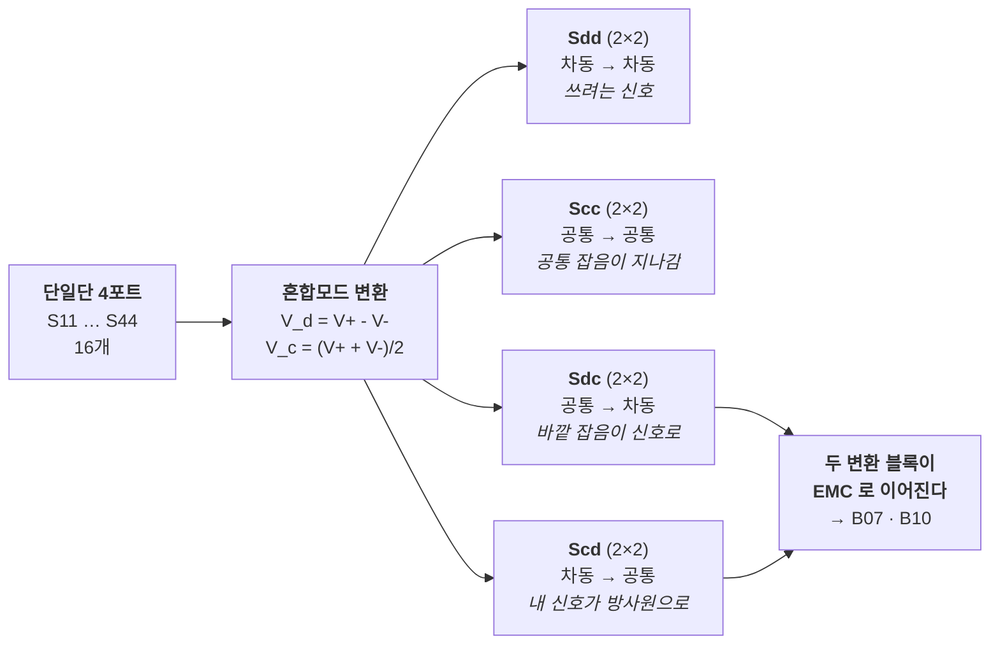
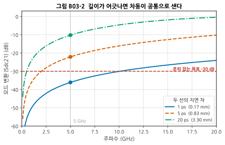
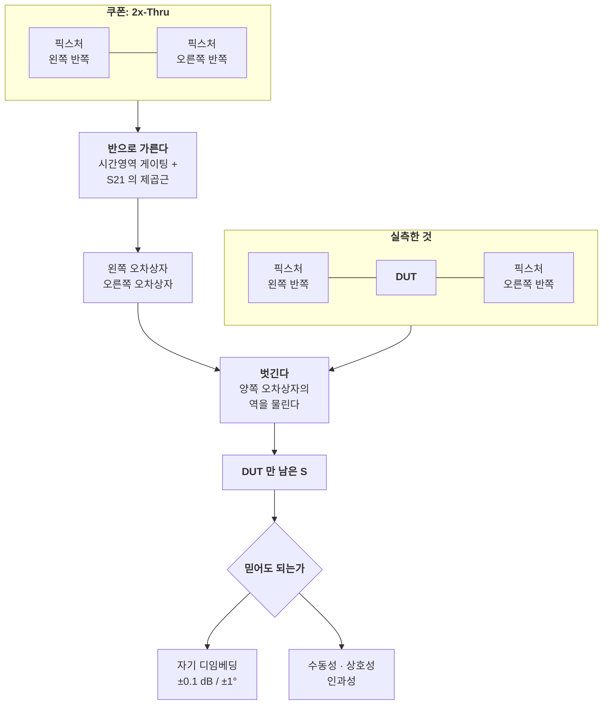
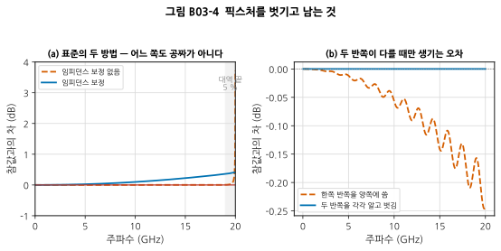
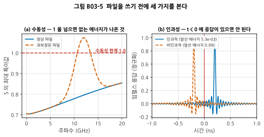

# B03 — 다포트·차동 S-파라미터와 픽스처 제거

**문서 번호**: RF-CUR-B03 · **버전**: v1.0 · **분량**: 이론 6 h + 실습 8 h

> 기본 과정의 S-파라미터는 2포트였습니다. 벤치에서 만나는 것은 4포트와 8포트이고, 신호는 단일단이 아니라 차동이며, DUT 앞에는 언제나 픽스처가 붙어 있습니다. **이 모듈은 "재긴 쟀는데 이게 DUT 값이 맞는가"에 답합니다.**

| | |
|---|---|
| **선수 모듈** | [M03](../01_모듈/M03_S파라미터와스미스차트.md)(S-파라미터), [M14](../01_모듈/M14_정밀측정1_교정과불확도.md)(교정·디임베딩), [B01](./B01_벤치방법론.md)(반복성), [B02](./B02_시간영역.md)(시간영역) |
| **이 모듈이 소유하는 개념** | 다포트 측정과 포트 번호 규약, **혼합모드 S-파라미터**(Sdd·Scc·Sdc·Scd), **길이 어긋남과 모드 변환**, 2x-Thru 픽스처 제거와 **IEEE Std 370**, 임피던스 보정 유무에 따른 두 방법, **자기 디임베딩 검증**, S-파라미터 파일 품질(수동성·상호성·인과성), 재체결 반복성 |
| **이 모듈을 쓰는 후속 모듈** | **B04**(대신호 측정의 기준면), **B05**(잡음 파라미터도 기준면이 필요), **B10**(결합 경로 추적), 심화 캡스톤 P2 |
| **학습 목표** | ① 4포트 데이터를 혼합모드로 옮기고 무엇이 어디에 있는지 안다 ② 모드 변환 값에서 길이 어긋남을 역산한다 ③ 픽스처를 벗긴 결과를 **믿어도 되는지 검증한다** |

---

## B03.0 이 모듈의 범위

기본 과정이 여기까지 왔습니다.

| 이미 배운 것 | 어디서 |
|---|---|
| S-파라미터의 정의, 2포트 | [M03 §3](../01_모듈/M03_S파라미터와스미스차트.md) |
| Touchstone 파일 | [M03 §6](../01_모듈/M03_S파라미터와스미스차트.md) |
| 12항 오차 모델과 SOLT·TRL | [M14 §2](../01_모듈/M14_정밀측정1_교정과불확도.md) · [M14 §3](../01_모듈/M14_정밀측정1_교정과불확도.md) |
| 픽스처와 디임베딩의 기초 | [M14 §8](../01_모듈/M14_정밀측정1_교정과불확도.md) |
| 시간 영역 변환으로 불연속 찾기 | [M14 §9](../01_모듈/M14_정밀측정1_교정과불확도.md) |

**이 모듈은 그 위에 세 층을 얹습니다** — 포트가 늘어났을 때, 신호가 차동일 때, 그리고 픽스처 제거를 **표준화된 방법으로 하고 그 결과를 검증할 때**.

> ⚠️ **다른 모듈과의 역할 분리**
>
> | 개념 | B03 (여기) | 다른 모듈 |
> |---|---|---|
> | 디임베딩 | **표준화된 방법과 그 검증** | [M14 §8](../01_모듈/M14_정밀측정1_교정과불확도.md)이 원리와 포트 익스텐션을 소유 |
> | 시간 영역 | 픽스처를 가르는 도구로만 | [M14 §9](../01_모듈/M14_정밀측정1_교정과불확도.md)(TDR), [B02](./B02_시간영역.md)(스코프) |
> | 불확도 | 언급만 | [M14 §10](../01_모듈/M14_정밀측정1_교정과불확도.md) |
> | 반복성 | 커넥터 재체결 산포 | [B01 §4](./B01_벤치방법론.md)가 세 층을 소유, **B11**이 여러 사람·장비 |
> | 차동 보드 설계 | **다루지 않습니다** | [M17](../01_모듈/M17_보드설계와인증.md)이 스택업·라우팅을 소유 |
> | 온웨이퍼 디임베딩 | **다루지 않습니다** | 설계서 §2.2 참조 — 이 과정은 보드 픽스처만 |

---

## B03.1 포트가 넷이면 무엇이 달라지는가

2포트는 S-파라미터가 4개입니다. 4포트는 **16개**입니다. 8포트는 64개입니다.

숫자가 늘어난 것보다 나쁜 문제가 하나 있습니다.

> ⚠️ **포트 번호 규약이 장비·회사·문서마다 다릅니다.**
>
> | 규약 | 짝 1 | 짝 2 | 흔한 곳 |
> |---|---|---|---|
> | **마주보기** | 1 ↔ 2 | 3 ↔ 4 | 커넥터가 마주 붙은 픽스처, 많은 VNA 기본값 |
> | **나란히** | 1 ↔ 3 | 2 ↔ 4 | 신호 흐름대로 번호를 매긴 보드 |
>
> 같은 물건을 재고도 **어느 규약인지 모르면 S31 과 S21 을 바꿔 읽습니다.** 그러면 삽입손실 자리에 근단 누화가 들어옵니다.

**Touchstone 파일에는 규약이 적혀 있지 않습니다.** 그래서 파일을 받으면 가장 먼저 할 일은 규약을 확인하는 것입니다.

| 확인 방법 | 어떻게 |
|---|---|
| 지연으로 판별 | 삽입손실 경로는 **군지연이 길고**, 누화 경로는 짧습니다 |
| 크기로 판별 | 삽입손실은 0 dB 근처, 누화는 −20 dB 아래 |
| 문서로 확인 | 픽스처 도면과 포트 표시. **이게 정답입니다** |

---

## B03.2 차동 신호를 S-파라미터로 적는 법

차동 쌍은 두 선이지만 **신호는 두 개가 아니라 두 모드**입니다.

| 모드 | 무엇 | 두 선의 전압 |
|---|---|---|
| 차동(differential) | 신호로 쓰는 것 | $V_+ - V_-$ |
| 공통(common) | 쓰지 않는데 생기는 것 | $(V_+ + V_-)/2$ |

단일단 4포트를 이 두 모드의 좌표로 옮기면 16개가 **네 덩어리**로 정리됩니다.

*그림 B03-1. 혼합모드로 옮기면 16개가 네 덩어리가 됩니다. **오른쪽 아래가 이 그림의 요점입니다** — 대각 블록(Sdd, Scc)은 신호가 지나가는 이야기지만, **비대각 블록(Sdc, Scd)은 EMC 이야기**입니다. Scd 가 크면 내 차동 신호가 공통 모드로 바뀌어 케이블을 타고 방사하고, Sdc 가 크면 바깥 잡음이 내 신호로 들어옵니다.*

변환은 직교 변환 하나로 끝납니다. 짝 1을 포트 (1+, 1−), 짝 2를 (2+, 2−)라 하면

$$M = \frac{1}{\sqrt{2}}\begin{bmatrix} 1 & -1 & 0 & 0 \\ 0 & 0 & 1 & -1 \\ 1 & 1 & 0 & 0 \\ 0 & 0 & 1 & 1 \end{bmatrix}, \qquad S_{mm} = M\,S_{se}\,M^{-1}$$

> 💡 **직접 구현해 보는 것이 좋습니다.** 이 커리큘럼의 생성기는 위 식을 손으로 구현하고 `scikit-rf` 의 `se2gmm()` 과 대조합니다 — 최대 차 2×10⁻¹⁶ 로 일치합니다(L-B03-a). 자기 손으로 한 번 만들어 보면 포트 순서 실수를 스스로 잡을 수 있습니다.

---

## B03.3 모드 변환이 말해 주는 것 — 길이가 어긋났다

**Scd21 이 0 이 아니면 차동 쌍이 대칭이 아니라는 뜻입니다.** 그리고 가장 흔한 원인은 두 선의 길이 차이입니다.

결합이 없는 두 이상적 선로에서, 지연 차 Δτ 만 있으면

$$S_{dc21} = \tfrac{1}{2}\left(e^{-j\omega\tau_a} - e^{-j\omega\tau_b}\right) \quad\Longrightarrow\quad |S_{dc21}| = \left|\sin(\pi f \Delta\tau)\right|$$

**평균 지연은 사라지고 어긋난 양만 남습니다.** 그래서 모드 변환을 재면 길이 차를 바로 역산할 수 있습니다.

*그림 B03-2. **읽는 법**: 가로축은 주파수, 세로축은 모드 변환 크기입니다. 세 곡선은 두 선의 지연 차이고, 괄호 안은 FR-4 마이크로스트립(유효 유전율 3.3)에서의 길이로 환산한 값입니다. 점선이 5 GHz 이고 동그라미가 그때의 값입니다. **저주파에서는 기울기가 20 dB/decade** — 주파수를 10배 올리면 모드 변환이 10배 커집니다.*

| 지연 차 | 길이로 | 5 GHz 에서 모드 변환 |
|---|---|---|
| 1 ps | 0.17 mm | −36.1 dB |
| 5 ps | **0.83 mm** | **−22.1 dB** |
| 20 ps | 3.30 mm | −10.2 dB |

> 📌 **0.8 mm 어긋나면 5 GHz 에서 −22 dB 가 공통 모드로 샙니다.** 서펜타인(사행) 배선으로 길이를 맞추는 이유가 이것입니다. 그리고 **맞춰야 하는 정밀도가 얼마인지**는 목표 모드 변환에서 거꾸로 나옵니다 — −30 dB 를 원하면 5 GHz 에서 Δτ < 2.01 ps, 즉 0.33 mm 입니다.

FR-4 에서 **1 ps ≈ 0.165 mm** 입니다. 이 환산만 외워 두면 벤치에서 암산이 됩니다.

---

## B03.4 픽스처를 벗긴다 — 2x-Thru 의 원리

DUT 는 커넥터에 직접 달려 있지 않습니다. 사이에 **픽스처**(커넥터 런치 + 선로)가 있고, 측정값은 그것까지 포함합니다.

*그림 B03-3. 2x-Thru 픽스처 제거의 흐름. **쿠폰은 DUT 없이 픽스처 두 반쪽을 그대로 이어 붙인 것**이고, 그것을 반으로 갈라 오차상자를 만듭니다. 아래쪽 판정 상자가 §7·§8입니다 — 벗긴 것으로 끝이 아니라 **검증까지가 절차**입니다.*

**쿠폰은 DUT 보드와 같은 공정, 같은 스택업, 같은 커넥터로 만들어야 합니다.** 다른 판에서 만든 쿠폰은 다른 픽스처를 재는 것입니다.

---

## B03.5 IEEE Std 370 — 무엇을 표준화했는가

이 영역은 오래 제각각이었습니다. 회사마다 픽스처를 다르게 만들고 다르게 벗겼으므로, 같은 물건의 S-파라미터가 서로 달랐습니다. IEEE Std 370-2020 이 그것을 정리했습니다.

| 표준이 정한 것 | 내용 |
|---|---|
| **적용 범위** | 인쇄회로기판과 그 연결 구조, **50 GHz 까지** |
| **픽스처 설계 요건** | 2x-Thru 구조의 가운데에 **충분히 긴 선로**를 둘 것 등 |
| **디임베딩 방법 두 가지** | 전통적 2x-Thru, 그리고 **임피던스 보정판** |
| **데이터 품질 지표 세 가지** | **수동성 · 상호성 · 인과성** (§8) |
| **일관성 시험** | **자기 디임베딩**의 잔여 삽입손실 ±0.1 dB, 잔여 위상 ±1° 이내 (§7) |

> 💡 **`scikit-rf` 에 표준의 구현이 들어 있습니다.** `IEEEP370_SE_NZC_2xThru`(임피던스 보정 없음), `IEEEP370_SE_ZC_2xThru`(보정판), 그리고 혼합모드판과 품질 지표(`IEEEP370_FD_QM`, `IEEEP370_TD_QM`)까지 있습니다. 이 모듈의 그림과 실습은 그 구현을 그대로 씁니다.

---

## B03.6 두 방법 — 그리고 각각이 무너지는 곳

표준이 방법을 두 개 둔 이유가 있습니다. **어느 쪽도 공짜가 아닙니다.**

60 mm 선로에 0.10 pF 런치 불연속이 있는 픽스처를, 참값이 정확히 −6 dB 인 감쇠기와 함께 만들어 두 방법으로 벗겨 봤습니다.

*그림 B03-4. **읽는 법**: (a) 세로축은 참값과의 차입니다. 0 이면 완벽합니다. 회색 띠가 대역의 위 5 %입니다. **주황 파선(임피던스 보정 없음)은 대역 안에서 0 에 붙어 있다가 맨 끝에서 튀어 오르고, 파란 실선(보정판)은 끝은 멀쩡한데 전 구간에 걸쳐 조금씩 어긋납니다.** (b)는 알고리즘을 빼고 **두 반쪽이 서로 다를 때만 생기는 오차**를 따로 본 것입니다.*

| | 벗기기 전 | 임피던스 보정 없음 | 임피던스 보정 |
|---|---|---|---|
| 전 대역 최대 오차 | 7.28 dB | **3.72 dB** | 0.40 dB |
| **위 5 % 를 뺀 최대 오차** | — | **0.005 dB** | 0.36 dB |

**두 줄이 정반대의 이야기를 합니다.**

- **임피던스 보정이 없는 방법**은 대역 안에서 사실상 정확합니다(0.005 dB). 그런데 **맨 위 5 % 에서 3.72 dB 로 터집니다** — 시간영역 변환을 쓰기 때문에 대역 가장자리가 약합니다.
- **임피던스 보정판**은 가장자리가 안쪽과 비슷합니다. 대신 이 픽스처에서는 전 구간에 0.36 dB 정도의 치우침이 남았습니다.

> ⚠️ **이 기법이 거짓말을 하는 조건** (심화 규칙 3)
>
> | 조건 | 무슨 일이 일어나는가 | 대응 |
> |---|---|---|
> | **대역 끝** | 시간영역 변환이 가장자리에서 흔들린다 | **쓸 대역보다 넓게 재고 위아래를 버린다.** 위 예에서는 5 %면 충분했다 |
> | **두 반쪽이 다르다** | 하나를 뽑아 양쪽에 쓰므로 차이가 결과에 남는다 | §7의 자기 디임베딩으로 확인. 그림 (b)의 경우 0.246 dB |
> | **불연속이 크다** | 보정 없는 방법이 흔들린다 | 임피던스 보정판을 쓰거나 런치를 고친다 |
> | **쿠폰이 다른 판이다** | 벗기는 것이 실제 픽스처가 아니다 | 같은 공정·스택업·커넥터로 만든다 |
>
> **어느 방법이 낫다고 말할 수 없습니다.** 무너지는 곳이 다를 뿐이므로, **둘 다 돌려 보고 결과가 갈리는 구간을 확인하는 것**이 실무입니다.

### 두 반쪽이 다르면 — 그림 (b)

왼쪽 25 mm·0.25 pF, 오른쪽 27 mm·0.35 pF 로 **일부러 어긋나게** 만든 픽스처입니다. 두 반쪽을 각각 알고 벗기면 오차가 10⁻¹⁴ dB(사실상 0)인데, 하나로 뭉쳐 양쪽에 쓰면

| | 값 |
|---|---|
| |S21| 오차 | **0.246 dB** |
| 없던 |S11| | **0.213 (−13.4 dB)** |

**참 DUT 는 완전 정합인데 −13.4 dB 짜리 반사가 생겼습니다.** 디임베딩이 만들어 낸 가짜입니다. 벗긴 뒤의 S11 이 이상하면 DUT 를 의심하기 전에 이것을 의심해야 합니다.

---

## B03.7 자기 디임베딩 — 했다고 믿지 말고 확인한다

표준이 권하는 일관성 시험입니다. **원리가 단순합니다.**

> 2x-Thru 쿠폰 자체를 "측정값"이라 치고 자기가 만든 오차상자로 벗겨 봅니다. 완벽하다면 **아무것도 남지 않아야 합니다**(삽입손실 0 dB, 위상 0°).

| 판정 기준 | 값 |
|---|---|
| 잔여 삽입손실 | **±0.1 dB 이내** |
| 잔여 위상 | **±1° 이내** |

이 시험이 잡아내는 것과 못 잡는 것이 있습니다.

| 잡아낸다 | 못 잡는다 |
|---|---|
| 알고리즘이 대역 끝에서 흔들리는 것 | 쿠폰이 실제 픽스처와 다른 것 |
| 데이터가 지저분해 분할이 실패한 것 | 두 반쪽이 서로 다른 것 (쿠폰 안에서는 상쇄됨) |
| 주파수 격자가 잘못된 것 | — |

> 📌 **자기 디임베딩을 통과해도 두 반쪽 비대칭은 남습니다.** 쿠폰 안에서는 왼쪽·오른쪽이 함께 들어 있어 서로 상쇄되기 때문입니다. 비대칭을 확인하려면 **쿠폰의 S11 과 S22 를 비교**하십시오 — 두 반쪽이 같으면 둘이 같아야 합니다.

---

## B03.8 파일을 쓰기 전에 보는 세 가지

받은 S-파라미터 파일이 물리적으로 가능한 물건인지부터 봅니다. **디임베딩을 거친 파일은 특히 그렇습니다.**

*그림 B03-5. **읽는 법**: (a) 세로축은 각 주파수에서 S 행렬의 최대 특이값입니다. **1 을 넘으면 넣은 것보다 많이 나온 것**이므로 수동 소자로는 불가능합니다. 빨간 파선이 그 한계입니다. (b) 임펄스 응답입니다. **t = 0 보다 왼쪽에 응답이 있으면 원인보다 결과가 먼저 온 것**입니다.*

| 지표 | 무엇을 보는가 | 어떻게 |
|---|---|---|
| **수동성** | 없는 에너지가 나오지 않는가 | S 의 **최대 특이값 ≤ 1** |
| **상호성** | 방향에 따라 다르지 않은가 | **S21 = S12** (수동 소자라면) |
| **인과성** | 결과가 원인보다 먼저 오지 않는가 | 임펄스 응답이 **t < 0 에서 0** |

위 그림에서 정상 파일의 최대 특이값은 0.855, 과보정된 파일은 **1.074** 로 위반입니다.

> ⚠️ **인과성 판정은 절대값으로 하면 안 됩니다.** 대역이 잘려 있으면 인과적인 물건도 t < 0 에 약간의 에너지가 남습니다(깁스 현상). 위 그림에서 인과적인 쪽이 5.3×10⁻³, 비인과적인 쪽이 0.99 로 **188배** 차이입니다. **판정은 비로 하고, 문턱은 자기 데이터에서 정하십시오.**

### 위반이 나오면 무엇을 의심하는가

| 증상 | 흔한 원인 |
|---|---|
| 특이값 > 1 이 좁은 대역에서 | **디임베딩 과보정** — 픽스처 손실을 실제보다 크게 잡았다 |
| 특이값 > 1 이 전 대역에서 | 교정 오류, 정규화 실수 |
| S21 ≠ S12 | 잡음, 평균화 부족. 능동 소자라면 정상 |
| t < 0 응답이 큼 | 위상이 잘못 풀렸거나(unwrap), 지연을 과하게 뺐다 |

---

## B03.9 재체결 반복성 — 다포트에서 더 아픈 이유

[B01 §4](./B01_벤치방법론.md)의 세 층 중 **재연결**이 다포트에서는 더 커집니다. 이유는 단순합니다.

| 포트 수 | 매번 다시 조이는 커넥터 |
|---|---|
| 2포트 | 2개 |
| 4포트 | **4개** |
| 8포트 (차동 4쌍) | **8개** |

각 커넥터의 산포가 독립이라면 전체 산포는 √N 으로 늘어납니다. **4포트는 2포트의 1.41배, 8포트는 2배입니다.**

그리고 다포트 측정은 **한 번에 다 재므로** 중간에 다시 조일 수 없습니다. 하나라도 잘못 조이면 그날 데이터 전체가 흔들립니다.

| 대책 | 내용 |
|---|---|
| 토크 렌치를 쓴다 | 규격 토크는 [M04 §3](../01_모듈/M04_RF실험실입문.md) |
| 케이블을 고정한다 | 다포트는 케이블이 많아 서로 밀어냅니다 |
| **쿠폰을 매번 함께 잰다** | 그날의 상태를 기록하는 기준점이 됩니다 |
| 재체결 산포를 한 번 실측한다 | L-B03-e. 그 값이 판정 기준의 근거가 됩니다 |

---

## B03.10 한 장 요약

| 알아야 할 것 | 한 줄 | 절 |
|---|---|---|
| 포트 번호 | 규약이 문서마다 다르다. **군지연으로 판별한다** | §1 |
| 혼합모드 | 16개가 네 덩어리로. **비대각이 EMC 이야기** | §2 |
| 모드 변환 | \|Sdc21\| = \|sin(π f Δτ)\|. 평균 지연은 안 들어간다 | §3 |
| 길이 환산 | FR-4 에서 **1 ps ≈ 0.165 mm** | §3 |
| 2x-Thru | 쿠폰을 반으로 갈라 양쪽에 쓴다 | §4 |
| IEEE 370 | 픽스처 요건 + 방법 두 가지 + 품질 지표 세 가지 | §5 |
| 대역 끝 | **쓸 대역보다 넓게 재고 위아래를 버린다** | §6 |
| 비대칭 | 두 반쪽이 다르면 없던 반사가 생긴다 | §6 |
| 자기 디임베딩 | ±0.1 dB / ±1°. **비대칭은 못 잡는다** | §7 |
| 파일 품질 | 수동성·상호성·인과성. 인과성은 비로 판정 | §8 |
| 재체결 | 포트 수의 √N 으로 산포가 는다 | §9 |

---

## B03.L 실습

| 목적 | 고를 실습 | 시간 |
|---|---|---|
| **최소 경로** (장비 없음) | L-B03-a · L-B03-b · L-B03-c | 5 h |
| 저가 장비가 있다 | 위 + L-B03-e | 7 h |
| 전부 | L-B03-a ~ L-B03-e | 10 h |

### L-B03-a (T0) — 혼합모드 변환을 직접 만들고 대조한다

**준비물**: Python 3, numpy, scikit-rf

**절차**

1. §2의 행렬 M 을 그대로 써서 `se2mm(s4)` 를 구현합니다.
2. 결합 없는 두 이상적 선로로 지연 차 5 ps 인 차동 쌍을 만듭니다.
3. 자기 구현과 `scikit-rf` 의 `se2gmm(p=2)` 를 대조합니다.
4. **포트 순서를 일부러 틀리게** 넣어 보고 결과가 어떻게 달라지는지 봅니다.

**예상 결과**: 3번은 10⁻¹⁶ 수준으로 일치합니다. 4번에서는 Sdd 자리에 Scc 가 들어오거나 모드 변환이 엉뚱하게 커집니다.

**판정**: 두 구현의 최대 차가 10⁻¹² 이하이면 맞습니다. `scripts/gen_fig_b03.py` 가 같은 대조를 세 가지 지연 차에 대해 자동으로 합니다.

### L-B03-b (T0) — 모드 변환에서 길이 차를 역산한다

**준비물**: Python 3, numpy

**절차**

1. `|Sdc21| = |sin(π f Δτ)|` 를 구현하고 그림 B03-2 를 재현합니다.
2. 목표를 "5 GHz 에서 −30 dB 이하"로 두고 허용 Δτ 와 길이 차를 구합니다.
3. 목표 주파수를 10 GHz, 20 GHz 로 올리며 허용 길이 차가 어떻게 변하는지 봅니다.
4. 반대로, 측정된 −25 dB 에서 길이 차를 역산합니다.

**예상 결과**: 5 GHz·−30 dB → Δτ < 2.0 ps → 0.33 mm. 주파수를 2배 올리면 허용 길이 차가 절반이 됩니다.

**판정**: 4번의 역산값을 1번 곡선에 넣어 −25 dB 가 나오면 맞습니다.

### L-B03-c (T0) — IEEE 370 디임베딩을 돌려 보고 대역 끝을 확인한다

**준비물**: Python 3, scikit-rf

**절차**

1. 손실 선로 + 병렬 커패시터로 픽스처 반쪽을 만들고, 참값을 아는 DUT(6 dB 감쇠기)를 사이에 넣습니다.
2. 쿠폰(DUT 없이 두 반쪽)을 만들고 `IEEEP370_SE_NZC_2xThru` 로 벗깁니다.
3. 참값과의 차를 주파수별로 그립니다. **위 5 % 를 뺀 최대 오차**와 전 대역 최대 오차를 각각 구합니다.
4. `IEEEP370_SE_ZC_2xThru` 로도 벗겨 3번을 반복합니다.
5. 커패시터 값을 0.05 → 0.25 pF 로 키우며 두 방법의 차이가 어떻게 변하는지 봅니다.

**예상 결과**: 보정 없는 쪽은 대역 안에서 0.005 dB 인데 맨 끝에서 3.7 dB 로 터집니다. 보정판은 끝이 멀쩡한 대신 전 구간에 0.36 dB 가 남습니다. 5번에서 불연속이 커질수록 보정 없는 쪽이 더 흔들립니다.

> ⚠️ **주파수 격자가 DC 의 정수배여야 합니다.** `skrf.Frequency.from_f(np.arange(1, 2001) * 10e6, unit="hz")` 처럼 만드십시오. 아니면 내부에서 보간이 일어나 결과가 달라집니다 — 집필 중에 실제로 이것 때문에 대칭 픽스처에서도 1 dB 오차가 나왔습니다.

**판정**: "우리 대역에서 위아래로 몇 %를 버려야 하는가"를 답으로 냅니다.

### L-B03-d (T0) — 파일 품질 검사기를 만든다

**준비물**: Python 3, numpy, scikit-rf

**절차**

1. 수동성(최대 특이값), 상호성(|S21−S12|), 인과성(t<0 에너지 비율)을 계산하는 함수를 만듭니다.
2. 정상 파일과 일부러 부풀린 파일에 각각 적용합니다.
3. `scikit-rf` 의 `IEEEP370_FD_QM` 과 대조합니다.
4. 인과성 문턱을 절대값으로 잡으면 왜 안 되는지 대역폭을 바꿔 가며 확인합니다.

**예상 결과**: 4번에서 대역을 좁힐수록 인과적인 파일의 t<0 에너지가 커집니다.

**판정**: 두 파일을 옳게 갈라내고, 문턱을 비로 잡아야 하는 이유를 설명할 수 있으면 됩니다.

### L-B03-e (T1/T2) — 재체결 산포를 다포트에서 잰다

**준비물**: VNA(가능하면 4포트), 케이블, 픽스처 또는 쿠폰, 토크 렌치

**절차**

1. 교정하고 30분 워밍업합니다([B01 §5](./B01_벤치방법론.md)).
2. 쿠폰을 물리고 **버튼만** 20회 → σ_반복
3. 모든 포트를 풀고 다시 조이기를 20회 → σ_재연결
4. 2포트만 쓸 때와 4포트를 다 쓸 때의 σ_재연결 을 비교합니다.
5. 쿠폰의 S11 과 S22 를 비교해 **두 반쪽의 비대칭**을 확인합니다.

**예상 결과**: 4포트의 σ 가 2포트의 √2 배 근처로 나옵니다. 5번에서 S11 과 S22 가 다르면 픽스처가 비대칭입니다.

**판정**: [B01 §4](./B01_벤치방법론.md)의 식에 σ 를 넣어 "우리 벤치에서 삽입손실 0.05 dB 차이를 주장하려면 몇 번 재야 하는가"를 답으로 냅니다.

---

## B03.Q 확인 문제

<b>Q1.</b> 4포트 파일을 받았는데 S21 이 −0.5 dB, S31 이 −28 dB 입니다. 포트 규약은 무엇입니까?

**마주보기 규약(1↔2, 3↔4)** 입니다.

−0.5 dB 는 신호가 지나간 경로이고, −28 dB 는 옆 선으로 샌 것(누화)입니다. 삽입손실 경로가 1→2 이므로 짝은 (1,2)와 (3,4)입니다.

**확인**: 군지연을 봅니다. S21 의 군지연이 길고 S31 은 짧아야 합니다. 크기만으로 판단하면 아주 짧은 선로에서 틀릴 수 있습니다.

<b>Q2.</b> Scd21 이 −18 dB 입니다. 무슨 일이 일어나고 있습니까?

**내 차동 신호의 일부가 공통 모드로 바뀌고 있습니다.** 공통 모드는 접지와 케이블을 타고 흐르며 **방사원이 됩니다.**

원인은 대칭이 깨진 것이고, 가장 흔한 것은 길이 차입니다. 5 GHz 라면 §3의 식을 뒤집어 역산합니다.

$$\Delta\tau = \frac{\arcsin\left(10^{-18/20}\right)}{\pi f} = \frac{\arcsin(0.1259)}{\pi \times 5\,\text{GHz}} = 8.04\,\text{ps}$$

FR-4 에서 1 ps ≈ 0.165 mm 이므로 **약 1.33 mm** 어긋난 것입니다.

다른 원인도 있습니다 — 비아 배치 비대칭, 한쪽만 지나가는 부품, 기준면 불균형. 길이를 맞췄는데도 남으면 그쪽을 봅니다.

| 목표 | 5 GHz 에서 허용되는 길이 차 |
|---|---|
| −30 dB | 2.01 ps = 0.33 mm |
| −25 dB | 3.58 ps = 0.59 mm |
| −20 dB | 6.38 ps = 1.05 mm |

**이 값은 B07(EMC 디버그)로 이어집니다.** 방사가 규격을 넘을 때 Scd 를 확인하는 것이 빠른 길일 때가 많습니다.

<b>Q3.</b> 자기 디임베딩이 ±0.05 dB 로 통과했습니다. 벗긴 DUT 값을 믿어도 됩니까?

**아직 아닙니다.** 자기 디임베딩은 **알고리즘이 자기 데이터에 일관되게 동작하는지**만 봅니다.

남아 있는 것 셋:

1. **두 반쪽 비대칭** — 쿠폰 안에서 상쇄되므로 이 시험으로는 안 보입니다. 쿠폰의 S11 과 S22 를 비교하십시오.
2. **쿠폰이 실제 픽스처와 같은가** — 다른 판에서 만들었다면 다른 것을 벗긴 것입니다.
3. **대역 끝** — 통과 여부와 무관하게 가장자리는 약합니다.

그리고 §8의 세 지표(수동성·상호성·인과성)도 확인해야 합니다.

<b>Q4.</b> 디임베딩한 결과의 최대 특이값이 12 GHz 근처에서 1.08 입니다. 어떻게 합니까?

**좁은 대역에서만 1 을 넘는 것은 과보정의 전형입니다.** 픽스처의 손실을 실제보다 크게 잡아 그만큼 되돌려 준 것입니다.

확인 순서:

1. 12 GHz 근처에 픽스처의 공진이 있는지 봅니다(쿠폰의 S11 을 시간영역으로 변환).
2. 다른 디임베딩 방법(임피던스 보정 유무)으로 바꿔 봅니다. 한쪽만 위반이면 방법의 문제입니다.
3. 자기 디임베딩을 그 주파수에서 확인합니다.

**수동성 위반을 강제로 눌러 고치는 도구가 있지만**, 원인을 모른 채 누르면 틀린 값을 매끄럽게 만들 뿐입니다. 원인부터 찾으십시오.

<b>Q5.</b> 20 GHz 까지 쓸 물건입니다. 몇 GHz 까지 재야 합니까?

**최소 21 GHz, 가능하면 22~25 GHz 입니다.**

§6에서 봤듯이 시간영역 변환을 쓰는 디임베딩은 대역 가장자리가 약합니다. 위 예에서는 대역의 위 5 % 를 버리면 오차가 3.72 dB 에서 0.005 dB 로 떨어졌습니다.

20 GHz 의 5 % 는 1 GHz 이므로 **21 GHz 까지** 재면 20 GHz 가 안전 구간에 들어옵니다. 여유를 더 두면 더 좋습니다.

**얼마를 버려야 하는지는 자기 셋업에서 확인하십시오** — L-B03-c 가 그 실습입니다.

<b>Q6.</b> 두 사람이 같은 보드를 재고 같은 방법으로 벗겼는데 삽입손실이 0.3 dB 다릅니다. 어디를 봅니까?

순서대로 봅니다.

1. **쿠폰이 같은 것인가** — 다른 쿠폰을 썼다면 다른 픽스처를 벗긴 것입니다.
2. **주파수 격자가 같은가** — 시작 주파수와 점 개수가 다르면 시간영역 변환 결과가 달라집니다.
3. **디임베딩 방법이 같은가** — 보정 유무만으로 §6에서 0.36 dB 가 갈렸습니다.
4. **재체결 산포** — [B01 §4](./B01_벤치방법론.md)의 식으로 0.3 dB 가 산포 범위인지 확인합니다. 4포트면 산포가 √2 배입니다(§9).

3번이 답인 경우가 의외로 많습니다. **보고서에 방법 이름과 대역, 격자를 반드시 적어야 하는 이유**입니다.

---

## B03.A 이 모듈의 축약어

| 약어 | 영문 원어 | 한글 |
|---|---|---|
| DUT | Device Under Test | 피시험 소자 (→ M04) |
| VNA | Vector Network Analyzer | 벡터 회로망 분석기 (→ M04) |
| AFR | Automatic Fixture Removal | 자동 픽스처 제거 |
| NZC | Non-impedance-Corrected | 임피던스 보정 없음 |
| ZC | Impedance-Corrected | 임피던스 보정 |
| Sdd / Scc | Differential / Common mode S-parameters | 차동·공통 모드 S-파라미터 |
| Sdc / Scd | Mode-conversion S-parameters | 모드 변환 S-파라미터 |
| EMC | Electromagnetic Compatibility | 전자파 적합성 (→ M17) |
| TDR | Time Domain Reflectometry | 시간 영역 반사 측정 (→ M14) |
| IL | Insertion Loss | 삽입손실 (→ M02) |
| PCB | Printed Circuit Board | 인쇄회로기판 (→ M17) |
| SMA | SubMiniature version A | (커넥터 이름) (→ M04) |

---

## B03.S 출처

> ⚠️ **원문 확인 권고**: 아래 주소는 검색 결과로 교차확인한 것이며 원문을 직접 열어 보지는 못했습니다. 중요한 수치는 원문에서 확인하십시오.

| 주장 | 등급 | 출처 |
|---|---|---|
| IEEE Std 370-2020 은 인쇄회로기판과 연결 구조를 50 GHz 까지 다루며, 2x-Thru 디임베딩과 픽스처 설계 요건(가운데에 긴 선로를 둘 것)을 표준화했다 | A | [IEEE Std 370-2020](https://www.elecenghub.com/NewSamples/IEEE/149366437/IEEE-370-2020-2.pdf) · [MathWorks — IEEE P370 활용](https://www.mathworks.com/help/rf/ug/applications-of-ieee-370.html) |
| 표준은 디임베딩 방법을 두 가지 둔다 — 전통적 2x-Thru 와 임피던스 보정판 | B | [Signal Integrity Journal — IEEE P370 표준 소개](https://www.signalintegrityjournal.com/articles/1169-ieee-p370-a-ffixture-ddesign-and-ddata-qquality-mmetric-sstandard-for-iinterconnects-up-to-50-ghz) · [MathWorks — IEEE P370 활용](https://www.mathworks.com/help/rf/ug/applications-of-ieee-370.html) |
| 데이터 품질 지표는 **수동성·상호성·인과성** 세 가지이며, 자기 디임베딩 일관성 시험의 권고 기준은 잔여 삽입손실 ±0.1 dB, 잔여 위상 ±1° | B | [Signal Integrity Journal — P370 실무 적용](https://www.signalintegrityjournal.com/articles/1185-practical-application-of-the-ieee-p370-standard-for-measurement-of-interconnects-up-to-50-ghz) · [MathWorks — ieee370QualityCheckFrequencyDomain](https://www.mathworks.com/help/rf/ref/ieee370qualitycheckfrequencydomain.html) |
| AFR 과 SFD 가 2x-Thru 계열의 대표 구현이며 오차 한계 분석이 존재한다 | B | [IEEE Xplore — 2x-Thru 오차 한계 분석](https://ieeexplore.ieee.org/document/8077927/) · [2× Thru 디임베딩의 난점](https://ojs.wiserpub.com/index.php/JEEE/article/download/6598/3214) |
| 2x-Thru 는 시간영역 게이팅과 S21 의 제곱근으로 분할하며, 이 방법은 "거칠지만 튼튼하다"고 스스로 밝힌다 | B | [scikit-rf — IEEEP370 디임베딩 문서](https://scikit-rf.readthedocs.io/en/latest/examples/networktheory/IEEEP370%20Deembedding.html) · [R&S — 픽스처 특성화와 디임베딩](https://cdn.rohde-schwarz.com.cn/pws/dl_downloads/dl_application/application_notes/1sl367/1SL367_0e_Test_Fixture_Characterization_and_De-embedding.pdf) |

**본문의 숫자는 전부 계산입니다.** `python3 scripts/gen_fig_b03.py` 를 실행하면 인용값이 출력되고 자체 검산 25항목이 함께 돕니다. 교차검증은 세 갈래입니다.

1. **혼합모드 변환을 손으로 구현한 것과 `scikit-rf` 의 `se2gmm()`** 을 세 가지 지연 차에서 대조 — 최대 차 2×10⁻¹⁶
2. **수치 결과와 닫힌 식** |Sdc21| = |sin(π f Δτ)| 를 대조, 그리고 무손실 조건 |Sdd21|² + |Sdc21|² = 1 을 확인
3. **디임베딩은 `scikit-rf` 에 들어 있는 표준 구현을 그대로** 돌려, 대역 안과 대역 끝을 나눠 잰 값

§6의 픽스처와 §8의 파일은 **합성한 모형**입니다. 두 방법의 우열을 일반화하지 마십시오 — 이 모형에서 어떻게 갈렸는지를 보여 줄 뿐이며, 실제 픽스처에서는 자기 데이터로 확인해야 합니다.

---

## 변경 이력

| 버전 | 일자 | 내용 |
|---|---|---|
| v1.0 | 2026-08-22 | 최초 작성. 그림 5종(생성 3 + Mermaid 2), 실습 5종, 확인 문제 6문항. 자체 검산 25항목 통과. 집필 중 두 번 고쳤다 — ① 디임베딩 예제가 처음에는 "임피던스를 무시한 근사"를 써서 비대칭이 아니라 근사 오차를 보여주고 있었다. `scikit-rf` 의 표준 구현으로 바꾸고, 비대칭만 보는 그림은 따로 뒀다. ② 그 결과를 "임피던스 보정판이 9배 낫다"고 적을 뻔했는데, 주파수별로 뜯어 보니 보정 없는 쪽이 대역 안에서는 오히려 정확하고 **대역 끝에서만** 터지는 것이었다 |
