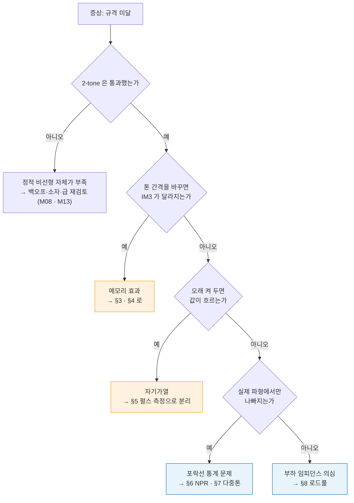
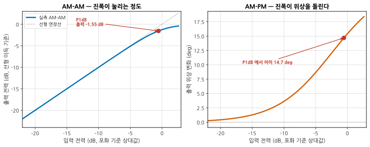
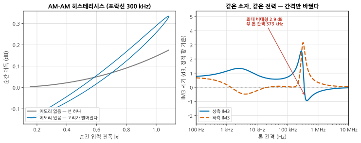
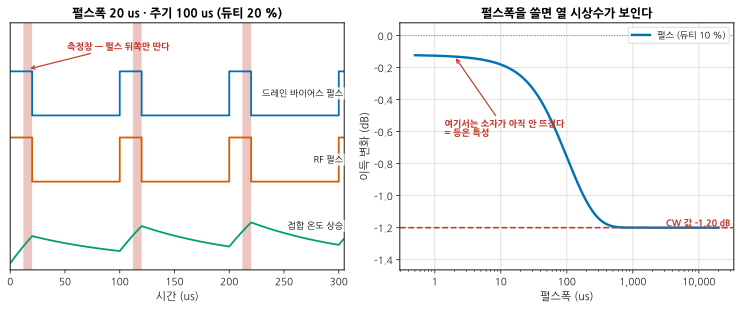
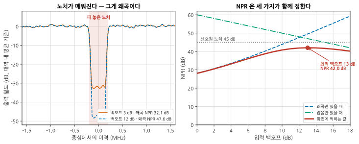
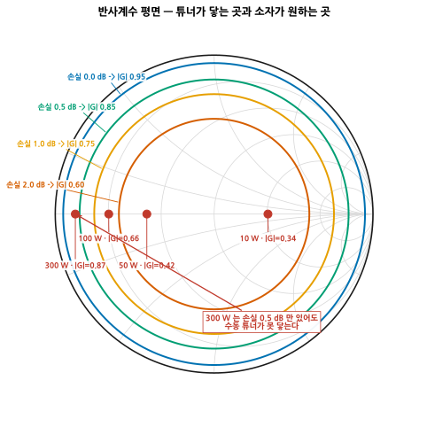
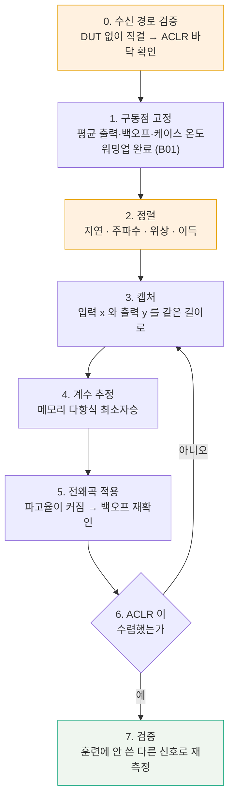
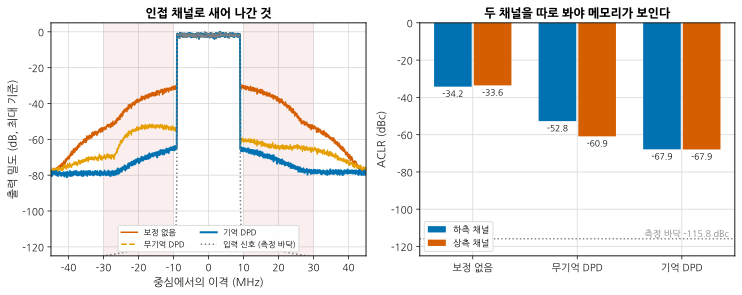

# B04 — 대신호: 변조 파형, 펄스, 메모리 효과

**문서 번호**: RF-CUR-B04 · **버전**: v1.0 · **분량**: 이론 6 h + 실습 10 h

> 기본 과정에서 선형성은 두 개의 톤과 하나의 숫자였습니다. P1dB 와 IP3. 벤치에서 만나는 신호는 톤이 아니라 **끊임없이 오르내리는 포락선**이고, 소자는 그 오르내림을 **기억합니다**. 이 모듈은 "2-tone 규격은 통과했는데 실제 파형을 넣으면 떨어진다"에 답합니다.

| | |
|---|---|
| **선수 모듈** | [M08](../01_모듈/M08_증폭기.md)(압축·IP3·바이어스), [M13](../01_모듈/M13_변조와신호품질.md)(변조·PAPR·ACLR·DPD 개론), [M15](../01_모듈/M15_정밀측정2_잡음선형성위상잡음.md)(2-tone 셋업·로드풀 개론), [B01](./B01_벤치방법론.md)(반복성·워밍업), [B03](./B03_다포트차동과픽스처.md)(기준면) |
| **이 모듈이 소유하는 개념** | **AM-AM / AM-PM 측정**, **메모리 효과**와 그 진단(톤 간격 쓸기, IM3 비대칭), **세 가지 메모리원**(열·바이어스망·정합 대역폭), **펄스 RF 측정**과 자기가열·트랩 분리, **잡음 전력비(NPR)**, **다중톤 시험 신호 설계**(톤 수·위상·파고율), **능동 로드풀 vs 수동 로드풀**, **DPD 루프의 벤치 구현**, 대신호 보고 항목 |
| **이 모듈을 쓰는 후속 모듈** | **B07**(효율과 열), **B09**(전원·바이어스가 RF 로 새는 경로), **B11**(측정 시스템 분석), 심화 캡스톤 P2·P4 |
| **학습 목표** | ① 변조 파형으로 AM-AM/AM-PM 을 재고 그 그림이 언제 거짓말하는지 안다 ② 메모리 효과를 **진단하고 원인을 셋 중 하나로 좁힌다** ③ 펄스·NPR·로드풀·DPD 를 벤치에서 돌리고 결과를 재현 가능하게 적는다 |

---

## B04.0 이 모듈의 범위

기본 과정이 여기까지 왔습니다.

| 이미 배운 것 | 어디서 |
|---|---|
| 압축(P1dB)의 정의, 상호변조와 IP3 | [M08 §4](../01_모듈/M08_증폭기.md) · [M08 §6](../01_모듈/M08_증폭기.md) |
| 바이어스 회로와 열의 기초 | [M08 §9](../01_모듈/M08_증폭기.md) |
| PAPR·CCDF, EVM, ACLR, 백오프 트레이드오프 | [M13 §3](../01_모듈/M13_변조와신호품질.md) · [M13 §4](../01_모듈/M13_변조와신호품질.md) · [M13 §6](../01_모듈/M13_변조와신호품질.md) · [M13 §7](../01_모듈/M13_변조와신호품질.md) |
| CFR 과 DPD 가 무엇이고 무엇을 얻는가 | [M13 §8](../01_모듈/M13_변조와신호품질.md) |
| 2-tone 셋업의 부품마다의 이유, 측정계 한계 확인 | [M15 §6](../01_모듈/M15_정밀측정2_잡음선형성위상잡음.md) · [M15 §7](../01_모듈/M15_정밀측정2_잡음선형성위상잡음.md) |
| 로드풀이 왜 필요한가 | [M15 §11](../01_모듈/M15_정밀측정2_잡음선형성위상잡음.md) |

**이 모듈은 그 위에 한 가지를 얹습니다** — 소자에 **시간**이 있다는 것. 지금 나오는 출력이 지금 들어간 입력만으로 정해지지 않는다는 사실과, 그것을 벤치에서 **보이게 만드는 법**.

> ⚠️ **다른 모듈과의 역할 분리**
>
> | 개념 | B04 (여기) | 다른 모듈 |
> |---|---|---|
> | 압축·IP3 | 대신호 측정의 출발점으로만 인용 | [M08 §4](../01_모듈/M08_증폭기.md) · [M08 §6](../01_모듈/M08_증폭기.md)이 정의를 소유 |
> | PAPR·CCDF | **시험 신호를 설계할 때 얼마로 맞출 것인가** | [M13 §3](../01_모듈/M13_변조와신호품질.md)이 정의와 OFDM 통계를 소유 |
> | CFR | 파고율을 깎을 때의 **대가만 인용** | [M13 §8](../01_모듈/M13_변조와신호품질.md)이 클리핑-EVM-ACLR 표를 소유 |
> | DPD | **벤치에서 루프를 도는 절차와 그때 나오는 숫자** | [M13 §8](../01_모듈/M13_변조와신호품질.md)이 원리와 블록도(그림 M13-7)를 소유 |
> | 2-tone 셋업 배선 | 톤 **간격을 쓰는 법**만 | [M15 §6](../01_모듈/M15_정밀측정2_잡음선형성위상잡음.md)이 셋업을 소유 |
> | 로드풀 | **수동의 한계와 능동의 대가** | [M15 §11](../01_모듈/M15_정밀측정2_잡음선형성위상잡음.md)이 개론을 소유 |
> | 효율·발열 설계 | 자기가열을 **측정에서 떼어 내는 것**까지만 | **B07**(효율과 열 관리)이 소유 |
> | 소자 내부 물리 | **다루지 않습니다** | 설계서 §2.2 참조 — 트랩·전자 이동은 현상으로만 인용 |

---

## B04.1 2-tone 이 못 보여주는 것

2-tone 시험은 두 개의 톤을 같은 세기로 넣고 3차 항이 만든 옆 톤을 봅니다. 좋은 시험입니다. 셋업이 단순하고, 숫자가 하나로 떨어지고, 데이터시트끼리 비교됩니다.

그런데 **실제 신호는 톤이 아닙니다.**

| 2-tone 이 답하는 것 | 2-tone 이 답하지 못하는 것 |
|---|---|
| 3차 비선형이 얼마나 큰가 | 포락선이 **어떤 분포로** 오르내리는가 (PAPR·CCDF) |
| 특정 전력, 특정 간격에서의 IM3 | **간격이 달라지면** 어떻게 되는가 |
| 대역 밖으로 나가는 성분의 존재 | 그 성분이 **채널 모양으로** 얼마나 새는가 (ACLR) |
| — | 채널 **안**의 품질 (EVM) |
| — | 오래 켜 두면 달라지는가 (자기가열) |

두 톤은 포락선이 |cos| 하나뿐입니다. 봉우리와 골이 규칙적으로 반복됩니다. 실제 변조 신호의 포락선은 통계 분포를 갖고, 봉우리가 **드물게 그러나 크게** 옵니다.

*그림 B04-1. 대신호 시험 고르기. **읽는 법**: 위에서 아래로 내려오면서 **아니오가 나올 때까지** 갑니다. 각 갈림길이 이 모듈의 절 하나에 대응합니다. 시험을 다 돌리는 것이 아니라 **증상이 가리키는 것만** 돌립니다.*

> 📌 **2-tone 을 버리라는 말이 아닙니다.** 2-tone 은 **가장 먼저** 돌리는 시험입니다. 셋업이 단순하니 여기서 이상하면 그 위의 어떤 측정도 믿을 수 없습니다. 이 모듈은 2-tone 이 통과한 **다음**의 이야기입니다.

---

## B04.2 AM-AM 과 AM-PM — 진폭이 위상을 흔든다

증폭기의 이득을 **복소수** 하나로 적습니다.

$$G(|x|) = |G(|x|)| \cdot e^{j\phi(|x|)}$$

- **AM-AM**(Amplitude Modulation to Amplitude Modulation, 진폭→진폭) — 입력 진폭에 따라 **이득 크기**가 어떻게 변하는가. 압축 곡선의 다른 이름입니다.
- **AM-PM**(Amplitude Modulation to Phase Modulation, 진폭→위상) — 입력 진폭에 따라 **출력 위상**이 얼마나 도는가.

AM-PM 은 기본 과정에서 거의 나오지 않습니다. 그런데 디지털 변조에서는 위상이 정보입니다.

*그림 B04-2. 같은 소자를 두 축으로 본 것. **읽는 법**: 왼쪽은 익숙한 압축 곡선입니다. 오른쪽을 보십시오 — 압축이 겨우 1 dB 인 그 지점에서 **위상은 이미 14.7° 돌아 있습니다.** 진폭은 1 dB 만 눌렸는데 성상도의 점은 14.7° 회전한 자리에 찍힙니다. 오른쪽 곡선이 왼쪽보다 **더 일찍 휘기 시작한다**는 점도 함께 보십시오.*

> 📌 **왜 AM-PM 이 EVM 을 지배하는가.** 진폭 오차 1 dB 는 벡터 오차로 약 11 % 입니다. 위상 오차 14.7° 는 2·sin(7.35°) = **25.6 %** 입니다. 같은 압축점에서 위상 쪽이 두 배 넘게 나쁩니다. [M13 §5](../01_모듈/M13_변조와신호품질.md)의 EVM 원인 목록에서 "PA 비선형"이라고 적혀 있던 항목의 대부분이 실은 AM-PM 입니다.

### 어떻게 재는가

CW(Continuous Wave, 연속파) 로 전력을 한 점씩 올리며 재는 방법도 있지만, 벤치의 표준은 **변조 파형 한 번으로 전 구간을 훑는 것**입니다.

| 순서 | 하는 일 | 놓치면 생기는 일 |
|---|---|---|
| 1 | 실제 규격의 변조 신호를 VSG(Vector Signal Generator, 벡터 신호 발생기)로 낸다 | 신호가 다르면 곡선도 다르다 |
| 2 | PA 출력을 결합기·감쇠기로 떨어뜨려 VSA(Vector Signal Analyzer, 벡터 신호 분석기)로 캡처 | 수신 경로가 압축되면 **수신기의 AM-AM 을 본다** |
| 3 | 입력 파형과 출력 파형을 **지연·주파수·위상으로 정렬**한다 | 정렬 오차가 그대로 가짜 산포로 나온다 |
| 4 | 표본마다 (\|x\|, \|y\|/\|x\|) 와 (\|x\|, ∠y−∠x) 를 산점도로 찍는다 | — |

> ⚠️ **이 측정이 거짓말하는 조건** (심화 규칙 3)
>
> | 조건 | 화면에 나타나는 모습 | 확인법 |
> |---|---|---|
> | 시간 정렬이 한 표본이라도 어긋남 | 곡선이 **구름처럼 퍼진다**. 메모리 효과와 구별이 안 된다 | 상관 정점을 분수 표본까지 보간해 맞춘 뒤 다시 그린다 |
> | 캡처 대역폭이 신호의 3~5배 미만 | 봉우리 부근이 잘려 압축이 **덜한 것처럼** 보인다 | 대역을 넓혀 다시 캡처, 곡선이 겹치는지 확인 |
> | 수신 경로 백오프 부족 | 곡선이 실제보다 **더 휜다** | 감쇠기를 3 dB 더 넣고 곡선이 같은지 본다 |
> | 신호원·수신기 위상잡음 | AM-PM 산점도만 세로로 퍼진다 | CW 로 같은 경로의 잔류 위상잡음을 먼저 잰다 ([M15 §10](../01_모듈/M15_정밀측정2_잡음선형성위상잡음.md)) |
>
> 가장 흔한 것은 **첫 줄**입니다. AM-AM 산점도가 퍼져 있으면 메모리부터 의심하지 말고 정렬부터 다시 하십시오.

---

## B04.3 메모리 효과 — 왜 "지금 입력"만으로 출력이 안 정해지는가

앞 절의 곡선은 **선 하나**를 가정합니다. 같은 입력 진폭이면 같은 출력. 실제로는 그렇지 않습니다.

*그림 B04-3. 메모리가 있는 소자의 두 가지 지문. **읽는 법**: 왼쪽은 포락선이 300 kHz 로 오르내릴 때의 순간 이득입니다. 회색은 메모리가 없을 때 — **선 하나**입니다. 파란색은 메모리가 있을 때 — 같은 진폭인데 **올라갈 때와 내려갈 때 이득이 다릅니다.** 오른쪽은 같은 전력에서 톤 간격만 바꿔 가며 IM3 를 잰 것입니다. 상측(파랑)과 하측(주황)이 **간격에 따라 갈라졌다 다시 붙습니다.** 양 끝에서 다시 만나는 것에 주목하십시오.*

두 지문을 정리하면 이렇습니다.

| 지문 | 의미 |
|---|---|
| AM-AM 산점도가 **고리**로 열린다 | 출력이 진폭의 **이력**에 의존한다 |
| 상측 IM3 ≠ 하측 IM3 | 같은 이유. 정적 비선형만으로는 **반드시 대칭**이다 |
| 톤 간격을 바꾸면 IM3 가 변한다 | 메모리에 **시간 규모**가 있다 |

> 📌 **왜 정적 비선형은 대칭인가.** 출력이 y = a₁x + a₃x\|x\|² 로 지금 입력만의 함수라면, 두 톤을 넣었을 때 위아래 IM3 계수는 **똑같이 a₃** 입니다. 계산해 보면 상측과 하측이 문자 그대로 같은 식이 됩니다. 여기에 **과거를 기억하는 항**이 붙는 순간, 상측은 그 항의 응답 H(Δf) 를, 하측은 그 켤레 H(Δf)\* 를 타게 되어 크기가 갈라집니다.
>
> $$\text{IM3}_{\text{상}} \propto a_3 + b\,H(\Delta f), \qquad \text{IM3}_{\text{하}} \propto a_3 + b\,H(\Delta f)^{*}$$
>
> **a₃ 가 실수면 두 값의 크기가 같습니다.** 비대칭이 나오려면 a₃ 에 위상이 있어야 하고, a₃ 의 위상이 바로 §2 의 AM-PM 입니다. **AM-PM 이 없는 소자는 메모리가 있어도 IM3 비대칭을 안 보입니다.**

### 톤 간격 쓸기 — 메모리 진단의 표준 절차

1. 전력을 고정한다 (보통 IM3 가 −40 dBc 근처가 되는 지점).
2. 톤 간격을 **10 배씩** 바꿔 가며 쓴다. 1 kHz → 10 kHz → 100 kHz → 1 MHz → 10 MHz.
3. 상측과 하측 IM3 를 **따로** 적는다. 평균 내지 마십시오.
4. 간격에 대해 두 곡선을 그린다.

그림 B04-3 오른쪽의 모형에서는 **373 kHz 에서 상하 차가 2.9 dB** 로 가장 컸습니다. 간격이 아주 작거나 아주 크면 다시 붙습니다.

> 📌 **양 끝에서 붙는 이유.** 간격이 0 에 가까우면 메모리망이 **직류처럼** 보여 응답이 실수가 됩니다(H = H\*). 간격이 아주 크면 메모리망이 **따라오지 못해** 응답이 0 이 됩니다. 둘 다 대칭입니다. **그래서 톤 간격을 한 값만 재고 "메모리가 없다"고 적으면 안 됩니다** — 하필 그 두 지점 중 하나를 골랐을 수 있습니다.

문헌에서도 같은 그림이 보고됩니다. 상하 IM3 차가 10 kHz 이하에서는 작고 **100 kHz ~ 1 MHz 구간에서 두드러지며**, 큰 간격에서는 출력단 임피던스가, 아주 작은 간격에서는 열이 지배한다는 것이 반복해서 관찰된 결과입니다.

---

## B04.4 세 가지 메모리원 — 열, 바이어스망, 정합 대역폭

메모리의 원인은 셋으로 나뉩니다. **시간 규모가 서로 다르기 때문에 구별할 수 있습니다.**

| 원인 | 시간 규모 | 포락선 주파수로는 | 벤치에서 만지는 곳 |
|---|---|---|---|
| **열** (자기가열) | 수 µs ~ 수백 ms | 수 Hz ~ 수십 kHz | 방열, 듀티, 펄스 (§5) |
| **바이어스망** | 포락선 대역의 LC | 수 kHz ~ 수 MHz | 디커플링 커패시터, 초크 |
| **정합 대역폭** | ns 이하 | 신호 대역 전체 | 정합망, RF 대역폭 |

### 왜 바이어스망이 메모리를 만드는가

증폭기는 포락선 제곱에 비례하는 전류를 전원에서 끌어씁니다. 그 전류가 바이어스망의 임피던스를 지나면서 **전압을 만듭니다.** 그 전압이 다시 소자의 동작점을 흔듭니다.

문제는 **바이어스망이 포락선 대역에서 평평하지 않다**는 것입니다. 초크 인덕턴스와 디커플링 커패시턴스가 공진을 만듭니다. 본문 모형의 값(22 µH, 12 nF, 15 Ω)으로는 공진이 **310 kHz** 이고, 그림 B04-3 오른쪽의 봉우리가 바로 그 자리(373 kHz)에서 나왔습니다.

> ⚠️ **RF 쪽이 완벽해도 이 문제는 남습니다.** RF 정합망을 아무리 잘 만들어도 바이어스망의 포락선 임피던스가 나쁘면 메모리가 생깁니다. [M08 §9](../01_모듈/M08_증폭기.md)에서 바이어스 회로를 "RF 가 아닌 부분"이라고 불렀지만, **포락선 대역에서는 그것이 신호 경로입니다.**

### 어떤 원인인지 어떻게 좁히는가

셋을 구별하는 실험은 각각 **하나만 바꾸는 것**입니다.

| 무엇을 바꾸는가 | 값이 변하면 | 값이 그대로면 |
|---|---|---|
| 케이스 온도를 20 °C 올린다 (평균 전력 고정) | 열이 관여 | 열은 아니다 |
| 디커플링 커패시터를 하나 더 붙인다 (RF 경로 불변) | 바이어스망이 관여 | 바이어스망은 아니다 |
| 반송 주파수를 대역 안에서 옮긴다 | 정합 대역폭이 관여 | 정합은 아니다 |

> 📌 **바이어스망 메모리를 줄이는 실무.** 값이 다른 커패시터를 여러 개 병렬로 두어 포락선 대역에서의 임피던스를 **낮고 평평하게** 만듭니다(µF 급 전해 + 수백 nF + 수 nF). 한 종류를 크게 쓰는 것보다 낫습니다 — 큰 커패시터는 자기 공진 위에서 인덕터로 변하기 때문입니다. 이 이야기는 전원 무결성 쪽에서 다시 만납니다(**B09**).

---

## B04.5 펄스 측정 — 자기가열을 떼어 내는 법

CW 로 재면 소자는 뜨겁습니다. 그 상태의 이득은 "뜨거운 소자의 이득"이지 **소자 자체의 이득이 아닙니다.**

펄스 측정은 소자가 **데워지기 전에** 값을 읽습니다.

*그림 B04-4. 펄스 측정의 두 그림. **읽는 법**: 왼쪽은 타이밍입니다. 위에서부터 드레인 바이어스 펄스, RF 펄스, 접합 온도입니다. 붉은 띠가 **측정창** — 펄스의 뒤쪽만 땁니다(앞쪽은 과도응답이라 버립니다). 온도가 펄스마다 톱니처럼 오르내리며 서서히 정상상태로 가는 것을 보십시오. 오른쪽은 듀티를 10 % 로 고정한 채 **펄스폭만 쓸어 본 것**입니다. 짧은 펄스에서는 이득이 −0.12 dB 밖에 안 떨어지지만, 폭을 키우면 CW 값 −1.20 dB 로 내려앉습니다. **떨어지기 시작하는 지점이 열 시상수입니다.***

숫자로 보면 이렇습니다. 열저항 2.5 °C/W, 손실 전력 40 W, 열 시상수 100 µs 인 소자에서

| 조건 | 접합 온도 상승 | 이득 변화 |
|---|---|---|
| CW | 100 °C | −1.20 dB |
| 10 µs 펄스 · 듀티 1 % | 9.5 °C | −0.11 dB |

**같은 소자, 같은 순간 전력, 1.09 dB 차이입니다.** 데이터시트에 "펄스 조건"이 적혀 있는 이유가 이것입니다. 조건이 안 적힌 대신호 숫자는 비교할 수 없습니다.

### 정지점에서 펄스한다는 말의 뜻

펄스 측정은 **정지 바이어스점(Quiescent Bias, QB)** 에서 출발해 펄스를 주고 다시 정지점으로 돌아옵니다. 정지점을 어디에 두느냐가 소자의 **트랩 상태**를 정합니다.

- 펄스 폭을 트랩 해제 시상수와 열 시상수보다 **짧게** 잡으면, 측정 중에는 트랩과 온도가 **얼어붙어** 있습니다.
- 그러면 얻은 특성은 "그 정지점에서의" 특성입니다.
- 정지점을 여러 개 잡아 반복하면 **트랩 의존성이 지도로 그려집니다.**

> 📌 **열과 트랩을 어떻게 나누는가.** 두 가지를 따로 흔듭니다.
>
> | 흔드는 것 | 열은 | 트랩은 |
> |---|---|---|
> | 듀티(= 평균 전력)를 바꾼다 | 따라 변한다 | 거의 그대로 |
> | 평균 전력을 고정한 채 **정지점만** 바꾼다 | 거의 그대로 | 따라 변한다 |
>
> 두 실험의 결과가 갈리면 원인이 갈린 것입니다.

> ⚠️ **펄스 측정이 거짓말하는 조건** (심화 규칙 3)
>
> | 조건 | 결과 |
> |---|---|
> | 측정창이 펄스 앞쪽에 걸침 | 바이어스 펄서의 과도응답을 소자 특성으로 읽는다 |
> | 바이어스 펄서의 출력 임피던스가 높음 | 펄스 동안 드레인 전압이 주저앉는다. **전압을 별도 프로브로 확인** ([B02](./B02_시간영역.md)) |
> | 듀티가 실제로는 더 큼 (트리거 지터) | 온도가 예상보다 올라간다. 케이스 온도로 교차확인 |
> | 펄스 상승시간 ≫ 열 시상수 | 짧은 펄스를 만든 의미가 없다 |
> | RF 펄스와 바이어스 펄스가 어긋남 | RF 가 바이어스보다 먼저 들어가면 소자가 위험하다 |

---

## B04.6 NPR — 노치를 파고 얼마나 메워지는지 본다

**잡음 전력비(Noise Power Ratio, NPR)** 는 잡음처럼 생긴 신호를 넣고, 그 안에 미리 파 둔 **빈 자리(노치)** 가 얼마나 메워지는지 보는 시험입니다.

| 왜 이렇게 하는가 | |
|---|---|
| 잡음 신호는 **실제 다중반송파 신호와 통계가 같다** | 톤 두 개보다 현실에 가깝다 |
| 왜곡은 노치 **안**으로도 떨어진다 | 원래 아무것도 없던 자리라 왜곡만 보인다 |
| 채널 **안**의 왜곡을 본다 | ACLR 은 채널 밖만 본다 |

*그림 B04-5. NPR 의 두 얼굴. **읽는 법**: 왼쪽은 출력 스펙트럼입니다. 붉은 띠 안이 원래 비어 있어야 할 자리인데 **왜곡이 채워 올라와** 있습니다. 백오프를 3 dB 에서 12 dB 로 늘리면 바닥이 32.1 dB 에서 47.6 dB 로 내려갑니다. 오른쪽이 이 모듈에서 가장 중요한 그림입니다 — **화면에 찍히는 NPR(굵은 붉은 선)은 세 개의 한계 중 가장 나쁜 것을 따라갑니다.** 왜곡선(파랑)은 백오프를 줄수록 좋아지고, 잡음선(초록)은 나빠지고, 신호원 노치 깊이(회색 점선)는 아예 천장입니다.*

이 모형의 숫자로 정리하면

| 백오프 | 왜곡만 보면 | 실제로 찍히는 값 | 무엇이 제한하는가 |
|---|---|---|---|
| 0 dB | 28.2 dB | 28.1 dB | 왜곡 |
| 13 dB | 49.5 dB | **42.0 dB** | 신호원 노치 + 잡음 |
| 18 dB | 59.3 dB | 40.2 dB | 잡음 |

**왜곡만 보면 59 dB 인데 화면에는 42 dB 가 최대입니다.** 그리고 그 42 dB 는 신호원의 노치 깊이 45 dB 를 결코 넘지 못합니다.

> ⚠️ **NPR 이 거짓말하는 조건** (심화 규칙 3)
>
> | 조건 | 확인법 |
> |---|---|
> | **신호원 노치가 얕다** | DUT 를 빼고 케이블로 직결해 노치를 잰다. 그 값이 측정 천장이다 |
> | 분석기 자신의 왜곡 | 입력 감쇠를 10 dB 올린다. 노치 바닥이 같이 내려가면 분석기 왜곡이다 ([M15 §7](../01_모듈/M15_정밀측정2_잡음선형성위상잡음.md)의 방법 그대로) |
> | 노치 폭이 너무 넓다 | 대역폭의 1 % 이하로. 넓으면 신호 통계가 달라진다 |
> | 노치 **가장자리**를 읽음 | 노치 중앙의 절반 폭만 평균한다 |
> | 평균 횟수 부족 | 잡음 신호라 분산이 크다. 충분히 평균하고 반복 산포를 적는다 ([B01 §4](./B01_벤치방법론.md)) |
>
> **DUT 없이 먼저 재는 것**이 이 시험의 첫 단계입니다. 그것을 건너뛰면 자기 신호원의 성능을 소자 성능으로 보고하게 됩니다.

---

## B04.7 다중톤 — 몇 개를, 어떤 위상으로

2-tone 과 잡음 신호 사이에 **다중톤**이 있습니다. 톤이 여러 개면 상호변조 조합이 폭증해 실제 신호에 가까워지면서도, 각 성분이 어디서 왔는지 추적할 수 있습니다.

설계할 것이 두 가지입니다.

### ① 톤 개수와 배치

- 톤이 많을수록 포락선 통계가 실제 신호에 가까워집니다.
- 톤을 **균등 간격**으로 두면 상호변조 성분이 톤 위에 겹쳐 안 보입니다. 간격을 조금씩 다르게 두거나 몇 자리를 비워 **관측창**을 만듭니다. NPR 의 노치와 같은 발상입니다.

### ② 위상 — 파고율이 여기서 정해진다

**같은 톤 집합인데 위상만 바꾸면 파고율이 완전히 달라집니다.**

| 톤 수 | 전부 동위상 | 뉴먼(Newman) 위상 | 무작위 위상 |
|---|---|---|---|
| 16 | 12.04 dB | 2.62 dB | 5.94 dB |
| 64 | 18.06 dB | 2.60 dB | 6.22 dB |
| 256 | 24.08 dB | 2.60 dB | 8.07 dB |

동위상 열은 정확히 10·log₁₀(N) 입니다. 모든 톤이 한 순간에 겹치기 때문입니다. **64 개 톤을 동위상으로 만들면 평균 전력의 64 배짜리 봉우리가 생깁니다.** 소자를 태우거나, 태우지 않더라도 완전히 포화한 구간에서 측정하게 됩니다.

뉴먼 위상은 θₖ = πk²/N 로 위상을 이차식으로 굴려 봉우리를 흩습니다. 톤 수가 늘어도 파고율이 **2.6 dB 근처에 머뭅니다.**

> 📌 **그렇다고 뉴먼이 항상 정답은 아닙니다.** 시험 신호의 파고율은 **실제 신호와 같아야** 의미가 있습니다. 실제 신호가 8 dB 인데 2.6 dB 짜리로 재면 봉우리 영역을 안 보게 됩니다. 실무의 순서는 이렇습니다.
>
> 1. 실제 신호의 PAPR 을 잰다 ([M13 §3](../01_모듈/M13_변조와신호품질.md)의 CCDF).
> 2. 다중톤의 위상을 **그 값에 맞춰** 최적화한다 (뉴먼에서 출발해 조금 흐트러뜨린다).
> 3. 두 신호의 CCDF 곡선을 겹쳐 그려 확인한다.
>
> 파고율을 **깎는** 쪽(CFR)의 대가는 [M13 §8](../01_모듈/M13_변조와신호품질.md)에 표로 있습니다. 여기서는 시험 신호를 **만들 때** 얼마로 정할 것인가만 다룹니다.

---

## B04.8 능동 로드풀은 무엇을 더 할 수 있는가

로드풀은 부하 임피던스를 옮겨 가며 출력·효율·선형성을 지도로 그리는 측정입니다([M15 §11](../01_모듈/M15_정밀측정2_잡음선형성위상잡음.md)). **수동 튜너**는 기계식으로 슬러그를 움직여 반사를 만듭니다.

문제는 튜너와 DUT 사이에 **손실이 있다**는 것입니다. 반사파가 왕복하며 두 번 깎이므로

$$|\Gamma_{\text{DUT}}| = |\Gamma_{\text{튜너}}| \cdot 10^{-2L/20}$$

*그림 B04-6. 튜너가 닿는 곳과 소자가 원하는 곳. **읽는 법**: 원들이 손실별로 도달 가능한 \|Γ\| 입니다. 붉은 점이 각 출력 등급의 소자가 원하는 최적 부하입니다(Vdd 50 V 기준). **큰 소자일수록 왼쪽 끝으로 갑니다** — 필요한 저항이 작아 50 Ω 에서 멀기 때문입니다. 300 W 짜리는 \|Γ\| = 0.87 을 원하는데, 사이 손실이 0.5 dB 만 있어도 튜너는 0.85 까지밖에 못 갑니다.*

| 출력 | 최적 부하 Ropt | 필요한 \|Γ\| |
|---|---|---|
| 10 W | 101.3 Ω | 0.34 |
| 50 W | 20.3 Ω | 0.42 |
| 100 W | 10.1 Ω | 0.66 |
| 300 W | 3.4 Ω | **0.87** |

| 튜너-DUT 사이 손실 | 도달 가능한 \|Γ\| |
|---|---|
| 0 dB | 0.95 |
| 0.5 dB | 0.85 |
| 1.0 dB | 0.76 |
| 2.0 dB | 0.60 |

**능동 로드풀**은 반사를 만드는 대신 **신호를 되쏩니다.** DUT 출력 쪽에서 위상과 크기를 맞춘 신호를 주입하면, DUT 가 보기에는 임의의 임피던스가 달려 있는 것과 같습니다. 손실과 무관하게 스미스 차트 전체에 닿습니다.

대가가 있습니다. Γ 를 만들려면 주입기가 **|Γ|²·P_out** 만큼을 내야 합니다.

> 📌 **300 W 소자에 \|Γ\| = 0.87 을 만들려면 주입 전력이 288 W 입니다** (경로 손실 1 dB 포함). 능동 로드풀에서 "증폭기가 DUT 만큼 크다"는 말이 여기서 나옵니다.

| | 수동 튜너 | 능동 개루프 | 능동 폐루프 |
|---|---|---|---|
| 커버리지 | 손실에 깎임 | 전체 | 전체 |
| 필요한 증폭기 | 없음 | 큼 | 중간 (되먹임에서 증폭) |
| 발진 위험 | 없음 | 없음 | **있음** |
| 하모닉 튜닝 | 튜너 추가 | 경로 추가로 단순 | 복잡 |
| 변조 신호 | 그대로 됨 | 대역폭 확보 필요 | 대역폭 확보 필요 |

> ⚠️ **로드풀이 거짓말하는 조건** (심화 규칙 3)
>
> | 조건 | 결과 |
> |---|---|
> | 튜너를 사전 특성화 값으로만 씀 | 온도·재체결로 실제 Γ 가 달라진다. **실시간으로 재는 구성**이 안전하다 |
> | 기준면이 DUT 면이 아님 | 지도 전체가 회전한다 ([B03](./B03_다포트차동과픽스처.md)) |
> | CW 로 만든 Γ 를 변조에 그대로 씀 | 능동 주입의 대역이 좁으면 **신호 대역 가장자리에서 Γ 가 달라진다** |
> | 폐루프에서 이득이 1 을 넘음 | 발진. 스펙트럼에 없던 선이 선다 |
> | 하모닉 부하를 안 정함 | 효율 지도가 재현되지 않는다 |

---

## B04.9 벤치에서 DPD 루프 돌리기

DPD 의 원리와 블록도는 [M13 §8](../01_모듈/M13_변조와신호품질.md)에 있습니다. 여기서는 **벤치에서 실제로 돌릴 때의 절차와 나오는 숫자**를 봅니다.

*그림 B04-7. DPD 벤치 절차. **읽는 법**: 주황색 두 상자가 건너뛰기 쉬운데 건너뛰면 나머지가 무의미해지는 단계입니다. 0 번을 안 하면 **수신기의 왜곡을 보정하게 되고**, 2 번이 어긋나면 계수가 발산합니다. 초록색 7 번은 결과를 믿어도 되는지 정하는 단계입니다 — 훈련에 쓴 신호로 다시 재면 언제나 잘 나옵니다.*

### 나오는 숫자

3 탭 메모리 다항식 PA 모형에 20 MHz 채널(점유 18 MHz, PAPR 8.3 dB) 신호를 넣고 계산한 결과입니다.

| | 하측 ACLR | 상측 ACLR |
|---|---|---|
| 보정 없음 | −34.2 dBc | −33.6 dBc |
| **무기억** DPD (탭 1개) | −52.8 dBc | −60.9 dBc |
| **기억** DPD (탭 3개) | −67.9 dBc | −67.9 dBc |

*그림 B04-8. 무기억 보정과 기억 보정. **읽는 법**: 왼쪽 스펙트럼에서 분홍 띠가 인접 채널입니다. 하측 기준으로 보정 없음(주황) −34.2 dBc 에서 무기억(노랑) −52.8 dBc 로 18.6 dB, 기억(파랑) −67.9 dBc 로 다시 15.1 dB 내려갑니다. 회색 점선이 입력 신호 자체 — 인접 채널에서 화면 아래로 떨어지는데, 그것이 **측정 바닥**입니다. 오른쪽에서 **하측과 상측을 따로** 보십시오. 무기억 DPD 는 두 채널을 8.1 dB 차이로 남겨 둡니다. 그 비대칭이 §3 에서 본 메모리의 지문이고, 탭을 늘리면 사라집니다.*

> ⚠️ **이 숫자가 거짓말하는 조건** (심화 규칙 3)
>
> **DPD 모형과 DUT 모형이 같은 꼴이면 결과가 과하게 좋습니다.** 위 계산이 정확히 그렇습니다 — DUT 도 3 탭 메모리 다항식이고 DPD 도 3 탭이라, 원리적으로 거의 완전히 상쇄됩니다. **−67.9 dBc 를 실물에서 기대하지 마십시오.** 실물에는 열 메모리(수 kHz), 트랩, 전원 리플, 온도 표류가 있고 그중 어느 것도 3 탭으로 잡히지 않습니다.
>
> | 조건 | 결과 | 확인법 |
> |---|---|---|
> | 훈련 신호 = 시험 신호 | 실제보다 10~20 dB 좋게 나온다 | **다른 신호로 검증** (절차 7번) |
> | 수신 경로가 DUT 보다 덜 선형 | 수신기 왜곡을 보정한다 | 절차 0번. 최소 10 dB 여유 |
> | 수신 대역폭이 신호의 3~5배 미만 | 대역 밖 성분을 못 봐 계수가 틀린다 | 대역을 넓혀 결과가 같은지 |
> | 워밍업 전에 계수를 뽑음 | 온도가 오르면서 성능이 흐른다 | [B01 §3](./B01_벤치방법론.md)의 워밍업 절차 |
> | 파고율 증가를 무시 | 전왜곡 후 8.29 → **9.32 dB**. 봉우리가 포화에 닿는다 | 적용 후 CCDF 를 다시 잰다 |
> | 소자가 완전 포화 | 역함수가 없어 DPD 로도 못 고친다 | 백오프를 늘려 곡선이 되살아나는지 |

---

## B04.10 무엇을 보고할 것인가

대신호 측정은 **조건이 결과를 지배합니다.** 숫자만 적힌 보고서는 재현되지 않습니다.

| 항목 | 무엇을 적는가 | 왜 |
|---|---|---|
| **시험 신호** | 규격 이름, 대역폭, 점유 대역, PAPR, CCDF 1 % 값 | 신호가 다르면 ACLR·EVM 이 다르다 (§7) |
| **구동점** | 평균 출력, 최대 출력, 백오프 | 백오프가 다르면 모든 값이 다르다 |
| **온도** | 케이스 온도, 방열 조건, 워밍업 시간 | 자기가열이 이득을 1 dB 넘게 움직인다 (§5) |
| **바이어스** | Vdd, Idq, 바이어스망 구성 | 포락선 임피던스가 메모리를 만든다 (§4) |
| **기준면** | 어디까지가 DUT 인가, 디임베딩 방법 | [B03](./B03_다포트차동과픽스처.md) |
| **부하** | 50 Ω 인가, 로드풀 값인가, 하모닉은 | 50 Ω 결과는 실제 안테나에서 안 맞을 수 있다 (§8) |
| **ACLR** | **하측과 상측을 따로** | 평균 내면 메모리의 지문이 사라진다 (§3) |
| **DPD** | 유무, 모형 차수·탭 수, 훈련 신호, 검증 신호 | 훈련 신호로 검증하면 의미 없다 (§9) |
| **측정계 한계** | DUT 없이 잰 바닥값 | 그 위의 값만 읽을 수 있다 (§6) |
| **반복** | 반복 횟수와 산포 | [B01 §4](./B01_벤치방법론.md) |

> 📌 **한 줄로 줄이면**: *"어떤 신호를, 어느 구동점에서, 몇 도에서, 어떤 부하로, 어디를 기준면으로 삼아, 몇 번 반복해서 쟀는가."* 이 여섯 개가 빠진 대신호 숫자는 다른 사람이 재현할 수 없습니다.

---

## B04.L 실습

> **등급 표기**: **T0** = 계산기·PC 만으로 · **T1** = 기본 계측기 · **T2** = 전문 장비. 등급 정의는 [설계서 §7](./00_심화과정_설계서.md) 참조.

### L-B04-a (T0) — 메모리 없는 모델과 메모리 다항식 모델의 ACLR 차이

**목표**: 메모리 항이 스펙트럼에 무엇을 하는지 눈으로 본다.

1. `scripts/gen_fig_b04.py` 의 `pa_mp()` 와 `make_signal()` 을 가져다 쓴다.
2. 탭을 0 개(정적만), 1 개, 2 개, 3 개로 늘려 가며 각각 ACLR 을 잰다.
3. **하측과 상측을 따로** 표로 적는다.
4. 탭 계수의 위상 `TAP_PHASE` 를 0 으로 만들면 비대칭이 어떻게 되는가?

**보고**: 탭 수 ↔ ACLR 표, 그리고 위상을 0 으로 했을 때의 관찰 한 문단.

**막히면**: 3번에서 비대칭이 안 보이면 정적 계수 `A3` 의 위상(AM-PM)이 0 이 아닌지 확인하십시오. §3 의 상자에 이유가 있습니다.

### L-B04-b (T2) — AM-AM/AM-PM 측정과 히스테리시스 관측

**목표**: 실물에서 §2 와 §3 의 그림을 직접 만든다.

**필요**: VSG, VSA(또는 광대역 캡처가 되는 신호 분석기), 결합기, 감쇠기, 증폭기 평가보드.

1. **먼저 DUT 없이** 직결해 AM-AM 산점도를 그린다. 선 하나로 나와야 한다. 안 나오면 수신 경로부터 고친다.
2. DUT 를 넣고 백오프 10 dB 에서 캡처, 정렬 후 AM-AM·AM-PM 산점도.
3. 백오프를 3 dB 씩 줄여 가며 반복. 산점도가 **선에서 구름으로** 바뀌는 지점을 찾는다.
4. 신호 대역폭을 절반으로 줄여 다시 캡처. 구름이 좁아지면 메모리, 그대로면 정렬 문제다.

**보고**: 백오프별 산점도 4장, P1dB 근처의 AM-PM 값, 3·4번의 판정.

**막히면**: 2번에서 산점도가 구름이면 대개 정렬입니다. 상관 정점을 분수 표본까지 보간했는지 확인하십시오.

### L-B04-c (T2) — NPR 셋업 구성과 측정 천장 확인

**목표**: 자기 셋업의 **측정 천장**을 먼저 아는 습관을 들인다.

**필요**: 잡음 신호원 또는 임의파형 발생기, 노치 필터(또는 디지털로 판 노치), 신호 분석기.

1. **DUT 없이** 직결해 노치 깊이를 잰다. 이 값이 천장이다.
2. 분석기 입력 감쇠를 10 dB 올려 다시 잰다. 노치가 더 깊어지면 **분석기 왜곡**이 천장이었던 것이다.
3. DUT 를 넣고 백오프를 0 → 15 dB 로 쓸며 NPR 곡선을 그린다.
4. 곡선의 봉우리가 1번 값에 눌려 있지 않은지 확인한다.

**보고**: 1·2번 값, NPR 곡선, 봉우리 백오프, "이 셋업으로 신뢰할 수 있는 최대 NPR" 한 줄.

**막히면**: 3번 곡선이 평평하면 이미 천장에 닿은 것입니다. 노치를 더 깊게 파거나 분석기 설정을 고쳐야 합니다.

### L-B04-d (T0) — 간이 DPD 구현과 개선량 계산

**목표**: 간접 학습 구조를 직접 짜 보고, **검증 신호를 따로 쓰는 것의 효과**를 확인한다.

1. `dpd_train()` 을 참고해 메모리 다항식 전왜곡기를 짠다.
2. 훈련 신호로 계수를 뽑고, **같은 신호**로 ACLR 을 잰다.
3. **다른 난수 씨앗의 신호**로 다시 잰다. 차이를 적는다.
4. DUT 모형에 열 메모리(시상수 50 µs 의 1극 저역)를 추가한 뒤 2·3번을 반복한다. 3 탭 DPD 가 그것을 잡는가?

**보고**: 2·3번의 ACLR 차이, 4번의 결론 한 문단.

**막히면**: 4번에서 차이가 안 보이면 신호 길이가 짧아 열 시상수보다 포락선 저역 성분이 없는 것입니다. 캡처 길이를 열 시상수의 100 배 이상으로 늘리십시오.

> ⚠️ **T0 대체로 못 얻는 것**
>
> | 못 얻는 것 | 왜 |
> |---|---|
> | 정렬의 어려움 | 시뮬레이션에는 지연이 정확히 알려져 있다. 실물에서 이 단계가 가장 오래 걸린다 |
> | 수신 경로의 비선형 | 모형에는 수신기가 없다 |
> | 실제 열 시상수와 트랩 | 소자마다 다르고 문헌 값으로 대체할 수 없다 |
> | 능동 로드풀의 발진 | 폐루프 안정성은 실물에서만 만난다 |
> | 반복 산포 | 재체결·온도·시간이 없다 ([B01](./B01_벤치방법론.md)) |

---

## B04.Q 확인 문제

<b>Q1.</b> 2-tone IP3 는 규격을 여유 있게 통과하는데 실제 변조 신호에서 ACLR 이 3 dB 모자랍니다. 무엇부터 봅니까?

**톤 간격을 쓸어 봅니다.** 2-tone 을 한 간격에서만 쟀다면 하필 메모리가 안 보이는 지점이었을 수 있습니다(§3).

순서는 이렇습니다.

1. 톤 간격을 1 kHz ~ 10 MHz 로 쓸며 **상·하 IM3 를 따로** 적는다.
2. 갈라지는 구간이 있으면 메모리다. 그 구간의 주파수가 원인을 가리킨다(§4).
3. 안 갈라지면 포락선 통계 문제다. 실제 신호의 PAPR 로 다중톤을 만들어 재현되는지 본다(§7).
4. 그래도 재현이 안 되면 부하를 의심한다(§8) — 50 Ω 에서만 통과하는 경우다.

**IM3 를 상·하 평균으로만 적어 뒀다면 1번 자료가 이미 없습니다.** 대신호 보고서에서 두 값을 따로 적으라는 이유입니다(§10).

<b>Q2.</b> 톤 간격 500 kHz 에서 상측 IM3 가 −38 dBc, 하측이 −41 dBc 입니다. 이 3 dB 차이는 무엇을 뜻합니까? 그리고 톤 간격 10 Hz 에서 다시 쟀더니 둘 다 −40 dBc 였습니다. 모순입니까?

**모순이 아닙니다. 둘 다 같은 메모리의 모습입니다.**

- 3 dB 차이는 메모리 경로의 응답이 500 kHz 에서 **복소수**라는 뜻입니다. 상측은 H(Δf), 하측은 H(Δf)\* 를 타므로 크기가 갈립니다(§3).
- 10 Hz 에서는 메모리망이 직류처럼 보여 H 가 실수가 됩니다. H = H\* 이므로 **대칭으로 돌아옵니다.**

500 kHz 라는 위치가 원인을 가리킵니다. 열 경로의 코너(수 kHz)보다 훨씬 높고 RF 대역보다 훨씬 낮으므로 **바이어스망 공진**이 유력합니다(§4). 확인은 디커플링 커패시터를 하나 더 붙여 보는 것 — RF 경로를 안 건드리고 포락선 임피던스만 바뀌므로, 이때 3 dB 가 움직이면 답이 나옵니다.

한 가지 더. **10 Hz 에서 대칭이라고 "메모리 없음"으로 보고하면 안 됩니다.** 그것이 §3 에서 톤 간격을 한 값만 재지 말라고 한 이유입니다.

<b>Q3.</b> 데이터시트에 "Pout 50 W (펄스, 100 µs, 10 %)"라고 적혀 있습니다. 우리 시스템은 CW 로 씁니다. 이 숫자를 그대로 믿어도 됩니까?

**안 됩니다.** 그 조건은 소자가 CW 만큼 뜨거워지지 않은 상태의 값입니다.

얼마나 차이 나는지는 소자의 열저항과 시상수에 달렸습니다. §5 의 예(열저항 2.5 °C/W, 손실 40 W, 시상수 100 µs)에서는

| 조건 | 접합 온도 상승 | 이득 |
|---|---|---|
| 100 µs · 듀티 10 % | 63.2 °C | −0.76 dB |
| CW | 100 °C | −1.20 dB |

**0.44 dB 차이입니다.** 펄스가 열 시상수만큼 길면 소자는 이미 상당히 데워집니다 — **듀티만 낮다고 등온이 되지 않습니다.** 같은 소자를 10 µs · 1 % 로 재면 9.5 °C, 즉 CW 와 1.09 dB 차이가 납니다. 게다가 이득뿐 아니라 선형성·효율·신뢰수명이 전부 온도를 따라갑니다.

해야 할 일은 두 가지입니다.

1. 제조사에 **CW 조건의 값**을 요청하거나, 있으면 그 열을 본다.
2. 없으면 직접 잰다 — 그림 B04-4 오른쪽처럼 **펄스폭을 쓸어** CW 쪽 점근값을 확인한다.

거꾸로, 우리 시스템이 실제로 펄스로 동작한다면 **우리 듀티와 펄스폭**에서 재야 합니다. 데이터시트의 10 % 와 우리의 40 % 는 다른 온도입니다.

<b>Q4.</b> NPR 을 재는데 백오프를 아무리 늘려도 42 dB 에서 더 안 좋아집니다. 소자가 그 정도인 겁니까?

**아닐 가능성이 높습니다.** §6 의 그림에서 굵은 붉은 선이 딱 그 모습이었습니다.

세 가지를 순서대로 확인합니다.

1. **DUT 를 빼고 직결해** 노치를 잰다. 42 dB 근처가 나오면 **신호원의 노치 깊이가 천장**이다. 소자는 결백하다.
2. 분석기 입력 감쇠를 10 dB 올린다. 노치가 깊어지면 **분석기 왜곡**이었다.
3. 둘 다 아니면 **잡음 바닥**이다. 백오프를 늘릴수록 신호가 잡음에 가까워지므로 NPR 이 오히려 나빠진다. 이 경우 곡선이 봉우리를 지나 **내려가고** 있어야 한다.

1번을 먼저 하는 것이 규칙입니다. **측정계의 천장을 모르고 시작하면 자기 셋업의 성능을 소자 성능으로 보고하게 됩니다.**

<b>Q5.</b> 200 W GaN 소자를 로드풀하려는데 튜너가 \|Γ\| 0.9 까지 된다고 합니다. 충분합니까?

**튜너 사양만으로는 답할 수 없습니다.** 물어야 할 것이 두 가지 더 있습니다.

**① 소자가 원하는 Γ 는 얼마인가.** Vdd 50 V, 무릎 전압 5 V 라면 Ropt = (50−5)²/(2×200) = **5.06 Ω**, 즉 |Γ| = **0.816** 입니다.

**② 튜너와 DUT 사이 손실이 얼마인가.** 어댑터·케이블·바이어스 티·픽스처를 합친 값입니다.

| 사이 손실 | 도달 \|Γ\| | 0.816 에 닿는가 |
|---|---|---|
| 0.3 dB | 0.840 | 겨우 |
| 0.5 dB | 0.802 | **안 됨** |
| 1.0 dB | 0.715 | 안 됨 |

**0.5 dB 만 있어도 못 닿습니다.** 픽스처 하나에 0.3 dB, 바이어스 티에 0.2 dB 는 흔한 값입니다.

선택지는 셋입니다.

1. 튜너를 DUT 에 **최대한 붙인다** (사이 부품을 줄인다).
2. **프리매칭 튜너**를 쓴다 — 튜너 앞에 고정 변환을 두어 출발점을 옮긴다.
3. **능동 로드풀**로 간다. 대신 |Γ|²·P_out = 0.666 × 200 = **133 W** 이상의 주입 증폭기가 필요하다(경로 손실 별도).

그리고 어느 쪽이든 **기준면이 DUT 면에 있는지** 확인해야 합니다([B03](./B03_다포트차동과픽스처.md)). 기준면이 틀리면 지도 전체가 회전한 채로 그려집니다.

<b>Q6.</b> DPD 를 걸었더니 ACLR 이 −65 dBc 로 나왔습니다. 보고해도 됩니까?

**아직 안 됩니다.** 세 가지를 먼저 확인합니다.

1. **측정 바닥이 어디인가.** DUT 없이 직결했을 때의 ACLR 을 재십시오. 그것이 −70 dBc 라면 −65 dBc 는 바닥에서 5 dB 위입니다. 읽을 수는 있지만 오차가 큽니다.
2. **훈련에 쓴 신호로 잰 것인가.** 그렇다면 그 숫자는 "이 신호에 맞춘 계수가 이 신호에서 얼마나 잘 듣는가"입니다. **다른 신호로 다시 재십시오.** 실물에서는 보통 나빠집니다.
3. **워밍업이 끝났는가.** 계수를 차가울 때 뽑고 뜨거울 때 쟀거나 그 반대라면 재현되지 않습니다([B01 §3](./B01_벤치방법론.md)).

세 개를 통과했다면 보고합니다. 단, §10 의 항목을 함께 적습니다 — 특히 **모형 차수와 탭 수, 훈련 신호와 검증 신호**를 적어야 다른 사람이 같은 조건을 만들 수 있습니다.

한 가지 덧붙이면, **전왜곡 후 파고율이 커졌는지** 확인하십시오. 본문 계산에서 8.29 dB 가 9.32 dB 로 올랐습니다. 백오프를 그대로 두면 봉우리가 포화에 닿아, ACLR 은 좋은데 EVM 이 나빠지는 상태가 됩니다.

---

## B04.A 이 모듈의 축약어

| 약어 | 영문 원어 | 한글 |
|---|---|---|
| DUT | Device Under Test | 피시험 소자 (→ M04) |
| PA | Power Amplifier | 전력 증폭기 (→ M08) |
| CW | Continuous Wave | 연속파 (→ M15) |
| AM-AM | Amplitude Modulation to Amplitude Modulation | 진폭→진폭 변환 특성 |
| AM-PM | Amplitude Modulation to Phase Modulation | 진폭→위상 변환 특성 |
| NPR | Noise Power Ratio | 잡음 전력비 |
| QB | Quiescent Bias | 정지 바이어스점 |
| VSG | Vector Signal Generator | 벡터 신호 발생기 |
| VSA | Vector Signal Analyzer | 벡터 신호 분석기 |
| DPD | Digital Predistortion | 디지털 사전왜곡 (→ M13) |
| CFR | Crest Factor Reduction | 첨두 저감 (→ M13) |
| PAPR | Peak to Average Power Ratio | 첨두 대 평균 전력비 (→ M13) |
| CCDF | Complementary Cumulative Distribution Function | 상보 누적분포함수 (→ M13) |
| ACLR | Adjacent Channel Leakage Ratio | 인접 채널 누설비 (→ M13) |
| EVM | Error Vector Magnitude | 오차 벡터 크기 (→ M13) |
| IM3 | Third-order Intermodulation | 3차 상호변조 (→ M08) |
| IP3 | Third-order Intercept Point | 3차 교차점 (→ M08) |
| OFDM | Orthogonal Frequency Division Multiplexing | 직교 주파수 분할 다중화 (→ M13) |
| GaN | Gallium Nitride | 질화갈륨 (→ M08) |
| RF | Radio Frequency | 무선 주파수 (→ M01) |

---

## B04.S 출처

> ⚠️ **원문 확인 권고**: 아래 주소는 검색 결과로 교차확인한 것이며 원문을 직접 열어 보지는 못했습니다. 중요한 수치는 원문에서 확인하십시오.

| 주장 | 등급 | 출처 |
|---|---|---|
| 메모리 효과는 신호 대역폭과 전력이 커질수록 두드러지며, 전기적 메모리는 축적 소자(커패시터·인덕터)에서, 열 메모리는 능동 소자의 발열에서 온다 | C, C | [All About Circuits — PA 메모리 효과 입문](https://www.allaboutcircuits.com/technical-articles/introduction-to-the-memory-effect-in-rf-power-amplifiers/) · [RF Essentials — 신호 대역폭과 메모리 효과](https://rfessentials.com/rf-knowledge-base/how-does-the-signal-bandwidth-affect-the-memory-effects-in-a-power-amplifier/) |
| 상·하 IM3 비대칭은 톤 간격에 따라 변하며, 10 kHz 이하에서는 작고 100 kHz~1 MHz 에서 두드러진다. 큰 간격은 출력단 임피던스가, 아주 작은 간격은 열이 지배한다 | B, B, B | [ScienceDirect — 진폭 구간별 2-tone 동적 특성](https://www.sciencedirect.com/science/article/pii/S026322411630094X) · [IEEE — 마이크로파 증폭기의 2-tone IMD 비대칭](https://www.researchgate.net/publication/3860521_Two-tone_IMD_asymmetry_in_microwave_amplifiers) · [기저대역 임피던스가 FET 상호변조에 미치는 영향](https://www.researchgate.net/publication/3130167_Effect_of_baseband_impedance_on_FET_intermodulation) |
| 시간에 무관한 이득 압축만으로 생기는 IM3 는 상·하가 같고, 기저대역 기구가 개입하면 갈라진다 | B, B | [Simplifying and Interpreting Two-Tone Measurements](https://www.researchgate.net/publication/3130670_Simplifying_and_Interpreting_Two-Tone_Measurements) · [IEEE — 2-tone IMD 비대칭](https://www.researchgate.net/publication/3860521_Two-tone_IMD_asymmetry_in_microwave_amplifiers) |
| 펄스 IV·펄스 RF 측정은 정지 바이어스점에서 짧은 펄스를 주어 자기가열과 트랩을 얼려 둔다. 펄스는 트랩 해제·열 시상수보다 훨씬 짧아야 한다 | B, B, B | [Maury Microwave — 펄스 IV 측정 시스템](https://maurymw.com/wp-content/uploads/ims-2025-demo-pulsed-iv-measurement-system-traps-thermal-effects.pdf) · [Focus Microwaves — 펄스 IV 로 본 트랩 동역학](https://focus-microwaves.com/wp-content/uploads/2025/05/PIV-distortion-characterization-V01.pdf) · [Microwave Journal — 펄스 IV·펄스 S-파라미터](https://www.microwavejournal.com/articles/17337-pulsed-iv-pulsed-s-parameters-and-compact-transistor-models) |
| CW 와 펄스 RF 대신호 측정을 비교하면 열·전기 메모리의 영향이 드러난다 | B, B | [New Trends for Nonlinear Measurement of High-Power RF Transistors](https://www.researchgate.net/publication/241638509_New_Trends_for_the_Nonlinear_Measurement_and_Modeling_of_High-Power_RF_Transistors_and_Amplifiers_With_Memory_Effects) · [Microwaves & RF — 펄스 I-V 로 RF 소자 특성화](https://www.mwrf.com/test-and-measurement/use-pulse-i-v-testing-characterize-rf-devices) |
| NPR 은 대역 내에 깊은 노치를 파고 왜곡이 그것을 얼마나 메우는지 보는 시험이며, 노치는 통과대역보다 50 dB 이상 깊고 폭은 잡음 대역폭의 1 % 이하가 권고된다 | B, B, C | [Keysight — NPR 측정 튜토리얼](https://helpfiles.keysight.com/csg/e5080b/Tutorials/Noise_Power_Ratio_(NPR)_Measurement.htm) · [R&S — NPR 신호 생성과 측정 (1MA29)](http://www.av.it.pt/medidas/data/Manuais%20&%20Tutoriais/28%20-%20Spectrum%20Analyser%2040GHz/CD/application%20notes/1MA29/1MA29_4E.pdf) · [RF Wireless World — NPR 측정의 장단점](https://www.rfwireless-world.com/test-and-measurement/Advantages-and-Disadvantages-of-NPR-Measurement.html) |
| 수동 튜너는 전력 취급과 사용성이 좋지만 삽입손실 때문에 DUT 기준면에서 튜닝 범위가 크게 줄고, 능동 로드풀은 DUT 면에 신호를 주입해 스미스 차트 전체를 덮는다 | B, B, B | [Focus Microwaves — Active Load Pull](https://focus-microwaves.com/applications/active-load-pull/) · [Microwaves & RF — 로드풀 방식 비교](https://www.mwrf.com/technologies/test-measurement/article/21146075/pasternack-enterprises-comparing-load-pull-testing-methods) · [Microwave Journal — 로드풀 시스템의 장단점](https://www.microwavejournal.com/blogs/10-tek-talk/post/17056-load-pull-system-pros-and-cons) |
| 능동 개루프는 구현이 쉽고 발진 위험이 없지만 큰 주입 증폭기가 필요하고, 폐루프는 별도 신호원이 필요 없는 대신 튜닝 루프 발진 가능성이 있다 | B, B | [Microwaves & RF — 로드풀 방식의 평가](http://www.mwrf.com/active-components/appraising-different-load-pull-approaches) · [Microwaves & RF — 임피던스 튜닝 101](https://www.mwrf.com/technologies/test-measurement/article/21845996/impedance-tuning-101) |
| 메모리 다항식 + 간접 학습 구조가 DPD 의 표준 구현이며, 간접 학습은 실시간 폐루프를 만들 필요가 없어 측정 셋업이 단순해지는 대신 측정 잡음에 민감하다 | A, B | [IEEE — 간접 학습 구조 기반 메모리 다항식 전왜곡기](https://ieeexplore.ieee.org/document/1188221/) · [Adaptive DPD Based on Memory Polynomial and ILA](https://www.researchgate.net/publication/351830085_Adaptive_Digital_Predistortion_of_RF_Power_Amplifiers_Based_on_Memory_Polynomial_Model_and_Indirect_Learning_Architecture) |
| 뉴먼 위상 θₖ = πk²/N 은 다중톤의 파고율을 6 dB 이하로 낮추며, 저 PAPR 다중·다반송파 신호 설계에 쓰인다 | B, B, A | [arXiv — 뉴먼 위상에 관한 추측](https://arxiv.org/pdf/2509.11278) · [Radioengineering — 복소 다중톤의 파고율 최적화](https://www.radioeng.cz/fulltexts/2023/23_02_0264_0272.pdf) · [IEEE — 파고율 저감을 위한 다중톤 생성 알고리즘](https://ieeexplore.ieee.org/document/9301549/) |
| 변조 신호로 PA 를 시험할 때 CCDF·AM-AM·AM-PM·ACP·EVM 을 함께 보며, 관측 수신기는 신호 대역보다 넓어야 한다 | B, B, B | [Keysight — 변조 신호로 PA 시험하기](https://www.keysight.com/us/en/use-cases/test-power-amplifiers-with-modulated-signals.html) · [Keysight N7614B — PA CFR·DPD·ET 시험](https://www.keysight.com/us/en/assets/7018-04503/technical-overviews/5991-4959.pdf) · [NI — DPD 와 동적 전원 아래에서의 PA 시험](http://download.ni.com/evaluation/coretest/RFIC%20White%20Paper%20Series_Part%202.pdf) |

**본문의 숫자는 전부 계산입니다.** `python3 scripts/gen_fig_b04.py` 를 실행하면 인용값이 출력되고 자체 검산 43항목이 함께 돕니다. 교차검증은 세 갈래입니다.

1. **IM3 비대칭** — 시간영역 FFT 로 읽은 상·하 IM3 와 3차 모형의 닫힌 식 IM3_상/하 = A³(a₃ + b·H(Δf)^(*)) 를 네 개의 톤 간격에서 대조. 차이 0.0000 dB
2. **펄스 자기가열** — 주기 펄스열의 닫힌 식 ΔT = P·Rth·(1−e^(−W/τ))/(1−e^(−T/τ)) 와 시간 적분(오일러 전진)을 세 조건에서 대조. 차이 0.07 % 이내
3. **다중톤 파고율** — 위상을 전부 0 으로 두면 PAPR = 10·log₁₀(N) 이 되어야 한다는 정확한 값과 대조. 16·64·256 톤에서 0.05 dB 이내

§3·§4 의 메모리망, §5 의 열 모형, §9 의 PA 는 **합성한 모형**입니다. 여기서 나온 주파수(310 kHz)나 개선량(−67.9 dBc)을 실물의 기대값으로 옮기지 마십시오 — **어떤 구조에서 어떤 모습이 나오는지**를 보여 줄 뿐입니다. 특히 §9 의 DPD 개선량은 DPD 모형과 DUT 모형이 같은 꼴이라 과하게 좋습니다(§9 의 경고 상자 참조).

---

## 변경 이력

| 버전 | 일자 | 내용 |
|---|---|---|
| v1.0 | 2026-08-26 | 최초 작성. 그림 8종(생성 6 + Mermaid 2), 실습 4종, 확인 문제 6문항. 자체 검산 43항목 통과. 집필 중 세 번 고쳤다 — ① IM3 비대칭 식에서 결합계수 b 까지 켤레를 취해, 톤 간격이 0 일 때도 3.8 dB 비대칭이 나왔다. 켤레는 **실수 회로인 필터에만** 붙는다. 고치고 나니 양 끝에서 대칭으로 수렴했고, 봉우리도 바이어스망 공진 자리로 옮겨 갔다 ② ACLR 측정 바닥이 −29 dBc 였다. 신호가 채널을 가장자리까지 꽉 채워 창함수 누설이 인접 채널로 새어 든 것. 점유 대역을 채널의 90 %로 줄여 −116 dBc 가 됐다 ③ 펄스 타이밍도를 듀티 1 %로 그렸더니 펄스가 선 하나로 보여 아무것도 안 읽혔다. 듀티 20 % 조건으로 다시 그렸다 |
