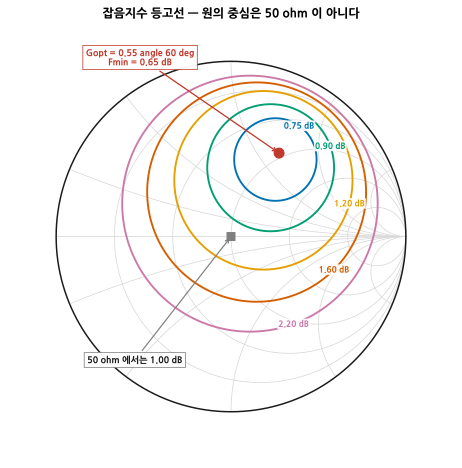
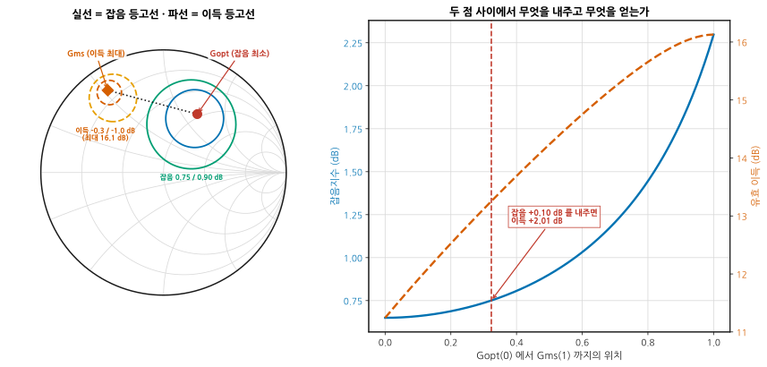
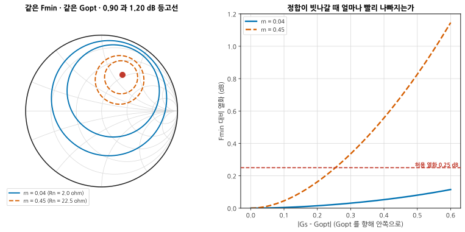
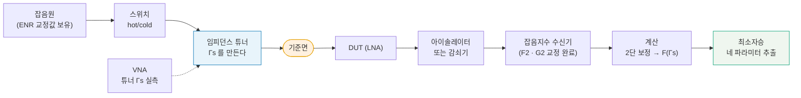
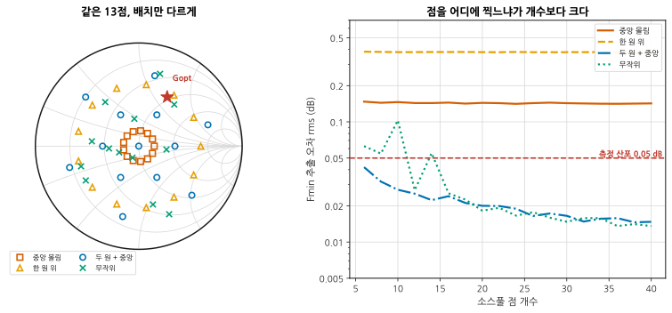
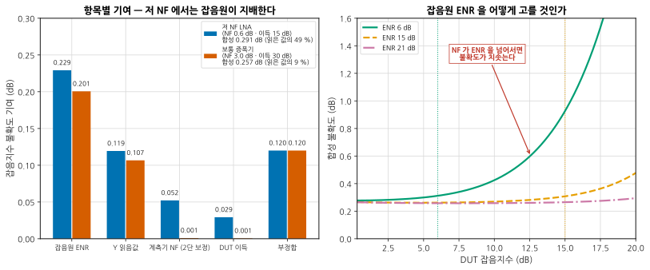

# B05 — 잡음의 심화: 네 개의 잡음 파라미터

**문서 번호**: RF-CUR-B05 · **버전**: v1.0 · **분량**: 이론 6 h + 실습 8 h

> 기본 과정에서 잡음지수는 숫자 하나였습니다. 실제로는 **소스 임피던스의 함수**이고, 그 함수를 적으려면 숫자 넷이 필요합니다. 이 모듈은 "데이터시트에 0.65 dB 라고 적혀 있는데 우리 보드에서는 1.4 dB 가 나온다"에 답합니다.

| | |
|---|---|
| **선수 모듈** | [M08](../01_모듈/M08_증폭기.md)(NF 의 정의, 잡음 정합), [M14](../01_모듈/M14_정밀측정1_교정과불확도.md)(불확도), [M15](../01_모듈/M15_정밀측정2_잡음선형성위상잡음.md)(Y 계수법·콜드소스법), [B01](./B01_벤치방법론.md)(반복성), [B03](./B03_다포트차동과픽스처.md)(기준면) |
| **이 모듈이 소유하는 개념** | **네 개의 잡음 파라미터**(Fmin · \|Γopt\| · ∠Γopt · Rn), 소스 반사계수에 따른 NF 식과 **잡음 등고선**, Γopt 와 Γms 의 절충, **Rn 의 뜻**, **소스풀**과 네 파라미터 추출, 점 배치가 정확도를 정한다는 것, 저 NF 측정의 **오차 지배항**, 보드 위 NF 를 데이터시트까지 되짚는 절차, 감도 실측 |
| **이 모듈을 쓰는 후속 모듈** | **B09**(수신 경로 디버그), **B11**(측정 시스템 분석), 심화 캡스톤 P2 |
| **학습 목표** | ① 네 파라미터로 임의의 소스 임피던스에서의 NF 를 계산한다 ② 잡음과 이득 사이에서 **의도적으로** 절충점을 고른다 ③ 소스풀을 설계하고 추출 결과를 **믿어도 되는지 판정한다** |

---

## B05.0 이 모듈의 범위

기본 과정이 여기까지 왔습니다.

| 이미 배운 것 | 어디서 |
|---|---|
| 잡음지수의 정의, 잡음 온도, 프리스 식 | [M08 §2](../01_모듈/M08_증폭기.md) |
| "LNA 는 잡음 정합, PA 는 전력 정합" | [M08 §3](../01_모듈/M08_증폭기.md) |
| Y 계수법과 콜드소스법 | [M15 §3](../01_모듈/M15_정밀측정2_잡음선형성위상잡음.md) · [M15 §4](../01_모듈/M15_정밀측정2_잡음선형성위상잡음.md) |
| 불확도를 항목별로 적고 RSS 로 합치는 법 | [M14 §10](../01_모듈/M14_정밀측정1_교정과불확도.md) |
| 임피던스 튜너와 로드풀 | [M15 §11](../01_모듈/M15_정밀측정2_잡음선형성위상잡음.md) · [B04 §8](./B04_대신호.md) |

**이 모듈은 그 위에 한 문장을 얹습니다** — [M08 §3](../01_모듈/M08_증폭기.md)이 "잡음 정합점은 이득 정합점과 다르다"고 말만 하고 넘어갔습니다. 여기서 그 문장을 **식으로 적고, 재고, 설계에 씁니다.**

> ⚠️ **다른 모듈과의 역할 분리**
>
> | 개념 | B05 (여기) | 다른 모듈 |
> |---|---|---|
> | NF 의 정의·잡음 온도 | 인용만 | [M08 §2](../01_모듈/M08_증폭기.md)가 소유 |
> | Y 계수법 셋업 | **오차 예산만** | [M15 §3](../01_모듈/M15_정밀측정2_잡음선형성위상잡음.md)이 절차를 소유 |
> | 불확도 합성의 원리 | 잡음 측정에 적용만 | [M14 §10](../01_모듈/M14_정밀측정1_교정과불확도.md)이 소유 |
> | 임피던스 튜너 하드웨어 | **소스 쪽 쓰임**만 | [B04 §8](./B04_대신호.md)이 로드풀 하드웨어를 소유 |
> | 정합망 설계 실무 | 목표점을 정하는 데까지 | [M03 §5](../01_모듈/M03_S파라미터와스미스차트.md)가 정합의 원리를, [M06 §5](../01_모듈/M06_수동소자와공진.md)가 부품 선정을 소유 |
> | 반복성·재체결 산포 | 인용만 | [B01 §4](./B01_벤치방법론.md)가 소유 |
> | 위상잡음 | **다루지 않습니다** | [B06](./B06_위상잡음심화.md) |

---

## B05.1 데이터시트의 NF 는 어느 임피던스에서인가

데이터시트를 폅니다. `NF = 0.65 dB` 라고 적혀 있습니다.

**이 값은 소스가 50 Ω 일 때의 값이 아닙니다.** 소자가 가장 좋아하는 임피던스를 물려 줬을 때의 값입니다.

같은 소자를 **50 Ω 소스**로 재면 이 예제에서 **1.00 dB** 가 나옵니다. 0.35 dB 가 그냥 사라졌습니다. 아무것도 잘못하지 않았는데.

| 데이터시트에서 이렇게 찾으십시오 | 뜻 |
|---|---|
| `NF` 또는 `F` 만 적혀 있다 | 대개 **Fmin** 이다. 조건을 찾아라 |
| `NF (50 Ω)` 또는 `NF, ZS = 50 Ω` | 50 Ω 소스에서의 값. 이건 그대로 쓸 수 있다 |
| `Fmin`, `Γopt`, `Rn` 표가 따로 있다 | **네 파라미터를 준 것이다.** 이게 제일 좋다 |
| 주파수마다 값이 다른 표 | Γopt 는 주파수에 따라 크게 돈다. 우리 대역의 행을 봐라 |

> 📌 **네 파라미터 표가 있으면 계산으로 답이 나옵니다.** 이 모듈의 나머지는 그 계산과, 표가 없을 때 직접 재는 법입니다.

---

## B05.2 네 개의 파라미터와 그 식

임의의 소스 반사계수 Γs 에서의 잡음지수는 이 식 하나로 정해집니다.

$$F(\Gamma_s) = F_{\min} + \frac{4 r_n \left|\Gamma_s - \Gamma_{opt}\right|^2}{\left(1-\left|\Gamma_s\right|^2\right)\left|1+\Gamma_{opt}\right|^2}$$

| 기호 | 이름 | 뜻 |
|---|---|---|
| **Fmin** | 최소 잡음지수 | 가장 잘 맞췄을 때의 값. 소자가 낼 수 있는 바닥 |
| **\|Γopt\|** | 최적 소스 반사계수의 크기 | 그 바닥이 나오는 임피던스가 50 Ω 에서 얼마나 먼가 |
| **∠Γopt** | 같은 것의 위상 | 어느 방향으로 먼가 |
| **Rn** (또는 rn = Rn/Z₀) | 등가 잡음 저항 | **빗나갔을 때 얼마나 빨리 나빠지는가** |

> ⚠️ **더할 때는 반드시 선형 배율로.** 위 식의 F 는 dB 가 아니라 배율입니다. dB 끼리 더하면 틀립니다. 0.65 dB 는 배율로 1.161 이고, 여기에 열화분을 더한 뒤 다시 dB 로 돌립니다.

### 잡음 등고선은 원이다

F 를 어떤 값으로 고정하면 그 Γs 들의 자리는 **스미스 차트 위의 원**이 됩니다.

$$N = \frac{(F - F_{\min})\left|1+\Gamma_{opt}\right|^2}{4 r_n}, \qquad
\text{중심} = \frac{\Gamma_{opt}}{N+1}, \qquad
\text{반지름} = \frac{\sqrt{N\left(N+1-\left|\Gamma_{opt}\right|^2\right)}}{N+1}$$

*그림 B05-1. Fmin 0.65 dB · \|Γopt\| 0.55∠60° · rn 0.15 인 소자. **읽는 법**: 원들의 중심이 **차트 한가운데(50 Ω)가 아니라 Γopt 쪽으로 치우쳐** 있습니다. F 를 키울수록 원이 커지면서 중심이 바깥으로 밀려납니다. 가운데 회색 네모가 50 Ω 인데, 0.90 과 1.20 dB 원 사이에 있습니다 — 실제로 1.00 dB 입니다. 원이 단위원 밖으로 나가는 부분은 잘라 냈습니다. 만들 수 없는 소스이기 때문입니다.*

> 📌 **N = 0 이면 원이 한 점으로 오므라듭니다.** F = Fmin 인 자리는 Γopt 하나뿐이라는 뜻입니다. 등고선 지도의 중심입니다.

---

## B05.3 Γopt 는 왜 정합점과 다른가

[M08 §3](../01_모듈/M08_증폭기.md)에서 "LNA 는 잡음 정합"이라고 했습니다. 왜 두 점이 다른지를 이제 봅니다.

- **이득이 최대**가 되는 소스는 **Γms** — 소자 입력을 켤레 정합시키는 점입니다. S-파라미터로 정해집니다.
- **잡음이 최소**가 되는 소스는 **Γopt** — 소자 내부 잡음원 두 개(드레인 잡음과 게이트 잡음)의 상관에서 정해집니다.

**둘은 다른 물리에서 나오므로 일치할 이유가 없습니다.**

*그림 B05-2. 같은 소자, 두 개의 목표점. **읽는 법**: 왼쪽 차트에서 두 점이 **0.755 만큼** 떨어져 있습니다. 오른쪽은 그 두 점을 잇는 선 위를 걸어가며 잡음지수(파란 실선)와 유효 이득(주황 파선)을 함께 그린 것입니다. **왼쪽 끝에서 오른쪽 끝으로 갈수록 이득은 좋아지고 잡음은 나빠집니다.** 붉은 세로선이 이 모듈의 답입니다.*

이 예제의 숫자입니다.

| 어디에 맞추는가 | 잡음지수 | 유효 이득 |
|---|---|---|
| **Γopt** (잡음 최소) | 0.650 dB | 11.24 dB |
| **Γms** (이득 최대) | 2.297 dB | 16.13 dB |
| **경로의 32 % 지점** | 0.750 dB | 13.25 dB |

> 📌 **잡음 0.10 dB 를 내주고 이득 2.01 dB 를 얻습니다.** 잡음 곡선은 Γopt 근처에서 **평평하고**(2차 함수의 바닥), 이득 곡선은 Γms 에서 멀어질수록 가파릅니다. 그래서 **Γopt 에 정확히 앉는 것은 대개 손해입니다.**

이것이 실무의 잡음 설계입니다. 등고선 지도를 겹쳐 놓고 **잡음 예산이 허용하는 만큼만 내주고 이득을 최대한 가져오는 점**을 고릅니다.

> ⚠️ **다단 수신기라면 계산이 한 번 더 있습니다.** 프리스 식([M08 §2](../01_모듈/M08_증폭기.md))에서 2단의 기여는 1단 이득으로 나뉩니다. **1단 이득을 2 dB 더 얻으면 2단 기여가 절반 이하로 줍니다.** 그래서 전체 NF 로 보면 Γopt 에 앉는 것보다 절충점이 **더 낮은 시스템 NF** 를 주는 경우가 흔합니다. 소자 하나만 보고 결정하지 마십시오.

---

## B05.4 Rn — NF 가 얼마나 빨리 나빠지는가

네 파라미터 중 가장 안 쓰이면서 실무에서 가장 유용한 것이 **Rn** 입니다.

Rn 은 **빗나갔을 때의 벌점 크기**입니다. Fmin 과 Γopt 가 같아도 Rn 이 다르면 완전히 다른 소자입니다.

*그림 B05-3. 같은 Fmin, 같은 Γopt, Rn 만 다름. **읽는 법**: 왼쪽에서 파란 원(rn = 0.04)은 크고 헐렁하고, 주황 원(rn = 0.45)은 작고 빡빡합니다. **같은 0.90 dB 등고선인데 크기가 이렇게 다릅니다.** 오른쪽은 Γopt 에서 안쪽으로 걸어 나가며 본 열화입니다. rn 0.45 는 0.256 만 벗어나도 0.25 dB 를 잃지만, rn 0.04 는 **0.6 까지 벗어나도 0.115 dB** 밖에 안 잃습니다.*

| rn (Rn) | 성격 | 실무에서 |
|---|---|---|
| 작다 (0.04 · 2 Ω) | 등고선이 헐렁하다 | 정합망을 대충 해도 된다. **광대역에 유리** |
| 크다 (0.45 · 22.5 Ω) | 등고선이 빡빡하다 | 정합망 소자 오차·온도 표류가 그대로 NF 가 된다 |

> 📌 **Rn 은 생산 산포와 직결됩니다.** 정합망 커패시터가 ±5 % 흔들릴 때 NF 가 얼마나 흔들리는지가 Rn 으로 정해집니다. 두 소자의 Fmin 이 0.05 dB 차이라면, **Rn 이 작은 쪽을 고르는 것이 양산에서 이깁니다.** 이 이야기는 **B12**(양산 이관)에서 다시 만납니다.

---

## B05.5 소스풀 — 튜너로 임피던스를 옮겨 가며 잰다

데이터시트에 네 파라미터가 없거나, 우리 조건(주파수·바이어스·온도)이 데이터시트와 다르면 직접 재야 합니다.

**소스풀**은 소자 **앞**에 임피던스 튜너를 두고 Γs 를 옮겨 가며 NF 를 재는 측정입니다. 부하 쪽을 옮기는 로드풀([B04 §8](./B04_대신호.md))과 방향만 다릅니다.

*그림 B05-4. 소스풀 측정계. **읽는 법**: 주황색 **기준면**이 이 그림에서 가장 조심할 곳입니다. 튜너가 만드는 Γ 는 튜너 출력면의 값이고, DUT 가 보는 것은 그 뒤 커넥터·픽스처를 지난 값입니다. 손실이 있으면 **크기가 줄고 위상이 돕니다.** 점선은 신호 경로가 아니라 튜너의 Γs 를 실측해 두는 경로입니다 — 사전 특성화 값만 믿지 않는다는 뜻입니다([B04 §8](./B04_대신호.md)의 같은 경고).*

측정 순서는 이렇습니다.

1. 수신기의 **F2 · G2 를 교정**한다 (DUT 없이).
2. 튜너의 각 상태에서 **Γs 를 실측**한다 (VNA).
3. 각 Γs 에서 NF 를 재고, **2단 보정**을 걸어 DUT 만의 F 를 얻는다.
4. (Γs, F) 짝 여러 개를 최소자승에 넣어 네 파라미터를 뽑는다.

### 어떻게 네 개를 한꺼번에 푸는가

식이 비선형으로 보이지만 **변수를 바꾸면 선형입니다.** u = 1/(1−\|Γs\|²) 라고 두면

$$F = a_1 + a_2 u + a_3 u \operatorname{Re}\Gamma_s + a_4 u \operatorname{Im}\Gamma_s$$

미지수가 넷인 **1차식**입니다. 최소자승으로 a₁~a₄ 를 구한 뒤 되돌리면 네 파라미터가 나옵니다.

> 📌 **미지수가 넷이니 원리적으로는 4점이면 풀립니다.** 실제로는 훨씬 더 찍습니다. 왜 그런지가 다음 절입니다.

---

## B05.6 몇 점을 어디에 찍을 것인가

**점 개수보다 배치가 중요합니다.** 그리고 이것은 취향이 아니라 계산으로 정해집니다.

*그림 B05-5. 같은 13점을 네 가지로 배치했을 때. **읽는 법**: 오른쪽에서 점 개수를 6 → 40 으로 늘려도 **위의 두 곡선은 안 내려옵니다.** 노란 파선("한 원 위")은 아예 평평합니다 — 점을 400개 찍어도 같습니다. 아래 두 곡선만 √N 처럼 내려옵니다. 붉은 선이 점 하나의 측정 산포(0.05 dB)인데, **좋은 배치는 그보다 낮은 곳으로 내려갑니다.** 여러 점이 서로를 평균해 주기 때문입니다.*

| 배치 | 13점에서의 Fmin 추출 오차 | 왜 |
|---|---|---|
| 중앙 몰림 (\|Γs\| = 0.15) | 0.143 dB | 지렛대가 짧다. 먼 곳을 외삽하는 셈 |
| **한 원 위** (\|Γs\| = 0.60) | **0.381 dB** | **원리적으로 못 푼다** (아래) |
| 두 원 + 중앙 | **0.022 dB** | 반지름이 셋이라 잘 갈린다 |
| 무작위 (\|Γs\| < 0.75) | 0.055 dB | 나쁘지 않지만 운에 맡긴 것 |

> ⚠️ **한 반지름 위에만 찍으면 잡음이 하나도 없어도 답이 틀립니다.** (심화 규칙 3)
>
> \|Γs\| 가 전부 같으면 u = 1/(1−\|Γs\|²) 가 **상수**가 됩니다. 그러면 위 1차식의 1열(상수항)과 2열(u 항)이 평행해져 **Fmin 과 rn 을 가를 수 없습니다.** 설계 행렬의 조건수를 재 보면 바로 드러납니다.
>
> | 배치 | 조건수 | 판정 |
> |---|---|---|
> | 한 원 위 | **1.8 × 10¹⁶** | 특이. 못 푼다 |
> | 두 원 + 중앙 | 8.3 | 좋다 |
> | 무작위 | 10.7 | 쓸 만하다 |
>
> 이 검사에서 잡음을 0으로 두고 왕복시켰더니 **Fmin 이 0.380 dB 틀렸습니다.** 측정이 완벽해도 틀립니다. **소스풀을 돌리기 전에 조건수를 찍어 보십시오** — 한 줄이면 됩니다.

### 실무 배치 규칙

| 규칙 | 이유 |
|---|---|
| 반지름을 **최소 세 가지** (0 · 0.35 · 0.7 근처) | u 가 갈려야 Fmin 과 rn 이 분리된다 |
| 각 반지름에서 **위상을 고르게** | Γopt 의 방향을 잡으려면 사방이 필요하다 |
| Γopt 예상 위치 **주변에 더 촘촘히** | 바닥 근처가 평평해 여기서 오차가 크다 |
| \|Γs\| 를 0.8 이상으로 밀지 말 것 | 1/(1−\|Γs\|²) 가 폭발해 그 점 하나가 결과를 지배한다 |
| **점당 반복 측정**을 하고 산포를 적을 것 | [B01 §4](./B01_벤치방법론.md) |

---

## B05.7 저 NF 측정의 오차 — 무엇이 지배하는가

NF 0.6 dB 를 재서 "0.6 dB" 라고 적었습니다. 이 값의 불확도는 얼마입니까?

*그림 B05-6. Y 계수법 오차 예산. **읽는 법**: 왼쪽은 항목별 기여입니다. **저 NF 쪽(파랑)이 거의 모든 항목에서 큽니다.** 특히 잡음원 ENR 이 0.229 dB 로 지배적입니다. 합성하면 0.291 dB 인데 — **읽은 값 0.6 dB 의 49 % 입니다.** 오른쪽은 잡음원을 어떻게 고를 것인가입니다. DUT 의 NF 가 그 잡음원의 ENR 에 다가가면 불확도가 치솟습니다.*

| 항목 | 저 NF LNA (0.6 dB · 이득 15 dB) | 보통 증폭기 (3.0 dB · 이득 30 dB) |
|---|---|---|
| 잡음원 ENR (±0.20 dB) | 0.229 dB | 0.201 dB |
| Y 읽음값 (±0.10 dB) | 0.119 dB | 0.107 dB |
| 계측기 NF · 2단 보정 (±0.30 dB) | 0.052 dB | 0.001 dB |
| DUT 이득 (±0.20 dB) | 0.029 dB | 0.001 dB |
| 부정합 | 0.120 dB | 0.120 dB |
| **합성 (RSS)** | **0.291 dB** | **0.257 dB** |
| **읽은 값 대비** | **49 %** | 9 % |

> 📌 **절대값은 비슷한데 의미가 전혀 다릅니다.** 0.291 dB 는 3 dB 짜리 소자에게는 사소하지만 0.6 dB 짜리에게는 절반입니다. **저 NF 측정에서 "0.6 dB 였습니다"는 사실상 "0.3 ~ 0.9 dB 사이였습니다"입니다.** 불확도를 안 적으면 이 사실이 사라집니다.

### 무엇을 고칠 수 있는가

| 지배항 | 줄이는 법 | 대가 |
|---|---|---|
| **ENR 불확도** | 교정 성적서가 좋은 잡음원. 최근 교정일 확인 | 돈 |
| ENR 불확도 | **콜드소스법**으로 바꾼다 ([M15 §4](../01_모듈/M15_정밀측정2_잡음선형성위상잡음.md)) — 잡음원 대신 VNA 로 정합을 잰다 | 셋업이 복잡 |
| **부정합** | DUT 앞에 아이솔레이터나 3 dB 감쇠기 | 감쇠기는 NF 를 그만큼 **실제로** 올린다 |
| 2단 보정 | 1단 이득을 키우거나, 수신기 NF 가 낮은 장비 | — |
| 반복 산포 | 여러 번 재고 평균 ([B01 §4](./B01_벤치방법론.md)) | 시간 |

> ⚠️ **이 예산이 거짓말하는 조건** (심화 규칙 3)
>
> | 조건 | 결과 |
> |---|---|
> | **잡음원의 hot/cold 정합이 다름** | Γs 가 상태에 따라 바뀐다. 위 예산에 없는 항이 생긴다 |
> | 커넥터 손실을 안 뺐다 | 손실이 그대로 NF 에 더해진다. **0.1 dB 어댑터가 0.1 dB NF 다** |
> | DUT 가 발진 직전 | 잡음지수가 음수처럼 나오거나 튄다. 안정도부터 확인 ([M08 §7](../01_모듈/M08_증폭기.md)) |
> | 항목들이 **독립이 아님** | RSS 가 과소평가한다. 같은 어댑터를 교정과 측정에 다르게 쓰면 상관이 생긴다 |
> | 워밍업 전 | 수신기 이득이 흐른다 ([B01 §3](./B01_벤치방법론.md)) |
>
> 마지막에서 두 번째가 RSS 의 전제입니다. **독립일 때만 제곱합의 제곱근이 맞습니다.**

---

## B05.8 보드 위 LNA 의 NF 가 데이터시트와 다른 이유

현장에서 가장 자주 오는 질문입니다. 데이터시트 0.65 dB, 우리 보드 1.4 dB. 0.75 dB 가 어디로 갔는가.

**순서대로 떼어 냅니다. 각 단계가 얼마인지 숫자로 적으면서.**

| 순서 | 확인할 것 | 전형적인 크기 | 어떻게 확인 |
|---|---|---|---|
| 1 | **측정 자체가 맞는가** | — | 알고 있는 감쇠기를 DUT 자리에 넣는다. 3 dB 감쇠기의 NF 는 3 dB 여야 한다 |
| 2 | **입력단 손실** (커넥터·전송선·필터) | 0.2 ~ 0.8 dB | S21 을 재서 그대로 뺀다. **손실 1 dB = NF 1 dB** |
| 3 | **소스 임피던스** | 0 ~ 0.5 dB | 정합망을 지난 Γs 를 실측하고 §2 의 식에 넣는다 |
| 4 | **바이어스점** | 0.1 ~ 0.4 dB | 데이터시트 조건과 같은가. Id 를 실측 |
| 5 | **주파수** | 소자마다 | Γopt 는 주파수에 따라 돈다. 우리 주파수의 행인가 |
| 6 | **온도** | 0.05 ~ 0.2 dB | 케이스 온도 실측 |
| 7 | **2단 기여** | 0.05 ~ 0.3 dB | 프리스 식으로 계산. 1단 이득이 작으면 커진다 |
| 8 | **측정 불확도** | ±0.3 dB | §7 |

> 📌 **2번이 대개 가장 큽니다.** 입력 커넥터·정합망·대역통과필터를 지나며 잃는 것이 그대로 NF 에 더해집니다. **LNA 앞의 0.5 dB 짜리 필터는 시스템 NF 를 0.5 dB 올립니다.** 그래서 수신 경로 설계에서 "LNA 를 안테나에 최대한 붙인다"가 규칙입니다.

**떼어 낸 것들의 합이 0.75 dB 에 가까워야 합니다.** 합이 안 맞으면 아직 못 찾은 항이 있습니다. 흔한 것은 **접지 인덕턴스** — 소스(또는 이미터) 비아가 길면 소자의 Γopt 자체가 옮겨 갑니다([M17](../01_모듈/M17_보드설계와인증.md)).

---

## B05.9 감도 실측 — 오류율로 확인하기

NF 를 재는 이유는 결국 **얼마나 약한 신호까지 받을 수 있는가**입니다. 그 값은 계산으로 나옵니다.

$$P_{\min} = -174\ \text{dBm/Hz} + NF + 10\log_{10}(BW) + SNR_{\text{필요}}$$

| NF | 대역폭 | 필요 SNR | 감도 |
|---|---|---|---|
| 0.6 dB | 1 MHz | 10 dB | **−103.4 dBm** |
| 1.5 dB | 1 MHz | 10 dB | −102.5 dBm |
| 3.0 dB | 20 MHz | 15 dB | −83.0 dBm |

**NF 가 0.9 dB 나쁘면 감도도 정확히 0.9 dB 나빠집니다.** 대역폭이 2배면 3.01 dB 나빠집니다.

### 그런데 계산과 실측이 다릅니다

계산은 **열잡음만** 봅니다. 실제 수신기에는 이것들이 더 있습니다.

| 계산에 없는 것 | 어디서 보는가 |
|---|---|
| 국부발진기 위상잡음이 인접 신호를 끌어내림 | [B06](./B06_위상잡음심화.md) |
| 스퓨리어스와 이미지 | [M09](../01_모듈/M09_주파수변환과신호원.md) · [M15 §8](../01_모듈/M15_정밀측정2_잡음선형성위상잡음.md) |
| 자기 보드에서 새어 들어온 것 | **B09** |
| 복조기 구현 손실 | 실측으로만 |

그래서 **오류율로 확인합니다.**

1. 신호원 출력을 감쇠기로 낮춰 가며 오류율(BER 또는 PER)을 잰다.
2. 규격이 정한 기준(예: 패킷 오류율 8 %)을 넘는 지점을 찾는다.
3. 그 지점의 **입력 전력이 실측 감도**다.
4. 계산값과의 차이가 **구현 손실**이다. 보통 1 ~ 3 dB.

> ⚠️ **감도 실측이 거짓말하는 조건** (심화 규칙 3)
>
> | 조건 | 결과 | 확인법 |
> |---|---|---|
> | 케이블·커넥터 손실을 안 뺐다 | 감도가 그만큼 좋아 보인다 | 경로 손실을 실측해 보정 |
> | 신호원 자체의 잡음 바닥 | 약한 신호에 신호원 잡음이 얹힌다 | 감쇠기를 신호원 **바로 뒤**에 둔다 |
> | 차폐 부족 — 공중으로 새어 든 신호 | 감쇠기를 더 넣어도 오류율이 안 나빠진다 | 입력을 50 Ω 종단하고 오류율을 본다. 계속 복조되면 새는 것이다 |
> | 패킷 수가 적다 | 오류율 8 % 를 ±3 % 로밖에 못 잰다 | 오류 개수가 100개 넘을 때까지 |
> | AGC 가 안 잡혔다 | 감도 부근에서 이득이 흔들린다 | 이득 상태를 고정하고 재 본다 |
>
> 세 번째가 특히 잘 속입니다. **입력을 종단하고도 링크가 살아 있으면 그날의 모든 감도 값이 무의미합니다.**

---

## B05.L 실습

> **등급 표기**: **T0** = 계산기·PC 만으로 · **T1** = 기본 계측기 · **T2** = 전문 장비. 등급 정의는 [설계서 §7](./00_심화과정_설계서.md) 참조.

### L-B05-a (T0) — 네 파라미터로 등고선을 그리고 정합점과 비교

**목표**: §2·§3 의 그림을 직접 만든다.

1. `scripts/gen_fig_b05.py` 의 `f_of_gs()`·`noise_circle()`·`gamma_ms()` 를 쓴다.
2. 등고선을 **닫힌 식으로** 그린 것과, 격자에서 F 를 계산해 `contour` 로 그린 것을 겹쳐 그린다. 겹치는가?
3. Γopt 와 Γms 를 찍고, 두 점 사이에서 잡음 +0.05 / +0.10 / +0.20 dB 를 내줄 때의 이득 이득량을 표로 만든다.
4. 프리스 식으로 2단(NF 4 dB)을 붙였을 때 **시스템 NF** 가 최소가 되는 점을 찾는다. Γopt 인가?

**보고**: 겹침 확인 그림, 3번 표, 4번의 답과 그 이유.

**막히면**: 4번에서 최소점이 Γopt 가 아니라 절충점 쪽으로 밀려 있어야 정상입니다. 1단 이득이 커지면 2단 기여가 줄기 때문입니다.

### L-B05-b (T0) — 공개 잡음 파라미터 데이터로 정합망 설계

**목표**: 표에서 목표점까지 가는 길을 만든다.

1. 제조사가 공개한 LNA 소자의 잡음 파라미터 표를 받는다(주파수별 Fmin·Γopt·Rn).
2. 우리 대역의 행에서 Γopt 를 읽고, 등고선을 그린다.
3. 잡음 열화 예산을 0.1 dB 로 두고, 그 원 **안**에서 이득이 가장 큰 점을 고른다.
4. 50 Ω 에서 그 점까지 가는 2소자 정합망을 설계한다([M03 §5](../01_모듈/M03_S파라미터와스미스차트.md)).
5. 소자 값에 ±5 % 를 흔들어 NF 가 얼마나 흔들리는지 본다.

**보고**: 목표점 좌표, 정합망 회로도, 5번의 산포.

**막히면**: 5번의 산포가 크면 Rn 이 큰 소자입니다. §4 로 돌아가십시오.

### L-B05-c (T2) — 튜너 소스풀로 네 파라미터 추출

**목표**: 실물에서 §5·§6 을 돌린다.

**필요**: 임피던스 튜너, 잡음지수 측정 장비, VNA, LNA 평가보드.

1. **점을 찍기 전에** 계획한 Γs 집합의 조건수를 계산한다. 100 을 넘으면 배치를 고친다.
2. 수신기 F2·G2 를 교정하고, 튜너 각 상태의 Γs 를 VNA 로 실측한다.
3. 각 점에서 NF 를 3회씩 재고 평균과 산포를 적는다.
4. 추출하고, **뽑은 파라미터로 다시 계산한 F 와 측정값의 잔차**를 그린다.
5. 잔차가 측정 산포보다 크면 무엇이 문제인지 찾는다.

**보고**: 조건수, 네 파라미터, 잔차 그림, 데이터시트와의 비교.

**막히면**: 잔차가 특정 방향의 점들에서만 크면 기준면(그림 B05-4의 주황 상자)을 의심하십시오.

### L-B05-d (T1) — 정합망을 바꿔 가며 NF 변화 실측

**목표**: 튜너 없이도 §2 의 식을 확인한다.

**필요**: 잡음지수 측정 장비, LNA 보드, 정합용 칩 부품 여러 값.

1. 입력 직렬 커패시터를 3~4 가지 값으로 바꿔 가며 NF 와 S11 을 함께 잰다.
2. 각 경우의 Γs 를 계산(또는 실측)한다.
3. (Γs, NF) 를 §2 의 식에 넣어 예측과 비교한다.
4. 4점 이상 모였으면 네 파라미터를 추출해 본다. 조건수는?

**보고**: 부품값별 (Γs, NF) 표, 예측 vs 실측, 조건수.

**막히면**: 4번의 조건수가 크게 나오는 것이 정상입니다 — 커패시터만 바꾸면 Γs 가 **한 궤적 위**를 움직여 §6 의 함정에 빠집니다. 그 사실을 확인하는 것도 이 실습의 목적입니다.

> ⚠️ **T0 대체로 못 얻는 것**
>
> | 못 얻는 것 | 왜 |
> |---|---|
> | 튜너 교정과 기준면 이동 | 시뮬레이션에는 커넥터가 없다 |
> | ENR 불확도의 실체 | 성적서를 봐야 안다 |
> | 발진 직전 소자의 이상한 값 | 모형은 언제나 안정하다 |
> | 접지 인덕턴스가 Γopt 를 옮기는 것 | 보드가 있어야 한다 |
> | 오류율 기반 감도 | 복조기가 필요하다 |

---

## B05.Q 확인 문제

<b>Q1.</b> 데이터시트에 Fmin 0.5 dB 라고 적힌 소자를 50 Ω 소스로 쟀더니 1.3 dB 가 나왔습니다. 불량입니까?

**아닙니다. 정상일 가능성이 큽니다.**

Fmin 은 **Γopt 에서의 값**입니다. 50 Ω 은 대개 Γopt 가 아닙니다. 데이터시트의 Γopt 와 Rn 을 §2 의 식에 넣어 50 Ω(Γs = 0) 에서의 값을 계산해 보십시오.

$$F(0) = F_{\min} + \frac{4 r_n \left|\Gamma_{opt}\right|^2}{\left|1+\Gamma_{opt}\right|^2}$$

본문 예제(Fmin 0.65, \|Γopt\| 0.55, rn 0.15)에서는 1.00 dB 가 나왔습니다. 0.35 dB 차이입니다. \|Γopt\| 가 더 크거나 rn 이 더 크면 차이가 더 벌어집니다.

계산값이 1.3 dB 근처면 정상입니다. 그래도 안 맞으면 §8 의 순서를 밟으십시오 — 특히 **입력 경로 손실**과 **2단 기여**를 먼저 보십시오.

<b>Q2.</b> 소스풀을 40점 찍었는데 추출한 Fmin 이 데이터시트보다 0.4 dB 낮게 나왔습니다. 좋은 소자를 받은 겁니까?

**아니라고 보는 편이 안전합니다.** Fmin 이 데이터시트보다 **낮게** 나오는 것은 대개 측정 문제입니다.

먼저 볼 것은 **점 배치**입니다.

1. 설계 행렬의 **조건수**를 계산하십시오. 튜너를 "한 반지름 위에서 위상만 돌리는" 방식으로 썼다면 조건수가 폭발해 있을 것입니다. 본문 §6 에서 그 배치는 잡음이 전혀 없어도 Fmin 이 **0.380 dB 틀렸습니다.** 부호까지 이 질문과 같습니다.
2. \|Γs\| 를 0.8 이상으로 민 점이 있는지 보십시오. 1/(1−\|Γs\|²) 가 폭발해 그 점 하나가 맞춤을 끌고 갑니다.

배치가 문제가 아니라면 다음을 보십시오.

3. **손실을 두 번 뺐는가.** 픽스처 손실을 보정 단계와 계산 단계에서 각각 빼면 NF 가 실제보다 낮아집니다.
4. **2단 보정이 과했는가.** 1단 이득을 실제보다 크게 넣으면 빼는 양이 커집니다.
5. §7 의 불확도가 ±0.29 dB 였습니다. 0.4 dB 는 그 범위를 조금 넘습니다 — **우연으로 설명하기엔 크고, 계통 오차로 보기엔 딱 맞는 크기**입니다.

**추출값으로 다시 계산한 F 와 측정값의 잔차를 그려 보는 것**이 가장 빠른 진단입니다. 잔차에 구조가 보이면 모형이 아니라 데이터가 문제입니다.

<b>Q3.</b> Fmin 0.60 dB · rn 0.40 인 소자와 Fmin 0.70 dB · rn 0.05 인 소자가 있습니다. 어느 쪽을 고릅니까?

**대개 두 번째입니다.** 조건을 따져 봅시다.

Fmin 만 보면 첫 번째가 0.1 dB 좋습니다. 그런데 **Γopt 에 정확히 앉을 수 있을 때만** 그렇습니다.

정합망이 Γopt 에서 \|ΔΓ\| = 0.15 만큼 빗나갔다고 하면(부품 오차·기판 산포·온도로 흔한 크기), §2 의 식으로

| 소자 | Fmin | 빗나갔을 때의 벌점 | 실제 NF |
|---|---|---|---|
| A | 0.60 dB | 크다 | Fmin + 0.2 dB 대 |
| B | 0.70 dB | 작다 | Fmin + 0.03 dB 대 |

**순서가 뒤집힙니다.** 그리고 이것은 양산에서 더 벌어집니다 — 첫 번째 소자는 보드마다 NF 가 다르게 나오고, 두 번째는 고르게 나옵니다.

첫 번째를 고를 만한 경우도 있습니다.

- 대역이 **아주 좁고** 정합을 정밀하게 맞출 수 있다
- 온도 범위가 좁다
- 시제품 한 대만 만든다

반대로 두 번째가 확실히 유리한 경우는 **광대역**입니다. Γopt 는 주파수에 따라 움직이는데, rn 이 작으면 대역 전체에서 따라다니지 않아도 됩니다.

**결정 전에 할 일**: 두 소자의 등고선을 겹쳐 그리고, 우리 정합망이 실제로 만들 Γs 의 산포 범위를 그 위에 얹어 보십시오. 그림 하나로 답이 나옵니다.

<b>Q4.</b> NF 0.55 dB 를 측정해서 보고했더니 "재현이 안 된다"고 합니다. 무엇을 같이 적었어야 합니까?

**불확도와 조건입니다.** §7 에서 이 급의 측정은 합성 불확도가 **0.29 dB** 였습니다 — 읽은 값의 절반입니다. 그 사실 없이 "0.55 dB"만 적으면 재현될 수 없습니다.

같이 적을 것.

| 항목 | 왜 |
|---|---|
| **합성 불확도와 그 내역** | 0.55 ± 0.29 dB 인지 ± 0.05 dB 인지가 전혀 다른 이야기다 |
| 측정법 (Y 계수 / 콜드소스) | 지배 오차항이 다르다 |
| 잡음원 ENR 값·교정일·불확도 | 가장 큰 항이다 (0.229 dB) |
| 소스 임피던스 Γs | Fmin 인가 50 Ω 값인가 |
| 기준면 위치와 뺀 손실 | 어댑터 0.1 dB 가 NF 0.1 dB 다 |
| 2단 보정 여부와 쓴 이득값 | 안 하면 높게, 과하면 낮게 나온다 |
| 바이어스·주파수·케이스 온도 | 조건이 다르면 소자가 다르다 |
| 반복 횟수와 산포 | [B01 §4](./B01_벤치방법론.md) |

> 여기에 하나 더. **재현이 안 된다는 상대가 어떤 값을 얻었는지** 물어보십시오. 차이가 0.29 dB 안이면 두 측정 다 맞은 것이고, 논의할 것은 값이 아니라 **불확도를 줄이는 방법**입니다.

<b>Q5.</b> 수신기 감도를 계산하면 −103 dBm 인데 실측은 −99 dBm 입니다. 4 dB 는 어디로 갔습니까?

**계산에 없는 것들이 4 dB 를 먹었습니다.** 순서대로 떼어 냅니다.

| 순서 | 확인 | 전형 크기 |
|---|---|---|
| 1 | **경로 손실을 뺐는가** — 신호원에서 DUT 입력까지의 케이블·커넥터 | 0.5 ~ 2 dB. 실측해서 보정 |
| 2 | **NF 실측값이 계산에 쓴 값과 같은가** | §8 의 순서로 확인 |
| 3 | **필요 SNR 을 규격값으로 썼는가, 실측했는가** | 구현 손실 1 ~ 3 dB |
| 4 | 국부발진기 위상잡음 | [B06](./B06_위상잡음심화.md) |
| 5 | 자기 보드에서 새어 든 스퓨리어스 | **B09** |
| 6 | AGC·필터 대역폭이 계산 가정과 같은가 | 대역폭 2배 = 3 dB |

**3번이 대개 가장 큽니다.** 규격의 "필요 SNR" 은 이상적인 복조기 기준이고, 실제 복조기는 채널 추정 오차·양자화·동기 오차로 1~3 dB 를 더 씁니다. 이것을 **구현 손실**이라고 부르며, 없앨 수 없고 **측정해서 예산에 넣는 것**이 맞습니다.

그리고 확인해야 할 것 하나. **입력을 50 Ω 으로 종단하고도 링크가 살아 있지 않은지** 보십시오(§9). 살아 있으면 지금까지의 감도 숫자가 전부 공중 경로를 탄 것입니다.

<b>Q6.</b> LNA 앞에 3 dB 감쇠기를 넣으면 부정합이 줄어 측정 불확도가 좋아진다고 합니다. 넣어야 합니까?

**측정을 위해서라면 조건부로 예, 제품에는 아니오.**

감쇠기는 두 가지를 동시에 합니다.

| 얻는 것 | 잃는 것 |
|---|---|
| 소스 정합이 좋아져 **부정합 불확도**가 준다 (§7 의 0.120 dB 항) | **NF 가 3 dB 실제로 올라간다** |
| 튜너·잡음원의 Γ 변화에 덜 민감해진다 | 저 NF 소자의 차이를 못 본다 |

즉 감쇠기를 넣고 잰 값은 **감쇠기 + LNA 의 NF** 입니다. LNA 만의 NF 를 알려면 프리스 식으로 되빼야 하는데, **되빼는 계산이 다시 오차를 만듭니다.** 0.6 dB 짜리 소자를 3 dB 감쇠기 뒤에서 재면 전체가 3.6 dB 근처가 되고, 여기서 3 dB 를 빼면 남는 0.6 dB 의 불확도가 크게 부풀려집니다.

**더 나은 선택지**가 있습니다.

1. **아이솔레이터** — 정합은 개선하면서 손실은 0.3 dB 정도. 대역이 좁은 것이 단점.
2. **콜드소스법** — 정합을 VNA 로 재서 계산으로 보정합니다. 감쇠기가 필요 없습니다 ([M15 §4](../01_모듈/M15_정밀측정2_잡음선형성위상잡음.md)).
3. 잡음원의 hot/cold **Γ 를 실측**해 부정합 항을 계산으로 줄인다.

제품에서는 답이 분명합니다. **LNA 앞의 어떤 손실도 시스템 NF 에 1:1 로 더해집니다**(§8). 감쇠기는 물론이고 커넥터 하나, 필터 하나도 그렇습니다.

---

## B05.A 이 모듈의 축약어

| 약어 | 영문 원어 | 한글 |
|---|---|---|
| DUT | Device Under Test | 피시험 소자 (→ M04) |
| LNA | Low Noise Amplifier | 저잡음 증폭기 (→ M08) |
| NF | Noise Figure | 잡음지수 (→ M08) |
| ENR | Excess Noise Ratio | 초과 잡음비 (→ M15) |
| VNA | Vector Network Analyzer | 벡터 회로망 분석기 (→ M04) |
| RSS | Root Sum of Squares | 제곱합의 제곱근 (→ M14) |
| SNR | Signal to Noise Ratio | 신호 대 잡음비 (→ M08) |
| BER | Bit Error Rate | 비트 오류율 (→ M13) |
| PER | Packet Error Rate | 패킷 오류율 |
| AGC | Automatic Gain Control | 자동 이득 제어 (→ M12) |
| RF | Radio Frequency | 무선 주파수 (→ M01) |
| PA | Power Amplifier | 전력 증폭기 (→ M08) |

---

## B05.S 출처

> ⚠️ **원문 확인 권고**: 아래 주소는 검색 결과로 교차확인한 것이며 원문을 직접 열어 보지는 못했습니다. 중요한 수치는 원문에서 확인하십시오.

| 주장 | 등급 | 출처 |
|---|---|---|
| 잡음 파라미터는 Fmin · \|Γopt\| · ∠Γopt · rn 네 개이며, 임의의 소스에서의 NF 는 F = Fmin + 4rn\|Γopt−Γs\|²/(\|1+Γopt\|²(1−\|Γs\|²)) 로 정해진다 | B, B, B | [Mini-Circuits AN60-040 — 잡음 파라미터 측정의 이해](https://www.minicircuits.com/appdoc/AN60-040.html) · [UCSB ECE145A — 저잡음 증폭기 설계](https://web.ece.ucsb.edu/~long/ece145a/LNAdesign.pdf) · [scikit-rf — LNA 예제](https://scikit-rf.readthedocs.io/en/latest/examples/networktheory/LNA%20Example.html) |
| rn 은 소스가 Γopt 에서 벗어날 때 잡음지수가 얼마나 빨리 나빠지는지를 정한다 | B, B | [Mini-Circuits AN60-040](https://www.minicircuits.com/appdoc/AN60-040.html) · [Microwave Journal — 잡음 파라미터 측정의 이해](https://www.microwavejournal.com/articles/7506-understanding-noise-parameter-measurement) |
| 잡음지수가 일정한 소스 반사계수의 자리는 원이며, N = (F−Fmin)\|1+Γopt\|²/(4rn) 로 중심과 반지름이 정해진다. F 가 커질수록 원이 커지고 중심이 바깥으로 밀린다 | B, C | [Univ. of Cincinnati — Noise Figure Circles](https://homepages.uc.edu/~ferendam/Courses/EE_611/Amplifier/NFC.html) · [All About Circuits — 단방향 LNA 설계](https://www.allaboutcircuits.com/technical-articles/learn-about-designing-unilateral-low-noise-amplifiers/) |
| 잡음 파라미터는 여러 임피던스 조건에서 DUT 를 재어 추출하며, 튜너로 소스 임피던스를 옮긴다 | B, B | [Microwave Journal — 잡음 파라미터 측정의 이해](https://www.microwavejournal.com/articles/7506-understanding-noise-parameter-measurement) · [Mini-Circuits AN60-040](https://www.minicircuits.com/appdoc/AN60-040.html) |
| 잡음원 ENR 의 교정 불확도는 통상 0.2 ~ 0.4 dB 이며, 그 값이 잡음지수 결과에 그대로 더해진다 | B, C | [R&S 1MA178 — Y 계수법 응용 노트](https://scdn.rohde-schwarz.com/ur/pws/dl_downloads/dl_application/application_notes/1ma178/1MA178_5e_NoiseFigure.pdf) · [All About Circuits — Y 계수법의 잡음원 불확도와 픽스처 손실](https://www.allaboutcircuits.com/technical-articles/noise-figure-measurement-using-the-y-factor-method-noise-source-uncertainty-and-fixturing-losses/) |
| DUT 잡음지수가 잡음원 ENR 을 넘어서면 불확도가 급격히 커진다 | B, B | [R&S 1EF110 — 매우 높은 잡음지수의 측정](https://cdn.rohde-schwarz.com.cn/pws/dl_downloads/dl_application/application_notes/1ef110/1EF110_1e_FSWK30_ENR.pdf) · [NI — 잡음지수 측정](https://download.ni.com/evaluation/rf/VSA_Noise_Figure_Measurements.pdf) |
| 2단 보정은 계측기 자신의 잡음 기여를 빼는 절차이며, DUT 이득이 30 dB 를 넘으면 무시할 수 있다 | B, C | [R&S 1MA178 — Y 계수법](https://scdn.rohde-schwarz.com/ur/pws/dl_downloads/dl_application/application_notes/1ma178/1MA178_5e_NoiseFigure.pdf) · [All About Circuits — Y 계수법 살펴보기](https://www.allaboutcircuits.com/technical-articles/explore-the-y-factor-method-for-noise-figure-measurement/) |
| 부정합은 불확도에 기여하며, 작은 감쇠기나 아이솔레이터로 줄일 수 있다 | C, B | [All About Circuits — 잡음원 불확도와 픽스처 손실](https://www.allaboutcircuits.com/technical-articles/noise-figure-measurement-using-the-y-factor-method-noise-source-uncertainty-and-fixturing-losses/) · [High Frequency Electronics — 잡음지수 불확도의 통계적 접근](https://www.highfrequencyelectronics.com/index.php?option=com_content&view=article&id=1309:noise-figure-measurement-uncertainty-a-statistical-approach&catid=131&Itemid=189) |

**본문의 숫자는 전부 계산입니다.** `python3 scripts/gen_fig_b05.py` 를 실행하면 인용값이 출력되고 자체 검산 32항목이 함께 돕니다. 교차검증은 세 갈래입니다.

1. **추출 왕복** — 네 파라미터로 합성 측정값을 만들고 최소자승으로 되찾는다. 잡음이 없으면 기계 정밀도(10⁻¹⁵ dB)까지 일치해야 하고, 실제로 그렇다
2. **등고선** — 닫힌 식으로 그린 원 위의 2000점을 F(Γs) 식에 다시 넣어 대조. 최대 오차 3×10⁻¹⁵ dB. Γms 도 닫힌 식과 격자 최대점을 대조(차 0.02)
3. **오차 예산** — RSS 합성과 몬테카를로 20 000 회를 두 조건에서 대조. 차 0.1 % 와 0.4 %

§2 의 소자 값은 저잡음 pHEMT 를 흉내낸 **합성 값**입니다. 여기서 나온 숫자(0.35 dB, 2.01 dB, 0.291 dB)를 실물의 기대값으로 옮기지 마십시오 — **관계가 어떻게 생겼는지**를 보여 줄 뿐입니다. 다만 §6 의 "한 반지름 위에서는 못 푼다"는 소자 값과 무관한 **선형대수의 성질**이라 그대로 적용됩니다.

---

## 변경 이력

| 버전 | 일자 | 내용 |
|---|---|---|
| v1.0 | 2026-08-27 | 최초 작성. 그림 6종(생성 5 + Mermaid 1), 실습 4종, 확인 문제 6문항. 자체 검산 32항목 통과. 집필 중 두 가지가 계산에서 나왔다 — ① 소스풀 점을 한 반지름 위에만 찍으면 설계 행렬이 특이해져 잡음이 전혀 없어도 Fmin 이 0.380 dB 틀린다. 처음에는 추출 코드의 버그로 의심했는데, 조건수를 찍어 보니 1.8×10¹⁶ 이었다. §6 의 경고 상자와 L-B05-d 의 "막히면"은 이 발견에서 나왔다 ② rn 이 작은 소자는 \|ΔΓ\| 0.6 까지 벗어나도 0.115 dB 밖에 안 나빠져, 원래 쓰려던 "0.25 dB 열화까지의 거리" 표가 성립하지 않았다. 표 대신 곡선 두 개를 나란히 놓는 그림으로 바꿨다 |
