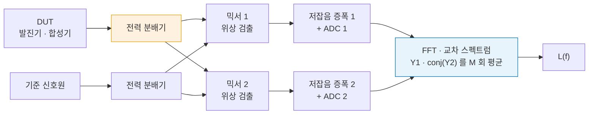
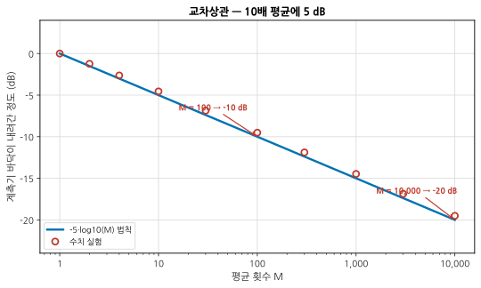
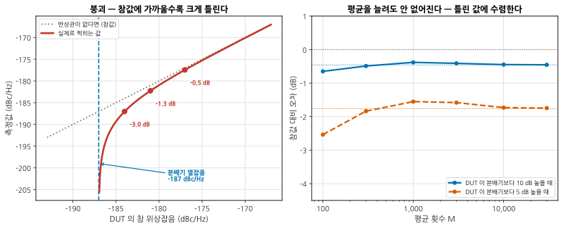
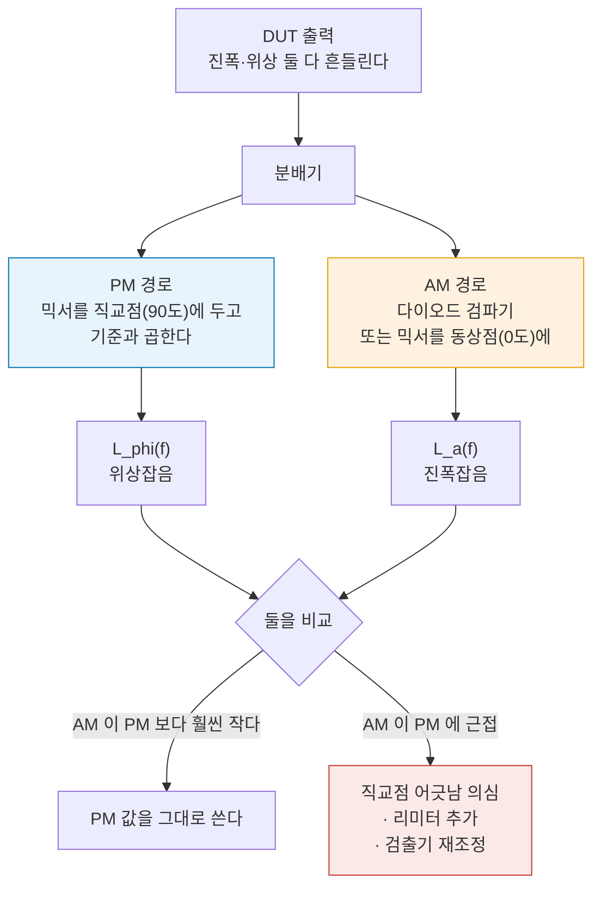
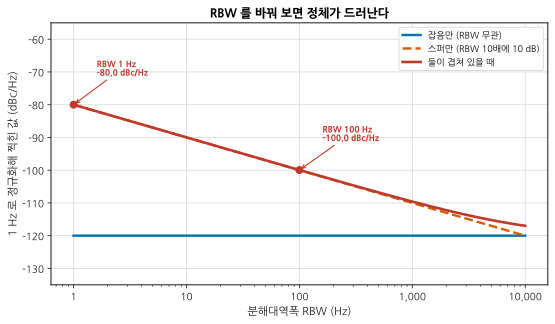
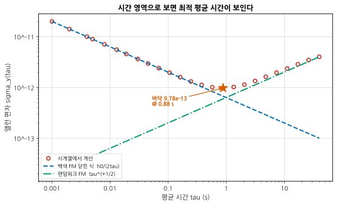
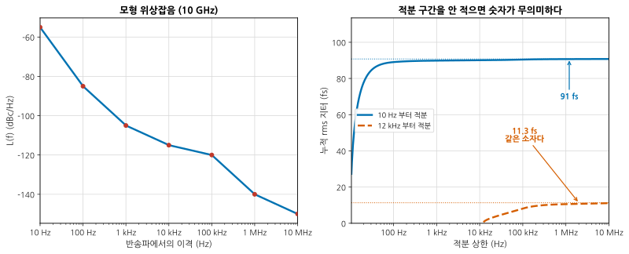

# B06 — 위상잡음과 지터: 상관 방식과 그 함정

**문서 번호**: RF-CUR-B06 · **버전**: v1.0 · **분량**: 이론 6 h + 실습 8 h

> 요즘 위상잡음 분석기는 자기 잡음보다 20 dB 낮은 값을 찍어 줍니다. 두 채널로 재서 평균하기 때문입니다. 그 마법에는 조건이 있고, 조건이 깨지면 **더 오래 평균할수록 더 확신을 갖고 틀린 값에 수렴합니다.** 이 모듈은 그 조건과, 값을 시간 영역으로 옮기는 법을 다룹니다.

| | |
|---|---|
| **선수 모듈** | [M09](../01_모듈/M09_주파수변환과신호원.md)(Leeson 모델·PLL), [M15](../01_모듈/M15_정밀측정2_잡음선형성위상잡음.md)(위상잡음 측정 3종), [B01](./B01_벤치방법론.md)(반복성), [B02](./B02_시간영역.md)(지터의 분해) |
| **이 모듈이 소유하는 개념** | **교차상관** 방식의 원리와 5·log₁₀(M) 법칙, 평균 횟수와 측정 시간의 절충, **교차 스펙트럼 붕괴**와 반상관 열잡음, AM 잡음과 PM 잡음의 분리, **잔류(부가) 위상잡음** 측정, **스퍼와 잡음의 판별**, **앨런 편차**, 위상잡음 ↔ 지터 환산과 **적분 구간**, 클럭 분배망의 부가 지터 |
| **이 모듈을 쓰는 후속 모듈** | **B09**(수신 감도 디버그), **B10**(시스템 디버그), **B11**(측정 시스템 분석), 심화 캡스톤 P2·P3 |
| **학습 목표** | ① 상관 방식이 언제 이득을 주고 언제 거짓말하는지 안다 ② 스퍼와 잡음을 절차로 가른다 ③ 위상잡음 곡선을 지터·앨런 편차로 옮기고 **적분 구간을 반드시 함께 적는다** |

---

## B06.0 이 모듈의 범위

기본 과정이 여기까지 왔습니다.

| 이미 배운 것 | 어디서 |
|---|---|
| 위상잡음의 정의, L(f), Leeson 모델 | [M09 §9](../01_모듈/M09_주파수변환과신호원.md) |
| 위상잡음이 시스템에 미치는 영향 (상호혼합·EVM) | [M09 §10](../01_모듈/M09_주파수변환과신호원.md) |
| 측정 3종 — 직접 스펙트럼·위상검출기·지연선 | [M15 §10](../01_모듈/M15_정밀측정2_잡음선형성위상잡음.md) |
| 지터의 분해 (RJ·DJ)와 배스터브 외삽 | [B02 §5](./B02_시간영역.md) |

**이 모듈은 그 위에 두 층을 얹습니다** — 요즘 장비가 쓰는 **상관 방식**의 원리와 함정, 그리고 주파수 영역의 곡선을 **시간 영역의 숫자**(지터·앨런 편차)로 옮기는 계산.

> ⚠️ **다른 모듈과의 역할 분리**
>
> | 개념 | B06 (여기) | 다른 모듈 |
> |---|---|---|
> | L(f) 의 정의·Leeson | 인용만 | [M09 §9](../01_모듈/M09_주파수변환과신호원.md)가 소유 |
> | 위상잡음의 시스템 영향 | 인용만 | [M09 §10](../01_모듈/M09_주파수변환과신호원.md)이 소유 |
> | 측정 3종의 셋업 | **상관 방식만 깊이** | [M15 §10](../01_모듈/M15_정밀측정2_잡음선형성위상잡음.md)이 세 방식을 소유 |
> | 지터의 RJ/DJ 분해 | 위상잡음에서 **환산**하는 쪽만 | [B02 §5](./B02_시간영역.md)가 시간 영역 분해를 소유 |
> | PLL 루프 설계 | **다루지 않습니다** | [M09 §8](../01_모듈/M09_주파수변환과신호원.md) |
> | 잡음지수 | **다루지 않습니다** | [B05](./B05_잡음파라미터.md) |

---

## B06.1 교차상관은 왜 바닥을 낮추는가

위상잡음 측정계는 자기 잡음이 있습니다. DUT 가 그보다 조용하면 잴 수 없습니다.

**교차상관**은 DUT 신호를 둘로 나눠 **독립적인 두 측정 채널**에 넣고, 두 채널 출력의 **교차 스펙트럼**을 평균합니다.

*그림 B06-1. 교차상관 위상잡음 측정계. **읽는 법**: 두 채널(믹서·증폭기·ADC)이 **완전히 독립**입니다. DUT 의 위상잡음은 두 채널에 **똑같이** 들어가고, 각 채널의 자기 잡음은 서로 **무관**합니다. 곱해서 평균하면 공통 성분만 남습니다. 주황색 **전력 분배기**를 기억해 두십시오 — §3 에서 이 부품이 문제를 일으킵니다.*

수학은 간단합니다. 두 채널의 출력을 Y₁ = s + n₁, Y₂ = s + n₂ 라고 하면

$$\langle Y_1 Y_2^{*}\rangle = \langle |s|^2 \rangle + \langle s n_2^{*}\rangle + \langle n_1 s^{*}\rangle + \langle n_1 n_2^{*}\rangle$$

s 와 n 은 무관하고 n₁ 과 n₂ 도 무관하므로, 평균 횟수 M 을 늘리면 뒤의 세 항이 0 으로 갑니다. **공통 성분만 남습니다.**

남는 잔여 바닥은 **1/√M** 로 줍니다. 전력으로 √M 이므로 dB 로는

$$\Delta = 5 \log_{10} M \ \text{[dB]}$$

*그림 B06-2. 평균 횟수와 바닥. **읽는 법**: 파란 선이 법칙, 동그라미가 수치 실험입니다. **10배 평균에 5 dB** 입니다. 100배를 평균해야 10 dB 를 얻고, 20 dB 를 얻으려면 **10 000 번**을 평균해야 합니다.*

| 평균 M | 바닥 하강 |
|---|---|
| 10 | 5 dB |
| 100 | 10 dB |
| 1 000 | 15 dB |
| 10 000 | 20 dB |

---

## B06.2 평균 횟수와 측정 시간의 절충

5·log₁₀(M) 은 **비싼 법칙**입니다. 5 dB 를 더 얻을 때마다 시간이 10배가 됩니다.

측정 시간은 대략 이렇습니다.

$$T \approx \frac{M}{f_{\text{최저 이격}}}$$

가장 낮은 이격 주파수의 한 주기가 한 번의 FFT 에 필요한 최소 시간이기 때문입니다.

| 최저 이격 | 원하는 하강 | 필요한 M | 대략의 시간 |
|---|---|---|---|
| 1 kHz | 10 dB | 100 | 0.1 초 |
| 1 kHz | 20 dB | 10 000 | 10 초 |
| 10 Hz | 10 dB | 100 | 10 초 |
| 10 Hz | 20 dB | 10 000 | **17 분** |
| 1 Hz | 20 dB | 10 000 | **2.8 시간** |

> 📌 **그래서 실무의 순서는 이렇습니다.** ① 짧은 평균으로 전체 모양을 본다 → ② 관심 구간만 좁혀서 길게 평균한다. 처음부터 1 Hz ~ 100 MHz 를 M = 10 000 으로 걸면 하루가 갑니다.

> ⚠️ **긴 측정에는 다른 위험이 붙습니다.** 17 분 동안 온도가 변하고, 케이블이 움직이고, 근처 장비가 켜졌다 꺼집니다. **평균을 늘려서 얻은 5 dB 를 환경 변화로 잃습니다.** [B01 §3](./B01_벤치방법론.md)의 워밍업·환경 통제가 여기서 값어치를 합니다.

---

## B06.3 붕괴 — 상관 방식이 거짓말을 하는 조건

앞 절의 유도에는 숨은 가정이 있습니다. **두 채널의 잡음이 서로 무관하다**는 것.

그런데 **전력 분배기**(그림 B06-1의 주황 상자)는 두 채널이 공유합니다. 분배기 안 저항의 열잡음은 두 출력에 **크기는 같고 위상은 반대로** 나옵니다.

Y₁ = s + c + n₁, Y₂ = s − c + n₂ 로 놓으면

$$\langle Y_1 Y_2^{*}\rangle = S_{s} - S_{c}$$

**빼집니다.** 그리고 이것은 평균으로 안 없어집니다 — 상관이 있는 성분이니까요.

*그림 B06-3. 붕괴. **읽는 법**: 왼쪽에서 회색 점선이 참값, 굵은 붉은 선이 실제로 찍히는 값입니다. DUT 가 조용해서 분배기 열잡음(파란 세로선, −187 dBc/Hz)에 가까워질수록 **아래로 꺾여 떨어집니다.** 참값이 분배기보다 3 dB 위면 3.0 dB 낮게, 0.5 dB 위면 **9.6 dB 낮게** 찍힙니다. 오른쪽은 평균을 늘려 본 것입니다 — 계측기 잡음은 평균으로 사라지지만 **오차는 그대로 남아 틀린 값에 수렴합니다.***

| DUT 참값이 분배기 열잡음보다 | 측정 오차 |
|---|---|
| +0.5 dB | **−9.6 dB** |
| +1 dB | −6.9 dB |
| +3 dB | −3.0 dB |
| +6 dB | −1.3 dB |
| +10 dB | −0.5 dB |
| +20 dB | −0.04 dB |

> ⚠️ **이 오차는 항상 "너무 좋게" 나옵니다.** 실제보다 조용하다고 나옵니다. **좋은 결과가 나왔을 때 의심해야 하는 드문 경우**입니다.

### 분배기 열잡음이 얼마인지 계산하기

$$L_{\text{분배기}} = kT/P_{\text{반송파}} - 3\ \text{dB} = -174 - P_{\text{dBm}} - 3\ \text{[dBc/Hz]}$$

−3 dB 는 열잡음의 절반만 위상 쪽으로 가기 때문입니다(나머지 절반은 진폭).

| 분배기 입력 전력 | 등가 위상잡음 |
|---|---|
| 0 dBm | −177 dBc/Hz |
| **+10 dBm** | **−187 dBc/Hz** |
| +20 dBm | −197 dBc/Hz |

> 📌 **대응은 셋입니다.**
>
> 1. **반송파 전력을 올린다.** 10 dB 올리면 등가 위상잡음이 10 dB 내려갑니다. 가장 쉽고 가장 효과가 큽니다.
> 2. **분배기를 식힌다.** 연구용으로는 액체 헬륨 온도(4 K)까지 내려 반상관 성분을 없앤 보고가 있습니다. 벤치의 선택지는 아닙니다.
> 3. **분배기 없는 구성**을 쓴다. 두 개의 기준 신호원을 쓰는 방식 등.

> ⚠️ **붕괴를 알아채는 절차** (심화 규칙 3)
>
> | 확인 | 붕괴라면 |
> |---|---|
> | 분배기 입력 전력을 3 dB 올리고 다시 잰다 | **측정값이 내려가야 하는데 오히려 조용해 보이던 곳이 올라온다** |
> | 평균을 10배 늘린다 | 값이 안 변한다 (진짜 바닥이면 내려간다) |
> | 교차 스펙트럼의 **실수부 부호**를 본다 | 음수 구간이 생긴다 |
> | 계산한 −174 − P − 3 과 비교한다 | 측정값이 그 근처면 의심 |
>
> **첫 줄이 벤치에서 가장 빠릅니다.** 전력을 바꿔 값이 따라 움직이면 DUT 를 본 것이 아닙니다.

---

## B06.4 전력 분배기의 반상관 열잡음 — 왜 이런 일이 생기는가

저항성 분배기의 등가 회로를 보면 답이 나옵니다. 두 출력 사이에는 저항이 있고, 그 저항의 열잡음 전압은 **한쪽 출력에서는 +, 다른 쪽에서는 −** 로 나타납니다. 회로가 대칭이므로 크기는 같습니다.

| 성분 | 채널 1 | 채널 2 | 교차 평균에서 |
|---|---|---|---|
| DUT 위상잡음 | +s | +s | **남는다** (원하는 것) |
| 분배기 저항 열잡음 | +c | **−c** | **빼진다** (문제) |
| 채널 1 자기 잡음 | +n₁ | 0 | 사라진다 |
| 채널 2 자기 잡음 | 0 | +n₂ | 사라진다 |

세 번째와 네 번째 줄이 상관 방식이 노린 것이고, **두 번째 줄이 덤으로 따라온 것**입니다.

> 📌 **분배기 종류에 따라 정도가 다릅니다.** 저항성 분배기는 손실(−6 dB)이 크고 반상관도 큽니다. 윌킨슨 분배기는 손실이 작지만 격리 저항이 같은 역할을 합니다. **어느 쪽이든 열잡음은 있습니다** — 크기가 다를 뿐입니다.

> ⚠️ **AM 잡음도 같은 경로로 들어옵니다.** 열잡음의 나머지 절반은 진폭 쪽입니다. 위상 검출기가 AM 을 완벽히 배제하지 못하면 그것도 섞입니다 — 다음 절입니다.

---

## B06.5 AM 잡음이 섞여 들어올 때

위상 검출기(믹서)는 **직교점**에서 동작할 때만 순수한 위상 검출기입니다. 직교에서 벗어나면 AM 잡음이 출력에 새어 나옵니다.

*그림 B06-4. AM 과 PM 을 나눠 재는 구성. **읽는 법**: 같은 신호를 두 갈래로 나눠 한쪽은 직교점(90°)에서, 다른 쪽은 동상점(0°)에서 검출합니다. **AM 잡음을 따로 재 두는 것이 이 그림의 목적**입니다. 그래야 PM 측정에 얼마나 섞여 들어올 수 있는지 알 수 있습니다.*

| 언제 AM 이 문제가 되는가 | 왜 |
|---|---|
| 포화하지 않은 증폭기 뒤 | 리미팅이 없어 AM 이 살아 있다 |
| 전원 리플이 있는 발진기 | 진폭과 위상을 함께 흔든다 |
| 믹서 구동 레벨이 낮을 때 | 직교점이 흐려진다 |
| DUT 의 PM 이 아주 낮을 때 | 상대적으로 AM 이 커 보인다 |

> 📌 **대응은 리미터입니다.** PM 경로에 포화 증폭기나 리미터를 넣어 진폭 변동을 눌러 버립니다. 그러면 AM→PM 변환이 새로 생길 수 있으니, **리미터를 넣기 전후로 값이 달라지는지** 확인하십시오. 달라지면 둘 중 하나는 틀린 것입니다.

---

## B06.6 잔류 위상잡음 — 부품 하나가 더하는 몫

여기까지는 신호원 **자체**의 위상잡음이었습니다. 실무에서는 다른 질문이 더 자주 옵니다. **"이 증폭기를 넣으면 위상잡음이 얼마나 나빠지는가?"**

이것이 **잔류(부가) 위상잡음**입니다. 측정법이 다릅니다.

| | 절대 위상잡음 | 잔류 위상잡음 |
|---|---|---|
| 무엇을 재는가 | 신호원의 위상 흔들림 | **부품이 더하는** 위상 흔들림 |
| 기준 | 별도의 조용한 기준 신호원 | **같은 신호원**을 둘로 나눠 한쪽만 DUT 통과 |
| 신호원 잡음 | 그대로 나온다 | **상쇄된다** (두 경로에 공통) |
| 얻을 수 있는 바닥 | 기준 신호원이 한계 | 훨씬 낮다 |

핵심 구성은 이렇습니다. 신호원을 둘로 나눠 한쪽은 DUT 를, 다른 쪽은 같은 지연의 케이블을 지나게 하고, 두 경로를 위상 검출기에서 만나게 합니다. 신호원의 위상잡음은 **두 경로에 공통이라 상쇄**되고, DUT 가 더한 몫만 남습니다.

> ⚠️ **잔류 측정이 거짓말하는 조건** (심화 규칙 3)
>
> | 조건 | 결과 | 확인법 |
> |---|---|---|
> | **두 경로의 지연이 다름** | 신호원 잡음이 덜 상쇄된다. 상쇄량은 지연 차에 달렸다 | DUT 자리를 같은 길이 케이블로 바꿔 바닥을 잰다 |
> | 직교점이 안 잡힘 | AM 이 섞인다 (§5) | 직류 오프셋을 0 으로 맞춘다 |
> | DUT 가 온도로 위상이 흐름 | 아주 낮은 이격에서 값이 튄다 | 워밍업 ([B01 §3](./B01_벤치방법론.md)) |
> | 전원에서 잡음이 들어옴 | 전원 리플 주파수에 스퍼가 선다 | 배터리 구동으로 바꿔 본다 |
> | 케이블이 움직임 | 낮은 이격에서 바닥이 올라간다 | 고정하고 다시 |
>
> **첫 줄을 먼저 하십시오.** DUT 를 빼고 케이블로 대체해 잰 값이 **측정계의 바닥**입니다. 그것을 모르면 DUT 의 값인지 계측기의 값인지 알 수 없습니다 — [B04 §6](./B04_대신호.md)의 NPR 과 같은 규칙입니다.

---

## B06.7 스퍼인가 잡음인가 — 판별 절차

화면에 뾰족한 것이 하나 있습니다. **스퍼(이산 주파수 성분)인가, 잡음이 뭉친 것인가?**

가르는 방법은 **분해대역폭(RBW)을 바꿔 보는 것**입니다.

| | RBW 를 100배 넓히면 |
|---|---|
| **잡음** | 들어오는 전력이 100배 → 1 Hz 로 정규화하면 **그대로** |
| **스퍼** | 들어오는 전력이 그대로 → 1 Hz 로 정규화하면 **20 dB 낮아 보인다** |

*그림 B06-5. RBW 를 바꿔 본다. **읽는 법**: 파란 수평선이 잡음만 있을 때 — **RBW 를 만 배 바꿔도 −120 dBc/Hz 그대로**입니다. 주황 파선이 스퍼만 있을 때 — RBW 10배마다 10 dB 씩 내려가 보입니다. 붉은 굵은 선이 둘이 겹쳐 있을 때인데, RBW 1 Hz 에서는 스퍼가 −80 dBc/Hz 로 보이고 RBW 100 Hz 에서는 −100 dBc/Hz 로 보입니다. **정체가 뭔지 모르는 값을 dBc/Hz 로 적으면 안 되는 이유**입니다.*

### 판별 절차

1. **RBW 를 10배 바꾼다.** dBc/Hz 값이 10 dB 움직이면 스퍼다.
2. **평균 횟수를 늘린다.** 잡음은 매끈해지고 스퍼는 그대로 뾰족하다.
3. **주파수를 정확히 읽는다.** 전원(50/60 Hz 와 그 배수), 스위칭 주파수, 기준 주파수, PLL 비교 주파수 — 아는 숫자와 맞는가.
4. **DUT 전원을 배터리로 바꾼다.** 사라지면 전원에서 온 것이다.
5. **DUT 를 빼고 잰다.** 그대로 있으면 계측기나 환경의 것이다.

> 📌 **스퍼는 dBc 로, 잡음은 dBc/Hz 로 적습니다.** 스퍼를 dBc/Hz 로 적으면 그 값이 RBW 에 의존하므로 다른 사람이 재현할 수 없습니다. 규격서도 스퍼는 dBc 로 요구합니다.

---

## B06.8 시간 영역으로 — 앨런 편차

주파수 영역의 L(f) 는 "이격 주파수마다 얼마나 흔들리는가"를 말합니다. 시간 영역에서는 다른 질문을 합니다. **"τ 초 동안 평균하면 주파수가 얼마나 안정한가?"**

**앨런 편차** σ_y(τ) 가 그 답입니다.

$$\sigma_y^2(\tau) = \frac{\left\langle \left(x_{i+2m} - 2x_{i+m} + x_i\right)^2 \right\rangle}{2\tau^2}$$

x 는 시간 오차(위상을 초로 환산한 것), τ = m·τ₀ 입니다.

> 📌 **왜 표준편차가 아니라 이것인가.** 보통의 표준편차는 랜덤워크가 섞이면 **측정 시간이 길어질수록 커져서** 수렴하지 않습니다. 앨런 편차는 연속한 두 구간의 **차이**를 보므로 그런 발산 성분에서도 유한한 값이 나옵니다.

*그림 B06-6. 백색 FM 과 랜덤워크 FM 이 섞인 신호원. **읽는 법**: 왼쪽 절반은 τ 가 커질수록 좋아집니다(기울기 −1/2) — 평균이 잡음을 지우는 구간입니다. 오른쪽 절반은 τ 가 커질수록 나빠집니다(기울기 +1/2) — 표류가 지배하는 구간입니다. **별표가 최적 평균 시간**입니다. 그보다 오래 평균하면 오히려 나빠집니다. 동그라미는 시계열에서 계산한 값이고 선은 닫힌 식입니다.*

| 잡음 유형 | L(f) 기울기 | σ_y(τ) 기울기 |
|---|---|---|
| 백색 PM | 0 | τ⁻¹ |
| 깜빡임 PM | −10 dB/dec | ≈ τ⁻¹ |
| **백색 FM** | **−20 dB/dec** | **τ⁻¹ᐟ²** |
| 깜빡임 FM | −30 dB/dec | 상수 (바닥) |
| **랜덤워크 FM** | **−40 dB/dec** | **τ⁺¹ᐟ²** |

두 영역을 잇는 다리는 이것입니다.

$$S_\phi(f) = 2L(f), \qquad S_y(f) = \left(\frac{f}{f_0}\right)^2 S_\phi(f)$$

백색 FM 이면 S_y = h₀ 로 상수이고, 그때 σ_y²(τ) = h₀/(2τ) 입니다. **주파수 영역에서 잰 곡선으로 시간 영역 안정도를 예측할 수 있습니다.**

> 📌 **최적 평균 시간을 아는 것이 실무의 쓸모입니다.** "몇 초 평균해서 주파수를 읽을 것인가"의 답이 이 곡선의 바닥입니다. 그림의 예에서는 **0.88 초**입니다. 10 초 평균하면 오히려 나빠집니다.

---

## B06.9 위상잡음을 지터로 환산하기

디지털 쪽 사람은 dBc/Hz 를 안 씁니다. **피코초**로 물어봅니다.

$$\sigma_\phi^2 = 2\int_{f_1}^{f_2} L(f)\, df \ \text{[rad}^2\text{]}, \qquad
t_{\text{jitter}} = \frac{\sigma_\phi}{2\pi f_0}$$

*그림 B06-7. 같은 곡선, 두 개의 답. **읽는 법**: 왼쪽이 모형 위상잡음(10 GHz), 오른쪽이 누적 지터입니다. **10 Hz 부터 적분하면 91 fs, 12 kHz 부터 적분하면 11.3 fs 입니다.** 같은 소자, 같은 곡선, 8배 차이. 어느 쪽도 틀리지 않았습니다 — **구간을 안 적었을 때만 틀립니다.***

| 적분 구간 | rms 지터 |
|---|---|
| 10 Hz ~ 10 MHz | **90.8 fs** |
| 12 kHz ~ 20 MHz (통신 규격의 흔한 구간) | **11.3 fs** |

구간별 기여를 보면 이유가 보입니다.

| 구간 | 지터 기여 | 전력 비중 |
|---|---|---|
| 10 ~ 100 Hz | 89.1 fs | 96.3 % |
| 100 Hz ~ 1 kHz | 12.0 fs | 1.8 % |
| 1 ~ 10 kHz | 6.1 fs | 0.4 % |
| 10 ~ 100 kHz | 8.3 fs | 0.8 % |
| 100 kHz ~ 1 MHz | 6.8 fs | 0.6 % |
| 1 ~ 10 MHz | 3.4 fs | 0.1 % |

> ⚠️ **적분 구간 없는 지터 값은 숫자가 아닙니다.** (심화 규칙 3) 데이터시트를 볼 때도, 보고서를 쓸 때도 구간을 먼저 확인하십시오. 두 제품을 비교하는데 구간이 다르면 비교가 아닙니다.

### 스퍼는 따로 더한다

스퍼는 잡음이 아니므로 적분이 아니라 개별로 더합니다.

$$\sigma_{\phi,\text{스퍼}}^2 = 2 \cdot 10^{L_{\text{스퍼}}/10}$$

| 스퍼 크기 | 10 GHz 에서의 지터 기여 |
|---|---|
| −80 dBc | 2.3 fs |
| −70 dBc | 7.1 fs |
| −60 dBc | 22.5 fs |

**−60 dBc 짜리 스퍼 하나가 12 kHz ~ 20 MHz 전체 잡음의 두 배를 더합니다.** 스퍼를 무시하면 안 되는 이유입니다.

---

## B06.10 클럭 분배망 — 좋은 기준을 망치는 법

아주 좋은 기준 발진기를 사 놓고 보드에서 망치는 일이 흔합니다. 분배망의 각 단이 **부가 지터**를 더합니다.

| 단 | 전형적 부가 지터 (12 kHz ~ 20 MHz) | 주의 |
|---|---|---|
| 팬아웃 버퍼 | 50 ~ 200 fs | 전원 잡음이 그대로 지터가 된다 |
| 클럭 분배 IC | 100 ~ 500 fs | 채널 간 스큐도 함께 본다 |
| 분주기 | 20 log₁₀(N) 만큼 **위상잡음이 내려간다** | 분주는 지터를 줄인다 |
| 체배기 | 20 log₁₀(N) 만큼 **올라간다** | 체배는 지터를 키운다 |
| 전송선·커넥터 | 거의 0 | 반사가 있으면 결정성 지터 ([B02](./B02_시간영역.md)) |

부가 지터는 **전력으로 더합니다.**

$$t_{\text{총}} = \sqrt{t_{\text{기준}}^2 + t_1^2 + t_2^2 + \cdots}$$

> 📌 **분주와 체배의 20·log₁₀(N).** 주파수를 N 배로 체배하면 위상 흔들림도 N 배가 되어 L(f) 가 20·log₁₀(N) dB 올라갑니다. 100 MHz 를 10 GHz 로 체배하면 **40 dB** 입니다. 그래서 고주파 합성기의 위상잡음은 기준의 것보다 항상 나쁩니다. 거꾸로 분주하면 그만큼 좋아집니다 — 단, **분주기 자신의 바닥** 아래로는 못 갑니다.

> ⚠️ **전원이 가장 흔한 범인입니다.** 버퍼의 전원 잡음 제거비(PSRR)가 나쁘면 전원 리플이 그대로 스퍼가 됩니다. §7 의 절차 4번(배터리로 바꿔 보기)이 여기서 답을 줍니다. 이 이야기는 **B09**(전원·바이어스가 RF 로 새는 경로)에서 이어집니다.

---

## B06.L 실습

> **등급 표기**: **T0** = 계산기·PC 만으로 · **T1** = 기본 계측기 · **T2** = 전문 장비. 등급 정의는 [설계서 §7](./00_심화과정_설계서.md) 참조.

### L-B06-a (T0) — 평균 횟수에 따른 바닥 하강 시뮬레이션

**목표**: 5·log₁₀(M) 을 직접 만들어 본다.

1. `scripts/gen_fig_b06.py` 의 `xcorr_sim()` 을 참고해 두 채널 모형을 짠다.
2. DUT 성분을 0 으로 두고 M 을 1 → 10 000 으로 늘리며 잔여 바닥을 잰다.
3. 법칙과 겹치는지 확인한다.
4. DUT 성분을 계측기 잡음보다 **10 dB 낮게** 넣고, 몇 번 평균해야 그 값이 드러나는지 본다.

**보고**: 2·3번 그림, 4번의 필요한 M.

**막히면**: 4번의 답은 대략 "잔여 바닥이 DUT 보다 낮아질 때"입니다. 10 dB 를 벌어야 하니 M ≈ 100 이 필요합니다.

### L-B06-b (T0) — 반상관 잡음을 넣어 붕괴 재현

**목표**: §3 의 그림을 직접 만들고, **평균이 답이 아니라는 것**을 확인한다.

1. 두 채널 모형에 `+c` / `−c` 성분을 추가한다.
2. DUT 대 분배기 비를 0 → 20 dB 로 바꿔 가며 측정값을 그린다. 닫힌 식과 맞는가?
3. 비를 3 dB 로 고정하고 M 을 100 → 30 000 으로 늘린다. 오차가 줄어드는가?
4. 반송파 전력을 10 dB 올리는 효과를 모형에 넣어 확인한다.

**보고**: 2번 곡선, 3번의 결론 한 문장, 4번의 개선량.

**막히면**: 3번에서 오차가 안 줄어드는 것이 정답입니다. 상관이 있는 성분은 평균의 대상이 아닙니다.

### L-B06-c (T2) — 상관 방식과 단일 채널을 비교

**목표**: 실물에서 상관의 이득과 그 한계를 함께 본다.

**필요**: 교차상관 지원 위상잡음 분석기, 신호원 2대(하나는 DUT, 하나는 기준).

1. 조용한 신호원을 DUT 로 두고 **단일 채널** 모드로 잰다. 이것이 계측기 바닥이다.
2. 상관 모드로 M = 10 / 100 / 1000 / 10000 을 각각 잰다.
3. 하강량이 5·log₁₀(M) 과 맞는가? 어디부터 안 맞는가?
4. 분배기 입력 전력을 3 dB 올려 다시 잰다. 아주 낮은 곡선 부분이 **올라오면** 붕괴였다.
5. 측정 시간을 함께 기록한다.

**보고**: M 별 곡선 겹쳐 그리기, 3번의 이탈 지점, 4번 판정, 시간 표.

**막히면**: 3번에서 큰 M 부터 안 맞는 것이 보통입니다. 붕괴이거나 환경 변화입니다 — 4번으로 가르십시오.

### L-B06-d (T0) — 위상잡음 곡선 → rms 지터 적분기 작성

**목표**: 데이터시트 곡선을 숫자로 옮기는 도구를 만든다.

1. 꺾은점 목록을 입력받아 L(f) 를 만드는 함수를 짠다.
2. 구간별 **닫힌 식**으로 적분하는 함수와, 세밀한 격자의 **수치 적분**을 둘 다 짜고 대조한다.
3. 적분 하한을 10 Hz / 1 kHz / 12 kHz 로 바꿔 가며 결과를 표로 만든다.
4. 스퍼를 하나 추가해 기여를 더한다.
5. 같은 곡선을 앨런 편차로도 옮겨 본다 (백색 FM 구간만).

**보고**: 2번의 일치 여부, 3번 표, 4·5번 결과.

**막히면**: 2번에서 기울기가 정확히 −1(dec당 −10 dB)인 구간은 적분이 로그 형태가 되어 일반식이 0으로 나눕니다. 그 경우를 따로 처리하십시오.

> ⚠️ **T0 대체로 못 얻는 것**
>
> | 못 얻는 것 | 왜 |
> |---|---|
> | 직교점 조정과 AM 누설 | 실제 믹서가 필요하다 |
> | 케이블 움직임·온도가 만드는 낮은 이격 잡음 | 모형에 환경이 없다 |
> | 측정 시간의 실감 | 17분을 기다려 봐야 안다 |
> | 실제 분배기의 반상관 크기 | 부품마다 다르다 |
> | 스퍼의 정체 추적 | 보드와 전원이 있어야 한다 |

---

## B06.Q 확인 문제

<b>Q1.</b> 상관 평균을 100회에서 10 000회로 늘렸습니다. 바닥이 얼마나 내려갑니까? 시간은 얼마나 더 듭니까?

**바닥은 10 dB 내려가고, 시간은 100배 듭니다.**

5·log₁₀(10000) − 5·log₁₀(100) = 20 − 10 = **10 dB**. 그런데 M 이 100배이므로 측정 시간도 100배입니다.

| M | 하강 | 최저 이격 1 kHz 일 때의 시간 | 최저 이격 10 Hz 일 때 |
|---|---|---|---|
| 100 | 10 dB | 0.1 초 | 10 초 |
| 10 000 | 20 dB | 10 초 | **17 분** |

**5 dB 를 더 얻을 때마다 시간이 10배**라는 것이 이 법칙의 실무적 의미입니다.

그리고 시간이 길어지면 새 문제가 생깁니다(§2). 17분 동안 온도가 흐르고 케이블이 움직이면, 평균으로 번 5 dB 를 환경으로 잃습니다. **긴 평균은 관심 구간만 좁혀서 하십시오.**

<b>Q2.</b> 위상잡음 분석기가 100 kHz 이격에서 −186 dBc/Hz 를 찍었습니다. 분배기 입력 전력은 +10 dBm 입니다. 이 값을 믿습니까?

**믿지 마십시오. 붕괴 영역입니다.**

+10 dBm 반송파의 분배기 열잡음 등가 위상잡음은 −174 − 10 − 3 = **−187 dBc/Hz** 입니다. 측정값 −186 은 그보다 **겨우 1 dB 위**입니다.

§3 의 표를 보면 그 조건에서 측정값은 참값보다 **6.9 dB 낮게** 찍힙니다. 즉 참값은 −186 이 아니라 −179 dBc/Hz 근처일 가능성이 큽니다.

확인 절차는 이렇습니다.

1. **분배기 입력 전력을 +13 dBm 으로 올린다.** 등가 열잡음이 −190 으로 내려가므로, 참값이 −179 라면 이제 11 dB 위가 되어 오차가 0.4 dB 로 줍니다. **측정값이 −186 에서 −179 쪽으로 올라와야 정상입니다.**
2. 값이 안 변하면 붕괴가 아니었던 것이고, 크게 올라오면 붕괴였습니다.
3. 평균을 10배 늘려 봅니다. 진짜 바닥이면 내려가고, 붕괴면 그대로입니다.

**"좋은 값이 나왔는데 왜 의심하느냐"** 는 질문이 나올 수 있습니다. 붕괴의 오차는 **언제나 좋은 쪽으로만** 납니다. 그래서 의심해야 합니다.

<b>Q3.</b> 10 kHz 이격에 뾰족한 것이 있습니다. 스퍼입니까?

**RBW 를 바꿔 보면 30초 안에 답이 나옵니다.**

RBW 를 10배 넓히고 다시 읽습니다.

| 결과 | 판정 |
|---|---|
| dBc/Hz 값이 **10 dB 낮아졌다** | **스퍼** |
| dBc/Hz 값이 **그대로다** | 잡음이 뭉친 것 |
| 어중간하게 3~7 dB | 둘이 겹쳐 있다. RBW 를 더 좁혀 가른다 |

스퍼로 판정됐다면 정체를 찾습니다.

1. **주파수를 정확히 읽는다.** 10 kHz 라면 — PLL 비교 주파수? 스위칭 전원의 하모닉? 팬 회전수?
2. **DUT 전원을 배터리로** 바꿔 본다. 사라지면 전원.
3. **DUT 를 빼고** 잰다. 남으면 계측기나 환경.
4. 근처 장비를 하나씩 꺼 본다.

그리고 **적는 단위를 바꿔야 합니다.** 스퍼는 dBc 로 적습니다(§7). dBc/Hz 로 적으면 RBW 에 따라 값이 달라져 재현되지 않습니다.

지터로 환산할 때도 따로 더합니다(§9). −60 dBc 짜리 하나가 10 GHz 에서 22.5 fs 를 더합니다 — 무시할 크기가 아닙니다.

<b>Q4.</b> A 사 제품은 "지터 90 fs", B 사 제품은 "지터 12 fs" 라고 합니다. B 가 7배 좋습니까?

**적분 구간을 확인하기 전에는 알 수 없습니다.**

§9 의 예제가 정확히 이 상황이었습니다. **같은 소자, 같은 곡선**인데 적분 구간에 따라 90.8 fs 와 11.3 fs 가 나왔습니다.

| 적분 구간 | 값 |
|---|---|
| 10 Hz ~ 10 MHz | 90.8 fs |
| 12 kHz ~ 20 MHz | 11.3 fs |

두 회사가 다른 구간을 썼다면 이 숫자만으로는 비교가 안 됩니다.

**해야 할 일**은 이렇습니다.

1. 두 데이터시트에서 **적분 구간**을 찾는다. 안 적혀 있으면 문의한다.
2. 가능하면 **L(f) 곡선**을 받아 우리 구간으로 다시 적분한다.
3. 우리 시스템이 실제로 신경 쓰는 구간이 어디인지 정한다 — 클럭 복원 루프의 대역폭이 하한을 정하고, 표본화 대역폭이 상한을 정한다.
4. **스퍼가 포함됐는지**도 확인한다(§9). 곡선만 적분하고 스퍼를 뺀 값일 수 있다.

그리고 3번이 실은 가장 중요합니다. **우리에게 의미 있는 구간**에서 비교해야 합니다. 클럭 복원 루프가 1 MHz 대역이면 그보다 낮은 이격의 잡음은 루프가 따라가 버려 지터로 나타나지 않습니다.

<b>Q5.</b> 100 MHz 기준 발진기를 10 GHz 로 체배했더니 위상잡음이 데이터시트보다 훨씬 나쁩니다. 합성기가 불량입니까?

**아닐 가능성이 큽니다. 체배는 원리적으로 위상잡음을 올립니다.**

주파수를 N 배로 체배하면 위상 흔들림도 N 배가 되어 L(f) 가 **20·log₁₀(N)** dB 올라갑니다.

100 MHz → 10 GHz 는 N = 100 이므로 **40 dB** 입니다.

| | 100 MHz 에서 | 10 GHz 에서 (이론) |
|---|---|---|
| 1 kHz 이격 | −140 dBc/Hz | **−100 dBc/Hz** |
| 10 kHz 이격 | −155 dBc/Hz | −115 dBc/Hz |

측정값이 이 이론값 근처면 정상입니다. 그보다 나쁘면 다음을 봅니다.

1. **체배기·합성기 자신의 바닥.** 체배 회로도 잡음을 더합니다. 그 바닥 아래로는 못 갑니다.
2. **PLL 루프 대역 안팎이 다르게 움직입니다.** 루프 대역 안은 기준을 따라가고(체배된 기준 잡음), 밖은 VCO 잡음이 지배합니다([M09 §8](../01_모듈/M09_주파수변환과신호원.md)).
3. **전원 잡음.** §10 의 이야기입니다.
4. **측정 자체.** 10 GHz 에서 −100 dBc/Hz 는 계측기에 어렵지 않지만, 기준 신호원이 DUT 보다 조용해야 합니다.

**확인법**: 같은 합성기를 1 GHz 로 출력해 재고 20·log₁₀(10) = 20 dB 를 더해 보십시오. 10 GHz 측정값과 맞으면 체배 관계가 성립하는 것이고, 정상입니다.

<b>Q6.</b> 주파수 카운터로 10초씩 평균해 읽는데 값이 자꾸 흐릅니다. 100초 평균하면 나아집니까?

**앨런 편차 곡선을 봐야 압니다. 나빠질 수도 있습니다.**

§8 의 그림이 이 질문의 답입니다. σ_y(τ) 곡선에는 **바닥**이 있습니다.

- 바닥 **왼쪽**(짧은 τ)에서는 잡음이 지배하므로 **더 평균할수록 좋아집니다**.
- 바닥 **오른쪽**(긴 τ)에서는 표류가 지배하므로 **더 평균할수록 나빠집니다**.

그림의 예에서 바닥은 **0.88 초**였습니다. 그 신호원이라면 10초 평균은 이미 바닥을 지난 것이고, 100초는 더 나쁩니다.

**해야 할 일**.

1. 앨런 편차를 τ = 0.01 ~ 100 초로 재서 바닥이 어디인지 찾는다.
2. 그 τ 로 카운터 게이트 시간을 맞춘다.
3. 바닥보다 오른쪽에서 나빠지는 것이 **랜덤워크**인지 **선형 표류**인지 가른다. 선형 표류라면 빼면 되고, 랜덤워크라면 못 뺀다.
4. 온도가 원인인 표류라면 항온이 답이다 ([B01 §3](./B01_벤치방법론.md)).

그리고 한 가지 더. **카운터 자신의 안정도**가 DUT 보다 나쁘면 지금 보고 있는 것은 카운터입니다. 기준 입력에 더 좋은 기준을 물려 보고 값이 바뀌는지 확인하십시오.

---

## B06.A 이 모듈의 축약어

| 약어 | 영문 원어 | 한글 |
|---|---|---|
| DUT | Device Under Test | 피시험 소자 (→ M04) |
| PM | Phase Modulation | 위상 변조 (여기서는 위상잡음) |
| AM | Amplitude Modulation | 진폭 변조 (여기서는 진폭잡음) |
| FM | Frequency Modulation | 주파수 변조 (여기서는 주파수 잡음) |
| RBW | Resolution Bandwidth | 분해대역폭 (→ M05) |
| ADEV | Allan Deviation | 앨런 편차 |
| FFT | Fast Fourier Transform | 고속 푸리에 변환 (→ M05) |
| ADC | Analog to Digital Converter | 아날로그-디지털 변환기 (→ M11) |
| PLL | Phase Locked Loop | 위상 고정 루프 (→ M09) |
| VCO | Voltage Controlled Oscillator | 전압 제어 발진기 (→ M09) |
| PSRR | Power Supply Rejection Ratio | 전원 잡음 제거비 |
| RJ / DJ | Random / Deterministic Jitter | 무작위 · 결정성 지터 (→ B02) |
| RF | Radio Frequency | 무선 주파수 (→ M01) |

---

## B06.S 출처

> ⚠️ **원문 확인 권고**: 아래 주소는 검색 결과로 교차확인한 것이며 원문을 직접 열어 보지는 못했습니다. 중요한 수치는 원문에서 확인하십시오.

| 주장 | 등급 | 출처 |
|---|---|---|
| 교차 스펙트럼 측정에서 전력 분배기의 열잡음이 두 채널에 **크기는 같고 위상은 반대로** 나타나, 교차 스펙트럼의 부분적 또는 완전한 붕괴를 일으킨다 | A | [NIST — 교차 스펙트럼 측정에서의 분배기 열잡음 상관](https://tf.nist.gov/general/pdf/2853.pdf) · [NIST — 분배기 반상관 열잡음에 의한 교차 스펙트럼 붕괴](https://tf.boulder.nist.gov/general/pdf/2844.pdf) |
| 이 반상관 효과는 분배기를 액체 헬륨 온도(4 K)까지 냉각해 없앨 수 있다 | A | [NIST — 극저온 분배기로 붕괴 효과를 줄인 위상잡음 측정](https://www.nist.gov/publications/phase-noise-measurements-cryogenic-power-splitter-minimize-cross-spectral-collapse) · [arXiv — 열잡음 한계 발진기의 교차 스펙트럼 측정](https://arxiv.org/pdf/1512.06160) |
| 위상잡음을 rms 지터로 옮기려면 관심 대역에서 적분해 위상 흔들림 전력을 구한 뒤 2πf₀ 로 나눈다 | A | [Analog Devices MT-008 — 발진기 위상잡음을 시간 지터로](https://www.analog.com/media/en/training-seminars/tutorials/mt-008.pdf) · [Marki Microwave — 위상잡음-지터 계산기](https://markimicrowave.com/technical-resources/tools/phase-noise-jitter-calculator/) |
| 앨런 편차는 단기 안정도의 표준 척도이며, 백색 FM 잡음에서는 σ_y(τ) 가 τ⁻¹ᐟ² 로 떨어진다 | A | [Analog Devices AN-1067 — 위상잡음과 지터의 전력 스펙트럼 밀도](https://www.analog.com/en/resources/app-notes/an-1067.html) · [Microwave Journal — 위상잡음·지터·단기 안정도의 상호관계](https://www.microwavejournal.com/articles/39449-the-trinity-of-inaccuracy-phase-noise-jitter-and-short-term-stability-what-everyone-should-know-about-their-measurement-and-interrelationships?page=3) |
| 앨런 분산은 전 주파수 대역에 대한 적분으로 쓸 수 있어 주파수 영역과 시간 영역이 연결된다 | B | [Wikipedia — Modified Allan variance](https://en.wikipedia.org/wiki/Modified_Allan_variance) · [arXiv — 실리콘 나노공진기의 주파수 요동](https://arxiv.org/pdf/1506.08135) |

**본문의 숫자는 전부 계산입니다.** `python3 scripts/gen_fig_b06.py` 를 실행하면 인용값이 출력되고 자체 검산 27항목이 함께 돕니다. 교차검증은 네 갈래입니다.

1. **교차상관 바닥** — 두 채널을 그대로 흉내낸 수치 실험과 5·log₁₀(M) 법칙을 M = 1 ~ 10 000 에서 대조. 최대 차 0.53 dB
2. **붕괴** — 수치 실험과 닫힌 식(측정값 = S_dut − S_분배기)을 네 조건에서 대조. 차 0.25 dB 이내
3. **앨런 편차** — **주파수 영역**의 L(f) 에서 얻은 h₀ 로 예측한 값과 **시간 영역** 시계열(2²¹ 표본)에서 계산한 값을 대조. 차 0.1 %. 두 기울기(−1/2, +1/2)도 함께 확인
4. **지터 적분** — 구간별 멱함수 닫힌 식과 40만 점 사다리꼴 적분을 세 구간에서 대조. 차 0.2 % 이내

§9 의 위상잡음 곡선과 §8 의 시계열은 **합성한 모형**입니다. 90.8 fs 나 0.88 초를 실물의 기대값으로 옮기지 마십시오. 다만 §3 의 붕괴 관계식과 §9 의 적분 구간 의존성은 **모형과 무관한 성질**이라 그대로 적용됩니다.

---

## 변경 이력

| 버전 | 일자 | 내용 |
|---|---|---|
| v1.0 | 2026-08-28 | 최초 작성. 그림 7종(생성 5 + Mermaid 2), 실습 4종, 확인 문제 6문항. 자체 검산 27항목 통과. 집필 중 두 번 고쳤다 — ① 처음 쓴 위상잡음 모형은 근접 잡음이 워낙 커서 10 Hz~1 kHz 가 지터의 98.6 %를 차지했고, 누적 곡선이 초반에 수직으로 올라갔다 사라지는 밋밋한 그림이 됐다. 모형을 실제 합성기에 가깝게 고치고, 그림도 **적분 하한을 둘로 두어 비교하는** 형태로 바꿨다 — 덕분에 "같은 소자 8배 차이"라는 §9 의 결론이 그림에서 바로 읽힌다 ② 앨런 편차 그림의 로그 눈금이 mathtext 로 그려져 지수의 마이너스가 빈 네모가 됐다. `rf_style.plain_log()` 를 양 축에 걸어 해결 |
