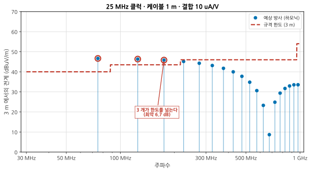
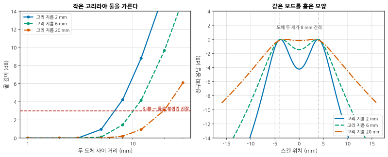
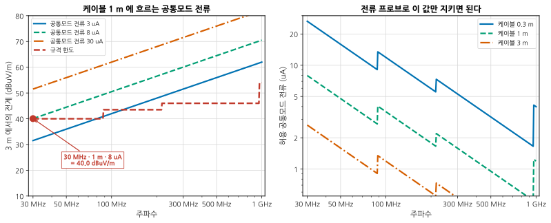
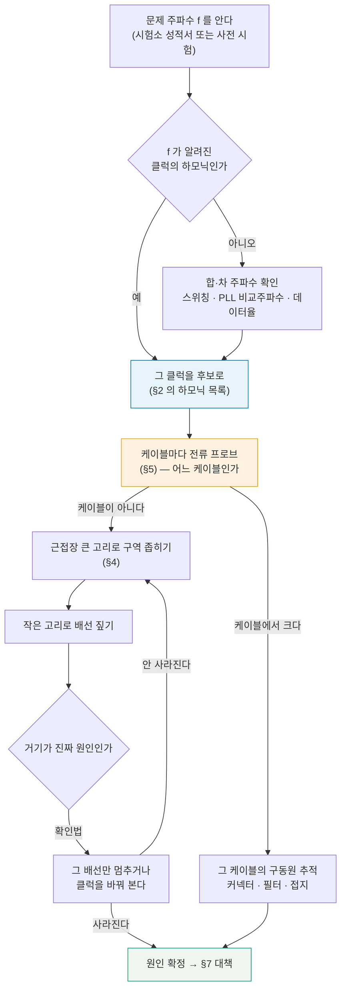
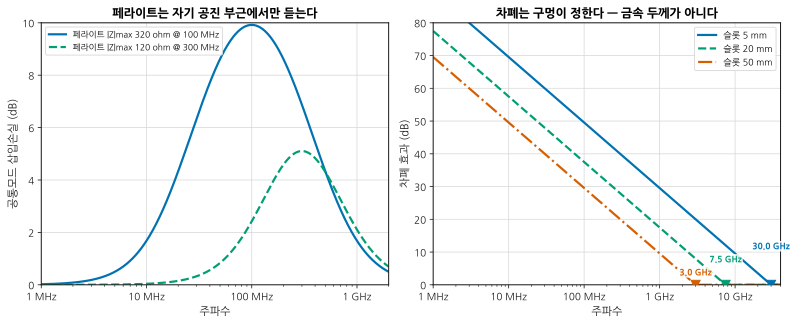

# B07 — EMC 벤치 디버그: 방사원을 찾아내는 법

**문서 번호**: RF-CUR-B07 · **버전**: v1.0 · **분량**: 이론 5 h + 실습 8 h

> 시험소에서 "217 MHz 에서 6 dB 초과" 라는 한 줄을 받아 왔습니다. 그 한 줄에는 **어디서 나오는지가 없습니다.** 이 모듈은 벤치에서 그 자리를 찾아내고, 고치고, 고쳤다는 것을 확인하는 절차입니다.

| | |
|---|---|
| **선수 모듈** | [M17](../01_모듈/M17_보드설계와인증.md)(보드 설계·인증 규격), [M05](../01_모듈/M05_첫측정.md)(스펙트럼 분석기), [B01](./B01_벤치방법론.md)(실험 설계·기록), [B02](./B02_시간영역.md)(상승시간) |
| **이 모듈이 소유하는 개념** | 사전 시험의 쓸모와 한계, **하모닉 예측**(사다리꼴 포락선), **근접장 프로브**의 원리와 고리 크기-분해능 절충, **근접장 스캔 지도**, **전류 프로브와 공통모드 전류 한도**, 방사원 **추적 순서**, 대책 라이브러리와 **주파수 의존성**, 대책 부작용 확인, 시험소 결과와의 상관 |
| **이 모듈을 쓰는 후속 모듈** | **B10**(디센스와 공존), **B12**(양산 이관), 심화 캡스톤 P3 |
| **학습 목표** | ① 보드를 보기 전에 **어느 주파수가 문제일지 계산한다** ② 근접장·전류 프로브로 **자리를 짚는다** ③ 대책의 효과를 숫자로 적고 **부작용까지 확인한다** |

---

## B07.0 이 모듈의 범위

기본 과정이 여기까지 왔습니다.

| 이미 배운 것 | 어디서 |
|---|---|
| 어떤 규격이 왜 적용되는가, 인증 절차 | [M17 §14](../01_모듈/M17_보드설계와인증.md) |
| 스택업·귀환 경로·차폐캔·비아 펜스 설계 | [M17 §5](../01_모듈/M17_보드설계와인증.md) · [M17 §12](../01_모듈/M17_보드설계와인증.md) |
| 스펙트럼 분석기의 RBW·검출기·평균 | [M05 §4](../01_모듈/M05_첫측정.md) |
| 상승시간과 대역폭의 관계 | [B02 §1](./B02_시간영역.md) |
| 실험 하나에 변수 하나 | [B01 §5](./B01_벤치방법론.md) |

**이 모듈은 그 위에 하나를 얹습니다** — 설계가 끝나고 보드가 나온 뒤, **이미 나빠진 것을 찾아내는 절차**.

> ⚠️ **다른 모듈과의 역할 분리**
>
> | 개념 | B07 (여기) | 다른 모듈 |
> |---|---|---|
> | 규격의 종류와 적용 범위 | 한도 값만 인용 | [M17 §14](../01_모듈/M17_보드설계와인증.md)가 소유 |
> | 스택업·귀환 경로 설계 | **고칠 때의 선택지**로만 | [M17 §5](../01_모듈/M17_보드설계와인증.md)가 소유 |
> | 차폐캔·비아 펜스 | 대책 효과의 계산까지 | [M17 §12](../01_모듈/M17_보드설계와인증.md)가 설계를 소유 |
> | 상승시간 측정 | 인용만 | [B02 §1](./B02_시간영역.md)이 소유 |
> | 전원 잡음이 RF 로 새는 경로 | 방사만 | **B08**(전원·바이어스·열) |
> | 수신기가 자기 잡음에 먹히는 것 | **다루지 않습니다** | **B10**(디센스) |
> | 정식 인증 시험 대행 | **다루지 않습니다** | 시험소의 일 |

---

## B07.1 사전 시험은 정식 시험을 대신하지 못한다 — 그럼 왜 하는가

먼저 분명히 해 둡니다. **벤치의 사전 시험 결과로 인증을 받을 수 없습니다.**

| 정식 시험소 | 벤치 사전 시험 |
|---|---|
| 교정된 반무향실·개활지 | 잡음 가득한 사무실 |
| 교정된 안테나와 케이블, 사이트 감쇠 보정 | 대충 세워 둔 안테나 |
| 규격이 정한 거리·높이·회전 | 손이 닿는 대로 |
| **절대값이 맞다** | **절대값이 안 맞는다** |

그런데도 사전 시험을 하는 이유는 **절대값이 아니라 차이를 보기 위해서**입니다.

| 사전 시험이 답하는 것 | 답하지 못하는 것 |
|---|---|
| 대책 전후로 **몇 dB 좋아졌는가** | 규격을 통과하는가 |
| 어느 주파수가 튀는가 | 그 주파수의 정확한 레벨 |
| 어느 케이블·어느 부위에서 나오는가 | 안테나 편파·각도에 따른 최악값 |
| 고친 것이 다른 것을 망쳤는가 | — |

> 📌 **그래서 사전 시험의 기록 방식이 정해집니다.** 절대값을 적지 말고 **"같은 셋업에서 A 대비 B 가 −7.5 dB"** 로 적습니다. 셋업 사진을 찍고, 케이블 위치에 테이프로 표시를 남깁니다. [B01 §5](./B01_벤치방법론.md)의 "한 번에 하나만 바꾼다"가 EMC 에서는 특히 중요합니다 — 케이블을 5 cm 옮기면 10 dB 가 움직입니다.

---

## B07.2 원거리장 결과로는 원인을 못 찾는다

시험소 성적서에는 주파수와 레벨과 편파가 있습니다. **위치가 없습니다.**

그런데 보드를 보기 전에 **어느 주파수가 나올지는 계산할 수 있습니다.** 디지털 파형의 스펙트럼은 모양이 정해져 있기 때문입니다.

사다리꼴 클럭(진폭 A, 듀티 d, 주기 T, 상승시간 t_r)의 n 차 하모닉은

$$|c_n| = 2 A d \left| \operatorname{sinc}(n d) \right| \cdot \left| \operatorname{sinc}\!\left(n \frac{t_r}{T}\right) \right|$$

포락선이 **두 번 꺾입니다.**

| 구간 | 기울기 | 꺾이는 곳 |
|---|---|---|
| 낮은 쪽 | 0 dB/dec | — |
| 중간 | **−20 dB/dec** | 1/(π·d·T) |
| 높은 쪽 | **−40 dB/dec** | **1/(π·t_r)** |

25 MHz 클럭, 듀티 50 %, 상승시간 1.5 ns 라면 꺾임이 **15.9 MHz** 와 **212.2 MHz** 입니다.

*그림 B07-1. 보드를 보기 전에 그리는 그림. **읽는 법**: 막대가 클럭 하모닉이고 붉은 계단이 규격 한도입니다. **듀티 50 % 라 짝수 하모닉이 없어 홀수만 서 있습니다.** 세 개가 한도를 넘고 최악이 6.7 dB 입니다. 200 MHz 근처부터 기울기가 가팔라지는 것이 **1/(π·t_r) = 212 MHz** 의 두 번째 꺾임입니다. 전압 하모닉을 방사로 옮길 때는 §5 의 공통모드 식을 썼고, 결합 계수 10 µA/V 는 **실측으로 정해야 하는 값**이라 그림 제목에 밝혀 두었습니다.*

> 📌 **두 번째 꺾임이 설계의 손잡이입니다.** 상승시간을 1.5 ns 에서 3 ns 로 늦추면 꺾임이 212 MHz 에서 **106 MHz** 로 내려오고, 그 위의 하모닉이 전부 −20 dB/dec 만큼 더 떨어집니다. **직렬 저항 하나로 되는 일**이라 대책 목록의 첫 줄에 옵니다. 대신 신호 무결성을 확인해야 합니다([B02](./B02_시간영역.md)).

> ⚠️ **이 계산이 거짓말하는 조건** (심화 규칙 3)
>
> | 조건 | 결과 |
> |---|---|
> | 실제 파형이 사다리꼴이 아님 (오버슈트·링잉) | 링잉 주파수에 **없던 봉우리**가 선다 |
> | 듀티가 정확히 50 % 가 아님 | 짝수 하모닉이 살아난다. 49 % 만 돼도 보인다 |
> | 스프레드 스펙트럼 클럭(SSC)이 켜져 있음 | 봉우리가 퍼져 낮아 보인다. 총 에너지는 그대로 |
> | 클럭이 하나가 아님 | 두 클럭의 합·차 주파수에도 나온다 |
> | 결합 계수를 안 재고 가정함 | **절대 레벨이 틀린다.** 상대 비교에만 쓸 것 |
>
> 마지막이 이 그림의 쓰임을 정합니다. **"어느 주파수를 볼 것인가"의 목록**으로 쓰고, 레벨은 실측으로 채웁니다.

---

## B07.3 근접장 프로브 — 무엇을 재는 물건인가

근접장 프로브는 **안테나가 아닙니다.** 보드 바로 위에서 국소적인 장을 집어 오는 물건입니다.

| 종류 | 생김새 | 무엇에 반응하는가 | 어디에 쓰는가 |
|---|---|---|---|
| **자기장형(H)** | 작은 고리 | 고리를 지나는 **자속의 변화** = 전류 | 전류가 흐르는 배선·귀환 경로 |
| **전기장형(E)** | 짧은 침·원판 | 전위차 | 큰 전압 진폭, 방열판·차폐캔 |
| **전류 프로브** | 케이블을 물리는 집게형 코어 | 케이블에 흐르는 **총 전류** | 케이블 방사 (§5) |

대부분의 벤치 디버그는 **H 프로브**로 합니다. 방사의 원인이 대개 전류이기 때문입니다.

> 📌 **고리의 방향이 답을 바꿉니다.** 고리 면이 자기장과 수직일 때(자속이 고리를 통과할 때) 최대이고, 나란하면 거의 0 입니다. 그래서 **프로브를 돌려 가며** 최대점을 찾아야 하고, 값을 적을 때는 **방향도 함께 적어야** 합니다.

> ⚠️ **근접장 값으로 원거리장을 예측할 수 없습니다.** (심화 규칙 3) 근접장은 거리에 따라 1/r² ~ 1/r³ 로 떨어지고, 방사로 이어지는지는 **그 전류가 어떤 안테나 구조에 실리느냐**에 달렸습니다. 아주 센 근접장이 전혀 방사되지 않기도 하고(작은 고리, 잘 닫힌 귀환 경로), 약한 것이 케이블을 타고 크게 방사되기도 합니다. **근접장 프로브는 "어디"를 찾는 도구이지 "얼마"를 재는 도구가 아닙니다.**

---

## B07.4 프로브 크기와 분해능의 절충

프로브 고리의 지름이 두 가지를 동시에 정합니다.

| 고리가 크면 | 고리가 작으면 |
|---|---|
| **민감하다** (자속을 많이 모은다) | 둔하다. 전치증폭기가 필요할 수 있다 |
| 뭉개진다 — 어느 배선인지 못 가른다 | **가른다** |

*그림 B07-2. 8 mm 떨어진 도체 두 개를 훑었을 때. **읽는 법**: 오른쪽에서 2 mm 고리(파란 실선)는 가운데가 **4.2 dB 꺼져** 둘로 보이고, 20 mm 고리(주황)는 **0.2 dB** 밖에 안 꺼져 하나로 뭉쳐 보입니다. 왼쪽은 도체 간격을 바꿔 가며 그 골 깊이를 본 것입니다. **20 mm 고리는 20 mm 는 떨어져야 겨우 가릅니다.***

| 고리 지름 | 상대 감도 | 8 mm 간격의 골 깊이 |
|---|---|---|
| 2 mm | 1배 | **4.23 dB** (둘로 보인다) |
| 6 mm | 5.8배 | 1.46 dB (애매) |
| 20 mm | **31배** | 0.20 dB (하나로 보인다) |

보드 전체를 훑으면 이렇게 나옵니다.

*그림 B07-3. 같은 보드, 두 높이. **읽는 법**: 흰 선이 보드 위 도체이고 색이 자기장 세기입니다. 두 패널을 **같은 기준으로** 정규화했습니다 — 그래서 오른쪽이 흐릴 뿐 아니라 **어둡습니다.** 왼쪽(3 mm)에서는 가운데 짧은 구간이 유독 밝게 도드라지고 도체 하나하나가 구분되지만, 오른쪽(12 mm)에서는 전체가 뭉뚱그려져 **"보드 왼쪽 어딘가"** 밖에 알 수 없습니다.*

> 📌 **그래서 실무는 두 개를 번갈아 씁니다.** 큰 고리로 **보드의 어느 구역인지** 좁히고, 작은 고리로 **어느 배선인지** 짚습니다. 큰 것만 쓰면 못 짚고, 작은 것만 쓰면 찾는 데 오래 걸립니다.

높이도 같은 절충입니다.

> ⚠️ **높이 3 mm 와 12 mm 는 다른 측정입니다.** 이 모형에서 최대 \|H\| 가 **16.1 dB** 차이 났습니다. 그래서 스캔 높이를 안 적은 지도는 다음 사람이 재현할 수 없습니다. **스페이서를 대고 높이를 고정하십시오.**

---

## B07.5 전류 프로브 — 케이블이 안테나가 될 때

보드에서 나오는 방사보다 **케이블에서 나오는 방사가 대개 더 큽니다.** 케이블이 길기 때문입니다.

케이블에 흐르는 **공통모드 전류**가 만드는 원거리 전계는 닫힌 식으로 나옵니다.

$$E \ [\text{V/m}] = 1.257 \times 10^{-6} \cdot f \cdot I_{cm} \cdot L / d$$

f 는 Hz, I 는 A, L 은 케이블 길이(m), d 는 측정 거리(m) 입니다.

> 📌 **이 식은 미소 다이폴 원거리장 식의 정확히 2배입니다.** 그 2배가 **시험장 접지면의 반사**입니다. 자유공간이라면 절반이 됩니다. 계산에서 확인한 비가 2.0006 이었습니다.

*그림 B07-4. 케이블에 얼마나 흘려도 되는가. **읽는 법**: 왼쪽에서 붉은 점이 이 절의 기준점입니다 — **30 MHz, 케이블 1 m, 공통모드 전류 8 µA 가 정확히 한도 40 dBµV/m** 입니다. 오른쪽은 그것을 뒤집어 "얼마까지 흘려도 되는가" 로 그린 것입니다. 계단은 규격 한도가 바뀌는 자리입니다.*

| 케이블 길이 | 30 MHz 에서 허용되는 공통모드 전류 |
|---|---|
| 0.3 m | 26.5 µA |
| **1 m** | **8.0 µA** |
| 3 m | 2.7 µA |

**8 마이크로암페어.** 이것이 EMC 가 어려운 이유입니다. 신호 전류 100 mA 중 **1만분의 1** 이 공통모드로 새면 규격을 넘습니다.

> 📌 **전류 프로브가 근접장 프로브보다 실용적인 경우가 많습니다.** 값이 **절대량**이고(µA), 한도를 계산할 수 있고, 케이블마다 물려 보면 **어느 케이블인지** 바로 나옵니다. 사전 시험에서 안테나보다 먼저 잡는 도구입니다.

> ⚠️ **전류 프로브가 거짓말하는 조건** (심화 규칙 3)
>
> | 조건 | 결과 | 확인법 |
> |---|---|---|
> | 케이블 다발 중 일부만 물림 | 차동 성분이 안 상쇄돼 크게 나온다 | **전선 전부**를 한 번에 물린다 |
> | 프로브 위치가 전류 마디 | 실제보다 작게 나온다 | 케이블을 따라 **여러 지점**에서 잰다 |
> | 프로브 전달임피던스 보정 안 함 | dBµV 를 µA 로 못 옮긴다 | 성적서의 Z_T 로 나눈다 |
> | 케이블 끝단 조건이 실제와 다름 | 공진 주파수가 달라진다 | 실제 부하를 달고 잰다 |
> | 그라운드에 놓인 위치가 매번 다름 | 재현이 안 된다 | 테이프로 표시 ([B01](./B01_벤치방법론.md)) |
>
> 두 번째가 특히 잘 속입니다. 케이블 길이가 λ/2 의 배수면 전류 분포에 마디가 생겨, **하필 그 자리에서 재면 0 에 가깝게 나옵니다.**

---

## B07.6 추적 순서 — 스펙트럼에서 보드 위 한 점까지

*그림 B07-5. 추적 순서. **읽는 법**: 주황색 **전류 프로브가 근접장보다 먼저** 옵니다. 케이블이 범인일 확률이 높고, 확인이 빠르고, 값이 절대량이기 때문입니다. 초록색에 닿기 전에 반드시 J 를 거치십시오 — **끄면 사라지는가**가 원인 확정의 유일한 근거입니다.*

각 단계에서 남길 기록입니다.

| 단계 | 남기는 것 |
|---|---|
| 주파수 후보 | 클럭 목록과 차수, 계산한 예상 레벨 |
| 케이블 | 케이블 이름, 프로브 위치, µA 값 |
| 구역 | 스캔 높이, 고리 지름, 지도 이미지 |
| 배선 | 사진에 표시, 프로브 방향 |
| 확인 | 끄기 전후 값 |

---

## B07.7 대책과 그 효과 — 무엇이 몇 dB인가

대책마다 **듣는 주파수 범위가 다릅니다.** 이것이 EMC 대책의 가장 흔한 함정입니다.

*그림 B07-6. 페라이트와 차폐. **읽는 법**: 왼쪽에서 100 MHz 용 페라이트는 공진에서 **9.9 dB** 를 주지만 10 MHz 에서 1.7 dB, 1 GHz 에서도 1.7 dB 입니다. **위아래 모두 안 듣습니다.** 오른쪽은 차폐인데, 차폐 효과를 정하는 것은 금속 두께가 아니라 **구멍의 길이**입니다. 슬롯이 반파장이 되는 주파수(50 mm 면 3 GHz)에서 차폐 효과가 0 이 됩니다.*

| 대책 | 전형적 효과 | 듣는 범위 | 대가 |
|---|---|---|---|
| **직렬 저항으로 상승시간 늦추기** | 두 번째 꺾임 아래로 −20 dB/dec | 꺾임 위 전부 | 신호 무결성 |
| **페라이트 코어** | 공진에서 6~12 dB | 공진의 ±1 옥타브 정도 | 아래위로는 무효 |
| **공통모드 초크** | 10~25 dB | 코어 재질이 정함 | 차동 신호 열화 |
| **필터 (커패시터·π형)** | 20~40 dB | 차단 주파수 위 | 신호 대역 침범 |
| **차폐캔** | 20log₁₀(λ/2L) | **구멍이 정함** | 열·비용·조립 |
| **비아 펜스 촘촘히** | 5~15 dB | 간격이 λ/20 이하일 때 | 배선 공간 |
| **케이블 재배치·길이 변경** | 0~15 dB | 공진 위치가 옮겨감 | 재현성 나쁨 |
| **귀환 경로 복구 (슬롯 메우기)** | 10~20 dB | 넓게 듣는다 | 보드 개정 필요 |

> 📌 **차폐 효과의 식이 말하는 것.** SE ≈ 20·log₁₀(λ / 2L) 에서 L 은 **가장 긴 구멍의 길이**입니다. 구멍 **개수**가 아니라 **길이**입니다. 그래서 긴 슬롯 하나보다 **짧은 구멍 여러 개**가 낫습니다. 5 mm 슬롯은 300 MHz 에서 40 dB 를 주지만 50 mm 슬롯은 20 dB 밖에 못 줍니다.

> ⚠️ **페라이트를 "일단 끼워 보는" 습관의 문제.** (심화 규칙 3) 페라이트는 자기 공진 부근에서만 듣습니다. 217 MHz 문제에 100 MHz 용 페라이트를 끼우면 **거의 안 듣습니다.** 부품표에서 |Z| 곡선을 보고 **문제 주파수에서의 임피던스**를 확인한 뒤 고르십시오. 그리고 삽입손실은 회로 임피던스에 달렸습니다 — 공통모드 경로가 150 Ω 이라고 가정한 값이며, 실제로는 그보다 크거나 작습니다.

---

## B07.8 대책이 다른 것을 망치지 않았는지 확인

**EMC 대책은 거의 항상 다른 것을 건드립니다.**

| 대책 | 확인해야 할 것 | 어디서 |
|---|---|---|
| 직렬 저항으로 상승시간 늦춤 | 셋업·홀드 시간, 아이 다이어그램 | [B02 §4](./B02_시간영역.md) |
| 페라이트·초크 | 차동 신호의 삽입손실과 모드 변환 | [B03 §3](./B03_다포트차동과픽스처.md) |
| 전원선 필터 | **전원 임피던스 상승** → 과도 응답 악화 | **B08** |
| 차폐캔 | 캔 안의 **공동 공진**, 방열 악화 | [M17 §12](../01_모듈/M17_보드설계와인증.md) · **B08** |
| 접지 강화 | 접지 루프가 새로 생김 | [M17 §5](../01_모듈/M17_보드설계와인증.md) |
| 케이블 재배치 | 다른 주파수가 올라감 | §1 |

> ⚠️ **차폐캔이 만드는 새 문제.** 캔은 금속 상자이고 금속 상자는 **공진기**입니다. 공진 주파수는 대략 f = (c/2)·√((m/a)² + (n/b)²) 입니다. 20 × 15 mm 캔의 최저 공진은 **7.5 GHz** 근처라 대개 문제가 없지만, 60 × 40 mm 캔이면 **2.5 GHz** 로 내려와 Wi-Fi 대역에 걸립니다. 그 대역을 쓴다면 캔 안에 흡수체를 넣거나 칸막이를 넣어야 합니다.

**확인의 규칙은 하나입니다.** 대책 전후로 **EMC 만이 아니라 원래 성능도** 다시 재는 것. 그리고 [B01 §5](./B01_벤치방법론.md)대로 한 번에 하나만 바꿉니다 — 페라이트와 차폐를 동시에 넣으면 어느 쪽이 들었는지 영원히 모릅니다.

---

## B07.9 시험소 결과와 벤치 결과의 상관

사전 시험을 여러 번 하다 보면 질문이 옵니다. **"우리 벤치 값이 시험소 값과 얼마나 맞습니까?"**

답은 **주파수마다 다릅니다.** 그리고 그 관계를 데이터로 쌓아야 합니다.

| 쌓을 것 | 왜 |
|---|---|
| 같은 DUT 의 (벤치 값, 시험소 값) 짝 | 상관을 보려면 짝이 필요하다 |
| 주파수별로 나눠서 | 낮은 대역과 높은 대역의 오프셋이 다르다 |
| 셋업 사진과 케이블 배치 | 재현의 전제 |
| **개선량**의 짝 | 절대값보다 잘 맞는다 |

> 📌 **개선량이 절대값보다 훨씬 잘 맞습니다.** 벤치에서 −8 dB 를 얻었으면 시험소에서도 대개 −6 ~ −9 dB 가 나옵니다. 절대값은 사이트 감쇠·안테나 계수·주변 잡음 때문에 10 dB 넘게 어긋날 수 있지만, **같은 셋업에서의 차이는 그런 항들이 상쇄됩니다.** 사전 시험의 쓸모가 여기 있습니다.

> ⚠️ **상관 분석이 거짓말하는 조건** (심화 규칙 3)
>
> | 조건 | 결과 |
> |---|---|
> | 짝이 적다 (n < 10) | 상관계수가 아무 값이나 나온다 |
> | 벤치 값이 주변 잡음에 묻힘 | 낮은 대역(FM 방송·텔레비전)에서 특히 |
> | 시험소가 최악 각도·높이를 찾은 값 | 벤치는 한 각도만 봤다. 벤치가 낮게 나온다 |
> | DUT 동작 상태가 다름 | 규격이 정한 동작 모드인가 |
> | 시험소가 준첨두, 벤치가 첨두 | 준첨두가 낮게 나온다. 검출기를 맞춰라 |
>
> 마지막이 가장 흔한 실수입니다. **검출기와 RBW 를 규격대로 맞추지 않으면 비교 자체가 성립하지 않습니다** ([M05 §4](../01_모듈/M05_첫측정.md)).

---

## B07.L 실습

> **등급 표기**: **T0** = 계산기·PC 만으로 · **T1** = 기본 계측기 · **T2** = 전문 장비. 등급 정의는 [설계서 §7](./00_심화과정_설계서.md) 참조.

### L-B07-a (T0) — 하모닉 목록을 만들고 한도와 대조

**목표**: 보드를 보기 전에 **볼 곳의 목록**을 만든다.

1. 우리 보드의 클럭을 전부 적는다 (주파수, 진폭, 상승시간, 듀티).
2. 각각에 대해 §2 의 식으로 하모닉 포락선을 계산한다.
3. 두 번째 꺾임 1/(π·t_r) 이 어디인지 표시한다.
4. 규격 한도와 겹쳐 그려 **볼 주파수 목록**을 만든다.
5. 상승시간을 2배로 늦추면 목록이 어떻게 줄어드는지 계산한다.

**보고**: 클럭 표, 겹친 그림, 볼 주파수 목록(우선순위 포함), 5번의 효과.

**막히면**: 4번에서 하모닉이 너무 많으면 홀수만 보십시오. 듀티가 50 % 에 가까우면 짝수는 사실상 없습니다.

### L-B07-b (T1) — 근접장 프로브로 방사 지도 작성

**목표**: §4 의 그림을 실물에서 만든다.

**필요**: H 프로브 세트(최소 2 종), 스펙트럼 분석기, 전치증폭기(선택), 스페이서.

1. **높이를 고정할 스페이서**를 먼저 만든다(3 mm 두께 판).
2. 큰 고리로 보드를 격자로 훑어 구역을 좁힌다. 격자 간격 5 mm.
3. 좁혀진 구역을 작은 고리로 1 mm 간격 훑는다.
4. 프로브를 90° 돌려 다시 훑는다. 최대점이 옮겨 가는가?
5. 지도를 그리고 **높이·고리 지름·프로브 방향**을 함께 적는다.

**보고**: 두 해상도의 지도, 방향에 따른 차이, 짚은 배선의 사진.

**막히면**: 4번에서 최대점이 크게 옮겨 가면 전류 방향이 그 사이에서 꺾이는 것입니다. 귀환 경로를 의심하십시오.

### L-B07-c (T1) — 대책을 하나씩 적용하며 개선량 기록

**목표**: **한 번에 하나씩** 바꾸는 훈련.

**필요**: 전류 프로브 또는 근접장 프로브, 스펙트럼 분석기, 페라이트 여러 종, 구리 테이프.

1. 기준 상태를 3회 반복 측정해 산포를 먼저 안다 ([B01 §4](./B01_벤치방법론.md)).
2. 대책을 하나 적용하고, 대책을 뺀 뒤 다시 재고, 또 넣어 재는 식으로 반복한다.
3. 개선량이 1번의 산포보다 큰지 확인한다.
4. 페라이트를 **문제 주파수에서 |Z| 가 큰 것**과 **엉뚱한 것**으로 각각 해 본다.
5. 대책 후 원래 성능(신호 무결성 또는 RF 성능)도 다시 잰다.

**보고**: 산포, 대책별 개선량 표, 4번의 비교, 5번의 부작용 유무.

**막히면**: 3번에서 개선량이 산포에 묻히면 그 대책은 "효과 없음"이 아니라 **"이 측정으로는 판정 불가"** 입니다. 구분해서 적으십시오.

### L-B07-d (T0) — 사전 시험과 시험소 결과의 상관 분석

**목표**: 벤치 값을 얼마나 믿을지 데이터로 정한다.

1. 지금까지의 (벤치, 시험소) 짝을 모은다. 주파수·DUT·셋업을 함께.
2. 산점도를 그리고 주파수 대역별로 나눈다.
3. **절대값의 상관**과 **개선량의 상관**을 각각 구한다.
4. 대역별 오프셋(벤치 − 시험소)의 평균과 표준편차를 낸다.
5. "벤치에서 몇 dB 여유가 있어야 시험소를 통과하는가"를 답으로 낸다.

**보고**: 산점도, 3번의 두 상관계수 비교, 대역별 오프셋 표, 5번의 판정 기준.

**막히면**: 3번에서 개선량 쪽 상관이 더 높게 나오는 것이 정상입니다. 그것이 사전 시험의 존재 이유입니다.

> ⚠️ **T0 대체로 못 얻는 것**
>
> | 못 얻는 것 | 왜 |
> |---|---|
> | 프로브 방향에 따른 차이 | 손으로 돌려 봐야 안다 |
> | 케이블 5 cm 가 10 dB 를 움직이는 것 | 모형에는 환경이 없다 |
> | 주변 잡음 (FM 방송·조명·모니터) | 사무실에 가 봐야 안다 |
> | 대책의 부작용 | 실제 회로가 필요하다 |
> | 시험소와의 오프셋 | 데이터를 쌓아야 안다 |

---

## B07.Q 확인 문제

<b>Q1.</b> 시험소에서 217 MHz 가 6 dB 초과했습니다. 무엇부터 합니까?

**보드에 손대기 전에 계산부터 합니다.**

1. **217 MHz 가 무엇의 하모닉인지** 찾습니다. 보드의 클럭 목록을 놓고 나눠 봅니다.
   - 217 / 25 = 8.68 → 아니다
   - 217 / 31 = 7.0 → **31 MHz 의 7차** 가능성
   - 217 / 27.125 = 8.0 → 27.125 MHz 의 8차
   - 데이터율·스위칭 주파수·PLL 비교 주파수도 넣어 봅니다.
2. 후보가 나오면 §2 의 포락선으로 **그 차수의 예상 레벨**을 계산해 다른 하모닉과 비교합니다. 유독 그것만 튀면 **공진**이 얹힌 것입니다.
3. **케이블마다 전류 프로브**를 물려 217 MHz 성분을 잽니다(§5·§6). 어느 케이블이 큰가.
4. 케이블이 아니면 근접장으로 갑니다 — 큰 고리 → 작은 고리.
5. **후보를 끄거나 클럭을 바꿔** 사라지는지 확인합니다. 이것이 원인 확정의 근거입니다.

> 217 MHz 는 규격 한도가 216 MHz 에서 43.5 → 46 dBµV/m 로 바뀌는 자리 **바로 위**입니다. 1 MHz 차이로 한도가 2.5 dB 완화됩니다. 주파수를 아주 조금만 옮길 수 있다면 그것도 선택지입니다 — 정직한 대책은 아니지만 규격상 유효합니다.

<b>Q2.</b> 근접장 프로브로 아주 센 지점을 찾았습니다. 여기가 방사원입니까?

**아직 모릅니다.** 근접장이 세다고 방사가 되는 것은 아닙니다(§3).

근접장은 1/r² ~ 1/r³ 로 급히 떨어집니다. 방사가 되려면 그 전류가 **효율적인 안테나 구조**에 실려야 합니다. 흔한 두 경우가 정반대입니다.

| 상황 | 근접장 | 방사 |
|---|---|---|
| 잘 닫힌 차동 쌍, 귀환 경로가 바로 아래 | **세다** | 거의 없다 (고리 면적이 작다) |
| 약한 공통모드 전류가 긴 케이블에 실림 | 약하다 | **크다** (§5) |

확인하는 법.

1. 그 지점의 **주파수 성분**이 문제 주파수와 같은가. 다르면 무관합니다.
2. 그 지점을 **끄거나 가려** 보고 원거리(또는 전류 프로브) 값이 변하는가.
3. 그 전류가 어디로 이어지는가 — 케이블·커넥터·방열판으로 이어지면 유력합니다.

**"어디"를 찾는 도구이지 "얼마"를 재는 도구가 아니다** 를 기억하십시오.

<b>Q3.</b> 케이블에 페라이트를 끼웠는데 하나도 안 좋아졌습니다. 왜입니까?

**세 가지 중 하나입니다.**

**① 주파수가 안 맞는다.** 페라이트는 자기 공진 부근에서만 듣습니다. §7 의 계산에서 100 MHz 용 페라이트는 공진에서 9.9 dB 를 주지만 1 GHz 에서는 **1.7 dB** 밖에 안 줍니다. 부품표의 |Z| 곡선을 열어 **문제 주파수에서의 임피던스**를 확인하십시오.

**② 회로 임피던스가 페라이트보다 크다.** 삽입손실은 20·log₁₀(1 + Z_페라이트/Z_회로) 입니다. 공통모드 경로가 이미 1 kΩ 이라면 320 Ω 페라이트는 2.4 dB 밖에 못 줍니다. **큰 코어를 쓰거나 여러 번 감으십시오** — 감은 횟수의 제곱으로 임피던스가 올라갑니다.

**③ 방사원이 그 케이블이 아니다.** 전류 프로브로 **케이블마다** 확인했습니까? 다른 케이블이거나 보드 자체일 수 있습니다(§6).

확인 순서는 ③ → ① → ② 입니다. ③이 가장 흔하고 확인이 가장 빠릅니다.

<b>Q4.</b> 차폐캔을 씌웠는데 개선이 5 dB 뿐입니다. 더 두꺼운 금속을 써야 합니까?

**두께는 거의 관계없습니다. 구멍을 보십시오.**

차폐 효과는 SE ≈ 20·log₁₀(λ / 2L) 로, **가장 긴 구멍의 길이 L** 이 정합니다(§7). 30 MHz ~ 1 GHz 대역에서 금속판 자체의 차폐 효과는 100 dB 를 훌쩍 넘습니다. 5 dB 밖에 안 나온다면 새는 곳이 있는 것입니다.

확인할 곳.

| 곳 | 흔한 크기 | 300 MHz 에서의 SE |
|---|---|---|
| 방열 구멍 (긴 슬롯) | 30 mm | 24 dB |
| 캔 다리 사이 간격 | 20 mm | 28 dB |
| 커넥터 개구부 | 15 mm | 30 dB |
| **캔을 뚫고 나가는 배선** | — | **차폐가 무의미해짐** |

마지막이 결정적입니다. 캔 안에서 밖으로 나가는 배선이 필터 없이 지나가면, 그 배선이 **캔 안의 잡음을 밖으로 실어 나릅니다.** 차폐와 필터는 함께 가야 합니다.

그리고 대책 후 확인할 것(§8): 캔 안의 **공동 공진**과 **방열 악화**입니다. 60 × 40 mm 캔의 최저 공진이 2.5 GHz 근처이니 그 대역을 쓴다면 흡수체나 칸막이가 필요합니다.

<b>Q5.</b> 벤치 사전 시험에서는 통과인데 시험소에서 떨어졌습니다. 벤치 측정이 틀린 겁니까?

**틀린 게 아니라 다른 것을 잰 겁니다.** 사전 시험은 절대값을 맞히는 물건이 아닙니다(§1).

시험소가 더 나쁘게 나오는 흔한 이유들입니다.

| 이유 | 벤치에서 놓치는 것 |
|---|---|
| **최악 조건 탐색** | 시험소는 안테나 높이 1~4 m, DUT 360° 회전, 두 편파를 전부 훑어 **최악값**을 적는다. 벤치는 한 조건만 봤다 |
| 사이트 감쇠와 접지면 반사 | 반사가 보강되는 각도에서 최대 6 dB 더 나온다 |
| 케이블 배치 | 규격이 정한 배치(1 m 늘어뜨림 등)와 벤치가 다르다 |
| 검출기 | 벤치가 첨두, 시험소가 준첨두면 **시험소가 더 낮게** 나와야 하는데 반대라면 다른 원인이다 |
| DUT 동작 모드 | 규격이 요구하는 최대 방사 모드로 돌렸는가 |
| 주변 잡음 | 벤치의 잡음 바닥에 문제 신호가 **묻혀** 안 보였을 수 있다 |

**할 일**은 이렇습니다.

1. 시험소 성적서에서 **최악 조건**(각도·높이·편파)을 받아 벤치에서 그 조건에 가깝게 재현합니다.
2. 그 주파수를 **전류 프로브**로 케이블마다 확인합니다 — 벤치 안테나보다 훨씬 민감합니다.
3. 앞으로를 위해 §9 의 상관 데이터를 쌓고, **"벤치에서 몇 dB 여유"** 를 판정 기준으로 정합니다. 흔히 6~10 dB 를 둡니다.

<b>Q6.</b> 클럭 하모닉이 문제라 상승시간을 늦추려 합니다. 직렬 저항을 얼마로 넣습니까?

**두 가지 제약 사이에서 정합니다.**

**① EMC 쪽 요구.** §2 의 두 번째 꺾임이 1/(π·t_r) 입니다. 문제 주파수 f_p 를 −40 dB/dec 구간에 넣으려면

$$t_r > \frac{1}{\pi f_p}$$

217 MHz 가 문제라면 t_r > 1.47 ns 입니다. 여유를 두어 2~3 ns 를 목표로 합니다.

**② 신호 무결성 쪽 한계.** 상승시간은 **유효 비트 시간의 20~30 %** 를 넘으면 안 됩니다. 25 MHz 클럭(주기 40 ns)이면 여유가 크지만, 데이터선이라면 계산이 필요합니다([B02 §4](./B02_시간영역.md)).

**저항값**은 부하 용량과 함께 정해집니다. t_r ≈ 2.2·R·C 이므로

| 목표 t_r | 부하 15 pF 일 때 R |
|---|---|
| 2 ns | 61 Ω |
| 3 ns | 91 Ω |

여기서 출력 임피던스(보통 20~50 Ω)를 빼야 하니 실제로는 33~68 Ω 정도를 넣게 됩니다.

**넣은 뒤 반드시 확인할 것**(§8).

1. 수신단에서의 **셋업·홀드 시간**
2. 아이 다이어그램 — 링잉이 줄었는지, 새로 생겼는지
3. 저항을 **드라이버 쪽에 바짝** 붙였는지 (직렬 종단의 조건)
4. EMC 개선량 — 계산대로 나왔는가

4번이 계산과 다르면 방사원이 그 클럭이 아니었을 수 있습니다. §6 으로 돌아가십시오.

---

## B07.A 이 모듈의 축약어

| 약어 | 영문 원어 | 한글 |
|---|---|---|
| EMC | Electromagnetic Compatibility | 전자파 적합성 (→ M17) |
| EMI | Electromagnetic Interference | 전자파 간섭 (→ M17) |
| DUT | Device Under Test | 피시험 소자 (→ M04) |
| CISPR | Comité International Spécial des Perturbations Radioélectriques | 국제 무선장해 특별위원회 (→ M17) |
| FCC | Federal Communications Commission | (미국 연방통신위원회) (→ M17) |
| LISN | Line Impedance Stabilization Network | 선로 임피던스 안정화 회로망 |
| RBW | Resolution Bandwidth | 분해대역폭 (→ M05) |
| SSC | Spread Spectrum Clocking | 스프레드 스펙트럼 클럭 |
| PLL | Phase Locked Loop | 위상 고정 루프 (→ M09) |
| SE | Shielding Effectiveness | 차폐 효과 |
| RF | Radio Frequency | 무선 주파수 (→ M01) |

---

## B07.S 출처

> ⚠️ **원문 확인 권고**: 아래 주소는 검색 결과로 교차확인한 것이며 원문을 직접 열어 보지는 못했습니다. 중요한 수치는 원문에서 확인하십시오.

| 주장 | 등급 | 출처 |
|---|---|---|
| H 프로브는 고리 크기에서 감도와 공간 분해능이 상충한다 — 큰 고리는 민감하지만 어느 배선인지 못 가르고, 작은 고리는 가르는 대신 전치증폭기가 필요할 수 있다 | B, B | [In Compliance — 근접장 프로브로 방사를 해석하기](https://incompliancemag.com/emc-bench-notes-interpreting-emissions-using-a-near-field-probe/) · [R&S — 근접장 프로브 고르는 법](https://www.rohde-schwarz.com/us/products/test-and-measurement/essentials-test-equipment/rs-essentials-digital-oscilloscopes/how-to-choose-a-near-field-probe_256877.html) |
| 고리는 자기장이 고리를 통과할 때(신호에 90°) 최대, 나란할 때 최소로 반응한다. 큰 고리로 먼저 좁히고 작은 고리로 짚는 순서를 쓴다 | B, B | [In Compliance — 근접장 프로브](https://incompliancemag.com/emc-bench-notes-interpreting-emissions-using-a-near-field-probe/) · [Siglent — 근접장·전류 프로브를 쓴 EMC 문제 해결](https://siglentna.com/application-note/electromagnetic-compliance-troubleshooting-near-field-current-probes/) |
| 케이블의 공통모드 전류는 원거리 전계와 직접 관계되며, 도체의 전류를 재면 방사 세기를 추정할 수 있다. 공통모드는 귀환이 접지망을 통하므로 큰 방사 고리를 만들어, 작은 전류로도 큰 방사가 된다 | B, C | [In Compliance — 케이블의 차동·공통모드 전류 측정](https://incompliancemag.com/measuring-differential-and-common-mode-current-radiation-from-cables/) · [Wikipedia — Common mode current](https://en.wikipedia.org/wiki/Common_mode_current) |
| 1 m 케이블·3 m 거리·30 MHz 에서 전계 100 µV/m 에 해당하는 공통모드 전류는 8 µA 이다 | B, B | [In Compliance — 차동·공통모드 전류 측정](https://incompliancemag.com/measuring-differential-and-common-mode-current-radiation-from-cables/) · [LearnEMC — 케이블 공통모드 EMI 계산기](https://learnemc.com/ext/calculators/mremc/cmode.php) |
| Class B 기기는 30 MHz ~ 1 GHz 를 3 m 거리에서 시험하는 것이 일반적이다 | B, B | [Interference Technology — 1/3/5/10/30 m 방사 측정](https://interferencetechnology.com/emc-radiated-emission-measurements-1351030-meters/) · [Elite — CISPR 11 시험 입문](https://www.elitetest.com/blog/emc-emi-testing/introduction-to-cispr-11-emc-testing/) |
| 전류 프로브는 전도·방사 시험 모두에서 케이블의 전류를 재는 데 쓰이며, 전달임피던스로 전압 읽음값을 전류로 옮긴다 | B, B | [AllPCB — 전도·방사 시험에서의 전류 프로브](https://www.allpcb.com/allelectrohub/current-probe-use-in-conducted-and-radiated-testing) · [Siglent — 근접장·전류 프로브](https://siglentna.com/application-note/electromagnetic-compliance-troubleshooting-near-field-current-probes/) |
| 오실로스코프 기반 EMI 디버그는 시간 영역과 주파수 영역을 함께 보며 원인을 좁히는 데 쓴다 | B, B | [R&S — 오실로스코프로 EMI 디버그하기](https://www.rohde-schwarz.com/us/products/test-and-measurement/essentials-test-equipment/rs-essentials-digital-oscilloscopes/understanding-emi-debugging_254516.html) · [R&S — 오실로스코프용 EMC 근접장 프로브](https://www.rohde-schwarz.com/us/products/test-and-measurement/oscilloscope-probes/emc-near-field-probes-for-oscilloscopes_63493-73798.html) |

**본문의 숫자는 전부 계산입니다.** `python3 scripts/gen_fig_b07.py` 를 실행하면 인용값이 출력되고 자체 검산 26항목이 함께 돕니다. 교차검증은 네 갈래입니다.

1. **클럭 스펙트럼** — 실제 사다리꼴 파형의 FFT 와 포락선 닫힌 식을 홀수 하모닉 40개까지 대조. 차 0.0000 dB. 두 구간의 기울기도 −20.6 / −39.9 dB/dec 로 확인
2. **프로브 자속** — 고리 안을 수치 적분한 값과 무한 직선 도체의 닫힌 식 Φ = μ₀IL/(2π)·ln(r₂/r₁) 을 세 조건에서 대조. 차 10⁻⁶ 이내
3. **공통모드 방사** — 실무 닫힌 식과 미소 다이폴 원거리장 식의 비가 **2.0006** (접지면 반사 2배). 그리고 계측 문헌의 사례(30 MHz·1 m·8 µA)를 100.6 µV/m 로 재현
4. **페라이트 삽입손실** — 병렬 RLC 회로 계산과 임피던스 비 근사 20·log₁₀(1+Z/Z_sys) 를 공진점에서 대조. 차 0.1 dB 이내

§1 의 결합 계수(10 µA/V), §3 의 보드 배선, §7 의 페라이트 모형은 **합성한 값**입니다. 여기서 나온 절대 레벨을 실물의 기대값으로 옮기지 마십시오 — 특히 §1 의 그림은 **볼 주파수의 목록**을 만드는 데 쓰는 것이지 통과 여부를 예측하는 것이 아닙니다. 반면 §2 의 포락선 꺾임, §5 의 공통모드 식, §7 의 차폐 효과 식은 **모형과 무관한 관계식**이라 그대로 적용됩니다.

---

## 변경 이력

| 버전 | 일자 | 내용 |
|---|---|---|
| v1.0 | 2026-08-27 | 최초 작성. 그림 6종(생성 5 + Mermaid 1), 실습 4종, 확인 문제 6문항. 자체 검산 26항목 통과. 집필 중 두 번 고쳤다 — ① §1 그림의 "예상 방사"를 처음에는 근거 없는 결합 모형(−60 dB 후 주파수 비례)으로 그렸다. §5 에서 검증한 공통모드 방사 식으로 바꾸고, 결합 계수를 그림 제목에 드러냈다. 두 절이 같은 식을 쓰게 되어 앞뒤가 맞는다 ② 스캔 지도의 두 패널을 각자의 최대값으로 정규화해, 12 mm 스캔이 3 mm 만큼 밝게 보였다. 레벨 차 16.1 dB 가 사라진 그림이었다. 같은 기준으로 정규화해 **흐려지는 것과 약해지는 것이 함께** 보이게 고쳤다 |
