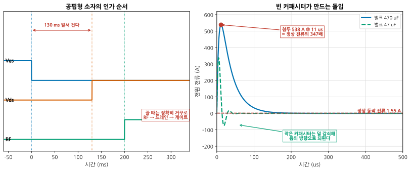
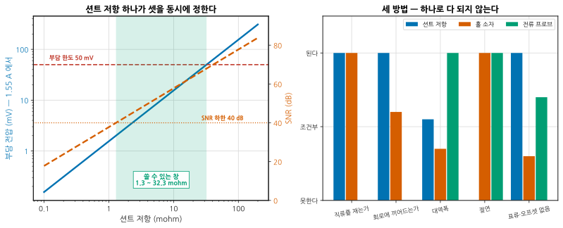
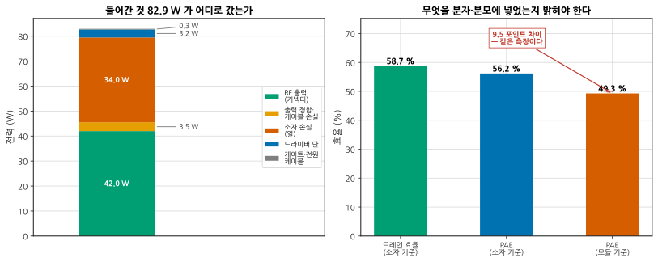
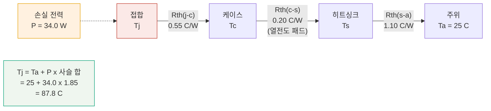
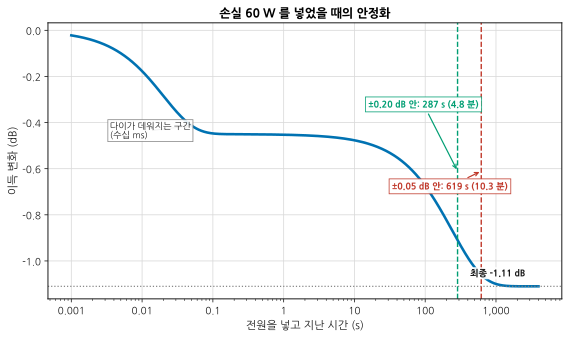
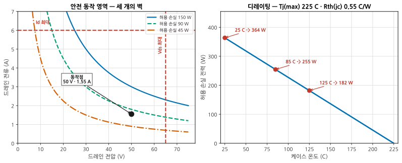

# B08 — 전원·바이어스·열: 벤치에서 재는 법

**문서 번호**: RF-CUR-B08 · **버전**: v1.0 · **분량**: 이론 5 h + 실습 8 h

> RF 엔지니어가 소자를 죽이는 방법은 대개 두 가지입니다. **켜는 순서를 틀리거나**, **식기 전에 재거나.** 이 모듈은 전원을 넣는 순간부터 값을 적을 때까지의 절차입니다.

| | |
|---|---|
| **선수 모듈** | [M08](../01_모듈/M08_증폭기.md)(바이어스 회로·효율), [M17](../01_모듈/M17_보드설계와인증.md)(PDN·열 설계), [B01](./B01_벤치방법론.md)(워밍업·반복성), [B04](./B04_대신호.md)(자기가열·펄스 측정) |
| **이 모듈이 소유하는 개념** | **바이어스 인가 순서**와 돌입 전류, 전류 측정 세 방법의 절충(션트·홀·전류 프로브), 전원 임피던스 실측, **모듈 기준 PAE**와 손실 분해, 열화상이 보여 주는 것과 못 보는 것, **열저항 사슬**과 접합온도 추정, **안정화 대기 시간**, 디레이팅과 **안전 동작 영역(SOA)** |
| **이 모듈을 쓰는 후속 모듈** | **B10**(시스템 디버그), **B11**(측정 시스템 분석), **B12**(양산 이관), 심화 캡스톤 P3·P4 |
| **학습 목표** | ① 소자를 죽이지 않고 켜고 끈다 ② 전류·효율을 **정의를 밝히고** 잰다 ③ 접합온도를 추정하고 **언제부터 재도 되는지** 판정한다 |

---

## B08.0 이 모듈의 범위

기본 과정이 여기까지 왔습니다.

| 이미 배운 것 | 어디서 |
|---|---|
| 바이어스 회로의 구성, 증폭기 급과 효율 | [M08 §8](../01_모듈/M08_증폭기.md) · [M08 §9](../01_모듈/M08_증폭기.md) |
| 전원 분배망(PDN) 설계와 디커플링 | [M17 §9](../01_모듈/M17_보드설계와인증.md) |
| 열 비아와 방열 설계 | [M17 §11](../01_모듈/M17_보드설계와인증.md) |
| 계측기 워밍업과 반복성 | [B01 §3](./B01_벤치방법론.md) · [B01 §4](./B01_벤치방법론.md) |
| 펄스 측정으로 자기가열을 떼어 내기 | [B04 §5](./B04_대신호.md) |

**이 모듈은 그 위에 하나를 얹습니다** — 설계가 아니라 **벤치에서의 절차**. 무엇을 어떤 순서로 켜고, 무엇을 어떻게 재고, 얼마를 기다리는가.

> ⚠️ **다른 모듈과의 역할 분리**
>
> | 개념 | B08 (여기) | 다른 모듈 |
> |---|---|---|
> | 바이어스 회로 설계 | **켜는 순서와 돌입**만 | [M08 §9](../01_모듈/M08_증폭기.md)가 회로를 소유 |
> | PDN 설계 (커패시터 선정·배치) | **벤치에서 재는 법**만 | [M17 §9](../01_모듈/M17_보드설계와인증.md)가 소유 |
> | 방열 설계 (열 비아·히트싱크) | **추정과 판정**만 | [M17 §11](../01_모듈/M17_보드설계와인증.md)이 소유 |
> | 효율과 증폭기 급 | 측정 정의만 | [M08 §8](../01_모듈/M08_증폭기.md)이 소유 |
> | 자기가열이 대신호 특성에 미치는 영향 | 인용만 | [B04 §5](./B04_대신호.md)가 소유 |
> | 계측기 워밍업 | **DUT 쪽 안정화**만 | [B01 §3](./B01_벤치방법론.md)가 계측기를 소유 |
> | 바이어스망의 포락선 임피던스와 메모리 | **다루지 않습니다** | [B04 §4](./B04_대신호.md) |

---

## B08.1 켜는 순서가 부품을 죽인다

공핍형 소자(대표적으로 GaN HEMT)는 **게이트에 음전압이 없으면 켜져 있습니다.** 이 상태에서 드레인 전압을 걸면 소자가 완전히 열린 채로 전원에 직결되는 것과 같습니다.

*그림 B08-1. 순서와 돌입. **읽는 법**: 왼쪽에서 **게이트 음전압이 드레인보다 먼저** 올라갑니다. 이 예에서는 130 ms 앞섭니다. RF 구동은 마지막입니다. 끌 때는 정확히 거꾸로입니다. 오른쪽은 빈 벌크 커패시터에 50 V 를 걸었을 때의 전류인데, **첨두가 538 A** 로 정상 동작 전류 1.55 A 의 347배입니다. 작은 커패시터(초록 파선)는 감쇠가 덜해 **음의 방향으로 되튑니다** — 전원이 그것을 받아 줄 수 있어야 합니다.*

### 켜는 순서

| 순서 | 무엇 | 왜 |
|---|---|---|
| 1 | **게이트 음전압** (핀치오프까지) | 소자를 먼저 닫는다 |
| 2 | 드레인 전압을 **정격까지 올린다** | 소자가 닫혀 있으니 전류가 안 흐른다 |
| 3 | 게이트를 **올려 정지 전류(Idq)를 맞춘다** | 여기서 동작점이 정해진다 |
| 4 | **RF 구동을 넣는다** | 마지막 |

끄는 순서는 **4 → 3 → 2 → 1** 입니다.

> 📌 **왜 3번이 따로 있는가.** 게이트를 핀치오프에 두고 드레인을 올린 뒤, 게이트를 조금씩 올려 원하는 Idq 에 맞춥니다. 이 절차는 **저전압·고전류 영역을 지나가지 않게** 합니다. 그 영역은 소자가 불안정해지기 쉬운 곳입니다.

> ⚠️ **돌입 전류는 부품이 아니라 전원을 죽입니다.** 470 µF 에 50 V 면 **0.59 J** 이 담깁니다. 이 계산에서 첨두가 538 A 였습니다. 실제로는 전원의 전류 제한이 걸려 그만큼은 안 흐르지만, 그 대신
>
> - 전원이 **폴드백**으로 들어가 전압이 안 올라간다
> - 전원 케이블·커넥터가 탄다
> - 돌입 중 전압이 흔들려 **게이트 바이어스가 순간 무너진다**
>
> 세 번째가 소자를 죽입니다. **바이어스 순서를 지켰는데도 소자가 죽었다면 여기를 보십시오.**

### 벤치에서의 대응

| 대응 | 효과 |
|---|---|
| 전원의 **전류 제한**을 정상값의 1.5배로 미리 설정 | 사고 시 피해를 줄인다 |
| 벌크 커패시터를 **필요한 만큼만** | 1/10 로 줄이면 첨두 538 → 337 A |
| **소프트 스타트** (전압을 램프로 올림) | 돌입이 사라진다. 가장 확실 |
| 시퀀싱 회로 또는 **연동 스크립트** | 사람이 순서를 틀릴 여지를 없앤다 |
| 게이트 전원을 **먼저 켜고 마지막에 끈다** (물리적 배선) | 실수 방지 |

---

## B08.2 전류를 어떻게 잴 것인가 — 세 가지 방법

RF 측정에서 직류 전류는 **효율의 분모**이고 **동작점의 증거**입니다. 그런데 재는 방법마다 재는 것이 다릅니다.

*그림 B08-2. 션트 저항 하나가 정하는 것들. **읽는 법**: 왼쪽에서 파란 실선이 부담 전압(션트가 먹는 전압), 주황 파선이 SNR 입니다. 션트를 키우면 SNR 은 좋아지는데 **부담 전압도 함께 커집니다** — 그만큼 DUT 의 드레인 전압이 낮아집니다. 초록 띠가 두 조건을 함께 만족하는 창입니다. 오른쪽은 세 방법의 성격 비교인데, **어느 한 줄도 셋이 모두 "된다"가 아닙니다.***

| | 션트 저항 | 홀 소자 | 전류 프로브 |
|---|---|---|---|
| 직류 | **된다** | **된다** | 안 된다 |
| 회로에 끼어드는가 | **끼어든다** (부담 전압) | 거의 안 | **안 끼어든다** |
| 대역폭 | 기생 L 이 정함 | 수십 kHz ~ MHz | **넓다** |
| 절연 | 없음 | **있다** | **있다** |
| 표류·오프셋 | 거의 없음 | **있다** (온도) | 저주파 컷오프 |
| 흔한 쓰임 | 정지 전류, 효율 | 큰 전류, 절연 필요 | 과도·리플·EMC |

> 📌 **부담 전압이 왜 문제인가.** 1.55 A 가 100 mΩ 션트를 지나면 **155 mV** 가 깎입니다. 50 V 의 0.3 % 입니다. 효율 계산에는 큰 영향이 없지만, **드레인 전압을 정확히 맞춰야 하는 측정**(로드풀, 대신호 특성)에서는 션트 앞이 아니라 **DUT 핀에서 전압을 따로 재야** 합니다. 4단자(켈빈) 측정이 그것입니다.

> ⚠️ **전류 측정이 거짓말하는 조건** (심화 규칙 3)
>
> | 조건 | 결과 | 확인법 |
> |---|---|---|
> | 션트 앞에서 전압을 잼 | Pdc 를 과대평가 → 효율이 낮게 나온다 | DUT 핀에서 켈빈 측정 |
> | 게이트 전류를 안 셈 | 공핍형은 작지만 0 은 아니다 | 게이트 전원의 전류도 기록 |
> | 홀 소자 오프셋 표류 | 작은 전류에서 몇 % 가 통째로 오차 | 0 A 에서 영점을 매번 확인 |
> | 전류 프로브로 직류를 재려 함 | 안 보인다 | 직류는 션트나 홀로 |
> | RF 를 넣은 뒤의 전류를 안 잼 | AB 급은 구동에 따라 전류가 는다 | **구동 상태에서** 재라 |
> | 평균이 아니라 순간값 | 변조 파형이면 크게 흔들린다 | 적분 시간을 신호 주기보다 길게 |
>
> 다섯 번째가 효율 측정에서 가장 흔한 실수입니다. **정지 전류로 계산한 효율은 효율이 아닙니다.**

---

## B08.3 전원 임피던스를 벤치에서 재기

전원이 이상적이면 전류가 아무리 변해도 전압이 안 흔들립니다. 실제로는 흔들립니다. 그 흔들림의 크기를 정하는 것이 **전원 분배망의 임피던스**입니다.

설계는 [M17 §9](../01_모듈/M17_보드설계와인증.md)가 다뤘습니다. 여기서는 **다 만든 보드에서 그것을 어떻게 재는가**입니다.

| 방법 | 어떻게 | 쓸 수 있는 범위 |
|---|---|---|
| **2포트 션트-스루** | VNA 두 포트를 같은 전원 노드에 붙이고 S21 을 잰다. Z = 25·S21/(1−S21) | 수 mΩ ~ 수 Ω, 1 kHz ~ GHz |
| 계단 부하 | 전자부하로 전류를 계단으로 바꾸고 전압 과도를 본다 | 시간 영역, 저주파 |
| 잡음 주입 | 신호원으로 흔들고 전압 응답을 본다 | 특정 주파수 |

> 📌 **2포트 션트-스루의 함정은 접지 루프입니다.** 두 포트의 접지가 케이블 바깥을 통해 이어져 있어, 그 경로로 흐르는 전류가 mΩ 급 측정을 통째로 망칩니다. **접지 루프 차단기**(공통모드 초크나 절연 변압기)를 한쪽 케이블에 넣어야 합니다. 이 이야기는 [B03](./B03_다포트차동과픽스처.md)의 기준면 문제와 같은 성격입니다 — **재는 물건보다 재는 경로가 크다**는 것.

> ⚠️ **재기 전에 스스로 물어볼 것.** "몇 Hz 에서의 임피던스가 필요한가?" 답은 **부하 전류가 변하는 속도**에서 나옵니다. TDD 송신이면 슬롯 주기(수백 µs ~ ms), 변조 포락선이면 신호 대역, 스위칭 전원 리플이면 스위칭 주파수입니다. 전 대역을 다 볼 필요는 없습니다.

---

## B08.4 PAE — 무엇을 분모에 넣는가

**전력부가효율(Power Added Efficiency, PAE)** 의 정의는 간단합니다.

$$\text{PAE} = \frac{P_{out} - P_{in}}{P_{dc}} \times 100\ [\%], \qquad
\text{드레인 효율} = \frac{P_{out}}{P_{dc}} \times 100$$

논쟁이 되는 것은 정의가 아니라 **각 항에 무엇을 넣느냐**입니다.

*그림 B08-3. 82.9 W 가 어디로 갔는가. **읽는 법**: 왼쪽 막대가 들어간 전력의 행방입니다. **RF 로 나간 것은 42 W** 이고 소자가 열로 버린 것이 34 W, 출력 정합·케이블이 3.5 W, 드라이버 단이 3.2 W 입니다. 오른쪽은 같은 측정을 세 가지로 적은 것입니다 — **58.7 % 와 49.3 % 가 같은 측정입니다.** 무엇을 넣고 뺐는지 밝히지 않으면 비교가 안 됩니다.*

| 무엇을 어떻게 세는가 | 값 |
|---|---|
| 드레인 효율 (소자 기준, 손실 보정) | **58.7 %** |
| PAE (소자 기준, 손실 보정) | **56.2 %** |
| PAE (모듈 기준 — 커넥터 값, 드라이버·게이트·케이블 포함) | **49.3 %** |

갈리는 지점은 셋입니다.

| 지점 | 소자 기준 | 모듈 기준 |
|---|---|---|
| **출력 정합·케이블 손실** | 되돌려 소자 출력으로 | 커넥터에서 잰 값 그대로 |
| **드라이버 단 소비** | 분모에서 뺀다 | 분모에 넣는다 |
| **게이트 전원·전원 케이블 손실** | 무시 | 분모에 넣는다 |

> 📌 **둘 다 맞습니다. 밝히지 않는 것만 틀립니다.** 소자 기준은 소자를 고를 때, 모듈 기준은 시스템 전력 예산을 짤 때 씁니다. 보고서에는 **어느 쪽인지와 뺀 손실 값**을 적습니다.

> 📌 **드레인 효율과 PAE 의 차이는 정확히 Pin/Pdc 입니다.** 이득이 클수록 둘이 가까워집니다. 이 예(이득 13 dB)에서는 2.5 포인트 차이인데, 이득 25 dB 면 **0.16 포인트**로 줄어 실질적으로 같아집니다.

> ⚠️ **PAE 측정이 거짓말하는 조건** (심화 규칙 3)
>
> | 조건 | 결과 |
> |---|---|
> | 정지 전류로 Pdc 를 계산 | 효율이 크게 부풀려진다. **구동 상태에서 재라** |
> | 션트 앞에서 전압을 잼 | Pdc 과대 → 효율 과소 (§2) |
> | 파워미터 교정을 안 함, 또는 감쇠기 값이 부정확 | Pout 이 통째로 어긋난다 |
> | 열이 안 안정된 상태 | 시간이 갈수록 값이 흐른다 (§8) |
> | 변조 파형인데 평균 전력을 못 잼 | 첨두-평균비만큼 틀린다 ([M15 §2](../01_모듈/M15_정밀측정2_잡음선형성위상잡음.md)) |
> | 하모닉 전력을 셈 / 안 셈 | 정의를 밝혀라 |
>
> **에너지 수지가 닫히는지 확인하십시오.** Pdc + Pin = Pout + 손실 합. 안 닫히면 어딘가를 빠뜨린 것입니다. 이 계산에서는 79.487 W = 79.487 W 로 닫혔습니다.

---

## B08.5 열화상 — 무엇이 보이고 무엇이 안 보이는가

열화상 카메라는 **표면 온도**를 봅니다. 그리고 그 표면이 얼마나 잘 방사하느냐(방사율)에 달려 있습니다.

| 보이는 것 | 안 보이는 것 |
|---|---|
| 어디가 뜨거운가 (상대 비교) | **접합 온도** |
| 열이 어떻게 퍼지는가 | 패키지 안쪽 |
| 예상 못 한 발열체 | 방사율이 낮은 표면의 진짜 온도 |
| 시간에 따른 변화 | 절대 온도 (보정 없이는) |

> ⚠️ **방사율이 결과를 지배합니다.** (심화 규칙 3)
>
> | 표면 | 방사율 | 실제 100 °C 일 때 보이는 값 |
> |---|---|---|
> | 검은 무광 도료·테이프 | 0.95 | 약 98 °C |
> | 세라믹 패키지 | 0.8 ~ 0.9 | 약 92 ~ 96 °C |
> | **광택 금속 (구리·알루미늄)** | **0.05 ~ 0.1** | **30 °C 대** |
>
> 세 번째 줄이 무섭습니다. **뜨거운 방열판이 차갑게 보입니다.** 그리고 그 금속면은 주변의 열을 **반사**하므로, 카메라가 옆 물체의 온도를 그 자리에서 읽습니다.
>
> **대응**: 재고 싶은 곳에 **방사율이 알려진 검은 테이프**를 붙이고 그 자리를 읽습니다. 또는 열전대로 한 점을 실측해 방사율을 역산합니다.

---

## B08.6 접합온도 추정 — 열저항 사슬

접합 온도는 직접 못 잽니다. **손실 전력과 열저항 사슬로 추정합니다.**

*그림 B08-4. 열저항 사슬. **읽는 법**: 전기 회로와 같은 꼴입니다 — 손실 전력이 전류, 열저항이 저항, 온도차가 전압입니다. 직렬이므로 **그냥 더합니다.** 세 항 중 가장 큰 것이 히트싱크-주위(1.10 C/W) 이니, 여기를 줄이는 것이 가장 효과가 큽니다.*

$$T_j = T_a + P_{diss} \times \left(R_{th,jc} + R_{th,cs} + R_{th,sa}\right)$$

| 항 | 값 | 무엇으로 정해지는가 |
|---|---|---|
| Rth(j-c) | 0.55 °C/W | **소자가 정한다.** 데이터시트 값 |
| Rth(c-s) | 0.20 °C/W | 열전도 패드·그리스, 조임 토크, 평탄도 |
| Rth(s-a) | 1.10 °C/W | 히트싱크 크기, 바람 |
| **합** | **1.85 °C/W** | |

이 예에서 손실 34.0 W → **Tj = 87.8 °C**. 최대 225 °C 대비 여유가 큽니다.

> 📌 **어느 항을 줄일 것인가.** Rth(j-c) 는 소자를 바꾸지 않는 한 못 줄입니다. 실무에서 손댈 수 있는 것은 **c-s 와 s-a** 입니다. 그리고 대개 s-a 가 가장 큽니다 — 팬 하나가 1.10 을 0.4 로 만들면 Tj 가 87.8 → 63.6 °C 로 내려갑니다.

> ⚠️ **정상상태와 과도상태는 다릅니다.** 위 식은 **충분히 오래 켰을 때**의 값입니다. 펄스 동작이면 과도 열임피던스 Zth(t) 를 써야 하고, 그 계산이 [B04 §5](./B04_대신호.md)에 있습니다.

---

## B08.7 자기가열을 피하는 측정

접합 온도가 87.8 °C 라는 것은 **소자 특성이 87.8 °C 의 것**이라는 뜻입니다. 25 °C 데이터시트 값과 다릅니다.

| 원하는 것 | 어떻게 |
|---|---|
| **뜨거운 상태의 특성** (실제 동작) | 그냥 켜 두고 안정될 때까지 기다린다 (§8) |
| **차가운 상태의 특성** (소자 자체) | 펄스로 잰다 ([B04 §5](./B04_대신호.md)) |
| **온도 의존성** | 케이스 온도를 제어하며 여러 점 |

> 📌 **어느 쪽을 보고할 것인가는 용도가 정합니다.** 시스템이 CW 로 돈다면 뜨거운 값이 맞습니다. 데이터시트와 비교하려면 데이터시트의 조건과 맞춰야 합니다. **둘을 섞으면 안 됩니다** — [B04 §10](./B04_대신호.md)의 보고 항목에 온도가 들어간 이유입니다.

케이스 온도를 제어하는 실무적인 방법입니다.

| 방법 | 정밀도 | 비고 |
|---|---|---|
| 온도 제어 냉각판 (칠러) | ±0.5 °C | 결로 주의 |
| 히트싱크 + 열전대 되먹임 팬 | ±2 °C | 싸고 흔하다 |
| 항온조 안에 DUT | ±1 °C | 케이블이 길어진다 |
| 그냥 방치 | — | **온도를 적을 것** |

마지막이 현실적으로 가장 흔합니다. 그 경우 **케이스 온도를 반드시 기록**하십시오. 그것 없이는 재현이 안 됩니다.

---

## B08.8 안정화 대기 — 몇 분을 기다려야 하는가

[B01 §3](./B01_벤치방법론.md)이 **계측기** 워밍업을 다뤘습니다. 여기는 **DUT** 쪽입니다.

*그림 B08-5. 손실 60 W 를 넣었을 때. **읽는 법**: 두 개의 계단이 보입니다. 첫 계단(수십 ms)은 **다이가 데워지는 것**이고, 두 번째(수백 초)는 **히트싱크가 데워지는 것**입니다. ±0.20 dB 안에 들어오는 데 287 초, ±0.05 dB 는 **619 초(10.3 분)** 가 걸립니다. 다이 시상수만 보고 "0.1 초면 되겠지" 하면 6000배 틀립니다.*

| 판정 기준 | 대기 시간 |
|---|---|
| ±0.20 dB | 287 s (4.8 분) |
| **±0.05 dB** | **619 s (10.3 분)** |
| ±0.02 dB | 839 s (14.0 분) |

최종 이득 변화는 −1.11 dB 입니다. **빠른 극만으로는 그중 41 % 밖에 설명되지 않습니다.**

> 📌 **대기 시간은 판정 기준이 정합니다.** "몇 분 기다려야 하나"에는 답이 없고, **"몇 dB 안에서 판정할 것인가"** 에 답이 있습니다. 0.05 dB 를 주장하려면 10 분을 기다려야 합니다.

### 벤치에서 안정화를 확인하는 절차

1. 전원을 넣고 **값을 계속 기록**합니다 (수동으로 말고 자동으로).
2. 시간축을 **로그로** 그립니다. 계단이 몇 개인지 보입니다.
3. 마지막 값 대비 편차가 판정 기준 안에 들어오는 시각을 읽습니다.
4. 그 시각의 **2배**를 실제 대기 시간으로 정합니다 (여유).
5. 그 값을 시험 절차서에 적습니다.

> ⚠️ **이 곡선이 거짓말하는 조건** (심화 규칙 3)
>
> | 조건 | 결과 |
> |---|---|
> | 계측기가 아직 안 데워짐 | 계측기 표류를 DUT 표류로 읽는다 ([B01 §3](./B01_벤치방법론.md)) |
> | 방 온도가 변함 (에어컨 주기) | 안정된 뒤에도 값이 오르내린다 |
> | 구동 전력이 중간에 바뀜 | 열 입력이 바뀌면 처음부터 다시 |
> | 팬이 온도 되먹임으로 돌다 서다 | 계단이 아니라 톱니가 된다 |
> | 대기 중 케이블을 건드림 | [B01 §4](./B01_벤치방법론.md) |
>
> 첫 줄을 먼저 배제하십시오. **계측기만 켜 두고 DUT 없이 같은 시간을 기록해 보면** 둘을 가를 수 있습니다.

---

## B08.9 디레이팅과 SOA — 시험 조건을 정하는 법

**안전 동작 영역(Safe Operating Area, SOA)** 은 소자를 어디까지 밀어도 되는지의 지도입니다.

*그림 B08-6. 세 개의 벽과 하나의 곡선. **읽는 법**: 왼쪽에서 SOA 를 정하는 것은 **최대 전압(세로 벽), 최대 전류(가로 벽), 최대 손실(쌍곡선)** 셋입니다. 손실 곡선은 케이스 온도에 따라 안쪽으로 밀려 들어옵니다. 오른쪽이 그 밀려 들어오는 정도입니다 — 케이스 25 °C 에서 364 W 이던 것이 **125 °C 에서 182 W** 로 반토막입니다.*

$$P_{max}(T_c) = \frac{T_{j,max} - T_c}{R_{th,jc}}$$

| 케이스 온도 | 허용 손실 |
|---|---|
| 25 °C | 364 W |
| 85 °C | 255 W |
| **125 °C** | **182 W** |
| 225 °C (= Tj max) | **0 W** |

> 📌 **데이터시트의 "최대 손실 xxx W" 는 대개 케이스 25 °C 기준입니다.** 실제 케이스는 그보다 훨씬 뜨겁습니다. 그 한 줄을 그대로 믿고 설계하면 여유가 없어집니다.

### 시험 조건을 정하는 순서

1. 시스템이 만나는 **최악 주위 온도**를 정한다 (예: 55 °C).
2. 방열 조건에서 그때의 **케이스 온도**를 추정한다 (§6).
3. 그 케이스 온도에서의 **허용 손실**을 구한다 (위 식).
4. 실제 손실이 그 값의 **몇 % 인지** 적는다 — 이것이 디레이팅 여유다.
5. 시험은 그 최악 조건에서 한다.

> ⚠️ **SOA 가 거짓말하는 조건** (심화 규칙 3)
>
> | 조건 | 결과 |
> |---|---|
> | 부하가 50 Ω 이 아님 | 부정합이 심하면 소자가 보는 전압·전류가 SOA 를 벗어난다 |
> | 발진 | 데이터시트에 없는 주파수에서 큰 전력이 돈다 |
> | 과도 상태 | SOA 는 정상상태 지도. 펄스는 다른 곡선 |
> | 케이스 온도를 안 재고 추정만 | 열전대를 **패키지 바로 밑**에 붙여 실측하라 |
> | 여러 소자가 같은 히트싱크 | 서로의 열이 더해진다 |
>
> 첫 줄이 실무에서 가장 위험합니다. **안테나를 뽑고 송신하면** 반사파가 되돌아와 소자가 SOA 밖으로 나갑니다. 무부하·단락 시험은 SOA 를 확인한 뒤에 하십시오.

---

## B08.L 실습

> **등급 표기**: **T0** = 계산기·PC 만으로 · **T1** = 기본 계측기 · **T2** = 전문 장비. 등급 정의는 [설계서 §7](./00_심화과정_설계서.md) 참조.

### L-B08-a (T0) — 열저항 사슬로 접합온도 계산

**목표**: §6 의 계산을 우리 보드에 적용한다.

1. 데이터시트에서 Rth(j-c) 와 Tj(max) 를 찾는다.
2. 열전도 패드의 두께·면적·열전도율로 Rth(c-s) 를 계산한다.
3. 히트싱크 사양(또는 [M17 §11](../01_모듈/M17_보드설계와인증.md)의 열 비아 계산)으로 Rth(s-a) 를 얻는다.
4. 손실 전력을 §4 의 에너지 수지로 구한다.
5. Tj 를 계산하고, 최악 주위 온도에서 다시 계산한다.
6. §9 의 식으로 **디레이팅 여유**를 %로 낸다.

**보고**: 사슬 표, 두 조건의 Tj, 여유 %, 가장 큰 항과 그것을 줄일 방안.

**막히면**: 4번에서 손실을 "Pdc − Pout" 으로만 계산하면 입력 RF 를 빠뜨립니다. Pdiss = Pdc + Pin − Pout 입니다.

### L-B08-b (T1) — 바이어스 순서를 바꿔 가며 돌입 관측

**목표**: §1 을 직접 본다. **소자를 아끼려면 더미로 하십시오.**

**필요**: 오실로스코프, 전류 프로브 또는 션트, 전원, 벌크 커패시터.

1. 소자 대신 **저항 부하**를 달고 시작한다.
2. 벌크 커패시터 값을 3가지로 바꿔 가며 돌입 파형을 잰다.
3. 첨두와 시간을 §1 의 식과 대조한다.
4. 전원의 전류 제한을 걸었을 때와 안 걸었을 때를 비교한다.
5. 돌입 중 **다른 전원 노드의 전압**이 흔들리는지 함께 본다(게이트 쪽).

**보고**: 세 경우의 파형, 계산 대비, 4·5번의 관찰.

**막히면**: 5번이 이 실습의 목적입니다. 게이트 전원이 흔들리면 §1 의 세 번째 위험이 실재하는 것입니다.

### L-B08-c (T1) — 안정화 곡선 측정

**목표**: 우리 DUT 의 대기 시간을 **데이터로** 정한다.

**필요**: 자동 기록이 되는 계측기(전력계 또는 VNA), DUT, 열전대.

1. **계측기만** 켜고 1시간 기록해 계측기 표류를 먼저 안다 ([B01 §3](./B01_벤치방법론.md)).
2. DUT 를 켜고 이득(또는 출력)과 케이스 온도를 30분 이상 동시 기록한다.
3. 시간축을 로그로 그려 **계단이 몇 개인지** 센다.
4. ±0.2 / ±0.05 / ±0.02 dB 각각의 안정화 시간을 읽는다.
5. 시험 절차서에 넣을 대기 시간을 정한다 (읽은 값의 2배).

**보고**: 두 곡선(계측기, DUT), 계단 개수와 시상수 추정, 4번 표, 절차서 문장.

**막히면**: 3번에서 계단이 하나로만 보이면 기록을 더 오래 하십시오. 히트싱크 시상수는 분 단위입니다.

### L-B08-d (T2) — PAE 측정과 손실 항목 분해

**목표**: §4 를 실물에서 하고 **에너지 수지를 닫는다.**

**필요**: 전력계 2대(또는 1대 + 스위치), 전원, 션트 또는 전류계, 감쇠기·결합기.

1. 입력·출력 경로의 손실을 **먼저 실측**한다 (DUT 없이 직결).
2. 구동 상태에서 Pin, Pout, Vdd, Idd, 게이트 전류를 동시에 기록한다.
3. 소자 기준과 모듈 기준 PAE 를 각각 계산한다.
4. **에너지 수지를 확인**한다: Pdc + Pin = Pout + 손실 합.
5. 안 닫히면 무엇이 빠졌는지 찾는다.
6. 열화상으로 손실이 어디서 나는지 확인하고 4번과 대조한다.

**보고**: 손실 실측표, 두 PAE, 에너지 수지(닫힌 정도 %), 6번의 대조.

**막히면**: 4번이 5 % 넘게 안 맞으면 대개 (a) 출력 경로 손실을 안 뺐거나 (b) 하모닉으로 나간 전력을 안 셌거나 (c) 드레인 전압을 션트 앞에서 쟀습니다.

> ⚠️ **T0 대체로 못 얻는 것**
>
> | 못 얻는 것 | 왜 |
> |---|---|
> | 돌입 중 게이트 전압 흔들림 | 실제 전원과 배선이 필요하다 |
> | 열전도 패드의 실제 Rth (조임 토크·평탄도) | 데이터시트 값과 크게 다르다 |
> | 방사율이 만드는 열화상 오차 | 카메라와 금속면이 있어야 안다 |
> | 방 온도 주기가 만드는 톱니 | 모형에 에어컨이 없다 |
> | 발진 시의 SOA 이탈 | 실물에서만 만난다 |

---

## B08.Q 확인 문제

<b>Q1.</b> GaN 증폭기를 켰더니 소자가 죽었습니다. 바이어스 순서는 지켰습니다. 무엇을 봅니까?

**돌입 중에 게이트 바이어스가 무너졌을 가능성이 큽니다.**

순서를 지켜도 죽는 경로가 있습니다.

1. **드레인 돌입이 전원을 끌어내림.** 470 µF 에 50 V 를 걸면 이 계산에서 첨두 **538 A** 입니다. 전원이 폴드백에 들어가거나 공통 전원에서 게이트 쪽 전압이 함께 무너지면, 그 순간 소자가 열립니다.
2. **게이트 전원과 드레인 전원이 같은 소스에서 나옴.** 게이트 음전압을 드레인 전원에서 만들었다면 드레인이 흔들릴 때 게이트도 흔들립니다.
3. **끄는 순서.** 켤 때는 지켰는데 끌 때 드레인을 먼저 내렸을 수 있습니다.
4. **정전기 또는 게이트 과전압.** 게이트는 얇습니다.

**확인 순서**.

1. 저항 부하로 바꿔 놓고 **돌입 중 게이트 전압을 스코프로** 봅니다 (L-B08-b 5번).
2. 게이트 전원이 드레인과 **독립인지** 회로를 확인합니다.
3. 게이트 전원에 **빠른 전압 감시**를 넣어, 게이트가 규정 이하로 떨어지면 드레인을 차단하는 연동을 만듭니다.
4. **소프트 스타트**를 넣습니다. 돌입 자체를 없애는 것이 가장 확실합니다.

그리고 벌크 커패시터를 1/10 로 줄이면 첨두가 538 → **337 A** 가 됩니다. 필요한 만큼만 다는 것이 대책의 하나입니다.

<b>Q2.</b> A 사는 PAE 62 %, B 사는 55 % 라고 합니다. A 가 좋습니까?

**정의를 확인하기 전에는 알 수 없습니다.** §4 에서 **같은 측정이 58.7 % 와 49.3 % 로** 적혔습니다.

물어볼 것.

| 항목 | 왜 |
|---|---|
| **소자 기준인가 모듈 기준인가** | 이 차이만으로 7 포인트가 난다 |
| 출력 손실을 되돌렸는가, 얼마나 | 0.35 dB 만 되돌려도 8 % 가 달라진다 |
| **드라이버 단을 분모에 넣었는가** | 이 예에서 3.2 W = 4 포인트 |
| 게이트 전원·케이블 손실 | 작지만 셋 |
| 구동 상태에서 쟀는가, 정지 전류인가 | 가장 큰 함정 |
| 어느 출력 전력에서 | PAE 는 구동에 따라 크게 변한다 |
| 온도가 안정된 뒤인가 | §8 |
| 하모닉을 셌는가 | 정의 문제 |

**같은 조건으로 환산해 비교하십시오.** 그러려면 각 사에 **손실 항목과 에너지 수지**를 요청해야 합니다. 요청에 답하지 못하는 숫자는 비교에 쓸 수 없습니다.

그리고 시스템 관점에서는 **모듈 기준이 정직합니다.** 전기요금을 내는 것은 모듈이지 소자가 아닙니다.

<b>Q3.</b> 열화상으로 방열판이 45 °C 로 보입니다. 여유가 충분합니까?

**그 45 °C 를 믿을 수 없습니다.** 광택 알루미늄 방열판의 방사율은 **0.05 ~ 0.1** 입니다(§5). 실제로 100 °C 인 표면이 30 °C 대로 보입니다.

**할 일**.

1. 방열판에 **방사율이 알려진 검은 테이프**(0.95)를 붙이고 그 자리를 읽습니다.
2. 또는 **열전대**로 한 점을 실측해 카메라의 방사율 설정을 역산합니다.
3. 진짜 봐야 할 것은 방열판이 아니라 **접합 온도**입니다. §6 의 사슬로 계산하십시오.

$$T_j = T_c + P_{diss} \times R_{th,jc}$$

케이스가 실제로 100 °C 이고 손실 34 W, Rth(j-c) 0.55 °C/W 라면 **Tj = 118.7 °C** 입니다. Tj(max) 225 °C 대비 여유는 있지만, §9 의 디레이팅으로 보면 그 온도에서의 허용 손실은 **190 W** 로 25 °C 때의 절반입니다.

그리고 열화상으로 꼭 봐야 할 것이 하나 더 있습니다. **예상 못 한 발열체** — 저항 하나가 빨갛게 빛나고 있으면 회로가 의도대로 안 도는 것입니다. 절대 온도는 못 믿어도 **어디가 뜨거운지**는 믿을 수 있습니다.

<b>Q4.</b> 이득을 재는데 값이 계속 조금씩 내려갑니다. 30초 기다렸는데도 그렇습니다. 언제까지 기다립니까?

**±몇 dB 안에서 판정할 것인지부터 정하십시오.** 그것 없이는 "언제까지"에 답이 없습니다(§8).

이 모듈의 예(손실 60 W, 다이 20 ms, 히트싱크 240 s)에서는

| 기준 | 대기 시간 |
|---|---|
| ±0.20 dB | 4.8 분 |
| ±0.05 dB | **10.3 분** |
| ±0.02 dB | 14.0 분 |

30초는 다이가 데워지는 첫 계단만 지난 시점입니다. **최종 변화의 41 % 밖에 안 지났습니다.**

**할 일**.

1. 값을 **자동 기록**하며 30분 켜 둡니다.
2. 시간축을 로그로 그려 계단이 몇 개인지 봅니다.
3. 각 기준의 안정화 시간을 읽고, 그 **2배**를 절차서에 적습니다.
4. **계측기 자신의 표류**를 먼저 배제했는지 확인합니다 ([B01 §3](./B01_벤치방법론.md)) — DUT 없이 같은 시간을 기록해 보면 갈립니다.

그리고 대기가 너무 길면 **열을 줄이는 것**이 답일 수 있습니다. 히트싱크를 키우거나 팬을 달면 시상수도 함께 줄어듭니다.

<b>Q5.</b> 효율을 계산했는데 100 % 가 넘습니다. 어디가 틀렸습니까?

**에너지 수지를 닫아 보면 바로 나옵니다.** Pdc + Pin = Pout + 손실 합. 안 닫히면 어딘가를 빠뜨린 것입니다.

100 % 를 넘는 흔한 원인들입니다.

| 원인 | 어떻게 생기는가 |
|---|---|
| **Pout 과대** | 감쇠기 값을 잘못 넣음 (30 dB 인데 20 dB 로) |
| Pout 과대 | 파워미터 교정계수·주파수 설정이 틀림 |
| **Pdc 과소** | 전류를 정지 전류로 재고 구동 상태로 안 잼 |
| Pdc 과소 | 드라이버 단·게이트 전원을 안 셈 |
| Pdc 과소 | 션트 값이 표시와 다름 (온도 계수) |
| 단위 실수 | dBm 을 W 로 옮길 때 |

**확인 순서**.

1. **DUT 없이 직결**해서 경로 손실을 실측합니다. 계산에 쓴 값과 같습니까?
2. 전원의 표시 전류와 **별도 전류계**의 값을 비교합니다.
3. Pout 을 dBm 으로 적고 손으로 W 로 환산해 봅니다.
4. 에너지 수지를 세워 **안 닫히는 양**을 봅니다. 그 크기가 어느 항의 실수인지 가리킵니다.

그리고 물리적으로 확인하는 방법이 하나 더 있습니다. **열화상**입니다(§5). 효율이 정말 90 % 라면 소자가 별로 안 뜨거워야 합니다. 뜨거운데 효율이 높게 나온다면 계산이 틀린 것입니다.

<b>Q6.</b> 데이터시트에 "최대 손실 350 W" 라고 적혀 있습니다. 우리 소자는 34 W 만 버립니다. 10배 여유입니까?

**아닙니다. 그 350 W 는 케이스 25 °C 기준일 가능성이 높습니다.**

§9 의 식으로 다시 봅니다.

$$P_{max}(T_c) = \frac{T_{j,max} - T_c}{R_{th,jc}}$$

케이스가 실제로 몇 도인지가 답을 바꿉니다.

| 케이스 온도 | 허용 손실 | 34 W 대비 여유 |
|---|---|---|
| 25 °C | 364 W | 10.7배 |
| 85 °C | 255 W | 7.5배 |
| 125 °C | 182 W | 5.4배 |

여전히 여유는 있습니다. 그런데 **최대 손실만 보면 안 되는 이유**가 더 있습니다.

1. **SOA 의 다른 두 벽.** 최대 전압과 최대 전류도 있습니다(§9 왼쪽 그림). 손실이 작아도 전압이 넘으면 죽습니다.
2. **부정합.** 안테나가 빠지면 반사파로 소자가 보는 전압이 올라갑니다. VSWR 무한대 시험을 SOA 안에서 통과하는지 확인해야 합니다.
3. **신뢰 수명.** SOA 는 "안 죽는 경계"이지 "오래 쓰는 조건"이 아닙니다. 수명은 접합 온도에 지수적으로 달렸습니다 — 흔히 10 °C 마다 절반입니다.
4. **최악 조건.** 주위 온도 최대, 팬 하나 고장, 먼지 쌓인 히트싱크에서 다시 계산하십시오.

**결론**: 34 W 는 안전하지만, **케이스 온도를 실측하고 최악 조건에서 다시 계산한 뒤** 그렇게 말해야 합니다.

---

## B08.A 이 모듈의 축약어

| 약어 | 영문 원어 | 한글 |
|---|---|---|
| DUT | Device Under Test | 피시험 소자 (→ M04) |
| PAE | Power Added Efficiency | 전력부가효율 (→ M08) |
| SOA | Safe Operating Area | 안전 동작 영역 |
| PDN | Power Delivery Network | 전원 분배망 (→ M17) |
| GaN | Gallium Nitride | 질화갈륨 (→ M08) |
| HEMT | High Electron Mobility Transistor | 고전자이동도 트랜지스터 (→ M08) |
| VNA | Vector Network Analyzer | 벡터 회로망 분석기 (→ M04) |
| VSWR | Voltage Standing Wave Ratio | 전압 정재파비 (→ M02) |
| TDD | Time Division Duplex | 시분할 이중화 (→ M11) |
| RF | Radio Frequency | 무선 주파수 (→ M01) |

---

## B08.S 출처

> ⚠️ **원문 확인 권고**: 아래 주소는 검색 결과로 교차확인한 것이며 원문을 직접 열어 보지는 못했습니다. 중요한 수치는 원문에서 확인하십시오.

| 주장 | 등급 | 출처 |
|---|---|---|
| GaN 소자는 음의 게이트 전압을 **먼저** 걸고 드레인을 나중에 올려야 하며, 게이트 음전압이 준비되기 전에는 드레인이 인가되지 않도록 회로가 막아야 한다 | B, B | [Richardson RFPD — GaN HEMT 바이어스 시퀀싱과 온도 보상](https://shop.richardsonrfpd.com/docs/rfpd/gan_hemt_bias_seqnc.pdf) · [Qorvo/TriQuint — GaN on SiC HEMT 바이어싱](https://www.rfmw.com/data/triquint_biasing_gan_on_sic_hemt_devices.pdf) |
| 권장 순서는 게이트를 핀치오프에 두고 드레인을 정격까지 올린 뒤, 게이트를 올려 정지 전류를 맞추는 것이다. Vds 가 낮고 Ids 가 높은 영역은 불안정해지기 쉬워 피한다 | B, B | [Nitronex/Richardson — GaN Essentials 바이어싱 응용 노트](https://shop.richardsonrfpd.com/docs/rfpd/Nitronex_GaN_Biasing_App%20Note.pdf) · [Microwaves & RF — GaN HEMT 의 올바른 바이어스 시퀀싱](https://mwrf.com/analog-semiconductors/apply-proper-bias-sequencing-gan-hemts) |
| 실무 시퀀싱 회로에서는 CW 동작 시 게이트를 드레인보다 약 130 ms, 펄스 동작 시 약 220 ms 먼저 켠다 | B, B | [IEEE — 펄스·CW 용 GaN HEMT 바이어스 시퀀스 회로 설계](https://www.researchgate.net/publication/261397813_Design_and_implementation_of_bias_sequence_circuits_for_GaN_HEMT_amplifiers_both_pulsed_and_CW_applications) · [Microwaves & RF — 바이어스 시퀀싱](https://mwrf.com/analog-semiconductors/apply-proper-bias-sequencing-gan-hemts) |
| PAE 는 출력에서 입력 RF 전력을 뺀 값을 소비 직류 전력으로 나눈 것이고, 드레인 효율은 출력을 직류 전력으로 나눈 것이다. 이득이 10 dB 이상이면 둘의 차이가 10 % 안으로 들어온다 | C, B | [Rahsoft — RF 시스템의 PAE](https://rahsoft.com/2024/02/29/power-added-efficiency-pae-in-rf-systems/) · [Cadence — 드레인 효율과 PAE](https://resources.pcb.cadence.com/blog/2019-drain-efficiency-vs-power-added-efficiency-pae-and-the-efficiency-assessment-of-rf-devices) |
| 변환되지 않은 직류 전력은 소자 내부에서 열로 소비되며, 정합망 손실은 첨두 드레인 효율·PAE 계산에서 함께 고려된다 | B, C | [ScienceDirect — Power Added Efficiency 개요](https://www.sciencedirect.com/topics/engineering/power-added-efficiency) · [RF Wireless World — PAE 계산기](https://www.rfwireless-world.com/calculators/rf-amplifier-pae-calculator) |

**본문의 숫자는 전부 계산입니다.** `python3 scripts/gen_fig_b08.py` 를 실행하면 인용값이 출력되고 자체 검산 25항목이 함께 돕니다. 교차검증은 네 갈래입니다.

1. **돌입 전류** — 직렬 RLC 계단 응답의 닫힌 식과 시간 적분을 대조. 최대 차 0.055 %
2. **안정화** — 2극 열 모형의 닫힌 식과 2차(호인) 적분을 대조. 최대 차 0.016 %. 오일러 전진법으로는 1.25 % 가 벌어져 적분법을 바꿨다
3. **PAE** — 소자 기준과 모듈 기준 모두 **에너지 수지가 닫히는지** 확인 (79.487 W = 79.487 W). 그리고 드레인 효율 − PAE = Pin/Pdc 라는 항등식을 확인
4. **접합온도** — 열저항 사슬을 한 번에 곱한 값과 단계별로 누적한 값을 대조 (87.83 °C 일치)

§1 의 전원 경로 값, §4 의 손실 항목, §6 의 열저항은 **합성한 값**입니다. 538 A 나 10.3 분을 실물의 기대값으로 옮기지 마십시오. 다만 §4 의 에너지 수지, §6 의 사슬 덧셈, §9 의 디레이팅 식은 **모형과 무관한 관계식**이라 그대로 적용됩니다.

---

## 변경 이력

| 버전 | 일자 | 내용 |
|---|---|---|
| v1.0 | 2026-08-27 | 최초 작성. 그림 6종(생성 5 + Mermaid 1), 실습 4종, 확인 문제 6문항. 자체 검산 25항목 통과. 집필 중 두 번 고쳤다 — ① 열 모형 검산에서 오일러 전진법이 닫힌 식과 1.25 % 벌어졌다. 걸음이 빠른 극(20 ms)에 비해 굵어서였다. 2차(호인)법으로 바꿔 같은 걸음에서 0.016 % 가 됐다 — **검산이 실패했을 때 기준을 늦추는 대신 방법을 고친 경우** ② §2 그림의 오른쪽 축을 처음에는 대역폭으로 뒀는데, 부담 전압과 똑같이 R 에 비례해 두 곡선이 완전히 겹쳤다. SNR(로그) 로 바꾸고 두 제약이 만드는 **"쓸 수 있는 창"** 을 음영으로 표시했다 |
