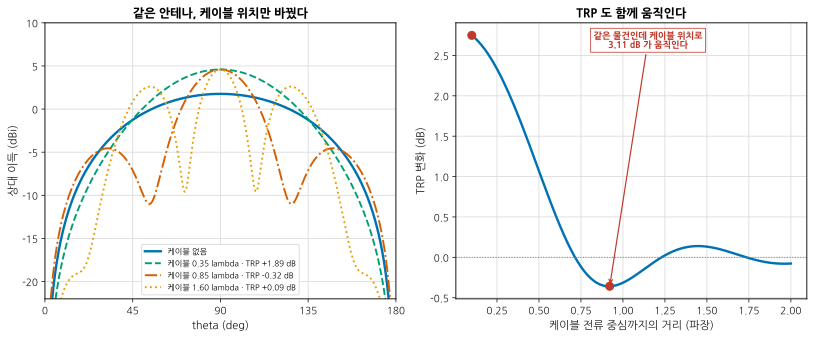
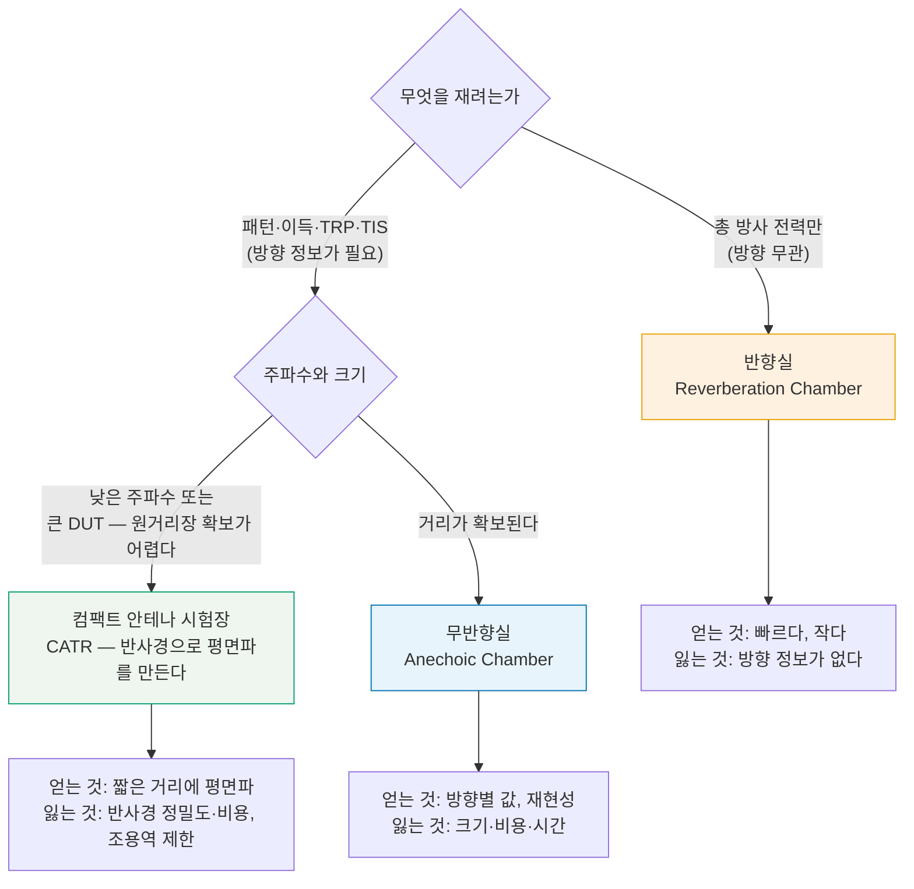
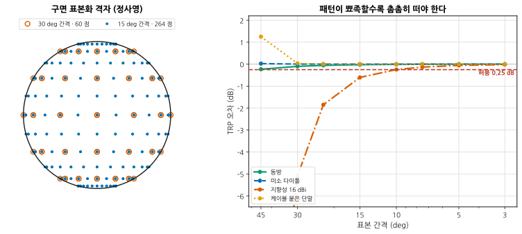
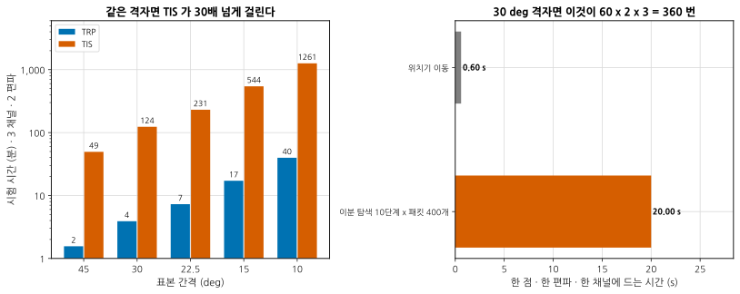
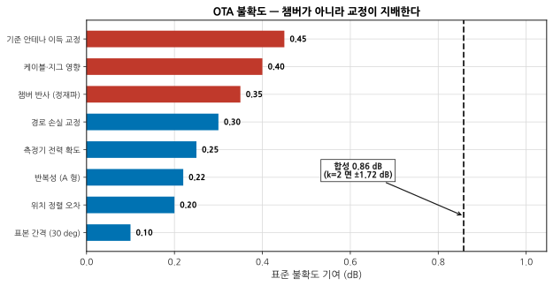

# B09 — 안테나와 OTA: 챔버 안에서

**문서 번호**: RF-CUR-B09 · **버전**: v1.0 · **분량**: 이론 5 h + 실습 8 h

> 커넥터가 있으면 케이블을 꽂아 재면 됩니다. 커넥터가 없으면 — 또는 **케이블을 꽂는 순간 답이 달라지면** — 챔버로 가야 합니다. 이 모듈은 그 안에서 무엇을 재고, 얼마나 걸리고, 그 값을 얼마나 믿을 수 있는지입니다.

| | |
|---|---|
| **선수 모듈** | [M10](../01_모듈/M10_안테나와전파.md)(안테나·OTA 개론), [M12](../01_모듈/M12_시스템예산설계.md)(링크 예산), [B01](./B01_벤치방법론.md)(반복성·불확도 기록), [B05](./B05_잡음파라미터.md)(감도) |
| **이 모듈이 소유하는 개념** | 도체 케이블이 결과를 바꾸는 이유, 챔버 세 종류의 선택 기준, **TRP** 의 구면 적분과 이산화 편향, **표본 간격과 오차**, **TIS** 와 시험 시간 예산, 지그·케이블·인체의 영향, 챔버 간 상관, **OTA 불확도 예산**, 언제 챔버가 필요한가 |
| **이 모듈을 쓰는 후속 모듈** | **B10**(디센스 — 방사 경로), **B11**(측정 시스템 분석), **B12**(양산 이관), 심화 캡스톤 P3 |
| **학습 목표** | ① TRP·TIS 를 정의대로 계산하고 **이산화 오차를 안다** ② 시험 시간과 격자를 근거로 정한다 ③ OTA 값에 **불확도를 붙여** 보고한다 |

---

## B09.0 이 모듈의 범위

기본 과정이 여기까지 왔습니다.

| 이미 배운 것 | 어디서 |
|---|---|
| 안테나 이득·패턴·편파, 근거리장과 원거리장 | [M10 §3](../01_모듈/M10_안테나와전파.md) · [M10 §5](../01_모듈/M10_안테나와전파.md) |
| OTA 측정이 왜 필요한가 | [M10 §10](../01_모듈/M10_안테나와전파.md) |
| 링크 예산과 감도 | [M12 §4](../01_모듈/M12_시스템예산설계.md) · [B05 §9](./B05_잡음파라미터.md) |
| 불확도를 항목별로 적고 RSS 로 합치기 | [M14 §10](../01_모듈/M14_정밀측정1_교정과불확도.md) · [B05 §7](./B05_잡음파라미터.md) |

**이 모듈은 그 위에 하나를 얹습니다** — [M10 §10](../01_모듈/M10_안테나와전파.md)이 "도선 없이 재는 방법이 있다"고 소개한 것을, **실제로 돌리고 그 값의 불확도를 적는 단계**까지.

> ⚠️ **다른 모듈과의 역할 분리**
>
> | 개념 | B09 (여기) | 다른 모듈 |
> |---|---|---|
> | 안테나 이론·패턴 | 적분 대상으로만 | [M10 §3](../01_모듈/M10_안테나와전파.md)이 소유 |
> | OTA 개론 | 인용만 | [M10 §10](../01_모듈/M10_안테나와전파.md)이 소유 |
> | 안테나 설계 | **다루지 않습니다** | 설계서 §2.2 참조 |
> | 감도의 정의 | 인용만 | [B05 §9](./B05_잡음파라미터.md)가 소유 |
> | 불확도 합성의 원리 | OTA 에 적용만 | [M14 §10](../01_모듈/M14_정밀측정1_교정과불확도.md)이 소유 |
> | 챔버에서 EMC 방사 시험 | **다루지 않습니다** | [B07](./B07_EMC벤치디버그.md) |
> | 자기 플랫폼이 만드는 감도 저하 | **다루지 않습니다** | **B10**(디센스) |

---

## B09.1 왜 도체 케이블 하나가 결과를 바꾸는가

단말에 동축 케이블을 꽂고 패턴을 재면, **케이블 자체가 안테나의 일부가 됩니다.**

이유는 [B07 §5](./B07_EMC벤치디버그.md)와 같습니다 — 케이블 바깥에 흐르는 **공통모드 전류**입니다. 다만 방향이 반대입니다. B07 은 그 전류가 밖으로 방사되는 것이 문제였고, 여기서는 그것이 **측정 대상의 패턴을 바꾸는 것**이 문제입니다.

*그림 B09-1. 같은 안테나, 케이블 위치만 바꿨다. **읽는 법**: 왼쪽에서 파란 실선이 케이블 없는 원래 패턴(매끈한 하나의 봉우리)입니다. 케이블을 붙이면 **결이 생깁니다** — 0.85 λ 떨어진 경우(주황 점쇄선)는 골이 두 개나 생겼습니다. 오른쪽은 케이블 위치를 바꿔 가며 TRP 를 본 것인데, **같은 물건인데 3.11 dB 가 움직입니다.** 늘기도 하고 줄기도 하는 것은 두 방사원의 보강·상쇄 때문입니다.*

| 케이블 전류 중심까지 | TRP 변화 |
|---|---|
| 0.35 λ | **+1.89 dB** |
| 0.85 λ | −0.32 dB |
| 1.60 λ | +0.09 dB |

> 📌 **그래서 OTA 는 "케이블 없이"가 원칙입니다.** 실무의 선택지는 셋입니다.
>
> | 방법 | 어떻게 | 한계 |
> |---|---|---|
> | **자립 동작** | 배터리로 돌리고 무선으로 제어한다 | 제어 링크 자체가 간섭 |
> | 광 링크 | 광섬유로 제어·급전 | 비싸고 준비가 길다 |
> | 페라이트로 억제 | 케이블에 페라이트를 촘촘히 | 완전하지 않다. **효과를 확인해야 한다** |
>
> 세 번째를 쓴다면 **페라이트를 넣기 전후로 패턴이 바뀌는지** 보십시오. 안 바뀌면 애초에 케이블 영향이 없었거나 페라이트가 안 듣는 것입니다([B07 §7](./B07_EMC벤치디버그.md)).

> ⚠️ **케이블만이 아닙니다.** (심화 규칙 3) 지그(고정대), 스티로폼 받침, 손, 머리 — 유전율이 1 이 아닌 것이 근처에 있으면 다 영향을 줍니다. 스티로폼도 완전히 투명하지는 않습니다. **지그를 바꾸면 값이 바뀌므로, 지그 사진과 치수를 보고서에 넣으십시오.**

---

## B09.2 챔버 세 종류 — 무엇을 얻고 무엇을 잃는가

*그림 B09-2. 챔버 고르기. **읽는 법**: 첫 갈림길이 결정적입니다. **방향 정보가 필요한가.** 필요 없으면 반향실이 빠르고 쌉니다. 필요하면 원거리장 거리 2D²/λ 를 확보할 수 있는지가 다음 질문이고, 못 하면 CATR 로 갑니다.*

| | 무반향실 | 반향실 | CATR |
|---|---|---|---|
| 방향별 패턴 | **된다** | 안 된다 | **된다** |
| TRP | 구면 적분으로 | **직접 (빠르다)** | 구면 적분으로 |
| TIS | 된다 (오래) | 된다 (빠르다) | 된다 (오래) |
| 필요한 크기 | 원거리장 거리만큼 | 작아도 된다 | **작다** |
| 낮은 주파수 | 흡수체가 두꺼워야 | 최저 사용 주파수 제한 | 반사경이 커야 |
| 재현성 | 좋다 | 통계적 (교반 횟수가 정한다) | 좋다 |
| 비용 | 높다 | 중간 | 높다 |

> 📌 **원거리장 거리 2D²/λ 가 챔버 크기를 정합니다.** 2.45 GHz(λ = 122 mm)에서 DUT 최대 치수 D 가 0.3 m 면 2D²/λ = **1.47 m**, D 가 1 m 면 **16.3 m** 입니다. 후자는 무반향실로는 비현실적이라 CATR 이나 근접장 스캐닝으로 갑니다.

> 📌 **근접장 스캐닝**은 DUT 가까이서 진폭·위상을 훑고 **수학으로 원거리장을 만듭니다.** 챔버가 작아도 되고 정보량이 많지만, 위상까지 재야 하고 변환이 정확해야 합니다. 능동 단말처럼 위상 기준을 잡기 어려운 대상에는 쓰기 까다롭습니다.

---

## B09.3 TRP — 구면을 어떻게 적분하는가

**총방사전력(Total Radiated Power, TRP)** 은 안테나가 사방으로 내보낸 전력의 합입니다. 방향에 따라 세기가 다르므로 **구면 전체를 적분**합니다.

$$\text{TRP} = \frac{1}{4\pi}\oint \left[ P_\theta(\theta,\phi) + P_\phi(\theta,\phi) \right] d\Omega$$

측정은 이산적이므로 합으로 바꿉니다. 규격이 쓰는 형태는 이렇습니다.

$$\text{TRP} \approx \frac{\pi}{2NM} \sum_{i=1}^{N-1}\sum_{j=0}^{M-1}
\left[ \text{EIRP}_\theta(\theta_i,\phi_j) + \text{EIRP}_\phi(\theta_i,\phi_j) \right] \sin\theta_i$$

θ 는 N 등분, φ 는 M 등분입니다. **sin θ 가 붙는 이유**는 극 근처에서 같은 각도 간격이 더 좁은 면적을 뜻하기 때문입니다 — 그걸 안 넣으면 극을 과대평가합니다.

| 표본 간격 | 점 개수 | (θ × φ) |
|---|---|---|
| 45° | 24 | 3 × 8 |
| **30°** | **60** | 5 × 12 |
| **15°** | **264** | 11 × 24 |
| 10° | 612 | 17 × 36 |

> 📌 **양 극(θ = 0, π)은 안 재도 됩니다.** sin θ = 0 이라 가중치가 0 입니다. 그래서 θ 는 1 부터 N−1 까지입니다.

---

## B09.4 표본 간격과 오차

이산 합은 참값이 아닙니다. **얼마나 틀리는지가 패턴 모양에 달렸습니다.**

*그림 B09-3. 왼쪽이 격자, 오른쪽이 오차. **읽는 법**: 오른쪽에서 등방(초록)과 미소 다이폴(파랑)은 30° 로도 0.1 dB 안에 들어옵니다. 그런데 **지향성 16 dBi 안테나(주황 점쇄선)는 30° 에서 −5.09 dB**, 45° 에서는 −19.4 dB 로 통째로 틀립니다. 봉우리 사이로 격자가 빠져나가기 때문입니다. 케이블이 붙어 결이 생긴 패턴(노랑)도 45° 에서 +1.25 dB 로 틉니다.*

| 패턴 | 45° | 30° | 15° |
|---|---|---|---|
| 등방 | −0.232 dB | −0.101 dB | −0.025 dB |
| 미소 다이폴 | +0.024 dB | +0.004 dB | +0.000 dB |
| **지향성 16 dBi** | **−19.435 dB** | **−5.092 dB** | −0.605 dB |
| 케이블 붙은 단말 | +1.251 dB | +0.036 dB | +0.000 dB |

> 📌 **등방 패턴의 편향은 닫힌 식으로 나옵니다.**
>
> $$\frac{\text{TRP}_{\text{이산}}}{\text{TRP}_{\text{참}}} = \frac{\pi}{2N}\cot\frac{\pi}{2N}$$
>
> 30°(N = 6)면 −0.1008 dB, 15°(N = 12)면 −0.0249 dB 입니다. **항상 낮게 나옵니다.** 이것이 격자만으로 정해지는 계통 오차라, 원한다면 보정할 수 있습니다.

> ⚠️ **표본 간격을 정하는 규칙** (심화 규칙 3)
>
> | DUT | 권장 |
> |---|---|
> | 작은 단말 (패턴이 완만) | 30° 로 충분 |
> | 지향성 안테나 | **빔폭의 1/3 이하** |
> | 케이블·지그가 붙은 상태 | 결이 생기므로 15° 이하 |
> | 무엇인지 모를 때 | **15° 로 한 번 뜨고, 30° 로 다시 계산해 비교** |
>
> 마지막이 실무의 답입니다. 촘촘히 뜬 데이터를 **솎아 내어** 다시 적분해 보면, 그 DUT 에 30° 가 충분한지 **자기 데이터로** 알 수 있습니다.

---

## B09.5 TIS — 감도를 방향마다 재는 일

**총등방감도(Total Isotropic Sensitivity, TIS)** 는 TRP 의 수신 쪽 짝입니다. 방향마다 **최소 수신 가능 전력(EIS)** 을 재서 구면 평균합니다.

$$\text{TIS} = \frac{4\pi}{\oint \left[ \dfrac{1}{\text{EIS}_\theta} + \dfrac{1}{\text{EIS}_\phi} \right] d\Omega}$$

역수의 평균이라 **감도가 나쁜 방향이 결과를 덜 끌어내립니다** — 좋은 방향 하나가 있으면 전체가 좋아 보입니다.

> 📌 **TIS 는 평균이 정합니다. 최대가 아닙니다.** 계산에서 확인한 것: **최대 이득이 같은** 등방 안테나와 지향성 안테나(16 dBi)를 비교하면, 지향성 쪽 TIS 가 **16.2 dB 나쁩니다.** 한 방향으로 모으면 나머지 방향이 그만큼 안 들립니다. 단말처럼 **방향을 모르는 상대**와 통신하는 물건에서 지향성이 무조건 좋은 것이 아닌 이유입니다.

---

## B09.6 시험 시간 예산 — 왜 TIS 가 그렇게 오래 걸리는가

TRP 는 각 점에서 **전력을 한 번 읽으면** 됩니다. TIS 는 각 점에서 **감도를 찾아야** 합니다.

*그림 B09-4. 같은 격자, 전혀 다른 시간. **읽는 법**: 왼쪽 세로축이 로그입니다. 15° 격자에서 TRP 는 17 분인데 **TIS 는 544 분(9.1 시간)** 입니다. 오른쪽이 그 이유입니다 — TIS 한 점에 20 초가 드는데, 그중 위치기 이동은 0.6 초뿐이고 **나머지 20 초가 전부 감도 탐색**입니다.*

한 점의 EIS 를 찾는 데 드는 시간:

$$t_{\text{점}} = N_{\text{이분탐색}} \times N_{\text{패킷}} \times t_{\text{패킷}}$$

10단계 × 400패킷 × 5 ms = **20 초**. 여기에 위치기 이동 0.6 초.

| 표본 간격 | TRP | TIS |
|---|---|---|
| 45° | 1.6 분 | 49 분 |
| **30°** | **3.9 분** | **124 분 (2.1 시간)** |
| 15° | 17.2 분 | **544 분 (9.1 시간)** |
| 10° | 39.8 분 | 1261 분 (21 시간) |

**같은 격자에서 TIS 가 32배 걸립니다.** (3 채널 · 2 편파 기준)

> 📌 **그래서 규격이 TIS 에 더 성긴 격자를 허용합니다.** TRP 는 15°, TIS 는 30° 로 두는 것이 흔한 구성입니다. 정확도를 조금 내주고 시간을 8배 아끼는 거래입니다.

> ⚠️ **시간을 줄이는 다른 방법과 그 대가** (심화 규칙 3)
>
> | 방법 | 아끼는 것 | 대가 |
> |---|---|---|
> | 격자를 성기게 | 점 개수에 비례 | §4 의 이산화 오차 |
> | 패킷 수를 줄임 | 탐색 시간 | 오류율 판정의 산포가 커진다 |
> | 이분 탐색 단계를 줄임 | 탐색 시간 | EIS 해상도가 나빠진다 |
> | 채널 수를 줄임 | 비례 | 대역 끝을 못 본다 |
> | **반향실로** | 크게 | **방향 정보를 잃는다** |
> | 이전 점의 결과에서 탐색 시작 | 30~50 % | 패턴이 급변하면 오히려 느려진다 |
>
> 마지막이 실무에서 가장 쓸모 있습니다. 이웃한 점의 EIS 는 대개 비슷하므로 거기서 탐색을 시작하면 단계가 줄어듭니다.

---

## B09.7 지그·케이블·인체의 영향

§1 이 케이블을 다뤘습니다. 실제 시험에서는 더 있습니다.

| 무엇 | 전형적 영향 | 규격이 요구하는 것 |
|---|---|---|
| **인체 모형** (머리·손) | TRP −3 ~ −10 dB | 규격이 정한 팬텀과 자세 |
| 배터리·케이스 | 패턴 왜곡 | 실제 제품 상태로 |
| 지그 (스티로폼·플라스틱) | 0.2 ~ 1 dB | 유전율이 낮은 재료, 치수 기록 |
| 케이블 (있다면) | **1 ~ 3 dB** (§1) | 없애거나 페라이트 |
| DUT 자세 | 패턴 회전 | 규격이 정한 기준 방향 |

> 📌 **인체 영향은 손실이 아니라 흡수입니다.** 머리 옆에 대면 방사 전력의 상당 부분이 조직에 흡수됩니다. 그래서 **자유공간 TRP 와 머리 옆 TRP 는 다른 숫자**이고, 규격은 둘 다 요구하는 경우가 많습니다. 어느 조건인지 안 적으면 비교할 수 없습니다.

---

## B09.8 챔버 간 상관 — 같은 물건, 다른 값

같은 DUT 를 두 챔버에서 재면 값이 다릅니다. **얼마나 달라도 괜찮은지**를 불확도가 정합니다.

*그림 B09-5. 무엇이 불확도를 지배하는가. **읽는 법**: 붉은 세 항목이 큰 것들입니다 — **기준 안테나 이득 교정(0.45 dB), 케이블·지그(0.40 dB), 챔버 반사(0.35 dB)**. 표본 간격은 0.10 dB 로 가장 작습니다. 합성하면 0.86 dB, 확장(k=2)하면 **±1.72 dB** 입니다.*

> 📌 **격자만 촘촘히 해도 소용없다는 것이 이 그림의 요지입니다.** 표본 간격을 30° 에서 15° 로 바꾸면 0.10 dB 를 0.03 dB 로 줄일 수 있지만, 합성 불확도는 0.858 → 0.855 dB 로 거의 안 변합니다. **시간은 4배 드는데.** 줄여야 할 것은 교정입니다.

| 두 챔버의 값 차이 | 판정 |
|---|---|
| < 1.7 dB (= 2·합성) | **두 측정이 모순되지 않는다** |
| 1.7 ~ 3 dB | 어느 한쪽에 계통 오차가 있을 수 있다 |
| > 3 dB | 셋업이 다르다. 지그·케이블·자세부터 |

> ⚠️ **상관을 볼 때 확인할 것** (심화 규칙 3)
>
> | 항목 | 왜 |
> |---|---|
> | 기준 안테나가 같은 개체인가 | 교정 성적서가 다르면 그만큼 어긋난다 |
> | 경로 손실 교정을 언제 했는가 | 케이블은 늙는다 |
> | 지그와 자세가 같은가 | 사진으로 대조 |
> | **표본 격자와 적분식이 같은가** | 30° 와 15° 는 §4 만큼 다르다 |
> | 채널·전력 설정 | DUT 가 다른 상태면 다른 물건이다 |
> | 편파를 둘 다 쟀는가 | 하나만 재고 합치면 −3 dB 어긋난다 |

---

## B09.9 언제 챔버가 필요하고 언제 벤치로 충분한가

챔버는 비쌉니다. **안 가도 되는 경우를 먼저 가려내는 것**이 실무입니다.

| 질문 | 벤치로 충분 | 챔버가 필요 |
|---|---|---|
| 커넥터가 있는가 | **있다 → 케이블로** | 없다 |
| 절대값이 필요한가 | 상대 비교면 벤치 | 규격 판정이면 챔버 |
| 방향 정보가 필요한가 | 아니면 벤치·반향실 | 패턴이면 챔버 |
| 개발 단계인가 | 시제품 반복은 벤치 | 인증·출하는 챔버 |
| 재현성이 얼마나 필요한가 | ±3 dB 면 벤치 | ±1 dB 면 챔버 |

> 📌 **벤치에서 할 수 있는 OTA 비슷한 것들.**
>
> | 방법 | 얻는 것 | 한계 |
> |---|---|---|
> | 고정 거리·고정 자세의 두 안테나 | **상대 비교** (A 대비 B 몇 dB) | 절대값 없음, 반사 많음 |
> | 전도 측정 + 안테나 효율 계산 | 안테나 단독 특성 | 실장 상태를 못 본다 |
> | 흡수체를 두른 간이 상자 | 반사 줄임 | 반사가 남는다 |
> | 수신 신호 세기 지표(RSSI) 로 상대 비교 | 빠르다 | 해상도 거칠다 |
>
> 첫 줄이 개발 중 가장 많이 쓰입니다. [B07 §1](./B07_EMC벤치디버그.md)의 원칙과 같습니다 — **절대값이 아니라 차이를 보는 도구**로 쓰고, 셋업을 고정하고 사진을 남깁니다.

---

## B09.L 실습

> **등급 표기**: **T0** = 계산기·PC 만으로 · **T1** = 기본 계측기 · **T2** = 전문 장비. 등급 정의는 [설계서 §7](./00_심화과정_설계서.md) 참조.

### L-B09-a (T0) — 패턴 데이터로 TRP 적분, 표본 간격 바꿔 보기

**목표**: §3·§4 를 직접 만든다.

1. `scripts/gen_fig_b09.py` 의 `trp_ctia()` 를 참고해 적분기를 짠다.
2. 해석해가 있는 패턴(sin²θ → 지향성 1.5, cos^q θ → 2(q+1))으로 **먼저 검산**한다.
3. 등방 패턴에 대해 닫힌 식 (π/2N)cot(π/2N) 과 대조한다.
4. 지향성이 다른 세 패턴에서 45°/30°/15° 오차를 표로 만든다.
5. 가우스-르장드르 구적으로도 짜서 두 결과를 대조한다.

**보고**: 2·3번 검산 결과, 4번 표, 5번의 두 구적법 차이.

**막히면**: 2번이 안 맞으면 sin θ 가중치를 빠뜨렸거나 극점을 잘못 처리한 것입니다.

### L-B09-b (T0) — TIS 시험 시간 계산기

**목표**: 시험 계획을 근거로 세운다.

1. 격자·채널·편파·패킷 수·이분 탐색 단계를 입력받는 계산기를 짠다.
2. 우리 제품의 조건으로 TRP 와 TIS 시간을 각각 낸다.
3. "하루(8시간) 안에 끝내려면" 각 변수를 얼마로 해야 하는지 역산한다.
4. 각 절충의 대가를 §6 의 표로 적는다.
5. 이웃 점의 결과에서 탐색을 시작하면 몇 % 줄어드는지 모형으로 추정한다.

**보고**: 계산기, 우리 조건의 시간, 3번의 조합 몇 가지와 각각의 대가.

**막히면**: 3번에서 격자를 성기게 하는 것이 가장 효과가 큽니다(점 개수에 비례). 대신 §4 의 오차를 함께 적으십시오.

### L-B09-c (T1) — 케이블 위치를 바꿔 가며 패턴 변화 관측

**목표**: §1 을 실물에서 본다. 챔버가 없어도 된다.

**필요**: 신호원, 수신 안테나, 스펙트럼 분석기, 회전대(또는 손으로 각도 표시), 페라이트.

1. 고정 거리에 수신 안테나를 두고, DUT 를 회전시키며 세기를 기록한다(상대값).
2. 케이블을 세 가지 위치로 정리해 가며 같은 측정을 반복한다.
3. 케이블에 페라이트를 촘촘히 물리고 다시.
4. 세 경우의 패턴을 겹쳐 그린다. 얼마나 달라지는가?
5. 배터리 구동이 가능하면 케이블을 아예 빼고 재서 기준으로 삼는다.

**보고**: 겹친 패턴, 최대 차이(dB), 페라이트 전후, 5번과의 비교.

**막히면**: 4번에서 차이가 안 보이면 케이블이 이미 λ/4 의 홀수배가 아니거나, 반사가 많아 다 뭉개진 것입니다. 흡수체를 몇 장 세워 보십시오.

### L-B09-d (T2) — 챔버에서 TRP 측정과 불확도 예산

**목표**: 값과 불확도를 함께 낸다.

**필요**: OTA 챔버, 교정된 기준 안테나.

1. **15° 격자로** 뜬다 (나중에 솎아 낼 수 있도록).
2. 같은 데이터를 30°·45° 로 솎아 다시 적분해 §4 의 표를 자기 DUT 로 만든다.
3. 지그를 바꿔 한 번 더 뜨고 차이를 본다.
4. §8 의 항목으로 불확도 예산을 작성한다. 각 항의 근거(성적서·사양·실측)를 적는다.
5. "이 DUT 에는 몇 도 격자가 적절한가"를 2번 결과로 답한다.

**보고**: TRP 값 ± 확장 불확도, 격자별 표, 지그 영향, 불확도 예산표, 5번의 판정.

**막히면**: 2번에서 30° 와 15° 차이가 불확도 안에 들어오면 30° 로 충분한 DUT 입니다. 그것이 이 실습의 결론입니다.

> ⚠️ **T0 대체로 못 얻는 것**
>
> | 못 얻는 것 | 왜 |
> |---|---|
> | 지그·인체의 실제 영향 | 물건이 있어야 한다 |
> | 챔버 반사가 만드는 정재파 | 흡수체 성능에 달렸다 |
> | 기준 안테나 교정의 실체 | 성적서를 봐야 안다 |
> | 위치기 이동 시간과 기계적 반복성 | 장비마다 다르다 |
> | 케이블을 다시 정리했을 때의 재현성 | 손으로 해 봐야 안다 |

---

## B09.Q 확인 문제

<b>Q1.</b> 개발팀에서 "케이블 꽂고 잰 패턴"을 가져왔습니다. 써도 됩니까?

**어디에 쓸 것인지에 따라 다릅니다.**

| 용도 | 쓸 수 있는가 |
|---|---|
| 안테나 A 와 B 중 어느 쪽이 나은지 **상대 비교** | 조건부로 가능 — **케이블 위치를 똑같이** 두었다면 |
| 규격 판정 (TRP 절대값) | **안 됩니다** |
| 패턴의 모양을 논하기 | 위험 — §1 에서 케이블이 골을 만들었습니다 |
| 시스템 링크 예산에 넣기 | 안 됩니다 |

§1 의 계산에서 케이블 위치만 바꿔 **TRP 가 3.11 dB** 움직였습니다. 패턴에는 없던 골이 생겼습니다.

**할 일**.

1. **케이블 없이** 다시 잽니다 — 배터리 구동 + 무선 제어가 원칙입니다.
2. 불가능하면 페라이트를 물리고, **물리기 전후로 패턴이 바뀌는지** 확인합니다. 안 바뀌면 케이블 영향이 없었거나 페라이트가 안 듣는 것입니다.
3. 상대 비교로만 쓴다면 **케이블 배치를 테이프로 고정**하고 사진을 남깁니다.

그리고 케이블만이 아닙니다 — 지그·받침대도 영향을 줍니다(§7).

<b>Q2.</b> TRP 를 30° 격자로 재서 보고했습니다. 다른 팀이 "너무 성기다"고 합니다. 맞습니까?

**DUT 의 패턴이 정합니다. 데이터로 답할 수 있습니다.**

§4 의 계산에서

| 패턴 | 30° 오차 |
|---|---|
| 등방 | −0.101 dB |
| 미소 다이폴 | +0.004 dB |
| **지향성 16 dBi** | **−5.092 dB** |

패턴이 완만하면 30° 로 충분하고, 뾰족하면 통째로 틀립니다.

**확인하는 방법**이 있습니다. **15° 로 한 번 뜨고, 그 데이터를 솎아 30° 로 다시 적분**해 보십시오. 두 값의 차이가 그 DUT 의 이산화 오차입니다. 불확도(§8 에서 0.86 dB) 안에 들어오면 30° 로 충분한 것이고, 넘으면 성긴 것입니다.

그리고 한 가지 더. 격자를 촘촘히 해서 얻는 것보다 **교정을 개선해서 얻는 것이 훨씬 큽니다**(§8). 30° → 15° 로 바꾸면 합성 불확도가 0.858 → 0.855 dB 로 거의 안 변하는데 시간은 4배 듭니다. **격자를 탓하기 전에 불확도 예산을 보십시오.**

<b>Q3.</b> TIS 측정에 하루가 걸린다고 합니다. 줄일 방법이 있습니까?

**있습니다. 각각 대가가 있습니다.**

먼저 시간이 어디로 가는지 봅니다(§6). 한 점에 20.6 초인데 **위치기 이동은 0.6 초뿐**이고 나머지가 전부 감도 탐색입니다. 그러니 위치기를 빠르게 해 봐야 3 % 밖에 못 줍니다.

| 방법 | 아끼는 것 | 대가 |
|---|---|---|
| **격자를 30° 로** (15° 대비) | **77 %** (264 → 60 점) | §4 의 이산화 오차 |
| 채널을 3 → 1 개로 | 67 % | 대역 끝을 못 본다 |
| 패킷을 400 → 200 개로 | 50 % | 오류율 판정 산포 √2 배 |
| 이분 탐색 10 → 7 단계 | 30 % | EIS 해상도가 8배 거칠어진다 |
| 이웃 점 결과에서 탐색 시작 | 30~50 % | 거의 공짜 — **먼저 해 볼 것** |
| 반향실로 | 90 % 이상 | 방향 정보를 잃는다 |

**순서**: 마지막에서 두 번째(이웃 점에서 시작)를 먼저 하십시오. 정확도를 안 내주고 얻는 유일한 항목입니다. 그다음이 격자입니다 — 규격이 TIS 에 30° 를 허용하는 것도 이 계산 때문입니다.

그리고 **정말 TIS 가 필요한지** 물어보십시오. 개발 중 반복 비교라면 몇 개 각도만 재는 것으로 충분한 경우가 많습니다(§9).

<b>Q4.</b> 두 챔버에서 잰 TRP 가 1.2 dB 다릅니다. 어느 쪽이 맞습니까?

**둘 다 맞을 수 있습니다.** §8 의 예산에서 합성 표준 불확도가 0.86 dB, 확장(k=2)이 **±1.72 dB** 였습니다. 1.2 dB 차이는 그 안입니다.

즉 **두 측정은 모순되지 않습니다.** "어느 쪽이 맞나"가 아니라 "이 정도 차이는 예상된 것인가"가 옳은 질문이고, 답은 예입니다.

그래도 계통 오차가 있는지 확인하려면 §8 의 목록을 밟습니다.

1. **기준 안테나가 같은 개체인가.** 다르면 교정 성적서의 차이만큼 어긋납니다 — 이것이 가장 큰 항(0.45 dB)입니다.
2. 경로 손실 교정 날짜.
3. **지그와 자세.** 사진으로 대조.
4. **격자와 적분식.** 30° 와 15° 는 §4 만큼 다릅니다.
5. **편파를 둘 다 쟀는가.** 하나만 재고 합치면 −3 dB 어긋납니다.

그리고 앞으로를 위해: **같은 DUT 를 두 챔버에서 정기적으로 재어 상관 데이터를 쌓으십시오.** 오프셋이 일정하면 계통 오차이고, 보정할 수 있습니다. 흩어지면 불확도가 그만큼인 것입니다. (**B11** 의 주제로 이어집니다.)

<b>Q5.</b> 안테나 이득을 3 dB 올렸는데 TIS 가 안 좋아졌습니다. 왜입니까?

**최대 이득을 올린 것이지 평균 이득을 올린 것이 아니기 때문입니다.**

TIS 는 구면 **평균**이 정합니다(§5). 안테나를 지향성으로 만들면 한 방향은 좋아지지만 나머지 방향이 나빠집니다. 총 방사 능력(방사 효율)이 그대로라면 **평균은 변하지 않습니다.**

계산에서 확인한 것: 최대 이득이 같은 등방 안테나와 16 dBi 지향성 안테나를 비교하면, **지향성 쪽 TIS 가 16.2 dB 나쁩니다.**

TIS 를 실제로 좋게 하는 것은 이것들입니다.

| 무엇 | 왜 |
|---|---|
| **방사 효율** | 손실이 줄면 모든 방향이 좋아진다 |
| 수신기 잡음지수 | [B05](./B05_잡음파라미터.md) |
| 정합 손실 | 실장 상태에서의 정합 |
| **자기 플랫폼 간섭 제거** | 디센스가 있으면 전 방향이 나빠진다 (**B10**) |
| 패턴의 **골을 메우는 것** | 깊은 골 하나가 평균을 끌어내린다 |

마지막이 중요합니다. TIS 는 역수의 평균이라 **아주 나쁜 방향**이 결과를 크게 끌어내립니다. 패턴에 −20 dB 짜리 골이 있으면 그것을 −10 dB 로 만드는 것이, 최대 이득을 3 dB 올리는 것보다 낫습니다.

<b>Q6.</b> 챔버 예약이 2주 뒤인데 지금 안테나 두 개 중 하나를 골라야 합니다. 어떻게 합니까?

**상대 비교는 벤치에서 됩니다**(§9).

| 할 것 | 얻는 것 |
|---|---|
| 1. **전도 측정**으로 정합(S11)과 효율을 각각 잰다 | 안테나 단독 비교. 커넥터가 있으면 즉시 |
| 2. 고정 거리·고정 자세로 두 안테나를 **번갈아** 재고 차이만 본다 | 실장 상태의 상대 비교 |
| 3. 몇 개 각도(예: 6방향)만 재서 대략의 평균을 낸다 | TRP 의 거친 추정 |
| 4. 두 안테나로 링크를 걸고 **오류율**을 비교한다 | 시스템 관점의 답 |

**2번의 규칙**이 결과를 좌우합니다.

- 거리·높이·자세를 **완전히 고정**하고 테이프로 표시
- 두 안테나를 **번갈아 여러 번** 재서 산포를 먼저 안다 ([B01 §4](./B01_벤치방법론.md))
- 케이블 배치를 똑같이 (§1)
- 흡수체를 몇 장 세워 반사를 줄인다
- 절대값은 적지 말고 **"A 대비 B 가 +2.3 dB"** 로만

이렇게 얻은 차이가 산포보다 크면 판단할 수 있습니다. 산포에 묻히면 **"이 방법으로는 판정 불가"** 라고 적고 챔버를 기다리십시오 — "차이 없음"과 다릅니다.

그리고 2주 동안 할 일이 하나 더 있습니다. **챔버에서 뭘 잴지 계획을 짜 두는 것**입니다(L-B09-b). 하루짜리 예약에 TIS 를 15° 로 넣으면 안 끝납니다.

---

## B09.A 이 모듈의 축약어

| 약어 | 영문 원어 | 한글 |
|---|---|---|
| OTA | Over The Air | 공중 (도선 없이 하는 측정) (→ M10) |
| TRP | Total Radiated Power | 총방사전력 |
| TIS | Total Isotropic Sensitivity | 총등방감도 |
| EIRP | Effective Isotropic Radiated Power | 등가 등방 복사전력 (→ M10) |
| EIS | Effective Isotropic Sensitivity | 등가 등방 감도 |
| CATR | Compact Antenna Test Range | 컴팩트 안테나 시험장 |
| DUT | Device Under Test | 피시험 소자 (→ M04) |
| CTIA | Cellular Telecommunications and Internet Association | (미국 이동통신 산업 협회) (→ M10) |
| RSSI | Received Signal Strength Indicator | 수신 신호 세기 지표 (→ M16) |
| RSS | Root Sum of Squares | 제곱합의 제곱근 (→ M14) |
| RF | Radio Frequency | 무선 주파수 (→ M01) |

---

## B09.S 출처

> ⚠️ **원문 확인 권고**: 아래 주소는 검색 결과로 교차확인한 것이며 원문을 직접 열어 보지는 못했습니다. 중요한 수치는 원문에서 확인하십시오.

| 주장 | 등급 | 출처 |
|---|---|---|
| TRP(TIS)는 적분 구면 위의 지정된 (θ, φ) 점에서 잰 EIRP(EIS⁻¹)의 가중합이다 | A | [CTIA 01.20 — 무선 기기 OTA 성능 시험 방법](https://ctiacertification.org/wp-content/uploads/2021/02/CTIA-01.20-Test-Methodology-SISO-Anechoic-Chamber-V4.0.0.pdf) · [CTIA OTA 시험계획서 Rev 3.4.1](https://api.ctia.org/docs/default-source/default-document-library/ctia_ota_test_plan_rev_3_4_1.pdf) |
| TRP 시험에는 θ·φ 두 축 모두 15° 간격이 권고되며, 감도(TIS) 측정은 같은 구면 절차를 쓰되 각도 간격이 다르다 | A | [CTIA 01.20 시험 방법](https://ctiacertification.org/wp-content/uploads/2021/02/CTIA-01.20-Test-Methodology-SISO-Anechoic-Chamber-V4.0.0.pdf) · [Sensors — 5G 스마트워치 OTA 측정 격자 최적화](https://doi.org/10.3390/s25103185) |
| 수신 감도 측정의 데이터 점은 θ·φ 축에서 30° 간격으로 취한다 | B | [WRC — CTIA/Verizon 인증 OTA 시험소](https://wrc-nc.org/our-services/ctia-verizon-authorized-ota-testing-lab/) · [CTIA OTA 시험계획서 Rev 3.3.2](https://api.ctia.org/docs/default-source/default-document-library/ctia_ota_test_plan_rev-3-3-2.pdf) |
| TIS 는 시험 시간이 길어 이를 줄이는 대체 절차와 빠른 측정법이 연구·특허의 대상이 되어 왔다 | B | [CN107817391B — TIS 고속 측정법](https://patents.google.com/patent/CN107817391B/en) · [Toyotech — IoT 무선 기기의 OTA 측정: 과제와 해법](https://toyotechus.com/wp-content/uploads/OTA-Measurement-for-IoT-Wireless-Device-Performance-Evaluation-Challenges-and-Solutions.pdf) |
| 측정 점을 무작위로 조정하거나 격자를 최적화해 OTA 시험 시간을 줄이는 방식이 제안되어 왔다 | C | [US10393786 — 무작위 조정 측정점 기반 OTA 시험](https://image-ppubs.uspto.gov/dirsearch-public/print/downloadPdf/10393786) · [Sensors — 측정 격자 최적화](https://doi.org/10.3390/s25103185) |

**본문의 숫자는 전부 계산입니다.** `python3 scripts/gen_fig_b09.py` 를 실행하면 인용값이 출력되고 자체 검산 30항목이 함께 돕니다. 교차검증은 네 갈래입니다.

1. **등방 편향** — 이산 합과 닫힌 식 (π/2N)·cot(π/2N) 을 네 격자에서 대조. 차 10⁻¹² 이내
2. **해석해가 있는 지향성** — sin²θ → 1.5, cos^q θ → 2(q+1) 을 네 경우에서 확인. 오차 0.5 % 이내
3. **서로 다른 두 구적법** — CTIA 사각형 규칙과 가우스-르장드르 구적을 네 패턴에서 대조. 차 0.0005 dB 이내
4. **TIS 관계식** — TIS = EIS_iso − 10·log₁₀(평균 이득) 을 세 패턴에서 이산합과 대조. 그리고 케이블 진폭을 0 으로 두면 원래 다이폴로 정확히 돌아오는지 확인

§1 의 케이블 모형(두 미소 다이폴 배열), §4 의 패턴들, §8 의 불확도 값은 **합성한 것**입니다. 3.11 dB 나 0.86 dB 를 실물의 기대값으로 옮기지 마십시오 — 불확도 항목은 여러분의 챔버 성적서로 채워야 합니다. 반면 §3 의 적분식, §4 의 등방 편향 닫힌 식, §5 의 TIS 평균 관계는 **모형과 무관한 성질**이라 그대로 적용됩니다.

---

## 변경 이력

| 버전 | 일자 | 내용 |
|---|---|---|
| v1.0 | 2026-08-27 | 최초 작성. 그림 5종(생성 4 + Mermaid 1), 실습 4종, 확인 문제 6문항. 자체 검산 30항목 통과. 집필 중 두 번 고쳤다 — ① 케이블 모형이 처음에는 안테나 전류를 그대로 두고 케이블 전류를 **더하는** 꼴이라, 케이블을 붙일 때마다 TRP 가 늘기만 했다. 없던 전력이 생기는 모형이었다. 새어 나간 만큼 안테나 쪽을 줄이도록 진폭을 √(1−a²) 로 바꾸니 늘기도 줄기도 하게 됐고, 그것이 상호 결합이 방사저항을 바꾸는 실제 현상과 같은 꼴이다 ② 시험 시간 모형에서 위치기 이동 시간을 0.9 초로 크게 잡아 TRP 와 TIS 의 차이가 7배밖에 안 났다. 실제로는 TRP 의 전력 읽기가 훨씬 빠르고 TIS 의 감도 탐색이 훨씬 느리다. 값을 고치니 **32배**가 됐고, 규격이 왜 TIS 에 더 성긴 격자를 허용하는지가 그 숫자로 설명된다 |
