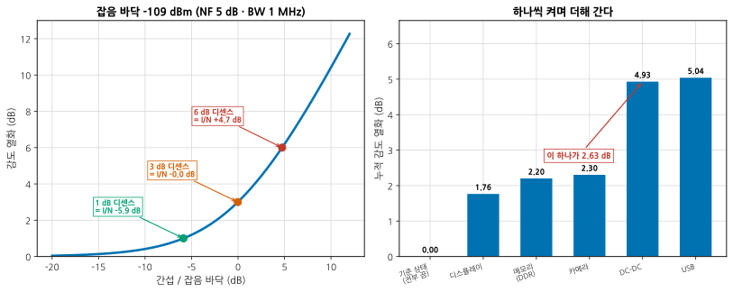
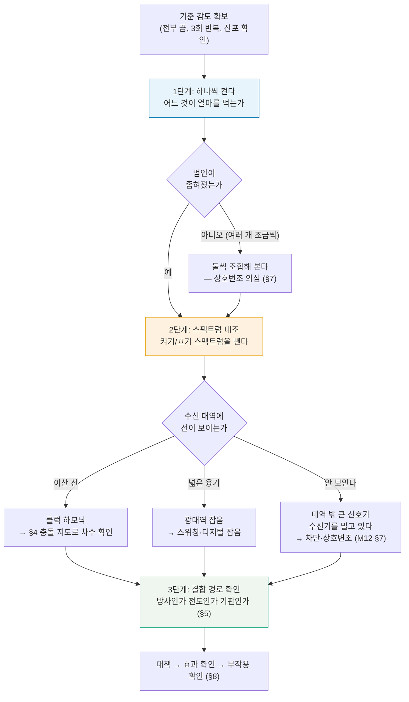
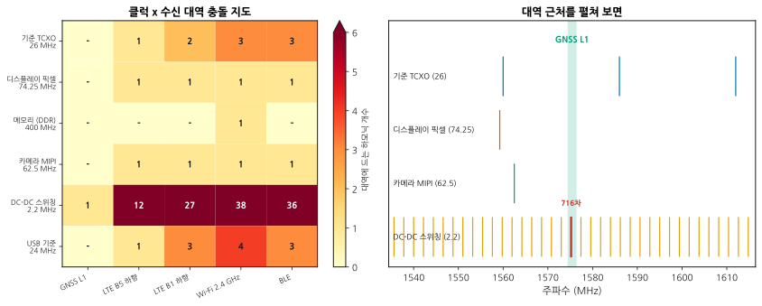
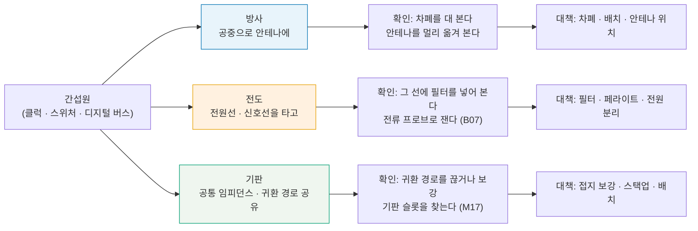
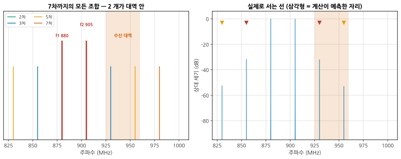
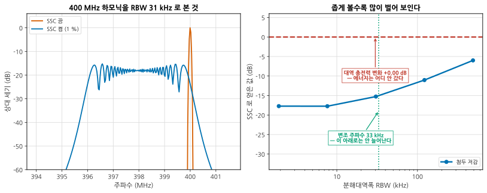

# B10 — 시스템 디버그: 디센스와 공존

**문서 번호**: RF-CUR-B10 · **버전**: v1.0 · **분량**: 이론 5 h + 실습 8 h

> 부품은 다 규격을 만족합니다. 조립하면 감도가 5 dB 떨어집니다. **아무도 잘못한 사람이 없는데 시스템이 안 됩니다.** 이 모듈은 살아 있는 보드에서 범인을 찾아내는 절차입니다.

| | |
|---|---|
| **선수 모듈** | [M09](../01_모듈/M09_주파수변환과신호원.md)(주파수 계획·스퓨리어스), [M12](../01_모듈/M12_시스템예산설계.md)(동적 범위), [B05](./B05_잡음파라미터.md)(감도), [B07](./B07_EMC벤치디버그.md)(근접장·전류 프로브) |
| **이 모듈이 소유하는 개념** | 디센스의 정의와 **I/N 관계식**, 기준 감도 확보, **3단계 추적**(끄기/켜기 → 스펙트럼 대조 → 결합 경로), **클럭 하모닉 충돌 지도**와 국부발진기 혼합, 결합 경로 세 갈래(방사·전도·기판), 무선 간 공존, **상호변조 사냥**, 대책과 부작용(**스프레드 스펙트럼이 공짜가 아닌 이유**), 사례 모음 |
| **이 모듈을 쓰는 후속 모듈** | **B11**(측정 시스템 분석), **B12**(양산 이관), 심화 캡스톤 P3·P4 |
| **학습 목표** | ① 감도 저하를 **숫자로** 재고 원인 후보를 계산으로 좁힌다 ② 끄기/켜기와 결합 경로 확인으로 범인을 특정한다 ③ 대책의 **부작용까지** 확인하고 보고한다 |

---

## B10.0 이 모듈의 범위

기본 과정이 여기까지 왔습니다.

| 이미 배운 것 | 어디서 |
|---|---|
| 주파수 계획, 스퓨리어스와 이미지 | [M09 §6](../01_모듈/M09_주파수변환과신호원.md) |
| 동적 범위, 차단(blocking)과 상호변조 | [M12 §7](../01_모듈/M12_시스템예산설계.md) |
| 차폐·귀환 경로 설계 | [M17 §10](../01_모듈/M17_보드설계와인증.md) · [M17 §5](../01_모듈/M17_보드설계와인증.md) |
| 근접장 프로브·전류 프로브로 자리 짚기 | [B07 §4](./B07_EMC벤치디버그.md) · [B07 §5](./B07_EMC벤치디버그.md) |
| 감도의 정의와 실측 | [B05 §9](./B05_잡음파라미터.md) |

**이 모듈은 그 위에 하나를 얹습니다** — 시험소가 아니라 **자기 제품 안에서** 자기가 만든 잡음을 찾는 일.

> ⚠️ **다른 모듈과의 역할 분리**
>
> | 개념 | B10 (여기) | 다른 모듈 |
> |---|---|---|
> | 주파수 계획 | **충돌 확인**만 | [M09 §6](../01_모듈/M09_주파수변환과신호원.md)이 계획 수립을 소유 |
> | 동적 범위·차단 | 인용만 | [M12 §7](../01_모듈/M12_시스템예산설계.md)이 소유 |
> | 차폐 설계 | 대책 목록에서만 | [M17 §10](../01_모듈/M17_보드설계와인증.md)이 소유 |
> | 근접장·전류 프로브 | **결합 경로 확인**에만 | [B07 §3](./B07_EMC벤치디버그.md) ~ [B07 §5](./B07_EMC벤치디버그.md)가 도구를 소유 |
> | 밖으로 나가는 방사 (EMC) | **다루지 않습니다** | [B07](./B07_EMC벤치디버그.md) |
> | 안테나 패턴과 OTA | **다루지 않습니다** | [B09](./B09_안테나와OTA.md) |
> | 잡음지수 자체 | 인용만 | [B05](./B05_잡음파라미터.md) |

---

## B10.1 디센스란 무엇인가

**디센스(desense)** 는 자기 플랫폼이 만든 잡음·간섭이 수신 대역에 들어와 **감도가 나빠지는 것**입니다.

잡음과 간섭이 무관하면 전력이 더해지므로, 감도 저하는 간단한 식으로 나옵니다.

$$\Delta_{\text{디센스}} = 10\log_{10}\!\left(1 + \frac{I}{N}\right) \ \text{[dB]}$$

I 는 수신 대역에 들어온 간섭 전력, N 은 원래 잡음 바닥입니다.

*그림 B10-1. 얼마나 작은 간섭이 문제가 되는가. **읽는 법**: 왼쪽 곡선에서 놀라운 것은 왼쪽 끝입니다. **간섭이 잡음 바닥보다 5.9 dB 작아도 감도는 1 dB 나빠집니다.** 간섭이 잡음과 같으면 정확히 3.01 dB 입니다. 오른쪽은 서브시스템을 하나씩 켜며 누적 열화를 본 것 — DC-DC 하나가 **2.63 dB** 를 더합니다.*

| 목표 디센스 | 필요한 I/N | 잡음 바닥 −109 dBm 기준 |
|---|---|---|
| 0.5 dB | −9.14 dB | −118.1 dBm |
| **1 dB** | **−5.87 dB** | −114.9 dBm |
| 3 dB | −0.02 dB | −109.0 dBm |
| 6 dB | +4.74 dB | −104.3 dBm |
| 10 dB | +9.54 dB | −99.5 dBm |

> 📌 **1 dB 를 지키려면 간섭이 잡음보다 6 dB 아래여야 합니다.** 수신기 잡음 바닥이 −109 dBm(NF 5 dB, 대역폭 1 MHz)이라면 **−115 dBm 짜리 간섭**도 1 dB 를 먹습니다. [B07 §5](./B07_EMC벤치디버그.md)의 8 µA 와 같은 성격의 숫자입니다 — 아주 작은 것이 문제가 됩니다.

> ⚠️ **디센스를 dB 로 더하면 안 됩니다.** (심화 규칙 3) 서브시스템 다섯 개가 각각 1.76 / 0.63 / 0.17 / 2.63 / 0.32 dB 를 만든다고 해서 합이 5.51 dB 가 아닙니다. **전력으로 더해야** 하고, 이 예에서 실제 합은 **5.04 dB** 입니다. 개별 값을 dB 로 더하면 과대평가합니다.

---

## B10.2 재는 법 — 기준 감도를 먼저 확보한다

디센스는 **차이**입니다. 차이를 재려면 기준이 있어야 합니다.

| 순서 | 하는 일 | 왜 |
|---|---|---|
| 1 | **모든 서브시스템을 끈 상태**의 감도를 잰다 | 이것이 기준이다 |
| 2 | 그 값을 3회 이상 반복해 **산포**를 안다 | 산포보다 작은 변화는 판정 불가 ([B01 §4](./B01_벤치방법론.md)) |
| 3 | 계산한 잡음 바닥과 비교한다 | 이미 뭔가 켜져 있는 것은 아닌가 |
| 4 | 하나씩 켜며 감도를 다시 잰다 | §3 |

> 📌 **1번이 생각보다 어렵습니다.** "전부 끈다"가 실제로 가능한지 확인하십시오.
>
> | 못 끄는 것 | 대응 |
> |---|---|
> | 주 클럭·전원 | 못 끕니다. 이것이 기준의 일부입니다 |
> | 프로세서 (감도 측정을 돌려야 함) | 최소 동작 모드로 |
> | 디스플레이 백라이트 | 밝기를 최저로 |
> | 충전 회로 | 배터리 구동으로 |
>
> **기준 상태를 정확히 적어 두는 것**이 이 절의 산출물입니다. 그 정의 없이 "디센스 3 dB"는 의미가 없습니다.

> ⚠️ **측정 자체가 디센스를 만들 수 있습니다.** (심화 규칙 3)
>
> | 조건 | 결과 |
> |---|---|
> | USB 로 로그를 뽑으며 감도 측정 | **USB 가 간섭원**이다. 무선 로깅이나 배터리 구동으로 |
> | 디버거·JTAG 케이블 연결 | 같은 이유 |
> | 신호원 케이블이 DUT 근처를 지남 | 신호원 잡음이 공중으로 |
> | 전도 측정인데 차폐가 부실 | 공중 경로가 섞인다. 입력을 50 Ω 종단하고 확인 ([B05 §9](./B05_잡음파라미터.md)) |
> | 챔버 없이 OTA 로 감도 측정 | 주변 잡음이 바뀌면 값이 바뀐다 |

---

## B10.3 3단계 추적 — 무엇을 끄면 돌아오는가

*그림 B10-2. 추적 3단계. **읽는 법**: 세 단계가 각각 다른 질문에 답합니다 — **누가**(1단계), **무엇이**(2단계), **어떻게**(3단계). 순서를 건너뛰면 안 됩니다. 결합 경로부터 뒤지면 범인을 모르는 채로 헤맵니다.*

### 1단계 — 하나씩 켠다

| 규칙 | 이유 |
|---|---|
| **한 번에 하나만** | [B01 §5](./B01_벤치방법론.md) |
| 켰다 껐다 **반복**해서 되돌아오는지 확인 | 표류와 구별 |
| 켠 순서를 바꿔 다시 | 순서 의존성이 있으면 상호작용이다 |
| 누적값과 개별값을 **둘 다** 기록 | 전력 합이 맞는지 확인 (§1) |

### 2단계 — 스펙트럼 대조

켜기 전후의 스펙트럼을 같은 설정으로 뜨고 **빼 봅니다.** 차이에 남은 것이 범인의 지문입니다.

| 지문 | 뜻 |
|---|---|
| 이산 선 하나 | 클럭 하모닉 (§4) |
| 일정 간격의 빗 | 스위칭 또는 낮은 클럭의 하모닉 열 |
| 넓은 융기 | 광대역 디지털 잡음 |
| 봉우리 주변 치마 | 위상잡음이 실린 것 ([B06](./B06_위상잡음심화.md)) |
| 대역 밖의 큰 것 | 차단·상호변조 (§7) |

---

## B10.4 클럭 하모닉 표 만들기

보드 위 클럭을 전부 적고, **몇 차 하모닉이 어느 수신 대역에 떨어지는지** 계산합니다. 이것은 보드를 보기 전에 할 수 있습니다.

*그림 B10-3. 클럭 × 수신 대역. **읽는 법**: 왼쪽 표에서 숫자가 그 대역에 떨어지는 하모닉 개수입니다. **DC-DC 스위칭(2.2 MHz) 한 줄이 압도적입니다** — Wi-Fi 대역에만 38 개. 주파수가 낮은 클럭은 하모닉 간격이 촘촘해 **어느 대역이든 걸립니다.** 오른쪽은 GNSS 대역 근처를 펼친 것인데, 26 MHz·74.25 MHz·62.5 MHz 는 대역을 비껴가지만 2.2 MHz 는 **716차**가 정확히 들어옵니다.*

| 클럭 | GNSS L1 | LTE B5 | LTE B1 | Wi-Fi 2.4G | BLE |
|---|---|---|---|---|---|
| 기준 TCXO 26 MHz | − | 1 | 2 | 3 | 3 |
| 디스플레이 74.25 MHz | − | 1 | 1 | 1 | 1 |
| 메모리 400 MHz | − | − | − | 1 | − |
| 카메라 62.5 MHz | − | 1 | 1 | 1 | 1 |
| **DC-DC 2.2 MHz** | **1** | **12** | **27** | **38** | **36** |
| USB 24 MHz | − | 1 | 3 | 4 | 3 |

> 📌 **낮은 주파수 클럭이 위험한 이유가 이 표에 있습니다.** 하모닉 간격이 곧 클럭 주파수이므로, 2.2 MHz 스위칭은 **2.2 MHz 마다 선이 섭니다.** 폭 2 MHz 인 GNSS 대역도 피해 갈 수 없습니다. 반면 400 MHz 메모리 클럭은 선이 드물어 대부분 비껴갑니다.

### 직접 하모닉만이 아닙니다

클럭 하모닉이 **국부발진기 하모닉과 섞여** 수신 대역에 떨어지기도 합니다.

$$\left| n \cdot f_{\text{클럭}} \pm m \cdot f_{\text{LO}} \right| \in \text{수신 대역}$$

계산에서 확인한 것: 26 MHz 클럭의 직접 하모닉은 GNSS L1 을 비껴가지만, **국부발진기(1550 MHz)와 섞이면 들어오는 조합이 있습니다.** 그래서 충돌 지도는 직접 하모닉과 혼합 산물을 **둘 다** 만들어야 합니다.

> ⚠️ **표를 만들 때 빠뜨리기 쉬운 것** (심화 규칙 3)
>
> | 빠뜨리는 것 | 왜 위험한가 |
> |---|---|
> | 클럭의 **실제 주파수** (공칭이 아니라) | 26.000 과 26.001 MHz 는 700차에서 0.7 MHz 어긋난다 |
> | 분주·체배된 파생 클럭 | 칩 안에서 만들어진 것들 |
> | 데이터율 (클럭이 아니어도 주기성이 있다) | 스펙트럼에 선이 선다 |
> | 스위칭 전원의 **부하 의존 주파수** | 부하가 변하면 주파수가 움직인다 |
> | 온도에 따른 이동 | 대역 가장자리라면 온도로 들어왔다 나갔다 한다 |
> | **국부발진기와의 혼합** | 위 식 |

---

## B10.5 결합 경로 — 방사인가 전도인가 기판인가

범인을 알았으면 **어떻게 들어오는지**를 알아야 대책을 고를 수 있습니다.

*그림 B10-4. 세 갈래 경로. **읽는 법**: 각 경로마다 **확인 방법이 다릅니다.** 차폐를 댔는데 안 좋아지면 방사가 아닙니다. 필터를 넣었는데 안 좋아지면 전도가 아닙니다. **하나씩 배제하는 것이 확인 절차**입니다.*

| 경로 | 빠른 확인법 | 좋아지면 |
|---|---|---|
| **방사** | 알루미늄 포일로 간섭원을 덮는다 | 방사 경로다 |
| **방사** | 안테나를 케이블로 빼서 멀리 둔다 | 방사 경로다 |
| **전도** | 그 전원선에 큰 페라이트를 문다 | 전도 경로다 |
| **전도** | 그 서브시스템을 별도 전원으로 돌린다 | 전원 공유가 문제다 |
| **기판** | 위 둘로 안 잡히면 남는 것 | 기판 개정이 필요할 수 있다 |

> 📌 **포일 실험은 거칠지만 빠릅니다.** 5분이면 방사 여부를 가릅니다. 다만 포일이 접지에 닿으면 전도 경로도 함께 바뀌므로, **띄워서** 덮고 한 번, 접지에 물려 한 번 해 보십시오. 결과가 다르면 두 경로가 다 있는 것입니다.

> ⚠️ **세 경로는 함께 있는 경우가 많습니다.** 하나를 막으면 다른 쪽이 드러나 개선량이 기대보다 작습니다. **각 대책의 개선량을 따로 재고 합이 맞는지** 확인하십시오(전력으로, §1).

---

## B10.6 무선 간 공존 — 송신이 옆 수신을 막을 때

같은 기기 안에 무선이 여럿 있으면 서로를 방해합니다.

| 방해 방식 | 무엇이 일어나는가 | 대책 |
|---|---|---|
| **대역 밖 방사** | 송신기의 하모닉·잡음이 옆 수신 대역에 | 송신 쪽 필터 |
| **차단 (blocking)** | 큰 신호가 수신기를 압축시킨다 | 수신 쪽 필터, 격리 |
| **상호변조** | 두 송신이 섞여 세 번째를 만든다 (§7) | 격리, 선형성 |
| **위상잡음 상호혼합** | 송신 위상잡음 치마가 수신 대역에 | [B06](./B06_위상잡음심화.md) |
| **시간 공유** | 서로 피해 송수신 (공존 신호선) | 프로토콜 |

> 📌 **공존 시험의 기본 구성**은 이렇습니다. 옆 무선을 **최대 전력으로 계속 송신**시켜 놓고, 대상 무선의 감도(또는 오류율)를 잽니다. 그리고 옆 무선의 채널을 바꿔 가며 반복합니다 — **어느 채널 조합이 최악인지**가 답입니다.

> ⚠️ **공존 시험이 거짓말하는 조건** (심화 규칙 3)
>
> | 조건 | 결과 |
> |---|---|
> | 옆 무선을 최대 전력으로 안 켬 | 최악을 못 본다 |
> | 채널 조합을 몇 개만 봄 | 하필 그 조합을 놓친다. **전수 또는 계산으로 좁혀서** |
> | 두 무선의 송신 시점이 겹치지 않음 | 시분할이면 실제로 안 겹칠 수도. **의도한 것인지 우연인지** 확인 |
> | 안테나를 실제 위치에 안 둠 | 격리도가 다르다 |
> | 온도·전력에 따라 주파수가 이동 | 최악 조건에서 다시 |

---

## B10.7 상호변조 사냥 — 두 개가 만나 세 번째를 만든다

두 개의 강한 신호가 비선형을 만나면 **원래 없던 주파수**가 생깁니다.

$$f_{\text{IM}} = m \cdot f_1 \pm n \cdot f_2, \qquad \text{차수} = |m| + |n|$$

*그림 B10-5. 880 과 905 MHz 가 만드는 것들. **읽는 법**: 왼쪽이 7차까지의 모든 조합(54 개)이고, 분홍 띠가 수신 대역(925~960 MHz)입니다. **두 개가 대역 안에 들어옵니다** — 930 MHz(3차)와 955 MHz(5차). 오른쪽은 같은 두 신호를 실제 비선형에 넣어 본 스펙트럼인데, 삼각형으로 표시한 **계산이 예측한 자리에 실제로 선이 섭니다.** 대역 안에 든 것이 전부 홀수 차인 것도 보십시오.*

| 차수 | 조합 | 주파수 | 수신 대역 안 |
|---|---|---|---|
| 3 | 2f₂ − f₁ | **930.0 MHz** | ✅ |
| 5 | 3f₂ − 2f₁ | **955.0 MHz** | ✅ |
| 3 | 2f₁ − f₂ | 855.0 MHz | — |
| 5 | 3f₁ − 2f₂ | 830.0 MHz | — |

> 📌 **홀수 차만 가까이 옵니다.** 짝수 차(f₁+f₂, 2f₁ 등)는 원래 주파수의 두 배 근처로 멀리 가고, 홀수 차만 **원래 신호 바로 옆**에 섭니다. 그래서 실무의 상호변조 사냥은 3차와 5차에 집중합니다.

### 사냥 절차

1. 보드의 **모든 강한 신호**를 목록으로 만든다 (송신기, 클럭, 스위처).
2. 짝마다 7차까지 계산해 수신 대역에 드는 것을 찾는다.
3. 후보가 나오면 **그 두 개 중 하나를 끄고** 사라지는지 본다.
4. 비선형이 어디인지 찾는다 — 흔한 곳: **부식된 접점, 포화한 증폭기, 다이오드, 페라이트, 접지 접촉면**.
5. 고친다.

> ⚠️ **"녹슨 볼트 효과"** — 금속끼리 산화막을 사이에 두고 닿아 있으면 다이오드처럼 굽니다. 회로도에 없는 비선형입니다. 상호변조 주파수가 계산과 맞는데 원인이 안 잡히면 **기구물의 접촉면**을 의심하십시오.

---

## B10.8 대책과 부작용 — 스프레드 스펙트럼이 공짜가 아닌 이유

**스프레드 스펙트럼 클럭(SSC)** 은 클럭 주파수를 조금씩 흔들어 하모닉 봉우리를 퍼뜨립니다. EMC 시험에서 흔히 쓰는 대책입니다.

*그림 B10-6. 첨두는 내려가고 총전력은 그대로다. **읽는 법**: 왼쪽에서 SSC 를 켜면 뾰족한 선이 **4 MHz 폭으로 퍼지고 첨두가 18 dB 내려갑니다.** 오른쪽이 함정입니다 — **얼마나 벌었는지가 보는 사람의 분해대역폭에 달렸습니다.** RBW 488 kHz 로 보면 6 dB, 1.9 kHz 로 보면 17.7 dB 입니다. 그리고 붉은 파선: **대역 총전력은 0.00 dB, 즉 하나도 안 줄었습니다.***

| 보는 RBW | 겉보기 저감 |
|---|---|
| 488 kHz | −6.0 dB |
| 122 kHz | −11.0 dB |
| 30.5 kHz | −15.3 dB |
| 7.6 kHz | −17.7 dB |
| 1.9 kHz | **−17.7 dB (더 안 늘어남)** |

> 📌 **두 가지가 이 표에 있습니다.**
>
> **① 저감은 RBW 를 따라갑니다.** RBW 를 4배 좁히면 약 6 dB 더 벌어 보입니다(10·log₁₀ 4 = 6.02, 실측 5.04). EMC 시험은 정해진 RBW 로 보므로 그 값만큼 실제로 벌지만, **수신기가 그보다 넓은 대역을 보면 그만큼 못 법니다.**
>
> **② 변조 주파수 아래로는 안 늘어납니다.** 33 kHz 로 흔들면 스펙트럼이 33 kHz 간격의 빗이 되므로, RBW 를 그보다 좁혀도 개별 선을 볼 뿐입니다. 포화값은 대략 10·log₁₀(편이 / 변조 주파수) = 10·log₁₀(4 MHz / 33 kHz) = **20.8 dB** 이고, 계산에서 17.7 dB 가 나왔습니다.

> ⚠️ **SSC 가 디센스를 악화시킬 수 있습니다.** (심화 규칙 3)
>
> | 상황 | 무슨 일이 일어나는가 |
> |---|---|
> | 하모닉이 원래 **수신 대역 밖**에 있었다 | 퍼지면서 **대역 안으로 들어온다.** 없던 문제가 생긴다 |
> | 수신 대역폭이 편이보다 넓다 | 총전력이 그대로이므로 **하나도 안 좋아진다** |
> | 수신기가 협대역 | 개별 선을 보므로 저감을 얻지만, 선이 어디 서는지가 변조 위상에 따라 흔들린다 |
> | 클럭 복원 루프가 SSC 를 못 따라감 | 데이터 오류 |
> | 시스템이 클럭 주파수 정확도를 요구 | SSC 를 못 쓴다 |
>
> **첫 줄이 실제로 자주 일어납니다.** EMC 를 위해 SSC 를 켰더니 GNSS 감도가 나빠지는 식입니다. **SSC 는 EMC 대책이지 디센스 대책이 아닙니다.**

### 대책과 부작용 목록

| 대책 | 얻는 것 | 부작용 |
|---|---|---|
| SSC | EMC 첨두 저감 | 위 상자 |
| 클럭 주파수 변경 | 하모닉이 대역을 비껴간다 | 다른 대역에 걸릴 수 있다. 시스템 타이밍 |
| 상승시간 늦추기 | 고차 하모닉 감소 ([B07 §2](./B07_EMC벤치디버그.md)) | 신호 무결성 |
| 차폐 | 방사 경로 차단 | 열, 공동 공진 ([B07 §8](./B07_EMC벤치디버그.md)) |
| 전원 필터 | 전도 경로 차단 | 전원 임피던스 상승 ([B08 §3](./B08_전원바이어스열.md)) |
| 안테나 재배치 | 결합 감소 | 패턴·TRP 변화 ([B09](./B09_안테나와OTA.md)) |
| 소프트웨어 회피 (채널 이동) | 즉효, 비용 0 | 쓸 수 있는 채널이 준다 |
| 시분할 (공존 신호선) | 확실 | 처리율 감소 |

> 📌 **마지막에서 두 번째가 의외로 실용적입니다.** 하드웨어를 고칠 수 없는 단계에서, 문제 채널을 피하도록 소프트웨어를 고치는 것. 대신 **어느 채널이 문제인지 표로 정리해 두어야** 하고, 그 표가 §4 의 충돌 지도입니다.

---

## B10.9 사례 다섯 개와 각각의 결정적 단서

| # | 증상 | 결정적 단서 | 원인 |
|---|---|---|---|
| 1 | 화면을 켜면 GNSS 가 안 잡힘 | 밝기를 낮추면 좋아짐 | 백라이트 부스터의 스위칭 하모닉. 주파수가 부하 의존이라 밝기에 따라 이동 |
| 2 | 충전 중에만 Wi-Fi 처리율 하락 | **배터리로 바꾸면 사라짐** | 충전 IC 스위칭 잡음이 전원선을 타고 전도 |
| 3 | 특정 채널에서만 감도 5 dB 저하 | 채널을 옮기면 정상 | 클럭 하모닉이 그 채널에만 (§4) |
| 4 | 카메라를 켜면 BLE 연결이 끊김 | 카메라 케이블을 다시 꽂으면 달라짐 | MIPI 케이블의 공통모드 전류가 방사 (§5) |
| 5 | 양산 중 일부 개체만 디센스 | 차폐캔 납땜 상태가 다름 | 캔 접지 불량. 개체차라 개발 중에 안 보였음 |

> 📌 **다섯 사례의 공통점**: 결정적 단서가 전부 **"무엇을 바꾸면 달라지는가"** 입니다. 스펙트럼을 아무리 봐도 답이 안 나올 때, **하나를 바꿔 보는 실험**이 답을 줍니다([B01 §5](./B01_벤치방법론.md)).

> 📌 **5번은 다른 성격입니다.** 개발 중에는 안 보이고 양산에서 나오는 문제입니다. **B12**(양산 이관)에서 다시 다룹니다 — 개체차가 있는 항목은 **양산 시험 항목에 넣어야** 합니다.

---

## B10.L 실습

> **등급 표기**: **T0** = 계산기·PC 만으로 · **T1** = 기본 계측기 · **T2** = 전문 장비. 등급 정의는 [설계서 §7](./00_심화과정_설계서.md) 참조.

### L-B10-a (T0) — 클럭 하모닉 충돌 계산기

**목표**: 보드를 보기 전에 볼 곳을 정한다.

1. 클럭 목록과 수신 대역 목록을 입력받아 §4 의 표를 만드는 도구를 짠다.
2. 직접 하모닉과 **국부발진기 혼합**(|n·f_clk ± m·f_LO|)을 둘 다 넣는다.
3. 전수 탐색과 나머지 연산 지름길을 **둘 다 짜서 대조**한다.
4. 우리 제품의 클럭으로 돌려 위험 목록을 만든다.
5. 클럭 하나의 주파수를 ±1 % 바꿔 보며 충돌이 어떻게 변하는지 본다.

**보고**: 도구, 3번 일치 확인, 4번 위험 목록(우선순위), 5번의 관찰.

**막히면**: 5번에서 충돌이 거의 안 변하면 그 클럭은 하모닉 간격이 촘촘한 것입니다(§4 의 DC-DC 처럼). 그런 클럭은 주파수를 바꿔도 소용없습니다.

### L-B10-b (T1) — 서브시스템을 하나씩 켜며 감도 변화 기록

**목표**: §2·§3 의 1단계를 실제로 돌린다.

**필요**: 신호원, 감도 측정이 가능한 링크(오류율 또는 RSSI), 서브시스템 제어 수단.

1. 기준 감도를 **3회 이상** 재서 산포를 먼저 안다.
2. 하나씩 켜며 감도를 재고, 껐다 켰다 반복해 되돌아오는지 확인한다.
3. **누적값과 개별값을 둘 다** 기록한다.
4. 개별값을 전력으로 더한 것과 누적값을 비교한다. 맞는가?
5. 안 맞으면 상호작용이 있는 것이다. 둘씩 조합해 확인한다.

**보고**: 산포, 개별·누적 표, 4번의 일치 여부, 5번의 조합 결과.

**막히면**: 4번에서 누적이 개별 합보다 크면 두 개가 섞여 새 산물을 만드는 것입니다(§7). 작으면 하나가 다른 것을 가리고 있는 것입니다.

### L-B10-c (T1) — 근접장 프로브로 결합 경로 확인

**목표**: §5 의 세 경로를 배제해 간다.

**필요**: 근접장 프로브, 전류 프로브, 스펙트럼 분석기, 알루미늄 포일, 페라이트.

1. 문제 주파수를 §3 의 2단계로 특정한다.
2. **포일 실험**: 간섭원을 띄워 덮고, 접지에 물려 덮고, 각각 감도를 잰다.
3. **필터 실험**: 그 서브시스템의 전원선에 큰 페라이트를 문다.
4. **전류 프로브**로 각 케이블의 문제 주파수 성분을 잰다 ([B07 §5](./B07_EMC벤치디버그.md)).
5. 근접장 프로브로 보드 위 위치를 짚는다 ([B07 §4](./B07_EMC벤치디버그.md)).
6. 세 경로 중 무엇인지 판정하고 근거를 적는다.

**보고**: 각 실험의 감도 변화, 전류 프로브 값, 근접장 지도, 판정과 근거.

**막히면**: 2·3번 모두 효과가 없으면 기판 경로입니다. 귀환 경로에 슬롯이 있는지 보십시오([M17 §5](../01_모듈/M17_보드설계와인증.md)).

### L-B10-d (T2) — 공존 시험

**목표**: 옆 무선을 켠 상태의 성능을 본다.

**필요**: 두 무선을 동시에 돌릴 수 있는 DUT, 링크 시험 장비.

1. 두 무선의 **채널 조합 표**를 만들고, §7 의 계산으로 위험 조합을 먼저 좁힌다.
2. 옆 무선을 최대 전력으로 켠 상태에서 대상 무선의 오류율을 잰다.
3. 채널 조합을 바꿔 가며 반복한다. 계산이 예측한 조합이 실제로 최악인가?
4. 옆 무선을 끄고 기준을 다시 확인한다 (표류 배제).
5. 최악 조합에서 대책을 하나씩 적용하고 개선량을 적는다.

**보고**: 조합 표(계산 예측 vs 실측), 최악 조합, 대책별 개선량과 부작용.

**막히면**: 3번에서 예측과 실측이 안 맞으면 (a) 실제 주파수가 공칭과 다르거나 (b) 비선형이 예상 밖의 곳에 있거나 (c) 상호변조가 아니라 차단·잡음 문제입니다.

> ⚠️ **T0 대체로 못 얻는 것**
>
> | 못 얻는 것 | 왜 |
> |---|---|
> | 결합 경로 판정 | 포일과 페라이트를 대 봐야 안다 |
> | 실제 클럭 주파수의 어긋남 | 재 봐야 안다 (공칭과 다르다) |
> | 부하·온도에 따른 스위칭 주파수 이동 | 실물에서만 |
> | 녹슨 볼트 같은 회로도에 없는 비선형 | 기구물이 있어야 한다 |
> | 개체차 (사례 5) | 여러 대를 봐야 안다 |

---

## B10.Q 확인 문제

<b>Q1.</b> 감도가 2 dB 떨어졌습니다. 간섭이 얼마나 들어온 겁니까?

**잡음 바닥보다 2.3 dB 낮은 간섭입니다.** §1 의 식을 뒤집으면

$$\frac{I}{N} = 10^{\Delta/10} - 1 = 10^{0.2} - 1 = 0.585 \quad \to \quad -2.33\ \text{dB}$$

잡음 바닥이 −109 dBm(NF 5 dB · 대역폭 1 MHz)이라면 간섭은 **−111.3 dBm** 입니다.

이 숫자가 왜 중요한가 하면, **대책의 목표를 정해 주기** 때문입니다. 0.5 dB 이하로 만들려면 I/N 을 −9.14 dB 로 낮춰야 하니 **6.8 dB 를 더 줄여야** 합니다. 그 정도면 페라이트 하나로는 어렵고(§8 표), 차폐나 배치 변경이 필요합니다.

주의할 것 하나. **여러 원인이 있으면 개별로 나눠야 합니다.** 2 dB 가 하나에서 왔는지 다섯에서 조금씩 왔는지에 따라 대책이 완전히 다릅니다 — §3 의 1단계(하나씩 켜기)가 그것을 가릅니다. 그리고 **dB 로 더하지 마십시오**(§1).

<b>Q2.</b> 서브시스템 다섯 개가 각각 1.8 / 0.6 / 0.2 / 2.6 / 0.3 dB 를 만듭니다. 전부 켜면 5.5 dB 입니까?

**아닙니다. 전력으로 더해야 합니다.**

각 dB 값을 I/N 으로 되돌리고, 그것들을 더한 뒤 다시 dB 로 바꿉니다.

$$\Delta_{\text{전체}} = 10\log_{10}\left(1 + \sum_k \left(10^{\Delta_k/10} - 1\right)\right)$$

계산에서 이 예의 실제 합은 **5.04 dB** 였습니다. dB 를 그냥 더한 5.5 dB 보다 작습니다.

**왜 작은가.** 각 dB 값에는 원래 잡음 N 이 이미 포함되어 있어, 그냥 더하면 N 을 다섯 번 세는 셈이 됩니다.

실무적으로 중요한 결론이 하나 더 있습니다. **가장 큰 것 하나가 결과를 지배합니다.** 이 예에서 2.6 dB 짜리 하나를 없애면 전체가 5.04 → 3.09 dB 로 내려갑니다. 나머지 넷을 다 없애도 2.6 dB 는 남습니다. **큰 것부터 잡으십시오.**

<b>Q3.</b> 스펙트럼을 아무리 봐도 수신 대역에 아무것도 안 보이는데 감도가 나쁩니다.

**대역 안이 아니라 대역 밖을 보십시오.** §3 의 2단계 결정 트리에서 "안 보인다" 가지입니다.

| 가능성 | 확인법 |
|---|---|
| **대역 밖 큰 신호가 수신기를 밀고 있다** (차단) | 그 신호를 끄면 감도가 돌아오는가. 수신 전단 필터 앞에서 스펙트럼을 본다 |
| 상호변조 (§7) | 두 개 중 하나를 끄면 사라지는가 |
| 위상잡음 상호혼합 | 강한 인접 신호 + 나쁜 국부발진기. [B06](./B06_위상잡음심화.md) |
| 스펙트럼 분석기의 감도 부족 | 잡음 바닥이 −109 dBm 인데 분석기 DANL 이 그보다 높으면 못 본다. **전치증폭기·좁은 RBW** |
| 간헐적 (버스트) | 최대 유지(max hold)로 오래 걸어 둔다 |
| 안테나 앞이 아니라 뒤에서 봄 | 결합 지점을 지나야 보인다 |

**네 번째가 특히 흔합니다.** 감도를 1 dB 먹는 간섭은 −115 dBm 인데, 그 값을 스펙트럼 분석기로 보려면 상당한 준비가 필요합니다. 근접장 프로브 + 전치증폭기로 **보드 위에서** 보는 것이 오히려 쉽습니다([B07 §4](./B07_EMC벤치디버그.md)).

그리고 첫 줄을 배제하는 가장 빠른 방법: **수신 전단에 대역통과필터를 하나 더 넣어 보십시오.** 감도가 돌아오면 대역 밖 신호가 범인입니다.

<b>Q4.</b> EMC 팀이 SSC 를 켰습니다. 디센스도 좋아지겠습니까?

**아닐 수 있고, 나빠질 수도 있습니다.** §8 의 경고 상자입니다.

**나빠지는 경우**: 하모닉이 원래 수신 대역 **밖**에 있었는데, SSC 로 퍼지면서 대역 **안으로** 들어오는 경우. 없던 문제가 생깁니다.

**안 좋아지는 경우**: 수신 대역폭이 SSC 편이보다 넓은 경우. 계산에서 확인한 것 — **SSC 를 켜도 대역 총전력은 0.00 dB, 즉 그대로**입니다. 에너지는 퍼졌을 뿐 사라지지 않았습니다.

**좋아지는 경우**: 수신 대역이 편이보다 훨씬 좁을 때. 그때는 대역 안에 들어오는 몫이 실제로 줄어듭니다.

**할 일**.

1. SSC 켜기 전후로 **감도를 직접 재십시오.** EMC 스펙트럼이 아니라 감도를.
2. 수신 대역폭과 SSC 편이를 비교합니다. 편이 4 MHz, 수신 대역 1 MHz 면 이론상 6 dB 정도 얻습니다.
3. 하모닉이 대역 가장자리에 있으면 **퍼져서 들어오는지** 확인합니다.
4. SSC 를 켜고 끄기를 반복해 되돌아오는지 봅니다.

**SSC 는 EMC 대책이지 디센스 대책이 아니다** 를 기억하십시오. 두 팀이 같은 손잡이를 반대 방향으로 돌리고 있을 수 있습니다.

<b>Q5.</b> 두 송신기가 각각 규격을 만족하는데 함께 켜면 옆 수신이 막힙니다.

**상호변조를 의심하십시오**(§7). 각각은 깨끗해도 **둘이 섞이면** 없던 주파수가 생깁니다.

**절차**.

1. 두 송신 주파수로 **7차까지 계산**해 수신 대역에 드는 조합을 찾습니다. §7 의 예에서 880 과 905 MHz 는 925~960 대역에 **930 MHz(3차)와 955 MHz(5차)** 두 개를 만들었습니다.
2. 후보가 나오면 **한쪽을 끄고** 사라지는지 확인합니다. 사라지면 확정입니다.
3. 사라지지 않으면 상호변조가 아니라 차단이거나 잡음입니다.
4. 확정되면 **비선형이 어디인지** 찾습니다.

| 흔한 비선형 | 확인 |
|---|---|
| 포화한 증폭기·스위치 | 전력을 낮추면 IM 이 3배 빨리 줄어든다 (3차면 3:1) |
| 부식된 커넥터·접점 | 다시 조이거나 청소해 본다 |
| **기구물 접촉면** (녹슨 볼트) | 손으로 눌러 보면 값이 흔들린다 |
| 페라이트·자성체 | 큰 전류에서 굽는다 |
| 안테나 급전부 | 재체결 |

**3차 IM 은 전력을 1 dB 낮추면 3 dB 줄어듭니다.** 전력을 조금 낮춰 보고 IM 이 3:1 로 줄면 능동 소자, 그렇지 않으면 접점 쪽입니다 — 이것이 빠른 판별법입니다.

그리고 근본 대책은 **격리**입니다. 두 송신이 서로의 출력단에 덜 들어가게 하는 것 — 필터, 물리적 거리, 안테나 배치.

<b>Q6.</b> 개발 중에는 괜찮았는데 양산에서 일부만 디센스가 납니다.

**개체차입니다.** 사례 5 와 같은 성격이고, 개발 단계의 표본 몇 대로는 안 보이는 문제입니다.

**흔한 원인**.

| 원인 | 왜 개체차가 나는가 |
|---|---|
| **차폐캔 납땜** | 접지가 몇 군데 안 붙으면 캔이 안테나가 된다 |
| 커넥터 체결 토크 | 접촉 저항이 달라진다 |
| 케이블 라우팅 | 조립자마다 다르다 |
| 부품 산포 (필터·페라이트) | 특성이 흩어진다 |
| 기판 로트 차이 | 유전율·두께 |
| 클럭 부품의 주파수 오차 | 대역 가장자리라면 들어왔다 나갔다 (§4) |

**할 일**.

1. **불량품과 양품을 각각 여러 대** 확보합니다. 한 대씩으로는 판정 불가입니다.
2. 두 무리의 감도 분포를 그립니다. 두 봉우리인가, 연속인가? 두 봉우리면 이산적인 원인(납땜 유무 같은)입니다.
3. 불량품에서 §3 의 3단계를 밟습니다.
4. 원인이 잡히면 **양산 시험 항목에 넣습니다.** 그것이 이 문제의 최종 해결입니다 — **B12**(양산 이관)의 주제입니다.
5. 개체차를 재현성·반복성으로 나눠 보는 방법은 **B11**(측정 시스템 분석)에서 다룹니다.

그리고 확인할 것 하나. **측정 시스템 자체의 산포**가 아닌지 보십시오. 같은 개체를 여러 번 재서 산포가 크면, 지금 보는 "개체차"의 일부는 측정 산포입니다([B01 §4](./B01_벤치방법론.md)).

---

## B10.A 이 모듈의 축약어

| 약어 | 영문 원어 | 한글 |
|---|---|---|
| DUT | Device Under Test | 피시험 소자 (→ M04) |
| SSC | Spread Spectrum Clocking | 스프레드 스펙트럼 클럭 (→ B07) |
| RBW | Resolution Bandwidth | 분해대역폭 (→ M05) |
| DANL | Displayed Average Noise Level | 표시 평균 잡음 준위 (→ M05) |
| RSSI | Received Signal Strength Indicator | 수신 신호 세기 지표 (→ M16) |
| GNSS | Global Navigation Satellite System | 위성 항법 시스템 |
| BLE | Bluetooth Low Energy | 저전력 블루투스 |
| LTE | Long Term Evolution | (이동통신 규격 이름) (→ M13) |
| MIPI | Mobile Industry Processor Interface | (모바일 인터페이스 규격 단체) |
| DDR | Double Data Rate | 배속 데이터 전송 (메모리) |
| LO | Local Oscillator | 국부발진기 (→ M09) |
| IM | Intermodulation | 상호변조 (→ M08) |
| NF | Noise Figure | 잡음지수 (→ M08) |
| RF | Radio Frequency | 무선 주파수 (→ M01) |

---

## B10.S 출처

> ⚠️ **원문 확인 권고**: 아래 주소는 검색 결과로 교차확인한 것이며 원문을 직접 열어 보지는 못했습니다. 중요한 수치는 원문에서 확인하십시오.

| 주장 | 등급 | 출처 |
|---|---|---|
| 디센스는 가까운 송신원이나 자기 플랫폼의 잡음이 수신기 잡음 바닥을 끌어올려 감도를 떨어뜨리는 현상이며, 제조사에게 큰 문제가 되어 왔다 | B, C | [Signal Integrity Journal — 자기생성 간섭 특성화의 3단계 절차](https://www.signalintegrityjournal.com/blogs/17-practical-emc/post/3281-a-three-step-process-for-characterizing-self-generated-interference-for-wireless-or-iot-products) · [HWE Design — RF 디센스](https://www.hwe.design/system-testing/system-coexistence/rf-desense) |
| 디지털 클럭·고속 버스·특히 DC-DC 스위칭 전원의 하모닉이 700~950 MHz 대 이상의 셀룰러 대역까지 쉽게 올라와 수신 감도를 떨어뜨린다 | B, B | [Signal Integrity Journal — 무선·IoT 제품의 EMI 특성화와 디버그](https://www.signalintegrityjournal.com/articles/1335-characterizing-debugging-emi-issues-for-wireless-and-iot-products) · [Interference Technology — 플랫폼 간섭의 측정과 완화](https://interferencetechnology.com/platform-interference-measurement-mitigation/) |
| 감도 저하의 원인은 ① 클럭 하모닉이 수신 대역 안에 직접 떨어지거나 ② 내부 클럭 하모닉이 국부발진기의 고차 하모닉과 섞여 기저대역에서 수신 대역에 들어오는 것이다 | B, B | [Analog Devices AN-2064 — 수신기 디센스 회피 알고리즘](https://www.analog.com/en/app-notes/an-2064.html) · [Signal Integrity Journal — 3단계 절차](https://www.signalintegrityjournal.com/blogs/17-practical-emc/post/3281-a-three-step-process-for-characterizing-self-generated-interference-for-wireless-or-iot-products) |
| 결합 경로는 전도(수신 IC 전원 등)와 방사(차폐 안 된 메모리 뱅크의 읽기·쓰기 방사 등)로 나뉜다 | B, B | [Signal Integrity Journal — EMI 특성화와 디버그](https://www.signalintegrityjournal.com/articles/1335-characterizing-debugging-emi-issues-for-wireless-and-iot-products) · [Interference Technology — 플랫폼 간섭](https://interferencetechnology.com/platform-interference-measurement-mitigation/) |
| 소프트웨어로 간섭원의 동작 주파수를 옮겨 하모닉을 수신 대역 밖으로 빼내는 회피 기법이 쓰인다 | B, B | [Analog Devices AN-2064](https://www.analog.com/en/app-notes/an-2064.html) · [In Compliance — 변조가 얽힌 경우의 클럭 듀티 조정을 통한 디센스 완화](https://incompliancemag.com/clock-duty-cycle-tuning-for-desense-mitigation-in-modulation%E2%80%91involved-cases/) |
| 상호변조는 두 개 이상의 신호가 비선형에서 섞여 새 주파수를 만드는 것이며, 전문적인 간섭 탐색·상호변조 연구의 대상이다 | B | [LBA Group — RF 간섭 탐색과 상호변조 연구](https://www.lbagroup.com/services/rf-interference-finders-intermodulation-studies-expert-remediation) · [M12 §7](../01_모듈/M12_시스템예산설계.md) |

**본문의 숫자는 전부 계산입니다.** `python3 scripts/gen_fig_b10.py` 를 실행하면 인용값이 출력되고 자체 검산 25항목이 함께 돕니다. 교차검증은 네 갈래입니다.

1. **하모닉 충돌** — 전수 탐색과 나머지 연산 지름길을 클럭 6 × 대역 5 = 30 조합에서 대조. 정확히 일치
2. **디센스** — 10·log₁₀(1 + I/N) 과 그 역함수를 네 값에서 왕복. 그리고 여러 서브시스템의 누적을 **전력 합**으로 계산한 것과 대조
3. **상호변조** — 차수별 전수 계산이 예측한 자리에 **시간영역 비선형 시뮬레이션의 스펙트럼**이 실제로 선을 세우는지 확인 (바닥 대비 180 dB 이상)
4. **SSC** — 첨두 저감이 RBW 를 따라간다는 것(넓은 쪽에서 10·log₁₀ 규칙, 차 1 dB 이내)과, **대역 총전력이 +0.000 dB 로 불변**이라는 것을 함께 확인. 그리고 변조 주파수 아래로는 저감이 **멈춘다**는 것

§1 의 서브시스템 간섭 값, §4 의 클럭 목록, §7 의 두 송신 주파수는 **합성한 예제**입니다. 5.04 dB 나 38 개를 실물의 기대값으로 옮기지 마십시오. 반면 §1 의 I/N 관계식, §4 의 충돌 계산, §7 의 차수 규칙, §8 의 SSC 총전력 불변은 **모형과 무관한 성질**이라 그대로 적용됩니다.

---

## 변경 이력

| 버전 | 일자 | 내용 |
|---|---|---|
| v1.0 | 2026-08-27 | 최초 작성. 그림 6종(생성 4 + Mermaid 2), 실습 4종, 확인 문제 6문항. 자체 검산 25항목 통과. 집필 중 두 번 고쳤다 — ① SSC 시뮬레이션이 첨두를 하나도 못 낮췄다. 4 MHz 하모닉을 1 % 흔들면 편이가 40 kHz 인데 변조 주파수가 33 kHz 라 **변조 지수가 1.2 밖에 안 됐다.** SSC 는 편이가 변조 주파수보다 훨씬 커야 퍼진다. 400 MHz 하모닉(편이 4 MHz, 지수 121)으로 바꾸니 18 dB 가 나왔다 — 그리고 그 과정에서 **낮은 하모닉에서는 SSC 가 안 듣는다**는 사실 자체가 §8 의 내용이 됐다 ② 첨두 저감이 RBW 를 좁힐수록 무한히 커질 줄 알았는데 **변조 주파수(33 kHz) 아래에서 멈췄다.** 스펙트럼이 33 kHz 간격의 빗으로 분해되기 때문이었고, 포화값이 10·log₁₀(편이/변조주파수) 와 맞았다 |
