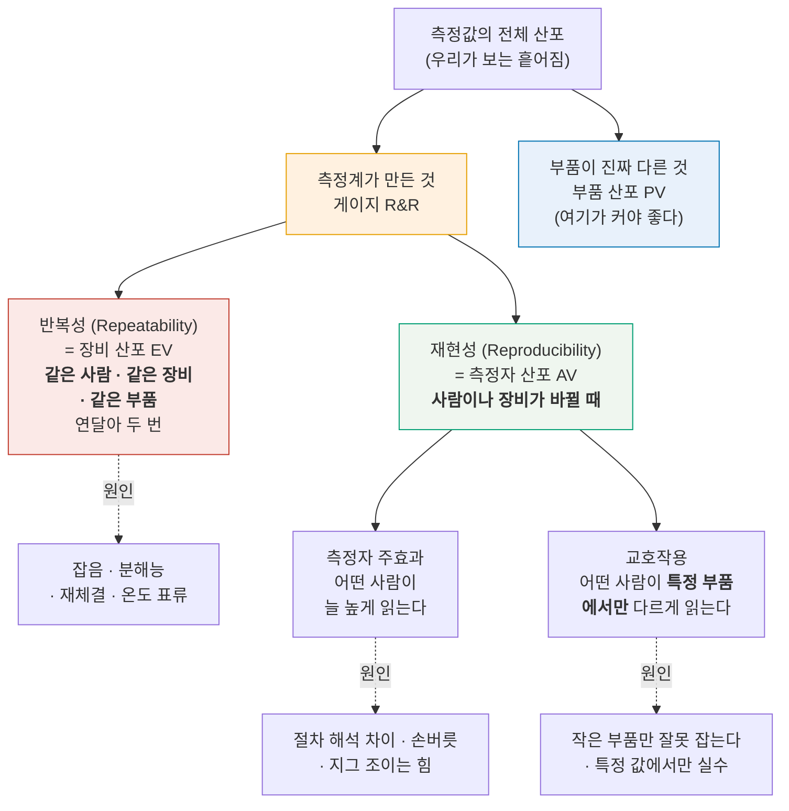
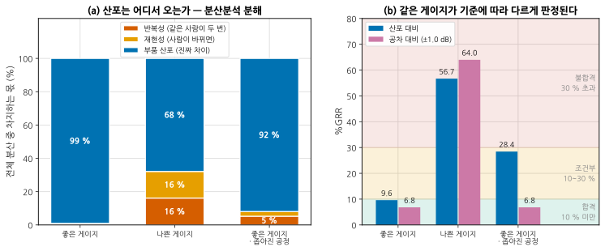
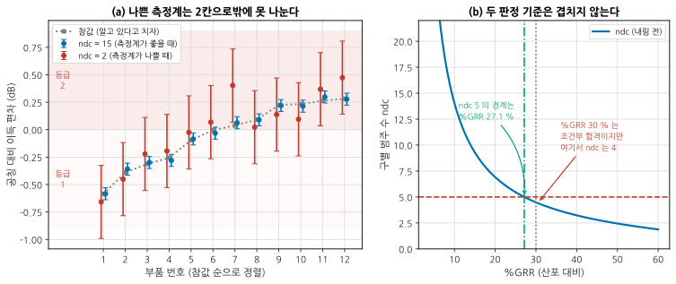
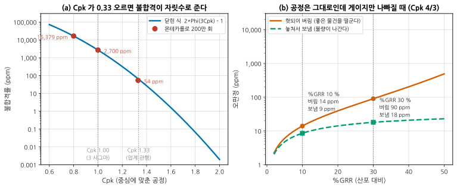
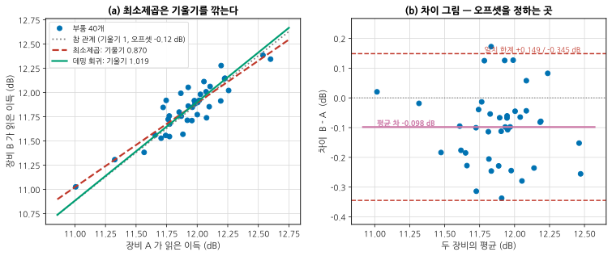

# B11 — 측정 시스템 분석: 반복성·재현성·상관

**문서 번호**: RF-CUR-B11 · **버전**: v1.0 · **분량**: 이론 4 h + 실습 8 h

> "이 물건이 12.3 dB 입니다" 라는 문장에는 사람과 장비와 시각이 숨어 있습니다. 다른 사람이 다른 장비로 내일 재도 12.3 이 나오는가 — 이 모듈은 그 질문에 숫자로 답하는 방법입니다.

| | |
|---|---|
| **선수 모듈** | [M14](../01_모듈/M14_정밀측정1_교정과불확도.md)(불확도 예산), [M16](../01_모듈/M16_DUT검증과튜닝과자동화.md)(가드밴딩·자동화), [B01](./B01_벤치방법론.md)(반복성 실험 설계) |
| **이 모듈이 소유하는 개념** | **측정 시스템 분석(MSA)**과 불확도의 차이, **반복성과 재현성**의 정확한 구분, 게이지 R&R 연구 설계(부품×측정자×반복), 분산분석에 의한 **분산 성분 분해**, **%GRR**의 두 기준(산포 대비·공차 대비), **구별 범주 수(ndc)**, Cp·Cpk와 수율, 측정 오차가 만드는 **헛되이 버림과 놓쳐서 보냄**, 장비 간 상관 검증과 **데밍 회귀**, 차이 그림, 측정 회귀 시험, 이상치 처리 |
| **이 모듈을 쓰는 후속 모듈** | **B12**(양산 이관), 심화 캡스톤 P4 |
| **학습 목표** | ① 산포의 몇 할이 측정계 몫인지 **분산분석으로 가른다** ② %GRR·ndc 로 판정하고 **두 기준이 어긋나는 곳**을 안다 ③ 장비 두 대를 맞댈 때 **최소제곱을 쓰지 않는다** |

---

## B11.0 이 모듈의 범위

기본 과정이 여기까지 왔습니다.

| 이미 배운 것 | 어디서 |
|---|---|
| 한 번의 측정에 붙는 불확도 예산 (GUM) | [M14 §10](../01_모듈/M14_정밀측정1_교정과불확도.md) |
| 가드밴딩 — 한계를 얼마나 당길 것인가 | [M16 §5](../01_모듈/M16_DUT검증과튜닝과자동화.md) |
| 반복 측정과 재체결 산포 | [B01 §4](./B01_벤치방법론.md) |
| 정규분포·표준편차·포함 인자 k | [M14 §10](../01_모듈/M14_정밀측정1_교정과불확도.md) |

**이 모듈은 그 위에 하나를 얹습니다** — 한 번이 아니라 **여러 번·여러 사람·여러 장비**. 불확도가 "이 측정값에 얼마를 ± 붙일 것인가" 라면, 게이지 R&R 은 "**우리가 보는 산포 중 얼마가 측정계가 만든 것인가**" 입니다.

> ⚠️ **다른 모듈과의 역할 분리**
>
> | 개념 | B11 (여기) | 다른 모듈 |
> |---|---|---|
> | 불확도 예산 (한 번의 측정) | 비교만 | [M14 §10](../01_모듈/M14_정밀측정1_교정과불확도.md)이 소유 |
> | 가드밴딩의 원리 | **양산 규모의 재론은 B12** | [M16 §5](../01_모듈/M16_DUT검증과튜닝과자동화.md)가 소유 |
> | VNA 교정과 잔류 오차 | 인용만 | [M14 §4](../01_모듈/M14_정밀측정1_교정과불확도.md)가 소유 |
> | 재체결 산포의 물리 | 인용만 | [B01 §4](./B01_벤치방법론.md) · [B03 §7](./B03_다포트차동과픽스처.md) |
> | OTA 불확도 예산 | 인용만 | [B09 §6](./B09_안테나와OTA.md)가 소유 |
> | 시험 항목 선정·시험 시간 | **다루지 않습니다** | [B12 §2](./B12_양산이관.md) · [B12 §3](./B12_양산이관.md) |
> | 공정 관리도(SPC) 운영 | **다루지 않습니다** | 이 커리큘럼의 범위 밖 |

---

## B11.1 불확도와 게이지 R&R 은 무엇이 다른가

둘 다 "측정이 흔들린다" 를 다루지만 **묻는 것이 다릅니다.**

| | 불확도 (M14) | 게이지 R&R (여기) |
|---|---|---|
| 질문 | 이 값에 얼마를 ± 붙이나 | 우리가 보는 산포 중 얼마가 측정계 몫인가 |
| 대상 | **한 번의 측정** | **하나의 측정 시스템** |
| 재료 | 교정 성적서, 정합 오차, 잡음 — 대부분 **계산** | 실제로 여러 번 잰 **데이터** |
| 결과 | ±0.29 dB (k=2) 같은 값 | %GRR 9.6 %, ndc 14 같은 판정 |
| 놓치는 것 | 사람과 날짜가 안 들어간다 | 계통 오차(치우침)는 안 잡힌다 |

**둘은 대체재가 아니라 보완재입니다.** 불확도 예산은 치우침을 잡고, 게이지 R&R 은 흩어짐을 잡습니다. 예산이 아무리 좋아도 측정자마다 값이 다르면 소용없고, 반대로 세 사람이 똑같이 잰다고 해서 그 값이 맞다는 뜻은 아닙니다 — **셋이 똑같이 틀릴 수 있습니다.**

> 📌 **어느 쪽부터 하는가.** 불확도 예산이 먼저입니다. 예산이 없으면 게이지 R&R 결과를 봐도 "이게 좋은 건가" 를 판단할 기준이 없습니다. 다만 **양산으로 넘길 물건**이면 게이지 R&R 없이는 못 넘깁니다 — 고객이 요구합니다.

---

## B11.2 반복성과 재현성 — 두 낱말을 정확히

일상어로는 둘 다 "또 재도 같은가" 지만, MSA 에서는 뜻이 갈립니다.

*그림 B11-1. 산포의 계보. **읽는 법**: 위에서 아래로 내려가며 갈라집니다. 가장 중요한 갈림은 첫 번째입니다 — **측정계가 만든 것과 부품이 진짜 다른 것.** 그 아래에서 측정계 몫이 다시 반복성과 재현성으로 갈리고, 재현성은 다시 주효과와 교호작용으로 갈립니다. 원인 상자(점선)는 각 성분이 크게 나왔을 때 **어디를 봐야 하는지** 알려 줍니다.*

**대책이 갈리기 때문에 구분합니다.**

| 무엇이 크게 나왔나 | 무엇을 고치나 |
|---|---|
| **반복성** | 장비·지그·절차. 평균 횟수를 늘리거나, 재체결을 없애거나, 워밍업을 늘린다 ([B01 §3](./B01_벤치방법론.md)) |
| **재현성 (주효과)** | 사람. 작업 표준서를 다시 쓰고 교육한다. 자동화하면 대개 사라진다 |
| **재현성 (교호작용)** | 대개 **지그**. 특정 크기·특정 값의 부품에서만 어긋난다면 물리적인 원인이 있다 |

> ⚠️ **"자동화하면 재현성 문제가 없다" 는 반만 맞습니다.** 사람이 빠지면 측정자 주효과는 사라지지만, **장비가 여러 대면 장비가 새 '측정자'** 가 됩니다. 라인에 시험기가 넉 대 있으면 그 넉 대가 재현성의 대상입니다 — 이것을 사이트 간 상관이라 부르고 [B12 §4](./B12_양산이관.md) 에서 다시 다룹니다.

---

## B11.3 연구 설계 — 몇 개, 몇 명, 몇 회

표준 설계는 **부품 10개 × 측정자 3명 × 반복 3회 = 90회** 입니다. 이유가 있습니다.

| 축 | 표준값 | 왜 그 수인가 | 줄이면 |
|---|---|---|---|
| 부품 | 10 | 부품 산포를 추정하는 자유도. **공정 산포 전체를 대표하도록** 골라야 한다 | 부품 산포 추정이 나빠져 %GRR 이 통째로 흔들린다 |
| 측정자 | 3 | 재현성 성분의 최소 자유도 | 2명이면 재현성이 사실상 "두 사람 차이" 하나뿐 |
| 반복 | 3 | 반복성 자유도 (부품×측정자마다 2) | 2회면 반복성 추정의 흔들림이 커진다 |

> 📌 **부품 고르기가 가장 중요합니다.** "좋은 것만 10개" 를 고르면 부품 산포가 작게 나오고, 그러면 산포 대비 %GRR 이 나쁘게 나옵니다 — 게이지는 그대로인데. **공정에서 나오는 범위를 고루 덮도록** 골라야 합니다. 그래서 실무에서는 라인에서 무작위로 뽑되, 뽑힌 것의 분포가 공정 분포와 비슷한지 확인합니다.

**측정 순서는 섞습니다.** 한 사람이 10개를 세 번 연달아 재면 세 번째에는 손에 익어 값이 달라집니다. 부품 순서를 무작위로 하고, 측정자가 앞사람의 값을 못 보게 합니다 — 그러지 않으면 **재현성이 인위적으로 작게** 나옵니다.

---

## B11.4 %GRR 계산과 판정

분산분석(ANOVA)이 표준 방법입니다. 90개 값에서 네 개의 분산을 뽑습니다.

$$\sigma^2_{\text{전체}} = \underbrace{\sigma^2_{\text{반복}} + \sigma^2_{\text{측정자}} + \sigma^2_{\text{교호}}}_{\text{게이지 R\&R}} + \sigma^2_{\text{부품}}$$

$$\%GRR_{\text{산포}} = 100 \times \frac{\sigma_{\text{GRR}}}{\sigma_{\text{전체}}}$$

**분산은 더하고 표준편차는 안 더합니다.** 이 한 줄이 계산의 전부입니다. 그리고 여기서 초심자가 늘 놀라는 일이 생깁니다 — 측정계 몫이 **분산으로는 1 %** 인데 **표준편차 비로는 10 %** 로 적힙니다. 제곱근을 취하기 때문입니다.

*그림 B11-2. 분산 분해와 두 기준. **읽는 법**: 왼쪽은 전체 분산 100 % 를 셋으로 쪼갠 것입니다. 좋은 게이지는 부품 산포가 **99 %** 를 차지해 아래쪽 두 칸이 거의 안 보입니다. 나쁜 게이지는 반복성과 재현성이 각각 16 % 씩 먹고 있습니다. 오른쪽은 같은 세 경우를 두 가지 판정 기준으로 다시 그린 것인데, **세 번째 막대 쌍을 보십시오** — 같은 게이지·같은 측정 데이터인데 산포 대비 28.4 %(조건부)와 공차 대비 6.8 %(합격)로 갈립니다.*

### 판정 구간 (AIAG MSA 4판)

| %GRR | 판정 | 실무에서 |
|---|---|---|
| **10 % 미만** | 합격 | 그대로 쓴다 |
| **10 ~ 30 %** | 조건부 | 특성의 중요도·공정 능력·개선 비용을 **문서로 남기고** 결정한다 |
| **30 % 초과** | 불합격 | 고객 승인 없이는 못 쓴다 |
| 그리고 | **ndc ≥ 5** | %GRR 과 **둘 다** 만족해야 한다 (§5) |

> ⚠️ **10 % 와 30 % 는 물리가 아니라 관행입니다.** AIAG 가 정한 산업 표준일 뿐, 이 숫자를 만드는 방정식은 없습니다. 여러분의 제품이 안전에 관계되면 5 % 를 요구할 수도 있고, 값이 싸고 대체가 쉬우면 40 % 로도 삽니다. **숫자보다 중요한 것은 근거를 남기는 것**입니다.

### 옛 방법과 대조해 보기

분산분석이 없던 시절에는 범위(최대 − 최소)에 상수를 곱해 표준편차를 어림하는 **평균-범위(X̄-R) 법**을 썼습니다. 이 모듈의 계산기는 두 방법을 나란히 돌려 봅니다 — 세 경우 모두 **3 % 안**에서 일치했습니다. 다만 평균-범위 법은 **교호작용을 따로 떼지 못하므로**, 교호작용이 큰 데이터에서는 두 값이 벌어집니다. 그때는 분산분석 쪽이 맞습니다.

---

## B11.5 ndc — 이 측정기는 등급을 몇 개로 나눌 수 있는가

%GRR 이 "측정계 몫이 몇 % 인가" 라면, ndc 는 "**그래서 물건을 몇 등급으로 가를 수 있는가**" 입니다.

$$ndc = 1.41 \times \frac{\sigma_{\text{부품}}}{\sigma_{\text{GRR}}} \quad (\text{내림})$$

1.41 은 √2 입니다. 두 부품의 측정값이 서로 구별되려면 차이가 측정 산포의 √2 배는 되어야 한다는 데서 나옵니다.

*그림 B11-3. 등급을 가른다는 것. **읽는 법**: 왼쪽은 부품 12개를 참값 순으로 늘어놓고 두 측정계로 잰 것입니다. 파란 점(좋은 측정계)은 오차 막대가 짧아 이웃과 구별되지만, 빨간 점(나쁜 측정계)은 막대가 겹쳐 **띠 두 개(등급 1·2)** 로밖에 못 가릅니다. 오른쪽은 %GRR 과 ndc 의 관계인데, **두 판정선이 겹치지 않습니다** — ndc 5 의 경계는 %GRR 27.1 % 이고, %GRR 이 정확히 30 % 인 게이지의 ndc 는 4 입니다.*

> ⚠️ **%GRR 30 % 를 통과하고도 ndc 에서 떨어집니다.** AIAG 는 두 기준을 **함께** 요구하는데, 위 그림처럼 둘은 같은 선이 아닙니다. %GRR 이 27.1 ~ 30 % 구간이면 "조건부 합격이지만 ndc 불합격" 이라는 어정쩡한 상태가 됩니다. 이 커리큘럼의 세 번째 게이지(28.4 %)가 정확히 그 자리입니다 — **ndc 4.76 → 4.**
>
> 실무에서는 이때 대개 %GRR 쪽을 인용해 "조건부 합격" 으로 넘어가려 합니다. **ndc 를 함께 적으십시오.** 등급을 4개로밖에 못 가르는 측정기로 등급을 5개로 나누는 판정을 할 수는 없습니다.

---

## B11.6 공차 대비 vs 산포 대비 — 어느 쪽으로 볼 것인가

%GRR 의 분모를 무엇으로 두느냐에 따라 값이 달라집니다.

| 기준 | 분모 | 무엇을 묻나 |
|---|---|---|
| **산포 대비** | 전체 산포 σ_전체 | 이 측정기로 **부품끼리 구별**할 수 있는가 |
| **공차 대비** | 공차 폭 (USL − LSL) | 이 측정기로 **합격·불합격을 가를** 수 있는가 |

$$\%GRR_{\text{공차}} = 100 \times \frac{6\,\sigma_{\text{GRR}}}{\text{USL} - \text{LSL}}$$

그림 B11-2 의 세 번째 경우가 이 차이를 만듭니다. 공정을 개선해 부품 산포가 0.300 → 0.100 dB 로 좁아졌습니다. 게이지는 그대로입니다.

| | 좋은 게이지 (공정 그대로) | 같은 게이지 (공정 좁아짐) |
|---|---|---|
| 산포 대비 %GRR | 9.6 % (합격) | **28.4 % (조건부)** |
| 공차 대비 %GRR | 6.8 % (합격) | **6.8 % (합격)** |
| ndc | 14 | **4 (불합격)** |

**공정을 잘 관리했더니 측정 시스템이 불합격이 됐습니다.** 이것은 계산 오류가 아니라 정의의 결과입니다 — 부품이 다 비슷해지면 그것들을 구별하기가 더 어려워집니다.

> 📌 **어느 쪽을 쓰나.**
>
> - **합격 판정만 하는 양산 시험** → 공차 대비. 등급을 가를 일이 없다.
> - **선별·등급 매기기·공정 개선용 측정** → 산포 대비. 부품끼리 구별해야 한다.
> - **고객이 지정하면** 그것을 따른다. 자동차 계열은 대개 공차 대비를 씁니다.
>
> **둘 다 적으십시오.** 어느 하나만 적은 보고서는 유리한 쪽을 골랐다는 의심을 받습니다.

---

## B11.7 Cp·Cpk 와 수율, 그리고 측정 오차

공정 능력 지수는 **공차 폭이 공정 산포의 몇 배인가**입니다.

$$C_p = \frac{\text{USL} - \text{LSL}}{6\sigma}, \qquad C_{pk} = \min\!\left(\frac{\text{USL} - \mu}{3\sigma},\ \frac{\mu - \text{LSL}}{3\sigma}\right)$$

Cp 는 폭만 보고, Cpk 는 **치우침까지** 봅니다. 중심에 맞춰져 있으면 둘이 같습니다.

*그림 B11-4. 능력과 오판정. **읽는 법**: 왼쪽은 Cpk 와 불합격률(ppm, 100만 개당 몇 개)입니다. 축이 로그라 직선처럼 보이지만 **Cpk 가 0.33 오를 때마다 자릿수가 하나씩 떨어집니다** — 1.00 에서 2,700 ppm, 4/3 에서 63 ppm. 오른쪽은 공정을 Cpk 4/3 로 고정한 채 **게이지만** 나빠지게 한 것입니다. %GRR 10 % 에서 30 % 로 가면 멀쩡한 물건을 버리는 양이 14 → 90 ppm 으로 늘어납니다.*

### 측정 오차는 수율을 두 방향으로 갉아먹는다

참값이 규격 안인데 측정이 밖으로 나가면 **헛되이 버림**(생산자 위험), 참값이 밖인데 측정이 안으로 들어오면 **놓쳐서 보냄**(소비자 위험)입니다.

| %GRR | 헛되이 버림 | 놓쳐서 보냄 |
|---|---|---|
| 10 % | 14 ppm | 9 ppm |
| 30 % | 90 ppm | 18 ppm |

**언제나 '헛되이 버림' 이 더 많습니다.** 공정 중심이 규격 안쪽에 있으므로 경계 근처에서 안쪽 개체가 바깥쪽 개체보다 훨씬 많기 때문입니다. 이것이 "측정을 개선하면 수율이 오른다" 는 현장의 경험을 설명합니다 — 없던 물건이 생기는 게 아니라 **잘못 버리던 것을 안 버리게** 되는 것입니다.

> ⚠️ **수율은 시뮬레이션으로 확인할 수 없습니다.** 그림의 몬테카를로 점이 Cpk 1.67 에 없는 이유가 이것입니다. 그 지점의 불합격률은 0.6 ppm 인데, 200만 번을 뽑아도 기댓값이 1.2개입니다. **양산 수율 목표는 계산으로만 검증되고, 실측으로는 몇 달치 데이터가 쌓여야 확인됩니다.**

---

## B11.8 장비를 바꿨을 때 — 상관 검증

장비 A 를 B 로 바꾸거나, 라인에 두 번째 시험기를 놓을 때 하는 일입니다. **같은 부품 40개 안팎을 두 장비로 재고 관계식을 찾습니다.**

*그림 B11-5. 두 장비 맞대기. **읽는 법**: 왼쪽에서 세 직선을 비교하십시오. 회색 점선이 참 관계(기울기 1, 오프셋 −0.12 dB)인데, 초록 실선(데밍 회귀)은 그 위에 거의 겹치고 **빨간 파선(최소제곱)은 기울기가 0.870 으로 깎여** 있습니다. 오른쪽은 같은 데이터의 차이 그림입니다 — 가로축이 두 장비의 평균, 세로축이 차이입니다. 여기서 읽는 것은 **평균 차(오프셋)와 일치 한계(흩어짐)** 두 가지입니다.*

### 왜 최소제곱을 쓰면 안 되는가

최소제곱은 **가로축에 오차가 없다고 가정**합니다. 세로 방향 거리만 최소화하기 때문입니다. 그런데 장비 A 도 측정기입니다 — 가로축에도 오차가 있습니다. 이때 기울기는 이 비율만큼 0 쪽으로 깎입니다.

$$\text{기울기}_{\text{최소제곱}} = \text{참 기울기} \times \frac{\sigma^2_{\text{참}}}{\sigma^2_{\text{참}} + \sigma^2_{A}}$$

이 예에서는 0.09/(0.09+0.01) = **0.900** 이고, 400회 반복 시뮬레이션의 평균 기울기가 0.897 로 그대로 나왔습니다. 이 현상에는 **회귀 희석(regression dilution)** 또는 **감쇠 편의(attenuation bias)** 라는 이름이 붙어 있습니다.

**증상은 단순합니다 — 축을 바꾸면 답이 달라집니다.**

| 방법 | B 를 A 로 회귀 | A 를 B 로 회귀의 역수 | 같은가 |
|---|---|---|---|
| 최소제곱 | 0.870 | 1.080 | **아니오** |
| 데밍 회귀 | 1.019 | 1.019 | **예** |

데밍 회귀는 두 축의 오차 분산비 λ = σ²_B/σ²_A 를 알고 있다고 두고, 그 비율로 가중한 **수직 거리**를 최소화합니다. λ = 1 이면 직교 회귀와 같습니다. λ 는 각 장비의 반복성(§2)에서 얻습니다 — **게이지 R&R 을 먼저 하는 또 하나의 이유**입니다.

### 그런데 실무에서 실제로 쓰는 것은 차이 그림

회귀선보다 오른쪽 그림이 더 자주 쓰입니다. 회귀식은 "얼마를 곱하고 얼마를 더할까" 를 주지만, 실무의 질문은 대개 "**두 장비를 바꿔 써도 되는가**" 이기 때문입니다.

| 읽는 것 | 이 예 | 무엇을 뜻하나 |
|---|---|---|
| 평균 차 | −0.098 dB | **계통 오차.** 오프셋으로 보정하면 없앨 수 있다 |
| 일치 한계 (평균 차 ± 1.96s) | +0.149 / −0.345 dB | **바꿔 쓸 때 각오할 폭.** 이 폭이 공차보다 크면 못 바꾼다 |
| 기울기 (경향) | 없음 | 값의 크기에 따라 차이가 변하면 오프셋만으로는 못 고친다 |

차이의 표준편차 0.126 dB 는 두 장비 반복성의 제곱합 √(0.10² + 0.06²) = 0.117 dB 와 맞습니다. **차이 그림의 흩어짐은 새로운 정보가 아니라 두 장비 반복성의 합**이라는 뜻입니다 — 그래서 흩어짐이 예상보다 크면 반복성 말고 다른 원인(지그, 온도, 순서 효과)이 있다는 신호입니다.

---

## B11.9 측정 회귀 시험 — 어제와 오늘이 같은가

게이지 R&R 은 **한 시점의 사진**입니다. 시간이 지나면 케이블이 늙고, 교정이 밀리고, 소프트웨어가 갱신됩니다. 그래서 계속 재는 절차를 둡니다.

| 무엇을 | 얼마나 자주 | 판정 |
|---|---|---|
| **기준 시료(골든 유닛)** 1~3개 | 매일 시작 전 | 관리 한계 밖이면 라인 정지 |
| 짧은 반복성 점검 (한 사람 × 5회) | 주 1회 | 반복성이 게이지 R&R 때의 1.5배를 넘으면 조사 |
| 전체 게이지 R&R | 연 1회 · 장비/지그/소프트웨어 변경 시 | §4 판정 |
| 장비 간 상관 | 장비 추가·수리 후 | §8 일치 한계 |

> 📌 **소프트웨어 갱신은 측정계 변경입니다.** VNA 펌웨어를 올리거나 자동화 스크립트를 고친 뒤에는 **같은 시료를 다시 재서 값이 같은지** 확인해야 합니다. 이것을 게을리해서 생기는 사고가 의외로 흔합니다 — 평균 필터의 기본값이 바뀌었다거나, 단위 해석이 달라졌다거나.

기준 시료는 **잰다고 변하지 않는 것**이어야 합니다. 능동 소자는 늙습니다. 가능하면 수동 부품(감쇠기, 필터, 짧은 선로)을 쓰고, 능동 모듈을 써야 한다면 **그 시료 자체의 표류를 따로 추적**하십시오 — 장비가 표류하는지 시료가 표류하는지 구별해야 합니다. 시료를 두 개 이상 두면 구별할 수 있습니다.

---

## B11.10 이상치를 버릴 때와 버리면 안 될 때

게이지 R&R 데이터에 튀는 값이 하나 있으면 %GRR 이 통째로 흔들립니다. 그래서 버리고 싶어집니다.

**버려도 되는 경우 — 물리적 원인을 찾았을 때만.**

| 원인을 찾았다 | 어떻게 하나 |
|---|---|
| 케이블이 덜 잠겨 있었다 | 그 점을 버리고 **다시 잰다.** 기록에 남긴다 |
| 소프트웨어가 이전 값을 다시 썼다 | 같음 |
| 시료를 잘못 집었다 | 같음 |

**버리면 안 되는 경우.**

| 상황 | 왜 |
|---|---|
| 원인을 못 찾았다 | 그 값이 **측정계의 진짜 성질**일 수 있다. 100번에 한 번 튀는 측정기는 100번에 한 번 튄다 |
| "통계적으로 이상치라서" | 3σ 밖이라는 것은 원인이 아니라 증상이다 |
| 버리면 판정이 통과라서 | 이유가 되지 못한다 |

> ⚠️ **한 점이 판정을 뒤집으면 그 자체가 결론입니다.** 90개 중 하나를 빼야 합격하는 측정 시스템은 합격이 아닙니다. 그 한 점이 왜 생겼는지가 이 연구의 가장 중요한 발견입니다.

**버린 점은 반드시 기록에 남깁니다** — 몇 번째 점을, 왜, 어떻게 처리했는지. 이것을 남기지 않은 게이지 R&R 보고서는 감사에서 통째로 무효가 됩니다.

---

## B11.L 실습

> **등급 표기**: **T0** = 계산기·PC 만으로 · **T1** = 기본 계측기 · **T2** = 전문 장비. 등급 정의는 [설계서 §7](./00_심화과정_설계서.md) 참조.

### L-B11-a (T0) — 게이지 R&R 계산기를 직접 구현

**목표**: §4 의 분산분석을 손으로 짚어 본다. 남이 만든 표를 믿기 전에.

1. 부품 10 × 측정자 3 × 반복 3 배열을 만든다 (`scripts/gen_fig_b11.py` 의 `make_study` 를 써도 되고, 공개 예제 데이터를 써도 된다).
2. 제곱합 네 개(부품·측정자·교호·오차)를 직접 계산한다.
3. 평균제곱에서 분산 성분을 뽑는다. **음수가 나오면 0 으로 자르고, 왜 그런지 적는다.**
4. %GRR 을 산포 대비·공차 대비 둘 다 낸다.
5. ndc 를 낸다.
6. 같은 데이터를 평균-범위 법으로도 계산해 대조한다.

**보고**: 분산 성분 표, 두 기준의 %GRR, ndc, 판정, 두 방법의 차이와 그 이유.

**막히면**: 3번에서 σ²_측정자 = (MS_측정자 − MS_교호)/(부품수 × 반복수) 입니다. 분모에 교호작용 항이 들어가는 것을 빠뜨리기 쉽습니다.

### L-B11-b (T1) — 실제 DUT 10개로 게이지 R&R

**목표**: 우리 벤치가 실제로 몇 % 인지 안다.

**필요**: DUT 10개, 측정자 3명, 계측기 한 대.

1. **부품을 고른다** — 라인이나 재고에서 무작위로. 값이 고루 퍼졌는지 확인한다 (§3).
2. 측정 순서표를 만든다. 부품 순서를 무작위로 하고, **앞사람 값을 못 보게** 한다.
3. 90회를 잰다. 재체결까지 포함해서 — 재체결을 안 하면 반복성이 실제보다 좋게 나온다.
4. L-B11-a 의 계산기로 판정한다.
5. 반복성과 재현성 중 **큰 쪽에 대해** §2 의 대책 표에서 하나를 골라 적용하고 다시 잰다.

**보고**: 원 데이터, 분산 분해, 판정, 개선 전후 비교.

**막히면**: 3명을 못 모으면 2명 × 4회로 하되, **재현성 자유도가 1 밖에 안 된다는 점을 보고서에 적으십시오.** 그 값은 참고치입니다.

### L-B11-c (T0) — Cpk 와 수율을 몬테카를로로 확인

**목표**: §7 의 곡선을 스스로 만들고, 시뮬레이션의 한계도 함께 본다.

1. Cpk 0.8 · 1.0 · 4/3 · 1.67 에 대해 닫힌 식으로 불합격률을 낸다.
2. 같은 값을 200만 회 몬테카를로로 낸다.
3. **어느 지점부터 몬테카를로가 못 따라오는지** 찾고, 필요한 표본 수를 계산한다.
4. 측정 오차를 넣어 헛되이 버림·놓쳐서 보냄을 계산한다 (%GRR 을 5 · 10 · 20 · 30 % 로).
5. 우리 제품의 공차와 실제 산포를 넣어 같은 표를 만든다.

**보고**: 두 방법 대조표, 몬테카를로의 한계 지점과 그 이유, 우리 제품의 오판정 추정치.

**막히면**: 3번의 기준은 "기대 사건 수가 100개 이상" 입니다. 0.6 ppm 을 재려면 1.7억 번을 뽑아야 합니다.

### L-B11-d (T0) — 장비 두 대의 상관 데이터로 보정식 도출

**목표**: §8 을 데이터로 한다.

1. 같은 부품 40개를 두 장비로 잰 데이터를 준비한다 (없으면 `two_testers` 로 만든다).
2. 최소제곱으로 기울기·절편을 낸다.
3. **축을 바꿔 다시** 최소제곱을 내고 역수와 비교한다.
4. 각 장비의 반복성(§2 결과)에서 λ 를 구해 데밍 회귀를 낸다. 축을 바꿔도 같은지 확인한다.
5. 차이 그림을 그리고 평균 차·일치 한계를 읽는다.
6. **일치 한계가 공차의 몇 % 인지** 계산하고, 바꿔 써도 되는지 판정한다.

**보고**: 세 직선을 겹친 그림, 축을 바꿨을 때의 표, 차이 그림, 판정과 근거.

**막히면**: 4번의 λ 는 σ²_y/σ²_x 입니다 — 분자가 세로축입니다. 뒤집으면 기울기가 반대로 틀립니다.

---

## B11.Q 확인 문제

<b>Q1.</b> 게이지 R&R 을 했더니 %GRR 이 9 % 로 합격인데 ndc 가 4 가 나왔습니다. 계산이 틀렸습니까?

**틀리지 않았을 가능성이 큽니다.** 다만 그 조합은 **일어날 수 없습니다** — 확인이 필요합니다.

두 값은 같은 재료(σ_GRR, σ_부품)에서 나오므로 서로 묶여 있습니다.

$$ndc = 1.41\sqrt{\frac{1}{p^2} - 1}, \qquad p = \frac{\sigma_{\text{GRR}}}{\sigma_{\text{전체}}}$$

%GRR 9 % 를 넣으면 ndc = 1.41 × √(1/0.0081 − 1) = **15.6 → 15** 입니다. 4 가 나올 수 없습니다.

**그러니 둘 중 하나입니다.**

1. **두 값을 다른 기준으로 냈다.** %GRR 은 공차 대비, ndc 는 산포 대비로 계산했을 가능성이 큽니다. §6 의 세 번째 경우가 정확히 이 모양입니다 — 공차 대비 6.8 %, ndc 4. 이 경우 **계산은 맞고 보고서 표기가 틀렸습니다.** 어느 기준인지 반드시 병기하십시오.
2. **σ_부품 을 다른 데이터에서 가져왔다.** 게이지 R&R 연구의 10개가 아니라 공정 전체 데이터의 산포를 넣었다면 두 값이 어긋납니다.

**확인 방법**: %GRR(산포 대비) 하나만으로 ndc 를 계산해 보십시오. 보고된 ndc 와 다르면 기준이 섞인 것입니다.

<b>Q2.</b> 공정을 개선했더니 게이지 R&R 이 불합격으로 바뀌었습니다. 측정기는 손도 안 댔습니다.

**정상입니다.** §6 에서 본 그대로입니다.

산포 대비 %GRR 의 분모는 **전체 산포**이고, 전체 산포는 부품 산포를 포함합니다. 부품이 다 비슷해지면 분모가 작아지고 %GRR 이 커집니다.

| | 개선 전 | 개선 후 |
|---|---|---|
| σ_부품 | 0.300 dB | 0.100 dB |
| σ_GRR | 0.029 dB | 0.029 dB (그대로) |
| 산포 대비 %GRR | 9.6 % | **28.4 %** |
| ndc | 14 | **4** |
| 공차 대비 %GRR | 6.8 % | **6.8 %** |

**무엇을 할 것인가는 그 측정을 어디에 쓰느냐가 정합니다.**

- **합격 판정만 한다면** 공차 대비를 보십시오. 아무것도 안 변했습니다. 보고서에 두 값을 다 적고 근거를 남기면 됩니다.
- **선별하거나 등급을 매긴다면** 진짜 문제입니다. 이제 이 측정기로는 4등급까지밖에 못 가릅니다. 측정계를 개선해야 합니다.

> 이 상황은 잘 굴러가는 라인에서 **반드시** 찾아옵니다. 공정이 좋아질수록 측정계에 요구되는 수준이 올라가기 때문입니다. 미리 알고 있으면 "개선했더니 나빠졌다" 는 소동을 피할 수 있습니다.

<b>Q3.</b> 새 시험기를 들이면서 상관을 봤더니 기울기가 0.87 이 나왔습니다. 0.87 로 나눠서 보정하면 됩니까?

**안 됩니다.** 그 0.87 은 대부분 **가짜**입니다.

최소제곱은 가로축에 오차가 없다고 가정합니다. 그런데 가로축도 측정기입니다. 그래서 기울기가 이만큼 깎입니다.

$$\frac{\sigma^2_{\text{참}}}{\sigma^2_{\text{참}} + \sigma^2_{\text{가로축 장비}}}$$

**한 줄로 확인하는 법**: 축을 바꿔 다시 회귀해 보십시오. 이 예에서 B~A 는 0.870 인데 A~B 의 역수는 1.080 입니다. **같은 데이터에서 두 답이 나오면 둘 다 틀린 것입니다.**

**제대로 하려면.**

1. 각 장비의 **반복성**을 게이지 R&R 로 먼저 구합니다 (§2).
2. λ = σ²_세로축/σ²_가로축 을 계산합니다.
3. 데밍 회귀로 기울기를 냅니다. 이 예에서는 1.019 — **참값 1.000 에 붙습니다.**
4. 축을 바꿔도 같은 답이 나오는지 확인합니다.

그리고 대개 여기서 결론이 납니다: **기울기는 1 이고 오프셋만 있다.** 그러면 보정은 나눗셈이 아니라 뺄셈입니다 — 차이 그림에서 읽은 평균 차 −0.098 dB 를 더하면 끝입니다. 훨씬 안전한 보정입니다. 기울기 보정은 값의 범위 밖에서 급격히 틀어지지만, 오프셋 보정은 그렇지 않습니다.

<b>Q4.</b> 측정을 3번 평균 내면 반복성이 √3 배 좋아집니다. %GRR 도 그만큼 좋아집니까?

**아닙니다. 반복성 성분만 줄고 재현성은 그대로입니다.**

$$\sigma^2_{\text{GRR}} = \frac{\sigma^2_{\text{반복}}}{n} + \sigma^2_{\text{측정자}} + \sigma^2_{\text{교호}}$$

평균은 첫 항만 나눕니다. 그래서 **어느 성분이 큰가에 따라 효과가 완전히 다릅니다.**

| 경우 | σ_반복 | σ_재현 | 3회 평균 후 σ_GRR | 개선 |
|---|---|---|---|---|
| 반복성이 지배 | 0.135 | 0.020 | 0.081 | **1.68배** |
| 재현성이 지배 | 0.020 | 0.135 | 0.137 | 1.01배 (거의 없음) |

**그러니 분산 분해를 먼저 하는 것입니다.** 무엇이 큰지 모르고 평균 횟수부터 늘리면, 시험 시간만 3배가 되고 %GRR 은 그대로인 일이 생깁니다 — 양산에서는 그 시간이 곧 돈입니다 ([B12 §2](./B12_양산이관.md)).

그리고 **평균으로 못 없애는 것**이 하나 더 있습니다. 재체결마다 값이 달라진다면, 뽑지 않고 3번 재는 평균은 그 성분을 전혀 줄이지 못합니다. 무엇을 반복 단위로 삼을지가 §3 연구 설계의 핵심 결정입니다.

<b>Q5.</b> 90개 데이터 중 하나가 눈에 띄게 튑니다. 빼면 %GRR 이 32 % 에서 24 % 로 내려갑니다. 뺄까요?

**원인을 찾기 전에는 안 됩니다.** 그리고 이 경우는 특히 안 됩니다 — **한 점이 판정을 뒤집고 있기** 때문입니다.

순서는 이렇습니다.

1. **그 측정의 기록을 봅니다.** 언제, 누가, 몇 번째로 잰 값인가. 앞뒤 값과 함께 봅니다.
2. **재현되는지 봅니다.** 같은 부품·같은 사람으로 다시 10번 재 봅니다. 다시 튀면 그것은 이상치가 아니라 **성질**입니다.
3. **물리적 원인이 나오면** 그 점을 버리고 다시 재고, 기록에 남깁니다.
4. **안 나오면 버리지 않습니다.**

**4번이 실제로 가장 흔한 결과입니다.** 그리고 그 결과가 이 연구의 발견입니다 — "이 측정 시스템은 90번에 한 번 크게 튄다." 양산에서 90번에 한 번은 **하루에 수십 번**입니다.

> 판정을 뒤집으려고 점을 빼는 것과, 원인을 찾아 점을 빼는 것은 계산이 같아도 전혀 다른 일입니다. 구별하는 방법은 하나뿐입니다 — **빼기 전에 원인을 적었는가.**

<b>Q6.</b> 불확도 예산에서 ±0.29 dB (k=2) 가 나왔습니다. 게이지 R&R 을 또 해야 합니까?

**둘은 다른 것을 잡습니다. 대개 둘 다 필요합니다.**

| | 불확도 예산이 잡는 것 | 게이지 R&R 이 잡는 것 |
|---|---|---|
| 교정 성적서의 불확도 | ✅ | ❌ (값에 공통으로 들어가 산포로 안 보임) |
| 정합 오차 | ✅ | ❌ (같은 지그면 매번 같게 들어감) |
| 잡음·분해능 | ✅ | ✅ |
| 재체결 산포 | 넣을 수 있지만 값을 알기 어렵다 | ✅ (실측된다) |
| **측정자마다 다른 습관** | ❌ | ✅ |
| **장비 대 장비 차이** | ❌ | ✅ |
| **시간에 따른 표류** | 부분적으로 | ✅ (§9 로 이어서) |

**계통 오차는 게이지 R&R 이 못 잡습니다.** 세 사람이 모두 0.4 dB 씩 높게 읽으면 재현성은 0 으로 나오고 판정은 합격입니다. 그 0.4 dB 를 잡는 것이 불확도 예산과 교정입니다.

**반대로 사람과 시간은 불확도 예산이 못 잡습니다.** 예산표에 "측정자" 항목은 없습니다.

> 📌 **실무 순서**: 불확도 예산으로 이 측정이 **원리적으로** 얼마나 좋을 수 있는지 계산 → 게이지 R&R 로 **실제로** 얼마나 나오는지 측정 → 둘이 크게 다르면 그 차이가 어디서 오는지 조사. 예산이 ±0.29 dB 인데 게이지 R&R 의 σ_GRR 이 0.5 dB 이면, 예산에 없는 무언가가 있습니다. 그것을 찾는 것이 이 두 도구를 함께 쓰는 이유입니다.

---

## B11.A 이 모듈의 축약어

| 약어 | 영문 원어 | 한글 |
|---|---|---|
| MSA | Measurement System Analysis | 측정 시스템 분석 |
| GRR / Gage R&R | Gage Repeatability and Reproducibility | 게이지 반복성·재현성 |
| EV | Equipment Variation | 장비 산포 (= 반복성) |
| AV | Appraiser Variation | 측정자 산포 (= 재현성) |
| PV | Part Variation | 부품 산포 |
| TV | Total Variation | 전체 산포 |
| ndc | number of distinct categories | 구별 범주 수 |
| ANOVA | Analysis of Variance | 분산분석 |
| AIAG | Automotive Industry Action Group | (미국 자동차 산업 협의체) |
| Cp / Cpk | Process Capability Index | 공정 능력 지수 |
| USL / LSL | Upper / Lower Specification Limit | 규격 상한 / 하한 |
| ppm | parts per million | 100만분율 |
| GUM | Guide to the Expression of Uncertainty in Measurement | 측정 불확도 표현 지침 (→ M14) |
| DUT | Device Under Test | 시험 대상물 (→ M04) |
| VNA | Vector Network Analyzer | 벡터 회로망 분석기 (→ M04) |
| NF | Noise Figure | 잡음지수 (→ M01) |
| RF | Radio Frequency | 무선 주파수 (→ M01) |
| SPC | Statistical Process Control | 통계적 공정 관리 |

---

## B11.S 출처

> ⚠️ **원문 확인 권고**: 아래 주소는 검색 결과로 교차확인한 것이며 원문을 직접 열어 보지는 못했습니다. 중요한 수치는 원문에서 확인하십시오.
>
> **AIAG MSA 는 유료 표준이라 원문을 못 봤습니다.** 그래서 위 두 행의 등급이 **C(교육 사이트)** 입니다 — 판정 기준 자체를 1차 문서로 확인하지 못했다는 뜻입니다. §4 에서 "10 % 와 30 % 는 물리가 아니라 관행" 이라고 적은 이유가 여기에도 있습니다. **조직의 AIAG MSA 사본으로 확인하고, 다르면 그쪽을 따르십시오.**

| 주장 | 등급 | 출처 |
|---|---|---|
| AIAG 기준으로 %GRR 10 % 미만은 합격, 10~30 % 는 특성의 중요도·비용을 문서화한 뒤 조건부 합격, 30 % 초과는 고객 승인 없이 불합격이다 | C, C | [CalibrationOS — Gage R&R 절차와 합격 기준 (AIAG MSA)](https://calibrationos.com/learn/gage-rr-study-procedure) · [QualityEngineer.ai — %GRR·NDC 합격 기준](https://app.qualityengineer.ai/blog/gauge-rr-acceptance-criteria) |
| ndc = 1.41 × (부품 산포 / 게이지 R&R) 을 내림한 값이며 5 이상이어야 한다. AIAG MSA 4판은 %GRR 과 ndc 를 **함께** 요구하므로, %GRR 이 좋아도 ndc 가 5 미만이면 그것만으로 불합격이다 | C, C | [QualityEngineer.ai — %GRR·NDC 합격 기준](https://app.qualityengineer.ai/blog/gauge-rr-acceptance-criteria) · [SigmaDesk — Gage R&R / MSA 연구 해설](https://sigmadesk.app/blog/msa-gage-rr/) |
| 최소제곱은 가로축이 오차 없이 측정됐다고 가정하므로, 가로축에 오차가 있으면 기울기를 참값보다 작게 추정한다. 이를 회귀 희석 또는 감쇠 편의라 한다 | B, B | [Analyse-it — 방법 비교에 쓸 회귀 고르기](https://analyse-it.com/learn/choosing-a-regression-for-method-comparison) · [SAS — 서로 다른 측정법을 비교하는 데밍 회귀](https://blogs.sas.com/content/iml/2019/01/07/deming-regression-sas.html) |
| 데밍 회귀는 두 방법 모두의 측정 불확도를 반영해 오차 분산비로 가중한 수직 거리를 최소화하며, 그 결과 계통·비례 편의를 편향 없이 추정한다 | B, B | [CRAN valytics — 방법 비교를 위한 데밍 회귀](https://cran.r-project.org/web/packages/valytics/vignettes/deming-regression.html) · [Analyse-it — 방법 비교에 쓸 회귀 고르기](https://analyse-it.com/learn/choosing-a-regression-for-method-comparison) |
| 두 측정법의 일치도를 볼 때는 평균 대 차이 그림(Bland-Altman)에서 평균 차와 일치 한계를 함께 읽는다 | B | [arXiv — Bland-Altman 그림의 유용성과 추론](https://arxiv.org/pdf/2108.12937) |

**본문의 숫자는 전부 계산입니다.** `python3 scripts/gen_fig_b11.py` 를 실행하면 인용값이 출력되고 자체 검산 32항목이 함께 돕니다. 교차검증은 네 갈래입니다.

1. **분산 분해** — 큰 표본(부품 60 × 측정자 6 × 반복 8)에서 분산분석이 **생성에 쓴 참값**을 되찾는지 확인 (반복성 0.135 → 0.134, 교호작용 0.045 → 0.045). 그리고 세 경우 모두 AIAG 평균-범위 법과 3 % 안에서 일치
2. **ndc** — 분산 성분에서 직접 계산한 값과 %GRR 하나만으로 계산한 닫힌 식이 일치. 그 닫힌 식으로 **두 판정 기준이 어긋나는 지점**(%GRR 27.1 %)을 정확히 구함
3. **수율과 오판정** — 정규분포 닫힌 식과 몬테카를로 200만 회 대조 (Cpk 1.33 에서 99.9934 % vs 99.9940 %), 오판정률은 규격선 둘레를 촘촘히 깐 수치적분과 400만 회 몬테카를로 대조
4. **상관** — 400회 반복 시뮬레이션의 최소제곱 기울기 평균 0.897 이 이론 감쇠 계수 0.900 과, 데밍 기울기 평균 0.997 이 참값 1.000 과 일치. 데밍이 축 교환에 대해 정확히 불변임을 확인

§4 의 게이지 세 가지와 §8 의 두 장비는 **합성한 값**입니다. 9.6 % 나 0.870 을 여러분 벤치의 기대값으로 옮기지 마십시오. 다만 §5 의 ndc 관계식, §6 의 두 기준 정의, §8 의 감쇠 계수 식은 **모형과 무관한 관계식**이라 그대로 적용됩니다.

---

## 변경 이력

| 버전 | 일자 | 내용 |
|---|---|---|
| v1.0 | 2026-08-27 | 최초 작성. 그림 5종(생성 4 + Mermaid 1), 실습 4종, 확인 문제 6문항. 자체 검산 32항목 통과. 집필 중 세 번 고쳤다 — ① §6 의 "같은 게이지·좁아진 공정" 을 처음에는 난수를 새로 뽑아 만들었더니 표본 흔들림이 섞여 공차 대비 값이 8.2 → 10.5 % 로 움직였다. **같은 게이지 데이터에서 부품 효과만 줄이는 방식**으로 바꾸니 6.8 → 6.8 % 로 정확히 고정됐다 ② 오판정률 수치적분이 게이지가 아주 좋을 때(σ 0.005) 두 오판정의 **크기 순서까지 뒤집혔다.** 규격선 둘레를 따로 촘촘히 깔아 고쳤다 ③ "Cpk 1.33 = 63 ppm" 이라는 흔한 인용을 검산했더니 66 ppm 이 나왔다. 63.3 ppm 은 Cpk = 4/3 을 끝까지 쓴 값이라, 본문과 그림을 4/3 으로 통일했다 |
