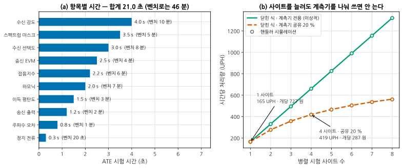
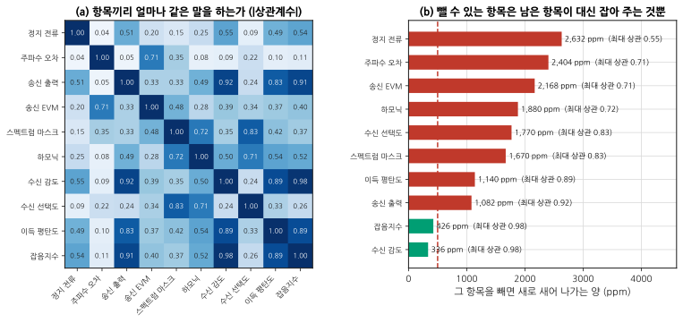
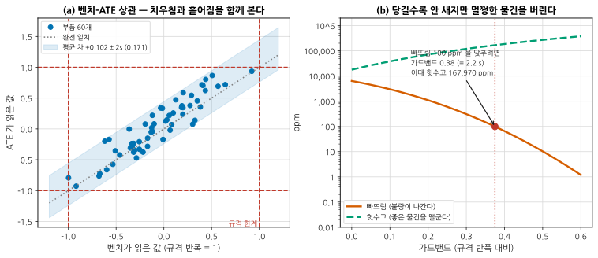
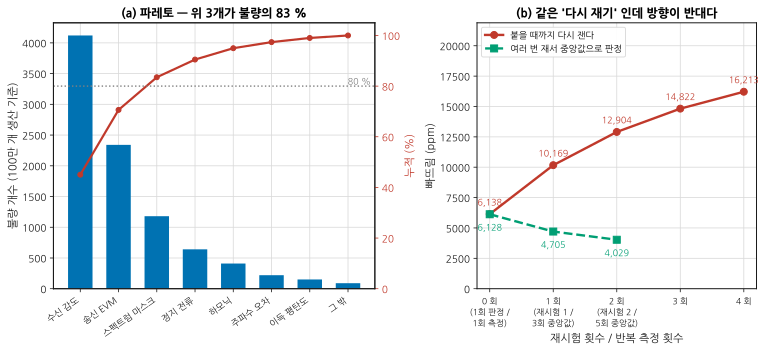
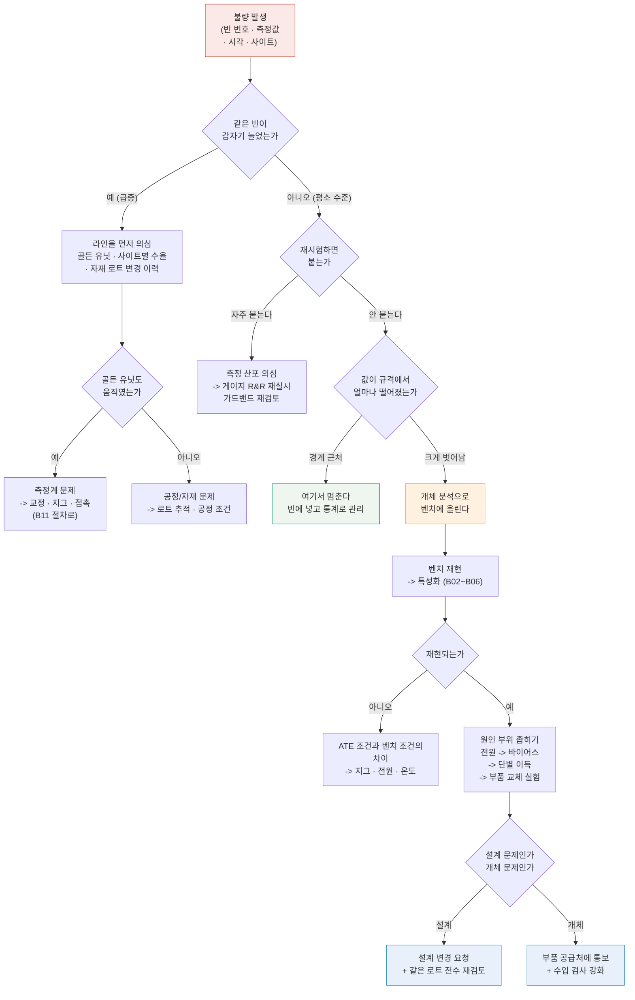

# B12 — 양산 이관: 벤치에서 시험기로

**문서 번호**: RF-CUR-B12 · **버전**: v1.0 · **분량**: 이론 4 h + 실습 6 h

> 벤치에서는 한 대를 46분 동안 재며 **이해하려** 합니다. 양산에서는 같은 물건을 21초에 재며 **걸러내려** 합니다. 이 모듈은 그 130배를 어떻게 건너는가에 대한 이야기입니다.

| | |
|---|---|
| **선수 모듈** | [M16](../01_모듈/M16_DUT검증과튜닝과자동화.md)(시험 계획서·가드밴딩·자동화), [B01](./B01_벤치방법론.md)(기록과 절차), [B11](./B11_측정시스템분석.md)(게이지 R&R·장비 상관) |
| **이 모듈이 소유하는 개념** | 벤치와 ATE 의 목적 차이, **시험 시간 예산**과 처리량(UPH)·병렬 사이트·다중 사이트 효율, 항목 상관으로 **뺄 항목 고르기**와 빠뜨림(escape), 벤치-ATE 상관 검증 절차, **골든 유닛**과 표류 감시, **양산 규모의 가드밴드**와 오판정 비용, 수율 파레토와 **재시험 정책**, 실패 분석(FA) 흐름, 이관 문서 한 벌 |
| **이 모듈을 쓰는 후속 모듈** | 심화 캡스톤 P4 |
| **학습 목표** | ① 시험 시간을 **초 단위 예산**으로 짜고 돈으로 환산한다 ② 뺄 항목을 상관과 빠뜨림으로 **근거를 대고** 고른다 ③ 가드밴드와 재시험 정책이 만드는 **두 방향의 손실**을 계산한다 |

---

## B12.0 이 모듈의 범위

기본 과정과 심화 앞부분이 여기까지 왔습니다.

| 이미 배운 것 | 어디서 |
|---|---|
| 시험 계획서 — 무엇을 어떤 조건에서 잴 것인가 | [M16 §4](../01_모듈/M16_DUT검증과튜닝과자동화.md) |
| 가드밴딩의 원리 | [M16 §5](../01_모듈/M16_DUT검증과튜닝과자동화.md) |
| 자동화 — SCPI·드라이버·데이터 파이프라인 | [M16 §9](../01_모듈/M16_DUT검증과튜닝과자동화.md) |
| 보고서 체계 | [M16 §12](../01_모듈/M16_DUT검증과튜닝과자동화.md) |
| 게이지 R&R 과 장비 간 상관 | [B11 §4](./B11_측정시스템분석.md) · [B11 §8](./B11_측정시스템분석.md) |

**이 모듈은 그 위에 하나를 얹습니다** — 규모. 한 대를 재는 절차가 하루 5천 대가 되면 무엇이 달라지는가.

> ⚠️ **다른 모듈과의 역할 분리**
>
> | 개념 | B12 (여기) | 다른 모듈 |
> |---|---|---|
> | 시험 계획서 작성 | **항목을 빼는 근거**만 | [M16 §4](../01_모듈/M16_DUT검증과튜닝과자동화.md)가 소유 |
> | 가드밴딩의 원리 | **양산 규모의 비용 계산**만 | [M16 §5](../01_모듈/M16_DUT검증과튜닝과자동화.md)가 소유 |
> | 게이지 R&R · 데밍 회귀 | 인용만 | [B11 §4](./B11_측정시스템분석.md) · [B11 §8](./B11_측정시스템분석.md)이 소유 |
> | 자동화 코드와 계측기 제어 | 인용만 | [M16 §9](../01_모듈/M16_DUT검증과튜닝과자동화.md)가 소유 |
> | 신뢰성 시험 (HALT·온도 챔버) | 인용만 | [B08 §9](./B08_전원바이어스열.md) |
> | ATE 장비의 내부 구조 | **개론만** | 이 커리큘럼의 범위 밖 ([설계서 §6](./00_심화과정_설계서.md) 결정 3) |
> | 공정 관리도(SPC) 운영 | **다루지 않습니다** | 이 커리큘럼의 범위 밖 |

---

## B12.1 벤치는 이해하려고 재고, 양산은 걸러내려고 잰다

같은 물건, 같은 항목인데 목적이 다르면 모든 것이 달라집니다.

| | 벤치 | 양산 (ATE) |
|---|---|---|
| **목적** | 왜 이런가를 안다 | 합격인가 아닌가를 가른다 |
| 한 대에 쓰는 시간 | 46 분 | **21 초** |
| 값을 몇 개 얻나 | 스윕 전체 (수천 점) | 판정에 필요한 몇 점 |
| 이상하면 | 멈추고 파고든다 | **빈(bin)에 넣고 다음 물건** |
| 측정 조건 | 필요하면 바꾼다 | **절대 안 바꾼다** |
| 재체결 | 사람이 손으로 | 핸들러가 기계적으로 |
| 불확도 | 예산표로 관리 | **가드밴드로 흡수** |
| 실패했을 때의 값어치 | 정보 | 비용 |

> 📌 **양산 시험은 측정이 아니라 분류입니다.** "이 물건의 이득이 12.34 dB" 를 알아내는 것이 목적이 아니라 "11.0 ~ 13.0 안에 있는가" 를 가르는 것이 목적입니다. 이 관점의 전환이 이 모듈 전체를 관통합니다 — 그래서 **정확도보다 판정의 신뢰도**가 중요하고, 그래서 §6 의 가드밴드가 필요합니다.

**그래서 벤치 절차를 그대로 옮기면 반드시 실패합니다.** 스윕을 그대로 옮기면 시간이 안 맞고, 사람이 판단하던 곳을 자동으로 만들지 않으면 라인이 멈춥니다. 이관은 번역이지 복사가 아닙니다.

---

## B12.2 시험 시간이 곧 돈이다 — 초 단위 예산

시험 원가는 한 줄입니다.

$$\text{개당 원가} = \frac{\text{시험기 시간당 비용}}{\text{UPH}}, \qquad \text{UPH} = \frac{3600 \times N_{\text{사이트}}}{t_{\text{묶음}} }$$

*그림 B12-1. 초와 돈. **읽는 법**: 왼쪽은 항목별 시간입니다. 괄호 안이 같은 항목을 벤치에서 재는 시간인데, 합치면 **21.0 초 대 46 분(131배)** 입니다. 오른쪽이 이 모듈의 요점입니다 — 초록 실선(계측기를 사이트마다 전용으로 둔 경우)은 사이트 수에 정비례해 올라가지만, 주황 파선(계측기의 20 %를 공유하는 경우)은 **8 사이트에서 1321 대 562 UPH 로 벌어집니다.** 점은 핸들러 동작을 시각 단위로 굴린 시뮬레이션이고, 선은 닫힌 식입니다.*

### 다중 사이트 효율

사이트를 N 개로 늘려도 처리량이 N 배가 되지는 않습니다. 계측기를 나눠 쓰는 항목은 사이트를 **차례로** 돌아야 하기 때문입니다.

$$t_{\text{묶음}} = t_{\text{시험}} \times \big(f_{\text{공유}} \cdot N + (1 - f_{\text{공유}})\big) + t_{\text{인덱스}}$$

| 사이트 | 전용 계측기 | 20 % 공유 | 잃은 몫 |
|---|---|---|---|
| 1 | 165 UPH | 165 UPH | — |
| 2 | 330 | 277 | 16 % |
| 4 | 661 | 419 | 37 % |
| 8 | 1321 | **562** | **57 %** |

**공유 비율이 20 % 밖에 안 되는데 8 사이트에서 절반 넘게 잃습니다.** 사이트가 많아질수록 공유 항목의 대기가 길어지기 때문입니다. 그래서 사이트를 늘리기 전에 **어느 항목이 계측기를 공유하는지** 먼저 봅니다 — 신호 발생기 하나를 넷이 나눠 쓰고 있다면, 사이트를 늘리는 것보다 발생기를 하나 더 사는 편이 쌉니다.

> ⚠️ **인덱스 시간을 빠뜨리지 마십시오.** 핸들러가 물건을 바꿔 무는 0.8 초는 시험 시간이 아니지만 처리량에는 그대로 들어갑니다. 시험 시간을 21 → 10 초로 줄여도 인덱스가 0.8 초면 처리량은 2배가 아니라 1.9배입니다. 시험이 짧아질수록 인덱스의 몫이 커집니다.

### 돈으로 환산하기

시간당 12만원 · 연 200만 개 기준입니다.

| 구성 | UPH | 개당 | 연간 |
|---|---|---|---|
| 1 사이트 | 165 | 727 원 | 14.5 억원 |
| 4 사이트 · 20 % 공유 | 419 | 287 원 | **5.7 억원** |

**항목 하나를 빼면 얼마인가**도 같은 식으로 나옵니다. 4.0 초짜리 항목 하나를 빼면 연 **1.07 억원**입니다. 다음 절이 왜 필요한지가 여기서 나옵니다.

---

## B12.3 무엇을 뺄 것인가 — 상관이 높은 항목 찾기

시간을 줄이는 방법은 셋입니다. ① 각 항목을 빠르게 ② 병렬로 ③ **항목을 뺀다.** 셋째가 가장 크게 줄지만 가장 위험합니다.

**뺄 수 있는 항목이란, 남은 항목이 대신 잡아 주는 항목입니다.** 그러니 항목끼리 얼마나 같은 말을 하는지부터 봅니다.

*그림 B12-2. 무엇을 빼도 되는가. **읽는 법**: 왼쪽은 항목 열 개의 상관 행렬입니다. 진할수록 같은 말을 합니다 — **수신 감도와 잡음지수가 0.98** 로 가장 진한데, 감도 = kTB + NF + 필요 SNR 이니 당연합니다. 오른쪽은 그 항목을 뺐을 때 걸러지지 않고 나가는 양입니다. 두 값을 나란히 보십시오 — **최대 상관이 높을수록 빠뜨림이 적습니다.** 그리고 500 ppm 선을 넘지 못하는 것은 그 한 쌍뿐입니다.*

### 빠뜨림(escape)으로 판정한다

상관이 높다는 것만으로는 부족합니다. 실제로 계산할 것은 이것입니다.

$$\text{빠뜨림} = P(\text{뺀 항목은 불합격}\ \wedge\ \text{남긴 항목은 전부 합격})$$

| 뺄 항목 | 최대 상관 | 빠뜨림 | 판정 |
|---|---|---|---|
| **수신 감도** | 0.98 | **336 ppm** | 뺄 수 있다 |
| **잡음지수** | 0.98 | **426 ppm** | 뺄 수 있다 |
| 송신 출력 | 0.92 | 1,082 ppm | 못 뺀다 |
| 이득 평탄도 | 0.89 | 1,140 ppm | 못 뺀다 |
| 스펙트럼 마스크 | 0.83 | 1,670 ppm | 못 뺀다 |
| 하모닉 | 0.72 | 1,880 ppm | 못 뺀다 |
| 송신 EVM | 0.71 | 2,168 ppm | 못 뺀다 |
| 주파수 오차 | 0.71 | 2,404 ppm | 못 뺀다 |
| 정지 전류 | 0.55 | 2,632 ppm | 못 뺀다 |

> ⚠️ **둘 다 뺄 수는 없습니다.** 감도와 잡음지수는 **서로를** 덮어 주던 짝입니다. 하나만 빼면 336 ppm 이지만 **둘 다 빼면 1,278 ppm** — 3배입니다. 서로를 덮어 주는 관계라 남은 하나가 그 일을 이어받아야 합니다.
>
> 이것이 상관 분석의 함정입니다. "상관 0.9 이상인 것을 전부 뺀다" 는 규칙은 짝을 통째로 날려 버립니다. **한 번에 하나씩 빼고, 뺄 때마다 남은 집합으로 다시 계산**하십시오.

### 둘 중 어느 것을 뺄 것인가

| | 감도를 뺀다 | 잡음지수를 뺀다 |
|---|---|---|
| 아끼는 시간 | 4.0 초 | 2.2 초 |
| 연간 절감 | **1.07 억원** | 0.59 억원 |
| 빠뜨림 | 336 ppm | 426 ppm |
| 규격서에 있는가 | **있다 (고객이 보는 값)** | 대개 없다 |

**돈만 보면 감도, 실무에서는 대개 잡음지수를 뺍니다.** 고객 규격서에 적힌 항목을 안 재고 출하하는 것은 설명하기 어렵고, 문제가 생겼을 때 "그 항목은 안 쟀습니다" 라고 말할 수 없기 때문입니다. **기술적 판단과 계약적 판단이 다를 수 있고, 이 경우 계약이 이깁니다.**

> 📌 **500 ppm 이라는 선은 계산으로 나오지 않습니다.** 출하 감사(샘플링 검사)가 잡아 줄 수 있는 수준으로 회사가 정한 값입니다. 여러분의 목표가 100 ppm 이면 이 표에서 뺄 수 있는 항목은 하나도 없습니다 — 그리고 그것도 정당한 결론입니다.

---

## B12.4 벤치-ATE 상관 검증 절차

같은 물건이 벤치에서 12.0 dB, ATE 에서 12.1 dB 로 나옵니다. 어느 쪽이 맞습니까? — **질문이 틀렸습니다.** 물어야 할 것은 "둘의 관계를 알고 있는가" 입니다.

*그림 B12-3. 맞대기와 가드밴드. **읽는 법**: 왼쪽은 같은 부품 60개를 두 곳에서 잰 것입니다. 점들이 회색 점선(완전 일치) 위쪽에 몰려 있으니 **ATE 가 계통적으로 높게 읽고**(+0.102), 파란 띠의 폭이 흩어짐(±2s = ±0.34)입니다. 오른쪽은 그 흩어짐을 안고 판정할 때 한계를 얼마나 당길 것인가입니다 — **주황이 내려가는 만큼 초록이 올라갑니다.***

### 절차

| 단계 | 무엇 | 판정 |
|---|---|---|
| 1 | **시료를 고른다** — 규격 경계 근처를 반드시 포함해 30~60개 | 경계 근처가 없으면 판정 능력을 확인 못 한다 |
| 2 | 벤치에서 잰다. **한 번이 아니라 반복해서** | 벤치 쪽 반복성이 λ 계산에 필요하다 ([B11 §8](./B11_측정시스템분석.md)) |
| 3 | 같은 시료를 ATE 로 잰다. 순서를 섞는다 | |
| 4 | **차이 그림**을 그린다 | 평균 차와 일치 한계를 읽는다 |
| 5 | 값의 크기에 따라 차이가 변하는지 본다 | 변하면 오프셋만으로는 못 고친다. 데밍 회귀로 기울기를 확인 |
| 6 | 평균 차를 **ATE 쪽 보정값**으로 넣는다 | 벤치를 기준으로 삼는 것이 관례 |
| 7 | 남은 흩어짐으로 **가드밴드를 정한다** (§6) | |
| 8 | 시료 몇 개를 **골든 유닛**으로 남긴다 (§5) | |

> ⚠️ **경계 근처 시료가 없으면 이 검증은 의미가 없습니다.** 한가운데 값만 60개 재면 상관계수는 1에 가깝게 나오지만, 정작 판정이 일어나는 곳에서 두 계가 일치하는지는 아무것도 모릅니다. 시료가 없으면 **일부러 만드십시오** — 감쇠기를 덧대거나 부품을 바꿔 규격 경계에 놓인 물건을 몇 개 만들어 두는 것이 표준 실무입니다.

**흩어짐의 정체를 확인하십시오.** 이 예에서 차이의 표준편차 0.171 은 두 계 반복성의 제곱합 √(0.06² + 0.16²) = 0.171 과 맞습니다. 맞지 않으면(대개 더 크면) 반복성 말고 다른 원인 — 지그 접촉, 온도, 순서 효과 — 이 있다는 신호이고, **그것을 찾기 전에 가드밴드로 덮으면 안 됩니다.** 원인 있는 흩어짐은 언젠가 커집니다.

---

## B12.5 골든 유닛 — 무엇을 얼마나 자주

라인이 어제와 같은지 매일 확인하는 물건입니다.

| | 어떻게 |
|---|---|
| **몇 개** | 최소 2개. 하나로는 **장비가 표류하는지 시료가 표류하는지** 구별할 수 없다 |
| **어떤 값** | 규격 한가운데 하나, **경계 근처 하나.** 경계 쪽이 판정 능력을 본다 |
| **얼마나 자주** | 교대 시작마다. 사이트가 여럿이면 **사이트마다** |
| **판정** | 관리 한계(대개 ±3σ, σ 는 게이지 R&R 의 반복성)를 벗어나면 라인 정지 |
| **보관** | 정전기·습도·온도 관리. 떨어뜨리면 그 순간 골든 유닛이 아니다 |
| **갱신** | 값이 표류하기 시작하면 새것으로. **겹치는 기간을 두고** 두 세대를 함께 잰다 |

> 📌 **능동 모듈은 늙습니다.** 골든 유닛으로 쓰기 좋은 것은 수동 부품(감쇠기·필터·짧은 선로)입니다. 능동 모듈을 써야 한다면 그 시료 자체의 표류를 별도로 추적하십시오 — 두 개 이상 두면 구별할 수 있습니다. 둘이 같은 방향으로 움직이면 장비, 하나만 움직이면 시료입니다.

**골든 유닛 데이터는 버리지 말고 쌓으십시오.** 6개월치가 쌓이면 그 자체가 라인의 표류 기록이 되고, 나중에 "언제부터 이상해졌나" 를 묻는 실패 분석(§8)의 첫 단서가 됩니다.

---

## B12.6 판정 한계와 가드밴드 — 양산 규모로

[M16 §5](../01_모듈/M16_DUT검증과튜닝과자동화.md)에서 원리를 배웠습니다. 여기서는 그것이 **연 200만 개에서 얼마인가**를 셉니다.

측정에 흩어짐이 있으면 오판정이 두 방향으로 생깁니다.

| | 누가 손해 | 이름 |
|---|---|---|
| **헛수고** — 좋은 물건을 떨군다 | 우리 | 생산자 위험 |
| **빠뜨림** — 불량을 내보낸다 | 고객 | 소비자 위험 |

가드밴드는 판정선을 규격보다 안쪽으로 당기는 것입니다. 당길수록 빠뜨림은 줄고 헛수고는 늡니다.

| 가드밴드 | 빠뜨림 | 헛수고 |
|---|---|---|
| 없음 | 6,385 ppm | 17,872 ppm |
| 0.38 (= 2.2 s) | **99 ppm** | **167,970 ppm** |

**빠뜨림을 65분의 1 로 줄이는 값이 헛수고 9배입니다.** 연 200만 개면 헛수고 15만 개 — 개당 원가를 곱하면 바로 돈이 나옵니다. 가드밴드는 공짜가 아니라 **가격표가 붙은 선택**입니다.

### 얼마로 정할 것인가

| 방법 | 내용 | 쓰는 곳 |
|---|---|---|
| **목표 빠뜨림 역산** | 허용 ppm 을 정하고 그에 맞는 가드밴드를 계산 | 고객이 ppm 을 지정할 때 |
| **비용 최소화** | 헛수고 × 개당 원가 + 빠뜨림 × 회수 비용 을 최소화 | 회수 비용을 아는 경우 |
| **TUR 규칙** | 시험 불확도비(TUR)가 4:1 이면 가드밴드 없이 오수락 2 % 이하로 본다 | 교정 분야의 관행 |
| **고정 배수** | 흩어짐의 2σ 또는 3σ 를 일률 적용 | 간단하지만 항목마다 낭비가 다르다 |

> ⚠️ **가드밴드로 나쁜 상관을 덮지 마십시오.** 흩어짐이 큰 진짜 이유가 지그 접촉이라면, 가드밴드는 그 비용을 매일 지불하는 것입니다. §4 에서 흩어짐의 정체를 확인하라고 한 이유입니다. **먼저 줄이고, 남은 것만 덮습니다.**

그리고 가드밴드를 넣었으면 **넣었다고 적으십시오.** 시험 사양서에 "규격 11.0~13.0, 시험 한계 11.38~12.62" 로 둘 다 적혀 있어야, 나중에 "왜 11.2 짜리를 떨궜나" 라는 질문에 답할 수 있습니다.

---

## B12.7 수율 분석 — 파레토와 재시험 정책

*그림 B12-4. 어디를 고치고, 다시 재도 되는가. **읽는 법**: 왼쪽은 불량을 항목별로 세워 큰 것부터 늘어놓은 것입니다. 빨간 누적선이 **위 3개에서 83 %** 를 지납니다 — 고칠 곳이 어디인지가 한눈에 보입니다. 오른쪽이 이 절의 요점입니다. 같은 "다시 재기" 인데 **정책에 따라 방향이 반대**입니다. 붙을 때까지 다시 재면 빠뜨림이 6,138 → 16,213 ppm 으로 늘고, 여러 번 재서 중앙값으로 판정하면 6,128 → 4,029 ppm 으로 줍니다.*

### 파레토를 읽는 법

**1위 항목을 고치는 것이 언제나 옳지는 않습니다.** 함께 보는 것이 있습니다.

| 함께 보는 것 | 왜 |
|---|---|
| 그 항목의 **가드밴드 몫** | 헛수고가 섞여 있으면 진짜 불량이 아니다 |
| 그 항목의 **게이지 R&R** | 측정이 나빠서 떨어지는 것일 수 있다 ([B11 §7](./B11_측정시스템분석.md)) |
| 고치는 **비용** | 1위가 설계 변경이고 2위가 공정 조정이면 2위부터 |
| **재시험 통과율** | 재시험에서 대부분 붙는다면 그것은 불량이 아니라 측정 산포다 |

### 재시험은 공짜가 아니다

"떨어졌으니 한 번 더 재 보자" 는 자연스러운 반응이고, **가장 흔한 빠뜨림의 원인**입니다.

참으로 불합격인 물건이 1+R 번 중 한 번이라도 한계 안에 들어올 확률은

$$P(\text{통과}) = 1 - \big(1 - p(x)\big)^{1+R}$$

이고, 재시험을 늘릴수록 단조 증가합니다.

| 재시험 | 빠뜨림 (붙을 때까지) | 반복 횟수 | 빠뜨림 (중앙값 판정) |
|---|---|---|---|
| 0 회 | 6,138 ppm | 1 회 | 6,128 ppm |
| 1 회 | 10,169 ppm | 3 회 | 4,705 ppm |
| 2 회 | **12,904 ppm** | 5 회 | **4,029 ppm** |
| 3 회 | 14,822 ppm | | |
| 4 회 | 16,213 ppm | | |

**측정 횟수가 같아도 정책이 반대 방향을 만듭니다.** 3번 재는 것은 같은데, "한 번이라도 붙으면 통과" 는 12,904 ppm, "중앙값으로 판정" 은 4,029 ppm 입니다. 3배 차이입니다.

이유는 단순합니다. **붙을 때까지 다시 재기는 산포를 통과 쪽으로만 씁니다.** 한계 바로 밖에 있는 물건은 흔들림 덕분에 언젠가 들어오고, 한 번 들어오면 나갑니다. 반면 중앙값은 흔들림을 **양쪽으로** 평균해 없앱니다.

> ⚠️ **재시험 정책은 사양서에 적혀야 합니다.** "1회 재시험 허용" 같은 문장이 없으면 현장은 붙을 때까지 잽니다. 그리고 그 사실은 수율 데이터에 안 남습니다 — 마지막 통과만 기록되기 때문입니다.
>
> **재시험을 허용한다면 그 자체를 기록하십시오.** 재시험 통과율이 갑자기 오르면 그것은 라인이 나빠지고 있다는 이른 신호입니다.

**그러면 재시험을 아예 금지할 것인가.** 그렇지는 않습니다. 접촉 불량처럼 **물리적 원인이 명백한 실패**는 다시 재는 것이 맞습니다. 구별하는 방법은 조건을 다는 것입니다 — "접촉 저항 점검을 통과하지 못한 경우에 한해 1회 재시험", "여러 항목이 동시에 떨어진 경우는 재시험하지 않음" 처럼.

---

## B12.8 실패 분석 흐름 — 어디까지 파고 언제 멈추는가

*그림 B12-5. 실패 분석 결정 트리. **읽는 법**: 위에서 아래로 내려가되, **초록 상자에서 멈추는 길이 있다는 것**이 이 그림의 요점입니다. 경계 근처에서 떨어진 개체를 하나하나 파는 것은 대개 낭비입니다. 왼쪽 갈래(급증)는 개체가 아니라 라인을 보고, 오른쪽 아래 갈래(크게 벗어남)만 벤치로 올립니다.*

### 언제 멈추는가

| 멈춰도 되는 신호 | 계속 파야 하는 신호 |
|---|---|
| 경계 근처에서만 떨어진다 | **한 번도 못 본 실패 모드** |
| 발생률이 평소와 같다 | 발생률이 급증했다 |
| 재시험하면 붙는다 (→ 측정 문제) | **안전·규격 관련 항목** |
| 원인이 이미 알려져 있고 대책이 걸려 있다 | 같은 로트에서 몰려 나온다 |
| 개체 분석 비용이 회수 비용보다 크다 | 고객 반품으로 돌아왔다 |

> 📌 **"원인 미상" 도 결론입니다.** 다만 조건이 붙습니다 — 어디까지 파고 무엇을 배제했는지가 기록에 남아 있어야 합니다. 다음에 같은 것이 나오면 그 기록이 출발점이 됩니다. 아무것도 안 적고 덮은 실패는 **다음에도 처음부터** 시작해야 합니다.

---

## B12.9 넘길 문서 한 벌

이관은 물건이 아니라 **문서로** 이뤄집니다. 아래가 최소 한 벌입니다.

| 문서 | 무엇이 들어가나 | 어느 절에서 나왔나 |
|---|---|---|
| **시험 사양서** | 항목·조건·규격 한계·**시험 한계(가드밴드 적용)**·판정 논리·빈 정의 | §6 |
| **시험 시간 예산표** | 항목별 시간, 사이트 구성, UPH, 개당 원가 | §2 |
| **항목 선정 근거서** | 뺀 항목과 그 빠뜨림 계산, 남긴 이유 | §3 |
| **벤치-ATE 상관 보고서** | 시료 목록(경계 포함), 차이 그림, 평균 차, 일치 한계, 보정값 | §4 |
| **게이지 R&R 보고서** | 분산 분해, %GRR 두 기준, ndc, 판정 | [B11 §4](./B11_측정시스템분석.md) |
| **골든 유닛 관리 절차** | 시료 번호, 기준값, 관리 한계, 주기, 갱신 규칙 | §5 |
| **재시험 정책** | 허용 조건, 횟수, 기록 방법 | §7 |
| **실패 분석 절차** | 결정 트리, 멈춤 기준, 기록 서식 | §8 |
| **데이터 형식 정의** | 필드 이름·단위·시각 형식·사이트 식별자 | [M16 §11](../01_모듈/M16_DUT검증과튜닝과자동화.md) |

> ⚠️ **데이터 형식 정의를 마지막에 만들지 마십시오.** 라인이 돌기 시작하면 형식을 바꿀 수 없습니다. 단위가 dBm 인지 mW 인지, 시각이 현지 시각인지 UTC 인지, 사이트 번호가 0부터인지 1부터인지 — 이런 것을 나중에 고치려면 이미 쌓인 데이터를 전부 손봐야 합니다.

**그리고 넘긴 뒤에도 한동안 붙어 있어야 합니다.** 초기 수율이 예상과 다른 것은 정상이고, 그때 벤치에서 확인해야 할 것이 반드시 나옵니다. 이관은 문서를 넘긴 날이 아니라 **수율이 안정되고 파레토가 설명되는 날** 끝납니다.

---

## B12.L 실습

> **등급 표기**: **T0** = 계산기·PC 만으로 · **T1** = 기본 계측기 · **T2** = 전문 장비. 등급 정의는 [설계서 §7](./00_심화과정_설계서.md) 참조.

### L-B12-a (T0) — 항목 상관 분석으로 뺄 항목 고르기

**목표**: §3 을 우리 제품으로 한다.

1. 시험 데이터 300개 이상을 모은다 (없으면 `scripts/gen_fig_b12.py` 의 `draw_units` 로 만든다).
2. 항목별로 표준화하고 상관 행렬을 낸다.
3. 항목을 하나씩 빼 보며 **빠뜨림 ppm** 을 계산한다.
4. 상관이 0.9 이상인 짝을 찾고, **둘 다 뺐을 때**도 계산해 본다.
5. 목표 ppm 을 정하고 뺄 항목을 고른다. **기술적 판단과 계약적 판단을 나눠 적는다.**
6. 아낀 시간을 §2 의 식으로 돈으로 환산한다.

**보고**: 상관 행렬, 항목별 빠뜨림 표, 뺀 항목과 근거, 연간 절감액.

**막히면**: 4번에서 둘 다 뺐을 때가 각각의 합보다 훨씬 크게 나오면 정상입니다. 서로를 덮어 주던 짝이라는 뜻입니다.

### L-B12-b (T0) — 시험 시간 예산표 작성과 최적화

**목표**: 초를 돈으로 바꾼다.

1. 우리 시험 항목을 나열하고 각각의 시간을 적는다. **설정 시간과 측정 시간을 나눠서.**
2. 어느 항목이 계측기를 공유하는지 표시한다.
3. 사이트 1·2·4·8 에 대해 UPH 를 계산한다.
4. 같은 것을 이산사건 시뮬레이션으로 확인한다 (닫힌 식이 맞는지).
5. 시간당 비용과 연간 물량을 넣어 개당 원가를 낸다.
6. **가장 효과가 큰 개선 하나**를 고른다 — 항목 빼기 / 사이트 늘리기 / 계측기 추가 / 설정 시간 줄이기 중에서.

**보고**: 예산표, 사이트별 UPH 표, 개당 원가, 고른 개선안과 투자 회수 계산.

**막히면**: 6번에서 계측기 추가는 자본 지출이고 항목 빼기는 무료입니다. 회수 기간으로 비교하십시오.

### L-B12-c (T0) — 가상 수율 데이터로 파레토·재시험 정책 판정

**목표**: §7 을 데이터로 한다.

1. 항목별 불량 개수를 만들거나 실제 데이터를 쓴다. 파레토를 그린다.
2. 누적 80 % 에 드는 항목을 찾는다.
3. 각 항목의 **재시험 통과율**을 계산한다 (있다면).
4. "붙을 때까지" 정책과 "중앙값 판정" 정책의 빠뜨림을 각각 계산한다 (재시험 0~4회).
5. 우리 라인의 현재 정책이 어느 쪽인지 확인하고, 바꿨을 때의 빠뜨림 변화를 낸다.
6. 재시험을 허용할 조건을 문장으로 쓴다.

**보고**: 파레토, 두 정책의 비교표, 권고 정책과 그 조건.

**막히면**: 3번에서 재시험 통과율이 50 % 를 넘으면 그것은 불량이 아니라 측정 산포입니다. 게이지 R&R 부터 다시 하십시오.

### L-B12-d (T0) — 시험 사양서 한 벌 작성

**목표**: §9 의 목록을 실제로 채운다.

1. 캡스톤 보드(또는 우리 제품)의 시험 사양서를 쓴다.
2. 각 항목에 **규격 한계와 시험 한계를 둘 다** 적는다. 가드밴드 근거를 옆에 적는다.
3. 빈 정의를 만든다 — 어떤 실패가 어느 빈에 들어가는가.
4. 판정 논리를 순서도로 그린다 (어느 항목부터 재고, 떨어지면 나머지를 재는가).
5. 데이터 형식을 정의한다 — 필드 이름·단위·시각 형식.
6. 재시험 정책과 골든 유닛 절차를 한 쪽씩 붙인다.

**보고**: 사양서 초안 한 벌. 동료에게 읽히고 **모호한 문장을 찾아 달라고** 하십시오.

**막히면**: 4번에서 "떨어지면 즉시 중단" 이 시간은 아끼지만 파레토 데이터를 잃습니다. 어느 쪽을 택할지 근거를 적으십시오.

---

## B12.Q 확인 문제

<b>Q1.</b> 처리량을 올리려고 사이트를 4개에서 8개로 늘렸는데 처리량이 1.3배밖에 안 늘었습니다.

**계측기를 공유하는 항목이 있습니다.** 정상적인 결과입니다.

이 커리큘럼의 예에서 공유 비율 20 % 일 때:

| 사이트 | UPH | 4→8 배율 |
|---|---|---|
| 4 | 419 | — |
| 8 | 562 | **1.34배** |

이유는 묶음 시간 식에 있습니다.

$$t_{\text{묶음}} = t_{\text{시험}} \times (f_{\text{공유}} \cdot N + 1 - f_{\text{공유}}) + t_{\text{인덱스}}$$

N 이 커질수록 공유 항목의 대기가 선형으로 늘어, 사이트를 늘려 얻는 이득을 갉아먹습니다.

**무엇을 할 것인가.**

1. **어느 항목이 공유인지 찾습니다.** 시험 프로그램의 사이트별 타임라인을 뽑으면 바로 보입니다 — 한 항목에서 사이트들이 줄 서 있습니다.
2. 그 항목이 쓰는 계측기를 **하나 더 삽니다.** 사이트를 8개로 늘리는 비용과 비교하십시오. 대개 계측기 하나가 쌉니다.
3. 못 사면 **그 항목의 시간을 줄이거나**, §3 의 상관 분석으로 **뺄 수 있는지** 봅니다.
4. 인덱스 시간도 확인합니다. 시험이 짧아질수록 인덱스의 몫이 커집니다.

> 사이트를 늘리기 전에 이 계산을 먼저 하십시오. 순서가 바뀌면 하드웨어를 사 놓고 못 쓰게 됩니다.

<b>Q2.</b> 상관계수가 0.95 이상인 항목을 전부 뺐더니 반품이 늘었습니다.

**서로를 덮어 주던 짝을 통째로 뺐을 가능성이 큽니다.**

§3 에서 감도와 잡음지수가 상관 0.98 이었습니다.

| 뺀 것 | 빠뜨림 |
|---|---|
| 감도만 | 336 ppm |
| 잡음지수만 | 426 ppm |
| **둘 다** | **1,278 ppm (3배)** |

"상관이 높으면 뺀다" 는 규칙은 **한 항목씩 보는 규칙**인데, 그것을 집합에 한꺼번에 적용하면 서로를 덮어 주던 관계가 함께 사라집니다.

**올바른 절차는 하나씩입니다.**

1. 각 항목의 빠뜨림을 계산한다.
2. 가장 작은 것 **하나만** 뺀다.
3. **남은 집합으로 다시 전부 계산한다.** 방금 짝을 잃은 항목의 빠뜨림이 크게 올라 있을 것이다.
4. 목표 ppm 을 넘지 않는 것이 남아 있으면 2번으로.

그리고 뺀 뒤에는 **출하 감사로 확인하십시오** — 계산은 모형이고, 모형에 없는 실패 모드가 있을 수 있습니다. 몇 달치 감사 데이터로 계산이 맞았는지 검증한 뒤에야 그 결정이 굳어집니다.

<b>Q3.</b> 벤치와 ATE 가 평균 0.1 dB 차이 납니다. 어느 쪽이 맞습니까?

**대개 답할 수 없고, 답할 필요도 없습니다.**

두 계 모두 측정기입니다. 어느 쪽이 참값에 가까운지는 **더 상위의 기준**(교정된 표준, 상호 비교 시험)이 있어야 알 수 있습니다.

**양산에서 실제로 필요한 것은 다릅니다.**

| 필요한 것 | 왜 |
|---|---|
| 차이가 **일정한가** | 일정하면 오프셋으로 없앨 수 있다 |
| 차이가 **값에 따라 변하는가** | 변하면 오프셋만으로는 못 고친다 ([B11 §8](./B11_측정시스템분석.md)) |
| 남은 **흩어짐이 얼마인가** | 이것이 가드밴드를 정한다 (§6) |
| 흩어짐이 **설명되는가** | 두 계 반복성의 제곱합과 맞아야 한다 |

**관례는 벤치를 기준으로 삼는 것**입니다. 벤치가 참값이라서가 아니라, 규격이 벤치에서 정해졌고 설계 데이터가 벤치 값으로 쌓여 있기 때문입니다. 그러니 ATE 쪽에 −0.1 dB 보정을 넣습니다.

**다만 하나는 확인하십시오** — 그 0.1 dB 가 어디서 오는지. 지그의 삽입 손실을 안 뺐다든가, 기준면이 다르다든가 하는 **알 수 있는 원인**이면 보정값으로 덮지 말고 고쳐야 합니다. 원인 있는 차이는 조건이 바뀌면 함께 변하지만, 보정값은 고정입니다.

<b>Q4.</b> 재시험을 한 번 허용하면 수율이 2 % 오릅니다. 좋은 일 아닙니까?

**오른 2 % 중 얼마가 진짜인지 모릅니다.** 그리고 §7 의 계산으로는 빠뜨림이 6,138 → 10,169 ppm 으로 **1.7배**가 됩니다.

재시험으로 붙는 물건은 두 종류가 섞여 있습니다.

| | 무엇 | 다시 재는 게 맞나 |
|---|---|---|
| **접촉 불량 등** | 첫 측정이 잘못된 것 | **맞다** |
| **한계 바로 밖** | 물건이 진짜 경계에 있는 것 | **아니다** — 흔들림 덕에 들어온 것 |

문제는 둘을 구별하지 않고 재면 **둘 다 통과**한다는 점입니다.

**구별하는 방법은 조건을 다는 것입니다.**

1. **접촉 점검을 통과하지 못한 경우에만** 재시험 (연속성 확인, 정지 전류 확인 등).
2. **여러 항목이 동시에 떨어진 경우는 재시험하지 않음** — 접촉이면 대개 여러 항목이 함께 이상해진다는 점을 역이용.
3. 재시험은 **1회로 못박고**, 재시험 결과를 원 결과와 **둘 다 기록**.
4. 재시험 통과율을 **관리 지표로** 감시 — 갑자기 오르면 라인이 나빠지고 있다.

**정말로 경계 근처 물건을 살리고 싶다면 방법이 다릅니다** — 여러 번 재서 **평균이나 중앙값으로 판정**하십시오. 같은 3회 측정으로 빠뜨림이 12,904 대 4,029 ppm 입니다. 시험 시간은 늘지만(§2 로 돈을 계산하십시오) 방향은 옳습니다.

<b>Q5.</b> 파레토 1위가 수신 감도입니다. 감도 회로부터 고치면 됩니까?

**고치기 전에 세 가지를 확인하십시오.**

1. **그 불량 중 얼마가 가드밴드 때문인가.** 시험 한계가 규격보다 0.38 안쪽이면, 그 사이에 들어온 물건은 규격상으로는 합격입니다. 그 몫을 빼고 나면 1위가 아닐 수 있습니다.
2. **그 항목의 게이지 R&R 은 얼마인가.** 측정 산포가 크면 멀쩡한 물건이 떨어집니다 ([B11 §7](./B11_측정시스템분석.md)) — 회로가 아니라 측정을 고쳐야 합니다.
3. **재시험 통과율은 얼마인가.** 절반 이상이 재시험에서 붙는다면 그것은 회로 문제가 아닙니다.

이 셋을 걷어내고도 1위면 그때 회로를 봅니다. 그리고 **그때도 비용을 비교하십시오** — 1위가 설계 변경(수개월·재인증)이고 2위가 공정 조건 조정(하루)이면, 2위를 먼저 고쳐 놓고 1위를 준비하는 편이 낫습니다.

> 파레토는 **어디에 노력을 쓸지**를 알려 주는 도구이지, 무엇을 먼저 고치라는 명령이 아닙니다. 세로축을 "개수" 대신 "**개수 × 고치는 비용의 역수**" 로 다시 그리면 순서가 바뀌는 일이 흔합니다.

<b>Q6.</b> 이관을 끝냈다고 보고하려 합니다. 무엇이 갖춰져야 합니까?

**문서를 넘긴 날이 아니라 수율이 설명되는 날이 끝입니다.**

| 확인할 것 | 판정 |
|---|---|
| §9 문서 아홉 가지가 모두 있는가 | 하나라도 없으면 미완 |
| 게이지 R&R 이 **판정을 통과**했는가 | %GRR 과 ndc 둘 다 ([B11 §4](./B11_측정시스템분석.md)) |
| 벤치-ATE 상관에 **경계 시료**가 들어갔는가 | 없으면 검증이 아니다 |
| 골든 유닛이 **2개 이상** 자리 잡았는가 | 하나면 장비와 시료를 구별 못 한다 |
| 수율이 **안정**되었는가 | 며칠치 추세가 평평해야 한다 |
| 파레토 상위 항목이 **설명되는가** | "왜 이것이 1위인지" 를 말할 수 있어야 한다 |
| 사이트 간 차이가 **일치 한계 안**인가 | 사이트마다 다르면 아직 이관이 아니다 |
| 재시험 정책이 **문서화**되었는가 | 안 적으면 현장은 붙을 때까지 잰다 |

**그리고 되돌아갈 길을 남기십시오.** 초기 물량의 시료 몇 개를 벤치에서 다시 재고, 그 값을 보관합니다. 몇 달 뒤 문제가 생겼을 때 "처음에는 이랬다" 는 기준점이 됩니다 — 이것 없이는 표류인지 원래 그랬는지 알 수 없습니다.

> 📌 이관을 사람 한 명이 끝까지 붙어서 하는 것을 권합니다. 문서는 완벽할 수 없고, 문서에 안 적힌 것을 아는 사람이 라인 옆에 있어야 초기 몇 주를 넘깁니다.

---

## B12.A 이 모듈의 축약어

| 약어 | 영문 원어 | 한글 |
|---|---|---|
| ATE | Automatic Test Equipment | 자동 시험 장비 |
| UPH | Units Per Hour | 시간당 처리량 |
| FA | Failure Analysis | 실패 분석 |
| ppm | parts per million | 100만분율 |
| TUR | Test Uncertainty Ratio | 시험 불확도비 |
| USL / LSL | Upper / Lower Specification Limit | 규격 상한 / 하한 |
| GRR / Gage R&R | Gage Repeatability and Reproducibility | 게이지 반복성·재현성 (→ B11) |
| ndc | number of distinct categories | 구별 범주 수 (→ B11) |
| MSA | Measurement System Analysis | 측정 시스템 분석 (→ B11) |
| DUT | Device Under Test | 시험 대상물 (→ M04) |
| EVM | Error Vector Magnitude | 오차 벡터 크기 (→ M13) |
| NF | Noise Figure | 잡음지수 (→ M01) |
| SNR | Signal-to-Noise Ratio | 신호 대 잡음비 (→ M01) |
| SCPI | Standard Commands for Programmable Instruments | 계측기 표준 명령어 (→ M16) |
| UTC | Coordinated Universal Time | 협정 세계시 |
| HALT | Highly Accelerated Life Test | 고가속 수명 시험 (→ B08) |
| SPC | Statistical Process Control | 통계적 공정 관리 (→ B11) |
| RF | Radio Frequency | 무선 주파수 (→ M01) |

---

## B12.S 출처

> ⚠️ **원문 확인 권고**: 아래 주소는 검색 결과로 교차확인한 것이며 원문을 직접 열어 보지는 못했습니다. 중요한 수치는 원문에서 확인하십시오.

| 주장 | 등급 | 출처 |
|---|---|---|
| ATE 업계의 처리량 표준 정의는 시간당 시험 개수(UPH)이며, 다중 사이트 효율은 사이트를 늘려도 시험 시간이 늘지 않는 완전 병렬(100 %)에서 얼마나 벗어나는가로 정의된다 | A | [Advantest — 다중 사이트 효율과 처리량](https://www3.advantest.com/documents/11348/d05328f9-2d91-4372-9a13-8344373c03b4) · [EDN — 다중 사이트 시험의 과제](https://www.edn.com/the-challenge-of-multisite-test/) |
| 다중 사이트 효율만 좇는 것은 위험하며 처리량과 함께 봐야 한다. 계측기를 추가하는 비용은 시험 시간이 짧을수록 빨리 수확 체감에 이른다 | A | [Advantest — 다중 사이트 효율과 처리량](https://www3.advantest.com/documents/11348/d05328f9-2d91-4372-9a13-8344373c03b4) · [Electronic Design — 동시 시험 효율 탐구](https://www.electronicdesign.com/21201909) |
| 핸들러의 인덱스 시간과 최대 처리량은 병렬 사이트 수·패키지 크기·트레이 규격·시험 온도에 따라 달라진다 | B | [CS MANTECH — 반도체 대량 시험의 여러 측면](https://csmantech.org/wp-content/acfrcwduploads/field_5e8cddf5ddd10/post_4597/011.3.pdf) |
| 가드밴딩은 측정 불확도를 반영해 합격 한계를 규격보다 안쪽으로 당겨 오수락(false accept) 위험을 줄이는 것이며, ISO 14253 계열이 판정 규칙의 틀을 준다 | A | [ISO/TR 14253-6:2012 — 합격·불합격 판정 규칙](https://standards.iteh.ai/catalog/standards/iso/b6e458d4-a2a6-4869-b07a-d5f3b9ca26dd/iso-tr-14253-6-2012) · [NCSLI — 오수락 위험 관리를 위한 가드밴딩 방법](https://ncsli.org/mpage/MJ_V15_A2) |
| 시험 불확도비(TUR)는 공차 폭을 확장 불확도의 2배로 나눈 값이고, TUR 4:1 이상이거나 적절한 가드밴딩을 하면 전역 오수락 확률이 2 % 이하가 된다는 것이 통용되는 지침이다. ANSI/NCSL Z540.3 은 이 2 % 를 명시한다 | A | [SIMCO — 4:1 교정비의 역사와 의미](https://www.simco.com/blog/4-1-calibration-ratio/) · [Sandia — 가드밴딩 평가 보고서](https://www.osti.gov/servlets/purl/1855029) |
| 측정 불확도는 소비자 위험과 생산자 위험에 직접 비례하며, 가드밴드는 규격 한계와 합격 한계 사이의 구간으로 정의된다 | A | [NCSLI — 오수락 위험 관리를 위한 가드밴딩 방법](https://ncsli.org/mpage/MJ_V15_A2) · [ISOBudgets — 가드밴딩으로 불확도 반영하기](https://www.isobudgets.com/guard-banding-how-to-take-uncertainty-into-account/) |

**본문의 숫자는 전부 계산입니다.** `python3 scripts/gen_fig_b12.py` 를 실행하면 인용값이 출력되고 자체 검산 37항목이 함께 돕니다. 교차검증은 네 갈래입니다.

1. **처리량** — 닫힌 식 UPH 와 핸들러 이산사건 시뮬레이션을 사이트 1·2·4·8 × 공유 0·20 % 의 여덟 조합에서 대조 (전부 1 % 안)
2. **항목 상관** — 요인 적재로 만든 참 상관 행렬과 표본 50만 개에서 추정한 행렬을 대조 (최대 차 0.0027). 빠뜨림은 다른 난수로 다시 뽑아 **순위가 그대로**인지 확인
3. **가드밴드** — 정규분포 닫힌 식과 400만 회 몬테카를로를 대조하되, 허용 오차를 고정값이 아니라 **몬테카를로 자신의 표본 오차 4배**로 잡음
4. **재시험** — 1−(1−p)^(1+R) 닫힌 식의 수치적분과 재시험 정책 시뮬레이션을 재시험 0~3 회에서 대조

§2 의 항목별 시간과 비용, §3 의 상관 구조, §7 의 불량 분포는 **합성한 값**입니다. 21 초나 419 UPH 를 여러분 라인의 기대값으로 옮기지 마십시오. 다만 §2 의 묶음 시간 식, §3 의 빠뜨림 정의, §6 의 두 오판정, §7 의 재시험 확률식은 **모형과 무관한 관계식**이라 그대로 적용됩니다.

---

## 변경 이력

| 버전 | 일자 | 내용 |
|---|---|---|
| v1.0 | 2026-08-27 | 최초 작성. 그림 5종(생성 4 + Mermaid 1), 실습 4종, 확인 문제 6문항. 자체 검산 37항목 통과. 집필 중 세 번 고쳤다 — ① §3 을 처음 만들었을 때 **뺄 수 있는 항목이 하나도 없었다.** 상관 구조가 물리와 어긋나 있어서였다. 감도 = kTB + NF + 필요 SNR 이라는 관계를 요인 적재에 반영해 상관 0.98 짝을 만드니, 그 짝만 500 ppm 아래로 내려왔다 — **뺄 수 있는 항목이 적다는 것 자체가 결론**이라 그대로 실었다 ② 검산에서 감도와 잡음지수를 **둘 다** 빼 보니 빠뜨림이 3배가 됐다. 서로를 덮어 주던 짝이었다. Q2 와 §3 의 경고 상자가 여기서 나왔다 ③ 가드밴드 검산이 헛수고 쪽에서만 실패했는데, 고정 허용 오차가 확률이 큰 쪽의 표본 오차보다 작아서였다. **허용 오차를 몬테카를로 표본 오차로 바꿔** 두 항 모두 같은 기준으로 판정하게 했다 |
