# 공용 회로 심볼 카탈로그

> 이 파일은 `scripts/gen_symbols.py`가 자동 생성합니다. **직접 편집하지 마십시오.**
> 심볼을 추가·수정하려면 생성기를 고치고 다시 실행하십시오.

설계서 §8.3의 **심볼 일관성 규약**에 따라, 커리큘럼 전 모듈의 회로도는
여기 있는 심볼만 사용합니다. 같은 부품이 모듈마다 다른 모양으로 그려지면
초심자는 그것을 다른 부품으로 오해하기 때문입니다.

## 사용법

```markdown

```

현재 심볼 수: **34개**

## 수동 소자

| 심볼 | 이름 | 파일 |
|---|---|---|
| 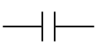 | 커패시터 (Capacitor) | `capacitor.svg` |
| 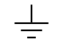 | 접지 (Ground) | `ground.svg` |
| 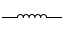 | 인덕터 (Inductor) | `inductor.svg` |
| 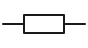 | 저항 (Resistor) | `resistor.svg` |
| 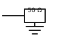 | 50 Ω 종단기 (50 Ω Termination) | `termination_50.svg` |
| 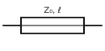 | 전송선로 (Transmission Line) | `transmission_line.svg` |

## 신호원

| 심볼 | 이름 | 파일 |
|---|---|---|
| 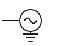 | 교류 신호원 (AC Source) | `ac_source.svg` |

## 능동 소자

| 심볼 | 이름 | 파일 |
|---|---|---|
| 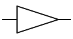 | 증폭기 (Amplifier) | `amplifier.svg` |
| 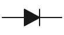 | 다이오드 (Diode) | `diode.svg` |
| 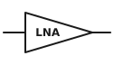 | 저잡음 증폭기 (Low Noise Amplifier, LNA) | `lna.svg` |
| 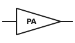 | 전력 증폭기 (Power Amplifier, PA) | `pa.svg` |
| 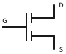 | 전계효과 트랜지스터 (FET) | `transistor_fet.svg` |

## RF 블록

| 심볼 | 이름 | 파일 |
|---|---|---|
| 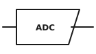 | 아날로그-디지털 변환기 (ADC) | `adc.svg` |
| 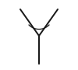 | 안테나 (Antenna) | `antenna.svg` |
| 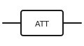 | 감쇠기 (Attenuator) | `attenuator.svg` |
| 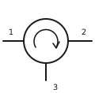 | 서큘레이터 (Circulator) | `circulator.svg` |
| 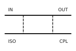 | 방향성 결합기 (Directional Coupler) | `coupler.svg` |
| 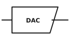 | 디지털-아날로그 변환기 (DAC) | `dac.svg` |
| 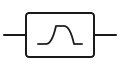 | 대역 통과 필터 (Band Pass Filter, BPF) | `filter_bpf.svg` |
| 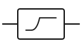 | 고역 통과 필터 (High Pass Filter, HPF) | `filter_hpf.svg` |
| 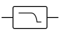 | 저역 통과 필터 (Low Pass Filter, LPF) | `filter_lpf.svg` |
| 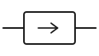 | 아이솔레이터 (Isolator) | `isolator.svg` |
| 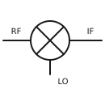 | 믹서 (Mixer) | `mixer.svg` |
| 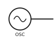 | 발진기 (Oscillator) | `oscillator.svg` |
| 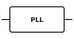 | 위상동기루프 (Phase-Locked Loop, PLL) | `pll.svg` |
| 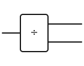 | 전력 분배기 (Power Divider) | `power_divider.svg` |
| 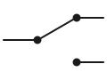 | 단극쌍투 스위치 (SPDT Switch) | `switch_spdt.svg` |

## 계측 장비

| 심볼 | 이름 | 파일 |
|---|---|---|
| 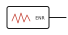 | 잡음원 (Noise Source) | `noise_source.svg` |
| 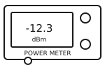 | 전력계 (Power Meter) | `power_meter.svg` |
| 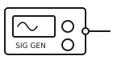 | 신호 발생기 (Signal Generator) | `signal_generator.svg` |
| 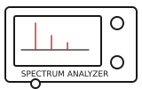 | 스펙트럼 분석기 (Spectrum Analyzer, SA) | `spectrum_analyzer.svg` |
| 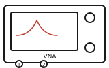 | 벡터 회로망 분석기 (VNA) | `vna.svg` |

## 기타

| 심볼 | 이름 | 파일 |
|---|---|---|
| 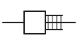 | SMA 커넥터 (SMA Connector) | `connector_sma.svg` |
| 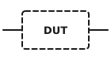 | 피시험 소자 (Device Under Test, DUT) | `dut.svg` |
